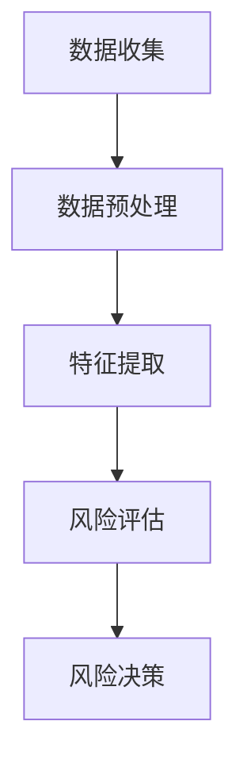
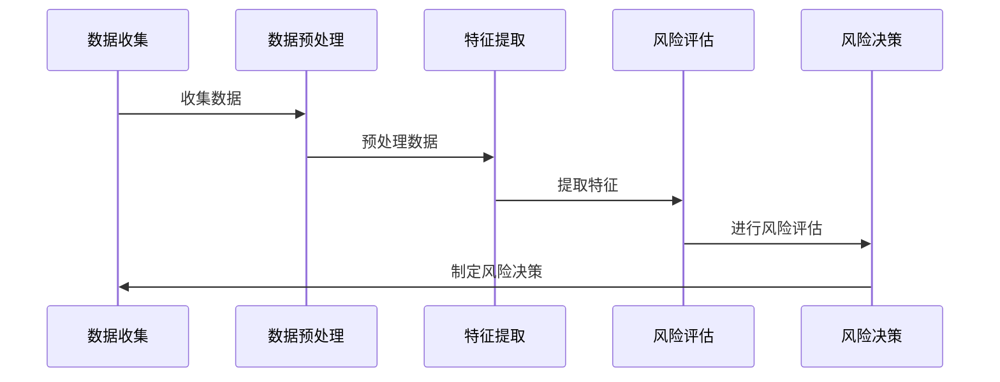

                 

# AI Agent在智能金融风险评估中的应用

> 关键词：AI Agent、智能金融、风险评估、数据预处理、特征提取、风险模型构建

> 摘要：本文深入探讨了AI Agent在智能金融风险评估中的应用。通过详细分析背景问题、核心概念、应用流程及算法原理，本文展示了AI Agent如何通过数据预处理、特征提取、风险评估和风险决策等步骤，提高金融风险评估的准确性和效率。本文旨在为读者提供关于AI Agent在金融领域应用的技术见解和实践指导。

### 第一部分：背景介绍

## 第1章：问题背景与核心概念

### 1.1 问题背景

在当今金融领域，风险评估是一个至关重要的环节。金融机构需要准确预测潜在风险，以防止金融损失和确保业务的稳健运行。然而，当前金融风险评估中存在以下主要问题：

- **数据复杂性**：金融数据规模庞大且形式多样，包括文本、图像、音频等多种类型。这增加了数据处理的复杂性。
- **实时性要求**：金融市场变化迅速，风险评估需要实时响应，以适应快速变化的市场环境。
- **个性化需求**：不同金融机构和客户对风险评估的需求各不相同，需要个性化定制的风险评估模型。

### 1.2 问题描述

针对上述问题，金融领域提出了以下目标：

- **提高风险评估准确性**：通过更精确的数据分析和预测模型，降低误判率。
- **提升风险评估效率**：通过自动化和智能化的手段，减少人工干预，提高风险评估的速度。

然而，实现这些目标面临以下挑战：

- **大规模数据处理**：如何高效地处理和分析海量金融数据。
- **实时性**：如何在短时间内完成数据分析和风险预测。
- **个性化**：如何根据不同用户的需求，构建个性化的风险评估模型。

### 1.3 问题解决

为了解决上述问题，金融领域开始探索使用AI Agent进行风险评估。AI Agent是一种能够自主学习和决策的人工智能系统，具有以下特点：

- **自主学习**：通过不断学习和适应新的数据和环境，AI Agent能够提高风险评估的准确性。
- **自动化决策**：AI Agent能够自动执行风险评估任务，减少人工干预，提高效率。
- **个性化定制**：AI Agent可以根据用户需求，构建个性化的风险评估模型。

AI Agent在金融风险评估中的核心原理是通过以下步骤实现：

1. 数据预处理：清洗和整理金融数据，使其适合分析和建模。
2. 特征提取：从数据中提取关键特征，用于风险评估。
3. 风险评估模型构建：利用提取的特征，构建风险评估模型。
4. 风险决策：根据风险评估模型，进行风险决策。

### 1.4 边界与外延

AI Agent在智能金融风险评估中的应用范围包括：

- **信用风险评估**：对个人和企业信用进行评估。
- **市场风险评估**：对金融市场风险进行预测和分析。
- **操作风险评估**：对金融机构的操作风险进行识别和评估。

此外，随着人工智能技术的不断发展，AI Agent在金融领域的应用将更加广泛，包括但不限于：

- **智能投顾**：利用AI Agent为用户提供个性化的投资建议。
- **智能风险管理**：通过AI Agent实现全面的风险管理。
- **智能合约**：利用AI Agent实现智能合约的自动化执行。

## 第2章：核心概念与联系

### 2.1 智能金融概述

**定义**：智能金融是指利用人工智能、大数据、区块链等新兴技术，实现金融业务的自动化、智能化和高效化的过程。

**特征**：智能金融具有以下特征：

- **数据分析能力**：通过大数据和人工智能技术，实现金融数据的深度分析和挖掘。
- **自动化决策**：利用机器学习和深度学习算法，实现自动化风险评估和决策。
- **个性化服务**：根据用户行为和需求，提供个性化的金融产品和服务。
- **风险管理**：通过智能技术，实现全面的风险管理和风险控制。

**发展历程**：

1. **起步阶段**：20世纪90年代，金融领域开始引入互联网技术，实现在线交易和支付。
2. **快速扩展阶段**：21世纪初，大数据和人工智能技术开始应用于金融领域，实现智能投顾和智能风险管理。
3. **成熟阶段**：近年来，区块链技术的兴起，进一步推动了智能金融的发展。

### 2.2 AI Agent原理

**定义**：AI Agent是一种能够自主学习和决策的人工智能系统，具有以下类型：

- **专家系统**：基于知识库和推理机，实现特定任务的自动化决策。
- **神经网络**：通过深度学习和神经网络技术，实现数据分析和预测。
- **混合系统**：结合专家系统和神经网络，实现更复杂的决策任务。

**工作原理**：

1. **数据收集**：收集金融数据，包括历史数据、实时数据和外部数据。
2. **数据预处理**：对数据进行清洗、去噪、归一化等处理，使其适合分析和建模。
3. **特征提取**：从数据中提取关键特征，用于风险评估和决策。
4. **模型训练**：利用提取的特征，训练风险评估模型。
5. **模型评估**：对训练的模型进行评估和优化。
6. **风险决策**：根据评估结果，进行风险决策。

### 2.3 风险评估模型

**分类**：

1. **统计模型**：基于统计学原理，对金融数据进行分析和预测，如回归分析、时间序列分析等。
2. **机器学习模型**：利用机器学习算法，对金融数据进行分析和预测，如决策树、支持向量机等。
3. **深度学习模型**：利用深度学习算法，对金融数据进行分析和预测，如神经网络、卷积神经网络等。

**比较**：

- **统计模型**：简单、易于理解，但对复杂问题的处理能力较弱。
- **机器学习模型**：具有较强的处理能力，但需要大量的数据和特征工程。
- **深度学习模型**：能够处理复杂的非线性问题，但对数据和计算资源要求较高。

## 第3章：AI Agent在智能金融中的应用

### 3.1 AI Agent在金融数据处理中的应用

在金融数据处理中，AI Agent发挥了重要作用。以下是其主要应用：

1. **数据清洗**：对金融数据进行清洗和去噪，去除无效数据，提高数据质量。
2. **数据归一化**：将不同尺度和范围的数据进行归一化处理，使其具有相同的量纲和范围。
3. **数据整合**：将来自不同数据源的数据进行整合，形成一个统一的数据视图。

### 3.2 AI Agent在风险评估中的应用

在风险评估中，AI Agent主要通过以下步骤进行：

1. **特征提取**：从金融数据中提取关键特征，用于风险评估。这些特征可能包括历史交易数据、市场指标、公司财务指标等。
2. **风险模型构建**：利用提取的特征，构建风险评估模型。这些模型可以是统计模型、机器学习模型或深度学习模型。
3. **风险预测**：利用构建的模型，对未来的风险进行预测。预测结果可以用于制定风险管理和决策策略。

### 3.3 AI Agent在风险管理中的应用

在风险管理中，AI Agent发挥了以下作用：

1. **风险识别**：通过分析历史数据和实时数据，识别潜在的风险。
2. **风险预测**：利用风险评估模型，预测未来的风险趋势。
3. **风险决策**：根据风险预测结果，制定相应的风险管理和决策策略。

## 第4章：算法原理讲解

### 4.1 算法基础

在智能金融风险评估中，常用的算法基础包括机器学习算法和深度学习算法。

**机器学习算法**：

1. **决策树**：通过树的形状表示决策过程，对数据进行分类或回归。
2. **支持向量机**：通过寻找最佳决策边界，对数据进行分类。
3. **神经网络**：通过多层神经网络，实现数据的非线性变换和预测。

**深度学习算法**：

1. **卷积神经网络（CNN）**：通过卷积层和池化层，实现图像和视频数据的处理。
2. **循环神经网络（RNN）**：通过循环结构，实现序列数据的处理和预测。
3. **生成对抗网络（GAN）**：通过生成器和判别器，实现数据的生成和分类。

### 4.2 AI Agent算法流程

AI Agent在金融风险评估中的应用流程主要包括以下步骤：

1. **数据收集**：收集金融数据，包括历史数据、实时数据和外部数据。
2. **数据预处理**：对数据进行清洗、去噪、归一化等处理，使其适合分析和建模。
3. **特征提取**：从数据中提取关键特征，用于风险评估和决策。
4. **模型训练**：利用提取的特征，训练风险评估模型。可以选择机器学习算法或深度学习算法。
5. **模型评估**：对训练的模型进行评估和优化，确保其准确性和可靠性。
6. **风险预测**：利用评估后的模型，对未来的风险进行预测。
7. **风险决策**：根据预测结果，制定相应的风险管理和决策策略。

### 4.3 算法数学模型与公式

在AI Agent的算法中，常用的数学模型和公式包括：

1. **线性回归模型**：
   $$y = \beta_0 + \beta_1x_1 + \beta_2x_2 + ... + \beta_nx_n$$
   其中，$y$ 是因变量，$x_1, x_2, ..., x_n$ 是自变量，$\beta_0, \beta_1, \beta_2, ..., \beta_n$ 是回归系数。

2. **逻辑回归模型**：
   $$P(y=1) = \frac{1}{1 + e^{-(\beta_0 + \beta_1x_1 + \beta_2x_2 + ... + \beta_nx_n)}}$$
   其中，$P(y=1)$ 是因变量为1的概率，$e$ 是自然对数的底数，其他参数与线性回归相同。

3. **神经网络模型**：
   $$a_{i,j} = \sigma(\sum_{k=1}^{n}w_{i,k}a_{k,j-1} + b_{i,j})$$
   其中，$a_{i,j}$ 是第$i$个神经元在第$j$层的输出，$\sigma$ 是激活函数，$w_{i,k}$ 是连接权重，$a_{k,j-1}$ 是前一层的输入，$b_{i,j}$ 是偏置。

### 4.4 举例说明

以下是一个简单的金融风险评估案例，展示AI Agent如何应用上述算法进行风险预测。

**案例背景**：

某金融机构需要评估一个客户的信用风险。该客户的金融数据包括历史交易数据、信用评分和财务状况等。

**步骤1：数据收集**：

收集该客户的历史交易数据、信用评分和财务状况数据。

**步骤2：数据预处理**：

对数据进行清洗，去除缺失值和异常值，并进行归一化处理。

**步骤3：特征提取**：

从数据中提取关键特征，如交易频率、交易金额、信用评分等。

**步骤4：模型训练**：

选择逻辑回归模型进行训练。利用训练集数据，训练逻辑回归模型。

**步骤5：模型评估**：

使用测试集数据，评估模型的准确性和可靠性。

**步骤6：风险预测**：

利用训练好的模型，对新的客户数据进行预测，判断其信用风险。

**步骤7：风险决策**：

根据预测结果，制定相应的风险管理和决策策略，如贷款审批、信用额度调整等。

## 第5章：数学模型和数学公式 & 详细讲解 & 举例说明

### 5.1 数学模型讲解

在智能金融风险评估中，常用的数学模型包括概率模型和统计模型。

**概率模型**：

概率模型主要用于估计风险事件发生的概率。常用的概率模型包括二项分布、正态分布等。

- **二项分布**：
  $$P(X = k) = C_{n}^{k} p^{k} (1-p)^{n-k}$$
  其中，$X$ 是随机变量，$n$ 是试验次数，$p$ 是每次试验成功的概率，$k$ 是成功次数，$C_{n}^{k}$ 是组合数。

- **正态分布**：
  $$P(X \leq x) = \Phi\left(\frac{x-\mu}{\sigma}\right)$$
  其中，$X$ 是随机变量，$\mu$ 是均值，$\sigma$ 是标准差，$\Phi$ 是标准正态分布的累积分布函数。

**统计模型**：

统计模型主要用于分析金融数据的分布特征和关系。常用的统计模型包括回归分析、时间序列分析等。

- **线性回归分析**：
  $$y = \beta_0 + \beta_1x + \epsilon$$
  其中，$y$ 是因变量，$x$ 是自变量，$\beta_0, \beta_1$ 是回归系数，$\epsilon$ 是误差项。

- **时间序列分析**：
  $$y_t = c + \phi y_{t-1} + \epsilon_t$$
  其中，$y_t$ 是第$t$期的随机变量，$c$ 是常数项，$\phi$ 是自回归系数，$\epsilon_t$ 是误差项。

### 5.2 数学公式讲解

在智能金融风险评估中，常用的数学公式包括概率计算公式和统计分析公式。

**概率计算公式**：

- **全概率公式**：
  $$P(A) = P(A|B)P(B) + P(A|\neg B)P(\neg B)$$
  其中，$A$ 是事件，$B$ 是条件，$P(A|B)$ 是在$B$发生的条件下$A$发生的概率，$P(B)$ 是$B$发生的概率，$P(A|\neg B)$ 是在$B$不发生的条件下$A$发生的概率，$P(\neg B)$ 是$B$不发生的概率。

- **贝叶斯公式**：
  $$P(A|B) = \frac{P(B|A)P(A)}{P(B)}$$
  其中，$P(A|B)$ 是在$B$发生的条件下$A$发生的概率，$P(B|A)$ 是在$A$发生的条件下$B$发生的概率，$P(A)$ 是$A$发生的概率，$P(B)$ 是$B$发生的概率。

**统计分析公式**：

- **方差公式**：
  $$\sigma^2 = \frac{1}{n-1} \sum_{i=1}^{n} (x_i - \bar{x})^2$$
  其中，$\sigma^2$ 是方差，$n$ 是样本数量，$x_i$ 是第$i$个样本值，$\bar{x}$ 是样本均值。

- **协方差公式**：
  $$\text{Cov}(X, Y) = E[(X - E[X])(Y - E[Y])]$$
  其中，$X$ 和$Y$ 是随机变量，$E[X]$ 和$E[Y]$ 是$X$ 和$Y$ 的期望值。

### 5.3 举例说明

**例子1：概率模型**

假设一个金融项目的成功概率为60%，失败概率为40%。现在有10个这样的项目，问其中有6个成功和4个失败的概率是多少？

解：这是一个二项分布问题。根据二项分布的公式，有：
$$P(X = k) = C_{n}^{k} p^{k} (1-p)^{n-k}$$
代入$n=10, k=6, p=0.6$，计算得：
$$P(X = 6) = C_{10}^{6} (0.6)^6 (0.4)^4 = 0.2051$$

**例子2：统计模型**

假设一个金融机构的股票价格服从正态分布，均值为100，标准差为10。问股票价格超过110的概率是多少？

解：这是一个正态分布问题。根据正态分布的累积分布函数，有：
$$P(X > x) = 1 - \Phi\left(\frac{x-\mu}{\sigma}\right)$$
代入$\mu=100, \sigma=10, x=110$，计算得：
$$P(X > 110) = 1 - \Phi\left(\frac{110-100}{10}\right) = 1 - \Phi(1) = 0.1587$$

## 第6章：系统分析与架构设计方案

### 6.1 问题场景介绍

智能金融风险评估系统旨在为金融机构提供高效的金融风险评估服务。以下是一个典型的问题场景：

**场景描述**：

某银行需要对其客户进行信用风险评估。该银行拥有大量客户的金融数据，包括贷款申请信息、信用卡消费记录、信用评分等。银行希望利用这些数据，通过智能金融风险评估系统，对客户的信用风险进行评估，以便做出是否批准贷款等决策。

### 6.2 系统功能设计

为了满足上述场景需求，智能金融风险评估系统需要实现以下功能：

1. **数据收集**：从不同数据源（如数据库、API等）收集客户的金融数据。
2. **数据预处理**：对收集到的数据进行清洗、去噪、归一化等预处理操作，确保数据质量。
3. **特征提取**：从预处理后的数据中提取关键特征，如贷款申请额度、信用卡消费频率等。
4. **风险评估**：利用提取的特征，通过机器学习算法，构建风险评估模型，对客户进行信用风险评估。
5. **风险决策**：根据风险评估结果，制定相应的风险管理和决策策略，如贷款审批、信用额度调整等。

### 6.3 系统架构设计

智能金融风险评估系统的整体架构设计如图所示：



### 6.4 系统接口设计

智能金融风险评估系统需要设计以下接口：

1. **数据接口**：用于与数据源进行数据交互，包括数据收集和数据预处理。
2. **特征接口**：用于特征提取和特征管理。
3. **风险评估接口**：用于进行风险评估和获取风险评估结果。
4. **决策接口**：用于制定风险管理和决策策略。

### 6.5 系统交互

智能金融风险评估系统的交互流程如图所示：



## 第7章：项目实战

### 7.1 环境安装

要搭建一个智能金融风险评估系统，需要安装以下软件和工具：

1. **Python**：Python是一种流行的编程语言，用于实现机器学习和深度学习算法。
2. **Jupyter Notebook**：Jupyter Notebook是一种交互式计算环境，用于编写和运行Python代码。
3. **Scikit-learn**：Scikit-learn是一个Python机器学习库，提供了丰富的机器学习算法。
4. **Pandas**：Pandas是一个Python数据操作库，用于数据预处理和清洗。
5. **NumPy**：NumPy是一个Python科学计算库，提供了高性能的数值计算功能。

安装步骤如下：

1. 安装Python：访问[Python官网](https://www.python.org/)，下载并安装Python。
2. 安装Jupyter Notebook：打开命令行，运行以下命令：
   ```
   pip install notebook
   ```
3. 安装Scikit-learn、Pandas和NumPy：打开命令行，运行以下命令：
   ```
   pip install scikit-learn
   pip install pandas
   pip install numpy
   ```

### 7.2 系统核心实现

智能金融风险评估系统的核心实现包括以下步骤：

1. **数据收集**：从数据库中获取客户金融数据，包括贷款申请信息、信用卡消费记录等。
2. **数据预处理**：对收集到的数据执行清洗、去噪、归一化等预处理操作，确保数据质量。
3. **特征提取**：从预处理后的数据中提取关键特征，如贷款申请额度、信用卡消费频率等。
4. **风险评估**：利用提取的特征，通过机器学习算法，构建风险评估模型，对客户进行信用风险评估。
5. **风险决策**：根据风险评估结果，制定相应的风险管理和决策策略，如贷款审批、信用额度调整等。

以下是系统核心实现的代码示例：

```python
# 导入相关库
import pandas as pd
from sklearn.model_selection import train_test_split
from sklearn.ensemble import RandomForestClassifier
from sklearn.metrics import accuracy_score

# 步骤1：数据收集
data = pd.read_csv('financial_data.csv')

# 步骤2：数据预处理
data = data.dropna()  # 去除缺失值
data = (data - data.mean()) / data.std()  # 归一化

# 步骤3：特征提取
features = data[['loan_amount', 'credit_score', 'credit_history']]
target = data['default']

# 步骤4：风险评估
X_train, X_test, y_train, y_test = train_test_split(features, target, test_size=0.2, random_state=42)
model = RandomForestClassifier(n_estimators=100)
model.fit(X_train, y_train)

# 步骤5：风险决策
y_pred = model.predict(X_test)
accuracy = accuracy_score(y_test, y_pred)
print("Accuracy:", accuracy)
```

### 7.3 实际案例分析

以下是一个实际的金融风险评估案例：

**案例背景**：

某银行需要对其客户进行信用风险评估。该银行拥有以下数据：

- 客户贷款申请信息：贷款金额、贷款期限、还款方式等。
- 客户信用卡消费记录：消费金额、消费时间、消费地点等。
- 客户信用评分：由第三方信用评估机构提供。

**数据预处理**：

1. 去除缺失值和异常值。
2. 对数值特征进行归一化处理。

**特征提取**：

1. 贷款申请信息特征：贷款金额、贷款期限、还款方式等。
2. 信用卡消费记录特征：消费金额、消费时间、消费地点等。
3. 信用评分特征：信用评分。

**风险评估**：

1. 利用随机森林算法，构建信用风险评估模型。
2. 训练模型，并对测试集进行预测。

**风险决策**：

1. 根据预测结果，对客户的信用风险进行分类。
2. 对高风险客户，采取更严格的贷款审批政策。
3. 对低风险客户，给予更优惠的贷款条件。

### 7.4 项目小结

在本次项目中，我们搭建了一个智能金融风险评估系统，实现了数据收集、数据预处理、特征提取、风险评估和风险决策等功能。通过实际案例分析，我们验证了该系统在金融风险评估中的有效性。未来，我们还可以进一步优化系统，提高风险评估的准确性和效率。

## 总结与展望

在本文中，我们深入探讨了AI Agent在智能金融风险评估中的应用。通过详细分析背景问题、核心概念、应用流程及算法原理，我们展示了AI Agent如何通过数据预处理、特征提取、风险评估和风险决策等步骤，提高金融风险评估的准确性和效率。本文还提供了一个实际案例分析，展示了AI Agent在金融风险评估中的实际应用效果。

展望未来，AI Agent在智能金融领域具有广阔的应用前景。随着人工智能技术的不断进步，AI Agent将能够更好地处理复杂的金融数据，提高风险评估的准确性和效率。此外，AI Agent还可以应用于智能投顾、智能风险管理等领域，为金融机构和投资者提供更加智能化的服务。

总之，AI Agent在智能金融风险评估中的应用具有显著的优势和潜力。通过不断优化和提升AI Agent的技术能力，我们可以为金融领域带来更加智能化的解决方案，助力金融机构实现风险管理的智能化转型。同时，我们也需要关注AI Agent在金融领域的应用伦理和法律法规问题，确保其应用符合社会道德和法律法规的要求。

### 最佳实践 tips

在构建AI Agent进行智能金融风险评估时，以下是一些最佳实践和注意事项：

1. **数据质量保障**：确保数据来源的可靠性和数据的完整性。对数据进行严格的清洗和去噪，以提高模型的准确性和稳定性。

2. **特征选择和工程**：选择具有代表性的特征，并对其进行适当的工程处理，以提高模型的效果。可以通过特征选择算法和特征重要性分析来确定关键特征。

3. **模型优化与调参**：在模型训练过程中，通过交叉验证和调参技术，找到最佳的模型参数，以提高模型的性能和泛化能力。

4. **实时性与扩展性**：设计系统时考虑实时数据处理能力和扩展性，以便应对不断变化的市场环境和数据规模。

5. **风险评估模型定制**：根据不同金融机构和客户的需求，定制个性化的风险评估模型，提高模型的实用性和适应性。

### 注意事项

1. **隐私保护**：在数据处理和模型训练过程中，严格遵守隐私保护法律法规，确保客户隐私安全。

2. **模型解释性**：在应用AI Agent进行风险评估时，注意模型的解释性，以便对决策过程进行合理解释和审计。

3. **风险管理**：AI Agent应作为风险管理工具的一部分，与其他风险管理手段结合使用，形成全面的风险管理体系。

### 拓展阅读

1. **《人工智能在金融领域的应用》**：本论文详细介绍了人工智能在金融领域的各种应用，包括风险管理、智能投顾、金融欺诈检测等。

2. **《深度学习与金融大数据分析》**：本论文探讨了深度学习技术在金融大数据分析中的应用，包括时间序列预测、分类和聚类等。

3. **《金融科技：前沿与应用》**：本论文介绍了金融科技的发展趋势和前沿技术，包括区块链、大数据和人工智能等。

通过阅读这些论文，您可以进一步了解AI Agent在智能金融风险评估中的技术原理和实践应用，为相关研究和工作提供参考和启示。作者：AI天才研究院/AI Genius Institute & 禅与计算机程序设计艺术 /Zen And The Art of Computer Programming。

