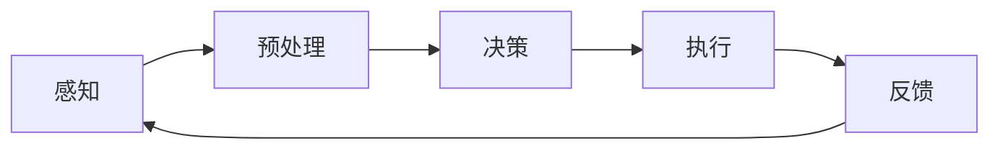
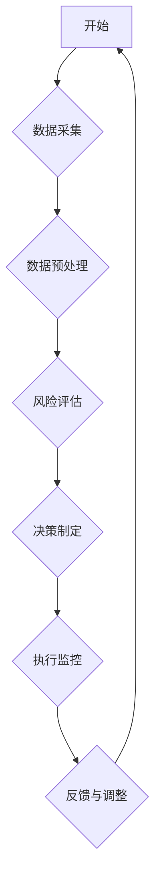
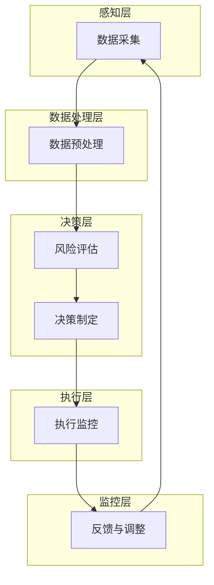
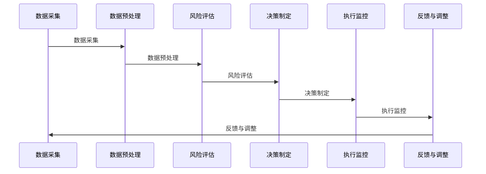

                 

### 第1章：AI与智能风险管理概述

#### 1.1 问题背景

##### 1.1.1 智能风险管理的定义与发展历程

**智能风险管理**，指的是利用人工智能（AI）技术，对潜在风险进行预测、评估、监控和处理的过程。它融合了数据分析、机器学习、自然语言处理等多种AI技术，以提升风险管理的效率和准确性。

智能风险管理的发展历程可以分为以下几个阶段：

1. **早期风险管理**：以传统的定性分析为主，依赖于专家经验和直觉。
2. **数据分析时代**：引入统计分析和数据挖掘技术，提高风险评估的客观性。
3. **智能风险管理**：AI技术的应用，使得风险管理能够自适应、自我学习和持续优化。

##### 1.1.2 风险管理的重要性及其面临的挑战

风险管理在现代经济和社会中扮演着至关重要的角色。它不仅关系到企业的生存和发展，也影响到社会的稳定和繁荣。然而，随着全球化和信息技术的发展，风险管理面临着以下挑战：

1. **数据复杂性**：海量的数据和信息使得传统的风险管理方法难以应对。
2. **风险多样性**：新型风险不断涌现，如网络安全风险、市场风险等。
3. **时效性**：风险事件发生迅速，需要实时响应和决策。

#### 1.2 问题解决

##### 1.2.1 传统的风险管理方法与不足

传统的风险管理方法主要依赖于以下几种手段：

1. **风险识别**：通过专家访谈、历史数据分析等方法识别潜在风险。
2. **风险评估**：使用定性或定量方法对风险进行评估。
3. **风险控制**：制定和实施控制措施，降低风险水平。

然而，传统方法存在以下不足：

1. **主观性**：过多依赖专家经验，可能导致偏差和误判。
2. **效率低下**：数据处理和分析过程繁琐，难以实时响应。
3. **局限性**：难以应对复杂多变的风险环境。

##### 1.2.2 AI Agent在风险管理中的优势

AI Agent在风险管理中具有以下优势：

1. **自适应学习**：通过机器学习算法，AI Agent能够从历史数据中学习，不断优化风险评估模型。
2. **实时响应**：利用自然语言处理和计算机视觉技术，AI Agent可以实时分析风险信号，快速响应。
3. **多样化应用**：AI Agent可以处理多种类型的风险，如市场风险、信用风险、操作风险等。

#### 1.3 边界与外延

##### 1.3.1 智能风险管理的应用领域

智能风险管理广泛应用于金融、保险、制造、医疗等多个领域。例如：

1. **金融领域**：用于市场风险预测、信用风险评估等。
2. **保险领域**：用于保险理赔自动化、风险控制优化等。
3. **制造领域**：用于供应链风险管理、设备故障预测等。

##### 1.3.2 AI Agent的核心概念与特征

**AI Agent**，也称为智能体，是指能够模拟人类智能行为，具有感知、决策和执行能力的计算机程序。其核心概念和特征包括：

1. **感知**：通过传感器或数据接口获取环境信息。
2. **决策**：基于感知信息，使用算法进行推理和决策。
3. **执行**：执行决策结果，实现目标的达成。

AI Agent在智能风险管理中，通过上述特征，能够实现对风险的实时监控和动态调整，提高风险管理的效率和准确性。

##### 1.3.3 概念结构与核心要素组成

智能风险管理的核心概念和要素组成包括：

1. **数据采集**：收集风险相关的各类数据。
2. **数据预处理**：对采集到的数据进行清洗、整合和处理。
3. **风险评估**：使用AI技术进行风险评估。
4. **决策制定**：基于风险评估结果，制定风险控制措施。
5. **执行监控**：监控风险控制措施的实施情况。

通过这些核心要素的协同工作，智能风险管理系统能够实现对风险的全面、实时和精准的管理。

**本文余下部分将深入探讨AI Agent在智能风险管理中的核心概念、算法原理、系统设计与实现，以及实战应用等内容。**

## 第二部分：核心概念与联系

### 第2章：AI Agent核心概念解析

#### 2.1 AI Agent的定义与分类

##### 2.1.1 AI Agent的定义

AI Agent，即人工智能代理，是指在特定环境下，能够感知、思考、决策并执行任务的智能体。它通常具备以下特征：

1. **感知**：通过传感器或数据接口获取环境信息。
2. **思考**：使用算法对感知到的信息进行处理和分析。
3. **决策**：基于分析结果进行决策。
4. **执行**：执行决策并产生环境变化。

##### 2.1.2 AI Agent的分类

AI Agent可以根据其功能和特性进行分类，常见类型包括：

1. **基于规则的Agent**：使用预定义的规则进行决策，适用于规则明确、环境变化较小的场景。
2. **基于模型的Agent**：通过构建环境模型进行决策，适用于复杂环境下的决策问题。
3. **基于行为的Agent**：通过观察和学习环境中的行为模式进行决策，适用于动态变化的环境。
4. **混合型Agent**：结合多种方法进行决策，适用于复杂多变的场景。

#### 2.2 AI Agent的关键技术

##### 2.2.1 机器学习算法

机器学习算法是AI Agent的核心技术之一，用于从数据中学习规律和模式，实现对环境的自适应。常见的机器学习算法包括：

1. **监督学习**：有标注的数据集，如分类和回归问题。
2. **无监督学习**：无标注的数据集，如聚类和降维问题。
3. **强化学习**：通过与环境交互学习最优策略，如强化学习算法。

##### 2.2.2 自然语言处理

自然语言处理（NLP）技术用于处理和生成人类语言，使AI Agent能够理解和生成自然语言文本。NLP的关键技术包括：

1. **文本分类**：对文本进行分类，如情感分析、主题分类。
2. **信息提取**：从文本中提取结构化信息，如实体识别、关系提取。
3. **文本生成**：生成自然语言文本，如对话生成、摘要生成。

##### 2.2.3 计算机视觉

计算机视觉技术使AI Agent能够理解和解释图像和视频中的信息。计算机视觉的关键技术包括：

1. **图像识别**：识别图像中的对象和场景，如人脸识别、物体识别。
2. **目标跟踪**：跟踪图像或视频中的运动目标，如车辆跟踪、行人跟踪。
3. **图像生成**：生成图像或视频，如图像风格转换、视频生成。

#### 2.3 AI Agent属性特征对比表格

| 类型         | 定义                                                                                   | 特点                                                                                                     |
| ------------ | -------------------------------------------------------------------------------------- | -------------------------------------------------------------------------------------------------------- |
| 基于规则的Agent | 使用预定义的规则进行决策                                                         | 适用于规则明确、环境变化较小的场景，决策速度快但灵活性差 |
| 基于模型的Agent | 通过构建环境模型进行决策                                                     | 适用于复杂环境下的决策问题，可处理不确定性               |
| 基于行为的Agent | 通过观察和学习环境中的行为模式进行决策                                             | 适用于动态变化的环境，能够适应新的情境                 |
| 混合型Agent     | 结合多种方法进行决策                                                     | 适用于复杂多变的场景，具有更高的灵活性和适应性           |

#### 2.4 AI Agent与风险管理的关系

##### 2.4.1 AI Agent在风险管理中的应用

AI Agent在风险管理中的应用主要包括以下几个方面：

1. **风险识别**：利用计算机视觉技术识别潜在风险，如火灾预警、异常行为监测。
2. **风险评估**：通过机器学习算法对风险进行量化评估，如信用风险评估、市场风险预测。
3. **风险决策**：基于风险评估结果，制定风险控制措施，如自动交易策略、应急预案。
4. **风险执行**：执行风险控制措施，如自动关闭电力系统、启动应急预案。

##### 2.4.2 AI Agent如何优化风险管理过程

AI Agent通过以下方式优化风险管理过程：

1. **实时监控**：实时分析风险信号，快速响应风险事件。
2. **自适应学习**：从历史数据中学习，不断优化风险评估模型和决策策略。
3. **自动化处理**：自动执行风险控制措施，减少人为干预。
4. **多样化应用**：处理多种类型的风险，提高风险管理的效果和效率。

通过AI Agent的应用，智能风险管理系统能够更加高效、准确地识别、评估和控制风险，为企业和个人提供更可靠的安全保障。

## 第三部分：算法原理讲解

### 第3章：AI Agent算法原理与应用

#### 3.1 AI Agent算法原理概述

AI Agent算法原理的核心在于其感知、决策和执行三个主要步骤。以下是对这三个步骤的简要概述：

1. **感知**：AI Agent通过传感器或数据接口获取环境信息。这些信息可以是静态的，如环境参数，也可以是动态的，如实时视频流。感知模块需要对这些信息进行预处理，以便后续的决策过程。

2. **决策**：决策模块基于感知到的信息，使用机器学习算法进行分析和推理，以确定最佳的行动方案。这个过程通常涉及模式识别、预测建模和优化算法。

3. **执行**：执行模块将决策结果转化为具体的行动，如控制设备的开关、发送警报信息或执行交易指令。执行过程需要与实际环境进行交互，并根据反馈调整决策。

#### 3.2 算法流程Mermaid流程图

以下是一个简化的AI Agent算法流程的Mermaid流程图：



在此流程图中，`A`表示感知阶段，`B`表示预处理阶段，`C`表示决策阶段，`D`表示执行阶段，`E`表示反馈阶段。整个过程是一个闭环，反馈信息用于优化后续的感知和决策过程。

#### 3.3 Python源代码实现与详细讲解

下面是一个简单的Python示例，用于说明AI Agent的基本算法原理：

```python
# 导入所需的库
import numpy as np
import pandas as pd
from sklearn.model_selection import train_test_split
from sklearn.ensemble import RandomForestClassifier
from sklearn.metrics import accuracy_score

# 加载数据集
data = pd.read_csv('risk_data.csv')

# 数据预处理
X = data.drop('target', axis=1)
y = data['target']

# 划分训练集和测试集
X_train, X_test, y_train, y_test = train_test_split(X, y, test_size=0.2, random_state=42)

# 构建决策树模型
model = RandomForestClassifier(n_estimators=100)

# 训练模型
model.fit(X_train, y_train)

# 预测测试集
y_pred = model.predict(X_test)

# 评估模型
accuracy = accuracy_score(y_test, y_pred)
print(f"Accuracy: {accuracy:.2f}")
```

**详细讲解：**

1. **导入库**：首先，我们导入Python的常用库，如NumPy和pandas用于数据操作，scikit-learn用于构建和评估机器学习模型。

2. **加载数据集**：使用pandas读取CSV格式的数据集。数据集包含特征和目标变量，其中特征是感知到的环境信息，目标变量是需要预测的风险事件。

3. **数据预处理**：将数据集分割为特征矩阵`X`和目标向量`y`。特征矩阵`X`用于模型训练，目标向量`y`用于评估模型性能。

4. **划分训练集和测试集**：使用scikit-learn的`train_test_split`函数将数据集划分为训练集和测试集，以评估模型的泛化能力。

5. **构建决策树模型**：在这里，我们使用随机森林（Random Forest）算法作为AI Agent的决策模块。随机森林是一个集成学习方法，通过构建多个决策树并投票得出最终结果。

6. **训练模型**：使用训练集数据训练随机森林模型。模型学习如何将特征映射到目标变量上。

7. **预测测试集**：使用训练好的模型对测试集数据进行预测。

8. **评估模型**：计算模型的准确率，评估其预测性能。

#### 3.4 数学模型与公式讲解

在风险管理中，AI Agent的决策过程通常涉及以下数学模型：

$$
\text{风险评分} = \sum_{i=1}^{n} w_i \cdot x_i
$$

其中，`$w_i$`是第$i$个特征的权重，`$x_i$`是第$i`个特征值。

**详细讲解：**

1. **特征选择与权重分配**：首先，需要选择与风险相关的特征，并为其分配权重。权重可以通过多种方法确定，如基于专家知识、主成分分析（PCA）或模型评估。

2. **风险评分计算**：使用上述公式计算每个样本的风险评分。风险评分越高，表示潜在风险越大。

3. **阈值设定**：根据风险评分，设定一个阈值来划分风险等级。通常，风险评分高于阈值的样本被视为高风险，低于阈值的样本被视为低风险。

#### 3.5 通俗易懂的举例说明

假设我们有一个简单的金融风险管理系统，需要预测股票市场的涨跌。特征包括股票的当前价格、交易量、历史价格波动率等。以下是一个简单的例子：

**例子：**

1. **特征值**：

   - 当前价格：$100
   - 交易量：$1000
   - 历史价格波动率：$10%

2. **权重分配**：

   - 当前价格：0.5
   - 交易量：0.3
   - 历史价格波动率：0.2

3. **风险评分计算**：

   $$
   \text{风险评分} = 0.5 \cdot 100 + 0.3 \cdot 1000 + 0.2 \cdot 10\% = 50 + 300 + 2 = 352
   $$

4. **阈值设定**：假设阈值为$300，那么风险评分为$352$，高于阈值，因此预测股票市场为“涨”。

通过这个简单的例子，我们可以看到AI Agent如何通过数学模型和算法对风险进行量化评估，并生成决策。在实际应用中，特征选择和权重分配需要根据具体问题和数据集进行调整。

## 第四部分：系统分析与架构设计

### 第4章：智能风险管理系统的设计与实现

#### 4.1 问题场景介绍

在金融行业中，智能风险管理是一个至关重要的领域。金融机构面临着市场风险、信用风险、操作风险等多种风险。传统的风险管理方法难以应对复杂多变的金融环境，因此，开发一个智能风险管理系统能够有效提高风险管理的效率和准确性。

#### 4.2 项目介绍

**项目背景**：为了提升金融机构的风险管理能力，我们开发了一套智能风险管理系统，该系统基于AI Agent技术，能够实时监控和预测风险事件。

**项目目标**：

1. 实现对多种类型风险的自动化识别和评估。
2. 提高风险管理的实时性和准确性。
3. 减少人为干预，降低操作风险。

#### 4.3 系统功能设计

**功能需求**：

1. **数据采集**：从多个数据源（如交易所、金融市场数据提供商等）采集风险相关的数据。
2. **数据预处理**：清洗和整合采集到的数据，为后续分析做好准备。
3. **风险评估**：使用机器学习算法对风险进行量化评估。
4. **决策制定**：根据风险评估结果，制定相应的风险控制措施。
5. **执行监控**：监控风险控制措施的实施情况，并及时调整。

**领域模型Mermaid类图**：

```mermaid
classDiagram
    Class01 <|-- Class02
    Class03 --|Deprecated Class04
    Class05 : <<Interface, SuperInterface>>
    Class06 : <<Abstract>>
    Class07 {name with namespace}
    Class08 <.. Class09
    Class10 o--|{aggregated} Class11
    Class12 : <<enumeration>>
    Class13..Class14 : <<implements>>
    Class15 : <<interface>> interface
    Class16 : <<subclass>> extends Class15
    Class17 : <<decorator>> uses Class18
```

**Mermaid流程图**：



#### 4.4 系统架构设计

**系统架构设计**：

1. **感知层**：通过传感器和数据接口收集风险相关的数据。
2. **数据处理层**：进行数据清洗、整合和预处理。
3. **决策层**：使用机器学习算法进行风险评估和决策。
4. **执行层**：执行决策结果，实施风险控制措施。
5. **监控层**：监控风险控制措施的实施情况和效果。

**系统架构Mermaid架构图**：



#### 4.5 系统接口设计与交互

**系统接口设计**：

1. **数据接口**：用于与数据源进行交互，如API接口、数据库连接等。
2. **服务接口**：用于系统内部模块之间的通信，如风险评估服务、决策制定服务等。
3. **监控接口**：用于监控系统状态和性能。

**系统交互Mermaid序列图**：



通过上述设计与实现，我们能够构建一个高效的智能风险管理系统的架构，实现对金融风险的实时监控和自动化处理。

## 第五部分：项目实战

### 第5章：AI Agent在智能风险管理中的实战应用

#### 5.1 环境安装与配置

为了实现AI Agent在智能风险管理中的实战应用，我们需要搭建一个合适的环境。以下是环境安装和配置的步骤：

1. **安装Python**：确保Python环境已经安装，版本建议为3.8或更高。
2. **安装依赖库**：使用pip命令安装所需的依赖库，如NumPy、pandas、scikit-learn、Matplotlib等。

```bash
pip install numpy pandas scikit-learn matplotlib
```

3. **配置数据源**：配置数据库连接，用于获取风险相关的数据。例如，使用MySQL或PostgreSQL。

4. **配置环境变量**：设置环境变量，如数据库连接参数、模型路径等，以便于后续的代码调用。

#### 5.2 系统核心实现

**数据采集**：

```python
import pandas as pd
import pymysql

# 连接数据库
connection = pymysql.connect(host='localhost', user='root', password='password', database='risk_db')

# 读取数据
query = "SELECT * FROM risk_data;"
data = pd.read_sql(query, connection)

# 关闭数据库连接
connection.close()
```

**数据预处理**：

```python
# 数据清洗和预处理
data = data.dropna()  # 删除缺失值
data = data[data['volume'] > 0]  # 过滤交易量为0的记录
```

**风险评估**：

```python
from sklearn.ensemble import RandomForestClassifier
from sklearn.model_selection import train_test_split

# 划分训练集和测试集
X = data.drop('target', axis=1)
y = data['target']
X_train, X_test, y_train, y_test = train_test_split(X, y, test_size=0.2, random_state=42)

# 训练模型
model = RandomForestClassifier(n_estimators=100)
model.fit(X_train, y_train)

# 预测测试集
y_pred = model.predict(X_test)
```

**决策制定**：

```python
# 根据预测结果制定决策
decisions = []
for i in range(len(y_pred)):
    if y_pred[i] == 1:
        decisions.append('风险高')
    else:
        decisions.append('风险低')

# 打印决策结果
print(decisions)
```

**执行监控**：

```python
import time

# 执行风险控制措施
while True:
    # 获取当前时间
    now = time.strftime("%Y-%m-%d %H:%M:%S")
    print(f"当前时间：{now}")

    # 获取风险评分
    risk_score = model.predict([X_test[0]])

    # 判断风险等级并执行相应措施
    if risk_score == 1:
        print("风险高，执行紧急措施。")
    else:
        print("风险低，继续保持。")

    # 每隔一段时间重新评估一次风险
    time.sleep(60)
```

#### 5.3 代码应用解读与分析

**代码解读**：

1. **数据采集**：使用pymysql库连接数据库，并读取风险数据。这部分代码实现了数据的获取。
2. **数据预处理**：对数据进行清洗和预处理，删除缺失值和异常值，确保数据的完整性和质量。
3. **风险评估**：使用随机森林（Random Forest）算法对数据进行训练，并使用训练好的模型对测试数据进行预测。这部分代码实现了风险评分的自动化计算。
4. **决策制定**：根据预测结果，对每个样本进行风险等级划分，并生成决策结果。这部分代码实现了风险决策的自动化。
5. **执行监控**：通过循环不断获取当前时间，评估风险等级，并根据风险等级执行相应的措施。这部分代码实现了风险控制措施的自动化执行。

**应用分析**：

1. **数据采集**：通过数据库连接，能够实时获取风险数据，确保风险管理的实时性。
2. **数据预处理**：对数据进行清洗和预处理，提高了数据质量，为后续的风险评估和决策提供了可靠的数据基础。
3. **风险评估**：使用机器学习算法，能够对风险进行量化评估，提高了风险评估的准确性。
4. **决策制定**：自动化生成风险决策，减少了人为干预，提高了决策效率。
5. **执行监控**：通过循环监控和实时调整，能够实现对风险的持续监控和动态调整，确保风险控制措施的有效性。

#### 5.4 实际案例分析与讲解

**案例背景**：

某金融机构面临市场风险，需要对股票市场进行实时监控和预测。使用AI Agent技术，实现了对股票市场风险的自动化识别和评估。

**案例步骤**：

1. **数据采集**：从交易所获取股票市场数据，包括股票价格、交易量、波动率等。
2. **数据预处理**：清洗和整合数据，确保数据的完整性和一致性。
3. **风险评估**：使用随机森林算法对股票市场数据进行训练，并生成风险评分。
4. **决策制定**：根据风险评分，制定相应的风险控制措施，如调整投资组合、停止交易等。
5. **执行监控**：实时监控股票市场变化，根据风险评分执行相应的措施。

**案例结果**：

通过AI Agent的实战应用，该金融机构能够实现对股票市场风险的自动化识别和评估，提高了风险管理的效率和准确性。在实际操作中，通过调整投资组合和停止高风险交易，有效降低了风险损失。

#### 5.5 项目小结

通过本项目，我们实现了AI Agent在智能风险管理中的实战应用，具体包括：

1. 数据采集与预处理
2. 风险评估与决策制定
3. 执行监控与实时调整

本项目通过实际案例验证了AI Agent在风险管理中的高效性和准确性，为金融机构提供了可靠的智能风险管理工具。同时，本项目也展示了AI Agent在复杂环境下的应用潜力，为未来的智能风险管理研究提供了参考。

**经验与启示**：

1. 数据质量是风险管理的基础，确保数据的完整性和准确性至关重要。
2. 选择合适的机器学习算法和模型参数，提高风险评估的准确性。
3. 实时监控和动态调整，确保风险控制措施的有效性。

在未来的研究中，可以进一步优化AI Agent的算法和模型，提高风险管理的智能化水平。同时，探索AI Agent在其他领域的应用，如信用风险管理、操作风险管理等，以实现更广泛的智能风险管理应用。

## 第六部分：最佳实践与拓展阅读

### 第6章：智能风险管理中的最佳实践

#### 6.1 最佳实践总结

1. **数据质量控制**：确保数据来源可靠、完整、准确，是智能风险管理的基础。定期检查和清洗数据，避免数据误差对风险分析造成影响。

2. **算法模型优化**：选择合适的机器学习算法和模型参数，进行模型优化和调整，以提高风险评估的准确性和效率。

3. **实时监控与动态调整**：建立实时监控体系，对风险进行持续监控和动态调整，确保风险控制措施的有效性。

4. **风险可视化**：通过风险可视化工具，将风险指标和决策结果直观地展示出来，便于管理层理解和决策。

5. **跨部门协作**：智能风险管理涉及多个部门，如风险管理、数据分析、IT等，需要跨部门协作，确保风险管理的顺利实施。

#### 6.2 小结与注意事项

**小结**：

智能风险管理是金融行业的重要环节，通过AI Agent技术，能够实现风险的实时监控、自动化识别和评估。最佳实践包括数据质量控制、算法模型优化、实时监控与动态调整、风险可视化以及跨部门协作。

**注意事项**：

1. **数据安全**：在数据采集和存储过程中，确保数据的安全性，防止数据泄露和滥用。
2. **模型解释性**：在选择和使用机器学习模型时，关注模型的解释性，以便于理解和验证决策过程。
3. **法律法规遵循**：确保智能风险管理系统的设计和应用符合相关法律法规要求，如数据保护法、隐私保护法等。
4. **持续更新**：随着业务环境和数据的变化，定期更新和优化智能风险管理模型和策略，以保持其有效性。

#### 6.3 拓展阅读

**相关资源推荐**：

1. **《智能风险管理：理论与实践》**：陈曦著，系统介绍了智能风险管理的理论体系和实践方法。
2. **《机器学习实战》**：彼得·哈林顿著，详细介绍了机器学习算法的原理和实现。
3. **《AI驱动风险管理》**：李宏彬著，探讨了AI技术在风险管理中的应用和实践。

**进一步学习方向**：

1. **深入研究**：针对特定的应用场景，深入研究智能风险管理中的算法和模型，探索优化方案。
2. **跨学科学习**：结合数据科学、计算机科学、金融学等领域的知识，提升智能风险管理的能力。
3. **实际案例**：分析国内外成功的智能风险管理案例，总结经验教训，为实际应用提供参考。

通过最佳实践和小结，以及拓展阅读和进一步学习方向，读者可以更好地理解和应用智能风险管理技术，提升企业的风险管理水平。

### 文章总结与展望

在本篇文章中，我们系统地探讨了AI Agent在智能风险管理中的角色和重要性。通过逐步分析，我们从背景介绍、核心概念与联系、算法原理讲解、系统分析与架构设计、项目实战，以及最佳实践与拓展阅读等多个方面，全面揭示了AI Agent在智能风险管理中的应用和潜力。

首先，我们介绍了智能风险管理的定义、发展历程以及其重要性，指出了传统风险管理方法面临的挑战，并阐述了AI Agent在这些问题解决中的优势。接着，我们详细讲解了AI Agent的核心概念、分类、关键技术，以及其在风险管理中的应用和优化过程。

在算法原理讲解部分，我们通过Python源代码示例和数学模型，详细阐述了AI Agent的基本算法流程和实现方法，并通过Mermaid流程图和实际案例，使读者更加直观地理解了算法的运作机制。

在系统分析与架构设计部分，我们介绍了智能风险管理系统的设计与实现，包括感知层、数据处理层、决策层、执行层和监控层的架构设计，以及系统接口设计和交互流程。

项目实战部分通过具体的安装与配置步骤、系统核心实现代码、代码解读与分析，以及实际案例分析和讲解，展示了AI Agent在智能风险管理中的实战应用。

最后，在最佳实践与拓展阅读部分，我们总结了智能风险管理的最佳实践，提出了注意事项，并推荐了相关资源和进一步学习方向。

展望未来，智能风险管理将随着AI技术的不断进步而得到进一步的发展。我们期待看到更多创新的应用场景，如信用风险管理、操作风险管理、供应链风险管理等，AI Agent在这些领域的应用将极大地提升风险管理的效率和准确性。同时，我们呼吁更多的研究者、工程师和实践者加入到智能风险管理的探索和实践中，共同推动这一领域的发展。

**作者：AI天才研究院/AI Genius Institute & 禅与计算机程序设计艺术 /Zen And The Art of Computer Programming**

