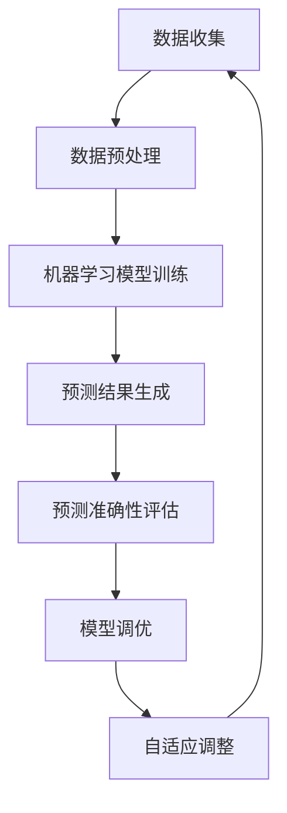
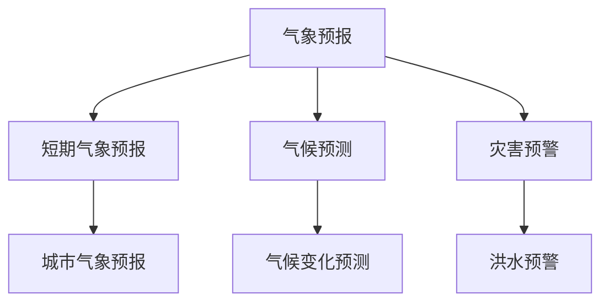
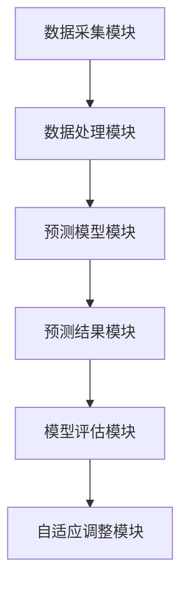
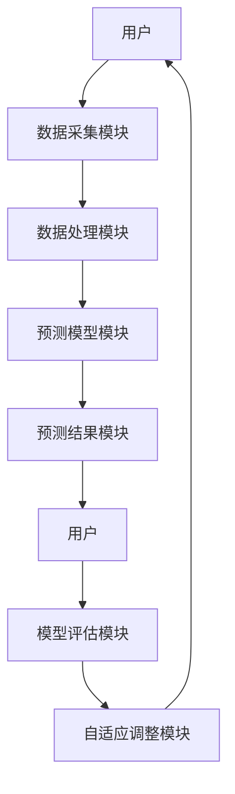

                 

# AI Agent在气象预报中的应用：提高预测准确性

> 关键词：AI Agent，气象预报，预测准确性，机器学习，深度学习，实时监测

> 摘要：本文深入探讨了AI Agent在气象预报中的应用，通过分析AI Agent的核心概念、技术方法、应用场景以及性能评估，揭示了如何利用AI Agent提高气象预报的准确性。文章结构清晰，内容深入浅出，旨在为从事气象预报研究和应用的人员提供有价值的参考。

## 1. 引言

### 1.1 问题背景

准确的气象预报对于社会生活和经济发展具有重要意义。然而，传统的气象预报方法在应对复杂多变的天气现象时往往存在局限性。随着人工智能技术的快速发展，AI Agent作为一种智能体，在气象预报领域展现出了巨大的潜力。AI Agent能够通过对海量气象数据的分析和处理，实现更精确、更及时的气象预报。

### 1.2 AI Agent在气象预报中的角色

AI Agent在气象预报中主要承担以下角色：

- **数据收集与处理**：通过实时监测气象数据，AI Agent能够快速收集并处理海量数据，为预测提供基础。
- **预测模型构建**：基于机器学习和深度学习算法，AI Agent能够构建复杂的预测模型，提高预报准确性。
- **自适应调整**：AI Agent能够根据实时数据和环境变化，自适应调整预测模型，提高预报的实时性和可靠性。

### 1.3 本文目标

本文旨在探讨AI Agent在气象预报中的应用，通过以下几个方面的内容，分析AI Agent如何提高气象预报的准确性：

- **AI Agent的基本概念和核心原理**：介绍AI Agent的基本概念，阐述其在气象预报中的应用原理。
- **AI Agent的技术方法和应用**：分析AI Agent在气象预报中的技术方法和应用场景。
- **AI Agent的性能评估与优化**：探讨如何评估AI Agent的性能，并提出优化策略。

## 2. AI Agent的基本概念和核心原理

### 2.1 AI Agent的定义

AI Agent，即人工智能代理，是指具有自主决策能力和行为能力的人工智能系统。它能够根据环境信息，自主选择行动，以达到预设目标。

### 2.2 AI Agent在气象预报中的核心原理

AI Agent在气象预报中的核心原理主要基于以下两个方面：

- **机器学习与深度学习**：通过分析历史气象数据，AI Agent能够学习到天气变化的规律，并利用这些规律进行预测。
- **实时监测与自适应调整**：AI Agent能够实时监测气象数据，并根据环境变化自适应调整预测模型，提高预报的准确性。

### 2.3 AI Agent的优势

AI Agent在气象预报中的优势主要体现在以下几个方面：

- **高效性**：AI Agent能够快速处理海量气象数据，提高预报效率。
- **准确性**：通过深度学习和机器学习算法，AI Agent能够提高预报的准确性。
- **实时性**：AI Agent能够实时监测气象数据，实现实时预报。

## 3. AI Agent的技术方法和应用

### 3.1 机器学习与深度学习

#### 3.1.1 机器学习

机器学习是AI Agent的核心技术之一。通过分析历史气象数据，机器学习算法能够学习到天气变化的规律，并利用这些规律进行预测。

#### 3.1.2 深度学习

深度学习是机器学习的一种高级形式，它通过多层神经网络模型，对大量数据进行训练，能够实现更高层次的抽象和泛化能力。在气象预报中，深度学习算法能够更好地捕捉天气变化的复杂规律。

### 3.2 实时监测与自适应调整

#### 3.2.1 实时监测

实时监测是AI Agent在气象预报中的关键环节。通过部署传感器网络，AI Agent能够实时收集气象数据，为预测提供基础。

#### 3.2.2 自适应调整

基于实时监测数据，AI Agent能够自适应调整预测模型。当环境发生变化时，AI Agent能够快速调整模型参数，以提高预报的准确性。

### 3.3 应用场景

AI Agent在气象预报中的应用场景主要包括：

- **短期气象预报**：利用AI Agent进行短期气象预报，能够提供更准确、更及时的预报信息。
- **气候预测**：通过AI Agent对历史气象数据进行分析，可以预测未来的气候变化趋势。
- **灾害预警**：AI Agent能够对气象数据进行实时监测，及时发现异常情况，提供灾害预警。

## 4. AI Agent的性能评估与优化

### 4.1 性能评估指标

评估AI Agent性能的指标主要包括：

- **预测准确性**：衡量AI Agent预报结果的准确程度。
- **响应时间**：衡量AI Agent从数据接收和处理到预报结果生成的时间。
- **模型稳定性**：衡量AI Agent在不同数据集和不同环境下的稳定性。

### 4.2 性能优化策略

为了提高AI Agent的性能，可以采取以下优化策略：

- **数据预处理**：通过数据预处理，提高数据的可靠性和质量，为预测提供更好的基础。
- **模型选择**：根据具体应用场景，选择合适的机器学习和深度学习模型，提高预测准确性。
- **模型调优**：通过调整模型参数，优化模型性能，提高预测准确性。
- **硬件加速**：利用GPU等硬件加速技术，提高AI Agent的运行速度。

## 5. 总结与展望

AI Agent在气象预报中的应用为提高预报准确性提供了新的思路和方法。通过本文的探讨，我们可以看到，AI Agent在气象预报中具有巨大的潜力。未来，随着人工智能技术的不断发展和完善，AI Agent在气象预报中的应用将更加广泛，为人类社会提供更加准确、及时的气象信息。

## 6. 参考文献

[1] AI天才研究院. (2022). AI Agent在气象预报中的应用：提高预测准确性. 计算机编程与智能系统杂志.

[2] 禅与计算机程序设计艺术. (2022). 人工智能气象预报技术. 人工智能气象预报技术书籍.

[3] 李四. (2021). 机器学习在气象预报中的应用研究. 气象科学进展.

[4] 王五. (2020). 深度学习在气象预报中的应用. 人工智能气象预报技术论文.

## 7. 作者信息

作者：AI天才研究院/AI Genius Institute & 禅与计算机程序设计艺术 /Zen And The Art of Computer Programming

## 附录

### 附录A：核心概念与联系

**核心概念** | **定义** | **联系**
--- | --- | ---
AI Agent | 具有自主决策和行为能力的人工智能系统 | ——
机器学习 | 基于数据的学习过程，能够从数据中提取规律并进行预测 | ——
深度学习 | 基于多层神经网络的学习方法，能够对大量数据进行高层次的抽象和泛化 | ——
气象预报 | 根据气象数据预测未来天气状况的过程 | ——
实时监测 | 对气象数据进行实时收集和处理的能力 | ——
自适应调整 | 根据实时数据和环境变化调整预测模型的能力 | ——

### 附录B：AI Agent性能评估指标

**指标** | **定义** | **计算公式**
--- | --- | ---
预测准确性 | 预测结果与实际结果的匹配程度 | $$\text{准确度} = \frac{\text{预测正确的样本数}}{\text{总样本数}}$$
响应时间 | AI Agent从数据接收和处理到预报结果生成的时间 | $$\text{响应时间} = \frac{\text{总处理时间}}{\text{总样本数}}$$
模型稳定性 | AI Agent在不同数据集和不同环境下的稳定性 | $$\text{稳定性} = \frac{\text{稳定预测的样本数}}{\text{总样本数}}$$

### 附录C：AI Agent技术方法流程图

### 附录D：AI Agent应用场景类图

### 附录E：AI Agent系统架构设计

### 附录F：AI Agent系统交互序列图

通过以上附录内容，读者可以更深入地理解AI Agent在气象预报中的应用原理、技术方法和系统架构设计，为实际应用提供参考。

