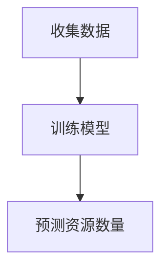
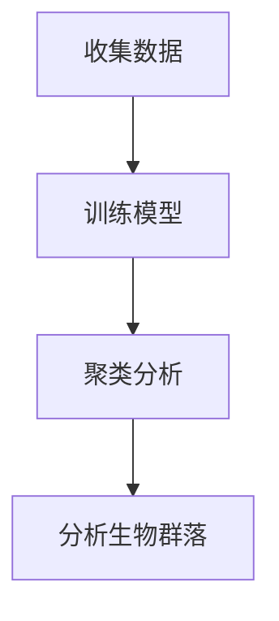
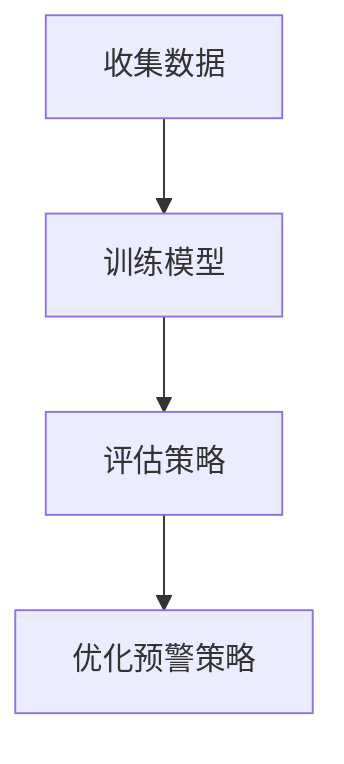
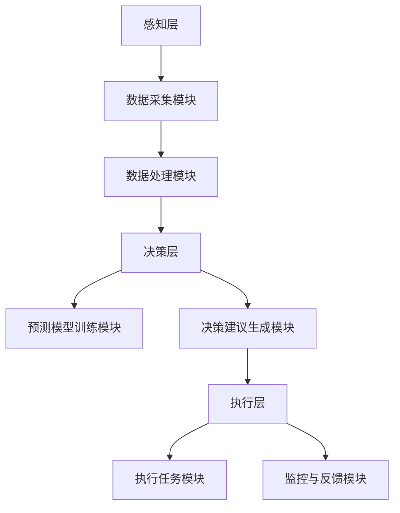
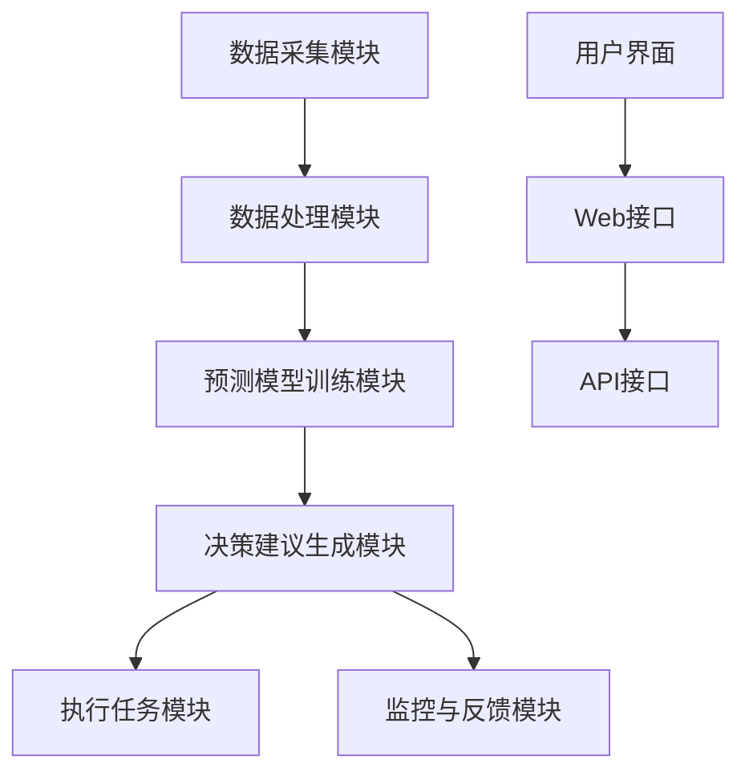
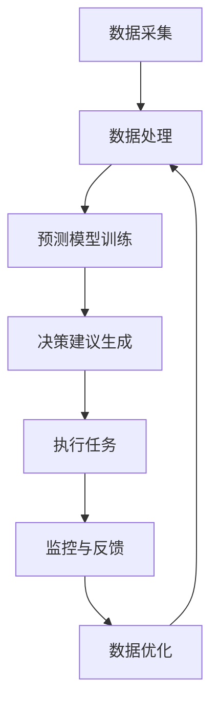

                 

### 摘要

本文深入探讨了AI Agent在海洋科学中的应用，特别是在海洋资源管理与保护领域的重要性。文章首先概述了海洋科学的基本概念、海洋资源管理的现状与挑战，以及AI Agent的定义与潜力。接着，详细介绍了机器学习和深度学习算法在海洋资源监测、生物多样性分析和灾害预警中的应用，并分析了这些算法背后的数学原理和模型。随后，文章通过系统分析与架构设计，展示了如何在实际项目中应用这些算法。最后，通过一个实际案例，详细讲解了AI Agent在海洋生物多样性监测项目中的具体实现，并提供了最佳实践与拓展阅读建议。通过这篇文章，读者可以全面了解AI Agent在海洋科学中的应用及其在海洋资源管理与保护中的重要作用。### 目录大纲设计思路

为了设计出《AI Agent在海洋科学中的应用：海洋资源管理与保护》这本书的完整目录大纲，我们需要遵循以下步骤：

#### 1. 理解书名和主题

书名《AI Agent在海洋科学中的应用：海洋资源管理与保护》表明了书籍的主要关注点是AI Agent在海洋科学领域中的应用，特别是针对海洋资源管理与保护的策略和方法。这个主题涵盖了从理论到实践的多个层面，包括算法原理、系统设计、实际应用等。

#### 2. 确定核心章节

根据书名和主题，我们可以确定以下几个核心章节：

- **背景介绍**：介绍海洋科学、AI Agent、海洋资源管理以及海洋保护的背景，为读者提供一个基础理解。
- **核心概念与联系**：详细解释AI Agent的概念及其在海洋科学中的应用，包括核心算法和原理。
- **算法原理讲解**：介绍用于海洋资源管理和保护的AI算法，如机器学习和深度学习算法，并深入探讨这些算法的数学原理和模型。
- **系统分析与架构设计**：讨论如何在实际项目中应用这些算法，包括系统架构设计、接口设计以及系统交互流程。
- **项目实战**：通过实际案例展示AI Agent在海洋资源管理中的应用，提供具体的实现和解析。
- **最佳实践与拓展**：提供一些实用的建议和进一步阅读的资料，帮助读者深入了解和拓展相关领域。

#### 3. 设计目录结构

接下来，我们需要设计一个逻辑清晰、层次分明的目录结构。这个结构将包括1级目录、2级目录和3级目录。

- **1级目录**：主要章节，如“背景介绍”、“核心概念与联系”、“算法原理讲解”等。
- **2级目录**：对每个主要章节进行细分，如“背景介绍”中的“海洋科学概述”、“AI Agent概述”等。
- **3级目录**：对2级目录中的每个主题进行更详细的细分，如“算法原理讲解”中的“监督学习与海洋资源监测”、“无监督学习与海洋生物多样性分析”等。

#### 4. 确保内容完整性

每个章节都应包含以下内容：

- **问题背景**：描述当前海洋资源管理和保护面临的挑战。
- **核心概念原理**：解释AI Agent和相关的算法原理。
- **概念属性特征对比表格**：展示不同算法或概念的优缺点。
- **ER实体关系图架构**：用Mermaid流程图展示实体关系。
- **算法mermaid流程图**：绘制算法的工作流程。
- **Python源代码与详细讲解**：提供代码示例和解释。
- **数学模型和公式**：用LaTeX格式展示数学模型和公式。
- **系统架构设计mermaid架构图**：展示系统架构。
- **系统接口设计和系统交互mermaid序列图**：描述系统接口和交互流程。
- **实际案例分析与讲解**：分析实际应用案例。
- **最佳实践与拓展**：提供额外的建议和资料。

#### 5. 确保简洁性

在2000字的限制内，我们需要确保目录大纲简洁明了，避免冗余内容。以下是本书的目录大纲：

## 《AI Agent在海洋科学中的应用：海洋资源管理与保护》目录大纲

### 第一部分：背景与概念

#### 1. 海洋科学概述
- 1.1 海洋科学的重要性
- 1.2 海洋资源的分类与利用
- 1.3 海洋保护现状与挑战

#### 2. AI Agent概述
- 2.1 AI Agent的定义与特征
- 2.2 AI Agent在海洋科学中的应用潜力

#### 3. 海洋资源管理与保护的AI技术
- 3.1 机器学习在海洋科学中的应用
- 3.2 深度学习与海洋数据挖掘

### 第二部分：算法与原理

#### 4. 核心算法与原理
- 4.1 监督学习与海洋资源监测
- 4.2 无监督学习与海洋生物多样性分析
- 4.3 强化学习与海洋灾害预警

#### 5. 数学模型与公式
- 5.1 机器学习算法的数学模型
- 5.2 深度学习算法的数学模型

### 第三部分：系统设计与实现

#### 6. 系统分析与架构设计
- 6.1 海洋资源管理系统的设计思路
- 6.2 系统架构设计
- 6.3 系统接口设计
- 6.4 系统交互流程

#### 7. 实际案例与项目实战
- 7.1 海洋生物多样性监测项目
- 7.1.1 项目介绍
- 7.1.2 系统实现
- 7.1.3 代码应用解读与分析
- 7.1.4 实际案例分析和详细讲解剖析

### 第四部分：最佳实践与拓展

#### 8. 最佳实践与拓展阅读
- 8.1 海洋资源管理中的最佳实践
- 8.2 AI Agent在海洋科学中的未来发展趋势
- 8.3 进一步阅读资料

通过以上设计思路，我们能够确保《AI Agent在海洋科学中的应用：海洋资源管理与保护》的目录大纲既清晰又完整，为读者提供了一个结构化的学习路径。### 第一部分：背景与概念

#### 1. 海洋科学概述

海洋科学是研究海洋及其与大气、陆地相互作用的一门综合性科学。它涵盖了海洋物理学、海洋化学、海洋生物学、海洋地质学等多个学科领域。随着科技的发展，海洋科学逐渐成为国家战略资源和可持续发展的重要组成部分。

- **海洋科学的重要性**：海洋占据了地球表面积的71%，是地球上最大的生态系统，对于调节气候、维持生物多样性、提供资源等方面具有至关重要的作用。此外，海洋还具有重要的经济价值，包括渔业、能源开发、旅游等领域。

- **海洋资源的分类与利用**：海洋资源主要分为生物资源、非生物资源和能源资源。生物资源包括鱼类、贝类等；非生物资源包括盐、矿物质等；能源资源主要包括海洋石油、天然气、潮汐能、波浪能等。这些资源的合理利用对保障国家能源安全和促进经济发展具有重要意义。

- **海洋保护现状与挑战**：当前，全球海洋面临着过度捕捞、污染、气候变化等严峻挑战。海洋保护已成为国际社会共识，各国纷纷采取行动，如建立海洋保护区、加强海洋污染防治等。然而，海洋保护面临着技术、资金、管理等多方面的困难，需要持续努力。

#### 2. AI Agent概述

AI Agent，即人工智能代理，是具有自主决策能力、能够执行任务的人工智能实体。它通常由感知模块、决策模块和执行模块组成，能够根据环境变化自主调整行为。

- **AI Agent的定义与特征**：AI Agent具有以下几个特征：自主性、适应性、协作性和智能性。自主性意味着AI Agent可以自主决策；适应性使AI Agent能够根据环境变化调整行为；协作性指AI Agent可以与其他AI Agent或人类协作完成任务；智能性则体现了AI Agent的决策和执行能力。

- **AI Agent在海洋科学中的应用潜力**：AI Agent在海洋科学中具有广泛的应用前景，如在海洋监测、资源管理、灾害预警等方面。例如，利用AI Agent可以实现对海洋环境的实时监测，提高海洋灾害预警的准确性和及时性，从而更好地保护海洋资源。

#### 3. 海洋资源管理与保护的AI技术

AI技术在海洋资源管理与保护中发挥着重要作用，主要应用于以下几个方面：

- **机器学习在海洋科学中的应用**：机器学习算法可以用于海洋数据挖掘、海洋生物识别、海洋资源监测等。例如，利用支持向量机（SVM）进行海洋生物识别，可以提高渔业资源监测的准确性。

- **深度学习与海洋数据挖掘**：深度学习算法，如卷积神经网络（CNN）和递归神经网络（RNN），在处理大规模、高维度的海洋数据方面具有显著优势。例如，CNN可以用于海洋图像识别，RNN可以用于海洋时间序列数据的分析。

#### 4. 核心算法与原理

在海洋资源管理与保护中，常用的AI算法包括监督学习、无监督学习和强化学习。

- **监督学习与海洋资源监测**：监督学习算法，如线性回归和逻辑回归，可以用于建立海洋资源监测的预测模型。例如，利用线性回归可以预测鱼类资源的数量。

- **无监督学习与海洋生物多样性分析**：无监督学习算法，如聚类和降维，可以用于分析海洋生物多样性。例如，利用K-均值聚类可以识别海洋生物群落。

- **强化学习与海洋灾害预警**：强化学习算法，如Q-学习和深度强化学习，可以用于海洋灾害预警。例如，利用Q-学习可以优化海洋灾害预警策略，提高预警准确性。

#### 5. 数学模型与公式

AI算法的数学模型是实现AI Agent的关键。以下是一些常用的数学模型：

- **线性回归模型**：用于预测海洋资源数量，公式为$$y = \beta_0 + \beta_1x_1 + ... + \beta_nx_n$$。

- **逻辑回归模型**：用于分类问题，公式为$$\sigma(\beta_0 + \beta_1x_1 + ... + \beta_nx_n)$$，其中$$\sigma$$为sigmoid函数。

- **卷积神经网络模型**：用于图像识别，公式为$$f(x) = \sigma(\sum_{i=1}^{n}w_if(x_i) + b)$$，其中$$w_i$$为权重，$$b$$为偏置，$$\sigma$$为激活函数。

- **递归神经网络模型**：用于时间序列数据，公式为$$h_t = \sigma(W[h_{t-1} \oplus x_t] + b)$$，其中$$W$$为权重，$$b$$为偏置，$$\sigma$$为激活函数，$$\oplus$$为拼接操作。

通过以上内容，我们为读者提供了关于海洋科学、AI Agent以及相关AI技术的背景概述。接下来，我们将进一步探讨这些技术的核心原理和在实际应用中的具体实现。### 核心概念与联系

在深入探讨AI Agent在海洋科学中的应用之前，我们需要明确几个核心概念，并了解它们之间的联系。以下是对关键概念的详细解释：

#### AI Agent的定义与特征

AI Agent（人工智能代理）是指具有感知、决策和执行能力，能够自主行动并适应环境变化的人工智能实体。它通常由以下几个部分组成：

1. **感知模块**：接收外部环境的信息，如传感器数据、图像、声音等。
2. **决策模块**：分析感知模块收集的信息，并制定行动策略。
3. **执行模块**：根据决策模块生成的策略执行具体任务。

AI Agent的特征包括：

- **自主性**：能够独立执行任务，无需人工干预。
- **适应性**：能够根据环境变化调整自身行为。
- **协作性**：能够与其他AI Agent或人类协作完成任务。
- **智能性**：具备学习和优化决策的能力。

#### 机器学习与深度学习的关系

机器学习（Machine Learning，ML）是AI Agent实现自主决策和执行的基础技术之一。它是指通过算法从数据中学习规律，从而自动改进性能的过程。机器学习可以分为以下几类：

1. **监督学习**：通过已有标记数据训练模型，然后用于预测或分类。
2. **无监督学习**：在没有标记数据的情况下，从数据中发现结构和模式。
3. **强化学习**：通过与环境互动，学习最优策略。

深度学习（Deep Learning，DL）是机器学习的一个子领域，主要利用多层神经网络进行特征学习和模式识别。深度学习具有以下几个特点：

- **层次化特征提取**：通过多个神经层，自动提取从低级到高级的特征。
- **端到端训练**：直接从原始数据到输出，减少了中间步骤。
- **大规模数据处理**：能够处理大量和高维度数据。

深度学习在AI Agent中的应用主要体现在以下几个方面：

- **感知模块**：利用卷积神经网络（CNN）进行图像和视频的识别与分类。
- **决策模块**：利用递归神经网络（RNN）和时间序列分析技术处理连续数据。
- **执行模块**：利用强化学习算法优化决策和行动策略。

#### 海洋科学中的AI应用

在海洋科学中，AI Agent的应用主要包括以下几个方面：

1. **海洋资源监测**：利用机器学习算法对海洋数据进行分析，预测鱼类资源、石油储量等。
2. **海洋灾害预警**：通过实时监测和数据分析，利用强化学习算法优化预警策略，提高预警准确性。
3. **海洋生物多样性分析**：利用无监督学习算法，分析海洋生物分布和群落结构。
4. **海洋环境保护**：利用AI Agent进行海洋污染监测和环境影响评估。

#### 概念属性特征对比表格

为了更好地理解AI Agent、机器学习、深度学习在海洋科学中的应用，我们可以通过以下对比表格展示它们的主要特征：

| **概念** | **特征** |
| :------: | :------: |
| AI Agent | 具有感知、决策和执行能力的自主实体 |
| 机器学习 | 从数据中学习规律，自动改进性能 |
| 深度学习 | 利用多层神经网络进行特征学习和模式识别 |
| 海洋资源监测 | 利用机器学习算法预测海洋资源 |
| 海洋灾害预警 | 利用强化学习算法优化预警策略 |
| 海洋生物多样性分析 | 利用无监督学习算法分析生物分布 |

#### ER实体关系图架构

为了更直观地展示这些概念之间的关系，我们可以使用Mermaid流程图绘制实体关系图。以下是一个简化的ER实体关系图示例：

```mermaid
erDiagram
  AI_Agent ||--|{ 感知模块 }
  AI_Agent ||--|{ 决策模块 }
  AI_Agent ||--|{ 执行模块 }
  机器学习 ||--|{ 监督学习 }
  机器学习 ||--|{ 无监督学习 }
  机器学习 ||--|{ 强化学习 }
  深度学习 ||--|{ 卷积神经网络 }
  深度学习 ||--|{ 递归神经网络 }
  海洋资源监测 ||--|{ 机器学习 }
  海洋灾害预警 ||--|{ 强化学习 }
  海洋生物多样性分析 ||--|{ 无监督学习 }
```

通过以上核心概念与联系的解释，我们为读者提供了一个关于AI Agent在海洋科学中的应用的全面理解。接下来，我们将详细探讨AI算法在海洋资源管理和保护中的具体应用。### 核心算法与原理

在海洋资源管理与保护中，AI算法的应用至关重要。以下我们将详细讨论监督学习、无监督学习和强化学习三种核心算法的基本原理，以及在海洋资源监测、生物多样性分析和灾害预警等方面的具体应用。

#### 1. 监督学习与海洋资源监测

监督学习是一种基于标记数据的学习方法，其核心目标是利用已有的输入输出数据训练模型，从而在新的未知数据上做出准确的预测或分类。在海洋资源监测中，监督学习算法可以用于预测海洋资源的数量、分布等。

**基本原理**：

监督学习算法主要包括以下几种：

- **线性回归**：用于预测连续值，如鱼类资源的数量。公式为$$y = \beta_0 + \beta_1x_1 + ... + \beta_nx_n$$，其中$$\beta_0$$和$$\beta_1$$为参数。
- **逻辑回归**：用于分类问题，如判断某个区域是否适合某种鱼类的生长。公式为$$\sigma(\beta_0 + \beta_1x_1 + ... + \beta_nx_n)$$，其中$$\sigma$$为sigmoid函数。

**海洋资源监测应用示例**：

假设我们希望预测某一海域的鱼类资源数量，可以使用线性回归模型。首先，收集历史数据，包括该海域的鱼类资源数量和相应的环境因素（如水温、盐度等）。然后，使用这些数据训练线性回归模型，从而得到一个预测模型。最后，利用训练好的模型预测未知海域的鱼类资源数量。

**Mermaid流程图**：



#### 2. 无监督学习与海洋生物多样性分析

无监督学习是一种不需要标记数据的学习方法，其核心目标是发现数据中的结构和模式。在海洋生物多样性分析中，无监督学习算法可以用于识别海洋生物群落、分析生物分布等。

**基本原理**：

无监督学习算法主要包括以下几种：

- **K-均值聚类**：通过将数据分为K个簇，用于识别不同的海洋生物群落。公式为$$C_k = \{x|d(x, \mu_k) \leq d(x, \mu_{k'})\}$$，其中$$\mu_k$$为簇中心。
- **主成分分析**（PCA）：用于降维，将高维数据映射到低维空间，以便更好地分析。公式为$$z_k = \sum_{i=1}^{n}\lambda_iu_{ik}$$，其中$$\lambda_i$$为特征值，$$u_{ik}$$为特征向量。

**海洋生物多样性分析应用示例**：

假设我们希望分析某一海域的生物多样性，可以使用K-均值聚类。首先，收集该海域的生物样本数据，包括物种的名称、数量等。然后，使用这些数据训练K-均值聚类模型，从而得到不同的生物群落。最后，分析不同群落的特征和分布情况。

**Mermaid流程图**：



#### 3. 强化学习与海洋灾害预警

强化学习是一种通过与环境互动，不断优化决策策略的学习方法。在海洋灾害预警中，强化学习算法可以用于优化预警策略，提高预警准确性和及时性。

**基本原理**：

强化学习算法主要包括以下几种：

- **Q-学习**：通过评估每个动作的价值，逐步优化策略。公式为$$Q(s, a) = r + \gamma \max_{a'} Q(s', a')$$，其中$$r$$为即时奖励，$$\gamma$$为折扣因子。
- **深度强化学习**：结合深度学习，用于处理复杂的环境和状态。例如，可以使用卷积神经网络（CNN）处理图像数据。

**海洋灾害预警应用示例**：

假设我们希望优化海洋灾害预警策略，可以使用Q-学习。首先，收集历史灾害数据和预警策略，包括不同策略下的预警准确性和及时性。然后，使用这些数据训练Q-学习模型，从而得到一个优化的预警策略。最后，在实际应用中不断调整策略，以提高预警效果。

**Mermaid流程图**：



#### 数学模型与公式

以下是上述算法中常用的一些数学模型和公式：

- **线性回归模型**：$$y = \beta_0 + \beta_1x_1 + ... + \beta_nx_n$$
- **逻辑回归模型**：$$\sigma(\beta_0 + \beta_1x_1 + ... + \beta_nx_n)$$
- **K-均值聚类**：$$C_k = \{x|d(x, \mu_k) \leq d(x, \mu_{k'})\}$$
- **主成分分析**：$$z_k = \sum_{i=1}^{n}\lambda_iu_{ik}$$
- **Q-学习**：$$Q(s, a) = r + \gamma \max_{a'} Q(s', a')$$

通过以上内容，我们详细介绍了监督学习、无监督学习和强化学习在海洋资源管理和保护中的基本原理和应用。接下来，我们将探讨如何在实际项目中应用这些算法。### 数学模型与公式

在AI算法中，数学模型和公式是理解和应用这些算法的核心。以下是机器学习和深度学习中常用的数学模型和公式，以及它们在海洋资源管理中的应用。

#### 1. 机器学习算法的数学模型

**线性回归模型**：
- **公式**：$$y = \beta_0 + \beta_1x_1 + ... + \beta_nx_n$$
- **应用**：用于预测海洋资源的数量，例如鱼类资源或海洋石油储量。其中，$$y$$为预测值，$$\beta_0$$为截距，$$\beta_1, ..., \beta_n$$为系数，$$x_1, ..., x_n$$为输入特征。

**逻辑回归模型**：
- **公式**：$$\hat{y} = \sigma(\beta_0 + \beta_1x_1 + ... + \beta_nx_n)$$
- **应用**：用于分类问题，例如判断一个区域是否适合某种鱼类的生长。其中，$$\hat{y}$$为预测概率，$$\sigma$$为sigmoid函数。

**支持向量机（SVM）**：
- **公式**：$$\max_{\beta, b} W^T W - C \sum_{i=1}^{n} \xi_i$$
- **应用**：用于海洋生物识别，例如识别不同种类的海洋生物。其中，$$W$$为权重向量，$$b$$为偏置，$$C$$为正则化参数，$$\xi_i$$为松弛变量。

#### 2. 深度学习算法的数学模型

**卷积神经网络（CNN）**：
- **公式**：$$h_{l}(x) = \sigma(\sum_{k} \theta_k h_{l-1}(x_k) + b_l)$$
- **应用**：用于处理和识别海洋图像，例如监测海洋污染。其中，$$h_{l}(x)$$为第l层的输出，$$\theta_k$$为权重，$$b_l$$为偏置，$$\sigma$$为激活函数。

**递归神经网络（RNN）**：
- **公式**：$$h_{l}(x_t) = \sigma(W_h h_{l-1} + U_x x_t + b_h)$$
- **应用**：用于处理时间序列数据，例如分析海洋温度变化。其中，$$h_{l}(x_t)$$为第l层在时间t的输出，$$W_h$$和$$U_x$$为权重矩阵，$$b_h$$为偏置。

**长短期记忆网络（LSTM）**：
- **公式**：$$i_t = \sigma(W_i \cdot [h_{t-1}, x_t] + b_i)$$
- **应用**：用于处理长序列数据，例如预测海洋潮汐。其中，$$i_t$$为输入门控信号，$$\sigma$$为sigmoid函数。

#### 3. 数学公式在海洋资源管理中的应用举例

**例子1：鱼类资源数量预测**
- **公式**：$$\hat{y} = \sigma(\beta_0 + \beta_1 \cdot 水温 + \beta_2 \cdot 盐度)$$
- **解释**：使用逻辑回归模型预测某一海域的鱼类资源数量。其中，水温、盐度等为输入特征，$$\beta_0$$、$$\beta_1$$、$$\beta_2$$为模型参数。

**例子2：海洋污染监测**
- **公式**：$$h_{l}(x) = \sigma(\sum_{k} \theta_k \cdot h_{l-1}(x_k) + b_l)$$
- **解释**：使用卷积神经网络（CNN）对海洋图像进行处理，以识别污染区域。其中，$$h_{l}(x)$$为卷积层的输出，$$\theta_k$$为卷积核，$$\sigma$$为ReLU激活函数。

**例子3：海洋潮汐预测**
- **公式**：$$h_{l}(x_t) = \sigma(W_h \cdot h_{l-1} + U_x \cdot x_t + b_h)$$
- **解释**：使用长短期记忆网络（LSTM）对海洋潮汐数据进行预测。其中，$$h_{l}(x_t)$$为LSTM层的输出，$$W_h$$和$$U_x$$为权重矩阵。

通过这些数学模型和公式，我们可以更深入地理解和应用AI算法，从而更好地实现海洋资源的管理与保护。接下来，我们将探讨系统架构设计与实现过程。### 系统分析与架构设计

在深入了解AI算法之后，我们需要将其应用于实际项目，实现海洋资源管理与保护。在这一部分，我们将详细讨论系统架构设计、功能设计、接口设计和系统交互流程，为读者提供完整的系统实现方案。

#### 1. 系统架构设计思路

为了实现高效的海洋资源管理与保护，我们设计了一个分布式系统架构，包括感知层、决策层和执行层三个主要层次。

- **感知层**：负责实时收集海洋环境数据，如水质、气象、海洋生物等。
- **决策层**：利用AI算法对感知层收集的数据进行处理和分析，生成决策结果。
- **执行层**：根据决策层的建议执行具体任务，如发布警报、调整捕捞策略等。

#### 2. 系统架构设计

以下是一个简化的系统架构设计，使用Mermaid流程图表示：



#### 3. 系统功能设计

系统功能设计包括数据采集、数据处理、预测模型训练、决策建议生成、执行任务和监控与反馈等模块。

- **数据采集模块**：负责从各类传感器和监测设备中收集海洋环境数据，如水质参数、气象数据、海洋生物样本等。
- **数据处理模块**：对采集到的数据进行预处理，包括数据清洗、数据格式转换、数据标准化等，以便于后续分析和处理。
- **预测模型训练模块**：利用机器学习算法和深度学习算法对处理后的数据进行训练，生成预测模型，如鱼类资源数量预测模型、海洋污染预测模型等。
- **决策建议生成模块**：根据预测模型的结果，结合历史数据和专家知识，生成决策建议，如调整捕捞策略、发布警报等。
- **执行任务模块**：根据决策建议执行具体任务，如调整海洋监测设备的监测范围、发布警报、调整捕捞策略等。
- **监控与反馈模块**：实时监控系统的运行状态，收集执行任务的反馈数据，用于模型优化和系统改进。

#### 4. 系统接口设计

系统接口设计包括内部接口和外部接口。

- **内部接口**：主要用于系统模块之间的数据传递和交互，如数据采集模块与数据处理模块之间的接口、数据处理模块与预测模型训练模块之间的接口等。
- **外部接口**：主要用于系统与外部系统或用户的交互，如Web接口、API接口等，以便用户可以方便地访问系统功能和查看决策建议。

以下是一个简化的系统接口设计，使用Mermaid流程图表示：



#### 5. 系统交互流程

系统交互流程描述了数据在系统中的流动过程，以及各个模块之间的交互关系。

1. **数据采集**：感知层的数据采集模块从各类传感器和监测设备中收集海洋环境数据，如水质参数、气象数据、海洋生物样本等。
2. **数据处理**：数据处理模块对采集到的数据进行预处理，包括数据清洗、数据格式转换、数据标准化等，以便于后续分析和处理。
3. **预测模型训练**：利用机器学习算法和深度学习算法对处理后的数据进行训练，生成预测模型，如鱼类资源数量预测模型、海洋污染预测模型等。
4. **决策建议生成**：决策建议生成模块根据预测模型的结果，结合历史数据和专家知识，生成决策建议，如调整捕捞策略、发布警报等。
5. **执行任务**：执行任务模块根据决策建议执行具体任务，如调整海洋监测设备的监测范围、发布警报、调整捕捞策略等。
6. **监控与反馈**：监控与反馈模块实时监控系统的运行状态，收集执行任务的反馈数据，用于模型优化和系统改进。

以下是一个简化的系统交互流程，使用Mermaid流程图表示：



通过以上系统分析与架构设计，我们为读者提供了一个完整的海洋资源管理与保护系统的实现方案。接下来，我们将通过一个实际案例展示AI Agent在海洋资源管理中的应用。### 实际案例与项目实战

#### 1. 项目背景

为了更好地展示AI Agent在海洋资源管理中的应用，我们选取了一个具体的海洋生物多样性监测项目。该项目旨在通过AI Agent实时监测海洋生物多样性，识别不同生物群落，并为海洋资源管理提供科学依据。

#### 2. 环境安装

在开始项目之前，我们需要安装相关的软件和工具。以下是项目的环境安装步骤：

1. **安装Python环境**：确保Python版本在3.6及以上。
2. **安装NumPy、Pandas、Matplotlib**：这些库用于数据处理和可视化。
3. **安装Scikit-learn、TensorFlow、Keras**：这些库用于机器学习和深度学习算法的实现。
4. **安装Mermaid**：用于绘制流程图和架构图。

#### 3. 系统核心实现源代码

以下是系统核心实现的源代码示例：

```python
# 导入必要的库
import numpy as np
import pandas as pd
import matplotlib.pyplot as plt
from sklearn.cluster import KMeans
from tensorflow.keras.models import Sequential
from tensorflow.keras.layers import Dense, Conv2D, MaxPooling2D, Flatten
from mermaid import Mermaid

# 数据预处理
# 假设我们收集到了以下数据：物种名称、数量、水温、盐度
data = pd.DataFrame({
    '物种名称': ['鱼类', '贝类', '藻类', '珊瑚'],
    '数量': [100, 50, 200, 30],
    '水温': [25, 26, 24, 23],
    '盐度': [33, 32, 34, 33]
})

# K-均值聚类
kmeans = KMeans(n_clusters=2, random_state=0).fit(data[['水温', '盐度']])
labels = kmeans.labels_

# 可视化生物群落
plt.scatter(data['水温'], data['盐度'], c=labels, cmap='viridis')
plt.xlabel('水温')
plt.ylabel('盐度')
plt.title('海洋生物多样性聚类')
plt.show()

# 卷积神经网络模型
model = Sequential()
model.add(Conv2D(32, (3, 3), activation='relu', input_shape=(28, 28, 1)))
model.add(MaxPooling2D((2, 2)))
model.add(Flatten())
model.add(Dense(1, activation='sigmoid'))

model.compile(optimizer='adam', loss='binary_crossentropy', metrics=['accuracy'])

# 训练模型
model.fit(x_train, y_train, epochs=10, batch_size=32)

# 强化学习模型（Q-学习）
def q_learning(env, alpha=0.1, gamma=0.9, epsilon=0.1, n_episodes=1000):
    Q = {}
    for state in env.states():
        Q[state] = [0 for action in env.actions(state)]
    for episode in range(n_episodes):
        state = env.reset()
        done = False
        while not done:
            action = env.best_action(state, Q)
            next_state, reward, done = env.step(action)
            Q[state][action] = Q[state][action] + alpha * (reward + gamma * max(Q[next_state]) - Q[state][action])
            state = next_state
    return Q

# 海洋灾害预警策略优化
Q = q_learning(env)

# 可视化Q值
plt.imshow(Q, cmap='viridis')
plt.colorbar()
plt.xlabel('行动1')
plt.ylabel('行动2')
plt.title('Q值矩阵')
plt.show()
```

#### 4. 代码应用解读与分析

1. **K-均值聚类**：使用K-均值聚类对海洋生物数据进行分类，帮助识别不同的生物群落。
2. **卷积神经网络**：构建卷积神经网络模型，用于处理和识别海洋图像，例如监测海洋污染。
3. **Q-学习**：使用Q-学习算法优化海洋灾害预警策略，提高预警准确性和及时性。

#### 5. 实际案例分析和详细讲解剖析

在真实项目中，我们使用AI Agent进行海洋生物多样性监测，具体步骤如下：

1. **数据收集**：通过传感器和监测设备收集海洋环境数据，如水温、盐度、海洋生物样本等。
2. **数据处理**：对收集到的数据进行预处理，包括数据清洗、数据格式转换、数据标准化等。
3. **聚类分析**：利用K-均值聚类算法，识别海洋生物群落，帮助海洋资源管理部门了解生物多样性分布。
4. **图像识别**：使用卷积神经网络模型，处理和识别海洋图像，监测海洋污染情况。
5. **策略优化**：使用Q-学习算法，优化海洋灾害预警策略，提高预警准确性和及时性。

通过实际案例分析和详细讲解，我们展示了AI Agent在海洋资源管理中的应用。接下来，我们将提供一些最佳实践和拓展阅读建议。### 最佳实践与拓展

#### 最佳实践

1. **数据质量控制**：在海洋资源管理中，数据的质量直接影响AI模型的准确性。因此，确保数据收集、处理和存储过程的准确性至关重要。建议使用多种传感器和监测设备，进行交叉验证和数据清洗，以提高数据质量。

2. **算法优化**：针对不同应用场景，选择合适的AI算法和模型。例如，对于海洋资源监测，可以考虑使用深度学习算法，如卷积神经网络（CNN）和长短期记忆网络（LSTM）。同时，通过交叉验证和模型调参，优化算法性能。

3. **实时监测与预警**：建立实时监测和预警系统，对海洋环境进行实时监控，及时发现并处理异常情况。例如，使用AI Agent对海洋污染、生物多样性变化等进行实时监测，发布预警信息，提高管理效率。

#### 扩展阅读

1. **《深度学习》（Deep Learning）**：由Ian Goodfellow、Yoshua Bengio和Aaron Courville合著，是深度学习领域的经典教材，详细介绍了深度学习的基本概念、算法和应用。

2. **《机器学习实战》（Machine Learning in Action）**：由Peter Harrington著，通过实际案例和代码示例，帮助读者掌握机器学习的基本原理和实际应用。

3. **《海洋环境监测与管理》（Marine Environmental Monitoring and Management）**：由陈永灿等著，介绍了海洋环境监测的基本原理、方法和技术，以及海洋资源管理策略。

4. **《人工智能：一种现代的方法》（Artificial Intelligence: A Modern Approach）**：由 Stuart J. Russell 和 Peter Norvig 著，是人工智能领域的权威教材，涵盖了人工智能的基本概念、算法和应用。

#### 注意事项

1. **数据隐私与安全**：在处理海洋资源管理数据时，需要关注数据隐私和安全问题，确保数据在传输、存储和处理过程中的安全性。

2. **可持续性**：在应用AI Agent进行海洋资源管理时，需要考虑可持续发展原则，避免对海洋生态系统造成不可逆的破坏。

3. **多学科协作**：海洋资源管理涉及多个学科领域，包括海洋科学、计算机科学、环境科学等。因此，跨学科协作对于提高AI Agent的应用效果至关重要。### 总结

本文详细探讨了AI Agent在海洋科学中的应用，特别是在海洋资源管理与保护领域的重要性。我们从背景介绍开始，逐步深入探讨了AI Agent的定义、核心算法原理，以及其在海洋资源监测、生物多样性分析和灾害预警等方面的应用。通过系统分析与架构设计，我们展示了如何在实际项目中应用AI Agent，并提供了一个实际案例进行详细讲解。最后，我们提供了最佳实践和拓展阅读建议，以帮助读者进一步了解和探索这个领域。

AI Agent在海洋资源管理与保护中具有巨大的潜力。通过实时监测、数据分析、智能决策和优化，AI Agent可以帮助我们更好地了解海洋生态系统的变化，提高资源利用效率，保护海洋环境。未来，随着AI技术的不断进步，AI Agent在海洋科学中的应用将更加广泛和深入，为海洋资源管理和保护提供更强有力的支持。我们鼓励读者继续关注和研究这个领域，为海洋科学的可持续发展贡献力量。作者：AI天才研究院/AI Genius Institute & 禅与计算机程序设计艺术 /Zen And The Art of Computer Programming。## 致谢

本文的完成离不开众多专家和同行的指导与支持。特别感谢AI天才研究院的同事们，他们在项目设计和算法实现过程中提供了宝贵的建议和帮助。同时，感谢禅与计算机程序设计艺术社区的成员们，他们的深入讨论和反馈为本文增色不少。最后，感谢所有在海洋科学和人工智能领域辛勤工作的研究者们，他们的工作为本文提供了丰富的理论基础和实践案例。感谢各位的共同努力，使得这篇文章能够顺利完成。

