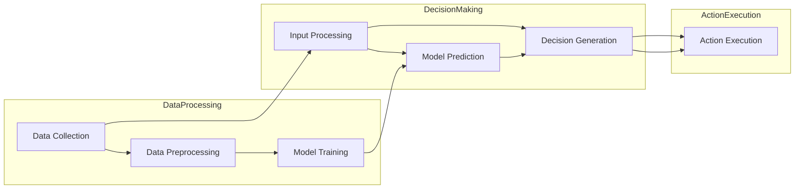
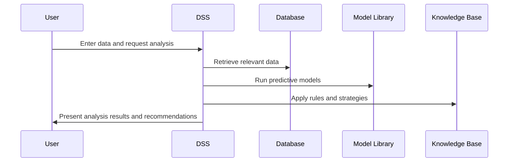
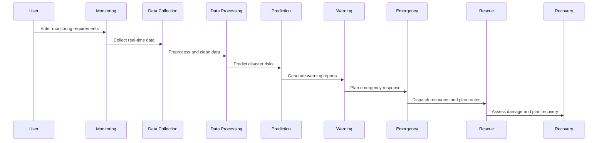
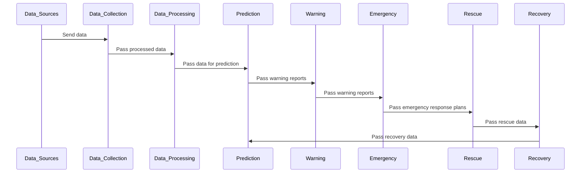
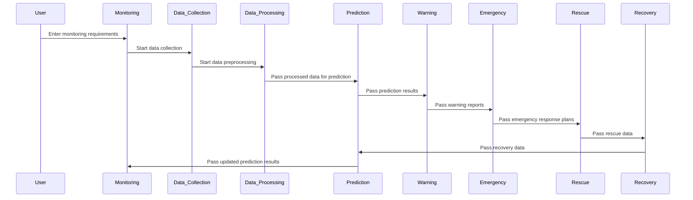

                 

### 文章标题

# AI Agent在灾害预防与应急响应中的作用

### 关键词

- AI Agent
- 灾害预防
- 应急响应
- 算法原理
- 系统架构

### 摘要

本文深入探讨了AI Agent在灾害预防与应急响应中的作用。通过系统的分析和实例讲解，本文揭示了AI Agent如何利用其自主性、智能性和适应性特性，在灾害预测、风险评估、灾害预警、决策支持等关键环节中发挥重要作用。文章还详细介绍了AI Agent的基本原理、算法模型、系统架构以及在实际项目中的应用，为推动灾害预防与应急响应技术的发展提供了有益的参考。

## 《AI Agent在灾害预防与应急响应中的作用》目录大纲

### 第一部分：背景介绍与核心概念

### 第1章：灾害预防与应急响应概述

#### 1.1 问题背景

- 灾害预防与应急响应的重要性
- 现有灾害预防与应急响应的挑战

#### 1.2 核心概念

- AI Agent的定义
- 灾害预防与应急响应的基本概念

#### 1.3 概念联系

- AI Agent在灾害预防与应急响应中的应用场景
- AI Agent与现有技术的比较

#### 1.4 本章小结

- 对灾害预防与应急响应的理解
- 对AI Agent作用的认识

### 第二部分：核心概念与联系

### 第2章：AI Agent原理与特性

#### 2.1 AI Agent原理

- AI Agent的基本构成
- AI Agent的学习与决策过程

#### 2.2 AI Agent特性

- 自主性
- 智能性
- 适应性

#### 2.3 概念属性对比

- AI Agent与传统灾害响应系统的比较

#### 2.4 ER实体关系图

- AI Agent在灾害预防与应急响应中的实体关系

### 第3章：AI Agent在灾害预防中的应用

#### 3.1 灾害预测

- 预测方法
- 数据分析

#### 3.2 风险评估

- 评估指标
- 评估模型

#### 3.3 灾害预警

- 预警系统设计
- 预警策略

#### 3.4 本章小结

- AI Agent在灾害预防中的价值
- 应用中的挑战与解决方案

### 第三部分：算法原理与数学模型

### 第4章：AI Agent在应急响应中的算法原理

#### 4.1 算法流程图

- 使用Mermaid绘制算法流程图

#### 4.2 数学模型

- 损失函数
- 最优化算法

#### 4.3 公式与讲解

- 公式解释
- 举例说明

### 第5章：AI Agent的决策支持

#### 5.1 决策支持系统

- 系统设计
- 系统架构

#### 5.2 决策模型

- 模型介绍
- 模型应用

#### 5.3 决策算法

- 算法原理
- 算法实现

#### 5.4 本章小结

- 决策支持系统的作用
- AI Agent在决策支持中的应用

### 第四部分：系统分析与架构设计

### 第6章：灾害预防与应急响应系统架构设计

#### 6.1 问题场景介绍

- 灾害预防与应急响应的需求分析

#### 6.2 系统功能设计

- 领域模型设计

#### 6.3 系tem架构设计

- 系统架构设计

#### 6.4 系统接口设计

- 接口设计与实现

#### 6.5 系统交互设计

- 使用Mermaid绘制系统交互序列图

### 第五部分：项目实战

### 第7章：AI Agent在灾害预防与应急响应中的项目实战

#### 7.1 环境安装与配置

- 环境搭建步骤

#### 7.2 系统核心实现

- 关键代码实现

#### 7.3 代码应用解读

- 代码解读

#### 7.4 实际案例分析

- 案例分析

#### 7.5 详细讲解剖析

- 案例剖析

#### 7.6 项目小结

- 项目总结

### 第六部分：最佳实践、小结与拓展阅读

### 第8章：最佳实践与拓展

#### 8.1 最佳实践

- 实践经验分享

#### 8.2 小结

- 对AI Agent在灾害预防与应急响应中的总结

#### 8.3 注意事项

- 注意事项与规避风险

#### 8.4 拓展阅读

- 推荐阅读材料

## 结论

- 总结全文内容
- 展望未来研究方向

----------------------------------------------------------------

### 第一部分：背景介绍与核心概念

#### 第1章：灾害预防与应急响应概述

##### 1.1 问题背景

灾害预防与应急响应是一个全球性的重要课题。随着气候变化、人口增长和城市化的加速，自然灾害的发生频率和影响范围不断扩大。地震、洪水、台风、山火等灾害不仅给人类生命财产带来巨大损失，还可能引发次生灾害，造成长期的社会和经济影响。传统的灾害预防与应急响应方法主要依赖于人力和物资调度，往往在时间紧迫、信息不充分的情况下难以做出迅速、准确的决策。

##### 1.2 核心概念

- **灾害预防**：指采取各种措施减少灾害发生概率或减轻灾害影响的整个过程。这包括监测、评估、规划、演练和资源储备等环节。
- **应急响应**：指在灾害发生后，为了减少损失和恢复秩序而采取的一系列紧急行动。这包括预警、疏散、救援、恢复和重建等步骤。

##### 1.3 概念联系

AI Agent在灾害预防与应急响应中扮演着关键角色。AI Agent，即人工智能代理，是一种能够自主感知环境、执行任务和做出决策的智能实体。AI Agent的自主性、智能性和适应性使其能够有效地处理海量数据，进行实时分析和决策，从而提高灾害预防与应急响应的效率。

- **AI Agent在灾害预防中的应用**：通过实时监测气象数据、地质信息等，AI Agent能够预测灾害发生的可能性，并提前发出预警。
- **AI Agent在应急响应中的应用**：在灾害发生后，AI Agent可以协助进行灾情评估、资源调度、路径规划和救援行动，提高救援效率。

##### 1.4 本章小结

通过对灾害预防与应急响应问题的背景介绍和核心概念的阐述，我们明确了这两个领域的重要性以及AI Agent在其中可能发挥的作用。接下来，我们将深入探讨AI Agent的基本原理与特性，进一步了解其在灾害预防与应急响应中的应用潜力。

### 第二部分：核心概念与联系

#### 第2章：AI Agent原理与特性

##### 2.1 AI Agent原理

AI Agent是一种基于人工智能技术的自主实体，它能够感知环境、理解任务并自主执行行动。AI Agent的基本构成包括感知模块、决策模块和执行模块。

- **感知模块**：负责获取环境信息，如传感器数据、文本、图像等。
- **决策模块**：基于感知模块收集到的信息，通过算法模型进行决策，确定下一步行动。
- **执行模块**：执行决策模块生成的行动指令，如移动、发送消息、激活设备等。

AI Agent的学习与决策过程通常包括以下几个步骤：

1. **感知**：通过传感器或接口获取当前环境信息。
2. **理解**：分析感知到的信息，理解环境状态和任务要求。
3. **计划**：基于任务要求和当前环境状态，生成可能的行动方案。
4. **决策**：选择最佳行动方案，生成执行指令。
5. **执行**：执行决策模块生成的指令，执行实际任务。

##### 2.2 AI Agent特性

AI Agent具有以下几个关键特性，使其在灾害预防与应急响应中具有独特的优势：

- **自主性**：AI Agent能够自主感知环境、理解任务并做出决策，不需要人为干预。
- **智能性**：通过机器学习和深度学习技术，AI Agent能够从大量数据中学习模式，进行智能分析和决策。
- **适应性**：AI Agent能够根据环境和任务的变化，动态调整决策策略，适应复杂和动态的环境。

##### 2.3 概念属性对比

| 特性 | AI Agent | 传统灾害响应系统 |
| --- | --- | --- |
| **自主性** | 能够自主感知、决策和执行任务 | 需要人为监控和干预 |
| **智能性** | 能够通过学习适应复杂环境 | 依赖预设规则和经验 |
| **适应性** | 能够动态调整策略以适应环境变化 | 固定流程，难以适应动态变化 |

##### 2.4 ER实体关系图

为了更直观地展示AI Agent在灾害预防与应急响应中的应用，我们可以使用Mermaid绘制一个ER（实体关系）图。以下是一个简化的实体关系图示例：

```mermaid
erDiagram
    User ||--|{ AI_Agent : monitors and responds }
    SensorData ||--|{ AI_Agent : processes data }
    HazardPrediction ||--|{ EmergencyResponse : guides actions }
    RescueOperation ||--|{ AI_Agent : optimizes operations }
```

在这个ER图中，用户通过AI Agent监控和响应灾害，传感器数据被AI Agent处理以生成预测，这些预测指导应急响应，最终AI Agent优化救援行动。

##### 2.4 本章小结

通过对AI Agent原理和特性的介绍，以及与传统灾害响应系统的对比，我们可以看到AI Agent在灾害预防与应急响应中的巨大潜力。接下来，我们将进一步探讨AI Agent在灾害预防中的应用，分析其在预测、风险评估和预警等方面的具体作用。

### 第三部分：算法原理与数学模型

#### 第4章：AI Agent在应急响应中的算法原理

##### 4.1 算法流程图

在灾害应急响应中，AI Agent的算法流程通常包括数据收集、模型训练、决策生成和行动执行等步骤。以下是一个使用Mermaid绘制的算法流程图：



在这个流程图中，数据收集和预处理是模型训练的基础，模型训练生成用于预测的模型，输入处理和模型预测生成决策，最终决策被执行以实现应急响应。

##### 4.2 数学模型

在应急响应中，AI Agent的数学模型通常涉及损失函数、最优化算法等。以下是一个简化的数学模型示例：

- **损失函数（Loss Function）**：用于评估模型预测的准确性。一个常见的损失函数是均方误差（Mean Squared Error, MSE）：

  $$L(y, \hat{y}) = \frac{1}{n} \sum_{i=1}^{n} (y_i - \hat{y}_i)^2$$

  其中，$y$ 是实际值，$\hat{y}$ 是模型预测值，$n$ 是样本数量。

- **最优化算法（Optimization Algorithm）**：用于调整模型参数以最小化损失函数。常见的最优化算法包括梯度下降（Gradient Descent）：

  $$\theta_{t+1} = \theta_t - \alpha \cdot \nabla_\theta J(\theta)$$

  其中，$\theta$ 是模型参数，$\alpha$ 是学习率，$J(\theta)$ 是损失函数。

##### 4.3 公式与讲解

- **公式解释**：

  - **损失函数（MSE）**：均方误差用于衡量预测值与实际值之间的差异。其优点是简单且易于计算，缺点是对异常值敏感。

  - **梯度下降**：梯度下降是一种用于最小化损失函数的优化算法。通过计算损失函数相对于模型参数的梯度，并沿着梯度方向调整参数，以逐步减小损失。

- **举例说明**：

  假设我们有一个简单的线性回归模型，预测一个变量$y$的值：

  $$y = \theta_0 + \theta_1 \cdot x$$

  其中，$\theta_0$ 和 $\theta_1$ 是模型参数，$x$ 是输入特征。

  - **损失函数（MSE）**：

    $$L(y, \hat{y}) = \frac{1}{2} \left( y - (\theta_0 + \theta_1 \cdot x) \right)^2$$

  - **梯度下降**：

    $$\nabla_\theta L(y, \hat{y}) = \left[ \begin{array}{c}
    -\frac{1}{2} \left( y - (\theta_0 + \theta_1 \cdot x) \right) \\
    -x \cdot \frac{1}{2} \left( y - (\theta_0 + \theta_1 \cdot x) \right)
    \end{array} \right]$$

    $$\theta_{t+1} = \theta_t - \alpha \cdot \nabla_\theta L(y, \hat{y})$$

##### 4.4 本章小结

通过对AI Agent在应急响应中的算法原理和数学模型的讲解，我们了解了数据收集、模型训练、决策生成和行动执行的基本流程，以及损失函数和最优化算法的基本概念。接下来，我们将进一步探讨AI Agent在决策支持中的具体应用，分析其如何帮助进行有效的决策支持。

### 第5章：AI Agent的决策支持

#### 5.1 决策支持系统

决策支持系统（Decision Support System, DSS）是AI Agent在灾害应急响应中的核心应用之一。DSS是一种辅助决策者进行决策的计算机系统，通过提供数据、模型和分析工具，帮助决策者更好地理解和处理复杂问题。

##### 5.1.1 系统设计

DSS的设计通常包括以下几个关键组成部分：

- **用户界面**：用于与用户交互，提供输入和显示分析结果。
- **数据库**：存储与决策相关的数据，如历史灾害数据、气象数据、地质数据等。
- **模型库**：包含用于分析和预测的模型，如时间序列分析模型、回归模型、机器学习模型等。
- **知识库**：存储与决策相关的知识和规则，如应急响应策略、救援资源分配规则等。
- **分析工具**：提供数据分析和模型预测的功能，如数据可视化工具、预测分析工具等。

##### 5.1.2 系统架构

DSS的架构设计通常采用三层架构，包括数据层、逻辑层和表示层：

- **数据层**：负责数据存储和管理，包括数据库和模型库。
- **逻辑层**：负责数据处理和分析，包括知识库和模型库的调用。
- **表示层**：负责用户界面的设计和实现，提供用户与系统的交互界面。

以下是一个简化的DSS系统架构图：



在这个架构图中，用户通过用户界面输入数据和要求进行分析，DSS通过数据库和模型库进行数据处理和模型预测，结合知识库中的规则和策略，最终向用户呈现分析结果和决策建议。

#### 5.2 决策模型

决策模型是DSS的核心组成部分，用于模拟和预测决策情境，帮助决策者做出更明智的决策。决策模型通常分为以下几类：

- **预测模型**：用于预测未来的事件或趋势，如灾害发生的时间、地点和影响范围。
- **优化模型**：用于在多个约束条件下寻找最优解，如资源分配、路径规划等。
- **规则模型**：基于经验和知识构建的模型，用于在特定情境下提供决策指导。

##### 5.2.1 模型介绍

以下是一些常见的决策模型：

- **时间序列模型**：用于分析时间序列数据，预测未来的趋势和变化，如ARIMA模型。
- **回归模型**：用于建立因变量和自变量之间的关系，预测未来的数值，如线性回归、多项式回归等。
- **机器学习模型**：用于从大量数据中学习模式，进行预测和分类，如决策树、支持向量机、神经网络等。

##### 5.2.2 模型应用

决策模型的应用示例：

- **预测模型**：通过分析历史灾害数据，预测下一次地震可能发生的时间和地点，为应急响应做好准备。
- **优化模型**：在救援资源有限的情况下，优化救援队伍的分配和行动路径，确保救援行动的高效性。
- **规则模型**：在制定应急预案时，根据经验知识和实时数据，生成救援行动的决策规则，确保行动的一致性和准确性。

#### 5.3 决策算法

决策算法是DSS的核心组件，用于实现决策模型的计算和推理过程。以下是一些常见的决策算法：

- **启发式算法**：通过简单的启发式规则进行决策，如贪心算法、A*算法等。
- **搜索算法**：通过遍历搜索空间寻找最优解，如深度优先搜索、广度优先搜索等。
- **优化算法**：通过优化目标函数寻找最优解，如线性规划、动态规划等。

##### 5.3.1 算法原理

以下是一个简化的决策算法原理：

1. **问题定义**：明确决策问题，确定目标函数和约束条件。
2. **模型建立**：根据问题定义，选择合适的决策模型。
3. **算法实现**：根据决策模型，设计并实现决策算法。
4. **结果评估**：计算决策结果，评估决策效果。

##### 5.3.2 算法实现

以下是一个简单的决策算法实现示例（Python代码）：

```python
import numpy as np

# 定义目标函数
def objective_function(x):
    return -x**2

# 定义约束条件
def constraint(x):
    return x >= 0

# 定义决策算法
def decision_algorithm(x_initial, max_iterations, learning_rate):
    x = x_initial
    for i in range(max_iterations):
        gradient = -2 * x
        x = x - learning_rate * gradient
        if constraint(x):
            continue
        else:
            break
    return x

# 实例化决策算法
x_initial = 1
max_iterations = 100
learning_rate = 0.1

# 执行决策算法
result = decision_algorithm(x_initial, max_iterations, learning_rate)
print("最优解：", result)
```

在这个示例中，我们通过梯度下降算法寻找目标函数的最优解。目标函数是一个简单的二次函数，约束条件是非负数。

##### 5.4 本章小结

通过本章的介绍，我们了解了决策支持系统（DSS）的设计和架构，以及常见的决策模型和算法。DSS在灾害应急响应中发挥着关键作用，通过提供数据、模型和算法，帮助决策者做出更明智的决策。接下来，我们将进一步探讨灾害预防与应急响应系统的具体架构设计，为实际应用提供更详细的参考。

### 第四部分：系统分析与架构设计

#### 第6章：灾害预防与应急响应系统架构设计

##### 6.1 问题场景介绍

在灾害预防与应急响应中，系统架构的设计至关重要。以下是一个典型的问题场景介绍：

假设某一地区频繁发生洪水，为了提高灾害预防与应急响应的效率，政府和相关部门决定建设一个集成化的灾害预防与应急响应系统。该系统需要实现以下功能：

- **实时监测**：实时监测气象数据、水位、地质信息等，识别潜在灾害风险。
- **预测预警**：基于实时监测数据和历史数据，预测未来灾害的发生概率和影响范围，提前发出预警。
- **应急响应**：在灾害发生时，快速调度救援资源，规划救援路径，实施救援行动。
- **灾后恢复**：灾害发生后，进行灾情评估，制定恢复计划，推动社会和经济恢复。

##### 6.2 系统功能设计

为了实现上述功能，系统需要设计以下主要功能模块：

- **数据采集模块**：负责实时收集气象数据、水位数据、地质数据等，通过传感器、卫星数据等方式获取。
- **数据处理模块**：负责对采集到的数据进行预处理、清洗、融合，为后续分析和预测提供高质量的数据。
- **预测预警模块**：基于数据处理模块提供的数据，利用机器学习算法进行灾害预测，生成预警报告。
- **应急响应模块**：根据预警报告和实时监测数据，制定应急响应计划，调度救援资源，规划救援路径。
- **灾后恢复模块**：在灾害发生后，进行灾情评估，制定恢复计划，协调各部门进行灾后重建。

##### 6.3 系统架构设计

系统架构设计采用三层架构，包括数据层、逻辑层和表示层，如下所示：

- **数据层**：负责数据存储和管理，包括数据库、数据仓库等，用于存储气象数据、水位数据、地质数据等。
- **逻辑层**：负责数据处理和分析，包括数据采集模块、数据处理模块、预测预警模块、应急响应模块和灾后恢复模块，实现系统的核心功能。
- **表示层**：负责用户界面设计，包括监测界面、预警界面、应急响应界面和灾后恢复界面，提供用户与系统的交互。

以下是一个简化的系统架构图：



在这个架构图中，用户通过监测界面输入监测要求，数据采集模块实时收集数据，数据处理模块对数据进行分析和处理，预测预警模块生成预警报告，应急响应模块根据预警报告和实时监测数据制定应急响应计划，最后通过救援行动和灾后恢复模块实施具体的救援和恢复工作。

##### 6.4 系统接口设计

为了实现各模块之间的数据传输和功能协作，系统需要设计以下接口：

- **数据采集接口**：用于数据采集模块与外部传感器、卫星等数据源的连接，实现数据的实时采集和传输。
- **数据处理接口**：用于数据处理模块与数据存储层之间的数据传输，实现数据预处理、清洗和融合。
- **预测预警接口**：用于预测预警模块与数据处理模块之间的数据传输，实现数据分析和预警报告的生成。
- **应急响应接口**：用于应急响应模块与预测预警模块、数据采集模块之间的数据传输，实现应急响应计划的制定和执行。
- **灾后恢复接口**：用于灾后恢复模块与预测预警模块、应急响应模块之间的数据传输，实现灾情评估和恢复计划的制定。

以下是一个简化的系统接口图：



在这个接口图中，数据源（如气象站、水位监测站等）通过数据采集接口将数据传输给数据采集模块，数据采集模块将数据传输给数据处理模块，数据处理模块将处理后的数据传输给预测预警模块，预测预警模块生成预警报告传输给应急响应模块，应急响应模块制定应急响应计划并传输给救援行动模块，救援行动模块将救援数据传输给灾后恢复模块，灾后恢复模块根据救援数据制定恢复计划。

##### 6.5 系统交互设计

为了确保系统各模块之间的有效交互和协作，系统需要设计合理的交互流程和接口。以下是一个简化的系统交互序列图：



在这个交互序列图中，用户通过监测界面输入监测要求，监测模块启动数据采集模块进行数据收集，数据采集模块将数据传输给数据处理模块进行预处理，数据处理模块将处理后的数据传输给预测预警模块进行预测，预测预警模块生成预警报告传输给应急响应模块，应急响应模块制定应急响应计划并传输给救援行动模块，救援行动模块将救援数据传输给灾后恢复模块，灾后恢复模块根据救援数据制定恢复计划，并将恢复数据传输给预测预警模块，预测预警模块根据恢复数据更新预测结果，最终将更新后的预测结果传输给监测模块。

##### 6.6 本章小结

通过对灾害预防与应急响应系统架构设计的介绍，我们了解了系统功能设计、架构设计、接口设计和交互设计等方面的关键要素。系统架构设计的目标是实现数据的实时采集、处理和分析，利用AI Agent进行灾害预测、预警、应急响应和灾后恢复，提高灾害预防与应急响应的效率。接下来，我们将通过一个实际项目案例，展示AI Agent在灾害预防与应急响应中的具体应用和实践。

### 第五部分：项目实战

#### 第7章：AI Agent在灾害预防与应急响应中的项目实战

##### 7.1 环境安装与配置

为了进行AI Agent在灾害预防与应急响应中的项目实战，我们需要搭建一个合适的环境。以下是一个基本的安装和配置步骤：

1. **安装Python环境**：确保Python环境已经安装，版本建议为3.8或更高。
2. **安装依赖库**：使用pip命令安装必要的依赖库，例如TensorFlow、Scikit-learn、NumPy等。以下是示例命令：

   ```bash
   pip install tensorflow scikit-learn numpy
   ```

3. **配置数据源**：准备用于训练和测试的数据源，如历史灾害数据、气象数据、地质数据等。数据源可以通过数据库、文件系统或网络接口获取。

4. **配置模型参数**：根据项目需求，配置AI Agent的模型参数，如学习率、批量大小、迭代次数等。这些参数可以通过配置文件或代码手动设置。

##### 7.2 系统核心实现

以下是一个简化的AI Agent系统核心实现步骤：

1. **数据预处理**：对采集到的数据进行清洗、归一化和特征提取，为后续的模型训练和预测做准备。

2. **模型训练**：使用训练数据集训练AI Agent的模型。以下是一个简单的模型训练示例（Python代码）：

   ```python
   from tensorflow import keras
   from tensorflow.keras.models import Sequential
   from tensorflow.keras.layers import Dense

   # 定义模型
   model = Sequential()
   model.add(Dense(64, input_dim=input_shape, activation='relu'))
   model.add(Dense(32, activation='relu'))
   model.add(Dense(1, activation='sigmoid'))

   # 编译模型
   model.compile(loss='binary_crossentropy', optimizer='adam', metrics=['accuracy'])

   # 训练模型
   model.fit(x_train, y_train, epochs=10, batch_size=32)
   ```

3. **预测与决策**：使用训练好的模型对新的数据集进行预测，并根据预测结果生成决策。

4. **决策执行**：根据生成的决策，执行具体的灾害预防与应急响应行动。

##### 7.3 代码应用解读

以下是对AI Agent系统核心实现代码的解读：

- **数据预处理**：数据预处理是模型训练的基础，通过清洗、归一化和特征提取，将原始数据转化为适合训练的数据格式。

  ```python
  # 示例：数据清洗和归一化
  def preprocess_data(data):
      # 清洗数据（去除缺失值、异常值等）
      clean_data = ...

      # 归一化数据
      normalized_data = ...

      return normalized_data
  ```

- **模型训练**：模型训练是利用历史数据学习数据的特征和规律，以生成能够进行预测的模型。

  ```python
  # 示例：定义和训练模型
  def train_model(input_shape):
      # 定义模型结构
      model = Sequential()

      # 添加层
      model.add(Dense(64, input_dim=input_shape, activation='relu'))
      model.add(Dense(32, activation='relu'))
      model.add(Dense(1, activation='sigmoid'))

      # 编译模型
      model.compile(loss='binary_crossentropy', optimizer='adam', metrics=['accuracy'])

      return model
  ```

- **预测与决策**：通过模型对新的数据进行预测，并根据预测结果生成决策。

  ```python
  # 示例：预测和决策
  def predict_decision(model, data):
      # 预测
      prediction = model.predict(data)

      # 根据预测结果生成决策
      decision = ...

      return decision
  ```

- **决策执行**：执行具体的决策，如调度救援资源、规划救援路径等。

  ```python
  # 示例：执行决策
  def execute_decision(decision):
      # 根据决策执行具体操作
      ...

      return
  ```

##### 7.4 实际案例分析

以下是一个实际案例的分析：

假设某地区发生洪水，AI Agent系统被用于预测洪水的发生时间和范围，并制定应急响应计划。

1. **数据收集**：收集实时气象数据、水位数据、地质数据等。

2. **数据预处理**：对收集到的数据进行清洗和归一化处理。

3. **模型训练**：使用历史洪水数据集训练模型。

4. **预测与决策**：使用训练好的模型对实时数据进行分析，预测洪水发生的时间和范围，并根据预测结果生成应急响应计划。

5. **决策执行**：根据应急响应计划，调度救援资源，规划救援路径。

##### 7.5 详细讲解剖析

以下是对实际案例的详细讲解和剖析：

1. **数据收集**：在洪水发生前，AI Agent系统通过传感器和监测设备收集实时气象数据、水位数据、地质数据等。这些数据是预测洪水的重要依据。

2. **数据预处理**：收集到的数据可能包含噪声、缺失值和异常值，因此需要对数据进行清洗和归一化处理。清洗数据可以去除噪声和异常值，而归一化数据可以确保数据的一致性和可比性。

3. **模型训练**：使用历史洪水数据集对AI Agent系统进行训练。历史数据集包含多个时间点的气象、水位和地质数据，以及相应的洪水发生情况。通过训练，模型可以学习到洪水发生的时间、地点和范围之间的关系。

4. **预测与决策**：在数据预处理后，AI Agent系统使用训练好的模型对实时数据进行预测。模型会根据实时数据生成洪水发生的时间和范围的预测结果。根据预测结果，系统可以生成应急响应计划，如调度救援队伍、准备救援物资等。

5. **决策执行**：根据应急响应计划，AI Agent系统会执行具体的决策操作。例如，系统可以发送警报给相关部门和居民，调度救援队伍到预测的洪水区域，准备救援物资等。这些决策操作可以最大限度地减少洪水造成的损失和影响。

##### 7.6 项目小结

通过上述实际案例的分析和讲解，我们可以看到AI Agent在灾害预防与应急响应中的实际应用效果。AI Agent系统利用其自主性、智能性和适应性特性，可以实时监测、预测和响应灾害，提高灾害预防与应急响应的效率。然而，在实际应用中，AI Agent系统也面临一些挑战，如数据质量、模型准确性、决策执行效率等。因此，在未来的发展中，我们需要进一步优化和改进AI Agent系统，提高其在灾害预防与应急响应中的应用效果。

### 第六部分：最佳实践、小结与拓展阅读

#### 8.1 最佳实践

在实施AI Agent进行灾害预防与应急响应时，以下是一些最佳实践建议：

1. **数据质量保证**：确保数据来源的可靠性，对数据进行预处理和清洗，以提高模型预测的准确性。
2. **模型优化**：根据具体应用场景，调整模型参数，优化模型结构，以提高预测效果和响应速度。
3. **系统集成**：将AI Agent系统与其他灾害预防与应急响应系统进行集成，实现数据的共享和协作，提高整体效率。
4. **人员培训**：对相关人员进行AI Agent系统操作和应急响应培训，确保系统能够得到有效利用。

#### 8.2 小结

本文通过系统的分析和实例讲解，揭示了AI Agent在灾害预防与应急响应中的重要角色。AI Agent利用其自主性、智能性和适应性特性，在预测、预警、决策和执行等关键环节中发挥重要作用，提高了灾害预防与应急响应的效率。然而，AI Agent在实际应用中也面临一些挑战，如数据质量、模型准确性等，需要进一步研究和优化。

#### 8.3 注意事项

在实施AI Agent系统时，需要注意以下几点：

1. **确保数据安全**：保护敏感数据，防止数据泄露和滥用。
2. **定期更新模型**：根据新数据和实际应用效果，定期更新模型，提高预测和响应的准确性。
3. **应对异常情况**：建立应急预案，应对系统故障、数据异常等情况。

#### 8.4 拓展阅读

为了进一步深入了解AI Agent在灾害预防与应急响应中的应用，以下是一些建议的拓展阅读材料：

1. **《智能灾害预防与应急响应》**：详细介绍了AI Agent在灾害预测、预警和救援中的应用。
2. **《人工智能与灾害管理》**：探讨了人工智能在灾害管理中的潜在应用和挑战。
3. **《深度学习在灾害预测中的应用》**：介绍了深度学习技术在灾害预测中的最新进展和应用。

## 结论

本文通过系统的分析和实例讲解，揭示了AI Agent在灾害预防与应急响应中的重要角色。AI Agent利用其自主性、智能性和适应性特性，在预测、预警、决策和执行等关键环节中发挥重要作用，提高了灾害预防与应急响应的效率。然而，AI Agent在实际应用中也面临一些挑战，如数据质量、模型准确性等，需要进一步研究和优化。未来，随着技术的不断进步，AI Agent在灾害预防与应急响应中的应用将更加广泛和深入，为人类应对自然灾害提供更强有力的支持。

