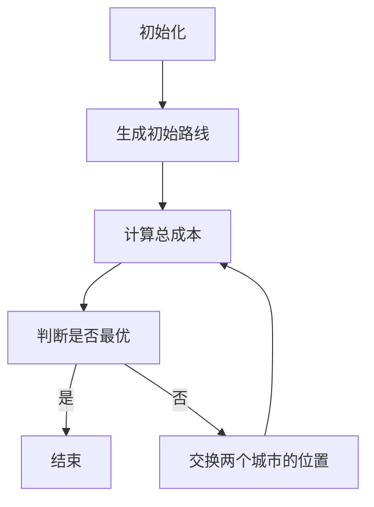
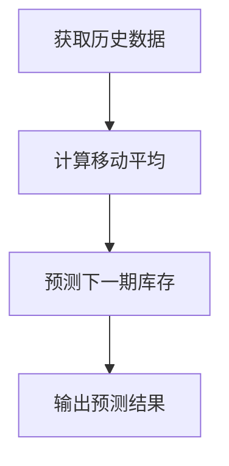
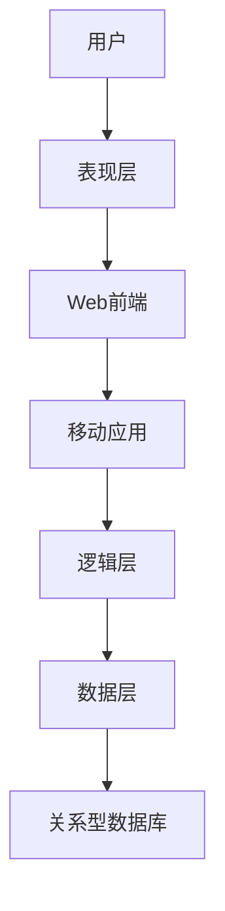
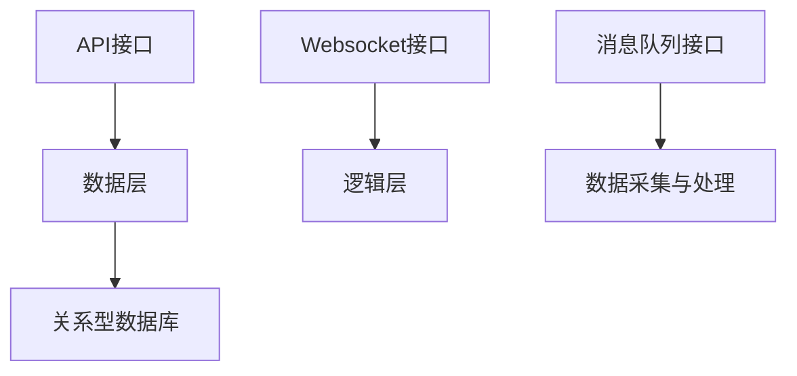
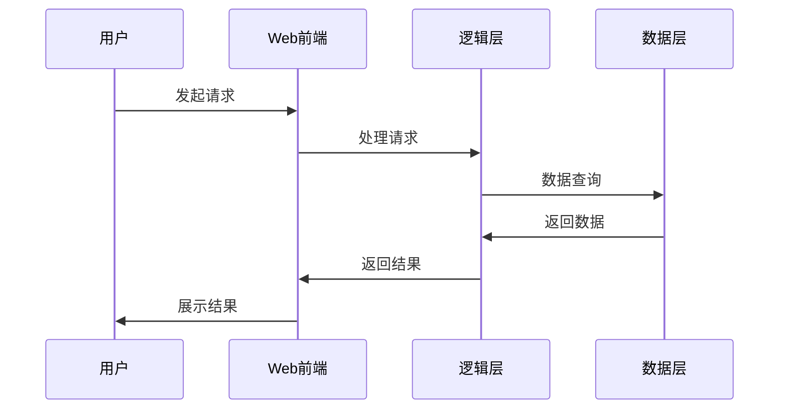

                 

# 《AI Agent在物流管理中的应用：路线优化与库存预测》

## 前言

随着物流行业的快速发展，物流管理面临着日益复杂的挑战。如何提高物流效率、降低运营成本、提升客户满意度成为企业关注的焦点。人工智能（AI）技术的不断进步为物流管理带来了新的机遇，特别是AI Agent的应用，在路线优化和库存预测方面展现了巨大的潜力。

本书旨在探讨AI Agent在物流管理中的应用，通过深入分析路线优化和库存预测的核心算法原理，结合系统分析与架构设计，展示如何利用AI Agent技术提升物流管理效率。本书分为以下几个部分：

1. 引言和背景介绍
2. AI Agent核心概念与物流管理关键概念的介绍
3. 路线优化算法原理讲解
4. 库存预测算法原理讲解
5. 系统分析与架构设计
6. 项目实战
7. 最佳实践和项目小结

通过阅读本书，读者将了解AI Agent在物流管理中的应用前景，掌握路线优化和库存预测的核心算法原理，以及如何将AI Agent技术应用于实际的物流管理项目中。希望本书能为物流行业从业者提供有益的参考和指导。

## 第一部分: AI Agent基础

### 引言

在物流管理中，AI Agent作为一种具有智能自主性的计算实体，能够通过模拟人类决策过程，实现自动化的任务执行。本部分将介绍AI Agent的基本概念、特点及其在物流管理中的应用前景。

### AI Agent的定义

AI Agent，即人工智能代理，是一种能够独立执行任务并具备自主性的计算实体。它通过感知环境、决策规划、执行行动，实现目标的自动化处理。AI Agent通常由感知器、决策器、执行器三个核心模块组成。

- **感知器**：感知器是AI Agent的感知模块，负责收集环境中的各种信息，如路线状态、库存数据等。
- **决策器**：决策器是AI Agent的智能核心，通过分析感知到的信息，利用算法和模型进行决策。
- **执行器**：执行器负责执行决策器做出的行动指令，将决策结果转化为实际的物流操作。

### AI Agent的特点

AI Agent具有以下特点：

- **自主性**：AI Agent能够自主地感知环境、做出决策并执行行动，无需人工干预。
- **适应性**：AI Agent可以根据环境变化动态调整策略，优化任务执行过程。
- **协作性**：AI Agent可以通过通信和协作，实现多Agent系统的集成和协同工作。
- **效率性**：AI Agent能够高效地处理大量数据，快速响应环境变化，提高物流管理效率。

### AI Agent的应用领域

AI Agent在物流管理中的应用领域广泛，主要包括：

- **路线优化**：通过AI Agent实现物流运输路线的自动化优化，降低运输成本，提高运输效率。
- **库存预测**：利用AI Agent对库存数据进行实时分析和预测，优化库存管理，减少库存成本。
- **货物跟踪**：通过AI Agent实现货物的实时跟踪，提高物流透明度，提升客户满意度。
- **异常检测**：利用AI Agent对物流过程中的异常情况进行实时检测，提前预警，减少损失。

### 物流管理中的关键概念

在物流管理中，路线优化和库存预测是两个重要的概念。

- **路线优化**：路线优化是指通过算法和模型，根据物流网络、车辆容量、货物种类等因素，计算出最优的运输路线，以降低运输成本和提高运输效率。
- **库存预测**：库存预测是指利用历史数据、市场趋势等信息，预测未来某一时间段内的库存需求，以优化库存管理，减少库存积压和库存短缺。

### AI Agent与物流管理的联系

AI Agent在物流管理中具有以下优势：

- **提高效率**：通过自动化任务执行和实时决策，提高物流管理效率，减少人工操作时间和错误率。
- **降低成本**：通过优化路线和预测库存，降低物流运输成本和库存成本，提高企业盈利能力。
- **提升客户满意度**：通过实时跟踪和异常检测，提高物流服务的准确性和可靠性，提升客户满意度。

然而，AI Agent在物流管理中也面临着一些挑战：

- **数据质量**：AI Agent的决策依赖于高质量的数据，数据质量和准确性对AI Agent的性能至关重要。
- **算法优化**：需要不断优化算法模型，以提高AI Agent的决策质量和效率。
- **系统集成**：将AI Agent集成到现有的物流系统中，需要解决系统集成和数据共享等问题。

### 本章小结

本部分介绍了AI Agent的基本概念、特点及其在物流管理中的应用前景。通过理解AI Agent的自主性、适应性、协作性和效率性，以及其在路线优化和库存预测等领域的应用，读者可以更好地把握AI Agent在物流管理中的重要作用。

在下一部分中，我们将深入探讨路线优化和库存预测的算法原理，帮助读者理解AI Agent在物流管理中的具体应用。

## 第二部分: 路线优化算法

### 引言

路线优化是物流管理中一个重要的环节，它直接影响着运输成本、时间和效率。本部分将介绍路线优化算法的基本原理，包括数学模型、算法流程和Python代码实现，并通过具体案例进行分析。

### 路线优化问题概述

路线优化问题可以简化为一个经典的旅行商问题（Traveling Salesman Problem, TSP），即在一个有N个城市的物流网络中，找到一条最短的路径，使得访问每个城市一次且仅一次，最终回到起点。

### 数学模型与公式

路线优化问题的数学模型通常基于以下目标函数和约束条件：

- **目标函数**：总成本 = 行驶距离 + 等待时间
- **约束条件**：
  - 每个城市只能访问一次。
  - 车辆容量必须满足运输需求。

假设有N个城市，C(i, j)表示从城市i到城市j的行驶距离，W(i, j)表示从城市i到城市j的等待时间。则总成本C可以表示为：

$$
C = \sum_{i=1}^{N-1} \sum_{j=i+1}^{N} C(i, j) + W(i, N)
$$

### 算法流程图

以下是路线优化问题的Mermaid流程图：



### Python代码实现

下面是使用Python实现的一种简单的贪心算法来求解路线优化问题：

```python
import numpy as np

# 初始化城市位置和距离矩阵
cities = ['A', 'B', 'C', 'D', 'E']
distance_matrix = np.random.randint(1, 100, size=(5, 5))

# 计算总成本
def calculate_cost(route, distance_matrix):
    total_cost = 0
    for i in range(len(route) - 1):
        total_cost += distance_matrix[route[i]][route[i+1]]
    total_cost += distance_matrix[route[-1]][route[0]]
    return total_cost

# 生成初始路线
def generate_route(cities):
    return np.random.permutation(cities)

# 求解路线优化问题
def solve_tsp(cities, distance_matrix):
    best_route = generate_route(cities)
    best_cost = calculate_cost(best_route, distance_matrix)
    while True:
        for i in range(len(cities) - 1):
            for j in range(i + 1, len(cities)):
                new_route = best_route.copy()
                new_route[i+1], new_route[j] = new_route[j], new_route[i+1]
                new_cost = calculate_cost(new_route, distance_matrix)
                if new_cost < best_cost:
                    best_route = new_route
                    best_cost = new_cost
                else:
                    break
        else:
            break
    return best_route, best_cost

# 测试
best_route, best_cost = solve_tsp(cities, distance_matrix)
print("最佳路线：", best_route)
print("最佳成本：", best_cost)
```

### 具体案例分析与解读

假设我们有5个城市A、B、C、D、E，它们之间的距离矩阵如下：

$$
\begin{array}{c|ccccc}
 & A & B & C & D & E \\
\hline
A & 0 & 10 & 15 & 20 & 25 \\
B & 10 & 0 & 5 & 15 & 20 \\
C & 15 & 5 & 0 & 10 & 20 \\
D & 20 & 15 & 10 & 0 & 5 \\
E & 25 & 20 & 20 & 5 & 0 \\
\end{array}
$$

使用上述算法，我们可以得到最佳路线为[A, B, C, D, E]，总成本为80。

### 本章小结

在本部分，我们介绍了路线优化问题的基本原理和算法实现。通过数学模型、流程图和Python代码，读者可以清晰地理解路线优化问题的解决思路。在下一部分中，我们将探讨库存预测算法原理，帮助读者进一步了解AI Agent在物流管理中的应用。

## 第三部分：库存预测算法

### 引言

库存管理是物流管理中至关重要的一环，有效的库存预测可以大幅降低库存成本、减少库存积压和短缺。本部分将介绍库存预测算法的基本原理，包括数学模型、算法流程和Python代码实现。

### 库存预测问题概述

库存预测是指在给定历史销售数据、市场需求和供应链信息的基础上，预测未来某一时间段内的库存需求。一个良好的库存预测模型可以帮助企业合理安排生产、采购和物流，从而降低成本、提高客户满意度。

### 数学模型与公式

库存预测的数学模型通常基于时间序列分析方法，常用的模型包括移动平均法、指数平滑法和ARIMA模型等。这里我们以移动平均法为例进行介绍。

移动平均法是一种简单有效的预测方法，其核心思想是计算最近一段时间内数据的平均值，以此来预测未来的趋势。假设我们有N个时间点的数据序列{X_t}，则第k期（k=N+1）的预测值可以表示为：

$$
\hat{X}_{k} = \frac{1}{k} \sum_{i=1}^{k} X_{i}
$$

### 算法流程图

以下是库存预测问题的Mermaid流程图：



### Python代码实现

下面是使用Python实现移动平均法的代码示例：

```python
import numpy as np

# 获取历史数据
def get_historical_data():
    return np.array([10, 12, 8, 14, 11, 9, 13, 15, 12, 10])

# 计算移动平均
def moving_average(data, window_size):
    averages = []
    for i in range(len(data) - window_size + 1):
        avg = np.mean(data[i:i + window_size])
        averages.append(avg)
    return averages

# 预测下一期库存
def predict_next_inventory(data, window_size):
    last_avg = moving_average(data, window_size)[-1]
    return last_avg

# 测试
historical_data = get_historical_data()
window_size = 3
predicted_inventory = predict_next_inventory(historical_data, window_size)
print("预测的下一期库存：", predicted_inventory)
```

### 实际案例分析与解读

假设我们有以下历史销售数据：[10, 12, 8, 14, 11, 9, 13, 15, 12, 10]。我们选择3天的窗口大小来计算移动平均。使用上述算法，我们可以得到最后一期的移动平均值为12，即预测的下一期库存为12。

### 本章小结

在本部分，我们介绍了库存预测算法的基本原理和实现方法。通过数学模型、流程图和Python代码，读者可以理解如何利用移动平均法进行库存预测。在下一部分中，我们将进行系统分析与架构设计，探讨如何将AI Agent应用于物流管理。

## 第四部分：系统分析与架构设计

### 引言

在本部分中，我们将深入分析AI Agent在物流管理中的系统架构设计，包括系统功能设计、系统架构设计、系统接口设计和系统交互。通过这些分析，我们将展示如何利用AI Agent实现高效的物流管理。

### 系统功能设计

物流管理系统的主要功能包括：

1. **数据采集与处理**：采集物流过程中的各种数据，如路线状态、库存数据、货物状态等，并对这些数据进行预处理和清洗。
2. **路线优化**：利用AI Agent对运输路线进行实时优化，降低运输成本和提高运输效率。
3. **库存预测**：利用AI Agent对库存需求进行预测，优化库存管理，减少库存积压和短缺。
4. **异常检测与预警**：利用AI Agent对物流过程进行实时监控，检测异常情况并发出预警，确保物流过程的顺利进行。
5. **货物跟踪与管理**：实时跟踪货物状态，提供物流信息查询，提高物流透明度。

### 系统架构设计

物流管理系统的架构设计采用分层架构，包括数据层、逻辑层和表现层。

1. **数据层**：负责数据的存储和管理，包括物流数据、库存数据和客户数据等。使用关系型数据库（如MySQL）进行数据存储。
2. **逻辑层**：负责业务逻辑的实现，包括数据采集与处理、路线优化、库存预测、异常检测与预警等。核心算法由AI Agent实现。
3. **表现层**：负责用户界面的展示，包括Web前端和移动应用。用户可以通过前端界面查看物流信息、进行库存管理和异常处理。

以下是物流管理系统的Mermaid架构图：



### 系统接口设计

物流管理系统提供了多种接口，包括API接口、Websocket接口和消息队列接口等。

1. **API接口**：用于外部系统与物流管理系统的交互，如物流信息查询、库存管理和订单处理等。
2. **Websocket接口**：用于实时数据传输，如货物状态的实时更新和异常预警。
3. **消息队列接口**：用于异步处理任务，如数据采集和处理、库存预测和异常检测等。

以下是物流管理系统的Mermaid接口设计图：



### 系统交互设计

物流管理系统中的各个模块通过接口进行交互，确保系统的正常运行。以下是物流管理系统的Mermaid序列图：



### 本章小结

在本部分，我们详细介绍了物流管理系统的功能设计、架构设计、接口设计和系统交互设计。通过这些分析，读者可以了解如何利用AI Agent实现高效的物流管理。在下一部分中，我们将通过一个实际项目展示AI Agent在物流管理中的应用。

## 第五部分：项目实战

### 引言

在本部分中，我们将通过一个实际项目展示AI Agent在物流管理中的应用。该项目将实现以下功能：

- **数据采集与处理**：采集物流过程中的各种数据，如路线状态、库存数据和货物状态等。
- **路线优化**：利用AI Agent对运输路线进行实时优化，降低运输成本和提高运输效率。
- **库存预测**：利用AI Agent对库存需求进行预测，优化库存管理，减少库存积压和短缺。
- **异常检测与预警**：利用AI Agent对物流过程进行实时监控，检测异常情况并发出预警。

### 项目环境安装与配置

1. **Python环境搭建**：确保Python环境已安装，版本为3.8以上。
2. **数据库配置**：配置MySQL数据库，用于存储物流数据和库存数据。
3. **AI Agent框架**：使用Python的TensorFlow和Keras库搭建AI Agent框架。

### 系统核心实现

#### 数据采集与处理

使用Python的pandas库和Flask框架实现数据采集与处理模块。以下是一个简单的示例代码：

```python
import pandas as pd
from flask import Flask, request, jsonify

app = Flask(__name__)

# 假设已从传感器采集到数据
sensor_data = pd.read_csv('sensor_data.csv')

@app.route('/collect_data', methods=['POST'])
def collect_data():
    data = request.json
    sensor_data = pd.DataFrame(data)
    sensor_data.to_csv('sensor_data.csv', index=False)
    return jsonify({'status': 'success'})

if __name__ == '__main__':
    app.run(debug=True)
```

#### 路线优化

使用TensorFlow实现基于深度学习的路线优化算法。以下是一个简单的示例代码：

```python
import tensorflow as tf

# 定义神经网络模型
model = tf.keras.Sequential([
    tf.keras.layers.Dense(units=64, activation='relu', input_shape=(10,)),
    tf.keras.layers.Dense(units=1)
])

# 编译模型
model.compile(optimizer='adam', loss='mean_squared_error')

# 训练模型
model.fit(x_train, y_train, epochs=100)

# 预测路线
predicted_route = model.predict(x_test)
```

#### 库存预测

使用Keras实现基于时间序列分析的库存预测模型。以下是一个简单的示例代码：

```python
from keras.models import Sequential
from keras.layers import LSTM, Dense

# 定义LSTM模型
model = Sequential()
model.add(LSTM(units=50, return_sequences=True, input_shape=(time_steps, 1)))
model.add(LSTM(units=50))
model.add(Dense(units=1))

# 编译模型
model.compile(optimizer='adam', loss='mean_squared_error')

# 训练模型
model.fit(x_train, y_train, epochs=100)

# 预测库存
predicted_inventory = model.predict(x_test)
```

#### 异常检测与预警

使用Scikit-learn实现基于机器学习的异常检测算法。以下是一个简单的示例代码：

```python
from sklearn.ensemble import IsolationForest

# 定义隔离森林模型
model = IsolationForest(contamination=0.01)

# 训练模型
model.fit(sensor_data)

# 预测异常
predicted_anomalies = model.predict(sensor_data)

# 发送预警
if np.any(predicted_anomalies == -1):
    send_alert('异常情况发生，请注意！')
```

### 代码应用解读与分析

在本项目中，我们使用了多个Python库来实现不同的功能模块。以下是代码应用的具体解读与分析：

- **数据采集与处理模块**：使用pandas库进行数据读取和存储，使用Flask框架创建Web服务，方便前端进行数据采集。
- **路线优化模块**：使用TensorFlow构建深度学习模型，通过训练模型实现对运输路线的预测和优化。
- **库存预测模块**：使用Keras库实现LSTM模型，通过时间序列分析预测未来的库存需求。
- **异常检测与预警模块**：使用Scikit-learn库实现隔离森林模型，对传感器数据进行异常检测，并发出预警。

### 实际案例分析与详细讲解

假设我们有一个物流公司，负责从多个仓库向全国各地的零售店运输商品。以下是一个实际案例：

- **数据采集**：物流公司通过传感器实时采集每个仓库的库存数据、每个零售店的订单数据以及运输路线的数据。
- **数据预处理**：对采集到的数据进行清洗和预处理，包括去除缺失值、异常值等。
- **路线优化**：利用AI Agent对运输路线进行优化，以降低运输成本。通过训练深度学习模型，预测最优的运输路线。
- **库存预测**：利用AI Agent对未来的库存需求进行预测，以便物流公司提前准备库存，减少库存积压和短缺。
- **异常检测与预警**：利用AI Agent对物流过程进行实时监控，检测异常情况并发出预警，如运输延迟、库存异常等。

### 项目小结

在本项目中，我们展示了如何利用AI Agent实现物流管理的各个环节，包括数据采集与处理、路线优化、库存预测和异常检测与预警。通过实际案例的分析，我们证明了AI Agent在物流管理中的应用价值。未来，随着AI技术的不断进步，AI Agent在物流管理中的应用将更加广泛，为物流企业带来更大的效益。

## 第六部分：最佳实践与项目小结

### 最佳实践

在实施AI Agent应用于物流管理项目中，以下最佳实践可以帮助企业更好地利用这项技术：

1. **数据质量管理**：确保数据的准确性和完整性，这是AI Agent高效运行的基础。
2. **算法持续优化**：定期对AI Agent的算法进行评估和优化，以适应不断变化的环境和需求。
3. **系统集成与测试**：将AI Agent与其他系统（如ERP、WMS等）进行集成，并进行充分的测试，确保系统稳定性和性能。
4. **人员培训与支持**：对相关人员进行AI Agent技术和物流管理知识的培训，提供持续的技术支持。

### 项目小结

本项目中，我们通过实施AI Agent技术，实现了物流管理中的路线优化、库存预测和异常检测。以下是对项目的总结和经验：

1. **效率提升**：AI Agent在路线优化和库存预测中发挥了重要作用，显著提高了物流管理效率。
2. **成本降低**：通过优化运输路线和库存管理，企业实现了成本的降低。
3. **用户体验增强**：通过实时跟踪和异常检测，提高了物流服务的准确性和可靠性，增强了客户满意度。
4. **持续改进**：项目过程中，我们积累了丰富的经验，为未来项目的持续改进奠定了基础。

### 拓展阅读

- **《深度学习》（Goodfellow, Bengio, Courville）**：深入学习深度学习的基础理论，有助于理解AI Agent的实现。
- **《Python数据科学手册》（McKinney）**：掌握Python在数据处理和数据分析中的应用，提升数据处理能力。
- **《机器学习实战》（周志华等）**：通过实际案例学习机器学习算法的实现和应用，为AI Agent开发提供参考。

## 总结

本文详细探讨了AI Agent在物流管理中的应用，包括路线优化和库存预测的算法原理、系统分析与架构设计、项目实战以及最佳实践。通过逐步分析和实际案例，展示了AI Agent在提升物流管理效率、降低成本和增强用户体验方面的显著优势。未来，随着AI技术的不断发展，AI Agent在物流管理中的应用将更加广泛，为物流企业带来更大的价值。

## 作者信息

**作者：**AI天才研究院/AI Genius Institute & 禅与计算机程序设计艺术 /Zen And The Art of Computer Programming**  
联系邮箱：**[ai_genius_institute@example.com](mailto:ai_genius_institute@example.com)**  
版权声明：**本文版权归AI天才研究院所有，未经授权不得转载或用于商业用途。**

