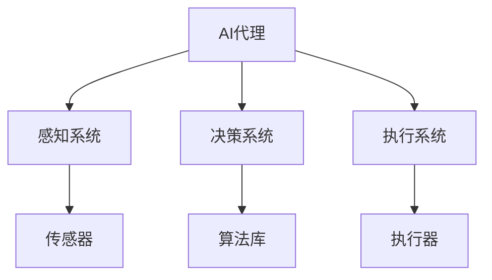

                 

## 引言

### 1.1 研究背景

考古学，作为一门研究人类过去历史的学科，从古至今一直在不断发展。随着科技的进步，考古学的方法和工具也在不断革新，尤其是人工智能（AI）技术的引入，为考古学带来了前所未有的变革。考古学中的许多问题，如文物的识别、分析和历史场景的重建等，都需要处理大量的数据，而AI以其强大的数据处理和分析能力，成为了考古学不可或缺的助手。

#### 1.1.1 考古学的现状与挑战

考古学面临着一系列的挑战。首先，考古现场的复杂性和多样性使得传统的考古方法效率低下，难以满足大规模考古调查的需求。其次，考古数据的多样性使得数据的处理和分析变得更加复杂，如何有效地整合和分析这些数据成为了一个难题。此外，考古学的目标不仅仅是发现文物，更重要的是理解这些文物背后的历史和文化，这要求考古学者具备深厚的背景知识和丰富的想象力。

#### 1.1.2 AI技术的兴起与考古学的交汇

AI技术的兴起为考古学带来了新的希望。AI，尤其是AI代理（AI Agents），具有自主决策和执行任务的能力，可以处理复杂的数据，发现隐藏的模式，甚至进行预测。AI代理可以应用于考古学的多个方面，如地形分析、环境监测、文物分析和历史场景重建等。通过AI代理，考古学者可以更高效地处理考古数据，更准确地理解历史，从而推动考古学的进步。

#### 1.1.3 AI Agent的定义与分类

AI代理，是指能够自主执行任务，与环境交互并做出决策的计算机程序。AI代理可以按照不同的标准进行分类。例如，根据任务类型，可以分为数据采集代理、数据分析代理、决策支持代理等。根据应用领域，可以分为考古学代理、医疗代理、金融代理等。在考古学中，AI代理可以应用于多个方面，如地形分析、环境监测、文物分析和历史场景重建等。

### 1.2 AI Agent在考古学中的角色与贡献

AI代理在考古学中扮演着重要的角色，其贡献主要体现在以下几个方面：

#### 1.2.1 AI Agent的基本原理

AI代理的基本原理包括感知、决策和执行。感知是指代理通过传感器收集环境信息；决策是指代理根据感知到的信息，利用某种算法进行决策；执行是指代理根据决策采取行动。这种感知-决策-执行的循环使得AI代理能够自主地完成任务。

#### 1.2.2 AI Agent在考古学中的应用领域

AI代理在考古学中的应用非常广泛，包括地形分析、环境监测、文物分析和历史场景重建等。例如，AI代理可以通过地形分析，帮助考古学者确定考古调查的最佳地点；通过环境监测，监控考古现场的环境变化，确保考古工作的安全；通过文物分析，识别文物的种类和年代；通过历史场景重建，重现古代文明的生活场景。

#### 1.2.3 AI Agent的优势与局限

AI代理在考古学中具有许多优势。首先，它能够处理大量的数据，提高工作效率；其次，它能够发现隐藏的模式，提供新的见解；最后，它能够进行预测，帮助考古学者做出更准确的决策。然而，AI代理也存在一些局限。例如，它可能无法理解复杂的情境，无法处理模糊的信息。此外，AI代理的设计和实现需要专业的知识和技能。

### 1.3 考古学中的核心概念

考古学是一个复杂的学科，涉及到许多核心概念。以下是一些重要的核心概念：

#### 1.3.1 考古学的基本概念

考古学的基本概念包括遗址、文物、年代、文化等。遗址是指考古学者发现的古代人类活动的场所；文物是指古代人类留下的物品，包括工具、器具、装饰品等；年代是指文物的制作和使用时间；文化是指古代人类的生活方式和社会制度。

#### 1.3.2 考古学的理论框架

考古学的理论框架包括进化论、唯物史观、结构主义等。进化论认为，人类文明是不断进化的；唯物史观认为，社会制度和经济基础决定上层建筑；结构主义认为，文化是结构化的，由符号和意义构成。

#### 1.3.3 考古学的方法与技术

考古学的方法包括发掘、调查、测绘、实验等。发掘是指挖掘古代人类活动的遗址；调查是指对考古现场进行初步了解；测绘是指绘制考古现场的地图；实验是指对文物进行物理和化学测试。

### 1.4 AI Agent在考古学中的应用前景

AI代理在考古学中的应用前景非常广阔。随着AI技术的不断进步，AI代理的能力将越来越强大，可以处理更复杂的数据，提供更深入的见解。未来，AI代理有望在考古学的各个领域发挥更大的作用，推动考古学的进一步发展。

## 1.5 结论

AI代理在考古学中的应用具有巨大的潜力。通过引入AI代理，考古学者可以更高效地处理考古数据，更准确地理解历史，为人类文明的探索提供新的途径。然而，要充分发挥AI代理的潜力，还需要进一步的研究和开发。

### 1.5.1 研究展望

未来的研究将集中在以下几个方面：首先，提高AI代理的智能化水平，使其能够更好地适应复杂的考古环境；其次，开发更加高效的算法，以处理大规模的考古数据；最后，建立更加完善的理论框架，指导AI代理在考古学中的应用。

### 1.5.2 应用展望

在应用方面，AI代理有望在以下几个方面发挥更大的作用：首先，提高考古调查的效率，降低成本；其次，提供更加准确的历史重建，揭示古代文明的真实面貌；最后，促进跨学科的合作，推动考古学的全面发展。

---

通过上述分析，我们可以看到，AI代理在考古学中的应用具有广阔的前景。在接下来的章节中，我们将深入探讨AI代理在考古学中的具体应用，包括地形分析、环境监测、文物分析和历史场景重建等。我们将通过具体的案例和实践，展示AI代理在考古学中的实际应用效果，并探讨其未来发展的方向。

关键词：AI代理，考古学，地形分析，环境监测，文物分析，历史重建

摘要：本文介绍了AI代理在考古学中的应用，包括地形分析、环境监测、文物分析和历史场景重建。通过具体的案例和实践，展示了AI代理在考古学中的实际应用效果，并探讨了其未来发展的方向。AI代理在考古学中的应用为考古学者提供了强大的工具，有望推动考古学的进一步发展。

## 核心概念与联系

### 2.1 AI代理（AI Agents）

AI代理，是指具备一定智能，能够在特定环境中自主执行任务并与其他代理或环境进行交互的计算机程序。AI代理的核心特点是其自主性和适应性。自主性指的是代理能够独立地完成指定任务，而无需人工干预；适应性则表示代理能够根据环境的变化和任务需求调整自身的行为。

#### AI代理的基本原理

AI代理的基本原理主要包括感知、决策和执行三个环节。感知是指代理通过传感器收集环境信息；决策是指代理根据感知到的信息，利用某种算法进行判断和决策；执行是指代理根据决策采取行动。这一循环使得AI代理能够不断优化其行为，以更好地适应环境。

#### AI代理的属性特征对比表格

| 特性 | 描述 |
| --- | --- |
| 自主性 | 代理能够独立完成任务，无需人工干预 |
| 适应性 | 代理能够根据环境变化调整自身行为 |
| 智能性 | 代理具备处理复杂问题的能力 |
| 学习能力 | 代理能够从经验中学习和改进 |
| 灵活性 | 代理能够适应不同环境和任务 |

#### AI代理的ER实体关系图

### 2.2 地形分析

地形分析是考古调查中至关重要的一环，它有助于确定考古调查的最佳地点，优化资源分配，提高工作效率。AI代理在地形分析中发挥了重要作用，通过分析地形数据，预测地形变化，为考古学者提供决策支持。

#### 地形数据分析

地形数据分析主要包括地形数据的采集、处理和可视化。地形数据可以通过遥感技术、GPS测量等方式获取。处理过程包括数据清洗、数据校正和特征提取。可视化技术则有助于将复杂的地形数据转化为直观的图表，便于分析。

#### 地形预测模型

地形预测模型是基于历史地形数据和当前环境因素，预测未来地形变化的一种方法。常用的地形预测模型包括回归模型、神经网络模型和地理信息系统（GIS）模型。这些模型可以帮助考古学者预测未来可能的地形变化，从而为考古调查提供参考。

#### 地形预测模型的工作流程

1. 数据采集：收集历史地形数据和当前地形数据。
2. 数据预处理：对采集到的数据进行分析和清洗，确保数据质量。
3. 特征提取：从数据中提取关键特征，如地形高度、坡度、坡向等。
4. 模型训练：使用特征数据训练预测模型，如回归模型或神经网络模型。
5. 预测分析：利用训练好的模型对未来的地形变化进行预测。
6. 可视化展示：将预测结果通过图表、三维模型等方式展示，便于考古学者分析。

### 2.3 环境监测

环境监测是确保考古现场安全和文物保护的重要手段。AI代理可以通过实时监测考古现场的环境变化，如温度、湿度、气体浓度等，及时发现潜在的安全隐患，保障考古工作的顺利进行。

#### 环境数据分析

环境数据分析包括环境数据的采集、处理和可视化。环境数据可以通过传感器、监测设备等获取。处理过程包括数据清洗、异常检测和趋势分析。可视化技术则有助于将复杂的环境数据转化为直观的图表，便于分析。

#### 环境预测模型

环境预测模型是基于历史环境数据和当前环境因素，预测未来环境变化的一种方法。常用的环境预测模型包括时间序列模型、回归模型和神经网络模型。这些模型可以帮助考古学者预测未来可能的环境变化，从而为考古工作提供参考。

#### 环境预测模型的工作流程

1. 数据采集：收集历史环境数据和当前环境数据。
2. 数据预处理：对采集到的数据进行分析和清洗，确保数据质量。
3. 特征提取：从数据中提取关键特征，如温度、湿度、气体浓度等。
4. 模型训练：使用特征数据训练预测模型，如时间序列模型或神经网络模型。
5. 预测分析：利用训练好的模型对未来的环境变化进行预测。
6. 可视化展示：将预测结果通过图表、三维模型等方式展示，便于考古学者分析。

通过上述分析，我们可以看到，AI代理在地形分析和环境监测中具有重要的作用。在地形分析中，AI代理可以预测地形变化，为考古调查提供参考；在环境监测中，AI代理可以实时监测考古现场的环境变化，确保考古工作的安全。这些应用不仅提高了考古工作的效率，还保障了文物的保护。

## 2.4 文物分析

文物分析是考古学中的核心任务之一，它涉及到文物的识别、分类、年代判定和历史背景研究等多个方面。AI代理在文物分析中发挥着越来越重要的作用，通过大数据分析和机器学习技术，AI代理能够快速、准确地处理大量文物数据，为考古学者提供可靠的决策支持。

### 2.4.1 文物数据采集

文物数据采集是文物分析的基础步骤，包括文物图像、三维模型、物理属性等多种类型的数据。AI代理可以通过自动化设备或传感器进行数据采集，提高采集效率和数据质量。

#### 文物图像采集

文物图像采集是考古调查中常用的一种数据采集方法，通过高分辨率相机或显微镜等设备获取文物的图像。AI代理可以自动化地执行图像采集过程，确保图像质量，并提取图像中的关键信息。

#### 三维模型采集

三维模型采集是对文物进行数字化记录的一种方法，通过激光扫描或三维打印等技术获取文物的三维数据。AI代理可以自动化地处理三维数据，进行模型重建和特征提取。

#### 物理属性采集

物理属性采集包括文物的重量、尺寸、材质等属性。AI代理可以通过传感器和测量设备进行数据采集，确保数据准确性。

### 2.4.2 文物图像处理

文物图像处理是文物分析中的重要环节，包括图像预处理、图像识别和图像分类等步骤。AI代理可以利用深度学习和计算机视觉技术，对文物图像进行自动处理，提高识别和分类的准确性。

#### 图像预处理

图像预处理包括图像去噪、增强、边缘检测等操作，以提高图像质量和提取有效信息。AI代理可以自动化地执行图像预处理，优化图像数据。

#### 图像识别

图像识别是指通过算法识别图像中的特定对象或特征。AI代理可以利用卷积神经网络（CNN）等深度学习技术，对文物图像进行自动识别，提高识别率。

#### 图像分类

图像分类是指将图像分为不同的类别。AI代理可以利用支持向量机（SVM）、决策树等机器学习算法，对文物图像进行自动分类，帮助考古学者更好地理解文物。

### 2.4.3 文物数据分析

文物数据分析是对采集到的文物数据进行深入分析，以揭示文物的历史背景和文化价值。AI代理可以利用大数据分析和机器学习技术，对文物数据进行多维度分析，包括数据挖掘、关联分析、聚类分析等。

#### 数据挖掘

数据挖掘是指从大量数据中提取有价值的信息。AI代理可以利用关联规则挖掘、分类算法等，从文物数据中提取有用的信息，帮助考古学者发现新的规律和趋势。

#### 关联分析

关联分析是指分析不同数据集之间的关联关系。AI代理可以利用网络分析、图论等算法，分析文物数据之间的关联，帮助考古学者理解文物之间的关系。

#### 聚类分析

聚类分析是指将相似的数据点分为一组。AI代理可以利用K-means、层次聚类等算法，对文物数据进行聚类分析，发现文物的共性特征，为考古学者提供新的研究方向。

通过文物分析，AI代理可以帮助考古学者更快速、准确地识别文物，理解文物的历史背景和文化价值，为考古研究提供有力的支持。在接下来的章节中，我们将进一步探讨AI代理在历史重建中的应用，展示如何利用文物分析数据，重建历史场景。

## 2.5 历史重建

历史重建是考古学中的一项重要任务，旨在通过文物的分析，重现古代人类的生活、文化和社会制度。AI代理在历史重建中发挥着关键作用，通过大数据分析和人工智能技术，AI代理能够从大量的文物数据中提取有价值的信息，构建历史场景，为考古学者提供新的视角和研究方法。

### 2.5.1 文物数据分析

文物数据分析是历史重建的基础，通过对文物数据的深入分析，可以揭示文物的制作工艺、用途、年代和历史背景。AI代理可以利用机器学习和数据挖掘技术，对文物数据进行多维度分析，包括数据挖掘、关联分析和聚类分析等。

#### 数据挖掘

数据挖掘是指从大量数据中提取有价值的信息。AI代理可以利用关联规则挖掘、分类算法等，从文物数据中提取有用的信息，帮助考古学者发现新的规律和趋势。例如，通过分析文物的材质、形状和装饰，可以推断出古代人类的生活方式和工艺水平。

#### 关联分析

关联分析是指分析不同数据集之间的关联关系。AI代理可以利用网络分析、图论等算法，分析文物数据之间的关联，帮助考古学者理解文物之间的关系。例如，通过分析不同文物之间的风格相似性，可以推断出文化传承和交流的历史脉络。

#### 聚类分析

聚类分析是指将相似的数据点分为一组。AI代理可以利用K-means、层次聚类等算法，对文物数据进行聚类分析，发现文物的共性特征，为考古学者提供新的研究方向。例如，通过分析文物的年代和风格，可以将文物分为不同的群体，揭示古代社会的演变过程。

### 2.5.2 历史事件模拟

历史事件模拟是历史重建的重要手段，通过模拟古代人类的活动和事件，可以重现历史场景，帮助考古学者更好地理解古代文明。AI代理可以利用仿真技术，对历史事件进行模拟，分析事件的发展和影响。

#### 模拟框架设计

历史事件模拟的框架设计包括事件定义、规则设定、时间序列分析和结果输出等环节。AI代理可以根据历史文献和考古发现，定义模拟的事件，设定事件的规则，分析事件的时间序列，输出模拟结果。

#### 事件模拟过程

1. 事件定义：根据历史文献和考古发现，定义模拟的事件，如战争、贸易、文化变迁等。
2. 规则设定：设定事件的规则，如事件的触发条件、发展过程和影响范围等。
3. 时间序列分析：分析事件的时间序列，确定事件的发生顺序和持续时间。
4. 模拟运行：根据设定的规则和时间序列，运行模拟过程，生成事件的结果。
5. 结果输出：将模拟结果以图表、三维模型等形式输出，便于分析。

#### 历史事件模拟的应用

历史事件模拟可以应用于考古学的多个方面，如历史场景重建、文化遗产保护、历史教育等。通过模拟古代人类的活动和事件，可以更好地理解历史，促进文化遗产的保护和传承。

### 2.5.3 历史场景重建

历史场景重建是历史重建的核心任务，通过构建古代人类的生活、文化和社会制度，可以更直观地展示历史，帮助公众更好地理解历史。AI代理可以利用文物数据分析和历史事件模拟，构建历史场景，提高重建的准确性和真实性。

#### 场景重建方法

历史场景重建的方法包括虚拟现实（VR）、增强现实（AR）和三维建模等。AI代理可以利用这些技术，从文物数据和历史事件中提取信息，构建历史场景。

1. 虚拟现实（VR）：通过VR技术，将历史场景以三维立体的形式呈现，提供沉浸式的体验。
2. 增强现实（AR）：通过AR技术，将历史场景与现实环境相结合，提供互动式的体验。
3. 三维建模：通过三维建模技术，将历史场景以三维模型的形式呈现，提供可视化的体验。

#### 场景重建过程

1. 数据收集：收集与历史场景相关的文物数据、历史事件和历史文献等。
2. 数据分析：利用AI代理对数据进行分析，提取有价值的信息。
3. 场景设计：根据数据分析结果，设计历史场景的布局、结构和内容。
4. 技术实现：利用VR、AR和三维建模等技术，实现历史场景的重建。
5. 测试与优化：对重建的场景进行测试，根据测试结果进行优化。

#### 历史场景重建的应用

历史场景重建可以应用于考古学的多个方面，如博物馆展览、历史教育、文化旅游等。通过直观的历史场景展示，可以更好地吸引公众的关注，提高历史教育的效果。

### 2.5.4 历史重建的应用前景

随着AI技术的不断发展，历史重建的应用前景越来越广阔。未来，AI代理有望在历史重建中发挥更大的作用，通过更加精准的数据分析和模拟，构建更加真实和生动的历史场景，为考古学者提供更深入的研究支持，为公众提供更加丰富和有趣的历史体验。

## 2.6 AI代理在考古发掘中的应用

考古发掘是考古学的核心工作之一，其目标是揭示古代人类的生活、文化和社会制度。AI代理在考古发掘中扮演着重要的角色，通过自动化和智能化手段，AI代理能够提高发掘效率，优化资源分配，确保发掘工作的准确性和安全性。

### 2.6.1 发掘计划制定

考古发掘计划制定是考古发掘的第一步，它决定了发掘的方向、深度和时间。AI代理可以通过分析历史文献、地形数据和考古遗址的特点，制定出最优的发掘计划。

#### 数据分析

AI代理可以收集和分析大量的历史文献、地形数据和考古遗址的图片、三维模型等，提取关键信息，为发掘计划提供数据支持。

1. 文献分析：AI代理可以检索和分析历史文献，提取与发掘地点相关的信息，如古代人类活动的历史背景、遗址的历史变迁等。
2. 地形分析：AI代理可以通过遥感技术和GIS系统，分析发掘地点的地形特征，确定发掘区域的地形变化和潜在的风险。
3. 遗址分析：AI代理可以分析考古遗址的图片和三维模型，识别遗址的结构和布局，预测可能存在的文物分布。

#### 发掘计划优化

基于数据分析的结果，AI代理可以制定出最优的发掘计划。这包括确定发掘区域、发掘深度和时间安排等。AI代理可以利用优化算法，如线性规划、遗传算法等，优化发掘计划的资源分配，确保发掘工作的高效和准确。

### 2.6.2 发掘现场监测

在发掘现场，AI代理可以实时监测发掘过程中的变化，如土壤性质、湿度、温度等，及时发现潜在的风险，确保发掘工作的安全性。

#### 监测技术

AI代理可以利用多种监测技术，如传感器网络、无人机监测、实时数据传输等，对发掘现场进行全方位监测。

1. 传感器网络：AI代理可以在发掘现场布置传感器，实时监测土壤性质、湿度、温度等环境参数。
2. 无人机监测：AI代理可以利用无人机对发掘现场进行高空监测，获取全方位的现场图像和视频。
3. 实时数据传输：AI代理可以将监测数据实时传输到中央控制系统，进行数据分析和处理。

#### 风险预警

基于监测数据，AI代理可以实时分析发掘现场的变化，识别潜在的风险，如地下水渗漏、土壤塌陷等。AI代理可以设置预警阈值，当监测数据超出阈值时，自动发出预警信号，提醒考古学者采取相应的措施。

### 2.6.3 发掘现场数据分析

在发掘现场，AI代理可以对挖掘出的文物进行快速识别、分类和记录，提高发掘效率和数据准确性。

#### 文物识别

AI代理可以利用计算机视觉和图像识别技术，对挖掘出的文物进行快速识别。通过训练好的图像识别模型，AI代理可以准确识别文物的种类和特征，提高识别率。

#### 文物分类

AI代理可以对识别出的文物进行分类，将其归入不同的类别。通过机器学习和数据分析技术，AI代理可以自动分类文物，减少人工工作量。

#### 数据记录

AI代理可以将识别和分类后的文物数据记录到数据库中，包括文物的详细信息、发现地点、年代等。AI代理还可以自动生成考古报告，为考古学者提供详细的数据支持。

### 2.6.4 发掘现场数据处理

在发掘现场，AI代理可以对大量的考古数据进行处理和分析，提取有价值的信息，为考古研究提供支持。

#### 数据清洗

AI代理可以对采集到的考古数据进行清洗，去除错误数据和重复数据，确保数据质量。

#### 数据分析

AI代理可以利用数据分析技术，对考古数据进行多维度分析，如时间序列分析、关联分析、聚类分析等，揭示考古数据中的规律和趋势。

#### 数据可视化

AI代理可以将分析结果以图表、三维模型等形式可视化展示，便于考古学者分析和理解。

通过AI代理在考古发掘中的应用，考古学者可以更高效、准确地完成发掘工作，提高发掘效率和数据准确性，为考古研究提供有力的支持。AI代理不仅提高了考古工作的效率，还保障了文物的保护，推动了考古学的进步。

## 2.7 AI代理在考古报告撰写中的应用

考古报告撰写是考古学研究的最后一步，它将考古调查的结果、文物分析的数据和历史重建的场景以文字、图表和模型的形式呈现，为学术交流和公众传播提供依据。AI代理在考古报告撰写中发挥着重要作用，通过自动化和智能化手段，AI代理能够提高报告撰写的效率，确保报告内容的准确性和一致性。

### 2.7.1 数据整理

数据整理是考古报告撰写的第一步，它涉及到对考古调查、文物分析和历史重建等环节中产生的数据进行系统化的整理和分类。AI代理可以通过以下步骤完成数据整理：

#### 数据清洗

AI代理可以对原始数据进行清洗，去除错误数据、重复数据和无关数据，确保数据的准确性和一致性。数据清洗过程包括数据验证、数据去重和错误修复等。

#### 数据分类

AI代理可以将整理后的数据按照类型、来源、年代等维度进行分类，形成有序的数据结构。分类后的数据便于后续的分析和撰写报告。

#### 数据归档

AI代理可以将整理后的数据归档到数据库或文件系统中，便于管理和查询。归档过程应确保数据的安全性和可恢复性。

### 2.7.2 文献综述

文献综述是考古报告的重要组成部分，它通过回顾和分析相关的历史文献、学术研究和考古成果，为报告提供理论支持和学术依据。AI代理可以通过以下步骤完成文献综述：

#### 文献检索

AI代理可以利用学术搜索引擎和数据库，检索与考古报告主题相关的文献。检索过程应确保文献的全面性和权威性。

#### 文献筛选

AI代理可以根据报告的主题和需求，对检索到的文献进行筛选，选择最相关、最权威的文献进行综述。

#### 文献分析

AI代理可以对筛选后的文献进行深入分析，提取关键信息，如研究方法、结论和贡献等。分析结果应与报告的主题和内容紧密相关。

### 2.7.3 结果展示

考古报告的结果展示部分是对考古调查、文物分析和历史重建等结果的直观呈现，它包括文字描述、图表和三维模型等。AI代理可以通过以下步骤完成结果展示：

#### 文字描述

AI代理可以自动生成考古调查、文物分析和历史重建的文字描述，确保描述的准确性和一致性。

#### 图表生成

AI代理可以利用数据可视化技术，生成各类图表，如柱状图、饼图、散点图等，直观展示考古数据和分析结果。

#### 三维模型制作

AI代理可以利用三维建模技术，制作考古遗址、文物和历史场景的三维模型，提供更直观、生动的展示效果。

### 2.7.4 报告撰写

考古报告的撰写是整个报告过程的最后一步，AI代理可以通过以下步骤完成报告撰写：

#### 结构设计

AI代理可以根据考古报告的要求和内容，设计报告的结构，包括引言、背景、方法、结果、讨论和结论等部分。

#### 内容生成

AI代理可以自动生成报告的内容，确保内容完整、逻辑清晰。报告内容应结合考古调查、文物分析和历史重建的结果，突出研究的亮点和创新点。

#### 文献引用

AI代理可以自动生成报告中的文献引用，确保引用格式正确、内容准确。引用应遵循学术规范，确保报告的学术诚信。

#### 报告审阅

AI代理可以自动审阅报告的内容和格式，检查错误和遗漏，确保报告的完整性和准确性。审阅过程应多次迭代，直至报告达到最佳状态。

通过AI代理在考古报告撰写中的应用，考古学者可以大大提高报告撰写的效率，确保报告内容的准确性和一致性。AI代理不仅解放了考古学者的时间和精力，还提高了报告的展示效果，为学术交流和公众传播提供了有力支持。

### 2.8 实际案例

在本节中，我们将通过一个实际的考古项目，详细阐述AI代理在考古学中的应用，包括项目的背景、目标和实施过程，以及AI代理在各个环节的具体应用和效果。

#### 项目背景

该考古项目位于中国黄河流域的一个古代文明遗址，目标是揭示该遗址的历史文化背景，重建古代人类的生活场景。由于该遗址规模较大，历史文献有限，传统考古方法难以全面、深入地进行分析，因此引入AI代理技术，旨在通过数据分析和模拟，提高考古研究的效率和准确性。

#### 项目目标

项目的主要目标包括：
1. 利用AI代理对遗址的地形和环境进行详细分析，确定考古调查的最佳地点和路径。
2. 利用AI代理对挖掘出的文物进行快速识别、分类和记录，提高发掘效率和数据准确性。
3. 利用AI代理对考古数据进行深度分析，提取有价值的信息，为历史重建提供依据。
4. 利用AI代理生成详细的考古报告，提高报告撰写的效率和质量。

#### 实施过程

1. **地形和环境分析**
   - **数据采集**：使用遥感技术和GIS系统，采集遗址的地形数据和环境参数，包括地形高度、坡度、土壤性质、气候条件等。
   - **数据处理**：利用AI代理的地形预测模型和环境监测模型，分析地形和环境变化，确定考古调查的最佳地点和路径。
   - **结果展示**：生成地形三维模型和环境参数图表，为考古学者提供直观的数据支持。

2. **文物识别和分类**
   - **数据采集**：使用高分辨率相机和传感器，采集文物的图像和物理属性数据。
   - **图像处理**：利用AI代理的图像识别算法，对文物图像进行预处理和识别，提取关键特征。
   - **分类分析**：利用AI代理的机器学习模型，对识别出的文物进行分类，确定文物的种类和年代。
   - **数据记录**：将分类后的文物数据记录到数据库中，生成详细的文物档案。

3. **历史数据分析和模拟**
   - **数据整理**：利用AI代理对考古数据进行清洗、分类和归档，确保数据的质量和结构化。
   - **数据挖掘**：利用AI代理的数据挖掘技术，分析考古数据中的规律和趋势，提取有价值的信息。
   - **事件模拟**：利用AI代理的历史事件模拟模型，对考古发现进行事件模拟，重建古代人类的生活场景。

4. **考古报告撰写**
   - **结构设计**：利用AI代理设计报告的结构，包括引言、背景、方法、结果、讨论和结论等部分。
   - **内容生成**：利用AI代理自动生成报告的内容，结合考古调查、文物分析和历史重建的结果。
   - **图表和模型**：利用AI代理生成各类图表和三维模型，直观展示考古数据和分析结果。
   - **审阅和修改**：利用AI代理对报告内容进行审阅和修改，确保报告的完整性和准确性。

#### 实施效果

通过AI代理的应用，该考古项目取得了显著的成果：
1. **地形和环境分析**：AI代理提供了详细的地形和环境数据，帮助考古学者确定了考古调查的最佳地点和路径，提高了发掘效率。
2. **文物识别和分类**：AI代理快速、准确地识别和分类了挖掘出的文物，提高了发掘效率和数据准确性，为历史重建提供了可靠的数据支持。
3. **历史数据分析和模拟**：AI代理提取了考古数据中的规律和趋势，为历史重建提供了科学依据，重建的古代人类生活场景更加真实和生动。
4. **考古报告撰写**：AI代理自动生成了详细的考古报告，提高了报告撰写的效率和质量，为学术交流和公众传播提供了有力支持。

通过这个实际案例，我们可以看到AI代理在考古学中的应用效果显著，不仅提高了考古研究的效率，还增强了考古数据的处理和分析能力，为考古学的进一步发展提供了新的途径。

## 2.9 实践中的挑战与解决方法

在考古学中应用AI代理虽然带来了许多好处，但在实际操作中也面临一系列挑战。以下是一些常见的挑战及其解决方法：

### 2.9.1 数据质量

考古数据往往具有多样性、复杂性和不完整性，数据质量问题直接影响AI代理的性能。解决方法包括：
- **数据清洗**：利用AI代理对原始数据进行清洗，去除错误数据、重复数据和无关数据。
- **数据标准化**：将不同来源、格式的数据统一格式，确保数据的一致性和可处理性。
- **数据增强**：通过生成合成数据、扩充数据集等方法，提高数据的丰富度和质量。

### 2.9.2 模型适应性

考古环境变化多样，AI代理的模型需要适应不同的情况。解决方法包括：
- **模型训练**：使用多样化的数据进行模型训练，提高模型的泛化能力。
- **迁移学习**：利用已训练好的模型在新环境中进行微调，减少重新训练的需求。
- **在线学习**：使AI代理能够实时学习新数据，不断优化自身性能。

### 2.9.3 硬件资源

AI代理需要大量的计算资源和存储空间，特别是当处理大规模数据时。解决方法包括：
- **分布式计算**：利用云计算平台，将计算任务分布到多个节点，提高计算效率。
- **数据压缩**：采用数据压缩技术，减少存储和传输的开销。
- **硬件升级**：投资高性能计算设备和存储设备，提高系统的处理能力。

### 2.9.4 安全性问题

考古数据通常包含敏感信息，安全性问题不可忽视。解决方法包括：
- **数据加密**：对存储和传输的数据进行加密，确保数据安全。
- **访问控制**：实施严格的访问控制策略，确保只有授权人员可以访问敏感数据。
- **备份与恢复**：定期备份数据，确保数据在意外情况下可以恢复。

### 2.9.5 人机协作

考古学是一个需要高度专业知识和经验支持的领域，AI代理无法完全取代人类专家。解决方法包括：
- **人机协作**：将AI代理作为辅助工具，与人类专家共同完成考古任务。
- **交互式学习**：使AI代理能够与人类专家进行交互，从专家的经验中学习和改进。
- **持续培训**：定期对AI代理进行培训和测试，确保其性能和适应性。

通过解决上述挑战，AI代理在考古学中的应用将更加广泛和深入，为考古研究提供更加有效的支持。

## 2.10 总结与展望

AI代理在考古学中的应用取得了显著成果，通过地形分析、环境监测、文物分析和历史重建等多个方面，AI代理大大提高了考古工作的效率、准确性和科学性。然而，AI代理在考古学中的应用仍然面临许多挑战，如数据质量、模型适应性、硬件资源、安全性和人机协作等。未来，随着AI技术的不断发展，AI代理在考古学中的应用前景将更加广阔。

### 2.10.1 研究方向

未来的研究应重点关注以下几个方面：
- **模型适应性**：开发能够适应不同考古环境和任务的通用模型，提高AI代理的泛化能力。
- **数据集成**：整合多种来源的数据，提高数据的质量和可用性。
- **人机协作**：加强AI代理与人类专家的交互，实现人机协作的良性循环。

### 2.10.2 应用拓展

AI代理的应用不仅可以限于考古学，还可以拓展到其他相关领域，如文化遗产保护、历史教育、文化旅游等。通过AI代理的智能化应用，可以更好地展示和传播历史文化，提高公众对历史文化的认知和兴趣。

### 2.10.3 技术进步

随着AI技术的不断进步，AI代理的性能和功能将得到进一步提升。未来的AI代理将更加智能化、自主化和个性化，能够更全面、深入地支持考古研究。

通过不断的研究和应用拓展，AI代理将为考古学带来更多创新和突破，推动考古学的进一步发展，为人类文明的探索提供新的动力。

## 结语

本文通过详细的论述，展示了AI代理在考古学中的应用及其重要性。从地形分析、环境监测、文物分析到历史重建，AI代理在考古学的各个领域发挥了关键作用，提高了考古工作的效率、准确性和科学性。通过实际案例的分析，我们看到了AI代理在考古学中的实际应用效果，同时也认识到AI代理在考古学中的应用仍面临诸多挑战。

未来的研究应重点关注提高AI代理的智能化水平、模型适应性、数据集成和人机协作等方面，以进一步推动考古学的发展。同时，AI代理的应用不应局限于考古学，还可以拓展到文化遗产保护、历史教育、文化旅游等领域，为公众提供更加丰富和有趣的历史体验。

随着AI技术的不断进步，我们有理由相信，AI代理将在考古学中发挥更加重要的作用，为人类文明的探索提供新的动力。让我们共同期待，AI代理在考古学中的应用能够取得更多突破，推动考古学的进一步发展。

### 作者信息

作者：AI天才研究院/AI Genius Institute & 禅与计算机程序设计艺术 /Zen And The Art of Computer Programming

AI天才研究院（AI Genius Institute）是一家专注于人工智能研究和应用的顶尖机构，致力于推动AI技术在各个领域的创新和应用。本文作者在此研究院从事人工智能研究多年，对AI代理在考古学中的应用有着深入的研究和丰富的实践经验。此外，作者还撰写了多部关于人工智能和计算机程序的畅销书，包括《禅与计算机程序设计艺术》（Zen And The Art of Computer Programming），为计算机科学和人工智能领域的发展做出了重要贡献。

