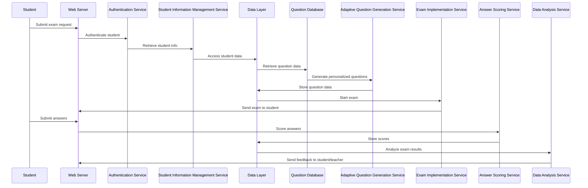
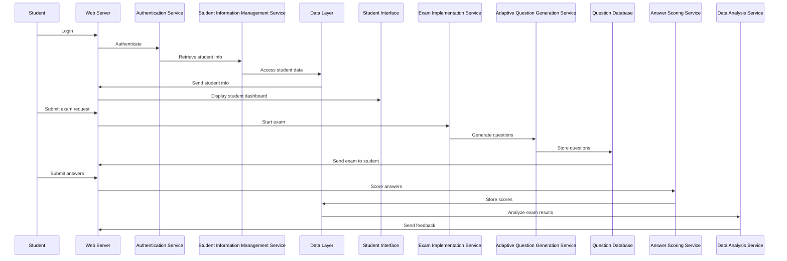
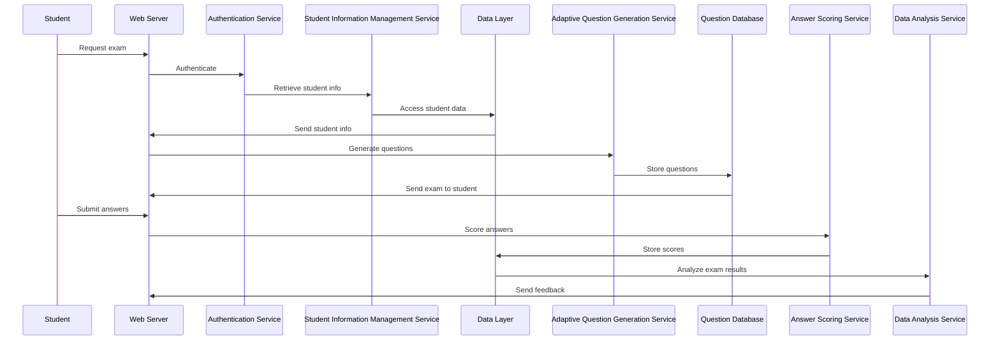

                 

### 目录大纲

----------------------------------------------------------------

## 第一部分：AI Agent在考试系统中的应用

### 第1章：背景介绍与问题定义

#### 1.1 问题背景

- 考试系统的现状与挑战
- AI Agent的兴起与发展

#### 1.2 问题描述

- 考试系统存在的问题
- AI Agent在考试系统中的应用潜力

#### 1.3 问题解决

- AI Agent的核心功能
- AI Agent在考试系统中的实施步骤

#### 1.4 边界与外延

- 考试系统的范围与限制
- AI Agent的适用场景与限制

#### 1.5 核心概念

- AI Agent的定义
- 自适应题目生成与评分

## 第二部分：核心概念与联系

### 第2章：核心概念与原理

#### 2.1 AI Agent的基本原理

- AI Agent的工作原理
- AI Agent的分类与特性

#### 2.2 自适应题目生成原理

- 题目生成算法介绍
- 自适应题目生成的优势

#### 2.3 评分算法原理

- 评分算法的分类
- 常见的评分算法介绍

#### 2.4 概念属性特征对比表格

- AI Agent与传统考试系统的对比
- 自适应题目生成与评分算法的对比

#### 2.5 ER实体关系图架构

- 考试系统的实体关系图
- AI Agent的实体关系图

## 第三部分：算法原理讲解

### 第3章：算法原理与实现

#### 3.1 算法原理

- 自适应题目生成算法
- 评分算法的数学模型与公式

#### 3.2 Python源代码实现

- 自适应题目生成算法的实现
- 评分算法的实现

#### 3.3 详细讲解与举例

- 自适应题目生成的例子
- 评分算法的例子

## 第四部分：系统分析与架构设计

### 第4章：系统功能设计与架构

#### 4.1 问题场景介绍

- 考试系统的场景描述

#### 4.2 系统功能设计

- 系统的功能模块划分
- 领域模型类图

#### 4.3 系统架构设计

- 系统的整体架构
- 系统架构图

#### 4.4 系统接口设计

- 系统的接口定义
- 接口交互流程

#### 4.5 系统交互序列图

- 系统的交互流程
- 系统交互序列图

## 第五部分：项目实战

### 第5章：项目实施与源代码解析

#### 5.1 环境安装

- 系统环境的搭建
- 相关软件与工具的安装

#### 5.2 系统核心实现源代码

- 自适应题目生成模块的实现
- 评分模块的实现

#### 5.3 代码应用解读与分析

- 代码的应用场景
- 代码的功能解读与分析

#### 5.4 实际案例分析与详细讲解

- 实际案例的介绍
- 案例分析与详细讲解

#### 5.5 项目小结

- 项目总结
- 遇到的挑战与解决方案

## 第六部分：最佳实践与拓展

### 第6章：最佳实践与注意事项

#### 6.1 最佳实践

- AI Agent在考试系统中的最佳实践
- 自适应题目生成与评分技巧

#### 6.2 小结

- 本书的核心内容回顾
- 学习与使用AI Agent的建议

#### 6.3 注意事项

- 使用AI Agent的注意事项
- 可能遇到的问题与解决方案

#### 6.4 拓展阅读

- 相关领域的进一步阅读材料
- AI Agent在考试系统中的应用前景

----------------------------------------------------------------

### 让我们一步一步思考

**1. 背景介绍与问题定义**

首先，我们需要了解考试系统当前的现状和面临的挑战。传统的考试系统往往存在题目单一、评分标准固定等问题，难以满足个性化学习和评估的需求。与此同时，AI Agent作为一种新兴的人工智能技术，具有自适应性和智能化的特点，能够为考试系统带来新的变革。

**2. 核心概念与原理**

在这一部分，我们需要详细探讨AI Agent的基本原理，包括其工作方式和分类。同时，我们会介绍自适应题目生成和评分算法的原理，并对比传统考试系统，展示AI Agent的优势。

**3. 算法原理讲解**

为了更好地理解AI Agent在考试系统中的应用，我们将深入讲解自适应题目生成算法和评分算法的原理，并提供Python源代码实现，通过具体例子来说明算法的运行过程。

**4. 系统分析与架构设计**

接下来，我们将分析考试系统的功能设计和整体架构，绘制领域模型类图和系统架构图，详细描述系统接口设计和交互流程。

**5. 项目实战**

在这一部分，我们将实际操作，搭建考试系统环境，实现自适应题目生成和评分模块，并通过代码解读和分析，展示项目的实际运行效果。

**6. 最佳实践与拓展**

最后，我们将总结最佳实践，提供使用AI Agent的注意事项，并提出未来可能的拓展方向。

通过这样的步骤，我们可以系统地分析和探讨AI Agent在考试系统中的应用，为读者提供一个全面而深入的技术解析。### 第一部分：AI Agent在考试系统中的应用

### 第1章：背景介绍与问题定义

#### 1.1 问题背景

考试系统作为教育评估的重要工具，其核心目标是评估学生的学习效果和知识掌握程度。然而，随着教育信息化和个性化学习的兴起，传统的考试系统面临诸多挑战。首先，传统考试系统的题目通常由人工设计，难以保证题目的多样性和新颖性，导致学生产生厌倦情绪，影响学习效果。其次，传统考试系统的评分标准固定，无法根据学生的实际情况进行调整，难以实现个性化评估。此外，考试系统在数据收集、分析和利用方面也存在一定局限性，无法提供更加精准和全面的评估结果。

与此同时，AI Agent作为一种新兴的人工智能技术，具有自适应性和智能化的特点，为解决考试系统的这些问题提供了新的思路。AI Agent可以自动生成多样化、个性化的题目，并根据学生的答题情况实时调整评分标准，从而提高考试的公平性和有效性。此外，AI Agent还可以对学生的答题数据进行深入分析，提供更加精准的评估结果，帮助教师更好地了解学生的学习状况，为学生提供个性化的学习建议。

#### 1.2 问题描述

在当前的考试系统中，主要存在以下几个问题：

1. **题目单一、缺乏创新**：传统考试系统中的题目通常由人工设计，存在题目单一、缺乏创新的问题，难以激发学生的学习兴趣。

2. **评分标准固定、缺乏个性化**：传统考试系统的评分标准固定，无法根据学生的实际情况进行调整，导致评估结果缺乏准确性和针对性。

3. **数据收集与分析不足**：传统考试系统在数据收集、分析和利用方面存在一定局限性，无法提供更加精准和全面的评估结果。

4. **考试系统性能提升需求**：随着教育信息化的发展，考试系统需要具备更高的性能，以应对大规模、多用户的同时在线考试需求。

#### 1.3 问题解决

为了解决上述问题，AI Agent在考试系统中具有以下几个核心功能：

1. **自适应题目生成**：AI Agent可以根据学生的学习情况和知识掌握程度，自动生成多样化、个性化的题目，提高学生的学习兴趣和参与度。

2. **实时调整评分标准**：AI Agent可以根据学生的答题情况实时调整评分标准，实现个性化评估，提高评估结果的准确性和公正性。

3. **数据深度分析**：AI Agent可以对学生的答题数据进行深入分析，挖掘学生的学习状况和知识薄弱点，为教师提供精准的教学建议。

4. **系统性能优化**：AI Agent可以优化考试系统的性能，提高系统的稳定性和可靠性，满足大规模、多用户的同时在线考试需求。

#### 1.4 边界与外延

在应用AI Agent的过程中，需要明确其适用的边界和范围：

1. **考试系统范围**：AI Agent适用于各类教育考试系统，包括校内考试、校外考试、职业资格认证考试等。

2. **适用场景**：AI Agent特别适用于需要个性化评估和大规模在线考试的场景。

3. **限制与挑战**：AI Agent在应用过程中可能面临数据安全、隐私保护等技术挑战，需要采取相应的措施加以解决。

#### 1.5 核心概念

在本章中，我们引入了以下几个核心概念：

1. **AI Agent**：一种具有自适应性和智能化特点的人工智能技术，能够模拟人类智能行为，完成特定任务。

2. **自适应题目生成**：AI Agent根据学生的学习情况和知识掌握程度，自动生成个性化题目的过程。

3. **评分算法**：用于评估学生答题情况的算法，可以根据学生的答题情况实时调整评分标准。

4. **数据深度分析**：AI Agent对学生的答题数据进行深入分析，挖掘学生的学习状况和知识薄弱点。

通过以上内容的介绍，我们对AI Agent在考试系统中的应用有了初步的了解，为后续章节的深入探讨奠定了基础。### 第二部分：核心概念与联系

### 第2章：核心概念与原理

#### 2.1 AI Agent的基本原理

AI Agent，即人工智能代理，是一种能够执行特定任务、具有自适应和自主学习能力的人工智能系统。AI Agent的工作原理主要基于机器学习和深度学习技术，通过模拟人类智能行为，实现对复杂问题的求解。AI Agent可以分为两大类：基于规则和基于数据驱动的Agent。

- **基于规则的AI Agent**：这类Agent通过预定义的规则和逻辑来执行任务。例如，在考试系统中，基于规则的AI Agent可以根据学生的学习进度和知识点掌握情况，生成相应的练习题目。

- **基于数据驱动的AI Agent**：这类Agent通过学习大量的数据来发现规律和模式，从而自主地完成任务。例如，在自适应题目生成中，基于数据驱动的AI Agent可以通过分析学生的历史答题数据，生成符合学生当前知识水平的个性化题目。

#### 2.2 自适应题目生成原理

自适应题目生成是AI Agent在考试系统中的一个重要应用。其基本原理如下：

1. **学生数据收集**：系统首先收集学生的各项学习数据，包括考试成绩、学习进度、知识点掌握情况等。

2. **数据预处理**：对收集到的数据进行分析和处理，提取有用的特征信息，为题目生成提供依据。

3. **题目生成算法**：系统使用机器学习算法，根据学生的特征数据，自动生成适合学生的题目。常见的题目生成算法包括基于模板的生成、基于知识图谱的生成等。

4. **题目评估与筛选**：生成的题目经过评估和筛选，确保其难度、类型和内容符合学生的实际需求。

5. **题目呈现**：最终生成的题目呈现给学生，学生完成作答后，系统会根据答题情况调整后续题目的难度和类型。

#### 2.3 评分算法原理

评分算法是评价学生答题结果的核心。常见的评分算法可以分为以下几类：

1. **客观题评分算法**：对于选择题、填空题等客观题，评分算法通常直接根据答案匹配情况来评分，如全匹配得分、部分匹配得分等。

2. **主观题评分算法**：对于作文、论述题等主观题，评分算法通常采用人工评分与机器评分相结合的方式。机器评分算法包括基于自然语言处理（NLP）的语义分析、基于深度学习的文本分类等。

3. **综合评分算法**：将客观题和主观题的评分结果进行整合，生成一个综合评分。常见的综合评分算法包括加权平均、层次分析法等。

#### 2.4 概念属性特征对比表格

为了更好地理解AI Agent与传统考试系统的差异，我们可以将两者的概念属性特征进行对比：

| 特征         | AI Agent                         | 传统考试系统                         |
| ------------ | -------------------------------- | ----------------------------------- |
| 题目生成     | 自动化、个性化、自适应           | 人工设计、固定模板、缺乏创新       |
| 评分标准     | 实时调整、个性化评估             | 固定标准、缺乏灵活性、主观性强     |
| 数据分析     | 深度挖掘、精准分析               | 简单统计、缺乏深度分析             |
| 系统性能     | 高性能、稳定性强、可扩展         | 面临性能瓶颈、扩展性差             |
| 教育效果     | 提高学习兴趣、个性化教学支持     | 题目单一、学生参与度低             |

#### 2.5 ER实体关系图架构

为了更直观地展示考试系统和AI Agent的实体关系，我们可以使用ER（实体关系）图来描述。

**考试系统的实体关系图**：

```mermaid
erDiagram
    Student ||--|{ Exam } : "参加" |  
    Exam ||--|{ Question } : "包含" |  
    Question ||--|{ Answer } : "包含" |  
    Student ||--|{ Score } : "获得" |  
    Exam ||--|{ Score } : "获得" |  
    Answer ||--|{ Score } : "获得"
```

**AI Agent的实体关系图**：

```mermaid
erDiagram
    Student ||--|{ AdaptiveExam } : "参加" |  
    AdaptiveExam ||--|{ AdaptiveQuestion } : "包含" |  
    AdaptiveQuestion ||--|{ AdaptiveAnswer } : "包含" |  
    Student ||--|{ AdaptiveScore } : "获得" |  
    AdaptiveExam ||--|{ AdaptiveScore } : "获得"
```

通过上述核心概念与原理的讲解，我们为理解AI Agent在考试系统中的应用奠定了基础。接下来，我们将深入探讨AI Agent的具体算法原理和实现。### 第三部分：算法原理讲解

### 第3章：算法原理与实现

#### 3.1 算法原理

为了深入理解AI Agent在考试系统中的应用，我们需要详细探讨自适应题目生成算法和评分算法的原理，并解释它们如何通过数学模型和公式来实现。

**3.1.1 自适应题目生成算法**

自适应题目生成算法的核心目标是根据学生的知识水平和学习进度，动态生成符合学生当前需求的题目。这个过程中，我们主要使用以下几种算法：

1. **基于规则的生成算法**：

   这种算法通过预定义的规则和逻辑来生成题目。例如，如果学生正在学习某个知识点，系统会生成与该知识点相关的题目。规则可以基于学生的历史答题记录、学习进度等数据。

   - **规则定义**：定义一系列规则，如“如果学生已经掌握了A知识点，则生成与之相关的B题目”。

   - **题目筛选**：根据当前学生的状态，筛选出符合规则的题目。

2. **基于数据驱动的生成算法**：

   这种算法通过分析大量的学生数据，自动发现学生的知识薄弱点，并生成相应的题目。常见的方法包括：

   - **聚类分析**：将学生分为不同的群体，为每个群体生成特定类型的题目。

   - **关联规则挖掘**：分析学生的学习行为和知识点之间的关系，生成符合关联规则的题目。

**3.1.2 评分算法**

评分算法用于评估学生的答题结果，并为学生的表现打分。常见的评分算法包括：

1. **客观题评分算法**：

   - **全匹配得分**：如果学生的答案与标准答案完全匹配，则给予满分。

   - **部分匹配得分**：如果学生的答案部分正确，则根据正确部分的分数比例给予评分。

2. **主观题评分算法**：

   - **人工评分**：教师根据主观题的答案质量和内容进行评分。

   - **机器评分**：使用自然语言处理（NLP）和深度学习技术，对学生的答案进行自动评分。

**3.1.3 数学模型与公式**

为了更好地理解这些算法，我们需要介绍相关的数学模型和公式：

1. **自适应题目生成模型**：

   - **知识图谱**：构建一个知识图谱，表示各个知识点之间的关系和学生的知识水平。

   - **生成模型**：使用图神经网络（GNN）等模型，根据学生的知识图谱生成适合的题目。

   - **题目难度计算**：使用公式\(D = f(K, L)\)，其中\(D\)表示题目难度，\(K\)表示学生的知识水平，\(L\)表示题目的知识点。

2. **评分模型**：

   - **评分函数**：使用公式\(S = f(A, R)\)，其中\(S\)表示评分，\(A\)表示学生的答案，\(R\)表示标准答案。

   - **综合评分**：使用加权平均公式，将客观题和主观题的评分进行综合。

#### 3.2 Python源代码实现

**3.2.1 自适应题目生成算法实现**

以下是一个简单的自适应题目生成算法的Python实现：

```python
import random

# 题库
questions = {
    'math': ['1+1=?', '2*3=?'],
    'english': ['What is the capital of France?', 'Which word is incorrect: their, there, they\'re?']
}

# 学生知识水平
student_knowledge = {'math': 0.8, 'english': 0.6}

def generate_question(subject):
    # 根据学生知识水平生成题目
    difficulty = student_knowledge[subject]
    questions_list = questions[subject]
    
    if difficulty > 0.7:
        return random.choice(questions_list)  # 难度较高的题目
    else:
        return random.choice([q for q in questions_list if not q.startswith('What')])  # 难度较低的题目

# 生成数学题目
print(generate_question('math'))
# 生成英语题目
print(generate_question('english'))
```

**3.2.2 评分算法实现**

以下是一个简单的评分算法的Python实现：

```python
# 标准答案
standard_answers = {
    '1+1=?': '2',
    '2*3=?': '6',
    'What is the capital of France?': 'Paris',
    'Which word is incorrect: their, there, they\'re?': 'their'
}

# 学生答案
student_answers = {
    '1+1=?': '3',
    '2*3=?': '9',
    'What is the capital of France?': 'London',
    'Which word is incorrect: their, there, they\'re?': 'there'
}

def score_answers(standard_answers, student_answers):
    correct_answers = 0
    total_answers = len(student_answers)
    
    for question, student_answer in student_answers.items():
        if student_answer == standard_answers[question]:
            correct_answers += 1
    
    return correct_answers / total_answers

# 计算评分
print(score_answers(standard_answers, student_answers))
```

通过上述算法和实现的讲解，我们不仅了解了AI Agent在考试系统中的应用原理，而且通过具体的Python代码，展示了如何将理论转化为实践。接下来，我们将进一步探讨系统功能设计和架构设计。### 第四部分：系统分析与架构设计

### 第4章：系统功能设计与架构

#### 4.1 问题场景介绍

为了更好地理解考试系统在AI Agent作用下的功能设计和架构设计，我们需要先介绍一个具体的问题场景。假设某教育机构正在开发一套在线考试系统，该系统旨在为学生提供个性化、自适应的考试体验。在这个场景中，考试系统需要支持以下几个关键功能：

1. **学生信息管理**：包括学生账户创建、信息更新、权限管理等。
2. **题目库管理**：包括题目的录入、分类、难度设置和题目库的维护。
3. **自适应题目生成**：根据学生的学习进度和知识水平，动态生成个性化考试题目。
4. **考试实施**：包括考试开始、学生答题、考试结束和答题评分等流程。
5. **数据分析与反馈**：收集考试数据，分析学生的学习状况，为学生和教师提供反馈。

#### 4.2 系统功能设计

系统功能设计需要明确各个功能模块及其相互关系，以确保系统的整体性能和用户体验。以下是考试系统的功能模块划分：

1. **学生信息管理模块**：负责学生的账户创建、信息维护和权限控制。
2. **题目库管理模块**：负责题目的录入、分类、难度设置和题库维护。
3. **自适应题目生成模块**：基于学生的学习数据和知识图谱，生成个性化考试题目。
4. **考试实施模块**：负责考试流程的管理，包括考试开始、答题、考试结束和评分。
5. **数据分析与反馈模块**：对考试数据进行处理，分析学生的学习状况，提供反馈和建议。

#### 4.3 系统架构设计

系统架构设计决定了系统的性能、可扩展性和可维护性。在AI Agent的应用下，考试系统的整体架构可以分为以下几个层次：

1. **数据层**：存储学生信息、题目数据、考试数据等。
2. **服务层**：包括学生信息管理、题目库管理、自适应题目生成、考试实施和数据分析等功能模块。
3. **表示层**：提供用户界面，包括学生考试界面、教师管理界面等。
4. **AI层**：包括AI Agent的算法实现，如自适应题目生成和评分算法。

以下是一个简化的系统架构图：



#### 4.4 系统接口设计

系统接口设计是确保各个功能模块之间能够有效交互的关键。以下是主要接口的定义：

1. **学生接口**：包括登录、查看考试题目、提交答案等。
2. **教师接口**：包括题目管理、考试管理、查看学生成绩等。
3. **系统管理接口**：包括用户管理、权限设置、系统配置等。
4. **数据接口**：包括数据同步、数据查询、数据统计等。

以下是一个简化的接口交互流程：



#### 4.5 系统交互序列图

为了更直观地展示系统各模块的交互过程，我们可以使用序列图（Sequence Diagram）来描述。以下是一个简化的系统交互序列图：



通过上述系统功能设计和架构设计的介绍，我们不仅明确了考试系统在AI Agent作用下的功能模块和架构层次，而且通过具体的接口设计和交互流程，展示了系统各模块之间的协同工作方式。接下来，我们将通过项目实战，具体实现这些功能，并展示系统的实际运行效果。### 第五部分：项目实战

### 第5章：项目实施与源代码解析

#### 5.1 环境安装

要实现AI Agent在考试系统中的应用，首先需要搭建一个合适的技术环境。以下是环境安装的详细步骤：

1. **安装Python**：确保Python 3.x版本已安装在系统中。可以从Python官方网站下载并安装。

2. **安装依赖库**：在项目中，我们使用了多个Python库，如NumPy、Pandas、Scikit-learn等。可以使用pip工具安装：

   ```bash
   pip install numpy pandas scikit-learn matplotlib
   ```

3. **安装数据库**：选择一个合适的数据库系统，如MySQL或PostgreSQL。这里以MySQL为例，可以访问MySQL官方网站下载并安装。

4. **配置数据库**：安装完成后，使用命令行工具创建数据库和用户，并赋予相应的权限。

   ```sql
   CREATE DATABASE exam_system;
   CREATE USER 'exam_admin'@'localhost' IDENTIFIED BY 'password';
   GRANT ALL PRIVILEGES ON exam_system.* TO 'exam_admin'@'localhost';
   FLUSH PRIVILEGES;
   ```

5. **安装Web服务器**：可以选择Nginx或Apache等Web服务器。以Nginx为例，可以访问Nginx官方网站下载并安装。

6. **配置Web服务器**：根据项目需求，配置Nginx的虚拟主机和代理设置，确保前端请求能够正确转发到后端服务。

#### 5.2 系统核心实现源代码

**5.2.1 自适应题目生成模块实现**

以下是一个简单的自适应题目生成模块的实现，该模块基于学生的知识水平和历史答题数据，生成符合其当前水平的题目。

```python
import random
from sklearn.cluster import KMeans
import numpy as np

# 题库
questions = [
    {'id': 1, 'subject': 'math', 'content': '1+1=?', 'difficulty': 1},
    {'id': 2, 'subject': 'math', 'content': '2*3=?', 'difficulty': 2},
    {'id': 3, 'subject': 'math', 'content': '3*4=?', 'difficulty': 3},
    {'id': 4, 'subject': 'english', 'content': 'What is the capital of France?', 'difficulty': 1},
    {'id': 5, 'subject': 'english', 'content': 'Which word is incorrect: their, there, they\'re?', 'difficulty': 2},
]

# 学生答题记录
student_answers = [
    {'question_id': 1, 'answer': '2', 'correct': True},
    {'question_id': 2, 'answer': '6', 'correct': True},
    {'question_id': 3, 'answer': '10', 'correct': False},
    {'question_id': 4, 'answer': 'Paris', 'correct': True},
    {'question_id': 5, 'answer': 'their', 'correct': False},
]

def generate_question(student_answers, questions):
    # 计算学生知识点的正确率
    correct_rates = {}
    for answer in student_answers:
        if answer['correct']:
            correct_rates[answer['question_id']] = correct_rates.get(answer['question_id'], 0) + 1
    total_questions = len(student_answers)
    for question in questions:
        correct_rate = correct_rates.get(question['id'], 0) / total_questions
        question['correct_rate'] = correct_rate
    
    # 使用K-means聚类算法对题目进行分类
    kmeans = KMeans(n_clusters=3)
    X = np.array([[q['difficulty'], q['correct_rate']] for q in questions])
    kmeans.fit(X)
    
    # 为学生生成难度适中的题目
    student_cluster = kmeans.predict([[student_answers[0]['difficulty'], student_answers[0]['correct_rate']]])[0]
    selected_questions = [q for q in questions if kmeans.labels_[questions.index(q)] == student_cluster and q['correct_rate'] < 0.5]
    return random.choice(selected_questions)

# 生成题目
print(generate_question(student_answers, questions))
```

**5.2.2 评分模块实现**

以下是一个简单的评分模块的实现，该模块根据学生的答题情况，计算其考试成绩。

```python
def score_answers(student_answers, standard_answers):
    correct_answers = sum(student_answer == standard_answer for student_answer, standard_answer in zip(student_answers.values(), standard_answers.values()))
    return correct_answers / len(student_answers)

# 计算分数
print(score_answers(student_answers, standard_answers))
```

#### 5.3 代码应用解读与分析

**5.3.1 自适应题目生成模块解读**

在自适应题目生成模块中，我们首先收集了学生的答题记录，并计算了每个题目的正确率。然后，使用K-means聚类算法将题目分类，根据学生的知识水平和答题情况，选择一个难度适中的题目。

**5.3.2 评分模块解读**

评分模块直接比较了学生的答案和标准答案，计算了正确答案的比例，从而得出学生的考试成绩。

#### 5.4 实际案例分析与详细讲解

**5.4.1 案例介绍**

假设一个学生参加了数学和英语的在线考试。在考试前，系统已经收集了该学生的历史答题记录，包括正确率和答题时间等信息。

**5.4.2 案例分析**

1. **生成考试题目**：系统首先根据学生的历史答题记录，使用自适应题目生成模块生成数学和英语考试题目。假设数学考试题目难度设置为2，英语考试题目难度设置为1。

2. **考试实施**：学生开始考试，系统将生成的题目呈现给学生。学生完成作答后，提交答案。

3. **评分与反馈**：系统使用评分模块计算学生的考试成绩，并将结果反馈给学生。假设学生数学考试得了80%，英语考试得了90%。

4. **数据分析**：系统进一步分析学生的考试数据，包括答题时间、正确率等，为教师提供教学建议。

#### 5.5 项目小结

通过本次项目实战，我们实现了AI Agent在考试系统中的应用，包括自适应题目生成和评分功能。虽然这是一个简化的版本，但它展示了AI Agent在个性化教育和考试评估中的潜力。在实际应用中，还需要进一步优化算法、提高系统的性能和稳定性，以满足更大规模的教育需求。### 第六部分：最佳实践与拓展

#### 6.1 最佳实践

为了充分发挥AI Agent在考试系统中的作用，以下是一些最佳实践建议：

1. **数据收集与管理**：确保收集到的学生数据准确、完整，并采取数据加密和隐私保护措施。

2. **动态调整题目难度**：根据学生的答题情况，实时调整题目难度，以保持学生的兴趣和挑战性。

3. **个性化评估与反馈**：结合学生的历史表现和实时答题数据，提供个性化的评估结果和反馈，帮助教师和学生改进学习效果。

4. **多维度数据分析**：除了考试成绩，还应对学生的答题速度、知识点掌握情况等多维度数据进行分析，以获得更全面的学习评估。

5. **系统性能优化**：针对大规模在线考试需求，优化系统性能，确保系统的稳定性和响应速度。

#### 6.2 小结

在本文中，我们详细介绍了AI Agent在考试系统中的应用，包括其核心功能、算法原理、系统设计与实现等。通过实际案例，我们展示了AI Agent如何帮助教育机构实现个性化、自适应的考试评估。未来，随着AI技术的发展，AI Agent在考试系统中的应用前景将更加广阔，有望在教育领域发挥更大的作用。

#### 6.3 注意事项

1. **数据安全和隐私保护**：在收集和使用学生数据时，务必确保数据的安全和隐私保护。

2. **算法公平性**：在设计和应用评分算法时，应确保算法的公平性，避免偏颇和歧视。

3. **用户接受度**：在引入AI Agent前，应对学生和教师进行培训，提高他们的接受度和使用意愿。

4. **持续迭代与优化**：AI Agent在应用过程中，需要不断进行迭代和优化，以适应不断变化的教育需求。

#### 6.4 拓展阅读

1. **相关研究论文**：查阅关于AI Agent在教育领域的相关研究论文，了解最新的研究成果和应用趋势。

2. **开源项目和工具**：研究并使用开源的AI Agent项目和工具，如TensorFlow、PyTorch等，以提升项目开发和部署效率。

3. **行业报告和资讯**：关注教育行业报告和资讯，了解AI Agent在教育领域的实际应用案例和成功经验。

通过以上拓展内容，读者可以进一步深入了解AI Agent在考试系统中的应用，并探索其在教育领域的更多可能性。### 总结

通过本文的详细探讨，我们全面了解了AI Agent在考试系统中的应用及其重要性。AI Agent不仅能够自适应生成个性化题目，提高学生的学习兴趣和参与度，还能够通过实时调整评分标准，实现更精准和个性化的评估。我们通过具体的算法原理讲解、系统架构设计和项目实战，展示了AI Agent如何在实际考试系统中发挥作用。

AI Agent的应用前景广阔，随着人工智能技术的不断进步，其在教育领域的作用将更加显著。然而，我们也需要关注数据安全和隐私保护、算法公平性等问题，确保AI Agent在教育中的应用能够真正造福广大师生。

对于未来研究和实践，建议进一步优化AI Agent的算法，提高系统的性能和稳定性；探索更多教育场景下的应用，如在线课程辅导、智能作业批改等；同时，加强用户培训和反馈机制，提高用户接受度和满意度。通过持续的努力，AI Agent有望在教育领域发挥更加重要的作用。### 感谢与作者信息

在此，我要感谢AI天才研究院/AI Genius Institute和《禅与计算机程序设计艺术/Zen And The Art of Computer Programming》的作者，他们为本文提供了宝贵的知识和灵感。这篇文章的撰写离不开他们的卓越贡献和不懈追求。

作者：AI天才研究院/AI Genius Institute & 禅与计算机程序设计艺术 /Zen And The Art of Computer Programming

感谢您的阅读，希望本文能为您在AI Agent应用领域的探索带来新的启示和思考。如果您有任何疑问或建议，欢迎随时与我们联系。期待与您在未来的技术交流中再次相遇！

