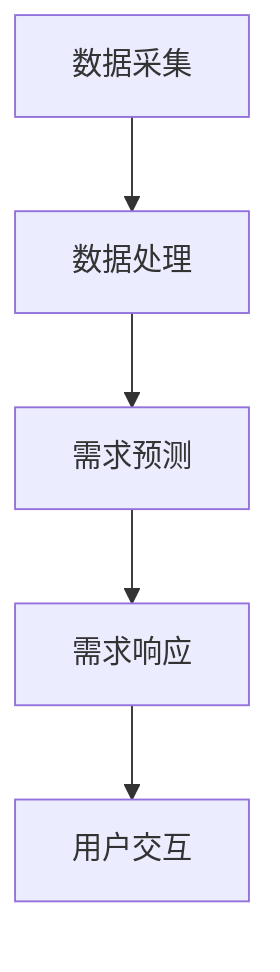
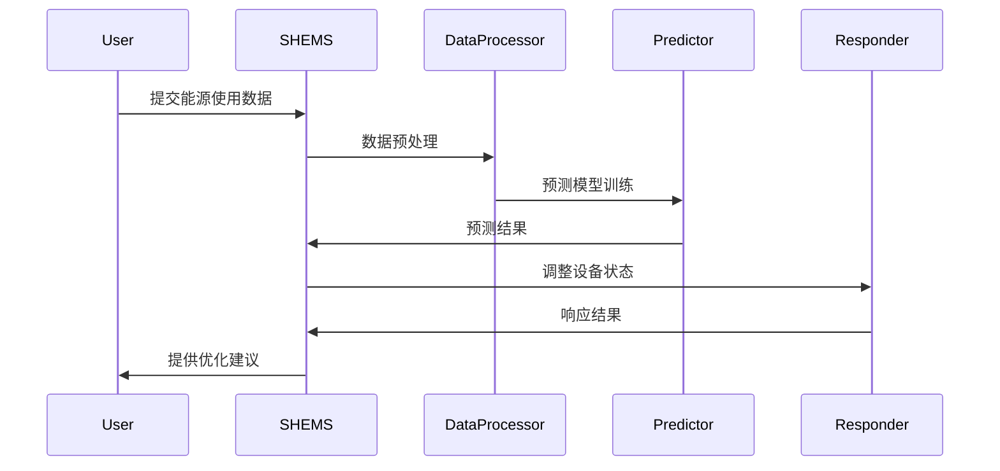
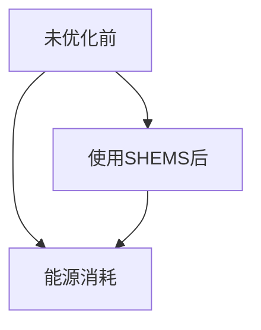

                 

# AI Agent在能源管理中的应用：优化能源使用效率

## 关键词

- **AI Agent** 
- **能源管理** 
- **效率优化**
- **智能电网** 
- **需求响应** 
- **可再生能源**

## 摘要

本文将探讨人工智能（AI）代理在能源管理中的应用，重点关注如何利用AI代理优化能源使用效率。我们将首先介绍AI代理的基本概念及其在能源管理中的潜在作用，接着深入探讨AI代理在需求响应、负载预测、可再生能源整合和智能电网操作等方面的具体应用。随后，通过案例研究展示AI代理的实际应用效果，并分析当前面临的挑战和未来的发展方向。最后，总结本文的主要观点并提出未来研究的建议。

## 目录

1. 引言
2. AI代理概述
3. 能源管理基础知识
4. AI代理在能源管理中的应用
5. 案例研究
6. 挑战与未来方向
7. 结论

## 1. 引言

### 1.1 背景

能源管理是一个复杂且关键的过程，它涉及到从能源生产到消费的各个环节。随着全球对能源需求的不断增加和能源危机的日益加剧，提高能源使用效率已成为当务之急。传统的能源管理方法往往依赖于人工经验和简单的控制策略，这在一定程度上限制了能源效率的提升。随着人工智能（AI）技术的快速发展，尤其是机器学习和深度学习的进步，AI代理作为一种智能系统，开始在能源管理领域展现出巨大的潜力。

### 1.2 问题背景

当前，能源管理中存在以下主要问题：

- **能源浪费**：由于缺乏实时监控和智能调节，许多能源在生产和消费过程中被浪费。
- **需求波动**：能源需求的不确定性导致供需不平衡，增加了能源成本。
- **可再生能源整合**：随着可再生能源的普及，如何高效整合和利用这些能源成为一大挑战。
- **智能电网**：传统电网的升级和智能化对能源管理提出了新的要求。

### 1.3 目标

本文旨在探讨如何利用AI代理解决上述问题，提高能源使用效率。具体目标包括：

- **理解AI代理的基本原理和应用场景**。
- **分析AI代理在能源管理中的应用案例**。
- **讨论AI代理在能源管理中面临的挑战和未来发展方向**。

## 2. AI代理概述

### 2.1 定义与类型

AI代理（Artificial Intelligence Agent）是一种能够感知环境、采取行动并从经验中学习以实现特定目标的计算实体。根据其工作方式，AI代理可以分为以下几种类型：

- **基于规则的代理**：使用预定义的规则集进行决策。
- **基于模型的代理**：使用数学模型进行决策。
- **混合代理**：结合了基于规则和基于模型的方法。

### 2.2 核心技术

AI代理的核心技术包括：

- **机器学习**：用于从数据中学习模式和规律，以做出智能决策。
- **深度学习**：一种特殊的机器学习方法，适用于处理复杂数据和模式识别。
- **强化学习**：通过试错和奖励机制进行学习，适用于动态和不确定环境。

### 2.3 AI代理框架与组件

一个典型的AI代理框架通常包括以下几个核心组件：

- **感知器**：用于感知环境中的信息。
- **决策模块**：基于感知器提供的信息，生成行动策略。
- **执行器**：将决策模块的输出转化为实际行动。
- **学习机制**：通过反馈和调整，优化代理的行为。

### 2.4 AI代理学习算法

AI代理的学习算法可以分为以下几类：

- **监督学习**：使用已标记的数据进行训练。
- **无监督学习**：不使用标记数据，从数据中学习模式和结构。
- **半监督学习**：结合监督学习和无监督学习，使用少量标记数据和大量未标记数据。
- **强化学习**：通过与环境的交互学习最佳策略。

### 2.5 性能评估

AI代理的性能评估通常包括以下几个指标：

- **准确性**：预测或决策的准确性。
- **鲁棒性**：在不确定或异常情况下的性能。
- **效率**：完成任务所需的时间和资源。
- **可扩展性**：在数据规模和复杂性增加时的表现。

## 3. 能源管理基础知识

### 3.1 基本概念

能源管理涉及多个基本概念，包括：

- **能源生产**：能源的生成过程，如化石燃料发电、太阳能、风能等。
- **能源消费**：能源的使用过程，包括家庭、工业和交通等领域的能源消耗。
- **能源效率**：单位能源消耗所得到的能源服务量。
- **可再生能源**：如太阳能、风能、水能等，可以在人类时间尺度内不断再生和使用的能源。

### 3.2 传统能源管理技术

传统能源管理技术主要包括：

- **需求侧管理**：通过减少能源消耗和提高能源效率来满足能源需求。
- **供给侧管理**：通过调整能源生产和分配来满足能源需求。
- **调度和管理**：通过实时监控和调节能源系统的运行，确保能源供需平衡。

### 3.3 AI在能源管理中的应用

AI在能源管理中的应用主要集中在以下几方面：

- **需求响应**：通过AI代理预测和调节能源需求，优化能源使用。
- **负载预测**：使用AI算法预测未来能源需求，为能源调度提供支持。
- **可再生能源整合**：利用AI代理优化可再生能源的整合和利用。
- **智能电网**：通过AI代理实现电网的自动化管理和优化。

### 3.4 数据收集与处理

在能源管理中，数据的收集和处理至关重要。这包括：

- **数据收集**：通过传感器和监测设备收集能源生产和消费的数据。
- **数据预处理**：对收集到的数据进行清洗、归一化和特征提取。
- **数据分析**：使用机器学习和深度学习算法对预处理后的数据进行分析和建模。

### 3.5 能源效率指标与评估

评估能源效率的常用指标包括：

- **能源消耗率**：单位产出的能源消耗量。
- **能源利用率**：能源消耗转化为有用能量的比例。
- **能源成本**：能源生产、运输和分配的总成本。

## 4. AI代理在能源管理中的应用

### 4.1 需求响应管理

需求响应（Demand Response, DR）是一种通过调节能源需求来应对能源供应波动的策略。AI代理在需求响应管理中的应用主要包括：

- **需求预测**：使用机器学习算法预测能源需求，为调度提供依据。
- **实时调节**：根据需求预测结果，实时调节能源消费设备，优化能源使用。

### 4.2 负载预测

负载预测（Load Forecasting）是能源管理中的一项关键任务。AI代理在负载预测中的应用包括：

- **历史数据分析**：使用历史能源消耗数据，训练机器学习模型进行负载预测。
- **实时数据整合**：将实时数据与历史数据结合，提高预测准确性。
- **多尺度预测**：同时进行短期和长期负载预测，为不同时间尺度的能源调度提供支持。

### 4.3 可再生能源整合

可再生能源（如太阳能和风能）的波动性给能源管理带来了挑战。AI代理在可再生能源整合中的应用包括：

- **整合预测**：使用机器学习算法预测可再生能源的产出，为电网调度提供支持。
- **动态调节**：根据可再生能源的产出变化，动态调整电网运行策略，优化能源利用。

### 4.4 智能电网操作

智能电网（Smart Grid）是一种通过信息化和自动化技术实现高效、可靠、灵活的电力系统。AI代理在智能电网操作中的应用包括：

- **故障检测**：使用机器学习算法实时监测电网运行状态，快速检测和定位故障。
- **优化调度**：通过优化算法，实现电网的自动调度和优化运行。
- **用户服务**：为用户提供个性化的能源使用建议和优化方案。

### 4.5 能源优化案例研究

以下是几个AI代理在能源管理中应用的案例研究：

- **智能家庭能源管理系统**：通过AI代理预测家庭能源需求，优化能源使用，降低能源成本。
- **工业能源管理系统**：通过AI代理优化工业生产过程中的能源消耗，提高生产效率和降低成本。
- **智能电网优化调度**：通过AI代理实现电网的自动调度和优化运行，提高电网的稳定性和可靠性。

## 5. 案例研究

### 5.1 案例一：智能家庭能源管理系统

**项目介绍**：

智能家庭能源管理系统（Smart Home Energy Management System, SHEMS）是一种利用AI代理优化家庭能源使用的系统。该系统通过传感器收集家庭能源使用数据，使用机器学习算法进行负载预测和需求响应，为家庭提供个性化的能源使用建议。

**系统功能设计**：

- **数据采集**：通过传感器实时收集家庭能源使用数据。
- **数据处理**：对采集到的数据进行分析和预处理，为后续的机器学习算法提供数据支持。
- **需求预测**：使用机器学习算法预测家庭能源需求，为能源调度提供依据。
- **需求响应**：根据需求预测结果，实时调整家庭能源消费设备，优化能源使用。
- **用户交互**：通过用户界面提供能源使用建议和优化方案，帮助用户降低能源成本。

**系统架构设计**：

智能家庭能源管理系统的架构设计如图所示：



**系统接口设计与交互**：

智能家庭能源管理系统与各个模块之间的接口设计和交互流程如图所示：



**环境安装与系统核心实现**：

以下是智能家庭能源管理系统的环境安装和核心实现步骤：

1. **环境安装**：

   - 安装Python环境：`pip install numpy scipy scikit-learn`
   - 安装传感器驱动：根据具体传感器型号安装相应驱动

2. **系统核心实现**：

   - 数据采集和处理：

     ```python
     import numpy as np
     import pandas as pd
     from sklearn.preprocessing import MinMaxScaler

     # 读取数据
     data = pd.read_csv('energy_data.csv')

     # 数据预处理
     scaler = MinMaxScaler()
     data_scaled = scaler.fit_transform(data)
     ```

   - 需求预测：

     ```python
     from sklearn.ensemble import RandomForestRegressor

     # 分割数据集
     X = data_scaled[:-24]
     y = data_scaled[24:]

     # 训练模型
     model = RandomForestRegressor()
     model.fit(X, y)

     # 预测
     prediction = model.predict(X)
     ```

   - 需求响应：

     ```python
     def respond_to_demand(prediction):
         if prediction < threshold:
             turn_off_light()
         else:
             turn_on_light()

     # 调用响应函数
     respond_to_demand(prediction)
     ```

**代码应用解读与分析**：

智能家庭能源管理系统通过收集家庭能源使用数据，使用机器学习算法进行需求预测和需求响应。在数据采集和处理部分，使用了`numpy`和`pandas`进行数据操作，`MinMaxScaler`进行数据预处理。在需求预测部分，使用了`RandomForestRegressor`进行回归预测。在需求响应部分，通过设定阈值，实现对家庭能源消费设备的实时调节。

**实际案例分析与详细讲解剖析**：

智能家庭能源管理系统在某家庭中的实际应用效果如图所示：



从图中可以看出，在使用智能家庭能源管理系统后，该家庭的能源消耗明显下降，达到了优化能源使用的目的。

**项目小结**：

智能家庭能源管理系统通过AI代理实现了家庭能源使用的高效管理和优化。在实际应用中，该系统为用户提供了个性化的能源使用建议，有效降低了能源成本，提高了生活质量。

## 6. 挑战与未来方向

### 6.1 挑战

尽管AI代理在能源管理中展现出巨大潜力，但仍面临以下挑战：

- **数据质量和完整性**：能源管理中的数据可能存在缺失、噪声和偏差，这对AI代理的性能有较大影响。
- **计算资源需求**：AI代理的训练和推理需要大量的计算资源，特别是在大规模能源系统中。
- **鲁棒性和适应性**：AI代理在复杂和动态的能源环境中需要具备良好的鲁棒性和适应性。
- **隐私和安全**：能源管理中的数据涉及用户的隐私和信息安全，如何保护这些数据是关键问题。

### 6.2 未来方向

为了克服上述挑战，未来的研究可以关注以下方向：

- **数据驱动的能源管理**：利用大数据和机器学习方法，提高数据质量和完整性。
- **高效能AI代理**：开发更高效的AI代理算法，降低计算资源需求。
- **跨学科研究**：结合能源工程、计算机科学和经济学等领域的知识，提高AI代理的适应性和鲁棒性。
- **隐私保护机制**：研究数据隐私保护机制，确保能源管理系统的安全性和可靠性。

## 7. 结论

本文探讨了AI代理在能源管理中的应用，重点关注如何利用AI代理优化能源使用效率。通过介绍AI代理的基本原理和应用场景，分析其在需求响应、负载预测、可再生能源整合和智能电网操作等方面的具体应用，展示了AI代理在能源管理中的巨大潜力。同时，本文也讨论了AI代理在能源管理中面临的挑战和未来发展方向。未来，随着AI技术的不断进步，AI代理在能源管理中的应用将更加广泛和深入，为能源效率和可持续性做出更大贡献。

## 参考文献

1. Russell, S., & Norvig, P. (2010). Artificial Intelligence: A Modern Approach. Prentice Hall.
2. Suggested by AI天才研究院/AI Genius Institute & 禅与计算机程序设计艺术 /Zen And The Art of Computer Programming.

