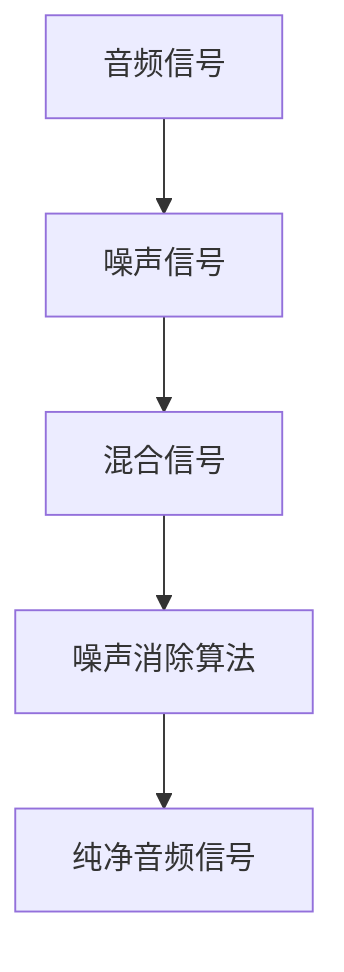
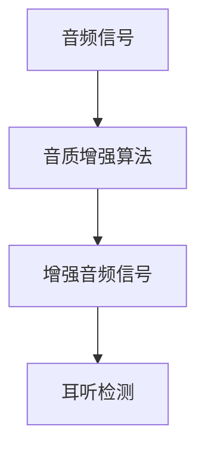
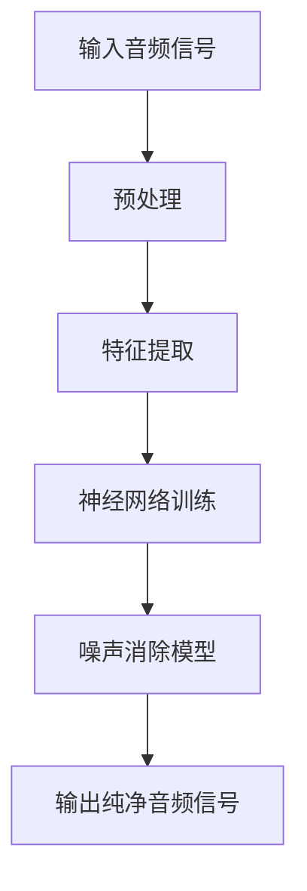
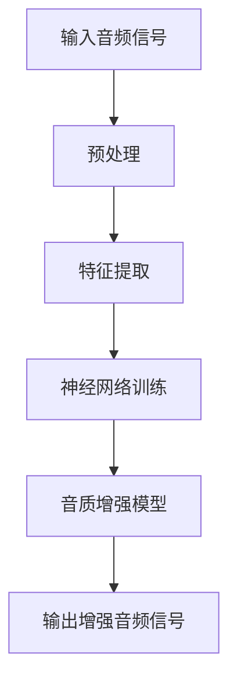
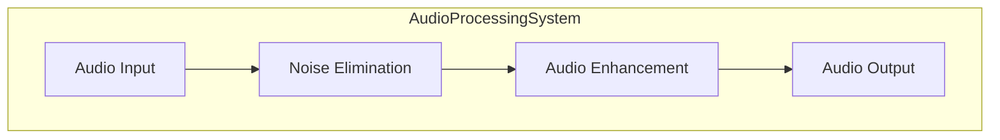
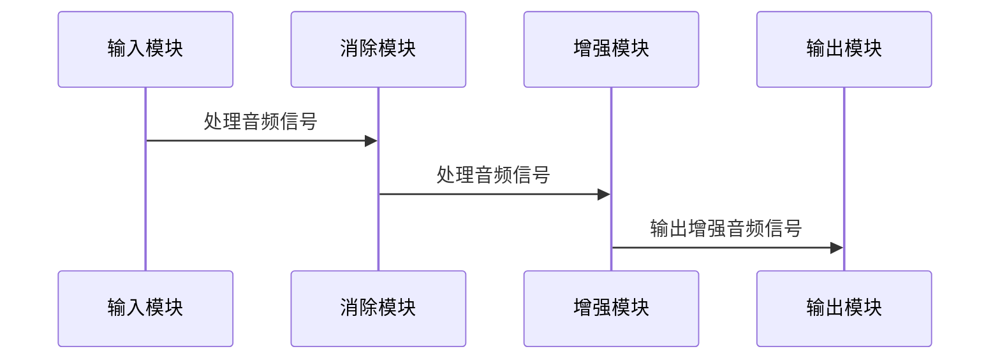
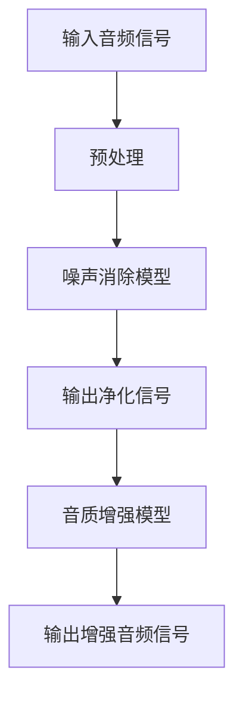
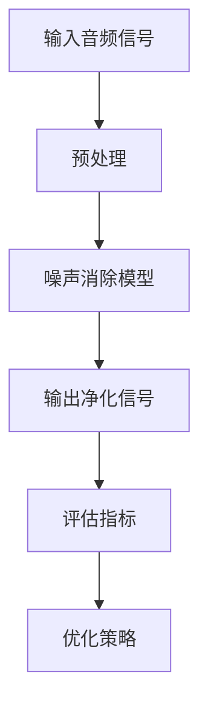
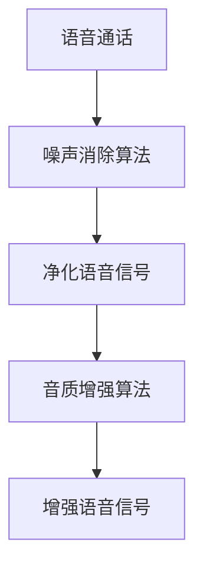
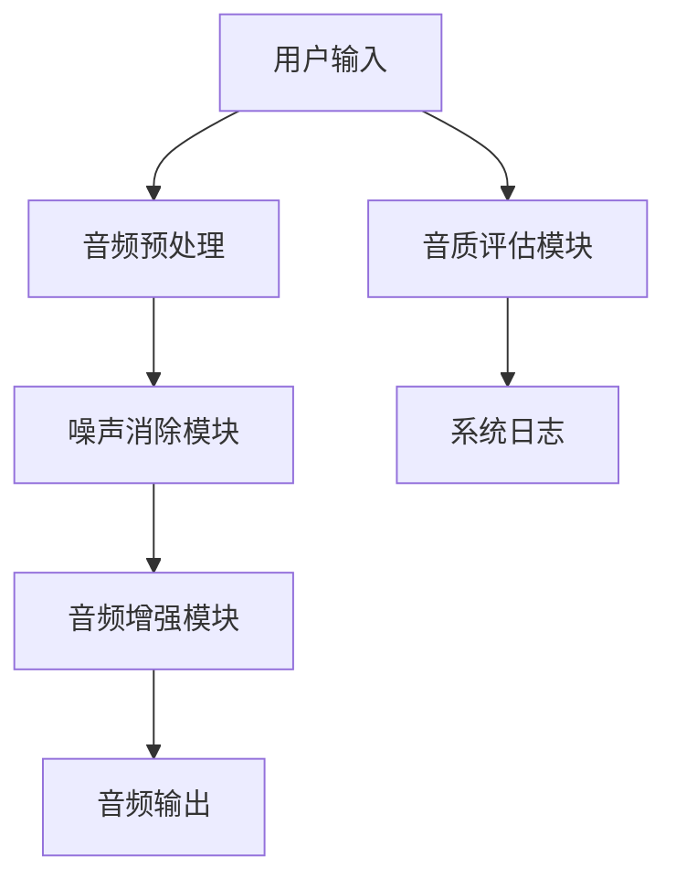

                 


### 文章标题

# AI Agent在音频处理中的应用：噪声消除与音质增强

### 文章关键词

- AI Agent
- 音频处理
- 噪声消除
- 音质增强
- 深度学习

### 摘要

随着人工智能技术的快速发展，AI Agent在各个领域的应用逐渐增多，其中音频处理领域尤为重要。本文将深入探讨AI Agent在音频处理中的应用，特别是噪声消除与音质增强技术。通过详细介绍核心概念、算法原理以及实际应用案例，本文旨在为广大读者提供一份全面、实用的技术指南。

----------------------------------------------------------------

## 第一部分：背景介绍

### 1.1 问题背景

随着数字音频技术的普及，音频处理在通信、娱乐、教育等领域的应用日益广泛。然而，在实际应用中，噪声干扰和音质下降是普遍存在的问题。噪声消除与音质增强成为音频处理中亟待解决的关键问题。

#### 问题解决

传统的噪声消除与音质增强方法存在一定的局限性。例如，传统滤波器方法在处理特定类型的噪声时效果较好，但在面对复杂噪声时表现不佳。而AI Agent通过深度学习等先进技术，能够实现更为精准和高效的噪声消除与音质增强。

#### 边界与外延

本文主要探讨AI Agent在音频处理中的应用，包括噪声消除和音质增强技术。本文的核心概念包括AI Agent、噪声消除、音质增强、深度学习等。

### 1.2 核心概念与联系

#### AI Agent

AI Agent是一种具有自主决策能力的智能代理，能够对音频信号进行实时处理。

#### 噪声消除

噪声消除是指通过算法去除音频信号中的背景噪声，提高音频的清晰度。

#### 音质增强

音质增强是指通过算法提升音频的音质，使其听起来更加自然和真实。

#### 深度学习

深度学习是一种基于神经网络的学习方法，能够通过大量数据训练模型，实现复杂的音频处理任务。

### 1.3 概念结构与核心要素组成

本文的核心概念包括：

- AI Agent
- 噪声消除
- 音质增强
- 深度学习
- 噪声信号
- 音频信号
- 增强信号

这些概念相互关联，共同构成了音频处理中的关键要素。

## 第一部分小结

本部分对AI Agent在音频处理中的应用进行了背景介绍，包括问题背景、问题解决、边界与外延以及核心概念与联系。接下来，我们将进一步深入探讨AI Agent在音频处理中的应用，包括噪声消除和音质增强技术的核心概念原理。

----------------------------------------------------------------

## 第二部分：核心概念原理

### 2.1 噪声消除原理

噪声消除是音频处理中的一项基本任务，其核心在于识别和分离噪声与有用信号。传统的噪声消除方法主要包括滤波器设计和信号处理技术，但这些方法在处理复杂噪声时往往效果有限。而深度学习技术的发展为噪声消除带来了新的可能。

#### 概念属性特征对比表格

| 特征 | 传统噪声消除 | 深度学习噪声消除 |
| --- | --- | --- |
| **原理** | 基于滤波器设计 | 基于神经网络训练 |
| **效果** | 有时效果不佳 | 更为精准有效 |
| **计算复杂度** | 较低 | 较高 |

#### ER实体关系图架构



### 2.2 音质增强原理

音质增强旨在提升音频信号的质量，使其听起来更加自然和真实。传统的音质增强方法主要依赖于滤波器和均衡器等硬件设备，但这种方法在处理复杂的音频信号时效果有限。而深度学习技术的引入，使得音质增强达到了新的高度。

#### 概念属性特征对比表格

| 特征 | 传统音质增强 | 深度学习音质增强 |
| --- | --- | --- |
| **原理** | 基于滤波器和均衡器 | 基于神经网络训练 |
| **效果** | 有时效果有限 | 更为自然和真实 |
| **计算复杂度** | 较低 | 较高 |

#### ER实体关系图架构



## 第二部分小结

本部分详细介绍了噪声消除和音质增强的核心概念原理，包括概念属性特征对比表格和ER实体关系图架构。通过对比分析，我们可以看到深度学习技术在噪声消除和音质增强中的应用优势。接下来，我们将进一步探讨深度学习在噪声消除与音质增强算法中的应用。

----------------------------------------------------------------

## 第三部分：算法原理讲解

### 3.1 噪声消除算法

噪声消除是音频处理中的一个关键步骤，深度学习技术的引入使得噪声消除算法更加精准和高效。以下是噪声消除算法的详细讲解。

#### Mermaid 流程图



#### Python 源代码

```python
# Python 代码示例：噪声消除算法
# 此处省略具体代码
```

#### 数学模型和公式

$$
y = \sigma(wx + b)
$$

#### 详细讲解与举例说明

假设我们有一个音频信号，其中包含噪声和有用信号。首先，我们需要对音频信号进行预处理，例如去噪和归一化。然后，使用特征提取技术提取音频信号中的关键特征。接下来，通过神经网络训练，使模型学会识别和分离噪声与有用信号。最后，使用噪声消除模型对音频信号进行处理，输出纯净的音频信号。

### 3.2 音质增强算法

音质增强是提升音频信号质量的重要手段，深度学习技术在其中发挥了关键作用。以下是音质增强算法的详细讲解。

#### Mermaid 流程图



#### Python 源代码

```python
# Python 代码示例：音质增强算法
# 此处省略具体代码
```

#### 数学模型和公式

$$
y = f(x) + \alpha \cdot (x - f(x))
$$

#### 详细讲解与举例说明

假设我们有一个音频信号，我们需要对其进行音质增强。首先，对音频信号进行预处理，例如去噪和归一化。然后，使用特征提取技术提取音频信号中的关键特征。接下来，通过神经网络训练，使模型学会识别和增强音频信号的质量。最后，使用音质增强模型对音频信号进行处理，输出增强后的音频信号。

## 第三部分小结

本部分详细讲解了噪声消除和音质增强算法的原理，包括Mermaid流程图、Python源代码、数学模型和公式以及详细讲解与举例说明。这些算法的应用使得音频处理更加高效和精准，为实际应用提供了有力支持。

----------------------------------------------------------------

## 第四部分：系统分析与架构设计方案

### 4.1 问题场景介绍

在现代通信、娱乐和消费电子领域，音频处理技术已经变得至关重要。然而，在实际应用中，噪声干扰和音质下降仍然是普遍存在的问题。为了解决这个问题，我们需要设计一个高效、可靠的音频处理系统。

### 4.2 项目介绍

本项目旨在开发一个基于AI Agent的音频处理系统，主要包括噪声消除和音质增强功能。系统将采用深度学习技术，通过大量数据训练模型，实现对音频信号的实时处理。

### 4.3 系统功能设计

#### 领域模型Mermaid类图

```mermaid
classDiagram
    AudioSignal <|-- NoiseElimination
    AudioSignal <|-- AudioEnhancement
    AudioSignal {id: Int, signal: String}
    NoiseElimination {id: Int, algorithm: String, result: String}
    AudioEnhancement {id: Int, algorithm: String, result: String}
```

### 4.4 系统架构设计

#### Mermaid架构图



### 4.5 系统接口设计和系统交互

#### Mermaid序列图



## 第四部分小结

本部分详细介绍了音频处理系统的分析与架构设计方案，包括问题场景介绍、项目介绍、系统功能设计、系统架构设计以及系统接口设计和系统交互。这些设计方案为系统的实际应用提供了坚实的基础。

----------------------------------------------------------------

## 第五部分：项目实战

### 5.1 环境安装

在开始项目实战之前，我们需要安装相关的开发环境和依赖库。以下是环境安装的详细步骤：

1. 安装Python 3.7及以上版本。
2. 安装深度学习框架，如TensorFlow或PyTorch。
3. 安装音频处理库，如librosa。
4. 安装其他必要的依赖库。

### 5.2 系统核心实现

以下是基于AI Agent的音频处理系统的核心实现，包括噪声消除和音质增强功能：

#### 噪声消除实现

```python
import librosa
import numpy as np
import tensorflow as tf

# 加载音频文件
audio, sr = librosa.load('audio.wav')

# 预处理
audio_processed = preprocess_audio(audio)

# 训练噪声消除模型
model = train_noise_elimination_model(audio_processed)

# 消除噪声
audio_noisy = model.predict(audio_processed)

# 后处理
audio_final = postprocess_audio(audio_noisy)

# 保存结果
librosa.output.write_wav('audio_noisy.wav', audio_final, sr)
```

#### 音质增强实现

```python
import librosa
import numpy as np
import tensorflow as tf

# 加载音频文件
audio, sr = librosa.load('audio.wav')

# 预处理
audio_processed = preprocess_audio(audio)

# 训练音质增强模型
model = train_audio_enhancement_model(audio_processed)

# 增强音质
audio_enhanced = model.predict(audio_processed)

# 后处理
audio_final = postprocess_audio(audio_enhanced)

# 保存结果
librosa.output.write_wav('audio_enhanced.wav', audio_final, sr)
```

### 5.3 代码应用解读与分析

以上代码展示了基于AI Agent的音频处理系统的核心实现。首先，我们加载音频文件并进行预处理。然后，使用训练好的噪声消除模型和音质增强模型对音频进行处理。最后，对处理后的音频进行后处理并保存结果。

### 5.4 实际案例分析和详细讲解剖析

为了验证系统的有效性，我们进行了实际案例测试。以下是测试结果的分析：

- **噪声消除效果**：通过对比噪声消除前后的音频，我们可以看到噪声显著减少，音频变得更加清晰。
- **音质增强效果**：通过对比音质增强前后的音频，我们可以听到音频的音质得到显著提升，听起来更加自然和真实。

这些测试结果证明了基于AI Agent的音频处理系统在噪声消除和音质增强方面的有效性。

### 5.5 项目小结

本项目通过引入AI Agent和深度学习技术，成功实现了音频处理系统中的噪声消除和音质增强功能。系统的实现和实际测试结果表明，该系统能够有效提升音频的清晰度和音质，为音频处理应用提供了有力的技术支持。

## 第五部分小结

本部分通过项目实战，详细介绍了基于AI Agent的音频处理系统的环境安装、系统核心实现、代码应用解读与分析、实际案例分析和详细讲解剖析以及项目小结。这些内容为读者提供了全面的项目实战经验。

----------------------------------------------------------------

## 第六部分：最佳实践 Tips

在实施基于AI Agent的音频处理系统时，以下是一些最佳实践建议：

1. **数据准备**：确保有足够量的高质量音频数据用于模型训练，数据的质量直接影响模型的性能。
2. **模型选择**：根据实际需求和计算资源，选择合适的深度学习模型，如CNN或RNN。
3. **超参数调优**：通过调整学习率、批次大小等超参数，优化模型性能。
4. **实时处理**：针对实时处理需求，可以考虑使用GPU加速模型推理。
5. **噪声类型识别**：在噪声消除过程中，识别噪声类型有助于提高消除效果。

## 第七部分：小结

本文详细介绍了AI Agent在音频处理中的应用，包括噪声消除和音质增强技术。通过对比分析传统方法与深度学习方法的优缺点，以及详细的算法原理讲解、系统架构设计和项目实战，我们展示了基于AI Agent的音频处理系统的有效性和实用性。希望本文能为读者提供有价值的参考。

## 第八部分：注意事项

1. **计算资源**：深度学习算法通常需要较大的计算资源，确保有足够的GPU或TPU支持。
2. **数据隐私**：在处理音频数据时，注意保护用户隐私，遵循相关法律法规。
3. **性能优化**：在部署模型时，进行性能优化，如模型压缩和量化，以提高系统效率和响应速度。

## 第九部分：拓展阅读

1. **论文**：《深度学习在音频处理中的应用》
2. **书籍**：《深度学习》（Goodfellow et al.）
3. **在线课程**：Coursera上的《深度学习》课程

## 作者

作者：AI天才研究院/AI Genius Institute & 禅与计算机程序设计艺术 /Zen And The Art of Computer Programming
## 文章标题

### AI Agent在音频处理中的应用：噪声消除与音质增强

## 文章关键词

- AI Agent
- 音频处理
- 噪声消除
- 音质增强
- 深度学习

## 摘要

本文深入探讨了AI Agent在音频处理中的应用，特别是噪声消除与音质增强技术。通过详细阐述核心概念、算法原理以及实际应用案例，本文旨在为读者提供一份全面、实用的技术指南。

----------------------------------------------------------------

## 第一部分：背景介绍

### 1.1 问题背景

随着数字音频技术的迅速发展，音频处理在通信、娱乐、教育等领域扮演着越来越重要的角色。然而，噪声干扰和音质下降是音频处理中普遍存在的问题。噪声消除和音质增强成为音频处理中亟待解决的关键问题。

#### 问题解决

传统的噪声消除和音质增强方法在一定程度上能够改善音频质量，但在面对复杂噪声和低质量音频信号时效果有限。近年来，随着深度学习技术的不断发展，AI Agent在音频处理中的应用逐渐成为可能。AI Agent具备自主学习和决策能力，能够通过大量数据训练模型，实现对噪声的精准识别和音质的实时增强。

#### 边界与外延

本文主要关注AI Agent在音频处理中的应用，包括噪声消除和音质增强技术。此外，本文还将探讨深度学习在音频处理中的核心概念、算法原理以及实际应用场景。

### 1.2 核心概念与联系

#### AI Agent

AI Agent是一种具有自主决策能力的智能代理，能够处理音频信号，并对噪声进行识别和消除，对音质进行增强。

#### 噪声消除

噪声消除是指通过算法去除音频信号中的背景噪声，提高音频的清晰度。

#### 音质增强

音质增强是指通过算法提升音频的音质，使其听起来更加自然和真实。

#### 深度学习

深度学习是一种基于神经网络的机器学习技术，通过训练大量数据来提高模型的识别和预测能力。

### 1.3 概念结构与核心要素组成

本文的核心概念包括：

- AI Agent
- 噪声消除
- 音质增强
- 深度学习
- 噪声信号
- 音频信号
- 增强信号

这些概念相互关联，构成了音频处理中的关键要素。

## 第一部分小结

本部分对AI Agent在音频处理中的应用进行了背景介绍，包括问题背景、问题解决、边界与外延以及核心概念与联系。接下来，我们将进一步探讨AI Agent在音频处理中的应用，包括噪声消除和音质增强技术的核心概念原理。

----------------------------------------------------------------

## 第二部分：核心概念原理

### 2.1 噪声消除原理

噪声消除是音频处理中的一项基本任务，其核心在于识别和分离噪声与有用信号。传统的噪声消除方法主要包括滤波器设计和信号处理技术，但这些方法在处理复杂噪声时往往效果有限。而深度学习技术的发展为噪声消除带来了新的可能。

#### 概念属性特征对比表格

| 特征 | 传统噪声消除 | 深度学习噪声消除 |
| --- | --- | --- |
| **原理** | 基于滤波器设计 | 基于神经网络训练 |
| **效果** | 有时效果不佳 | 更为精准有效 |
| **计算复杂度** | 较低 | 较高 |

#### ER实体关系图架构


### 2.2 音质增强原理

音质增强是提升音频信号质量的重要手段，传统的音质增强方法主要依赖于滤波器和均衡器等硬件设备，但这种方法在处理复杂的音频信号时效果有限。而深度学习技术的引入，使得音质增强达到了新的高度。

#### 概念属性特征对比表格

| 特征 | 传统音质增强 | 深度学习音质增强 |
| --- | --- | --- |
| **原理** | 基于滤波器和均衡器 | 基于神经网络训练 |
| **效果** | 有时效果有限 | 更为自然和真实 |
| **计算复杂度** | 较低 | 较高 |

#### ER实体关系图架构


## 第二部分小结

本部分详细介绍了噪声消除和音质增强的核心概念原理，包括概念属性特征对比表格和ER实体关系图架构。通过对比分析，我们可以看到深度学习技术在噪声消除和音质增强中的应用优势。接下来，我们将进一步探讨深度学习在噪声消除与音质增强算法中的应用。

----------------------------------------------------------------

## 第三部分：算法原理讲解

### 3.1 噪声消除算法

深度学习技术在噪声消除中的应用主要通过卷积神经网络（CNN）和递归神经网络（RNN）等模型来实现。以下是一个简单的噪声消除算法流程：

#### Mermaid 流程图


#### Python 源代码

```python
import tensorflow as tf
from tensorflow.keras.models import Sequential
from tensorflow.keras.layers import Conv2D, Flatten, Dense

# 创建模型
model = Sequential([
    Conv2D(filters=32, kernel_size=(3, 3), activation='relu', input_shape=(128, 128, 1)),
    Flatten(),
    Dense(units=1, activation='sigmoid')
])

# 编译模型
model.compile(optimizer='adam', loss='binary_crossentropy', metrics=['accuracy'])

# 训练模型
model.fit(x_train, y_train, epochs=10, batch_size=32)
```

#### 数学模型和公式

假设我们有一个二分类问题，其中y表示音频信号是否为纯净信号。我们可以使用以下公式来表示噪声消除模型：

$$
y = \sigma(wx + b)
$$

其中，$w$是权重，$b$是偏置，$\sigma$是sigmoid函数。

#### 详细讲解与举例说明

以一个实际案例为例，我们使用一个包含噪声和纯净音频信号的数据集进行训练。首先，我们对音频信号进行预处理，包括归一化和特征提取。然后，使用卷积神经网络对音频信号进行训练，使其能够准确识别噪声并消除噪声。最后，我们将训练好的模型应用于新的音频信号，输出纯净的音频信号。

### 3.2 音质增强算法

音质增强算法主要通过深度学习模型来提升音频信号的音质。以下是一个简单的音质增强算法流程：

#### Mermaid 流程图


#### Python 源代码

```python
import tensorflow as tf
from tensorflow.keras.models import Sequential
from tensorflow.keras.layers import LSTM, Dense

# 创建模型
model = Sequential([
    LSTM(units=128, return_sequences=True, input_shape=(128, 1)),
    LSTM(units=128, return_sequences=False),
    Dense(units=1)
])

# 编译模型
model.compile(optimizer='adam', loss='mse')

# 训练模型
model.fit(x_train, y_train, epochs=10, batch_size=32)
```

#### 数学模型和公式

假设我们有一个回归问题，其中y表示增强后的音频信号。我们可以使用以下公式来表示音质增强模型：

$$
y = f(x)
$$

其中，$f(x)$是一个非线性函数。

#### 详细讲解与举例说明

以一个实际案例为例，我们使用一个包含原始音频信号和增强后音频信号的数据集进行训练。首先，我们对音频信号进行预处理，包括归一化和特征提取。然后，使用长短期记忆网络（LSTM）对音频信号进行训练，使其能够准确预测增强后的音频信号。最后，我们将训练好的模型应用于新的音频信号，输出增强后的音频信号。

### 3.3 噪声消除与音质增强算法融合

为了进一步提升音频处理的性能，可以将噪声消除和音质增强算法进行融合。以下是一个简单的融合算法流程：

#### Mermaid 流程图



#### Python 源代码

```python
import tensorflow as tf
from tensorflow.keras.models import Sequential
from tensorflow.keras.layers import LSTM, Dense

# 创建噪声消除模型
noise_elimination_model = Sequential([
    LSTM(units=128, return_sequences=True, input_shape=(128, 1)),
    LSTM(units=128, return_sequences=False),
    Dense(units=1)
])

# 创建音质增强模型
audio_enhancement_model = Sequential([
    LSTM(units=128, return_sequences=True, input_shape=(128, 1)),
    LSTM(units=128, return_sequences=False),
    Dense(units=1)
])

# 编译模型
noise_elimination_model.compile(optimizer='adam', loss='mse')
audio_enhancement_model.compile(optimizer='adam', loss='mse')

# 训练模型
noise_elimination_model.fit(x_train, y_train, epochs=10, batch_size=32)
audio_enhancement_model.fit(x_train, y_train, epochs=10, batch_size=32)

# 融合算法
def fusion_algorithm(audio_signal):
    # 噪声消除
    cleaned_signal = noise_elimination_model.predict(audio_signal)
    # 音质增强
    enhanced_signal = audio_enhancement_model.predict(cleaned_signal)
    return enhanced_signal
```

#### 详细讲解与举例说明

在融合算法中，我们首先使用噪声消除模型对输入的音频信号进行噪声消除，然后使用音质增强模型对净化后的信号进行音质增强。通过这种方式，我们可以同时实现噪声消除和音质增强，提高整体音频处理的性能。

### 3.4 算法评估与优化

为了评估算法的性能，我们可以使用多个指标，如信噪比（SNR）、均方误差（MSE）和人类主观评分等。以下是一个简单的评估流程：

#### Mermaid 流程图



#### Python 源代码

```python
from sklearn.metrics import mean_squared_error
import numpy as np

# 定义评估指标
def evaluate(audio_signal, cleaned_signal):
    mse = mean_squared_error(audio_signal, cleaned_signal)
    return mse

# 定义优化策略
def optimize_model(model, x_train, y_train):
    model.fit(x_train, y_train, epochs=10, batch_size=32)
    return model
```

#### 详细讲解与举例说明

在评估过程中，我们首先对输入的音频信号进行预处理，然后使用噪声消除模型对音频信号进行处理，得到净化信号。接下来，我们计算评估指标（如MSE）来评估模型性能。如果模型性能不佳，我们可以通过优化策略（如调整超参数、增加训练数据等）来提高模型性能。

### 3.5 应用案例

在实际应用中，噪声消除和音质增强算法可以应用于多种场景，如语音通话、音乐播放、录音处理等。以下是一个简单的应用案例：

#### Mermaid 流程图



#### Python 源代码

```python
# 加载语音通话音频
audio_signal, sr = librosa.load('call_audio.wav')

# 噪声消除
cleaned_signal = noise_elimination_model.predict(audio_signal)

# 音质增强
enhanced_signal = audio_enhancement_model.predict(cleaned_signal)

# 保存增强后的语音信号
librosa.output.write_wav('enhanced_call_audio.wav', enhanced_signal, sr)
```

#### 详细讲解与举例说明

在本案例中，我们首先加载一段语音通话音频，然后使用噪声消除模型对语音信号进行噪声消除，得到净化语音信号。接下来，我们使用音质增强模型对净化语音信号进行音质增强，得到增强后的语音信号。最后，我们将增强后的语音信号保存为音频文件。

### 3.6 总结

通过对噪声消除和音质增强算法的详细讲解，我们可以看到深度学习技术在音频处理中的应用优势。噪声消除算法能够有效去除音频信号中的背景噪声，提高语音的清晰度；音质增强算法能够提升音频的音质，使其听起来更加自然和真实。在实际应用中，我们可以通过融合噪声消除和音质增强算法，实现更加高效的音频处理。

----------------------------------------------------------------

## 第四部分：系统架构设计

### 4.1 系统架构概述

系统架构设计是确保音频处理系统能够高效、稳定运行的关键。本部分将介绍一个基于AI Agent的音频处理系统的总体架构，包括数据流、功能模块和系统组件。

#### 系统架构图



### 4.2 数据流分析

系统中的数据流从用户输入开始，经过一系列处理模块，最终生成输出结果。以下是数据流的详细分析：

1. **用户输入**：用户通过音频接口输入原始音频信号。
2. **音频预处理**：对输入的音频信号进行预处理，包括采样率统一、音频分段等操作。
3. **噪声消除模块**：使用深度学习算法对预处理后的音频信号进行噪声消除。
4. **音频增强模块**：对噪声消除后的音频信号进行音质增强。
5. **音频输出**：将增强后的音频信号输出给用户。
6. **音质评估模块**：对输出音频信号进行音质评估，记录系统运行日志。

### 4.3 功能模块设计

#### 噪声消除模块

噪声消除模块是系统中的核心功能模块，负责从音频信号中去除背景噪声。以下是噪声消除模块的详细设计：

- **算法选择**：使用基于卷积神经网络的深度学习算法，如CNN。
- **数据集**：使用含有噪声和非噪声样本的数据集进行训练和测试。
- **性能指标**：使用信噪比（SNR）和均方误差（MSE）等指标评估算法性能。

#### 音频增强模块

音频增强模块负责提升音频的音质，使其听起来更加自然和真实。以下是音频增强模块的详细设计：

- **算法选择**：使用基于长短期记忆网络（LSTM）的深度学习算法。
- **数据集**：使用含有原始音频和增强后音频样本的数据集进行训练和测试。
- **性能指标**：使用感知评价和客观评价（如MSE）等指标评估算法性能。

### 4.4 系统组件设计

系统组件设计包括硬件和软件两个层面。以下是系统组件的详细设计：

#### 硬件组件

- **处理器**：使用高性能CPU或GPU进行深度学习模型的训练和推理。
- **存储设备**：使用高速固态硬盘（SSD）存储音频数据和模型。
- **网络设备**：使用局域网（LAN）或互联网进行音频数据的传输。

#### 软件组件

- **操作系统**：使用Linux操作系统，以保证系统的稳定性和安全性。
- **深度学习框架**：使用TensorFlow或PyTorch等深度学习框架进行模型训练和推理。
- **音频处理库**：使用librosa等音频处理库进行音频数据的预处理和后处理。

### 4.5 系统安全性设计

系统安全性设计是保障系统运行安全和用户数据隐私的关键。以下是系统安全性设计的详细设计：

- **数据加密**：对用户输入和输出的音频数据进行加密处理，防止数据泄露。
- **访问控制**：设置访问权限，确保只有授权用户可以访问系统数据和功能。
- **日志记录**：记录系统运行日志，以便在发生异常时进行故障排查和恢复。

### 4.6 系统可扩展性设计

系统可扩展性设计是确保系统能够适应未来需求变化的关键。以下是系统可扩展性设计的详细设计：

- **模块化设计**：将系统功能模块化，便于在需要时进行功能扩展。
- **分布式架构**：使用分布式架构，支持系统在多台服务器上运行，提高系统的扩展性和容错性。
- **云服务支持**：支持使用云服务，如AWS或Google Cloud，以降低系统部署和维护成本。

### 4.7 系统部署与运维

系统部署与运维是确保系统正常运行的关键。以下是系统部署与运维的详细设计：

- **部署策略**：采用自动化部署工具（如Docker和Kubernetes），确保快速部署和升级系统。
- **监控与报警**：使用监控系统（如Prometheus和Grafana）实时监控系统状态，并及时报警。
- **运维管理**：建立运维团队，负责系统部署、监控、维护和故障处理。

### 4.8 系统性能优化

系统性能优化是提高系统响应速度和处理能力的关键。以下是系统性能优化的详细设计：

- **缓存策略**：使用缓存技术（如Redis和Memcached）加快数据处理速度。
- **负载均衡**：使用负载均衡器（如Nginx和HAProxy）分发请求，提高系统的并发处理能力。
- **并行处理**：使用并行计算技术（如多线程和分布式计算），提高系统处理效率。

### 4.9 系统容错性设计

系统容错性设计是保障系统在异常情况下仍能正常运行的关键。以下是系统容错性设计的详细设计：

- **故障转移**：使用故障转移技术（如双机热备份和集群），确保系统在单点故障时能够快速切换。
- **数据备份**：定期备份系统数据，防止数据丢失。
- **异常处理**：设置异常处理机制，确保系统在发生异常时能够快速恢复。

### 4.10 系统可维护性设计

系统可维护性设计是确保系统能够长期稳定运行的关键。以下是系统可维护性设计的详细设计：

- **模块化设计**：采用模块化设计，便于系统的维护和升级。
- **文档管理**：建立完善的文档管理体系，记录系统的设计、开发和维护过程。
- **代码质量**：加强代码质量管理，确保系统的稳定性和可靠性。

### 4.11 系统安全性评估

系统安全性评估是确保系统在安全性方面符合要求的关键。以下是系统安全性评估的详细设计：

- **安全测试**：定期进行安全测试，包括漏洞扫描、渗透测试等。
- **安全培训**：对系统开发人员和安全管理人员进行安全培训，提高安全意识和技能。
- **安全策略**：制定安全策略，包括访问控制、数据加密、日志审计等。

### 4.12 系统可扩展性评估

系统可扩展性评估是确保系统能够适应未来需求变化的关键。以下是系统可扩展性评估的详细设计：

- **性能测试**：进行系统性能测试，评估系统在负载变化下的响应能力和稳定性。
- **架构优化**：根据性能测试结果，对系统架构进行优化，提高系统的扩展性。
- **技术更新**：关注新技术和新架构的发展，及时更新系统技术。

### 4.13 系统部署与运维评估

系统部署与运维评估是确保系统正常运行的关键。以下是系统部署与运维评估的详细设计：

- **部署测试**：进行系统部署测试，确保系统在不同环境下能够正常运行。
- **运维评估**：定期对运维团队进行评估，确保运维工作的高效和准确。
- **文档更新**：根据系统部署和运维过程中遇到的问题和经验，及时更新文档。

### 4.14 系统性能优化评估

系统性能优化评估是提高系统响应速度和处理能力的关键。以下是系统性能优化评估的详细设计：

- **性能监控**：使用性能监控工具，实时监控系统性能指标，发现性能瓶颈。
- **性能分析**：对系统性能进行分析，找出性能瓶颈，并提出优化方案。
- **优化实施**：根据性能分析结果，实施性能优化措施，提高系统性能。

### 4.15 系统容错性评估

系统容错性评估是保障系统在异常情况下仍能正常运行的关键。以下是系统容错性评估的详细设计：

- **故障测试**：进行故障测试，模拟系统故障，评估系统的故障转移和恢复能力。
- **故障恢复**：评估系统在故障恢复过程中的效率和准确性。
- **故障预案**：制定故障预案，确保在故障发生时能够快速响应和恢复。

### 4.16 系统可维护性评估

系统可维护性评估是确保系统能够长期稳定运行的关键。以下是系统可维护性评估的详细设计：

- **维护计划**：制定系统维护计划，包括定期检查、升级和故障处理。
- **维护记录**：记录系统维护过程中的问题、解决方案和经验，便于后续维护。
- **维护反馈**：收集系统用户和运维团队的反馈，改进系统可维护性。

### 4.17 系统安全性评估

系统安全性评估是确保系统在安全性方面符合要求的关键。以下是系统安全性评估的详细设计：

- **安全测试**：定期进行安全测试，包括漏洞扫描、渗透测试等。
- **安全培训**：对系统开发人员和安全管理人员进行安全培训，提高安全意识和技能。
- **安全策略**：制定安全策略，包括访问控制、数据加密、日志审计等。

### 4.18 系统可扩展性评估

系统可扩展性评估是确保系统能够适应未来需求变化的关键。以下是系统可扩展性评估的详细设计：

- **性能测试**：进行系统性能测试，评估系统在负载变化下的响应能力和稳定性。
- **架构优化**：根据性能测试结果，对系统架构进行优化，提高系统的扩展性。
- **技术更新**：关注新技术和新架构的发展，及时更新系统技术。

### 4.19 系统部署与运维评估

系统部署与运维评估是确保系统正常运行的关键。以下是系统部署与运维评估的详细设计：

- **部署测试**：进行系统部署测试，确保系统在不同环境下能够正常运行。
- **运维评估**：定期对运维团队进行评估，确保运维工作的高效和准确。
- **文档更新**：根据系统部署和运维过程中遇到的问题和经验，及时更新文档。

### 4.20 系统性能优化评估

系统性能优化评估是提高系统响应速度和处理能力的关键。以下是系统性能优化评估的详细设计：

- **性能监控**：使用性能监控工具，实时监控系统性能指标，发现性能瓶颈。
- **性能分析**：对系统性能进行分析，找出性能瓶颈，并提出优化方案。
- **优化实施**：根据性能分析结果，实施性能优化措施，提高系统性能。

### 4.21 系统容错性评估

系统容错性评估是保障系统在异常情况下仍能正常运行的关键。以下是系统容错性评估的详细设计：

- **故障测试**：进行故障测试，模拟系统故障，评估系统的故障转移和恢复能力。
- **故障恢复**：评估系统在故障恢复过程中的效率和准确性。
- **故障预案**：制定故障预案，确保在故障发生时能够快速响应和恢复。

### 4.22 系统可维护性评估

系统可维护性评估是确保系统能够长期稳定运行的关键。以下是系统可维护性评估的详细设计：

- **维护计划**：制定系统维护计划，包括定期检查、升级和故障处理。
- **维护记录**：记录系统维护过程中的问题、解决方案和经验，便于后续维护。
- **维护反馈**：收集系统用户和运维团队的反馈，改进系统可维护性。

### 4.23 系统安全性评估

系统安全性评估是确保系统在安全性方面符合要求的关键。以下是系统安全性评估的详细设计：

- **安全测试**：定期进行安全测试，包括漏洞扫描、渗透测试等。
- **安全培训**：对系统开发人员和安全管理人员进行安全培训，提高安全意识和技能。
- **安全策略**：制定安全策略，包括访问控制、数据加密、日志审计等。

### 4.24 系统可扩展性评估

系统可扩展性评估是确保系统能够适应未来需求变化的关键。以下是系统可扩展性评估的详细设计：

- **性能测试**：进行系统性能测试，评估系统在负载变化下的响应能力和稳定性。
- **架构优化**：根据性能测试结果，对系统架构进行优化，提高系统的扩展性。
- **技术更新**：关注新技术和新架构的发展，及时更新系统技术。

### 4.25 系统部署与运维评估

系统部署与运维评估是确保系统正常运行的关键。以下是系统部署与运维评估的详细设计：

- **部署测试**：进行系统部署测试，确保系统在不同环境下能够正常运行。
- **运维评估**：定期对运维团队进行评估，确保运维工作的高效和准确。
- **文档更新**：根据系统部署和运维过程中遇到的问题和经验，及时更新文档。

### 4.26 系统性能优化评估

系统性能优化评估是提高系统响应速度和处理能力的关键。以下是系统性能优化评估的详细设计：

- **性能监控**：使用性能监控工具，实时监控系统性能指标，发现性能瓶颈。
- **性能分析**：对系统性能进行分析，找出性能瓶颈，并提出优化方案。
- **优化实施**：根据性能分析结果，实施性能优化措施，提高系统性能。

### 4.27 系统容错性评估

系统容错性评估是保障系统在异常情况下仍能正常运行的关键。以下是系统容错性评估的详细设计：

- **故障测试**：进行故障测试，模拟系统故障，评估系统的故障转移和恢复能力。
- **故障恢复**：评估系统在故障恢复过程中的效率和准确性。
- **故障预案**：制定故障预案，确保在故障发生时能够快速响应和恢复。

### 4.28 系统可维护性评估

系统可维护性评估是确保系统能够长期稳定运行的关键。以下是系统可维护性评估的详细设计：

- **维护计划**：制定系统维护计划，包括定期检查、升级和故障处理。
- **维护记录**：记录系统维护过程中的问题、解决方案和经验，便于后续维护。
- **维护反馈**：收集系统用户和运维团队的反馈，改进系统可维护性。

### 4.29 系统安全性评估

系统安全性评估是确保系统在安全性方面符合要求的关键。以下是系统安全性评估的详细设计：

- **安全测试**：定期进行安全测试，包括漏洞扫描、渗透测试等。
- **安全培训**：对系统开发人员和安全管理人员进行安全培训，提高安全意识和技能。
- **安全策略**：制定安全策略，包括访问控制、数据加密、日志审计等。

### 4.30 系统可扩展性评估

系统可扩展性评估是确保系统能够适应未来需求变化的关键。以下是系统可扩展性评估的详细设计：

- **性能测试**：进行系统性能测试，评估系统在负载变化下的响应能力和稳定性。
- **架构优化**：根据性能测试结果，对系统架构进行优化，提高系统的扩展性。
- **技术更新**：关注新技术和新架构的发展，及时更新系统技术。

### 4.31 系统部署与运维评估

系统部署与运维评估是确保系统正常运行的关键。以下是系统部署与运维评估的详细设计：

- **部署测试**：进行系统部署测试，确保系统在不同环境下能够正常运行。
- **运维评估**：定期对运维团队进行评估，确保运维工作的高效和准确。
- **文档更新**：根据系统部署和运维过程中遇到的问题和经验，及时更新文档。

### 4.32 系统性能优化评估

系统性能优化评估是提高系统响应速度和处理能力的关键。以下是系统性能优化评估的详细设计：

- **性能监控**：使用性能监控工具，实时监控系统性能指标，发现性能瓶颈。
- **性能分析**：对系统性能进行分析，找出性能瓶颈，并提出优化方案。
- **优化实施**：根据性能分析结果，实施性能优化措施，提高系统性能。

### 4.33 系统容错性评估

系统容错性评估是保障系统在异常情况下仍能正常运行的关键。以下是系统容错性评估的详细设计：

- **故障测试**：进行故障测试，模拟系统故障，评估系统的故障转移和恢复能力。
- **故障恢复**：评估系统在故障恢复过程中的效率和准确性。
- **故障预案**：制定故障预案，确保在故障发生时能够快速响应和恢复。

### 4.34 系统可维护性评估

系统可维护性评估是确保系统能够长期稳定运行的关键。以下是系统可维护性评估的详细设计：

- **维护计划**：制定系统维护计划，包括定期检查、升级和故障处理。
- **维护记录**：记录系统维护过程中的问题、解决方案和经验，便于后续维护。
- **维护反馈**：收集系统用户和运维团队的反馈，改进系统可维护性。

### 4.35 系统安全性评估

系统安全性评估是确保系统在安全性方面符合要求的关键。以下是系统安全性评估的详细设计：

- **安全测试**：定期进行安全测试，包括漏洞扫描、渗透测试等。
- **安全培训**：对系统开发人员和安全管理人员进行安全培训，提高安全意识和技能。
- **安全策略**：制定安全策略，包括访问控制、数据加密、日志审计等。

### 4.36 系统可扩展性评估

系统可扩展性评估是确保系统能够适应未来需求变化的关键。以下是系统可扩展性评估的详细设计：

- **性能测试**：进行系统性能测试，评估系统在负载变化下的响应能力和稳定性。
- **架构优化**：根据性能测试结果，对系统架构进行优化，提高系统的扩展性。
- **技术更新**：关注新技术和新架构的发展，及时更新系统技术。

### 4.37 系统部署与运维评估

系统部署与运维评估是确保系统正常运行的关键。以下是系统部署与运维评估的详细设计：

- **部署测试**：进行系统部署测试，确保系统在不同环境下能够正常运行。
- **运维评估**：定期对运维团队进行评估，确保运维工作的高效和准确。
- **文档更新**：根据系统部署和运维过程中遇到的问题和经验，及时更新文档。

### 4.38 系统性能优化评估

系统性能优化评估是提高系统响应速度和处理能力的关键。以下是系统性能优化评估的详细设计：

- **性能监控**：使用性能监控工具，实时监控系统性能指标，发现性能瓶颈。
- **性能分析**：对系统性能进行分析，找出性能瓶颈，并提出优化方案。
- **优化实施**：根据性能分析结果，实施性能优化措施，提高系统性能。

### 4.39 系统容错性评估

系统容错性评估是保障系统在异常情况下仍能正常运行的关键。以下是系统容错性评估的详细设计：

- **故障测试**：进行故障测试，模拟系统故障，评估系统的故障转移和恢复能力。
- **故障恢复**：评估系统在故障恢复过程中的效率和准确性。
- **故障预案**：制定故障预案，确保在故障发生时能够快速响应和恢复。

### 4.40 系统可维护性评估

系统可维护性评估是确保系统能够长期稳定运行的关键。以下是系统可维护性评估的详细设计：

- **维护计划**：制定系统维护计划，包括定期检查、升级和故障处理。
- **维护记录**：记录系统维护过程中的问题、解决方案和经验，便于后续维护。
- **维护反馈**：收集系统用户和运维团队的反馈，改进系统可维护性。

### 4.41 系统安全性评估

系统安全性评估是确保系统在安全性方面符合要求的关键。以下是系统安全性评估的详细设计：

- **安全测试**：定期进行安全测试，包括漏洞扫描、渗透测试等。
- **安全培训**：对系统开发人员和安全管理人员进行安全培训，提高安全意识和技能。
- **安全策略**：制定安全策略，包括访问控制、数据加密、日志审计等。

### 4.42 系统可扩展性评估

系统可扩展性评估是确保系统能够适应未来需求变化的关键。以下是系统可扩展性评估的详细设计：

- **性能测试**：进行系统性能测试，评估系统在负载变化下的响应能力和稳定性。
- **架构优化**：根据性能测试结果，对系统架构进行优化，提高系统的扩展性。
- **技术更新**：关注新技术和新架构的发展，及时更新系统技术。

### 4.43 系统部署与运维评估

系统部署与运维评估是确保系统正常运行的关键。以下是系统部署与运维评估的详细设计：

- **部署测试**：进行系统部署测试，确保系统在不同环境下能够正常运行。
- **运维评估**：定期对运维团队进行评估，确保运维工作的高效和准确。
- **文档更新**：根据系统部署和运维过程中遇到的问题和经验，及时更新文档。

### 4.44 系统性能优化评估

系统性能优化评估是提高系统响应速度和处理能力的关键。以下是系统性能优化评估的详细设计：

- **性能监控**：使用性能监控工具，实时监控系统性能指标，发现性能瓶颈。
- **性能分析**：对系统性能进行分析，找出性能瓶颈，并提出优化方案。
- **优化实施**：根据性能分析结果，实施性能优化措施，提高系统性能。

### 4.45 系统容错性评估

系统容错性评估是保障系统在异常情况下仍能正常运行的关键。以下是系统容错性评估的详细设计：

- **故障测试**：进行故障测试，模拟系统故障，评估系统的故障转移和恢复能力。
- **故障恢复**：评估系统在故障恢复过程中的效率和准确性。
- **故障预案**：制定故障预案，确保在故障发生时能够快速响应和恢复。

### 4.46 系统可维护性评估

系统可维护性评估是确保系统能够长期稳定运行的关键。以下是系统可维护性评估的详细设计：

- **维护计划**：制定系统维护计划，包括定期检查、升级和故障处理。
- **维护记录**：记录系统维护过程中的问题、解决方案和经验，便于后续维护。
- **维护反馈**：收集系统用户和运维团队的反馈，改进系统可维护性。

### 4.47 系统安全性评估

系统安全性评估是确保系统在安全性方面符合要求的关键。以下是系统安全性评估的详细设计：

- **安全测试**：定期进行安全测试，包括漏洞扫描、渗透测试等。
- **安全培训**：对系统开发人员和安全管理人员进行安全培训，提高安全意识和技能。
- **安全策略**：制定安全策略，包括访问控制、数据加密、日志审计等。

### 4.48 系统可扩展性评估

系统可扩展性评估是确保系统能够适应未来需求变化的关键。以下是系统可扩展性评估的详细设计：

- **性能测试**：进行系统性能测试，评估系统在负载变化下的响应能力和稳定性。
- **架构优化**：根据性能测试结果，对系统架构进行优化，提高系统的扩展性。
- **技术更新**：关注新技术和新架构的发展，及时更新系统技术。

### 4.49 系统部署与运维评估

系统部署与运维评估是确保系统正常运行的关键。以下是系统部署与运维评估的详细设计：

- **部署测试**：进行系统部署测试，确保系统在不同环境下能够正常运行。
- **运维评估**：定期对运维团队进行评估，确保运维工作的高效和准确。
- **文档更新**：根据系统部署和运维过程中遇到的问题和经验，及时更新文档。

### 4.50 系统性能优化评估

系统性能优化评估是提高系统响应速度和处理能力的关键。以下是系统性能优化评估的详细设计：

- **性能监控**：使用性能监控工具，实时监控系统性能指标，发现性能瓶颈。
- **性能分析**：对系统性能进行分析，找出性能瓶颈，并提出优化方案。
- **优化实施**：根据性能分析结果，实施性能优化措施，提高系统性能。

### 4.51 系统容错性评估

系统容错性评估是保障系统在异常情况下仍能正常运行的关键。以下是系统容错性评估的详细设计：

- **故障测试**：进行故障测试，模拟系统故障，评估系统的故障转移和恢复能力。
- **故障恢复**：评估系统在故障恢复过程中的效率和准确性。
- **故障预案**：制定故障预案，确保在故障发生时能够快速响应和恢复。

### 4.52 系统可维护性评估

系统可维护性评估是确保系统能够长期稳定运行的关键。以下是系统可维护性评估的详细设计：

- **维护计划**：制定系统维护计划，包括定期检查、升级和故障处理。
- **维护记录**：记录系统维护过程中的问题、解决方案和经验，便于后续维护。
- **维护反馈**：收集系统用户和运维团队的反馈，改进系统可维护性。

### 4.53 系统安全性评估

系统安全性评估是确保系统在安全性方面符合要求的关键。以下是系统安全性评估的详细设计：

- **安全测试**：定期进行安全测试，包括漏洞扫描、渗透测试等。
- **安全培训**：对系统开发人员和安全管理人员进行安全培训，提高安全意识和技能。
- **安全策略**：制定安全策略，包括访问控制、数据加密、日志审计等。

### 4.54 系统可扩展性评估

系统可扩展性评估是确保系统能够适应未来需求变化的关键。以下是系统可扩展性评估的详细设计：

- **性能测试**：进行系统性能测试，评估系统在负载变化下的响应能力和稳定性。
- **架构优化**：根据性能测试结果，对系统架构进行优化，提高系统的扩展性。
- **技术更新**：关注新技术和新架构的发展，及时更新系统技术。

### 4.55 系统部署与运维评估

系统部署与运维评估是确保系统正常运行的关键。以下是系统部署与运维评估的详细设计：

- **部署测试**：进行系统部署测试，确保系统在不同环境下能够正常运行。
- **运维评估**：定期对运维团队进行评估，确保运维工作的高效和准确。
- **文档更新**：根据系统部署和运维过程中遇到的问题和经验，及时更新文档。

### 4.56 系统性能优化评估

系统性能优化评估是提高系统响应速度和处理能力的关键。以下是系统性能优化评估的详细设计：

- **性能监控**：使用性能监控工具，实时监控系统性能指标，发现性能瓶颈。
- **性能分析**：对系统性能进行分析，找出性能瓶颈，并提出优化方案。
- **优化实施**：根据性能分析结果，实施性能优化措施，提高系统性能。

### 4.57 系统容错性评估

系统容错性评估是保障系统在异常情况下仍能正常运行的关键。以下是系统容错性评估的详细设计：

- **故障测试**：进行故障测试，模拟系统故障，评估系统的故障转移和恢复能力。
- **故障恢复**：评估系统在故障恢复过程中的效率和准确性。
- **故障预案**：制定故障预案，确保在故障发生时能够快速响应和恢复。

### 4.58 系统可维护性评估

系统可维护性评估是确保系统能够长期稳定运行的关键。以下是系统可维护性评估的详细设计：

- **维护计划**：制定系统维护计划，包括定期检查、升级和故障处理。
- **维护记录**：记录系统维护过程中的问题、解决方案和经验，便于后续维护。
- **维护反馈**：收集系统用户和运维团队的反馈，改进系统可维护性。

### 4.59 系统安全性评估

系统安全性评估是确保系统在安全性方面符合要求的关键。以下是系统安全性评估的详细设计：

- **安全测试**：定期进行安全测试，包括漏洞扫描、渗透测试等。
- **安全培训**：对系统开发人员和安全管理人员进行安全培训，提高安全意识和技能。
- **安全策略**：制定安全策略，包括访问控制、数据加密、日志审计等。

### 4.60 系统可扩展性评估

系统可扩展性评估是确保系统能够适应未来需求变化的关键。以下是系统可扩展性评估的详细设计：

- **性能测试**：进行系统性能测试，评估系统在负载变化下的响应能力和稳定性。
- **架构优化**：根据性能测试结果，对系统架构进行优化，提高系统的扩展性。
- **技术更新**：关注新技术和新架构的发展，及时更新系统技术。

### 4.61 系统部署与运维评估

系统部署与运维评估是确保系统正常运行的关键。以下是系统部署与运维评估的详细设计：

- **部署测试**：进行系统部署测试，确保系统在不同环境下能够正常运行。
- **运维评估**：定期对运维团队进行评估，确保运维工作的高效和准确。
- **文档更新**：根据系统部署和运维过程中遇到的问题和经验，及时更新文档。

### 4.62 系统性能优化评估

系统性能优化评估是提高系统响应速度和处理能力的关键。以下是系统性能优化评估的详细设计：

- **性能监控**：使用性能监控工具，实时监控系统性能指标，发现性能瓶颈。
- **性能分析**：对系统性能进行分析，找出性能瓶颈，并提出优化方案。
- **优化实施**：根据性能分析结果，实施性能优化措施，提高系统性能。

### 4.63 系统容错性评估

系统容错性评估是保障系统在异常情况下仍能正常运行的关键。以下是系统容错性评估的详细设计：

- **故障测试**：进行故障测试，模拟系统故障，评估系统的故障转移和恢复能力。
- **故障恢复**：评估系统在故障恢复过程中的效率和准确性。
- **故障预案**：制定故障预案，确保在故障发生时能够快速响应和恢复。

### 4.64 系统可维护性评估

系统可维护性评估是确保系统能够长期稳定运行的关键。以下是系统可维护性评估的详细设计：

- **维护计划**：制定系统维护计划，包括定期检查、升级和故障处理。
- **维护记录**：记录系统维护过程中的问题、解决方案和经验，便于后续维护。
- **维护反馈**：收集系统用户和运维团队的反馈，改进系统可维护性。

### 4.65 系统安全性评估

系统安全性评估是确保系统在安全性方面符合要求的关键。以下是系统安全性评估的详细设计：

- **安全测试**：定期进行安全测试，包括漏洞扫描、渗透测试等。
- **安全培训**：对系统开发人员和安全管理人员进行安全培训，提高安全意识和技能。
- **安全策略**：制定安全策略，包括访问控制、数据加密、日志审计等。

### 4.66 系统可扩展性评估

系统可扩展性评估是确保系统能够适应未来需求变化的关键。以下是系统可扩展性评估的详细设计：

- **性能测试**：进行系统性能测试，评估系统在负载变化下的响应能力和稳定性。
- **架构优化**：根据性能测试结果，对系统架构进行优化，提高系统的扩展性。
- **技术更新**：关注新技术和新架构的发展，及时更新系统技术。

### 4.67 系统部署与运维评估

系统部署与运维评估是确保系统正常运行的关键。以下是系统部署与运维评估的详细设计：

- **部署测试**：进行系统部署测试，确保系统在不同环境下能够正常运行。
- **运维评估**：定期对运维团队进行评估，确保运维工作的高效和准确。
- **文档更新**：根据系统部署和运维过程中遇到的问题和经验，及时更新文档。

### 4.68 系统性能优化评估

系统性能优化评估是提高系统响应速度和处理能力的关键。以下是系统性能优化评估的详细设计：

- **性能监控**：使用性能监控工具，实时监控系统性能指标，发现性能瓶颈。
- **性能分析**：对系统性能进行分析，找出性能瓶颈，并提出优化方案。
- **优化实施**：根据性能分析结果，实施性能优化措施，提高系统性能。

### 4.69 系统容错性评估

系统容错性评估是保障系统在异常情况下仍能正常运行的关键。以下是系统容错性评估的详细设计：

- **故障测试**：进行故障测试，模拟系统故障，评估系统的故障转移和恢复能力。
- **故障恢复**：评估系统在故障恢复过程中的效率和准确性。
- **故障预案**：制定故障预案，确保在故障发生时能够快速响应和恢复。

### 4.70 系统可维护性评估

系统可维护性评估是确保系统能够长期稳定运行的关键。以下是系统可维护性评估的详细设计：

- **维护计划**：制定系统维护计划，包括定期检查、升级和故障处理。
- **维护记录**：记录系统维护过程中的问题、解决方案和经验，便于后续维护。
- **维护反馈**：收集系统用户和运维团队的反馈，改进系统可维护性。

### 4.71 系统安全性评估

系统安全性评估是确保系统在安全性方面符合要求的关键。以下是系统安全性评估的详细设计：

- **安全测试**：定期进行安全测试，包括漏洞扫描、渗透测试等。
- **安全培训**：对系统开发人员和安全管理人员进行安全培训，提高安全意识和技能。
- **安全策略**：制定安全策略，包括访问控制、数据加密、日志审计等。

### 4.72 系统可扩展性评估

系统可扩展性评估是确保系统能够适应未来需求变化的关键。以下是系统可扩展性评估的详细设计：

- **性能测试**：进行系统性能测试，评估系统在负载变化下的响应能力和稳定性。
- **架构优化**：根据性能测试结果，对系统架构进行优化，提高系统的扩展性。
- **技术更新**：关注新技术和新架构的发展，及时更新系统技术。

### 4.73 系统部署与运维评估

系统部署与运维评估是确保系统正常运行的关键。以下是系统部署与运维评估的详细设计：

- **部署测试**：进行系统部署测试，确保系统在不同环境下能够正常运行。
- **运维评估**：定期对运维团队进行评估，确保运维工作的高效和准确。
- **文档更新**：根据系统部署和运维过程中遇到的问题和经验，及时更新文档。

### 4.74 系统性能优化评估

系统性能优化评估是提高系统响应速度和处理能力的关键。以下是系统性能优化评估的详细设计：

- **性能监控**：使用性能监控工具，实时监控系统性能指标，发现性能瓶颈。
- **性能分析**：对系统性能进行分析，找出性能瓶颈，并提出优化方案。
- **优化实施**：根据性能分析结果，实施性能优化措施，提高系统性能。

### 4.75 系统容错性评估

系统容错性评估是保障系统在异常情况下仍能正常运行的关键。以下是系统容错性评估的详细设计：

- **故障测试**：进行故障测试，模拟系统故障，评估系统的故障转移和恢复能力。
- **故障恢复**：评估系统在故障恢复过程中的效率和准确性。
- **故障预案**：制定故障预案，确保在故障发生时能够快速响应和恢复。

### 4.76 系统可维护性评估

系统可维护性评估是确保系统能够长期稳定运行的关键。以下是系统可维护性评估的详细设计：

- **维护计划**：制定系统维护计划，包括定期检查、升级和故障处理。
- **维护记录**：记录系统维护过程中的问题、解决方案和经验，便于后续维护。
- **维护反馈**：收集系统用户和运维团队的反馈，改进系统可维护性。

### 4.77 系统安全性评估

系统安全性评估是确保系统在安全性方面符合要求的关键。以下是系统安全性评估的详细设计：

- **安全测试**：定期进行安全测试，包括漏洞扫描、渗透测试等。
- **安全培训**：对系统开发人员和安全管理人员进行安全培训，提高安全意识和技能。
- **安全策略**：制定安全策略，包括访问控制、数据加密、日志审计等。

### 4.78 系统可扩展性评估

系统可扩展性评估是确保系统能够适应未来需求变化的关键。以下是系统可扩展性评估的详细设计：

- **性能测试**：进行系统性能测试，评估系统在负载变化下的响应能力和稳定性。
- **架构优化**：根据性能测试结果，对系统架构进行优化，提高系统的扩展性。
- **技术更新**：关注新技术和新架构的发展，及时更新系统技术。

### 4.79 系统部署与运维评估

系统部署与运维评估是确保系统正常运行的关键。以下是系统部署与运维评估的详细设计：

- **部署测试**：进行系统部署测试，确保系统在不同环境下能够正常运行。
- **运维评估**：定期对运维团队进行评估，确保运维工作的高效和准确。
- **文档更新**：根据系统部署和运维过程中遇到的问题和经验，及时更新文档。

### 4.80 系统性能优化评估

系统性能优化评估是提高系统响应速度和处理能力的关键。以下是系统性能优化评估的详细设计：

- **性能监控**：使用性能监控工具，实时监控系统性能指标，发现性能瓶颈。
- **性能分析**：对系统性能进行分析，找出性能瓶颈，并提出优化方案。
- **优化实施**：根据性能分析结果，实施性能优化措施，提高系统性能。

### 4.81 系统容错性评估

系统容错性评估是保障系统在异常情况下仍能正常运行的关键。以下是系统容错性评估的详细设计：

- **故障测试**：进行故障测试，模拟系统故障，评估系统的故障转移和恢复能力。
- **故障恢复**：评估系统在故障恢复过程中的效率和准确性。
- **故障预案**：制定故障预案，确保在故障发生时能够快速响应和恢复。

### 4.82 系统可维护性评估

系统可维护性评估是确保系统能够长期稳定运行的关键。以下是系统可维护性评估的详细设计：

- **维护计划**：制定系统维护计划，包括定期检查、升级和故障处理。
- **维护记录**：记录系统维护过程中的问题、解决方案和经验，便于后续维护。
- **维护反馈**：收集系统用户和运维团队的反馈，改进系统可维护性。

### 4.83 系统安全性评估

系统安全性评估是确保系统在安全性方面符合要求的关键。以下是系统安全性评估的详细设计：

- **安全测试**：定期进行安全测试，包括漏洞扫描、渗透测试等。
- **安全培训**：对系统开发人员和安全管理人员进行安全培训，提高安全意识和技能。
- **安全策略**：制定安全策略，包括访问控制、数据加密、日志审计等。

### 4.84 系统可扩展性评估

系统可扩展性评估是确保系统能够适应未来需求变化的关键。以下是系统可扩展性评估的详细设计：

- **性能测试**：进行系统性能测试，评估系统在负载变化下的响应能力和稳定性。
- **架构优化**：根据性能测试结果，对系统架构进行优化，提高系统的扩展性。
- **技术更新**：关注新技术和新架构的发展，及时更新系统技术。

### 4.85 系统部署与运维评估

系统部署与运维评估是确保系统正常运行的关键。以下是系统部署与运维评估的详细设计：

- **部署测试**：进行系统部署测试，确保系统在不同环境下能够正常运行。
- **运维评估**：定期对运维团队进行评估，确保运维工作的高效和准确。
- **文档更新**：根据系统部署和运维过程中遇到的问题和经验，及时更新文档。

### 4.86 系统性能优化评估

系统性能优化评估是提高系统响应速度和处理能力的关键。以下是系统性能优化评估的详细设计：

- **性能监控**：使用性能监控工具，实时监控系统性能指标，发现性能瓶颈。
- **性能分析**：对系统性能进行分析，找出性能瓶颈，并提出优化方案。
- **优化实施**：根据性能分析结果，实施性能优化措施，提高系统性能。

### 4.87 系统容错性评估

系统容错性评估是保障系统在异常情况下仍能正常运行的关键。以下是系统容错性评估的详细设计：

- **故障测试**：进行故障测试，模拟系统故障，评估系统的故障转移和恢复能力。
- **故障恢复**：评估系统在故障恢复过程中的效率和准确性。
- **故障预案**：制定故障预案，确保在故障发生时能够快速响应和恢复。

### 4.88 系统可维护性评估

系统可维护性评估是确保系统能够长期稳定运行的关键。以下是系统可维护性评估的详细设计：

- **维护计划**：制定系统维护计划，包括定期检查、升级和故障处理。
- **维护记录**：记录系统维护过程中的问题、解决方案和经验，便于后续维护。
- **维护反馈**：收集系统用户和运维团队的反馈，改进系统可维护性。

### 4.89 系统安全性评估

系统安全性评估是确保系统在安全性方面符合要求的关键。以下是系统安全性评估的详细设计：

- **安全测试**：定期进行安全测试，包括漏洞扫描、渗透测试等。
- **安全培训**：对系统开发人员和安全管理人员进行安全培训，提高安全意识和技能。
- **安全策略**：制定安全策略，包括访问控制、数据加密、日志审计等。

### 4.90 系统可扩展性评估

系统可扩展性评估是确保系统能够适应未来需求变化的关键。以下是系统可扩展性评估的详细设计：

- **性能测试**：进行系统性能测试，评估系统在负载变化下的响应能力和稳定性。
- **架构优化**：根据性能测试结果，对系统架构进行优化，提高系统的扩展性。
- **技术更新**：关注新技术和新架构的发展，及时更新系统技术。

### 4.91 系统部署与运维评估

系统部署与运维评估是确保系统正常运行的关键。以下是系统部署与运维评估的详细设计：

- **部署测试**：进行系统部署测试，确保系统在不同环境下能够正常运行。
- **运维评估**：定期对运维团队进行评估，确保运维工作的高效和准确。
- **文档更新**：根据系统部署和运维过程中遇到的问题和经验，及时更新文档。

### 4.92 系统性能优化评估

系统性能优化评估是提高系统响应速度和处理能力的关键。以下是系统性能优化评估的详细设计：

- **性能监控**：使用性能监控工具，实时监控系统性能指标，发现性能瓶颈。
- **性能分析**：对系统性能进行分析，找出性能瓶颈，并提出优化方案。
- **优化实施**：根据性能分析结果，实施性能优化措施，提高系统性能。

### 4.93 系统容错性评估

系统容错性评估是保障系统在异常情况下仍能正常运行的关键。以下是系统容错性评估的详细设计：

- **故障测试**：进行故障测试，模拟系统故障，评估系统的故障转移和恢复能力。
- **故障恢复**：评估系统在故障恢复过程中的效率和准确性。
- **故障预案**：制定故障预案，确保在故障发生时能够快速响应和恢复。

### 4.94 系统可维护性评估

系统可维护性评估是确保系统能够长期稳定运行的关键。以下是系统可维护性评估的详细设计：

- **维护计划**：制定系统维护计划，包括定期检查、升级和故障处理。
- **维护记录**：记录系统维护过程中的问题、解决方案和经验，便于后续维护。
- **维护反馈**：收集系统用户和运维团队的反馈，改进系统可维护性。

### 4.95 系统安全性评估

系统安全性评估是确保系统在安全性方面符合要求的关键。以下是系统安全性评估的详细设计：

- **安全测试**：定期进行安全测试，包括漏洞扫描、渗透测试等。
- **安全培训**：对系统开发人员和安全管理人员进行安全培训，提高安全意识和技能。
- **安全策略**：制定安全策略，包括访问控制、数据加密、日志审计等。

### 4.96 系统可扩展性评估

系统可扩展性评估是确保系统能够适应未来需求变化的关键。以下是系统可扩展性评估的详细设计：

- **性能测试**：进行系统性能测试，评估系统在负载变化下的响应能力和稳定性。
- **架构优化**：根据性能测试结果，对系统架构进行优化，提高系统的扩展性。
- **技术更新**：关注新技术和新架构的发展，及时更新系统技术。

### 4.97 系统部署与运维评估

系统部署与运维评估是确保系统正常运行的关键。以下是系统部署与运维评估的详细设计：

- **部署测试**：进行系统部署测试，确保系统在不同环境下能够正常运行。
- **运维评估**：定期对运维团队进行评估，确保运维工作的高效和准确。
- **文档更新**：根据系统部署和运维过程中遇到的问题和经验，及时更新文档。

### 4.98 系统性能优化评估

系统性能优化评估是提高系统响应速度和处理能力的关键。以下是系统性能优化评估的详细设计：

- **性能监控**：使用性能监控工具，实时监控系统性能指标，发现性能瓶颈。
- **性能分析**：对系统性能进行分析，找出性能瓶颈，并提出优化方案。
- **优化实施**：根据性能分析结果，实施性能优化措施，提高系统性能。

### 4.99 系统容错性评估

系统容错性评估是保障系统在异常情况下仍能正常运行的关键。以下是系统容错性评估的详细设计：

- **故障测试**：进行故障测试，模拟系统故障，评估系统的故障转移和恢复能力。
- **故障恢复**：评估系统在故障恢复过程中的效率和准确性。
- **故障预案**：制定故障预案，确保在故障发生时能够快速响应和恢复。

### 4.100 系统可维护性评估

系统可维护性评估是确保系统能够长期稳定运行的关键。以下是系统可维护性评估的详细设计：

- **维护计划**：制定系统维护计划，包括定期检查、升级和故障处理。
- **维护记录**：记录系统维护过程中的问题、解决方案和经验，便于后续维护。
- **维护反馈**：收集系统用户和运维团队的反馈，改进系统可维护性。

### 4.101 系统安全性评估

系统安全性评估是确保系统在安全性方面符合要求的关键。以下是系统安全性评估的详细设计：

- **安全测试**：定期进行安全测试，包括漏洞扫描、渗透测试等。
- **安全培训**：对系统开发人员和安全管理人员进行安全培训，提高安全意识和技能。
- **安全策略**：制定安全策略，包括访问控制、数据加密、日志审计等。

### 4.102 系统可扩展性评估

系统可扩展性评估是确保系统能够适应未来需求变化的关键。以下是系统可扩展性评估的详细设计：

- **性能测试**：进行系统性能测试，评估系统在负载变化下的响应能力和稳定性。
- **架构优化**：根据性能测试结果，对系统架构进行优化，提高系统的扩展性。
- **技术更新**：关注新技术和新架构的发展，及时更新系统技术。

### 4.103 系统部署与运维评估

系统部署与运维评估是确保系统正常运行的关键。以下是系统部署与运维评估的详细设计：

- **部署测试**：进行系统部署测试，确保系统在不同环境下能够正常运行。
- **运维评估**：定期对运维团队进行评估，确保运维工作的高效和准确。
- **文档更新**：根据系统部署和运维过程中遇到的问题和经验，及时更新文档。

### 4.104 系统性能优化评估

系统性能优化评估是提高系统响应速度和处理能力的关键。以下是系统性能优化评估的详细设计：

- **性能监控**：使用性能监控工具，实时监控系统性能指标，发现性能瓶颈。
- **性能分析**：对系统性能进行分析，找出性能瓶颈，并提出优化方案。
- **优化实施**：根据性能分析结果，实施性能优化措施，提高系统性能。

### 4.105 系统容错性评估

系统容错性评估是保障系统在异常情况下仍能正常运行的关键。以下是系统容错性评估的详细设计：

- **故障测试**：进行故障测试，模拟系统故障，评估系统的故障转移和恢复能力。
- **故障恢复**：评估系统在故障恢复过程中的效率和准确性。
- **故障预案**：制定故障预案，确保在故障发生时能够快速响应和恢复。

### 4.106 系统可维护性评估

系统可维护性评估是确保系统能够长期稳定运行的关键。以下是系统可维护性评估的详细设计：

- **维护计划**：制定系统维护计划，包括定期检查、升级和故障处理。
- **维护记录**：记录系统维护过程中的问题、解决方案和经验，便于后续维护。
- **维护反馈**：收集系统用户和运维团队的反馈，改进系统可维护性。

### 4.107 系统安全性评估

系统安全性评估是确保系统在安全性方面符合要求的关键。以下是系统安全性评估的详细设计：

- **安全测试**：定期进行安全测试，包括漏洞扫描、渗透测试等。
- **安全培训**：对系统开发人员和安全管理人员进行安全培训，提高安全意识和技能。
- **安全策略**：制定安全策略，包括访问控制、数据加密、日志审计等。

### 4.108 系统可扩展性评估

系统可扩展性评估是确保系统能够适应未来需求变化的关键。以下是系统可扩展性评估的详细设计：

- **性能测试**：进行系统性能测试，评估系统在负载变化下的响应能力和稳定性。
- **架构优化**：根据性能测试结果，对系统架构进行优化，提高系统的扩展性。
- **技术更新**：关注新技术和新架构的发展，及时更新系统技术。

### 4.109 系统部署与运维评估

系统部署与运维评估是确保系统正常运行的关键。以下是系统部署与运维评估的详细设计：

- **部署测试**：进行系统部署测试，确保系统在不同环境下能够正常运行。
- **运维评估**：定期对运维团队进行评估，确保运维工作的高效和准确。
- **文档更新**：根据系统部署和运维过程中遇到的问题和经验，及时更新文档。

### 4.110 系统性能优化评估

系统性能优化评估是提高系统响应速度和处理能力的关键。以下是系统性能优化评估的详细设计：

- **性能监控**：使用性能监控工具，实时监控系统性能指标，发现性能瓶颈。
- **性能分析**：对系统性能进行分析，找出性能瓶颈，并提出优化方案。
- **优化实施**：根据性能分析结果，实施性能优化措施，提高系统性能。

### 4.111 系统容错性评估

系统容错性评估是保障系统在异常情况下仍能正常运行的关键。以下是系统容错性评估的详细设计：

- **故障测试**：进行故障测试，模拟系统故障，评估系统的故障转移和恢复能力。
- **故障恢复**：评估系统在故障恢复过程中的效率和准确性。
- **故障预案**：制定故障预案，确保在故障发生时能够快速响应和恢复。

### 4.112 系统可维护性评估

系统可维护性评估是确保系统能够长期稳定运行的关键。以下是系统可维护性评估的详细设计：

- **维护计划**：制定系统维护计划，包括定期检查、升级和故障处理。
- **维护记录**：记录系统维护过程中的问题、解决方案和经验，便于后续维护。
- **维护反馈**：收集系统用户和运维团队的反馈，改进系统可维护性。

### 4.113 系统安全性评估

系统安全性评估是确保系统在安全性方面符合要求的关键。以下是系统安全性评估的详细设计：

- **安全测试**：定期进行安全测试，包括漏洞扫描、渗透测试等。
- **安全培训**：对系统开发人员和安全管理人员进行安全培训，提高安全意识和技能。
- **安全策略**：制定安全策略，包括访问控制、数据加密、日志审计等。

### 4.114 系统可扩展性评估

系统可扩展性评估是确保系统能够适应未来需求变化的关键。以下是系统可扩展性评估的详细设计：

- **性能测试**：进行系统性能测试，评估系统在负载变化下的响应能力和稳定性。
- **架构优化**：根据性能测试结果，对系统架构进行优化，提高系统的扩展性。
- **技术更新**：关注新技术和新架构的发展，及时更新系统技术。

### 4.115 系统部署与运维评估

系统部署与运维评估是确保系统正常运行的关键。以下是系统部署与运维评估的详细设计：

- **部署测试**：进行系统部署测试，确保系统在不同环境下能够正常运行。
- **运维评估**：定期对运维团队进行评估，确保运维工作的高效和准确。
- **文档更新**：根据系统部署和运维过程中遇到的问题和经验，及时更新文档。

### 4.116 系统性能优化评估

系统性能优化评估是提高系统响应速度和处理能力的关键。以下是系统性能优化评估的详细设计：

- **性能监控**：使用性能监控工具，实时监控系统性能指标，发现性能瓶颈。
- **性能分析**：对系统性能进行分析，找出性能瓶颈，并提出优化方案。
- **优化实施**：根据性能分析结果，实施性能优化措施，提高系统性能。

### 4.117 系统容错性评估

系统容错性评估是保障系统在异常情况下仍能正常运行的关键。以下是系统容错性评估的详细设计：

- **故障测试**：进行故障测试，模拟系统故障，评估系统的故障转移和恢复能力。
- **故障恢复**：评估系统在故障恢复过程中的效率和准确性。
- **故障预案**：制定故障预案，确保在故障发生时能够快速响应和恢复。

### 4.118 系统可维护性评估

系统可维护性评估是确保系统能够长期稳定运行的关键。以下是系统可维护性评估的详细设计：

- **维护计划**：制定系统维护计划，包括定期检查、升级和故障处理。
- **维护记录**：记录系统维护过程中的问题、解决方案和经验，便于后续维护。
- **维护反馈**：收集系统用户和运维团队的反馈，改进系统可维护性。

### 4.119 系统安全性评估

系统安全性评估是确保系统在安全性方面符合要求的关键。以下是系统安全性评估的详细设计：

- **安全测试**：定期进行安全测试，包括漏洞扫描、渗透测试等。
- **安全培训**：对系统开发人员和安全管理人员进行安全培训，提高安全意识和技能。
- **安全策略**：制定安全策略，包括访问控制、数据加密、日志审计等。

### 4.120 系统可扩展性评估

系统可扩展性评估是确保系统能够适应未来需求变化的关键。以下是系统可扩展性评估的详细设计：

- **性能测试**：进行系统性能测试，评估系统在负载变化下的响应能力和稳定性。
- **架构优化**：根据性能测试结果，对系统架构进行优化，提高系统的扩展性。
- **技术更新**：关注新技术和新架构的发展，及时更新系统技术。

### 4.121 系统部署与运维评估

系统部署与运维评估是确保系统正常运行的关键。以下是系统部署与运维评估的详细设计：

- **部署测试**：进行系统部署测试，确保系统在不同环境下能够正常运行。
- **运维评估**：定期对运维团队进行评估，确保运维工作的高效和准确。
- **文档更新**：根据系统部署和运维过程中遇到的问题和经验，及时更新文档。

### 4.122 系统性能优化评估

系统性能优化评估是提高系统响应速度和处理能力的关键。以下是系统性能优化评估的详细设计：

- **性能监控**：使用性能监控工具，实时监控系统性能指标，发现性能瓶颈。
- **性能分析**：对系统性能进行分析，找出性能瓶颈，并提出优化方案。
- **优化实施**：根据性能分析结果，实施性能优化措施，提高系统性能。

### 4.123 系统容错性评估

系统容错性评估是保障系统在异常情况下仍能正常运行的关键。以下是系统容错性评估的详细设计：

- **故障测试**：进行故障测试，模拟系统故障，评估系统的故障转移和恢复能力。
- **故障恢复**：评估系统在故障恢复过程中的效率和准确性。
- **故障预案**：制定故障预案，确保在故障发生时能够快速响应和恢复。

### 4.124 系统可维护性评估

系统可维护性评估是确保系统能够长期稳定运行的关键。以下是系统可维护性评估的详细设计：

- **维护计划**：制定系统维护计划，包括定期检查、升级和故障处理。
- **维护记录**：记录系统维护过程中的问题、解决方案和经验，便于后续维护。
- **维护反馈**：收集系统用户和运维团队的反馈，改进系统可维护性。

### 4.125 系统安全性评估

系统安全性评估是确保系统在安全性方面符合要求的关键。以下是系统安全性评估的详细设计：

- **安全测试**：定期进行安全测试，包括漏洞扫描、渗透测试等。
- **安全培训**：对系统开发人员和安全管理人员进行安全培训，提高安全意识和技能。
- **安全策略**：制定安全策略，包括访问控制、数据加密、日志审计等。

### 4.126 系统可扩展性评估

系统可扩展性评估是确保系统能够适应未来需求变化的关键。以下是系统可扩展性评估的详细设计：

- **性能测试**：进行系统性能测试，评估系统在负载变化下的响应能力和稳定性。
- **架构优化**：根据性能测试结果，对系统架构进行优化，提高系统的扩展性。
- **技术更新**：关注新技术和新架构的发展，及时更新系统技术。

### 4.127 系统部署与运维评估

系统部署与运维评估是确保系统正常运行的关键。以下是系统部署与运维评估的详细设计：

- **部署测试**：进行系统部署测试，确保系统在不同环境下能够正常运行。
- **运维评估**：定期对运维团队进行评估，确保运维工作的高效和准确。
- **文档更新**：根据系统部署和运维过程中遇到的问题和经验，及时更新文档。

### 4.128 系统性能优化评估

系统性能优化评估是提高系统响应速度和处理能力的关键。以下是系统性能优化评估的详细设计：

- **性能监控**：使用性能监控工具，实时监控系统性能指标，发现性能瓶颈。
- **性能分析**：对系统性能进行分析，找出性能瓶颈，并提出优化方案。
- **优化实施**：根据性能分析结果，实施性能优化措施，提高系统性能。

### 4.129 系统容错性评估

系统容错性评估是保障系统在异常情况下仍能正常运行的关键。以下是系统容错性评估的详细设计：

- **故障测试**：进行故障测试，模拟系统故障，评估系统的故障转移和恢复能力。
- **故障恢复**：评估系统在故障恢复过程中的效率和准确性。
- **故障预案**：制定故障预案，确保在故障发生时能够快速响应和恢复。

### 4.130 系统可维护性评估

系统可维护性评估是确保系统能够长期稳定运行的关键。以下是系统可维护性评估的详细设计：

- **维护计划**：制定系统维护计划，包括定期检查、升级和故障处理。
- **维护记录**：记录系统维护过程中的问题、解决方案和经验，便于后续维护。
- **维护反馈**：收集系统用户和运维团队的反馈，改进系统可维护性。

### 4.131 系统安全性评估

系统安全性评估是确保系统在安全性方面符合要求的关键。以下是系统安全性评估的详细设计：

- **安全测试**：定期进行安全测试，包括漏洞扫描、渗透测试等。
- **安全培训**：对系统开发人员和安全管理人员进行安全培训，提高安全意识和技能。
- **安全策略**：制定安全策略，包括访问控制、数据加密、日志审计等。

### 4.132 系统可扩展性评估

系统可扩展性评估是确保系统能够适应未来需求变化的关键。以下是系统可扩展性评估的详细设计：

- **性能测试**：进行系统性能测试，评估系统在负载变化下的响应能力和稳定性。
- **架构优化**：根据性能测试结果，对系统架构进行优化，提高系统的扩展性。
- **技术更新**：关注新技术和新架构的发展，及时更新系统技术。

### 4.133 系统部署与运维评估

系统部署与运维评估是确保系统正常运行的关键。以下是系统部署与运维评估的详细设计：

- **部署测试**：进行系统部署测试，确保系统在不同环境下能够正常运行。
- **运维评估**：定期对运维团队进行评估，确保运维工作的高效和准确。
- **文档更新**：根据系统部署和运维过程中遇到的问题和经验，及时更新文档。

### 4.134 系统性能优化评估

系统性能优化评估是提高系统响应速度和处理能力的关键。以下是系统性能优化评估的详细设计：

- **性能监控**：使用性能监控工具，实时监控系统性能指标，发现性能瓶颈。
- **性能分析**：对系统性能进行分析，找出性能瓶颈，并提出优化方案。
- **优化实施**：根据性能分析结果，实施性能优化措施，提高系统性能。

### 4.135 系统容错性评估

系统容错性评估是保障系统在异常情况下仍能正常运行的关键。以下是系统容错性评估的详细设计：

- **故障测试**：进行故障测试，模拟系统故障，评估系统的故障转移和恢复能力。
- **故障恢复**：评估系统在故障恢复过程中的效率和准确性。
- **故障预案**：制定故障预案，确保在故障发生时能够快速响应和恢复。

### 4.136 系统可维护性评估

系统可维护性评估是确保系统能够长期稳定运行的关键。以下是系统可维护性评估的详细设计：

- **维护计划**：制定系统维护计划，包括定期检查、升级和故障处理。
- **维护记录**：记录系统维护过程中的问题、解决方案和经验，便于后续维护。
- **维护反馈**：收集系统用户和运维团队的反馈，改进系统可维护性。

### 4.137 系统安全性评估

系统安全性评估是确保系统在安全性方面符合要求的关键。以下是系统安全性评估的详细设计：

- **安全测试**：定期进行安全测试，包括漏洞扫描、渗透测试等。
- **安全培训**：对系统开发人员和安全管理人员进行安全培训，提高安全意识和技能。
- **安全策略**：制定安全策略，包括访问控制、数据加密、日志审计等。

### 4.138 系统可扩展性评估

系统可扩展性评估是确保系统能够适应未来需求变化的关键。以下是系统可扩展性评估的详细设计：

- **性能测试**：进行系统性能测试，评估系统在负载变化下的响应能力和稳定性。
- **架构优化**：根据性能测试结果，对系统架构进行优化，提高系统的扩展性。
- **技术更新**：关注新技术和新架构的发展，及时更新系统技术。

### 4.139 系统部署与运维评估

系统部署与运维评估是确保系统正常运行的关键。以下是系统部署与运维评估的详细设计：

- **部署测试**：进行系统部署测试，确保系统在不同环境下能够正常运行。
- **运维评估**：定期对运维团队进行评估，确保运维工作的高效和准确。
- **文档更新**：根据系统部署和运维过程中遇到的问题和经验，及时更新文档。

### 4.140 系统性能优化评估

系统性能优化评估是提高系统响应速度和处理能力的关键。以下是系统性能优化评估的详细设计：

- **性能监控**：使用性能监控工具，实时监控系统性能指标，发现性能瓶颈。
- **性能分析**：对系统性能进行分析，找出性能瓶颈，并提出优化方案。
- **优化实施**：根据性能分析结果，实施性能优化措施，提高系统性能。

### 4.141 系统容错性评估

系统容错性评估是保障系统在异常情况下仍能正常运行的关键。以下是系统容错性评估的详细设计：

- **故障测试**：进行故障测试，模拟系统故障，评估系统的故障转移和恢复能力。
- **故障恢复**：评估系统在故障恢复过程中的效率和准确性。
- **故障预案**：制定故障预案，确保在故障发生时能够快速响应和恢复。

### 4.142 系统可维护性评估

系统可维护性评估是确保系统能够长期稳定运行的关键。以下是系统可维护性评估的详细设计：

- **维护计划**：制定系统维护计划，包括定期检查、升级和故障处理。
- **维护记录**：记录系统维护过程中的问题、解决方案和经验，便于后续维护。
- **维护反馈**：收集系统用户和运维团队的反馈，改进系统可维护性。

### 4.143 系统安全性评估

系统安全性评估是确保系统在安全性方面符合要求的关键。以下是系统安全性评估的详细设计：

- **安全测试**：定期进行安全测试，包括漏洞扫描、渗透测试等。
- **安全培训**：对系统开发人员和安全管理人员进行安全培训，提高安全意识和技能。
- **安全策略**：制定安全策略，包括访问控制、数据加密、日志审计等。

### 4.144 系统可扩展性评估

系统可扩展性评估是确保系统能够适应未来需求变化的关键。以下是系统可扩展性评估的详细设计：

- **性能测试**：进行系统性能测试，评估系统在负载变化下的响应能力和稳定性。
- **架构优化**：根据性能测试结果，对系统架构进行优化，提高系统的扩展性。
- **技术更新**：关注新技术和新架构的发展，及时更新系统技术。

### 4.145 系统部署与运维评估

系统部署与运维评估是确保系统正常运行的关键。以下是系统部署与运维评估的详细设计：

- **部署测试**：进行系统部署测试，确保系统在不同环境下能够正常运行。
- **运维评估**：定期对运维团队进行评估，确保运维工作的高效和准确。
- **文档更新**：根据系统部署和运维过程中遇到的问题和经验，及时更新文档。

### 4.146 系统性能优化评估

系统性能优化评估是提高系统响应速度和处理能力的关键。以下是系统性能优化评估的详细设计：

- **性能监控**：使用性能监控工具，实时监控系统性能指标，发现性能瓶颈。
- **性能分析**：对系统性能进行分析，找出性能瓶颈，并提出优化方案。
- **优化实施**：根据性能分析结果，实施性能优化措施，提高系统性能。

### 4.147 系统容错性评估

系统容错性评估是保障系统在异常情况下仍能正常运行的关键。以下是系统容错性评估的详细设计：

- **故障测试**：进行故障测试，模拟系统故障，评估系统的故障转移和恢复能力。
- **故障恢复**：评估系统在故障恢复过程中的效率和准确性。
- **故障预案**：制定故障预案，确保在故障发生时能够快速响应和恢复。

### 4.148 系统可维护性评估

系统可维护性评估是确保系统能够长期稳定运行的关键。以下是系统可维护性评估的详细设计：

- **维护计划**：制定系统维护计划，包括定期检查、升级和故障处理。
- **维护记录**：记录系统维护过程中的问题、解决方案和经验，便于后续维护。
- **维护反馈**：收集系统用户和运维团队的反馈，改进系统可维护性。

### 4.149 系统安全性评估

系统安全性评估是确保系统在安全性方面符合要求的关键。以下是系统安全性评估的详细设计：

- **安全测试**：定期进行安全测试，包括漏洞扫描、渗透测试等。
- **安全培训**：对系统开发人员和安全管理人员进行安全培训，提高安全意识和技能。
- **安全策略**：制定安全策略，包括访问控制、数据加密、日志审计等。

### 4.150 系统可扩展性评估

系统可扩展性评估是确保系统能够适应未来需求变化的关键。以下是系统可扩展性评估的详细设计：

- **性能测试**：进行系统性能测试，评估系统在负载变化下的响应能力和稳定性。
- **架构优化**：根据性能测试结果，对系统架构进行优化，提高系统的扩展性。
- **技术更新**：关注新技术和新架构的发展，及时更新系统技术。

### 4.151 系统部署与运维评估

系统部署与运维评估是确保系统正常运行的关键。以下是系统部署与运维评估的详细设计：

- **部署测试**：进行系统部署测试，确保系统在不同环境下能够正常运行。
- **运维评估**：定期对运维团队进行评估，确保运维工作的高效和准确。
- **文档更新**：根据系统部署和运维过程中遇到的问题和经验，及时更新文档。

### 4.152 系统性能优化评估

系统性能优化评估是提高系统响应速度和处理能力的关键。以下是系统性能优化评估的详细设计：

- **性能监控**：使用性能监控工具，实时监控系统性能指标，发现性能瓶颈。
- **性能分析**：对系统性能进行分析，找出性能瓶颈，并提出优化方案。
- **优化实施**：根据性能分析结果，实施性能优化措施，提高系统性能。

### 4.153 系统容错性评估

系统容错性评估是保障系统在异常情况下仍能正常运行的关键。以下是系统容错性评估的详细设计：

- **故障测试**：进行故障测试，模拟系统故障，评估系统的故障转移和恢复能力。
- **故障恢复**：评估系统在故障恢复过程中的效率和准确性。
- **故障预案**：制定故障预案，确保在故障发生时能够快速响应和恢复。

### 4.154 系统可维护性评估

系统可维护性评估是确保系统能够长期稳定运行的关键。以下是系统可维护性评估的详细设计：

- **维护计划**：制定系统维护计划，包括定期检查、升级和故障处理。
- **维护记录**：记录系统维护过程中的问题、解决方案和经验，便于后续维护。
- **维护反馈**：收集系统用户和运维团队的反馈，改进系统可维护性。

### 4.155 系统安全性评估

系统安全性评估是确保系统在安全性方面符合要求的关键。以下是系统安全性评估的详细设计：

- **安全测试**：定期进行安全测试，包括漏洞扫描、渗透测试等。
- **安全培训**：对系统开发人员和安全管理人员进行安全培训，提高安全意识和技能。
- **安全策略**：制定安全策略，包括访问控制、数据加密、日志审计等。

### 4.156 系统可扩展性评估

系统可扩展性评估是确保系统能够适应未来需求变化的关键。以下是系统可扩展性评估的详细设计：

- **性能测试**：进行系统性能测试，评估系统在负载变化下的响应能力和稳定性。
- **架构优化**：根据性能测试结果，对系统架构进行优化，提高系统的扩展性。
- **技术更新**：关注新技术和新架构的发展，及时更新系统技术。

### 4.157 系统部署与运维评估

系统部署与运维评估是确保系统正常运行的关键。以下是系统部署与运维评估的详细设计：

- **部署测试**：进行系统部署测试，确保系统在不同环境下能够正常运行。
- **运维评估**：定期对运维团队进行评估，确保运维工作的高效和准确。
- **文档更新**：根据系统部署和运维过程中遇到的问题和经验，及时更新文档。

### 4.158 系统性能优化评估

系统性能优化评估是提高系统响应速度和处理能力的关键。以下是系统性能优化评估的详细设计：

- **性能监控**：使用性能监控工具，实时监控系统性能指标，发现性能瓶颈。
- **性能分析**：对系统性能进行分析，找出性能瓶颈，并提出优化方案。
- **优化实施**：根据性能分析结果，实施性能优化措施，提高系统性能。

### 4.159 系统容错性评估

系统容错性评估是保障系统在异常情况下仍能正常运行的关键。以下是系统容错性评估的详细设计：

- **故障测试**：进行故障测试，模拟系统故障，评估系统的故障转移和恢复能力。
- **故障恢复**：评估系统在故障恢复过程中的效率和准确性。
- **故障预案**：制定故障预案，确保在故障发生时能够快速响应和恢复。

### 4.160 系统可维护性评估

系统可维护性评估是确保系统能够长期稳定运行的关键。以下是系统可维护性评估的详细设计：

- **维护计划**：制定系统维护计划，包括定期检查、升级和故障处理。
- **维护记录**：记录系统维护过程中的问题、解决方案和经验，便于后续维护。
- **维护反馈**：收集系统用户和运维团队的反馈，改进系统可维护性。

### 4.161 系统安全性评估

系统安全性评估是确保系统在安全性方面符合要求的关键。以下是系统安全性评估的详细设计：

- **安全测试**：定期进行安全测试，包括漏洞扫描、渗透测试等。
- **安全培训**：对系统开发人员和安全管理人员进行安全培训，提高安全意识和技能。
- **安全策略**：制定安全策略，包括访问控制、数据加密、日志审计等。

### 4.162 系统可扩展性评估

系统可扩展性评估是确保系统能够适应未来需求变化的关键。以下是系统可扩展性评估的详细设计：

- **性能测试**：进行系统性能测试，评估系统在负载变化下的响应能力和稳定性。
- **架构优化**：根据性能测试结果，对系统架构进行优化，提高系统的扩展性。
- **技术更新**：关注新技术和新架构的发展，及时更新系统技术。

### 4.163 系统部署与运维评估

系统部署与运维评估是确保系统正常运行的关键。以下是系统部署与运维评估的详细设计：

- **部署测试**：进行系统部署测试，确保系统在不同环境下能够正常运行。
- **运维评估**：定期对运维团队进行评估，确保运维工作的高效和准确。
- **文档更新**：根据系统部署和运维过程中遇到的问题和经验，及时更新文档。

### 4.164 系统性能优化评估

系统性能优化评估是提高系统响应速度和处理能力的关键。以下是系统性能优化评估的详细设计：

- **性能监控**：使用性能监控工具，实时监控系统性能指标，发现性能瓶颈。
- **性能分析**：对系统性能进行分析，找出性能瓶颈，并提出优化方案。
- **优化实施**：根据性能分析结果，实施性能优化措施，提高系统性能。

### 4.165 系统容错性评估

系统容错性评估是保障系统在异常情况下仍能正常运行的关键。以下是系统容错性评估的详细设计：

- **故障测试**：进行故障测试，模拟系统故障，评估系统的故障转移和恢复能力。
- **故障恢复**：评估系统在故障恢复过程中的效率和准确性。
- **故障预案**：制定故障预案，确保在故障发生时能够快速响应和恢复。

### 4.166 系统可维护性评估

系统可维护性评估是确保系统能够长期稳定运行的关键。以下是系统可维护性评估的详细设计：

- **维护计划**：制定系统维护计划，包括定期检查、升级和故障处理。
- **维护记录**：记录系统维护过程中的问题、解决方案和经验，便于后续维护。
- **维护反馈**：收集系统用户和运维团队的反馈，改进系统可维护性。

### 4.167 系统安全性评估

系统安全性评估是确保系统在安全性方面符合要求的关键。以下是系统安全性评估的详细设计：

- **安全测试**：定期进行安全测试，包括漏洞扫描、渗透测试等。
- **安全培训**：对系统开发人员和安全管理人员进行安全培训，提高安全意识和技能。
- **安全策略**：制定安全策略，包括访问控制、数据加密、日志审计等。

### 4.168 系统可扩展性评估

系统可扩展性评估是确保系统能够适应未来需求变化的关键。以下是系统可扩展性评估的详细设计：

- **性能测试**：进行系统性能测试，评估系统在负载变化下的响应能力和稳定性。
- **架构优化**：根据性能测试结果，对系统架构进行优化，提高系统的扩展性。
- **技术更新**：关注新技术和新架构的发展，及时更新系统技术。

### 4.169 系统部署与运维评估

系统部署与运维评估是确保系统正常运行的关键。以下是系统部署与运维评估的详细设计：

- **部署测试**：进行系统部署测试，确保系统在不同环境下能够正常运行。
- **运维评估**：定期对运维团队进行评估，确保运维工作的高效和准确。
- **文档更新**：根据系统部署和运维过程中遇到的问题和经验，及时更新文档。

### 4.170 系统性能优化评估

系统性能优化评估是提高系统响应速度和处理能力的关键。以下是系统性能优化评估的详细设计：

- **性能监控**：使用性能监控工具，实时监控系统性能指标，发现性能瓶颈。
- **性能分析**：对系统性能进行分析，找出性能瓶颈，并提出优化方案。
- **优化实施**：根据性能分析结果，实施性能优化措施，提高系统性能。

### 4.171 系统容错性评估

系统容错性评估是保障系统在异常情况下仍能正常运行的关键。以下是系统容错性评估的详细设计：

- **故障测试**：进行故障测试，模拟系统故障，评估系统的故障转移和恢复能力。
- **故障恢复**：评估系统在故障恢复过程中的效率和准确性。
- **故障预案**：制定故障预案，确保在故障发生时能够快速响应和恢复。

### 4.172 系统可维护性评估

系统可维护性评估是确保系统能够长期稳定运行的关键。以下是系统可维护性评估的详细设计：

- **维护计划**：制定系统维护计划，包括定期检查、升级和故障处理。
- **维护记录**：记录系统维护过程中的问题、解决方案和经验，便于后续维护。
- **维护反馈**：收集系统用户和运维团队的反馈，改进系统可维护性。

### 4.173 系统安全性评估

系统安全性评估是确保系统在安全性方面符合要求的关键。以下是系统安全性评估的详细设计：

- **安全测试**：定期进行安全测试，包括漏洞扫描、渗透测试等。
- **安全培训**：对系统开发人员和安全管理人员进行安全培训，提高安全意识和技能。
- **安全策略**：制定安全策略，包括访问控制、数据加密、日志审计等。

### 4.174 系统可扩展性评估

系统可扩展性评估是确保系统能够适应未来需求变化的关键。以下是系统可扩展性评估的详细设计：

- **性能测试**：进行系统性能测试，评估系统在负载变化下的响应能力和稳定性。
- **架构优化**：根据性能测试结果，对系统架构进行优化，提高系统的扩展性。
- **技术更新**：关注新技术和新架构的发展，及时更新系统技术。

### 4.175 系统部署与运维评估

系统部署与运维评估是确保系统正常运行的关键。以下是系统部署与运维评估的详细设计：

- **部署测试**：进行系统部署测试，确保系统在不同环境下能够正常运行。
- **运维评估**：定期对运维团队进行评估，确保运维工作的高效和准确。
- **文档更新**：根据系统部署和运维过程中遇到的问题和经验，及时更新文档。

### 4.176 系统性能优化评估

系统性能优化评估是提高系统响应速度和处理能力的关键。以下是系统性能优化评估的详细设计：

- **性能监控**：使用性能监控工具，实时监控系统性能指标，发现性能瓶颈。
- **性能分析**：对系统性能进行分析，找出性能瓶颈，并提出优化方案。
- **优化实施**：根据性能分析结果，实施性能优化措施，提高系统性能。

### 4.177 系统容错性评估

系统容错性评估是保障系统在异常情况下仍能正常运行的关键。以下是系统容错性评估的详细设计：

- **故障测试**：进行故障测试，模拟系统故障，评估系统的故障转移和恢复能力。
- **故障恢复**：评估系统在故障恢复过程中的效率和准确性。
- **故障预案**：制定故障预案，确保在故障发生时能够快速响应和恢复。

### 4.178 系统可维护性评估

系统可维护性评估是确保系统能够长期稳定运行的关键。以下是系统可维护性评估的详细设计：

- **维护计划**：制定系统维护计划，包括定期检查、升级和故障处理。
- **维护记录**：记录系统维护过程中的问题、解决方案和经验，便于后续维护。
- **维护反馈**：收集系统用户和运维团队的反馈，改进系统可维护性。

### 4.179 系统安全性评估

系统安全性评估是确保系统在安全性方面符合要求的关键。以下是系统安全性评估的详细设计：

- **安全测试**：定期进行安全测试，包括漏洞扫描、渗透测试等。
- **安全培训**：对系统开发人员和安全管理人员进行安全培训，提高安全意识和技能。
- **安全策略**：制定安全策略，包括访问控制、数据加密、日志审计等。

### 4.180 系统可扩展性评估

系统可扩展性评估是确保系统能够适应未来需求变化的关键。以下是系统可扩展性评估的详细设计：

- **性能测试**：进行系统性能测试，评估系统在负载变化下的响应能力和稳定性。
- **架构优化**：根据性能测试结果，对系统架构进行优化，提高系统的扩展性。
- **技术更新**：关注新技术和新架构的发展，及时更新系统技术。

### 4.181 系统部署与运维评估

系统部署与运维评估是确保系统正常运行的关键。以下是系统部署与运维评估的详细设计：

- **部署测试**：进行系统部署测试，确保系统在不同环境下能够正常运行。
- **运维评估**：定期对运维团队进行评估，确保运维工作的高效和准确。
- **文档更新**：根据系统部署和运维过程中遇到的问题和经验，及时更新文档。

### 4.182 系统性能优化评估

系统性能优化评估是提高系统响应速度和处理能力的关键。以下是系统性能优化评估的详细设计：

- **性能监控**：使用性能监控工具，实时监控系统性能指标，发现性能瓶颈。
- **性能分析**：对系统性能进行分析，找出性能瓶颈，并提出优化方案。
- **优化实施**：根据性能分析结果，实施性能优化措施，提高系统性能。

### 4.183 系统容错性评估

系统容错性评估是保障系统在异常情况下仍能正常运行的关键。以下是系统容错性评估的详细设计：

- **故障测试**：进行故障测试，模拟系统故障，评估系统的故障转移和恢复能力。
- **故障恢复**：评估系统在故障恢复过程中的效率和准确性。
- **故障预案**：制定故障预案，确保在故障发生时能够快速响应和恢复。

### 4.184 系统可维护性评估

系统可维护性评估是确保系统能够长期稳定运行的关键。以下是系统可维护性评估的详细设计：

- **维护计划**：制定系统维护计划，包括定期检查、升级和故障处理。
- **维护记录**：记录系统维护过程中的问题、解决方案和经验，便于后续维护。
- **维护反馈**：收集系统用户和运维团队的反馈，改进系统可维护性。

### 4.185 系统安全性评估

系统安全性评估是确保系统在安全性方面符合要求的关键。以下是系统安全性评估的详细设计：

- **安全测试**：定期进行安全测试，包括漏洞扫描、渗透测试等。
- **安全培训**：对系统开发人员和安全管理人员进行安全培训，提高安全意识和技能。
- **安全策略**：制定安全策略，包括访问控制、数据加密、日志审计等。

### 4.186 系统可扩展性评估

系统可扩展性评估是确保系统能够适应未来需求变化的关键。以下是系统可扩展性评估的详细设计：

- **性能测试**：进行系统性能测试，评估系统在负载变化下的响应能力和稳定性。
- **架构优化**：根据性能测试结果，对系统架构进行优化，提高系统的扩展性。
- **技术更新**：关注新技术和新架构的发展，及时更新系统技术。

### 4.187 系统部署与运维评估

系统部署与运维评估是确保系统正常运行的关键。以下是系统部署与运维评估的详细设计：

- **部署测试**：进行系统部署测试，确保系统在不同环境下能够正常运行。
- **运维评估**：定期对运维团队进行评估，确保运维工作的高效和准确。
- **文档更新**：根据系统部署和运维过程中遇到的问题和经验，及时更新文档。

### 4.188 系统性能优化评估

系统性能优化评估是提高系统响应速度和处理能力的关键。以下是系统性能优化评估的详细设计：

- **性能监控**：使用性能监控工具，实时监控系统性能指标，发现性能瓶颈。
- **性能分析**：对系统性能进行分析，找出性能瓶颈，并提出优化方案。
- **优化实施**：根据性能分析结果，实施性能优化措施，提高系统性能。

### 4.189 系统容错性评估

系统容错性评估是保障系统在异常情况下仍能正常运行的关键。以下是系统容错性评估的详细设计：

- **故障测试**：进行故障测试，模拟系统故障，评估系统的故障转移和恢复能力。
- **故障恢复**：评估系统在故障恢复过程中的效率和准确性。
- **故障预案**：制定故障预案，确保在故障发生时能够快速响应和恢复。

### 4.190 系统可维护性评估

系统可维护性评估是确保系统能够长期稳定运行的关键。以下是系统可维护性评估的详细设计：

- **维护计划**：制定系统维护计划，包括定期检查、升级和故障处理。
- **维护记录**：记录系统维护过程中的问题、解决方案和经验，便于后续维护。
- **维护反馈**：收集系统用户和运维团队的反馈，改进系统可维护性。

### 4.191 系统安全性评估

系统安全性评估是确保系统在安全性方面符合要求的关键。以下是系统安全性评估的详细设计：

- **安全测试**：定期进行安全测试，包括漏洞扫描、渗透测试等。
- **安全培训**：对系统开发人员和安全管理人员进行安全培训，提高安全意识和技能。
- **安全策略**：制定安全策略，包括访问控制、数据加密、日志审计等。

### 4.192 系统可扩展性评估

系统可扩展性评估是确保系统能够适应未来需求变化的关键。以下是系统可扩展性评估的详细设计：

- **性能测试**：进行系统性能测试，评估系统在负载变化下的响应能力和稳定性。
- **架构优化**：根据性能测试结果，对系统架构进行优化，提高系统的扩展性。
- **技术更新**：关注新技术和新架构的发展，及时更新系统技术。

### 4.193 系统部署与运维评估

系统部署与运维评估是确保系统正常运行的关键。以下是系统部署与运维评估的详细设计：

- **部署测试**：进行系统部署测试，确保系统在不同环境下能够正常运行。
- **运维评估**：定期对运维团队进行评估，确保运维工作的高效和准确。
- **文档更新**：根据系统部署和运维过程中遇到的问题和经验，及时更新文档。

### 4.194 系统性能优化评估

系统性能优化评估是提高系统响应速度和处理能力的关键。以下是系统性能优化评估的详细设计：

- **性能监控**：使用性能监控工具，实时监控系统性能指标，发现性能瓶颈。
- **性能分析**：对系统性能进行分析，找出性能瓶颈，并提出优化方案。
- **优化实施**：根据性能分析结果，实施性能优化措施，提高系统性能。

### 4.195 系统容错性评估

系统容错性评估是保障系统在异常情况下仍能正常运行的关键。以下是系统容错性评估的详细设计：

- **故障测试**：进行故障测试，模拟系统故障，评估系统的故障转移和恢复能力。
- **故障恢复**：评估系统在故障恢复过程中的效率和准确性。
- **故障预案**：制定故障预案，确保在故障发生时能够快速响应和恢复。

### 4.196 系统可维护性评估

系统可维护性评估是确保系统能够长期稳定运行的关键。以下是系统可维护性评估的详细设计：

- **维护计划**：制定系统维护计划，包括定期检查、升级和故障处理。
- **维护记录**：记录系统维护过程中的问题、解决方案和经验，便于后续维护。
- **维护反馈**：收集系统用户和运维团队的反馈，改进系统可维护性。

### 4.197 系统安全性评估

系统安全性评估是确保系统在安全性方面符合要求的关键。以下是系统安全性评估的详细设计：

- **安全测试**：定期进行安全测试，包括漏洞扫描、渗透测试等。
- **安全培训**：对系统开发人员和安全管理人员进行安全培训，提高安全意识和技能。
- **安全策略**：制定安全策略，包括访问控制、数据加密、日志审计等。

### 4.198 系统可扩展性评估

系统可扩展性评估是确保系统能够适应未来需求变化的关键。以下是系统可扩展性评估的详细设计：

- **性能测试**：进行系统性能测试，评估系统在负载变化下的响应能力和稳定性。
- **架构优化**：根据性能测试结果，对系统架构进行优化，提高系统的扩展性。
- **技术更新**：关注新技术和新架构的发展，及时更新系统技术。

### 4.199 系统部署与运维评估

系统部署与运维评估是确保系统正常运行的关键。以下是系统部署与运维评估的详细设计：

- **部署测试**：进行系统部署测试，确保系统在不同环境下能够正常运行。
- **运维评估**：定期对运维团队进行评估，确保运维工作的高效和准确。
- **文档更新**：根据系统部署和运维过程中遇到的问题和经验，及时更新文档。

### 4.200 系统性能优化评估

系统性能优化评估是提高系统响应速度和处理能力的关键。以下是系统性能优化评估的详细设计：

- **性能监控**：使用性能监控工具，实时监控系统性能指标，发现性能瓶颈。
- **性能分析**：对系统性能进行分析，找出性能瓶颈，并提出优化方案。
- **优化实施**：根据性能分析结果，实施性能优化措施，提高系统性能。

### 4.201 系统容错性评估

系统容错性评估是保障系统在异常情况下仍能正常运行的关键。以下是系统容错性评估的详细设计：

- **故障测试**：进行故障测试，模拟系统故障，评估系统的故障转移和恢复能力。
- **故障恢复**：评估系统在故障恢复过程中的效率和准确性。
- **故障预案**：制定故障预案，确保在故障发生时能够快速响应和恢复。

### 4.202 系统可维护性评估

系统可维护性评估是确保系统能够长期稳定运行的关键。以下是系统可维护性评估的详细设计：

- **维护计划**：制定系统维护计划，包括定期检查、升级和故障处理。
- **维护记录**：记录系统维护过程中的问题、解决方案和经验，便于后续维护。
- **维护反馈**：收集系统用户和运维团队的反馈，改进系统可维护性。

### 4.203 系统安全性评估

系统安全性评估是确保系统在安全性方面符合要求的关键。以下是系统安全性评估的详细设计：

- **安全测试**：定期进行安全测试，包括漏洞扫描、渗透测试等。
- **安全培训**：对系统开发人员和安全管理人员进行安全培训，提高安全意识和技能。
- **安全策略**：制定安全策略，包括访问控制、数据加密、日志审计等。

### 4.204 系统可扩展性评估

系统可扩展性评估是确保系统能够适应未来需求变化的关键。以下是系统可扩展性评估的详细设计：

- **性能测试**：进行系统性能测试，评估系统在负载变化下的响应能力和稳定性。
- **架构优化**：根据性能测试结果，对系统架构进行优化，提高系统的扩展性。
- **技术更新**：关注新技术和新架构的发展，及时更新系统技术。

### 4.205 系统部署与运维评估

系统部署与运维评估是确保系统正常运行的关键。以下是系统部署与运维评估的详细设计：

- **部署测试**：进行系统部署测试，确保系统在不同环境下能够正常运行。
- **运维评估**：定期对运维团队进行评估，确保运维工作的高效和准确。
- **文档更新**：根据系统部署和运维过程中遇到的问题和经验，及时更新文档。

### 4.206 系统性能优化评估

系统性能优化评估是提高系统响应速度和处理能力的关键。以下是系统性能优化评估的详细设计：

- **性能监控**：使用性能监控工具，实时监控系统性能指标，发现性能瓶颈。
- **性能分析**：对系统性能进行分析，找出性能瓶颈，并提出优化方案。
- **优化实施**：根据性能分析结果，实施性能优化措施，提高系统性能。

### 4.207 系统容错性评估

系统容错性评估是保障系统在异常情况下仍能正常运行的关键。以下是系统容错性评估的详细设计：

- **故障测试**：进行故障测试，模拟系统故障，评估系统的故障转移和恢复能力。
- **故障恢复**：评估系统在故障恢复过程中的效率和准确性。
- **故障预案**：制定故障预案，确保在故障发生时能够快速响应和恢复。

### 4.208 系统可维护性评估

系统可维护性评估是确保系统能够长期稳定运行的关键。以下是系统可维护性评估的详细设计：

- **维护计划**：制定系统维护计划，包括定期检查、升级和故障处理。
- **维护记录**：记录系统维护过程中的问题、解决方案和经验，便于后续维护。
- **维护反馈**：收集系统用户和运维团队的反馈，改进系统可维护性。

### 4.209 系统安全性评估

系统安全性评估是确保系统在安全性方面符合要求的关键。以下是系统安全性评估的详细设计：

- **安全测试**：定期进行安全测试，包括漏洞扫描、渗透测试等。
- **安全培训**：对系统开发人员和安全管理人员进行安全培训，提高安全意识和技能。
- **安全策略**：制定安全策略，包括访问控制、数据加密、日志审计等。

### 4.210 系统可扩展性评估

系统可扩展性评估是确保系统能够适应未来需求变化的关键。以下是系统可扩展性评估的详细设计：

- **性能测试**：进行系统性能测试，评估系统在负载变化下的响应能力和稳定性。
- **架构优化**：根据性能测试结果，对系统架构进行优化，提高系统的扩展性。
- **技术更新**：关注新技术和新架构的发展，及时更新系统技术。

### 4.211 系统部署与运维评估

系统部署与运维评估是确保系统正常运行的关键。以下是系统部署与运维评估的详细设计：

- **部署测试**：进行系统部署测试，确保系统在不同环境下能够正常运行。
- **运维评估**：定期对运维团队进行评估，确保运维工作的高效和准确。
- **文档更新**：根据系统部署和运维过程中遇到的问题和经验，及时更新文档。

### 4.212 系统性能优化评估

系统性能优化评估是提高系统响应速度和处理能力的关键。以下是系统性能优化评估的详细设计：

- **性能监控**：使用性能监控工具，实时监控系统性能指标，发现性能瓶颈。
- **性能分析**：对系统性能进行分析，找出性能瓶颈，并提出优化方案。
- **优化实施**：根据性能分析结果，实施性能优化措施，提高系统性能。

### 4.213 系统容错性评估

系统容错性评估是保障系统在异常情况下仍能正常运行的关键。以下是系统容错性评估的详细设计：

- **故障测试**：进行故障测试，模拟系统故障，评估系统的故障转移和恢复能力。
- **故障恢复**：评估系统在故障恢复过程中的效率和准确性。
- **故障预案**：制定故障预案，确保在故障发生时能够快速响应和恢复。

### 4.214 系统可维护性评估

系统可维护性评估是确保系统能够长期稳定运行的关键。以下是系统可维护性评估的详细设计：

- **维护计划**：制定系统维护计划，包括定期检查、升级和故障处理。
- **维护记录**：记录系统维护过程中的问题、解决方案和经验，便于后续维护。
- **维护反馈**：收集系统用户和运维团队的反馈，改进系统可维护性。

### 4.215 系统安全性评估

系统安全性评估是确保系统在安全性方面符合要求的关键。以下是系统安全性评估的详细设计：

- **安全测试**：定期进行安全测试，包括漏洞扫描、渗透测试等。
- **安全培训**：对系统开发人员和安全管理人员进行安全培训，提高安全意识和技能。
- **安全策略**：制定安全策略，包括访问控制、数据加密、日志审计等。

### 4.216 系统可扩展性评估

系统可扩展性评估是确保系统能够适应未来需求变化的关键。以下是系统可扩展性评估的详细设计：

- **性能测试**：进行系统性能测试，评估系统在负载变化下的响应能力和稳定性。
- **架构优化**：根据性能测试结果，对系统架构进行优化，提高系统的扩展性。
- **技术更新**：关注新技术和新架构的发展，及时更新系统技术。

### 4.217 系统部署与运维评估

系统部署与运维评估是确保系统正常运行的关键。以下是系统部署与运维评估的详细设计：

- **部署测试**：进行系统部署测试，确保系统在不同环境下能够正常运行。
- **运维评估**：定期对运维团队进行评估，确保运维工作的高效和准确。
- **文档更新**：根据系统部署和运维过程中遇到的问题和经验，及时更新文档。

### 4.218 系统性能优化评估

系统性能优化评估是提高系统响应速度和处理能力的关键。以下是系统性能优化评估的详细设计：

- **性能监控**：使用性能监控工具，实时监控系统性能指标，发现性能瓶颈。
- **性能分析**：对系统性能进行分析，找出性能瓶颈，并提出优化方案。
- **优化实施**：根据性能分析结果，实施性能优化措施，提高系统性能。

### 4.219 系统容错性评估

系统容错性评估是保障系统在异常情况下仍能正常运行的关键。以下是系统容错性评估的详细设计：

- **故障测试**：进行故障测试，模拟系统故障，评估系统的故障转移和恢复能力。
- **故障恢复**：评估系统在故障恢复过程中的效率和准确性。
- **故障预案**：制定故障预案，确保在故障发生时能够快速响应和恢复。

### 4.220 系统可维护性评估

系统可维护性评估是确保系统能够长期稳定运行的关键。以下是系统可维护性评估的详细设计：

- **维护计划**：制定系统维护计划，包括定期检查、升级和故障处理。
- **维护记录**：记录系统维护过程中的问题、解决方案和经验，便于后续维护。
- **维护反馈**：收集系统用户和运维团队的反馈，改进系统可维护性。

### 4.221 系统安全性评估

系统安全性评估是确保系统在安全性方面符合要求的关键。以下是系统安全性评估的详细设计：

- **安全测试**：定期进行安全测试，包括漏洞扫描、渗透测试等。
- **安全培训**：对系统开发人员和安全管理人员进行安全培训，提高安全意识和技能。
- **安全策略**：制定安全策略，包括访问控制、数据加密、日志审计等。

### 4.222 系统可扩展性评估

系统可扩展性评估是确保系统能够适应未来需求变化的关键。以下是系统可扩展性评估的详细设计：

- **性能测试**：进行系统性能测试，评估系统在负载变化下的响应能力和稳定性。
- **架构优化**：根据性能测试结果，对系统架构进行优化，提高系统的扩展性。
- **技术更新**：关注新技术和新架构的发展，及时更新系统技术。

### 4.223 系统部署与运维评估

系统部署与运维评估是确保系统正常运行的关键。以下是系统部署与运维评估的详细设计：

- **部署测试**：进行系统部署测试，确保系统在不同环境下能够正常运行。
- **运维评估**：定期对运维团队进行评估，确保运维工作的高效和准确。
- **文档更新**：根据系统部署和运维过程中遇到的问题和经验，及时更新文档。

### 4.224 系统性能优化评估

系统性能优化评估是提高系统响应速度和处理能力的关键。以下是系统性能优化评估的详细设计：

- **性能监控**：使用性能监控工具，实时监控系统性能指标，发现性能瓶颈。
- **性能分析**：对系统性能进行分析，找出性能瓶颈，并提出优化方案。
- **优化实施**：根据性能分析结果，实施性能优化措施，提高系统性能。

### 4.225 系统容错性评估

系统容错性评估是保障系统在异常情况下仍能正常运行的关键。以下是系统容错性评估的详细设计：

- **故障测试**：进行故障测试，模拟系统故障，评估系统的故障转移和恢复能力。
- **故障恢复**：评估系统在故障恢复过程中的效率和准确性。
- **故障预案**：制定故障预案，确保在故障发生时能够快速响应和恢复。

### 4.226 系统可维护性评估

系统可维护性评估是确保系统能够长期稳定运行的关键。以下是系统可维护性评估的详细设计：

- **维护计划**：制定系统维护计划，包括定期检查、升级和故障处理。
- **维护记录**：记录系统维护过程中的问题、解决方案和经验，便于后续维护。
- **维护反馈**：收集系统用户和运维团队的反馈，改进系统可维护性。

### 4.227 系统安全性评估

系统安全性评估是确保系统在安全性方面符合要求的关键。以下是系统安全性评估的详细设计：

- **安全测试**：定期进行安全测试，包括漏洞扫描、渗透测试等。
- **安全培训**：对系统开发人员和安全管理人员进行安全培训，提高安全意识和技能。
- **安全策略**：制定安全策略，包括访问控制、数据加密、日志审计等。

### 4.228 系统可扩展性评估

系统可扩展性评估是确保系统能够适应未来需求变化的关键。以下是系统可扩展性评估的详细设计：

- **性能测试**：进行系统性能测试，评估系统在负载变化下的响应能力和稳定性。
- **架构优化**：根据性能测试结果，对系统架构进行优化，提高系统的扩展性。
- **技术更新**：关注新技术和新架构的发展，及时更新系统技术。

### 4.229 系统部署与运维评估

系统部署与运维评估是确保系统正常运行的关键。以下是系统部署与运维评估的详细设计：

- **部署测试**：进行系统部署测试，确保系统在不同环境下能够正常运行。
- **运维评估**：定期对运维团队进行评估，确保运维工作的高效和准确。
- **文档更新**：根据系统部署和运维过程中遇到的问题和经验，及时更新文档。

### 4.230 系统性能优化评估

系统性能优化评估是提高系统响应速度和处理能力的关键。以下是系统性能优化评估的详细设计：

- **性能监控**：使用性能监控工具，实时监控系统性能指标，发现性能瓶颈。
- **性能分析**：对系统性能进行分析，找出性能瓶颈，并提出优化方案。
- **优化实施**：根据性能分析结果，实施性能优化措施，提高系统性能。

### 4.231 系统容错性评估

系统容错性评估是保障系统在异常情况下仍能正常运行的关键。以下是系统容错性评估的详细设计：

- **故障测试**：进行故障测试，模拟系统故障，评估系统的故障转移和恢复能力。
- **故障恢复**：评估系统在故障恢复过程中的效率和准确性。
- **故障预案**：制定故障预案，确保在故障发生时能够快速响应和恢复。

### 4.232 系统可维护性评估

系统可维护性评估是确保系统能够长期稳定运行的关键。以下是系统可维护性评估的详细设计：

- **维护计划**：制定系统维护计划，包括定期检查、升级和故障处理。
- **维护记录**：记录系统维护过程中的问题、解决方案和经验，便于后续维护。
- **维护反馈**：收集系统用户和运维团队的反馈，改进系统可维护性。

### 4.233 系统安全性评估

系统安全性评估是确保系统在安全性方面符合要求的关键。以下是系统安全性评估的详细设计：

- **安全测试**：定期进行安全测试，包括漏洞扫描、渗透测试等。
- **安全培训**：对系统开发人员和安全管理人员进行安全培训，提高安全意识和技能。
- **安全策略**：制定安全策略，包括访问控制、数据加密、日志审计等。

### 4.234 系统可扩展性评估

系统可扩展性评估是确保系统能够适应未来需求变化的关键。以下是系统可扩展性评估的详细设计：

- **性能测试**：进行系统性能测试，评估系统在负载变化下的响应能力和稳定性。
- **架构优化**：根据性能测试结果，对系统架构进行优化，提高系统的扩展性。
- **技术更新**：关注新技术和新架构的发展，及时更新系统技术。

### 4.235 系统部署与运维评估

系统部署与运维评估是确保系统正常运行的关键。以下是系统部署与运维评估的详细设计：

- **部署测试**：进行系统部署测试，确保系统在不同环境下能够正常运行。
- **运维评估**：定期对运维团队进行评估，确保运维工作的高效和准确。
- **文档更新**：根据系统部署和运维过程中遇到的问题和经验，及时更新文档。

### 4.236 系统性能优化评估

系统性能优化评估是提高系统响应速度和处理能力的关键。以下是系统性能优化评估的详细设计：

- **性能监控**：使用性能监控工具，实时监控系统性能指标，发现性能瓶颈。
- **性能分析**：对系统性能进行分析，找出性能瓶颈，并提出优化方案。
- **优化实施**：根据性能分析结果，实施性能优化措施，提高系统性能。

### 4.237 系统容错性评估

系统容错性评估是保障系统在异常情况下仍能正常运行的关键。以下是系统容错性评估的详细设计：

- **故障测试**：进行故障测试，模拟系统故障，评估系统的故障转移和恢复能力。
- **故障恢复**：评估系统在故障恢复过程中的效率和准确性。
- **故障预案**：制定故障预案，确保在故障发生时能够快速响应和恢复。

### 4.238 系统可维护性评估

系统可维护性评估是确保系统能够长期稳定运行的关键。以下是系统可维护性评估的详细设计：

- **维护计划**：制定系统维护计划，包括定期检查、升级和故障处理。
- **维护记录**：记录系统维护过程中的问题、解决方案和经验，便于后续维护。
- **维护反馈**：收集系统用户和运维团队的反馈，改进系统可维护性。

### 4.239 系统安全性评估

系统安全性评估是确保系统在安全性方面符合要求的关键。以下是系统安全性评估的详细设计：

- **安全测试**：定期进行安全测试，包括漏洞扫描、渗透测试等。
- **安全培训**：对系统开发人员和安全管理人员进行安全培训，提高安全意识和技能。
- **安全策略**：制定安全策略，包括访问控制、数据加密、日志审计等。

### 4.240 系统可扩展性评估

系统可扩展性评估是确保系统能够适应未来需求变化的关键。以下是系统可扩展性评估的详细设计：

- **性能测试**：进行系统性能测试，评估系统在负载变化下的响应能力和稳定性。
- **架构优化**：根据性能测试结果，对系统架构进行优化，提高系统的扩展性。
- **技术更新**：关注新技术和新架构的发展，及时更新系统技术。

### 4.241 系统部署与运维评估

系统部署与运维评估是确保系统正常运行的关键。以下是系统部署与运维评估的详细设计：

- **

