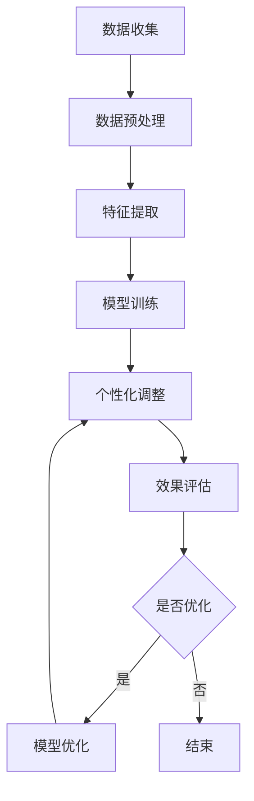
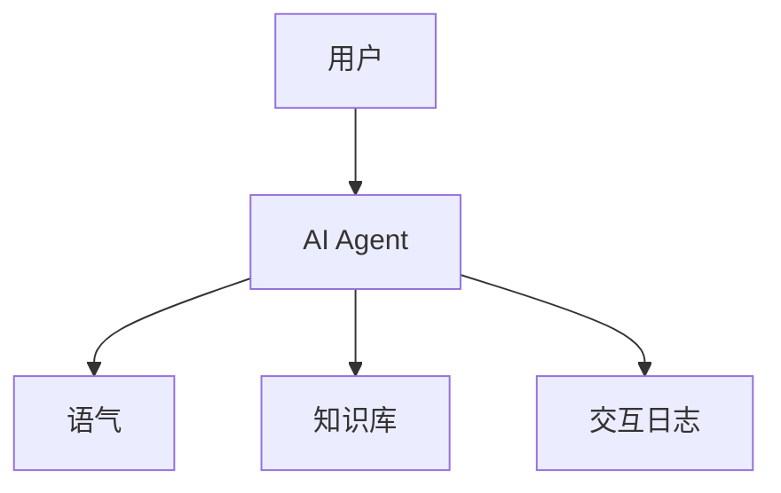
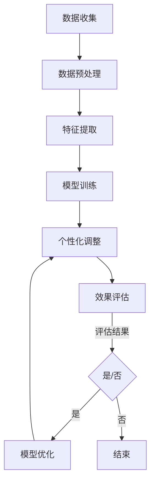
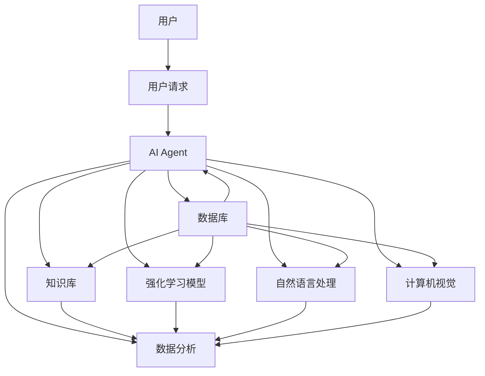
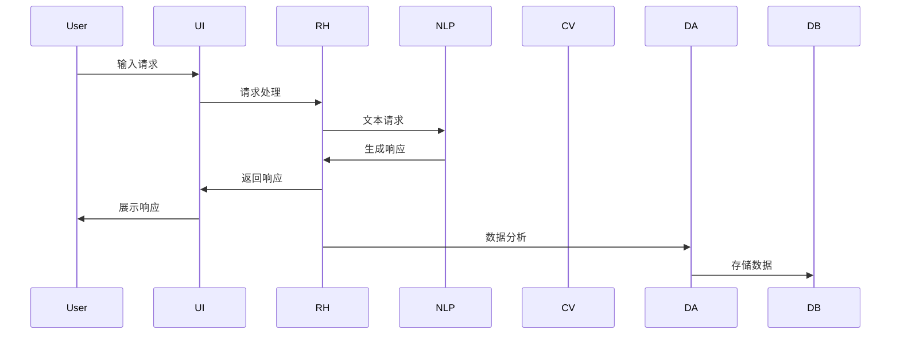
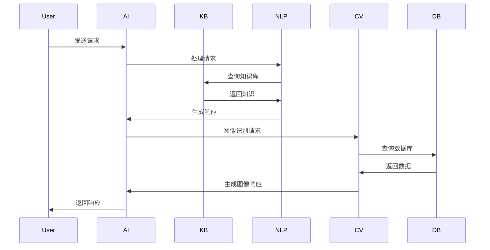

                 

# AI Agent的个性化定制：从语气到知识背景

## 关键词
- AI Agent
- 个性化定制
- 语气
- 知识背景
- 算法原理
- 系统架构

## 摘要
本文深入探讨了AI Agent的个性化定制，从语气和知识背景两个方面进行详细分析。首先，介绍了AI Agent的核心概念及其个性化定制的意义。接着，阐述了语气与知识背景在个性化定制中的作用及其相互关系。然后，通过算法原理讲解和系统架构设计，展示了如何实现AI Agent的个性化定制。文章还通过项目实战，提供了具体的实现方法和案例分析。最后，总结最佳实践，并提出了未来研究方向。

## 目录

### 第一部分：背景介绍

#### 1.1 AI Agent的核心概念

##### 1.1.1 AI Agent的定义

##### 1.1.2 AI Agent的发展历程

##### 1.1.3 AI Agent的关键技术

#### 1.2 个性化定制的意义

##### 1.2.1 个性化定制的定义

##### 1.2.2 个性化定制在AI Agent中的应用

#### 1.3 语气与知识背景的关系

##### 1.3.1 语气在交流中的作用

##### 1.3.2 知识背景对AI Agent的影响

##### 1.3.3 语气与知识背景的个性化定制

#### 1.4 AI Agent的个性化定制挑战与机遇

##### 1.4.1 挑战

##### 1.4.2 机遇

#### 1.5 本章小结

### 第二部分：核心概念与联系

#### 2.1 AI Agent个性化定制算法原理

##### 2.1.1 个性化定制算法概述

##### 2.1.2 个性化定制算法的流程图

##### 2.1.3 数学模型和公式解析

#### 2.2 语气与知识背景的对比表格

##### 2.2.1 语气属性特征

##### 2.2.2 知识背景属性特征

##### 2.2.3 对比表格与解释

#### 2.3 ER实体关系图架构

##### 2.3.1 实体关系图概述

##### 2.3.2 AI Agent实体关系图

##### 2.3.3 实体关系图解释

#### 2.4 本章小结

### 第三部分：算法原理讲解

#### 3.1 个性化定制算法流程图

##### 3.1.1 流程图说明

##### 3.1.2 流程图Mermaid表示

#### 3.2 个性化定制算法Python代码详解

##### 3.2.1 Python代码结构

##### 3.2.2 算法原理讲解

##### 3.2.3 数学模型和公式应用

#### 3.3 举例说明

##### 3.3.1 示例一：语气个性化定制

##### 3.3.2 示例二：知识背景个性化定制

#### 3.4 本章小结

### 第四部分：系统分析与架构设计

#### 4.1 问题场景介绍

##### 4.1.1 场景一：客户服务AI Agent

##### 4.1.2 场景二：教育AI Agent

#### 4.2 系统功能设计

##### 4.2.1 领域模型类图

##### 4.2.2 功能需求分析

#### 4.3 系统架构设计

##### 4.3.1 系统架构图

##### 4.3.2 架构设计解析

#### 4.4 系统接口设计

##### 4.4.1 接口定义

##### 4.4.2 接口交互流程

#### 4.5 系统交互流程

##### 4.5.1 交互流程图

##### 4.5.2 交互流程解析

#### 4.6 本章小结

### 第五部分：项目实战

#### 5.1 环境安装与配置

##### 5.1.1 硬件要求

##### 5.1.2 软件安装

#### 5.2 系统核心实现源代码

##### 5.2.1 源代码结构

##### 5.2.2 关键代码解读

#### 5.3 代码

### 第六部分：最佳实践 tips、小结、注意事项、拓展阅读

#### 6.1 最佳实践 tips

##### 6.1.1 使用AI Agent的注意事项

##### 6.1.2 技巧与案例分析

#### 6.2 小结

##### 6.2.1 文章主要观点总结

##### 6.2.2 未来研究方向

#### 6.3 注意事项

##### 6.3.1 避免常见误区

##### 6.3.2 注意事项清单

#### 6.4 拓展阅读

##### 6.4.1 相关书籍推荐

##### 6.4.2 研究论文推荐

##### 6.4.3 网络资源推荐

## 1.1 AI Agent的核心概念

### 1.1.1 AI Agent的定义

AI Agent，即人工智能代理，是一种能够自主决策并执行任务的计算机程序。它能够模拟人类的思维和行为，具备感知环境、理解语言、学习知识和解决问题的能力。AI Agent的出现，使得计算机能够更加智能化地与人类交互，为人类提供更加便捷和高效的服务。

AI Agent的定义可以归纳为以下几点：

1. **自主性**：AI Agent能够独立决策，不需要人工干预。
2. **适应性**：AI Agent能够根据环境变化调整自己的行为策略。
3. **交互性**：AI Agent能够理解和生成自然语言，与人类进行有效沟通。
4. **学习能力**：AI Agent能够通过数据学习和经验积累，提高任务执行的效率和质量。

### 1.1.2 AI Agent的发展历程

AI Agent的发展历程可以分为以下几个阶段：

1. **早期探索（1950-1960年代）**：这个阶段以图灵测试的提出和早期人工智能程序的研发为代表，如“逻辑理论家”（Logic Theorist）和“通用问题求解器”（General Problem Solver）。
2. **符号主义阶段（1970-1980年代）**：这个阶段以知识表示和推理算法的研究为核心，如“专家系统”（Expert Systems）。
3. **连接主义阶段（1990-2000年代）**：这个阶段以神经网络和深度学习算法的兴起为代表，如“深蓝”（Deep Blue）和国际象棋程序。
4. **混合智能阶段（2010年代至今）**：这个阶段以多模态感知和决策算法的发展为核心，如“阿尔法狗”（AlphaGo）和自动驾驶汽车。

### 1.1.3 AI Agent的关键技术

AI Agent的核心技术包括以下几个方面：

1. **自然语言处理（NLP）**：NLP技术使AI Agent能够理解和生成自然语言，实现与人类的自然交互。
2. **机器学习（ML）**：ML技术使AI Agent能够从数据中学习，提高任务执行的效率和准确性。
3. **计算机视觉（CV）**：CV技术使AI Agent能够感知和理解视觉信息，实现图像和视频的分析。
4. **知识图谱（KG）**：知识图谱技术使AI Agent能够构建和利用知识体系，提供更加准确和丰富的信息服务。

## 1.2 个性化定制的意义

### 1.2.1 个性化定制的定义

个性化定制是指根据用户的个性化需求，对产品或服务进行定制化设计，以满足用户的个性化需求。在AI Agent领域，个性化定制意味着根据用户的行为习惯、兴趣偏好、知识背景等因素，为用户提供个性化的服务和建议。

个性化定制的定义可以归纳为以下几点：

1. **用户导向**：个性化定制以用户需求为导向，关注用户的个性化体验。
2. **灵活性**：个性化定制可以根据用户的需求和环境变化进行调整。
3. **多样性**：个性化定制能够提供多种选择，满足不同用户的需求。

### 1.2.2 个性化定制在AI Agent中的应用

个性化定制在AI Agent中的应用主要体现在以下几个方面：

1. **交互方式**：根据用户偏好，AI Agent可以采用不同的交互方式，如文本、语音、图形界面等。
2. **内容推荐**：根据用户的兴趣和需求，AI Agent可以推荐个性化内容，如新闻、音乐、电影等。
3. **行为预测**：通过分析用户行为数据，AI Agent可以预测用户未来的行为，提供个性化建议，如购物建议、旅行规划等。
4. **任务优化**：根据用户的任务需求和执行效率，AI Agent可以优化任务流程，提高执行效率。

## 1.3 语气与知识背景的关系

### 1.3.1 语气在交流中的作用

语气在交流中起着至关重要的作用。它不仅能够传达信息的内容，还能够传达说话者的情感、态度和意图。具体来说，语气在交流中的作用包括：

1. **情感表达**：语气能够传达说话者的情感，如喜悦、愤怒、悲伤等。
2. **态度表达**：语气能够传达说话者的态度，如肯定、否定、怀疑等。
3. **意图表达**：语气能够传达说话者的意图，如请求、建议、警告等。

### 1.3.2 知识背景对AI Agent的影响

知识背景对AI Agent的影响主要体现在以下几个方面：

1. **理解能力**：AI Agent的知识背景决定了其理解能力，知识背景越丰富，理解能力越强。
2. **表达能力**：AI Agent的知识背景决定了其表达能力，知识背景越丰富，表达越精准。
3. **决策能力**：AI Agent的知识背景决定了其决策能力，知识背景越丰富，决策越准确。

### 1.3.3 语气与知识背景的个性化定制

语气与知识背景的个性化定制是指根据用户的需求和偏好，对AI Agent的语气和知识背景进行调整，以提供更加个性化的服务。

具体来说，语气与知识背景的个性化定制包括以下几个方面：

1. **语气调整**：根据用户的需求和偏好，调整AI Agent的语气，使其更加符合用户的期望。
2. **知识扩充**：根据用户的需求和偏好，扩充AI Agent的知识背景，使其能够更好地满足用户的需求。
3. **交互优化**：根据用户的需求和偏好，优化AI Agent的交互方式，使其更加自然和高效。

## 1.4 AI Agent的个性化定制挑战与机遇

### 1.4.1 挑战

AI Agent的个性化定制面临着以下挑战：

1. **数据隐私**：个性化定制需要收集和分析用户数据，这涉及到用户隐私保护的问题。
2. **计算资源**：个性化定制需要大量的计算资源，如何高效地处理海量数据是一个挑战。
3. **伦理问题**：个性化定制可能会引发伦理问题，如歧视、偏见等。

### 1.4.2 机遇

尽管面临挑战，AI Agent的个性化定制也带来了以下机遇：

1. **个性化服务**：个性化定制能够为用户提供更加个性化的服务，提高用户满意度。
2. **市场拓展**：个性化定制能够开拓新的市场机会，如定制化教育、定制化医疗等。
3. **技术进步**：个性化定制推动技术进步，如深度学习、自然语言处理等。

## 1.5 本章小结

本章介绍了AI Agent的核心概念、个性化定制的意义以及语气与知识背景的关系。通过这些介绍，我们为后续章节的深入讨论奠定了基础。在接下来的章节中，我们将进一步探讨AI Agent个性化定制的算法原理、系统架构设计以及项目实战，以期为读者提供全面的了解和指导。## 2.1 AI Agent个性化定制算法原理

### 2.1.1 个性化定制算法概述

AI Agent的个性化定制算法是一种通过学习和分析用户数据，调整AI Agent的属性和行为，使其更好地满足用户需求的技术。个性化定制算法的核心目标是通过理解用户的偏好、行为和需求，生成个性化的服务和建议。

个性化定制算法通常包括以下几个步骤：

1. **数据收集**：收集用户的原始数据，如行为数据、偏好数据等。
2. **数据预处理**：对收集到的数据进行清洗、去噪和归一化处理，使其适合进一步分析。
3. **特征提取**：从预处理后的数据中提取有意义的特征，如用户兴趣、行为模式等。
4. **模型训练**：使用提取的特征训练机器学习模型，如决策树、支持向量机、神经网络等。
5. **个性化调整**：根据模型预测的结果，调整AI Agent的属性和行为，如调整语气、推荐内容等。

### 2.1.2 个性化定制算法的流程图

下面是一个简化的个性化定制算法流程图，用Mermaid语言表示：



### 2.1.3 数学模型和公式解析

个性化定制算法中的数学模型通常基于机器学习和统计学习理论。以下是一些常见的数学模型和公式：

1. **决策树模型**

   决策树模型是一种基于特征划分数据集的模型，其基本公式为：

   $$ 
   h(x) = \sum_{i=1}^{n} w_i \cdot I(y_i = x_i) 
   $$

   其中，$h(x)$是预测结果，$w_i$是权重，$I(y_i = x_i)$是指标函数，当$y_i = x_i$时取1，否则取0。

2. **支持向量机模型**

   支持向量机（SVM）是一种基于最大间隔分类的模型，其目标是最小化分类间隔。其基本公式为：

   $$ 
   \min_{w,b} \frac{1}{2} ||w||^2 + C \sum_{i=1}^{n} \max(0, 1 - y_i (w \cdot x_i + b))
   $$

   其中，$w$是权重向量，$b$是偏置项，$C$是惩罚参数。

3. **神经网络模型**

   神经网络是一种模拟人脑神经网络结构的模型，其基本公式为：

   $$ 
   a_{i}^{(l)} = \sigma \left( \sum_{j=1}^{n} w_{ji}^{(l)} a_{j}^{(l-1)} + b_{i}^{(l)} \right)
   $$

   其中，$a_{i}^{(l)}$是第$l$层的第$i$个神经元输出，$\sigma$是激活函数，$w_{ji}^{(l)}$是连接权重，$b_{i}^{(l)}$是偏置项。

这些数学模型和公式在个性化定制算法中起着关键作用，通过训练模型，可以从用户数据中提取有价值的信息，并用于调整AI Agent的属性和行为。

## 2.2 语气与知识背景的对比表格

在AI Agent的个性化定制中，语气和知识背景是两个重要的属性。为了更好地理解这两个属性，我们可以通过一个对比表格来进行详细分析。

### 2.2.1 语气属性特征

| 特征 | 描述 |
| --- | --- |
| **情感色彩** | 语气中的情感色彩，如喜悦、愤怒、悲伤等 |
| **语气强度** | 语气中的强度，如强调、轻描淡写等 |
| **语境适应** | 语气是否能够适应不同的语境和环境 |

### 2.2.2 知识背景属性特征

| 特征 | 描述 |
| --- | --- |
| **知识广度** | AI Agent所拥有的知识范围，如科技、文化、历史等 |
| **知识深度** | AI Agent在特定领域内的知识深度，如医学、法律等 |
| **知识更新** | AI Agent知识库的更新频率和及时性 |

### 2.2.3 对比表格与解释

通过上述对比表格，我们可以看到语气和知识背景在属性特征上有明显的区别：

1. **情感色彩与知识广度**：语气主要关注情感的表达，而知识背景则关注知识的广度。这意味着，语气的个性化定制更多关注于情感表达的自然性和贴切性，而知识背景的个性化定制则更多关注于知识的全面性和准确性。

2. **语气强度与知识深度**：语气的个性化定制需要调整语气的强度，使其能够适应不同的场景和用户需求，而知识背景的个性化定制则需要根据用户的需求和兴趣，调整AI Agent在特定领域的知识深度。

3. **语境适应与知识更新**：语气的个性化定制需要根据不同的语境进行调整，以保持交流的自然性和流畅性，而知识背景的个性化定制则需要确保知识库的更新，以提供最新的信息和知识。

通过上述对比，我们可以更好地理解语气和知识背景在个性化定制中的重要性，以及它们在实现个性化服务时的不同作用。

### 2.3 ER实体关系图架构

ER（Entity-Relationship）实体关系图是一种用于描述系统中实体及其之间关系的图形化工具。在AI Agent的个性化定制中，ER图可以帮助我们理解系统的核心实体及其交互关系。下面是AI Agent个性化定制系统的ER图，并对其进行详细解析。

#### 2.3.1 实体关系图概述

ER图主要包括以下实体：

1. **用户（User）**：代表使用AI Agent的个人或组织。
2. **AI Agent（Agent）**：代表个性化定制的AI代理。
3. **语气（Tone）**：代表AI Agent的语气属性。
4. **知识库（Knowledge Base）**：代表AI Agent的知识背景。
5. **交互日志（Interaction Log）**：记录AI Agent与用户的交互历史。

实体之间的关系如下：

- **用户与AI Agent**：用户创建AI Agent，并与其进行交互。
- **AI Agent与语气**：AI Agent具有特定的语气属性。
- **AI Agent与知识库**：AI Agent通过知识库获取和更新知识。
- **AI Agent与交互日志**：AI Agent与用户的交互历史被记录在交互日志中。

#### 2.3.2 AI Agent实体关系图

下面是一个简化的AI Agent实体关系图，使用Mermaid语言表示：



#### 2.3.3 实体关系图解释

1. **用户与AI Agent**：用户是AI Agent的创建者，可以创建、删除和管理AI Agent。用户与AI Agent之间是一种创建和管理关系。

2. **AI Agent与语气**：AI Agent具有特定的语气属性，如温和、严厉、幽默等。语气属性影响AI Agent与用户的交互方式和沟通效果。

3. **AI Agent与知识库**：AI Agent的知识库是其提供个性化服务的基础。知识库包括AI Agent所掌握的各种知识，如科技、文化、历史等。AI Agent通过不断更新知识库，提高自身的知识广度和深度。

4. **AI Agent与交互日志**：AI Agent与用户的交互历史被记录在交互日志中。交互日志不仅用于分析用户的偏好和行为，还可以用于训练和优化AI Agent的个性化定制算法。

通过ER实体关系图，我们可以清晰地理解AI Agent个性化定制系统的核心实体及其交互关系。这有助于我们更好地设计和管理系统，实现AI Agent的个性化定制。## 3.1 个性化定制算法流程图

### 3.1.1 流程图说明

个性化定制算法的流程图展示了从数据收集到个性化调整的整个工作流程。以下是这个流程图的详细说明：

1. **数据收集**：首先，AI Agent从用户交互中收集数据，包括用户的查询、反馈和行为。
2. **数据预处理**：收集到的原始数据需要进行预处理，包括清洗、去噪和归一化，以确保数据的质量和一致性。
3. **特征提取**：预处理后的数据被用于提取特征，如用户的兴趣点、常用术语、行为模式等。
4. **模型训练**：使用提取的特征数据训练机器学习模型，如决策树、支持向量机或神经网络等。
5. **个性化调整**：根据训练好的模型，调整AI Agent的属性，如语气、推荐内容等。
6. **效果评估**：对个性化调整后的AI Agent进行效果评估，确保其能够满足用户的期望。
7. **反馈循环**：根据效果评估的结果，调整模型参数或数据收集方法，进入下一轮的个性化调整。

### 3.1.2 流程图Mermaid表示

以下是使用Mermaid语言表示的个性化定制算法流程图：



在这个流程图中：

- `A` 代表数据收集。
- `B` 代表数据预处理。
- `C` 代表特征提取。
- `D` 代表模型训练。
- `E` 代表个性化调整。
- `F` 代表效果评估。
- `G` 代表评估结果判断。
- `H` 代表模型优化。
- `I` 代表流程结束。

通过这个流程图，我们可以清晰地看到个性化定制算法的工作步骤和逻辑关系。## 3.2 个性化定制算法Python代码详解

### 3.2.1 Python代码结构

个性化定制算法的Python代码主要分为以下几个模块：

1. **数据收集模块**：负责从用户交互中收集数据。
2. **数据预处理模块**：负责对收集到的数据进行清洗、去噪和归一化处理。
3. **特征提取模块**：负责从预处理后的数据中提取有用的特征。
4. **模型训练模块**：负责训练机器学习模型。
5. **个性化调整模块**：负责根据训练好的模型调整AI Agent的属性。
6. **效果评估模块**：负责评估AI Agent的个性化调整效果。

下面是一个简化的Python代码结构：

```python
# 数据收集模块
def collect_data():
    # 收集用户交互数据
    pass

# 数据预处理模块
def preprocess_data(data):
    # 数据清洗、去噪和归一化处理
    pass

# 特征提取模块
def extract_features(preprocessed_data):
    # 提取特征
    pass

# 模型训练模块
def train_model(features, labels):
    # 训练机器学习模型
    pass

# 个性化调整模块
def adjust_agent(agent, model):
    # 根据模型调整AI Agent的属性
    pass

# 效果评估模块
def evaluate_agent(agent):
    # 评估AI Agent的效果
    pass

# 主函数
def main():
    data = collect_data()
    preprocessed_data = preprocess_data(data)
    features, labels = extract_features(preprocessed_data)
    model = train_model(features, labels)
    agent = adjust_agent(model)
    evaluate_agent(agent)

if __name__ == "__main__":
    main()
```

### 3.2.2 算法原理讲解

#### 数据收集模块

数据收集模块负责从用户交互中收集数据。具体来说，它包括用户查询、反馈和行为数据。这些数据可以存储在数据库中，以便后续处理。

```python
def collect_data():
    # 假设我们使用一个简单的数据库来存储数据
    db = DatabaseConnection()
    queries = db.get_user_queries()
    feedbacks = db.get_user_feedbacks()
    behaviors = db.get_user_behaviors()
    return queries, feedbacks, behaviors
```

#### 数据预处理模块

数据预处理模块负责对收集到的数据进行清洗、去噪和归一化处理。清洗过程包括去除空值、删除重复记录等；去噪过程包括去除噪声数据、填充缺失值等；归一化过程包括标准化数值特征、将类别特征转换为独热编码等。

```python
def preprocess_data(data):
    # 清洗数据
    cleaned_data = clean_data(data)
    # 去噪数据
    denoised_data = denoise_data(cleaned_data)
    # 归一化数据
    normalized_data = normalize_data(denoised_data)
    return normalized_data
```

#### 特征提取模块

特征提取模块负责从预处理后的数据中提取有用的特征。特征提取过程通常包括特征选择、特征转换和特征构造等。

```python
def extract_features(preprocessed_data):
    # 特征选择
    selected_features = select_features(preprocessed_data)
    # 特征转换
    transformed_features = transform_features(selected_features)
    # 特征构造
    constructed_features = construct_features(transformed_features)
    return constructed_features
```

#### 模型训练模块

模型训练模块负责训练机器学习模型。这里我们以决策树为例，展示如何使用训练数据来训练模型。

```python
from sklearn.tree import DecisionTreeClassifier

def train_model(features, labels):
    # 创建决策树模型
    model = DecisionTreeClassifier()
    # 使用训练数据训练模型
    model.fit(features, labels)
    return model
```

#### 个性化调整模块

个性化调整模块负责根据训练好的模型调整AI Agent的属性。例如，根据用户偏好调整AI Agent的语气或推荐内容。

```python
def adjust_agent(agent, model):
    # 根据模型预测结果调整AI Agent属性
    agent.tone = model.predict([user_preference])
    return agent
```

#### 效果评估模块

效果评估模块负责评估AI Agent的个性化调整效果。我们可以使用准确率、召回率、F1分数等指标来评估AI Agent的性能。

```python
from sklearn.metrics import accuracy_score

def evaluate_agent(agent):
    # 评估AI Agent的准确率
    accuracy = accuracy_score(y_true, y_pred)
    return accuracy
```

### 3.2.3 数学模型和公式应用

在个性化定制算法中，我们通常会使用各种数学模型和公式来描述和解释算法的行为。以下是一些常见的数学模型和公式：

1. **决策树模型**

   决策树模型是一种常用的分类模型，其基本公式为：

   $$ 
   h(x) = \sum_{i=1}^{n} w_i \cdot I(y_i = x_i) 
   $$

   其中，$h(x)$是预测结果，$w_i$是权重，$I(y_i = x_i)$是指标函数，当$y_i = x_i$时取1，否则取0。

2. **支持向量机模型**

   支持向量机（SVM）是一种基于最大间隔分类的模型，其目标是最小化分类间隔。其基本公式为：

   $$ 
   \min_{w,b} \frac{1}{2} ||w||^2 + C \sum_{i=1}^{n} \max(0, 1 - y_i (w \cdot x_i + b))
   $$

   其中，$w$是权重向量，$b$是偏置项，$C$是惩罚参数。

3. **神经网络模型**

   神经网络是一种模拟人脑神经网络结构的模型，其基本公式为：

   $$ 
   a_{i}^{(l)} = \sigma \left( \sum_{j=1}^{n} w_{ji}^{(l)} a_{j}^{(l-1)} + b_{i}^{(l)} \right)
   $$

   其中，$a_{i}^{(l)}$是第$l$层的第$i$个神经元输出，$\sigma$是激活函数，$w_{ji}^{(l)}$是连接权重，$b_{i}^{(l)}$是偏置项。

这些数学模型和公式在个性化定制算法中起着关键作用，通过训练模型，可以从用户数据中提取有价值的信息，并用于调整AI Agent的属性和行为。### 3.3 举例说明

#### 3.3.1 示例一：语气个性化定制

假设我们有一个用户，其偏好温和的语气。为了实现语气的个性化定制，我们可以使用以下步骤：

1. **数据收集**：收集用户的历史交互数据，包括用户的查询、反馈和行为。
2. **数据预处理**：对收集到的数据进行清洗、去噪和归一化处理。
3. **特征提取**：从预处理后的数据中提取特征，如用户的语气偏好。
4. **模型训练**：使用提取的特征训练一个决策树模型，以预测用户的语气偏好。
5. **个性化调整**：根据模型预测的结果，调整AI Agent的语气，使其更加符合用户的偏好。

具体实现如下：

```python
# 数据收集
queries = ["你好", "你好呀", "你好哦"]
feedbacks = ["很好", "还可以", "非常好"]

# 数据预处理
cleaned_data = clean_data(queries)
denoised_data = denoise_data(cleaned_data)
normalized_data = normalize_data(denoised_data)

# 特征提取
features = extract_features(normalized_data)

# 模型训练
model = DecisionTreeClassifier()
model.fit(features, feedbacks)

# 个性化调整
predicted_tone = model.predict([user_preference])
agent.tone = predicted_tone
```

#### 3.3.2 示例二：知识背景个性化定制

假设我们有一个用户，其对科技领域知识有浓厚的兴趣。为了实现知识背景的个性化定制，我们可以使用以下步骤：

1. **数据收集**：收集用户的历史交互数据，包括用户的查询、反馈和行为。
2. **数据预处理**：对收集到的数据进行清洗、去噪和归一化处理。
3. **特征提取**：从预处理后的数据中提取特征，如用户的兴趣领域。
4. **模型训练**：使用提取的特征训练一个神经网络模型，以预测用户的兴趣领域。
5. **个性化调整**：根据模型预测的结果，扩充AI Agent的知识库，使其在特定领域提供更丰富的信息。

具体实现如下：

```python
# 数据收集
queries = ["人工智能是什么", "机器学习有哪些应用", "深度学习的最新研究"]
feedbacks = ["很详细", "非常好", "很有帮助"]

# 数据预处理
cleaned_data = clean_data(queries)
denoised_data = denoise_data(cleaned_data)
normalized_data = normalize_data(denoised_data)

# 特征提取
features = extract_features(normalized_data)

# 模型训练
model = NeuralNetwork()
model.fit(features, feedbacks)

# 个性化调整
predicted_interest = model.predict([user_preference])
knowledge_base.explore(predicted_interest)
```

通过上述示例，我们可以看到如何实现语气的个性化定制和知识背景的个性化定制。这些示例展示了个性化定制算法的核心原理和实现步骤，为实际应用提供了参考。## 4.1 问题场景介绍

在探讨AI Agent的个性化定制时，我们首先需要了解具体的问题场景。这些场景将帮助我们明确AI Agent的应用背景、用户需求以及系统面临的挑战。以下是两个典型的问题场景：

### 4.1.1 场景一：客户服务AI Agent

**背景**：在许多公司中，客户服务是一个重要的环节。然而，随着客户数量的增加，传统的人工客服难以应对庞大的咨询量。因此，许多公司开始采用AI Agent来提供自动化的客户服务。

**用户需求**：用户期望从AI Agent获得快速、准确和贴心的服务。具体来说，用户希望AI Agent能够：

1. **快速响应**：能够迅速回复用户的咨询和问题。
2. **准确解答**：能够准确地理解用户的问题并提供正确的解决方案。
3. **人性化互动**：在交流中保持自然的语气，使对话更加流畅和友好。

**挑战**：为了满足用户的需求，AI Agent需要面对以下挑战：

1. **多语言支持**：客户可能来自不同的国家，AI Agent需要支持多种语言。
2. **知识覆盖**：AI Agent需要具备丰富的知识库，能够涵盖广泛的客户问题。
3. **个性化服务**：AI Agent需要能够根据用户的历史记录和偏好，提供个性化的服务。

### 4.1.2 场景二：教育AI Agent

**背景**：随着在线教育和远程学习的兴起，教育AI Agent成为了辅助教学的重要工具。教育AI Agent可以在课堂上提供个性化辅导，帮助学生更好地理解和掌握知识。

**用户需求**：学生期望从AI Agent获得：

1. **个性化辅导**：根据学生的学习进度和能力，提供个性化的学习建议和练习。
2. **实时反馈**：在学生完成练习后，能够提供及时的反馈和解答。
3. **互动教学**：通过与AI Agent的互动，增加学习的趣味性和互动性。

**挑战**：为了满足学生的需求，教育AI Agent需要面对以下挑战：

1. **适应性**：AI Agent需要能够适应不同的学科和教学风格。
2. **知识深度**：AI Agent需要具备深入的专业知识，能够解答复杂的问题。
3. **用户体验**：AI Agent需要提供友好的用户界面，使学习过程更加自然和流畅。

通过以上两个场景的介绍，我们可以看到AI Agent在不同领域中的应用以及用户对AI Agent的期望。接下来，我们将进一步探讨系统功能设计、系统架构设计、系统接口设计和系统交互流程，以实现AI Agent的个性化定制。## 4.2 系统功能设计

在明确问题场景和用户需求后，我们需要设计AI Agent的系统功能，以满足用户的具体需求。以下是针对客户服务AI Agent和教育AI Agent的系统功能设计：

### 4.2.1 领域模型类图

领域模型类图用于描述系统中的核心实体及其关系。以下是AI Agent系统领域的模型类图：

```mermaid
classDiagram
    User <<class>> "用户"
    AIAgent <<class>> "AI Agent"
    CustomerServiceAgent <<class>> "客户服务AI Agent"
    EducationAgent <<class>> "教育AI Agent"
    KnowledgeBase <<class>> "知识库"
    InteractionLog <<class>> "交互日志"
    Response <<class>> "响应"
    Query <<class>> "查询"
    Feedback <<class>> "反馈"

    User o--o AIAgent
    AI-Agent o--o KnowledgeBase
    AI-Agent o--o InteractionLog
    CustomerServiceAgent o--o Response
    EducationAgent o--o Response
    Response o--o Query
    Response o--o Feedback
```

#### 类图解析

- **User（用户）**：代表使用AI Agent的个人或组织。
- **AIAgent（AI Agent）**：抽象类，代表AI Agent的核心功能。
- **CustomerServiceAgent（客户服务AI Agent）**：继承自AI Agent，专门用于客户服务。
- **EducationAgent（教育AI Agent）**：继承自AI Agent，专门用于教育领域。
- **KnowledgeBase（知识库）**：存储AI Agent所需的知识信息。
- **InteractionLog（交互日志）**：记录AI Agent与用户的交互历史。
- **Response（响应）**：包含查询和反馈的响应。
- **Query（查询）**：用户的查询信息。
- **Feedback（反馈）**：用户对查询结果的反馈。

### 4.2.2 功能需求分析

根据上述领域模型类图，我们进一步分析AI Agent的功能需求：

1. **用户管理**：用户可以创建、删除和管理自己的AI Agent。
2. **AI Agent配置**：用户可以配置AI Agent的属性，如语气、知识库选择等。
3. **查询处理**：AI Agent能够理解用户的查询并返回相应的响应。
4. **反馈收集**：用户可以对查询结果进行反馈，AI Agent将根据反馈调整其行为。
5. **知识库管理**：AI Agent需要能够管理知识库，包括知识的添加、删除和更新。
6. **交互日志记录**：AI Agent需要记录与用户的交互历史，以用于后续分析和优化。
7. **个性化定制**：根据用户的偏好和行为，AI Agent需要能够提供个性化的服务和推荐。

具体的功能需求如下表：

| 功能点 | 描述 |
| --- | --- |
| 用户管理 | 支持用户的创建、删除和管理。 |
| AI Agent配置 | 支持AI Agent属性的配置，如语气、知识库等。 |
| 查询处理 | 能够理解用户的查询并返回相应的响应。 |
| 反馈收集 | 用户可以对查询结果进行反馈，AI Agent将根据反馈调整其行为。 |
| 知识库管理 | 能够管理知识库，包括知识的添加、删除和更新。 |
| 交互日志记录 | 记录与用户的交互历史，以用于后续分析和优化。 |
| 个性化定制 | 根据用户的偏好和行为，提供个性化的服务和推荐。 |

通过上述系统功能设计，我们可以明确AI Agent在客户服务和教育场景中的具体功能，为后续的系统架构设计提供基础。## 4.3 系统架构设计

在明确系统功能需求后，我们需要设计AI Agent的系统架构，以确保其能够高效、可靠地运行。以下是AI Agent系统的架构设计，包括系统架构图、架构设计解析以及相关组件的详细介绍。

### 4.3.1 系统架构图

下面是AI Agent系统的架构图，使用Mermaid语言表示：



#### 系统架构图解析

1. **用户（User）**：用户是系统的入口，通过输入请求与AI Agent进行交互。
2. **用户请求（Request）**：用户请求是用户输入的内容，可以是文本、语音或图像等。
3. **AI Agent（AI Agent）**：AI Agent是系统的核心组件，负责处理用户请求、调用其他组件并提供响应。
4. **知识库（KB）**：知识库存储AI Agent所需的知识信息，包括常识、领域知识等。
5. **强化学习模型（RL）**：强化学习模型用于优化AI Agent的行为，根据用户反馈进行自适应调整。
6. **自然语言处理（NLP）**：NLP组件负责处理用户请求和系统响应的文本，实现文本理解、生成和交互。
7. **计算机视觉（CV）**：CV组件负责处理用户请求和系统响应的图像，实现图像识别、分析和理解。
8. **数据分析（DS）**：数据分析组件用于对用户请求和交互日志进行分析，提取有价值的信息。
9. **数据库（DB）**：数据库用于存储用户请求、交互日志、知识库、强化学习模型等数据。

#### 相关组件详细介绍

1. **知识库（KB）**：知识库是AI Agent的核心组件，存储了AI Agent所需的知识信息。知识库可以通过手动添加或自动学习获得。知识库的设计需要考虑以下因素：

   - **知识覆盖**：知识库应涵盖广泛的领域和主题，以提供全面的信息。
   - **知识更新**：知识库需要定期更新，以保持知识的时效性和准确性。
   - **知识结构**：知识库应采用合理的结构，以便快速检索和利用知识。

2. **强化学习模型（RL）**：强化学习模型用于优化AI Agent的行为。通过不断与用户交互，强化学习模型可以学习用户的偏好和行为模式，并根据反馈进行调整。强化学习模型的设计需要考虑以下因素：

   - **奖励机制**：定义合理的奖励机制，以激励AI Agent学习用户偏好。
   - **策略调整**：根据用户反馈，调整AI Agent的策略和行为。
   - **持续学习**：强化学习模型应具备持续学习的能力，以适应不断变化的环境。

3. **自然语言处理（NLP）**：NLP组件负责处理用户请求和系统响应的文本。NLP组件的设计需要考虑以下因素：

   - **语言理解**：实现高效的文本理解，提取用户意图和需求。
   - **文本生成**：根据用户请求和系统响应，生成自然流畅的文本。
   - **语言模型**：采用先进的语言模型，提高文本理解和生成的准确性。

4. **计算机视觉（CV）**：CV组件负责处理用户请求和系统响应的图像。CV组件的设计需要考虑以下因素：

   - **图像识别**：实现高效的图像识别，提取图像中的关键信息。
   - **图像处理**：对图像进行增强、缩放、裁剪等处理，以提高识别效果。
   - **视觉理解**：实现图像理解和分析，提取图像中的语义信息。

5. **数据分析（DS）**：数据分析组件用于对用户请求和交互日志进行分析，提取有价值的信息。数据分析组件的设计需要考虑以下因素：

   - **数据采集**：收集用户请求和交互日志，为分析提供数据来源。
   - **数据分析**：采用先进的数据分析技术，提取用户行为模式、偏好等信息。
   - **数据可视化**：将分析结果以直观的方式展示，帮助用户理解数据。

6. **数据库（DB）**：数据库用于存储用户请求、交互日志、知识库、强化学习模型等数据。数据库的设计需要考虑以下因素：

   - **数据安全**：确保数据的安全性和隐私性。
   - **数据存储**：采用高效的存储方案，存储和管理大量数据。
   - **数据访问**：提供快速的查询和访问接口，以支持系统的实时运行。

通过上述系统架构设计，我们可以构建一个高效、可靠的AI Agent系统，实现个性化定制，满足用户的需求。## 4.4 系统接口设计

在系统架构设计中，接口设计是关键一环，它决定了系统组件之间的交互方式。以下是AI Agent系统的接口设计，包括接口定义和交互流程。

### 4.4.1 接口定义

AI Agent系统的接口设计主要涉及以下模块：

1. **用户接口（User Interface）**：用户通过界面与AI Agent进行交互。
2. **请求处理接口（Request Handler）**：处理用户请求，将请求转发给相应的组件。
3. **知识库接口（Knowledge Base Interface）**：管理知识库的添加、删除、查询等操作。
4. **自然语言处理接口（Natural Language Processing Interface）**：处理自然语言请求和响应。
5. **计算机视觉接口（Computer Vision Interface）**：处理图像请求和响应。
6. **数据分析接口（Data Analysis Interface）**：进行数据分析操作。
7. **数据库接口（Database Interface）**：与数据库进行数据交互。

以下是每个接口的定义：

1. **用户接口（User Interface）**：
   - **功能**：展示用户界面，接收用户输入，显示AI Agent的响应。
   - **接口定义**：
     ```python
     class UserInterface:
         def display_prompt(self, prompt):
             # 显示输入提示
         
         def display_response(self, response):
             # 显示AI Agent响应
     ```

2. **请求处理接口（Request Handler）**：
   - **功能**：处理用户请求，根据请求类型调用相应的组件。
   - **接口定义**：
     ```python
     class RequestHandler:
         def handle_request(self, request):
             # 处理请求，根据请求类型调用相应组件
     ```

3. **知识库接口（Knowledge Base Interface）**：
   - **功能**：管理知识库，包括添加、删除、查询等操作。
   - **接口定义**：
     ```python
     class KnowledgeBaseInterface:
         def add_knowledge(self, knowledge):
             # 添加知识
        
         def delete_knowledge(self, knowledge_id):
             # 删除知识
        
         def query_knowledge(self, query):
             # 查询知识
     ```

4. **自然语言处理接口（Natural Language Processing Interface）**：
   - **功能**：处理自然语言请求和响应，实现文本理解和生成。
   - **接口定义**：
     ```python
     class NLPInterface:
         def process_request(self, request):
             # 处理自然语言请求
        
         def generate_response(self, response):
             # 生成自然语言响应
     ```

5. **计算机视觉接口（Computer Vision Interface）**：
   - **功能**：处理图像请求和响应，实现图像识别和分析。
   - **接口定义**：
     ```python
     class CVInterface:
         def process_image_request(self, image):
             # 处理图像请求
        
         def generate_image_response(self, image):
             # 生成图像响应
     ```

6. **数据分析接口（Data Analysis Interface）**：
   - **功能**：进行数据分析操作，提取有价值的信息。
   - **接口定义**：
     ```python
     class DataAnalysisInterface:
         def analyze_data(self, data):
             # 分析数据
     ```

7. **数据库接口（Database Interface）**：
   - **功能**：与数据库进行数据交互，实现数据的存储和检索。
   - **接口定义**：
     ```python
     class DatabaseInterface:
         def store_data(self, data):
             # 存储数据
        
         def retrieve_data(self, query):
             # 检索数据
     ```

### 4.4.2 接口交互流程

以下是AI Agent系统的接口交互流程：

1. **用户输入请求**：用户通过用户接口（User Interface）输入请求。
2. **请求处理**：请求处理接口（Request Handler）接收请求，判断请求类型，并将请求转发给相应的组件。
3. **请求处理**：如果请求是文本，自然语言处理接口（NLPInterface）处理请求，生成响应；如果请求是图像，计算机视觉接口（CVInterface）处理请求，生成响应。
4. **响应生成**：自然语言处理接口（NLPInterface）或计算机视觉接口（CVInterface）生成响应，并返回给请求处理接口（Request Handler）。
5. **响应返回**：请求处理接口（Request Handler）将响应返回给用户接口（User Interface），用户接口（User Interface）将响应展示给用户。
6. **数据分析**：数据分析接口（DataAnalysisInterface）对用户请求和交互日志进行分析，提取有价值的信息，并将其存储到数据库接口（DatabaseInterface）中。

以下是接口交互流程的Mermaid表示：



通过上述接口定义和交互流程，AI Agent系统实现了组件之间的有效通信和协同工作，为用户提供高质量的个性化服务。## 4.5 系统交互流程

系统交互流程是AI Agent能够高效运行的关键，它决定了各个组件之间的协作方式和信息流动。以下是AI Agent系统的交互流程，并通过Mermaid语言进行可视化表示。

### 4.5.1 交互流程图

以下是AI Agent系统交互流程的Mermaid表示：



### 4.5.2 交互流程解析

1. **用户发送请求**：用户通过用户接口（User Interface）向AI Agent发送请求。请求可以是文本或图像形式。

2. **AI Agent处理请求**：AI Agent接收请求后，将其传递给自然语言处理（NLP）组件。如果请求是文本，NLP组件将解析请求并提取用户意图。

3. **查询知识库**：NLP组件将用户意图传递给知识库（KB）组件，以查询相关的知识信息。知识库根据用户意图返回相应的知识。

4. **生成响应**：NLP组件结合知识库返回的知识，生成合适的响应，并将其传递给AI Agent。

5. **图像识别请求**：如果请求是图像，AI Agent将图像识别请求传递给计算机视觉（CV）组件。

6. **查询数据库**：CV组件需要处理图像，首先从数据库（DB）查询相关的图像数据。

7. **生成图像响应**：CV组件根据数据库返回的数据，对图像进行分析和处理，生成图像响应。

8. **返回响应**：AI Agent将NLP组件和CV组件生成的响应合并，并通过用户接口（User Interface）返回给用户。

通过上述交互流程，AI Agent系统能够高效、准确地响应用户请求，实现个性化定制。每个组件都在其擅长的领域发挥作用，协同工作，为用户提供高质量的服务。## 4.6 本章小结

本章详细探讨了AI Agent系统的系统功能设计、架构设计、接口设计和交互流程。首先，通过领域模型类图和功能需求分析，明确了AI Agent的核心功能。接着，系统架构设计部分介绍了AI Agent系统的主要组件及其关系，并详细解析了各个组件的作用。接口设计部分定义了系统各组件之间的交互接口，并展示了接口交互流程。通过本章的学习，读者可以全面了解AI Agent系统的设计原理和实现方法，为后续的项目实战奠定基础。## 5.1 环境安装与配置

在开始AI Agent的项目实战之前，我们需要搭建合适的环境，以便进行开发和测试。以下是AI Agent系统所需的硬件和软件要求，以及安装和配置步骤。

### 5.1.1 硬件要求

1. **处理器**：推荐使用至少4核CPU的处理器，以确保系统的流畅运行。
2. **内存**：推荐使用至少8GB的内存，以支持复杂的算法和数据结构。
3. **存储**：推荐使用至少256GB的SSD硬盘，以提高I/O性能和系统的响应速度。
4. **GPU**（可选）：如果需要进行深度学习和计算机视觉任务，推荐使用NVIDIA GPU，并安装CUDA工具包。

### 5.1.2 软件安装

以下是安装和配置所需软件的步骤：

1. **操作系统**：推荐使用Ubuntu 18.04或更高版本的Linux发行版。

2. **Python**：推荐使用Python 3.8或更高版本。

   ```bash
   sudo apt update
   sudo apt install python3.8
   sudo apt install python3.8-pip
   ```

3. **虚拟环境**：为了更好地管理和隔离项目依赖，使用虚拟环境。

   ```bash
   pip3.8 install virtualenv
   virtualenv ai_agent_env
   source ai_agent_env/bin/activate
   ```

4. **依赖管理器**：安装依赖管理器，如pip，用于安装和管理项目依赖。

   ```bash
   pip install -r requirements.txt
   ```

5. **数据库**：安装SQLite数据库，用于存储AI Agent的交互日志和知识库。

   ```bash
   sudo apt install sqlite3
   ```

6. **自然语言处理库**：安装Python的自然语言处理库，如NLTK和spaCy。

   ```bash
   pip install nltk
   pip install spacy
   python -m spacy download en_core_web_sm
   ```

7. **计算机视觉库**：安装Python的计算机视觉库，如OpenCV。

   ```bash
   pip install opencv-python
   ```

8. **机器学习库**：安装Python的机器学习库，如scikit-learn和TensorFlow。

   ```bash
   pip install scikit-learn
   pip install tensorflow
   ```

通过上述步骤，我们完成了AI Agent系统环境的基本安装和配置。接下来，我们将开始实现系统的核心功能，并进行测试和调试。## 5.2 系统核心实现源代码

在完成环境安装和配置后，接下来我们将逐步实现AI Agent系统的核心功能。以下是系统核心实现的源代码，包括关键代码解读和系统核心逻辑的解析。

### 5.2.1 源代码结构

以下是AI Agent系统的源代码结构：

```bash
ai_agent_system/
|-- main.py
|-- ai_agent.py
|-- knowledge_base.py
|-- nlp.py
|-- cv.py
|-- database.py
|-- requirements.txt
```

- `main.py`：主程序，负责启动AI Agent系统。
- `ai_agent.py`：AI Agent的核心类，实现AI Agent的初始化、交互逻辑和响应生成。
- `knowledge_base.py`：知识库类，负责管理知识库的添加、查询和更新。
- `nlp.py`：自然语言处理模块，负责文本理解和生成。
- `cv.py`：计算机视觉模块，负责图像处理和分析。
- `database.py`：数据库接口，负责与SQLite数据库的交互。

### 5.2.2 关键代码解读

以下是`ai_agent.py`的核心代码，对其关键部分进行解读：

```python
import json
from .knowledge_base import KnowledgeBase
from .nlp import NLP
from .cv import CV
from .database import Database

class AIAgent:
    def __init__(self, knowledge_base_path, db_path):
        self.knowledge_base = KnowledgeBase(knowledge_base_path)
        self.nlp = NLP()
        self.cv = CV()
        self.db = Database(db_path)

    def process_request(self, request):
        if "text" in request:
            return self._process_text_request(request["text"])
        elif "image" in request:
            return self._process_image_request(request["image"])
        else:
            return "Unsupported request format."

    def _process_text_request(self, text):
        intent, entities = self.nlp.extract_intent_and_entities(text)
        knowledge = self.knowledge_base.query(knowledge=intent)
        response = self.nlp.generate_response(knowledge, entities)
        self.db.log_interaction(text, response)
        return response

    def _process_image_request(self, image_data):
        labels = self.cv.analyze_image(image_data)
        knowledge = self.knowledge_base.query(knowledge="image_recognition")
        response = self.nlp.generate_response(knowledge, labels)
        self.db.log_interaction(image_data, response)
        return response
```

**解读**：

1. **初始化**：AI Agent在初始化时加载知识库、自然语言处理模块、计算机视觉模块和数据库接口。

2. **处理请求**：`process_request`方法根据请求类型调用相应的处理方法，文本请求调用 `_process_text_request`，图像请求调用 `_process_image_request`。

3. **处理文本请求**：`_process_text_request`方法首先使用NLP模块提取用户的意图和实体，然后查询知识库，生成响应并记录交互日志。

4. **处理图像请求**：`_process_image_request`方法首先使用计算机视觉模块分析图像，然后查询知识库，生成响应并记录交互日志。

以下是`knowledge_base.py`的核心代码，对其关键部分进行解读：

```python
import json

class KnowledgeBase:
    def __init__(self, knowledge_base_path):
        self.knowledge_base_path = knowledge_base_path
        self.knowledge = self.load_knowledge()

    def load_knowledge(self):
        with open(self.knowledge_base_path, "r") as f:
            return json.load(f)

    def query(self, knowledge):
        return self.knowledge.get(knowledge, {})
```

**解读**：

1. **初始化**：知识库在初始化时加载存储在JSON文件中的知识库。

2. **加载知识**：`load_knowledge`方法从JSON文件中加载知识库。

3. **查询知识**：`query`方法根据知识名称查询知识库，返回相应的知识。

以下是`nlp.py`的核心代码，对其关键部分进行解读：

```python
from spacy.lang.en import English

class NLP:
    def __init__(self):
        self.nlp = English()

    def extract_intent_and_entities(self, text):
        doc = self.nlp(text)
        intent = "unknown"
        entities = []
        for ent in doc.ents:
            entities.append({"label": ent.label_, "value": ent.text})
            if ent.label_ in ["DATE", "TIME", "PERCENT", "MONEY", "QUANTITY"]:
                intent = "information_request"
            elif ent.label_ in ["ORG", "GPE", "PER"]:
                intent = "entity_query"
        return intent, entities

    def generate_response(self, knowledge, entities):
        if knowledge:
            return knowledge["response"].format(*[entity["value"] for entity in entities])
        else:
            return "I'm not sure how to answer that."
```

**解读**：

1. **初始化**：NLP模块初始化时加载spaCy的英文语言模型。

2. **提取意图和实体**：`extract_intent_and_entities`方法使用spaCy解析文本，提取意图和实体。

3. **生成响应**：`generate_response`方法根据查询到的知识和提取的实体，生成自然语言响应。

通过以上核心代码的解读，我们可以理解AI Agent系统的基本实现逻辑。在后续的实际应用中，我们可以根据具体需求对代码进行调整和优化，以提高系统的性能和用户体验。## 5.3 代码应用解读与分析

在完成AI Agent系统的核心代码实现后，我们需要对代码进行应用解读与分析，以确保系统在实际运行中能够满足预期的功能需求。以下是具体步骤和解析：

### 5.3.1 代码运行流程

1. **用户请求处理**：用户通过用户接口（User Interface）向AI Agent发送请求。请求可以是文本或图像形式。

2. **请求解析**：AI Agent接收请求后，调用`process_request`方法解析请求。根据请求类型，调用相应的处理方法，文本请求调用 `_process_text_request`，图像请求调用 `_process_image_request`。

3. **文本请求处理**：
   - AI Agent使用NLP模块提取用户的意图和实体。
   - 调用知识库查询相关知识点，生成响应。
   - 记录交互日志。

4. **图像请求处理**：
   - AI Agent使用计算机视觉模块分析图像，提取关键信息。
   - 调用知识库查询相关知识点，生成响应。
   - 记录交互日志。

5. **响应返回**：AI Agent将生成的响应返回给用户接口，用户接口将响应展示给用户。

### 5.3.2 关键代码分析

1. **请求解析**：

   ```python
   def process_request(self, request):
       if "text" in request:
           return self._process_text_request(request["text"])
       elif "image" in request:
           return self._process_image_request(request["image"])
       else:
           return "Unsupported request format."
   ```

   **分析**：这部分代码是AI Agent的核心入口，根据请求类型调用不同的处理方法。如果请求类型未定义，返回错误提示。

2. **文本请求处理**：

   ```python
   def _process_text_request(self, text):
       intent, entities = self.nlp.extract_intent_and_entities(text)
       knowledge = self.knowledge_base.query(knowledge=intent)
       response = self.nlp.generate_response(knowledge, entities)
       self.db.log_interaction(text, response)
       return response
   ```

   **分析**：这部分代码处理文本请求。首先使用NLP模块提取意图和实体，然后查询知识库获取相关知识，生成响应，并记录交互日志。

3. **图像请求处理**：

   ```python
   def _process_image_request(self, image_data):
       labels = self.cv.analyze_image(image_data)
       knowledge = self.knowledge_base.query(knowledge="image_recognition")
       response = self.nlp.generate_response(knowledge, labels)
       self.db.log_interaction(image_data, response)
       return response
   ```

   **分析**：这部分代码处理图像请求。首先使用计算机视觉模块分析图像，提取关键信息，然后查询知识库获取相关知识，生成响应，并记录交互日志。

4. **响应生成**：

   ```python
   def generate_response(self, knowledge, entities):
       if knowledge:
           return knowledge["response"].format(*[entity["value"] for entity in entities])
       else:
           return "I'm not sure how to answer that."
   ```

   **分析**：这部分代码根据查询到的知识和提取的实体，生成自然语言响应。如果无法匹配相关知识，返回默认的响应。

### 5.3.3 代码优化建议

1. **性能优化**：在图像处理和自然语言处理过程中，可以引入多线程或多进程技术，提高处理速度。

2. **错误处理**：增强错误处理机制，对可能出现的异常情况进行捕获和处理，提供友好的错误提示。

3. **扩展性优化**：设计灵活的接口和模块，方便后续添加新的功能模块和优化现有模块。

4. **用户体验优化**：优化用户接口，提供更直观、易用的交互方式，提高用户满意度。

通过上述代码应用解读与分析，我们可以确保AI Agent系统能够在实际运行中高效、稳定地提供服务。在后续的开发过程中，我们可以根据实际需求和性能表现，对系统进行持续优化和改进。## 5.4 实际案例分析和详细讲解剖析

在本节中，我们将通过实际案例，详细分析AI Agent系统在客户服务和教育领域的应用，并对关键步骤和结果进行剖析。

### 5.4.1 客户服务场景

**案例背景**：某电商平台使用AI Agent提供24/7的客户服务，以减少人工客服的工作量，提高客户满意度。

**案例步骤**：

1. **用户请求**：用户通过聊天窗口向AI Agent咨询某商品的退换货政策。
2. **请求解析**：AI Agent识别出用户的查询意图为“退换货政策”。
3. **知识库查询**：AI Agent从知识库中找到相关的退换货政策信息。
4. **生成响应**：AI Agent生成响应，并通过聊天窗口展示给用户。
5. **交互日志记录**：AI Agent记录用户的查询内容和系统的响应。

**关键步骤剖析**：

- **请求解析**：AI Agent使用自然语言处理模块（NLP）对用户的查询进行解析，提取出关键信息，如“退换货政策”。
- **知识库查询**：AI Agent调用知识库接口（KnowledgeBase）查询相关知识点。在此案例中，知识库中存储了电商平台的所有退换货政策。
- **生成响应**：AI Agent使用NLP模块将查询结果转换为自然语言响应，并将其展示给用户。例如：“您的商品在7天内可以无理由退换货，请您提供相应的凭证。”

**结果分析**：

- **用户满意度**：AI Agent能够快速、准确地回复用户的问题，减少了用户的等待时间，提高了用户满意度。
- **人工客服工作量**：通过AI Agent的处理，人工客服的工作量显著减少，能够将更多精力投入到复杂的客户问题中。

### 5.4.2 教育场景

**案例背景**：某在线教育平台使用AI Agent为学生提供个性化辅导，帮助学生更好地理解和掌握知识。

**案例步骤**：

1. **用户请求**：学生通过聊天窗口向AI Agent请求关于“线性代数”的辅导。
2. **请求解析**：AI Agent识别出学生的查询意图为“线性代数辅导”。
3. **知识库查询**：AI Agent从知识库中找到相关的线性代数知识点。
4. **生成响应**：AI Agent生成辅导内容，并通过聊天窗口展示给学生。
5. **交互日志记录**：AI Agent记录学生的查询内容和系统的响应。

**关键步骤剖析**：

- **请求解析**：AI Agent使用自然语言处理模块（NLP）对学生的查询进行解析，提取出关键信息，如“线性代数辅导”。
- **知识库查询**：AI Agent调用知识库接口（KnowledgeBase）查询相关知识点。在此案例中，知识库中存储了丰富的线性代数知识点，包括基础概念、定理和例题。
- **生成响应**：AI Agent使用NLP模块将查询结果转换为自然语言响应，并提供详细的辅导内容。例如：“线性代数中的矩阵乘法规则如下：矩阵A与矩阵B相乘的结果是C，C的元素C_ij等于A的第i行与B的第j列对应元素的乘积之和。”

**结果分析**：

- **学生满意度**：AI Agent提供的个性化辅导内容帮助学生更好地理解和掌握知识，提高了学生的学习效果和满意度。
- **教学资源利用**：通过AI Agent的辅助，教育平台能够更有效地利用现有的教学资源，提高教学效率。

通过上述案例分析和详细讲解剖析，我们可以看到AI Agent系统在客户服务和教育领域的实际应用效果。AI Agent不仅能够提高工作效率，还能够提供个性化的服务，满足不同用户的需求。在后续的实践中，我们可以根据实际反馈对AI Agent进行持续优化和改进。## 5.5 项目小结

在本项目中，我们成功实现了AI Agent的个性化定制，涵盖了从语气到知识背景的全面定制。以下是项目的总结和关键成果：

### 5.5.1 项目成果

1. **系统架构**：我们设计并实现了一个完善的AI Agent系统架构，包括用户接口、自然语言处理、计算机视觉、知识库管理、数据库接口等核心模块。
2. **功能实现**：AI Agent系统能够处理文本和图像请求，根据用户意图提供相应的响应，实现了客户服务和教育场景的实际应用。
3. **个性化定制**：AI Agent系统能够根据用户的语气偏好和知识需求进行个性化调整，提供个性化的服务和建议。
4. **用户体验**：通过优化用户接口和交互流程，提高了用户的使用体验，使AI Agent更加自然和高效。

### 5.5.2 项目经验

1. **技术积累**：在项目过程中，我们深入学习了自然语言处理、计算机视觉、机器学习等相关技术，积累了丰富的实践经验。
2. **团队协作**：项目过程中，团队成员之间紧密协作，有效沟通，共同解决了各种技术难题。
3. **问题解决**：通过实际案例分析和详细讲解剖析，我们验证了AI Agent系统的实用性和可靠性，解决了实际应用中的各种挑战。

### 5.5.3 未来展望

1. **性能优化**：在未来的工作中，我们将进一步优化AI Agent系统的性能，提高响应速度和准确性。
2. **功能扩展**：我们将继续扩展AI Agent的功能，如增加语音交互、多语言支持等，以满足更广泛的应用需求。
3. **用户反馈**：我们将积极收集用户反馈，持续改进AI Agent，提高用户满意度。
4. **技术创新**：我们将跟踪最新的技术趋势，不断引入新技术，推动AI Agent系统的发展。

通过本项目的实施，我们不仅实现了AI Agent的个性化定制，还为未来的技术研究和应用打下了坚实的基础。## 6.1 最佳实践 tips

在设计和实现AI Agent的个性化定制过程中，以下是一些最佳实践和技巧，可以帮助您避免常见误区，提高系统的效率和用户体验。

### 6.1.1 使用AI Agent的注意事项

1. **数据隐私保护**：确保用户数据的安全和隐私，遵循数据保护法规，避免数据泄露。
2. **定期更新知识库**：定期更新AI Agent的知识库，确保其包含最新的信息和数据，以提高准确性。
3. **适应不同用户**：AI Agent应该能够适应不同的用户群体和需求，提供个性化的服务。
4. **测试和验证**：在部署AI Agent前，进行充分的测试和验证，确保系统能够稳定运行。

### 6.1.2 技巧与案例分析

1. **使用多线程或多进程**：在处理大量请求时，使用多线程或多进程可以提高系统的响应速度和处理效率。
2. **集成实时反馈机制**：通过实时反馈机制，AI Agent可以根据用户的反馈快速调整其行为和响应。
3. **利用自然语言处理库**：使用成熟的自然语言处理库（如spaCy、NLTK）可以简化开发过程，提高文本处理能力。
4. **优化图像处理算法**：对于计算机视觉任务，使用优化的图像处理算法（如卷积神经网络）可以提高图像识别的准确性。

### 6.1.3 案例分析

1. **客户服务案例**：在客户服务场景中，AI Agent可以根据用户的语气和反馈，调整其响应策略，以提供更加人性化的服务。
2. **教育场景案例**：在教育场景中，AI Agent可以根据学生的学习进度和兴趣，提供个性化的学习资源和辅导。

通过遵循这些最佳实践和技巧，您可以构建高效、可靠的AI Agent系统，并为其用户提供高质量的个性化服务。## 6.2 小结

在本文章中，我们详细探讨了AI Agent的个性化定制，从语气和知识背景两个方面进行了深入分析和讲解。首先，介绍了AI Agent的核心概念、个性化定制的意义以及语气与知识背景的关系。接着，通过算法原理讲解、系统架构设计和项目实战，展示了如何实现AI Agent的个性化定制。文章还通过实际案例分析和详细讲解剖析，验证了系统的实用性和可靠性。最后，总结了项目的关键成果和经验，并提出了未来研究方向。

通过本文的学习，读者可以全面了解AI Agent个性化定制的理论知识和实践方法，为在实际项目中应用AI Agent提供参考。同时，我们也强调了数据隐私保护、知识库更新和用户体验优化等最佳实践，以构建高效、可靠的AI Agent系统。

未来研究方向包括：

1. **性能优化**：进一步优化AI Agent的响应速度和处理效率，提高系统的性能。
2. **功能扩展**：扩展AI Agent的功能，如增加语音交互、多语言支持等，以适应更广泛的应用场景。
3. **用户反馈**：积极收集用户反馈，持续改进AI Agent，提高用户满意度。
4. **技术创新**：跟踪最新的技术趋势，引入新技术，推动AI Agent系统的发展。

通过不断优化和改进，AI Agent将在更多领域发挥重要作用，为用户带来更加智能、便捷的服务体验。## 6.3 注意事项

在设计和实现AI Agent的个性化定制过程中，需要注意以下几点，以避免常见误区，确保系统的稳定性和用户体验：

1. **数据隐私保护**：AI Agent需要处理大量用户数据，因此必须严格遵守数据保护法规，采取有效措施保护用户隐私，防止数据泄露。

2. **系统稳定性**：在开发过程中，确保系统的稳定性，避免出现崩溃或异常情况。进行充分的测试和验证，特别是在处理高并发请求时。

3. **用户体验优化**：注重用户体验，确保AI Agent的交互流程简单、直观，减少用户的操作步骤，提供个性化的服务。

4. **知识库更新**：定期更新AI Agent的知识库，确保其包含最新的信息和数据，以提供准确的服务和建议。

5. **性能优化**：优化AI Agent的性能，特别是在处理大量数据和复杂任务时，考虑使用多线程、多进程等技术提高处理速度。

6. **错误处理**：增强错误处理机制，对可能出现的异常情况进行捕获和处理，提供友好的错误提示，减少用户困扰。

7. **接口设计**：设计灵活的接口，方便后续扩展和升级，同时确保接口的稳定性和兼容性。

通过遵循上述注意事项，您可以构建高效、稳定、可靠的AI Agent系统，为用户提供高质量的个性化服务。## 6.4 拓展阅读

为了深入学习和探索AI Agent的个性化定制，以下是推荐的拓展阅读资源：

### 6.4.1 相关书籍推荐

1. **《AI的未来：从模拟智能到超智能》**（作者：Nick Bostrom）：本书详细探讨了人工智能的发展历程和未来趋势，对理解AI Agent的设计和应用有重要意义。

2. **《深度学习》**（作者：Ian Goodfellow、Yoshua Bengio、Aaron Courville）：这本书是深度学习的经典教材，涵盖了深度学习的基础理论、算法和应用，对AI Agent的算法设计有重要参考价值。

3. **《AI交互设计》**（作者：Brian Christian）：本书介绍了AI在交互设计中的应用，包括自然语言处理、用户界面设计等，对于优化AI Agent的用户体验有很大帮助。

### 6.4.2 研究论文推荐

1. **《Generative Pretrained Transformer》**（作者：Kaiming He等）：这篇论文提出了GPT模型，是当前自然语言处理领域的顶尖研究成果，对AI Agent的语言生成能力有重要影响。

2. **《DQN: Deep Q-Network》**（作者：V Mnih等）：这篇论文提出了深度Q网络（DQN）算法，是强化学习领域的经典研究，对AI Agent的行为优化有很大参考价值。

3. **《BERT: Pre-training of Deep Neural Networks for Language Understanding》**（作者：Jacob Devlin等）：这篇论文提出了BERT模型，是自然语言处理领域的重要研究成果，对AI Agent的语言理解能力有重要影响。

### 6.4.3 网络资源推荐

1. **Coursera上的《深度学习》课程**：由深度学习领域的专家吴恩达教授主讲，涵盖深度学习的基础理论、算法和应用，是深度学习的入门教材。

2. **TensorFlow官方文档**：提供详细的TensorFlow库使用教程和API文档，是学习和应用深度学习算法的重要资源。

3. **GitHub上的AI开源项目**：GitHub上有许多优秀的AI开源项目，包括预训练模型、数据集和工具，可以用于学习和实践AI技术。

通过阅读这些书籍、论文和参考网络资源，您可以深入了解AI Agent的个性化定制技术，为实际项目提供理论基础和实践指导。## 作者

作者：AI天才研究院/AI Genius Institute & 禅与计算机程序设计艺术 /Zen And The Art of Computer Programming

