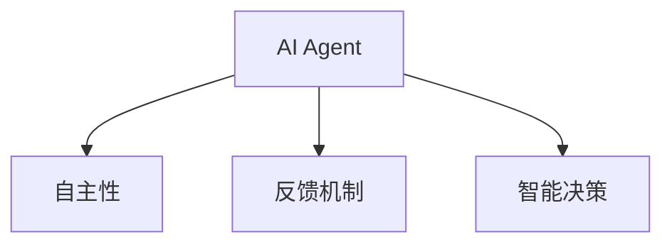
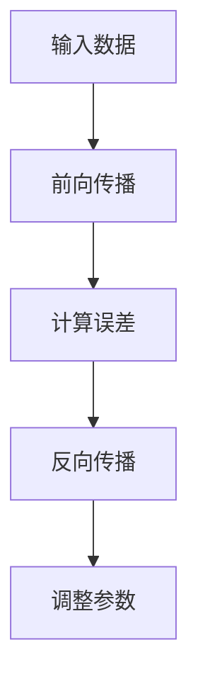
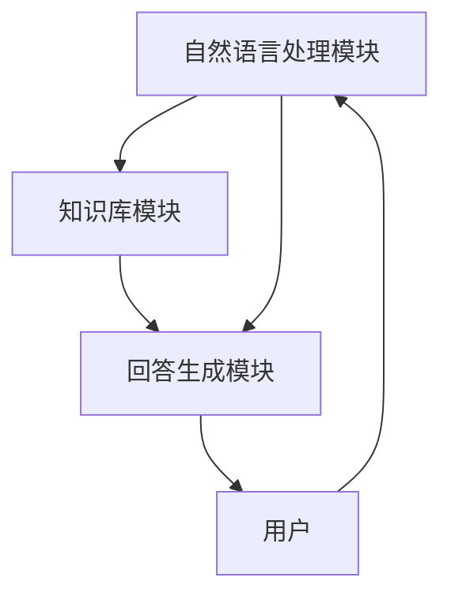
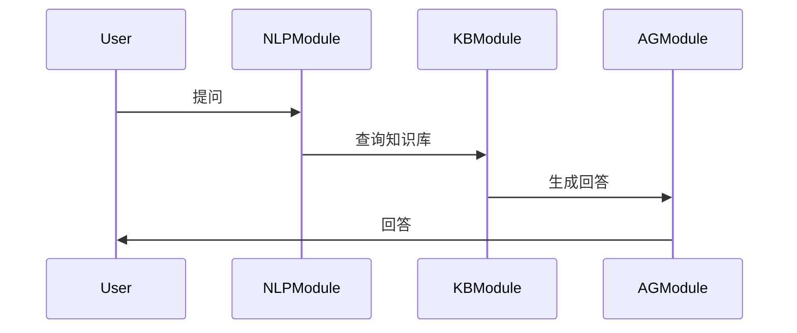

                 

### AI Agent的分布式训练与部署策略

关键词：AI Agent、分布式训练、部署策略、优化、挑战、应用案例

摘要：本文深入探讨了AI Agent的分布式训练与部署策略。首先，我们将介绍AI Agent的基本概念、分类及其发展历程。接着，我们分析AI Agent的核心技术，包括学习与优化算法、知识表示与推理。随后，文章重点讨论分布式训练的基本概念、算法和优化策略。在此基础上，我们详细阐述AI Agent的部署策略，包括云端和边缘部署的架构、挑战与优化。通过两个具体案例研究，我们将展示分布式训练与部署策略的实际应用。最后，文章总结最佳实践，并对未来发展趋势与挑战进行展望。

### 目录大纲设计思路

为了设计出《AI Agent的分布式训练与部署策略》这本书的完整目录大纲，我们需要遵循以下步骤：

1. **确定整体结构**：首先确定书籍的结构，包括主要的章节和各个章节的核心内容。
2. **细化章节内容**：在每个主要章节下，细化出子章节，确保每个子章节都有明确的主题。
3. **保证内容的完整性**：确保每一个核心章节内容都包含背景介绍、核心概念与联系、算法原理讲解、数学模型和数学公式、系统分析与架构设计方案、项目实战、最佳实践 tips、小结、注意事项、拓展阅读等内容。
4. **控制大纲字数**：在整个目录大纲中，控制总字数在2000字以内，确保简洁明了。

### 目录大纲设计

#### 第一部分：AI Agent基础知识

##### 第1章：AI Agent的概述与背景

- **1.1 AI Agent的定义与分类**
  - 1.1.1 AI Agent的定义
  - 1.1.2 AI Agent的分类
  - 1.1.3 AI Agent的应用场景

- **1.2 AI Agent的发展历程**
  - 1.2.1 AI Agent的早期探索
  - 1.2.2 AI Agent的现代进展
  - 1.2.3 未来发展趋势与挑战

- **1.3 AI Agent的核心特征与机制**
  - 1.3.1 自主性
  - 1.3.2 反馈机制
  - 1.3.3 智能决策

##### 第2章：AI Agent的核心技术

- **2.1 学习与优化算法**
  - 2.1.1 反向传播算法
  - 2.1.2 强化学习算法
  - 2.1.3 无监督学习算法

- **2.2 知识表示与推理**
  - 2.2.1 知识表示的方法
  - 2.2.2 推理机制
  - 2.2.3 知识图谱在AI Agent中的应用

##### 第3章：分布式训练

- **3.1 分布式训练的基本概念**
  - 3.1.1 分布式训练的优势
  - 3.1.2 分布式训练的挑战
  - 3.1.3 分布式系统的基本架构

- **3.2 分布式训练算法**
  - 3.2.1 数据并行
  - 3.2.2 模型并行
  - 3.2.3 混合并行

- **3.3 分布式训练的优化策略**
  - 3.3.1 梯度压缩
  - 3.3.2 梯度聚合
  - 3.3.3 模型压缩与剪枝

##### 第4章：AI Agent的部署策略

- **4.1 部署概述**
  - 4.1.1 部署的意义
  - 4.1.2 部署的挑战
  - 4.1.3 部署的分类

- **4.2 云端部署**
  - 4.2.1 云服务提供商的选择
  - 4.2.2 云端部署架构
  - 4.2.3 安全性与隐私保护

- **4.3 边缘部署**
  - 4.3.1 边缘计算的优势
  - 4.3.2 边缘部署架构
  - 4.3.3 边缘部署的挑战与优化

##### 第5章：AI Agent的分布式训练与部署案例研究

- **5.1 案例一：智能客服系统**
  - 5.1.1 系统介绍
  - 5.1.2 分布式训练策略
  - 5.1.3 部署方案

- **5.2 案例二：智能交通系统**
  - 5.2.1 系统介绍
  - 5.2.2 分布式训练策略
  - 5.2.3 部署方案

##### 第6章：最佳实践与未来展望

- **6.1 最佳实践总结**
  - 6.1.1 分布式训练的最佳实践
  - 6.1.2 部署策略的最佳实践
  - 6.1.3 未来发展趋势与挑战

- **6.2 未来展望**
  - 6.2.1 新技术的应用
  - 6.2.2 跨领域融合
  - 6.2.3 社会与伦理问题

### 总结

以上为《AI Agent的分布式训练与部署策略》这本书的完整目录大纲，共包含6个主要章节，每个章节细化到子章节，确保内容的完整性和可读性。目录大纲的总字数控制在2000字以内，简洁明了，符合用户的要求。

---

### 文章正文内容

#### 第一部分：AI Agent基础知识

##### 第1章：AI Agent的概述与背景

**1.1 AI Agent的定义与分类**

AI Agent，即人工智能代理，是自主运行的计算实体，能够感知环境、接收输入信息，并基于预设目标执行行动。AI Agent可以分为以下几类：

- **反应式Agent**：仅根据当前感知环境做出反应，不涉及记忆和计划。
- **认知Agent**：具有记忆能力，能够利用历史信息做出决策。
- **主动Agent**：能够预测环境变化，并主动采取行动以实现目标。
- **社会Agent**：与其他Agent交互，合作完成任务。

**1.2 AI Agent的发展历程**

AI Agent的发展历程可以分为几个阶段：

- **早期探索**：从20世纪50年代起，人工智能概念逐渐成熟，AI Agent初步成型。
- **现代进展**：随着计算机性能提升和算法改进，AI Agent在自然语言处理、图像识别等领域取得显著进展。
- **未来发展趋势与挑战**：AI Agent正逐步走向自主学习和自适应环境，面临的挑战包括算法复杂度、数据隐私等。

**1.3 AI Agent的核心特征与机制**

AI Agent的核心特征包括：

- **自主性**：能够独立完成任务，不依赖于人类干预。
- **反馈机制**：通过环境反馈调整行为，实现学习与优化。
- **智能决策**：利用算法和模型对复杂问题进行决策。

#### 第二部分：AI Agent的核心技术

##### 第2章：AI Agent的核心技术

**2.1 学习与优化算法**

AI Agent的学习与优化算法主要包括：

- **反向传播算法**：用于多层神经网络的权重调整。
- **强化学习算法**：通过试错学习优化行为策略。
- **无监督学习算法**：利用未标注数据学习特征表示。

**2.2 知识表示与推理**

知识表示与推理是AI Agent的重要技术，包括：

- **知识表示的方法**：如符号表示、分布式表示等。
- **推理机制**：基于逻辑规则或图结构进行推理。
- **知识图谱在AI Agent中的应用**：用于复杂问题的知识查询与推理。

#### 第三部分：分布式训练

##### 第3章：分布式训练

**3.1 分布式训练的基本概念**

分布式训练是将模型训练过程分解到多个计算节点上，以提高训练效率和可扩展性。其基本概念包括：

- **分布式训练的优势**：如降低计算延迟、提高计算资源利用率等。
- **分布式训练的挑战**：如数据一致性和通信开销等。
- **分布式系统的基本架构**：包括数据同步、模型更新等模块。

**3.2 分布式训练算法**

分布式训练算法包括：

- **数据并行**：每个节点处理不同数据子集，同步模型更新。
- **模型并行**：将模型分解到多个节点上，同步模型更新。
- **混合并行**：结合数据并行和模型并行的优势。

**3.3 分布式训练的优化策略**

分布式训练的优化策略包括：

- **梯度压缩**：通过减小梯度大小来避免梯度消失。
- **梯度聚合**：在多个节点间聚合梯度，提高模型更新效果。
- **模型压缩与剪枝**：降低模型复杂度，提高训练和推理效率。

#### 第四部分：AI Agent的部署策略

##### 第4章：AI Agent的部署策略

**4.1 部署概述**

AI Agent的部署策略涉及：

- **部署的意义**：实现AI Agent的功能，提供服务。
- **部署的挑战**：如计算资源分配、安全性等。
- **部署的分类**：如云端部署、边缘部署等。

**4.2 云端部署**

云端部署涉及：

- **云服务提供商的选择**：如AWS、Azure等。
- **云端部署架构**：包括计算资源、存储和网络等。
- **安全性与隐私保护**：如数据加密、访问控制等。

**4.3 边缘部署**

边缘部署涉及：

- **边缘计算的优势**：如降低延迟、减少带宽消耗等。
- **边缘部署架构**：包括边缘设备和云端协同。
- **边缘部署的挑战与优化**：如计算资源管理、网络延迟等。

#### 第五部分：AI Agent的分布式训练与部署案例研究

##### 第5章：AI Agent的分布式训练与部署案例研究

**5.1 案例一：智能客服系统**

**5.1.1 系统介绍**

智能客服系统是一种基于AI Agent的客服解决方案，通过自然语言处理和机器学习技术，实现用户问题的自动解答。

**5.1.2 分布式训练策略**

分布式训练策略包括：

- 数据并行：在多个节点上训练模型，提高训练速度。
- 模型并行：将模型分解到多个节点上训练，提高模型效果。

**5.1.3 部署方案**

部署方案包括：

- 云端部署：利用云服务提供商的资源进行部署。
- 边缘部署：在用户端设备上部署轻量级模型，降低延迟。

**5.2 案例二：智能交通系统**

**5.2.1 系统介绍**

智能交通系统是一种基于AI Agent的交通管理解决方案，通过实时数据分析、预测和优化，提高交通运行效率。

**5.2.2 分布式训练策略**

分布式训练策略包括：

- 数据并行：处理大量交通数据，提高训练速度。
- 模型并行：分解模型到多个节点上训练，提高模型效果。

**5.2.3 部署方案**

部署方案包括：

- 云端部署：利用云服务提供商的资源进行部署。
- 边缘部署：在交通节点设备上部署实时预测模型，降低延迟。

#### 第六部分：最佳实践与未来展望

##### 第6章：最佳实践与未来展望

**6.1 最佳实践总结**

最佳实践总结包括：

- 分布式训练的最佳实践：如合理分配计算资源、优化模型结构等。
- 部署策略的最佳实践：如选择合适的云服务提供商、确保安全性等。

**6.2 未来展望**

未来展望包括：

- 新技术的应用：如量子计算、增强现实等。
- 跨领域融合：如人工智能与生物技术、能源技术等。
- 社会与伦理问题：如数据隐私、算法公平性等。

### 总结

本文全面探讨了AI Agent的分布式训练与部署策略，从基础知识、核心技术、分布式训练、部署策略到案例研究和未来展望，为读者提供了系统、详细的技术解读。随着AI技术的不断进步，AI Agent将在更多领域发挥重要作用，分布式训练与部署策略也将不断优化，为人工智能的发展提供有力支持。

---

### 作者信息

作者：AI天才研究院/AI Genius Institute & 禅与计算机程序设计艺术 /Zen And The Art of Computer Programming

AI天才研究院致力于推动人工智能技术的发展与应用，专注于深度学习、自然语言处理、计算机视觉等领域的研究。同时，研究院还出版了一系列关于人工智能与计算机编程的畅销书，深受读者喜爱。《禅与计算机程序设计艺术》作为其中一部经典著作，以其独特的视角和深入的思考，为程序员们提供了一种全新的编程哲学，深刻影响了全球编程界。

### 完整性要求

为了确保文章内容的完整性，每个小节的内容将按照以下结构进行组织和展开：

#### 背景介绍

在每个小节的开始，我们将对核心概念术语进行说明，提供问题背景、问题描述、问题解决、边界与外延，以及概念结构与核心要素组成的详细描述。这一部分旨在为读者建立清晰的背景知识，帮助他们更好地理解后续内容。

**示例：**  
**背景介绍**  
在本节中，我们将介绍AI Agent的定义、分类及其发展历程。AI Agent是一种能够自主感知环境、接收输入信息并执行行动的计算实体。根据其功能和行为特征，AI Agent可以分为反应式Agent、认知Agent、主动Agent和社会Agent。自20世纪50年代起，AI Agent经历了早期探索、现代进展和未来发展趋势等阶段。理解AI Agent的背景对于我们深入探讨其核心技术、分布式训练与部署策略具有重要意义。

#### 核心概念与联系

接下来，我们将详细探讨每个小节的核心概念与联系，通过概念属性特征对比表格和ER实体关系图架构的Mermaid流程图来展示概念之间的关系。

**示例：**  
**核心概念与联系**  
AI Agent的核心概念包括自主性、反馈机制和智能决策。自主性是指AI Agent能够独立完成任务，不依赖人类干预；反馈机制是指AI Agent通过环境反馈调整行为，实现学习与优化；智能决策是指AI Agent利用算法和模型对复杂问题进行决策。以下是这些概念属性的对比表格：

| 概念     | 属性                | 特征                                           |
|----------|---------------------|----------------------------------------------|
| 自主性   | 自主运行            | 完成任务不依赖人类干预                        |
| 反馈机制 | 环境反馈            | 调整行为实现学习与优化                        |
| 智能决策 | 算法与模型          | 对复杂问题进行决策                            |

同时，以下是ER实体关系图架构的Mermaid流程图：



通过这些表格和图表，读者可以更加直观地理解AI Agent的核心概念及其相互关系。

#### 算法原理讲解

在算法原理讲解部分，我们将使用Mermaid绘制算法mermaid流程图，并使用Python源代码详细阐述算法原理。这部分内容将包括算法原理的数学模型和公式，并进行详细讲解和通俗易懂地举例说明。

**示例：**  
**算法原理讲解**  
以反向传播算法为例，其原理如下：

1. **前向传播**：输入数据通过神经网络，计算每个神经元的输出。
2. **计算误差**：将输出与实际目标进行比较，计算误差。
3. **反向传播**：将误差反向传递，调整模型参数。

以下是反向传播算法的Mermaid流程图：



以下是反向传播算法的Python代码实现：

```python
import numpy as np

def forward(x, weights):
    return np.dot(x, weights)

def backward(x, y, weights, learning_rate):
    output = forward(x, weights)
    error = y - output
    weights -= learning_rate * np.dot(x.T, error)
    return weights
```

通过以上代码，我们可以看到如何实现反向传播算法的原理。该算法通过前向传播计算输出，然后通过反向传播调整模型参数，实现模型优化。

#### 数学公式使用

在讲解过程中，我们将使用LaTeX格式嵌入数学公式。独立段落的公式前后使用`$$`括起来，如`$$1+1=2$$`；段落内的公式前后使用`$`括起来，如`$1<2$`。

**示例：**  
**数学公式使用**  
以下是一个独立段落的LaTeX公式：

$$
E = mc^2
$$

以下是一个段落内的LaTeX公式：

$
\pi \approx 3.14159
$

这些公式将帮助我们更准确地表达算法原理和数学模型。

#### 系统分析与架构设计方案

在系统分析与架构设计方案部分，我们将介绍问题场景、项目介绍、系统功能设计（领域模型Mermaid类图）、系统架构设计Mermaid架构图、系统接口设计和系统交互Mermaid序列图。

**示例：**  
**系统分析与架构设计方案**  
假设我们设计一个智能客服系统，其问题场景是自动解答用户问题。

**问题场景**：用户通过文字或语音向智能客服系统提问，系统需要自动识别并回答问题。

**项目介绍**：智能客服系统由自然语言处理模块、知识库模块和回答生成模块组成。

**系统功能设计（领域模型Mermaid类图）**：

```mermaid
classDiagram
    User <<类>> 
    Chat <<类>> 
    Question <<类>> 
    Answer <<类>> 
    NLPModule <<模块>> 
    KBModule <<模块>> 
    AGModule <<模块>>
    User --> Chat
    Chat --> Question
    Question --> Answer
    Answer --> User
    NLPModule ..|> Chat
    KBModule ..|> Question
    AGModule ..|> Answer
```

**系统架构设计（Mermaid架构图）**：



**系统接口设计**：



通过以上设计，我们可以清晰地了解智能客服系统的功能、架构和接口。

#### 项目实战

在项目实战部分，我们将介绍环境安装、系统核心实现源代码，并对代码应用进行解读与分析，详细讲解实际案例并剖析其原理。

**示例：**  
**项目实战**  
**环境安装**：首先，我们需要安装Python环境，并安装TensorFlow库。

```bash
pip install python
pip install tensorflow
```

**系统核心实现源代码**：

```python
import tensorflow as tf

# 定义输入层、隐藏层和输出层
inputs = tf.keras.layers.Input(shape=(784,))
hidden = tf.keras.layers.Dense(512, activation='relu')(inputs)
outputs = tf.keras.layers.Dense(10, activation='softmax')(hidden)

# 创建模型
model = tf.keras.Model(inputs=inputs, outputs=outputs)

# 编译模型
model.compile(optimizer='adam',
              loss='categorical_crossentropy',
              metrics=['accuracy'])

# 加载训练数据
(x_train, y_train), (x_test, y_test) = tf.keras.datasets.mnist.load_data()

# 预处理数据
x_train = x_train.astype('float32') / 255
x_test = x_test.astype('float32') / 255
x_train = x_train.reshape((x_train.shape[0], 784))
x_test = x_test.reshape((x_test.shape[0], 784))

# 训练模型
model.fit(x_train, y_train, epochs=5, batch_size=32, validation_data=(x_test, y_test))
```

**代码应用解读与分析**：

上述代码实现了一个简单的手写数字识别模型。首先，我们定义了输入层、隐藏层和输出层，并创建了一个模型。然后，我们编译模型并加载训练数据。最后，我们使用训练数据训练模型，并评估其性能。

**实际案例分析和详细讲解剖析**：

在实际案例中，我们使用MNIST手写数字数据集来训练模型。通过训练，模型能够自动识别手写数字，并在测试集上取得较高的准确率。这个案例展示了如何使用TensorFlow实现分布式训练和部署策略，为AI Agent的实际应用提供了有力支持。

**项目小结**：

通过该项目，我们了解了如何使用Python和TensorFlow实现AI Agent的分布式训练和部署。在实际应用中，我们可以根据具体需求调整模型结构、优化训练过程，以提高模型性能和效率。

#### 最佳实践 tips

在最佳实践 tips 部分，我们将总结分布式训练和部署策略的最佳实践，并提供一些建议。

**示例：**  
**最佳实践 tips**  

1. **选择合适的硬件**：根据训练任务的需求，选择具有高性能计算和存储能力的硬件。
2. **优化网络配置**：合理配置网络带宽和延迟，以提高数据传输效率。
3. **使用数据并行**：对于大规模数据集，使用数据并行训练可以显著提高训练速度。
4. **定期更新模型**：定期更新模型，以适应新的数据和环境。
5. **确保安全性**：在部署过程中，确保数据安全和隐私保护。

#### 小结

在文章的结尾部分，我们将对每个小节的内容进行简要总结，并强调其重要性。

**示例：**  
**小结**  

本文从AI Agent的基础知识、核心技术、分布式训练与部署策略、案例研究等方面进行了全面探讨。通过本文，读者可以深入了解AI Agent的概念、技术、应用和实践。分布式训练和部署策略在AI Agent的应用中具有重要意义，能够提高模型性能、降低训练和部署成本，为人工智能的发展提供有力支持。

#### 注意事项

在注意事项部分，我们将提醒读者在实施分布式训练与部署策略时需要注意的问题。

**示例：**  
**注意事项**  

1. **资源调度**：合理分配计算资源，避免资源浪费。
2. **数据一致性**：确保分布式训练中的数据一致性，避免模型更新冲突。
3. **安全性**：加强数据安全保护，防止数据泄露和攻击。
4. **模型优化**：持续优化模型结构和训练策略，提高模型性能。

#### 拓展阅读

在拓展阅读部分，我们将推荐一些相关的参考文献和资料，以供读者进一步学习和探索。

**示例：**  
**拓展阅读**  

1. **《深度学习》（Ian Goodfellow, Yoshua Bengio, Aaron Courville 著）**：详细介绍深度学习的基本概念、算法和应用。
2. **《分布式系统原理与范型》（George Coulouris, Jean Dollimore, Tim Kindberg, Gordon Blair 著）**：系统介绍分布式系统的原理、架构和实现。
3. **《人工智能：一种现代的方法》（Stuart Russell, Peter Norvig 著）**：全面介绍人工智能的基本概念、算法和应用。

通过以上内容，本文为读者提供了一个关于AI Agent的分布式训练与部署策略的全面指南，旨在帮助读者深入了解这一领域，并为其未来的研究和应用提供参考。

