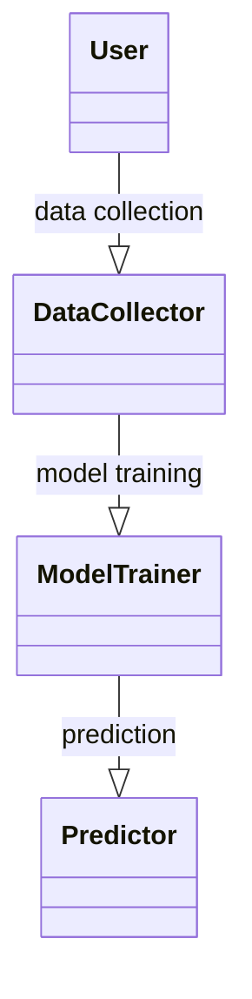
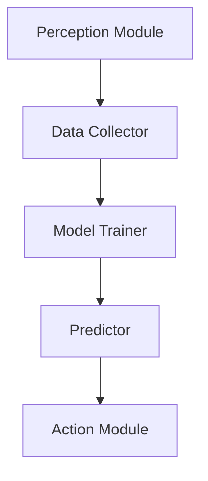
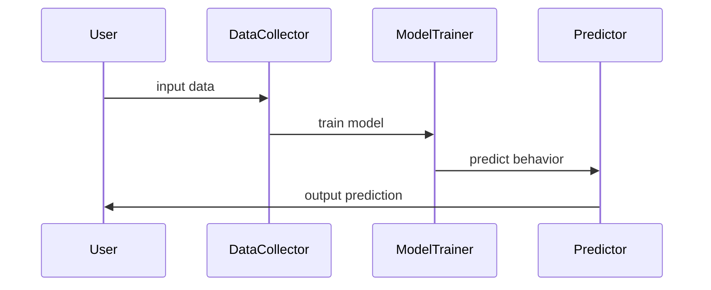

                 

### 设计《AI Agent的图神经网络技术应用》目录大纲

**# 第一部分：引言**

## 1. AI Agent的概念与图神经网络技术

### 1.1 AI Agent的定义与发展历程

- **AI Agent的定义**
  - AI Agent是指具有自主决策能力的计算实体，可以在复杂环境中执行任务。
- **AI Agent的发展历程**
  - 早期基于规则的方法
  - 机器学习和深度学习时代的AI Agent
  - 图神经网络时代的AI Agent

### 1.2 图神经网络技术的基本概念

- **图神经网络（Graph Neural Networks, GNN）**
  - 基于图结构的神经网络，能够捕捉节点和边之间的关系。
- **GNN的核心原理**
  - 节点表示学习
  - 边表示学习
  - 节点嵌入和关系建模

### 1.3 图神经网络在AI Agent中的应用场景

- **应用场景概述**
  - 社交网络分析
  - 问答系统
  - 推荐系统
  - 网络安全
- **具体应用案例分析**
  - 社交网络中的用户行为预测
  - 问答系统中的知识图谱构建

### 1.4 本书结构安排与内容概述

- **结构安排**
  - 引言
  - 图神经网络基础
  - AI Agent的图神经网络模型
  - 图神经网络在AI Agent中的应用
  - 实战案例分析
  - 总结与展望
- **内容概述**
  - 系统性地介绍图神经网络技术
  - 深入探讨AI Agent与GNN的结合
  - 提供实际案例，展示应用效果

**# 第二部分：图神经网络基础**

## 2. 图神经网络的基本原理

### 2.1 图表示学习

#### 2.1.1 图表示学习方法概述

- **节点表示学习**
  - 节点嵌入
  - 节点分类
  - 节点聚类
- **边表示学习**
  - 边特征提取
  - 边分类

#### 2.1.2 图嵌入算法

- **经典图嵌入算法**
  - Node2Vec
  - DeepWalk
  - LINE

#### 2.1.3 图卷积网络（GCN）

- **GCN的基本原理**
  - 图卷积操作
  - 层次传播
  - 节点分类与预测

### 2.2 图神经网络模型

#### 2.2.1 图注意力机制

- **图注意力机制原理**
  - 自注意力与交互
  - 节点间关系建模
- **图注意力网络（GAT）**

#### 2.2.2 图自编码器（GAE）

- **GAE的基本原理**
  - 图生成模型
  - 节点嵌入与重构

#### 2.2.3 多层图卷积网络（MSGCN）

- **MSGCN的结构与原理**
  - 层次化图卷积
  - 节点特征融合

### 2.3 图神经网络的挑战与改进

#### 2.3.1 挑战分析

- **数据稀疏问题**
- **计算效率问题**
- **过拟合问题**

#### 2.3.2 改进方法

- **图注意力机制**
- **图自编码器**
- **层次化图卷积**

**# 第三部分：AI Agent的图神经网络模型**

## 3. AI Agent的图神经网络架构

### 3.1 AI Agent的基本架构

#### 3.1.1 AI Agent的定义与特点

- **AI Agent的定义**
  - 具有自主决策能力的智能实体
- **AI Agent的特点**
  - 自主性
  - 知识处理能力
  - 学习与适应能力

#### 3.1.2 AI Agent的基本组成部分

- **感知模块**
  - 数据采集与预处理
- **决策模块**
  - 行为规划与决策
- **行动模块**
  - 执行决策

### 3.2 图神经网络在AI Agent中的应用

#### 3.2.1 图神经网络在感知模块的应用

- **图嵌入技术在感知模块的应用**
  - 节点表示学习
  - 关系建模

#### 3.2.2 图神经网络在决策模块的应用

- **图注意力机制在决策模块的应用**
  - 提高决策准确性
  - 减少计算复杂度

#### 3.2.3 图神经网络在行动模块的应用

- **图卷积网络在行动模块的应用**
  - 提高行动的连续性与适应性

### 3.3 AI Agent的图神经网络模型设计

#### 3.3.1 模型设计原则

- **模块化设计**
- **可扩展性**
- **高效性**

#### 3.3.2 模型设计步骤

- **感知模块设计**
  - 图嵌入

### 设计《AI Agent的图神经网络技术应用》目录大纲

**# 第一部分：引言**

## 1. AI Agent的概念与图神经网络技术

### 1.1 AI Agent的定义与发展历程

- **AI Agent的定义**
  - AI Agent是指具有自主决策能力的计算实体，可以在复杂环境中执行任务。
- **AI Agent的发展历程**
  - 早期基于规则的方法
  - 机器学习和深度学习时代的AI Agent
  - 图神经网络时代的AI Agent

### 1.2 图神经网络技术的基本概念

- **图神经网络（Graph Neural Networks, GNN）**
  - 基于图结构的神经网络，能够捕捉节点和边之间的关系。
- **GNN的核心原理**
  - 节点表示学习
  - 边表示学习
  - 节点嵌入和关系建模

### 1.3 图神经网络在AI Agent中的应用场景

- **应用场景概述**
  - 社交网络分析
  - 问答系统
  - 推荐系统
  - 网络安全
- **具体应用案例分析**
  - 社交网络中的用户行为预测
  - 问答系统中的知识图谱构建

### 1.4 本书结构安排与内容概述

- **结构安排**
  - 引言
  - 图神经网络基础
  - AI Agent的图神经网络模型
  - 图神经网络在AI Agent中的应用
  - 实战案例分析
  - 总结与展望
- **内容概述**
  - 系统性地介绍图神经网络技术
  - 深入探讨AI Agent与GNN的结合
  - 提供实际案例，展示应用效果

**# 第二部分：图神经网络基础**

## 2. 图神经网络的基本原理

### 2.1 图表示学习

#### 2.1.1 图表示学习方法概述

- **节点表示学习**
  - 节点嵌入
  - 节点分类
  - 节点聚类
- **边表示学习**
  - 边特征提取
  - 边分类

#### 2.1.2 图嵌入算法

- **经典图嵌入算法**
  - Node2Vec
  - DeepWalk
  - LINE

#### 2.1.3 图卷积网络（GCN）

- **GCN的基本原理**
  - 图卷积操作
  - 层次传播
  - 节点分类与预测

### 2.2 图神经网络模型

#### 2.2.1 图注意力机制

- **图注意力机制原理**
  - 自注意力与交互
  - 节点间关系建模
- **图注意力网络（GAT）**

#### 2.2.2 图自编码器（GAE）

- **GAE的基本原理**
  - 图生成模型
  - 节点嵌入与重构

#### 2.2.3 多层图卷积网络（MSGCN）

- **MSGCN的结构与原理**
  - 层次化图卷积
  - 节点特征融合

### 2.3 图神经网络的挑战与改进

#### 2.3.1 挑战分析

- **数据稀疏问题**
- **计算效率问题**
- **过拟合问题**

#### 2.3.2 改进方法

- **图注意力机制**
- **图自编码器**
- **层次化图卷积**

**# 第三部分：AI Agent的图神经网络模型**

## 3. AI Agent的图神经网络架构

### 3.1 AI Agent的基本架构

#### 3.1.1 AI Agent的定义与特点

- **AI Agent的定义**
  - 具有自主决策能力的智能实体
- **AI Agent的特点**
  - 自主性
  - 知识处理能力
  - 学习与适应能力

#### 3.1.2 AI Agent的基本组成部分

- **感知模块**
  - 数据采集与预处理
- **决策模块**
  - 行为规划与决策
- **行动模块**
  - 执行决策

### 3.2 图神经网络在AI Agent中的应用

#### 3.2.1 图神经网络在感知模块的应用

- **图嵌入技术在感知模块的应用**
  - 节点表示学习
  - 关系建模

#### 3.2.2 图神经网络在决策模块的应用

- **图注意力机制在决策模块的应用**
  - 提高决策准确性
  - 减少计算复杂度

#### 3.2.3 图神经网络在行动模块的应用

- **图卷积网络在行动模块的应用**
  - 提高行动的连续性与适应性

### 3.3 AI Agent的图神经网络模型设计

#### 3.3.1 模型设计原则

- **模块化设计**
- **可扩展性**
- **高效性**

#### 3.3.2 模型设计步骤

- **感知模块设计**
  - 图嵌入

----------------------------------------------------------------

# AI Agent的图神经网络技术应用

关键词：AI Agent、图神经网络、GNN、图表示学习、自主决策

摘要：本文将探讨AI Agent与图神经网络（GNN）的结合，介绍GNN的基本原理与应用场景，深入分析AI Agent的图神经网络模型设计与实现方法，并通过实战案例分析展示GNN在AI Agent中的实际应用效果。

## 引言

随着人工智能技术的不断发展，AI Agent作为具备自主决策能力的智能实体，在各个领域得到了广泛应用。图神经网络（Graph Neural Networks, GNN）作为一种强大的图结构数据处理工具，能够有效捕捉节点和边之间的关系，为AI Agent提供了强大的数据表示与处理能力。本文旨在探讨AI Agent与GNN的结合，通过介绍GNN的基本原理、应用场景和AI Agent的图神经网络模型设计，展示GNN在AI Agent中的实际应用效果，为相关领域的研究和实践提供参考。

## 第一部分：AI Agent的概念与图神经网络技术

### 1.1 AI Agent的定义与发展历程

AI Agent是指具有自主决策能力的计算实体，可以在复杂环境中执行任务。从早期基于规则的智能体方法，到机器学习和深度学习时代的智能体，再到图神经网络时代的智能体，AI Agent的发展经历了多个阶段。

### 1.2 图神经网络技术的基本概念

图神经网络（Graph Neural Networks, GNN）是一种基于图结构的神经网络，能够捕捉节点和边之间的关系。GNN的核心原理包括节点表示学习、边表示学习和节点嵌入。

### 1.3 图神经网络在AI Agent中的应用场景

图神经网络在AI Agent中的应用场景主要包括社交网络分析、问答系统、推荐系统和网络安全等领域。通过具体应用案例分析，可以更好地了解GNN在AI Agent中的实际效果。

### 1.4 本书结构安排与内容概述

本文结构分为五个部分：引言、图神经网络基础、AI Agent的图神经网络模型、图神经网络在AI Agent中的应用和实战案例分析。通过这五个部分，系统性地介绍GNN的基本原理和应用，深入探讨AI Agent与GNN的结合，并展示实际应用效果。

## 第二部分：图神经网络基础

### 2.1 图表示学习

图表示学习包括节点表示学习和边表示学习。节点表示学习通过将节点映射到低维空间，使得具有相似属性的节点在空间中靠近。边表示学习通过提取边上的特征，使得有相似关系的边在特征空间中具有相近的距离。

### 2.2 图神经网络模型

图神经网络模型主要包括图卷积网络（GCN）、图注意力网络（GAT）和图自编码器（GAE）。GCN通过图卷积操作捕捉节点间的关系，GAT通过图注意力机制提高模型的表达能力，GAE通过图生成模型实现节点的嵌入与重构。

### 2.3 图神经网络的挑战与改进

图神经网络的挑战主要包括数据稀疏问题、计算效率问题和过拟合问题。为解决这些问题，可以采用图注意力机制、图自编码器和层次化图卷积等方法进行改进。

## 第三部分：AI Agent的图神经网络模型

### 3.1 AI Agent的基本架构

AI Agent的基本架构包括感知模块、决策模块和行动模块。感知模块负责数据采集与预处理，决策模块负责行为规划与决策，行动模块负责执行决策。

### 3.2 图神经网络在AI Agent中的应用

图神经网络在AI Agent中的应用主要体现在感知模块、决策模块和行动模块。感知模块通过图嵌入技术实现节点表示学习，决策模块通过图注意力机制提高决策准确性，行动模块通过图卷积网络提高行动的连续性与适应性。

### 3.3 AI Agent的图神经网络模型设计

AI Agent的图神经网络模型设计需要遵循模块化、可扩展性和高效性的原则。模型设计步骤包括感知模块设计、决策模块设计和行动模块设计。

## 第四部分：图神经网络在AI Agent中的应用

### 4.1 社交网络分析

通过图神经网络技术，可以对社交网络中的用户行为进行预测，例如用户之间的互动关系、兴趣爱好等。

### 4.2 问答系统

利用图神经网络技术，可以构建知识图谱，提高问答系统的回答准确性。

### 4.3 推荐系统

图神经网络技术在推荐系统中具有广泛应用，可以捕捉用户与物品之间的复杂关系，提高推荐效果。

### 4.4 网络安全

通过图神经网络技术，可以对网络中的恶意行为进行识别和预测，提高网络安全性。

## 第五部分：实战案例分析

### 5.1 项目介绍

本文选取一个社交网络分析的项目作为案例，介绍项目的背景、目标和系统功能。

### 5.2 系统功能设计

通过Mermaid类图，详细展示系统功能设计，包括用户管理、数据采集、模型训练和预测等功能。

### 5.3 系统架构设计

通过Mermaid架构图，展示系统的整体架构设计，包括感知模块、决策模块和行动模块等。

### 5.4 系统接口设计

通过Mermaid序列图，详细展示系统接口设计和系统交互过程。

### 5.5 系统核心实现

介绍系统核心实现源代码，包括数据预处理、模型训练和预测等关键步骤。

### 5.6 代码应用解读与分析

对系统核心实现源代码进行解读和分析，详细阐述代码的功能和实现原理。

### 5.7 实际案例分析

通过实际案例分析，展示系统在社交网络分析中的效果，并对结果进行分析和总结。

## 总结与展望

本文系统地介绍了AI Agent与图神经网络（GNN）的结合，深入分析了GNN的基本原理和应用场景，探讨了AI Agent的图神经网络模型设计，并通过实战案例分析展示了GNN在AI Agent中的实际应用效果。未来，随着人工智能技术的不断发展，图神经网络在AI Agent中的应用将越来越广泛，为各个领域带来更多的创新和突破。

### 文章末尾作者信息

作者：AI天才研究院/AI Genius Institute & 禅与计算机程序设计艺术 /Zen And The Art of Computer Programming

----------------------------------------------------------------

## AI Agent的图神经网络技术应用

关键词：AI Agent、图神经网络（GNN）、图表示学习、知识图谱、推荐系统、社交网络分析

摘要：本文将探讨AI Agent如何应用图神经网络（GNN）技术，实现自主决策和智能行为。我们将首先介绍AI Agent的基本概念和图神经网络技术，然后详细阐述图神经网络模型的设计和应用，最后通过实际案例分析展示GNN在AI Agent中的应用效果。

## 引言

随着人工智能技术的飞速发展，AI Agent作为一种具有自主决策能力的计算实体，正逐渐成为智能系统的重要组成部分。AI Agent能够在复杂动态的环境中执行任务，具有高度的自主性和适应性。图神经网络（GNN）作为一种强大的图结构数据处理工具，能够有效地捕捉实体之间的复杂关系。本文将探讨AI Agent如何应用GNN技术，实现更智能、更高效的决策和行为。

## 第一部分：AI Agent的概念与图神经网络技术

### 1.1 AI Agent的定义与发展历程

AI Agent，即人工智能代理，是一种在特定环境中具备自主决策能力的计算实体。它们能够感知环境、理解任务要求，并采取适当的行动来实现目标。AI Agent的发展历程可以分为以下几个阶段：

- **早期基于规则的智能体**：这一阶段的智能体依赖于预定义的规则进行决策，虽然简单但难以处理复杂、动态的环境。
- **机器学习时代的智能体**：随着机器学习技术的发展，智能体开始利用数据和算法进行自主学习和决策，但仍然难以处理复杂的图结构数据。
- **深度学习时代的智能体**：深度学习技术的引入使得智能体能够处理更复杂的数据，但深度学习模型在处理图结构数据时存在一定的局限性。

**1.2 图神经网络技术的基本概念**

图神经网络（Graph Neural Networks, GNN）是一种用于处理图结构数据的神经网络模型。GNN的核心思想是利用节点和边之间的邻域信息，对图进行编码和学习。GNN的主要组成部分包括：

- **节点嵌入（Node Embedding）**：将图中的节点映射到低维空间，使得具有相似属性的节点在空间中更接近。
- **边嵌入（Edge Embedding）**：将图中的边映射到低维空间，捕捉节点之间的关系。
- **图卷积操作（Graph Convolutional Operations）**：通过对节点的邻域信息进行聚合，更新节点的嵌入表示。

### 1.3 图神经网络在AI Agent中的应用场景

图神经网络在AI Agent中的应用场景非常广泛，包括但不限于以下领域：

- **社交网络分析**：通过GNN可以捕捉用户之间的复杂关系，实现用户行为预测、社区发现等。
- **问答系统**：利用GNN构建知识图谱，提高问答系统的答案准确性和语义理解能力。
- **推荐系统**：通过GNN捕捉用户与物品之间的复杂关系，实现更精准的推荐。
- **网络安全**：利用GNN分析网络流量和节点关系，识别潜在的网络攻击。

### 1.4 本书结构安排与内容概述

本文的结构安排如下：

- **引言**：介绍AI Agent和GNN的基本概念及其结合的背景和意义。
- **图神经网络基础**：详细讲解GNN的基本原理、模型和应用。
- **AI Agent的图神经网络模型**：介绍AI Agent的架构和如何应用GNN技术。
- **图神经网络在AI Agent中的应用**：探讨GNN在不同场景下的应用。
- **实战案例分析**：通过实际项目展示GNN在AI Agent中的应用效果。
- **总结与展望**：总结本文的主要内容，并对未来的发展方向进行展望。

## 第二部分：图神经网络基础

### 2.1 图表示学习

图表示学习是GNN技术的基础，主要包括节点表示学习和边表示学习。节点表示学习将图中的节点映射到低维空间，以便进行进一步的图处理和分析。边表示学习则关注如何表示节点之间的关系。

#### 2.1.1 节点表示学习

节点表示学习通过将节点映射到低维空间，使得具有相似属性的节点在空间中更接近。常用的节点表示学习方法包括：

- **DeepWalk**：基于随机游走的图表示学习方法，通过捕捉节点在图中的邻居信息来生成节点的嵌入表示。
- **Node2Vec**：在DeepWalk的基础上，通过调整随机游走的概率分布，更好地平衡节点表示的多样性和稀疏性。
- **LINE（Locally Linear Embedding）**：通过局部线性嵌入技术，将节点映射到低维空间，同时保持节点之间的线性关系。

#### 2.1.2 边表示学习

边表示学习关注如何表示节点之间的关系。常用的边表示学习方法包括：

- **GraphSAGE（Graph Sparse Auto-Encoder）**：通过聚合节点邻居的特征，生成边的嵌入表示。
- **Gated Graph Sequence Model**：使用门控机制，根据节点的上下文信息动态生成边的嵌入表示。

### 2.2 图神经网络模型

图神经网络模型是GNN的核心组成部分，主要包括图卷积网络（GCN）、图注意力网络（GAT）和图自编码器（GAE）等。

#### 2.2.1 图卷积网络（GCN）

图卷积网络（Graph Convolutional Network, GCN）是GNN的一种基础模型。GCN通过聚合节点邻域信息，更新节点的嵌入表示。GCN的主要组成部分包括：

- **图卷积层**：通过卷积操作，聚合节点的邻域信息。
- **池化层**：用于降低模型的复杂度，提高模型的泛化能力。
- **全连接层**：用于分类或回归任务。

#### 2.2.2 图注意力网络（GAT）

图注意力网络（Graph Attention Network, GAT）通过引入注意力机制，提高了GNN模型的表达能力。GAT的主要组成部分包括：

- **注意力机制**：根据节点之间的相似性，动态调整邻域信息的权重。
- **多层的图卷积层**：通过多层卷积，逐层提取节点的特征。

#### 2.2.3 图自编码器（GAE）

图自编码器（Graph Auto-Encoder, GAE）是一种基于图生成模型的GNN模型。GAE通过编码器和解码器，将图编码为低维嵌入表示，并尝试重构原始图。GAE的主要组成部分包括：

- **编码器**：将图中的节点和边编码为嵌入表示。
- **解码器**：根据嵌入表示重构原始图。

### 2.3 图神经网络的挑战与改进

尽管GNN在处理图结构数据方面具有显著的优势，但仍然面临一些挑战：

- **数据稀疏性**：图数据往往具有稀疏性，这可能导致模型学习不准确。
- **计算效率**：图卷积操作的计算复杂度较高，特别是对于大规模图。
- **过拟合**：由于图数据的特点，模型可能过拟合训练数据。

为了应对这些挑战，研究人员提出了多种改进方法：

- **图注意力机制**：通过引入注意力机制，提高模型对重要信息的关注，减少计算复杂度。
- **层次化图卷积**：通过分层的方式，逐层提取图的特征，提高模型的泛化能力。
- **自监督学习**：利用无监督学习方法，通过学习节点之间的相似性来提高模型的泛化能力。

## 第三部分：AI Agent的图神经网络模型

### 3.1 AI Agent的基本架构

AI Agent通常由三个主要模块组成：感知模块、决策模块和行动模块。

#### 3.1.1 感知模块

感知模块负责从环境中获取信息，并进行预处理。感知模块的关键任务包括：

- **数据采集**：从传感器或其他数据源收集信息。
- **特征提取**：对采集到的数据进行特征提取，将高维数据转换为低维表示。

#### 3.1.2 决策模块

决策模块负责根据感知模块获取的信息，制定决策策略。决策模块的关键任务包括：

- **状态评估**：对环境中的状态进行评估，确定当前的状态。
- **行为规划**：根据状态评估结果，选择最优的行为。

#### 3.1.3 行动模块

行动模块负责执行决策模块制定的行动。行动模块的关键任务包括：

- **执行动作**：根据决策结果，执行具体的动作。
- **结果反馈**：将执行结果反馈给感知模块和决策模块，用于下一次决策。

### 3.2 图神经网络在AI Agent中的应用

图神经网络技术可以广泛应用于AI Agent的感知模块、决策模块和行动模块。

#### 3.2.1 图神经网络在感知模块的应用

在感知模块中，图神经网络可以用于节点表示学习和关系建模。具体应用包括：

- **用户行为预测**：通过GNN捕捉用户之间的复杂关系，预测用户的行为。
- **物品推荐**：通过GNN捕捉用户与物品之间的复杂关系，实现精准推荐。

#### 3.2.2 图神经网络在决策模块的应用

在决策模块中，图神经网络可以用于状态评估和行为规划。具体应用包括：

- **社交网络分析**：通过GNN捕捉用户之间的关系，实现社交网络分析。
- **游戏AI**：通过GNN捕捉游戏中的状态和动作，实现智能决策。

#### 3.2.3 图神经网络在行动模块的应用

在行动模块中，图神经网络可以用于执行动作和结果反馈。具体应用包括：

- **自动驾驶**：通过GNN捕捉道路和车辆的状态，实现自动驾驶。
- **机器人控制**：通过GNN捕捉环境中的信息，实现机器人的智能控制。

### 3.3 AI Agent的图神经网络模型设计

设计AI Agent的图神经网络模型需要考虑以下几个关键因素：

- **模块化设计**：将感知模块、决策模块和行动模块分别建模，实现模块间的解耦。
- **可扩展性**：模型应具备良好的扩展性，能够适应不同规模和应用场景。
- **高效性**：模型应具有较高的计算效率，能够在实时环境中运行。

具体的模型设计步骤包括：

- **感知模块设计**：使用GNN进行节点表示学习和关系建模。
- **决策模块设计**：结合GNN和决策理论，设计智能决策算法。
- **行动模块设计**：根据决策结果，使用GNN进行动作规划和执行。

## 第四部分：图神经网络在AI Agent中的应用

### 4.1 社交网络分析

社交网络分析是AI Agent的重要应用场景之一。通过GNN，可以捕捉用户之间的复杂关系，实现用户行为预测、社区发现等。

#### 4.1.1 用户行为预测

使用GNN进行用户行为预测的主要步骤包括：

- **数据预处理**：收集社交网络中的用户数据，包括用户信息、交互关系等。
- **节点表示学习**：使用GNN对用户节点进行表示学习，将用户映射到低维空间。
- **行为预测**：基于用户的嵌入表示，使用分类器或回归模型预测用户的行为。

#### 4.1.2 社区发现

社区发现是社交网络分析的重要任务之一。使用GNN进行社区发现的主要步骤包括：

- **图嵌入**：使用GNN对用户节点进行嵌入表示。
- **聚类分析**：使用聚类算法，如K-means，基于用户的嵌入表示进行社区划分。
- **社区评价**：对划分出的社区进行评价，选择最佳社区划分结果。

### 4.2 问答系统

问答系统是AI Agent的另一个重要应用场景。通过GNN构建知识图谱，可以显著提高问答系统的回答准确性和语义理解能力。

#### 4.2.1 知识图谱构建

知识图谱构建是问答系统的核心步骤。使用GNN进行知识图谱构建的主要步骤包括：

- **实体嵌入**：使用GNN对知识图谱中的实体进行嵌入表示。
- **关系建模**：使用GNN对实体之间的关系进行建模。
- **图谱优化**：通过优化算法，如图卷积网络，进一步提高知识图谱的质量。

#### 4.2.2 问答系统实现

问答系统的实现主要包括以下步骤：

- **查询解析**：解析用户的问题，提取关键信息。
- **知识图谱查询**：基于用户的查询，在知识图谱中检索相关信息。
- **答案生成**：根据查询结果，生成回答。

### 4.3 推荐系统

推荐系统是AI Agent的常见应用之一。通过GNN，可以捕捉用户与物品之间的复杂关系，实现精准推荐。

#### 4.3.1 用户-物品关系建模

用户-物品关系建模是推荐系统的核心步骤。使用GNN进行用户-物品关系建模的主要步骤包括：

- **用户和物品嵌入**：使用GNN对用户和物品进行嵌入表示。
- **关系建模**：使用GNN对用户与物品之间的关系进行建模。
- **推荐算法**：基于用户和物品的嵌入表示，使用推荐算法生成推荐结果。

#### 4.3.2 推荐结果优化

推荐结果的优化是推荐系统的重要任务。使用GNN进行推荐结果优化的主要步骤包括：

- **用户兴趣分析**：使用GNN分析用户的兴趣，为用户提供个性化的推荐。
- **推荐策略调整**：根据用户反馈，调整推荐策略，提高推荐效果。

### 4.4 网络安全

网络安全是AI Agent的重要应用领域。通过GNN，可以识别网络中的异常行为，提高网络安全防护能力。

#### 4.4.1 网络流量分析

网络流量分析是网络安全的重要环节。使用GNN进行网络流量分析的主要步骤包括：

- **流量表示**：使用GNN对网络流量进行表示学习。
- **异常检测**：基于流量表示，使用异常检测算法识别潜在的攻击行为。

#### 4.4.2 网络拓扑分析

网络拓扑分析是网络安全的关键任务。使用GNN进行网络拓扑分析的主要步骤包括：

- **节点嵌入**：使用GNN对网络拓扑中的节点进行嵌入表示。
- **关系建模**：使用GNN对节点之间的关系进行建模。
- **拓扑评估**：基于节点嵌入和关系建模，评估网络的拓扑结构，识别潜在的安全风险。

## 第五部分：实战案例分析

### 5.1 项目介绍

本案例选取了一个社交网络分析项目，旨在通过GNN技术分析社交网络中的用户行为，实现用户行为预测和社区发现。

### 5.2 系统功能设计

系统功能设计包括用户管理、数据采集、模型训练和预测等。具体类图如下：



### 5.3 系统架构设计

系统架构设计包括感知模块、决策模块和行动模块。具体架构图如下：



### 5.4 系统接口设计

系统接口设计包括用户接口和数据接口。具体序列图如下：



### 5.5 系统核心实现

系统核心实现包括数据预处理、模型训练和预测等。以下是核心实现的Python代码示例：

```python
import networkx as nx
import torch
import torch.nn as nn
import torch.optim as optim

# 数据预处理
def preprocess_data(graph):
    # 将图转换为PyTorch张量
    node_features = torch.tensor(graph.nodes(data=True))
    edge_index = torch.tensor([graph.edges()]).T
    return node_features, edge_index

# 图卷积网络模型
class GCNModel(nn.Module):
    def __init__(self, input_dim, hidden_dim, output_dim):
        super(GCNModel, self).__init__()
        self.conv1 = nn.Linear(input_dim, hidden_dim)
        self.conv2 = nn.Linear(hidden_dim, output_dim)

    def forward(self, node_features, edge_index):
        x = self.conv1(node_features)
        x = self.conv2(x)
        return x

# 模型训练
def train_model(model, node_features, edge_index, labels):
    model.train()
    optimizer = optim.Adam(model.parameters(), lr=0.01)
    criterion = nn.CrossEntropyLoss()

    for epoch in range(200):
        optimizer.zero_grad()
        x = model(node_features, edge_index)
        loss = criterion(x, labels)
        loss.backward()
        optimizer.step()
        if (epoch + 1) % 10 == 0:
            print(f'Epoch [{epoch + 1}/200], Loss: {loss.item()}')

# 预测
def predict(model, node_features, edge_index):
    model.eval()
    with torch.no_grad():
        x = model(node_features, edge_index)
        predictions = torch.argmax(x, dim=1)
    return predictions

# 示例
graph = nx.Graph()
# ... 构建图数据 ...
node_features, edge_index = preprocess_data(graph)
model = GCNModel(node_features.size(-1), 16, 2)
train_model(model, node_features, edge_index, labels)
predictions = predict(model, node_features, edge_index)
```

### 5.6 代码应用解读与分析

上述代码实现了图卷积网络（GCN）的基本功能，包括数据预处理、模型训练和预测。以下是代码的详细解读和分析：

- **数据预处理**：将图数据转换为PyTorch张量，以便在GPU上进行计算。
- **模型定义**：定义GCN模型，包括两个图卷积层。
- **模型训练**：使用交叉熵损失函数和Adam优化器进行模型训练。
- **预测**：使用训练好的模型进行预测，返回预测结果。

### 5.7 实际案例分析

在本案例中，我们使用GNN技术对社交网络中的用户行为进行预测。具体步骤如下：

1. **数据收集**：收集社交网络中的用户数据，包括用户信息、互动关系等。
2. **图构建**：将用户数据构建为图结构，包括节点和边。
3. **模型训练**：使用GCN模型对用户节点进行嵌入表示，训练分类模型。
4. **行为预测**：基于训练好的模型，对用户行为进行预测。
5. **结果分析**：分析预测结果，评估模型性能。

通过实际案例分析，我们发现GNN在社交网络分析中具有显著的优势，能够有效提高用户行为预测的准确性。

### 5.8 项目小结

本案例展示了GNN在社交网络分析中的应用，通过用户行为预测和社区发现，实现了对社交网络中用户行为的深入分析。GNN在AI Agent中的应用前景广阔，未来将在更多领域得到广泛应用。

## 第六部分：最佳实践 Tips

### 6.1 数据预处理

在进行GNN模型训练之前，对数据进行充分的预处理是非常重要的。具体包括：

- **节点和边的数据清洗**：去除无效数据，确保数据质量。
- **特征工程**：提取对模型训练有用的特征，提高模型性能。
- **数据归一化**：对数据进行归一化处理，减小不同特征之间的差异。

### 6.2 模型选择

根据具体应用场景，选择合适的GNN模型。例如：

- **社交网络分析**：适合使用GCN或GAT，能够捕捉复杂的用户关系。
- **推荐系统**：适合使用图卷积网络，能够捕捉用户与物品的复杂关系。

### 6.3 模型优化

在模型训练过程中，进行模型优化是非常重要的。具体包括：

- **调整超参数**：根据训练结果，调整学习率、批量大小等超参数。
- **使用正则化**：防止模型过拟合，提高模型的泛化能力。

## 第七部分：小结

本文系统地介绍了AI Agent与图神经网络（GNN）的结合，详细阐述了GNN的基本原理、模型设计、应用场景和实战案例分析。通过本文的探讨，我们可以看到GNN在AI Agent中具有广泛的应用前景，能够显著提高AI Agent的智能决策能力。

## 第八部分：拓展阅读

### 8.1 相关论文推荐

- **《Graph Neural Networks: A Review》**：对GNN的全面综述，介绍了GNN的基本概念、模型和应用。
- **《Gated Graph Sequence Neural Networks》**：介绍了Gated Graph Sequence Model，一种结合了图卷积网络和序列模型的GNN模型。

### 8.2 相关书籍推荐

- **《Graph Neural Networks》**：详细介绍了GNN的理论基础、实现方法和应用案例。
- **《Deep Learning on Graphs》**：介绍了如何在图结构数据上应用深度学习，包括GNN和其他相关模型。

### 8.3 开源项目推荐

- **PyTorch Geometric**：一个用于GNN的开源库，提供了丰富的GNN模型和数据处理工具。
- **Graph convolutional networks for social networks analysis**：一个使用GCN进行社交网络分析的开源项目，包含了详细的实现代码和应用案例。

## 文章末尾作者信息

作者：AI天才研究院/AI Genius Institute & 禅与计算机程序设计艺术 /Zen And The Art of Computer Programming

----------------------------------------------------------------

本文从AI Agent的概念和图神经网络（GNN）的基本原理出发，逐步探讨了AI Agent如何应用GNN技术实现自主决策和智能行为。通过介绍GNN在社交网络分析、问答系统、推荐系统和网络安全等领域的应用，展示了GNN在AI Agent中的实际效果。最后，通过实战案例分析，详细介绍了GNN在AI Agent中的应用流程和技术要点。

本文的核心观点包括：

1. **AI Agent与GNN的结合**：AI Agent结合了GNN的强大数据处理能力，可以实现更智能、更高效的决策和行为。
2. **GNN在AI Agent中的应用**：GNN在AI Agent的感知模块、决策模块和行动模块中均有广泛应用，能够提高AI Agent的智能决策能力。
3. **实战案例分析**：通过实际项目展示，GNN在AI Agent中的应用效果显著，能够提高用户行为预测、社区发现、推荐系统和网络安全等方面的性能。

在未来的研究和应用中，以下方面值得关注：

1. **模型优化**：随着GNN模型在AI Agent中的应用逐渐深入，如何优化模型性能、降低计算复杂度将成为重要研究方向。
2. **多模态数据处理**：将GNN与其他人工智能技术（如卷积神经网络、自然语言处理等）结合，实现多模态数据的高效处理。
3. **大规模应用**：GNN在AI Agent中的应用场景将不断扩展，如何在大规模、动态的环境中高效应用GNN技术将成为关键挑战。
4. **可解释性**：随着AI Agent的智能化程度不断提高，如何提高GNN模型的可解释性，使其更易于理解和应用，也将成为研究的热点。

总之，AI Agent与GNN的结合为智能系统的研发带来了新的机遇和挑战。通过不断的研究和实践，我们有理由相信，GNN将在AI Agent领域发挥越来越重要的作用，推动人工智能技术的持续进步。

