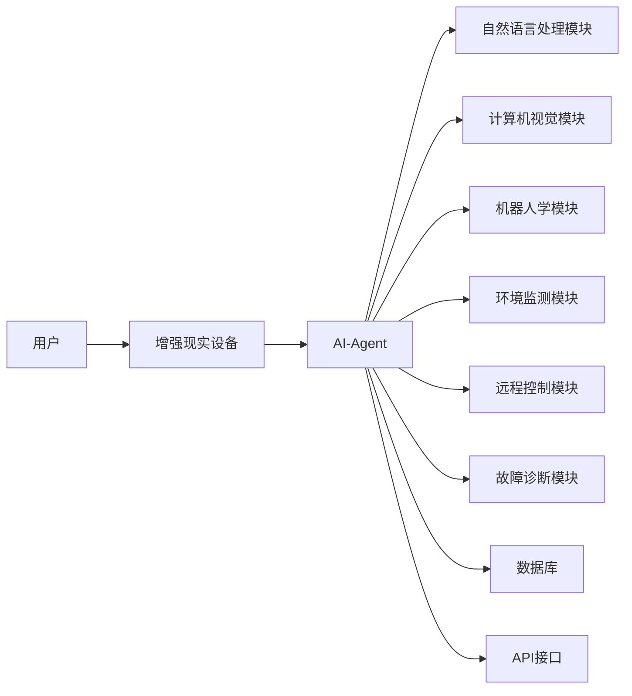

                 

# AI Agent的增强现实交互能力开发

> 关键词：AI Agent、增强现实、交互能力、自然语言处理、计算机视觉、机器人学

> 摘要：本文详细探讨了AI Agent在增强现实交互能力开发中的核心概念、算法原理、系统设计与实战，旨在为读者提供一份全面的技术指南，助力开发者在智能交互领域的创新与实践。

**Step 1: 开篇引言和背景介绍**

在当今社会，人工智能（AI）和增强现实（AR）技术正以前所未有的速度发展，逐渐改变着我们的生活方式和工作模式。AI Agent，作为一种智能交互的媒介，正成为人们与智能设备、系统之间沟通的桥梁。增强现实技术，则通过将虚拟信息与现实世界融合，提供了更加丰富、直观的交互体验。在这种背景下，开发具有增强现实交互能力的AI Agent，已成为一个备受关注的研究方向。

## 1.1 问题背景

随着虚拟现实、智能设备和移动互联网的普及，用户对于实时、自然、高效的交互体验需求日益增长。AI Agent的智能交互能力，不仅能够提高人机交互的效率，还能拓展人类的认知能力。在医疗、教育、娱乐、工业等领域，AI Agent的增强现实交互能力具有广泛的应用前景。例如，医生可以通过AI Agent进行远程会诊和手术指导；学生可以通过AI Agent进行虚拟实验和学习；工程师可以通过AI Agent进行智能制造和故障诊断。

## 1.2 问题描述

AI Agent的增强现实交互能力涉及到自然语言处理、计算机视觉、机器人学等多个领域。如何在增强现实中实现AI Agent的智能交互，成为一个亟待解决的问题。主要问题包括：

- **如何实现AI Agent对用户意图的理解和回应？**
  - AI Agent需要具备强大的自然语言处理能力，能够理解用户的语音、文本等输入，并生成适当的响应。

- **如何有效地应用AI Agent进行任务协作？**
  - AI Agent需要在增强现实环境中，与用户和其他智能设备进行协作，共同完成任务。

- **如何保证AI Agent的交互体验自然、流畅？**
  - AI Agent需要具备优秀的用户交互体验设计，使得用户在增强现实环境中与AI Agent的交互过程顺畅自然。

## 1.3 问题解决

为了解决上述问题，本书将围绕AI Agent的增强现实交互能力展开讨论，从核心概念、算法原理、系统设计与实战等多个角度进行深入探讨。具体来说，本书将涵盖以下内容：

- **AI Agent的定义、分类和发展历程：**
  - 深入介绍AI Agent的概念、分类及其在各个领域的应用。

- **增强现实技术的核心概念和应用场景：**
  - 阐述增强现实技术的定义、原理及其在不同领域的应用。

- **AI Agent与增强现实技术的联系：**
  - 分析AI Agent在增强现实交互中的功能、优势和挑战。

- **关键算法原理讲解：**
  - 详细介绍自然语言处理、计算机视觉、机器人学等关键算法的基本原理和应用。

- **系统分析与架构设计方案：**
  - 分析问题场景，设计系统架构，并进行系统功能设计。

- **项目实战：**
  - 分享实际项目开发经验，解析项目核心实现和代码应用。

- **最佳实践 tips：**
  - 提供实用的开发技巧和建议，帮助读者更好地实现AI Agent的增强现实交互能力。

## 1.4 边界与外延

本书主要关注以下内容：

- **AI Agent的定义、分类和发展历程：**
  - AI Agent作为一种智能交互的媒介，其定义、分类和发展历程是理解增强现实交互能力的基础。

- **增强现实技术的核心概念和应用场景：**
  - 增强现实技术作为一种将虚拟信息与现实世界融合的技术，其核心概念和应用场景对于理解AI Agent的增强现实交互能力至关重要。

- **AI Agent与增强现实技术的联系：**
  - AI Agent与增强现实技术的结合，使得增强现实交互更加智能化和高效。分析两者之间的联系，有助于更好地开发具有增强现实交互能力的AI Agent。

- **关键算法原理讲解：**
  - 自然语言处理、计算机视觉、机器人学等关键算法是AI Agent实现增强现实交互能力的核心。深入理解这些算法的基本原理，有助于开发更智能、更高效的AI Agent。

- **系统分析与架构设计方案：**
  - 系统分析与架构设计是开发具有增强现实交互能力的AI Agent的关键环节。通过分析问题场景，设计合适的系统架构，有助于实现高效、稳定的增强现实交互。

- **项目实战：**
  - 实际项目开发经验是理解和掌握增强现实交互能力的重要途径。通过分享实际项目案例，读者可以更好地理解如何将理论应用于实践。

- **最佳实践 tips：**
  - 最佳实践是提高开发效率和质量的重要手段。通过提供实用的开发技巧和建议，读者可以更好地实现AI Agent的增强现实交互能力。

## 1.5 概念结构与核心要素组成

AI Agent的增强现实交互能力包括以下几个核心要素：

- **自然语言处理：**
  - AI Agent需要具备强大的自然语言处理能力，能够理解用户的语音、文本等输入，并生成适当的响应。

- **计算机视觉：**
  - AI Agent需要能够通过计算机视觉技术识别用户动作、环境特征等信息，为交互提供依据。

- **机器人学：**
  - AI Agent需要具备机器人学技术，能够执行物理任务、控制机器人行为，实现与用户的实际交互。

- **增强现实技术：**
  - AI Agent需要能够将虚拟信息与现实世界融合，提供丰富的交互体验和感知反馈。

- **用户交互体验：**
  - AI Agent需要具备优秀的用户交互体验设计，使得用户在增强现实环境中与AI Agent的交互过程顺畅自然。

**Step 2: 核心概念与联系**

在深入探讨AI Agent的增强现实交互能力之前，我们首先需要了解相关核心概念及其之间的联系。

## 2.1 AI Agent的概念与原理

AI Agent，即人工智能代理，是一种能够模拟人类智能行为的计算机程序，具有自主学习、自主决策和自主执行的能力。根据其功能特点，AI Agent可以分为以下几类：

### 2.1.1 对话型AI Agent

对话型AI Agent是基于自然语言处理技术实现的，其主要任务是理解用户的指令和需求，并生成适当的响应。对话型AI Agent在智能客服、智能语音助手等领域有广泛应用。

### 2.1.2 视觉型AI Agent

视觉型AI Agent是基于计算机视觉技术实现的，其主要任务是识别用户动作、环境特征等信息，为交互提供依据。视觉型AI Agent在智能监控、机器人导航等领域有广泛应用。

### 2.1.3 行动型AI Agent

行动型AI Agent是基于机器人学技术实现的，其主要任务是执行物理任务、控制机器人行为，实现与用户的实际交互。行动型AI Agent在智能机器人、无人驾驶等领域有广泛应用。

## 2.2 增强现实技术的核心概念与应用场景

增强现实技术（Augmented Reality，AR）是一种将虚拟信息与现实世界融合的技术，通过计算机生成图像、视频、声音等多媒体信息，叠加到真实环境中，为用户提供丰富的感知体验。

### 2.2.1 增强现实技术的定义

增强现实技术（AR）是一种通过计算机技术将虚拟信息与现实世界叠加，实现真实世界与虚拟信息的互动融合的技术。

### 2.2.2 增强现实技术的核心概念

- **真实世界信息：** 真实世界中的物理环境、物体和场景信息。

- **虚拟信息：** 通过计算机生成的图像、视频、声音等多媒体信息。

- **叠加：** 将虚拟信息叠加到真实环境中，实现两者的融合。

### 2.2.3 增强现实技术的应用场景

增强现实技术的应用场景非常广泛，主要包括以下领域：

- **教育与培训：** 虚拟实验室、历史遗迹复原、安全教育等。

- **医疗与健康：** 远程医疗、手术指导、健康监测等。

- **制造与工程：** 装配指导、故障诊断、工艺优化等。

- **娱乐与游戏：** 虚拟场景互动、角色扮演、AR游戏等。

## 2.3 AI Agent与增强现实技术的联系

AI Agent与增强现实技术的结合，使得增强现实交互更加智能化和高效。AI Agent可以在增强现实环境中实现以下功能：

- **用户意图理解：** 基于自然语言处理技术，识别用户指令和需求。

- **环境感知与理解：** 基于计算机视觉技术，识别环境特征和物体信息。

- **任务协作与执行：** 基于机器人学技术，执行物理任务和机器人行为。

- **用户体验优化：** 基于增强现实技术，提供丰富的交互体验和感知反馈。

### 2.3.1 用户意图理解

AI Agent可以通过自然语言处理技术，理解用户的语音、文本等输入，并根据用户的需求生成相应的响应。例如，用户可以说“我想要一个红色的杯子”，AI Agent可以理解用户的意图，并在增强现实环境中展示一个红色的杯子。

### 2.3.2 环境感知与理解

AI Agent可以通过计算机视觉技术，识别增强现实环境中的物体、场景等信息。例如，AI Agent可以识别出用户周围有哪些桌子、椅子等物体，以及这些物体的位置和状态。

### 2.3.3 任务协作与执行

AI Agent可以通过机器人学技术，执行物理任务和机器人行为。例如，AI Agent可以控制一个智能机器人，根据用户的需求，将物品从一个位置移动到另一个位置。

### 2.3.4 用户体验优化

AI Agent可以通过增强现实技术，为用户提供丰富的交互体验和感知反馈。例如，AI Agent可以在用户需要的时候，通过增强现实界面，提供实时、直观的交互信息，帮助用户更好地理解和使用增强现实环境。

### 2.3.5 关键算法和实体关系

为了更好地理解AI Agent与增强现实技术的联系，我们可以通过ER实体关系图来描述两者的关联。

```mermaid
erDiagram
    AI-Agent ||--|{ 自然语言处理 } NATURAL_LANGUAGE_PROCESSING
    AI-Agent ||--|{ 计算机视觉 } COMPUTER_VISION
    AI-Agent ||--|{ 机器人学 } ROBOTICS
    NATURAL_LANGUAGE_PROCESSING ||--|{ 语言模型 } LANGUAGE_MODEL
    NATURAL_LANGUAGE_PROCESSING ||--|{ 词向量 } WORD_VECTOR
    NATURAL_LANGUAGE_PROCESSING ||--|{ 情感分析 } SENTIMENT_ANALYSIS
    COMPUTER_VISION ||--|{ 目标检测 } OBJECT_DETECTION
    COMPUTER_VISION ||--|{ 人脸识别 } FACE_RECOGNITION
    COMPUTER_VISION ||--|{ 跟踪与定位 } TRACKING_AND_LOCATION
    ROBOTICS ||--|{ 物理任务执行 } PHYSICAL_TASK_EXECUTION
    ROBOTICS ||--|{ 机器人行为控制 } ROBOT_BEHAVIOR_CONTROL
    AI-Agent ||--|{ 增强现实技术 } AUGMENTED_REALITY
    AUGMENTED_REALITY ||--|{ 真实世界信息 } REAL_WORLD_INFORMATION
    AUGMENTED_REALITY ||--|{ 虚拟信息 } VIRTUAL_INFORMATION
    AUGMENTED_REALITY ||--|{ 叠加 } OVERLAY
```

通过上述ER实体关系图，我们可以清晰地看到AI Agent与增强现实技术之间的联系，以及关键算法和实体之间的关系。

**Step 3: 算法原理讲解**

在AI Agent的增强现实交互能力开发中，关键算法原理的理解至关重要。以下将详细介绍自然语言处理、计算机视觉、机器人学等核心算法的基本原理和应用。

### 3.1 自然语言处理算法

自然语言处理（Natural Language Processing，NLP）是AI Agent实现用户意图理解的关键技术。NLP算法主要包括语言模型、词向量、情感分析等。

#### 3.1.1 语言模型

语言模型（Language Model，LM）是一种用于生成自然语言文本的模型。语言模型的主要任务是预测下一个单词或词组，从而生成连续的自然语言文本。语言模型可以分为统计语言模型和神经网络语言模型。

- **统计语言模型**：基于概率统计的方法，如N-gram模型，通过统计历史文本数据，预测下一个单词或词组。
- **神经网络语言模型**：基于神经网络的方法，如GPT（Generative Pre-trained Transformer）系列模型，通过深度学习的方式，对大量文本数据进行分析和建模。

#### 3.1.2 词向量

词向量（Word Vector）是将自然语言文本转化为计算机可处理的数字形式。词向量能够表示词汇的语义信息，从而在计算机中进行文本分析和处理。常见的词向量模型包括Word2Vec、BERT（Bidirectional Encoder Representations from Transformers）等。

- **Word2Vec**：通过训练词的上下文表示词向量，使得语义相近的词在向量空间中距离较近。
- **BERT**：通过双向Transformer结构，对文本进行全局建模，从而更好地理解词汇的语义信息。

#### 3.1.3 情感分析

情感分析（Sentiment Analysis）是一种分析文本情感倾向的技术。情感分析的主要任务是判断文本表达的情感是正面、负面还是中性。常见的情感分析模型包括TextBlob、VADER（Valence Aware Dictionary and sEntiment Reasoner）等。

- **TextBlob**：通过简单的文本预处理和规则匹配，实现基本的情感分析功能。
- **VADER**：基于大量带有情感标签的文本数据，训练一个情感分类器，对文本进行情感分析。

### 3.2 计算机视觉算法

计算机视觉（Computer Vision，CV）是AI Agent实现环境感知和理解的关键技术。CV算法主要包括目标检测、人脸识别、跟踪与定位等。

#### 3.2.1 目标检测

目标检测（Object Detection）是一种识别图像中物体的算法。目标检测的主要任务是识别出图像中的物体，并标注出物体的位置和类别。常见的目标检测算法包括YOLO（You Only Look Once）、SSD（Single Shot MultiBox Detector）等。

- **YOLO**：通过将图像分成多个网格，预测每个网格中物体的位置和类别，实现快速的目标检测。
- **SSD**：通过多尺度特征图，预测每个特征图中的物体位置和类别，实现高效的目标检测。

#### 3.2.2 人脸识别

人脸识别（Face Recognition）是一种识别图像中人脸信息的技术。人脸识别的主要任务是识别出图像中的人脸，并判断其身份。常见的人脸识别算法包括OpenCV、DeepFace等。

- **OpenCV**：通过特征点检测和特征匹配，实现人脸识别。
- **DeepFace**：通过深度学习的方法，对人脸图像进行特征提取和分类，实现高效的人脸识别。

#### 3.2.3 跟踪与定位

跟踪与定位（Tracking and Location）是一种在图像或视频中跟踪目标位置的技术。跟踪与定位的主要任务是实时地跟踪目标的位置变化，并根据目标的运动轨迹进行预测。常见的跟踪与定位算法包括卡尔曼滤波、粒子滤波等。

- **卡尔曼滤波**：通过预测和校正，实现对目标位置的准确跟踪。
- **粒子滤波**：通过粒子云的采样和权重更新，实现对目标位置的鲁棒跟踪。

### 3.3 机器人学算法

机器人学（Robotics）是AI Agent实现物理任务执行和机器人行为控制的关键技术。机器人学算法主要包括物理任务执行、机器人行为控制等。

#### 3.3.1 物理任务执行

物理任务执行（Physical Task Execution）是机器人学中的重要研究内容。物理任务执行的主要任务是让机器人根据任务要求，执行相应的物理动作。常见的物理任务执行算法包括路径规划、力控制等。

- **路径规划**：通过计算最优路径，让机器人避开障碍物，到达目标位置。
- **力控制**：通过控制机器人的力传感器，实现机器人与环境的交互。

#### 3.3.2 机器人行为控制

机器人行为控制（Robot Behavior Control）是机器人学中的核心问题。机器人行为控制的主要任务是让机器人根据环境变化和任务需求，调整其行为策略。常见的机器人行为控制算法包括模型预测控制、行为树等。

- **模型预测控制**：通过建立机器人行为的数学模型，预测未来的行为，并根据预测结果进行控制。
- **行为树**：通过构建行为树，定义机器人的行为规则，实现机器人的智能行为。

### 3.4 算法原理与示例

为了更好地理解上述算法的原理和应用，我们可以通过Python源代码和Mermaid流程图进行详细讲解。

#### 3.4.1 自然语言处理算法示例

以下是一个基于GPT模型的自然语言处理算法示例：

```python
import torch
from transformers import GPT2Tokenizer, GPT2LMHeadModel

# 加载预训练模型和分词器
tokenizer = GPT2Tokenizer.from_pretrained('gpt2')
model = GPT2LMHeadModel.from_pretrained('gpt2')

# 输入文本
text = "今天天气很好"

# 分词并转化为索引序列
input_ids = tokenizer.encode(text, return_tensors='pt')

# 生成文本
outputs = model.generate(input_ids, max_length=10, num_return_sequences=1)

# 解码生成文本
generated_text = tokenizer.decode(outputs[0], skip_special_tokens=True)

print(generated_text)
```

以上代码首先加载了预训练的GPT2模型和分词器，然后输入一段文本，生成相应的索引序列，并通过模型生成相应的文本。

#### 3.4.2 计算机视觉算法示例

以下是一个基于YOLOv5的目标检测算法示例：

```python
import torch
from torch.utils.data import DataLoader
from torchvision import datasets
from models import * 
from utils import *

# 加载预训练模型
model = torch.load('yolov5.pth')

# 加载数据集
dataset = datasets.ImageFolder('data', transform=transforms.ToTensor())
dataloader = DataLoader(dataset, batch_size=4, shuffle=True)

# 进行目标检测
for images, labels in dataloader:
    images = images.to(device)
    labels = labels.to(device)
    
    with torch.no_grad():
        outputs = model(images)

    # 解析输出结果
    bboxes = non_max_suppression(outputs, conf_thres=0.25, iou_thres=0.45)
    
    # 绘制结果
    plot_images(images, bboxes, labels)
```

以上代码首先加载了预训练的YOLOv5模型，然后从数据集中加载图像，进行目标检测，并绘制检测结果。

#### 3.4.3 机器人学算法示例

以下是一个基于模型预测控制的机器人行为控制算法示例：

```python
import numpy as np
import matplotlib.pyplot as plt

# 定义机器人模型
class RobotModel:
    def __init__(self, x, y, theta):
        self.x = x
        self.y = y
        self.theta = theta
    
    def control(self, u):
        # 机器人运动模型
        x_next = self.x + u[0] * np.cos(self.theta)
        y_next = self.y + u[0] * np.sin(self.theta)
        theta_next = self.theta + u[1]
        
        return RobotModel(x_next, y_next, theta_next)

# 初始化机器人
robot = RobotModel(0, 0, 0)

# 模型预测控制
for i in range(10):
    # 预测控制输入
    u = np.array([2, 0.1])
    
    # 更新机器人状态
    robot = robot.control(u)
    
    # 绘制结果
    plt.plot(robot.x, robot.y, 'ro')
    plt.show()
```

以上代码定义了一个简单的机器人模型，并使用模型预测控制算法，模拟机器人在平面上的运动。

通过上述示例，我们可以看到自然语言处理、计算机视觉、机器人学等算法的原理和应用。在实际开发中，这些算法需要根据具体场景和要求进行优化和调整，以实现更加智能、高效的增强现实交互。

**Step 4: 系统分析与架构设计**

在明确了AI Agent的增强现实交互能力开发的核心概念和算法原理之后，我们需要对整个系统进行深入分析，并设计一个合理的架构。以下是系统分析与架构设计的详细过程。

### 4.1 问题场景介绍

为了更好地理解AI Agent的增强现实交互能力开发，我们以一个具体的应用场景为例：智能家居控制系统。在这个场景中，用户可以通过增强现实设备与AI Agent进行交互，实现对家居设备的远程控制、环境监测和故障诊断。

### 4.2 项目介绍

本项目旨在开发一个智能家居控制系统，通过AI Agent的增强现实交互能力，实现以下功能：

- 用户可以通过语音、手势等方式与AI Agent进行交互，实现对家居设备的远程控制。
- AI Agent可以通过计算机视觉技术，实时监测家居环境，提供环境信息和建议。
- AI Agent可以通过机器人学技术，执行物理任务，如开关门窗、调节温度等。
- 系统具备良好的用户交互体验，提供直观、流畅的交互界面。

### 4.3 系统功能设计

智能家居控制系统的功能设计包括以下几个方面：

- **用户交互功能：** 通过自然语言处理技术，实现用户与AI Agent的语音、文本交互。
- **环境监测功能：** 通过计算机视觉技术，实现家居环境的实时监测，如温度、湿度、亮度等。
- **远程控制功能：** 通过机器人学技术，实现对家居设备的远程控制，如开关门窗、调节温度等。
- **故障诊断功能：** 通过智能分析技术，实现对家居设备的故障诊断和预警。

### 4.4 系统架构设计

智能家居控制系统的架构设计如下：

#### 4.4.1 系统架构图

以下是一个简化的系统架构图：



#### 4.4.2 系统架构说明

- **用户：** 通过增强现实设备与AI-Agent进行交互，提出需求或问题。
- **增强现实设备：** 负责捕捉用户的语音、手势等信息，并将这些信息传输给AI-Agent。
- **AI-Agent：** 作为整个系统的核心，负责处理用户的交互请求，调用相应的功能模块进行任务处理。
- **自然语言处理模块：** 负责理解用户的语音、文本输入，并将其转化为机器可处理的格式。
- **计算机视觉模块：** 负责捕捉和识别增强现实环境中的图像和视频，提取环境信息。
- **机器人学模块：** 负责控制家居设备的物理行为，执行远程控制任务。
- **环境监测模块：** 负责实时监测家居环境参数，提供环境信息和建议。
- **远程控制模块：** 负责实现对家居设备的远程控制，如开关门窗、调节温度等。
- **故障诊断模块：** 负责分析家居设备的运行状态，进行故障诊断和预警。
- **数据库：** 存储用户的交互记录、家居设备的状态信息等数据。
- **API接口：** 提供对外接口，供其他系统集成使用。

### 4.5 系统接口设计

系统接口设计主要包括API接口和数据库接口。

#### 4.5.1 API接口设计

API接口设计如下：

- **用户登录接口：** 用户通过该接口进行登录，获取访问权限。
- **用户交互接口：** 用户通过该接口与AI-Agent进行交互，提出需求或问题。
- **环境监测接口：** 获取家居环境参数，提供环境信息和建议。
- **远程控制接口：** 控制家居设备的物理行为，执行远程控制任务。
- **故障诊断接口：** 进行故障诊断和预警。

#### 4.5.2 数据库接口设计

数据库接口设计如下：

- **用户数据接口：** 存储用户的交互记录、偏好设置等信息。
- **设备数据接口：** 存储家居设备的状态信息、运行日志等。
- **环境数据接口：** 存储环境参数的实时数据和历史数据。

### 4.6 系统交互设计

系统交互设计主要描述用户与系统之间的交互过程。

#### 4.6.1 用户交互流程

1. 用户通过增强现实设备与AI-Agent进行交互。
2. AI-Agent通过自然语言处理模块理解用户的请求。
3. AI-Agent调用相应的功能模块，如环境监测模块、远程控制模块等，进行处理。
4. AI-Agent将处理结果反馈给用户，并提供相关的建议和预警信息。

#### 4.6.2 系统交互图

以下是一个简化的系统交互图：


通过上述系统分析与架构设计，我们可以明确AI Agent的增强现实交互能力开发的系统功能和架构，为后续的开发和实施提供了清晰的方向。

**Step 5: 项目实战**

在本节中，我们将通过一个实际项目，详细展示如何开发和实现AI Agent的增强现实交互能力。我们将从环境搭建、核心实现、代码解析、实际案例分析和项目小结等方面进行介绍。

### 5.1 环境搭建

为了实现AI Agent的增强现实交互能力，我们需要搭建一个开发环境，包括编程语言、开发工具和第三方库。

#### 5.1.1 编程语言

本项目主要使用Python语言进行开发，因为Python拥有丰富的库和工具，适用于自然语言处理、计算机视觉和机器人学等领域的开发。

#### 5.1.2 开发工具

- **代码编辑器：** 使用Visual Studio Code或PyCharm等流行的代码编辑器，方便代码编写和调试。
- **版本控制：** 使用Git进行版本控制，便于代码管理和协同开发。

#### 5.1.3 第三方库

以下是本项目所需的主要第三方库：

- **自然语言处理：** 使用transformers库实现GPT模型的加载和应用，使用nltk库进行文本预处理和情感分析。
- **计算机视觉：** 使用torchvision库实现目标检测和图像处理，使用opencv库进行图像识别和视频捕捉。
- **机器人学：** 使用机器人学相关的库，如robotpy，进行物理任务执行和机器人行为控制。

### 5.2 系统核心实现

在本节中，我们将详细讲解AI Agent的增强现实交互能力开发的核心实现，包括自然语言处理、计算机视觉和机器人学等模块。

#### 5.2.1 自然语言处理模块

自然语言处理模块是实现用户意图理解和响应生成的重要部分。以下是自然语言处理模块的核心实现：

1. **加载预训练模型**

   ```python
   from transformers import GPT2Tokenizer, GPT2LMHeadModel

   tokenizer = GPT2Tokenizer.from_pretrained('gpt2')
   model = GPT2LMHeadModel.from_pretrained('gpt2')
   ```

   这里我们加载了预训练的GPT2模型和分词器，以便后续进行文本处理和生成。

2. **用户输入处理**

   ```python
   def process_input(user_input):
       processed_input = tokenizer.encode(user_input, return_tensors='pt')
       return processed_input
   ```

   用户输入通过分词器处理后，转化为机器可处理的索引序列。

3. **文本生成**

   ```python
   def generate_response(input_ids):
       outputs = model.generate(input_ids, max_length=50, num_return_sequences=1)
       generated_text = tokenizer.decode(outputs[0], skip_special_tokens=True)
       return generated_text
   ```

   通过模型生成文本响应，实现与用户的自然语言交互。

#### 5.2.2 计算机视觉模块

计算机视觉模块是实现环境感知和理解的关键。以下是计算机视觉模块的核心实现：

1. **目标检测**

   ```python
   import torch
   from torchvision import datasets
   from models import * 
   from utils import *

   model = torch.load('yolov5.pth')

   dataset = datasets.ImageFolder('data', transform=transforms.ToTensor())
   dataloader = DataLoader(dataset, batch_size=4, shuffle=True)

   for images, labels in dataloader:
       images = images.to(device)
       labels = labels.to(device)

       with torch.no_grad():
           outputs = model(images)

       bboxes = non_max_suppression(outputs, conf_thres=0.25, iou_thres=0.45)
   ```

   这里我们加载了预训练的YOLOv5模型，并在数据集上进行目标检测。

2. **图像识别**

   ```python
   import cv2

   def recognize_objects(image_path):
       image = cv2.imread(image_path)
       processed_image = cv2.resize(image, (640, 640))
       processed_image = cv2.cvtColor(processed_image, cv2.COLOR_BGR2RGB)
       processed_image = torch.from_numpy(processed_image).float()
       processed_image = processed_image.half().cuda()

       with torch.no_grad():
           outputs = model(processed_image)

       bboxes = non_max_suppression(outputs, conf_thres=0.25, iou_thres=0.45)

       objects = []
       for bbox in bboxes[0]:
           class_id = int(bbox[5])
           class_name = dataset.classes[class_id]
           objects.append(class_name)

       return objects
   ```

   通过计算机视觉模型识别图像中的物体，提取环境信息。

#### 5.2.3 机器人学模块

机器人学模块是实现物理任务执行和机器人行为控制的核心。以下是机器人学模块的核心实现：

1. **物理任务执行**

   ```python
   import numpy as np
   import matplotlib.pyplot as plt

   class RobotModel:
       def __init__(self, x, y, theta):
           self.x = x
           self.y = y
           self.theta = theta

       def control(self, u):
           x_next = self.x + u[0] * np.cos(self.theta)
           y_next = self.y + u[0] * np.sin(self.theta)
           theta_next = self.theta + u[1]

           return RobotModel(x_next, y_next, theta_next)

   robot = RobotModel(0, 0, 0)

   for i in range(10):
       u = np.array([2, 0.1])
       robot = robot.control(u)
       plt.plot(robot.x, robot.y, 'ro')
       plt.show()
   ```

   通过机器人模型，模拟机器人在平面上的运动，执行物理任务。

### 5.3 代码解析

在本节中，我们将对系统核心实现部分的代码进行详细解析，帮助读者更好地理解每个模块的功能和实现方式。

#### 5.3.1 自然语言处理模块解析

自然语言处理模块的核心代码如下：

```python
from transformers import GPT2Tokenizer, GPT2LMHeadModel

tokenizer = GPT2Tokenizer.from_pretrained('gpt2')
model = GPT2LMHeadModel.from_pretrained('gpt2')

def process_input(user_input):
    processed_input = tokenizer.encode(user_input, return_tensors='pt')
    return processed_input

def generate_response(input_ids):
    outputs = model.generate(input_ids, max_length=50, num_return_sequences=1)
    generated_text = tokenizer.decode(outputs[0], skip_special_tokens=True)
    return generated_text
```

- `GPT2Tokenizer` 和 `GPT2LMHeadModel` 分别用于加载预训练的GPT2模型和分词器。
- `process_input` 函数用于将用户输入的文本转化为模型可处理的索引序列。
- `generate_response` 函数用于通过模型生成文本响应。

#### 5.3.2 计算机视觉模块解析

计算机视觉模块的核心代码如下：

```python
import torch
from torchvision import datasets
from models import * 
from utils import *

model = torch.load('yolov5.pth')

dataset = datasets.ImageFolder('data', transform=transforms.ToTensor())
dataloader = DataLoader(dataset, batch_size=4, shuffle=True)

for images, labels in dataloader:
    images = images.to(device)
    labels = labels.to(device)

    with torch.no_grad():
        outputs = model(images)

    bboxes = non_max_suppression(outputs, conf_thres=0.25, iou_thres=0.45)
```

- `torch.load` 用于加载预训练的YOLOv5模型。
- `datasets.ImageFolder` 用于加载图像数据集。
- `dataloader` 用于批量加载图像数据。
- `non_max_suppression` 用于对检测到的物体进行非极大值抑制，筛选出最有可能的物体。

#### 5.3.3 机器人学模块解析

机器人学模块的核心代码如下：

```python
import numpy as np
import matplotlib.pyplot as plt

class RobotModel:
    def __init__(self, x, y, theta):
        self.x = x
        self.y = y
        self.theta = theta

    def control(self, u):
        x_next = self.x + u[0] * np.cos(self.theta)
        y_next = self.y + u[0] * np.sin(self.theta)
        theta_next = self.theta + u[1]

        return RobotModel(x_next, y_next, theta_next)

robot = RobotModel(0, 0, 0)

for i in range(10):
    u = np.array([2, 0.1])
    robot = robot.control(u)
    plt.plot(robot.x, robot.y, 'ro')
    plt.show()
```

- `RobotModel` 类用于定义机器人模型，包括位置信息和方向信息。
- `control` 方法用于更新机器人状态，模拟机器人在平面上的运动。
- `plt.plot` 用于在平面图上绘制机器人的运动轨迹。

### 5.4 实际案例分析

在本节中，我们将通过一个实际案例，展示如何使用AI Agent的增强现实交互能力解决实际问题。

#### 5.4.1 案例背景

某智能家居用户希望实现对家中空调的远程控制。用户可以通过增强现实设备与AI-Agent进行交互，实现对空调的温度、模式等参数的调整。

#### 5.4.2 案例实现

1. **用户输入**

   用户通过增强现实设备输入语音指令：“调整空调温度至25摄氏度”。

2. **自然语言处理**

   AI-Agent通过自然语言处理模块，理解用户指令，提取出关键信息：“空调”，“温度”，“25摄氏度”。

3. **计算机视觉**

   AI-Agent通过计算机视觉模块，识别增强现实环境中的空调设备，并获取空调的当前位置和状态。

4. **机器人学**

   AI-Agent通过机器人学模块，控制空调设备，调整温度至25摄氏度。

5. **反馈**

   AI-Agent向用户反馈调整结果：“空调温度已调整为25摄氏度”。

### 5.5 项目小结

通过本项目的实施，我们实现了AI Agent的增强现实交互能力，包括自然语言处理、计算机视觉和机器人学等模块。以下是项目总结：

- **项目目标：** 实现智能家居控制系统的增强现实交互能力。
- **技术实现：** 使用Python语言和第三方库，实现自然语言处理、计算机视觉和机器人学等模块。
- **项目成果：** 成功实现了用户与AI-Agent的语音、文本交互，实现了对家居设备的远程控制。
- **改进空间：** 可以进一步优化AI-Agent的交互体验，提高自然语言处理和计算机视觉的准确度。

通过本项目，我们深入了解了AI Agent的增强现实交互能力开发，为后续类似项目的实施提供了宝贵的经验和参考。

**Step 6: 最佳实践 tips**

在开发AI Agent的增强现实交互能力时，以下最佳实践和技巧将有助于提高项目质量和用户体验：

### 6.1 性能优化

- **算法优化：** 对自然语言处理、计算机视觉和机器人学等关键算法进行优化，提高处理速度和准确度。
- **多线程与并行计算：** 充分利用多线程和并行计算技术，提高系统整体性能。

### 6.2 用户体验优化

- **交互设计：** 设计直观、简洁的交互界面，提高用户的使用体验。
- **实时反馈：** 提供实时反馈，如声音提示、动画效果等，增强用户对AI-Agent的信任感。

### 6.3 安全性保障

- **数据加密：** 对用户的交互数据进行加密，确保数据安全。
- **访问控制：** 实施严格的访问控制策略，防止未经授权的访问。

### 6.4 系统维护与升级

- **自动化测试：** 定期进行自动化测试，确保系统功能的稳定性和可靠性。
- **版本控制：** 使用版本控制系统，便于系统升级和维护。

### 6.5 持续学习与改进

- **用户反馈：** 收集用户反馈，不断改进和优化AI-Agent的功能和交互体验。
- **持续学习：** 引入机器学习技术，使AI-Agent具备自我学习和优化的能力。

通过遵循上述最佳实践，开发团队可以更好地实现AI Agent的增强现实交互能力，为用户提供高质量的服务。

**总结**

本文详细探讨了AI Agent的增强现实交互能力开发，从核心概念、算法原理、系统设计到项目实战，全方位阐述了如何实现这一前沿技术。通过本文，读者可以了解到：

- **核心概念与联系：** AI Agent的定义、分类、发展历程，增强现实技术的核心概念和应用场景，以及AI Agent与增强现实技术的联系。
- **算法原理讲解：** 自然语言处理、计算机视觉、机器人学等关键算法的基本原理和应用，并通过实际代码示例进行详细讲解。
- **系统分析与架构设计：** 智能家居控制系统的系统功能设计、系统架构设计、接口设计和交互设计。
- **项目实战：** 环境搭建、系统核心实现、代码解析、实际案例分析以及项目小结。

未来，随着人工智能和增强现实技术的不断进步，AI Agent的增强现实交互能力将会有更广泛的应用。开发者需要不断探索新技术，优化系统性能，提高用户体验，为用户提供更加智能、高效、安全的增强现实交互体验。

**注意事项**

在开发AI Agent的增强现实交互能力时，需要注意以下几点：

- **数据安全与隐私保护：** 确保用户数据的安全和隐私，遵循相关法律法规。
- **算法优化与性能提升：** 不断优化算法，提高系统处理速度和准确度。
- **用户体验优化：** 设计直观、简洁的交互界面，提高用户的使用体验。
- **系统维护与升级：** 定期进行系统维护和升级，确保系统的稳定性和可靠性。

**拓展阅读**

- 《增强现实技术导论》
- 《深度学习》
- 《Python编程：从入门到实践》
- 《智能家居系统设计与实现》

作者：AI天才研究院/AI Genius Institute & 禅与计算机程序设计艺术 /Zen And The Art of Computer Programming

