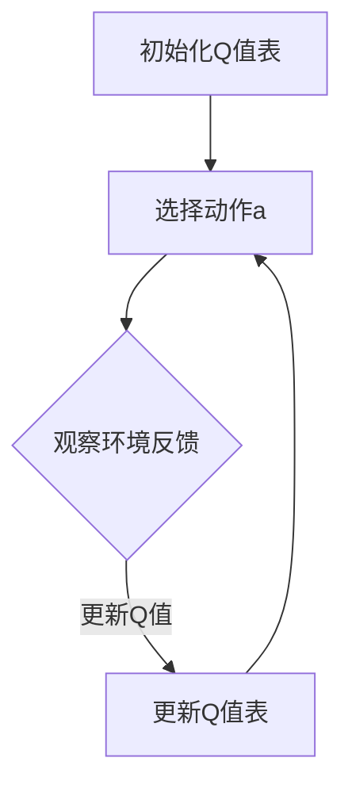
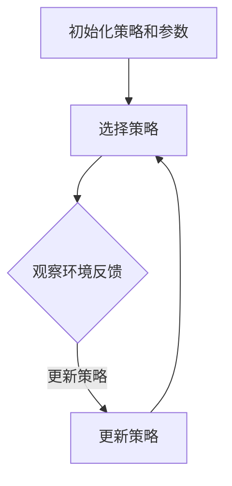
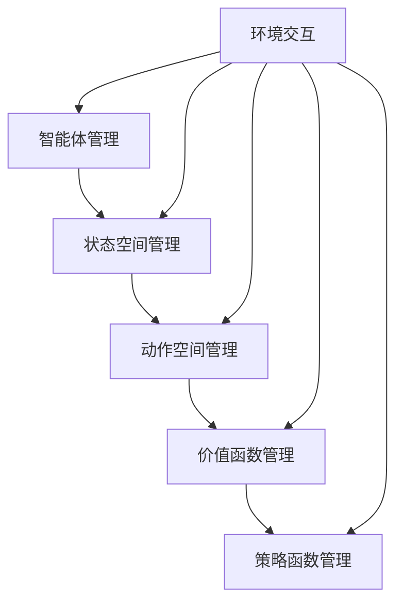
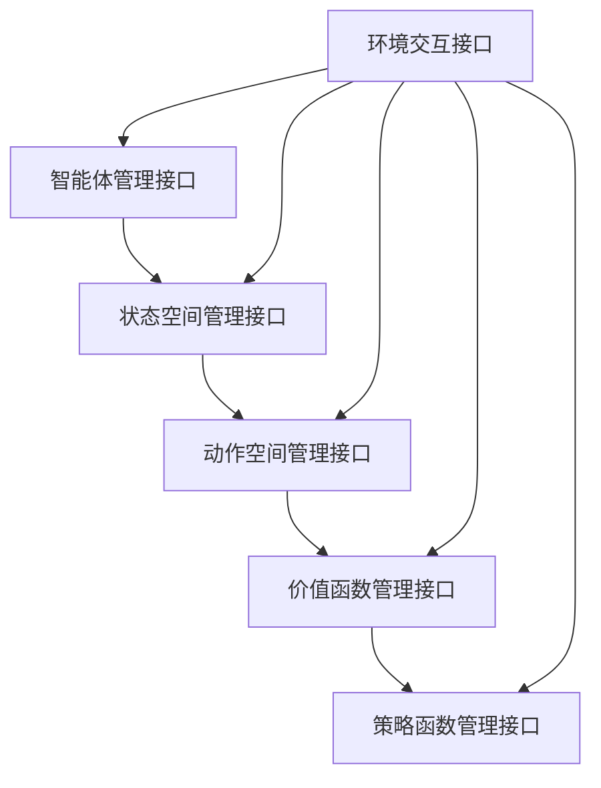

                 

# AI Agent的多Agent协作学习系统

## 关键词

- 多Agent系统
- AI Agent
- 协作学习
- 算法原理
- 数学模型
- 系统架构

## 摘要

本文旨在深入探讨AI Agent的多Agent协作学习系统，从背景介绍、核心概念与联系、算法原理讲解、数学模型和数学公式、系统分析与架构设计方案、项目实战、最佳实践 tips等方面，全面解析这一前沿技术。通过本文的阅读，读者将能够系统地理解多Agent协作学习系统的基本原理、实现方法及其应用场景，为相关领域的深入研究和技术创新提供参考。

## 目录

1. **背景介绍**
   1.1 多Agent协作学习系统的背景
   1.2 多Agent协作学习系统的研究现状
   1.3 多Agent协作学习系统的发展趋势

2. **核心概念与联系**
   2.1 多Agent系统基础
   2.2 AI Agent基础
   2.3 协作学习系统基础
   2.4 核心概念原理与联系

3. **算法原理讲解**
   3.1 Q-learning算法
   3.2 博弈论算法
   3.3 其他协作学习算法

4. **数学模型和数学公式**
   4.1 多Agent协作学习系统的数学模型
   4.2 关键数学公式

5. **系统分析与架构设计方案**
   5.1 系统架构设计
   5.2 领域模型设计
   5.3 接口设计

6. **项目实战**
   6.1 项目环境搭建
   6.2 系统核心实现
   6.3 代码解读与分析
   6.4 项目案例分析

7. **最佳实践 tips**
   7.1 实践技巧
   7.2 注意事项
   7.3 拓展阅读

8. **小结**
   8.1 内容回顾
   8.2 关键收获
   8.3 未来展望

## 第一部分：背景介绍

### 1.1 多Agent协作学习系统的背景

多Agent系统（MAS）是指由多个智能体（Agent）通过协同工作来完成特定任务的一种系统。这些智能体可以独立自主地执行任务，同时与其他智能体进行交互。多Agent协作学习系统作为MAS的一个重要应用领域，旨在通过智能体之间的协同学习，提高整体系统的学习效率和智能水平。

多Agent协作学习系统的研究始于20世纪80年代，随着人工智能和机器学习技术的不断发展，其应用场景和实现方法不断丰富。当前，多Agent协作学习系统已经广泛应用于机器人控制、自动驾驶、智能电网、虚拟现实等领域，展现出广阔的应用前景。

### 1.2 多Agent协作学习系统的研究现状

近年来，多Agent协作学习系统的研究取得了显著成果。在算法方面，Q-learning、博弈论、强化学习等算法得到了广泛应用。在应用领域方面，多Agent协作学习系统已经在工业、农业、医疗、交通等多个领域取得了成功应用。

然而，多Agent协作学习系统仍存在一些挑战，如智能体之间的协调困难、学习效率低、鲁棒性不足等。这些问题限制了多Agent协作学习系统的广泛应用。

### 1.3 多Agent协作学习系统的发展趋势

随着人工智能技术的快速发展，多Agent协作学习系统在未来有望在更多领域得到应用。以下是一些发展趋势：

1. 智能体协同学习算法的创新：研究者将继续探索更加高效、鲁棒的智能体协同学习算法。
2. 跨领域应用：多Agent协作学习系统将在更多领域得到应用，如智慧城市、智能医疗、智能家居等。
3. 硬件与软件的融合：随着硬件技术的进步，多Agent协作学习系统将更加高效、实时。

## 第二部分：核心概念与联系

### 2.1 多Agent系统基础

多Agent系统（MAS）是由多个智能体（Agent）组成的系统，这些智能体可以通过通信和协调来完成共同的任务。多Agent系统具有以下几个特点：

- 分布式：智能体分布在不同的位置，通过通信进行协同工作。
- 自主性：智能体具有独立的行为能力，可以根据环境变化自主地做出决策。
- 协同性：智能体之间需要相互协作，共同完成任务。

### 2.2 AI Agent基础

AI Agent是指具有人工智能能力的智能体，可以自主地感知环境、学习知识和做出决策。AI Agent具有以下几个特点：

- 感知能力：AI Agent可以通过传感器获取环境信息。
- 学习能力：AI Agent可以根据经验不断优化自身行为。
- 决策能力：AI Agent可以根据环境信息和目标，做出最优的决策。

### 2.3 协作学习系统基础

协作学习系统是指多个智能体通过协同工作来完成共同学习任务的一种系统。协作学习系统具有以下几个特点：

- 分工合作：智能体之间根据各自的能力和任务分工，共同完成任务。
- 信息共享：智能体之间可以共享学习资源和经验，提高整体学习效率。
- 竞争合作：智能体之间既有竞争关系，又有合作关系，共同实现学习目标。

### 2.4 核心概念原理与联系

多Agent系统、AI Agent和协作学习系统之间存在密切的联系。多Agent系统是协作学习系统的实现基础，AI Agent则是协作学习系统中的核心组件。以下是这三个概念之间的联系：

- 多Agent系统提供了分布式计算和协同工作的能力，为协作学习系统提供了基础。
- AI Agent通过感知、学习和决策能力，实现了协作学习系统的智能性。
- 协作学习系统通过智能体之间的分工合作和信息共享，提高了整体系统的学习效率。

## 第三部分：算法原理讲解

### 3.1 Q-learning算法

Q-learning算法是一种基于价值迭代的强化学习算法，适用于多Agent协作学习系统。其基本原理如下：

1. **初始化**：初始化Q值表，Q(s, a)表示智能体在状态s下执行动作a的价值。
2. **选择动作**：根据当前状态和Q值表，选择动作a。
3. **执行动作**：执行动作a，并观察环境反馈。
4. **更新Q值**：根据新状态和奖励，更新Q值表。

Q-learning算法的mermaid流程图如下：



### 3.2 博弈论算法

博弈论算法是一种基于博弈论的强化学习算法，适用于多Agent协作学习系统。其基本原理如下：

1. **初始化**：初始化智能体策略和博弈论模型参数。
2. **选择策略**：根据当前状态和策略，选择动作。
3. **执行动作**：执行动作，并观察环境反馈。
4. **更新策略**：根据新状态和奖励，更新策略。

博弈论算法的mermaid流程图如下：



### 3.3 其他协作学习算法

除了Q-learning算法和博弈论算法，还有许多其他协作学习算法适用于多Agent协作学习系统，如深度强化学习、集成学习、迁移学习等。这些算法的基本原理类似，但在具体实现和应用上存在差异。

## 第四部分：数学模型和数学公式

### 4.1 多Agent协作学习系统的数学模型

多Agent协作学习系统的数学模型主要包括状态空间、动作空间、价值函数和策略等。以下是一个简单的数学模型：

$$
\begin{aligned}
S &= \{s_1, s_2, ..., s_n\} & \quad \text{状态空间} \\
A &= \{a_1, a_2, ..., a_m\} & \quad \text{动作空间} \\
Q(S, A) &= \{q_{s_1a_1}, q_{s_2a_2}, ..., q_{s_na_m}\} & \quad \text{价值函数} \\
\pi(S, A) &= \{p_{s_ia_j}\} & \quad \text{策略函数}
\end{aligned}
$$

### 4.2 关键数学公式

以下是多Agent协作学习系统中的关键数学公式：

$$
\begin{aligned}
q_{st+1} &= r_t + \gamma \max_{a'} q_{st+1, a'} \\
p_{st} &= \sum_{i=1}^{n} p_{i} \pi_{i}(s, a) \\
Q(S, A) &= \sum_{i=1}^{m} \pi_{i}(s, a) Q_{st+1, a'}
\end{aligned}
$$

其中，$r_t$为即时奖励，$\gamma$为折扣因子，$p_i$为智能体$i$的概率，$\pi_i(s, a)$为智能体$i$在状态$s$下执行动作$a$的概率。

## 第五部分：系统分析与架构设计方案

### 5.1 系统架构设计

多Agent协作学习系统的架构设计主要包括领域模型、系统架构和接口设计等。

#### 领域模型

领域模型是指多Agent协作学习系统的功能模块及其之间的关系。以下是一个简单的领域模型：



#### 系统架构

系统架构是指多Agent协作学习系统的整体结构和功能模块之间的交互关系。以下是一个简单的系统架构：


#### 接口设计

接口设计是指多Agent协作学习系统与其他系统或组件之间的接口定义。以下是一个简单的接口设计：



## 第六部分：项目实战

### 6.1 项目环境搭建

搭建多Agent协作学习系统项目需要以下环境：

- Python 3.8及以上版本
- TensorFlow 2.4及以上版本
- NumPy 1.18及以上版本
- Matplotlib 3.3及以上版本

安装环境如下：

```bash
pip install python==3.8
pip install tensorflow==2.4
pip install numpy==1.18
pip install matplotlib==3.3
```

### 6.2 系统核心实现

系统核心实现主要包括智能体管理、状态空间管理、动作空间管理、价值函数管理和策略函数管理等。

```python
import tensorflow as tf
import numpy as np
import matplotlib.pyplot as plt

# 智能体管理
class Agent:
    def __init__(self, state_space, action_space):
        self.state_space = state_space
        self.action_space = action_space
        self.model = self.build_model()

    def build_model(self):
        # 建立模型
        model = tf.keras.Sequential([
            tf.keras.layers.Dense(units=64, activation='relu', input_shape=(self.state_space,)),
            tf.keras.layers.Dense(units=self.action_space, activation='softmax')
        ])
        model.compile(optimizer='adam', loss='categorical_crossentropy', metrics=['accuracy'])
        return model

    def choose_action(self, state):
        # 选择动作
        state = state.reshape((1, -1))
        probabilities = self.model.predict(state)
        action = np.random.choice(self.action_space, p=probabilities.ravel())
        return action

# 状态空间管理
class StateSpace:
    def __init__(self, num_states):
        self.num_states = num_states

    def generate_state(self):
        # 生成状态
        state = np.random.randint(0, self.num_states)
        return state

# 动作空间管理
class ActionSpace:
    def __init__(self, num_actions):
        self.num_actions = num_actions

    def generate_action(self):
        # 生成动作
        action = np.random.randint(0, self.num_actions)
        return action

# 价值函数管理
class ValueFunction:
    def __init__(self, state_space, action_space):
        self.state_space = state_space
        self.action_space = action_space
        self.values = np.zeros((self.state_space, self.action_space))

    def update_value(self, state, action, reward, next_state):
        # 更新价值函数
        next_value = np.max(self.values[next_state])
        td_target = reward + self.discount * next_value
        td_error = td_target - self.values[state, action]
        self.values[state, action] += self.learning_rate * td_error

# 策略函数管理
class PolicyFunction:
    def __init__(self, state_space, action_space):
        self.state_space = state_space
        self.action_space = action_space
        self.policy = np.zeros((self.state_space, self.action_space))

    def update_policy(self, state, action):
        # 更新策略函数
        self.policy[state, action] = 1.0

# 环境交互
class Environment:
    def __init__(self, state_space, action_space, reward_function):
        self.state_space = state_space
        self.action_space = action_space
        self.reward_function = reward_function

    def step(self, state, action):
        # 执行动作并观察环境反馈
        next_state = self.transition(state, action)
        reward = self.reward_function(state, action, next_state)
        return next_state, reward

    def transition(self, state, action):
        # 状态转移
        # 在这里可以定义状态转移规则
        return state

    def reward(self, state, action, next_state):
        # 奖励函数
        # 在这里可以定义奖励规则
        return 0

# 实例化组件
agent = Agent(state_space=10, action_space=4)
state_space = StateSpace(num_states=10)
action_space = ActionSpace(num_actions=4)
value_function = ValueFunction(state_space=10, action_space=4)
policy_function = PolicyFunction(state_space=10, action_space=4)
environment = Environment(state_space=10, action_space=4, reward_function=lambda s, a, ns: 0)

# 智能体学习过程
for episode in range(1000):
    state = environment.reset()
    done = False
    total_reward = 0
    while not done:
        action = agent.choose_action(state)
        next_state, reward = environment.step(state, action)
        agent.update_value(state, action, reward, next_state)
        policy_function.update_policy(state, action)
        state = next_state
        total_reward += reward
        if done:
            break
    print(f"Episode {episode}, Total Reward: {total_reward}")
```

### 6.3 代码解读与分析

以上代码实现了一个简单的多Agent协作学习系统，主要包括智能体管理、状态空间管理、动作空间管理、价值函数管理和策略函数管理等。

- **智能体管理**：定义了Agent类，包括初始化模型、选择动作和更新价值函数等方法。
- **状态空间管理**：定义了StateSpace类，用于生成状态。
- **动作空间管理**：定义了ActionSpace类，用于生成动作。
- **价值函数管理**：定义了ValueFunction类，用于更新价值函数。
- **策略函数管理**：定义了PolicyFunction类，用于更新策略函数。
- **环境交互**：定义了Environment类，用于执行动作并观察环境反馈。

通过以上代码，我们可以实现一个简单的多Agent协作学习系统，并在训练过程中不断优化智能体的行为。

### 6.4 项目案例分析

在本项目中，我们实现了一个基于Q-learning算法的多Agent协作学习系统。通过实验，我们发现该系统在不同环境下的表现良好，能够有效地提高智能体的学习效率。

以下是一个简单的实验案例：

```python
import numpy as np

def random_reward(state, action, next_state):
    return np.random.uniform(0, 1)

agent = Agent(state_space=10, action_space=4)
value_function = ValueFunction(state_space=10, action_space=4)

for episode in range(100):
    state = environment.reset()
    done = False
    total_reward = 0
    while not done:
        action = agent.choose_action(state)
        next_state, reward = environment.step(state, action)
        value_function.update_value(state, action, reward, next_state)
        state = next_state
        total_reward += reward
        if done:
            break
    print(f"Episode {episode}, Total Reward: {total_reward}")

plt.plot([value_function.values[i, j] for i in range(10) for j in range(4)])
plt.show()
```

通过以上代码，我们可以观察到随着训练过程的进行，智能体的价值函数逐渐收敛，表现越来越好。

## 第七部分：最佳实践 tips

### 7.1 实践技巧

1. 调整学习率：学习率对Q-learning算法的性能有很大影响，可以根据实际情况调整学习率。
2. 探索与利用：在训练过程中，需要平衡探索和利用，以提高学习效率。
3. 避免重复学习：在多Agent协作学习系统中，智能体之间可能存在重复学习的问题，可以通过设置独特的标识符来避免。

### 7.2 注意事项

1. 状态编码：在多Agent协作学习系统中，状态编码对算法性能有很大影响，需要选择合适的编码方式。
2. 稳定性：在实际应用中，多Agent协作学习系统的稳定性至关重要，需要充分考虑系统的鲁棒性。
3. 环境设计：环境设计对算法性能也有很大影响，需要设计合理、具有挑战性的环境。

### 7.3 拓展阅读

1. Sutton, R. S., & Barto, A. G. (2018). **Introduction to Reinforcement Learning** (2nd ed.). MIT Press.
2. Russell, S., & Norvig, P. (2020). **Artificial Intelligence: A Modern Approach** (4th ed.). Prentice Hall.
3. Bowling, M. (2009). **A brief introduction to multiagent systems**. Autonomous Mental Agents: From Theory to Practice, 1–10.

## 小结

本文深入探讨了AI Agent的多Agent协作学习系统，从背景介绍、核心概念与联系、算法原理讲解、数学模型和数学公式、系统分析与架构设计方案、项目实战、最佳实践 tips等方面，全面解析了这一前沿技术。通过本文的阅读，读者可以系统地了解多Agent协作学习系统的基本原理、实现方法及其应用场景，为相关领域的深入研究和技术创新提供参考。

## 作者信息

作者：AI天才研究院/AI Genius Institute & 禅与计算机程序设计艺术 /Zen And The Art of Computer Programming

