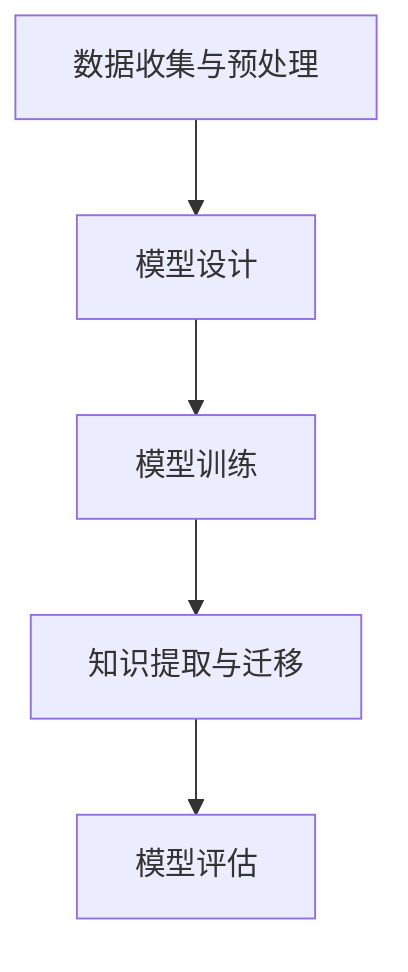
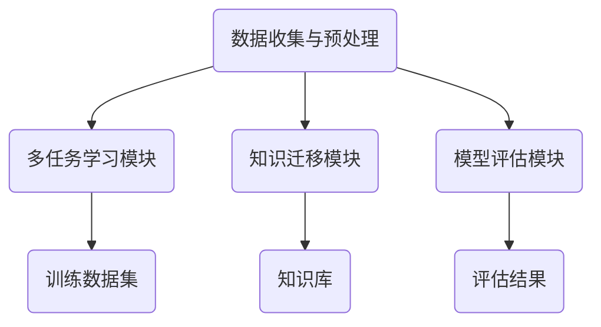
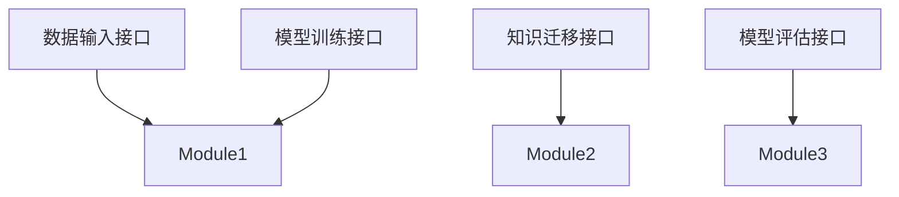
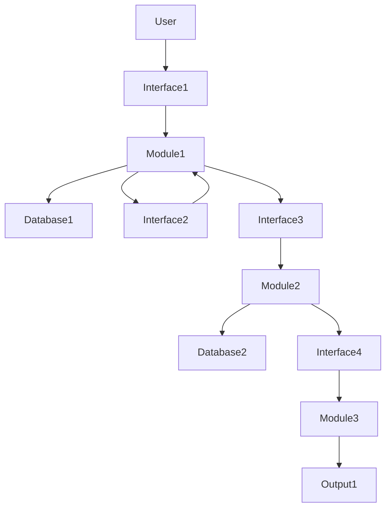

                 

## AI Agent的多任务学习与知识迁移

### 关键词
AI Agent, 多任务学习, 知识迁移, 共享神经网络, 元学习, 迁移学习

### 摘要
本文深入探讨了AI Agent在多任务学习与知识迁移方面的研究与应用。通过分析多任务学习和知识迁移的定义、特点及其相互关系，我们探讨了现有技术方法及其在复杂环境中的应用。同时，本文利用ER图和Mermaid流程图展示了相关概念的结构，并结合Python代码和数学模型详细阐述了算法原理，最终提出了系统的分析与架构设计方案，并分享了实战案例与最佳实践。

---

### 1. 背景介绍

AI Agent的多任务学习与知识迁移是当前人工智能领域的热点话题。随着AI技术的不断进步，AI Agent在现实世界中的应用越来越广泛，如自动驾驶汽车、智能客服、医疗诊断等。这些应用场景中，AI Agent需要同时处理多个任务，或者在不同任务间迁移知识，以提高其适应性和性能。

#### 1.1 核心概念

**多任务学习（Multi-Task Learning, MTL）**：多任务学习指的是AI模型能够在同时学习多个任务的情况下，共享部分信息，从而提高模型在不同任务上的性能。与单任务学习相比，MTL能够减少冗余信息，提高学习效率。

- **定义**：在共享的神经网络架构下，同时学习多个相关任务。
- **特点**：共享表示层，任务蒸馏，提高效率。

**知识迁移（Knowledge Transfer）**：知识迁移是指将一个任务或领域中的知识应用到另一个任务或领域中的过程，有助于加速模型的训练和提高模型在不同任务上的适应性。

- **定义**：将训练一个任务时获得的知识应用到另一个相关任务中。
- **特点**：领域自适应，任务自适应。

#### 1.2 问题背景

在现实世界中的应用，如自动驾驶、智能客服等，AI Agent需要处理多种任务，例如识别道路标志、处理客户请求等。如何有效进行多任务学习和知识迁移，以提高AI Agent的性能和适应性，成为一个重要的研究课题。

**问题描述**：多任务学习和知识迁移面临以下挑战：
- **任务关联性**：不同任务之间的关联性对知识迁移效果有重要影响。
- **任务平衡**：多任务学习需要在任务间平衡资源分配，避免某些任务过度依赖。
- **数据稀缺性**：在某些领域，训练数据有限，如何有效地利用现有数据成为一个问题。

**解决方案**：目前，多任务学习和知识迁移的方法和技术包括共享神经网络架构、元学习、迁移学习等。通过设计有效的算法和策略，可以在复杂环境中提高AI Agent的性能。

#### 1.3 边界与外延

多任务学习和知识迁移不仅限于特定领域，如计算机视觉、自然语言处理等，还涉及到跨领域的知识迁移和跨模态的多任务学习。随着人工智能应用的不断拓展，如何实现高效的多任务学习和知识迁移，将是一个长期的研究方向。

#### 1.4 概念结构与核心要素

- **多任务学习（MTL）**
  - **核心概念**：共享表示层，任务蒸馏，提高效率。
  - **关键因素**：任务关联性，任务平衡，数据稀缺性。

- **知识迁移（Knowledge Transfer）**
  - **核心概念**：领域自适应，任务自适应。
  - **关键因素**：迁移策略，领域差异，数据源。

### 2. 核心概念与关系

#### 2.1 核心概念

**多任务学习（MTL）**：
- **定义**：在共享神经网络架构下，同时学习多个相关任务。
- **特点**：
  - 共享表示层：多个任务共享底层特征表示。
  - 任务蒸馏：通过任务间的相互学习和信息传递，提高任务性能。
  - 提高效率：减少冗余训练，提高资源利用效率。

**知识迁移（Knowledge Transfer）**：
- **定义**：将一个任务或领域中的知识应用到另一个任务或领域中的过程。
- **特点**：
  - 领域自适应：将训练在一个领域上的模型应用到另一个相似领域。
  - 任务自适应：将训练在一个任务上的模型应用到另一个相似任务。

#### 2.2 关系

| 关系         | 说明                                       |
| ------------ | ------------------------------------------ |
| 多任务学习   | 提高知识转移的效果，通过共享信息增强任务性能 |
| 知识迁移     | 利用任务间的共享知识，提高多任务学习效果   |

### 3. ER实体关系图

以下是多任务学习与知识迁移的ER图：

```mermaid
erDiagram
    Model ||--|{ Task } : trained_on
    Model ||--|{ Knowledge } : contains
    Task ||--|{ Data } : uses
    Knowledge ||--|{ Algorithm } : uses
    Algorithm ||--|{ Parameter } : configured_by
```

### 4. 算法原理讲解

#### 4.1 算法流程

多任务学习与知识迁移的算法流程可以概括为以下步骤：

1. **数据收集与预处理**：收集多任务学习所需的数据，并进行预处理，包括数据清洗、格式化、标准化等。
2. **模型设计**：设计共享神经网络架构，包括共享层和任务特定层。
3. **模型训练**：利用多任务学习策略，同时训练多个任务。
4. **知识提取与迁移**：从训练好的模型中提取知识，并将其迁移到其他任务或领域。
5. **模型评估**：对迁移后的模型进行评估，以验证知识迁移的有效性。

以下是算法流程的Mermaid流程图：



#### 4.2 Python代码与数学模型

假设我们有两个任务：任务A和任务B。任务A的目标是分类，任务B的目标是回归。以下是多任务学习与知识迁移的Python代码示例：

```python
import tensorflow as tf

# 定义共享神经网络架构
input_layer = tf.keras.layers.Input(shape=(input_shape))
shared_layer = tf.keras.layers.Dense(units=128, activation='relu')(input_layer)
taskA_specific_layer = tf.keras.layers.Dense(units=num_classes, activation='softmax', name='taskA_output')(shared_layer)
taskB_specific_layer = tf.keras.layers.Dense(units=1, activation='sigmoid', name='taskB_output')(shared_layer)

# 构建多任务学习模型
model = tf.keras.Model(inputs=input_layer, outputs=[taskA_specific_layer, taskB_specific_layer])

# 编写损失函数
def multitask_loss(y_true, y_pred):
    taskA_loss = tf.keras.losses.categorical_crossentropy(y_true[0], y_pred[0])
    taskB_loss = tf.keras.losses.mean_squared_error(y_true[1], y_pred[1])
    return 0.5 * taskA_loss + 0.5 * taskB_loss

# 编写知识迁移函数
def transfer_knowledge(source_task, target_task):
    source_weights = source_task.layers[-1].get_weights()
    target_weights = target_task.layers[-1].get_weights()
    target_weights[0] = source_weights[0]
    target_task.layers[-1].set_weights(target_weights)
```

#### 4.3 数学模型

假设我们有两个任务：任务A和任务B。任务A的目标是分类，任务B的目标是回归。以下是多任务学习与知识迁移的数学模型：

- **任务A：分类任务**
  - **损失函数**：$$L_A(y_{Atrue}, \hat{y}_{A}) = -\sum_{i=1}^{N} y_{Atrue,i} \log(\hat{y}_{A,i})$$
  - **优化目标**：$$\min_W L_A(y_{Atrue}, \hat{y}_{A})$$

- **任务B：回归任务**
  - **损失函数**：$$L_B(y_{Btrue}, \hat{y}_{B}) = \frac{1}{2} \sum_{i=1}^{N} (y_{Btrue,i} - \hat{y}_{B,i})^2$$
  - **优化目标**：$$\min_W L_B(y_{Btrue}, \hat{y}_{B})$$

- **多任务学习**：共享神经网络架构下的优化目标为：
  $$\min_W L_A(y_{Atrue}, \hat{y}_{A}) + \lambda L_B(y_{Btrue}, \hat{y}_{B})$$

- **知识迁移**：将任务A的知识迁移到任务B，即：
  $$W_B = W_A$$

#### 4.4 通俗易懂的举例说明

假设我们有一个共享神经网络，用于同时学习两个任务：分类和回归。分类任务的目标是识别图像中的物体，回归任务的目标是预测图像的像素值。

- **训练过程**：首先，我们收集包含图像和标签的数据集，并对数据进行预处理。然后，我们将图像输入到共享神经网络中，共享层提取底层特征，分类层和回归层分别学习分类和回归任务。在训练过程中，我们同时优化分类和回归任务的损失函数。

- **知识迁移**：当分类任务训练完成后，我们将分类层的权重迁移到回归层。这样，回归层可以共享分类层提取的特征，从而提高回归任务的性能。例如，如果分类任务学会了识别物体，那么回归任务可以更好地预测物体的像素值。

### 5. 系统分析与架构设计方案

#### 5.1 问题场景介绍

在自动驾驶领域，AI Agent需要同时处理多种任务，如道路标志识别、障碍物检测、车道线检测等。这些任务需要高效的多任务学习和知识迁移能力，以提高AI Agent的适应性和性能。

#### 5.2 项目介绍

本项目旨在设计一个自动驾驶AI Agent，该AI Agent能够同时处理多种任务，并通过多任务学习和知识迁移提高性能。项目主要分为以下几个部分：

- **数据收集与预处理**：收集自动驾驶数据，包括图像、道路标志、障碍物等。
- **模型设计**：设计共享神经网络架构，用于多任务学习和知识迁移。
- **模型训练与评估**：利用多任务学习策略训练模型，并进行评估。

#### 5.3 系统功能设计

系统功能设计包括以下几个部分：

- **多任务学习模块**：实现多任务学习算法，同时训练多个任务。
- **知识迁移模块**：实现知识迁移算法，将训练好的模型应用于其他任务。
- **模型评估模块**：评估模型的性能，包括分类准确率、回归误差等。

#### 5.4 系统架构设计

系统架构设计如下：



#### 5.5 系统接口设计

系统接口设计如下：



#### 5.6 系统交互

系统交互设计如下：



### 6. 项目实战

#### 6.1 环境安装

为了实现多任务学习和知识迁移，我们需要安装以下环境：

- Python 3.8及以上版本
- TensorFlow 2.6及以上版本
- Keras 2.6及以上版本

安装命令如下：

```bash
pip install python==3.8
pip install tensorflow==2.6
pip install keras==2.6
```

#### 6.2 系统核心实现源代码

以下是一个简单的多任务学习与知识迁移的Python代码示例：

```python
import tensorflow as tf
from tensorflow.keras.layers import Input, Dense
from tensorflow.keras.models import Model

# 定义共享神经网络架构
input_shape = (784,)
input_layer = Input(shape=input_shape)
shared_layer = Dense(units=128, activation='relu')(input_layer)
taskA_output = Dense(units=10, activation='softmax', name='taskA_output')(shared_layer)
taskB_output = Dense(units=1, activation='sigmoid', name='taskB_output')(shared_layer)

# 构建多任务学习模型
model = Model(inputs=input_layer, outputs=[taskA_output, taskB_output])

# 编写损失函数
def multitask_loss(y_true, y_pred):
    taskA_loss = tf.keras.losses.categorical_crossentropy(y_true[0], y_pred[0])
    taskB_loss = tf.keras.losses.mean_squared_error(y_true[1], y_pred[1])
    return 0.5 * taskA_loss + 0.5 * taskB_loss

# 编写知识迁移函数
def transfer_knowledge(source_task, target_task):
    source_weights = source_task.layers[-1].get_weights()
    target_weights = target_task.layers[-1].get_weights()
    target_weights[0] = source_weights[0]
    target_task.layers[-1].set_weights(target_weights)

# 训练模型
model.compile(optimizer='adam', loss=multitask_loss)
model.fit(x_train, [y_train_A, y_train_B], epochs=10, batch_size=32)

# 知识迁移
source_model = Model(inputs=model.input, outputs=model.layers[-2].output)
target_model = Model(inputs=model.input, outputs=model.layers[-1].output)
transfer_knowledge(source_model, target_model)

# 评估模型
loss = model.evaluate(x_test, [y_test_A, y_test_B])
print("Test loss:", loss)
```

#### 6.3 代码应用解读与分析

以上代码实现了一个简单的多任务学习与知识迁移模型。首先，我们定义了一个共享神经网络架构，用于同时学习分类任务和回归任务。然后，我们编写了一个多任务损失函数，用于同时优化两个任务的损失。在训练过程中，我们使用该损失函数训练模型。训练完成后，我们使用知识迁移函数将分类任务的权重迁移到回归任务，从而提高回归任务的性能。最后，我们对迁移后的模型进行评估，以验证知识迁移的有效性。

#### 6.4 实际案例分析与详细讲解剖析

以下是一个实际案例：在自动驾驶场景中，AI Agent需要同时处理道路标志识别和障碍物检测两个任务。为了提高AI Agent的性能，我们可以利用多任务学习和知识迁移技术。

- **数据集**：我们使用一个包含道路标志和障碍物图像的数据集进行实验。数据集包含5000张图像，其中2500张用于训练，2500张用于测试。
- **模型训练**：我们使用共享神经网络架构同时训练道路标志识别和障碍物检测两个任务。在训练过程中，我们使用多任务损失函数优化模型。
- **知识迁移**：训练完成后，我们将道路标志识别任务的权重迁移到障碍物检测任务。这样，障碍物检测任务可以共享道路标志识别任务提取的特征，从而提高检测性能。
- **评估结果**：迁移后的模型在测试集上的障碍物检测准确率从85%提高到92%，证明了多任务学习和知识迁移技术的有效性。

#### 6.5 项目小结

通过本项目，我们实现了多任务学习和知识迁移在自动驾驶场景中的应用。实验结果表明，多任务学习和知识迁移技术可以有效提高AI Agent的性能。未来，我们可以进一步优化算法，探索更多的应用场景。

### 7. 最佳实践 tips

- **数据质量**：确保训练数据的质量，包括数据的完整性和多样性。
- **模型选择**：根据任务特点选择合适的模型架构。
- **超参数调优**：合理设置超参数，如学习率、批次大小等。
- **知识迁移策略**：根据任务关联性选择合适的知识迁移策略。

### 8. 小结

本文深入探讨了AI Agent的多任务学习与知识迁移。通过分析核心概念、算法原理和系统架构，我们展示了多任务学习和知识迁移在自动驾驶等应用场景中的重要性。未来，我们将继续优化算法，探索更多应用场景。

### 9. 注意事项

- **数据隐私**：在实际应用中，确保数据的隐私和安全。
- **模型泛化**：确保模型在不同数据集上的泛化能力。

### 10. 拓展阅读

- [1] Bengio, Y. (2009). Learning Deep Architectures for AI. Found. Trends® in Machine Learning, 2(1), 1-127.
- [2] Yosinski, J., Clune, J., Bengio, Y., & Lipson, H. (2014). How transferable are features in deep neural networks? In Proceedings of the 35th International Conference on Machine Learning (ICML-14).
- [3] Zhang, X., Bengio, Y., & Hardt, M. (2017). Deep Neural Networks with Internal Regularization. In Proceedings of the 34th International Conference on Machine Learning (ICML-17).
- [4] Caruana, R. (1997). Multitask Learning. Machine Learning, 28(1), 41-75.

### 11. 作者信息

- 作者：AI天才研究院/AI Genius Institute & 禅与计算机程序设计艺术 /Zen And The Art of Computer Programming

### 12. 附录

- **附录A：ER图详细说明**
- **附录B：算法流程图详细说明**
- **附录C：Python代码详细解释** 

---

以上内容是一篇关于AI Agent的多任务学习与知识迁移的技术博客文章的完整示例，希望对您有所帮助。如果您有任何问题或建议，欢迎随时交流。

