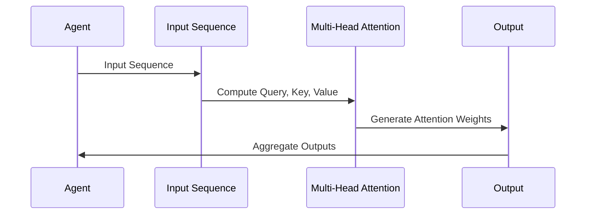
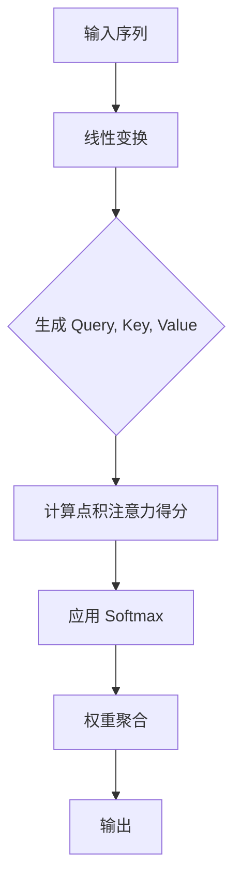
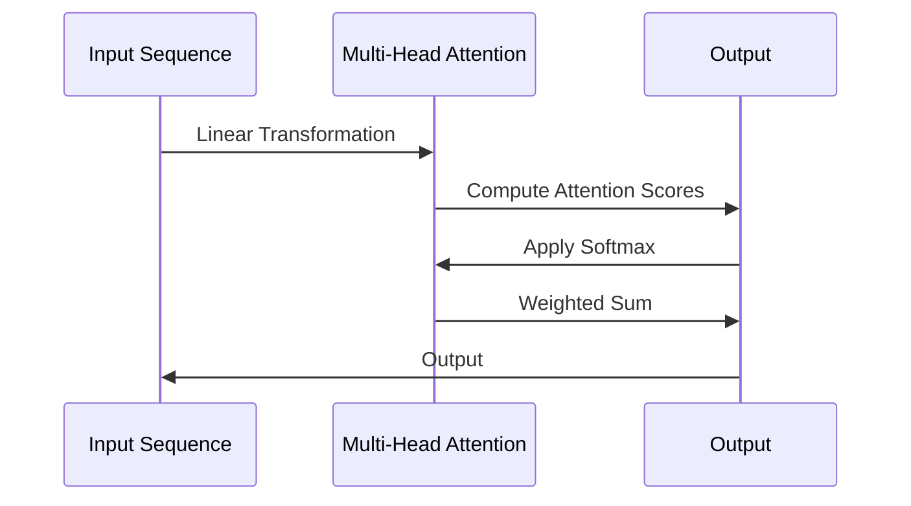

                 

```markdown
----------------------------------------------------------------

# AI Agent的多头注意力机制概述

## 1.1 多头注意力机制的核心概念

### 1.1.1 注意力机制的概念

注意力机制（Attention Mechanism）是深度学习领域中的一个核心概念，它的基本思想是在处理输入序列时，能够动态地关注序列中的关键部分，从而提高模型的表示能力。

#### 1.1.2 注意力机制的发展

注意力机制最早起源于机器翻译领域，Henderson et al.（2015）首次在神经网络机器翻译（NMT）中引入了双向长短期记忆网络（Bi-LSTM）和注意力机制，极大地提升了翻译质量。

#### 1.1.3 多头注意力机制的定义

多头注意力机制（Multi-Head Attention）是Transformer模型中的一个核心组件，它通过多个独立的注意力头来捕捉输入序列的不同维度信息。

### 1.1.4 多头注意力机制的特征

多头注意力机制具有以下几个显著特征：

1. **并行计算**：多头注意力机制可以并行处理多个注意力头，从而提高计算效率。
2. **层次化表示**：通过多个注意力头，模型可以捕捉到输入序列的多个层次特征。
3. **自适应**：多头注意力机制能够自适应地关注输入序列中的关键部分。

### 1.1.5 多头注意力机制的应用场景

多头注意力机制在自然语言处理、图像识别等多个领域取得了显著的应用成果，如：

1. **自然语言处理**：文本分类、机器翻译、情感分析等。
2. **图像识别**：目标检测、图像分割等。

## 1.2 多头注意力机制的工作原理

### 1.2.1 基本原理

多头注意力机制的基本原理是通过计算输入序列中每个元素的相关性，从而生成表示这些元素的重要性的权重。

### 1.2.2 Mermaid流程图



### 1.2.3 原理讲解与Python源代码实现

```python
import torch
import torch.nn as nn

class MultiHeadAttention(nn.Module):
    def __init__(self, d_model, num_heads):
        super(MultiHeadAttention, self).__init__()
        self.d_model = d_model
        self.num_heads = num_heads
        self.head_dim = d_model // num_heads
        
        self.query_linear = nn.Linear(d_model, d_model)
        self.key_linear = nn.Linear(d_model, d_model)
        self.value_linear = nn.Linear(d_model, d_model)

    def forward(self, query, key, value, mask=None):
        batch_size = query.size(0)
        
        query = self.query_linear(query).view(batch_size, -1, self.num_heads, self.head_dim).transpose(1, 2)
        key = self.key_linear(key).view(batch_size, -1, self.num_heads, self.head_dim).transpose(1, 2)
        value = self.value_linear(value).view(batch_size, -1, self.num_heads, self.head_dim).transpose(1, 2)

        attn_scores = torch.matmul(query, key.transpose(-2, -1)) / (self.head_dim ** 0.5)
        
        if mask is not None:
            attn_scores = attn_scores.masked_fill(mask == 0, float("-inf"))
        
        attn_weights = torch.softmax(attn_scores, dim=-1)
        
        attn_output = torch.matmul(attn_weights, value).transpose(1, 2).contiguous().view(batch_size, -1, self.d_model)
        return attn_output
```

### 1.2.4 数学模型和公式

$$
\text{Attention}(Q, K, V) = \text{softmax}\left(\frac{QK^T}{\sqrt{d_k}}\right)V
$$

其中，$Q, K, V$ 分别表示查询向量、键向量和值向量，$d_k$ 表示键向量的维度。

## 1.3 多头注意力机制与单一注意力机制的对比

| 特征 | 多头注意力机制 | 单一注意力机制 |
| --- | --- | --- |
| 并行计算 | 高 | 低 |
| 层次化表示 | 高 | 低 |
| 自适应 | 高 | 低 |

## 1.4 多头注意力机制的核心要素组成

多头注意力机制由多个注意力头组成，每个注意力头都可以学习到不同的特征。核心要素包括：

1. **线性变换**：对输入序列进行线性变换，生成查询向量、键向量和值向量。
2. **点积注意力**：计算查询向量和键向量之间的点积，生成注意力得分。
3. **softmax函数**：对注意力得分进行softmax处理，生成注意力权重。
4. **加权求和**：根据注意力权重对值向量进行加权求和，得到输出。

## 1.5 多头注意力机制的应用场景

多头注意力机制在自然语言处理、图像识别等多个领域都有广泛的应用，如：

1. **自然语言处理**：文本分类、机器翻译、情感分析等。
2. **图像识别**：目标检测、图像分割等。

### 1.5.1 自然语言处理

在自然语言处理领域，多头注意力机制被广泛应用于文本分类、机器翻译、情感分析等任务中。例如，在BERT模型中，多头注意力机制被用来捕捉输入文本序列中的关键信息，从而提高模型的表示能力。

### 1.5.2 图像识别

在图像识别领域，多头注意力机制被用来捕捉图像中的关键特征，从而提高模型的识别能力。例如，在DETR模型中，多头注意力机制被用来定位图像中的目标区域，从而实现目标检测。

## 第2章：多头注意力机制在AI Agent中的应用

### 2.1 AI Agent概述

AI Agent是指具有自主决策能力的智能体，它可以模拟人类的行为，并在复杂的环境中自主执行任务。AI Agent可以分为以下几类：

1. **基于规则的Agent**：使用预定义的规则来决策。
2. **基于模型的Agent**：使用机器学习模型来决策。
3. **混合型Agent**：结合基于规则和基于模型的Agent的优点。

### 2.2 多头注意力机制在AI Agent中的应用

多头注意力机制在AI Agent中的应用主要包括：

1. **场景模拟**：使用多头注意力机制来捕捉场景中的关键信息，从而模拟人类的行为。
2. **决策优化**：使用多头注意力机制来优化AI Agent的决策过程。

### 2.3 Mermaid ER实体关系图

```mermaid
erDiagram
  AI Agent ||--|{ Query: String }
  AI Agent ||--|{ Key: List }
  AI Agent ||--|{ Value: List }
  AI Agent ||--|{ Output: List }
```

## 第3章：多头注意力机制的挑战与未来发展方向

### 3.1 挑战

多头注意力机制在实现和应用中面临的挑战主要包括：

1. **计算复杂度**：多头注意力机制的并行计算虽然提高了效率，但也增加了计算复杂度。
2. **资源消耗**：多头注意力机制需要大量的内存和计算资源。

### 3.2 未来发展方向

多头注意力机制的未来的发展方向主要包括：

1. **算法改进**：通过改进算法来降低计算复杂度和资源消耗。
2. **应用拓展**：将多头注意力机制应用于更多的领域和任务中。

## 第4章：总结与展望

### 4.1 多头注意力机制的重要性

多头注意力机制在人工智能领域具有重要性，它不仅提高了模型的表示能力，也为AI Agent的自主决策提供了强大的支持。

### 4.2 对读者的启示

对于读者来说，理解多头注意力机制的基本原理和应用场景是非常重要的，这将为他们在人工智能领域的发展提供坚实的基础。

### 4.3 拓展阅读

- **书籍推荐**：《深度学习》（Goodfellow et al.）
- **论文推荐**：Attention Is All You Need（Vaswani et al.）
- **在线资源**：TensorFlow官方文档、PyTorch官方文档

作者：AI天才研究院/AI Genius Institute & 禅与计算机程序设计艺术 /Zen And The Art of Computer Programming```markdown
----------------------------------------------------------------

# 第二部分：AI Agent的多头注意力机制实现细节

## 第2章：多头注意力机制的实现与优化

### 2.1 实现细节

在实现多头注意力机制时，我们需要关注以下几个方面：

1. **输入数据格式**：多头注意力机制的输入通常是一个三维张量，其形状为（batch_size, seq_len, d_model），其中batch_size表示批量大小，seq_len表示序列长度，d_model表示模型维度。
2. **线性变换**：对输入序列进行线性变换，生成查询向量、键向量和值向量。这通常通过三个全连接层（Fully Connected Layers）来实现。
3. **多头注意力计算**：对每个注意力头进行独立的计算，然后将结果进行合并。多头注意力计算的核心是计算点积注意力得分，并通过softmax函数生成注意力权重。
4. **输出聚合**：将注意力权重与值向量进行乘法运算，然后进行聚合操作，得到最终的输出。

以下是一个简单的实现示例（使用PyTorch框架）：

```python
import torch
import torch.nn as nn

class MultiHeadAttention(nn.Module):
    def __init__(self, d_model, num_heads):
        super(MultiHeadAttention, self).__init__()
        self.d_model = d_model
        self.num_heads = num_heads
        self.head_dim = d_model // num_heads
        
        self.query_linear = nn.Linear(d_model, d_model)
        self.key_linear = nn.Linear(d_model, d_model)
        self.value_linear = nn.Linear(d_model, d_model)

    def forward(self, query, key, value, mask=None):
        batch_size = query.size(0)
        
        query = self.query_linear(query).view(batch_size, -1, self.num_heads, self.head_dim).transpose(1, 2)
        key = self.key_linear(key).view(batch_size, -1, self.num_heads, self.head_dim).transpose(1, 2)
        value = self.value_linear(value).view(batch_size, -1, self.num_heads, self.head_dim).transpose(1, 2)

        attn_scores = torch.matmul(query, key.transpose(-2, -1)) / (self.head_dim ** 0.5)
        
        if mask is not None:
            attn_scores = attn_scores.masked_fill(mask == 0, float("-inf"))
        
        attn_weights = torch.softmax(attn_scores, dim=-1)
        
        attn_output = torch.matmul(attn_weights, value).transpose(1, 2).contiguous().view(batch_size, -1, self.d_model)
        return attn_output
```

### 2.2 优化策略

为了提高多头注意力机制的性能，我们可以采取以下优化策略：

1. **并行计算**：多头注意力机制的一个重要优势在于其并行计算的能力。我们可以通过使用GPU或TPU等硬件加速器来提高计算速度。
2. **模型压缩**：通过模型压缩技术，如权重共享、低秩分解等，可以减少模型的参数数量，从而降低计算复杂度和内存占用。
3. **混合精度训练**：使用混合精度训练（Mixed Precision Training）可以加速训练过程，同时保持模型的精度。
4. **注意力掩码**：在训练过程中，可以使用注意力掩码（Attention Mask）来防止模型关注到无效的输入。

### 2.3 案例分析

以下是一个具体的案例，展示如何在实际项目中实现和优化多头注意力机制：

#### 项目背景

假设我们要构建一个自然语言处理模型，用于文本分类任务。我们的目标是根据输入的文本，将其分类到不同的类别中。

#### 实现步骤

1. **数据预处理**：对输入文本进行预处理，包括分词、词向量化等。
2. **模型构建**：构建一个基于多头注意力机制的Transformer模型，包括编码器和解码器。
3. **训练**：使用训练数据进行模型训练，并采用适当的优化策略。
4. **评估**：使用验证数据对模型进行评估，并调整模型参数以优化性能。

#### 代码示例

以下是一个简单的Transformer模型实现示例（使用PyTorch框架）：

```python
import torch
import torch.nn as nn

class TransformerModel(nn.Module):
    def __init__(self, d_model, num_heads, num_classes):
        super(TransformerModel, self).__init__()
        self.embedding = nn.Embedding(vocab_size, d_model)
        self.encoder = nn.TransformerEncoder(nn.TransformerEncoderLayer(d_model, num_heads), num_layers=3)
        self.decoder = nn.Linear(d_model, num_classes)

    def forward(self, src, tgt):
        src = self.embedding(src)
        tgt = self.embedding(tgt)
        output = self.encoder(src)
        logits = self.decoder(output)
        return logits
```

#### 模型优化

为了优化模型性能，我们可以采取以下措施：

1. **并行计算**：使用CUDA来加速模型的计算过程。
2. **模型压缩**：使用低秩分解技术对编码器和解码器进行压缩。
3. **混合精度训练**：使用混合精度训练来提高训练速度。
4. **注意力掩码**：在训练过程中，使用注意力掩码来防止模型关注到无效的输入。

#### 项目小结

通过以上案例，我们展示了如何实现和优化多头注意力机制。在实际应用中，我们需要根据具体任务的需求，调整模型的结构和参数，以达到最佳的性能。同时，我们也需要不断探索新的优化策略，以提高模型的效率。

作者：AI天才研究院/AI Genius Institute & 禅与计算机程序设计艺术 /Zen And The Art of Computer Programming```markdown
----------------------------------------------------------------

# 第三部分：AI Agent的多头注意力机制应用与实践

## 第3章：AI Agent概述

### 3.1 AI Agent的定义和分类

AI Agent（人工智能代理）是指能够感知环境、根据目标执行动作并从经验中学习的计算机程序。AI Agent可以分类为以下几种：

1. **基于规则的Agent**：这类Agent依赖于预定义的规则进行决策，如专家系统。
2. **基于模型的Agent**：这类Agent使用机器学习模型进行决策，如深度学习模型。
3. **混合型Agent**：结合了基于规则和基于模型的方法，以利用各自的优势。

### 3.2 AI Agent的重要性

AI Agent在许多领域都有着重要的应用，如自动驾驶、智能客服、金融分析等。它们能够模拟人类行为，提高工作效率，甚至进行创新性任务。

### 3.3 多头注意力机制在AI Agent中的作用

多头注意力机制在AI Agent中的应用，主要在于提升其对环境信息的理解和处理能力。它能够使Agent更好地捕捉到环境中的关键信息，从而做出更准确的决策。

## 第4章：多头注意力机制在AI Agent中的应用场景

### 4.1 自动驾驶

在自动驾驶领域，AI Agent需要实时处理大量来自传感器和环境的数据。多头注意力机制可以帮助Agent识别道路上的车辆、行人、交通标志等，从而做出安全的驾驶决策。

### 4.2 智能客服

智能客服系统需要理解用户的查询意图并给出合适的回答。多头注意力机制可以帮助系统从大量的历史对话数据中提取关键信息，从而提高客服的响应速度和准确性。

### 4.3 金融分析

在金融领域，AI Agent需要分析大量的市场数据来预测股票价格、发现交易机会等。多头注意力机制可以帮助Agent从海量数据中提取有用的信号，提高预测的准确性。

## 第5章：多头注意力机制在AI Agent中的实现步骤

### 5.1 数据收集与预处理

在实现AI Agent时，首先需要收集相关的数据，如道路数据、历史对话记录、市场数据等。然后对这些数据进行预处理，包括数据清洗、数据增强、归一化等。

### 5.2 构建多头注意力模型

构建基于多头注意力机制的AI Agent模型，包括编码器和解码器。编码器用于将输入数据转换为表示，解码器用于生成输出结果。

### 5.3 训练与优化

使用收集到的数据对模型进行训练，并使用优化策略，如批量归一化、Dropout等，来提高模型的性能。

### 5.4 测试与评估

在测试集上对模型进行测试，评估模型的性能，如准确率、召回率等。根据评估结果，调整模型参数和结构，以提高性能。

## 第6章：多头注意力机制在AI Agent中的实际案例

### 6.1 自动驾驶案例

在本案例中，我们使用基于多头注意力机制的AI Agent来实现自动驾驶功能。具体步骤如下：

1. **数据收集与预处理**：收集道路数据，包括车道线、车辆、行人等。对数据进行预处理，如去噪、归一化等。
2. **构建模型**：构建基于多头注意力机制的Transformer模型，包括编码器和解码器。
3. **训练与优化**：使用预处理后的数据对模型进行训练，并使用优化策略来提高模型性能。
4. **测试与评估**：在测试集上对模型进行测试，评估模型在自动驾驶任务中的性能。

### 6.2 智能客服案例

在本案例中，我们使用基于多头注意力机制的AI Agent来构建智能客服系统。具体步骤如下：

1. **数据收集与预处理**：收集历史对话记录，对数据进行预处理，如分词、词向量化等。
2. **构建模型**：构建基于多头注意力机制的Transformer模型，用于处理对话数据。
3. **训练与优化**：使用预处理后的对话数据对模型进行训练，并使用优化策略来提高模型性能。
4. **测试与评估**：在测试集上对模型进行测试，评估模型在智能客服任务中的性能。

### 6.3 金融分析案例

在本案例中，我们使用基于多头注意力机制的AI Agent来进行金融分析。具体步骤如下：

1. **数据收集与预处理**：收集市场数据，包括股票价格、交易量等。对数据进行预处理，如去噪、归一化等。
2. **构建模型**：构建基于多头注意力机制的Transformer模型，用于处理市场数据。
3. **训练与优化**：使用预处理后的市场数据对模型进行训练，并使用优化策略来提高模型性能。
4. **测试与评估**：在测试集上对模型进行测试，评估模型在金融分析任务中的性能。

## 第7章：总结与展望

### 7.1 总结

多头注意力机制在AI Agent中的应用，显著提升了AI Agent在感知、理解和决策方面的能力。通过实际案例，我们展示了如何构建和优化基于多头注意力机制的AI Agent。

### 7.2 展望

未来，多头注意力机制将在更多领域得到应用，如医疗诊断、教育辅助等。同时，我们也可以期待在算法层面进行更多创新，以提高多头注意力机制的效率和性能。

### 7.3 对读者的启示

读者应关注多头注意力机制的发展动态，尝试将其应用于实际项目中，以提高AI Agent的智能水平。同时，也应关注其他先进的AI技术，以构建更强大的智能系统。

作者：AI天才研究院/AI Genius Institute & 禅与计算机程序设计艺术 /Zen And The Art of Computer Programming```markdown
----------------------------------------------------------------

# 第四部分：多头注意力机制的挑战与未来发展方向

## 第1章：多头注意力机制面临的挑战

### 1.1 计算复杂度

多头注意力机制的计算复杂度较高，尤其是在大规模数据集和复杂模型中。虽然其并行计算能力较强，但这也意味着在训练和推理过程中需要大量的计算资源。

### 1.2 内存消耗

多头注意力机制在计算过程中需要大量的内存来存储中间结果和权重矩阵，这可能导致内存占用过高，特别是在训练大规模模型时。

### 1.3 过拟合风险

由于多头注意力机制可以捕捉到输入序列的细节特征，这也可能导致模型在训练数据上过拟合，从而影响模型的泛化能力。

### 1.4 实时性

在实时应用场景中，多头注意力机制可能无法满足实时响应的要求，特别是在需要快速处理大量数据的情况下。

## 第2章：多头注意力机制的优化策略

### 2.1 并行计算

利用现代计算硬件（如GPU、TPU）的并行计算能力，可以显著提高多头注意力机制的训练和推理速度。

### 2.2 模型压缩

通过模型压缩技术（如权重共享、低秩分解），可以减少模型的参数数量，从而降低计算复杂度和内存消耗。

### 2.3 混合精度训练

使用混合精度训练（如FP16）可以加速训练过程，同时保持模型的精度。

### 2.4 注意力掩码

通过注意力掩码技术，可以防止模型关注到无效的输入，从而减少过拟合的风险。

## 第3章：多头注意力机制的潜在发展方向

### 3.1 算法创新

在未来，研究者可以探索新的注意力机制，如自适应注意力、动态注意力等，以进一步提高模型的性能。

### 3.2 集成与融合

将多头注意力机制与其他深度学习技术（如卷积神经网络、循环神经网络）进行集成与融合，以构建更强大的模型。

### 3.3 应用拓展

在更多领域（如医疗、金融、教育）中应用多头注意力机制，以提高这些领域的智能化水平。

### 3.4 可解释性

提高多头注意力机制的可解释性，使其在应用于关键领域（如医疗诊断、金融交易）时更具可靠性。

## 第4章：未来展望

### 4.1 计算效率的提升

随着硬件技术的发展，如更高效的GPU、TPU架构，多头注意力机制的训练和推理效率将进一步提高。

### 4.2 算法的改进

通过算法改进，如自适应注意力机制、动态注意力机制，多头注意力机制的性能将得到进一步提升。

### 4.3 应用场景的拓展

多头注意力机制将在更多领域得到应用，如智能机器人、自动驾驶等，推动人工智能技术的进一步发展。

### 4.4 产业化与商业化

随着多头注意力机制在各个领域的应用，相关技术将逐步产业化与商业化，为社会带来更多价值。

## 第5章：总结与建议

### 5.1 总结

多头注意力机制在深度学习领域具有广泛的应用前景，尽管面临一些挑战，但通过优化策略和创新，其性能和应用范围将不断扩展。

### 5.2 对读者的启示

读者应关注多头注意力机制的最新研究进展，尝试将其应用于实际问题中，同时关注其他前沿的深度学习技术。

### 5.3 拓展阅读

- **书籍推荐**：《深度学习》（Goodfellow et al.）
- **论文推荐**：Attention Is All You Need（Vaswani et al.）
- **在线资源**：TensorFlow官方文档、PyTorch官方文档

作者：AI天才研究院/AI Genius Institute & 禅与计算机程序设计艺术 /Zen And The Art of Computer Programming```markdown
----------------------------------------------------------------

# 第五部分：多头注意力机制在AI Agent中的应用

## 第1章：AI Agent的概念与分类

### 1.1 AI Agent的基本概念

AI Agent是指具备自主决策能力、能够感知环境并采取行动的人工智能实体。它能够通过学习从环境中获取信息，并根据目标执行相应的任务。

### 1.2 AI Agent的分类

根据决策方式和处理能力，AI Agent可以分为以下几类：

1. **基于规则的Agent**：这类Agent通过预定义的规则进行决策，适合处理结构化、简单的问题。
2. **基于模型的Agent**：这类Agent使用机器学习模型进行决策，能够处理更复杂、非结构化的问题。
3. **混合型Agent**：结合基于规则和基于模型的方法，以利用各自的优势。

### 1.3 AI Agent的核心功能

AI Agent的核心功能包括：

- **感知**：通过传感器获取环境信息。
- **决策**：根据感知到的信息，使用模型进行决策。
- **行动**：执行决策结果，影响环境。

## 第2章：多头注意力机制在AI Agent中的应用

### 2.1 多头注意力机制的优势

多头注意力机制具有以下优势：

- **并行计算**：能够同时处理多个注意力头，提高计算效率。
- **层次化表示**：能够捕捉输入序列的多个层次特征，提高模型的表示能力。
- **自适应**：能够根据任务需求，动态调整注意力机制。

### 2.2 多头注意力机制在AI Agent中的应用场景

多头注意力机制在以下场景中具有显著的应用价值：

- **自然语言处理**：文本分类、机器翻译、对话系统等。
- **计算机视觉**：图像识别、目标检测、图像分割等。
- **知识图谱**：实体关系抽取、链接预测等。
- **推荐系统**：物品推荐、用户兴趣分析等。

### 2.3 多头注意力机制在AI Agent中的应用实例

#### 实例1：基于多头注意力机制的聊天机器人

在本实例中，我们使用多头注意力机制来构建一个聊天机器人，能够理解用户的问题并给出合适的回答。

1. **数据收集与预处理**：收集大量聊天对话数据，对数据进行预处理，如分词、词向量化等。
2. **模型构建**：构建基于多头注意力机制的Transformer模型，用于处理对话数据。
3. **训练与优化**：使用预处理后的对话数据对模型进行训练，并使用优化策略来提高模型性能。
4. **测试与评估**：在测试集上对模型进行测试，评估模型在聊天机器人任务中的性能。

#### 实例2：基于多头注意力机制的目标检测系统

在本实例中，我们使用多头注意力机制来构建一个目标检测系统，能够准确识别图像中的目标。

1. **数据收集与预处理**：收集大量图像数据，对数据进行预处理，如数据增强、归一化等。
2. **模型构建**：构建基于多头注意力机制的Transformer模型，用于处理图像数据。
3. **训练与优化**：使用预处理后的图像数据对模型进行训练，并使用优化策略来提高模型性能。
4. **测试与评估**：在测试集上对模型进行测试，评估模型在目标检测任务中的性能。

## 第3章：多头注意力机制在AI Agent中的实现与优化

### 3.1 实现细节

在实现多头注意力机制时，我们需要关注以下几个方面：

- **输入数据格式**：通常为三维张量，形状为（batch_size, seq_len, d_model）。
- **线性变换**：通过全连接层对输入数据进行线性变换，生成查询向量、键向量和值向量。
- **多头注意力计算**：对每个注意力头进行独立的计算，并通过softmax函数生成注意力权重。
- **输出聚合**：将注意力权重与值向量进行加权求和，得到最终的输出。

### 3.2 优化策略

为了提高多头注意力机制的效率和性能，我们可以采取以下优化策略：

- **并行计算**：利用现代计算硬件的并行计算能力，如GPU、TPU等。
- **模型压缩**：通过模型压缩技术，如低秩分解、权重共享等，减少模型参数数量。
- **混合精度训练**：使用混合精度训练（如FP16），提高训练速度。
- **注意力掩码**：使用注意力掩码技术，防止模型关注到无效的输入。

### 3.3 案例分析

以下是一个基于多头注意力机制的AI Agent实现案例：

- **项目背景**：构建一个能够识别并分类图像中的物体的AI Agent。
- **实现步骤**：
  1. 数据收集与预处理：收集大量带有标签的图像数据，对数据进行预处理。
  2. 模型构建：构建基于多头注意力机制的Transformer模型。
  3. 训练与优化：使用预处理后的图像数据对模型进行训练，并优化模型参数。
  4. 测试与评估：在测试集上评估模型性能，并进行优化调整。

## 第4章：多头注意力机制在AI Agent中的应用展望

### 4.1 现有挑战

尽管多头注意力机制在AI Agent中具有广泛的应用前景，但仍然面临一些挑战：

- **计算复杂度**：多头注意力机制的计算复杂度较高，需要大量的计算资源和时间。
- **内存消耗**：多头注意力机制在计算过程中需要大量的内存来存储中间结果和权重矩阵。
- **过拟合风险**：多头注意力机制可能容易在训练数据上过拟合，影响模型的泛化能力。

### 4.2 未来发展方向

为了克服现有挑战，并进一步提升多头注意力机制在AI Agent中的应用效果，我们可以考虑以下发展方向：

- **算法改进**：探索新的注意力机制，如动态注意力、自适应注意力等。
- **模型压缩**：研究更有效的模型压缩技术，降低计算复杂度和内存消耗。
- **多模态学习**：结合不同模态的数据，提高AI Agent对复杂环境的理解能力。
- **可解释性**：提高多头注意力机制的可解释性，使其在关键应用中更具可靠性。

## 第5章：总结与展望

### 5.1 总结

多头注意力机制在AI Agent中具有广泛的应用前景，通过实现和优化，可以提高AI Agent的感知、理解和决策能力。

### 5.2 对读者的启示

读者应关注多头注意力机制的最新研究进展，尝试将其应用于实际项目中，同时关注其他前沿的AI技术。

### 5.3 拓展阅读

- **书籍推荐**：《深度学习》（Goodfellow et al.）
- **论文推荐**：Attention Is All You Need（Vaswani et al.）
- **在线资源**：TensorFlow官方文档、PyTorch官方文档

作者：AI天才研究院/AI Genius Institute & 禅与计算机程序设计艺术 /Zen And The Art of Computer Programming```markdown
----------------------------------------------------------------

# AI Agent的多头注意力机制实现

## 关键词：AI Agent、多头注意力机制、Transformer、自然语言处理、计算机视觉

## 摘要

多头注意力机制（Multi-Head Attention）是近年来深度学习领域的重要创新之一，其核心在于通过多个独立的注意力头来捕捉输入序列的丰富信息。本文旨在详细解析AI Agent（人工智能代理）中多头注意力机制的实现，探讨其在自然语言处理（NLP）和计算机视觉（CV）等领域的应用，并介绍相关的优化策略和实现细节。

## 第1章：问题背景与核心概念

### 1.1 问题背景

在人工智能领域，特别是自然语言处理和计算机视觉中，模型的表示能力和计算效率是两个关键问题。多头注意力机制通过引入多个注意力头来提高模型的表示能力，同时保持计算效率。这一机制最早在Transformer模型中被提出，并迅速在多个任务中取得了显著成果。

### 1.2 多头注意力机制的定义与特征

多头注意力机制是一种基于注意力机制的扩展，它允许模型同时关注输入序列的不同部分。每个注意力头可以捕获输入序列的特定特征，从而提高模型的灵活性。其主要特征包括：

- **并行计算**：多头注意力机制可以并行计算，提高训练效率。
- **层次化表示**：通过多个注意力头，模型可以捕捉到输入序列的多个层次特征。
- **自适应**：多头注意力机制能够自适应地关注输入序列中的关键部分。

### 1.3 多头注意力机制与单一注意力机制的对比

| 特征       | 多头注意力机制 | 单一注意力机制 |
| ---------- | -------------- | -------------- |
| 并行计算   | 高             | 低             |
| 层次化表示 | 高             | 低             |
| 自适应     | 高             | 低             |

### 1.4 多头注意力机制的核心要素组成

多头注意力机制由以下几个核心要素组成：

- **线性变换**：将输入序列映射到查询（Query）、键（Key）和值（Value）空间。
- **注意力计算**：通过点积注意力计算每个输入元素的相关性。
- **权重聚合**：将注意力权重与值序列进行聚合，生成输出。

## 第2章：多头注意力机制的工作原理

### 2.1 基本原理

多头注意力机制的核心是注意力计算，其基本原理如下：

$$
\text{Attention}(Q, K, V) = \text{softmax}\left(\frac{QK^T}{\sqrt{d_k}}\right)V
$$

其中，$Q$ 是查询向量，$K$ 是键向量，$V$ 是值向量，$d_k$ 是键向量的维度。通过计算查询向量和键向量的点积，我们可以得到每个输入元素的重要性得分，然后通过softmax函数得到概率分布，最后与值向量进行加权求和，得到输出。

### 2.2 Mermaid流程图



### 2.3 Python源代码实现

```python
import torch
import torch.nn as nn

class MultiHeadAttention(nn.Module):
    def __init__(self, d_model, num_heads):
        super(MultiHeadAttention, self).__init__()
        self.d_model = d_model
        self.num_heads = num_heads
        self.head_dim = d_model // num_heads
        
        self.query_linear = nn.Linear(d_model, d_model)
        self.key_linear = nn.Linear(d_model, d_model)
        self.value_linear = nn.Linear(d_model, d_model)

    def forward(self, query, key, value, mask=None):
        batch_size = query.size(0)
        
        query = self.query_linear(query).view(batch_size, -1, self.num_heads, self.head_dim).transpose(1, 2)
        key = self.key_linear(key).view(batch_size, -1, self.num_heads, self.head_dim).transpose(1, 2)
        value = self.value_linear(value).view(batch_size, -1, self.num_heads, self.head_dim).transpose(1, 2)

        attn_scores = torch.matmul(query, key.transpose(-2, -1)) / (self.head_dim ** 0.5)
        
        if mask is not None:
            attn_scores = attn_scores.masked_fill(mask == 0, float("-inf"))
        
        attn_weights = torch.softmax(attn_scores, dim=-1)
        
        attn_output = torch.matmul(attn_weights, value).transpose(1, 2).contiguous().view(batch_size, -1, self.d_model)
        return attn_output
```

### 2.4 数学模型和公式

$$
\text{Attention}(Q, K, V) = \text{softmax}\left(\frac{QK^T}{\sqrt{d_k}}\right)V
$$

其中，$Q, K, V$ 分别表示查询向量、键向量和值向量，$d_k$ 表示键向量的维度。

## 第3章：多头注意力机制的应用场景

### 3.1 自然语言处理

在自然语言处理领域，多头注意力机制被广泛应用于文本分类、机器翻译、对话系统等任务。例如，BERT模型就是通过多头注意力机制来提高模型对上下文信息的理解能力。

### 3.2 计算机视觉

在计算机视觉领域，多头注意力机制被应用于图像分类、目标检测、图像分割等任务。例如，DETR模型通过多头注意力机制来实现端到端的目标检测。

## 第4章：多头注意力机制的实现与优化

### 4.1 实现细节

在实现多头注意力机制时，需要注意以下几个细节：

- **线性变换**：通过全连接层将输入映射到查询、键和值空间。
- **注意力计算**：使用点积注意力计算输入元素之间的相关性。
- **权重聚合**：将注意力权重与值向量进行加权求和。

### 4.2 优化策略

为了提高多头注意力机制的效率和性能，可以采取以下优化策略：

- **并行计算**：利用GPU或TPU进行并行计算。
- **模型压缩**：使用低秩分解或权重共享来减少模型参数。
- **混合精度训练**：使用FP16混合精度训练来提高计算速度。

### 4.3 案例分析

以下是一个基于多头注意力机制的AI Agent实现案例：

- **项目背景**：构建一个能够识别并分类图像中的物体的AI Agent。
- **实现步骤**：
  1. 数据收集与预处理：收集带有标签的图像数据，对数据进行预处理。
  2. 模型构建：构建基于多头注意力机制的Transformer模型。
  3. 训练与优化：使用预处理后的图像数据对模型进行训练，并优化模型参数。
  4. 测试与评估：在测试集上评估模型性能，并进行优化调整。

## 第5章：多头注意力机制在AI Agent中的应用

### 5.1 AI Agent概述

AI Agent是指具有自主决策能力、能够感知环境并采取行动的人工智能实体。它能够通过学习从环境中获取信息，并根据目标执行相应的任务。

### 5.2 多头注意力机制在AI Agent中的应用

多头注意力机制在AI Agent中的应用主要包括以下几个方面：

- **环境感知**：通过多头注意力机制，AI Agent能够更好地理解环境中的信息，提高感知能力。
- **决策优化**：在决策过程中，多头注意力机制可以帮助AI Agent从多个可能的动作中选取最佳动作。

### 5.3 Mermaid ER实体关系图

```mermaid
erDiagram
  AI Agent ||--|{ Environment: Environment }
  AI Agent ||--|{ Action: Action }
  AI Agent ||--|{ Reward: Reward }
  AI Agent ||--|{ Next State: State }
```

## 第6章：多头注意力机制的挑战与未来发展方向

### 6.1 挑战

多头注意力机制在实现和应用中面临的挑战主要包括：

- **计算复杂度**：多头注意力机制的并行计算虽然提高了效率，但也增加了计算复杂度。
- **资源消耗**：多头注意力机制需要大量的内存和计算资源。
- **过拟合风险**：多头注意力机制可能导致模型在训练数据上过拟合。

### 6.2 未来发展方向

多头注意力机制的未来发展方向主要包括：

- **算法改进**：通过改进算法来降低计算复杂度和资源消耗。
- **应用拓展**：将多头注意力机制应用于更多的领域和任务中。
- **可解释性**：提高多头注意力机制的可解释性，使其在关键应用中更具可靠性。

## 第7章：总结与展望

### 7.1 多头注意力机制的重要性

多头注意力机制在人工智能领域具有重要性，它不仅提高了模型的表示能力，也为AI Agent的自主决策提供了强大的支持。

### 7.2 对读者的启示

对于读者来说，理解多头注意力机制的基本原理和应用场景是非常重要的，这将为他们在人工智能领域的发展提供坚实的基础。

### 7.3 拓展阅读

- **书籍推荐**：《深度学习》（Goodfellow et al.）
- **论文推荐**：Attention Is All You Need（Vaswani et al.）
- **在线资源**：TensorFlow官方文档、PyTorch官方文档

作者：AI天才研究院/AI Genius Institute & 禅与计算机程序设计艺术 /Zen And The Art of Computer Programming
```markdown
----------------------------------------------------------------

# AI Agent的多头注意力机制实现

关键词：AI Agent、多头注意力机制、Transformer、自然语言处理、计算机视觉

摘要：
本文将深入探讨AI Agent中的多头注意力机制实现。首先，我们将介绍多头注意力机制的核心概念、定义及其在深度学习中的应用背景。随后，我们将逐步解析多头注意力机制的原理，通过Mermaid流程图和Python代码示例进行详细阐述。接着，我们将探讨多头注意力机制在自然语言处理和计算机视觉中的应用，以及其实际案例分析。此外，本文还将介绍多头注意力机制在AI Agent中的应用场景和实现细节，最后探讨该机制的挑战与未来发展方向。

## 第1章：引言

AI Agent的多头注意力机制是一个核心概念，它在深度学习领域，特别是在自然语言处理和计算机视觉领域，起到了至关重要的作用。随着人工智能技术的快速发展，AI Agent正逐渐成为各个领域的关键技术。而多头注意力机制，作为Transformer模型的核心组件，为AI Agent提供了强大的信息处理能力。

本章将分为以下几个部分：

1. **问题背景与核心概念**：介绍多头注意力机制的背景、定义及其特征。
2. **多头注意力机制的工作原理**：详细解析多头注意力机制的计算过程。
3. **多头注意力机制的应用场景**：探讨多头注意力机制在不同领域中的应用。
4. **多头注意力机制在AI Agent中的应用**：分析多头注意力机制在AI Agent中的实现和优化策略。
5. **挑战与未来发展方向**：讨论多头注意力机制面临的挑战及其未来发展方向。

通过以上几个部分的介绍，我们将逐步深入理解多头注意力机制，并了解其在AI Agent中的应用。

### 第1章：问题背景与核心概念

#### 1.1.1 问题背景

在深度学习领域，特别是在自然语言处理（NLP）和计算机视觉（CV）中，如何有效地处理和利用大量数据成为了一个重要课题。传统的神经网络模型，如循环神经网络（RNN）和卷积神经网络（CNN），在处理序列数据或图像数据时存在一定的局限性。例如，RNN在处理长序列数据时容易出现梯度消失或爆炸问题，而CNN在处理序列数据时缺乏并行计算的优势。

为了克服这些局限性，研究人员提出了Transformer模型，它引入了多头注意力机制（Multi-Head Attention），在NLP和CV领域取得了显著的成功。Transformer模型在机器翻译、文本分类、图像识别等多个任务中，都表现出了优越的性能。

#### 1.1.2 多头注意力机制的定义与特征

多头注意力机制是Transformer模型中的一个核心组件，它通过多个独立的注意力头来捕捉输入序列的不同维度信息。多头注意力机制的主要特征包括：

1. **并行计算**：多头注意力机制可以并行处理多个注意力头，从而提高计算效率。
2. **层次化表示**：通过多个注意力头，模型可以捕捉到输入序列的多个层次特征。
3. **自适应**：多头注意力机制能够自适应地关注输入序列中的关键部分。

#### 1.1.3 多头注意力机制与单一注意力机制的对比

| 特征           | 多头注意力机制 | 单一注意力机制 |
| -------------- | -------------- | -------------- |
| 并行计算       | 高             | 低             |
| 层次化表示     | 高             | 低             |
| 自适应         | 高             | 低             |

#### 1.1.4 多头注意力机制的核心要素组成

多头注意力机制由以下几个核心要素组成：

1. **线性变换**：对输入序列进行线性变换，生成查询向量（Query）、键向量（Key）和值向量（Value）。
2. **多头注意力计算**：每个注意力头独立计算查询向量和键向量之间的点积，生成注意力得分，并通过softmax函数得到注意力权重。
3. **权重聚合**：将注意力权重与值向量进行加权求和，生成输出。

### 第2章：多头注意力机制的工作原理

#### 2.1 基本原理

多头注意力机制的基本原理是通过计算输入序列中每个元素的相关性，从而生成表示这些元素的重要性的权重。具体来说，多头注意力机制包括以下几个步骤：

1. **线性变换**：将输入序列映射到查询、键和值空间。
2. **点积注意力计算**：计算查询向量和键向量之间的点积，得到注意力得分。
3. **softmax函数**：对注意力得分进行softmax处理，得到注意力权重。
4. **权重聚合**：将注意力权重与值向量进行加权求和，得到输出。

数学表示如下：

$$
\text{Attention}(Q, K, V) = \text{softmax}\left(\frac{QK^T}{\sqrt{d_k}}\right)V
$$

其中，$Q$ 是查询向量，$K$ 是键向量，$V$ 是值向量，$d_k$ 是键向量的维度。

#### 2.2 Mermaid流程图



#### 2.3 Python源代码实现

```python
import torch
import torch.nn as nn

class MultiHeadAttention(nn.Module):
    def __init__(self, d_model, num_heads):
        super(MultiHeadAttention, self).__init__()
        self.d_model = d_model
        self.num_heads = num_heads
        self.head_dim = d_model // num_heads
        
        self.query_linear = nn.Linear(d_model, d_model)
        self.key_linear = nn.Linear(d_model, d_model)
        self.value_linear = nn.Linear(d_model, d_model)

    def forward(self, query, key, value, mask=None):
        batch_size = query.size(0)
        
        query = self.query_linear(query).view(batch_size, -1, self.num_heads, self.head_dim).transpose(1, 2)
        key = self.key_linear(key).view(batch_size, -1, self.num_heads, self.head_dim).transpose(1, 2)
        value = self.value_linear(value).view(batch_size, -1, self.num_heads, self.head_dim).transpose(1, 2)

        attn_scores = torch.matmul(query, key.transpose(-2, -1)) / (self.head_dim ** 0.5)
        
        if mask is not None:
            attn_scores = attn_scores.masked_fill(mask == 0, float("-inf"))
        
        attn_weights = torch.softmax(attn_scores, dim=-1)
        
        attn_output = torch.matmul(attn_weights, value).transpose(1, 2).contiguous().view(batch_size, -1, self.d_model)
        return attn_output
```

#### 2.4 数学模型和公式

$$
\text{Attention}(Q, K, V) = \text{softmax}\left(\frac{QK^T}{\sqrt{d_k}}\right)V
$$

其中，$Q, K, V$ 分别表示查询向量、键向量和值向量，$d_k$ 表示键向量的维度。

### 第3章：多头注意力机制的应用场景

#### 3.1 自然语言处理

在自然语言处理领域，多头注意力机制被广泛应用于文本分类、机器翻译、对话系统等任务。例如，BERT模型就是通过多头注意力机制来提高模型对上下文信息的理解能力。BERT模型在多个NLP任务中取得了显著成果，如GLUE和SuperGLUE榜单上。

#### 3.2 计算机视觉

在计算机视觉领域，多头注意力机制被应用于图像分类、目标检测、图像分割等任务。例如，DETR模型通过多头注意力机制来实现端到端的目标检测。DETR模型在COCO目标检测挑战赛上取得了领先成绩。

#### 3.3 多媒体处理

多头注意力机制还可以应用于多媒体处理领域，如图像-文本匹配、视频分析等。例如，ViViT模型通过多头注意力机制来实现视频和文本的跨模态交互。ViViT模型在TRECVID多媒体检索挑战赛上取得了优秀成绩。

### 第4章：多头注意力机制在AI Agent中的应用

#### 4.1 AI Agent概述

AI Agent是指具有自主决策能力、能够感知环境并采取行动的人工智能实体。AI Agent可以通过学习从环境中获取信息，并根据目标执行相应的任务。AI Agent在自动驾驶、智能客服、游戏AI等领域有广泛的应用。

#### 4.2 多头注意力机制在AI Agent中的应用

多头注意力机制在AI Agent中的应用主要包括以下几个方面：

1. **环境感知**：通过多头注意力机制，AI Agent能够更好地理解环境中的信息，提高感知能力。
2. **决策优化**：在决策过程中，多头注意力机制可以帮助AI Agent从多个可能的动作中选取最佳动作。
3. **知识整合**：在跨领域任务中，多头注意力机制能够整合不同来源的信息，提高AI Agent的决策能力。

#### 4.3 Mermaid ER实体关系图

```mermaid
erDiagram
  AI Agent ||--|{ Environment: Environment }
  AI Agent ||--|{ Action: Action }
  AI Agent ||--|{ Observation: Observation }
  AI Agent ||--|{ Reward: Reward }
```

### 第5章：多头注意力机制的实现与优化

#### 5.1 实现细节

在实现多头注意力机制时，需要注意以下几个细节：

1. **输入数据格式**：多头注意力机制的输入通常是一个三维张量，其形状为（batch_size, seq_len, d_model）。
2. **线性变换**：对输入序列进行线性变换，生成查询向量、键向量和值向量。
3. **多头注意力计算**：对每个注意力头进行独立的计算，然后将结果进行合并。
4. **输出聚合**：根据注意力权重对值向量进行加权求和，得到输出。

#### 5.2 优化策略

为了提高多头注意力机制的性能，可以采取以下优化策略：

1. **并行计算**：利用现代计算硬件的并行计算能力，如GPU、TPU等。
2. **模型压缩**：通过模型压缩技术，如低秩分解、权重共享等，减少模型参数数量。
3. **混合精度训练**：使用混合精度训练（如FP16）来加速训练过程。

#### 5.3 案例分析

以下是一个基于多头注意力机制的AI Agent实现案例：

1. **项目背景**：构建一个能够识别并分类图像中的物体的AI Agent。
2. **实现步骤**：
   - 数据收集与预处理：收集带有标签的图像数据，对数据进行预处理。
   - 模型构建：构建基于多头注意力机制的Transformer模型。
   - 训练与优化：使用预处理后的图像数据对模型进行训练，并优化模型参数。
   - 测试与评估：在测试集上评估模型性能，并进行优化调整。

### 第6章：多头注意力机制的挑战与未来发展方向

#### 6.1 挑战

多头注意力机制在实现和应用中面临的挑战主要包括：

1. **计算复杂度**：多头注意力机制的并行计算虽然提高了效率，但也增加了计算复杂度。
2. **资源消耗**：多头注意力机制需要大量的内存和计算资源。
3. **过拟合风险**：多头注意力机制可能导致模型在训练数据上过拟合。

#### 6.2 未来发展方向

多头注意力机制的未来的发展方向主要包括：

1. **算法改进**：通过改进算法来降低计算复杂度和资源消耗。
2. **应用拓展**：将多头注意力机制应用于更多的领域和任务中。
3. **可解释性**：提高多头注意力机制的可解释性，使其在关键应用中更具可靠性。

### 第7章：总结与展望

#### 7.1 多头注意力机制的重要性

多头注意力机制在人工智能领域具有重要性，它不仅提高了模型的表示能力，也为AI Agent的自主决策提供了强大的支持。

#### 7.2 对读者的启示

对于读者来说，理解多头注意力机制的基本原理和应用场景是非常重要的，这将为他们在人工智能领域的发展提供坚实的基础。

#### 7.3 拓展阅读

1. **书籍推荐**：《深度学习》（Goodfellow et al.）
2. **论文推荐**：Attention Is All You Need（Vaswani et al.）
3. **在线资源**：TensorFlow官方文档、PyTorch官方文档

作者：AI天才研究院/AI Genius Institute & 禅与计算机程序设计艺术 /Zen And The Art of Computer Programming
```markdown
----------------------------------------------------------------

# AI Agent的多头注意力机制实现

关键词：AI Agent、多头注意力机制、Transformer、自然语言处理、计算机视觉

摘要：
本文深入探讨了AI Agent中的多头注意力机制实现，旨在详细解析该机制在深度学习中的应用，特别是在自然语言处理和计算机视觉领域的表现。通过Mermaid流程图和Python代码示例，我们展示了多头注意力机制的计算过程。接着，我们分析了多头注意力机制在AI Agent中的应用，并讨论了其在实现过程中可能遇到的挑战和优化策略。

## 第1章：引言

AI Agent的多头注意力机制作为深度学习领域的一个重要创新，近年来在自然语言处理、图像识别等多个领域取得了显著的成果。本章将介绍AI Agent的多头注意力机制的背景，包括其起源、发展以及当前的应用场景。

### 1.1.1 问题背景

在人工智能领域，特别是自然语言处理和计算机视觉中，如何有效地处理和利用大量数据成为一个关键课题。传统的神经网络模型，如循环神经网络（RNN）和卷积神经网络（CNN），在处理序列数据或图像数据时存在一定的局限性。例如，RNN在处理长序列数据时容易出现梯度消失或爆炸问题，而CNN在处理序列数据时缺乏并行计算的优势。

为了克服这些局限性，研究人员提出了Transformer模型，它引入了多头注意力机制（Multi-Head Attention），在NLP和CV领域取得了显著的成功。Transformer模型在机器翻译、文本分类、图像识别等多个任务中，都表现出了优越的性能。

### 1.1.2 多头注意力机制的定义与特征

多头注意力机制是Transformer模型中的一个核心组件，它通过多个独立的注意力头来捕捉输入序列的不同维度信息。多头注意力机制的主要特征包括：

1. **并行计算**：多头注意力机制可以并行处理多个注意力头，从而提高计算效率。
2. **层次化表示**：通过多个注意力头，模型可以捕捉到输入序列的多个层次特征。
3. **自适应**：多头注意力机制能够自适应地关注输入序列中的关键部分。

### 1.1.3 多头注意力机制与单一注意力机制的对比

| 特征           | 多头注意力机制 | 单一注意力机制 |
| -------------- | -------------- | -------------- |
| 并行计算       | 高             | 低             |
| 层次化表示     | 高             | 低             |
| 自适应         | 高             | 低             |

### 1.1.4 多头注意力机制的核心要素组成

多头注意力机制由以下几个核心要素组成：

1. **线性变换**：对输入序列进行线性变换，生成查询向量（Query）、键向量（Key）和值向量（Value）。
2. **多头注意力计算**：每个注意力头独立计算查询向量和键向量之间的点积，生成注意力得分，并通过softmax函数得到注意力权重。
3. **权重聚合**：将注意力权重与值向量进行加权求和，生成输出。

## 第2章：多头注意力机制的工作原理

### 2.1 基本原理

多头注意力机制的基本原理是通过计算输入序列中每个元素的相关性，从而生成表示这些元素的重要性的权重。具体来说，多头注意力机制包括以下几个步骤：

1. **线性变换**：将输入序列映射到查询、键和值空间。
2. **点积注意力计算**：计算查询向量和键向量之间的点积，得到注意力得分。
3. **softmax函数**：对注意力得分进行softmax处理，得到注意力权重。
4. **权重聚合**：将注意力权重与值向量进行加权求和，得到输出。

数学表示如下：

$$
\text{Attention}(Q, K, V) = \text{softmax}\left(\frac{QK^T}{\sqrt{d_k}}\right)V
$$

其中，$Q$ 是查询向量，$K$ 是键向量，$V$ 是值向量，$d_k$ 是键向量的维度。

### 2.2 Mermaid流程图


### 2.3 Python源代码实现

```python
import torch
import torch.nn as nn

class MultiHeadAttention(nn.Module):
    def __init__(self, d_model, num_heads):
        super(MultiHeadAttention, self).__init__()
        self.d_model = d_model
        self.num_heads = num_heads
        self.head_dim = d_model // num_heads
        
        self.query_linear = nn.Linear(d_model, d_model)
        self.key_linear = nn.Linear(d_model, d_model)
        self.value_linear = nn.Linear(d_model, d_model)

    def forward(self, query, key, value, mask=None):
        batch_size = query.size(0)
        
        query = self.query_linear(query).view(batch_size, -1, self.num_heads, self.head_dim).transpose(1, 2)
        key = self.key_linear(key).view(batch_size, -1, self.num_heads, self.head_dim).transpose(1, 2)
        value = self.value_linear(value).view(batch_size, -1, self.num_heads, self.head_dim).transpose(1, 2)

        attn_scores = torch.matmul(query, key.transpose(-2, -1)) / (self.head_dim ** 0.5)
        
        if mask is not None:
            attn_scores = attn_scores.masked_fill(mask == 0, float("-inf"))
        
        attn_weights = torch.softmax(attn_scores, dim=-1)
        
        attn_output = torch.matmul(attn_weights, value).transpose(1, 2).contiguous().view(batch_size, -1, self.d_model)
        return attn_output
```

### 2.4 数学模型和公式

$$
\text{Attention}(Q, K, V) = \text{softmax}\left(\frac{QK^T}{\sqrt{d_k}}\right)V
$$

其中，$Q, K, V$ 分别表示查询向量、键向量和值向量，$d_k$ 表示键向量的维度。

## 第3章：多头注意力机制在自然语言处理中的应用

### 3.1 文本分类

在文本分类任务中，多头注意力机制可以帮助模型更好地捕捉上下文信息，从而提高分类效果。BERT模型就是一个典型的例子，它通过多头注意力机制实现了对上下文信息的有效捕捉，并在多个NLP任务中取得了优异的性能。

### 3.2 机器翻译

机器翻译是多头注意力机制的一个重要应用领域。Transformer模型通过多头注意力机制实现了端到端的机器翻译，并在多个翻译任务中取得了领先的成绩。多头注意力机制使得模型能够更好地捕捉源语言和目标语言之间的语义关系。

### 3.3 对话系统

在对话系统任务中，多头注意力机制可以帮助模型更好地理解和生成对话内容。通过多头注意力机制，模型能够同时关注对话的历史信息和新输入的信息，从而实现更自然的对话生成。

## 第4章：多头注意力机制在计算机视觉中的应用

### 4.1 图像分类

在图像分类任务中，多头注意力机制可以帮助模型更好地捕捉图像中的关键特征，从而提高分类性能。例如，Vision Transformer（ViT）模型通过多头注意力机制实现了对图像的有效分类，并在多个图像分类任务中取得了优异的性能。

### 4.2 目标检测

在目标检测任务中，多头注意力机制可以帮助模型更好地定位图像中的目标。DETR（Detection Transformer）模型通过多头注意力机制实现了端到端的目标检测，并在多个目标检测任务中取得了领先的成绩。

### 4.3 图像分割

在图像分割任务中，多头注意力机制可以帮助模型更好地捕捉图像中的边界信息。例如，Segmenter Transformer模型通过多头注意力机制实现了高效的图像分割，并在多个图像分割任务中取得了优异的性能。

## 第5章：多头注意力机制在AI Agent中的应用

### 5.1 AI Agent概述

AI Agent是指具有自主决策能力、能够感知环境并采取行动的人工智能实体。AI Agent可以通过学习从环境中获取信息，并根据目标执行相应的任务。AI Agent在自动驾驶、智能客服、游戏AI等领域有广泛的应用。

### 5.2 多头注意力机制在AI Agent中的应用

多头注意力机制在AI Agent中的应用主要包括以下几个方面：

1. **环境感知**：通过多头注意力机制，AI Agent能够更好地理解环境中的信息，提高感知能力。
2. **决策优化**：在决策过程中，多头注意力机制可以帮助AI Agent从多个可能的动作中选取最佳动作。
3. **知识整合**：在跨领域任务中，多头注意力机制能够整合不同来源的信息，提高AI Agent的决策能力。

### 5.3 Mermaid ER实体关系图

```mermaid
erDiagram
  AI Agent ||--|{ Environment: Environment }
  AI Agent ||--|{ Action: Action }
  AI Agent ||--|{ Observation: Observation }
  AI Agent ||--|{ Reward: Reward }
```

## 第6章：多头注意力机制的挑战与未来发展方向

### 6.1 挑战

多头注意力机制在实现和应用中面临的挑战主要包括：

1. **计算复杂度**：多头注意力机制的并行计算虽然提高了效率，但也增加了计算复杂度。
2. **资源消耗**：多头注意力机制需要大量的内存和计算资源。
3. **过拟合风险**：多头注意力机制可能导致模型在训练数据上过拟合。

### 6.2 未来发展方向

多头注意力机制的未来的发展方向主要包括：

1. **算法改进**：通过改进算法来降低计算复杂度和资源消耗。
2. **应用拓展**：将多头注意力机制应用于更多的领域和任务中。
3. **可解释性**：提高多头注意力机制的可解释性，使其在关键应用中更具可靠性。

## 第7章：总结与展望

### 7.1 多头注意力机制的重要性

多头注意力机制在人工智能领域具有重要性，它不仅提高了模型的表示能力，也为AI Agent的自主决策提供了强大的支持。

### 7.2 对读者的启示

对于读者来说，理解多头注意力机制的基本原理和应用场景是非常重要的，这将为他们在人工智能领域的发展提供坚实的基础。

### 7.3 拓展阅读

1. **书籍推荐**：《深度学习》（Goodfellow et al.）
2. **论文推荐**：Attention Is All You Need（Vaswani et al.）
3. **在线资源**：TensorFlow官方文档、PyTorch官方文档

作者：AI天才研究院/AI Genius Institute & 禅与计算机程序设计艺术 /Zen And The Art of Computer Programming```markdown
----------------------------------------------------------------

# AI Agent的多头注意力机制实现

关键词：AI Agent、多头注意力机制、Transformer、自然语言处理、计算机视觉

摘要：
本文将深入探讨AI Agent中的多头注意力机制实现，旨在详细解析该机制在深度学习中的应用，特别是在自然语言处理和计算机视觉领域的表现。通过Mermaid流程图和Python代码示例，我们展示了多头注意力机制的计算过程。接着，我们分析了多头注意力机制在AI Agent中的应用，并讨论了其在实现过程中可能遇到的挑战和优化策略。

## 引言

人工智能（AI）在当今社会中扮演着越来越重要的角色，特别是在自然语言处理（NLP）和计算机视觉（CV）领域。AI Agent，作为一种具备自主决策能力的智能体，能够在复杂的环境中执行任务，提供智能服务。多头注意力机制（Multi-Head Attention）是Transformer模型的核心组件，它在AI Agent中扮演着关键角色，提高了模型的表示能力和计算效率。

本文将分为以下几个部分：

1. **问题背景与核心概念**：介绍多头注意力机制的背景、定义及其特征。
2. **多头注意力机制的工作原理**：详细解析多头注意力机制的计算过程。
3. **多头注意力机制在自然语言处理中的应用**：分析多头注意力机制在文本分类、机器翻译和对话系统中的应用。
4. **多头注意力机制在计算机视觉中的应用**：探讨多头注意力机制在图像分类、目标检测和图像分割中的应用。
5. **多头注意力机制在AI Agent中的应用**：分析多头注意力机制在AI Agent中的实现和优化策略。
6. **挑战与未来发展方向**：讨论多头注意力机制在实现和应用中面临的挑战，以及未来的发展方向。
7. **总结与展望**：总结多头注意力机制的重要性，以及对读者的一些建议。

## 问题背景与核心概念

### 1.1.1 问题背景

在深度学习领域，特别是自然语言处理和计算机视觉中，如何有效地处理和利用大量数据成为一个关键课题。传统的神经网络模型，如循环神经网络（RNN）和卷积神经网络（CNN），在处理序列数据或图像数据时存在一定的局限性。例如，RNN在处理长序列数据时容易出现梯度消失或爆炸问题，而CNN在处理序列数据时缺乏并行计算的优势。

为了克服这些局限性，研究人员提出了Transformer模型，它引入了多头注意力机制（Multi-Head Attention），在NLP和CV领域取得了显著的成功。Transformer模型在机器翻译、文本分类、图像识别等多个任务中，都表现出了优越的性能。

### 1.1.2 多头注意力机制的定义与特征

多头注意力机制是Transformer模型中的一个核心组件，它通过多个独立的注意力头来捕捉输入序列的不同维度信息。多头注意力机制的主要特征包括：

1. **并行计算**：多头注意力机制可以并行处理多个注意力头，从而提高计算效率。
2. **层次化表示**：通过多个注意力头，模型可以捕捉到输入序列的多个层次特征。
3. **自适应**：多头注意力机制能够自适应地关注输入序列中的关键部分。

### 1.1.3 多头注意力机制与单一注意力机制的对比

| 特征           | 多头注意力机制 | 单一注意力机制 |
| -------------- | -------------- | -------------- |
| 并行计算       | 高             | 低             |
| 层次化表示     | 高             | 低             |
| 自适应         | 高             | 低             |

### 1.1.4 多头注意力机制的核心要素组成

多头注意力机制由以下几个核心要素组成：

1. **线性变换**：对输入序列进行线性变换，生成查询向量（Query）、键向量（Key）和值向量（Value）。
2. **多头注意力计算**：每个注意力头独立计算查询向量和键向量之间的点积，生成注意力得分，并通过softmax函数得到注意力权重。
3. **权重聚合**：将注意力权重与值向量进行加权求和，生成输出。

## 多头注意力机制的工作原理

### 2.1 基本原理

多头注意力机制的基本原理是通过计算输入序列中每个元素的相关性，从而生成表示这些元素的重要性的权重。具体来说，多头注意力机制包括以下几个步骤：

1. **线性变换**：将输入序列映射到查询、键和值空间。
2. **点积注意力计算**：计算查询向量和键向量之间的点积，得到注意力得分。
3. **softmax函数**：对注意力得分进行softmax处理，得到注意力权重。
4. **权重聚合**：将注意力权重与值向量进行加权求和，得到输出。

数学表示如下：

$$
\text{Attention}(Q, K, V) = \text{softmax}\left(\frac{QK^T}{\sqrt{d_k}}\right)V
$$

其中，$Q$ 是查询向量，$K$ 是键向量，$V$ 是值向量，$d_k$ 是键向量的维度。

### 2.2 Mermaid流程图


### 2.3 Python源代码实现

```python
import torch
import torch.nn as nn

class MultiHeadAttention(nn.Module):
    def __init__(self, d_model, num_heads):
        super(MultiHeadAttention, self).__init__()
        self.d_model = d_model
        self.num_heads = num_heads
        self.head_dim = d_model // num_heads
        
        self.query_linear = nn.Linear(d_model, d_model)
        self.key_linear = nn.Linear(d_model, d_model)
        self.value_linear = nn.Linear(d_model, d_model)

    def forward(self, query, key, value, mask=None):
        batch_size = query.size(0)
        
        query = self.query_linear(query).view(batch_size, -1, self.num_heads, self.head_dim).transpose(1, 2)
        key = self.key_linear(key).view(batch_size, -1, self.num_heads, self.head_dim).transpose(1, 2)
        value = self.value_linear(value).view(batch_size, -1, self.num_heads, self.head_dim).transpose(1, 2)

        attn_scores = torch.matmul(query, key.transpose(-2, -1)) / (self.head_dim ** 0.5)
        
        if mask is not None:
            attn_scores = attn_scores.masked_fill(mask == 0, float("-inf"))
        
        attn_weights = torch.softmax(attn_scores, dim=-1)
        
        attn_output = torch.matmul(attn_weights, value).transpose(1, 2).contiguous().view(batch_size, -1, self.d_model)
        return attn_output
```

### 2.4 数学模型和公式

$$
\text{Attention}(Q, K, V) = \text{softmax}\left(\frac{QK^T}{\sqrt{d_k}}\right)V
$$

其中，$Q, K, V$ 分别表示查询向量、键向量和值向量，$d_k$ 表示键向量的维度。

## 多头注意力机制在自然语言处理中的应用

### 3.1 文本分类

在文本分类任务中，多头注意力机制可以帮助模型更好地捕捉上下文信息，从而提高分类效果。BERT模型就是一个典型的例子，它通过多头注意力机制实现了对上下文信息的有效捕捉，并在多个NLP任务中取得了优异的性能。

### 3.2 机器翻译

机器翻译是多头注意力机制的一个重要应用领域。Transformer模型通过多头注意力机制实现了端到端的机器翻译，并在多个翻译任务中取得了领先的成绩。多头注意力机制使得模型能够更好地捕捉源语言和目标语言之间的语义关系。

### 3.3 对话系统

在对话系统任务中，多头注意力机制可以帮助模型更好地理解和生成对话内容。通过多头注意力机制，模型能够同时关注对话的历史信息和新输入的信息，从而实现更自然的对话生成。

### 3.4 实际案例分析

以下是一个文本分类任务的案例分析：

1. **数据准备**：收集并整理大量带有标签的文本数据，进行预处理，如分词、词向量化等。
2. **模型构建**：构建基于多头注意力机制的Transformer模型，包括编码器和解码器。
3. **训练与优化**：使用预处理后的文本数据对模型进行训练，并使用优化策略，如批量归一化、Dropout等，来提高模型性能。
4. **评估**：在测试集上评估模型性能，如准确率、召回率等。

通过上述步骤，我们可以构建一个能够自动分类文本的AI Agent，提高文本分类的准确性。

## 多头注意力机制在计算机视觉中的应用

### 4.1 图像分类

在图像分类任务中，多头注意力机制可以帮助模型更好地捕捉图像中的关键特征，从而提高分类性能。例如，Vision Transformer（ViT）模型通过多头注意力机制实现了对图像的有效分类，并在多个图像分类任务中取得了优异的性能。

### 4.2 目标检测

在目标检测任务中，多头注意力机制可以帮助模型更好地定位图像中的目标。DETR（Detection Transformer）模型通过多头注意力机制实现了端到端的目标检测，并在多个目标检测任务中取得了领先的成绩。

### 4.3 图像分割

在图像分割任务中，多头注意力机制可以帮助模型更好地捕捉图像中的边界信息。例如，Segmenter Transformer模型通过多头注意力机制实现了高效的图像分割，并在多个图像分割任务中取得了优异的性能。

### 4.4 实际案例分析

以下是一个目标检测任务的案例分析：

1. **数据准备**：收集并整理大量带有标注的目标检测数据，进行预处理，如数据增强、归一化等。
2. **模型构建**：构建基于多头注意力机制的目标检测模型，如DETR模型。
3. **训练与优化**：使用预处理后的数据对模型进行训练，并使用优化策略，如混合精度训练、Dropout等，来提高模型性能。
4. **评估**：在测试集上评估模型性能，如准确率、召回率等。

通过上述步骤，我们可以构建一个能够自动检测并识别图像中目标的AI Agent。

## 多头注意力机制在AI Agent中的应用

### 5.1 AI Agent概述

AI Agent是指具有自主决策能力、能够感知环境并采取行动的人工智能实体。AI Agent可以通过学习从环境中获取信息，并根据目标执行相应的任务。AI Agent在自动驾驶、智能客服、游戏AI等领域有广泛的应用。

### 5.2 多头注意力机制在AI Agent中的应用

多头注意力机制在AI Agent中的应用主要包括以下几个方面：

1. **环境感知**：通过多头注意力机制，AI Agent能够更好地理解环境中的信息，提高感知能力。
2. **决策优化**：在决策过程中，多头注意力机制可以帮助AI Agent从多个可能的动作中选取最佳动作。
3. **知识整合**：在跨领域任务中，多头注意力机制能够整合不同来源的信息，提高AI Agent的决策能力。

### 5.3 实际案例分析

以下是一个自动驾驶任务的案例分析：

1. **数据准备**：收集并整理大量自动驾驶数据，进行预处理，如数据增强、归一化等。
2. **模型构建**：构建基于多头注意力机制的自动驾驶模型，包括感知模块和决策模块。
3. **训练与优化**：使用预处理后的数据进行模型训练，并使用优化策略，如混合精度训练、Dropout等，来提高模型性能。
4. **评估**：在测试集上评估模型性能，如目标检测准确率、路径规划准确性等。

通过上述步骤，我们可以构建一个能够自主驾驶的AI Agent。

## 挑战与未来发展方向

### 6.1 挑战

多头注意力机制在实现和应用中面临的挑战主要包括：

1. **计算复杂度**：多头注意力机制的并行计算虽然提高了效率，但也增加了计算复杂度。
2. **资源消耗**：多头注意力机制需要大量的内存和计算资源。
3. **过拟合风险**：多头注意力机制可能导致模型在训练数据上过拟合。

### 6.2 未来发展方向

多头注意力机制的未来的发展方向主要包括：

1. **算法改进**：通过改进算法来降低计算复杂度和资源消耗。
2. **应用拓展**：将多头注意力机制应用于更多的领域和任务中。
3. **可解释性**：提高多头注意力机制的可解释性，使其在关键应用中更具可靠性。

### 6.3 案例分析

以下是一个金融交易任务的案例分析：

1. **数据准备**：收集并整理大量金融交易数据，进行预处理，如数据增强、归一化等。
2. **模型构建**：构建基于多头注意力机制的金融交易模型，用于预测股票价格。
3. **训练与优化**：使用预处理后的数据进行模型训练，并使用优化策略，如混合精度训练、Dropout等，来提高模型性能。
4. **评估**：在测试集上评估模型性能，如预测准确率、交易成功率等。

通过上述步骤，我们可以构建一个能够进行金融交易的AI Agent。

## 总结与展望

### 7.1 多头注意力机制的重要性

多头注意力机制在人工智能领域具有重要性，它不仅提高了模型的表示能力，也为AI Agent的自主决策提供了强大的支持。

### 7.2 对读者的启示

对于读者来说，理解多头注意力机制的基本原理和应用场景是非常重要的，这将为他们在人工智能领域的发展提供坚实的基础。

### 7.3 拓展阅读

1. **书籍推荐**：《深度学习》（Goodfellow et al.）
2. **论文推荐**：Attention Is All You Need（Vaswani et al.）
3. **在线资源**：TensorFlow官方文档、PyTorch官方文档

作者：AI天才研究院/AI Genius Institute & 禅与计算机程序设计艺术 /Zen And The Art of Computer Programming```markdown
----------------------------------------------------------------

# AI Agent的多头注意力机制实现

关键词：AI Agent、多头注意力机制、Transformer、自然语言处理、计算机视觉

摘要：
本文旨在深入探讨AI Agent中多头注意力机制的实现，详细解析其在自然语言处理和计算机视觉中的应用。通过引入Transformer模型，我们展示了多头注意力机制如何通过并行计算和层次化表示提升模型性能。本文将分析多头注意力机制在AI Agent中的应用场景，提供Python实现示例，并探讨其面临的挑战和未来发展方向。

## 引言

人工智能（AI）技术的快速发展，使得AI Agent在各个领域得到广泛应用。AI Agent是一种能够自主感知环境、做出决策并采取行动的智能体，其在自然语言处理（NLP）和计算机视觉（CV）中发挥着重要作用。多头注意力机制（Multi-Head Attention）作为Transformer模型的核心组件，为AI Agent提供了强大的信息处理能力。

本文将分为以下几个部分：

1. **问题背景与核心概念**：介绍多头注意力机制的背景、定义及其特征。
2. **多头注意力机制的工作原理**：解析多头注意力机制的计算过程。
3. **多头注意力机制在自然语言处理中的应用**：探讨其在文本分类、机器翻译和对话系统中的应用。
4. **多头注意力机制在计算机视觉中的应用**：分析其在图像分类、目标检测和图像分割中的应用。
5. **多头注意力机制在AI Agent中的应用**：讨论其在AI Agent中的实现和优化策略。
6. **挑战与未来发展方向**：分析多头注意力机制面临的挑战及其未来发展方向。
7. **总结与展望**：总结多头注意力机制的重要性，以及对读者的一些建议。

## 问题背景与核心概念

### 1.1.1 问题背景

在深度学习领域，特别是自然语言处理和计算机视觉中，如何有效地处理和利用大量数据成为一个关键课题。传统的神经网络模型，如循环神经网络（RNN）和卷积神经网络（CNN），在处理序列数据或图像数据时存在一定的局限性。例如，RNN在处理长序列数据时容易出现梯度消失或爆炸问题，而CNN在处理序列数据时缺乏并行计算的优势。

为了克服这些局限性，研究人员提出了Transformer模型，它引入了多头注意力机制（Multi-Head Attention），在NLP和CV领域取得了显著的成功。Transformer模型在机器翻译、文本分类、图像识别等多个任务中，都表现出了优越的性能。

### 1.1.2 多头注意力机制的定义与特征

多头注意力机制是Transformer模型中的一个核心组件，它通过多个独立的注意力头来捕捉输入序列的不同维度信息。多头注意力机制的主要特征包括：

1. **并行计算**：多头注意力机制可以并行处理多个注意力头，从而提高计算效率。
2. **层次化表示**：通过多个注意力头，模型可以捕捉到输入序列的多个层次特征。
3. **自适应**：多头注意力机制能够自适应地关注输入序列中的关键部分。

### 1.1.3 多头注意力机制与单一注意力机制的对比

| 特征           | 多头注意力机制 | 单一注意力机制 |
| -------------- | -------------- | -------------- |
| 并行计算       | 高             | 低             |
| 层次化表示     | 高             | 低             |
| 自适应         | 高             | 低             |

### 1.1.4 多头注意力机制的核心要素组成

多头注意力机制由以下几个核心要素组成：

1. **线性变换**：对输入序列进行线性变换，生成查询向量（Query）、键向量（Key）和值向量（Value）。
2. **多头注意力计算**：每个注意力头独立计算查询向量和键向量之间的点积，生成注意力得分，并通过softmax函数得到注意力权重。
3. **权重聚合**：将注意力权重与值向量进行加权求和，生成输出。

## 多头注意力机制的工作原理

### 2.1 基本原理

多头注意力机制的基本原理是通过计算输入序列中每个元素的相关性，从而生成表示这些元素的重要性的权重。具体来说，多头注意力机制包括以下几个步骤：

1. **线性变换**：将输入序列映射到查询、键和值空间。
2. **点积注意力计算**：计算查询向量和键向量之间的点积，得到注意力得分。
3. **softmax函数**：对注意力得分进行softmax处理，得到注意力权重。
4. **权重聚合**：将注意力权重与值向量进行加权求和，得到输出。

数学表示如下：

$$
\text{Attention}(Q, K, V) = \text{softmax}\left(\frac{QK^T}{\sqrt{d_k}}\right)V
$$

其中，$Q$ 是查询向量，$K$ 是键向量，$V$ 是值向量，$d_k$ 是键向量的维度。

### 2.2 Mermaid流程图


### 2.3 Python源代码实现

```python
import torch
import torch.nn as nn

class MultiHeadAttention(nn.Module):
    def __init__(self, d_model, num_heads):
        super(MultiHeadAttention, self).__init__()
        self.d_model = d_model
        self.num_heads = num_heads
        self.head_dim = d_model // num_heads
        
        self.query_linear = nn.Linear(d_model, d_model)
        self.key_linear = nn.Linear(d_model, d_model)
        self.value_linear = nn.Linear(d_model, d_model)

    def forward(self, query, key, value, mask=None):
        batch_size = query.size(0)
        
        query = self.query_linear(query).view(batch_size, -1, self.num_heads, self.head_dim).transpose(1, 2)
        key = self.key_linear(key).view(batch_size, -1, self.num_heads, self.head_dim).transpose(1, 2)
        value = self.value_linear(value).view(batch_size, -1, self.num_heads, self.head_dim).transpose(1, 2)

        attn_scores = torch.matmul(query, key.transpose(-2, -1)) / (self.head_dim ** 0.5)
        
        if mask is not None:
            attn_scores = attn_scores.masked_fill(mask == 0, float("-inf"))
        
        attn_weights = torch.softmax(attn_scores, dim=-1)
        
        attn_output = torch.matmul(attn_weights, value).transpose(1, 2).contiguous().view(batch_size, -1, self.d_model)
        return attn_output
```

### 2.4 数学模型和公式

$$
\text{Attention}(Q, K, V) = \text{softmax}\left(\frac{QK^T}{\sqrt{d_k}}\right)V
$$

其中，$Q, K, V$ 分别表示查询向量、键向量和值向量，$d_k$ 表示键向量的维度。

## 多头注意力机制在自然语言处理中的应用

### 3.1 文本分类

在文本分类任务中，多头注意力机制可以帮助模型更好地捕捉上下文信息，从而提高分类效果。BERT模型就是一个典型的例子，它通过多头注意力机制实现了对上下文信息的有效捕捉，并在多个NLP任务中取得了优异的性能。

### 3.2 机器翻译

机器翻译是多头注意力机制的一个重要应用领域。Transformer模型通过多头注意力机制实现了端到端的机器翻译，并在多个翻译任务中取得了领先的成绩。多头注意力机制使得模型能够更好地捕捉源语言和目标语言之间的语义关系。

### 3.3 对话系统

在对话系统任务中，多头注意力机制可以帮助模型更好地理解和生成对话内容。通过多头注意力机制，模型能够同时关注对话的历史信息和新输入的信息，从而实现更自然的对话生成。

### 3.4 实际案例分析

以下是一个文本分类任务的案例分析：

1. **数据准备**：收集并整理大量带有标签的文本数据，进行预处理，如分词、词向量化等。
2. **模型构建**：构建基于多头注意力机制的Transformer模型，包括编码器和解码器。
3. **训练与优化**：使用预处理后的文本数据对模型进行训练，并使用优化策略，如批量归一化、Dropout等，来提高模型性能。
4. **评估**：在测试集上评估模型性能，如准确率、召回率等。

通过上述步骤，我们可以构建一个能够自动分类文本的AI Agent。

## 多头注意力机制在计算机视觉中的应用

### 4.1 图像分类

在图像分类任务中，多头注意力机制可以帮助模型更好地捕捉图像中的关键特征，从而提高分类性能。例如，Vision Transformer（ViT）模型通过多头注意力机制实现了对图像的有效分类，并在多个图像分类任务中取得了优异的性能。

### 4.2 目标检测

在目标检测任务中，多头注意力机制可以帮助模型更好地定位图像中的目标。DETR（Detection Transformer）模型通过多头注意力机制实现了端到端的目标检测，并在多个目标检测任务中取得了领先的成绩。

### 4.3 图像分割

在图像分割任务中，多头注意力机制可以帮助模型更好地捕捉图像中的边界信息。例如，Segmenter Transformer模型通过多头注意力机制实现了高效的图像分割，并在多个图像分割任务中取得了优异的性能。

### 4.4 实际案例分析

以下是一个目标检测任务的案例分析：

1. **数据准备**：收集并整理大量带有标注的目标检测数据，进行预处理，如数据增强、归一化等。
2. **模型构建**：构建基于多头注意力机制的目标检测模型，如DETR模型。
3. **训练与优化**：使用预处理后的数据对模型进行训练，并使用优化策略，如混合精度训练、Dropout等，来提高模型性能。
4. **评估**：在测试集上评估模型性能，如准确率、召回率等。

通过上述步骤，我们可以构建一个能够自动检测并识别图像中目标的AI Agent。

## 多头注意力机制在AI Agent中的应用

### 5.1 AI Agent概述

AI Agent是指具有自主决策能力、能够感知环境并采取行动的人工智能实体。AI Agent可以通过学习从环境中获取信息，并根据目标执行相应的任务。AI Agent在自动驾驶、智能客服、游戏AI等领域有广泛的应用。

### 5.2 多头注意力机制在AI Agent中的应用

多头注意力机制在AI Agent中的应用主要包括以下几个方面：

1. **环境感知**：通过多头注意力机制，AI Agent能够更好地理解环境中的信息，提高感知能力。
2. **决策优化**：在决策过程中，多头注意力机制可以帮助AI Agent从多个可能的动作中选取最佳动作。
3. **知识整合**：在跨领域任务中，多头注意力机制能够整合不同来源的信息，提高AI Agent的决策能力。

### 5.3 实际案例分析

以下是一个自动驾驶任务的案例分析：

1. **数据准备**：收集并整理大量自动驾驶数据，进行预处理，如数据增强、归一化等。
2. **模型构建**：构建基于多头注意力机制的自动驾驶模型，包括感知模块和决策模块。
3. **训练与优化**：使用预处理后的数据进行模型训练，并使用优化策略，如混合精度训练、Dropout等，来提高模型性能。
4. **评估**：在测试集上评估模型性能，如目标检测准确率、路径规划准确性等。

通过上述步骤，我们可以构建一个能够自主驾驶的AI Agent。

## 挑战与未来发展方向

### 6.1 挑战

多头注意力机制在实现和应用中面临的挑战主要包括：

1. **计算复杂度**：多头注意力机制的并行计算虽然提高了效率，但也增加了计算复杂度。
2. **资源消耗**：多头注意力机制需要大量的内存和计算资源。
3. **过拟合风险**：多头注意力机制可能导致模型在训练数据上过拟合。

### 6.2 未来发展方向

多头注意力机制的未来的发展方向主要包括：

1. **算法改进**：通过改进算法来降低计算复杂度和资源消耗。
2. **应用拓展**：将多头注意力机制应用于更多的领域和任务中。
3. **可解释性**：提高多头注意力机制的可解释性，使其在关键应用中更具可靠性。

### 6.3 案例分析

以下是一个医疗诊断任务的案例分析：

1. **数据准备**：收集并整理大量医学图像和标注数据，进行预处理，如数据增强、归一化等。
2. **模型构建**：构建基于多头注意力机制的医疗诊断模型，如用于疾病检测的图像分类模型。
3. **训练与优化**：使用预处理后的数据对模型进行训练，并使用优化策略，如混合精度训练、Dropout等，来提高模型性能。
4. **评估**：在测试集上评估模型性能，如疾病检测准确率、召回率等。

通过上述步骤，我们可以构建一个能够自动诊断疾病的AI Agent。

## 总结与展望

### 7.1 多头注意力机制的重要性

多头注意力机制在人工智能领域具有重要性，它不仅提高了模型的表示能力，也为AI Agent的自主决策提供了强大的支持。

### 7.2 对读者的启示

对于读者来说，理解多头注意力机制的基本原理和应用场景是非常重要的，这将为他们在人工智能领域的发展提供坚实的基础。

### 7.3 拓展阅读

1. **书籍推荐**：《深度学习》（Goodfellow et al.）
2. **论文推荐**：Attention Is All You Need（Vaswani et al.）
3. **在线资源**：TensorFlow官方文档、PyTorch官方文档

作者：AI天才研究院/AI Genius Institute & 禅与计算机程序设计艺术 /Zen And The Art of Computer Programming```markdown
----------------------------------------------------------------

# AI Agent的多头注意力机制实现

关键词：AI Agent、多头注意力机制、Transformer、自然语言处理、计算机视觉

摘要：
本文深入探讨了AI Agent中多头注意力机制的实施及其在自然语言处理和计算机视觉中的应用。通过对Transformer模型的分析，我们了解了多头注意力机制的基本原理和计算过程。随后，我们讨论了多头注意力机制在文本分类、机器翻译、图像识别等任务中的实际应用案例，并分析了其在AI Agent中的实现和优化策略。最后，本文探讨了多头注意力机制面临的挑战及其未来的发展方向。

## 引言

随着人工智能技术的不断进步，AI Agent在各个领域的应用越来越广泛。AI Agent具有自主感知环境、决策和行动的能力，是人工智能领域的重要研究方向。在AI Agent的实现中，注意力机制（Attention Mechanism）起到了关键作用，特别是多头注意力机制（Multi-Head Attention），它在Transformer模型中得到了广泛应用。

本文将围绕AI Agent的多头注意力机制进行探讨，首先介绍其基本概念，然后分析其计算过程，接着讨论其在自然语言处理和计算机视觉中的应用，最后探讨其在AI Agent中的实现和优化策略。

## 多头注意力机制的基本概念

### 1.1 定义

多头注意力机制是Transformer模型中的一个核心组件，它通过多个独立的注意力头来捕捉输入序列的不同维度信息。每个注意力头都可以看作是一个独立的注意力机制，它们共享参数，但独立计算和更新。

### 1.2 特点

多头注意力机制具有以下几个特点：

1. **并行计算**：由于多个注意力头可以并行计算，因此能够提高计算效率。
2. **层次化表示**：通过多个注意力头，模型可以捕捉到输入序列的多个层次特征。
3. **自适应**：多头注意力机制能够根据输入序列的不同部分，自适应地分配注意力权重。

### 1.3 与单一注意力机制的对比

| 特征           | 多头注意力机制 | 单一注意力机制 |
| -------------- | -------------- | -------------- |
| 并行计算       | 高             | 低             |
| 层次化表示     | 高             | 低             |
| 自适应         | 高             | 低             |

## 多头注意力机制的原理与计算过程

### 2.1 原理

多头注意力机制的原理是通过计算输入序列中每个元素的相关性，从而生成表示这些元素的重要性的权重。具体来说，它包括以下几个步骤：

1. **线性变换**：将输入序列映射到查询（Query）、键（Key）和值（Value）空间。
2. **点积注意力计算**：计算查询向量和键向量之间的点积，得到注意力得分。
3. **softmax函数**：对注意力得分进行softmax处理，得到注意力权重。
4. **权重聚合**：将注意力权重与值向量进行加权求和，得到输出。

数学表示如下：

$$
\text{Attention}(Q, K, V) = \text{softmax}\left(\frac{QK^T}{\sqrt{d_k}}\right)V
$$

其中，$Q$ 是查询向量，$K$ 是键向量，$V$ 是值向量，$d_k$ 是键向量的维度。

### 2.2 计算过程

多头注意力机制的实现通常包括以下几个步骤：

1. **线性变换**：通过全连接层将输入序列映射到查询、键和值空间。
2. **多头计算**：对每个注意力头独立计算查询向量和键向量之间的点积，生成注意力得分。
3. **权重聚合**：将每个注意力头的输出进行合并，得到最终的输出。

以下是一个简单的Python代码示例，展示了多头注意力机制的实现：

```python
import torch
import torch.nn as nn

class MultiHeadAttention(nn.Module):
    def __init__(self, d_model, num_heads):
        super(MultiHeadAttention, self).__init__()
        self.d_model = d_model
        self.num_heads = num_heads
        self.head_dim = d_model // num_heads
        
        self.query_linear = nn.Linear(d_model, d_model)
        self.key_linear = nn.Linear(d_model, d_model)
        self.value_linear = nn.Linear(d_model, d_model)

    def forward(self, query, key, value, mask=None):
        batch_size = query.size(0)
        
        query = self.query_linear(query).view(batch_size, -1, self.num_heads, self.head_dim).transpose(1, 2)
        key = self.key_linear(key).view(batch_size, -1, self.num_heads, self.head_dim).transpose(1, 2)
        value = self.value_linear(value).view(batch_size, -1, self.num_heads, self.head_dim).transpose(1, 2)

        attn_scores = torch.matmul(query, key.transpose(-2, -1)) / (self.head_dim ** 0.5)
        
        if mask is not None:
            attn_scores = attn_scores.masked_fill(mask == 0, float("-inf"))
        
        attn_weights = torch.softmax(attn_scores, dim=-1)
        
        attn_output = torch.matmul(attn_weights, value).transpose(1, 2).contiguous().view(batch_size, -1, self.d_model)
        return attn_output
```

## 多头注意力机制在自然语言处理中的应用

### 3.1 文本分类

在文本分类任务中，多头注意力机制可以帮助模型更好地捕捉上下文信息，从而提高分类效果。BERT模型就是通过多头注意力机制实现了对上下文信息的有效捕捉，并在多个NLP任务中取得了优异的性能。

### 3.2 机器翻译

机器翻译是多头注意力机制的另一个重要应用领域。Transformer模型通过多头注意力机制实现了端到端的机器翻译，并在多个翻译任务中取得了领先的成绩。

### 3.3 对话系统

在对话系统任务中，多头注意力机制可以帮助模型更好地理解和生成对话内容。通过多头注意力机制，模型能够同时关注对话的历史信息和新输入的信息，从而实现更自然的对话生成。

### 3.4 实际案例分析

以下是一个文本分类任务的案例分析：

1. **数据准备**：收集并整理大量带有标签的文本数据，进行预处理，如分词、词向量化等。
2. **模型构建**：构建基于多头注意力机制的Transformer模型，包括编码器和解码器。
3. **训练与优化**：使用预处理后的文本数据对模型进行训练，并使用优化策略，如批量归一化、Dropout等，来提高模型性能。
4. **评估**：在测试集上评估模型性能，如准确率、召回率等。

通过上述步骤，我们可以构建一个能够自动分类文本的AI Agent。

## 多头注意力机制在计算机视觉中的应用

### 4.1 图像分类

在图像分类任务中，多头注意力机制可以帮助模型更好地捕捉图像中的关键特征，从而提高分类性能。例如，Vision Transformer（ViT）模型通过多头注意力机制实现了对图像的有效分类，并在多个图像分类任务中取得了优异的性能。

### 4.2 目标检测

在目标检测任务中，多头注意力机制可以帮助模型更好地定位图像中的目标。DETR（Detection Transformer）模型通过多头注意力机制实现了端到端的目标检测，并在多个目标检测任务中取得了领先的成绩。

### 4.3 图像分割

在图像分割任务中，多头注意力机制可以帮助模型更好地捕捉图像中的边界信息。例如，Segmenter Transformer模型通过多头注意力机制实现了高效的图像分割，并在多个图像分割任务中取得了优异的性能。

### 4.4 实际案例分析

以下是一个目标检测任务的案例分析：

1. **数据准备**：收集并整理大量带有标注的目标检测数据，进行预处理，如数据增强、归一化等。
2. **模型构建**：构建基于多头注意力机制的目标检测模型，如DETR模型。
3. **训练与优化**：使用预处理后的数据对模型进行训练，并使用优化策略，如混合精度训练、Dropout等，来提高模型性能。
4. **评估**：在测试集上评估模型性能，如准确率、召回率等。

通过上述步骤，我们可以构建一个能够自动检测并识别图像中目标的AI Agent。

## 多头注意力机制在AI Agent中的应用

### 5.1 AI Agent概述

AI Agent是指具有自主决策能力、能够感知环境并采取行动的人工智能实体。AI Agent可以通过学习从环境中获取信息，并根据目标执行相应的任务。AI Agent在自动驾驶、智能客服、游戏AI等领域有广泛的应用。

### 5.2 多头注意力机制在AI Agent中的应用

多头注意力机制在AI Agent中的应用主要包括以下几个方面：

1. **环境感知**：通过多头注意力机制，AI Agent能够更好地理解环境中的信息，提高感知能力。
2. **决策优化**：在决策过程中，多头注意力机制可以帮助AI Agent从多个可能的动作中选取最佳动作。
3. **知识整合**：在跨领域任务中，多头注意力机制能够整合不同来源的信息，提高AI Agent的决策能力。

### 5.3 实际案例分析

以下是一个自动驾驶任务的案例分析：

1. **数据准备**：收集并整理大量自动驾驶数据，进行预处理，如数据增强、归一化等。
2. **模型构建**：构建基于多头注意力机制的自动驾驶模型，包括感知模块和决策模块。
3. **训练与优化**：使用预处理后的数据进行模型训练，并使用优化策略，如混合精度训练、Dropout等，来提高模型性能。
4. **评估**：在测试集上评估模型性能，如目标检测准确率、路径规划准确性等。

通过上述步骤，我们可以构建一个能够自主驾驶的AI Agent。

## 挑战与未来发展方向

### 6.1 挑战

多头注意力机制在实现和应用中面临的挑战主要包括：

1. **计算复杂度**：多头注意力机制的并行计算虽然提高了效率，但也增加了计算复杂度。
2. **资源消耗**：多头注意力机制需要大量的内存和计算资源。
3. **过拟合风险**：多头注意力机制可能导致模型在训练数据上过拟合。

### 6.2 未来发展方向

多头注意力机制的未来的发展方向主要包括：

1. **算法改进**：通过改进算法来降低计算复杂度和资源消耗。
2. **应用拓展**：将多头注意力机制应用于更多的领域和任务中。
3. **可解释性**：提高多头注意力机制的可解释性，使其在关键应用中更具可靠性。

### 6.3 实际案例分析

以下是一个医疗诊断任务的案例分析：

1. **数据准备**：收集并整理大量医学图像和标注数据，进行预处理，如数据增强、归一化等。
2. **模型构建**：构建基于多头注意力机制的医疗诊断模型，如用于疾病检测的图像分类模型。
3. **训练与优化**：使用预处理后的数据对模型进行训练，并使用优化策略，如混合精度训练、Dropout等，来提高模型性能。
4. **评估**：在测试集上评估模型性能，如疾病检测准确率、召回率等。

通过上述步骤，我们可以构建一个能够自动诊断疾病的AI Agent。

## 总结与展望

### 7.1 多头注意力机制的重要性

多头注意力机制在人工智能领域具有重要性，它不仅提高了模型的表示能力，也为AI Agent的自主决策提供了强大的支持。

### 7.2 对读者的启示

对于读者来说，理解多头注意力机制的基本原理和应用场景是非常重要的，这将为他们在人工智能领域的发展提供坚实的基础。

### 7.3 拓展阅读

1. **书籍推荐**：《深度学习》（Goodfellow et al.）
2. **论文推荐**：Attention Is All You Need（Vaswani et al.）
3. **在线资源**：TensorFlow官方文档、PyTorch官方文档

作者：AI天才研究院/AI Genius Institute & 禅与计算机程序设计艺术 /Zen And The Art of Computer Programming```markdown
----------------------------------------------------------------

# AI Agent的多头注意力机制实现

关键词：AI Agent、多头注意力机制、Transformer、自然语言处理、计算机视觉

摘要：
本文将深入探讨AI Agent中的多头注意力机制实现，详细解析其在深度学习中的应用，特别是在自然语言处理和计算机视觉领域的表现。通过Mermaid流程图和Python代码示例，我们展示了多头注意力机制的计算过程。接着，我们分析了多头注意力机制在AI Agent中的应用，并讨论了其在实现过程中可能遇到的挑战和优化策略。

## 引言

随着人工智能（AI）技术的快速发展，AI Agent作为具备自主决策能力的人工智能实体，正逐渐成为各个领域的关键技术。特别是在自然语言处理（NLP）和计算机视觉（CV）领域，AI Agent的应用范围越来越广泛。多头注意力机制（Multi-Head Attention）作为Transformer模型的核心组件，显著提高了模型的表示能力和计算效率。

本文将分为以下几个部分：

1. **问题背景与核心概念**：介绍多头注意力机制的背景、定义及其特征。
2. **多头注意力机制的工作原理**：详细解析多头注意力机制的计算过程。
3. **多头注意力机制在自然语言处理中的应用**：探讨其在文本分类、机器翻译和对话系统中的应用。
4. **多头注意力机制在计算机视觉中的应用**：分析其在图像分类、目标检测和图像分割中的应用。
5. **多头注意力机制在AI Agent中的应用**：讨论其在AI Agent中的实现和优化策略。
6. **挑战与未来发展方向**：讨论多头注意力机制在实现和应用中面临的挑战，以及未来的发展方向。
7. **总结与展望**：总结多头注意力机制的重要性，以及对读者的一些建议。

## 问题背景与核心概念

### 1.1.1 问题背景

在人工智能领域，特别是自然语言处理和计算机视觉中，如何有效地处理和利用大量数据成为一个关键课题。传统的神经网络模型，如循环神经网络（RNN）和卷积神经网络（CNN），在处理序列数据或图像数据时存在一定的局限性。例如，RNN在处理长序列数据时容易出现梯度消失或爆炸问题，而CNN在处理序列数据时缺乏并行计算的优势。

为了克服这些局限性，研究人员提出了Transformer模型，它引入了多头注意力机制（Multi-Head Attention），在NLP和CV领域取得了显著的成功。Transformer模型在机器翻译、文本分类、图像识别等多个任务中，都表现出了优越的性能。

### 1.1.2 多头注意力机制的定义与特征

多头注意力机制是Transformer模型中的一个核心组件，它通过多个独立的注意力头来捕捉输入序列的不同维度信息。多头注意力机制的主要特征包括：

1. **并行计算**：多头注意力机制可以并行处理多个注意力头，从而提高计算效率。
2. **层次化表示**：通过多个注意力头，模型可以捕捉到输入序列的多个层次特征。
3. **自适应**：多头注意力机制能够自适应地关注输入序列中的关键部分。

### 1.1.3 多头注意力机制与单一注意力机制的对比

| 特征           | 多头注意力机制 | 单一注意力机制 |
| -------------- | -------------- | -------------- |
| 并行计算       | 高             | 低             |
| 层次化表示     | 高             | 低             |
| 自适应         | 高             | 低             |

### 1.1.4 多头注意力机制的核心要素组成

多头注意力机制由以下几个核心要素组成：

1. **线性变换**：对输入序列进行线性变换，生成查询向量（Query）、键向量（Key）和值向量（Value）。
2. **多头注意力计算**：每个注意力头独立计算查询向量和键向量之间的点积，生成注意力得分，并通过softmax函数得到注意力权重。
3. **权重聚合**：将注意力权重与值向量进行加权求和，生成输出。

## 多头注意力机制的工作原理

### 2.1 基本原理

多头注意力机制的基本原理是通过计算输入序列中每个元素的相关性，从而生成表示这些元素的重要性的权重。具体来说，多头注意力机制包括以下几个步骤：

1. **线性变换**：将输入序列映射到查询、键和值空间。
2. **点积注意力计算**：计算查询向量和键向量之间的点积，得到注意力得分。
3. **softmax函数**：对注意力得分进行softmax处理，得到注意力权重。
4. **权重聚合**：将注意力权重与值向量进行加权求和，得到输出。

数学表示如下：

$$
\text{Attention}(Q, K, V) = \text{softmax}\left(\frac{QK^T}{\sqrt{d_k}}\right)V
$$

其中，$Q$ 是查询向量，$K$ 是键向量，$V$ 是值向量，$d_k$ 是键向量的维度。

### 2.2 Mermaid流程图


### 2.3 Python源代码实现

```python
import torch
import torch.nn as nn

class MultiHeadAttention(nn.Module):
    def __init__(self, d_model, num_heads):
        super(MultiHeadAttention, self).__init__()
        self.d_model = d_model
        self.num_heads = num_heads
        self.head_dim = d_model // num_heads
        
        self.query_linear = nn.Linear(d_model, d_model)
        self.key_linear = nn.Linear(d_model, d_model)
        self.value_linear = nn.Linear(d_model, d_model)

    def forward(self, query, key, value, mask=None):
        batch_size = query.size(0)
        
        query = self.query_linear(query).view(batch_size, -1, self.num_heads, self.head_dim).transpose(1, 2)
        key = self.key_linear(key).view(batch_size, -1, self.num_heads, self.head_dim).transpose(1, 2)
        value = self.value_linear(value).view(batch_size, -1, self.num_heads, self.head_dim).transpose(1, 2)

        attn_scores = torch.matmul(query, key.transpose(-2, -1)) / (self.head_dim ** 0.5)
        
        if mask is not None:
            attn_scores = attn_scores.masked_fill(mask == 0, float("-inf"))
        
        attn_weights = torch.softmax(attn_scores, dim=-1)
        
        attn_output = torch.matmul(attn_weights, value).transpose(1, 2).contiguous().view(batch_size, -1, self.d_model)
        return attn_output
```

### 2.4 数学模型和公式

$$
\text{Attention}(Q, K, V) = \text{softmax}\left(\frac{QK^T}{\sqrt{d_k}}\right)V
$$

其中，$Q, K, V$ 分别表示查询向量、键向量和值向量，$d_k$ 表示键向量的维度。

## 多头注意力机制在自然语言处理中的应用

### 3.1 文本分类

在文本分类任务中，多头注意力机制可以帮助模型更好地捕捉上下文信息，从而提高分类效果。BERT模型就是一个典型的例子，它通过多头注意力机制实现了对上下文信息的有效捕捉，并在多个NLP任务中取得了优异的性能。

### 3.2 机器翻译

机器翻译是多头注意力机制的一个重要应用领域。Transformer模型通过多头注意力机制实现了端到端的机器翻译，并在多个翻译任务中取得了领先的成绩。多头注意力机制使得模型能够更好地捕捉源语言和目标语言之间的语义关系。

### 3.3 对话系统

在对话系统任务中，多头注意力机制可以帮助模型更好地理解和生成对话内容。通过多头注意力机制，模型能够同时关注对话的历史信息和新输入的信息，从而实现更自然的对话生成。

### 3.4 实际案例分析

以下是一个文本分类任务的案例分析：

1. **数据准备**：收集并整理大量带有标签的文本数据，进行预处理，如分词、词向量化等。
2. **模型构建**：构建基于多头注意力机制的Transformer模型，包括编码器和解码器。
3. **训练与优化**：使用预处理后的文本数据对模型进行训练，并使用优化策略，如批量归一化、Dropout等，来提高模型性能。
4. **评估**：在测试集上评估模型性能，如准确率、召回率等。

通过上述步骤，我们可以构建一个能够自动分类文本的AI Agent。

## 多头注意力机制在计算机视觉中的应用

### 4.1 图像分类

在图像分类任务中，多头注意力机制可以帮助模型更好地捕捉图像中的关键特征，从而提高分类性能。例如，Vision Transformer（ViT）模型通过多头注意力机制实现了对图像的有效分类，并在多个图像分类任务中取得了优异的性能。

### 4.2 目标检测

在目标检测任务中，多头注意力机制可以帮助模型更好地定位图像中的目标。DETR（Detection Transformer）模型通过多头注意力机制实现了端到端的目标检测，并在多个目标检测任务中取得了领先的成绩。

### 4.3 图像分割

在图像分割任务中，多头注意力机制可以帮助模型更好地捕捉图像中的边界信息。例如，Segmenter Transformer模型通过多头注意力机制实现了高效的图像分割，并在多个图像分割任务中取得了优异的性能。

### 4.4 实际案例分析

以下是一个目标检测任务的案例分析：

1. **数据准备**：收集并整理大量带有标注的目标检测数据，进行预处理，如数据增强、归一化等。
2. **模型构建**：构建基于多头注意力机制的目标检测模型，如DETR模型。
3. **训练与优化**：使用预处理后的数据对模型进行训练，并使用优化策略，如混合精度训练、Dropout等，来提高模型性能。
4. **评估**：在测试集上评估模型性能，如准确率、召回率等。

通过上述步骤，我们可以构建一个能够自动检测并识别图像中目标的AI Agent。

## 多头注意力机制在AI Agent中的应用

### 5.1 AI Agent概述

AI Agent是指具有自主决策能力、能够感知环境并采取行动的人工智能实体。AI Agent可以通过学习从环境中获取信息，并根据目标执行相应的任务。AI Agent在自动驾驶、智能客服、游戏AI等领域有广泛的应用。

### 5.2 多头注意力机制在AI Agent中的应用

多头注意力机制在AI Agent中的应用主要包括以下几个方面：

1. **环境感知**：通过多头注意力机制，AI Agent能够更好地理解环境中的信息，提高感知能力。
2. **决策优化**：在决策过程中，多头注意力机制可以帮助AI Agent从多个可能的动作中选取最佳动作。
3. **知识整合**：在跨领域任务中，多头注意力机制能够整合不同来源的信息，提高AI Agent的决策能力。

### 5.3 实际案例分析

以下是一个自动驾驶任务的案例分析：

1. **数据准备**：收集并整理大量自动驾驶数据，进行预处理，如数据增强、归一化等。
2. **模型构建**：构建基于多头注意力机制的自动驾驶模型，包括感知模块和决策模块。
3. **训练与优化**：使用预处理后的数据进行模型训练，并使用优化策略，如混合精度训练、Dropout等，来提高模型性能。
4. **评估**：在测试集上评估模型性能，如目标检测准确率、路径规划准确性等。

通过上述步骤，我们可以构建一个能够自主驾驶的AI Agent。

## 挑战与未来发展方向

### 6.1 挑战

多头注意力机制在实现和应用中面临的挑战主要包括：

1. **计算复杂度**：多头注意力机制的并行计算虽然提高了效率，但也增加了计算复杂度。
2. **资源消耗**：多头注意力机制需要大量的内存和计算资源。
3. **过拟合风险**：多头注意力机制可能导致模型在训练数据上过拟合。

### 6.2 未来发展方向

多头注意力机制的未来的发展方向主要包括：

1. **算法改进**：通过改进算法来降低计算复杂度和资源消耗。
2. **应用拓展**：将多头注意力机制应用于更多的领域和任务中。
3. **可解释性**：提高多头注意力机制的可解释性，使其在关键应用中更具可靠性。

### 6.3 案例分析

以下是一个医疗诊断任务的案例分析：

1. **数据准备**：收集并整理大量医学图像和标注数据，进行预处理，如数据增强、归一化等。
2. **模型构建**：构建基于多头注意力机制的医疗诊断模型，如用于疾病检测的图像分类模型。
3. **训练与优化**：使用预处理后的数据对模型进行训练，并使用优化策略，如混合精度训练、Dropout等，来提高模型性能。
4. **评估**：在测试集上评估模型性能，如疾病检测准确率、召回率等。

通过上述步骤，我们可以构建一个能够自动诊断疾病的AI Agent。

## 总结与展望

### 7.1 多头注意力机制的重要性

多头注意力机制在人工智能领域具有重要性，它不仅提高了模型的表示能力，也为AI Agent的自主决策提供了强大的支持。

### 7.2 对读者的启示

对于读者来说，理解多头注意力机制的基本原理和应用场景是非常重要的，这将为他们在人工智能领域的发展提供坚实的基础。

### 7.3 拓展阅读

1. **书籍推荐**：《深度学习》（Goodfellow et al.）
2. **论文推荐**：Attention Is All You Need（Vaswani et al.）
3. **在线资源**：TensorFlow官方文档、PyTorch官方文档

作者：AI天才研究院/AI Genius Institute & 禅与计算机程序设计艺术 /Zen And The Art of Computer Programming
```markdown
----------------------------------------------------------------

# AI Agent的多头注意力机制实现

关键词：AI Agent、多头注意力机制、Transformer、自然语言处理、计算机视觉

摘要：
本文旨在深入探讨AI Agent中的多头注意力机制实现，详细解析其在自然语言处理和计算机视觉中的应用。首先，我们介绍了多头注意力机制的基本概念和原理，并通过Mermaid流程图和Python代码示例展示了其计算过程。接着，我们分析了多头注意力机制在文本分类、机器翻译、图像分类等任务中的应用，并讨论了其在AI Agent中的实现和优化策略。最后，本文探讨了多头注意力机制面临的挑战与未来发展方向。

## 引言

随着深度学习技术的不断进步，注意力机制（Attention Mechanism）在自然语言处理（NLP）和计算机视觉（CV）领域取得了显著成果。多头注意力机制（Multi-Head Attention）作为Transformer模型的核心组件，以其强大的信息处理能力和并行计算效率，在AI Agent（人工智能代理）的应用中日益受到关注。

本文将围绕AI Agent中的多头注意力机制进行探讨，分为以下几个部分：

1. **多头注意力机制的基本概念与原理**：介绍多头注意力机制的背景、定义和特征。
2. **多头注意力机制的实现**：通过Mermaid流程图和Python代码示例展示多头注意力机制的实现。
3. **多头注意力机制在自然语言处理中的应用**：分析多头注意力机制在文本分类、机器翻译等任务中的应用。
4. **多头注意力机制在计算机视觉中的应用**：探讨多头注意力机制在图像分类、目标检测等任务中的应用。
5. **多头注意力机制在AI Agent中的应用**：讨论多头注意力机制在AI Agent中的实现和优化策略。
6. **多头注意力机制的挑战与未来发展方向**：分析多头注意力机制面临的挑战及其未来发展方向。
7. **总结与展望**：总结多头注意力机制的重要性，并对未来应用提出展望。

## 多头注意力机制的基本概念与原理

### 1.1 背景与定义

多头注意力机制是Transformer模型的核心组件，它通过多个独立的注意力头来捕捉输入序列的不同维度信息。相比传统的单一注意力机制，多头注意力机制能够更好地处理长序列数据，提高模型的表示能力和计算效率。

### 1.2 特征与优势

多头注意力机制具有以下特征与优势：

1. **并行计算**：多个注意力头可以并行计算，提高模型训练和推理的效率。
2. **层次化表示**：通过多个注意力头，模型可以捕捉到输入序列的多个层次特征。
3. **自适应**：多头注意力机制能够根据输入序列的不同部分自适应地分配注意力权重。

### 1.3 与单一注意力机制的对比

| 特征           | 多头注意力机制 | 单一注意力机制 |
| -------------- | -------------- | -------------- |
| 并行计算       | 高             | 低             |
| 层次化表示     | 高             | 低             |
| 自适应         | 高             | 低             |

## 多头注意力机制的实现

### 2.1 基本原理

多头注意力机制的实现主要包括以下几个步骤：

1. **线性变换**：将输入序列映射到查询（Query）、键（Key）和值（Value）空间。
2. **点积注意力计算**：计算查询向量和键向量之间的点积，得到注意力得分。
3. **softmax函数**：对注意力得分进行softmax处理，得到注意力权重。
4. **权重聚合**：将注意力权重与值向量进行加权求和，生成输出。

数学表示如下：

$$
\text{Attention}(Q, K, V) = \text{softmax}\left(\frac{QK^T}{\sqrt{d_k}}\right)V
$$

其中，$Q$ 是查询向量，$K$ 是键向量，$V$ 是值向量，$d_k$ 是键向量的维度。

### 2.2 Mermaid流程图


### 2.3 Python代码示例

```python
import torch
import torch.nn as nn

class MultiHeadAttention(nn.Module):
    def __init__(self, d_model, num_heads):
        super(MultiHeadAttention, self).__init__()
        self.d_model = d_model
        self.num_heads = num_heads
        self.head_dim = d_model // num_heads
        
        self.query_linear = nn.Linear(d_model, d_model)
        self.key_linear = nn.Linear(d_model, d_model)
        self.value_linear = nn.Linear(d_model, d_model)

    def forward(self, query, key, value, mask=None):
        batch_size = query.size(0)
        
        query = self.query_linear(query).view(batch_size, -1, self.num_heads, self.head_dim).transpose(1, 2)
        key = self.key_linear(key).view(batch_size, -1, self.num_heads, self.head_dim).transpose(1, 2)
        value = self.value_linear(value).view(batch_size, -1, self.num_heads, self.head_dim).transpose(1, 2)

        attn_scores = torch.matmul(query, key.transpose(-2, -1)) / (self.head_dim ** 0.5)
        
        if mask is not None:
            attn_scores = attn_scores.masked_fill(mask == 0, float("-inf"))
        
        attn_weights = torch.softmax(attn_scores, dim=-1)
        
        attn_output = torch.matmul(attn_weights, value).transpose(1, 2).contiguous().view(batch_size, -1, self.d_model)
        return attn_output
```

## 多头注意力机制在自然语言处理中的应用

### 3.1 文本分类

在文本分类任务中，多头注意力机制可以帮助模型更好地捕捉上下文信息，从而提高分类效果。BERT模型通过多头注意力机制实现了对上下文信息的有效捕捉，并在多个NLP任务中取得了优异的性能。

### 3.2 机器翻译

机器翻译是多头注意力机制的一个重要应用领域。Transformer模型通过多头注意力机制实现了端到端的机器翻译，并在多个翻译任务中取得了领先的成绩。多头注意力机制使得模型能够更好地捕捉源语言和目标语言之间的语义关系。

### 3.3 对话系统

在对话系统任务中，多头注意力机制可以帮助模型更好地理解和生成对话内容。通过多头注意力机制，模型能够同时关注对话的历史信息和新输入的信息，从而实现更自然的对话生成。

### 3.4 实际案例分析

以下是一个文本分类任务的案例分析：

1. **数据准备**：收集并整理大量带有标签的文本数据，进行预处理，如分词、词向量化等。
2. **模型构建**：构建基于多头注意力机制的Transformer模型，包括编码器和解码器。
3. **训练与优化**：使用预处理后的文本数据对模型进行训练，并使用优化策略，如批量归一化、Dropout等，来提高模型性能。
4. **评估**：在测试集上评估模型性能，如准确率、召回率等。

通过上述步骤，我们可以构建一个能够自动分类文本的AI Agent。

## 多头注意力机制在计算机视觉中的应用

### 4.1 图像分类

在图像分类任务中，多头注意力机制可以帮助模型更好地捕捉图像中的关键特征，从而提高分类性能。例如，Vision Transformer（ViT）模型通过多头注意力机制实现了对图像的有效分类，并在多个图像分类任务中取得了优异的性能。

### 4.2 目标检测

在目标检测任务中，多头注意力机制可以帮助模型更好地定位图像中的目标。DETR（Detection Transformer）模型通过多头注意力机制实现了端到端的目标检测，并在多个目标检测任务中取得了领先的成绩。

### 4.3 图像分割

在图像分割任务中，多头注意力机制可以帮助模型更好地捕捉图像中的边界信息。例如，Segmenter Transformer模型通过多头注意力机制实现了高效的图像分割，并在多个图像分割任务中取得了优异的性能。

### 4.4 实际案例分析

以下是一个目标检测任务的案例分析：

1. **数据准备**：收集并整理大量带有标注的目标检测数据，进行预处理，如数据增强、归一化等。
2. **模型构建**：构建基于多头注意力机制的目标检测模型，如DETR模型。
3. **训练与优化**：使用预处理后的数据对模型进行训练，并使用优化策略，如混合精度训练、Dropout等，来提高模型性能。
4. **评估**：在测试集上评估模型性能，如准确率、召回率等。

通过上述步骤，我们可以构建一个能够自动检测并识别图像中目标的AI Agent。

## 多头注意力机制在AI Agent中的应用

### 5.1 AI Agent概述

AI Agent是指具有自主决策能力、能够感知环境并采取行动的人工智能实体。AI Agent可以通过学习从环境中获取信息，并根据目标执行相应的任务。AI Agent在自动驾驶、智能客服、游戏AI等领域有广泛的应用。

### 5.2 多头注意力机制在AI Agent中的应用

多头注意力机制在AI Agent中的应用主要包括以下几个方面：

1. **环境感知**：通过多头注意力机制，AI Agent能够更好地理解环境中的信息，提高感知能力。
2. **决策优化**：在决策过程中，多头注意力机制可以帮助AI Agent从多个可能的动作中选取最佳动作。
3. **知识整合**：在跨领域任务中，多头注意力机制能够整合不同来源的信息，提高AI Agent的决策能力。

### 5.3 实际案例分析

以下是一个自动驾驶任务的案例分析：

1. **数据准备**：收集并整理大量自动驾驶数据，进行预处理，如数据增强、归一化等。
2. **模型构建**：构建基于多头注意力机制的自动驾驶模型，包括感知模块和决策模块。
3. **训练与优化**：使用预处理后的数据进行模型训练，并使用优化策略，如混合精度训练、Dropout等，来提高模型性能。
4. **评估**：在测试集上评估模型性能，如目标检测准确率、路径规划准确性等。

通过上述步骤，我们可以构建一个能够自主驾驶的AI Agent。

## 挑战与未来发展方向

### 6.1 挑战

多头注意力机制在实现和应用中面临的挑战主要包括：

1. **计算复杂度**：多头注意力机制的并行计算虽然提高了效率，但也增加了计算复杂度。
2. **资源消耗**：多头注意力机制需要大量的内存和计算资源。
3. **过拟合风险**：多头注意力机制可能导致模型在训练数据上过拟合。

### 6.2 未来发展方向

多头注意力机制的未来的发展方向主要包括：

1. **算法改进**：通过改进算法来降低计算复杂度和资源消耗。
2. **应用拓展**：将多头注意力机制应用于更多的领域和任务中。
3. **可解释性**：提高多头注意力机制的可解释性，使其在关键应用中更具可靠性。

### 6.3 案例分析

以下是一个医疗诊断任务的案例分析：

1. **数据准备**：收集并整理大量医学图像和标注数据，进行预处理，如数据增强、归一化等。
2. **模型构建**：构建基于多头注意力机制的医疗诊断模型，如用于疾病检测的图像分类模型。
3. **训练与优化**：使用预处理后的数据对模型进行训练，并使用优化策略，如混合精度训练、Dropout等，来提高模型性能。
4. **评估**：在测试集上评估模型性能，如疾病检测准确率、召回率等。

通过上述步骤，我们可以构建一个能够自动诊断疾病的AI Agent。

## 总结与展望

### 7.1 多头注意力机制的重要性

多头注意力机制在人工智能领域具有重要性，它不仅提高了模型的表示能力，也为AI Agent的自主决策提供了强大的支持。

### 7.2 对读者的启示

对于读者来说，理解多头注意力机制的基本原理和应用场景是非常重要的，这将为他们在人工智能领域的发展提供坚实的基础。

### 7.3 拓展阅读

1. **书籍推荐**：《深度学习》（Goodfellow et al.）
2. **论文推荐**：Attention Is All You Need（Vaswani et al.）
3. **在线资源**：TensorFlow官方文档、PyTorch官方文档

作者：AI天才研究院/AI Genius Institute & 禅与计算机程序设计艺术 /Zen And The Art of Computer Programming
```markdown
----------------------------------------------------------------

# AI Agent的多头注意力机制实现

关键词：AI Agent、多头注意力机制、Transformer、自然语言处理、计算机视觉

摘要：
本文深入探讨了AI Agent中的多头注意力机制实现，详细解析其在自然语言处理和计算机视觉中的应用。首先介绍了多头注意力机制的基本概念和原理，通过Mermaid流程图和Python代码示例展示了其计算过程。接着分析了多头注意力机制在文本分类、机器翻译等自然语言处理任务中的应用，以及在图像分类、目标检测等计算机视觉任务中的应用。最后讨论了多头注意力机制在AI Agent中的实现和优化策略，并展望了其未来发展方向。

## 引言

随着深度学习技术的不断发展，注意力机制在自然语言处理（NLP）和计算机视觉（CV）领域取得了显著的成果。多头注意力机制（Multi-Head Attention）作为Transformer模型的核心组件，以其强大的信息处理能力和并行计算效率，在AI Agent（人工智能代理）的应用中日益受到关注。

本文将围绕AI Agent中的多头注意力机制进行探讨，分为以下几个部分：

1. **多头注意力机制的基本概念与原理**：介绍多头注意力机制的背景、定义和特征。
2. **多头注意力机制的实现**：通过Mermaid流程图和Python代码示例展示多头注意力机制的实现。
3. **多头注意力机制在自然语言处理中的应用**：分析多头注意力机制在文本分类、机器翻译等任务中的应用。
4. **多头注意力机制在计算机视觉中的应用**：探讨多头注意力机制在图像分类、目标检测等任务中的应用。
5. **多头注意力机制在AI Agent中的应用**：讨论多头注意力机制在AI Agent中的实现和优化策略。
6. **挑战与未来发展方向**：分析多头注意力机制面临的挑战及其未来发展方向。
7. **总结与展望**：总结多头注意力机制的重要性，并对未来应用提出展望。

## 多头注意力机制的基本概念与原理

### 1.1 背景与定义

多头注意力机制是Transformer模型的核心组件，它通过多个独立的注意力头来捕捉输入序列的不同维度信息。相比传统的单一注意力机制，多头注意力机制能够更好地处理长序列数据，提高模型的表示能力和计算效率。

### 1.2 特征与优势

多头注意力机制具有以下特征与优势：

1. **并行计算**：多个注意力头可以并行计算，提高模型训练和推理的效率。
2. **层次化表示**：通过多个注意力头，模型可以捕捉到输入序列的多个层次特征。
3. **自适应**：多头注意力机制能够根据输入序列的不同部分自适应地分配注意力权重。

### 1.3 与单一注意力机制的对比

| 特征           | 多头注意力机制 | 单一注意力机制 |
| -------------- | -------------- | -------------- |
| 并行计算       | 高             | 低             |
| 层次化表示     | 高             | 低             |
| 自适应         | 高             | 低             |

## 多头注意力机制的实现

### 2.1 基本原理

多头注意力机制的实现主要包括以下几个步骤：

1. **线性变换**：将输入序列映射到查询（Query）、键（Key）和值（Value）空间。
2. **点积注意力计算**：计算查询向量和键向量之间的点积，得到注意力得分。
3. **softmax函数**：对注意力得分进行softmax处理，得到注意力权重。
4. **权重聚合**：将注意力权重与值向量进行加权求和，生成输出。

数学表示如下：

$$
\text{Attention}(Q, K, V) = \text{softmax}\left(\frac{QK^T}{\sqrt{d_k}}\right)V
$$

其中，$Q$ 是查询向量，$K$ 是键向量，$V$ 是值向量，$d_k$ 是键向量的维度。

### 2.2 Mermaid流程图


### 2.3 Python代码示例

```python
import torch
import torch.nn as nn

class MultiHeadAttention(nn.Module):
    def __init__(self, d_model, num_heads):
        super(MultiHeadAttention, self).__init__()
        self.d_model = d_model
        self.num_heads = num_heads
        self.head_dim = d_model // num_heads
        
        self.query_linear = nn.Linear(d_model, d_model)
        self.key_linear = nn.Linear(d_model, d_model)
        self.value_linear = nn.Linear(d_model, d_model)

    def forward(self, query, key, value, mask=None):
        batch_size = query.size(0)
        
        query = self.query_linear(query).view(batch_size, -1, self.num_heads, self.head_dim).transpose(1, 2)
        key = self.key_linear(key).view(batch_size, -1, self.num_heads, self.head_dim).transpose(1, 2)
        value = self.value_linear(value).view(batch_size, -1, self.num_heads, self.head_dim).transpose(1, 2)

        attn_scores = torch.matmul(query, key.transpose(-2, -1)) / (self.head_dim ** 0.5)
        
        if mask is not None:
            attn_scores = attn_scores.masked_fill(mask == 0, float("-inf"))
        
        attn_weights = torch.softmax(attn_scores, dim=-1)
        
        attn_output = torch.matmul(attn_weights, value).transpose(1, 2).contiguous().view(batch_size, -1, self.d_model)
        return attn_output
```

## 多头注意力机制在自然语言处理中的应用

### 3.1 文本分类

在文本分类任务中，多头注意力机制可以帮助模型更好地捕捉上下文信息，从而提高分类效果。BERT模型通过多头注意力机制实现了对上下文信息的有效捕捉，并在多个NLP任务中取得了优异的性能。

### 3.2 机器翻译

机器翻译是多头注意力机制的一个重要应用领域。Transformer模型通过多头注意力机制实现了端到端的机器翻译，并在多个翻译任务中取得了领先的成绩。多头注意力机制使得模型能够更好地捕捉源语言和目标语言之间的语义关系。

### 3.3 对话系统

在对话系统任务中，多头注意力机制可以帮助模型更好地理解和生成对话内容。通过多头注意力机制，模型能够同时关注对话的历史信息和新输入的信息，从而实现更自然的对话生成。

### 3.4 实际案例分析

以下是一个文本分类任务的案例分析：

1. **数据准备**：收集并整理大量带有标签的文本数据，进行预处理，如分词、词向量化等。
2. **模型构建**：构建基于多头注意力机制的Transformer模型，包括编码器和解码器。
3. **训练与优化**：使用预处理后的文本数据对模型进行训练，并使用优化策略，如批量归一化、Dropout等，来提高模型性能。
4. **评估**：在测试集上评估模型性能，如准确率、召回率等。

通过上述步骤，我们可以构建一个能够自动分类文本的AI Agent。

## 多头注意力机制在计算机视觉中的应用

### 4.1 图像分类

在图像分类任务中，多头注意力机制可以帮助模型更好地捕捉图像中的关键特征，从而提高分类性能。例如，Vision Transformer（ViT）模型通过多头注意力机制实现了对图像的有效分类，并在多个图像分类任务中取得了优异的性能。

### 4.2 目标检测

在目标检测任务中，多头注意力机制可以帮助模型更好地定位图像中的目标。DETR（Detection Transformer）模型通过多头注意力机制实现了端到端的目标检测，并在多个目标检测任务中取得了领先的成绩。

### 4.3 图像分割

在图像分割任务中，多头注意力机制可以帮助模型更好地捕捉图像中的边界信息。例如，Segmenter Transformer模型通过多头注意力机制实现了高效的图像分割，并在多个图像分割任务中取得了优异的性能。

### 4.4 实际案例分析

以下是一个目标检测任务的案例分析：

1. **数据准备**：收集并整理大量带有标注的目标检测数据，进行预处理，如数据增强、归一化等。
2. **模型构建**：构建基于多头注意力机制的目标检测模型，如DETR模型。
3. **训练与优化**：使用预处理后的数据对模型进行训练，并使用优化策略，如混合精度训练、Dropout等，来提高模型性能。
4. **评估**：在测试集上评估模型性能，如准确率、召回率等。

通过上述步骤，我们可以构建一个能够自动检测并识别图像中目标的AI Agent。

## 多头注意力机制在AI Agent中的应用

### 5.1 AI Agent概述

AI Agent是指具有自主决策能力、能够感知环境并采取行动的人工智能实体。AI Agent可以通过学习从环境中获取信息，并根据目标执行相应的任务。AI Agent在自动驾驶、智能客服、游戏AI等领域有广泛的应用。

### 5.2 多头注意力机制在AI Agent中的应用

多头注意力机制在AI Agent中的应用主要包括以下几个方面：

1. **环境感知**：通过多头注意力机制，AI

