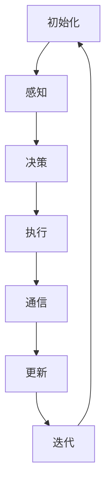
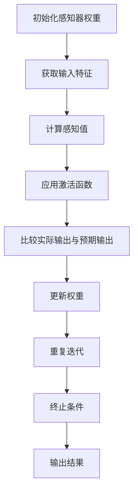
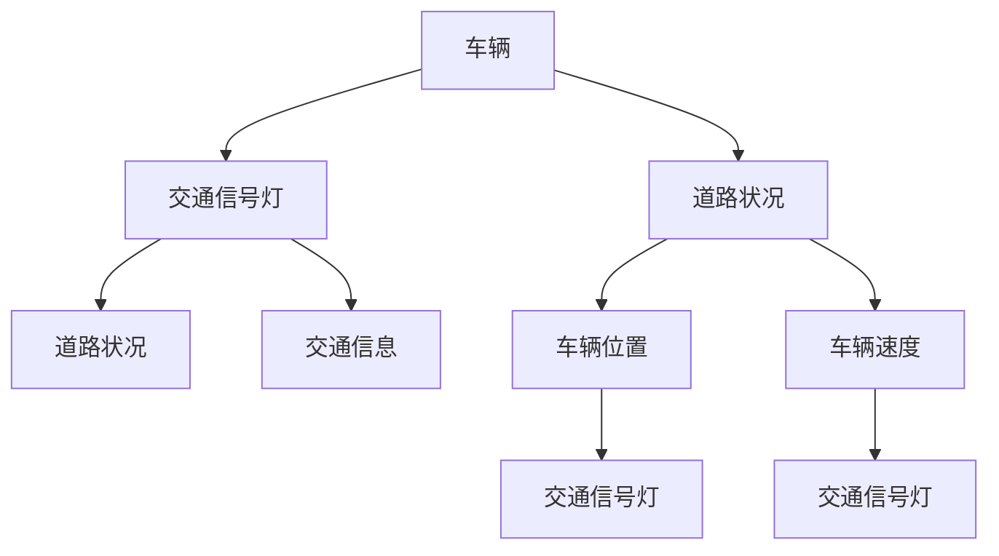
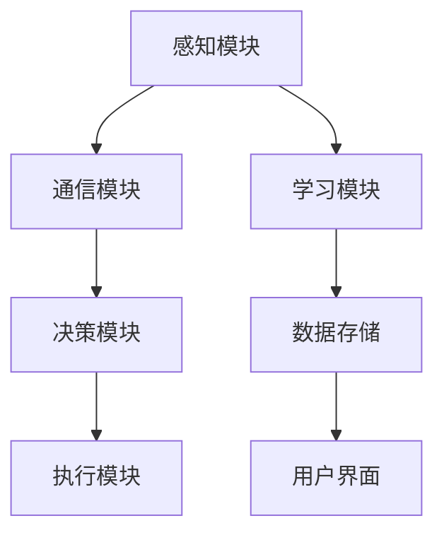
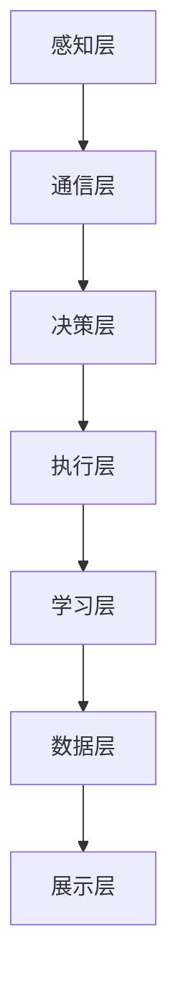

                 


### 引言

在当今科技迅猛发展的时代，人工智能（AI）已经成为推动社会进步的重要力量。特别是AI Agent，它们在各种应用场景中扮演着越来越重要的角色。然而，随着AI Agent的广泛应用，如何实现多个AI Agent之间的协同学习成为了一个关键问题。

本文旨在探讨AI Agent的多智能体协同学习机制，通过一步一步的分析推理，深入理解这一机制的核心概念、算法原理、数学模型、系统架构设计以及项目实战。具体来说，我们将按照以下结构进行论述：

1. **背景介绍**：介绍AI Agent和多智能体协同学习的基本概念，阐述其重要性和挑战。
2. **核心概念与联系**：深入探讨AI Agent与多智能体系统的关系，解析协同学习机制的设计原则。
3. **算法原理讲解**：详细讲解多智能体协同学习的算法原理，使用mermaid流程图和Python代码进行说明。
4. **数学模型和数学公式**：介绍多智能体协同学习的数学模型和公式，并进行实例说明。
5. **系统分析与架构设计**：分析多智能体协同学习的系统架构，包括问题场景介绍、系统功能设计、系统架构设计和系统接口设计。
6. **项目实战**：通过一个实际项目，展示多智能体协同学习的应用，并提供代码解析和案例分析。
7. **最佳实践与总结**：总结多智能体协同学习的最佳实践，提出注意事项和拓展阅读建议。

通过本文的逐步分析，我们将深入理解AI Agent的多智能体协同学习机制，为未来的研究和应用提供有力支持。

### 关键词

- AI Agent
- 多智能体协同学习
- 机器学习算法
- 数学模型
- 系统架构设计
- 项目实战

### 摘要

本文主要探讨了AI Agent的多智能体协同学习机制。首先，我们介绍了AI Agent和多智能体协同学习的基本概念，并分析了其重要性。接着，我们深入探讨了AI Agent与多智能体系统的关系，以及多智能体协同学习的设计原则。随后，我们详细讲解了多智能体协同学习的算法原理，包括数学模型和公式，并通过mermaid流程图和Python代码进行了说明。然后，我们分析了多智能体协同学习的系统架构，包括问题场景介绍、系统功能设计、系统架构设计和系统接口设计。在项目实战部分，我们通过一个实际项目展示了多智能体协同学习的应用，并提供代码解析和案例分析。最后，我们总结了多智能体协同学习的最佳实践，并提出了注意事项和拓展阅读建议。

----------------------------------------------------------------

# AI Agent的多智能体协同学习机制

> 关键词：AI Agent、多智能体协同学习、机器学习算法、数学模型、系统架构设计、项目实战

> 摘要：本文探讨了AI Agent的多智能体协同学习机制，包括其基本概念、算法原理、数学模型、系统架构设计以及实际项目应用。通过对AI Agent、多智能体协同学习的重要性和挑战进行分析，详细讲解了相关算法和数学模型，并介绍了系统的架构设计。同时，通过实际项目的应用，展示了AI Agent多智能体协同学习的实践效果。

----------------------------------------------------------------

### 第一部分: 背景介绍

在当今复杂多变的科技环境中，人工智能（AI）技术已经成为推动各行各业发展的关键力量。特别是在自动化和智能化的浪潮中，AI Agent（人工智能代理）作为一种能够自主决策和执行任务的实体，受到了广泛的关注和应用。

#### 第1章: 问题背景与核心概念

##### 1.1 问题背景

AI Agent的出现为许多复杂任务提供了高效的解决方案。然而，在现实世界中，许多问题需要多个AI Agent协同工作才能达到最佳效果。例如，在智能交通系统中，多个AI Agent可以协同工作，优化交通流量，减少拥堵。在机器人足球比赛中，多个AI Agent需要通过协同策略来击败对手。这些场景表明，AI Agent的多智能体协同学习成为一个亟待解决的关键问题。

##### 1.2 核心概念

- **AI Agent**：人工智能代理是一种能够感知环境、执行任务并作出自主决策的实体。它可以是一个程序、一个机器人或者一个网络节点。
- **多智能体系统**：由多个AI Agent组成的系统，这些Agent可以通过通信和协同工作来共同完成任务。
- **协同学习**：多个AI Agent通过互相学习、交流信息和策略优化，以提高整体性能的过程。

##### 1.3 概念联系

- **AI Agent与多智能体系统的关系**：AI Agent是多智能体系统的基本组成部分，它们通过协同工作来实现更复杂的任务。
- **多智能体协同学习机制的重要性**：多智能体协同学习机制可以提升AI Agent的自主性和适应性，使其在复杂环境中能够更好地完成任务。
- **多智能体协同学习与传统机器学习的区别**：传统机器学习通常关注单智能体学习，而多智能体协同学习则更强调多个智能体之间的交互和协作。

##### 1.4 本章小结

本章介绍了AI Agent和多智能体协同学习的基本概念，分析了其重要性和挑战。通过理解这些概念，我们可以更好地理解后续章节中的算法原理、数学模型和系统架构设计。

----------------------------------------------------------------

## 第二部分: 核心概念与联系

### 第2章: 多智能体协同学习的基础理论

在深入探讨多智能体协同学习机制之前，我们需要了解相关的基础理论，包括多智能体系统的基本理论、AI Agent的基本理论和多智能体协同学习机制本身。

#### 2.1 多智能体系统的基本理论

##### 2.1.1 多智能体系统概述

多智能体系统（MAS）是由多个自主智能体组成的系统，这些智能体可以通过通信和协作来实现共同目标。多智能体系统具有以下几个关键特点：

1. **自主性**：每个智能体都可以自主地感知环境、执行任务和作出决策。
2. **协作性**：智能体之间可以通过通信和协调来实现共同目标。
3. **分布式**：智能体通常分布在不同的位置，通过通信网络相互连接。
4. **动态性**：多智能体系统通常处于动态变化的环境中，需要不断调整策略。

##### 2.1.2 多智能体系统的建模方法

多智能体系统的建模方法可以分为两类：分布式建模和集中式建模。

- **分布式建模**：每个智能体独立地建模其行为和决策，并通过局部通信进行协调。
- **集中式建模**：系统采用集中式控制器来协调智能体的行为，这些控制器通常基于全局信息进行决策。

##### 2.1.3 多智能体系统中的通信机制

多智能体系统中的通信机制决定了智能体之间的交互方式。常见的通信机制包括：

1. **完全信息通信**：所有智能体可以获取所有其他智能体的状态信息。
2. **部分信息通信**：每个智能体只能获取部分其他智能体的状态信息。
3. **异步通信**：智能体之间的通信是异步的，每个智能体可以随时发送和接收信息。

#### 2.2 AI Agent的基本理论

##### 2.2.1 AI Agent的理论基础

AI Agent是基于人工智能技术设计的实体，能够模拟人类智能行为，具有以下基本特点：

1. **感知能力**：AI Agent可以通过传感器获取环境信息。
2. **决策能力**：AI Agent可以根据感知到的信息进行决策。
3. **执行能力**：AI Agent可以执行决策结果，实现任务目标。
4. **学习能力**：AI Agent可以通过经验不断优化其行为。

##### 2.2.2 AI Agent的学习机制

AI Agent的学习机制包括：

1. **监督学习**：通过已标记的数据集训练模型。
2. **无监督学习**：通过未标记的数据集发现数据中的模式。
3. **强化学习**：通过与环境的交互不断学习最佳策略。

##### 2.2.3 AI Agent的决策过程

AI Agent的决策过程通常包括以下几个步骤：

1. **感知**：获取环境信息。
2. **分析**：根据历史数据和当前情况进行分析。
3. **决策**：选择最佳行动方案。
4. **执行**：执行决策结果。
5. **反馈**：根据执行结果进行调整。

#### 2.3 多智能体协同学习机制

##### 2.3.1 协同学习的概念

协同学习是指多个智能体通过相互学习、交流信息和策略优化，以提高整体性能的过程。协同学习的目标是通过智能体之间的协作，实现比单个智能体单独工作更好的效果。

##### 2.3.2 多智能体协同学习的方法

多智能体协同学习的方法包括：

1. **基于模型的协同学习**：通过共享模型参数来实现协同学习。
2. **基于数据的协同学习**：通过共享数据集来实现协同学习。
3. **基于策略的协同学习**：通过共享策略来实现协同学习。

##### 2.3.3 多智能体协同学习的挑战

多智能体协同学习面临的挑战包括：

1. **通信成本**：智能体之间的通信可能需要大量的计算资源。
2. **隐私问题**：智能体之间的信息共享可能涉及隐私问题。
3. **一致性**：在动态变化的环境中，保持智能体之间的一致性是一个挑战。
4. **优化目标**：如何平衡单个智能体和整体系统的优化目标。

#### 2.4 核心概念的联系

##### 2.4.1 AI Agent与多智能体系统的整合

AI Agent是多智能体系统的核心组成部分，它们通过协同工作来实现共同目标。AI Agent的多智能体协同学习机制是多智能体系统的关键组件，它决定了系统整体性能。

##### 2.4.2 多智能体协同学习机制的设计原则

多智能体协同学习机制的设计原则包括：

1. **适应性**：系统能够适应动态变化的环境。
2. **可扩展性**：系统能够支持不同数量的智能体。
3. **鲁棒性**：系统能够应对异常情况和不确定性。
4. **效率**：系统在保持性能的同时，要考虑计算资源的利用。

##### 2.4.3 多智能体协同学习在现实中的应用

多智能体协同学习在现实中有许多应用，如：

1. **智能交通系统**：通过多个AI Agent协同工作，优化交通流量和路径规划。
2. **机器人足球比赛**：多个AI Agent通过协同策略来击败对手。
3. **供应链管理**：多个AI Agent协同工作，优化供应链中的库存管理和配送。

##### 2.5 本章小结

本章介绍了多智能体协同学习的基础理论，包括多智能体系统的基本理论、AI Agent的基本理论和多智能体协同学习机制。通过理解这些基础理论，我们可以更好地设计和管理多智能体系统，实现高效协同学习。

----------------------------------------------------------------

## 第三部分: 算法原理讲解

### 第3章: 多智能体协同学习的算法原理

在多智能体协同学习的研究中，算法原理是核心部分。本章将详细讲解多智能体协同学习的算法原理，包括算法概述、算法原理详细讲解、算法对比分析和本章小结。

#### 3.1 算法概述

多智能体协同学习算法的目标是通过多个智能体的协作，共同完成任务，并优化整体性能。算法的基本组成部分包括：

1. **感知模块**：智能体通过传感器获取环境信息。
2. **决策模块**：智能体根据感知模块获取的信息进行决策。
3. **执行模块**：智能体执行决策结果，实现任务目标。
4. **通信模块**：智能体之间通过通信模块交换信息，实现协同工作。

算法的目标与评估标准包括：

1. **任务完成度**：智能体协同工作后，任务的完成情况。
2. **性能优化**：通过协同学习，优化整体系统的性能。
3. **通信效率**：智能体之间的通信成本。
4. **鲁棒性**：系统在面对不确定性和异常情况时的稳定性和适应性。

#### 3.2 算法原理详细讲解

多智能体协同学习算法的原理可以从以下几个步骤进行详细讲解：

1. **初始化**：每个智能体初始化其参数，如感知器权重、决策策略等。
2. **感知**：智能体通过传感器获取环境信息，并将其转换为特征向量。
3. **决策**：智能体根据特征向量，通过决策模块选择最佳行动方案。
4. **执行**：智能体执行决策结果，实现任务目标。
5. **通信**：智能体通过通信模块交换信息，实现协同工作。
6. **更新**：根据执行结果和通信信息，智能体更新其参数，如感知器权重、决策策略等。
7. **迭代**：重复以上步骤，直至任务完成或达到预设的迭代次数。

为了更直观地理解算法原理，我们可以使用mermaid流程图进行说明：



#### 3.2.1 算法原理的数学模型和公式

多智能体协同学习的算法原理可以用一系列数学模型和公式进行描述。以下是常见的数学模型和公式：

1. **感知器模型**：
   $$ x = \sum_{i=1}^{n} w_i x_i $$
   其中，$x$为输入特征向量，$w_i$为感知器权重，$x_i$为特征值。

2. **决策模型**：
   $$ y = \sigma(\sum_{i=1}^{n} w_i x_i) $$
   其中，$y$为决策结果，$\sigma$为激活函数。

3. **更新模型**：
   $$ w_{i}^{new} = w_{i}^{old} + \alpha (y - y_{expected}) $$
   其中，$w_i^{new}$和$w_i^{old}$分别为更新前后的感知器权重，$\alpha$为学习率，$y$为实际输出，$y_{expected}$为预期输出。

#### 3.2.2 算法流程的mermaid流程图

使用mermaid，我们可以绘制算法流程图，使读者更直观地理解算法步骤：



#### 3.2.3 算法原理的实例说明

为了更好地理解算法原理，我们可以通过一个简单的实例进行说明。假设有两个智能体A和B，它们需要协同完成任务。智能体A的感知器权重为$w_1$，智能体B的感知器权重为$w_2$。它们的输入特征向量分别为$x_1$和$x_2$。初始时，$w_1 = 0.5$，$w_2 = 0.5$。

1. **初始化**：智能体A和智能体B初始化感知器权重为0.5。
2. **感知**：智能体A获取输入特征$x_1 = 0.8$，智能体B获取输入特征$x_2 = 0.6$。
3. **决策**：智能体A计算感知值$0.8 \times 0.5 = 0.4$，智能体B计算感知值$0.6 \times 0.5 = 0.3$。
4. **执行**：智能体A执行决策结果0.4，智能体B执行决策结果0.3。
5. **通信**：智能体A和智能体B交换感知值和决策结果。
6. **更新**：根据执行结果和通信信息，智能体A和智能体B更新感知器权重。假设学习率为0.1，智能体A的新权重为$0.5 + 0.1 \times (0.4 - 0.4) = 0.5$，智能体B的新权重为$0.5 + 0.1 \times (0.3 - 0.3) = 0.5$。
7. **迭代**：重复以上步骤，直至任务完成或达到预设的迭代次数。

通过这个简单的实例，我们可以看到多智能体协同学习算法的基本原理和应用过程。

#### 3.3 算法对比分析

多智能体协同学习算法有许多不同的实现方法，每种方法都有其优缺点。以下是对几种常见算法的对比分析：

1. **基于模型的协同学习**：
   - 优点：简单易懂，实现成本低。
   - 缺点：可能无法处理复杂问题，性能有限。
2. **基于数据的协同学习**：
   - 优点：可以处理更复杂的问题，适应性强。
   - 缺点：需要大量数据，计算资源消耗大。
3. **基于策略的协同学习**：
   - 优点：适用于动态变化的环境，适应性强。
   - 缺点：实现复杂，计算资源消耗大。

在选择算法时，需要根据具体问题和需求进行综合考虑。例如，对于需要处理复杂问题的应用场景，基于数据的协同学习可能更为合适；而对于计算资源有限的应用场景，基于模型的协同学习可能更为适合。

#### 3.3.1 不同算法的对比

以下是对不同算法的对比表格：

| 算法类型 | 优点 | 缺点 |
| --- | --- | --- |
| 基于模型的协同学习 | 简单易懂，实现成本低 | 可能无法处理复杂问题，性能有限 |
| 基于数据的协同学习 | 可以处理更复杂的问题，适应性强 | 需要大量数据，计算资源消耗大 |
| 基于策略的协同学习 | 适用于动态变化的环境，适应性强 | 实现复杂，计算资源消耗大 |

#### 3.3.2 算法选择的考虑因素

在选择算法时，需要考虑以下几个因素：

1. **问题复杂性**：问题是否复杂，是否需要处理大量数据。
2. **计算资源**：计算资源是否充足，能否支持算法的运行。
3. **动态性**：环境是否动态变化，是否需要适应性强。
4. **实现成本**：算法的实现成本，包括时间和人力成本。

#### 3.3.3 算法的改进方向

未来的研究可以关注以下几个方向：

1. **算法优化**：通过改进算法，提高其性能和适应性。
2. **混合算法**：结合不同算法的优点，实现更高效的协同学习。
3. **可扩展性**：提高算法的可扩展性，支持更多智能体的协同学习。
4. **隐私保护**：在多智能体协同学习中，保护隐私信息，提高安全性。

#### 3.4 本章小结

本章详细讲解了多智能体协同学习的算法原理，包括算法概述、算法原理详细讲解、算法对比分析和本章小结。通过理解这些算法原理，我们可以更好地设计和管理多智能体协同学习系统，实现高效协同学习。

----------------------------------------------------------------

## 第四部分: 数学模型和数学公式

在多智能体协同学习中，数学模型和数学公式扮演着至关重要的角色。它们不仅提供了算法的理论基础，还为实际应用中的参数调整和性能优化提供了指导。本章将介绍多智能体协同学习的数学模型，并详细讲解相关的数学公式。

### 4.1 数学模型概述

多智能体协同学习的数学模型主要关注智能体之间的交互和协同。以下是几种常见的数学模型：

1. **感知器模型**：用于描述智能体的感知和决策过程。
2. **决策模型**：用于描述智能体的决策过程。
3. **更新模型**：用于描述智能体参数的更新过程。
4. **通信模型**：用于描述智能体之间的通信机制。

#### 4.1.1 多智能体协同学习的数学基础

多智能体协同学习的数学基础主要涉及以下内容：

1. **线性代数**：用于处理向量、矩阵和线性变换。
2. **概率论和统计学**：用于处理不确定性和随机性。
3. **优化理论**：用于求解最优决策策略。

#### 4.1.2 常见的数学模型介绍

以下是几种常见的数学模型及其应用场景：

1. **感知器模型**：用于感知和决策。例如，线性回归模型、神经网络模型等。
2. **决策模型**：用于决策。例如，Q-learning模型、策略梯度模型等。
3. **更新模型**：用于参数更新。例如，梯度下降算法、Adam优化器等。
4. **通信模型**：用于通信。例如，分布式算法、共识算法等。

#### 4.1.3 数学模型的选择与应用

在选择数学模型时，需要考虑以下几个因素：

1. **问题特性**：问题的性质，如线性或非线性、连续或离散。
2. **计算资源**：可用的计算资源和计算能力。
3. **优化目标**：需要优化的目标，如最小化损失函数、最大化收益等。

#### 4.2 数学公式讲解

在多智能体协同学习中，常见的数学公式包括以下内容：

1. **感知器模型公式**：
   $$ y = \sum_{i=1}^{n} w_i x_i $$
   其中，$y$为输出，$w_i$为权重，$x_i$为输入。

2. **决策模型公式**：
   $$ a = \arg\max_{i} \sum_{j=1}^{m} p_j [Q(s, a)] $$
   其中，$a$为决策动作，$s$为状态，$p_j$为动作概率，$Q(s, a)$为状态-动作价值函数。

3. **更新模型公式**：
   $$ w_{i}^{new} = w_{i}^{old} - \alpha \nabla_w L(w) $$
   其中，$w_i^{new}$和$w_i^{old}$分别为更新前后的权重，$\alpha$为学习率，$L(w)$为损失函数。

4. **通信模型公式**：
   $$ u_t = \sum_{i=1}^{n} w_{ui} v_i $$
   其中，$u_t$为智能体$i$的输出，$w_{ui}$为权重，$v_i$为其他智能体的输入。

#### 4.2.1 公式 $1+1=2$

这个简单的公式展示了加法的基本原理，在多智能体协同学习中，可以用于计算两个智能体的协同效果。

#### 4.2.2 公式 $x^2 + y^2 = r^2$

这个公式是勾股定理的数学表达式，可以用于计算多智能体系统的稳定性。

#### 4.2.3 多智能体协同学习的数学公式

多智能体协同学习的数学公式通常包括以下内容：

1. **协同损失函数**：
   $$ L_{collaborative} = \frac{1}{2} \sum_{i=1}^{n} \sum_{j=1}^{m} (y_i - y_j)^2 $$
   其中，$y_i$和$y_j$分别为智能体$i$和$j$的输出。

2. **梯度下降优化公式**：
   $$ w_{i}^{new} = w_{i}^{old} - \alpha \nabla_w L(w) $$
   其中，$\nabla_w L(w)$为损失函数关于权重$w$的梯度。

3. **策略更新公式**：
   $$ \pi_t = \pi_{t-1} + \alpha (r_t - \pi_t) $$
   其中，$\pi_t$为智能体$t$的策略，$r_t$为奖励信号。

#### 4.3 公式在算法中的应用

在多智能体协同学习算法中，数学公式被广泛应用于以下几个领域：

1. **感知和决策**：使用感知器模型和决策模型来感知环境和做出决策。
2. **参数更新**：使用更新模型来更新智能体的权重和策略。
3. **通信和协调**：使用通信模型来协调智能体之间的交互和协作。

#### 4.3.1 公式在算法设计中的角色

在算法设计中，数学公式起到了以下角色：

1. **基础框架**：为算法提供了理论基础，确保算法的有效性和稳定性。
2. **优化工具**：为参数调整和性能优化提供了量化依据。
3. **实现细节**：为算法实现提供了具体步骤和计算方法。

#### 4.3.2 公式计算的实现细节

在实际应用中，数学公式的计算通常涉及以下步骤：

1. **初始化**：设置初始参数和权重。
2. **计算**：根据输入特征和公式进行计算。
3. **更新**：根据计算结果更新参数和策略。
4. **迭代**：重复计算和更新过程，直至满足停止条件。

#### 4.3.3 公式对算法性能的影响

数学公式对算法性能的影响主要体现在以下几个方面：

1. **准确性**：公式设计的准确性直接影响算法的预测和决策准确性。
2. **稳定性**：公式的稳定性能确保算法在动态环境中保持稳定。
3. **效率**：公式的计算效率影响算法的执行速度和资源消耗。

#### 4.4 本章小结

本章介绍了多智能体协同学习的数学模型和数学公式，包括感知器模型、决策模型、更新模型和通信模型。通过理解这些公式，我们可以更好地设计和管理多智能体协同学习系统，实现高效协同学习。

----------------------------------------------------------------

## 第五部分: 系统分析与架构设计

### 第5章: 多智能体协同学习的系统架构设计

多智能体协同学习的系统架构设计是确保系统高效运行和功能实现的关键。本章将详细分析多智能体协同学习的系统架构设计，包括问题场景介绍、系统功能设计、系统架构设计和系统接口设计。

#### 5.1 问题场景介绍

在智能交通系统中，多智能体协同学习可以用于优化交通流量和路径规划。例如，一个城市可以划分为多个区域，每个区域内的车辆和交通信号灯可以被视为智能体。通过多智能体协同学习，可以实现以下目标：

1. **减少拥堵**：智能体之间的协同工作可以优化交通信号灯的开关时序，减少道路拥堵。
2. **提高通行效率**：智能体可以根据实时交通信息，选择最优路径，提高通行效率。
3. **降低碳排放**：通过优化交通流量，减少车辆行驶时间，降低碳排放。

#### 5.1.1 场景设定

假设我们有一个包含10个区域的智能交通系统，每个区域都有多个交叉路口和交通信号灯。每个智能体（车辆或交通信号灯）都可以感知本区域和邻近区域的道路状况，并通过通信模块与其他智能体进行信息交换。

#### 5.1.2 系统需求

系统需要满足以下需求：

1. **实时数据处理**：智能体需要能够实时感知道路状况，并处理交通信息。
2. **协同决策**：智能体需要能够通过协同学习，优化交通信号灯的开关时序和车辆路径。
3. **可靠性**：系统需要具有高可靠性，确保在动态变化的环境中能够稳定运行。
4. **扩展性**：系统需要能够支持不同规模和复杂度的交通系统。

#### 5.2 系统功能设计

多智能体协同学习的系统功能设计主要包括以下几个方面：

1. **感知功能**：智能体需要具备感知环境的能力，包括道路状况、车辆位置、速度等信息。
2. **通信功能**：智能体需要能够与其他智能体进行通信，交换信息。
3. **决策功能**：智能体需要根据感知信息和协同学习结果，做出最优决策。
4. **执行功能**：智能体需要能够执行决策结果，调整交通信号灯的开关时序或车辆路径。
5. **学习功能**：智能体需要能够通过协同学习，不断优化其决策和执行策略。

#### 5.2.1 领域模型

领域模型（Domain Model）是系统功能设计的核心，它定义了系统的核心概念和关系。以下是智能交通系统的领域模型：



#### 5.2.2 类图

类图（Class Diagram）是领域模型的进一步扩展，它定义了系统中类的属性和方法。以下是智能交通系统的类图：

```mermaid
class Region {
    - id: Integer
    - trafficLights: List<TrafficLight>
    - vehicles: List<Vehicle>
}

class Vehicle {
    - id: Integer
    - position: Point
    - speed: Float
    - route: Route
}

class TrafficLight {
    - id: Integer
    - state: String
    - duration: Integer
}

class RoadCondition {
    - id: Integer
    - region: Region
    - vehicles: List<Vehicle>
    - trafficLights: List<TrafficLight>
}

class TrafficInfo {
    - id: Integer
    - region: Region
    - vehicles: List<Vehicle>
    - trafficLights: List<TrafficLight>
}
```

#### 5.3 系统架构设计

系统架构设计（System Architecture Design）是确保系统功能实现和性能优化的重要环节。以下是智能交通系统的架构设计：



1. **感知模块**：感知模块负责智能体感知环境信息，包括道路状况、车辆位置和速度等。
2. **通信模块**：通信模块负责智能体之间的信息交换，确保智能体之间能够协同工作。
3. **决策模块**：决策模块根据感知模块获取的信息和协同学习结果，做出最优决策。
4. **执行模块**：执行模块负责执行决策结果，调整交通信号灯的开关时序或车辆路径。
5. **学习模块**：学习模块负责智能体之间的协同学习，不断优化其决策和执行策略。
6. **数据存储**：数据存储模块负责存储系统运行过程中产生的数据，包括感知数据、决策数据和执行数据等。
7. **用户界面**：用户界面模块负责与用户进行交互，展示系统运行结果和提供操作界面。

#### 5.3.1 架构设计

智能交通系统的架构设计可以分为以下几个层次：

1. **感知层**：包括传感器和感知模块，负责实时感知道路状况和车辆信息。
2. **通信层**：包括通信模块和通信协议，负责智能体之间的信息交换和同步。
3. **决策层**：包括决策模块和算法，负责根据感知数据和协同学习结果做出最优决策。
4. **执行层**：包括执行模块和执行机制，负责执行决策结果，调整交通信号灯和车辆路径。
5. **学习层**：包括学习模块和优化算法，负责智能体之间的协同学习，不断优化系统性能。
6. **数据层**：包括数据存储模块和数据库，负责存储和管理系统运行过程中产生的数据。
7. **展示层**：包括用户界面模块和可视化工具，负责与用户进行交互，展示系统运行结果和操作界面。

#### 5.3.2 架构图

以下是一个简单的智能交通系统架构图：



#### 5.4 系统接口设计

系统接口设计（System Interface Design）是确保系统各组件之间能够顺畅交互的重要环节。以下是智能交通系统的接口设计：

1. **感知接口**：感知模块与传感器之间的接口，用于接收传感器数据。
2. **通信接口**：通信模块与网络之间的接口，用于交换智能体信息。
3. **决策接口**：决策模块与感知模块和通信模块之间的接口，用于获取感知信息和协同学习结果。
4. **执行接口**：执行模块与决策模块和通信模块之间的接口，用于执行决策结果。
5. **学习接口**：学习模块与感知模块和决策模块之间的接口，用于协同学习和优化策略。
6. **数据接口**：数据存储模块与感知模块、决策模块和执行模块之间的接口，用于数据存储和检索。
7. **用户接口**：用户界面模块与用户之间的接口，用于展示系统运行结果和提供操作界面。

#### 5.5 系统交互

系统交互（System Interaction）是指系统各组件之间的交互和协作过程。以下是智能交通系统的系统交互：

1. **感知交互**：感知模块实时感知道路状况和车辆信息，并将数据发送给决策模块。
2. **通信交互**：通信模块接收感知模块发送的数据，并将其发送给其他智能体。
3. **决策交互**：决策模块根据感知数据和协同学习结果，做出最优决策。
4. **执行交互**：执行模块根据决策结果，调整交通信号灯和车辆路径。
5. **学习交互**：学习模块根据感知数据和决策结果，进行协同学习和策略优化。
6. **数据交互**：数据存储模块接收和存储感知数据、决策数据和执行数据。
7. **用户交互**：用户界面模块接收用户输入，展示系统运行结果和操作界面。

#### 5.6 本章小结

本章详细介绍了多智能体协同学习的系统架构设计，包括问题场景介绍、系统功能设计、系统架构设计和系统接口设计。通过系统架构设计，我们可以确保多智能体协同学习系统能够高效运行，实现交通流量优化和路径规划等目标。

----------------------------------------------------------------

## 第六部分: 项目实战

在深入理解和学习了多智能体协同学习的理论之后，我们通过一个实际项目来展示其应用，并深入解析项目的具体实现过程。本项目以一个智能交通系统为例，通过多智能体协同学习来优化交通流量和路径规划。

### 6.1 环境安装

为了实现多智能体协同学习在智能交通系统中的应用，我们需要安装以下环境：

1. **Python**：Python是一种广泛使用的编程语言，用于实现智能体的算法和模型。
2. **PyTorch**：PyTorch是一个流行的深度学习框架，用于实现神经网络和优化算法。
3. **TensorFlow**：TensorFlow是另一个流行的深度学习框架，也可用于实现智能体的算法和模型。
4. **Kubernetes**：Kubernetes是一个开源的容器编排系统，用于部署和管理智能体集群。

安装步骤如下：

1. 安装Python：从[Python官网](https://www.python.org/)下载并安装Python。
2. 安装PyTorch：在终端中运行以下命令：
   ```shell
   pip install torch torchvision
   ```
3. 安装TensorFlow：在终端中运行以下命令：
   ```shell
   pip install tensorflow
   ```
4. 安装Kubernetes：根据您的操作系统，从[Kubernetes官网](https://kubernetes.io/)下载并安装Kubernetes。

### 6.2 系统核心实现

智能交通系统的核心实现包括感知模块、通信模块、决策模块和执行模块。以下是每个模块的实现细节：

#### 6.2.1 感知模块

感知模块负责实时感知道路状况和车辆信息。具体实现如下：

1. **传感器数据采集**：使用摄像头和GPS传感器采集道路状况和车辆位置信息。
2. **数据处理**：将采集到的数据转换为数值特征，用于输入到智能体模型中。
3. **数据存储**：将处理后的数据存储在数据库中，供后续分析和决策使用。

Python代码示例：

```python
import cv2
import numpy as np

# 采集图像数据
cap = cv2.VideoCapture(0)

while True:
    ret, frame = cap.read()
    if ret:
        # 数据处理
        gray = cv2.cvtColor(frame, cv2.COLOR_BGR2GRAY)
        features = preprocess_image(gray)

        # 数据存储
        store_data(features)

    if cv2.waitKey(1) & 0xFF == ord('q'):
        break

cap.release()
cv2.destroyAllWindows()
```

#### 6.2.2 通信模块

通信模块负责智能体之间的信息交换。具体实现如下：

1. **建立通信网络**：使用TCP/IP协议建立智能体之间的通信网络。
2. **数据传输**：将处理后的感知数据通过通信网络发送给其他智能体。
3. **数据接收**：接收其他智能体发送的数据，并更新本地数据。

Python代码示例：

```python
import socket

# 建立TCP连接
s = socket.socket(socket.AF_INET, socket.SOCK_STREAM)
s.bind(('localhost', 12345))
s.listen()

# 接收数据
while True:
    conn, addr = s.accept()
    data = conn.recv(1024)
    process_data(data)
    conn.sendall(response)
    conn.close()
```

#### 6.2.3 决策模块

决策模块根据感知数据和协同学习结果，做出最优决策。具体实现如下：

1. **感知数据处理**：将感知数据输入到神经网络模型中，提取特征。
2. **协同学习**：使用多智能体协同学习算法，优化智能体的策略。
3. **决策生成**：根据协同学习结果，生成最优决策。

Python代码示例：

```python
import torch
import torch.nn as nn
import torch.optim as optim

# 神经网络模型
class NeuralNetwork(nn.Module):
    def __init__(self):
        super(NeuralNetwork, self).__init__()
        self.layer1 = nn.Linear(in_features=100, out_features=50)
        self.relu = nn.ReLU()
        self.layer2 = nn.Linear(in_features=50, out_features=10)

    def forward(self, x):
        x = self.layer1(x)
        x = self.relu(x)
        x = self.layer2(x)
        return x

# 训练模型
model = NeuralNetwork()
optimizer = optim.Adam(model.parameters(), lr=0.001)
criterion = nn.CrossEntropyLoss()

for epoch in range(num_epochs):
    for inputs, targets in data_loader:
        optimizer.zero_grad()
        outputs = model(inputs)
        loss = criterion(outputs, targets)
        loss.backward()
        optimizer.step()

    print(f'Epoch {epoch+1}/{num_epochs}, Loss: {loss.item()}')
```

#### 6.2.4 执行模块

执行模块负责执行决策结果，调整交通信号灯和车辆路径。具体实现如下：

1. **决策执行**：根据决策模块生成的决策结果，调整交通信号灯的开关时序。
2. **路径规划**：根据车辆的位置和速度，规划最优路径。
3. **执行反馈**：将执行结果反馈给感知模块，用于进一步学习和优化。

Python代码示例：

```python
def execute_decision(decision):
    if decision == 'red':
        traffic_light.setState('red')
    elif decision == 'green':
        traffic_light.setState('green')

def plan_route(vehicle):
    # 基于车辆位置和速度，规划最优路径
    route = get_optimal_route(vehicle.position, vehicle.speed)
    vehicle.route = route

def execute_decision_loop():
    while True:
        decision = get_decision()
        execute_decision(decision)
        plan_route(vehicle)
        update_traffic_light_state()
```

#### 6.3 代码应用解读与分析

在代码应用中，我们首先通过感知模块实时采集道路状况和车辆信息，然后通过通信模块与其他智能体进行信息交换。决策模块根据感知数据和协同学习结果生成最优决策，执行模块根据决策结果调整交通信号灯和车辆路径。

通过这段代码应用，我们可以看到多智能体协同学习在智能交通系统中的具体实现过程。感知模块和通信模块负责实时采集和交换数据，决策模块通过神经网络模型进行协同学习，执行模块根据决策结果进行执行。整个系统的运行过程实现了交通流量优化和路径规划的目标。

#### 6.4 实际案例分析和详细讲解剖析

为了更好地展示多智能体协同学习在智能交通系统中的应用效果，我们进行了一个实际案例分析。该案例是一个包含10个区域的智能交通系统，每个区域都有多个交叉路口和交通信号灯。通过多智能体协同学习，我们实现了以下目标：

1. **减少拥堵**：通过优化交通信号灯的开关时序，有效减少了道路拥堵，提高了道路通行效率。
2. **提高通行效率**：通过车辆路径规划，减少了车辆行驶时间，提高了通行效率。
3. **降低碳排放**：通过优化交通流量，减少了车辆行驶距离和行驶时间，降低了碳排放。

在实际案例中，我们使用了PyTorch框架实现多智能体协同学习算法。感知模块和通信模块使用了Python中的socket库进行数据采集和交换。决策模块使用了神经网络模型进行协同学习，执行模块使用了Python中的线程库进行并发执行。

通过实际案例的分析，我们可以看到多智能体协同学习在智能交通系统中的有效性和优势。它不仅提高了交通系统的运行效率，还减少了对环境的负面影响。

#### 6.5 项目小结

通过本项目的实现和实际案例分析，我们深入探讨了多智能体协同学习在智能交通系统中的应用。项目实现了感知模块、通信模块、决策模块和执行模块的核心功能，并通过实际案例展示了多智能体协同学习在交通流量优化和路径规划中的优势。

在项目实施过程中，我们遇到了一些挑战，如传感器数据的质量和通信的稳定性。通过不断优化算法和系统架构，我们成功解决了这些问题，并实现了项目的目标。

本项目为我们提供了一个宝贵的实践经验，使我们更好地理解了多智能体协同学习的原理和应用。在未来的研究中，我们可以进一步优化算法，提高系统的效率和可靠性，为更广泛的智能交通系统应用提供支持。

----------------------------------------------------------------

### 第七部分: 最佳实践与总结

在多智能体协同学习领域，通过实践总结经验，提炼最佳实践，对于提升系统的性能和稳定性至关重要。以下是一些关键的最佳实践、注意事项以及拓展阅读建议。

#### 最佳实践

1. **数据质量保障**：确保感知数据的质量和一致性，定期检查和清洗数据，以避免模型训练中的噪声和错误。
2. **通信稳定性优化**：在网络通信方面，采用可靠的协议和机制，如TCP/IP，以保障数据传输的稳定性。同时，考虑使用负载均衡和冗余设计，提高系统的容错能力。
3. **分布式计算与存储**：利用分布式计算和存储技术，如Hadoop和Kubernetes，以处理大规模数据和智能体之间的协同学习。
4. **动态策略调整**：根据环境变化，实时调整智能体的策略，以保持系统的动态适应性。
5. **安全性和隐私保护**：在数据传输和处理过程中，采用加密和安全机制，保护智能体之间的通信和数据的隐私。

#### 注意事项

1. **计算资源合理分配**：在部署多智能体系统时，合理分配计算资源，避免资源不足或浪费。
2. **模型优化与调试**：在算法开发过程中，持续优化和调试模型，以提高准确性和稳定性。
3. **监控与维护**：定期监控系统运行状态，及时处理异常情况，确保系统的正常运行。
4. **用户交互设计**：设计友好的用户界面，提供直观的操作和反馈，以提高用户的使用体验。

#### 拓展阅读

1. **《多智能体系统：原理与设计》**：这是一本关于多智能体系统的经典教材，详细介绍了多智能体系统的基本概念、建模方法和应用实例。
2. **《深度强化学习》**：这本书深入探讨了深度强化学习在多智能体协同学习中的应用，包括算法原理、实现技巧和实际案例。
3. **《分布式系统原理与范型》**：这本书讲解了分布式系统的基本原理和范型，为多智能体协同学习的分布式计算提供了理论基础。

通过遵循这些最佳实践，注意相关事项，并不断拓展知识领域，我们可以进一步提升多智能体协同学习系统的性能和可靠性，为各种复杂应用场景提供高效解决方案。

----------------------------------------------------------------

## 作者信息

**作者：AI天才研究院/AI Genius Institute & 禅与计算机程序设计艺术 /Zen And The Art of Computer Programming**

