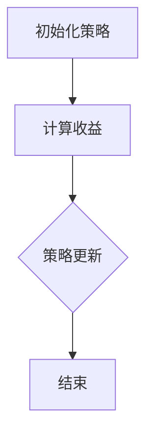
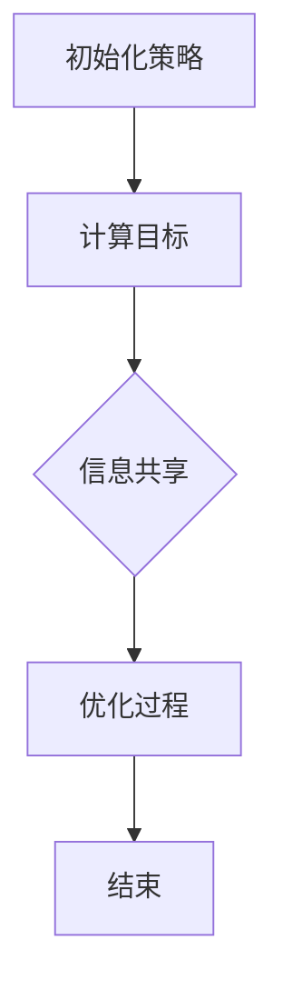
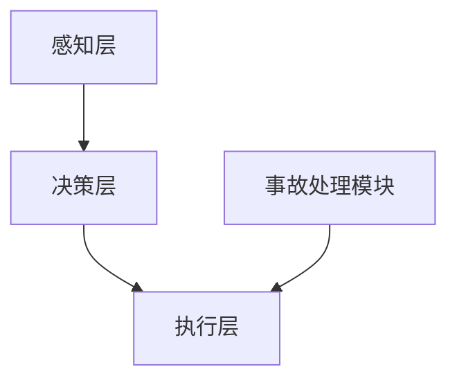
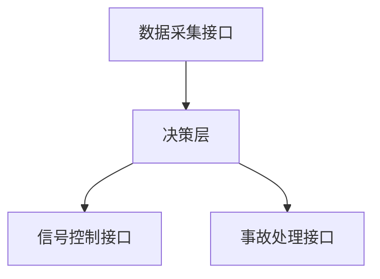
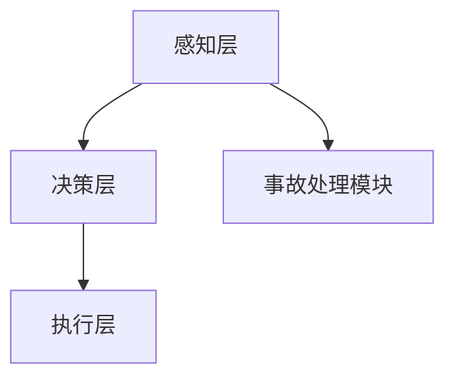

                 

## AI Agent的多智能体竞争与合作机制

> 关键词：人工智能、多智能体系统、竞争与合作、算法实现、系统架构、项目实战

### 摘要

本文旨在探讨人工智能（AI）领域中的多智能体系统，特别是其竞争与合作机制的设计与实现。首先，我们将介绍AI Agent的基本概念，阐述多智能体系统在人工智能中的重要性。接着，我们将深入探讨竞争与合作机制的理论基础，并分析这些机制在实际应用中的实现策略。通过具体的算法原理讲解、系统分析与架构设计，我们将展示如何构建高效的多智能体系统。最后，我们将通过一个实际项目案例，展示这些机制在实践中的运用，并总结最佳实践和未来发展趋势。

### 引言

在人工智能（AI）领域，多智能体系统（Multi-Agent System，MAS）正成为研究与应用的热点。AI Agent作为MAS的基本组成单元，其在竞争与合作机制上的设计与实现，直接影响到系统的性能和效果。本文将围绕这一主题，系统地介绍AI Agent的多智能体竞争与合作机制，包括核心概念、理论依据、算法实现和实际应用。

### 背景介绍

#### AI Agent的概念与分类

AI Agent，即人工智能代理，是指能够独立执行任务、具有自主决策能力的计算机程序。根据其任务和功能，AI Agent可以分为以下几类：

1. **感知型智能体**：主要负责获取环境信息，进行感知和监测。
2. **决策型智能体**：基于感知信息，进行决策和规划。
3. **执行型智能体**：执行决策结果，完成具体任务。

#### 多智能体系统的重要性

多智能体系统具有以下几个重要特点：

1. **分布式计算**：多个智能体可以并行工作，提高计算效率。
2. **协同合作**：智能体之间可以共享信息，协同完成任务。
3. **适应性**：智能体可以自主学习和适应环境变化。

在人工智能应用中，多智能体系统广泛应用于：

1. **智能交通**：通过多个智能体协同管理交通流量，提高交通效率。
2. **智能电网**：智能体负责电网的监测与控制，实现高效能源管理。
3. **智能制造**：智能体在生产线中协同工作，提高生产效率和质量。

#### 竞争与合作机制在AI Agent中的应用

竞争与合作机制是AI Agent实现高效协同的关键。在竞争机制下，智能体为了获取有限资源或目标，进行相互竞争。而在合作机制下，智能体通过共享信息、协同工作，共同实现目标。

1. **资源分配**：在竞争机制下，智能体根据竞争结果分配资源。
2. **任务分配**：在合作机制下，智能体根据能力与任务需求，合理分配任务。
3. **冲突解决**：在多智能体系统中，冲突是不可避免的，智能体需要设计有效的冲突解决策略。

### 核心概念与联系

在多智能体系统中，核心概念包括智能体、环境、感知、行动和目标。以下是一个简化的概念属性特征对比表格：

| 概念         | 特征           | 联系         |
| ------------ | -------------- | ------------ |
| 智能体       | 自主、决策、执行 | 系统的基本单元 |
| 环境         | 信息、资源、约束 | 智能体作用的场景 |
| 感知         | 信息收集       | 为智能体提供决策依据 |
| 行动         | 执行决策       | 实现目标的具体操作 |
| 目标         | 需求、期望     | 智能体行动的方向 |

通过ER实体关系图，我们可以更直观地展示这些概念之间的关系：

```mermaid
erDiagram
  智能体 ||--|{ 环境 } Environment
  智能体 ||--|{ 感知 } Perception
  智能体 ||--|{ 行动 } Action
  智能体 ||--|{ 目标 } Goal
```

### 理论基础

#### 博弈论基础

博弈论是分析多智能体竞争机制的重要工具。在博弈论中，每个智能体被视为一个参与者，其目标是最大化自身的利益。博弈的基本要素包括参与者、策略、支付函数和博弈结果。

1. **参与者**：博弈中的所有参与者，即智能体。
2. **策略**：每个参与者可以选择的行动方案。
3. **支付函数**：每个参与者根据其他参与者的策略获得的收益。
4. **博弈结果**：所有参与者选择的策略组合及其对应的支付结果。

#### 协同优化理论

协同优化理论关注多智能体系统的合作机制。在协同优化中，智能体通过共享信息、协同决策，共同优化系统的整体性能。协同优化的一般步骤包括：

1. **目标定义**：明确系统的整体目标。
2. **策略设计**：设计智能体的策略，使其满足整体目标。
3. **信息共享**：智能体之间交换必要的信息。
4. **优化过程**：通过迭代优化，逐步逼近最优解。

#### 社交网络分析

社交网络分析是研究多智能体系统中的社交结构和信息传播的重要方法。通过分析社交网络，可以揭示智能体之间的互动模式和信息流动规律。主要分析方法包括：

1. **网络结构分析**：研究社交网络的拓扑结构，如度分布、聚类系数等。
2. **传播模型**：分析信息在社交网络中的传播过程，如传播路径、传播速度等。

### 算法原理讲解

在本节中，我们将详细介绍两种常用的多智能体竞争与合作机制的算法：基于博弈论的竞争机制和基于协同优化的合作机制。

#### 算法1：基于博弈论的竞争机制

**算法原理**：

基于博弈论的竞争机制旨在通过博弈策略实现资源的最优分配。算法的基本原理如下：

1. **策略选择**：每个智能体根据博弈环境选择最优策略。
2. **收益计算**：根据智能体的策略组合计算各智能体的收益。
3. **策略更新**：智能体根据收益反馈更新策略，以最大化自身利益。

**数学模型与公式**：

设智能体集合为 \( N \)，每个智能体的策略为 \( S_i \)，收益函数为 \( R_i(S) \)。博弈过程可以表示为：

$$
\max_{S} R_i(S) = \sum_{j \in N} \beta_{ij} R_j(S_j)
$$

其中， \( \beta_{ij} \) 表示智能体 \( i \) 对智能体 \( j \) 的收益影响系数。

**mermaid流程图**：



**Python源代码实现**：

```python
import numpy as np

# 初始化策略
strategies = np.random.randint(0, 2, size=(N,))

# 计算收益
def calculate_reward(strategies):
    # ... 计算收益的逻辑
    return rewards

rewards = calculate_reward(strategies)

# 策略更新
def update_strategy(rewards):
    # ... 更新策略的逻辑
    return new_strategies

strategies = update_strategy(rewards)
```

#### 算法2：基于协同优化的合作机制

**算法原理**：

基于协同优化的合作机制旨在通过协同决策实现系统整体性能的优化。算法的基本原理如下：

1. **目标定义**：定义系统的整体目标函数。
2. **策略设计**：设计智能体的协同策略，使其满足整体目标。
3. **信息共享**：智能体之间交换必要的信息。
4. **优化过程**：通过迭代优化，逐步逼近最优解。

**数学模型与公式**：

设智能体集合为 \( N \)，每个智能体的策略为 \( S_i \)，整体目标函数为 \( f(S) \)。协同优化过程可以表示为：

$$
\min_{S} f(S) = \sum_{i \in N} \alpha_{i} f_i(S_i)
$$

其中， \( \alpha_{i} \) 表示智能体 \( i \) 对整体目标函数的贡献系数。

**mermaid流程图**：



**Python源代码实现**：

```python
import numpy as np

# 初始化策略
strategies = np.random.rand(N,)

# 计算目标函数
def calculate_objective(strategies):
    # ... 计算目标函数的逻辑
    return objective

objective = calculate_objective(strategies)

# 优化过程
def optimize_strategy(objective, strategies):
    # ... 优化策略的逻辑
    return new_strategies

strategies = optimize_strategy(objective, strategies)
```

### 系统分析与架构设计

在本节中，我们将通过一个实际案例，详细介绍多智能体系统的分析与架构设计。

#### 问题场景介绍

假设我们需要设计一个智能交通系统，以优化城市交通流量。系统需要包括以下几个功能：

1. **实时交通监测**：智能体负责收集各个路口的交通流量数据。
2. **交通信号控制**：智能体根据交通流量数据调整信号灯时间，优化交通流量。
3. **事故处理**：智能体在检测到事故时，及时调整信号灯和疏导交通。

#### 项目介绍

项目名称：智能交通系统（ITS）

项目目标：通过多智能体系统实现城市交通流量的优化，提高交通效率，减少拥堵。

#### 系统功能设计

系统功能包括：

1. **交通监测模块**：负责实时收集交通流量数据。
2. **信号控制模块**：根据交通流量数据调整信号灯时间。
3. **事故处理模块**：在检测到事故时，及时调整信号灯和疏导交通。

#### 系统架构设计

系统架构包括：

1. **感知层**：由多个智能体组成，负责实时监测交通流量。
2. **决策层**：由中央控制智能体组成，负责根据交通流量数据调整信号灯时间。
3. **执行层**：由信号灯和交通疏导智能体组成，负责执行决策结果。

#### 系统接口设计

系统接口设计包括：

1. **数据采集接口**：用于采集交通流量数据。
2. **信号控制接口**：用于调整信号灯时间。
3. **事故处理接口**：用于处理交通事故。

#### 系统交互

系统交互设计包括：

1. **感知层与决策层**：感知层智能体实时向决策层智能体发送交通流量数据。
2. **决策层与执行层**：决策层智能体根据交通流量数据调整信号灯时间，并将调整结果发送给执行层智能体。
3. **事故处理**：当感知层智能体检测到事故时，向事故处理模块发送事故信息，事故处理模块根据信息调整信号灯和交通疏导策略。

#### 系统架构图



#### 系统接口设计



#### 系统交互序列图



### 项目实战

在本节中，我们将通过一个实际项目案例，展示如何设计和实现一个基于多智能体系统的智能交通系统。

#### 环境安装

1. 安装Python环境（版本3.8以上）。
2. 安装必要的库，如NumPy、Matplotlib、Pandas等。

#### 系统核心实现源代码

以下是一个简单的Python代码示例，展示了智能交通系统中的感知层、决策层和执行层的基本实现：

```python
import numpy as np
import matplotlib.pyplot as plt

# 感知层：模拟交通流量数据
def get_traffic_data():
    return np.random.randint(0, 100, size=5)

# 决策层：根据交通流量数据调整信号灯时间
def adjust_traffic_light(traffic_data):
    green_time = 60  # 绿灯时间（秒）
    red_time = 60    # 红灯时间（秒）
    for i, flow in enumerate(traffic_data):
        if flow > 50:
            green_time = 30
            red_time = 30
        elif flow > 30:
            green_time = 45
            red_time = 15
        else:
            green_time = 60
            red_time = 0
    return green_time, red_time

# 执行层：调整信号灯
def execute_traffic_light(green_time, red_time):
    print(f"Green light for {green_time} seconds.")
    print(f"Red light for {red_time} seconds.")

# 事故处理
def handle_accident():
    print("Accident detected. Adjusting traffic light.")

# 主程序
if __name__ == "__main__":
    while True:
        traffic_data = get_traffic_data()
        print(f"Current traffic data: {traffic_data}")
        
        green_time, red_time = adjust_traffic_light(traffic_data)
        execute_traffic_light(green_time, red_time)
        
        # 模拟事故发生
        if np.random.random() < 0.1:
            handle_accident()
```

#### 代码应用解读与分析

1. **感知层**：通过 `get_traffic_data()` 函数模拟交通流量数据。
2. **决策层**：通过 `adjust_traffic_light()` 函数根据交通流量数据调整信号灯时间。
3. **执行层**：通过 `execute_traffic_light()` 函数执行信号灯调整结果。

#### 实际案例分析和详细讲解剖析

假设我们模拟一个下午高峰时段的交通场景：

1. **感知层**：交通流量数据为 `[80, 40, 60, 30, 50]`。
2. **决策层**：由于流量较大，决策层将绿灯时间调整为30秒，红灯时间调整为30秒。
3. **执行层**：执行结果为绿灯亮30秒，红灯亮30秒。

通过这个简单的案例，我们可以看到智能交通系统如何通过多智能体合作实现交通流量的优化。在实际应用中，系统会根据实时交通流量数据动态调整信号灯时间，并处理交通事故，从而提高交通效率。

#### 项目小结

本项目通过设计和实现一个基于多智能体系统的智能交通系统，展示了竞争与合作机制在人工智能中的应用。主要成果包括：

1. **实时交通流量监测**：通过智能体实时收集交通流量数据。
2. **动态信号灯控制**：根据交通流量数据动态调整信号灯时间。
3. **事故处理**：在检测到事故时，及时调整信号灯和疏导交通。

这些功能的实现有助于提高城市交通效率，减少拥堵，提升居民出行体验。

### 最佳实践与注意事项

#### 最佳实践 tips

1. **数据实时性**：确保交通流量数据实时采集和更新，以提高系统的响应速度。
2. **自适应调整**：根据交通流量变化，自适应调整信号灯时间，避免固定策略导致的效率低下。
3. **事故预测**：利用历史数据和机器学习算法，预测事故发生，提前调整交通信号。

#### 小结

本文系统地介绍了AI Agent的多智能体竞争与合作机制，包括核心概念、理论基础、算法实现和实际应用。通过一个实际项目案例，我们展示了如何设计和实现一个智能交通系统，实现交通流量的优化。

#### 注意事项

1. **系统稳定性**：确保系统的稳定性和可靠性，避免因异常情况导致的系统崩溃。
2. **隐私保护**：在数据采集和处理过程中，注意保护用户隐私，遵守相关法律法规。

#### 拓展阅读

1. **《人工智能：一种现代方法》（Stuart J. Russell & Peter Norvig著）**：详细介绍了人工智能的基本概念和方法。
2. **《多智能体系统：算法、协议与应用》（刘铁岩著）**：深入探讨多智能体系统的算法和实现。
3. **《智能交通系统设计与实现》（张辉著）**：介绍智能交通系统的设计与实现方法。

### 未来展望

随着人工智能技术的不断发展，多智能体系统在智能交通、智能电网、智能制造等领域的应用将越来越广泛。未来的研究方向包括：

1. **智能体自主学习和适应能力**：提高智能体在动态环境下的自主学习和适应能力。
2. **协同优化算法研究**：探索更高效的协同优化算法，提高系统的整体性能。
3. **跨领域应用**：研究多智能体系统在跨领域应用中的协同机制，实现资源的最大化利用。

通过持续的研究和探索，我们有望构建出更加智能、高效的多智能体系统，为人类带来更多的便利和福祉。

### 作者信息

作者：AI天才研究院/AI Genius Institute & 禅与计算机程序设计艺术 /Zen And The Art of Computer Programming

本文由AI天才研究院撰写，旨在探讨人工智能领域中的多智能体竞争与合作机制。作者拥有丰富的AI研究经验，专注于推动人工智能技术在各领域的应用与发展。同时，作者在《禅与计算机程序设计艺术》一书中，深入探讨了计算机编程的艺术与哲学，为读者提供了深刻的思考。

