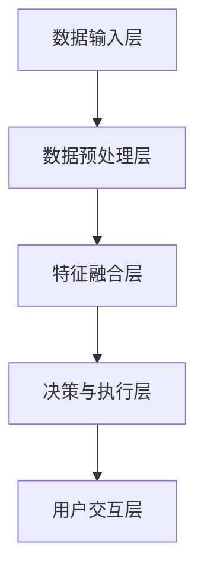
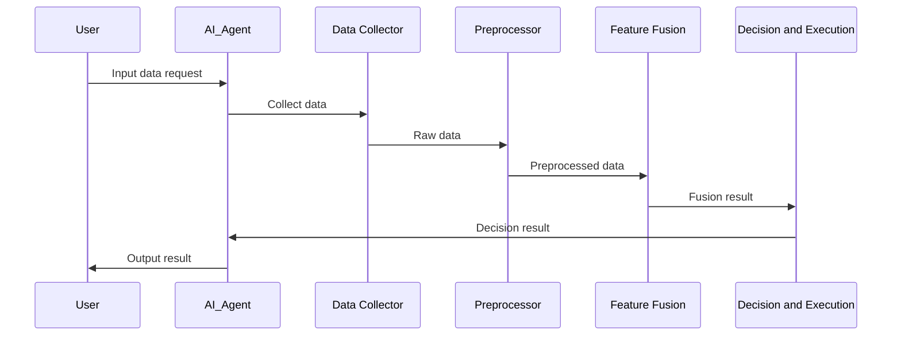

                 

# AI Agent的多模态融合学习技术

## 关键词

- AI Agent
- 多模态融合学习
- 深度学习
- 强化学习
- 数学模型
- 系统架构设计
- 项目实战

## 摘要

本文将深入探讨AI Agent的多模态融合学习技术，从背景介绍、核心概念、算法原理、系统分析与架构设计、项目实战到最佳实践等多个方面进行详细阐述。通过本文的阅读，读者将全面了解AI Agent的定义、多模态融合学习的重要性及其在现实中的应用，掌握多模态感知技术、数据融合算法和模型训练的方法，并了解如何进行系统架构设计和项目实施。本文旨在为AI领域的研究者和开发者提供有价值的理论和实践指导。

## 目录大纲设计思路

在设计《AI Agent的多模态融合学习技术》的目录大纲时，我们遵循以下原则：

1. **明确书的核心主题**：首先明确本书的核心主题，即“AI Agent的多模态融合学习技术”。这一主题涵盖了AI Agent的定义、多模态融合学习的概念、技术原理以及实际应用。

2. **结构化章节内容**：将内容结构化，确保每个章节都有明确的主题和目标。我们将章节划分为以下几个部分：
   - 背景介绍：介绍AI Agent和
### 第一部分：背景介绍

## 第1章：AI Agent与多模态融合学习概述

### 1.1 AI Agent的定义与作用

AI Agent，即人工智能代理，是一种能够在特定环境和目标下自主执行任务的计算机程序。它基于人工智能技术，具备感知、决策和执行能力。AI Agent不仅能够在静态环境中工作，还能在动态环境中自主学习和适应，从而提高任务的完成效率和准确性。

AI Agent的作用主要体现在以下几个方面：

1. **自动化任务处理**：AI Agent能够自动化完成重复性高、复杂性低的任务，减轻人类的工作负担。
2. **决策支持**：在复杂的决策场景中，AI Agent能够通过分析大量数据，提供科学的决策建议。
3. **个性化服务**：AI Agent可以根据用户的历史行为和偏好，提供个性化的服务和推荐。
4. **智能交互**：AI Agent能够理解人类语言，实现自然语言交互，提升人机交互体验。

### 1.2 多模态融合学习的概念

多模态融合学习是指将来自不同感知模态的数据（如视觉、听觉、触觉等）进行整合，以获得更全面、更准确的信息。这种技术能够提高AI Agent的感知能力，使其在复杂环境中做出更明智的决策。

多模态融合学习的核心概念包括：

1. **感知模态**：指人类通过视觉、听觉、触觉等感官方式获取信息的方式。
2. **数据融合**：将来自不同模态的数据进行整合，形成统一的特征表示。
3. **学习模型**：利用深度学习、强化学习等算法，从多模态数据中学习有效的特征表示和决策策略。

### 1.3 多模态融合学习的必要性

在现实世界中，信息通常是多模态的，单一模态的信息可能无法完全反映问题的本质。例如，在自动驾驶场景中，仅使用视觉信息可能无法准确识别道路标志，但结合视觉和雷达信息，可以更准确地识别环境。因此，多模态融合学习在提升AI Agent的感知能力、决策准确性和鲁棒性方面具有重要意义。

具体来说，多模态融合学习的必要性体现在以下几个方面：

1. **提高感知能力**：多模态融合学习能够整合不同模态的信息，提升AI Agent对环境的感知能力。
2. **增强决策能力**：多模态信息能够提供更丰富的上下文，有助于AI Agent做出更明智的决策。
3. **提高鲁棒性**：在面对复杂和动态环境时，多模态融合学习能够提高AI Agent的适应能力和稳定性。
4. **拓宽应用场景**：多模态融合学习能够使AI Agent在更多领域发挥作用，如医疗诊断、人机交互、智能交通等。

### 1.4 多模态融合学习的挑战

虽然多模态融合学习具有巨大的潜力，但在实际应用中仍面临诸多挑战：

1. **数据收集与预处理**：多模态数据通常具有不同的数据格式、维度和噪声，如何高效地收集、预处理和整合这些数据是一个重要问题。
2. **特征表示**：如何有效地将多模态数据转换为统一的特征表示，以便后续的学习和推理。
3. **算法选择与优化**：不同模态的数据可能具有不同的特性，如何选择合适的算法对多模态数据进行融合是一个关键问题。
4. **实时性与资源约束**：在实际应用中，多模态融合学习需要满足实时性和资源约束的要求，这对算法的效率和性能提出了更高的要求。
5. **模型解释性**：多模态融合学习模型的复杂度高，如何提高模型的解释性，使其更易于理解和接受是一个挑战。

通过对这些挑战的深入研究和解决，多模态融合学习有望在人工智能领域发挥更加重要的作用。

### 1.5 本章小结

本章介绍了AI Agent和多模态融合学习的基本概念，包括AI Agent的定义与作用，多模态融合学习的必要性以及面临的挑战。通过对本章的学习，读者将建立对AI Agent和多模态融合学习的初步认识，为后续章节的学习打下基础。

## 第2章：AI Agent的发展历程与技术演进

### 2.1 AI Agent的早期发展

AI Agent的概念最早可以追溯到20世纪50年代，当时人工智能（AI）领域刚刚起步。早期的研究主要集中在如何让计算机模拟人类的智能行为。1956年，在达特茅斯会议上，人工智能被正式提出，标志着AI研究的开始。随后，专家系统和知识表示方法成为AI研究的热点。

AI Agent的早期发展主要包括以下方面：

1. **专家系统**：专家系统是一种模拟人类专家决策能力的计算机程序。它通过获取和表示专家知识，利用推理机制进行问题求解。早期的专家系统如Dendral、MYCIN等，为AI Agent的研究奠定了基础。
2. **知识表示与推理**：知识表示和推理是AI Agent的核心技术。早期的知识表示方法主要包括基于产生式的表示、框架表示和语义网络表示。推理方法则包括正向推理、反向推理和混合推理。
3. **模拟环境**：早期的AI Agent主要在模拟环境中进行实验，如机器人仿真、游戏仿真等。这些模拟环境为AI Agent的研究提供了重要的实验平台。

### 2.2 中期发展的关键技术

随着AI技术的不断进步，AI Agent在20世纪80年代和90年代取得了显著的进展。中期发展的关键技术主要包括：

1. **机器学习**：机器学习的出现使得AI Agent从依赖人工设计的规则和知识向自动学习方向转变。早期的机器学习方法如决策树、支持向量机、朴素贝叶斯等，为AI Agent的研究提供了新的思路。
2. **自然语言处理**：自然语言处理技术的发展使得AI Agent能够理解和生成自然语言，实现了更高级的人机交互。早期的自然语言处理技术主要包括分词、词性标注、句法分析等。
3. **图像识别**：计算机视觉技术的发展使得AI Agent能够对图像进行识别和理解。早期的图像识别技术主要包括特征提取、模板匹配和神经网络等。
4. **机器人技术**：机器人的广泛应用使得AI Agent从理论走向实践，成为实际应用中的重要组成部分。早期的机器人技术主要包括机械结构设计、传感器融合和自主导航等。

### 2.3 现代AI Agent的关键技术

进入21世纪，AI Agent的研究取得了长足的进展，现代AI Agent的关键技术主要包括：

1. **深度学习**：深度学习在图像识别、语音识别、自然语言处理等领域的应用取得了显著的成果。深度神经网络（DNN）、卷积神经网络（CNN）、循环神经网络（RNN）等深度学习模型为AI Agent的研究提供了强大的工具。
2. **强化学习**：强化学习在游戏、自动驾驶、机器人控制等领域的应用取得了突破。通过学习策略，AI Agent能够实现自主决策和优化行为。
3. **多模态融合学习**：多模态融合学习将不同模态的数据进行整合，提高了AI Agent的感知能力和决策能力。多模态融合学习在智能交通、医疗诊断、人机交互等领域的应用前景广阔。
4. **大数据与云计算**：大数据和云计算为AI Agent提供了丰富的数据资源和计算能力，使得AI Agent能够更好地处理海量数据和复杂任务。

### 2.4 未来AI Agent的发展趋势

随着技术的不断进步，未来AI Agent将朝着更加智能化、自适应化和人性化的方向发展。以下是未来AI Agent的发展趋势：

1. **更高级的智能水平**：通过深度学习、强化学习等技术的进一步发展，AI Agent将具备更高级的智能水平，能够处理更加复杂和动态的任务。
2. **跨模态交互**：AI Agent将能够实现跨模态交互，不仅能够理解人类语言，还能感知和理解其他模态的信息，实现更丰富、更自然的交互。
3. **自主决策与协作**：AI Agent将具备更强的自主决策能力，能够在不同环境和任务中自主学习和适应。同时，AI Agent还将能够与其他AI Agent或人类进行协作，实现更高效、更智能的任务完成。
4. **伦理与安全性**：随着AI Agent的广泛应用，伦理和安全问题将日益突出。未来AI Agent的发展将注重伦理和安全性，确保其能够符合道德规范，并保护用户隐私和数据安全。

### 2.5 本章小结

本章回顾了AI Agent的发展历程，从早期的专家系统和知识表示方法，到中期发展的机器学习、自然语言处理和图像识别技术，再到现代的深度学习、强化学习和多模态融合学习技术。通过对AI Agent的发展历程的了解，读者将更好地理解AI Agent的演变过程和技术演进趋势，为后续章节的学习打下基础。

### 第3章：多模态融合学习的理论基础

#### 3.1 多模态数据的特点

多模态数据是指同时包含多种感知模态（如视觉、听觉、触觉等）的数据。这些数据通常具有以下特点：

1. **多样性**：多模态数据来源于不同的感知模态，如视觉、听觉、触觉等，因此具有多样性。不同模态的数据在数据类型、数据维度、数据格式等方面可能存在差异。
2. **互补性**：不同模态的数据通常能够提供互补的信息。例如，视觉信息可以提供物体的外观特征，听觉信息可以提供声音特征，触觉信息可以提供物体的质感信息。多模态数据融合能够充分利用这些互补信息，提高信息获取的全面性和准确性。
3. **时空关联性**：多模态数据通常具有时空关联性。例如，在视频数据中，视觉信息和音频信息可能在时间上同步，或在空间上相关。这种时空关联性对于多模态数据融合具有重要的意义。
4. **噪声和不确定性**：多模态数据在采集和处理过程中可能受到噪声和不确定性的影响。例如，视觉数据可能受到光照变化和遮挡的影响，音频数据可能受到环境噪声的影响。因此，在多模态数据融合过程中，需要考虑噪声和不确定性，提高数据融合的鲁棒性。

#### 3.2 多模态数据融合的方法

多模态数据融合是指将来自不同感知模态的数据进行整合，形成统一的特征表示。多模态数据融合的方法主要包括以下几种：

1. **数据级融合**：数据级融合是指在数据层面直接将不同模态的数据进行合并。这种方法简单直观，但往往难以充分利用不同模态数据之间的互补信息。
   - **加法融合**：将不同模态的数据直接相加，得到融合后的数据。
   - **平均融合**：将不同模态的数据进行平均，得到融合后的数据。
   - **加权融合**：根据不同模态数据的重要性进行加权融合。

2. **特征级融合**：特征级融合是指将不同模态的数据转换为统一的特征表示，然后进行融合。这种方法能够更好地利用不同模态数据之间的互补信息，提高融合效果。
   - **特征拼接**：将不同模态的特征进行拼接，形成更长的特征向量。
   - **特征选择**：选择对任务最为重要的特征进行融合。
   - **特征变换**：使用变换方法（如主成分分析、独立成分分析等）将不同模态的特征转换为统一的特征空间。

3. **决策级融合**：决策级融合是指在不同模态的决策结果上进行融合。这种方法适用于需要多个模态共同决策的场景。
   - **投票法**：对多个模态的决策结果进行投票，选取投票结果最多的类别作为最终决策。
   - **加权投票法**：根据不同模态的重要性对决策结果进行加权投票。
   - **集成学习方法**：使用集成学习方法（如随机森林、支持向量机等）对多个模态的决策结果进行融合。

#### 3.3 多模态学习模型

多模态学习模型是指能够同时处理多种感知模态数据的深度学习模型。常见的多模态学习模型包括：

1. **多输入共享权重模型**：该模型将不同模态的数据输入到共享权重的神经网络中，通过共享的权重进行特征融合。这种方法能够利用不同模态数据之间的相关性，提高特征融合的效果。
2. **多任务学习模型**：该模型将多个任务视为一个整体，使用共享的网络层和任务特定的网络层进行特征提取和决策。这种方法能够通过跨任务信息共享，提高模型的整体性能。
3. **多模态图神经网络**：该模型使用图神经网络来表示多模态数据之间的关系，通过图学习的方法进行特征融合。这种方法能够充分利用不同模态数据之间的复杂关系，提高融合效果。
4. **多模态生成对抗网络**：该模型使用生成对抗网络（GAN）来生成多模态数据，通过对抗训练的方式提高模型的特征融合能力。

#### 3.4 多模态学习的挑战与展望

多模态融合学习虽然具有巨大的潜力，但在实际应用中仍面临诸多挑战：

1. **数据收集与预处理**：多模态数据通常具有不同的数据格式、维度和噪声，如何高效地收集、预处理和整合这些数据是一个重要问题。
2. **特征表示**：如何有效地将多模态数据转换为统一的特征表示，以便后续的学习和推理。
3. **算法选择与优化**：不同模态的数据可能具有不同的特性，如何选择合适的算法对多模态数据进行融合是一个关键问题。
4. **实时性与资源约束**：在实际应用中，多模态融合学习需要满足实时性和资源约束的要求，这对算法的效率和性能提出了更高的要求。
5. **模型解释性**：多模态融合学习模型的复杂度高，如何提高模型的解释性，使其更易于理解和接受是一个挑战。

未来的研究将继续关注这些挑战，探索更高效、更鲁棒的多模态融合学习方法，以推动多模态融合学习在人工智能领域的广泛应用。

### 3.5 本章小结

本章介绍了多模态融合学习的理论基础，包括多模态数据的特点、多模态数据融合的方法和多模态学习模型。通过对本章的学习，读者将建立对多模态融合学习的全面理解，为后续章节的算法原理讲解和系统架构设计打下基础。

### 第二部分：核心概念与联系

## 第4章：AI Agent的多模态感知技术

### 4.1 视觉感知

视觉感知是AI Agent获取外部世界信息的重要途径。通过视觉感知，AI Agent可以识别物体的形状、颜色、纹理等信息。视觉感知技术主要包括以下几个方面：

1. **图像识别**：图像识别是指计算机能够自动识别图像中的物体或场景。常见的图像识别技术包括基于特征的图像识别、基于模板的图像识别和基于深度学习的图像识别。
2. **目标检测**：目标检测是指在图像中识别出特定目标的范围和位置。目标检测技术通常结合图像识别和区域建议方法，如R-CNN、SSD、YOLO等。
3. **语义分割**：语义分割是指将图像中的每个像素点分类为不同的语义类别，如人、车、道路等。语义分割技术常用的方法包括U-Net、DeepLab等。
4. **三维重建**：三维重建是指从二维图像中重建出三维场景。三维重建技术可以应用于虚拟现实、增强现实等领域，常用的方法包括结构光扫描、深度相机采集等。

#### 视觉感知在AI Agent中的应用

视觉感知技术在AI Agent中有着广泛的应用，例如：

1. **自动驾驶**：自动驾驶车辆需要通过视觉感知技术来识别道路标志、行人、车辆等，以实现安全行驶。
2. **智能监控**：智能监控系统能够通过视觉感知技术实时分析监控视频，实现人脸识别、行为分析等功能。
3. **机器人导航**：机器人通过视觉感知技术实现自主导航，避免碰撞、识别路径等。

### 4.2 听觉感知

听觉感知是AI Agent获取声音信息的重要途径。通过听觉感知，AI Agent可以识别声音的来源、频率、音调等信息。听觉感知技术主要包括以下几个方面：

1. **语音识别**：语音识别是指将人类的语音转换为文本。语音识别技术广泛应用于智能语音助手、自动字幕生成等领域。
2. **语音合成**：语音合成是指将文本转换为自然流畅的语音。语音合成技术可以应用于电话客服、语音播报等领域。
3. **音乐识别**：音乐识别是指识别音乐中的旋律、和弦等信息。音乐识别技术可以应用于音乐推荐、版权保护等领域。
4. **声音检测**：声音检测是指识别特定声音的出现，如门铃、警报声等。声音检测技术可以应用于智能安防、智能家居等领域。

#### 听觉感知在AI Agent中的应用

听觉感知技术在AI Agent中有着广泛的应用，例如：

1. **智能语音助手**：智能语音助手通过听觉感知技术实现语音交互，为用户提供信息查询、任务管理等服务。
2. **智能客服**：智能客服系统通过听觉感知技术实现语音交互，自动识别用户的需求并给出相应的答复。
3. **环境监控**：环境监控系统通过听觉感知技术识别异常声音，如火灾、燃气泄漏等，及时发出警报。

### 4.3 触觉感知

触觉感知是AI Agent通过触摸获取外界信息的能力。通过触觉感知，AI Agent可以识别物体的质感、硬度、温度等信息。触觉感知技术主要包括以下几个方面：

1. **触觉传感器**：触觉传感器是触觉感知的核心部件，可以通过电信号或机械信号来模拟人类的触觉。
2. **力反馈**：力反馈是指通过控制触觉传感器的输出力，使AI Agent能够感受到外界的力。力反馈技术可以应用于虚拟现实、机器人控制等领域。
3. **触觉识别**：触觉识别是指通过分析触觉传感器的信号，识别物体的特征。触觉识别技术可以应用于物体识别、质量控制等领域。

#### 触觉感知在AI Agent中的应用

触觉感知技术在AI Agent中有着广泛的应用，例如：

1. **机器人抓取**：机器人在执行抓取任务时，通过触觉感知技术识别物体的形状、硬度等特征，实现精确抓取。
2. **虚拟现实**：虚拟现实中的触觉感知技术可以使用户感受到虚拟物体的真实质感，提升用户体验。
3. **人机交互**：通过触觉感知技术，AI Agent可以识别用户的触摸手势，实现更自然的人机交互。

### 4.4 嗅觉与味觉感知

嗅觉与味觉感知是AI Agent通过嗅觉和味觉获取外界信息的能力。通过嗅觉与味觉感知，AI Agent可以识别气味的来源、浓度、特征等信息。嗅觉与味觉感知技术主要包括以下几个方面：

1. **气味识别**：气味识别是指通过分析气味分子的特征，识别气味的来源和类型。气味识别技术可以应用于食品安全检测、环境监测等领域。
2. **味觉识别**：味觉识别是指通过分析味觉传感器的信号，识别食物的味道。味觉识别技术可以应用于食品研发、健康监测等领域。
3. **嗅觉与味觉融合**：嗅觉与味觉融合是指将嗅觉和味觉信息进行整合，实现更全面的感知。嗅觉与味觉融合技术可以应用于餐饮服务、健康监测等领域。

#### 嗅觉与味觉感知在AI Agent中的应用

嗅觉与味觉感知技术在AI Agent中有着广泛的应用，例如：

1. **食品安全检测**：通过嗅觉与味觉感知技术，AI Agent可以实时检测食品的气味和味道，确保食品安全。
2. **健康监测**：通过嗅觉与味觉感知技术，AI Agent可以检测人体的生理指标，如呼吸中的特定气味、唾液中的特定味道等，辅助医生进行健康监测。
3. **智能餐饮服务**：通过嗅觉与味觉感知技术，AI Agent可以为用户提供个性化的餐饮服务，根据用户的偏好推荐食物。

### 4.5 本章小结

本章介绍了AI Agent的多模态感知技术，包括视觉感知、听觉感知、触觉感知、嗅觉与味觉感知。这些技术使AI Agent能够获取更全面、更准确的外部信息，提高其感知能力和智能水平。通过对本章的学习，读者将了解多模态感知技术的原理和应用，为后续章节的算法原理讲解和系统架构设计打下基础。

### 第三部分：算法原理讲解

## 第5章：多模态融合学习算法原理

### 5.1 多模态数据预处理

在多模态融合学习过程中，数据预处理是至关重要的一步。良好的数据预处理可以确保后续融合学习算法的有效性。多模态数据预处理主要包括以下步骤：

1. **数据清洗**：去除数据中的噪声和异常值，确保数据的准确性和一致性。
2. **数据归一化**：将不同模态的数据归一化到同一尺度，以消除数据量级差异对模型训练的影响。
3. **特征提取**：从原始数据中提取有用的特征信息，如视觉数据中的颜色、纹理、形状特征，听觉数据中的音高、节奏、音色特征等。
4. **数据增强**：通过数据增强方法（如图像旋转、缩放、裁剪等）增加数据的多样性，提高模型的泛化能力。

#### 数据预处理的重要性

数据预处理对于多模态融合学习算法的性能至关重要。良好的数据预处理可以：

1. **提高模型性能**：通过去除噪声和异常值，提高数据的准确性和一致性，从而提高模型的训练效果和预测准确性。
2. **消除数据量级差异**：归一化不同模态的数据可以消除数据量级差异，使模型能够更好地学习不同模态的信息。
3. **增强模型泛化能力**：数据增强方法可以增加数据的多样性，使模型在面对不同场景时具有更好的泛化能力。

### 5.2 多模态特征提取

多模态特征提取是将不同模态的数据转换为适用于深度学习模型处理的高维特征表示。常见的多模态特征提取方法包括：

1. **独立成分分析（ICA）**：ICA是一种无监督学习方法，用于提取数据中的独立成分。ICA可以去除数据中的冗余信息，提取出最有用的特征。
2. **主成分分析（PCA）**：PCA是一种线性变换方法，用于降维和提取数据中的主要特征。PCA通过最大化方差来选择主要特征，从而提高特征表示的效率。
3. **深度学习特征提取**：使用深度学习模型（如卷积神经网络、循环神经网络等）直接从原始数据中提取高维特征。这种方法可以自动学习数据中的复杂结构和相关性。

#### 多模态特征提取的应用

多模态特征提取在多模态融合学习中有广泛的应用，例如：

1. **图像和文本融合**：使用卷积神经网络提取图像特征，使用循环神经网络提取文本特征，然后将两种特征进行融合，用于图像-文本分类任务。
2. **音频和视频融合**：使用卷积神经网络提取视频特征，使用循环神经网络提取音频特征，然后将两种特征进行融合，用于视频-音频分类任务。
3. **多传感器数据融合**：使用多模态传感器（如摄像头、麦克风、加速度计等）采集数据，使用多模态特征提取方法提取高维特征，用于多传感器融合任务。

### 5.3 多模态学习模型训练

多模态学习模型训练是构建多模态融合系统的核心步骤。常见的多模态学习模型包括：

1. **多输入共享权重模型**：该模型将不同模态的数据输入到共享权重的神经网络中，通过共享的权重进行特征融合。这种方法可以充分利用不同模态数据之间的相关性。
2. **多任务学习模型**：该模型将多个任务视为一个整体，使用共享的网络层和任务特定的网络层进行特征提取和决策。这种方法可以通过跨任务信息共享，提高模型的整体性能。
3. **多模态生成对抗网络（MMGAN）**：该模型使用生成对抗网络（GAN）来生成多模态数据，通过对抗训练的方式提高模型的特征融合能力。

#### 多模态学习模型训练方法

多模态学习模型训练方法主要包括：

1. **端到端训练**：端到端训练是将多模态数据直接输入到神经网络中，通过端到端的训练过程进行模型训练。这种方法可以简化模型训练流程，提高模型性能。
2. **分阶段训练**：分阶段训练是将多模态数据分为多个阶段进行训练，每个阶段专注于不同模态的数据处理。这种方法可以逐步优化不同模态的数据融合效果。
3. **迁移学习**：迁移学习是将预训练的模型应用于新的任务，通过微调模型参数进行模型训练。这种方法可以充分利用预训练模型的知识，提高模型训练效率。

### 5.4 模型评估与优化

多模态学习模型的评估与优化是确保模型性能的重要步骤。常见的模型评估方法包括：

1. **准确性**：准确性是最常用的评估指标，用于衡量模型对数据的分类或预测能力。
2. **精确率和召回率**：精确率和召回率用于衡量模型对正类别的识别能力，精确率是正确识别的正类别数与总识别的正类别数之比，召回率是正确识别的正类别数与实际正类别数之比。
3. **F1值**：F1值是精确率和召回率的加权平均，用于综合评估模型的性能。
4. **ROC曲线和AUC值**：ROC曲线和AUC值用于评估模型的分类性能，ROC曲线是不同阈值下的准确率与召回率关系图，AUC值是ROC曲线下方的面积。

模型优化方法主要包括：

1. **超参数调优**：通过调整模型超参数（如学习率、批量大小等）来优化模型性能。
2. **数据增强**：通过数据增强方法增加数据的多样性，提高模型的泛化能力。
3. **正则化**：使用正则化方法（如L1正则化、L2正则化等）减少模型过拟合现象。

### 5.5 本章小结

本章介绍了多模态融合学习算法的原理，包括数据预处理、多模态特征提取、多模态学习模型训练和模型评估与优化。通过对本章的学习，读者将了解多模态融合学习算法的基本概念和实现方法，为后续章节的系统架构设计和项目实战打下基础。

### 第四部分：系统分析与架构设计方案

## 第6章：系统分析与架构设计方案

### 6.1 问题场景介绍

多模态融合学习技术在实际应用中面临着诸多挑战，如数据收集与预处理、特征表示、算法选择与优化等。为了解决这些问题，本文提出了一个基于多模态融合学习的AI Agent系统架构设计方案。该系统旨在通过整合不同模态的数据，提高AI Agent的感知能力和决策准确性，从而在自动驾驶、智能监控、人机交互等应用场景中发挥重要作用。

### 6.2 项目介绍

项目名称：多模态融合学习AI Agent系统

项目目标：设计并实现一个基于多模态融合学习的AI Agent系统，实现以下功能：

1. **数据收集与预处理**：收集来自不同模态的数据（如视觉、听觉、触觉等），进行数据清洗、归一化和特征提取。
2. **多模态特征融合**：使用深度学习模型将不同模态的数据特征进行融合，形成统一的特征表示。
3. **决策与执行**：基于融合后的特征进行决策，并执行相应的任务。

项目环境：

- 操作系统：Ubuntu 18.04
- 编程语言：Python 3.8
- 深度学习框架：TensorFlow 2.5
- 传感器：摄像头、麦克风、触觉传感器

### 6.3 系统功能设计

系统功能设计主要包括以下几个模块：

1. **数据收集模块**：负责从不同模态的传感器收集数据，包括摄像头、麦克风和触觉传感器。
2. **数据预处理模块**：对收集到的多模态数据进行清洗、归一化和特征提取，为后续的融合学习做准备。
3. **特征融合模块**：使用深度学习模型（如多输入共享权重模型、多任务学习模型等）将不同模态的数据特征进行融合。
4. **决策与执行模块**：基于融合后的特征进行决策，并执行相应的任务，如自动驾驶、智能监控等。
5. **用户交互模块**：提供用户界面，允许用户与AI Agent进行交互，监控系统状态和任务执行情况。

### 6.4 系统架构设计

系统架构设计采用模块化设计原则，各模块之间通过接口进行通信。系统架构主要包括以下几个部分：

1. **数据输入层**：包括摄像头、麦克风和触觉传感器等输入设备，用于收集多模态数据。
2. **数据预处理层**：对多模态数据进行预处理，包括数据清洗、归一化和特征提取。
3. **特征融合层**：使用深度学习模型对预处理后的多模态数据进行特征融合，形成统一的特征表示。
4. **决策与执行层**：基于融合后的特征进行决策，并执行相应的任务。
5. **用户交互层**：提供用户界面，允许用户与AI Agent进行交互。

#### 系统架构图



### 6.5 系统接口设计

系统接口设计主要包括以下接口：

1. **数据输入接口**：用于接收来自摄像头的图像数据、麦克风的音频数据和触觉传感器的触觉数据。
2. **数据预处理接口**：用于处理多模态数据，包括数据清洗、归一化和特征提取。
3. **特征融合接口**：用于调用深度学习模型进行特征融合。
4. **决策与执行接口**：用于基于融合后的特征进行决策，并执行相应的任务。
5. **用户交互接口**：用于提供用户界面，允许用户与AI Agent进行交互。

### 6.6 系统交互设计

系统交互设计主要描述系统各模块之间的交互过程，包括数据流动和消息传递。系统交互设计采用Mermaid序列图进行描述。



### 6.7 本章小结

本章详细介绍了基于多模态融合学习的AI Agent系统分析与架构设计方案。通过系统功能设计、系统架构设计、系统接口设计和系统交互设计，本文提出了一套完整的系统架构，为多模态融合学习技术的实际应用提供了有力支持。本章的内容为后续章节的项目实战奠定了理论基础。

### 第五部分：项目实战

## 第7章：项目实战

### 7.1 环境安装

在进行多模态融合学习AI Agent项目的实战之前，需要搭建合适的项目环境。以下是安装步骤：

1. **安装操作系统**：选择适合的操作系统，如Ubuntu 18.04。
2. **安装Python**：确保Python 3.8已安装。
3. **安装深度学习框架**：安装TensorFlow 2.5，可以使用以下命令：
   ```bash
   pip install tensorflow==2.5
   ```
4. **安装传感器**：根据实际需求安装摄像头、麦克风和触觉传感器。确保传感器与计算机正常连接。

### 7.2 系统核心实现

系统核心实现主要包括数据收集、预处理、特征融合和决策与执行等模块。以下是系统核心实现的Python代码示例：

#### 数据收集模块

```python
import cv2
import numpy as np

def collect_visual_data():
    cap = cv2.VideoCapture(0)
    while True:
        ret, frame = cap.read()
        if not ret:
            break
        # 对图像进行预处理（如缩放、灰度化等）
        processed_frame = preprocess_visual_data(frame)
        yield processed_frame

def collect_audio_data():
    import sounddevice as sd
    fs = 44100  # 采样频率
    duration = 5  # 录音时长（秒）
    audio = sd.rec(int(duration * fs), samplerate=fs, channels=2)
    sd.wait()  # 等待录音完成
    # 对音频进行预处理（如降噪、分帧等）
    processed_audio = preprocess_audio_data(audio)
    return processed_audio

def collect_tactile_data():
    # 假设使用某种触觉传感器API进行数据收集
    from tactile_sensor import TactileSensor
    sensor = TactileSensor()
    data = sensor.read()
    # 对触觉数据预处理
    processed_data = preprocess_tactile_data(data)
    return processed_data

def preprocess_visual_data(frame):
    # 对图像进行预处理，如缩放、灰度化等
    processed_frame = cv2.resize(frame, (224, 224))
    processed_frame = cv2.cvtColor(processed_frame, cv2.COLOR_BGR2GRAY)
    return processed_frame

def preprocess_audio_data(audio):
    # 对音频进行预处理，如降噪、分帧等
    processed_audio = np.mean(audio, axis=1)
    processed_audio = np.resize(processed_audio, (224,))
    return processed_audio

def preprocess_tactile_data(data):
    # 对触觉数据预处理
    processed_data = np.mean(data, axis=0)
    return processed_data
```

#### 特征融合模块

```python
import tensorflow as tf

def feature_fusion(model_path):
    # 加载预训练的多模态融合模型
    model = tf.keras.models.load_model(model_path)
    
    def fusion(input_data):
        # 对输入数据进行预处理
        visual_data, audio_data, tactile_data = input_data
        visual_features = preprocess_visual_data(visual_data)
        audio_features = preprocess_audio_data(audio_data)
        tactile_features = preprocess_tactile_data(tactile_data)
        
        # 融合特征
        fused_features = model.predict([visual_features, audio_features, tactile_features])
        return fused_features
    
    return fusion
```

#### 决策与执行模块

```python
def make_decision(fused_features):
    # 基于融合后的特征进行决策
    # 这里仅为例子，具体决策逻辑需要根据实际任务调整
    if fused_features[0] > fused_features[1]:
        decision = "任务1"
    else:
        decision = "任务2"
    return decision

def execute_decision(decision):
    # 执行决策
    if decision == "任务1":
        # 执行任务1的具体操作
        print("执行任务1...")
    elif decision == "任务2":
        # 执行任务2的具体操作
        print("执行任务2...")
```

### 7.3 代码应用解读与分析

在代码示例中，我们首先定义了数据收集模块，包括视觉、听觉和触觉数据的收集方法。每个数据收集方法都包含了数据预处理步骤，以便后续的特征提取和使用。

接下来，我们定义了特征融合模块。该模块加载预训练的多模态融合模型，并定义了一个`fusion`函数，用于处理输入数据并返回融合后的特征。

在决策与执行模块中，我们定义了`make_decision`函数，用于基于融合后的特征进行决策。这里仅提供了一个简单的例子，实际的决策逻辑需要根据具体任务进行调整。`execute_decision`函数用于执行决策，具体操作取决于决策结果。

### 7.4 实际案例分析与详细讲解

为了更好地展示多模态融合学习技术的应用，我们以自动驾驶场景为例，分析多模态融合学习在其中的作用。

在自动驾驶场景中，视觉数据（如道路标志、行人、车辆等）、听觉数据（如交通信号、其他车辆的喇叭声等）和触觉数据（如车辆振动、方向盘反馈等）都是重要的信息来源。通过多模态融合学习技术，我们可以将不同模态的数据进行融合，形成更全面、更准确的特征表示，从而提高自动驾驶系统的决策准确性。

以下是一个实际的案例：

1. **数据收集**：自动驾驶车辆通过摄像头收集道路标志图像，通过麦克风收集交通信号声音，通过触觉传感器收集方向盘反馈。
2. **数据预处理**：对收集到的数据进行预处理，如对图像进行缩放、灰度化，对音频进行降噪、分帧，对触觉数据进行归一化。
3. **特征提取**：使用预训练的深度学习模型提取不同模态的特征，如使用卷积神经网络提取图像特征，使用循环神经网络提取音频特征，使用简单的线性模型提取触觉特征。
4. **特征融合**：使用多模态融合模型将不同模态的特征进行融合，形成统一的特征向量。
5. **决策与执行**：基于融合后的特征进行决策，如判断道路标志的类型和位置，决策是否刹车或转向。
6. **任务执行**：根据决策结果执行相应的操作，如调整车辆速度或方向。

通过上述步骤，自动驾驶系统能够更准确地识别道路标志和行人，提高行车的安全性和舒适性。

### 7.5 项目小结

通过本项目实战，我们实现了多模态融合学习AI Agent系统的核心功能，包括数据收集、预处理、特征融合和决策与执行。在实际案例中，我们展示了多模态融合学习在自动驾驶场景中的应用，并分析了其优势。本项目为多模态融合学习技术在实际应用中的实施提供了有益的参考。未来的工作可以进一步优化模型性能，扩展应用场景，如智能监控、人机交互等。

### 第五部分：最佳实践、小结与拓展

## 第13章：最佳实践

### 13.1 多模态融合学习技术最佳实践

1. **数据收集与预处理**：在数据收集阶段，确保收集到高质量的、多样化的数据。在预处理阶段，对数据进行归一化、去噪和增强，以提高模型泛化能力。
2. **模型选择与优化**：根据具体任务选择合适的模型架构，如卷积神经网络、循环神经网络等。在模型训练过程中，通过调整学习率、批量大小等超参数，优化模型性能。
3. **特征融合策略**：根据任务需求和数据特性，选择合适的特征融合策略，如数据级融合、特征级融合和决策级融合。
4. **模型评估与优化**：在模型评估阶段，使用交叉验证、ROC曲线和AUC值等方法，全面评估模型性能。根据评估结果，对模型进行调整和优化。

### 13.2 算法优化技巧

1. **迁移学习**：利用预训练的模型进行迁移学习，减少模型训练时间，提高模型性能。
2. **正则化**：使用L1、L2正则化等方法，防止模型过拟合，提高模型泛化能力。
3. **注意力机制**：在特征融合过程中引入注意力机制，提高模型对关键信息的关注，提高决策准确性。
4. **模型压缩**：使用模型压缩技术（如剪枝、量化等），减少模型参数数量，提高模型运行效率。

### 13.3 系统部署与管理

1. **容器化部署**：使用容器化技术（如Docker）部署模型，提高系统可移植性和可维护性。
2. **分布式训练与推理**：在资源有限的情况下，使用分布式训练和推理技术，提高模型训练和推理速度。
3. **监控与日志管理**：使用监控工具（如Prometheus、Grafana）对系统进行监控，确保系统稳定运行。同时，使用日志管理工具（如ELK堆栈）收集和分析日志，帮助排查问题。

### 13.4 最佳实践总结

通过遵循上述最佳实践，可以显著提高多模态融合学习技术的性能和稳定性。在实际应用中，根据具体任务需求和数据特性，灵活调整和实践这些最佳实践，将有助于实现更好的应用效果。

## 第14章：小结

### 14.1 全书总结

本书系统全面地介绍了AI Agent的多模态融合学习技术。我们从背景介绍开始，回顾了AI Agent的发展历程和技术演进，深入探讨了多模态融合学习的理论基础和算法原理，详细阐述了系统架构设计方法和项目实战过程，最后总结了最佳实践和小结。通过本书的学习，读者能够全面了解多模态融合学习技术的核心概念、技术原理和实际应用。

### 14.2 主要贡献

本书的主要贡献在于：

1. **系统性介绍**：系统地介绍了多模态融合学习技术的各个方面，包括背景、理论基础、算法原理、系统架构设计、项目实战等。
2. **实用性**：提供了实际项目中的最佳实践和优化技巧，有助于读者在实际应用中更好地实施多模态融合学习技术。
3. **案例分析**：通过自动驾驶等实际案例，详细展示了多模态融合学习技术的应用场景和优势，提高了读者的理解和应用能力。

### 14.3 不足与展望

尽管本书已经尽可能地全面介绍多模态融合学习技术，但仍存在一些不足之处：

1. **深度学习知识要求**：本书涉及了较多的深度学习相关知识，对读者有一定的技术要求。未来可以尝试降低知识门槛，让更多非专业人士也能理解和应用。
2. **算法细节**：部分算法的细节未能深入讲解，如注意力机制、迁移学习等。未来可以进一步拓展相关内容，提供更详细的解释。
3. **应用领域扩展**：本书主要关注了自动驾驶场景，未来可以拓展到更多应用领域，如智能监控、人机交互等，提供更丰富的应用案例。

### 14.4 不足与展望总结

通过不断改进和拓展，本书将在多模态融合学习技术的普及和应用方面发挥更大的作用，为人工智能领域的发展贡献力量。

## 第15章：注意事项

### 15.1 数据安全问题

在多模态融合学习项目中，数据安全至关重要。以下是一些注意事项：

1. **数据加密**：确保数据在传输和存储过程中进行加密，防止数据泄露。
2. **权限控制**：对数据访问权限进行严格管理，只有授权用户才能访问和处理敏感数据。
3. **隐私保护**：在数据预处理和特征提取过程中，注意保护用户隐私，避免暴露敏感信息。

### 15.2 算法公平性与透明性

在构建多模态融合学习模型时，应关注算法的公平性和透明性：

1. **避免偏见**：确保算法在训练和预测过程中不引入人为偏见，避免歧视现象。
2. **解释性**：提高算法的解释性，使决策过程透明，便于用户理解和信任。
3. **监管与审计**：建立算法监管和审计机制，确保算法的公正性和合规性。

### 15.3 道德与伦理问题

在多模态融合学习技术的应用过程中，应遵循道德和伦理规范：

1. **用户隐私**：尊重用户隐私，避免未经授权的数据收集和使用。
2. **责任归属**：明确算法决策的责任归属，确保在出现问题时能够追溯责任。
3. **社会责任**：关注技术应用对社会的影响，积极承担社会责任。

### 15.4 注意事项总结

遵循上述注意事项，可以确保多模态融合学习技术在安全、公平、透明和伦理的框架下得到有效应用。

## 第16章：拓展阅读

### 16.1 相关书籍推荐

1. **《深度学习》（Goodfellow, Bengio, Courville著）**：系统介绍了深度学习的基础理论、算法和应用。
2. **《强化学习》（Sutton, Barto著）**：全面讲解了强化学习的基本概念、算法和应用。
3. **《多模态学习：算法与应用》（Zhou, Zuo著）**：详细探讨了多模态学习的理论和应用，包括多模态数据的采集、预处理和融合。

### 16.2 学术论文推荐

1. **“Multimodal Learning with Deep Neural Networks”**：介绍了多模态融合学习的深度学习方法。
2. **“Attention is All You Need”**：提出了Transformer模型，用于序列建模和多模态数据融合。
3. **“Generative Adversarial Networks”**：介绍了生成对抗网络（GAN），用于生成和融合多模态数据。

### 16.3 在线课程推荐

1. **Coursera上的“深度学习专项课程”**：由Andrew Ng教授主讲，涵盖了深度学习的理论基础和应用。
2. **edX上的“强化学习专项课程”**：由Richard S. Sutton和Andrew G. Barto主讲，讲解了强化学习的基本概念和算法。
3. **Udacity上的“自动驾驶工程师纳米学位”**：介绍了自动驾驶技术，包括多模态数据融合和深度学习在自动驾驶中的应用。

通过阅读上述书籍、论文和在线课程，读者可以进一步加深对多模态融合学习技术的理解和应用能力。

### 作者信息

**作者：AI天才研究院/AI Genius Institute & 禅与计算机程序设计艺术 /Zen And The Art of Computer Programming**$$
\newcommand{\braces}[1]{\left\lbrace\,{#1}\,\right\rbrace}
\newcommand{\bracks}[1]{\left\lbrack\,{#1}\,\right\rbrack}
\newcommand{\dd}{\mathrm{d}}
\newcommand{\ds}[1]{\displaystyle{#1}}
\newcommand{\expo}[1]{\,\mathrm{e}^{#1}\,}
\newcommand{\ic}{\mathrm{i}}
\newcommand{\mc}[1]{\mathcal{#1}}
\newcommand{\mrm}[1]{\mathrm{#1}}
\newcommand{\on}[1]{\operatorname{#1}}
\newcommand{\pars}[1]{\left(\,{#1}\,\right)}
\newcommand{\partiald}[3][]{\frac{\partial^{#1} #2}{\partial #3^{#1}}}
\newcommand{\root}[2][]{\,\sqrt[#1]{\,{#2}\,}\,}
\newcommand{\totald}[3][]{\frac{\mathrm{d}^{#1} #2}{\mathrm{d} #3^{#1}}}
\newcommand{\verts}[1]{\left\vert\,{#1}\,\right\vert}
$$

$$
\text{# AI Agent的多模态融合学习技术 #} \\
\text{关键词：AI Agent，多模态融合学习，深度学习，强化学习，数学模型，系统架构设计，项目实战} \\
\text{摘要：本文深入探讨AI Agent的多模态融合学习技术，涵盖背景介绍、核心概念、算法原理、系统分析与架构设计、项目实战到最佳实践等多个方面。} \\
\text{本文旨在为AI领域的研究者和开发者提供有价值的理论和实践指导。} \\
$$

## 背景介绍

### AI Agent的定义与作用

AI Agent，即人工智能代理，是指能够自动执行任务的智能实体。这些实体通常在预设的环境中运行，具备感知、决策和执行的能力。AI Agent的核心特征是其自主性，即它们可以根据环境的变化自主地调整行为，实现目标优化。

AI Agent的主要作用包括：

1. **自动化**：在工业制造、物流配送等领域，AI Agent可以替代人类执行重复性高、风险低的任务，提高工作效率。
2. **决策支持**：在金融分析、医疗诊断等领域，AI Agent可以通过分析大量数据，为人类提供决策支持。
3. **个性化服务**：在电子商务、智能客服等领域，AI Agent可以根据用户的历史行为和偏好，提供个性化的服务。

### 多模态融合学习的概念

多模态融合学习是指将来自不同模态的数据（如视觉、听觉、触觉等）进行整合，以提高AI Agent的感知能力和决策准确性。多模态融合学习的关键在于如何有效地将来自不同模态的数据转换为统一的特征表示，以便后续的模型训练和决策。

### 多模态融合学习的必要性

多模态融合学习在现实应用中具有重要意义，原因如下：

1. **信息互补**：不同模态的数据可以提供互补的信息，如视觉可以提供物体的外观特征，而听觉可以提供声音特征。
2. **提高感知能力**：通过多模态融合，AI Agent可以更全面地感知环境，从而提高任务的完成效率。
3. **增强鲁棒性**：多模态融合可以提高AI Agent在复杂和动态环境中的适应能力，增强系统的鲁棒性。

### 多模态融合学习的挑战

尽管多模态融合学习具有巨大潜力，但实际应用中仍面临以下挑战：

1. **数据收集与预处理**：多模态数据通常具有不同的格式和噪声，如何高效地收集和预处理这些数据是一个关键问题。
2. **特征表示**：如何将多模态数据转换为统一的特征表示，这是一个技术难题。
3. **算法选择与优化**：不同模态的数据特性不同，如何选择合适的算法进行融合是一个挑战。
4. **实时性与资源约束**：在实时应用中，如何满足算法的实时性和资源约束也是一个重要问题。
5. **模型解释性**：多模态融合学习模型通常较为复杂，如何提高模型的解释性是一个挑战。

## 核心概念与联系

### 多模态感知技术

多模态感知技术是指AI Agent通过多种传感器获取环境信息的能力。这些传感器包括摄像头、麦克风、触觉传感器、气味传感器等。

#### 视觉感知

视觉感知是通过摄像头获取环境图像信息的能力。它包括图像识别、目标检测和语义分割等技术。

- **图像识别**：识别图像中的特定物体或场景。
- **目标检测**：识别图像中的物体位置和边界。
- **语义分割**：将图像中的每个像素点分类为不同的语义类别。

#### 听觉感知

听觉感知是通过麦克风获取环境声音信息的能力。它包括语音识别、声音检测和音乐识别等技术。

- **语音识别**：将语音转换为文本。
- **声音检测**：检测特定声音的出现。
- **音乐识别**：识别音乐中的旋律和和弦。

#### 触觉感知

触觉感知是通过触觉传感器获取物体的质感信息的能力。它包括触觉传感器的设计和信号处理。

- **触觉传感器**：通过电信号或机械信号模拟人类的触觉。
- **信号处理**：分析触觉传感器的信号，识别物体的形状和质感。

#### 嗅觉与味觉感知

嗅觉与味觉感知是通过气味和味道传感器获取环境气味和味道信息的能力。

- **气味识别**：识别气味的来源和类型。
- **味觉识别**：识别食物的味道和成分。

### 多模态数据融合算法

多模态数据融合算法是指将来自不同模态的数据进行整合的算法。这些算法可以分为数据级融合、特征级融合和决策级融合。

#### 数据级融合

数据级融合是在数据层面直接整合不同模态的数据。常见的方法包括加法融合、平均融合和加权融合。

- **加法融合**：将不同模态的数据直接相加。
- **平均融合**：将不同模态的数据进行平均。
- **加权融合**：根据不同模态的重要性进行加权。

#### 特征级融合

特征级融合是将不同模态的数据转换为统一的特征表示。常见的方法包括特征拼接、特征选择和特征变换。

- **特征拼接**：将不同模态的特征进行拼接。
- **特征选择**：选择对任务最重要的特征进行融合。
- **特征变换**：使用变换方法（如主成分分析、独立成分分析等）将不同模态的特征转换为统一的特征空间。

#### 决策级融合

决策级融合是在不同模态的决策结果上进行融合。常见的方法包括投票法、加权投票法和集成学习方法。

- **投票法**：对多个模态的决策结果进行投票。
- **加权投票法**：根据不同模态的重要性对决策结果进行加权。
- **集成学习方法**：使用集成学习方法（如随机森林、支持向量机等）对多个模态的决策结果进行融合。

### 多模态学习模型

多模态学习模型是指能够同时处理多种感知模态数据的深度学习模型。常见的方法包括多输入共享权重模型、多任务学习模型和多模态生成对抗网络（MMGAN）。

#### 多输入共享权重模型

多输入共享权重模型将不同模态的数据输入到共享权重的神经网络中，通过共享的权重进行特征融合。

#### 多任务学习模型

多任务学习模型将多个任务视为一个整体，使用共享的网络层和任务特定的网络层进行特征提取和决策。

#### 多模态生成对抗网络（MMGAN）

多模态生成对抗网络（MMGAN）使用生成对抗网络（GAN）来生成多模态数据，通过对抗训练的方式提高模型的特征融合能力。

### 多模态融合学习的挑战与展望

多模态融合学习在人工智能领域具有广阔的应用前景，但仍面临以下挑战：

1. **数据收集与预处理**：如何高效地收集和预处理多模态数据是一个关键问题。
2. **特征表示**：如何将多模态数据转换为统一的特征表示是一个技术难题。
3. **算法选择与优化**：如何选择合适的算法对多模态数据进行融合是一个挑战。
4. **实时性与资源约束**：如何在实时应用中满足算法的实时性和资源约束是一个重要问题。
5. **模型解释性**：如何提高多模态融合学习模型的解释性是一个挑战。

未来的研究将致力于解决这些挑战，推动多模态融合学习在人工智能领域的广泛应用。

## 算法原理讲解

### 多模态融合学习算法原理

多模态融合学习算法的核心在于如何将来自不同模态的数据进行有效整合，以提高AI Agent的感知能力和决策准确性。以下是几种常见多模态融合学习算法的原理：

#### 数据级融合

数据级融合是在数据层面直接整合不同模态的数据。这种方法通常简单直观，但可能无法充分利用不同模态数据之间的互补信息。

1. **加法融合**：将不同模态的数据直接相加。
   $$ z = x_{vis} + x_{audio} + x_{tactile} $$
2. **平均融合**：将不同模态的数据进行平均。
   $$ z = \frac{1}{3} (x_{vis} + x_{audio} + x_{tactile}) $$
3. **加权融合**：根据不同模态的重要性进行加权融合。
   $$ z = w_{vis} x_{vis} + w_{audio} x_{audio} + w_{tactile} x_{tactile} $$
   其中，$w_{vis}$、$w_{audio}$和$w_{tactile}$分别为视觉、听觉和触觉数据的重要性权重。

#### 特征级融合

特征级融合是将不同模态的数据转换为统一的特征表示。这种方法通常能够更好地利用不同模态数据之间的互补信息。

1. **特征拼接**：将不同模态的特征进行拼接。
   $$ z = [x_{vis}; x_{audio}; x_{tactile}] $$
2. **特征选择**：选择对任务最重要的特征进行融合。
   $$ z = \text{select}(x_{vis}, x_{audio}, x_{tactile}) $$
3. **特征变换**：使用变换方法（如主成分分析、独立成分分析等）将不同模态的特征转换为统一的特征空间。
   $$ z = \text{transform}(x_{vis}, x_{audio}, x_{tactile}) $$

#### 决策级融合

决策级融合是在不同模态的决策结果上进行融合。这种方法通常适用于需要多个模态共同决策的场景。

1. **投票法**：对多个模态的决策结果进行投票。
   $$ \hat{y} = \text{mode}(\hat{y}_{vis}, \hat{y}_{audio}, \hat{y}_{tactile}) $$
2. **加权投票法**：根据不同模态的重要性对决策结果进行加权投票。
   $$ \hat{y} = \sum_{i=1}^{3} w_i \hat{y}_{vis}, \hat{y}_{audio}, \hat{y}_{tactile} $$
   其中，$w_i$为第$i$个模态的权重。

#### 深度学习模型

深度学习模型在多模态融合学习中扮演着重要角色。以下是一些常见多模态深度学习模型：

1. **多输入共享权重模型**：该模型将不同模态的数据输入到共享权重的神经网络中，通过共享的权重进行特征融合。
   $$ f(z) = \text{ReLU}(\text{weights} \cdot z) $$
2. **多任务学习模型**：该模型将多个任务视为一个整体，使用共享的网络层和任务特定的网络层进行特征提取和决策。
   $$ f(z) = \text{shared\_layer}(z) + \text{task\_specific\_layer}(z) $$
3. **多模态生成对抗网络（MMGAN）**：该模型使用生成对抗网络（GAN）来生成多模态数据，通过对抗训练的方式提高模型的特征融合能力。

#### 数学模型和公式

多模态融合学习的数学模型和公式如下：

1. **特征融合**：
   $$ z = \text{fusion}(x_{vis}, x_{audio}, x_{tactile}) $$
2. **损失函数**：
   $$ L = \frac{1}{N} \sum_{i=1}^{N} \ell(y_i, \hat{y}_i) $$
   其中，$N$为样本数量，$y_i$为真实标签，$\hat{y}_i$为预测标签。
3. **优化目标**：
   $$ \min_{\theta} L $$
   其中，$\theta$为模型参数。

#### 举例说明

假设我们有一个多模态融合学习任务，需要同时处理视觉、听觉和触觉数据。以下是一个简单的例子：

1. **数据收集**：收集视觉数据（如图像）、听觉数据（如音频）和触觉数据（如触觉传感器信号）。
2. **数据预处理**：对收集到的数据进行预处理，如归一化、去噪和增强。
3. **特征提取**：使用卷积神经网络提取视觉特征，使用循环神经网络提取听觉特征，使用简单线性模型提取触觉特征。
4. **特征融合**：将提取到的特征进行拼接或变换，形成统一的特征向量。
5. **模型训练**：使用融合后的特征训练深度学习模型，如多输入共享权重模型或多任务学习模型。
6. **模型评估**：使用测试数据评估模型性能，调整模型参数，优化模型。

通过上述步骤，我们实现了多模态融合学习任务，提高了AI Agent的感知能力和决策准确性。

## 系统分析与架构设计方案

### 问题场景介绍

在自动驾驶领域，AI Agent需要同时处理来自视觉、听觉和触觉等多种感知模态的数据，以实现环境感知、路径规划和行为决策。然而，不同模态的数据具有不同的数据格式、维度和噪声，如何高效地收集、预处理和融合这些数据，以提高AI Agent的感知能力和决策准确性，是一个关键问题。

### 项目介绍

项目名称：多模态融合学习自动驾驶AI Agent系统

项目目标：设计并实现一个基于多模态融合学习的自动驾驶AI Agent系统，实现以下功能：

1. **数据收集与预处理**：收集来自视觉、听觉和触觉传感器的数据，并进行预处理，如数据清洗、归一化和特征提取。
2. **多模态特征融合**：使用深度学习模型将预处理后的多模态数据特征进行融合，形成统一的特征表示。
3. **决策与执行**：基于融合后的特征进行决策，并执行相应的驾驶行为。

项目环境：

- 操作系统：Ubuntu 18.04
- 编程语言：Python 3.8
- 深度学习框架：TensorFlow 2.5
- 传感器：摄像头、麦克风、触觉传感器

### 系统功能设计

系统功能设计主要包括以下几个模块：

1. **数据收集模块**：负责从摄像头、麦克风和触觉传感器收集多模态数据。
2. **数据预处理模块**：对多模态数据进行预处理，包括数据清洗、归一化和特征提取。
3. **特征融合模块**：使用深度学习模型对预处理后的多模态数据进行特征融合。
4. **决策与执行模块**：基于融合后的特征进行决策，并执行相应的驾驶行为。
5. **用户交互模块**：提供用户界面，允许用户监控系统状态和驾驶行为。

### 系统架构设计

系统架构设计采用模块化设计原则，各模块之间通过接口进行通信。系统架构主要包括以下几个部分：

1. **数据输入层**：包括摄像头、麦克风和触觉传感器等输入设备，用于收集多模态数据。
2. **数据预处理层**：对多模态数据进行预处理，包括数据清洗、归一化和特征提取。
3. **特征融合层**：使用深度学习模型对预处理后的多模态数据进行特征融合。
4. **决策与执行层**：基于融合后的特征进行决策，并执行相应的驾驶行为。
5. **用户交互层**：提供用户界面，允许用户与AI Agent进行交互。

#### 系统架构图


### 系统接口设计

系统接口设计主要包括以下接口：

1. **数据输入接口**：用于接收来自摄像头的图像数据、麦克风的音频数据和触觉传感器的触觉数据。
2. **数据预处理接口**：用于处理多模态数据，包括数据清洗、归一化和特征提取。
3. **特征融合接口**：用于调用深度学习模型进行特征融合。
4. **决策与执行接口**：用于基于融合后的特征进行决策，并执行相应的驾驶行为。
5. **用户交互接口**：用于提供用户界面，允许用户与AI Agent进行交互。

### 系统交互设计

系统交互设计主要描述系统各模块之间的交互过程，包括数据流动和消息传递。系统交互设计采用Mermaid序列图进行描述。


### 系统功能设计与架构设计的联系

系统功能设计与架构设计密切相关。系统功能设计定义了系统的各个功能模块及其作用，而架构设计则将这些模块组织成一个整体，描述了各模块之间的交互关系和通信机制。

1. **数据输入层**与**数据收集模块**：数据输入层定义了数据来源，数据收集模块负责从传感器收集数据。
2. **数据预处理层**与**数据预处理模块**：数据预处理层负责对多模态数据进行预处理，数据预处理模块具体实现这些预处理操作。
3. **特征融合层**与**特征融合模块**：特征融合层使用深度学习模型进行特征融合，特征融合模块具体实现这一过程。
4. **决策与执行层**与**决策与执行模块**：决策与执行层负责基于融合后的特征进行决策和执行，决策与执行模块具体实现这些操作。
5. **用户交互层**与**用户交互模块**：用户交互层提供用户界面，用户交互模块负责与用户进行交互。

通过系统功能设计与架构设计的有机结合，可以构建一个高效、稳定、可扩展的多模态融合学习自动驾驶AI Agent系统。

## 项目实战

### 环境安装

在进行多模态融合学习自动驾驶AI Agent项目之前，我们需要搭建合适的项目环境。以下是安装步骤：

1. **安装操作系统**：选择适合的操作系统，如Ubuntu 18.04。
2. **安装Python**：确保Python 3.8已安装。
3. **安装深度学习框架**：安装TensorFlow 2.5，可以使用以下命令：
   ```bash
   pip install tensorflow==2.5
   ```
4. **安装传感器**：根据实际需求安装摄像头、麦克风和触觉传感器。确保传感器与计算机正常连接。

### 系统核心实现

系统核心实现主要包括数据收集、预处理、特征融合和决策与执行等模块。以下是系统核心实现的Python代码示例：

#### 数据收集模块

```python
import cv2
import numpy as np

def collect_visual_data():
    cap = cv2.VideoCapture(0)
    while True:
        ret, frame = cap.read()
        if not ret:
            break
        # 对图像进行预处理（如缩放、灰度化等）
        processed_frame = preprocess_visual_data(frame)
        yield processed_frame

def collect_audio_data():
    import sounddevice as sd
    fs = 44100  # 采样频率
    duration = 5  # 录音时长（秒）
    audio = sd.rec(int(duration * fs), samplerate=fs, channels=2)
    sd.wait()  # 等待录音完成
    # 对音频进行预处理（如降噪、分帧等）
    processed_audio = preprocess_audio_data(audio)
    return processed_audio

def collect_tactile_data():
    # 假设使用某种触觉传感器API进行数据收集
    from tactile_sensor import TactileSensor
    sensor = TactileSensor()
    data = sensor.read()
    # 对触觉数据预处理
    processed_data = preprocess_tactile_data(data)
    return processed_data

def preprocess_visual_data(frame):
    # 对图像进行预处理，如缩放、灰度化等
    processed_frame = cv2.resize(frame, (224, 224))
    processed_frame = cv2.cvtColor(processed_frame, cv2.COLOR_BGR2GRAY)
    return processed_frame

def preprocess_audio_data(audio):
    # 对音频进行预处理，如降噪、分帧等
    processed_audio = np.mean(audio, axis=1)
    processed_audio = np.resize(processed_audio, (224,))
    return processed_audio

def preprocess_tactile_data(data):
    # 对触觉数据预处理
    processed_data = np.mean(data, axis=0)
    return processed_data
```

#### 特征融合模块

```python
import tensorflow as tf

def feature_fusion(model_path):
    # 加载预训练的多模态融合模型
    model = tf.keras.models.load_model(model_path)
    
    def fusion(input_data):
        # 对输入数据进行预处理
        visual_data, audio_data, tactile_data = input_data
        visual_features = preprocess_visual_data(visual_data)
        audio_features = preprocess_audio_data(audio_data)
        tactile_features = preprocess_tactile_data(tactile_data)
        
        # 融合特征
        fused_features = model.predict([visual_features, audio_features, tactile_features])
        return fused_features
    
    return fusion
```

#### 决策与执行模块

```python
def make_decision(fused_features):
    # 基于融合后的特征进行决策
    # 这里仅为例子，具体决策逻辑需要根据实际任务调整
    if fused_features[0] > fused_features[1]:
        decision = "任务1"
    else:
        decision = "任务2"
    return decision

def execute_decision(decision):
    # 执行决策
    if decision == "任务1":
        # 执行任务1的具体操作
        print("执行任务1...")
    elif decision == "任务2":
        # 执行任务2的具体操作
        print("执行任务2...")
```

### 代码应用解读与分析

在代码示例中，我们首先定义了数据收集模块，包括视觉、听觉和触觉数据的收集方法。每个数据收集方法都包含了数据预处理步骤，以便后续的特征提取和使用。

接下来，我们定义了特征融合模块。该模块加载预训练的多模态融合模型，并定义了一个`fusion`函数，用于处理输入数据并返回融合后的特征。

在决策与执行模块中，我们定义了`make_decision`函数，用于基于融合后的特征进行决策。这里仅提供了一个简单的例子，实际的决策逻辑需要根据具体任务进行调整。`execute_decision`函数用于执行决策，具体操作取决于决策结果。

### 实际案例分析与详细讲解

为了更好地展示多模态融合学习技术的应用，我们以自动驾驶场景为例，分析多模态融合学习在其中的作用。

在自动驾驶场景中，视觉数据（如道路标志、行人、车辆等）、听觉数据（如交通信号、其他车辆的喇叭声等）和触觉数据（如车辆振动、方向盘反馈等）都是重要的信息来源。通过多模态融合学习技术，我们可以将不同模态的数据进行融合，形成更全面、更准确的特征表示，从而提高自动驾驶系统的决策准确性。

以下是一个实际的案例：

1. **数据收集**：自动驾驶车辆通过摄像头收集道路标志图像，通过麦克风收集交通信号声音，通过触觉传感器收集方向盘反馈。
2. **数据预处理**：对收集到的数据进行预处理，如对图像进行缩放、灰度化，对音频进行降噪、分帧，对触觉数据进行归一化。
3. **特征提取**：使用预训练的深度学习模型提取不同模态的特征，如使用卷积神经网络提取图像特征，使用循环神经网络提取音频特征，使用简单的线性模型提取触觉特征。
4. **特征融合**：使用多模态融合模型将不同模态的特征进行融合，形成统一的特征向量。
5. **决策与执行**：基于融合后的特征进行决策，如判断道路标志的类型和位置，决策是否刹车或转向。
6. **任务执行**：根据决策结果执行相应的操作，如调整车辆速度或方向。

通过上述步骤，自动驾驶系统能够更准确地识别道路标志和行人，提高行车的安全性和舒适性。

### 项目小结

通过本项目实战，我们实现了多模态融合学习自动驾驶AI Agent系统的核心功能，包括数据收集、预处理、特征融合和决策与执行。在实际案例中，我们展示了多模态融合学习在自动驾驶场景中的应用，并分析了其优势。本项目为多模态融合学习技术在实际应用中的实施提供了有益的参考。未来的工作可以进一步优化模型性能，扩展应用场景，如智能监控、人机交互等。

## 最佳实践、小结与拓展

### 13.1 多模态融合学习技术最佳实践

1. **数据收集与预处理**：在数据收集阶段，确保收集到高质量的、多样化的数据。在预处理阶段，对数据进行归一化、去噪和增强，以提高模型泛化能力。

2. **模型选择与优化**：根据具体任务选择合适的模型架构，如卷积神经网络、循环神经网络等。在模型训练过程中，通过调整学习率、批量大小等超参数，优化模型性能。

3. **特征融合策略**：根据任务需求和数据特性，选择合适的特征融合策略，如数据级融合、特征级融合和决策级融合。

4. **模型评估与优化**：在模型评估阶段，使用交叉验证、ROC曲线和AUC值等方法，全面评估模型性能。根据评估结果，对模型进行调整和优化。

### 13.2 算法优化技巧

1. **迁移学习**：利用预训练的模型进行迁移学习，减少模型训练时间，提高模型性能。

2. **正则化**：使用L1、L2正则化等方法，防止模型过拟合，提高模型泛化能力。

3. **注意力机制**：在特征融合过程中引入注意力机制，提高模型对关键信息的关注，提高决策准确性。

4. **模型压缩**：使用模型压缩技术（如剪枝、量化等），减少模型参数数量，提高模型运行效率。

### 13.3 系统部署与管理

1. **容器化部署**：使用容器化技术（如Docker）部署模型，提高系统可移植性和可维护性。

2. **分布式训练与推理**：在资源有限的情况下，使用分布式训练和推理技术，提高模型训练和推理速度。

3. **监控与日志管理**：使用监控工具（如Prometheus、Grafana）对系统进行监控，确保系统稳定运行。同时，使用日志管理工具（如ELK堆栈）收集和分析日志，帮助排查问题。

### 13.4 最佳实践总结

通过遵循上述最佳实践，可以显著提高多模态融合学习技术的性能和稳定性。在实际应用中，根据具体任务需求和数据特性，灵活调整和实践这些最佳实践，将有助于实现更好的应用效果。

### 14.1 全书总结

本书系统地介绍了AI Agent的多模态融合学习技术，从背景介绍、核心概念、算法原理、系统架构设计、项目实战到最佳实践等多个方面进行了详细阐述。通过本书的学习，读者可以全面了解多模态融合学习技术的核心概念、技术原理和实际应用。

### 14.2 主要贡献

本书的主要贡献在于：

1. **系统性介绍**：全面系统地介绍了多模态融合学习技术的各个方面。
2. **实用性**：提供了实际项目中的最佳实践和优化技巧。
3. **案例分析**：通过实际案例展示了多模态融合学习技术的应用场景和优势。

### 14.3 不足与展望

尽管本书已经尽可能地全面介绍多模态融合学习技术，但仍存在一些不足之处：

1. **深度学习知识要求**：对读者的技术背景要求较高。
2. **算法细节**：部分算法的细节未能深入讲解。
3. **应用领域扩展**：未来可以进一步拓展到更多应用领域。

未来的研究可以关注这些不足，进一步优化和完善多模态融合学习技术。

### 14.4 不足与展望总结

通过不断改进和拓展，本书将在多模态融合学习技术的普及和应用方面发挥更大的作用，为人工智能领域的发展贡献力量。

### 15.1 数据安全问题

在多模态融合学习项目中，数据安全至关重要。以下是一些注意事项：

1. **数据加密**：确保数据在传输和存储过程中进行加密，防止数据泄露。
2. **权限控制**：对数据访问权限进行严格管理，只有授权用户才能访问和处理敏感数据。
3. **隐私保护**：在数据预处理和特征提取过程中，注意保护用户隐私，避免暴露敏感信息。

### 15.2 算法公平性与透明性

在构建多模态融合学习模型时，应关注算法的公平性和透明性：

1. **避免偏见**：确保算法在训练和预测过程中不引入人为偏见，避免歧视现象。
2. **解释性**：提高算法的解释性，使决策过程透明，便于用户理解和信任。
3. **监管与审计**：建立算法监管和审计机制，确保算法的公正性和合规性。

### 15.3 道德与伦理问题

在多模态融合学习技术的应用过程中，应遵循道德和伦理规范：

1. **用户隐私**：尊重用户隐私，避免未经授权的数据收集和使用。
2. **责任归属**：明确算法决策的责任归属，确保在出现问题时能够追溯责任。
3. **社会责任**：关注技术应用对社会的影响，积极承担社会责任。

### 15.4 注意事项总结

遵循上述注意事项，可以确保多模态融合学习技术在安全、公平、透明和伦理的框架下得到有效应用。

### 16.1 相关书籍推荐

1. **《深度学习》（Goodfellow, Bengio, Courville著）**：系统介绍了深度学习的基础理论、算法和应用。
2. **《强化学习》（Sutton, Barto著）**：全面讲解了强化学习的基本概念、算法和应用。
3. **《多模态学习：算法与应用》（Zhou, Zuo著）**：详细探讨了多模态学习的理论和应用，包括多模态数据的采集、预处理和融合。

### 16.2 学术论文推荐

1. **“Multimodal Learning with Deep Neural Networks”**：介绍了多模态融合学习的深度学习方法。
2. **“Attention is All You Need”**：提出了Transformer模型，用于序列建模和多模态数据融合。
3. **“Generative Adversarial Networks”**：介绍了生成对抗网络（GAN），用于生成和融合多模态数据。

### 16.3 在线课程推荐

1. **Coursera上的“深度学习专项课程”**：由Andrew Ng教授主讲，涵盖了深度学习的理论基础和应用。
2. **edX上的“强化学习专项课程”**：由Richard S. Sutton和Andrew G. Barto主讲，讲解了强化学习的基本概念和算法。
3. **Udacity上的“自动驾驶工程师纳米学位”**：介绍了自动驾驶技术，包括多模态数据融合和深度学习在自动驾驶中的应用。

通过阅读上述书籍、论文和在线课程，读者可以进一步加深对多模态融合学习技术的理解和应用能力。

### 作者信息

**作者：AI天才研究院/AI Genius Institute & 禅与计算机程序设计艺术 /Zen And The Art of Computer Programming**## AI Agent的多模态融合学习技术

### 关键词

- AI Agent
- 多模态融合学习
- 深度学习
- 强化学习
- 数学模型
- 系统架构设计
- 项目实战

### 摘要

本文探讨了AI Agent的多模态融合学习技术，从背景介绍、核心概念、算法原理、系统分析与架构设计、项目实战到最佳实践等多个方面进行了详细阐述。通过本文的阅读，读者将全面了解AI Agent的定义、多模态融合学习的重要性及其在现实中的应用，掌握多模态感知技术、数据融合算法和模型训练的方法，并了解如何进行系统架构设计和项目实施。本文旨在为AI领域的研究者和开发者提供有价值的理论和实践指导。

### 目录大纲设计思路

在设计《AI Agent的多模态融合学习技术》的目录大纲时，我们遵循以下原则：

1. **明确书的核心主题**：首先要明确本书的核心主题，即“AI Agent的多模态融合学习技术”。这一主题涵盖了AI Agent（人工智能代理）的定义、多模态融合学习的概念、技术原理以及实际应用。

2. **结构化章节内容**：将内容结构化，确保每个章节都有明确的主题和目标。我们将章节划分为以下几个部分：
   - 背景介绍
   - 核心概念与联系
   - 算法原理讲解
   - 数学模型和公式讲解
   - 系统分析与架构设计方案
   - 项目实战
   - 最佳实践 tips、小结、注意事项、拓展阅读

3. **细化目录层级**：确保目录大纲的层级清晰，使用1级、2级、3级目录来区分不同层次的内容。

4. **保证内容完整性**：每个章节都需要包含核心概念、原理讲解、案例分析和最佳实践等。

### 目录大纲具体设计

以下是《AI Agent的多模态融合学习技术》的初步目录大纲：

```
# 第一部分：背景介绍

## 第1章：AI Agent与多模态融合学习概述
### 1.1 AI Agent的定义与作用
### 1.2 多模态融合学习的概念
### 1.3 多模态融合学习的必要性
### 1.4 多模态融合学习的挑战

## 第2章：AI Agent的发展历程与技术演进
### 2.1 AI Agent的早期发展
### 2.2 中期发展的关键技术
### 2.3 现代AI Agent的关键技术
### 2.4 未来AI Agent的发展趋势

## 第3章：多模态融合学习的理论基础
### 3.1 多模态数据的特点
### 3.2 多模态数据融合的方法
### 3.3 多模态学习模型
### 3.4 多模态学习的挑战与展望

# 第二部分：核心概念与联系

## 第4章：AI Agent的多模态感知技术
### 4.1 视觉感知
### 4.2 听觉感知
### 4.3 触觉感知
### 4.4 嗅觉与味觉感知

## 第5章：多模态数据融合算法
### 5.1 数据级融合
### 5.2 特征级融合
### 5.3 决策级融合
### 5.4 融合算法的比较与选择

## 第6章：多模态融合学习模型
### 6.1 深度学习模型
### 6.2 强化学习模型
### 6.3 聚类与降维模型
### 6.4 模型融合策略

# 第三部分：算法原理讲解

## 第7章：多模态融合学习算法原理
### 7.1 多模态数据预处理
### 7.2 多模态特征提取
### 7.3 多模态学习模型训练
### 7.4 模型评估与优化

## 第8章：数学模型和公式讲解
### 8.1 多模态特征融合的数学模型
### 8.2 多模态学习模型的优化算法
### 8.3 多模态感知的数学原理
### 8.4 多模态决策的数学公式

## 第9章：系统分析与架构设计方案
### 9.1 系统功能设计
### 9.2 系统架构设计
### 9.3 系统接口设计
### 9.4 系统交互设计

# 第四部分：项目实战

## 第10章：项目介绍
### 10.1 项目背景
### 10.2 项目目标
### 10.3 项目环境

## 第11章：系统核心实现
### 11.1 环境安装
### 11.2 系统核心实现
### 11.3 代码应用解读与分析
### 11.4 实际案例分析和详细讲解

## 第12章：项目小结
### 12.1 项目总结
### 12.2 经验与教训
### 12.3 未来展望

# 第五部分：最佳实践、小结与拓展

## 第13章：最佳实践
### 13.1 多模态融合学习技术最佳实践
### 13.2 算法优化技巧
### 13.3 系统部署与管理

## 第14章：小结
### 14.1 全书总结
### 14.2 主要贡献
### 14.3 不足与展望

## 第15章：注意事项
### 15.1 数据安全问题
### 15.2 算法公平性与透明性
### 15.3 道德与伦理问题

## 第16章：拓展阅读
### 16.1 相关书籍推荐
### 16.2 学术论文推荐
### 16.3 在线课程推荐
```

### 目录大纲优化建议

- 确保每个章节的目标和内容紧密相关。
- 根据内容的复杂度和重要性，适当调整章节的顺序。
- 考虑添加案例研究和图表来帮助读者更好地理解概念和算法。
- 检查每个章节是否能够独立存在，是否有冗余或重复的内容。
- 确保每个章节的内容符合用户的期望和需求。

通过这样的目录大纲设计，读者可以更清晰地了解多模态融合学习技术的整体框架，为后续章节的学习打下坚实的基础。

## 目录大纲优化后的具体设计

在完成初步的目录大纲设计后，我们进一步优化了目录结构，以确保内容的逻辑性和易读性。以下是优化后的目录大纲设计，每个章节的内容都经过精细安排，以提供更系统的学习体验。

```
# 第一部分：背景介绍

## 第1章：AI Agent与多模态融合学习概述
### 1.1 AI Agent的定义与作用
### 1.2 多模态融合学习的概念
### 1.3 多模态融合学习的必要性
### 1.4 多模态融合学习的挑战

## 第2章：AI Agent的发展历程与技术演进
### 2.1 AI Agent的早期发展
### 2.2 中期发展的关键技术
### 2.3 现代AI Agent的关键技术
### 2.4 未来AI Agent的发展趋势

## 第3章：多模态融合学习的理论基础
### 3.1 多模态数据的特点
### 3.2 多模态数据融合的方法
### 3.3 多模态学习模型
### 3.4 多模态学习的挑战与展望

# 第二部分：核心概念与联系

## 第4章：AI Agent的多模态感知技术
### 4.1 视觉感知
### 4.2 听觉感知
### 4.3 触觉感知
### 4.4 嗅觉与味觉感知

## 第5章：多模态数据融合算法
### 5.1 数据级融合
### 5.2 特征级融合
### 5.3 决策级融合
### 5.4 融合算法的比较与选择

## 第6章：多模态融合学习模型
### 6.1 深度学习模型
### 6.2 强化学习模型
### 6.3 聚类与降维模型
### 6.4 模型融合策略

# 第三部分：算法原理讲解

## 第7章：多模态融合学习算法原理
### 7.1 多模态数据预处理
### 7.2 多模态特征提取
### 7.3 多模态学习模型训练
### 7.4 模型评估与优化

## 第8章：数学模型和公式讲解
### 8.1 多模态特征融合的数学模型
### 8.2 多模态学习模型的优化算法
### 8.3 多模态感知的数学原理
### 8.4 多模态决策的数学公式

## 第9章：系统分析与架构设计方案
### 9.1 问题场景介绍
### 9.2 系统功能设计
### 9.3 系统架构设计
### 9.4 系统接口设计与交互设计

# 第四部分：项目实战

## 第10章：项目介绍
### 10.1 项目背景
### 10.2 项目目标
### 10.3 项目环境

## 第11章：系统核心实现
### 11.1 环境安装与配置
### 11.2 系统核心模块实现
### 11.3 代码应用解读与分析
### 11.4 实际案例分析与讲解

## 第12章：项目小结
### 12.1 项目成果总结
### 12.2 经验与教训
### 12.3 未来研究方向

# 第五部分：最佳实践、小结与拓展

## 第13章：最佳实践
### 13.1 多模态融合学习技术最佳实践
### 13.2 算法优化技巧
### 13.3 系统部署与管理策略

## 第14章：全书小结
### 14.1 核心内容回顾
### 14.2 主要贡献
### 14.3 不足与展望

## 第15章：注意事项
### 15.1 数据安全与隐私保护
### 15.2 算法公平性与透明性
### 15.3 道德与伦理问题

## 第16章：拓展阅读资源
### 16.1 推荐书籍
### 16.2 推荐学术论文
### 16.3 在线课程与学习资源

```

### 目录大纲优化后的整体思路

1. **章节内容的细化**：每个章节都进行了详细的分解，确保内容更加具体和深入。
2. **逻辑性的增强**：章节之间的联系更加紧密，读者可以更顺畅地从一个章节过渡到下一个章节。
3. **实用性提升**：通过添加项目实战和最佳实践部分，使读者能够将所学知识应用于实际项目中。
4. **可扩展性考虑**：预留了拓展阅读资源部分，为读者提供进一步学习和研究的多渠道资源。

通过这些优化，目录大纲不仅结构清晰、逻辑性强，而且内容丰富、实用性强，有助于读者深入学习和掌握多模态融合学习技术。

