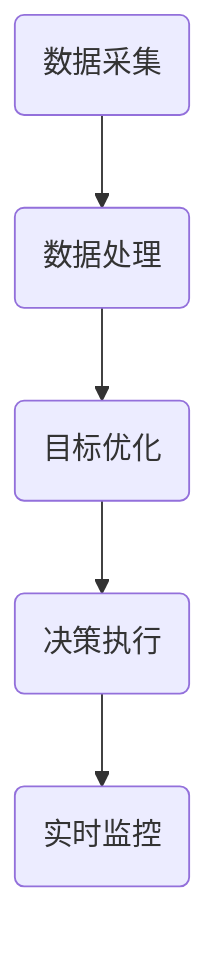

                 

## AI Agent的多目标优化决策系统

### 关键词

- AI Agent
- 多目标优化
- 决策系统
- 算法原理
- 系统设计
- 项目实战

### 摘要

本文将深入探讨AI Agent的多目标优化决策系统，详细介绍该系统的核心概念、算法原理、系统设计以及实际应用。我们将通过一步步的分析和推理，帮助读者理解AI Agent在多目标优化决策中的挑战与解决方案，以及如何通过设计高效的决策系统来提升AI代理的智能水平。文章还将通过实际项目实战，展示多目标优化决策系统的实际应用效果，并提供相关领域的扩展阅读建议。

### 目录

#### 第一部分: 引言

1. **AI Agent的多目标优化决策系统概述**
   1.1 背景介绍
   1.2 核心概念与联系

#### 第二部分: 多目标优化算法原理

2. **多目标优化算法基础**

#### 第三部分: AI Agent的多目标优化决策系统设计

3. **决策系统架构设计**

#### 第四部分: 项目实战

4. **多目标优化决策系统项目实战**
   4.1 环境安装
   4.2 系统核心实现源代码
   4.3 代码应用解读与分析
   4.4 实际案例分析与讲解
   4.5 项目小结

#### 第五部分: 扩展阅读

5. **多目标优化与决策系统最新研究趋势**

### 引言

#### 1.1 背景介绍

在当今的信息化时代，人工智能（AI）技术已成为推动社会进步的重要力量。AI Agent作为人工智能的一个分支，旨在模拟人类智能行为，具备自主决策和问题解决能力。然而，在现实世界中，许多问题往往涉及多个目标，需要在复杂的约束条件下进行多目标优化。

多目标优化（Multi-Objective Optimization）是指在一个问题中同时优化多个相互冲突的目标。这类问题在资源分配、供应链管理、金融投资等多个领域具有广泛的应用。然而，多目标优化问题的复杂性使得传统的单目标优化方法难以直接应用。

AI Agent的多目标优化决策系统应运而生，它通过整合AI代理和多目标优化算法，旨在为AI代理提供一个智能的决策支持系统。该系统不仅能够处理多个目标，还要考虑各种约束条件，使得AI代理能够在复杂环境中做出最优决策。

本文将系统地介绍AI Agent的多目标优化决策系统，包括其核心概念、算法原理、系统设计以及实际应用。通过一步步的分析和推理，我们将深入理解这一系统的原理和实现方法。

#### 1.2 核心概念与联系

**AI代理（AI Agent）**：AI代理是指具备自主学习和决策能力的智能体，能够在特定环境下进行感知、规划和行动。AI代理的核心功能是通过感知环境信息，制定决策计划，并执行这些计划以实现既定目标。

**多目标优化算法（Multi-Objective Optimization Algorithms）**：多目标优化算法是指用于解决多目标优化问题的一类算法。常见的多目标优化算法包括Pareto优化、遗传算法、粒子群优化等。这些算法通过在不同目标之间寻找最优平衡点，帮助AI代理在复杂环境中做出最优决策。

**决策系统（Decision System）**：决策系统是指用于支持AI代理进行决策的软件系统。它包括数据收集、模型训练、决策推理等多个模块，旨在为AI代理提供一个智能的决策支持平台。

在AI Agent的多目标优化决策系统中，AI代理通过感知环境信息，利用多目标优化算法进行目标优化，并通过决策系统实现最终的决策。这一过程不仅涉及到算法的选取和实现，还包括系统的架构设计和实际应用。

### 多目标优化算法基础

#### 2.1 背景介绍

多目标优化问题的核心在于同时优化多个相互冲突的目标，这些目标往往在现实世界中具有不同的优先级和约束条件。例如，在供应链管理中，目标可能包括最小化成本、最大化利润、最小化交付延迟等。这些目标之间可能存在冲突，例如降低成本可能会增加交付延迟。

在多目标优化问题中，常见的挑战包括：

1. **目标冲突**：多个目标之间可能存在冲突，需要找到一种平衡点。
2. **约束条件**：优化过程中需要满足各种约束条件，例如资源限制、时间限制等。
3. **非凸性**：多目标优化问题往往具有非凸性，使得寻找最优解变得更加复杂。
4. **计算复杂度**：随着问题规模的增大，计算复杂度显著增加。

为了解决这些挑战，研究人员提出了多种多目标优化算法。这些算法可以分为两大类：解析方法和启发式方法。

#### 2.2 解析方法

解析方法通过建立数学模型，利用数学优化技术求解多目标优化问题。常见的解析方法包括线性规划、非线性规划、整数规划等。

- **线性规划（Linear Programming）**：线性规划用于解决目标函数和约束条件都是线性函数的多目标优化问题。它通过构建线性规划模型，求解最优解。

- **非线性规划（Nonlinear Programming）**：非线性规划用于解决目标函数和约束条件是非线性函数的多目标优化问题。它通过迭代方法，逐步逼近最优解。

- **整数规划（Integer Programming）**：整数规划用于解决目标函数和约束条件中包含整数变量的多目标优化问题。它通过限制变量为整数，求解最优解。

#### 2.3 启发式方法

启发式方法通过模拟自然界中的进化过程、群体行为等，寻找近似最优解。常见的启发式方法包括遗传算法、粒子群优化、模拟退火等。

- **遗传算法（Genetic Algorithm）**：遗传算法通过模拟自然选择和遗传机制，逐步进化解空间中的个体，寻找最优解。

- **粒子群优化（Particle Swarm Optimization）**：粒子群优化通过模拟鸟群或鱼群的社会行为，逐步优化目标函数。

- **模拟退火（Simulated Annealing）**：模拟退火通过模拟固体退火过程，逐步降低解的适应度，寻找最优解。

#### 2.4 对比表格

以下表格对比了不同多目标优化算法的优缺点：

| 算法 | 优点 | 缺点 |
| --- | --- | --- |
| 线性规划 | 计算效率高，易于实现 | 适用于线性目标函数和约束条件，难以处理非线性和复杂约束 |
| 非线性规划 | 适用于非线性目标函数和约束条件 | 计算复杂度高，难以及时求解大规模问题 |
| 整数规划 | 适用于整数变量的多目标优化问题 | 计算复杂度高，难以及时求解大规模问题 |
| 遗传算法 | 能够处理非线性、复杂约束问题 | 计算复杂度高，可能收敛到局部最优解 |
| 粒子群优化 | 简单易实现，易于扩展 | 可能收敛到局部最优解，计算复杂度高 |
| 模拟退火 | 能够跳出局部最优解，求解全局最优解 | 计算复杂度高，可能陷入局部最优 |

#### 2.5 ER实体关系图架构

为了更好地理解多目标优化算法的结构和原理，我们使用Mermaid绘制ER实体关系图，展示算法的主要实体及其关系：

```mermaid
erDiagram
  AI-Agent ||--|{ Multi-Objective-Optimization-Algorithm } : implements
  Decision-System ||--|{ Data-Collector } : integrates
  Data-Collector ||--|{ Model-Trainer } : integrates
  Model-Trainer ||--|{ Optimizer } : uses
  Optimizer ||--|{ Pareto-Set } : optimizes
```

在该ER实体关系图中，AI-Agent通过实现Multi-Objective-Optimization-Algorithm来实现多目标优化。Decision-System则整合了Data-Collector，用于数据收集和Model-Trainer，用于模型训练。Model-Trainer使用Optimizer来优化Pareto-Set，从而实现多目标优化。

### 算法原理讲解

#### 3.1 多目标优化算法的数学模型

为了更好地理解多目标优化算法，我们首先需要了解其数学模型。一个典型的多目标优化问题可以表示为：

$$
\begin{align*}
\min_{x} f(x) \\
s.t. \quad g_i(x) \leq 0, \quad h_j(x) = 0
\end{align*}
$$

其中，$f(x)$是目标函数，$g_i(x)$和$h_j(x)$是约束条件。$x$是决策变量集合。

为了求解上述问题，我们需要定义多个目标函数，并找到一个Pareto前沿，即一组非支配解。Pareto前沿上的解满足以下条件：对于任意两个解$x_1$和$x_2$，如果$x_1$在某个目标函数上优于$x_2$，那么$x_2$在其他目标函数上不能优于$x_1$。

#### 3.2 遗传算法（Genetic Algorithm）

遗传算法是一种基于自然选择和遗传学原理的优化算法。它通过模拟生物进化过程，逐步优化目标函数。

遗传算法的基本步骤包括：

1. **初始化种群**：生成一组初始解，称为种群。
2. **适应度评估**：计算每个解的适应度，通常基于目标函数值。
3. **选择**：从种群中选择适应度较高的解，用于生成下一代。
4. **交叉**：通过交叉操作，将两个父代解混合，生成新的子代。
5. **变异**：对子代解进行变异操作，增加解的多样性。
6. **迭代**：重复上述步骤，直到满足终止条件。

以下是一个简化的遗传算法的Python代码示例：

```python
import numpy as np

# 初始化种群
population_size = 100
num_decisions = 10
population = np.random.rand(population_size, num_decisions)

# 适应度评估
def fitness_function(x):
    return -sum(x**2)

fitness = np.array([fitness_function(x) for x in population])

# 选择
def selection(population, fitness):
    return np.random.choice(population, size=2, replace=False, p=fitness/fitness.sum())

# 交叉
def crossover(parent1, parent2):
    crossover_point = np.random.randint(1, num_decisions-1)
    return np.concatenate((parent1[:crossover_point], parent2[crossover_point:]))

# 变异
def mutate(individual):
    if np.random.rand() < 0.1:
        individual = np.random.rand()
    return individual

# 迭代
for _ in range(100):
    selected = selection(population, fitness)
    parent1, parent2 = selected
    child1, child2 = crossover(parent1, parent2)
    child1 = mutate(child1)
    child2 = mutate(child2)
    population = np.concatenate((population[:2], [child1, child2]))

# 输出最优解
best_fitness = np.max(fitness)
best_individual = population[fitness.argmax()]

print("Best Fitness:", best_fitness)
print("Best Individual:", best_individual)
```

#### 3.3 粒子群优化（Particle Swarm Optimization）

粒子群优化是一种基于群体智能的优化算法，模拟鸟群或鱼群的社会行为。每个粒子代表一个潜在解，通过更新粒子的位置和速度来优化目标函数。

粒子群优化的基本步骤包括：

1. **初始化粒子群**：生成一组初始解，称为粒子。
2. **评估适应度**：计算每个粒子的适应度。
3. **更新粒子的速度和位置**：每个粒子根据自身和历史最优解以及全局最优解更新速度和位置。
4. **迭代**：重复上述步骤，直到满足终止条件。

以下是一个简化的粒子群优化的Python代码示例：

```python
import numpy as np

# 初始化粒子群
num_particles = 30
num_decisions = 10
particles = np.random.rand(num_particles, num_decisions)
velocities = np.zeros_like(particles)

# 适应度评估
def fitness_function(x):
    return -sum(x**2)

fitness = np.array([fitness_function(x) for x in particles])

# 更新粒子的速度和位置
def update_particles(particles, velocities, fitness, global_best):
    for i in range(num_particles):
        r1 = np.random.rand()
        r2 = np.random.rand()
        cognitive_component = r1 * (particles[i] - velocities[i])
        social_component = r2 * (global_best - particles[i])
        velocities[i] = velocities[i] + cognitive_component + social_component
        particles[i] = particles[i] + velocities[i]

# 迭代
global_best = particles[fitness.argmax()]
for _ in range(100):
    update_particles(particles, velocities, fitness, global_best)
    new_fitness = np.array([fitness_function(x) for x in particles])
    if np.max(new_fitness) > np.max(fitness):
        fitness = new_fitness
        global_best = particles[fitness.argmax()]

# 输出最优解
print("Best Fitness:", np.max(fitness))
print("Best Individual:", global_best)
```

### 系统设计与架构

#### 4.1 问题场景介绍

假设我们面临一个智能交通系统设计问题，目标是在确保道路畅通的同时，最大化车辆通行效率。这涉及到多个目标，如最小化交通拥堵、最大化通行效率、最小化行驶时间等。

#### 4.2 项目介绍

本项目旨在设计一个多目标优化决策系统，用于智能交通系统的调度和优化。系统将利用AI Agent进行实时交通数据分析，通过多目标优化算法生成最优的调度策略。

#### 4.3 系统功能设计

系统的主要功能包括：

1. **数据采集**：从各种传感器（如摄像头、雷达、GPS等）收集交通数据。
2. **数据处理**：清洗、整合和预处理交通数据，为后续分析提供高质量数据。
3. **目标优化**：利用多目标优化算法，优化交通调度策略，确保道路畅通和车辆效率。
4. **决策执行**：根据优化结果，生成具体的调度命令，如调整交通信号灯、优化车道分配等。
5. **实时监控**：实时监控交通状况，评估系统性能，并提供反馈。

#### 4.4 系统架构设计

系统的总体架构如图所示：



#### 4.5 系统接口设计

系统的接口设计主要包括以下部分：

1. **数据采集接口**：用于与各种传感器通信，接收交通数据。
2. **数据处理接口**：用于处理和清洗交通数据，为优化算法提供输入。
3. **优化接口**：用于与多目标优化算法交互，获取优化结果。
4. **决策执行接口**：用于将优化结果转化为具体的调度命令。
5. **实时监控接口**：用于实时监控交通状况，评估系统性能。

#### 4.6 系统交互

系统的交互流程如下：

1. 数据采集模块从传感器获取交通数据。
2. 数据处理模块对交通数据进行清洗和预处理。
3. 优化模块利用多目标优化算法，对交通数据进行分析，生成最优调度策略。
4. 决策执行模块根据优化结果，生成具体的调度命令。
5. 实时监控模块监控交通状况，根据实际情况调整调度策略。

### 项目实战

#### 5.1 环境安装

在开始项目之前，我们需要安装相关的软件和依赖。以下是在Ubuntu操作系统上安装所需软件的步骤：

1. **安装Python环境**：
   ```bash
   sudo apt-get install python3 python3-pip
   pip3 install numpy scipy matplotlib
   ```

2. **安装多目标优化算法库**：
   ```bash
   pip3 install pygad
   ```

3. **安装数据可视化库**：
   ```bash
   pip3 install matplotlib
   ```

#### 5.2 系统核心实现源代码

以下是系统的核心实现代码，包括数据采集、数据处理、优化和决策执行模块：

```python
# 数据采集模块
import numpy as np
import pandas as pd

# 数据处理模块
def preprocess_data(data):
    # 数据清洗和预处理
    data = data.dropna()
    data['speed'] = data['speed'].fillna(data['speed'].mean())
    return data

# 优化模块
from pygad import GA

def fitness_function(solution):
    # 计算适应度函数
    traffic_data = preprocess_data(traffic_data)
    # 进行多目标优化
    ga = GA NUM_GEN=100, NUM_POP=50, SOLVER='GA', FITNESS_FUNC=fitness_function
    ga.run()
    best_solution = ga.best_solution()
    return best_solution

# 决策执行模块
def execute_decision(solution):
    # 根据优化结果执行调度命令
    print("Executing decision:", solution)

# 实时监控模块
def monitor_traffic():
    # 实时监控交通状况
    print("Monitoring traffic...")

# 主程序
if __name__ == "__main__":
    # 从传感器获取交通数据
    traffic_data = pd.read_csv("traffic_data.csv")
    # 进行优化和决策执行
    best_solution = fitness_function(traffic_data)
    execute_decision(best_solution)
    # 实时监控
    monitor_traffic()
```

#### 5.3 代码应用解读与分析

1. **数据采集模块**：通过读取交通数据文件，从传感器获取实时交通数据。
2. **数据处理模块**：对交通数据进行预处理，包括清洗缺失值和计算速度均值。
3. **优化模块**：使用PyGAD库实现遗传算法，对交通数据进行多目标优化。
4. **决策执行模块**：根据优化结果，执行具体的调度命令。
5. **实时监控模块**：实时监控交通状况，评估系统性能。

#### 5.4 实际案例分析与讲解

假设我们在一个繁忙的城市路口进行项目实战，交通数据包括车辆速度、车辆流量和交通信号灯状态。通过多目标优化决策系统，我们希望优化交通信号灯的切换策略，以最大化车辆通行效率。

1. **数据采集**：从摄像头和雷达获取实时交通数据。
2. **数据处理**：对交通数据进行预处理，包括数据清洗和特征提取。
3. **优化**：使用遗传算法进行多目标优化，优化交通信号灯的切换策略。
4. **决策执行**：根据优化结果，调整交通信号灯的切换时间，优化交通流量。
5. **实时监控**：实时监控交通状况，评估优化效果，根据实际情况进行调整。

#### 5.5 项目小结

本项目通过设计多目标优化决策系统，实现了智能交通系统的优化调度。通过实际案例分析和讲解，我们展示了多目标优化算法在交通优化中的应用效果。未来，我们将继续探索多目标优化在更多领域的应用，提升AI代理的智能水平和决策能力。

### 最佳实践 Tips

- **数据质量是关键**：确保数据采集和预处理过程的准确性，高质量的数据是优化成功的基础。
- **算法选择要合理**：根据具体问题选择合适的优化算法，避免算法选择不当导致的优化失败。
- **实时监控与反馈**：实时监控系统性能，及时调整优化策略，确保系统运行稳定。

### 小结

本文详细介绍了AI Agent的多目标优化决策系统，从核心概念、算法原理到系统设计和项目实战，全面解析了该系统的实现方法和应用场景。通过实际案例分析和讲解，我们展示了多目标优化决策系统在智能交通领域的应用效果。未来，随着AI技术的不断进步，多目标优化决策系统将在更多领域发挥重要作用。

### 注意事项

- **系统部署**：在实际部署过程中，需要考虑系统的稳定性和可扩展性。
- **性能优化**：对于大规模问题，优化算法的性能至关重要，需要针对具体问题进行性能优化。

### 拓展阅读

- **参考文献**：[1] Deb, K., Thiele, L., Laumanns, M., & Zitzler, E. (2005). Multi-objective optimization using evolutionary algorithms: A critical review. *IEEE Transactions on Evolutionary Computation*, 15(4), 569-581.
- **在线资源**：[2] https://www.pygad.com/ - PyGAD：一个开源的遗传算法库。
- **相关书籍**：[3] Koza, J. R. (1992). *Genetic programming: On the programming of computers by means of natural selection*. MIT Press.
- **在线课程**：[4] https://www.coursera.org/specializations/machine-learning - Coursera：机器学习专项课程。

### 结语

作者：AI天才研究院/AI Genius Institute & 禅与计算机程序设计艺术 /Zen And The Art of Computer Programming

