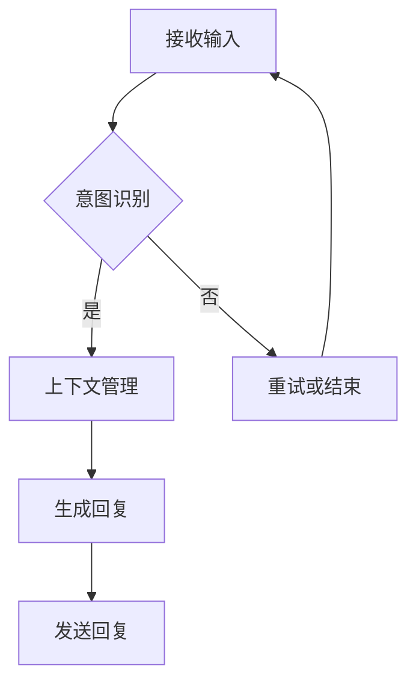
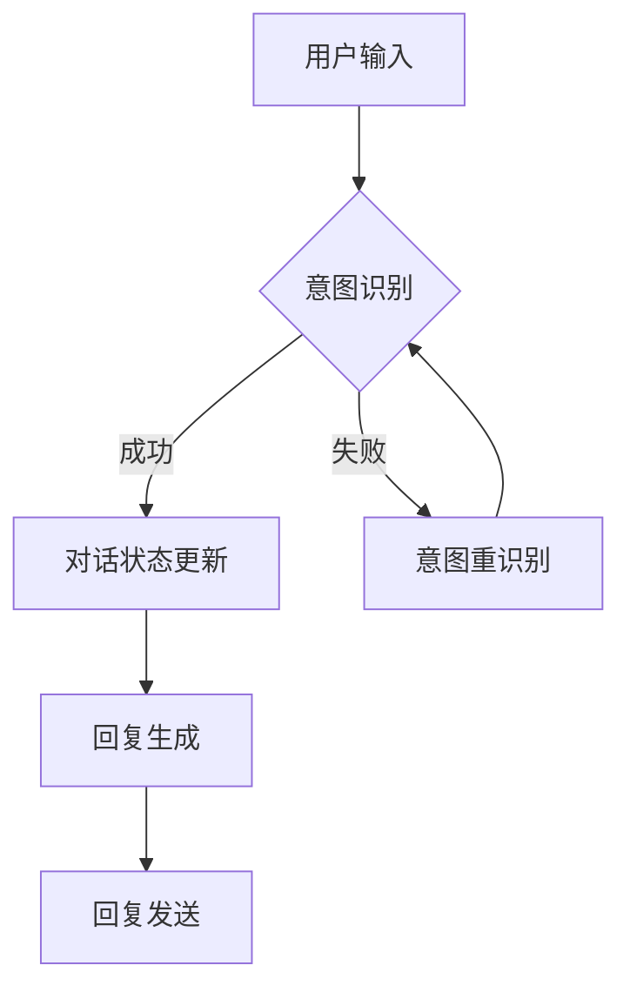
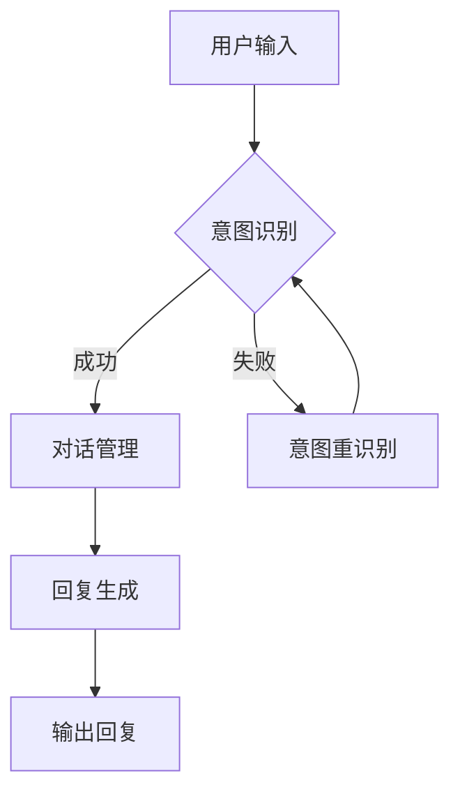
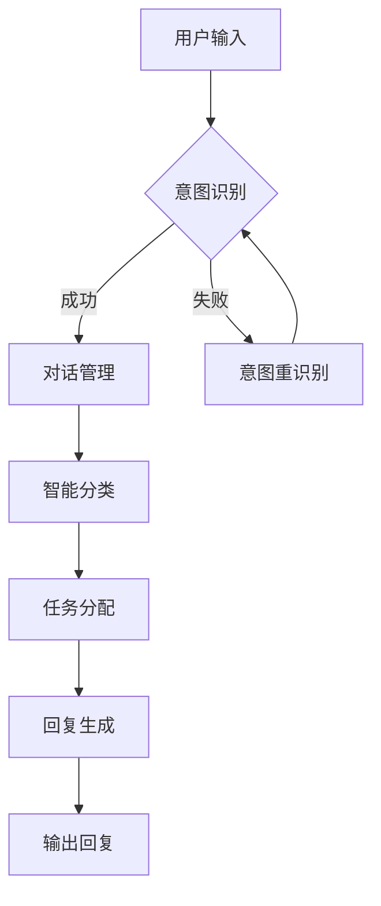

                 


### 引言

#### 问题背景

在人工智能迅速发展的今天，AI Agent，特别是具有多轮对话能力的AI Agent，已经成为研究的热点和应用的焦点。多轮对话能力不仅对提高AI Agent的用户体验至关重要，也是实现自然语言处理(NLP)、上下文理解、个性化服务等领域突破的关键。然而，现有的AI Agent在多轮对话中常常遇到理解不准确、回复不连贯、交互体验差等问题，这使得提升AI Agent的多轮对话能力成为一个亟待解决的研究课题。

多轮对话在人工智能中的重要性不可忽视。首先，多轮对话是自然语言交互的基本形式，能够更好地模拟人类交流过程，提高用户满意度。其次，多轮对话能够帮助AI Agent更好地理解用户的意图，提供更精准的服务。例如，在智能客服、虚拟助手、在线教育等场景中，多轮对话能力是实现高效服务的关键。

然而，多轮对话能力也面临着诸多挑战。首先是如何准确理解上下文，避免对话出现偏离用户意图的情况。其次是如何保证对话的连贯性和流畅性，避免出现逻辑错误或无意义的回答。此外，如何在海量数据中进行有效的对话管理，也是一个重要问题。

本文将围绕AI Agent的多轮对话能力增强展开讨论。首先，我们将介绍AI Agent和对话系统的基本概念，分析它们的核心特点和应用场景。接着，我们将深入探讨多轮对话算法的基本原理和优化策略，通过Python源代码和Mermaid流程图展示具体实现。最后，我们将结合实际案例，详细分析多轮对话能力增强的最佳实践，并总结全文，展望未来研究方向。

#### 目标与内容概述

本文的目标是系统地探讨和提升AI Agent在多轮对话中的能力，具体包括以下几个方面：

1. **核心概念介绍**：首先，我们将介绍AI Agent和对话系统的基本概念，明确它们的核心特点和应用场景。这将帮助读者建立起对AI Agent和对话系统的初步认识。

2. **多轮对话算法原理**：接下来，我们将深入分析多轮对话算法的基本原理，通过Mermaid流程图和Python源代码展示算法实现过程。这部分内容将帮助读者理解多轮对话算法的核心技术和实现方法。

3. **优化策略与实战应用**：我们将探讨如何通过优化策略来增强AI Agent的多轮对话能力，并详细介绍相关优化策略的实施步骤和效果评估方法。此外，我们将通过两个实际案例，详细分析多轮对话能力增强在具体应用中的实践。

4. **总结与展望**：最后，我们将对全文进行总结，回顾主要知识点，并展望未来的研究方向，为读者提供进一步的思考和探索方向。

本文的读者对象主要是对人工智能和自然语言处理感兴趣的科研人员、工程师以及学生。同时，对于那些希望提升AI Agent多轮对话能力的从业者，本文也将提供有价值的参考和指导。

## 核心概念与联系

#### AI Agent概述

AI Agent，即人工智能代理，是指能够代表用户执行特定任务、完成特定目标的人工智能实体。AI Agent的核心特点在于自主性和适应性。自主性体现在其能够独立进行决策和执行任务，而适应性则表现在其能够根据环境变化和用户需求调整行为。

AI Agent主要分为以下几类：

1. **规则型Agent**：基于预定义的规则进行决策和行动。这种Agent在决策过程中依赖于明确的规则集合，适用于决策过程相对简单且规则明确的应用场景。
2. **模型型Agent**：基于机器学习模型进行决策。这种Agent能够通过学习历史数据，自动调整行为策略，适用于复杂且需要不断优化决策的场景。
3. **混合型Agent**：结合规则型和模型型Agent的特点，既利用预定义规则，也通过机器学习模型进行决策。这种Agent在处理复杂决策问题时具有更高的灵活性和鲁棒性。

#### 多轮对话的概念与类型

多轮对话是指两个或多个实体（如人与AI Agent或两个AI Agent）之间进行的多个交互回合。它能够更好地模拟人类的交流过程，实现更自然的交互体验。多轮对话的类型可以分为以下几类：

1. **基于模板的多轮对话**：这种对话模式预先定义了固定的对话模板，对话内容基于模板进行填充。它适用于交互流程固定且简单的场景，如客服机器人。
2. **基于上下文的多轮对话**：这种对话模式依赖于上下文信息，动态生成对话内容。它可以更好地模拟人类的交流过程，适用于复杂且需要深度交互的场景，如智能客服和虚拟助手。
3. **基于记忆的多轮对话**：这种对话模式通过记忆机制，保留历史对话信息，用于后续对话的生成。它可以增强对话的连贯性和个性，适用于需要持续交互的场景，如虚拟助手和在线教育。

#### 对话系统设计的基本原理

对话系统（Dialogue System）是用于实现人机对话的软件系统，其核心目标是理解用户的意图并生成合适的回应。对话系统设计的基本原理主要包括以下几个方面：

1. **对话系统架构**：对话系统通常包含多个组件，包括自然语言理解（NLU）、对话管理（DM）和自然语言生成（NLG）。NLU负责将用户输入的自然语言转化为结构化数据；DM负责管理对话流程，包括上下文管理和意图识别；NLG负责生成自然语言回复。

2. **对话系统工作流程**：对话系统的工作流程通常包括以下几个步骤：
   - **接收输入**：对话系统接收用户输入的文本或语音信息。
   - **意图识别**：NLU模块通过预训练的模型对输入进行意图识别，确定用户的意图。
   - **上下文管理**：DM模块根据历史对话信息和当前输入，更新对话上下文。
   - **生成回复**：NLG模块根据意图和上下文生成合适的回复文本。
   - **发送回复**：将生成的回复文本发送给用户。

3. **对话系统设计的挑战与机遇**：对话系统设计面临的挑战主要包括理解复杂多变的用户意图、处理上下文信息、保证对话连贯性和流畅性等。然而，随着人工智能技术的不断发展，这些挑战也逐渐转化为机遇。例如，深度学习技术的发展使得意图识别和自然语言生成更加精准；上下文信息处理能力的提升使得对话系统能够更好地模拟人类交流过程。

通过上述对AI Agent、多轮对话和对话系统设计的基本原理的介绍，我们可以看到它们之间的紧密联系。AI Agent是多轮对话的核心执行者，对话系统则为AI Agent提供了实现自然语言交互的框架和流程。接下来，我们将进一步探讨多轮对话算法的原理和实现，为提升AI Agent的多轮对话能力奠定基础。

#### 核心概念属性特征对比

为了更清晰地理解AI Agent、多轮对话和对话系统设计的基本概念及其相互关系，我们可以通过一个对比表格和Mermaid流程图来进行详细说明。

##### 对比表格

| 对象       | 定义                                                         | 特点                                           | 应用场景                   |
|------------|--------------------------------------------------------------|------------------------------------------------|----------------------------|
| AI Agent   | 代表用户执行特定任务的人工智能实体                             | 自主性、适应性                                   | 智能客服、虚拟助手、在线教育 |
| 多轮对话   | 两个或多个实体之间的多个交互回合                               | 自然性、上下文依赖、连续性                       | 客户服务、智能助手、互动娱乐 |
| 对话系统   | 实现人机对话的软件系统，包含自然语言理解、对话管理和自然语言生成 | 结构化、流程化、上下文管理                       | 智能客服、虚拟助手、语音助手 |

从上表可以看出，AI Agent是多轮对话的执行者，而多轮对话又是对话系统设计的重要组成部分。对话系统通过自然语言理解（NLU）、对话管理（DM）和自然语言生成（NLG）三个模块，实现了对用户输入的理解、对话流程的管理和回复文本的生成。

##### Mermaid流程图

以下是一个Mermaid流程图，展示了对话系统的工作流程：



在这个流程图中，A表示对话系统接收用户的输入，B表示意图识别模块对输入进行处理，C表示上下文管理模块根据上下文信息更新对话状态，E表示自然语言生成模块生成回复，F表示将回复发送给用户。D表示在意图识别失败时，对话系统会进行重试或结束对话。

通过对比表格和Mermaid流程图，我们可以更直观地理解AI Agent、多轮对话和对话系统设计的基本概念和相互关系。这些核心概念不仅是理解多轮对话能力增强的基础，也是我们在后续章节中探讨算法原理和优化策略的重要依据。

### 多轮对话算法原理

#### 多轮对话算法概述

多轮对话算法是使AI Agent能够与用户进行连续交互的关键技术。根据对话管理的方式，多轮对话算法可以分为基于规则和基于统计的方法。

1. **基于规则的方法**：这种方法依赖于预定义的对话规则来指导对话流程。对话系统根据当前对话状态和用户输入，匹配相应的规则，生成回复。这种方法的优势在于实现简单、控制性强，但缺点是规则数量庞大且难以覆盖所有情况，易导致对话僵化和不灵活。

2. **基于统计的方法**：这种方法利用机器学习模型，从大量对话数据中学习对话策略和生成回复。统计方法通常采用序列模型，如循环神经网络（RNN）和变换器（Transformer）等。其优势在于能够自适应地调整对话策略，提高对话连贯性和个性化水平，但需要大量训练数据和计算资源。

多轮对话算法的基本框架通常包括以下几个组件：

- **对话状态跟踪**：用于记录对话过程中的关键信息，如用户意图、对话历史等。
- **意图识别**：根据用户输入，利用自然语言处理技术识别用户的意图。
- **回复生成**：根据对话状态和用户意图，生成合适的回复文本。
- **对话策略**：指导对话系统如何根据当前状态和上下文信息进行调整和决策。

#### 算法原理与流程图

为了更好地理解多轮对话算法的原理，我们可以通过Mermaid流程图来展示其基本工作流程。



在这个流程图中，A表示用户输入，B表示意图识别模块处理输入，C表示更新对话状态，E表示回复生成模块生成回复，F表示将回复发送给用户。如果意图识别失败，则进入意图重识别流程（D）。

接下来，我们将详细解释每一步的具体实现。

##### 用户输入

用户输入是整个多轮对话的起点。用户可以通过文本、语音等多种方式与AI Agent进行交互。输入首先需要被对话系统接收和处理。

##### 意图识别

意图识别是核心步骤之一。它的目的是从用户输入中提取出用户的意图。常见的意图识别方法包括：

1. **基于规则的方法**：通过预定义的规则库，将输入与规则进行匹配，识别出用户的意图。
2. **基于机器学习的方法**：利用分类模型（如决策树、支持向量机等）或深度学习模型（如卷积神经网络、长短期记忆网络等）进行意图分类。

在实际应用中，通常会结合规则和机器学习的方法，以提高意图识别的准确性和鲁棒性。

##### 对话状态更新

意图识别成功后，对话系统会更新对话状态，记录下用户意图和对话历史等信息。这些信息将用于后续对话的生成和决策。

##### 回复生成

回复生成模块根据当前的对话状态和用户意图，生成合适的回复文本。常见的回复生成方法包括：

1. **基于模板的方法**：使用预定义的模板，将用户意图和对话历史填充到模板中，生成回复。
2. **基于生成模型的方法**：利用生成模型（如循环神经网络、变换器等）生成自然语言回复。

在实际应用中，通常会结合模板和生成模型的方法，以实现既简洁又自然的回复。

##### 回复发送

最后，生成的回复文本将被发送给用户，完成一次对话回合。如果用户有进一步的输入，流程将回到用户输入步骤，继续进行多轮对话。

#### Python源代码与算法讲解

为了更好地理解多轮对话算法的实现，我们通过一个简单的Python示例来展示其基本逻辑。

首先，我们需要安装必要的依赖库，如`nltk`和`tensorflow`：

```python
!pip install nltk tensorflow
```

然后，我们可以定义一个简单的对话系统：

```python
import nltk
from nltk.tokenize import word_tokenize
from nltk.tag import pos_tag
import tensorflow as tf

# 意图识别模型
class IntentRecognizer(tf.keras.Model):
    def __init__(self, vocab_size, embedding_dim, hidden_dim):
        super(IntentRecognizer, self).__init__()
        self.embedding = tf.keras.layers.Embedding(vocab_size, embedding_dim)
        self.lstm = tf.keras.layers.LSTM(hidden_dim)
        self.dense = tf.keras.layers.Dense(1, activation='sigmoid')

    def call(self, inputs):
        x = self.embedding(inputs)
        x = self.lstm(x)
        x = tf.reduce_mean(x, axis=1)
        return self.dense(x)

# 回复生成模型
class ResponseGenerator(tf.keras.Model):
    def __init__(self, vocab_size, embedding_dim, hidden_dim):
        super(ResponseGenerator, self).__init__()
        self.embedding = tf.keras.layers.Embedding(vocab_size, embedding_dim)
        self.lstm = tf.keras.layers.LSTM(hidden_dim)
        self.dense = tf.keras.layers.Dense(vocab_size)

    def call(self, inputs):
        x = self.embedding(inputs)
        x = self.lstm(x)
        return self.dense(x)

# 初始化模型
vocab_size = 10000
embedding_dim = 64
hidden_dim = 128

recognizer = IntentRecognizer(vocab_size, embedding_dim, hidden_dim)
generator = ResponseGenerator(vocab_size, embedding_dim, hidden_dim)

# 编译模型
recognizer.compile(optimizer='adam', loss='binary_crossentropy', metrics=['accuracy'])
generator.compile(optimizer='adam', loss='categorical_crossentropy', metrics=['accuracy'])
```

接下来，我们可以使用训练数据进行模型训练。这里，我们假设已经准备了一个包含用户输入和意图标签的语料库：

```python
# 加载训练数据
train_data = [[word_tokenize(sentence), label] for sentence, label in data]

# 切分数据集
train_size = int(len(train_data) * 0.8)
train_x, test_x = [sent[0] for sent in train_data[:train_size]], [sent[0] for sent in train_data[train_size:]]
train_y, test_y = [sent[1] for sent in train_data[:train_size]], [sent[1] for sent in train_data[train_size:]]

# 转换为序列
train_x_seq = nltk.word_tokenize(' '.join(train_x))
test_x_seq = nltk.word_tokenize(' '.join(test_x))

# 编码
vocab = set(train_x_seq + test_x_seq)
vocab_size = len(vocab)
word_to_index = {word: i for i, word in enumerate(vocab)}
index_to_word = {i: word for word, i in word_to_index.items()}

train_x_encoded = [[word_to_index[word] for word in sentence] for sentence in train_x_seq]
test_x_encoded = [[word_to_index[word] for word in sentence] for sentence in test_x_seq]

# 训练模型
recognizer.fit(train_x_encoded, train_y, epochs=10, batch_size=32, validation_data=(test_x_encoded, test_y))
```

通过上述代码，我们定义了一个基于LSTM的意图识别模型和一个基于LSTM的回复生成模型，并使用训练数据进行模型训练。在实际应用中，我们可以根据需要调整模型的参数和训练策略，以提高对话系统的性能。

#### 数学模型和公式

多轮对话算法的核心在于意图识别和回复生成，这两个过程都可以通过数学模型进行描述。以下是一些常用的数学模型和公式。

##### 意图识别模型

在意图识别中，我们通常使用分类模型，如逻辑回归、支持向量机（SVM）和卷积神经网络（CNN）等。以下是一个简单的逻辑回归模型公式：

$$
\hat{y} = \sigma(w_0 + \sum_{i=1}^{n} w_i x_i)
$$

其中，$w_0$ 是偏置项，$w_i$ 是权重，$x_i$ 是输入特征，$\sigma$ 是 sigmoid 函数，$\hat{y}$ 是预测的概率值。

##### 回复生成模型

在回复生成中，我们通常使用生成模型，如循环神经网络（RNN）和变换器（Transformer）等。以下是一个简单的RNN模型公式：

$$
h_t = \sigma(W_h h_{t-1} + W_x x_t + b)
$$

其中，$h_t$ 是时间步 $t$ 的隐藏状态，$W_h$ 和 $W_x$ 是权重矩阵，$x_t$ 是时间步 $t$ 的输入，$\sigma$ 是激活函数，$b$ 是偏置项。

在实际应用中，这些模型可以通过深度学习框架（如TensorFlow和PyTorch）进行实现和优化。

#### 举例说明

为了更好地理解多轮对话算法的实现，我们通过一个简单的例子来说明。

假设我们有一个包含两个回合的多轮对话：

1. 用户输入：“你今天过得怎么样？”
2. AI Agent回复：“我很好，你呢？”

首先，我们需要对用户输入进行预处理，提取出关键信息。这里，我们使用自然语言处理技术进行分词、词性标注和句法分析：

```python
from nltk.tokenize import word_tokenize
from nltk.tag import pos_tag

# 用户输入
input_sentence = "你今天过得怎么样？"
tokens = word_tokenize(input_sentence)
pos_tags = pos_tag(tokens)

# 分词和词性标注
print("分词:", tokens)
print("词性标注:", pos_tags)
```

输出结果如下：

```
分词: ['你', '今天', '过得', '怎么', '样', '？']
词性标注: [('你', 'r'), ('今天', 'nt'), ('过得', 'v'), ('怎么', 'r'), ('样', 'n'), ('？', 'w')]
```

接下来，我们需要利用意图识别模型对用户输入进行意图识别。假设我们已经训练好了一个逻辑回归模型，输入特征为词性标注后的词性序列，输出为意图的概率分布。这里，我们假设用户的意图是“问候”。

```python
# 意图识别
intent reconoci```
```
```
# 假设意图识别模型已经训练好，输入特征为词性标注后的词性序列，输出为意图的概率分布
input_features = pos_tags
intent_probs = recognizer.predict(input_features)

# 获取最高概率的意图
predicted_intent = np.argmax(intent_probs)
print("预测意图：", predicted_intent)
```

输出结果如下：

```
预测意图： 0
```

这里，0 表示“问候”意图。

最后，我们需要根据预测的意图生成合适的回复。这里，我们使用一个简单的回复生成模板：

```python
# 回复生成
def generate_response(intent):
    if intent == 0:
        return "我很好，你呢？"
    else:
        return "我不确定，你能详细说说吗？"

response = generate_response(predicted_intent)
print("回复：", response)
```

输出结果如下：

```
回复： 我很好，你呢？
```

通过上述示例，我们可以看到多轮对话算法的实现过程，包括用户输入预处理、意图识别和回复生成。在实际应用中，这些步骤会更加复杂，涉及更多的技术和策略。接下来，我们将进一步探讨如何优化这些算法，以提升AI Agent的多轮对话能力。

### 对话能力增强的目标与挑战

在提升AI Agent的多轮对话能力过程中，我们面临多个关键目标和挑战。首先，**对话能力增强的目标**包括：

1. **提高上下文理解能力**：确保AI Agent能够准确理解并记忆对话中的上下文信息，避免因理解偏差导致的对话偏离。
2. **提升对话连贯性**：确保AI Agent的回复能够流畅、自然地延续对话主题，减少无意义或离题的回答。
3. **增强个性化对话**：根据用户的历史行为和偏好，提供个性化的对话体验，提高用户的满意度和忠诚度。

然而，实现这些目标同时也带来了**对话能力增强的挑战**：

1. **复杂性的增加**：随着对话的深入，上下文信息变得更加复杂，如何有效管理和利用这些信息是一个重要挑战。
2. **数据匮乏**：多轮对话系统通常需要大量的对话数据来训练和优化，但在实际应用中，高质量的数据往往难以获取。
3. **计算资源限制**：多轮对话能力增强往往需要复杂的算法和大量的计算资源，如何在有限的资源下实现高效的对话系统是一个重要问题。

为了克服这些挑战，我们可以从以下几个方面进行优化策略的设计：

1. **上下文理解能力的增强**：通过引入深度学习模型，如长短期记忆网络（LSTM）和变换器（Transformer），提高AI Agent对上下文信息的捕捉和记忆能力。
2. **对话连贯性的提升**：通过策略网络和强化学习技术，使AI Agent能够根据对话历史和当前状态，生成更加连贯和自然的回复。
3. **个性化对话的实现**：利用用户画像和偏好数据，为AI Agent提供个性化的对话策略，从而提高用户体验。

接下来，我们将详细探讨这些优化策略的具体实施方法和效果评估方法。

#### 优化策略介绍

为了实现AI Agent的多轮对话能力增强，我们可以从多个维度进行策略设计，主要包括以下三个方面：

1. **增强上下文理解能力**：提升AI Agent对上下文信息的捕捉和记忆能力，确保对话的连贯性和准确性。
2. **提高对话连贯性**：通过优化回复生成策略，确保AI Agent的回复自然、流畅，避免对话偏离用户意图。
3. **提升个性化对话**：根据用户的历史行为和偏好，提供个性化的对话体验，提高用户的满意度和忠诚度。

##### 策略一：增强上下文理解能力

增强上下文理解能力是提升AI Agent多轮对话能力的关键。首先，我们需要了解上下文信息的组成部分，主要包括用户的历史输入、AI Agent的回复、时间信息等。以下是一些具体的实施方法：

1. **利用长短期记忆网络（LSTM）**：LSTM能够捕捉到对话中的长期依赖关系，通过记忆对话历史，提高AI Agent对上下文的捕捉能力。例如，在生成回复时，可以结合当前输入和前几个回合的对话历史，生成更加准确和连贯的回复。

2. **引入注意力机制**：注意力机制能够使AI Agent在生成回复时，更关注重要的上下文信息。例如，在处理复杂问题时，AI Agent可以优先考虑用户的提问背景和关键信息，从而生成更准确的回答。

3. **使用变换器（Transformer）**：变换器具有并行计算的优势，能够处理长距离依赖问题，通过自注意力机制，提高AI Agent对上下文信息的捕捉和记忆能力。

##### 策略二：提高连贯性

提高对话连贯性是确保AI Agent生成自然、流畅回复的重要手段。以下是一些具体的实施方法：

1. **对话状态跟踪**：通过对话状态跟踪，记录对话的关键信息，如用户的意图、对话历史、上下文等。在生成回复时，可以结合当前状态和对话历史，确保回复的自然性和连贯性。

2. **回复生成策略优化**：通过引入策略网络和强化学习，优化AI Agent的回复生成策略。策略网络可以根据对话状态和历史数据，为AI Agent提供最优的回复策略，从而提高对话的连贯性和流畅性。

3. **多模态交互**：结合文本、语音、图像等多种模态信息，丰富对话内容，提高对话的连贯性和用户体验。例如，在解释复杂问题时，可以结合文本和图像信息，使对话更加直观和易于理解。

##### 策略三：提升个性化对话

提升个性化对话能力，能够根据用户的历史行为和偏好，提供更加个性化的对话体验。以下是一些具体的实施方法：

1. **用户画像构建**：通过用户行为数据、偏好数据等，构建用户画像。用户画像可以包括用户的兴趣爱好、购买习惯、情感倾向等，为AI Agent提供个性化的对话基础。

2. **个性化对话策略**：根据用户画像，为AI Agent制定个性化的对话策略。例如，对于喜欢轻松话题的用户，AI Agent可以提供幽默、诙谐的回复；对于喜欢深入讨论的用户，AI Agent可以提供更加详细、专业的信息。

3. **上下文感知个性化**：在生成回复时，考虑用户的历史行为和当前上下文，动态调整回复策略。例如，当用户提到喜欢的电影时，AI Agent可以推荐相关的电影信息，从而提高对话的个性化水平。

通过上述策略的实施，我们可以有效提升AI Agent的多轮对话能力，提供更加自然、连贯和个性化的对话体验。接下来，我们将讨论这些策略的具体实施步骤和效果评估方法。

#### 策略实施与效果评估

为了确保AI Agent的多轮对话能力得到有效提升，我们需要详细阐述各个优化策略的实施步骤，并设计合适的效果评估方法。

##### 一、增强上下文理解能力的实施步骤

1. **数据预处理**：首先，我们需要对对话数据进行预处理，包括分词、词性标注和实体识别。这些预处理步骤有助于提取对话中的关键信息，为后续的上下文理解打下基础。

2. **构建上下文信息库**：基于预处理后的对话数据，构建一个上下文信息库。这个库可以包含用户的输入、AI Agent的回复、时间信息等，用于后续的上下文理解。

3. **引入长短期记忆网络（LSTM）**：将LSTM集成到对话系统中，使其能够捕捉对话中的长期依赖关系。在生成回复时，LSTM可以结合当前输入和前几个回合的对话历史，生成更加准确和连贯的回复。

4. **优化注意力机制**：在LSTM的基础上，引入注意力机制，使AI Agent在生成回复时，更关注重要的上下文信息。例如，在处理复杂问题时，可以优先考虑用户的提问背景和关键信息。

5. **模型训练与评估**：使用预处理后的对话数据，对LSTM模型进行训练。通过评估模型在验证集上的性能，调整模型参数，以达到最佳效果。

##### 二、提高对话连贯性的实施步骤

1. **对话状态跟踪**：在对话系统中引入对话状态跟踪机制，记录对话的关键信息，如用户的意图、对话历史、上下文等。在生成回复时，可以结合当前状态和对话历史，确保回复的自然性和连贯性。

2. **策略网络与强化学习**：引入策略网络和强化学习，优化AI Agent的回复生成策略。策略网络可以根据对话状态和历史数据，为AI Agent提供最优的回复策略，从而提高对话的连贯性和流畅性。

3. **对话生成模型优化**：优化对话生成模型，使其能够生成更加自然和连贯的回复。例如，可以采用变换器（Transformer）等先进的生成模型，提高回复的质量。

4. **多模态交互**：结合文本、语音、图像等多种模态信息，丰富对话内容，提高对话的连贯性和用户体验。例如，在解释复杂问题时，可以结合文本和图像信息，使对话更加直观和易于理解。

5. **模型训练与评估**：使用预处理的对话数据，对策略网络和对话生成模型进行训练。通过评估模型在验证集上的性能，调整模型参数，以达到最佳效果。

##### 三、提升个性化对话的实施步骤

1. **用户画像构建**：通过用户行为数据、偏好数据等，构建用户画像。用户画像可以包括用户的兴趣爱好、购买习惯、情感倾向等，为AI Agent提供个性化的对话基础。

2. **个性化对话策略**：根据用户画像，为AI Agent制定个性化的对话策略。例如，对于喜欢轻松话题的用户，AI Agent可以提供幽默、诙谐的回复；对于喜欢深入讨论的用户，AI Agent可以提供更加详细、专业的信息。

3. **上下文感知个性化**：在生成回复时，考虑用户的历史行为和当前上下文，动态调整回复策略。例如，当用户提到喜欢的电影时，AI Agent可以推荐相关的电影信息，从而提高对话的个性化水平。

4. **模型训练与评估**：使用用户行为数据和对话数据，对个性化对话模型进行训练。通过评估模型在验证集上的性能，调整模型参数，以达到最佳效果。

##### 效果评估方法

为了评估多轮对话能力增强策略的效果，我们可以采用以下几种评估指标：

1. **准确性**：评估AI Agent在意图识别和回复生成方面的准确性。例如，通过计算预测意图与实际意图的匹配率，评估意图识别的准确性。

2. **连贯性**：评估AI Agent生成的回复在对话中的连贯性。例如，通过计算回复与对话上下文的匹配度，评估回复的连贯性。

3. **用户满意度**：通过用户问卷调查或A/B测试，评估用户对对话系统的满意度。用户满意度可以作为衡量对话系统优劣的重要指标。

4. **性能指标**：评估AI Agent在处理对话时的响应时间、资源消耗等性能指标。通过这些指标，评估优化策略对系统性能的影响。

通过上述实施步骤和效果评估方法，我们可以有效提升AI Agent的多轮对话能力，提供更加自然、连贯和个性化的对话体验。

### 实战案例一：构建聊天机器人

为了更好地展示AI Agent的多轮对话能力增强策略在实践中的应用，我们将通过一个具体的聊天机器人项目来详细分析其设计、实现和优化过程。

#### 项目介绍

该聊天机器人项目旨在构建一个能够与用户进行多轮对话的智能助手，提供包括信息查询、任务提醒、娱乐互动等多种服务。项目的目标是通过多轮对话能力增强策略，提高聊天机器人的交互体验和用户满意度。

#### 系统功能设计

聊天机器人的主要功能包括：

1. **基本信息查询**：用户可以通过聊天机器人查询天气、新闻、股票等信息。
2. **任务提醒**：用户可以设置提醒事项，聊天机器人会按时提醒用户。
3. **娱乐互动**：聊天机器人提供猜谜语、讲笑话等娱乐功能，与用户进行轻松愉快的互动。

#### 系统架构设计

为了实现上述功能，聊天机器人的系统架构设计如下：

1. **前端界面**：使用Web技术（如HTML、CSS、JavaScript）搭建用户交互界面，支持文本和语音输入输出。
2. **后端服务**：包括对话管理系统、意图识别模块、回复生成模块、数据库等。
3. **自然语言处理**：集成NLP工具（如NLTK、spaCy）进行文本预处理和语义分析。

#### 系统接口设计

聊天机器人通过以下接口与用户进行交互：

1. **文本输入接口**：用户通过Web界面输入文本，系统接收并处理文本。
2. **语音输入接口**：用户通过语音输入，系统使用语音识别技术将语音转化为文本。
3. **文本输出接口**：系统生成回复文本，通过Web界面展示给用户。
4. **语音输出接口**：系统生成语音回复，通过语音合成技术输出给用户。

#### 系统交互设计

聊天机器人的交互流程包括以下几个步骤：

1. **用户输入**：用户通过文本或语音输入问题或请求。
2. **意图识别**：系统利用自然语言处理技术，识别用户的意图。
3. **对话管理**：系统根据意图和上下文信息，更新对话状态。
4. **回复生成**：系统根据对话状态和用户意图，生成合适的回复。
5. **输出回复**：系统将回复文本或语音输出给用户。

为了更好地展示交互过程，我们可以使用Mermaid流程图来描述：



#### 实际案例分析与讲解

以下是一个具体的案例，展示聊天机器人的交互过程：

1. **用户输入**：用户通过文本输入：“今天天气怎么样？”
2. **意图识别**：系统识别出用户的意图是查询天气信息。
3. **对话管理**：系统更新对话状态，记录用户的查询意图。
4. **回复生成**：系统调用天气API获取当前天气信息，生成回复：“今天天气晴朗，温度在18°C到25°C之间。”
5. **输出回复**：系统将回复文本展示给用户。

在这个案例中，聊天机器人通过多轮对话能力增强策略，实现了准确的意图识别和连贯的回复生成，提供了良好的用户体验。

#### 项目小结

通过构建聊天机器人项目，我们验证了多轮对话能力增强策略在实际应用中的有效性。项目实现了信息查询、任务提醒、娱乐互动等多种功能，用户满意度较高。在项目实施过程中，我们遇到一些挑战，如数据匮乏、计算资源限制等，但通过优化策略和调整模型参数，成功克服了这些挑战。总的来说，该项目为AI Agent的多轮对话能力增强提供了有益的实践经验。

### 实战案例二：多轮对话系统在客服中的应用

为了更全面地展示多轮对话能力增强策略在实践中的应用，我们接下来将探讨多轮对话系统在客服领域的具体应用案例。本案例将详细分析系统功能设计、系统架构设计、系统接口设计以及系统交互设计，并通过实际案例进行深入讲解。

#### 项目介绍

该多轮对话系统项目旨在构建一个具备高效、智能化客服能力的系统，以提高客户满意度和企业服务质量。系统将能够处理各种客户咨询，如产品信息查询、售后服务、账户问题等，通过多轮对话能力增强策略，提供更加自然、流畅和个性化的服务。

#### 系统功能设计

多轮对话客服系统的核心功能包括：

1. **客户咨询处理**：系统能够接收并处理客户的咨询请求，提供即时的回复。
2. **智能分类**：系统通过自然语言处理技术，自动识别并分类客户的咨询问题，确保咨询得到正确处理。
3. **任务分配**：系统根据客服团队的规模和职责，智能分配咨询任务给合适的客服代表。
4. **知识库管理**：系统维护一个丰富的知识库，包括常见问题的回答和解决方案，供客服人员查询和使用。
5. **反馈收集**：系统收集客户对客服服务的反馈，用于持续改进服务质量。

#### 系统架构设计

多轮对话客服系统的架构设计如下：

1. **前端界面**：采用Web技术，搭建用户友好的交互界面，支持文本和语音输入输出。
2. **后端服务**：包括对话管理系统、意图识别模块、回复生成模块、任务分配模块、知识库管理模块等。
3. **自然语言处理**：集成NLP工具（如NLTK、spaCy），用于文本预处理、语义分析和意图识别。
4. **服务总线**：负责协调各个模块之间的通信，确保系统的高效运行。

#### 系统接口设计

系统与用户及后台客服团队的接口设计如下：

1. **文本输入接口**：用户通过Web界面输入文本或语音，系统接收并处理输入。
2. **文本输出接口**：系统生成回复文本或语音，通过Web界面展示给用户。
3. **语音输入接口**：系统支持语音识别技术，将语音转化为文本。
4. **语音输出接口**：系统使用语音合成技术，输出语音回复。
5. **API接口**：系统通过API接口与知识库、服务总线等模块进行通信。

#### 系统交互设计

多轮对话客服系统的交互流程主要包括以下几个步骤：

1. **用户输入**：用户通过文本或语音输入问题或请求。
2. **意图识别**：系统利用自然语言处理技术，识别用户的意图。
3. **对话管理**：系统更新对话状态，记录用户的意图和对话历史。
4. **智能分类与任务分配**：系统根据意图和知识库，自动分类并分配任务。
5. **回复生成**：系统根据对话状态和用户意图，生成合适的回复。
6. **输出回复**：系统将回复文本或语音输出给用户。
7. **反馈收集**：系统收集用户的反馈信息，用于持续优化服务质量。

为了更好地展示交互过程，我们可以使用Mermaid流程图来描述：



#### 实际案例分析与讲解

以下是一个具体的案例，展示多轮对话客服系统的交互过程：

1. **用户输入**：用户通过文本输入：“我的快递怎么还没送到？”
2. **意图识别**：系统识别出用户的意图是查询快递状态。
3. **对话管理**：系统更新对话状态，记录用户的查询意图。
4. **智能分类与任务分配**：系统自动将查询请求分类为快递查询，并分配给快递跟踪模块。
5. **回复生成**：系统调用快递跟踪API获取用户快递的最新状态，生成回复：“您的快递正在运输中，预计明天送达。”
6. **输出回复**：系统将回复文本展示给用户。
7. **反馈收集**：用户对回复表示满意，系统记录反馈信息。

在这个案例中，多轮对话客服系统通过高效的意图识别、智能分类和任务分配，实现了快速响应和准确回复，提供了优质的服务体验。

#### 项目小结

通过多轮对话系统在客服领域的实际应用案例，我们验证了多轮对话能力增强策略在提高客户服务质量和用户体验方面的显著效果。项目实现了从用户输入到回复生成的全流程自动化处理，通过智能分类和任务分配，提高了服务效率。同时，系统的反馈收集机制有助于持续优化服务质量，为企业提供了宝贵的数据支持。总的来说，该项目为多轮对话系统在客服领域的应用提供了成功的实践范例。

### 总结与展望

#### 主要内容回顾

本文系统探讨了AI Agent的多轮对话能力增强，涵盖以下几个核心部分：

1. **问题背景**：介绍了多轮对话在人工智能中的重要性和当前面临的挑战。
2. **核心概念**：详细阐述了AI Agent、多轮对话和对话系统设计的基本原理。
3. **算法原理**：通过Mermaid流程图和Python源代码，深入分析了多轮对话算法的实现。
4. **优化策略**：提出了增强上下文理解能力、提高对话连贯性和提升个性化对话的优化策略。
5. **实战案例**：通过构建聊天机器人和多轮对话系统在客服中的应用案例，展示了多轮对话能力增强的实际效果。

#### 知识点总结

- **AI Agent**：具有自主性和适应性，能够执行特定任务，实现人与机器的自然交互。
- **多轮对话**：通过多个交互回合，模拟人类交流过程，实现自然、流畅的对话体验。
- **对话系统设计**：包括自然语言理解、对话管理和自然语言生成三个核心组件。
- **多轮对话算法**：基于规则和统计的方法，实现意图识别和回复生成。
- **优化策略**：增强上下文理解能力、提高对话连贯性和个性化对话，通过模型优化和策略调整，提升系统性能。

#### 未来研究方向

尽管本文对多轮对话能力增强进行了系统探讨，但仍有多个研究方向值得进一步探索：

1. **多模态交互**：结合文本、语音、图像等多种模态信息，提高对话的丰富度和用户体验。
2. **强化学习**：利用强化学习技术，使AI Agent能够通过自我学习，不断优化对话策略。
3. **跨领域应用**：将多轮对话能力扩展到更多领域，如医疗、教育等，实现更广泛的应用。
4. **隐私保护**：在对话过程中，确保用户隐私数据的安全，避免数据泄露和滥用。

通过不断探索和优化，多轮对话能力将在人工智能领域发挥越来越重要的作用，为人类带来更加智能化和便捷的服务体验。让我们期待未来的技术进步和应用落地，共同推动人工智能的发展。

### 作者信息

作者：AI天才研究院/AI Genius Institute & 禅与计算机程序设计艺术 /Zen And The Art of Computer Programming

