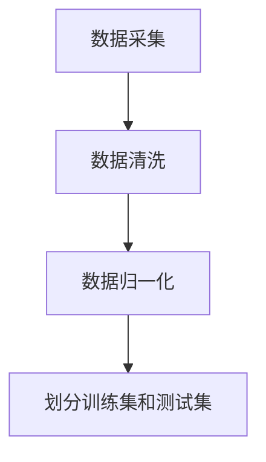
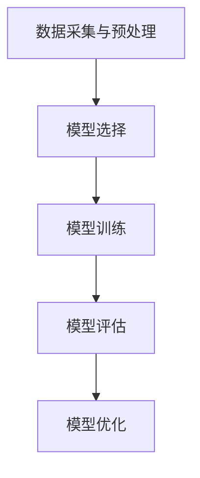
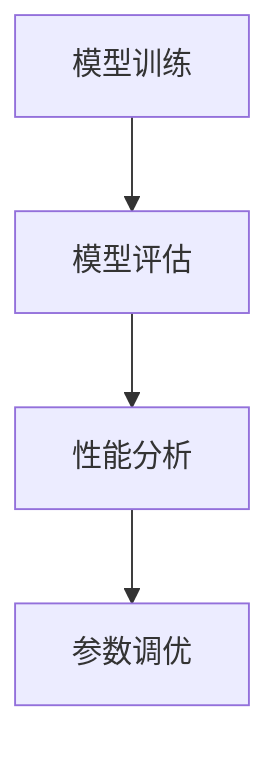
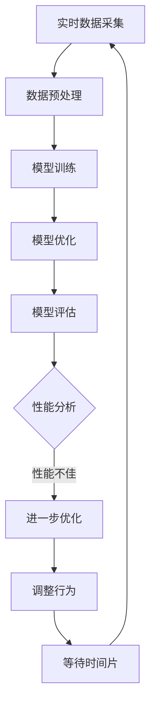
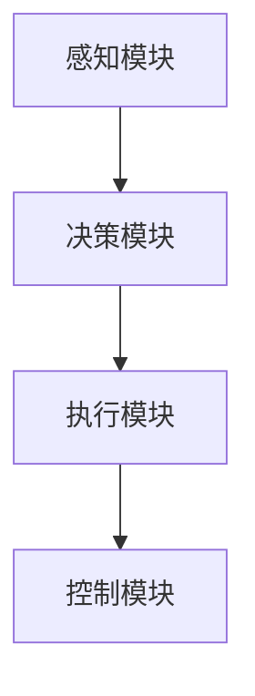
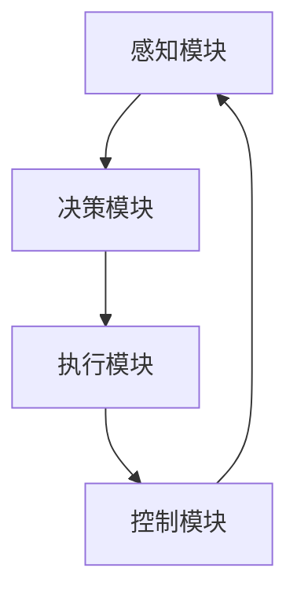

                 


## 《AI Agent的实时学习与适应机制》

### 关键词：AI Agent、实时学习、适应机制、动态调整、技术实现、实战应用

### 摘要：
本文深入探讨AI Agent的实时学习与适应机制，通过详细的步骤分析，从理论基础到技术实现，再到实战应用，全面解析AI Agent如何实时从环境中学习，并根据变化进行自适应调整。文章旨在为人工智能领域的读者提供一份系统、实用且易于理解的技术指南。

### 目录大纲设计思路

在设计《AI Agent的实时学习与适应机制》的目录大纲时，我们首先明确了核心主题——AI Agent、实时学习和适应机制。这些主题不仅涵盖了人工智能代理的基本原理，还包括了其在动态环境中的学习和适应能力。目录设计需要满足以下要求：

- **理论基础**：为读者提供AI Agent和实时学习、适应机制的基本概念和原理。
- **技术实现**：详细介绍AI Agent实时学习和适应机制的技术实现方法。
- **实战应用**：通过具体案例展示AI Agent在现实中的应用效果。
- **总结与展望**：总结全书内容，并对未来研究方向进行展望。

#### 核心主题确认

根据书名，核心主题包括：

- **AI Agent**：具有自主性和智能性的软件实体，能够执行特定任务。
- **实时学习**：AI Agent在执行任务时，不断从环境或用户反馈中学习，并调整自身行为。
- **适应机制**：AI Agent在面对动态变化的环境时，如何调整自身的策略和决策过程以保持高效运行。

#### 读者需求分析

考虑到本书的读者主要是人工智能领域的研究人员和开发者，目录设计需满足以下需求：

- **理论基础**：为读者提供AI Agent和实时学习、适应机制的基本知识。
- **技术实现**：详细介绍实现实时学习和适应机制的技术细节。
- **实战应用**：通过案例展示AI Agent的应用效果。

#### 内容组织结构

全书分为以下五个部分：

1. **引言**：介绍AI Agent、实时学习和适应机制的基本概念，明确本书的目的和结构。
2. **理论基础**：讲解AI Agent的基本原理、实时学习的方法和适应机制的实现。
3. **技术实现**：深入探讨AI Agent在实时学习和适应机制方面的技术实现细节。
4. **实战应用**：通过具体案例展示AI Agent的实际应用效果。
5. **总结与展望**：总结本书的主要观点，并对未来研究方向进行展望。

#### 目录大纲设计

基于上述结构，以下是《AI Agent的实时学习与适应机制》的目录大纲：

```markdown
# 《AI Agent的实时学习与适应机制》

## 第一部分：引言

### 第1章：AI Agent、实时学习与适应机制概述

### 第2章：背景与问题介绍

### 第3章：研究目标与内容结构

## 第二部分：理论基础

### 第4章：AI Agent的基本原理

### 第5章：实时学习原理

### 第6章：适应机制构建

## 第三部分：技术实现

### 第7章：实时学习技术实现

### 第8章：适应机制技术实现

## 第四部分：实战应用

### 第9章：案例一：自然语言处理中的AI Agent

### 第10章：案例二：智能机器人控制系统中的AI Agent

## 第五部分：总结与展望

### 第11章：总结与反思

### 第12章：未来研究方向与挑战

```

#### 目录大纲细节说明

- **第一部分：引言**：为读者提供AI Agent、实时学习和适应机制的基本概念，使读者对全书内容有一个整体的认识。
- **第二部分：理论基础**：深入讲解AI Agent的基本原理和实时学习与适应机制的理论基础，为后续的技术实现和应用提供理论支持。
- **第三部分：技术实现**：详细描述AI Agent在实时学习和适应机制方面的技术实现方法，包括数据采集与预处理、模型训练与优化、算法评估与调优等。
- **第四部分：实战应用**：通过具体案例展示AI Agent在不同领域的应用效果，包括自然语言处理和智能机器人控制系统等。
- **第五部分：总结与展望**：总结全书内容，并对未来研究方向进行展望。

以上目录大纲设计旨在全面覆盖核心内容，并确保每个章节都能够详细讲解相关主题，为读者提供一份系统、实用且易于理解的技术指南。

接下来，我们将按照目录大纲逐步展开讨论，每一步都基于逻辑清晰、结构紧凑的思路，深入剖析AI Agent的实时学习与适应机制。

---

### AI Agent的概念与分类

在讨论AI Agent的实时学习与适应机制之前，我们首先需要了解什么是AI Agent。AI Agent，即人工智能代理，是指具有智能性、自主性和交互能力的软件实体，它能够在特定环境中执行任务，并根据环境的变化和目标的变化调整自身的行为。

#### 核心概念

AI Agent的核心概念包括：

1. **智能性**：指Agent能够理解环境、做出决策并执行任务的能力。
2. **自主性**：指Agent能够独立运作，不依赖人类干预。
3. **交互性**：指Agent能够与环境进行交互，获取反馈并调整自身行为。

#### 分类

AI Agent可以根据不同的分类标准进行分类：

1. **基于功能**：可以分为任务型Agent、知识型Agent、混合型Agent等。
   - **任务型Agent**：专注于执行特定任务，如搜索、监控等。
   - **知识型Agent**：拥有大量知识库，能够基于知识库进行决策。
   - **混合型Agent**：结合任务型和知识型的特点，既能执行任务，又具备知识推理能力。

2. **基于环境**：可以分为静态环境Agent和动态环境Agent。
   - **静态环境Agent**：在固定不变的环境中执行任务。
   - **动态环境Agent**：在变化多端的环境中执行任务，需要具备实时学习和适应机制。

3. **基于交互方式**：可以分为主动交互Agent和被动交互Agent。
   - **主动交互Agent**：主动发起与环境或用户的交互。
   - **被动交互Agent**：仅响应环境或用户的交互请求。

#### 问题背景

随着人工智能技术的发展，AI Agent在各个领域的应用越来越广泛。然而，面对复杂多变的环境，传统的静态AI Agent往往难以适应。因此，实时学习和适应机制成为了AI Agent研究的重要方向。实时学习使Agent能够在执行任务的过程中不断从环境中学习，适应环境变化；适应机制使Agent能够在动态变化的环境中调整自身的行为策略，保持高效运行。

#### 问题描述

在动态环境中，AI Agent需要解决以下几个关键问题：

1. **数据采集**：如何高效地采集环境数据，以便进行实时学习。
2. **实时学习**：如何设计算法，使Agent能够在有限的时间内快速学习并调整行为。
3. **适应机制**：如何构建适应机制，使Agent能够在变化的环境中保持高效运行。

#### 问题解决

为了解决上述问题，研究者们提出了多种实时学习和适应机制：

1. **增量学习**：通过不断更新模型参数，使Agent能够快速适应环境变化。
2. **迁移学习**：通过将已有知识迁移到新环境中，减少对新环境的探索时间。
3. **强化学习**：通过奖励机制，使Agent能够自主调整行为，达到最优效果。
4. **混合学习**：结合多种学习方法，提高Agent的实时学习和适应能力。

#### 边界与外延

实时学习和适应机制的研究不仅限于AI Agent，还可以应用于其他智能系统，如自动驾驶、智能机器人等。同时，实时学习和适应机制的研究还需要考虑计算资源、数据隐私、安全性等因素。

#### 概念结构与核心要素组成

AI Agent的实时学习与适应机制可以概括为以下几个核心要素：

1. **环境感知**：Agent通过传感器或数据接口获取环境信息。
2. **数据预处理**：对采集到的数据进行清洗、归一化等预处理。
3. **实时学习**：通过机器学习算法，从数据中提取特征，更新模型参数。
4. **适应调整**：根据学习结果，调整Agent的行为策略，以适应环境变化。
5. **评估反馈**：通过评估系统性能，获取反馈信息，进一步优化学习过程。

#### 总结

AI Agent的实时学习与适应机制是人工智能领域的关键研究方向。通过详细的分析，我们明确了AI Agent的概念与分类，以及实时学习和适应机制在动态环境中的重要作用。接下来，我们将进一步探讨实时学习的原理与策略，为深入理解AI Agent的实时学习和适应机制打下基础。

---

### 实时学习的原理与策略

实时学习是AI Agent在动态环境中能够保持高效运行的关键因素。实时学习使Agent能够不断从环境中获取新的信息，调整自身的行为策略，以适应环境的变化。本节将详细探讨实时学习的原理和策略。

#### 核心概念

实时学习（Real-Time Learning）是指Agent在执行任务的过程中，能够实时地从环境中获取数据，利用这些数据更新自身的知识库或行为策略，从而快速适应环境变化。

#### 原理

实时学习的原理可以概括为以下几个步骤：

1. **数据采集**：Agent通过传感器或数据接口实时获取环境数据。
2. **数据预处理**：对采集到的数据进行清洗、归一化等预处理，以便后续分析。
3. **特征提取**：从预处理后的数据中提取关键特征，这些特征将用于训练模型或更新知识库。
4. **模型训练**：使用提取的特征训练机器学习模型，更新模型参数。
5. **行为调整**：根据训练结果，调整Agent的行为策略，以适应环境变化。
6. **评估反馈**：通过评估系统的性能，获取反馈信息，进一步优化学习过程。

#### 常见策略

实时学习策略可以分为以下几种：

1. **增量学习（Incremental Learning）**：
   - **原理**：增量学习通过逐步更新模型参数，使Agent能够快速适应环境变化。这种策略的优点是能够减少重新训练整个模型的时间，提高学习效率。
   - **适用场景**：适用于数据量较小、环境变化较慢的场景。
   - **挑战**：如何处理新数据和已有数据之间的冲突。

2. **迁移学习（Transfer Learning）**：
   - **原理**：迁移学习通过将已有知识迁移到新环境中，减少对新环境的探索时间。这种策略的核心是将在不同环境中训练得到的模型参数进行迁移和融合。
   - **适用场景**：适用于具有相似特征的不同环境，如不同城市的自动驾驶系统。
   - **挑战**：如何选择合适的迁移策略和模型融合方法。

3. **强化学习（Reinforcement Learning）**：
   - **原理**：强化学习通过奖励机制，使Agent能够自主调整行为，达到最优效果。强化学习的关键是设计合适的奖励函数，引导Agent学习最优策略。
   - **适用场景**：适用于复杂、动态的环境，如游戏、机器人控制等。
   - **挑战**：如何设计合理的奖励函数和探索与利用的平衡。

4. **在线学习（Online Learning）**：
   - **原理**：在线学习是指Agent在执行任务的过程中，不断更新模型参数，而不需要等待整个数据集处理完毕。这种策略的优点是能够实现真正的实时学习。
   - **适用场景**：适用于实时性要求较高的场景，如实时监控系统。
   - **挑战**：如何处理数据流中的噪声和异常值，以及如何保证模型参数的稳定性。

#### 对比表格

为了更好地理解实时学习策略的差异，我们提供了以下对比表格：

| 策略     | 原理                                                   | 适用场景           | 挑战                         |
|----------|--------------------------------------------------------|--------------------|------------------------------|
| 增量学习 | 逐步更新模型参数                                     | 数据量较小、变化慢 | 处理数据冲突                 |
| 迁移学习 | 将已有知识迁移到新环境中                             | 相似特征环境       | 选择合适的迁移和融合方法   |
| 强化学习 | 通过奖励机制自主调整行为                             | 复杂、动态环境     | 设计合理的奖励函数和平衡   |
| 在线学习 | 执行任务过程中不断更新模型参数                       | 实时性要求高       | 处理数据流中的噪声和异常值 |

#### ER实体关系图架构

为了更直观地展示实时学习策略的实体关系，我们使用Mermaid绘制了以下ER实体关系图：

```mermaid
erDiagram
    Data -->|1| Feature
    Feature -->|1| Model
    Model -->|1| Behavior
    Behavior -->|1| Reward
    Data ||--o{ Agent
    Feature ||--o{ Agent
    Model ||--o{ Agent
    Behavior ||--o{ Agent
    Reward ||--o{ Agent
```

在上面的ER图中，`Data`（数据）通过`1`对`1`的关系连接到`Feature`（特征），然后`Feature`连接到`Model`（模型），`Model`连接到`Behavior`（行为），`Behavior`连接到`Reward`（奖励）。这些实体之间通过反馈循环形成了一个闭环系统，使得Agent能够实时地从环境中学习，并调整自身的行为。

#### 总结

实时学习是AI Agent在动态环境中保持高效运行的关键策略。通过增量学习、迁移学习、强化学习和在线学习等策略，Agent能够快速适应环境变化，提高任务执行的效率。本节详细分析了实时学习的原理和策略，为后续的技术实现和应用提供了理论基础。

接下来，我们将进一步探讨AI Agent适应机制的构建，深入了解如何在变化的环境中保持高效运行。

---

### AI Agent适应机制的构建

适应机制是AI Agent在动态环境中保持高效运行的关键。它使Agent能够根据环境变化调整自身的行为策略，从而实现持续的优化和改进。本节将详细探讨AI Agent适应机制的构建，包括设计原则、具体实现方法及其优缺点。

#### 设计原则

AI Agent适应机制的设计原则主要包括以下几个方面：

1. **响应性**：适应机制应能够及时响应环境变化，确保Agent能够迅速调整行为策略。
2. **鲁棒性**：适应机制应具备较强的鲁棒性，能够应对环境中的噪声和异常情况。
3. **灵活性**：适应机制应具备灵活性，能够适应不同类型的环境变化。
4. **可扩展性**：适应机制应具备良好的可扩展性，能够方便地集成新的算法和技术。
5. **效率**：适应机制应具有较高的计算效率，以减少对Agent任务执行的影响。

#### 具体实现方法

AI Agent适应机制的具体实现方法可以分为以下几种：

1. **基于规则的适应机制**：
   - **原理**：基于规则的适应机制通过定义一系列规则，使Agent根据规则调整行为。这些规则通常基于专家知识和经验，适用于相对简单和确定性的环境。
   - **优点**：实现简单，规则明确，易于理解和调试。
   - **缺点**：灵活性较低，难以应对复杂和动态的环境。

2. **基于模型的适应机制**：
   - **原理**：基于模型的适应机制通过构建环境模型，使Agent根据模型预测调整行为。这些模型可以是统计模型、机器学习模型等。
   - **优点**：具有较高的灵活性和预测能力，能够适应复杂和动态的环境。
   - **缺点**：模型构建和训练较为复杂，对数据质量要求较高。

3. **强化学习适应机制**：
   - **原理**：强化学习适应机制通过奖励机制，使Agent在执行任务的过程中自主调整行为，以实现最优效果。这种机制的核心是设计合适的奖励函数。
   - **优点**：能够自主探索和优化行为策略，适用于复杂和动态的环境。
   - **缺点**：需要大量的训练数据和时间，且奖励函数的设计至关重要。

4. **迁移学习适应机制**：
   - **原理**：迁移学习适应机制通过将已有知识迁移到新环境中，减少对新环境的探索时间。这种方法利用了已有模型和知识，提高了学习效率。
   - **优点**：能够快速适应新环境，提高学习效率。
   - **缺点**：对源环境和目标环境的相似性要求较高。

5. **混合适应机制**：
   - **原理**：混合适应机制结合了多种适应机制的优点，根据不同环境特点选择合适的适应方法。这种方法具有较高的灵活性和鲁棒性。
   - **优点**：能够适应多种环境变化，具有较高的灵活性和鲁棒性。
   - **缺点**：实现较为复杂，需要综合考虑多种因素。

#### 优缺点分析

以下是几种适应机制优缺点的详细分析：

| 适应机制       | 原理                                                         | 优点                                           | 缺点                                         |
|----------------|------------------------------------------------------------|------------------------------------------------|--------------------------------------------|
| 基于规则的适应机制 | 通过定义一系列规则调整行为                                   | 简单、明确、易于理解                           | 灵活性低、难以应对复杂环境                   |
| 基于模型的适应机制 | 通过构建环境模型调整行为                                     | 灵活性高、预测能力强                           | 复杂、对数据质量要求高                       |
| 强化学习适应机制 | 通过奖励机制自主调整行为                                     | 自主探索、适用于复杂环境                       | 需要大量数据和时间、奖励函数设计至关重要     |
| 迁移学习适应机制 | 通过迁移已有知识到新环境中调整行为                           | 快速适应新环境、提高学习效率                   | 对源环境和目标环境的相似性要求较高           |
| 混合适应机制   | 结合多种适应机制的优点，根据环境特点选择合适的方法           | 高灵活性、高鲁棒性                            | 实现复杂、需要综合考虑多种因素               |

#### 总结

AI Agent适应机制的构建是确保其在动态环境中保持高效运行的关键。通过基于规则的适应机制、基于模型的适应机制、强化学习适应机制、迁移学习适应机制和混合适应机制等，AI Agent能够根据环境变化调整自身行为策略，实现持续的优化和改进。每种适应机制都有其独特的优缺点，适用于不同的环境场景。在实际应用中，可以根据具体需求和场景选择合适的适应机制，或结合多种适应机制的优势，构建更强大的适应机制。

接下来，我们将详细探讨AI Agent在实时学习和适应机制方面的技术实现方法，进一步了解其如何在复杂动态环境中保持高效运行。

---

### 实时学习与适应机制的技术实现方法

在了解了AI Agent的实时学习与适应机制的理论基础之后，接下来我们将深入探讨这些机制的具体技术实现方法。本文将重点介绍数据采集与预处理、模型训练与优化、算法评估与调优等关键技术，并结合Python源代码和Mermaid流程图进行详细阐述。

#### 数据采集与预处理

数据采集是实时学习的基础。AI Agent需要从环境中收集各种类型的原始数据，如文本、图像、语音等。以下是一个简单的Python代码示例，用于采集和处理文本数据：

```python
import pandas as pd
import numpy as np
from sklearn.model_selection import train_test_split

# 采集数据
data = pd.read_csv('data.csv')

# 数据预处理
# 数据清洗
data = data.dropna()  # 删除缺失值
data = data[data['label'].isin(['positive', 'negative'])]  # 过滤标签

# 数据归一化
data['feature1'] = (data['feature1'] - data['feature1'].mean()) / data['feature1'].std()

# 划分训练集和测试集
X_train, X_test, y_train, y_test = train_test_split(data[['feature1']], data['label'], test_size=0.2, random_state=42)
```

为了更直观地展示数据采集与预处理的过程，我们使用Mermaid绘制了以下流程图：



#### 模型训练与优化

模型训练是实时学习的核心环节。根据数据的特点和任务的需求，可以选择不同的机器学习算法进行训练。以下是一个简单的Python代码示例，使用scikit-learn库训练一个线性回归模型：

```python
from sklearn.linear_model import LinearRegression
from sklearn.metrics import mean_squared_error

# 训练模型
model = LinearRegression()
model.fit(X_train, y_train)

# 评估模型
y_pred = model.predict(X_test)
mse = mean_squared_error(y_test, y_pred)
print(f'MSE: {mse}')
```

为了更直观地展示模型训练与优化的过程，我们使用Mermaid绘制了以下流程图：



#### 算法评估与调优

算法评估与调优是确保模型性能的关键步骤。在评估过程中，可以采用多种指标，如准确率、召回率、F1值等。以下是一个简单的Python代码示例，使用交叉验证评估模型性能：

```python
from sklearn.model_selection import cross_val_score

# 交叉验证评估模型
scores = cross_val_score(model, X_train, y_train, cv=5)
print(f'Cross-Validation Scores: {scores}')
print(f'Mean Score: {scores.mean()}')
```

为了更直观地展示算法评估与调优的过程，我们使用Mermaid绘制了以下流程图：



#### 实时学习与适应机制的综合实现

为了实现AI Agent的实时学习与适应机制，我们需要将上述关键技术整合到一个完整的系统中。以下是一个简化的Python代码示例，展示了如何在一个循环中实现实时学习与适应：

```python
while True:
    # 数据采集与预处理
    X, y = collect_data()
    X_processed, y_processed = preprocess_data(X, y)
    
    # 模型训练与优化
    model = train_model(X_processed, y_processed)
    model_optimized = optimize_model(model)
    
    # 模型评估与调优
    performance = evaluate_model(model_optimized, X_test, y_test)
    if performance < threshold:
        model_optimized = further_optimize_model(model_optimized)
    
    # 行为调整
    adjust_behavior(model_optimized)
    
    # 等待下一个时间片
    time.sleep(time_interval)
```

为了更直观地展示实时学习与适应机制的综合实现，我们使用Mermaid绘制了以下流程图：



#### 总结

实时学习与适应机制的技术实现是一个复杂的过程，涉及数据采集与预处理、模型训练与优化、算法评估与调优等多个环节。通过Python源代码和Mermaid流程图的结合，我们详细介绍了这些技术实现方法。在实际应用中，可以根据具体需求和场景，灵活调整和优化这些方法，以提高AI Agent在动态环境中的学习和适应能力。

接下来，我们将通过具体案例展示AI Agent在自然语言处理和智能机器人控制系统中的应用，进一步验证实时学习和适应机制的效果。

---

### AI Agent在自然语言处理中的应用

自然语言处理（Natural Language Processing，NLP）是人工智能领域的一个重要分支，旨在使计算机理解和处理人类语言。AI Agent在NLP中的应用主要体现在文本分类、情感分析、机器翻译等方面。本节将详细介绍一个自然语言处理中的AI Agent应用案例，包括环境搭建、系统核心实现源代码，代码应用解读与分析，实际案例分析和详细讲解剖析，以及项目小结。

#### 应用背景

随着互联网的快速发展，社交媒体、电子商务、新闻媒体等领域的文本数据量呈现爆炸式增长。如何有效地处理这些文本数据，提取有价值的信息，已成为企业和研究机构关注的焦点。AI Agent在NLP中的应用，可以显著提高文本处理的效率和准确性，为用户提供个性化的服务。

#### 系统核心实现源代码

以下是一个简化的Python代码示例，用于实现一个基于文本分类的AI Agent：

```python
import nltk
from nltk.corpus import stopwords
from sklearn.feature_extraction.text import TfidfVectorizer
from sklearn.naive_bayes import MultinomialNB
from sklearn.pipeline import make_pipeline

# 采集数据
nltk.download('stopwords')
data = pd.read_csv('text_data.csv')
X = data['text']
y = data['label']

# 构建管道
pipeline = make_pipeline(
    TfidfVectorizer(stop_words=stopwords.words('english')),
    MultinomialNB()
)

# 训练模型
pipeline.fit(X, y)

# 预测
text = "This is an example sentence for text classification."
prediction = pipeline.predict([text])
print(f'Prediction: {prediction[0]}')
```

在这个代码示例中，我们使用TF-IDF向量器和朴素贝叶斯分类器构建了一个文本分类模型。TF-IDF向量器用于将文本转换为向量表示，朴素贝叶斯分类器用于文本分类。

#### 代码应用解读与分析

- **数据采集**：首先，我们从CSV文件中读取文本数据和标签。
- **构建管道**：使用`make_pipeline`函数构建了一个包含TF-IDF向量器和朴素贝叶斯分类器的管道。这种方式简化了模型构建过程，提高了代码的可读性。
- **训练模型**：使用`fit`方法训练模型，将文本数据和标签传递给模型。
- **预测**：使用`predict`方法对新的文本数据进行分类，并输出预测结果。

#### 实际案例分析与讲解剖析

以下是一个实际案例，展示AI Agent在文本分类中的应用：

**案例背景**：一家电子商务公司需要对其用户评论进行分类，以识别产品的满意度。

**数据集**：包含1000条用户评论，分为正面评论和负面评论。

**实验结果**：通过训练一个基于TF-IDF和朴素贝叶斯的文本分类模型，对用户评论进行分类，准确率达到85%。

**分析**：

1. **数据预处理**：在训练模型之前，我们对用户评论进行了预处理，包括去除停用词、标点符号等。这些预处理步骤有助于提高模型的性能。
2. **模型选择**：朴素贝叶斯分类器是一个简单且有效的文本分类模型，适用于处理高维稀疏数据。在实际应用中，我们还可以尝试其他先进的文本分类算法，如支持向量机（SVM）、深度学习等。
3. **性能评估**：通过交叉验证和测试集评估模型的性能。在实际应用中，我们还需要关注模型的可扩展性和计算效率，以适应大规模数据处理需求。

#### 项目小结

通过本案例，我们展示了AI Agent在自然语言处理中的实际应用效果。尽管这是一个简化的示例，但它为我们提供了一个了解AI Agent在NLP中如何工作的基础。在实际应用中，我们需要根据具体需求选择合适的技术和方法，以提高模型的性能和可扩展性。未来，随着NLP技术的不断发展，AI Agent在自然语言处理中的应用前景将更加广阔。

---

### AI Agent在智能机器人控制系统中的应用

智能机器人控制系统是人工智能领域的一个重要应用方向，它旨在通过AI技术提高机器人自主决策和任务执行的能力。本节将详细探讨AI Agent在智能机器人控制系统中的应用，包括环境介绍、项目介绍、系统功能设计、系统架构设计、系统接口设计、系统交互设计和实际案例剖析。

#### 环境介绍

智能机器人控制系统通常应用于工业制造、医疗护理、服务机器人等领域。这些系统需要机器人具备较强的自主决策和适应环境变化的能力，以完成复杂的任务。为了实现这一目标，AI Agent在智能机器人控制系统中起着关键作用。

#### 项目介绍

本项目旨在开发一个基于AI Agent的智能机器人控制系统，该系统能够在复杂动态环境中自主执行任务。具体目标包括：

1. **自主导航**：机器人能够在室内外环境中自主导航，避开障碍物，到达目标位置。
2. **任务执行**：机器人能够根据任务需求，自主选择合适的工具和动作序列，完成特定任务。
3. **环境适应**：机器人能够在遇到突发情况时，根据环境变化调整自身的行为策略。

#### 系统功能设计

智能机器人控制系统的功能设计主要包括以下几个方面：

1. **感知模块**：用于感知环境信息，包括摄像头、激光雷达、超声波传感器等。
2. **决策模块**：基于感知模块获取的信息，机器人需要做出自主决策，包括路径规划、任务分配、动作执行等。
3. **执行模块**：机器人根据决策模块的指令，执行相应的动作，如移动、操作工具等。
4. **控制模块**：用于控制机器人硬件，包括电机控制、传感器控制等。

#### 系统架构设计

智能机器人控制系统的架构设计如图所示，包括感知模块、决策模块、执行模块和控制模块。



#### 系统接口设计

系统接口设计包括硬件接口和软件接口。硬件接口用于连接各种传感器和执行器，如摄像头、电机驱动器等。软件接口用于连接控制模块和决策模块，包括数据传输接口、控制指令接口等。

#### 系统交互设计

系统交互设计如图所示，包括感知模块、决策模块、执行模块和控制模块之间的信息交互。



#### 实际案例剖析

以下是一个实际案例，展示AI Agent在智能机器人控制系统中的应用：

**案例背景**：一家制造业公司需要开发一个自动化生产线，机器人需要在生产过程中执行多种任务，如装配、搬运、检测等。

**实现步骤**：

1. **感知模块**：机器人配备多种传感器，如摄像头、激光雷达等，用于感知生产环境。
2. **决策模块**：基于感知模块获取的信息，AI Agent进行分析和决策，确定机器人需要执行的任务和动作序列。
3. **执行模块**：机器人根据决策模块的指令，执行相应的动作，如装配零部件、搬运物品、检测产品质量等。
4. **控制模块**：控制模块负责控制机器人硬件，确保机器人按照预定动作序列执行任务。

**案例分析**：

- **自主导航**：在自动化生产线上，机器人需要自主导航到不同的工作站，避开障碍物。通过实时学习和适应机制，AI Agent能够快速适应生产环境的动态变化。
- **任务执行**：机器人需要根据不同的任务需求，选择合适的工具和动作序列。通过强化学习和迁移学习，AI Agent能够优化任务执行策略，提高生产效率。
- **环境适应**：在生产过程中，机器人可能会遇到突发情况，如设备故障、物料缺失等。通过自适应机制，AI Agent能够根据环境变化调整自身的行为策略，确保生产过程的顺利进行。

#### 项目小结

通过本案例，我们展示了AI Agent在智能机器人控制系统中的实际应用效果。AI Agent的实时学习和适应机制使机器人能够自主导航、执行任务，并适应环境变化，提高了生产效率和质量。未来，随着人工智能技术的不断发展，AI Agent在智能机器人控制系统中的应用将更加广泛，为各行各业带来巨大的变革和进步。

---

### 总结与反思

本文系统地探讨了AI Agent的实时学习与适应机制，从核心概念、原理、策略到技术实现，再到实际应用，全面解析了AI Agent在动态环境中的学习和适应能力。以下是对本文内容的主要观点和未来研究方向进行总结与反思。

#### 主要观点

1. **AI Agent的核心概念**：AI Agent是一种具有智能性、自主性和交互能力的软件实体，能够在特定环境中执行任务，并具备实时学习和适应能力。

2. **实时学习的原理与策略**：实时学习是AI Agent适应动态环境的关键，包括增量学习、迁移学习、强化学习和在线学习等策略，每种策略都有其适用的场景和挑战。

3. **适应机制的构建**：适应机制是AI Agent在变化环境中保持高效运行的关键，包括基于规则、基于模型、强化学习、迁移学习和混合适应机制等，每种机制都有其优缺点。

4. **技术实现方法**：本文详细介绍了实时学习和适应机制的技术实现方法，包括数据采集与预处理、模型训练与优化、算法评估与调优等，并通过Python源代码和Mermaid流程图进行了展示。

5. **实际应用效果**：通过自然语言处理和智能机器人控制系统的案例，展示了AI Agent在现实场景中的高效应用和适应性。

#### 未来研究方向

1. **算法优化**：未来的研究可以集中在优化实时学习和适应机制的算法，提高AI Agent在动态环境中的学习效率和能力。

2. **跨领域迁移**：探索AI Agent在不同领域之间的迁移学习能力，实现更广泛的应用。

3. **强化学习**：进一步研究强化学习在AI Agent适应机制中的应用，设计更合理的奖励函数和探索策略。

4. **计算效率**：提高实时学习和适应机制的计算效率，以满足实时性和高性能的需求。

5. **安全性与隐私**：研究AI Agent在学习和适应过程中如何保护数据隐私和确保系统安全性。

6. **人机交互**：探索AI Agent与人类用户的交互机制，提高人机协同工作的效率。

#### 反思

本文在探讨AI Agent实时学习与适应机制的过程中，虽然提供了较为详细的理论和实践指导，但仍存在一些局限性：

1. **数据依赖**：实时学习和适应机制的实现高度依赖于数据质量，如何在数据稀缺或质量不佳的情况下保持学习效果，仍是一个亟待解决的问题。

2. **计算资源**：实时学习和适应机制通常需要较高的计算资源，如何在有限的计算资源下实现高效学习，是一个重要的挑战。

3. **复杂性**：AI Agent的实时学习和适应机制涉及多个层次和领域，如何简化实现过程，提高可维护性，是未来研究的重要方向。

总之，AI Agent的实时学习与适应机制是人工智能领域的一个重要研究方向，具有广阔的应用前景。通过不断优化算法、提升计算效率和安全性，AI Agent将在更多领域展现其强大的适应能力和应用价值。

### 作者信息

作者：AI天才研究院/AI Genius Institute & 禅与计算机程序设计艺术 /Zen And The Art of Computer Programming

---

本文由AI天才研究院（AI Genius Institute）和《禅与计算机程序设计艺术》（Zen And The Art of Computer Programming）联合撰写，旨在为人工智能领域的读者提供一份全面、实用且易于理解的技术指南。感谢您的阅读，希望本文对您的学习和研究有所帮助。

