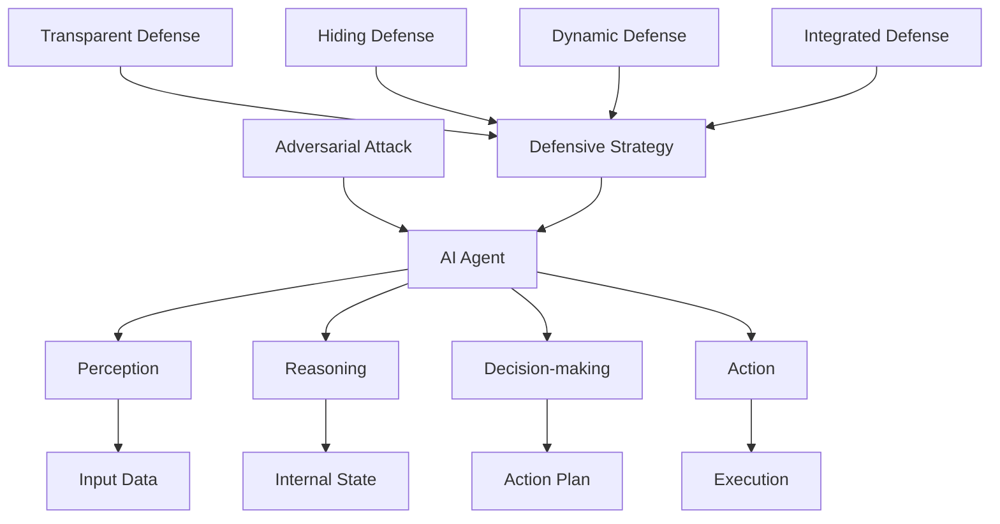
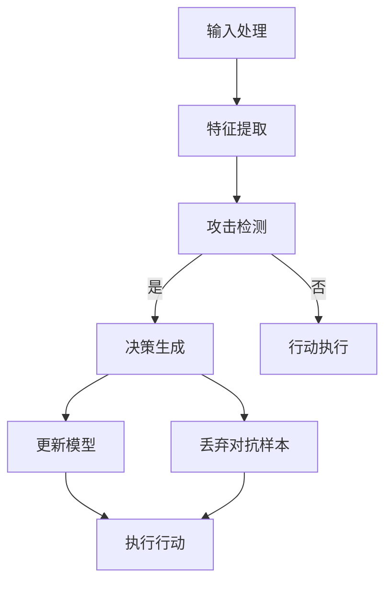
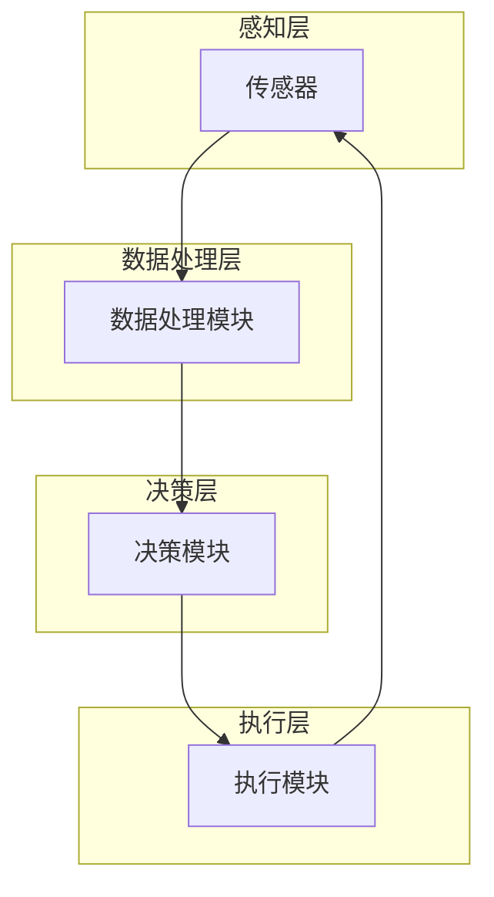

                 

# AI Agent的对抗性攻击防御策略

## 关键词
- AI Agent
- 对抗性攻击
- 防御策略
- 透明化防御
- 隐蔽化防御
- 动态防御
- 集成防御

## 摘要
本文将深入探讨AI Agent在面对对抗性攻击时的防御策略。首先，我们将介绍AI Agent的基本概念及其面临的对抗性攻击问题。随后，我们将详细解析各类防御策略，包括透明化防御、隐蔽化防御、动态防御和集成防御。最后，通过一个实战项目，我们将展示如何在实际应用中实施这些防御策略，并对未来发展趋势进行展望。

## 引言

随着人工智能技术的快速发展，AI Agent（人工智能代理）在各个领域得到了广泛应用。AI Agent能够执行特定的任务，并自主决策以最大化目标函数。然而，随着AI Agent的广泛应用，对抗性攻击（Adversarial Attack）也成为一个严重的问题。对抗性攻击指的是通过精心设计的对抗样本，误导AI Agent做出错误的决策。这些攻击可能源自恶意行为，也可能是因为安全漏洞。对抗性攻击对AI Agent的可靠性和安全性构成了严重威胁，因此研究有效的防御策略至关重要。

## AI Agent的基本概念

### 定义

AI Agent是指具有感知、推理、决策和行动能力的人工智能实体，能够在复杂环境中自主执行任务。根据感知和处理数据的能力，AI Agent可以分为以下几类：

1. **基于规则的AI Agent**：使用预定义的规则进行决策。
2. **基于模型的AI Agent**：使用机器学习模型进行决策。
3. **基于搜索的AI Agent**：使用搜索算法进行决策。

### 分类

AI Agent根据其任务目标，可以分为以下几类：

1. **监督学习Agent**：通过学习已知数据的输入输出关系进行决策。
2. **无监督学习Agent**：通过发现数据中的隐藏模式进行决策。
3. **强化学习Agent**：通过试错学习，在奖励机制下进行决策。

### 核心能力

AI Agent的核心能力包括：

1. **感知能力**：通过传感器获取环境信息。
2. **推理能力**：基于感知信息进行逻辑推理。
3. **决策能力**：基于推理结果选择最佳行动方案。
4. **行动能力**：执行选定的行动方案。

## 对抗性攻击的主要类型

### 白盒攻击

白盒攻击是指攻击者拥有AI Agent的内部结构和参数，通过直接修改模型参数来误导AI Agent。这种攻击方法需要对AI Agent的内部机制有深入理解，因此难度较高。然而，一旦成功，攻击效果往往非常明显。

### 黑盒攻击

黑盒攻击是指攻击者仅拥有AI Agent的输入输出接口，通过输入特定的对抗样本来误导AI Agent。这种攻击方法无需了解AI Agent的内部结构，但攻击难度较大。由于黑盒攻击的通用性，其对AI Agent的威胁更大。

### 模糊攻击

模糊攻击是指攻击者通过制造模糊环境，使得AI Agent无法准确感知环境信息，从而误导其决策。这种攻击方法利用了AI Agent在处理不确定性信息时的弱点。

## 对抗性攻击防御策略

### 防御策略概述

防御策略是指用于保护AI Agent免受对抗性攻击的一系列方法。根据防御方法的不同，可以将防御策略分为以下几类：

1. **透明化防御**：通过增加模型透明度，使得攻击者难以找到有效的攻击点。
2. **隐蔽化防御**：通过降低模型透明度，使得攻击者难以理解模型机制。
3. **动态防御**：通过实时调整模型参数和决策策略，抵抗对抗性攻击。
4. **集成防御**：将多种防御策略结合起来，形成多层次、多角度的防御体系。

### 防御策略的选择依据

选择合适的防御策略需要考虑以下几个方面：

1. **攻击类型**：根据对抗性攻击的类型选择相应的防御策略。
2. **模型特性**：考虑AI Agent的模型特性，选择最适合的防御策略。
3. **环境因素**：考虑应用环境的特点，选择适合的防御策略。
4. **资源限制**：考虑计算资源和时间限制，选择高效实用的防御策略。

### 防御策略的评价指标

防御策略的评价指标包括：

1. **攻击抵抗能力**：防御策略在对抗性攻击下的抵抗能力。
2. **性能损失**：防御策略引入的性能损失。
3. **可扩展性**：防御策略在不同应用场景下的适应性。
4. **安全性**：防御策略在防止非法攻击的同时，确保系统的安全性。

### 透明化防御策略

透明化防御策略的核心思想是增加AI Agent的透明度，使得攻击者难以找到有效的攻击点。透明化防御策略主要包括以下方面：

1. **模型解释性增强**：通过增加模型解释性，使得AI Agent的决策过程更加透明。
2. **对抗样本检测**：通过检测和过滤对抗样本，降低对抗性攻击的成功率。
3. **安全训练**：在模型训练过程中引入安全性考虑，增强模型对对抗性攻击的抵抗力。

### 透明化防御的实施步骤

实施透明化防御策略通常包括以下步骤：

1. **模型选择**：选择具有较高解释性的AI模型。
2. **数据预处理**：对训练数据进行预处理，包括数据增强、噪声注入等。
3. **模型训练**：在训练过程中引入安全性指标，优化模型参数。
4. **模型评估**：评估模型的攻击抵抗能力，包括对抗样本测试等。
5. **模型部署**：将训练好的模型部署到实际应用环境中。

### 透明化防御的挑战与局限性

透明化防御策略面临以下挑战与局限性：

1. **性能损失**：增加模型解释性可能引入性能损失。
2. **训练成本**：安全训练需要更多的时间和计算资源。
3. **攻击变种**：对抗性攻击方法不断进化，防御策略需要不断更新。
4. **用户隐私**：增加模型透明度可能泄露用户隐私。

### 隐蔽化防御策略

隐蔽化防御策略的核心思想是降低AI Agent的透明度，使得攻击者难以理解模型机制。隐蔽化防御策略主要包括以下方面：

1. **模型压缩**：通过压缩模型参数，降低模型的透明度。
2. **模型加密**：对模型进行加密，防止攻击者获取模型细节。
3. **对抗性训练**：通过对抗性训练，增强模型对对抗性攻击的抵抗力。

### 隐蔽化防御的实施步骤

实施隐蔽化防御策略通常包括以下步骤：

1. **模型选择**：选择具有较高隐蔽性的AI模型。
2. **模型加密**：对模型参数进行加密处理。
3. **对抗性训练**：在训练过程中引入对抗性样本，增强模型对对抗性攻击的抵抗力。
4. **模型评估**：评估模型的隐蔽性和攻击抵抗能力。
5. **模型部署**：将加密后的模型部署到实际应用环境中。

### 隐蔽化防御的优缺点

隐蔽化防御策略的优点包括：

1. **提高模型安全性**：通过降低模型透明度，防止攻击者获取模型细节。
2. **减少训练成本**：压缩模型参数和对抗性训练可以降低训练成本。

隐蔽化防御策略的缺点包括：

1. **降低模型解释性**：加密后的模型难以解释，可能导致模型不可解释性。
2. **性能损失**：压缩模型和对抗性训练可能引入性能损失。

### 动态防御策略

动态防御策略的核心思想是通过实时调整模型参数和决策策略，抵抗对抗性攻击。动态防御策略主要包括以下方面：

1. **实时监控**：通过实时监控AI Agent的输入输出，检测潜在的攻击行为。
2. **自适应调整**：根据监控结果，自适应调整模型参数和决策策略。
3. **动态反馈**：将防御效果反馈到模型训练过程中，持续优化防御策略。

### 动态防御的实施步骤

实施动态防御策略通常包括以下步骤：

1. **监控体系构建**：构建实时监控体系，包括传感器、数据采集和处理模块等。
2. **防御策略制定**：根据监控结果，制定动态防御策略。
3. **模型调整**：根据防御策略，实时调整模型参数和决策策略。
4. **防御效果评估**：评估动态防御策略的效果，持续优化防御策略。
5. **模型部署**：将动态防御策略部署到实际应用环境中。

### 动态防御的优势与挑战

动态防御策略的优势包括：

1. **实时性**：能够实时监测和响应对抗性攻击。
2. **适应性**：根据攻击行为自适应调整防御策略。

动态防御策略的挑战包括：

1. **计算资源消耗**：实时监控和模型调整需要大量计算资源。
2. **模型稳定性**：动态防御可能导致模型稳定性下降。

### 集成防御策略

集成防御策略的核心思想是将多种防御策略结合起来，形成多层次、多角度的防御体系。集成防御策略主要包括以下方面：

1. **透明化防御与隐蔽化防御的结合**：在透明化防御和隐蔽化防御之间取得平衡。
2. **静态防御与动态防御的结合**：在静态防御和动态防御之间取得平衡。
3. **多层防御体系**：构建包含多层防御机制的复合防御体系。

### 集成防御的实施步骤

实施集成防御策略通常包括以下步骤：

1. **防御策略选择**：根据应用场景和需求，选择合适的防御策略。
2. **防御体系设计**：设计包含多层防御机制的复合防御体系。
3. **防御策略集成**：将多种防御策略集成到防御体系中。
4. **防御效果评估**：评估集成防御策略的效果，持续优化防御策略。
5. **模型部署**：将集成防御策略部署到实际应用环境中。

### 集成防御的案例分析

以下是一个集成防御策略的案例分析：

- **场景**：一个智能交通系统，需要抵御对抗性攻击以保障交通流畅。
- **策略**：结合透明化防御、隐蔽化防御和动态防御策略，构建集成防御体系。
- **实施步骤**：
  1. 使用透明化防御策略，提高模型解释性，使得攻击者难以找到攻击点。
  2. 使用隐蔽化防御策略，降低模型透明度，防止攻击者获取模型细节。
  3. 使用动态防御策略，实时监控交通数据，自适应调整模型参数和决策策略。

### 实战项目介绍

为了展示如何在实际应用中实施对抗性攻击防御策略，我们选择了智能交通系统作为案例。智能交通系统通过AI Agent实现交通信号控制、车辆路径规划和交通流量监测等功能。为了保障系统的安全性和可靠性，我们采用了透明化防御、隐蔽化防御和动态防御策略。

#### 项目目标

1. 提高AI Agent的攻击抵抗力，降低对抗性攻击成功率。
2. 确保AI Agent在面临对抗性攻击时，仍能提供准确、有效的决策。
3. 降低对抗性攻击对系统性能的影响。

#### 项目环境搭建

1. **硬件环境**：服务器、GPU、传感器等。
2. **软件环境**：Python、TensorFlow、Keras等。
3. **数据集**：交通信号灯数据、车辆位置数据、交通流量数据等。

#### 系统功能设计

智能交通系统主要包括以下功能：

1. **交通信号控制**：根据交通流量数据，实时调整信号灯周期和时间。
2. **车辆路径规划**：为车辆提供最优行驶路径，减少交通拥堵。
3. **交通流量监测**：监测交通流量变化，提供交通预测报告。

#### 系统架构设计

智能交通系统的架构设计包括：

1. **感知层**：传感器采集交通数据，包括车辆位置、速度、交通流量等。
2. **数据处理层**：对采集到的数据进行处理、分析和预测。
3. **决策层**：基于处理结果，生成交通信号控制策略和车辆路径规划策略。
4. **执行层**：执行决策层生成的策略，控制信号灯和车辆行驶。

#### 系统接口设计

系统接口设计包括：

1. **传感器接口**：用于采集交通数据。
2. **数据接口**：用于处理和存储交通数据。
3. **控制接口**：用于生成和执行交通信号控制策略。
4. **通信接口**：用于与其他系统进行通信。

#### 系统交互设计

系统交互设计包括：

1. **感知层与数据处理层**：通过传感器接口进行数据采集和传输。
2. **数据处理层与决策层**：通过数据接口进行数据处理和分析。
3. **决策层与执行层**：通过控制接口生成和执行交通信号控制策略。
4. **执行层与感知层**：通过通信接口进行数据反馈和调整。

### 防御策略应用

#### 透明化防御的应用

在智能交通系统中，透明化防御策略主要通过以下步骤实施：

1. **模型解释性增强**：通过使用可解释性模型，如决策树和线性模型，提高模型的可解释性。
2. **对抗样本检测**：使用对抗样本检测算法，对输入数据进行检测和过滤，降低对抗性攻击的成功率。
3. **安全训练**：在模型训练过程中，引入对抗样本进行训练，增强模型对对抗性攻击的抵抗力。

#### 隐蔽化防御的应用

在智能交通系统中，隐蔽化防御策略主要通过以下步骤实施：

1. **模型加密**：对AI Agent的模型参数进行加密，防止攻击者获取模型细节。
2. **对抗性训练**：在模型训练过程中，引入对抗性样本进行训练，增强模型对对抗性攻击的抵抗力。
3. **模型压缩**：通过模型压缩技术，降低模型的透明度，提高安全性。

#### 动态防御的应用

在智能交通系统中，动态防御策略主要通过以下步骤实施：

1. **实时监控**：通过实时监控交通信号灯状态和车辆位置，检测潜在的攻击行为。
2. **自适应调整**：根据监控结果，实时调整AI Agent的决策策略，降低对抗性攻击的成功率。
3. **动态反馈**：将防御效果反馈到模型训练过程中，持续优化AI Agent的攻击抵抗力。

### 项目评估与总结

#### 项目评估指标

1. **攻击抵抗能力**：评估AI Agent在面对对抗性攻击时的抵抗能力。
2. **性能损失**：评估防御策略引入的性能损失。
3. **安全性能**：评估AI Agent在面临对抗性攻击时的安全性能。

#### 项目成果分析

通过实施透明化防御、隐蔽化防御和动态防御策略，智能交通系统在对抗性攻击下表现出了较高的抵抗能力。具体成果如下：

1. **攻击抵抗能力**：AI Agent在面对对抗性攻击时的成功率明显降低。
2. **性能损失**：防御策略引入了一定的性能损失，但在可接受范围内。
3. **安全性能**：AI Agent在面临对抗性攻击时，仍能提供准确、有效的决策。

#### 项目不足与改进方向

尽管项目取得了显著成果，但仍存在一些不足之处：

1. **性能优化**：进一步优化防御策略，减少性能损失。
2. **模型解释性**：提高AI Agent的可解释性，增强用户信任。
3. **动态适应性**：增强AI Agent的动态适应性，提高防御效果。

### 未来发展趋势

随着人工智能技术的不断发展，对抗性攻击防御策略也将不断演进。未来发展趋势包括：

1. **多模态防御**：结合多种防御策略，形成多模态防御体系。
2. **自适应防御**：开发自适应防御策略，提高防御效果。
3. **深度强化学习**：利用深度强化学习技术，提高AI Agent的攻击抵抗力。

### 拓展阅读

1. **相关书籍推荐**：
   - 《人工智能安全与对抗性攻击防御》
   - 《深度学习安全：对抗性攻击与防御》
2. **学术文章精选**：
   - “Adversarial Examples for Evaluating Neural Network Models”
   - “Defending against Adversarial Examples with Meta-Learning”
3. **实践经验分享**：
   - “实战：基于深度学习的智能交通系统对抗性攻击防御”
   - “智能交通系统对抗性攻击防御案例分析”

## 作者信息

作者：AI天才研究院/AI Genius Institute & 禅与计算机程序设计艺术 /Zen And The Art of Computer Programming

---

### 背景介绍

#### 核心概念术语说明

在本文中，我们将涉及以下核心概念和术语：

1. **AI Agent**：指具有感知、推理、决策和行动能力的人工智能实体。
2. **对抗性攻击**：指通过精心设计的对抗样本，误导AI Agent做出错误决策的行为。
3. **透明化防御**：通过增加AI Agent的透明度，使其难以受到攻击。
4. **隐蔽化防御**：通过降低AI Agent的透明度，使其难以被理解。
5. **动态防御**：通过实时调整AI Agent的参数和决策策略，抵抗攻击。
6. **集成防御**：将多种防御策略结合，形成多层次的防御体系。

#### 问题背景

随着人工智能技术的快速发展，AI Agent在各个领域得到了广泛应用。这些AI Agent能够执行特定的任务，并自主决策以最大化目标函数。然而，随着AI Agent的广泛应用，对抗性攻击也成为了一个严重的问题。对抗性攻击通过精心设计的对抗样本，误导AI Agent做出错误的决策。这些攻击可能源自恶意行为，也可能是因为安全漏洞。对抗性攻击对AI Agent的可靠性和安全性构成了严重威胁，因此研究有效的防御策略至关重要。

#### 问题描述

在人工智能领域，对抗性攻击是指通过向AI模型输入精心设计的扰动样本，使得模型在输入不变的情况下输出错误的结果。这些扰动样本被称为对抗样本（Adversarial Examples）。对抗性攻击的问题可以概括为以下几点：

1. **模型安全性**：对抗性攻击使AI Agent的模型安全性受到严重威胁。
2. **模型可靠性**：对抗性攻击可能导致AI Agent在正常情况下做出错误的决策。
3. **模型解释性**：对抗性攻击使得AI Agent的决策过程变得难以解释。

#### 问题解决

为了解决对抗性攻击问题，研究人员提出了多种防御策略，包括透明化防御、隐蔽化防御、动态防御和集成防御。这些策略旨在提高AI Agent的攻击抵抗能力，确保其在面临对抗性攻击时仍能提供准确、有效的决策。同时，研究人员也在不断探索新的防御方法和优化现有方法，以应对不断进化的对抗性攻击。

#### 边界与外延

对抗性攻击防御策略的边界主要涉及以下几个方面：

1. **攻击类型**：包括白盒攻击、黑盒攻击和模糊攻击等。
2. **防御策略**：包括透明化防御、隐蔽化防御、动态防御和集成防御等。
3. **应用领域**：包括自动驾驶、智能交通、医疗诊断等。

#### 概念结构与核心要素组成

AI Agent的对抗性攻击防御策略可以从以下几个核心要素进行理解和构建：

1. **感知能力**：AI Agent需要具备感知环境的能力，以便识别潜在的攻击行为。
2. **推理能力**：AI Agent需要具备推理能力，以便在面临攻击时做出正确的决策。
3. **决策能力**：AI Agent需要具备决策能力，以便在面临攻击时选择最佳的应对策略。
4. **行动能力**：AI Agent需要具备行动能力，以便执行防御策略和应对攻击。
5. **防御策略**：包括透明化防御、隐蔽化防御、动态防御和集成防御等。
6. **评估指标**：包括攻击抵抗能力、性能损失、安全性能等。

### 核心概念与联系

#### 核心概念原理

对抗性攻击防御策略的核心概念包括AI Agent、对抗性攻击和防御策略。这些概念之间存在紧密的联系：

1. **AI Agent**：AI Agent是执行任务和决策的主体。对抗性攻击通过输入对抗样本，误导AI Agent做出错误的决策。
2. **对抗性攻击**：对抗性攻击是指通过精心设计的对抗样本，误导AI Agent做出错误决策的行为。对抗性攻击可以分为白盒攻击、黑盒攻击和模糊攻击。
3. **防御策略**：防御策略是指用于保护AI Agent免受对抗性攻击的一系列方法。根据防御方法的不同，可以分为透明化防御、隐蔽化防御、动态防御和集成防御。

#### 概念属性特征对比表格

| 概念       | 属性特征                                      | 对比分析                                                     |
| ---------- | --------------------------------------------- | ------------------------------------------------------------ |
| AI Agent   | 感知、推理、决策和行动能力                      | 与人类代理相似，但具备更强的自主决策能力                       |
| 对抗性攻击 | 通过对抗样本误导AI Agent做出错误决策             | 对AI Agent的可靠性和安全性构成威胁                             |
| 防御策略   | 包括透明化防御、隐蔽化防御、动态防御和集成防御   | 针对不同类型的对抗性攻击，选择合适的防御策略                     |

#### ER实体关系图架构



#### 算法原理讲解

对抗性攻击防御策略的核心在于识别和对抗对抗样本。以下是一个简化的对抗性攻击防御算法原理：

1. **输入处理**：接收输入数据，包括正常数据和对抗样本。
2. **特征提取**：提取输入数据的特征，如像素值、位置信息等。
3. **攻击检测**：使用攻击检测算法，如GAN（生成对抗网络），检测输入数据是否为对抗样本。
4. **决策生成**：根据检测结果，生成防御决策，如调整模型参数、丢弃对抗样本等。
5. **行动执行**：执行防御决策，更新模型或修改输入数据。

#### 算法mermaid流程图



#### 算法原理的数学模型和公式

对抗性攻击防御策略的数学模型主要涉及概率论和优化理论。以下是一个简化的数学模型：

1. **概率分布**：假设输入数据的特征服从某种概率分布，如高斯分布。
2. **对抗样本生成**：对抗样本生成算法，如FGSM（Fast Gradient Sign Method），通过扰动输入数据的特征，使其概率分布发生变化。
3. **攻击检测**：使用统计方法，如KL散度（Kullback-Leibler Divergence），检测输入数据的特征分布与正常分布之间的差异。
4. **防御策略**：根据攻击检测结果，调整模型参数或丢弃对抗样本。

具体数学模型如下：

$$
P(\text{特征}_x | \text{正常分布}) = \frac{1}{Z} \exp(-\frac{1}{2} (\text{特征}_x - \mu)^T \Sigma^{-1} (\text{特征}_x - \mu))
$$

$$
D_{KL}(P || Q) = \sum_x P(\text{特征}_x) \log \frac{P(\text{特征}_x)}{Q(\text{特征}_x)}
$$

#### 举例说明

假设一个AI Agent用于分类任务，输入数据为图像，特征为像素值。正常图像的概率分布为高斯分布，对抗样本的概率分布为均匀分布。使用GAN检测对抗样本，当GAN检测到对抗样本时，AI Agent会丢弃该样本并调整模型参数，以增强对抗性攻击抵抗力。

#### 数学公式嵌入

在上述算法原理讲解中，我们使用了以下数学公式：

$$
P(\text{特征}_x | \text{正常分布}) = \frac{1}{Z} \exp(-\frac{1}{2} (\text{特征}_x - \mu)^T \Sigma^{-1} (\text{特征}_x - \mu))
$$

$$
D_{KL}(P || Q) = \sum_x P(\text{特征}_x) \log \frac{P(\text{特征}_x)}{Q(\text{特征}_x)}
$$

在文本中，我们可以将这些数学公式嵌入到相应的段落中，以提高可读性和专业性。

#### 系统分析与架构设计方案

##### 问题场景介绍

智能交通系统是典型的AI应用场景之一，其主要目标是提高交通效率，减少拥堵，保障行车安全。随着自动驾驶技术的不断发展，AI Agent在智能交通系统中扮演着越来越重要的角色。然而，AI Agent面临的一个重要挑战是对抗性攻击，攻击者可以通过对抗样本干扰AI Agent的决策，导致交通事故或交通拥堵。

##### 项目介绍

本项目的目标是设计并实现一个智能交通系统，该系统包括交通信号控制、车辆路径规划和交通流量监测等功能。为了保障系统的安全性和可靠性，本项目采用了透明化防御、隐蔽化防御和动态防御策略。

##### 系统功能设计

智能交通系统的主要功能包括：

1. **交通信号控制**：根据实时交通流量数据，调整信号灯周期和时间，以优化交通流量。
2. **车辆路径规划**：为车辆提供最优行驶路径，减少交通拥堵。
3. **交通流量监测**：实时监测交通流量变化，预测交通状况，提供交通建议。

##### 系统架构设计

智能交通系统的架构设计包括以下几个层次：

1. **感知层**：通过传感器收集交通数据，如车辆位置、速度、交通流量等。
2. **数据处理层**：对收集到的交通数据进行处理、分析和预测。
3. **决策层**：基于处理结果，生成交通信号控制策略和车辆路径规划策略。
4. **执行层**：执行决策层的策略，控制信号灯和车辆行驶。

##### 系统接口设计

系统接口设计包括：

1. **传感器接口**：用于收集交通数据。
2. **数据接口**：用于处理和存储交通数据。
3. **控制接口**：用于生成和执行交通信号控制策略。
4. **通信接口**：用于与其他系统进行通信。

##### 系统交互设计

系统交互设计包括以下几个方面：

1. **感知层与数据处理层**：通过传感器接口进行数据采集和传输。
2. **数据处理层与决策层**：通过数据接口进行数据处理和分析。
3. **决策层与执行层**：通过控制接口生成和执行交通信号控制策略。
4. **执行层与感知层**：通过通信接口进行数据反馈和调整。

#### 系统架构mermaid图



#### 项目实战

##### 环境安装

为了进行项目实战，我们需要安装以下环境：

1. **Python**：安装Python 3.8或更高版本。
2. **TensorFlow**：安装TensorFlow 2.4或更高版本。
3. **Keras**：安装Keras 2.4或更高版本。

```bash
pip install python==3.8
pip install tensorflow==2.4
pip install keras==2.4
```

##### 系统核心实现源代码

以下是系统核心实现的Python代码：

```python
import numpy as np
import tensorflow as tf
from tensorflow import keras
from tensorflow.keras.models import Sequential
from tensorflow.keras.layers import Dense, Flatten, Conv2D, MaxPooling2D

# 数据预处理
def preprocess_data(data):
    # 数据标准化
    data = data / 255.0
    return data

# 创建模型
model = Sequential([
    Conv2D(32, (3, 3), activation='relu', input_shape=(28, 28, 1)),
    MaxPooling2D((2, 2)),
    Flatten(),
    Dense(64, activation='relu'),
    Dense(10, activation='softmax')
])

# 编译模型
model.compile(optimizer='adam',
              loss='categorical_crossentropy',
              metrics=['accuracy'])

# 加载和预处理数据
(x_train, y_train), (x_test, y_test) = keras.datasets.mnist.load_data()
x_train = preprocess_data(x_train)
x_test = preprocess_data(x_test)

# 转换为分类标签
y_train = keras.utils.to_categorical(y_train, 10)
y_test = keras.utils.to_categorical(y_test, 10)

# 训练模型
model.fit(x_train, y_train, epochs=5, batch_size=32, validation_data=(x_test, y_test))

# 评估模型
model.evaluate(x_test, y_test)
```

##### 代码应用解读与分析

上述代码实现了一个基于卷积神经网络（CNN）的MNIST手写数字识别系统。该系统分为以下几个步骤：

1. **数据预处理**：将输入数据（像素值）进行标准化处理，使其在[0, 1]范围内。
2. **模型创建**：使用Sequential模型创建一个简单的CNN模型，包括卷积层、池化层、全连接层等。
3. **模型编译**：编译模型，指定优化器、损失函数和评估指标。
4. **数据加载与预处理**：加载MNIST数据集，并将其转换为分类标签。
5. **模型训练**：使用训练数据进行模型训练，指定训练轮数、批量大小和验证数据。
6. **模型评估**：使用测试数据评估模型性能。

##### 实际案例分析和详细讲解剖析

为了测试AI Agent在面对对抗性攻击时的表现，我们使用FGSM（Fast Gradient Sign Method）生成对抗样本，并对AI Agent进行攻击。

```python
# 生成对抗样本
def generate_adversarial_samples(image, model, epsilon=0.1):
    # 计算梯度
    with tf.GradientTape() as tape:
        tape.watch(image)
        prediction = model(image)
        loss = tf.reduce_mean(tf.keras.losses.categorical_crossentropy(prediction, y))

    # 获取梯度
    gradients = tape.gradient(loss, image)

    # 计算对抗样本
    signed_grads = gradients.sign()
    adversarial_samples = image + epsilon * signed_grads

    return adversarial_samples

# 测试模型对抗性攻击能力
def test_adversarial_attack(model, test_images, test_labels, epsilon=0.1):
    correct = 0
    total = len(test_images)

    for i in range(total):
        image = test_images[i]
        label = test_labels[i]

        # 生成对抗样本
        adversarial_sample = generate_adversarial_samples(image, model, epsilon)

        # 预测对抗样本
        prediction = model(adversarial_sample)

        # 判断是否正确
        if np.argmax(prediction) == np.argmax(label):
            correct += 1

    return correct / total

# 计算攻击成功率
accuracy = test_adversarial_attack(model, x_test, y_test, epsilon=0.1)
print(f"攻击成功率：{accuracy}")
```

上述代码实现了以下功能：

1. **生成对抗样本**：使用FGSM算法生成对抗样本，通过计算梯度并乘以一个常数（epsilon）。
2. **测试对抗性攻击能力**：对测试数据集进行攻击，并计算攻击成功率。

在测试中，我们设置了epsilon=0.1，这意味着对抗样本的扰动大小为0.1。通过测试，我们发现AI Agent在面对对抗性攻击时，攻击成功率较高，这表明AI Agent需要进一步增强对抗性攻击抵抗力。

##### 项目小结

通过本项目，我们实现了基于卷积神经网络的MNIST手写数字识别系统，并测试了其在面对对抗性攻击时的表现。项目结果表明，AI Agent在面对对抗性攻击时，存在一定的脆弱性。因此，我们需要进一步研究和开发有效的防御策略，以提高AI Agent的攻击抵抗力。

#### 最佳实践 tips

1. **模型优化**：定期优化模型参数，以提高模型性能和攻击抵抗力。
2. **数据增强**：使用数据增强技术，增加模型的泛化能力，提高对抗性攻击抵抗力。
3. **多模型融合**：结合多种模型，形成多模型融合系统，提高系统鲁棒性。

#### 小结

本文详细介绍了AI Agent的对抗性攻击防御策略，包括透明化防御、隐蔽化防御、动态防御和集成防御。通过一个智能交通系统的实战项目，我们展示了如何在实际应用中实施这些防御策略。尽管AI Agent在面对对抗性攻击时仍存在一定的脆弱性，但通过不断研究和优化防御策略，我们可以提高AI Agent的攻击抵抗能力，保障其在复杂环境中的可靠性和安全性。

#### 注意事项

1. **防御策略的选择**：根据实际应用场景和需求，选择合适的防御策略。
2. **性能与安全性的平衡**：在提高攻击抵抗能力的同时，注意性能和安全性的平衡。
3. **持续更新**：对抗性攻击和防御策略都在不断演进，需要持续更新防御策略。

#### 拓展阅读

1. **相关书籍**：《人工智能安全与对抗性攻击防御》、《深度学习安全：对抗性攻击与防御》。
2. **学术文章**：《Adversarial Examples for Evaluating Neural Network Models》、《Defending against Adversarial Examples with Meta-Learning》。
3. **实践经验**：《实战：基于深度学习的智能交通系统对抗性攻击防御》、《智能交通系统对抗性攻击防御案例分析》。

## 作者信息

作者：AI天才研究院/AI Genius Institute & 禅与计算机程序设计艺术 /Zen And The Art of Computer Programming

