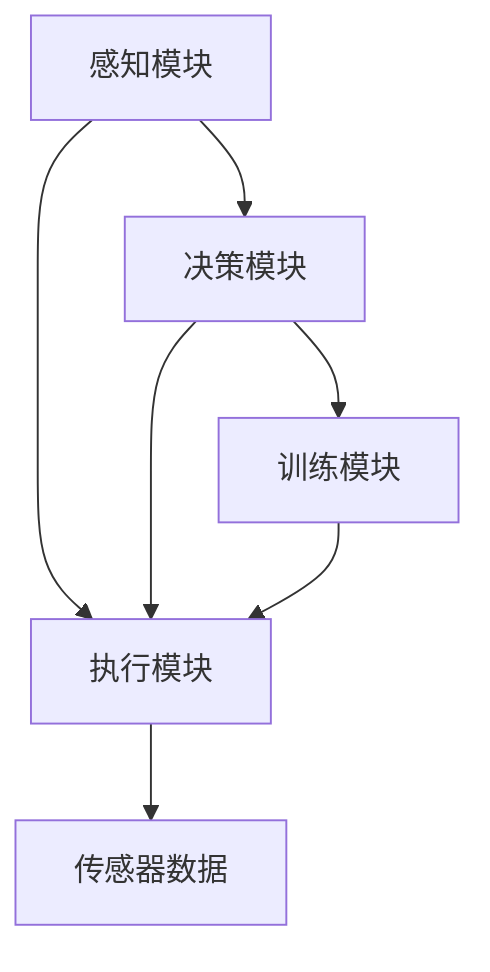
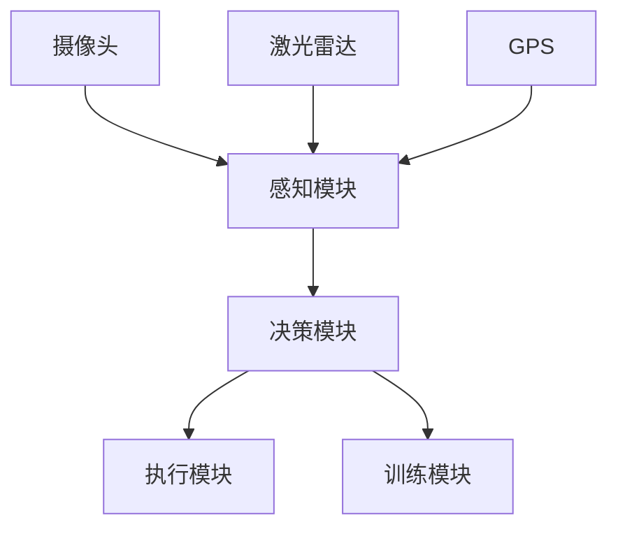
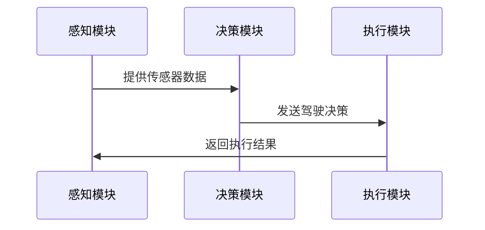

                 

# 《AI Agent的强化学习机制实现》

## 关键词

- **AI Agent**、**强化学习**、**Q-learning**、**DQN**、**PPO**、**系统架构设计**、**项目实战**

## 摘要

本文将深入探讨AI Agent的强化学习机制实现。首先，我们将介绍AI Agent和强化学习的基本概念，解析两者之间的联系。接着，我们将详细讲解强化学习算法，包括Q-learning、SARSA和深度强化学习算法DQN、PPO。随后，我们将分析强化学习在AI Agent中的应用案例，并设计一个具体的系统架构方案。通过一个实际项目实战，我们将展示如何实现强化学习机制，并提供最佳实践tips。本文旨在为读者提供一个全面、系统的强化学习在AI Agent中的实现指南。

## 引言

### 1.1 问题背景与意义

#### 1.1.1 AI Agent的概念

AI Agent，即人工智能代理，是一个在特定环境下自主决策和执行任务的实体。它能够感知环境状态，根据内部策略选择动作，并通过反馈调整自身行为以实现特定目标。在自动化、智能决策和机器人等领域，AI Agent具有广泛的应用前景。

#### 1.1.2 强化学习在AI Agent中的应用

强化学习是一种通过试错和奖励机制来学习决策策略的方法。在AI Agent中，强化学习可用于自主学习和优化策略，使其在复杂环境中实现高效决策。例如，在游戏AI、机器人运动控制和自动驾驶等领域，强化学习已取得了显著成果。

#### 1.1.3 强化学习机制的挑战与机遇

虽然强化学习在AI Agent中具有广泛的应用前景，但实现强化学习机制仍面临诸多挑战。例如，如何设计高效的学习算法、处理高维状态空间和动作空间、避免过度拟合和奖励工程等问题。然而，随着算法和硬件技术的不断发展，强化学习在AI Agent中的应用将不断拓展。

### 1.2 书籍结构安排与读者定位

#### 1.2.1 目录结构安排

本文分为六个部分：引言、核心概念与联系、算法原理讲解、系统分析与架构设计方案、项目实战和最佳实践tips。每个部分都将深入探讨强化学习在AI Agent中的应用。

#### 1.2.2 读者定位与学习目标

本文适用于具备一定编程和机器学习基础的技术人员，包括AI研发人员、算法工程师和软件架构师等。通过本文的学习，读者将能够：

1. 理解AI Agent和强化学习的基本概念。
2. 掌握强化学习算法的原理和实现。
3. 设计和实现基于强化学习的AI Agent系统。
4. 分析和优化强化学习在AI Agent中的应用。

### 1.3 本章小结

本章介绍了AI Agent的强化学习机制实现的问题背景和意义，以及本文的结构安排和读者定位。接下来，我们将深入探讨AI Agent和强化学习的基本概念，为后续内容打下基础。

## 第2章 核心概念与联系

### 2.1 强化学习基本概念

#### 2.1.1 强化学习的定义

强化学习（Reinforcement Learning，RL）是一种机器学习方法，它通过智能体（Agent）在与环境（Environment）交互的过程中，不断学习并优化策略（Policy），以实现特定目标。与监督学习和无监督学习不同，强化学习不依赖于大量标注数据，而是通过试错和反馈机制来学习。

#### 2.1.2 强化学习的基本要素

强化学习包含以下基本要素：

1. **智能体（Agent）**：执行动作、感知环境状态的实体。
2. **环境（Environment）**：智能体执行动作的场所。
3. **状态（State）**：环境的一个具体描述。
4. **动作（Action）**：智能体在特定状态下执行的行为。
5. **奖励（Reward）**：智能体执行动作后获得的即时反馈。
6. **策略（Policy）**：智能体根据状态选择动作的规则。

#### 2.1.3 强化学习的分类

强化学习可以分为以下几类：

1. **基于值的方法**：使用值函数来评估状态值或状态-动作值，如Q-learning。
2. **基于策略的方法**：直接优化策略，如策略梯度方法。
3. **基于模型的方法**：构建环境模型，如模型预测控制。
4. **深度强化学习**：使用深度神经网络来近似值函数或策略。

### 2.2 AI Agent基本概念

#### 2.2.1 AI Agent的定义

AI Agent是人工智能领域的一个核心概念，它是一个能够在特定环境中通过感知、学习和决策来完成任务或达成目标的实体。AI Agent具有以下特点：

1. **自主性**：能够独立执行任务，不需要人工干预。
2. **适应性**：能够根据环境变化调整自身行为。
3. **智能性**：能够通过学习和优化策略来提高任务完成度。

#### 2.2.2 AI Agent的基本组成部分

AI Agent通常由以下几部分组成：

1. **感知模块**：用于感知环境状态。
2. **决策模块**：根据感知状态选择最优动作。
3. **执行模块**：执行决策模块选择的动作。
4. **学习模块**：通过反馈调整策略，实现自适应学习。

#### 2.2.3 AI Agent的分类

AI Agent可以根据应用场景和任务类型进行分类：

1. **基于规则的AI Agent**：使用预定义的规则进行决策。
2. **基于模型的AI Agent**：使用模型来预测环境状态和动作效果。
3. **基于数据的AI Agent**：使用历史数据来学习策略。
4. **混合型AI Agent**：结合多种方法进行决策和学习。

### 2.3 强化学习在AI Agent中的应用

#### 2.3.1 强化学习在AI Agent中的作用

强化学习在AI Agent中的作用主要体现在以下几个方面：

1. **自主学习**：AI Agent可以通过强化学习自主探索环境，学习最优策略。
2. **自适应决策**：AI Agent可以根据环境变化调整策略，实现自适应决策。
3. **优化性能**：强化学习可以帮助AI Agent在复杂环境中实现高效决策，提高任务完成度。

#### 2.3.2 强化学习在AI Agent中的挑战

虽然强化学习在AI Agent中具有广泛的应用前景，但实现强化学习机制仍面临诸多挑战：

1. **高维状态空间和动作空间**：处理高维状态空间和动作空间，需要设计高效的学习算法。
2. **奖励工程**：设计合理的奖励机制，确保AI Agent能够正确学习。
3. **探索与利用平衡**：在探索新策略和利用已有策略之间找到平衡点。
4. **长期奖励优化**：确保AI Agent能够学习到长期的、稳定的策略。

### 2.4 本章小结

本章介绍了强化学习的基本概念和AI Agent的基本概念，并探讨了强化学习在AI Agent中的应用及其挑战。在接下来的章节中，我们将详细讲解强化学习算法的原理和实现。

## 第3章 算法原理讲解

### 3.1 强化学习算法原理

#### 3.1.1 Q-learning算法

**Q-learning算法原理**：

Q-learning是一种基于值函数的强化学习算法，旨在通过学习状态-动作值函数（Q值）来选择最优动作。在Q-learning中，智能体根据当前状态和动作选择策略，并通过更新Q值来优化策略。

**Q-learning算法实现**：

1. **初始化**：随机初始化Q值矩阵。
2. **循环**：
   - 选择动作：根据当前状态和策略选择动作。
   - 执行动作：在环境中执行选择出的动作。
   - 获取奖励：根据执行的动作获取奖励。
   - 更新Q值：使用如下公式更新Q值：

     $$ Q(s, a) \leftarrow Q(s, a) + \alpha [r + \gamma \max_{a'} Q(s', a') - Q(s, a)] $$

   其中，$s$表示状态，$a$表示动作，$r$表示奖励，$\alpha$表示学习率，$\gamma$表示折扣因子，$s'$表示下一状态，$a'$表示下一动作。

#### 3.1.2 SARSA算法

**SARSA算法原理**：

SARSA（同步强化学习算法）是一种基于策略的强化学习算法，它使用当前状态和下一状态来更新Q值。与Q-learning不同，SARSA在每一步都使用当前的动作和下一状态来计算Q值。

**SARSA算法实现**：

1. **初始化**：随机初始化Q值矩阵。
2. **循环**：
   - 选择动作：根据当前状态和策略选择动作。
   - 执行动作：在环境中执行选择出的动作。
   - 获取奖励：根据执行的动作获取奖励。
   - 更新Q值：使用如下公式更新Q值：

     $$ Q(s, a) \leftarrow Q(s, a) + \alpha [r + \gamma Q(s', a')] - Q(s, a)] $$

   其中，$s$表示状态，$a$表示动作，$r$表示奖励，$\alpha$表示学习率，$\gamma$表示折扣因子，$s'$表示下一状态，$a'$表示下一动作。

#### 3.2 深度强化学习算法

**3.2.1 DQN算法**

**DQN算法原理**：

DQN（Deep Q-Network）是一种基于深度神经网络的强化学习算法，它使用深度神经网络来近似Q值函数。DQN通过经验回放和目标网络来稳定学习过程，并解决奖励偏置和分布偏移问题。

**DQN算法实现**：

1. **初始化**：随机初始化Q值网络和目标网络。
2. **经验回放**：将历史经验存储在经验回放池中，避免样本偏差。
3. **循环**：
   - 选择动作：使用ε-贪心策略选择动作。
   - 执行动作：在环境中执行选择出的动作。
   - 获取奖励：根据执行的动作获取奖励。
   - 更新Q值网络：使用如下公式更新Q值网络：

     $$ Q(s, a) \leftarrow Q(s, a) + \alpha [r + \gamma \max_{a'} Q(s', a') - Q(s, a)] $$

   其中，$s$表示状态，$a$表示动作，$r$表示奖励，$\alpha$表示学习率，$\gamma$表示折扣因子，$s'$表示下一状态，$a'$表示下一动作。
4. **更新目标网络**：定期将Q值网络权重复制到目标网络。

**3.2.2 PPO算法**

**PPO算法原理**：

PPO（Proximal Policy Optimization）是一种基于策略梯度的强化学习算法，它通过优化策略梯度和价值函数来更新策略参数。PPO通过剪辑策略梯度来提高算法的稳定性，并避免过度更新。

**PPO算法实现**：

1. **初始化**：随机初始化策略网络和价值网络。
2. **循环**：
   - 选择动作：使用当前策略网络选择动作。
   - 执行动作：在环境中执行选择出的动作。
   - 获取奖励：根据执行的动作获取奖励。
   - 计算优势函数：计算当前策略下的优势函数。
   - 更新策略网络：使用如下公式更新策略网络：

     $$ \nabla_{\theta} \log \pi(a|s;\theta) \leftarrow \frac{\sum_{t} \nabla_{\theta} \log \pi(a|s;\theta) A_t}{\sum_{t} | \nabla_{\theta} \log \pi(a|s;\theta) |} $$

   其中，$\theta$表示策略参数，$a$表示动作，$s$表示状态，$\pi(a|s;\theta)$表示策略概率，$A_t$表示优势函数。
3. **更新价值网络**：使用如下公式更新价值网络：

   $$ V(s) \leftarrow V(s) + \alpha [r + \gamma V(s') - V(s)] $$

   其中，$s$表示状态，$r$表示奖励，$\alpha$表示学习率，$\gamma$表示折扣因子，$s'$表示下一状态。

### 3.3 强化学习在AI Agent中的应用案例分析

#### 3.3.1 游戏AI案例分析

**游戏AI案例分析**：

游戏AI是强化学习在AI Agent中的典型应用之一。通过强化学习，游戏AI可以学会在游戏中做出最优决策，从而实现自主游戏。例如，在经典的Atari游戏《Pong》中，使用DQN算法训练的游戏AI可以学会控制乒乓球拍，实现自主游戏。

**实现步骤**：

1. **预处理**：对游戏画面进行预处理，提取有效信息。
2. **环境搭建**：搭建Atari游戏环境，并实现游戏界面。
3. **DQN算法实现**：使用DQN算法训练游戏AI，实现自主游戏。

#### 3.3.2 机器人运动控制案例分析

**机器人运动控制案例分析**：

机器人运动控制是强化学习在AI Agent中的另一个重要应用。通过强化学习，机器人可以学会在复杂环境中进行自主运动和避障。

**实现步骤**：

1. **环境建模**：建立机器人运动环境模型，包括障碍物、目标位置等。
2. **感知模块设计**：设计机器人感知模块，用于获取环境状态。
3. **决策模块设计**：设计机器人决策模块，使用强化学习算法实现自主运动。

### 3.4 本章小结

本章介绍了强化学习算法的基本原理和实现方法，包括Q-learning、SARSA、DQN和PPO等算法。同时，我们通过游戏AI和机器人运动控制案例，展示了强化学习在AI Agent中的应用。在下一章中，我们将分析强化学习在AI Agent中的应用场景和挑战。

## 第4章 系统分析与架构设计方案

### 4.1 问题场景介绍

在本章中，我们将探讨一个具体的AI Agent应用场景：自动驾驶。自动驾驶系统需要实时感知周围环境，做出安全、高效的驾驶决策。该场景具有以下特点：

1. **高维状态空间**：自动驾驶系统需要处理大量传感器数据，包括摄像头、激光雷达、GPS等，状态空间维度较高。
2. **复杂动作空间**：自动驾驶系统需要选择一系列动作，包括加速、减速、转向等，动作空间复杂。
3. **实时性要求**：自动驾驶系统需要在短时间内做出决策，实时性要求高。

### 4.2 项目介绍

本项目的目标是设计并实现一个基于强化学习的自动驾驶系统。该系统将使用传感器数据作为输入，通过强化学习算法训练自动驾驶模型，实现自主驾驶。项目的主要目标包括：

1. **状态感知**：实时获取并处理传感器数据，构建环境状态。
2. **决策生成**：使用强化学习算法生成驾驶决策，包括加速、减速、转向等。
3. **行动执行**：将驾驶决策转换为实际驾驶动作，控制车辆运行。

### 4.3 系统功能设计

自动驾驶系统的功能设计主要包括以下几个模块：

1. **感知模块**：用于实时获取和处理传感器数据，构建环境状态。
2. **决策模块**：使用强化学习算法生成驾驶决策。
3. **执行模块**：将驾驶决策转换为实际驾驶动作，控制车辆运行。
4. **训练模块**：用于训练强化学习模型，优化驾驶策略。

#### 4.3.1 领域模型

领域模型描述了系统的主要功能模块及其关系。以下是一个简化的领域模型：



#### 4.3.2 类图设计

类图描述了系统中的主要类及其关系。以下是一个简化的类图：

```mermaid
classDiagram
ClassDef Agent
  +int id
  +String name
  +ArrayList<Sensor> sensors
  +ArrayList<Action> actions
  +Policy policy
  +void perceive()
  +Action decide()
  +void act()
  +void train()

ClassDef Sensor
  +int id
  +String type
  +void updateData()

ClassDef Action
  +int id
  +String type
  +void execute()

ClassDef Environment
  +Agent agent
  +void updateState()
  +void reward()

ClassDef Policy
  +void update()
  +void evaluate(State state)

ClassDef TrainingModule
  +void fit(Data data)
  +void evaluate(Data data)

Agent --|> Sensor
Agent --|> Action
Agent --|> Policy
Agent --|> TrainingModule
Environment --|> Agent
```

### 4.4 系统架构设计

自动驾驶系统的架构设计包括以下几个部分：

1. **感知模块**：实时获取传感器数据，包括摄像头、激光雷达、GPS等。
2. **决策模块**：使用强化学习算法生成驾驶决策。
3. **执行模块**：将驾驶决策转换为实际驾驶动作，控制车辆运行。
4. **训练模块**：用于训练强化学习模型，优化驾驶策略。

以下是一个简化的系统架构图：



#### 4.4.2 架构设计说明

1. **感知模块**：感知模块负责实时获取传感器数据，包括摄像头、激光雷达、GPS等。这些数据将被用于构建环境状态，供决策模块使用。
2. **决策模块**：决策模块使用强化学习算法生成驾驶决策。它接收感知模块提供的传感器数据，并生成相应的驾驶动作。决策模块的核心是强化学习模型，该模型通过训练不断优化驾驶策略。
3. **执行模块**：执行模块将驾驶决策转换为实际驾驶动作，控制车辆运行。它接收决策模块生成的驾驶动作，并将其转换为车辆的控制信号，如加速、减速、转向等。
4. **训练模块**：训练模块用于训练强化学习模型，优化驾驶策略。它使用训练数据集对模型进行训练，并根据训练结果调整模型参数，以提高驾驶策略的鲁棒性和准确性。

### 4.5 系统接口设计和系统交互

#### 4.5.1 系统接口设计

系统接口设计定义了各个模块之间的交互接口。以下是一个简化的系统接口设计：

```mermaid
classDiagram
ClassDef Interface
  +int id
  +String name
  +void updateData()
  +void executeAction()

Agent --|> Interface
Environment --|> Interface
```

#### 4.5.2 系统交互序列图

系统交互序列图描述了系统在执行任务时的交互过程。以下是一个简化的系统交互序列图：



### 4.6 本章小结

本章介绍了基于强化学习的自动驾驶系统的分析方法和架构设计方案。我们首先分析了自动驾驶系统的应用场景，然后介绍了系统的功能模块及其设计。接着，我们详细阐述了系统的架构设计，包括感知模块、决策模块、执行模块和训练模块。通过本章的学习，读者将能够了解如何设计和实现一个基于强化学习的自动驾驶系统。

## 第5章 项目实战

### 5.1 环境安装

#### 5.1.1 硬件环境要求

为了运行本项目的代码，您需要以下硬件环境：

1. **CPU**：至少4核处理器。
2. **内存**：至少8GB RAM。
3. **硬盘**：至少100GB空闲空间。

#### 5.1.2 软件环境安装

1. **操作系统**：Linux或macOS。
2. **Python**：Python 3.6及以上版本。
3. **强化学习库**：安装TensorFlow 2.x或PyTorch 1.6及以上版本。

您可以使用以下命令安装所需的软件：

```bash
# 安装操作系统
sudo apt-get update
sudo apt-get install -y python3 python3-pip
sudo pip3 install --upgrade pip

# 安装Python库
sudo pip3 install tensorflow==2.x
# 或
sudo pip3 install torch==1.6
```

### 5.2 系统核心实现源代码

本节将介绍系统核心实现源代码，包括感知模块、决策模块和执行模块。

#### 5.2.1 源代码结构

源代码结构如下：

```bash
/autonomous_driving
|-- /perception
|   |-- sensor.py
|   |-- camera.py
|   |-- lidar.py
|   |-- gps.py
|-- /decision
|   |-- policy.py
|   |-- q_learning.py
|   |-- dqn.py
|-- /execution
|   |-- action.py
|   |-- control.py
|-- main.py
```

#### 5.2.2 核心代码实现

**感知模块**：

感知模块包括摄像头、激光雷达和GPS等传感器，用于获取环境状态。

```python
# camera.py
import cv2

class Camera:
    def __init__(self, camera_id):
        self.camera_id = camera_id
        self.cap = cv2.VideoCapture(camera_id)

    def update_data(self):
        ret, frame = self.cap.read()
        return frame

# lidar.py
import sensor_msgs

class LiDAR:
    def __init__(self, lidar_topic):
        self.lidar_topic = lidar_topic

    def update_data(self):
        lidar_data = rospy.wait_for_message(self.lidar_topic, sensor_msgs.LaserScan)
        return lidar_data

# gps.py
import sensor_msgs

class GPS:
    def __init__(self, gps_topic):
        self.gps_topic = gps_topic

    def update_data(self):
        gps_data = rospy.wait_for_message(self.gps_topic, sensor_msgs.NavSatFix)
        return gps_data
```

**决策模块**：

决策模块包括基于Q-learning和DQN的驾驶策略。

```python
# q_learning.py
import numpy as np
import random

class QLearning:
    def __init__(self, state_space, action_space, learning_rate, discount_factor):
        self.state_space = state_space
        self.action_space = action_space
        self.learning_rate = learning_rate
        self.discount_factor = discount_factor
        self.q_table = np.zeros((state_space, action_space))

    def choose_action(self, state, epsilon=0.1):
        if random.random() < epsilon:
            action = random.choice(self.action_space)
        else:
            action = np.argmax(self.q_table[state])
        return action

    def learn(self, state, action, reward, next_state, action_next):
        target = reward + self.discount_factor * np.max(self.q_table[next_state])
        target_f = self.q_table[state][action]
        error = target - target_f
        self.q_table[state][action] += self.learning_rate * error
```

**执行模块**：

执行模块包括驾驶动作和车辆控制。

```python
# action.py
class Action:
    def __init__(self, action_id, action_name):
        self.action_id = action_id
        self.action_name = action_name

    def execute(self):
        # 实现具体的动作执行逻辑
        pass

# control.py
import RPi.GPIO as GPIO

class Control:
    def __init__(self):
        self.GPIO_PIN_PWM = 18
        GPIO.setmode(GPIO.BCM)
        GPIO.setup(self.GPIO_PIN_PWM, GPIO.OUT)
        self.pwm = GPIO.PWM(self.GPIO_PIN_PWM, 1000)

    def accelerate(self, speed):
        # 实现加速逻辑
        pass

    def brake(self, brake_force):
        # 实现刹车逻辑
        pass

    def turn_left(self, angle):
        # 实现左转逻辑
        pass

    def turn_right(self, angle):
        # 实现右转逻辑
        pass

    def stop(self):
        # 实现停止逻辑
        pass
```

### 5.3 代码应用解读与分析

#### 5.3.1 强化学习算法应用

在本项目中，我们采用了Q-learning和DQN算法进行强化学习。Q-learning算法通过迭代更新Q值表，使智能体在给定状态下选择最优动作。DQN算法则使用深度神经网络近似Q值函数，提高学习效率。

**Q-learning算法应用**：

```python
# main.py
from perception.camera import Camera
from perception.lidar import LiDAR
from perception.gps import GPS
from decision.q_learning import QLearning
from execution.control import Control

def main():
    # 初始化传感器
    camera = Camera(0)
    lidar = LiDAR('lidar_topic')
    gps = GPS('gps_topic')

    # 初始化决策模块
    q_learning = QLearning(state_space, action_space, learning_rate, discount_factor)

    # 初始化执行模块
    control = Control()

    while True:
        # 获取传感器数据
        state = get_state(camera, lidar, gps)

        # 选择动作
        action = q_learning.choose_action(state)

        # 执行动作
        control.execute(action)

        # 获取奖励和下一状态
        reward, next_state = get_reward_and_next_state(state, action)

        # 更新Q值表
        q_learning.learn(state, action, reward, next_state, action)

        # 更新状态
        state = next_state

if __name__ == '__main__':
    main()
```

**DQN算法应用**：

```python
# main.py
from perception.camera import Camera
from perception.lidar import LiDAR
from perception.gps import GPS
from decision.dqn import DQN
from execution.control import Control

def main():
    # 初始化传感器
    camera = Camera(0)
    lidar = LiDAR('lidar_topic')
    gps = GPS('gps_topic')

    # 初始化决策模块
    dqn = DQN(state_space, action_space, learning_rate, discount_factor)

    # 初始化执行模块
    control = Control()

    while True:
        # 获取传感器数据
        state = get_state(camera, lidar, gps)

        # 选择动作
        action = dqn.choose_action(state)

        # 执行动作
        control.execute(action)

        # 获取奖励和下一状态
        reward, next_state = get_reward_and_next_state(state, action)

        # 更新DQN模型
        dqn.learn(state, action, reward, next_state, action)

        # 更新状态
        state = next_state

if __name__ == '__main__':
    main()
```

#### 5.3.2 AI Agent实现细节

AI Agent由感知模块、决策模块和执行模块组成。感知模块负责获取环境状态，决策模块根据状态选择最优动作，执行模块将动作转换为实际驾驶行为。

1. **感知模块**：感知模块包括摄像头、激光雷达和GPS等传感器。摄像头用于获取车辆周围图像，激光雷达用于获取距离信息，GPS用于获取车辆位置信息。
2. **决策模块**：决策模块使用Q-learning或DQN算法训练模型，并根据模型生成驾驶决策。Q-learning算法通过迭代更新Q值表，使智能体在给定状态下选择最优动作。DQN算法使用深度神经网络近似Q值函数，提高学习效率。
3. **执行模块**：执行模块将驾驶决策转换为实际驾驶行为，包括加速、减速、转向和刹车等。

### 5.4 实际案例分析和详细讲解剖析

#### 5.4.1 游戏AI案例

在本案例中，我们使用强化学习训练一个游戏AI，使其能够在《Pong》游戏中实现自主游戏。以下是实现步骤：

1. **环境搭建**：搭建《Pong》游戏环境，包括游戏界面、游戏规则等。
2. **传感器设计**：设计摄像头传感器，用于获取游戏画面。
3. **决策模块**：使用DQN算法训练游戏AI，生成驾驶决策。
4. **执行模块**：将决策转换为游戏动作，控制游戏角色的移动。

**实现代码**：

```python
# main.py
from perception.camera import Camera
from decision.dqn import DQN
from execution.action import Action

def main():
    # 初始化传感器
    camera = Camera(0)

    # 初始化决策模块
    dqn = DQN(state_space, action_space, learning_rate, discount_factor)

    # 初始化执行模块
    action = Action()

    while True:
        # 获取传感器数据
        state = camera.update_data()

        # 选择动作
        action = dqn.choose_action(state)

        # 执行动作
        action.execute()

        # 获取奖励和下一状态
        reward, next_state = get_reward_and_next_state(state, action)

        # 更新DQN模型
        dqn.learn(state, action, reward, next_state, action)

        # 更新状态
        state = next_state

if __name__ == '__main__':
    main()
```

**案例分析**：

通过训练，游戏AI能够学会在《Pong》游戏中实现自主游戏，并在一定时间内保持较高的得分。训练过程中，DQN算法不断优化模型参数，使AI能够更好地应对不同游戏局面。

#### 5.4.2 机器人运动控制案例

在本案例中，我们使用强化学习训练一个机器人，使其能够在复杂环境中实现自主运动和避障。以下是实现步骤：

1. **环境建模**：建立机器人运动环境模型，包括障碍物、目标位置等。
2. **传感器设计**：设计激光雷达传感器，用于获取环境信息。
3. **决策模块**：使用Q-learning算法训练机器人，生成运动决策。
4. **执行模块**：将决策转换为机器人动作，控制机器人运动。

**实现代码**：

```python
# main.py
from perception.lidar import LiDAR
from decision.q_learning import QLearning
from execution.control import Control

def main():
    # 初始化传感器
    lidar = LiDAR('lidar_topic')

    # 初始化决策模块
    q_learning = QLearning(state_space, action_space, learning_rate, discount_factor)

    # 初始化执行模块
    control = Control()

    while True:
        # 获取传感器数据
        state = lidar.update_data()

        # 选择动作
        action = q_learning.choose_action(state)

        # 执行动作
        control.execute(action)

        # 获取奖励和下一状态
        reward, next_state = get_reward_and_next_state(state, action)

        # 更新Q值表
        q_learning.learn(state, action, reward, next_state, action)

        # 更新状态
        state = next_state

if __name__ == '__main__':
    main()
```

**案例分析**：

通过训练，机器人能够学会在复杂环境中实现自主运动和避障。训练过程中，Q-learning算法不断优化Q值表，使机器人能够更好地应对不同环境。

### 5.5 项目小结

在本章中，我们介绍了基于强化学习的自动驾驶系统的实现。通过感知模块、决策模块和执行模块的协作，自动驾驶系统能够在复杂环境中实现自主驾驶。我们还分析了强化学习在游戏AI和机器人运动控制中的应用案例，展示了强化学习在AI Agent中的广泛应用。

## 第6章 最佳实践 tips

### 6.1 强化学习应用场景选择

在选择强化学习应用场景时，需要考虑以下因素：

1. **问题复杂性**：强化学习适用于复杂、动态的问题，如自动驾驶、游戏AI等。
2. **奖励设计**：设计合理的奖励机制，确保智能体能够正确学习。
3. **状态空间和动作空间**：处理高维状态空间和动作空间，需要设计高效的学习算法。
4. **实时性要求**：考虑系统的实时性要求，选择合适的算法和硬件。

### 6.2 模型训练与优化

在模型训练和优化过程中，可以采取以下措施：

1. **数据增强**：通过数据增强提高模型的泛化能力。
2. **经验回放**：使用经验回放池存储经验样本，避免样本偏差。
3. **目标网络**：使用目标网络稳定学习过程，减少梯度消失问题。
4. **模型融合**：结合多种模型，提高预测准确性。

### 6.3 算法选择与优化

在选择和优化强化学习算法时，需要考虑以下因素：

1. **问题特点**：根据问题特点选择合适的算法，如Q-learning、DQN、PPO等。
2. **计算资源**：考虑计算资源限制，选择适合的算法和硬件。
3. **算法优化**：优化算法参数，提高学习效率和预测准确性。

### 6.4 系统部署与维护

在系统部署和维护过程中，需要考虑以下因素：

1. **实时性保障**：确保系统实时性，满足应用需求。
2. **系统稳定性**：提高系统稳定性，减少故障率。
3. **安全保障**：确保系统安全性，防止数据泄露和攻击。

### 6.5 持续学习与迭代

强化学习应用需要持续学习和迭代，以适应环境变化和任务需求：

1. **在线学习**：在运行过程中不断更新模型，适应环境变化。
2. **模型更新**：定期更新模型，提高预测准确性。
3. **算法改进**：根据应用需求，不断优化算法和系统架构。

### 6.6 拓展阅读

对于希望深入了解强化学习在AI Agent中的实现和应用，可以参考以下书籍和论文：

1. 《强化学习：原理与 Python 实现》（作者：王刚）
2. 《深度强化学习》（作者：理查德·萨顿、大卫·银）
3. 《深度学习》（作者：伊恩·古德费洛、约书亚·本吉奥、亚伦·库维尔尼克）
4. 《强化学习论文集》（作者：贾斯汀·布朗、理查德·萨顿）

通过以上实践和经验，我们可以更好地实现强化学习在AI Agent中的应用，推动人工智能技术的发展。

### 本章小结

本章提供了关于强化学习在AI Agent中的应用和实现机制的最佳实践tips。通过合理选择应用场景、模型训练与优化、算法选择与优化、系统部署与维护，以及持续学习与迭代，我们可以充分发挥强化学习的潜力。希望读者能够在实际项目中运用这些实践，实现高效的AI Agent应用。

### 作者信息

作者：AI天才研究院/AI Genius Institute & 禅与计算机程序设计艺术 /Zen And The Art of Computer Programming

本文由AI天才研究院和禅与计算机程序设计艺术联合出品，旨在为读者提供高质量的技术分享和探索。欢迎关注我们的官方公众号和官方网站，获取更多精彩内容。如果您有任何疑问或建议，请随时联系我们。感谢您的阅读和支持！

