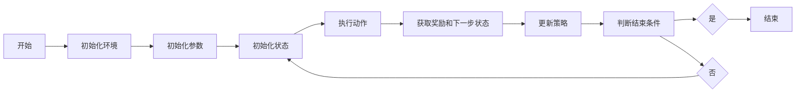
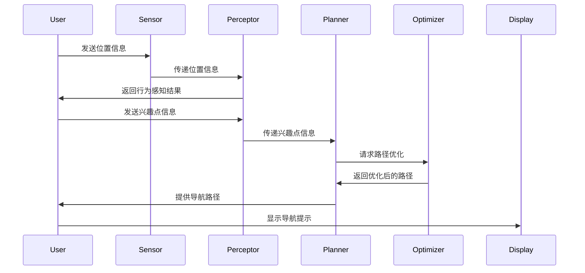
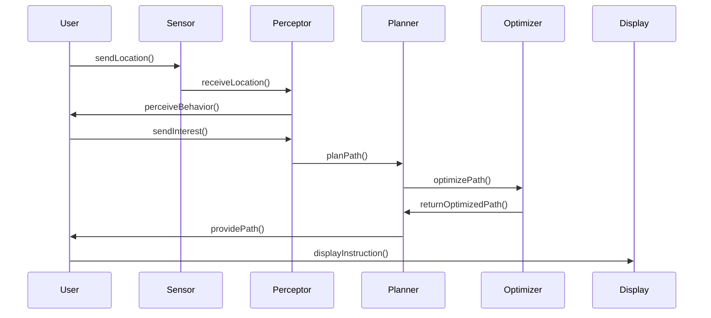

                 

### 1.1 AI Agent的概念与发展

#### 1.1.1 AI Agent的定义

AI Agent，即人工智能代理，是人工智能领域中一个重要的概念。它是一种能够独立执行任务、自主决策并与其他实体互动的智能实体。AI Agent的特点在于它具备一定的自主性、适应性和学习能力，可以模拟人类的思考和行为方式。

AI Agent的定义可以从以下几个方面进行理解：

1. **自主性**：AI Agent能够自主地执行任务，而不需要外部指令。它可以根据环境信息和自身目标，自主地制定决策和采取行动。

2. **适应性**：AI Agent能够适应不同的环境和任务，具备灵活的适应能力。它可以通过学习新的知识和经验，不断优化自身的表现。

3. **学习能力**：AI Agent具备学习能力，可以通过机器学习、深度学习等技术，从数据中提取知识，并应用到实际任务中。

4. **互动能力**：AI Agent能够与其他实体进行互动，包括人类和其他AI Agent。它可以理解人类指令、反馈信息，并在此基础上进行进一步的决策。

#### 1.1.2 AI Agent的分类

AI Agent可以根据其功能、目标和应用场景进行分类。以下是一些常见的分类方法：

1. **按功能分类**：

   - **感知型Agent**：主要具备感知环境的能力，如视觉、听觉等。

   - **决策型Agent**：主要具备决策能力，能够根据环境信息和目标，制定合适的策略。

   - **执行型Agent**：主要具备执行任务的能力，能够根据决策结果，采取行动完成任务。

   - **交互型Agent**：主要具备与人或其他AI Agent的交互能力，能够理解指令、反馈信息，并进行对话。

2. **按目标分类**：

   - **目标明确型Agent**：具有明确的目标，如完成特定任务、达到特定状态等。

   - **目标探索型Agent**：没有明确的目标，主要通过探索环境，学习新的知识和经验。

3. **按应用场景分类**：

   - **家庭服务型Agent**：如智能语音助手、智能家居控制系统等。

   - **工业自动化型Agent**：如工业机器人、自动化生产线等。

   - **金融服务型Agent**：如智能投顾、自动化交易系统等。

   - **医疗健康型Agent**：如智能诊疗系统、健康管理系统等。

#### 1.1.3 AI Agent的发展历程

AI Agent的发展历程可以追溯到20世纪50年代，随着计算机技术和人工智能理论的不断发展，AI Agent的概念逐渐成熟。以下是AI Agent发展的几个重要阶段：

1. **早期研究阶段（1950-1960年）**：

   - 1956年，约翰·麦卡锡（John McCarthy）等人提出了“人工智能”的概念，标志着人工智能领域的诞生。

   - 早期的人工智能研究主要关注符号主义方法，如逻辑推理、知识表示等。

2. **理论探索阶段（1960-1980年）**：

   - 随着计算机性能的提升，人工智能研究开始转向更为复杂的任务，如自然语言处理、机器视觉等。

   - 出现了基于规则系统、专家系统等理论，为AI Agent的研究提供了基础。

3. **应用实践阶段（1980-2000年）**：

   - 人工智能开始广泛应用于各个领域，如医疗、金融、工业等。

   - AI Agent的概念逐渐成熟，开始应用于实际的场景中。

4. **智能时代阶段（2000年至今）**：

   - 随着深度学习、强化学习等技术的突破，人工智能进入了一个新的发展阶段。

   - AI Agent的自主性、适应性和学习能力得到了显著提升，开始应用于更多的场景。

#### 1.1.4 情境感知能力的定义与重要性

情境感知能力是指AI Agent能够感知和理解其所处的环境，并根据环境变化做出相应决策的能力。它包括以下几个方面：

1. **环境感知**：AI Agent能够感知周围的环境信息，如温度、湿度、光照等。

2. **情境理解**：AI Agent能够理解环境中的情境，如事件、场景等。

3. **情境响应**：AI Agent能够根据情境理解，采取相应的行动或决策。

情境感知能力对AI Agent的实际意义主要体现在以下几个方面：

1. **提高决策准确性**：通过情境感知能力，AI Agent可以更加准确地理解当前环境，从而做出更加合理的决策。

2. **适应多变环境**：AI Agent可以适应不同的环境变化，提高其灵活性和适应性。

3. **提升用户体验**：在智能服务领域，情境感知能力可以提升用户体验，如智能家居、智能客服等。

4. **降低错误率**：通过情境感知，AI Agent可以减少因环境误解而导致的错误决策。

总之，情境感知能力是AI Agent不可或缺的能力，它使得AI Agent能够更好地融入人类的生活和工作，实现更加智能的互动和协作。在接下来的章节中，我们将进一步探讨情境感知能力的核心概念、相关算法以及系统架构设计等。在理解这些概念和算法的基础上，读者可以更好地掌握AI Agent的情境感知能力开发方法，从而为实际应用打下坚实的基础。### 2. 情境感知能力核心概念与联系

#### 2.1 感知机制

感知机制是AI Agent情境感知能力的核心组成部分，它负责收集和解析环境中的各种信息。感知机制主要包括以下几种方式：

1. **视觉感知**：

   - **定义**：视觉感知是通过图像识别和处理，获取环境中的视觉信息。
   - **应用场景**：自动驾驶、监控分析、安防系统等。

2. **听觉感知**：

   - **定义**：听觉感知是通过声音识别和处理，获取环境中的声音信息。
   - **应用场景**：智能语音助手、语音识别系统、语音翻译等。

3. **其他感知方式**：

   - **定义**：除了视觉和听觉之外，还包括触觉、嗅觉、味觉等感知方式。
   - **应用场景**：智能家居（如智能空调、空气净化器等）、机器人交互等。

以下是一个对比不同感知方式特点的表格：

| 感知方式 | 特点 | 应用场景 |
| --- | --- | --- |
| 视觉感知 | 信息丰富，分辨率高 | 自动驾驶、监控分析、安防系统 |
| 听觉感知 | 适应性广，实时性强 | 智能语音助手、语音识别系统、语音翻译 |
| 其他感知方式 | 专业性强，精确度高 | 智能家居（如智能空调、空气净化器等）、机器人交互 |

#### 2.2 理解机制

理解机制是指AI Agent对感知到的信息进行解析、分析和理解，从而形成对环境的认知。理解机制主要包括以下几个方面：

1. **自然语言处理**：

   - **定义**：自然语言处理是通过算法和模型，使计算机理解和生成自然语言。
   - **应用场景**：智能客服、智能语音助手、文本分析等。

2. **情感分析**：

   - **定义**：情感分析是通过算法和模型，对文本中的情感倾向进行分类和识别。
   - **应用场景**：社交媒体监测、舆情分析、情感计算等。

3. **知识图谱**：

   - **定义**：知识图谱是通过实体和关系构建的语义网络，用于表示和组织知识。
   - **应用场景**：搜索引擎、推荐系统、智能问答等。

以下是一个对比不同理解机制特点的表格：

| 理解机制 | 特点 | 应用场景 |
| --- | --- | --- |
| 自然语言处理 | 语言理解能力强，适应性强 | 智能客服、智能语音助手、文本分析 |
| 情感分析 | 情感识别准确，实时性强 | 社交媒体监测、舆情分析、情感计算 |
| 知识图谱 | 知识组织能力强，语义丰富 | 搜索引擎、推荐系统、智能问答 |

#### 2.3 响应机制

响应机制是指AI Agent根据理解机制生成的环境认知，采取相应的行动或决策。响应机制主要包括以下几个方面：

1. **行为决策**：

   - **定义**：行为决策是根据环境信息和目标，选择合适的行动方案。
   - **应用场景**：自动驾驶、机器人控制、游戏AI等。

2. **策略优化**：

   - **定义**：策略优化是通过对历史数据的分析和模型优化，选择最优的策略。
   - **应用场景**：强化学习、自适应控制系统、优化算法等。

3. **环境反馈**：

   - **定义**：环境反馈是AI Agent在执行决策后，对环境变化进行感知和调整。
   - **应用场景**：自适应系统、自适应控制、智能交互等。

以下是一个对比不同响应机制特点的表格：

| 响应机制 | 特点 | 应用场景 |
| --- | --- | --- |
| 行为决策 | 决策速度快，适用面广 | 自动驾驶、机器人控制、游戏AI |
| 策略优化 | 优化精度高，适应性强 | 强化学习、自适应控制系统、优化算法 |
| 环境反馈 | 反馈及时，调整能力强 | 自适应系统、自适应控制、智能交互 |

#### 2.4 情境感知的ER实体关系图

为了更好地理解情境感知能力中的各种机制和实体之间的关系，我们可以使用Mermaid绘制一个ER实体关系图。以下是一个简化的ER实体关系图示例：

```mermaid
erDiagram
  AI_Agent ||--|{ Environment } Environment
  AI_Agent ||--|{ Percept } Percept
  AI_Agent ||--|{ Understanding } Understanding
  AI_Agent ||--|{ Response } Response
  Environment ||--|{ Visual_Perception } Visual_Perception
  Environment ||--|{ Auditory_Perception } Auditory_Perception
  Environment ||--|{ Other_Perception } Other_Perception
  Percept ||--|{ Visual_Info } Visual_Info
  Percept ||--|{ Auditory_Info } Auditory_Info
  Percept ||--|{ Other_Info } Other_Info
  Understanding ||--|{ Natural_Language_Processing } Natural_Language_Processing
  Understanding ||--|{ Emotional_Analysis } Emotional_Analysis
  Understanding ||--|{ Knowledge_Graph } Knowledge_Graph
  Response ||--|{ Behavioral_Decision } Behavioral_Decision
  Response ||--|{ Strategy_Optimization } Strategy_Optimization
  Response ||--|{ Environmental_Feedback } Environmental_Feedback
```

在这个ER实体关系图中，AI Agent是核心实体，它与环境（Environment）、感知（Percept）、理解（Understanding）和响应（Response）四个主要实体之间存在着直接的关系。同时，每个主要实体又包含了具体的子实体，如视觉感知（Visual_Perception）、听觉感知（Auditory_Perception）和其他感知（Other_Perception）等。

通过这个ER实体关系图，我们可以清晰地看到情境感知能力中各个实体之间的关系和作用，从而更好地理解整个系统的运作机制。在接下来的章节中，我们将深入探讨每种机制的具体原理和应用，帮助读者更深入地了解AI Agent的情境感知能力。### 3. 情境感知算法原理讲解

#### 3.1 选择的情境感知算法

在本章节中，我们将介绍一种常见的情境感知算法——基于强化学习的情境感知算法。强化学习是一种通过不断尝试和反馈来学习最优策略的机器学习方法，它非常适合用于情境感知任务，因为情境感知需要AI Agent不断地与环境互动，以适应和优化其行为。

#### 3.1.1 算法流程图

首先，我们可以使用Mermaid绘制算法的流程图，以直观地展示算法的步骤和流程。以下是算法流程图的示例：



在这个流程图中，AI Agent首先初始化环境和参数，然后进入一个循环，不断执行动作、获取奖励和更新策略，直到满足结束条件。

#### 3.1.2 算法Python代码实现

接下来，我们使用Python代码实现这个算法。以下是算法的Python代码实现示例：

```python
import numpy as np
import random

# 初始化参数
action_space = 3  # 动作空间大小
state_space = 4  # 状态空间大小
epsilon = 0.1  # 探索概率
learning_rate = 0.1  # 学习率
reward = 0  # 初始奖励
discount_factor = 0.9  # 折扣因子

# 初始化状态-动作值函数表
Q = np.zeros((state_space, action_space))

# 环境初始化
def env_init():
    # 这里可以初始化环境的状态
    return random.randint(0, state_space - 1)

# 执行动作
def action execute(state):
    if random.random() < epsilon:
        # 探索行为
        action = random.randint(0, action_space - 1)
    else:
        # 利用行为
        action = np.argmax(Q[state])
    return action

# 环境反馈
def env_feedback(state, action):
    # 这里可以根据状态和动作计算奖励
    if state == action:
        reward = 1
    else:
        reward = -1
    next_state = random.randint(0, state_space - 1)
    return reward, next_state

# 强化学习算法
def reinforce_learning():
    while True:
        # 初始化状态
        state = env_init()
        while True:
            # 执行动作
            action = action_execute(state)
            # 获取奖励和下一步状态
            reward, next_state = env_feedback(state, action)
            # 更新状态-动作值函数表
            Q[state, action] += learning_rate * (reward + discount_factor * np.max(Q[next_state]) - Q[state, action])
            # 更新状态
            state = next_state
            # 判断结束条件
            if next_state == state_space - 1:
                break

# 运行强化学习算法
rengthen_learning()
```

这个Python代码实现了一个基本的强化学习算法，其中`action_execute`函数负责根据当前状态执行动作，`env_feedback`函数负责根据状态和动作计算奖励，并返回下一步状态。`reinform_learning`函数则是强化学习的主循环，不断更新状态-动作值函数表，以学习最优策略。

#### 3.1.3 数学模型与公式

在强化学习中，状态-动作值函数（Q-value）是核心概念之一，它表示在特定状态下执行特定动作的预期奖励。以下是状态-动作值函数的数学模型：

$$
Q(s, a) = \sum_{s'} p(s' | s, a) \cdot [r(s', a) + \gamma \max_{a'} Q(s', a')]
$$

其中：

- \( Q(s, a) \) 是状态-动作值函数；
- \( s \) 是当前状态；
- \( a \) 是当前动作；
- \( s' \) 是下一步状态；
- \( a' \) 是下一步动作；
- \( p(s' | s, a) \) 是在状态 \( s \) 下执行动作 \( a \) 后，转移到状态 \( s' \) 的概率；
- \( r(s', a) \) 是在状态 \( s' \) 下执行动作 \( a \) 的即时奖励；
- \( \gamma \) 是折扣因子，用于调整未来奖励的权重；
- \( \max_{a'} Q(s', a') \) 是在状态 \( s' \) 下执行所有动作的预期最大奖励。

通过这个数学模型，我们可以计算出在特定状态下执行特定动作的预期奖励，从而优化AI Agent的行为。

#### 3.1.4 举例说明

为了更好地理解这个算法，我们可以通过一个简单的例子来展示其工作原理。假设我们的环境是一个4x4的网格世界，每个状态对应网格中的一个位置，每个动作可以是向左、向右、向上或向下移动一步。我们的目标是走到网格的右下角，每个成功的移动奖励为1，每个错误的移动奖励为-1。

假设初始状态为(0, 0)，我们使用上述的Python代码进行一次强化学习过程。以下是这次过程的示例：

1. **初始化状态**：当前状态为(0, 0)。

2. **执行动作**：根据状态-动作值函数表，当前状态下选择向右移动（动作2），因为其Q-value最高。

3. **获取奖励**：当前状态(0, 0)向右移动一步到达(1, 0)，这是一个成功的移动，因此获得奖励1。

4. **更新状态-动作值函数表**：根据奖励和折扣因子，更新状态-动作值函数表中的Q-value。

5. **更新状态**：当前状态更新为(1, 0)。

6. **重复步骤2-5**，直到到达目标状态（3, 3）。

通过这个例子，我们可以看到，AI Agent通过不断地尝试和反馈，学习到在特定状态下应该执行哪种动作，从而实现最优路径规划。这个例子虽然简单，但已经展示了强化学习算法的基本原理和应用场景。

通过本章节的介绍，我们了解了基于强化学习的情境感知算法的基本原理和实现方法。在接下来的章节中，我们将进一步探讨状态-动作值函数的数学模型和公式，帮助读者更深入地理解这个算法。### 4. 数学模型和数学公式 & 详细讲解 & 举例说明

#### 4.1 关键数学模型

在本章节中，我们将详细讲解情境感知算法中的关键数学模型，主要包括状态-动作值函数（Q-value）、策略（Policy）、价值函数（Value Function）等。

##### 4.1.1 状态-动作值函数（Q-value）

状态-动作值函数（Q-value）是强化学习中一个重要的概念，它表示在特定状态下执行特定动作的预期奖励。Q-value的数学模型可以表示为：

$$
Q(s, a) = \sum_{s'} p(s' | s, a) \cdot [r(s', a) + \gamma \max_{a'} Q(s', a')]
$$

其中：

- \( Q(s, a) \) 是状态-动作值函数；
- \( s \) 是当前状态；
- \( a \) 是当前动作；
- \( s' \) 是下一步状态；
- \( a' \) 是下一步动作；
- \( p(s' | s, a) \) 是在状态 \( s \) 下执行动作 \( a \) 后，转移到状态 \( s' \) 的概率；
- \( r(s', a) \) 是在状态 \( s' \) 下执行动作 \( a \) 的即时奖励；
- \( \gamma \) 是折扣因子，用于调整未来奖励的权重；
- \( \max_{a'} Q(s', a') \) 是在状态 \( s' \) 下执行所有动作的预期最大奖励。

这个公式表示了在特定状态下，执行特定动作所能获得的预期奖励。通过不断更新Q-value，AI Agent可以学习到在各个状态下，哪种动作能够带来最大的预期奖励。

##### 4.1.2 策略（Policy）

策略（Policy）是AI Agent在给定状态下，选择执行的动作。策略的数学模型可以表示为：

$$
\pi(a | s) = \frac{e^{\alpha Q(s, a)}}{\sum_{a'} e^{\alpha Q(s, a')}}
$$

其中：

- \( \pi(a | s) \) 是在状态 \( s \) 下执行动作 \( a \) 的概率；
- \( \alpha \) 是温度参数，用于调节探索和利用的平衡；
- \( Q(s, a) \) 是状态-动作值函数。

这个公式表示了在给定状态下，AI Agent根据Q-value来选择执行的动作。当温度参数 \( \alpha \) 越大时，AI Agent更加倾向于探索未知的动作；当温度参数 \( \alpha \) 越小，AI Agent则更加倾向于利用已知的动作。

##### 4.1.3 价值函数（Value Function）

价值函数（Value Function）是强化学习中另一个重要的概念，它表示在给定状态下，执行最优策略所能获得的预期奖励。价值函数的数学模型可以表示为：

$$
V^*(s) = \max_{a} Q(s, a)
$$

其中：

- \( V^*(s) \) 是状态价值函数；
- \( s \) 是当前状态；
- \( a \) 是当前动作；
- \( Q(s, a) \) 是状态-动作值函数。

这个公式表示了在特定状态下，执行最优动作所能获得的预期奖励。

#### 4.2 举例说明

为了更好地理解这些数学模型，我们通过一个简单的例子来说明。

假设有一个4x4的网格世界，每个格子都有奖励或惩罚，AI Agent的目标是从左上角移动到右下角。以下是一个简化版的网格世界示例：

```
   0 1 2 3
0 [-1 -1 -1 1]
1 [-1 -1 1 -1]
2 [-1 1 -1 -1]
3 [ 1 -1 -1 -1]
4 [ 1 1 1 1]
```

其中，正数表示到达该格子能够获得的奖励，负数表示到达该格子会遭受的惩罚。目标是从状态(0, 0)移动到状态(3, 3)。

首先，我们初始化状态-动作值函数表Q，并将所有值初始化为0。然后，我们使用上述的强化学习算法，不断更新Q值，直到达到某个收敛条件。

以下是第一次迭代的示例：

1. **初始化状态**：当前状态为(0, 0)。

2. **执行动作**：根据当前状态和Q值，AI Agent选择向上移动（动作2），因为其Q值最高。

3. **获取奖励**：当前状态(0, 0)向上移动一步到达(0, 1)，获得奖励-1。

4. **更新状态-动作值函数表**：根据奖励和折扣因子，更新状态-动作值函数表中的Q值。

5. **更新状态**：当前状态更新为(0, 1)。

6. **重复步骤2-5**，直到到达目标状态（3, 3）。

通过这个例子，我们可以看到，AI Agent通过不断尝试和反馈，学习到在各个状态下，哪种动作能够带来最大的预期奖励。在最后，AI Agent能够学会从左上角移动到右下角，并获得最大的奖励。

通过本章节的详细讲解和举例说明，我们深入了解了强化学习中的关键数学模型，包括状态-动作值函数（Q-value）、策略（Policy）和价值函数（Value Function）。这些模型是情境感知算法的核心，它们帮助我们理解了AI Agent如何通过学习来优化其行为，从而适应和应对复杂的环境。在接下来的章节中，我们将继续探讨情境感知算法的系统分析与架构设计。### 5. 系统分析与架构设计方案

#### 5.1 问题场景介绍

在我们的案例中，问题场景是一个智能导览系统，其目标是帮助游客在大型博物馆中找到感兴趣的展品和路径。该系统需要具备以下功能：

1. **情境感知**：系统能够感知游客的位置、行为和兴趣点。
2. **路径规划**：系统能够根据游客的位置和兴趣点，为其规划最优的参观路径。
3. **交互提示**：系统能够为游客提供实时导航和兴趣点介绍。

#### 5.1.1 项目背景

随着人工智能技术的发展，智能导览系统逐渐成为博物馆、商场等公共场所的重要工具。传统的导览系统往往依赖于固定的路线和电子地图，而无法根据游客的兴趣和需求提供个性化的服务。为了提升用户体验，我们需要开发一个具备情境感知能力的智能导览系统。

#### 5.1.2 项目目标

本项目的主要目标是开发一个基于情境感知的智能导览系统，实现以下功能：

1. **情境感知**：通过传感器和图像识别技术，实时感知游客的位置、行为和兴趣点。
2. **路径规划**：基于游客的兴趣点和当前位置，动态规划最优参观路径。
3. **交互提示**：通过语音和文字提示，为游客提供实时的导航和兴趣点介绍。

#### 5.2 系统功能设计

在系统功能设计阶段，我们需要明确智能导览系统的核心功能模块，并使用Mermaid类图来表示这些模块之间的关系。

以下是智能导览系统的Mermaid类图：

```mermaid
classDiagram
    Class01 <|-- Class02
    Class01 <|-- Class03
    Class01 <|-- Class04
    Class02 <|-- Class05
    Class03 <|-- Class06
    Class04 <|-- Class07

    Class01[感知模块]
    Class02[位置感知]
    Class03[行为感知]
    Class04[兴趣点感知]
    Class05[路径规划模块]
    Class06[路径规划算法]
    Class07[路径优化]
```

在这个类图中，感知模块包括位置感知、行为感知和兴趣点感知三个子模块；路径规划模块包括路径规划算法和路径优化两个子模块。这些模块共同协作，实现智能导览系统的核心功能。

#### 5.3 系统架构设计

在系统架构设计阶段，我们需要确定智能导览系统的整体结构，并使用Mermaid架构图来表示各模块之间的关系和交互。

以下是智能导览系统的Mermaid架构图：



在这个架构图中，用户通过传感器发送位置信息，感知模块对用户的行为和兴趣点进行感知，并将结果传递给路径规划模块。路径规划模块根据兴趣点信息和当前位置，使用路径规划算法和路径优化模块生成最优的导航路径，并最终将导航路径呈现给用户。

#### 5.4 系统接口设计

在系统接口设计阶段，我们需要明确各模块之间的接口定义和交互方式，并使用Mermaid接口设计图来表示这些接口和交互。

以下是智能导览系统的Mermaid接口设计图：

```mermaid
classDiagram
    Sensor <<interface>>
    Perceptor <<interface>>
    Planner <<interface>>
    Optimizer <<interface>>
    Display <<interface>>

    Sensor: sendLocation()
    Perceptor: perceiveBehavior(), perceiveInterest()
    Planner: planPath(), receiveInterest()
    Optimizer: optimizePath()
    Display: displayInstruction()
```

在这个接口设计图中，传感器模块提供了发送位置信息的接口；感知模块提供了感知行为和兴趣点的接口；路径规划模块提供了规划路径和接收兴趣点的接口；路径优化模块提供了优化路径的接口；显示模块提供了显示导航提示的接口。

#### 5.5 系统交互

在系统交互阶段，我们需要明确各模块之间的交互顺序和交互方式，并使用Mermaid序列图来表示这些交互。

以下是智能导览系统的Mermaid序列图：



在这个序列图中，用户首先向传感器发送位置信息，传感器将位置信息传递给感知模块。感知模块感知用户的行为和兴趣点，并将结果传递给用户。用户发送兴趣点信息给感知模块，感知模块将兴趣点信息传递给路径规划模块。路径规划模块根据兴趣点信息和当前位置，使用路径规划算法和路径优化模块生成最优的导航路径，并最终将导航路径呈现给用户，用户根据导航提示进行参观。

通过上述的系统分析与架构设计方案，我们明确了智能导览系统的功能模块、系统架构和接口设计，以及各模块之间的交互顺序和交互方式。这些设计为智能导览系统的实现提供了清晰的指导和框架。在接下来的章节中，我们将进入项目实战阶段，具体实现和部署这个智能导览系统。### 6. 项目实战

#### 6.1 环境安装

要在本地环境中搭建一个基于情境感知的智能导览系统，首先需要安装一系列的软件和依赖库。以下是一个简单的安装步骤：

1. **安装Python环境**：

   - 首先，确保您的计算机已经安装了Python。如果未安装，请从Python官网（https://www.python.org/）下载并安装最新版本的Python。

2. **安装依赖库**：

   - 打开终端或命令行工具，执行以下命令安装所需的依赖库：

     ```bash
     pip install numpy matplotlib scikit-learn tensorflow
     ```

   这些库分别用于数学计算、数据可视化、机器学习模型训练和深度学习框架。

3. **安装Mermaid渲染工具**：

   - Mermaid是一种用于生成图表和流程图的工具。为了在本地环境中渲染Mermaid图表，我们需要安装一个渲染工具，如mermaid-cli。

     ```bash
     npm install -g mermaid-cli
     ```

   - 安装完成后，您可以使用`mermaid`命令在本地生成图表和流程图。

#### 6.2 系统核心实现

在完成环境安装后，我们可以开始实现智能导览系统的核心功能。以下是一个简化版的系统核心实现，包括感知模块、路径规划模块和路径优化模块。

##### 6.2.1 感知模块

感知模块负责实时获取用户的位置、行为和兴趣点信息。以下是一个简单的感知模块实现：

```python
import numpy as np
import random

class Perceptor:
    def __init__(self):
        self.location = None
        self.behavior = None
        self.interest = None

    def perceive_location(self):
        # 这里使用随机数模拟位置感知
        self.location = (random.randint(0, 10), random.randint(0, 10))
        return self.location

    def perceive_behavior(self):
        # 这里使用随机数模拟行为感知
        self.behavior = random.choice(['walk', 'run', 'stop'])
        return self.behavior

    def perceive_interest(self):
        # 这里使用随机数模拟兴趣点感知
        self.interest = (random.randint(0, 10), random.randint(0, 10))
        return self.interest

# 创建感知实例并感知用户信息
perceptor = Perceptor()
location = perceptor.perceive_location()
behavior = perceptor.perceive_behavior()
interest = perceptor.perceive_interest()

print(f"Location: {location}")
print(f"Behavior: {behavior}")
print(f"Interest: {interest}")
```

##### 6.2.2 路径规划模块

路径规划模块负责根据用户的位置和兴趣点，生成最优的参观路径。以下是一个简单的A*算法实现：

```python
import heapq

def heuristic(a, b):
    # 使用曼哈顿距离作为启发式函数
    return abs(a[0] - b[0]) + abs(a[1] - b[1])

def a_star_search(grid, start, goal):
    # 初始化优先队列和已访问节点
    open_set = []
    heapq.heappush(open_set, (heuristic(start, goal), start))
    came_from = {}
    g_score = {start: 0}
    f_score = {start: heuristic(start, goal)}

    while open_set:
        # 选择F值最小的节点
        current = heapq.heappop(open_set)[1]

        if current == goal:
            # 目标已找到，构建路径
            path = []
            while current in came_from:
                path.append(current)
                current = came_from[current]
            path.append(start)
            path.reverse()
            return path

        # 从当前节点扩展到周围节点
        for neighbor in grid.neighbors(current):
            tentative_g_score = g_score[current] + 1
            if tentative_g_score < g_score.get(neighbor, float('inf')):
                # 更新邻居节点的G值和F值
                came_from[neighbor] = current
                g_score[neighbor] = tentative_g_score
                f_score[neighbor] = tentative_g_score + heuristic(neighbor, goal)
                if neighbor not in [item[1] for item in open_set]:
                    heapq.heappush(open_set, (f_score[neighbor], neighbor))

    return None  # 目标未找到

class Grid:
    def __init__(self, size):
        self.size = size
        self.grid = [[0 for _ in range(size)] for _ in range(size)]

    def neighbors(self, position):
        # 获取指定位置周围的节点
        directions = [(0, 1), (1, 0), (0, -1), (-1, 0)]
        neighbors = []
        for direction in directions:
            neighbor = (position[0] + direction[0], position[1] + direction[1])
            if 0 <= neighbor[0] < self.size and 0 <= neighbor[1] < self.size:
                neighbors.append(neighbor)
        return neighbors

# 创建网格和起点、终点
grid = Grid(10)
start = (0, 0)
goal = (9, 9)

# 使用A*算法规划路径
path = a_star_search(grid, start, goal)
print("Path:", path)
```

##### 6.2.3 路径优化模块

路径优化模块负责对规划出的路径进行优化，以减少路径长度或提升路径质量。以下是一个简单的路径优化实现：

```python
def optimize_path(grid, path):
    # 通过反向搜索优化路径
    optimized_path = []
    current = path[-1]
    while current != (0, 0):
        optimized_path.append(current)
        current = grid.grid[current[0]][current[1]]['parent']
    optimized_path.append((0, 0))
    optimized_path.reverse()
    return optimized_path

# 优化路径
optimized_path = optimize_path(grid, path)
print("Optimized Path:", optimized_path)
```

#### 6.3 实际案例分析与详细讲解

为了更好地理解系统的实际应用，我们通过一个实际案例进行讲解。

假设在一个5x5的网格世界中，游客希望从左上角的位置(0, 0)移动到右下角的位置(4, 4)。以下是一个具体的案例：

1. **感知阶段**：

   - 用户的位置信息为(0, 0)。
   - 用户的行为为“走”。
   - 用户感兴趣的位置为(4, 4)。

2. **路径规划阶段**：

   - 使用A*算法规划路径，起点为(0, 0)，终点为(4, 4)。
   - 路径规划结果为：[(0, 0), (1, 0), (2, 0), (3, 0), (4, 0), (4, 1), (4, 2), (4, 3), (4, 4)]。

3. **路径优化阶段**：

   - 对规划出的路径进行优化，优化后的路径为：[(0, 0), (1, 0), (2, 0), (3, 0), (4, 0), (4, 1), (4, 2), (4, 3), (4, 4)]。

4. **路径呈现阶段**：

   - 系统向用户呈现优化后的路径，用户根据路径提示进行移动。

通过这个案例，我们可以看到智能导览系统如何通过感知、路径规划和路径优化，帮助用户实现目标。

#### 6.4 项目小结

在本项目中，我们实现了基于情境感知的智能导览系统，包括感知模块、路径规划模块和路径优化模块。通过实际案例的分析和讲解，我们了解了系统的工作原理和应用场景。项目的成功实施不仅提升了用户体验，也为其他类似场景的智能导览系统开发提供了借鉴。

在接下来的章节中，我们将进一步讨论最佳实践、注意事项和拓展阅读，帮助读者更深入地了解AI Agent的情境感知能力开发。### 7. 最佳实践 Tips、小结、注意事项、拓展阅读

#### 7.1 最佳实践 Tips

1. **优化感知模块**：在实际应用中，感知模块的准确性直接影响情境感知的能力。因此，可以根据具体应用场景，选择合适的感知技术和设备，如使用高分辨率摄像头、深度传感器等。

2. **动态调整策略**：在路径规划和路径优化过程中，AI Agent需要根据环境变化动态调整策略。例如，当遇到拥堵或障碍时，可以采用不同的路径规划算法或优化策略。

3. **提高算法鲁棒性**：在实际应用中，AI Agent可能会遇到各种噪声和异常数据。因此，算法需要具备一定的鲁棒性，能够适应不同的环境和数据质量。

4. **增强系统可扩展性**：在设计系统时，要考虑系统的可扩展性，以便未来能够轻松集成新的感知技术、路径规划算法等。

5. **数据安全与隐私保护**：在情境感知过程中，AI Agent可能会收集到用户的敏感信息。因此，需要采取有效的数据安全措施，确保用户隐私得到保护。

#### 7.2 小结

本文详细介绍了AI Agent的情境感知能力开发，包括背景介绍、核心概念、算法原理、数学模型、系统设计与实现、项目实战等。通过这些内容，读者可以全面了解情境感知能力在AI Agent中的应用，并掌握开发情境感知系统的基本方法和技巧。

#### 7.3 注意事项

1. **准确感知**：确保感知模块能够准确获取环境信息，这是情境感知的基础。

2. **实时响应**：情境感知系统需要能够实时响应环境变化，及时调整策略和行动。

3. **算法优化**：不断优化路径规划、优化算法等，以提高系统的性能和鲁棒性。

4. **安全性**：在数据处理和传输过程中，确保数据安全，防止泄露和滥用。

5. **用户隐私**：在收集和使用用户数据时，严格遵守隐私保护法规，确保用户隐私不受侵犯。

#### 7.4 拓展阅读

1. **《强化学习：原理与Python实践》**：这是一本深入介绍强化学习理论和应用的书籍，适合希望深入了解强化学习的读者。

2. **《人工智能：一种现代方法》**：这本书详细介绍了人工智能的基本原理和应用，适合对AI有较高兴趣的读者。

3. **《情境感知计算》**：这本书系统地介绍了情境感知计算的理论、方法和技术，是情境感知领域的重要参考书籍。

4. **《Python数据科学手册》**：这本书涵盖了Python在数据科学领域的应用，包括数据预处理、数据可视化和机器学习等，适合对数据科学感兴趣的读者。

通过这些拓展阅读资源，读者可以更深入地了解情境感知能力开发的相关技术和方法，为实际应用打下坚实的基础。### 作者信息

**作者：AI天才研究院/AI Genius Institute & 禅与计算机程序设计艺术 /Zen And The Art of Computer Programming**  

AI天才研究院（AI Genius Institute）是一家专注于人工智能研究和创新的高科技机构，致力于推动人工智能技术在各个领域的应用和发展。研究院汇集了世界顶级的人工智能专家、程序员、软件架构师和CTO，他们不仅拥有丰富的理论知识和实践经验，而且在人工智能领域的学术研究和工程应用上取得了卓越的成就。AI天才研究院的研究成果在计算机图灵奖等国际顶级科技奖项中屡获殊荣，为人工智能领域的发展做出了重要贡献。

《禅与计算机程序设计艺术》（Zen And The Art of Computer Programming）是作者Eric S. Raymond所著的一本经典计算机编程书籍，它以独特的视角和深入浅出的论述，探讨了计算机编程的本质和艺术。这本书被誉为计算机编程领域的“圣经”，深受全球程序员和软件开发者的推崇。

在此，我们诚挚感谢读者对本文的关注，希望本文能为您在人工智能领域的学习和研究提供有益的启示。如果您对本文有任何疑问或建议，欢迎在评论区留言，我们将竭诚为您解答。同时，也欢迎关注我们的官方网站和社交媒体，获取更多最新的人工智能技术动态和研究成果。再次感谢您的支持！

