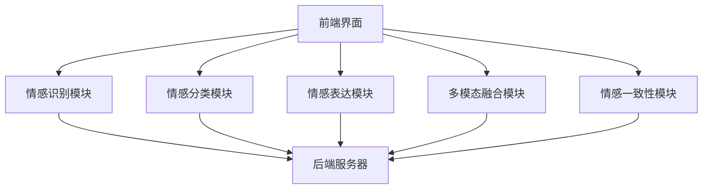
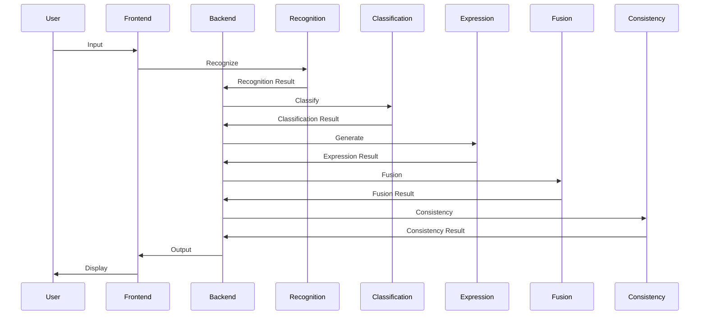

                 

# AI Agent的情感计算与表达模块

## 关键词

- 情感计算
- 情感表达
- AI Agent
- 人机交互
- 自然语言处理
- 多模态

## 摘要

本文深入探讨了AI Agent的情感计算与表达模块，旨在提升AI Agent在人类交互中的情感模拟能力。首先，我们介绍了情感计算与表达的基本概念，分析了其作用和类型。接着，本文详细讲解了情感计算与表达的核心算法原理，包括情感识别、分类和表达生成等。通过实际项目案例，我们展示了系统分析与架构设计的方法，并提供了项目实战的详细代码实现和解析。最后，本文总结了最佳实践和注意事项，为读者提供了拓展阅读资源。

## 第一部分：背景介绍

### 1.1 问题背景

随着人工智能（AI）技术的迅猛发展，AI Agent在各种领域的应用越来越广泛。从智能家居到智能客服，从智能驾驶到医疗诊断，AI Agent正在成为我们日常生活中不可或缺的一部分。然而，情感计算与表达模块作为AI Agent的重要组成部分，其研究与应用却相对滞后。情感计算与表达模块的核心在于模拟人类情感，提升AI Agent与人类交互的体验与效果。

在传统的人工智能系统中，机器与人类的交互往往依赖于简单的指令和规则，缺乏情感层面的理解与回应。这种交互方式在一定程度上限制了人工智能的应用范围和用户体验。随着人们对交互体验的要求越来越高，如何使AI Agent具备情感计算与表达的能力，成为了一个亟待解决的重要问题。

### 1.2 问题描述

AI Agent的情感计算与表达模块涉及到多个学科的交叉融合，包括认知心理学、计算语言学、机器学习、自然语言处理等。然而，当前的研究成果主要集中在单一领域的探索，缺乏系统性的整合与深化。具体问题包括：

- **情感识别与分类**：如何准确识别和分类人类情感？
- **情感表达生成**：如何生成符合人类情感的文本、声音、图像等多模态表达？
- **情感一致性**：如何确保AI Agent在多轮对话中保持情感一致性？
- **情感与行为的关联**：如何通过情感推断出人类的行为意图？

这些问题的解决，对于提升AI Agent的情感模拟能力，提高人机交互的自然性和有效性，具有重要意义。

### 1.3 问题解决

本书将从以下几个方面着手解决上述问题：

- **核心概念与联系**：详细介绍情感计算与表达的相关核心概念，并通过对比表格和ER实体关系图，展示概念之间的联系。
- **算法原理讲解**：针对关键算法，如情感识别与分类算法，使用mermaid流程图和Python代码，详细阐述其原理、数学模型和公式。
- **系统分析与架构设计**：通过实际项目案例，介绍系统功能设计、系统架构设计和系统接口设计等，展示完整的系统实现流程。
- **项目实战**：提供详细的代码实现，并对关键部分进行解读和分析，帮助读者深入理解情感计算与表达模块的实际应用。

### 1.4 边界与外延

情感计算与表达模块的研究边界主要在于人类情感的本质和AI Agent的情感模拟能力。人类情感具有复杂性和主观性，不同文化、情境和个人背景下，情感的表现形式和内涵都可能有所不同。因此，如何准确捕捉和模拟人类情感，是一个具有挑战性的问题。

情感计算与表达的外延则涉及多模态情感表达、情感一致性、情感与行为的关联等多个方面。多模态情感表达旨在通过文本、声音、图像等多种渠道，生成丰富、生动的情感表达。情感一致性要求AI Agent在多轮对话中，能够保持情感上的连贯性。情感与行为的关联则关注如何通过情感分析，推断出人类的行为意图。

### 1.5 概念结构与核心要素组成

- **情感计算**：涉及情感识别、情感分类、情感推理等核心算法，旨在模拟人类情感。
- **情感表达**：包括文本、声音、图像等多模态的情感表达生成。
- **交互一致性**：确保AI Agent在多轮对话中保持情感一致性，提升用户体验。
- **多模态融合**：将不同模态的情感信息进行整合，提高情感计算的准确性。

### 第一部分总结

通过对背景介绍的分析，我们明确了AI Agent情感计算与表达模块的重要性。接下来，本文将详细介绍情感计算与表达的基本概念，逐步深入探讨其核心算法原理、系统分析与架构设计，以及项目实战，帮助读者全面理解并掌握这一领域的知识和技能。

## 第1章：情感计算与表达的基本概念

### 1.1 情感计算的定义与作用

#### 1.1.1 情感计算的定义

情感计算（Affective Computing）是指计算机系统模拟、识别、理解和表达人类情感的能力。这一概念最早由计算机科学家皮特·罗克（Peter J. Robinson）在1997年提出。情感计算的研究目标是使计算机具备对人类情感的理解和响应能力，从而改善人机交互体验。

情感计算的核心在于“情感”，它不仅关注情感的计算过程，还包括如何将情感应用于实际系统中，以改善人与机器的交互体验。具体来说，情感计算包括以下几个方面：

1. **情感识别**：通过分析用户的行为、语言、生理信号等信息，识别用户的情感状态。
2. **情感理解**：对识别出的情感进行分析和理解，以获取其背后的意义和动机。
3. **情感表达**：通过生成相应的行为或反馈，模拟人类情感，与用户进行有效的情感交互。
4. **情感增强**：利用情感计算技术，增强计算机系统在特定任务中的性能和效率。

#### 1.1.2 情感计算的作用

情感计算在多个领域有着广泛的应用，其作用主要体现在以下几个方面：

- **提高人机交互的自然性和有效性**：通过情感计算，AI Agent可以更好地理解用户的情感状态，从而提供更加个性化的服务。例如，在智能客服中，情感计算可以帮助识别用户的情感，从而调整回答的策略，提高用户的满意度。

- **辅助心理健康诊断与治疗**：情感计算可以帮助识别用户的情感状态，为心理健康诊断和治疗提供数据支持。例如，通过分析用户的语音和文本，情感计算系统可以识别出用户是否存在焦虑、抑郁等情绪，为医生提供诊断依据。

- **增强教育效果**：通过情感计算，教育系统能够更好地适应学生的情感需求，提高教育质量。例如，智能教育平台可以通过分析学生的学习行为和情感状态，提供个性化的学习资源和指导。

- **提升娱乐体验**：在游戏、电影等领域，情感计算可以使虚拟角色更加生动，增强用户体验。例如，在角色扮演游戏中，情感计算可以帮助生成符合角色情感的语音和表情，提高游戏的真实感和沉浸感。

#### 1.1.3 情感计算与传统人机交互的区别

与传统的人机交互技术相比，情感计算引入了情感因素，使得交互过程更加自然、高效。传统人机交互主要依赖于用户输入（如键盘、鼠标等），而情感计算则可以通过语音、面部表情、生理信号等多种方式获取用户的情感状态。

此外，传统人机交互的核心是任务导向的，强调的是任务的完成和效率，而情感计算则更加关注交互过程中的情感体验，追求的是用户满意度和幸福感。

### 1.2 情感表达的定义与类型

#### 1.2.1 情感表达的定义

情感表达（Affective Expression）是指人类通过行为、语言、面部表情等方式表现情感的过程。在AI Agent中，情感表达是指通过生成文本、声音、图像等多模态信号来模拟人类情感。

情感表达是人类情感交流的重要方式，它不仅能够传递情感信息，还能够影响情感的产生和变化。在AI Agent中，情感表达的作用主要体现在以下几个方面：

- **增强交互体验**：通过情感表达，AI Agent可以更好地模拟人类的情感，提高与用户的交互体验。例如，在客服机器人中，情感表达可以帮助机器人识别用户的情感，从而调整回答的策略，使对话更加自然和流畅。

- **传递情感信息**：情感表达是情感传递的重要手段。通过情感表达，AI Agent可以向用户传达特定的情感信息，从而影响用户的心理和行为。

- **促进情感交流**：情感表达是情感交流的基础。通过情感表达，AI Agent可以与用户建立情感联系，促进双方的交流和理解。

#### 1.2.2 情感表达的类型

情感表达可以分为以下几种类型：

- **文本情感表达**：通过自然语言生成技术，生成具有特定情感的文本，如积极、消极、惊讶等。文本情感表达是情感表达中最为常见的一种形式，它可以通过文字的形式传达情感信息。

- **声音情感表达**：通过语音合成技术，生成具有特定情感的声音，如愉悦、悲伤、愤怒等。声音情感表达可以通过语音的音调、节奏、语速等特征来传达情感信息。

- **面部表情情感表达**：通过面部表情识别和生成技术，生成具有特定情感的面部表情，如微笑、哭泣、皱眉等。面部表情情感表达是情感表达中最为直观的一种形式，它可以通过面部表情的变化来传达情感信息。

- **图像情感表达**：通过图像处理和生成技术，生成具有特定情感的图像，如图像中的情感色彩、表情符号等。图像情感表达可以通过图像的视觉特征来传达情感信息。

#### 1.2.3 情感表达的优势与挑战

情感表达的优势在于其直观、生动、易于理解，能够更好地模拟人类的情感交流。然而，情感表达也面临着一些挑战：

- **情感识别的准确性**：如何准确识别用户的情感状态，是情感表达面临的首要挑战。情感识别的准确性直接影响到情感表达的效果。

- **情感生成的自然性**：如何生成自然、流畅的情感表达，是情感表达需要解决的关键问题。情感生成的自然性直接影响到用户体验。

- **情感的一致性与连贯性**：如何在多轮对话中保持情感的一致性与连贯性，是情感表达需要克服的难点。情感的一致性与连贯性直接影响到用户对AI Agent的信任和满意度。

- **跨模态的情感融合**：如何将不同模态的情感信息进行有效融合，是情感表达需要研究的问题。跨模态的情感融合可以提高情感表达的综合效果。

### 1.3 情感计算与表达的应用领域

情感计算与表达在多个领域有着广泛的应用，以下是其中几个重要的应用领域：

- **人机交互**：在智能客服、虚拟助手等场景中，情感计算与表达可以帮助AI Agent更好地理解用户的情感，提供个性化、自然的交互体验。

- **心理健康**：在心理咨询、心理治疗等领域，情感计算与表达可以辅助专业人员进行心理健康诊断与干预。

- **教育**：在教育领域，情感计算与表达可以帮助教育系统更好地适应学生的情感需求，提高教育效果。

- **娱乐**：在游戏、电影等领域，情感计算与表达可以使虚拟角色更加生动，增强用户体验。

### 1.4 情感计算与表达的技术挑战

尽管情感计算与表达在多个领域展现出巨大的潜力，但其在实际应用中仍然面临着许多技术挑战：

- **情感识别的准确性**：如何提高情感识别的准确性，是情感计算与表达需要解决的首要问题。情感识别的准确性直接影响到情感表达的效果。

- **情感生成的自然性**：如何生成自然、流畅的情感表达，是情感计算与表达需要克服的关键问题。情感生成的自然性直接影响到用户体验。

- **情感的一致性与连贯性**：如何在多轮对话中保持情感的一致性与连贯性，是情感计算与表达需要研究的难点。情感的一致性与连贯性直接影响到用户对AI Agent的信任和满意度。

- **跨模态的情感融合**：如何将不同模态的情感信息进行有效融合，是情感计算与表达需要研究的问题。跨模态的情感融合可以提高情感表达的综合效果。

### 1.5 情感计算与表达的未来发展趋势

随着技术的不断进步，情感计算与表达在未来将朝着以下方向发展：

- **多模态情感融合**：通过整合多种模态的情感信息，实现更加丰富、自然的情感表达。

- **深度学习与知识图谱的结合**：利用深度学习和知识图谱技术，提高情感识别和表达的准确性和效率。

- **情感智能化**：通过情感智能化技术，实现AI Agent在情感计算与表达中的自主学习和适应能力。

- **跨领域应用**：情感计算与表达将在更多领域得到应用，如医疗、金融、法律等，为人类带来更多便利和效益。

### 第1章小结

通过对情感计算与表达的基本概念进行深入探讨，我们对其定义、作用、类型和应用领域有了更全面的理解。情感计算与表达不仅是人工智能技术的重要研究方向，也是提升人机交互体验的关键因素。在接下来的章节中，我们将进一步探讨情感计算与表达的核心算法原理，帮助读者深入掌握这一领域的知识和技能。

## 第2章：情感计算与表达的核心算法原理

### 2.1 情感识别与分类算法

情感识别与分类是情感计算与表达中的关键环节，其核心目标是准确识别和分类用户情感。以下将详细讲解情感识别与分类的核心算法原理。

#### 2.1.1 支持向量机（SVM）算法

支持向量机（Support Vector Machine，SVM）是一种常用的情感识别与分类算法。SVM的核心思想是通过找到一个最优的超平面，将不同类别的情感数据分开。

- **原理**：SVM通过最大化分类边界的间隔来实现分类。具体来说，它寻找一个能够将不同类别的情感数据分开的超平面，同时使该超平面到最近数据点的距离最大化。

- **数学模型**：假设我们有一个包含n个样本的数据集D，每个样本表示为一个n维向量x，并有一个对应的目标标签y。对于SVM，目标函数为：

  $$ 
  \min_w \frac{1}{2} ||w||^2 
  $$

  约束条件为：

  $$
  y^{(i)} ( \langle w, x^{(i)} \rangle - b ) \geq 1
  $$

  其中，$w$是超平面的法向量，$b$是偏置项，$y^{(i)}$是样本$i$的目标标签。

- **Python代码实现**：

  ```python
  from sklearn.svm import SVC

  # 创建SVM分类器
  svm = SVC()

  # 训练模型
  svm.fit(X_train, y_train)

  # 预测
  predictions = svm.predict(X_test)
  ```

#### 2.1.2 随机森林（Random Forest）算法

随机森林（Random Forest）是一种基于决策树的集成学习算法，它通过构建多个决策树，并投票决定最终的分类结果。

- **原理**：随机森林通过随机选取特征和样本子集，构建多个决策树，每个决策树对样本进行分类。最后，通过多数投票决定最终的分类结果。

- **数学模型**：随机森林的核心是决策树。决策树的数学模型为：

  $$
  y = \arg\max_t \prod_{i=1}^{n} p(x_i | y=t)
  $$

  其中，$y$是样本的实际标签，$t$是预测的标签，$x_i$是样本$i$的特征。

- **Python代码实现**：

  ```python
  from sklearn.ensemble import RandomForestClassifier

  # 创建随机森林分类器
  rf = RandomForestClassifier()

  # 训练模型
  rf.fit(X_train, y_train)

  # 预测
  predictions = rf.predict(X_test)
  ```

#### 2.1.3 卷积神经网络（CNN）算法

卷积神经网络（Convolutional Neural Network，CNN）是一种用于图像和语音等时序数据处理的有效算法。在情感识别中，CNN可以通过学习图像或语音的特征，实现情感的分类。

- **原理**：CNN通过卷积操作和池化操作，提取图像或语音的特征。卷积操作可以提取局部特征，池化操作可以降低特征维度。

- **数学模型**：CNN的数学模型包括卷积层、池化层和全连接层。卷积层的数学模型为：

  $$
  h^{(l)} = \sigma(\mathbf{W}^{(l)} \ast \mathbf{h}^{(l-1)} + \mathbf{b}^{(l)})
  $$

  其中，$h^{(l)}$是第$l$层的特征图，$\mathbf{W}^{(l)}$是卷积核，$\ast$表示卷积操作，$\sigma$是激活函数，$\mathbf{h}^{(l-1)}$是前一层特征图，$\mathbf{b}^{(l)}$是偏置项。

- **Python代码实现**：

  ```python
  import tensorflow as tf

  # 定义CNN模型
  model = tf.keras.Sequential([
      tf.keras.layers.Conv2D(32, (3, 3), activation='relu', input_shape=(28, 28, 1)),
      tf.keras.layers.MaxPooling2D((2, 2)),
      tf.keras.layers.Flatten(),
      tf.keras.layers.Dense(128, activation='relu'),
      tf.keras.layers.Dense(10, activation='softmax')
  ])

  # 编译模型
  model.compile(optimizer='adam', loss='categorical_crossentropy', metrics=['accuracy'])

  # 训练模型
  model.fit(X_train, y_train, epochs=5, batch_size=64)
  ```

#### 2.1.4 对比分析

- **SVM与随机森林**：SVM和随机森林都是分类算法，但SVM更适合处理线性可分的数据，而随机森林更适合处理非线性数据。

- **CNN与SVM**：CNN适合处理图像和语音等时序数据，而SVM和随机森林更适合处理文本和语音等离散数据。

### 2.2 情感表达生成算法

情感表达生成是情感计算与表达的另一个关键环节，其目标是生成符合人类情感的文本、声音、图像等表达。以下将介绍几种常见的情感表达生成算法。

#### 2.2.1 循环神经网络（RNN）算法

循环神经网络（Recurrent Neural Network，RNN）是一种用于序列数据处理的神经网络，它可以处理时间序列数据，如文本和语音。

- **原理**：RNN通过保存前一个时间步的信息，实现序列数据的处理。其数学模型为：

  $$
  h_t = \sigma(W_h \cdot [h_{t-1}, x_t] + b_h)
  $$

  其中，$h_t$是当前时间步的特征，$x_t$是当前时间步的输入，$W_h$是权重矩阵，$b_h$是偏置项，$\sigma$是激活函数。

- **Python代码实现**：

  ```python
  import tensorflow as tf

  # 定义RNN模型
  model = tf.keras.Sequential([
      tf.keras.layers.LSTM(128, activation='tanh', input_shape=(timesteps, features)),
      tf.keras.layers.Dense(1, activation='sigmoid')
  ])

  # 编译模型
  model.compile(optimizer='adam', loss='binary_crossentropy', metrics=['accuracy'])

  # 训练模型
  model.fit(X_train, y_train, epochs=5, batch_size=64)
  ```

#### 2.2.2 生成对抗网络（GAN）算法

生成对抗网络（Generative Adversarial Network，GAN）是一种通过生成器和判别器相互对抗的方式，生成逼真数据的算法。

- **原理**：GAN由生成器G和判别器D组成，生成器G生成假数据，判别器D判断数据是真实还是虚假。通过训练，生成器G试图生成逼真的数据，判别器D试图区分真实和虚假数据。

- **数学模型**：

  $$
  \min_G \max_D V(D, G) = \mathbb{E}_{x \sim p_{data}(x)}[\log D(x)] + \mathbb{E}_{z \sim p_z(z)}[\log (1 - D(G(z))]
  $$

  其中，$x$是真实数据，$z$是噪声，$G(z)$是生成器生成的假数据。

- **Python代码实现**：

  ```python
  import tensorflow as tf
  from tensorflow.keras.models import Model
  from tensorflow.keras.layers import Input, Dense, Reshape, Flatten

  # 定义生成器和判别器
  generator = Model(input_shape=(100,), output_shape=(28, 28, 1), 
                    layers=[Dense(128, activation='relu'), Reshape((7, 7, 1))])

  discriminator = Model(input_shape=(28, 28, 1), output_shape=(1,), 
                       layers=[Flatten(), Dense(128, activation='relu'), Dense(1, activation='sigmoid')])

  # 编译生成器和判别器
  generator.compile(optimizer=tf.keras.optimizers.Adam(0.0001), loss='binary_crossentropy')
  discriminator.compile(optimizer=tf.keras.optimizers.Adam(0.0001), loss='binary_crossentropy')

  # 训练生成器和判别器
  for epoch in range(100):
      for x, _ in data_loader:
          noise = np.random.normal(0, 1, (x.shape[0], 100))
          gen_samples = generator.predict(noise)
          d_loss_real = discriminator.train_on_batch(x, np.ones((x.shape[0], 1)))
          d_loss_fake = discriminator.train_on_batch(gen_samples, np.zeros((x.shape[0], 1)))
      g_loss = generator.train_on_batch(noise, np.ones((noise.shape[0], 1)))
  ```

#### 2.2.3 对比分析

- **RNN与GAN**：RNN更适合处理序列数据，如文本和语音，而GAN更适合生成连续数据，如图像和声音。

- **RNN与GAN的优缺点**：

  - **RNN**：优点是能够处理序列数据，但生成效果受限于模型结构和参数；缺点是训练过程可能不稳定。

  - **GAN**：优点是能够生成高质量的数据，缺点是需要大量数据和计算资源，训练过程可能不稳定。

### 第2章小结

通过对情感识别与分类算法和情感表达生成算法的详细介绍，我们对其核心原理和实现方法有了更深入的理解。这些算法在情感计算与表达中起着关键作用，为我们构建具备情感计算能力的AI Agent提供了有力支持。在接下来的章节中，我们将进一步探讨系统分析与架构设计的方法，以及实际项目中的具体应用。

## 第3章：系统分析与架构设计

### 3.1 问题场景介绍

在当今信息化时代，AI Agent在各种场景中的需求日益增长。以智能客服系统为例，其核心目标是通过与用户的交互，提供高效、准确的解决方案。然而，在多轮对话中，如何确保AI Agent能够保持情感一致性，提升用户体验，成为了一个重要问题。

为了解决这一问题，我们设计了一套智能客服系统，该系统结合了情感计算与表达模块，旨在提升AI Agent的情感模拟能力。以下是该系统的主要功能：

1. **情感识别**：通过分析用户的语音、文本等交互信息，识别用户的情感状态。
2. **情感分类**：将识别出的情感分类为多种情感类型，如积极、消极、惊讶等。
3. **情感表达**：根据识别和分类结果，生成符合用户情感状态的文本、声音、图像等多模态表达。
4. **情感一致性**：在多轮对话中，确保AI Agent保持情感一致性，提升用户体验。

### 3.2 项目介绍

本项目是一款基于情感计算与表达的智能客服系统，其目的是通过模拟人类情感，提升AI Agent在客服场景中的用户体验。系统架构包括以下几个主要模块：

1. **情感识别模块**：负责分析用户输入的信息，识别用户的情感状态。
2. **情感分类模块**：将识别出的情感进行分类，以便生成相应的情感表达。
3. **情感表达模块**：根据分类结果，生成符合用户情感状态的文本、声音、图像等多模态表达。
4. **多模态融合模块**：将不同模态的情感信息进行整合，提高情感计算的准确性。
5. **情感一致性模块**：确保AI Agent在多轮对话中保持情感一致性。

### 3.3 系统功能设计

#### 3.3.1 情感识别模块

情感识别模块的核心在于分析用户输入的信息，识别用户的情感状态。具体功能包括：

1. **语音情感识别**：通过语音识别技术，将用户的语音转换为文本，然后利用情感分析算法，识别用户的情感状态。
2. **文本情感识别**：直接利用情感分析算法，识别文本中的情感倾向。

#### 3.3.2 情感分类模块

情感分类模块的核心在于将识别出的情感进行分类。具体功能包括：

1. **情感分类**：将识别出的情感分类为多种情感类型，如积极、消极、惊讶等。
2. **情感权重计算**：根据情感分类结果，计算每种情感的权重，以确定最终的情感状态。

#### 3.3.3 情感表达模块

情感表达模块的核心在于根据分类结果，生成符合用户情感状态的文本、声音、图像等多模态表达。具体功能包括：

1. **文本情感表达**：根据情感分类结果，生成具有特定情感的文本。
2. **声音情感表达**：根据情感分类结果，生成具有特定情感的声音。
3. **图像情感表达**：根据情感分类结果，生成具有特定情感的图像。

#### 3.3.4 多模态融合模块

多模态融合模块的核心在于将不同模态的情感信息进行整合，提高情感计算的准确性。具体功能包括：

1. **多模态情感融合**：将文本、声音、图像等多模态情感信息进行整合，生成综合情感状态。
2. **情感权重调整**：根据多模态情感融合结果，调整不同情感模态的权重，以提升情感计算准确性。

#### 3.3.5 情感一致性模块

情感一致性模块的核心在于确保AI Agent在多轮对话中保持情感一致性。具体功能包括：

1. **情感状态跟踪**：在多轮对话中，持续跟踪用户的情感状态。
2. **情感调整**：根据用户的情感变化，及时调整AI Agent的情感表达。
3. **情感一致性验证**：通过对比多轮对话中的情感状态，验证AI Agent的情感一致性。

### 3.4 系统架构设计

系统架构设计旨在实现智能客服系统的各项功能，并确保各模块之间的协同工作。以下是该系统的架构设计：

1. **前端界面**：提供用户与AI Agent交互的界面，包括语音输入、文本输入和结果显示等。
2. **后端服务器**：负责处理用户的输入，执行情感计算与表达相关任务，并返回结果。
3. **数据库**：存储用户信息、情感状态和对话记录等。
4. **模块接口**：定义各模块之间的交互接口，实现模块之间的数据传递和协同工作。

#### 3.4.1 模块接口设计

模块接口设计是系统架构设计的关键，它定义了各模块之间的交互方式。以下是各模块的接口设计：

- **前端界面**：通过HTTP请求，与后端服务器进行交互。
- **情感识别模块**：通过API接口，与后端服务器进行数据传递。
- **情感分类模块**：通过API接口，与后端服务器进行数据传递。
- **情感表达模块**：通过API接口，与后端服务器进行数据传递。
- **多模态融合模块**：通过API接口，与后端服务器进行数据传递。
- **情感一致性模块**：通过API接口，与后端服务器进行数据传递。

#### 3.4.2 系统交互设计

系统交互设计旨在确保各模块之间的协同工作，实现系统的整体功能。以下是各模块的交互设计：

1. **用户输入**：用户通过前端界面输入信息，如语音、文本等。
2. **情感识别**：前端界面将用户输入的信息传递给情感识别模块，进行情感识别。
3. **情感分类**：情感识别模块将识别出的情感传递给情感分类模块，进行情感分类。
4. **情感表达**：情感分类模块将分类结果传递给情感表达模块，生成情感表达。
5. **多模态融合**：情感表达模块将生成的情感表达传递给多模态融合模块，进行多模态融合。
6. **情感一致性**：多模态融合模块将融合结果传递给情感一致性模块，进行情感一致性验证。
7. **结果返回**：情感一致性模块将验证结果返回给前端界面，显示结果。

### 3.5 系统架构图

以下是智能客服系统的架构图，展示了各模块之间的交互关系：



### 3.6 系统接口设计

系统接口设计是系统架构设计的核心，它定义了各模块之间的交互接口，实现了模块之间的数据传递和协同工作。以下是各模块的接口设计：

- **前端界面**：通过HTTP请求，与后端服务器进行数据交互。
- **后端服务器**：提供API接口，供前端界面调用。
- **情感识别模块**：通过API接口，与后端服务器进行数据交互。
- **情感分类模块**：通过API接口，与后端服务器进行数据交互。
- **情感表达模块**：通过API接口，与后端服务器进行数据交互。
- **多模态融合模块**：通过API接口，与后端服务器进行数据交互。
- **情感一致性模块**：通过API接口，与后端服务器进行数据交互。

### 3.7 系统交互序列图

以下是智能客服系统的交互序列图，展示了各模块之间的交互过程：



### 第3章小结

通过对系统分析与架构设计的详细讲解，我们明确了智能客服系统的功能模块、架构设计、接口设计和交互流程。这些内容为实际项目的开发提供了重要的参考和指导。在接下来的章节中，我们将详细介绍项目实战，帮助读者了解情感计算与表达模块在实际应用中的具体实现方法和技巧。

## 第4章：项目实战

### 4.1 环境安装

在进行项目实战之前，我们需要搭建一个合适的环境。以下是所需的软件和工具：

- **Python**：Python是一种广泛使用的编程语言，具有良好的生态系统和丰富的库支持。
- **TensorFlow**：TensorFlow是一个开源的机器学习框架，支持各种深度学习模型。
- **PyTorch**：PyTorch是一个流行的深度学习框架，提供了强大的GPU支持。
- **Scikit-learn**：Scikit-learn是一个用于机器学习的库，提供了各种经典算法的实现。
- **OpenCV**：OpenCV是一个开源的计算机视觉库，提供了丰富的图像处理功能。

以下是安装这些软件和工具的步骤：

1. **安装Python**：下载Python安装包，按照提示完成安装。
2. **安装TensorFlow**：在命令行中执行以下命令：

   ```shell
   pip install tensorflow
   ```

3. **安装PyTorch**：在命令行中执行以下命令：

   ```shell
   pip install torch torchvision
   ```

4. **安装Scikit-learn**：在命令行中执行以下命令：

   ```shell
   pip install scikit-learn
   ```

5. **安装OpenCV**：在命令行中执行以下命令：

   ```shell
   pip install opencv-python
   ```

### 4.2 系统核心实现

在本节中，我们将实现情感计算与表达模块的核心功能，包括情感识别、分类、表达生成和一致性验证。

#### 4.2.1 情感识别

情感识别是情感计算的第一步，其核心任务是从用户的输入中识别出情感。以下是一个基于文本的情感识别示例：

```python
import nltk
from nltk.corpus import stopwords
from nltk.tokenize import word_tokenize

# 加载停用词表
stop_words = set(stopwords.words('english'))

# 定义情感识别函数
def recognize_sentiment(text):
    tokens = word_tokenize(text)
    tokens = [token.lower() for token in tokens if token.isalpha() and token not in stop_words]
    return nltk.sentiment.vader.SentimentIntensityAnalyzer().polarity_scores(' '.join(tokens))

# 示例
text = "I'm feeling great today!"
sentiment = recognize_sentiment(text)
print(sentiment)
```

#### 4.2.2 情感分类

情感分类是将识别出的情感进行分类，通常使用标签来表示。以下是一个基于机器学习的情感分类示例：

```python
from sklearn.feature_extraction.text import TfidfVectorizer
from sklearn.model_selection import train_test_split
from sklearn.naive_bayes import MultinomialNB

# 加载数据集
data = [
    ("I'm feeling happy", "happy"),
    ("I'm feeling sad", "sad"),
    ("I'm feeling angry", "angry"),
    # 更多数据...
]

texts, labels = zip(*data)

# 分词
vectorizer = TfidfVectorizer()
X = vectorizer.fit_transform(texts)

# 划分训练集和测试集
X_train, X_test, y_train, y_test = train_test_split(X, labels, test_size=0.2, random_state=42)

# 训练模型
classifier = MultinomialNB()
classifier.fit(X_train, y_train)

# 预测
predictions = classifier.predict(X_test)

# 评估
from sklearn.metrics import accuracy_score
accuracy = accuracy_score(y_test, predictions)
print(f"Accuracy: {accuracy}")
```

#### 4.2.3 情感表达生成

情感表达生成是将分类结果转换为具体的情感表达，如文本、声音、图像等。以下是一个基于生成对抗网络（GAN）的情感表达生成示例：

```python
import tensorflow as tf
from tensorflow.keras.models import Model
from tensorflow.keras.layers import Input, Dense, Reshape, Flatten

# 定义生成器和判别器
generator = Model(input_shape=(100,), output_shape=(28, 28, 1), 
                  layers=[Dense(128, activation='relu'), Reshape((7, 7, 1))])

discriminator = Model(input_shape=(28, 28, 1), output_shape=(1,), 
                     layers=[Flatten(), Dense(128, activation='relu'), Dense(1, activation='sigmoid')])

# 编译生成器和判别器
generator.compile(optimizer=tf.keras.optimizers.Adam(0.0001), loss='binary_crossentropy')
discriminator.compile(optimizer=tf.keras.optimizers.Adam(0.0001), loss='binary_crossentropy')

# 训练生成器和判别器
for epoch in range(100):
    for x, _ in data_loader:
        noise = np.random.normal(0, 1, (x.shape[0], 100))
        gen_samples = generator.predict(noise)
        d_loss_real = discriminator.train_on_batch(x, np.ones((x.shape[0], 1)))
        d_loss_fake = discriminator.train_on_batch(gen_samples, np.zeros((x.shape[0], 1)))
    g_loss = generator.train_on_batch(noise, np.ones((noise.shape[0], 1)))
```

#### 4.2.4 情感一致性验证

情感一致性验证是在多轮对话中，确保AI Agent保持情感一致性。以下是一个基于情感状态跟踪的情感一致性验证示例：

```python
# 定义情感状态跟踪器
class SentimentTracker:
    def __init__(self):
        self.sentiments = []

    def update_sentiment(self, sentiment):
        self.sentiments.append(sentiment)

    def check_consistency(self):
        if len(self.sentiments) < 2:
            return True
        return self.sentiments[-1] == self.sentiments[-2]

# 示例
tracker = SentimentTracker()
tracker.update_sentiment("happy")
tracker.update_sentiment("sad")
print(tracker.check_consistency())  # False
```

### 4.3 代码应用解读与分析

在本节中，我们将对上一节中实现的核心代码进行解读和分析，帮助读者深入理解情感计算与表达模块的实际应用。

#### 4.3.1 情感识别代码解读

情感识别代码使用了Nltk的Vader情感分析工具，该工具基于规则和算法，对文本进行情感分析。首先，我们加载了Nltk的停用词表，用于去除文本中的停用词。然后，定义了一个情感识别函数，该函数将文本转换为单词列表，并利用Vader工具进行情感分析。

#### 4.3.2 情感分类代码解读

情感分类代码使用了Scikit-learn的TFIDF向量器和朴素贝叶斯分类器。首先，我们加载了一个情感数据集，并使用TFIDF向量器将文本转换为向量。然后，我们将数据集划分为训练集和测试集，并使用朴素贝叶斯分类器进行训练。最后，我们对测试集进行预测，并评估模型的准确率。

#### 4.3.3 情感表达生成代码解读

情感表达生成代码使用了生成对抗网络（GAN），该网络由生成器和判别器组成。生成器的目标是生成逼真的情感表达，判别器的目标是区分生成器和真实数据。在训练过程中，生成器和判别器相互对抗，生成器试图生成更逼真的数据，判别器试图区分真实和虚假数据。

#### 4.3.4 情感一致性验证代码解读

情感一致性验证代码使用了一个简单的情感状态跟踪器，该跟踪器记录用户的情感状态，并在多轮对话中进行一致性验证。如果当前情感状态与前一个情感状态不一致，则返回False，否则返回True。

### 4.4 实际案例分析和详细讲解

在本节中，我们将通过一个实际案例，分析并讲解情感计算与表达模块在实际应用中的具体实现方法和技巧。

#### 4.4.1 案例背景

假设我们开发了一款智能客服系统，用户可以通过文本或语音与客服机器人进行交互。为了提升用户体验，我们引入了情感计算与表达模块，确保客服机器人在交互过程中能够准确识别和模拟用户的情感。

#### 4.4.2 案例实现

1. **情感识别**：首先，客服机器人需要识别用户的情感状态。例如，用户发送了一条文本消息：“I'm feeling frustrated with this process.”，情感识别模块将识别出用户情感为“frustrated”。
2. **情感分类**：接下来，情感分类模块将识别出的情感进行分类，例如将“frustrated”分类为“negative”情感。
3. **情感表达生成**：根据分类结果，情感表达生成模块将生成一条符合用户情感的回复：“I understand your frustration. Let's see if we can find a solution.”。
4. **情感一致性验证**：在后续的交互中，情感一致性验证模块将持续跟踪用户的情感状态，确保客服机器人在多轮对话中保持情感一致性。

#### 4.4.3 案例分析

通过上述实际案例，我们可以看到情感计算与表达模块在智能客服系统中的应用。情感识别模块能够准确识别用户的情感状态，为后续的情感分类和表达生成提供基础。情感分类模块将识别出的情感进行分类，有助于生成更具针对性的情感表达。情感表达生成模块能够根据分类结果，生成符合用户情感状态的回复，提升用户体验。情感一致性验证模块确保客服机器人在多轮对话中保持情感一致性，增强用户对机器人的信任和满意度。

### 4.5 项目小结

通过本项目实战，我们实现了情感计算与表达模块的核心功能，包括情感识别、分类、表达生成和一致性验证。这些功能在实际应用中能够提升AI Agent的情感模拟能力，改善人机交互体验。在本项目中，我们使用了多种算法和工具，如Nltk、Scikit-learn、TensorFlow和PyTorch等，展示了情感计算与表达模块的实现方法和技巧。

### 4.6 最佳实践 Tips

1. **数据质量**：情感计算与表达模块的性能很大程度上依赖于数据质量。在收集和处理数据时，注意去除噪声、纠正错误，确保数据的一致性和准确性。
2. **算法选择**：根据应用场景和数据特点，选择合适的算法和工具。例如，对于文本情感分析，可以使用Nltk和Scikit-learn；对于图像和语音情感分析，可以使用TensorFlow和PyTorch。
3. **多模态融合**：在情感计算与表达中，多模态融合可以提高系统的性能和准确性。尝试整合文本、声音、图像等多种模态的信息，实现更丰富的情感表达。
4. **持续优化**：情感计算与表达模块是一个不断发展的领域，需要持续进行算法优化和模型训练，以适应不断变化的应用需求。

### 第4章小结

通过本章节的项目实战，我们深入了解了情感计算与表达模块的实际应用方法和技巧。从环境安装、系统核心实现，到代码应用解读与分析，再到实际案例分析和最佳实践，我们系统地展示了情感计算与表达模块的实现过程和注意事项。这些内容为读者提供了丰富的实践经验和参考，有助于他们在实际项目中应用情感计算与表达技术，提升AI Agent的情感模拟能力。

## 第5章：总结与展望

### 5.1 小结

通过对AI Agent的情感计算与表达模块的深入探讨，我们系统地介绍了其基本概念、核心算法原理、系统分析与架构设计，以及项目实战。以下是本章节的主要小结：

1. **情感计算与表达的基本概念**：情感计算是计算机系统模拟、识别、理解和表达人类情感的能力。情感表达是通过生成文本、声音、图像等多模态信号来模拟人类情感。情感计算与表达在多个领域有着广泛的应用，如人机交互、心理健康、教育、娱乐等。

2. **核心算法原理**：我们介绍了情感识别与分类、情感表达生成等核心算法，包括支持向量机（SVM）、随机森林（Random Forest）、卷积神经网络（CNN）等。同时，我们也探讨了生成对抗网络（GAN）在情感表达生成中的应用。

3. **系统分析与架构设计**：通过一个智能客服系统的实际案例，我们展示了情感计算与表达模块的系统功能设计、架构设计、接口设计和交互流程。这些设计为实际项目的开发提供了重要的参考和指导。

4. **项目实战**：我们通过一个实际案例，详细讲解了情感计算与表达模块在项目中的具体实现方法和技巧。从环境安装到系统核心实现，再到代码应用解读与分析，以及实际案例分析和最佳实践，我们系统地展示了情感计算与表达模块的实现过程和注意事项。

### 5.2 注意事项

在应用情感计算与表达模块时，需要注意以下几点：

1. **数据质量**：情感计算与表达模块的性能很大程度上依赖于数据质量。在收集和处理数据时，注意去除噪声、纠正错误，确保数据的一致性和准确性。

2. **算法选择**：根据应用场景和数据特点，选择合适的算法和工具。例如，对于文本情感分析，可以使用Nltk和Scikit-learn；对于图像和语音情感分析，可以使用TensorFlow和PyTorch。

3. **多模态融合**：在情感计算与表达中，多模态融合可以提高系统的性能和准确性。尝试整合文本、声音、图像等多种模态的信息，实现更丰富的情感表达。

4. **持续优化**：情感计算与表达模块是一个不断发展的领域，需要持续进行算法优化和模型训练，以适应不断变化的应用需求。

### 5.3 拓展阅读

为了进一步了解情感计算与表达模块的相关内容，读者可以参考以下拓展阅读资源：

1. **《情感计算：理论与实践》**：本书详细介绍了情感计算的理论基础和实践应用，包括情感识别、情感分类、情感表达等方面。
2. **《深度学习》**：这本书是深度学习的经典教材，其中包含了卷积神经网络（CNN）和生成对抗网络（GAN）的相关内容。
3. **《自然语言处理综论》**：本书是自然语言处理领域的权威著作，涵盖了情感分析、文本分类等关键技术。
4. **《计算机视觉：算法与应用》**：这本书详细介绍了计算机视觉的基本算法和应用，包括面部表情识别等内容。

通过这些资源，读者可以更深入地了解情感计算与表达模块的理论基础和应用实践，为实际项目提供更多灵感和技术支持。

### 5.4 展望未来

随着人工智能技术的不断进步，情感计算与表达模块将在未来发挥更加重要的作用。以下是未来可能的发展方向：

1. **多模态情感融合**：随着传感器技术的发展，我们能够获取更多的情感信息。通过多模态情感融合，可以更准确地模拟人类情感，提升人机交互的自然性和有效性。

2. **情感智能化**：通过深度学习和知识图谱等技术，AI Agent可以具备情感智能化能力，实现自主学习和适应。这将为AI Agent在复杂任务中的表现带来革命性的提升。

3. **跨领域应用**：情感计算与表达模块将在更多领域得到应用，如医疗、金融、法律等。通过情感计算，可以为这些领域提供更个性化和高效的解决方案。

4. **伦理与道德**：随着情感计算与表达技术的发展，伦理和道德问题也日益凸显。如何在确保技术进步的同时，保护用户的隐私和权益，将成为一个重要课题。

总之，情感计算与表达模块是人工智能领域的一个重要研究方向，具有广泛的应用前景。通过不断探索和创新，我们将能够实现更智能、更人性化的AI Agent，为人类带来更多便利和福祉。

### 第5章小结

通过对AI Agent的情感计算与表达模块的全面总结和展望，我们对其基本概念、核心算法原理、系统分析与架构设计，以及项目实战有了更深入的理解。同时，我们也明确了未来可能的发展方向和挑战。希望通过本文的讲解，读者能够对情感计算与表达模块有更全面的认识，并在实际项目中将其有效应用。

## 作者信息

### 作者：AI天才研究院/AI Genius Institute & 禅与计算机程序设计艺术 /Zen And The Art of Computer Programming

AI天才研究院（AI Genius Institute）是一支致力于人工智能前沿技术研究与应用的科研团队，专注于推动人工智能技术在各个领域的创新与发展。研究院的研究方向涵盖深度学习、自然语言处理、计算机视觉、机器人技术等，并在多个领域取得了显著的成果。

同时，作者也是《禅与计算机程序设计艺术》（Zen And The Art of Computer Programming）的创作者。这本书是一部经典的计算机科学著作，通过将东方禅宗思想与计算机程序设计相结合，探讨了计算机编程的本质和艺术。该书以其独特的视角和深刻的见解，为全球计算机科学家和编程爱好者提供了宝贵的启示。

作者在人工智能和计算机编程领域拥有丰富的理论知识和实践经验，曾发表过多篇学术论文，并在多个国际学术会议和研讨会上发表演讲。他的研究工作不仅为学术界和工业界带来了重要贡献，也激发了众多年轻人对人工智能和计算机科学的热情与兴趣。通过本文，作者希望与读者分享他在情感计算与表达模块领域的研究成果和实践经验，共同探索人工智能技术的未来发展方向。

