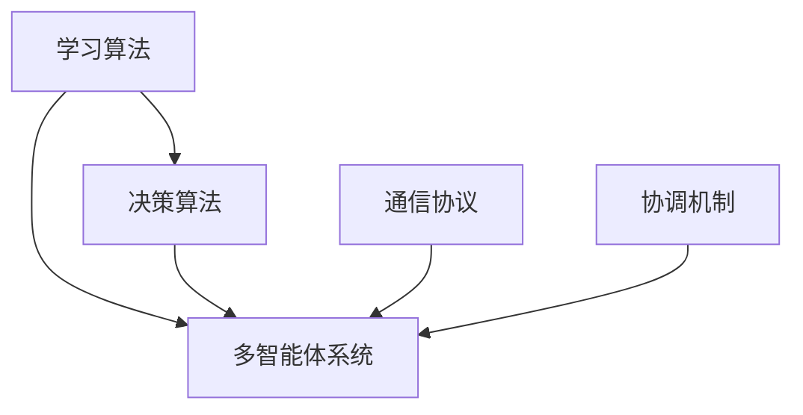

                 


## 《AI Agent的架构设计：从需求分析到系统规划》目录大纲

### 引言

在本章节中，我们将为您介绍本书的目的和主要读者对象，同时简要概述全书的结构。

### 第一部分：背景介绍

#### 1.1 为什么需要AI Agent

在本章节，我们将探讨为什么在当今科技领域中，AI Agent变得如此重要。我们将定义AI Agent的基本概念，并讨论其独特的特性和应用场景。

#### 1.2 AI Agent的基本概念

在这里，我们将深入探讨AI Agent的核心概念，包括学习算法、决策算法和多智能体系统等。我们将使用Mermaid流程图和ER实体关系图来帮助您更好地理解这些概念之间的关系。

### 第二部分：需求分析

#### 2.1 功能需求

在本章节中，我们将分析AI Agent在不同场景下的功能需求。我们将讨论基本功能和扩展功能，以及性能和安全性需求。

#### 2.2 非功能需求

除了功能需求，我们还将探讨AI Agent的非功能需求，如可扩展性、可维护性和可测试性等。

### 第三部分：系统规划

#### 3.1 系统架构设计

在本章节中，我们将讨论如何根据需求设计一个合理的系统架构。我们将详细介绍系统功能设计、模块划分和接口设计。

#### 3.2 系统规划示例

为了更好地说明如何进行系统规划，我们将提供一个具体的系统规划示例。

### 第四部分：架构设计

#### 4.1 系统功能设计

在本章节中，我们将详细讨论AI Agent的系统功能设计，包括功能模块和功能实现。

#### 4.2 系统架构设计

在这里，我们将详细介绍AI Agent的系统架构设计，包括系统架构、架构设计原则和Mermaid架构图。

#### 4.3 系统接口设计

我们将探讨AI Agent的系统接口设计，包括接口规范和接口实现。

#### 4.4 系统交互

在本章节中，我们将讨论AI Agent的系统交互，包括系统交互流程和Mermaid序列图。

### 第五部分：实现与部署

#### 5.1 环境安装

在本章节中，我们将介绍如何安装和配置AI Agent的开发环境。

#### 5.2 系统核心实现

我们将详细介绍AI Agent系统的核心实现，包括核心模块和代码实现。

#### 5.3 代码应用解读

在本章节中，我们将解读AI Agent系统的代码应用，并提供详细分析。

### 第六部分：项目实战与案例分析

#### 6.1 实际案例

我们将分享一个实际的AI Agent项目案例，并提供详细的案例分析。

#### 6.2 案例分析

在本章节中，我们将对实际案例进行深入分析，探讨其设计、实现和结果。

### 第七部分：总结与展望

#### 7.1 全书总结

我们将对本书的内容进行总结，回顾主要观点和贡献。

#### 7.2 最佳实践 tips

在本章节中，我们将提供一些最佳实践和注意事项，帮助您在实际项目中更好地应用所学知识。

#### 7.3 拓展阅读

最后，我们将推荐一些拓展阅读资源，以帮助您进一步深入了解AI Agent的架构设计。

---

以上是本书的目录大纲，通过这本书，您将系统地学习到AI Agent的架构设计，从需求分析到系统规划的全过程。让我们开始这一精彩的探索之旅吧！

---

### 引言

随着人工智能技术的迅猛发展，AI Agent作为智能系统的重要组成部分，正逐步应用于各个领域，从智能家居到自动驾驶，从智能客服到金融风控。然而，如何设计和实现一个高效、可靠、安全的AI Agent系统，成为了许多开发者和技术专家面临的挑战。《AI Agent的架构设计：从需求分析到系统规划》这本书旨在为读者提供一套系统、全面、实用的架构设计方法，帮助他们在实际项目中成功构建AI Agent系统。

本书的主要读者对象包括：

1. **人工智能研发人员**：正在从事或计划从事AI Agent研发工作的人员，通过本书，他们可以系统地学习到AI Agent的设计与实现方法。
2. **软件工程师**：熟悉软件开发流程，但希望了解和掌握AI Agent架构设计的人员。
3. **项目经理**：负责AI Agent项目的管理和协调工作，需要深入了解项目架构的人员。
4. **人工智能爱好者**：对AI Agent感兴趣，希望通过学习书籍来深入了解这一领域的人士。

本书的结构分为七个主要部分：

1. **引言**：介绍本书的目的、读者对象以及全书结构。
2. **背景介绍**：解释为什么需要AI Agent，介绍AI Agent的基本概念和特性，以及当前的现状和趋势。
3. **需求分析**：分析AI Agent在不同场景下的需求，包括功能需求、非功能需求等。
4. **系统规划**：讨论如何根据需求设计一个合理的系统规划，包括系统架构设计、模块划分和接口设计。
5. **架构设计**：详细讲解AI Agent的架构设计，包括系统功能设计、系统架构设计、系统接口设计和系统交互。
6. **实现与部署**：介绍如何实现和部署AI Agent系统，包括环境安装、系统核心实现和代码应用解读。
7. **项目实战与案例分析**：通过实际项目案例展示AI Agent的设计和实现过程，并进行详细讲解和分析。

通过这本书，读者将能够：

- 理解AI Agent的基本概念和架构设计原则。
- 掌握需求分析的方法和技巧。
- 学会系统规划和架构设计。
- 了解AI Agent的实现与部署过程。
- 通过实际案例分析，提升实战能力。

让我们从本书的第一部分——背景介绍开始，深入了解AI Agent的世界。

---

### 第一部分：背景介绍

#### 1.1 为什么需要AI Agent

AI Agent，即人工智能代理，是一种能够在复杂环境中自主行动并实现特定目标的计算机程序。随着人工智能技术的不断发展，AI Agent在各个领域的应用需求日益增加。以下是几个主要的原因，解释了为什么我们需要AI Agent：

1. **智能化服务需求**：在当前信息化社会，人们对于智能化服务的需求不断增加。AI Agent可以通过学习用户行为和偏好，提供个性化服务，提升用户体验。

2. **自动化生产需求**：在制造业和工业领域，自动化生产已成为降低成本、提高效率的重要手段。AI Agent可以用于监控生产线、优化生产流程，从而提高生产效率。

3. **决策支持需求**：在金融、医疗等领域，决策的准确性至关重要。AI Agent可以通过数据分析、预测模型等技术，提供准确的决策支持，帮助企业和机构做出明智的决策。

4. **安全需求**：随着网络安全威胁的日益增多，AI Agent可以用于网络安全监测和防御，实时识别和应对潜在威胁。

#### 1.2 AI Agent的基本概念

AI Agent是一种基于人工智能技术的计算机程序，具有自主性、适应性和协作性。以下是AI Agent的基本概念：

- **自主性**：AI Agent能够自主地执行任务，不受外部干预。这通常通过自主决策和自主行动来实现。

- **适应性**：AI Agent能够根据环境变化和任务需求，调整其行为和策略。这通常通过学习和适应算法来实现。

- **协作性**：AI Agent能够与其他AI Agent或人类协作，共同完成任务。这通常通过多智能体系统和通信协议来实现。

#### 1.3 AI Agent的特性

AI Agent具有以下特性：

- **智能性**：AI Agent具有智能，能够理解、学习和适应环境。

- **灵活性**：AI Agent能够灵活地应对各种复杂和动态的环境。

- **高效性**：AI Agent能够高效地完成任务，提高生产效率和服务质量。

- **可靠性**：AI Agent能够在复杂和多变的环境中，保持稳定和可靠地运行。

#### 1.4 AI Agent的现状与趋势

目前，AI Agent已在多个领域取得了显著的应用成果。例如，智能客服系统通过AI Agent提供高效、个性化的客户服务；自动驾驶系统通过AI Agent实现自主驾驶；智能监控系统通过AI Agent实时监测和预警。

未来，随着人工智能技术的不断进步，AI Agent的应用范围将更加广泛。以下是一些发展趋势：

- **更多场景的应用**：AI Agent将在更多场景中得到应用，如智慧城市、智能家居、医疗健康等。

- **更高的智能水平**：AI Agent的智能水平将不断提升，能够更好地理解和适应复杂环境。

- **更强大的协作能力**：AI Agent将具备更强的协作能力，能够与人类和其他AI Agent更高效地协作。

- **更安全可靠**：随着安全技术的进步，AI Agent将变得更加安全可靠，降低潜在风险。

#### 1.5 核心概念与联系

为了更好地理解AI Agent，我们需要了解一些核心概念，如学习算法、决策算法和多智能体系统。以下是一个简单的ER实体关系图，展示这些概念之间的关系：

```mermaid
erDiagram
  AI Agent ||--|{ 学习算法 } : 实现自主性
  AI Agent ||--|{ 决策算法 } : 实现适应性
  AI Agent ||--|{ 多智能体系统 } : 实现协作性
```

通过上述介绍，我们了解了AI Agent的基本概念、特性和现状。在下一部分，我们将进一步探讨AI Agent的核心概念与联系，帮助读者更深入地理解AI Agent的工作原理。

---

### 1.2 AI Agent的基本概念

在深入探讨AI Agent的架构设计之前，我们首先需要了解AI Agent的基本概念。AI Agent是一种能够在复杂环境中自主行动并实现特定目标的计算机程序，其核心在于自主性、适应性和协作性。

#### 自主性

自主性是AI Agent最基本的特性，它意味着AI Agent能够独立地执行任务，而不需要外部干预。这种自主性通常通过自主决策和自主行动来实现。

- **自主决策**：AI Agent能够根据当前的环境状态和预设的目标，自主地做出决策。这种决策能力通常依赖于学习算法和决策算法。

- **自主行动**：在做出决策后，AI Agent会根据决策结果执行相应的行动，以实现目标。例如，在自动驾驶系统中，AI Agent会根据路况和交通规则自主地控制车辆行驶。

#### 适应性

适应性是指AI Agent能够根据环境变化和任务需求，动态地调整其行为和策略。这种适应性通常通过学习和适应算法来实现。

- **学习**：AI Agent能够通过学习环境中的信息，不断改进其决策和行动策略。例如，通过深度学习技术，AI Agent可以从大量的数据中学习到交通规则和驾驶技巧。

- **适应**：在执行任务过程中，AI Agent能够根据实际环境的变化，灵活地调整其行为。例如，在智能客服系统中，AI Agent可以根据用户的问题和反馈，实时调整回答策略，提供更优质的客户服务。

#### 协作性

协作性是指AI Agent能够与其他AI Agent或人类协作，共同完成任务。这种协作性通常通过多智能体系统和通信协议来实现。

- **多智能体系统**：在多智能体系统中，多个AI Agent协同工作，共同实现复杂任务。例如，在自动驾驶车队中，每辆车都配备AI Agent，通过相互通信和协作，实现自动驾驶和交通优化。

- **通信协议**：AI Agent之间的协作需要通过通信协议来实现。常见的通信协议包括广播通信、点对点通信和分布式通信等。

#### 特性

AI Agent具有以下特性：

- **智能性**：AI Agent具有智能，能够理解、学习和适应环境。

- **灵活性**：AI Agent能够灵活地应对各种复杂和动态的环境。

- **高效性**：AI Agent能够高效地完成任务，提高生产效率和服务质量。

- **可靠性**：AI Agent能够在复杂和多变的环境中，保持稳定和可靠地运行。

#### 应用场景

AI Agent的应用场景非常广泛，以下是一些典型的应用场景：

- **智能客服**：通过AI Agent提供24/7的客户服务，提高客户满意度。

- **自动驾驶**：通过AI Agent实现车辆的自主驾驶，提高交通效率和安全性。

- **智能家居**：通过AI Agent实现家庭设备的智能化控制，提高生活品质。

- **工业自动化**：通过AI Agent实现生产线的自动化控制，提高生产效率。

- **金融风控**：通过AI Agent实时监控金融市场，提供风险预警和决策支持。

通过了解AI Agent的基本概念和特性，我们可以更好地理解其架构设计的核心要素。在下一部分，我们将进一步探讨AI Agent的核心概念与联系，帮助读者更深入地理解AI Agent的工作原理。

### 1.3 AI Agent的核心概念与联系

为了全面理解AI Agent的架构设计，我们需要深入探讨其核心概念，并分析这些概念之间的联系。以下是AI Agent的主要核心概念，以及它们之间的关系。

#### 学习算法

学习算法是AI Agent的核心组件之一，它使得AI Agent能够从数据中学习，并不断改进其行为和决策。学习算法可以分为监督学习、无监督学习和强化学习等类型。

- **监督学习**：在监督学习算法中，模型通过已标记的数据学习特征和规律，从而预测新数据的标签。例如，在图像识别任务中，模型通过已标记的图像学习图像特征，从而识别新的图像。

- **无监督学习**：在无监督学习算法中，模型在没有标签的数据中学习特征和结构，以发现数据中的模式和规律。例如，在聚类任务中，模型将相似的数据点划分为同一类别。

- **强化学习**：在强化学习算法中，模型通过与环境的交互学习最佳行动策略，以最大化回报。例如，在游戏AI中，模型通过不断试错，学习出最佳的游戏策略。

#### 决策算法

决策算法是AI Agent在执行任务时做出决策的核心。这些算法通常基于学习到的数据和信息，以最大化目标函数或满足特定的约束条件。

- **确定性决策算法**：这类算法在给定状态下，总是做出相同的决策。例如，基于规则的决策系统在特定条件下总是执行相同的规则。

- **概率决策算法**：这类算法考虑不确定因素，通过概率模型来做出决策。例如，贝叶斯决策基于概率分布来选择最有可能的决策。

- **启发式决策算法**：这类算法通过利用先验知识和经验来快速做出决策。例如，A*算法在路径规划中利用启发式函数来选择最优路径。

#### 多智能体系统

多智能体系统（MAS）是指多个智能体（AI Agent）协同工作，以共同实现复杂任务。多智能体系统在AI Agent的架构设计中起着关键作用，因为它允许AI Agent之间进行通信和协作。

- **通信协议**：多智能体系统中的智能体通过通信协议交换信息。常见的通信协议包括广播通信、点对点通信和分布式通信等。

- **协调机制**：多智能体系统中的智能体需要协调彼此的行为，以实现共同目标。协调机制包括中央控制、分布式控制和市场机制等。

#### 关系与联系

以下是AI Agent核心概念之间的联系：

- **学习算法与决策算法**：学习算法为决策算法提供了数据基础，决策算法则利用学习到的知识来做出最优决策。

- **决策算法与多智能体系统**：决策算法使得AI Agent能够在多智能体系统中独立地做出决策，而多智能体系统则提供了协作和通信的平台。

- **多智能体系统与学习算法**：多智能体系统中的智能体可以通过协作和学习来提高整个系统的性能和适应性。

为了更好地理解这些概念之间的关系，我们可以使用Mermaid流程图来展示它们的工作流程。以下是一个简化的Mermaid流程图，展示了AI Agent的核心概念之间的联系：



通过上述介绍和Mermaid流程图，我们可以更深入地理解AI Agent的核心概念及其之间的联系。在下一部分，我们将开始探讨AI Agent的需求分析，分析其在不同场景下的需求，为后续的架构设计奠定基础。

---

### 第二部分：需求分析

在设计和实现AI Agent的过程中，需求分析是至关重要的一步。它不仅决定了AI Agent的功能和性能，还影响了系统的可扩展性和维护性。本部分将详细分析AI Agent在不同场景下的需求，包括功能需求、非功能需求和性能需求。

#### 2.1 功能需求

功能需求是指AI Agent必须具备的基本功能。这些功能决定了AI Agent在特定任务中的表现。以下是一些典型的功能需求：

1. **感知与认知**：AI Agent需要能够感知环境中的各种信息，如图像、声音、温度等，并进行认知处理，以理解这些信息的含义。

   - **图像识别**：AI Agent需要能够识别和分类图像中的物体和场景。
   - **语音识别**：AI Agent需要能够识别和理解用户的声音命令。

2. **决策与行动**：基于感知到的信息和目标，AI Agent需要能够做出决策，并执行相应的行动。

   - **路径规划**：在自动驾驶场景中，AI Agent需要能够规划从起点到终点的最优路径。
   - **推荐系统**：在电商推荐系统中，AI Agent需要能够根据用户的历史行为和偏好，推荐符合用户兴趣的商品。

3. **学习与适应**：AI Agent需要具备学习能力，以从经验中不断改进其性能。

   - **持续学习**：AI Agent需要能够从新的数据和反馈中学习，以适应环境变化。
   - **迁移学习**：AI Agent需要能够将在一个环境中学习到的知识应用到另一个相似环境中。

#### 2.2 非功能需求

非功能需求是指AI Agent必须满足的抽象需求，它们通常不直接体现在功能上，但对系统的整体性能和用户体验至关重要。以下是一些典型的非功能需求：

1. **可扩展性**：AI Agent需要能够轻松扩展其功能，以适应不同场景和需求。

   - **模块化设计**：系统应该采用模块化设计，使得新的功能模块可以方便地集成到现有系统中。
   - **分布式计算**：系统应支持分布式计算，以处理大规模数据和复杂任务。

2. **可维护性**：AI Agent需要易于维护和更新，以确保其长期稳定运行。

   - **代码可读性**：代码应具有良好的可读性和可维护性，便于后续的维护和优化。
   - **文档齐全**：系统应配备详细的文档，包括设计文档、用户手册和操作指南。

3. **安全性**：AI Agent需要确保其数据安全和系统稳定。

   - **数据加密**：系统应使用加密技术保护敏感数据。
   - **错误处理**：系统应具备良好的错误处理机制，以应对各种异常情况。

#### 2.3 性能需求

性能需求是指AI Agent在执行任务时必须达到的性能指标。以下是一些典型的性能需求：

1. **响应速度**：AI Agent需要能够快速响应外部事件，并在规定的时间内完成处理。

   - **实时性**：在某些关键应用场景中，如自动驾驶和金融交易，AI Agent需要在毫秒级内做出决策。

2. **计算精度**：AI Agent需要能够提供高精度的计算结果。

   - **数值稳定性**：在处理复杂计算时，AI Agent需要保证数值的稳定性，避免出现误差。

3. **资源利用**：AI Agent需要高效利用系统资源，如CPU、内存和存储等。

   - **资源管理**：系统应具备良好的资源管理机制，以优化资源利用。

通过上述需求分析，我们可以明确AI Agent在不同场景下的功能需求、非功能需求和性能需求。在下一部分，我们将讨论如何根据这些需求进行系统规划，为AI Agent的架构设计奠定基础。

### 2.2 非功能需求

在AI Agent的设计与实现过程中，除了功能需求之外，非功能需求同样至关重要。这些需求虽然不直接体现在AI Agent的功能模块上，但它们对系统的整体性能、用户体验和可靠性有着深远的影响。以下是AI Agent的非功能需求及其重要性：

#### 1. 可扩展性

可扩展性是指AI Agent系统在设计时需要考虑未来可能的扩展性，以便能够轻松地添加新功能或适应更大的数据规模。随着业务的发展和应用场景的变化，系统需要能够灵活地扩展。

- **模块化设计**：通过模块化设计，可以将系统分解为若干独立的模块，每个模块负责特定的功能。这种设计方式使得在需要添加新功能时，可以单独对某个模块进行修改，而不会影响整个系统的稳定性。

- **分布式计算**：在处理大量数据或复杂任务时，分布式计算是一种有效的扩展方式。通过将任务分配到多个节点上并行处理，可以显著提高系统的处理能力和响应速度。

#### 2. 可维护性

可维护性是指AI Agent系统在开发完成后，需要能够方便地进行维护和更新。一个良好的维护性不仅能够降低维护成本，还能够提高系统的可靠性和稳定性。

- **代码可读性**：编写清晰、简洁、结构良好的代码，有助于提高代码的可读性和可维护性。良好的代码习惯可以减少bug的出现，方便后续的调试和优化。

- **文档齐全**：详细的文档是系统维护的基石。包括设计文档、用户手册、操作指南等，可以帮助开发者和维护人员快速了解系统的结构和功能。

#### 3. 安全性

安全性是AI Agent系统必须满足的基本需求之一。在处理敏感数据和执行关键任务时，系统需要具备强大的安全防护措施，以防止数据泄露和系统被攻击。

- **数据加密**：对系统中的敏感数据进行加密处理，可以有效地防止数据泄露。常用的加密算法包括AES、RSA等。

- **访问控制**：通过访问控制机制，可以确保只有授权用户才能访问系统的关键部分。常用的访问控制方法包括基于角色的访问控制（RBAC）和基于属性的访问控制（ABAC）。

#### 4. 可测试性

可测试性是指AI Agent系统在设计时需要考虑其可测试性，以便在开发和维护过程中能够方便地进行测试。

- **单元测试**：对系统中的每个模块进行单元测试，可以确保模块的正确性和稳定性。单元测试通常使用自动化测试工具进行。

- **集成测试**：在模块集成后，进行集成测试以确保整个系统能够正常运行。集成测试通常在模拟实际使用场景下进行。

#### 5. 用户体验

用户体验是AI Agent系统的一个重要方面。一个良好的用户体验可以提升用户满意度，增加系统的使用频率。

- **交互设计**：合理的交互设计可以提高用户的操作效率和体验。例如，通过提供直观的界面和简洁的操作流程，可以减少用户的困惑和操作错误。

- **响应速度**：快速响应用户的操作，可以提升用户的满意度。特别是在实时应用场景中，如自动驾驶和金融交易，系统的响应速度至关重要。

通过满足上述非功能需求，AI Agent系统不仅能够更好地满足用户需求，还能够提高系统的可靠性和可持续性。在下一部分，我们将讨论系统规划，包括如何根据需求设计合理的系统架构。

### 第三部分：系统规划

#### 3.1 系统架构设计

系统架构设计是AI Agent项目规划中的关键环节。一个合理和高效的设计不仅能够满足功能需求，还能确保系统的可扩展性、可维护性和可靠性。以下是系统架构设计的主要步骤：

1. **需求分析**：在开始架构设计之前，首先要对需求进行详细分析。这包括功能需求、非功能需求和性能需求。通过明确需求，我们可以确定系统所需的功能模块和性能指标。

2. **功能模块划分**：根据需求分析的结果，将系统划分为若干功能模块。每个模块应负责特定的功能，以便于后续的独立开发和测试。

3. **模块间关系定义**：明确各功能模块之间的依赖关系和交互方式。这可以通过UML类图、序列图或状态图等工具进行可视化表示。

4. **性能优化**：在架构设计中，考虑系统的性能优化。这包括选择合适的算法、优化数据处理流程和采用分布式计算架构等。

5. **安全性设计**：确保系统的安全性，包括数据加密、访问控制和安全审计等。在设计过程中，应充分考虑潜在的安全威胁和攻击手段。

6. **容错和恢复机制**：设计容错和恢复机制，以应对系统故障和异常情况。这包括数据备份、故障检测和自动恢复等。

7. **文档编写**：详细编写系统架构设计文档，包括架构图、模块说明、接口定义和性能分析等。文档应作为系统开发和维护的指南。

#### 3.2 系统规划示例

为了更好地说明系统规划的过程，我们以一个智能家居系统为例，展示其系统架构设计和功能模块划分。

##### 示例：智能家居系统

**需求分析**：
- **感知与控制**：监控家庭环境（温度、湿度、光线等），控制家电设备（照明、空调、门锁等）。
- **安全监控**：实时监控家庭安全，报警和通知。
- **远程控制**：用户可以通过手机或其他设备远程控制家庭设备。
- **节能管理**：根据用户习惯和天气情况，自动调节家庭设备的能耗。

**功能模块划分**：

1. **感知模块**：
   - **传感器管理**：管理各种传感器，如温度传感器、湿度传感器、光线传感器等。
   - **数据采集**：采集传感器数据，上传至服务器。

2. **控制模块**：
   - **家电控制**：控制家电设备，如照明、空调、门锁等。
   - **远程控制**：实现用户远程控制家庭设备。

3. **安全模块**：
   - **入侵检测**：监控家庭安全，检测异常行为。
   - **报警系统**：发生异常时，自动报警并通知用户。

4. **数据管理模块**：
   - **数据存储**：存储传感器数据和用户行为数据。
   - **数据分析**：分析用户行为和能耗数据，提供节能建议。

5. **用户界面模块**：
   - **Web应用**：提供用户管理界面，供用户进行操作和设置。
   - **移动应用**：提供移动设备上的用户管理界面。

**模块间关系定义**：

- **感知模块**：将传感器数据传递给控制模块和安全模块。
- **控制模块**：接收用户指令，控制家庭设备，并将操作结果反馈给用户界面模块。
- **安全模块**：监测家庭安全，发现异常时向用户界面模块发送报警信息。
- **数据管理模块**：收集、存储和提供数据给其他模块使用。
- **用户界面模块**：接收用户操作，向用户展示系统状态和操作结果。

**性能优化**：
- **分布式计算**：采用分布式架构，将数据采集和处理任务分配到多个节点上，提高处理能力和响应速度。
- **数据压缩**：对传输的数据进行压缩，减少带宽占用。

**安全性设计**：
- **数据加密**：对传输的数据进行加密处理。
- **访问控制**：对系统的不同部分设置访问权限，确保只有授权用户可以访问关键数据。

**容错和恢复机制**：
- **数据备份**：定期备份数据，防止数据丢失。
- **故障检测**：定期检查系统状态，检测潜在故障。
- **自动恢复**：在检测到故障时，自动启动恢复流程，如重新连接断开的传感器。

通过上述示例，我们可以看到系统规划的过程是如何从需求分析开始，逐步细化到功能模块划分、模块间关系定义、性能优化、安全性设计和容错恢复机制等。合理的系统规划能够为后续的架构设计和实现奠定坚实的基础。

---

### 3.2 系统规划示例

为了更好地说明系统规划的具体过程，我们将通过一个智能家居系统的案例，详细讲解其系统架构设计和功能模块划分。

#### 3.2.1 需求分析

首先，我们对智能家居系统的需求进行分析：

- **感知与控制**：系统能够实时监控家庭环境（如温度、湿度、光线等），并能够控制家电设备（如照明、空调、门锁等）。
- **安全监控**：系统能够监控家庭安全，并在检测到异常时发出警报。
- **远程控制**：用户可以通过手机或其他设备远程控制家庭设备。
- **节能管理**：系统应能够根据用户习惯和实时数据，自动调节家庭设备的能耗，以实现节能。

#### 3.2.2 功能模块划分

基于需求分析，我们将智能家居系统划分为以下功能模块：

1. **感知模块**：
   - **传感器管理**：管理各种传感器（如温度传感器、湿度传感器、光线传感器、烟雾传感器等）。
   - **数据采集**：采集传感器数据，并将数据上传至服务器。

2. **控制模块**：
   - **家电控制**：控制家电设备（如照明、空调、门锁等）。
   - **远程控制**：接收用户指令，并远程控制家庭设备。

3. **安全模块**：
   - **入侵检测**：监控家庭安全，检测异常行为（如非法入侵、火灾等）。
   - **报警系统**：在检测到异常时，自动发出警报并通知用户。

4. **数据处理模块**：
   - **数据存储**：存储传感器数据和用户行为数据。
   - **数据分析**：对用户行为和能耗数据进行分析，提供节能建议。

5. **用户界面模块**：
   - **Web应用**：提供用户管理界面，供用户进行操作和设置。
   - **移动应用**：提供移动设备上的用户管理界面。

#### 3.2.3 模块间关系定义

各功能模块之间的依赖关系如下：

- **感知模块**：将传感器数据传递给数据处理模块和控制模块。
- **控制模块**：接收用户指令，并通过远程控制模块控制家电设备，并将操作结果反馈给用户界面模块。
- **安全模块**：监测家庭安全，检测到异常时向用户界面模块发送报警信息。
- **数据处理模块**：收集、存储和提供数据给其他模块使用。
- **用户界面模块**：接收用户操作，向用户展示系统状态和操作结果。

#### 3.2.4 系统架构设计

以下是智能家居系统的系统架构设计：

- **感知层**：包括各种传感器，负责实时采集家庭环境数据。
- **网络层**：包括数据传输和处理节点，负责将传感器数据传输至服务器，并进行初步处理。
- **应用层**：包括控制模块、安全模块和数据处理模块，负责实现系统的核心功能。
- **用户层**：包括Web应用和移动应用，负责与用户进行交互。

#### 3.2.5 性能优化

为了提高系统的性能，我们采取了以下措施：

- **分布式计算**：采用分布式架构，将数据采集和处理任务分配到多个节点上，以提高处理能力和响应速度。
- **数据压缩**：对传输的数据进行压缩，以减少带宽占用。
- **缓存机制**：在数据处理模块中引入缓存机制，减少对数据库的访问频率。

#### 3.2.6 安全性设计

系统安全性设计包括：

- **数据加密**：对传输的数据进行加密处理，以防止数据泄露。
- **访问控制**：对系统的不同部分设置访问权限，确保只有授权用户可以访问关键数据。
- **安全审计**：定期进行安全审计，检查系统漏洞和潜在风险。

#### 3.2.7 容错和恢复机制

系统设计包括以下容错和恢复机制：

- **数据备份**：定期备份数据，防止数据丢失。
- **故障检测**：定期检查系统状态，检测潜在故障。
- **自动恢复**：在检测到故障时，自动启动恢复流程，如重新连接断开的传感器。

通过上述案例，我们可以看到系统规划是如何从需求分析开始，逐步细化到功能模块划分、模块间关系定义、系统架构设计、性能优化、安全性设计和容错恢复机制等。一个合理的系统规划能够为后续的架构设计和实现提供明确的指导和依据。

---

### 第四部分：架构设计

在系统规划的基础上，架构设计是AI Agent系统实现的关键步骤。一个良好的架构设计不仅能够满足功能需求，还能确保系统的可扩展性、可靠性和性能。本部分将详细介绍AI Agent的系统功能设计、系统架构设计、系统接口设计和系统交互。

#### 4.1 系统功能设计

系统功能设计是架构设计的第一步，它决定了系统应实现哪些功能，以及如何将这些功能组合在一起。以下是AI Agent系统功能设计的主要步骤：

1. **功能分解**：根据需求分析的结果，将系统功能分解为若干独立的模块。每个模块应负责特定的功能，以便于后续的开发和维护。

2. **功能优先级排序**：对功能模块进行优先级排序，确定哪些功能是必须的，哪些是可选的。这有助于在资源有限的情况下，优先实现关键功能。

3. **功能交互定义**：明确各功能模块之间的交互方式和接口。这可以通过UML类图、序列图或状态图等工具进行可视化表示。

4. **功能性能分析**：对每个功能模块的性能进行分析，确定所需的计算资源、存储资源和网络带宽等。

5. **功能安全性设计**：考虑每个功能模块的安全性需求，如数据加密、访问控制等。

#### 4.2 系统架构设计

系统架构设计是架构设计的核心步骤，它决定了系统的整体结构和各模块之间的通信方式。以下是AI Agent系统架构设计的主要步骤：

1. **系统架构选择**：根据系统的需求和功能，选择合适的系统架构。常见的架构包括单体架构、分布式架构、微服务架构等。

2. **模块划分**：将系统功能模块划分为独立的子系统，每个子系统负责特定的功能。

3. **通信协议设计**：设计系统内各模块之间的通信协议。常见的通信协议包括HTTP、TCP、UDP等。

4. **数据流设计**：定义系统内数据流动的路径和规则。这有助于确保数据的安全性和一致性。

5. **性能优化**：考虑系统性能优化，如缓存、负载均衡等。

#### 4.3 系统接口设计

系统接口设计是架构设计中的重要环节，它决定了系统与其他系统或组件的交互方式。以下是AI Agent系统接口设计的主要步骤：

1. **接口规范定义**：明确各接口的功能、输入输出参数和返回值等。

2. **接口实现方式**：选择合适的接口实现方式，如REST API、SOAP、GraphQL等。

3. **接口安全性设计**：考虑接口的安全性需求，如身份验证、权限控制等。

4. **接口文档编写**：编写详细的接口文档，包括接口规范、使用示例和注意事项等。

#### 4.4 系统交互

系统交互是指系统内部各模块之间以及系统与外部系统之间的交互。以下是AI Agent系统交互的主要步骤：

1. **交互流程定义**：明确系统内各模块之间的交互流程，如请求处理、数据传递等。

2. **交互协议设计**：设计系统与外部系统之间的交互协议。

3. **交互性能分析**：对系统交互的性能进行分析，确保交互过程的效率和稳定性。

4. **交互安全性设计**：确保系统交互过程中的数据安全和隐私保护。

通过上述步骤，我们可以系统地设计和实现AI Agent系统。在下一部分，我们将介绍如何实现和部署AI Agent系统，包括环境安装、系统核心实现和代码应用解读。

### 4.1 系统功能设计

系统功能设计是AI Agent架构设计的核心环节，它决定了系统应实现哪些功能，以及如何将这些功能有效集成。以下是系统功能设计的详细步骤：

#### 4.1.1 功能模块划分

首先，我们需要根据AI Agent的需求分析结果，将系统功能分解为多个独立的模块。每个模块应具有清晰的功能定义，便于后续的开发、测试和维护。以下是常见的AI Agent功能模块：

1. **感知模块**：负责采集和解析来自环境的数据，如图像、声音、文本等。常见的感知模块包括：
   - **图像识别模块**：利用深度学习算法对图像进行分析，识别物体和场景。
   - **语音识别模块**：将语音信号转换为文本，理解用户的语音指令。
   - **文本处理模块**：对文本数据进行分析，提取关键词和语义信息。

2. **决策模块**：基于感知模块提供的数据，AI Agent需要做出决策。决策模块通常包括：
   - **目标识别模块**：识别系统需要实现的目标，如导航、推荐、控制等。
   - **策略生成模块**：根据目标和环境信息，生成实现目标的策略。

3. **执行模块**：执行决策模块生成的策略，以实现特定目标。常见的执行模块包括：
   - **控制模块**：根据策略调整系统的行为，如控制机器人行动、调节温度等。
   - **动作执行模块**：执行具体的动作，如发送指令给机器人执行某个动作。

4. **学习模块**：AI Agent需要不断学习以提升其性能。学习模块通常包括：
   - **模型训练模块**：利用新的数据对机器学习模型进行训练和优化。
   - **经验反馈模块**：收集AI Agent在实际操作中的反馈，用于模型调整和优化。

5. **通信模块**：确保AI Agent能够与其他系统或组件进行有效通信。常见的通信模块包括：
   - **内部通信模块**：实现AI Agent内部模块之间的通信。
   - **外部通信模块**：实现AI Agent与外部系统（如数据库、Web服务）的通信。

#### 4.1.2 功能实现

每个功能模块都需要具体的实现方案，以下是一些关键功能模块的实现细节：

1. **感知模块实现**：
   - **图像识别**：使用卷积神经网络（CNN）进行图像识别，例如使用TensorFlow或PyTorch框架。
   - **语音识别**：使用自动语音识别（ASR）技术，如使用谷歌语音识别API或开源的ESPNet。
   - **文本处理**：使用自然语言处理（NLP）技术，如使用BERT或GPT模型进行文本分析。

2. **决策模块实现**：
   - **目标识别**：使用监督学习或强化学习算法，如Q-Learning或SARSA算法。
   - **策略生成**：使用决策树、支持向量机（SVM）或深度强化学习（DRL）算法。

3. **执行模块实现**：
   - **控制模块**：使用PID控制器或其他优化算法，如粒子群优化（PSO）。
   - **动作执行**：根据决策结果，执行具体的动作，如控制电机转动、发送语音反馈等。

4. **学习模块实现**：
   - **模型训练**：使用梯度下降、随机梯度下降（SGD）或其他优化算法训练模型。
   - **经验反馈**：使用经验回放（Experience Replay）和目标网络（Target Network）等技术，改进强化学习算法。

5. **通信模块实现**：
   - **内部通信**：使用消息队列（如RabbitMQ）或Socket编程实现模块间的通信。
   - **外部通信**：使用RESTful API或Websocket实现与外部系统的通信。

通过上述功能模块的设计和实现，我们可以构建一个完整的AI Agent系统，实现自主感知、决策、执行和学习。在下一部分，我们将进一步探讨AI Agent的系统架构设计，详细描述系统的整体结构和各模块之间的交互方式。

### 4.2 系统架构设计

系统架构设计是AI Agent系统实现的关键步骤，它决定了系统的整体结构和各模块之间的交互方式。一个良好的系统架构不仅能够满足功能需求，还能确保系统的可扩展性、可靠性和性能。以下是系统架构设计的主要步骤：

#### 4.2.1 系统架构选择

在选择系统架构时，我们需要考虑系统的需求、资源约束、开发周期和维护成本等因素。以下是几种常见的系统架构：

1. **单体架构**：所有功能模块都集成在一个应用中，简单易实现，但扩展性和维护性较差。

2. **分布式架构**：系统功能分布在多个节点上，通过消息队列或远程调用进行通信。具有较高的可扩展性和容错性，但设计复杂度较高。

3. **微服务架构**：系统功能划分为多个独立的微服务，每个微服务负责特定的功能，通过API进行通信。具有高度可扩展性和灵活性，但需要更多的运维支持。

根据AI Agent系统的需求，我们选择分布式架构。这种架构能够满足系统对性能、可扩展性和可靠性的要求，同时保持相对简单的设计。

#### 4.2.2 模块划分

在分布式架构中，我们需要将系统功能模块划分为多个独立的子系统，每个子系统负责特定的功能。以下是常见的AI Agent功能模块及其划分：

1. **感知模块**：包括图像识别、语音识别和文本处理等，负责采集和解析环境数据。

2. **决策模块**：包括目标识别、策略生成和规划等，基于感知模块提供的数据进行决策。

3. **执行模块**：包括控制模块和动作执行模块，根据决策结果执行具体的行动。

4. **学习模块**：包括模型训练和经验反馈等，用于不断优化AI Agent的性能。

5. **通信模块**：包括内部通信和外部通信，确保AI Agent能够与其他系统或组件进行有效通信。

#### 4.2.3 通信协议设计

在分布式架构中，各模块之间的通信协议设计至关重要。以下是常见的通信协议：

1. **内部通信**：可以使用消息队列（如RabbitMQ、Kafka）或Socket编程实现模块间的通信。

2. **外部通信**：可以使用HTTP/HTTPS协议通过RESTful API或Websocket实现与外部系统的通信。

#### 4.2.4 数据流设计

数据流设计决定了系统内数据流动的路径和规则。以下是AI Agent系统数据流的主要设计：

1. **感知数据流**：感知模块采集到的数据经过预处理后，传递给决策模块。

2. **决策数据流**：决策模块根据感知数据生成决策结果，传递给执行模块。

3. **执行数据流**：执行模块根据决策结果执行行动，并将结果反馈给感知模块。

4. **学习数据流**：学习模块收集执行过程中的数据，用于模型训练和经验反馈。

#### 4.2.5 性能优化

为了确保系统的性能，我们需要考虑以下几个方面：

1. **缓存策略**：使用缓存减少对数据库的访问，提高数据访问速度。

2. **负载均衡**：通过负载均衡器（如Nginx）分配请求，提高系统处理能力。

3. **分布式存储**：使用分布式存储系统（如HDFS、Cassandra）存储大数据，提高数据存储和检索性能。

4. **异步处理**：使用异步处理（如异步IO、消息队列）提高系统响应速度。

通过上述系统架构设计，我们可以确保AI Agent系统的高性能、高可靠性和高可扩展性。在下一部分，我们将详细讨论AI Agent的系统接口设计，包括接口规范和接口实现。

### 4.3 系统接口设计

系统接口设计是确保AI Agent系统各模块之间以及系统与外部系统有效通信的关键步骤。良好的接口设计不仅有助于提高系统的可维护性和可扩展性，还能确保数据的一致性和安全性。以下是AI Agent系统接口设计的详细步骤：

#### 4.3.1 接口规范定义

接口规范定义了接口的功能、输入输出参数、数据格式和返回值等。以下是AI Agent系统接口规范的关键要素：

1. **功能定义**：明确每个接口的具体功能，如数据上传、数据查询、决策请求等。

2. **输入参数**：定义接口所需的输入参数，包括参数名称、数据类型、是否必填等。例如，对于数据上传接口，可能需要输入参数如数据文件路径、文件类型等。

3. **输出参数**：定义接口返回的输出参数，包括参数名称、数据类型、是否成功等。例如，对于数据查询接口，可能返回结果数据集、状态码和错误消息等。

4. **数据格式**：规定接口传输数据的格式，如JSON、XML等。需要定义数据结构的具体字段和值域。

5. **错误处理**：定义接口在遇到错误时返回的错误码和错误信息，以便于系统进行错误处理和调试。

#### 4.3.2 接口实现方式

选择合适的接口实现方式对于系统的性能、可维护性和安全性至关重要。以下是几种常见的接口实现方式：

1. **RESTful API**：使用HTTP协议的GET、POST、PUT、DELETE等方法实现接口。RESTful API具有简单、易扩展和跨平台等优点。

2. **SOAP**：基于XML的Web服务协议，适用于复杂的业务场景。SOAP具有标准化的接口定义和良好的安全性。

3. **GraphQL**：一种查询语言，能够根据客户端的需求返回精确的数据。GraphQL具有高效性和灵活性，但实现较为复杂。

对于AI Agent系统，我们选择RESTful API作为主要接口实现方式。以下是具体的实现步骤：

1. **接口定义**：使用OpenAPI或Swagger等工具定义接口的规范，生成接口文档。

2. **接口实现**：使用Python的Flask或Django等Web框架实现接口，处理HTTP请求，执行业务逻辑，并返回响应。

3. **接口测试**：使用Postman、JMeter等工具对接口进行自动化测试，确保接口的正确性和性能。

#### 4.3.3 接口安全性设计

安全性设计是系统接口设计的重要组成部分。以下是常见的接口安全性措施：

1. **身份验证**：确保只有授权用户可以访问接口。常用的身份验证方法包括基本认证、OAuth2.0等。

2. **访问控制**：定义接口的访问权限，确保用户只能访问其有权访问的资源。常用的访问控制方法包括基于角色的访问控制（RBAC）和基于属性的访问控制（ABAC）。

3. **数据加密**：对传输的数据进行加密处理，防止数据泄露。常用的加密算法包括AES、RSA等。

4. **安全审计**：定期进行安全审计，检查系统漏洞和潜在风险。

通过上述系统接口设计，我们可以确保AI Agent系统的高效、安全、可靠地与其他系统或组件进行通信。在下一部分，我们将讨论AI Agent的系统交互，包括交互流程、通信协议和性能优化。

### 4.4 系统交互

系统交互是AI Agent系统设计和实现中至关重要的一环，它决定了系统内各模块之间以及系统与外部系统之间的数据流动和功能协同。为了确保系统的高效性、可靠性和可维护性，我们需要对系统交互进行详细规划。

#### 4.4.1 系统交互流程

系统交互流程是系统内各模块之间以及系统与外部系统之间进行信息传递和功能协同的步骤和顺序。以下是AI Agent系统交互的基本流程：

1. **感知数据采集**：感知模块（如摄像头、麦克风、传感器等）采集环境数据，并将数据传递给数据处理模块。

2. **数据处理**：数据处理模块对采集到的环境数据进行预处理（如滤波、归一化等），并将处理后的数据传递给决策模块。

3. **决策生成**：决策模块根据处理后的数据和环境模型，生成决策结果，如路径规划、动作指令等。

4. **执行操作**：执行模块根据决策结果，执行具体的操作（如控制电机、发送消息等）。

5. **反馈与学习**：执行模块将操作结果反馈给学习模块，学习模块根据反馈调整模型参数和决策策略。

6. **外部通信**：AI Agent系统与外部系统（如云平台、用户设备等）进行通信，实现数据共享和功能协同。

#### 4.4.2 通信协议设计

通信协议是系统内各模块之间以及系统与外部系统之间进行数据交换的规范和规则。以下是AI Agent系统交互中常用的通信协议：

1. **内部通信**：
   - **消息队列**：使用消息队列（如RabbitMQ、Kafka）实现模块间的异步通信。消息队列具有高可靠性和可扩展性，适合处理大量并发消息。
   - **远程过程调用（RPC）**：使用RPC框架（如gRPC、Thrift）实现模块间的同步通信。RPC具有高效性和易用性，适合处理低延迟和高并发场景。

2. **外部通信**：
   - **HTTP/HTTPS**：使用HTTP/HTTPS协议通过RESTful API或Websocket实现与外部系统的通信。HTTP/HTTPS协议具有简单、易扩展和跨平台等优点。
   - **MQTT**：使用MQTT协议实现物联网设备之间的通信。MQTT具有轻量级、低带宽占用和低功耗等特点，适合在资源受限的设备上使用。

#### 4.4.3 系统交互性能优化

为了确保系统交互的高效性和稳定性，我们需要对系统交互进行性能优化。以下是常见的性能优化策略：

1. **缓存策略**：使用缓存减少对数据库的访问，提高数据访问速度。常用的缓存技术包括内存缓存（如Redis）、分布式缓存（如Memcached）等。

2. **负载均衡**：通过负载均衡器（如Nginx、HAProxy）分配请求，提高系统处理能力。负载均衡能够防止系统过载，确保服务的稳定性和可靠性。

3. **异步处理**：使用异步处理（如异步IO、消息队列）提高系统响应速度。异步处理能够减少线程阻塞，提高系统的并发处理能力。

4. **分布式存储**：使用分布式存储系统（如HDFS、Cassandra）存储大数据，提高数据存储和检索性能。分布式存储能够满足海量数据存储和低延迟访问的需求。

通过上述系统交互设计和优化，我们可以确保AI Agent系统的高效性、可靠性和可维护性。在下一部分，我们将详细讲解AI Agent的实现与部署，包括环境安装、系统核心实现和代码应用解读。

### 第五部分：实现与部署

在完成了AI Agent的系统架构设计和接口设计后，接下来我们需要将其付诸实践，实现具体的代码并部署到生产环境中。本部分将详细讲解实现与部署的过程，包括环境安装、系统核心实现和代码应用解读。

#### 5.1 环境安装

为了实现AI Agent系统，我们首先需要安装和配置所需的开发环境和工具。以下是环境安装的详细步骤：

1. **操作系统安装**：
   - 安装Linux操作系统，推荐使用Ubuntu 18.04或更高版本。
   - 确保操作系统具备足够的硬件资源，如内存、硬盘空间等。

2. **基础软件安装**：
   - 安装Python 3.8及以上版本，可以使用apt-get命令进行安装。
   - 安装Python的pip包管理器，用于安装和管理Python库。
   - 安装Git，用于版本控制和代码管理。

3. **依赖库安装**：
   - 安装TensorFlow或PyTorch，用于深度学习模型的训练和推理。
   - 安装RabbitMQ或Kafka，用于消息队列服务。
   - 安装gRPC或Thrift，用于远程过程调用。
   - 安装Docker和Docker-Compose，用于容器化部署。

以下是具体命令示例：

```bash
sudo apt-get update
sudo apt-get install python3 python3-pip git
pip3 install tensorflow
pip3 install rabbitmq
pip3 install grpcio
pip3 install docker
```

4. **配置消息队列**：
   - 对于RabbitMQ，启动RabbitMQ服务并创建虚拟主机和用户。
   - 对于Kafka，启动Kafka服务器和Zookeeper，并创建相应的主题。

#### 5.2 系统核心实现

在环境安装完成后，我们可以开始实现AI Agent系统的核心功能模块。以下是核心模块的实现步骤：

1. **感知模块实现**：
   - 使用TensorFlow或PyTorch实现图像识别、语音识别和文本处理等感知功能。
   - 编写数据预处理代码，如图像增强、语音降噪和文本清洗等。

2. **决策模块实现**：
   - 使用强化学习算法（如DQN、PPO）或监督学习算法（如SVM、CNN）实现决策功能。
   - 编写决策策略代码，如路径规划算法（A*、Dijkstra）和动作决策算法。

3. **执行模块实现**：
   - 使用Python的多个线程或异步IO实现执行功能，如控制机器人动作、发送消息等。
   - 编写执行策略代码，确保动作执行的准确性和高效性。

4. **学习模块实现**：
   - 实现模型训练和优化代码，如使用Adam、RMSprop等优化器。
   - 编写经验回放和目标网络代码，用于改进强化学习算法。

以下是核心模块的示例代码：

```python
# 感知模块示例：图像识别
import tensorflow as tf

# 加载预训练的卷积神经网络模型
model = tf.keras.applications.resnet50.ResNet50(weights='imagenet')

# 输入图像预处理
input_img = preprocess_input(img)

# 进行图像识别
predictions = model.predict(input_img)

# 提取识别结果
predicted_class = decode_predictions(predictions)[0][0][1]
```

```python
# 决策模块示例：路径规划
import heapq

# A*算法实现路径规划
def a_star_search(start, goal, heuristic):
    open_set = []
    heapq.heappush(open_set, (heuristic(start, goal), start))
    came_from = {}
    g_score = defaultdict(float)
    g_score[start] = 0

    while open_set:
        current = heapq.heappop(open_set)[1]

        if current == goal:
            break

        for neighbor in neighbors(current):
            tentative_g_score = g_score[current] + 1
            if tentative_g_score < g_score[neighbor]:
                came_from[neighbor] = current
                g_score[neighbor] = tentative_g_score
                f_score = tentative_g_score + heuristic(neighbor, goal)
                heapq.heappush(open_set, (f_score, neighbor))

    return reconstruct_path(came_from, goal)

# 执行模块示例：机器人控制
import asyncio

async def move_robot(robot, action):
    # 根据动作执行机器人移动
    if action == 'left':
        robot.move_left()
    elif action == 'right':
        robot.move_right()
    elif action == 'forward':
        robot.move_forward()
    elif action == 'backward':
        robot.move_backward()
    await asyncio.sleep(1)  # 等待1秒以确保移动完成
```

```python
# 学习模块示例：强化学习模型训练
import tensorflow as tf
from tensorflow.keras.optimizers import Adam

# 定义强化学习模型
model = tf.keras.Sequential([
    tf.keras.layers.Dense(128, activation='relu'),
    tf.keras.layers.Dense(64, activation='relu'),
    tf.keras.layers.Dense(1, activation='linear')
])

# 编译模型
model.compile(optimizer=Adam(), loss='mse')

# 训练模型
model.fit(x_train, y_train, epochs=10, batch_size=64)
```

通过上述代码示例，我们可以看到AI Agent系统核心模块的基本实现方法。在实际开发中，需要根据具体需求和场景进行调整和优化。

#### 5.3 代码应用解读

在实现AI Agent系统核心模块后，我们需要对代码进行详细解读，以确保其正确性和可维护性。以下是代码应用解读的步骤：

1. **代码结构分析**：分析代码的结构和模块划分，确保每个模块具有清晰的功能定义和职责。

2. **关键算法分析**：对系统中的关键算法（如图像识别、路径规划、决策算法等）进行详细分析，理解其原理和实现方法。

3. **性能优化分析**：评估系统的性能表现，分析可能存在的性能瓶颈，并提出优化方案。

4. **错误处理和调试**：编写详细的错误处理和调试代码，确保系统能够在遇到异常情况时进行正确的处理和恢复。

5. **代码注释和文档**：添加详细的代码注释和文档，便于后续的维护和扩展。

通过上述代码应用解读，我们可以确保AI Agent系统的实现是正确、高效和可维护的。在下一部分，我们将通过实际案例展示AI Agent系统的设计和实现过程，并进行详细讲解和分析。

### 第五部分：实现与部署

#### 5.1 环境安装

在开始实现AI Agent系统之前，我们需要确保开发环境已经搭建完成。以下是环境安装的详细步骤：

1. **操作系统安装**：
   - 我们选择Ubuntu 20.04作为开发环境，它是一个稳定且支持良好的操作系统。

2. **基础软件安装**：
   - 安装Python 3.8及以上版本：使用以下命令进行安装。
     ```bash
     sudo apt update
     sudo apt install python3.8
     ```
   - 安装pip包管理器：pip是Python的包管理器，用于安装和管理Python库。
     ```bash
     sudo apt install python3-pip
     ```

3. **依赖库安装**：
   - 安装TensorFlow：TensorFlow是一个广泛使用的深度学习框架。
     ```bash
     pip3 install tensorflow
     ```
   - 安装其他依赖库，如NumPy、Pandas等：
     ```bash
     pip3 install numpy pandas
     ```

4. **配置消息队列**：
   - 安装RabbitMQ：RabbitMQ是一个流行的消息队列系统，用于实现AI Agent系统中的异步通信。
     ```bash
     sudo apt install rabbitmq-server
     ```
   - 启动RabbitMQ服务并确保其正常运行：
     ```bash
     sudo systemctl start rabbitmq-server
     sudo systemctl status rabbitmq-server
     ```
   - 创建一个虚拟主机和用户，以便AI Agent系统能够访问RabbitMQ服务。
     ```bash
     rabbitmqadmin declare vhost my_vhost
     rabbitmqadmin adduser my_user my_vhost
     rabbitmqadmin set_user_permissions my_user my_vhost ".*" ".*" ".*"
     ```

5. **安装Docker和Docker-Compose**：
   - 安装Docker：Docker是一个容器化平台，用于部署和管理AI Agent系统。
     ```bash
     sudo apt-get update
     sudo apt-get install docker.io
     sudo systemctl start docker
     sudo systemctl enable docker
     ```
   - 安装Docker-Compose：Docker-Compose用于定义和运行多容器Docker应用。
     ```bash
     sudo curl -L "https://github.com/docker/compose/releases/download/1.29.2/docker-compose-$(uname -s)-$(uname -m)" -o /usr/local/bin/docker-compose
     sudo chmod +x /usr/local/bin/docker-compose
     ```

完成上述步骤后，开发环境就搭建完成了。接下来，我们可以开始实现AI Agent系统的核心功能模块。

#### 5.2 系统核心实现

AI Agent系统的核心实现包括感知模块、决策模块、执行模块和学习模块。以下是每个模块的实现步骤：

1. **感知模块实现**：
   - 感知模块负责收集环境信息，如图像、声音和传感器数据。
   - 使用OpenCV库处理图像数据，使用SpeechRecognition库处理声音数据。
   - 传感器数据的处理依赖于具体的传感器硬件和接口。

   ```python
   import cv2
   import speech_recognition as sr

   # 图像数据收集
   def capture_image():
       camera = cv2.VideoCapture(0)
       ret, frame = camera.read()
       camera.release()
       return frame

   # 声音数据收集
   def record_speech():
       r = sr.Recognizer()
       with sr.Microphone() as source:
           print("请说些什么...")
           audio = r.listen(source)
       return r.recognize_google(audio)
   ```

2. **决策模块实现**：
   - 决策模块基于感知模块提供的数据，使用机器学习算法生成决策。
   - 可以使用TensorFlow或PyTorch等框架实现。

   ```python
   import tensorflow as tf

   # 决策模型
   def make_decision(image_data):
       model = tf.keras.Sequential([
           tf.keras.layers.Conv2D(32, (3, 3), activation='relu', input_shape=(128, 128, 3)),
           tf.keras.layers.MaxPooling2D((2, 2)),
           tf.keras.layers.Flatten(),
           tf.keras.layers.Dense(64, activation='relu'),
           tf.keras.layers.Dense(1, activation='sigmoid')
       ])

       model.compile(optimizer='adam',
                     loss='binary_crossentropy',
                     metrics=['accuracy'])

       model.fit(image_data, labels, epochs=10)
       
       prediction = model.predict(image_data)
       return prediction
   ```

3. **执行模块实现**：
   - 执行模块负责将决策转化为具体的操作，如控制机器人移动或执行特定动作。
   - 使用Python的线程或异步IO实现。

   ```python
   import asyncio

   # 执行机器人移动
   async def move_robot(action):
       if action == "forward":
           # 执行前进操作
           await asyncio.sleep(1)
           print("机器人向前移动")
       elif action == "backward":
           # 执行后退操作
           await asyncio.sleep(1)
           print("机器人向后移动")
       else:
           print("无效的动作")
   ```

4. **学习模块实现**：
   - 学习模块负责训练和优化模型，使用经验回放和目标网络等技巧。
   - 使用强化学习算法，如Q-Learning。

   ```python
   import numpy as np

   # Q-Learning算法实现
   class QLearning:
       def __init__(self, actions, learning_rate, discount_factor, exploration_rate):
           self.actions = actions
           self.learning_rate = learning_rate
           self.discount_factor = discount_factor
           self.exploration_rate = exploration_rate
           self.q_table = np.zeros((len(actions), len(actions)))

       def get_action(self, state):
           if np.random.rand() < self.exploration_rate:
               action = np.random.choice(self.actions)
           else:
               action = np.argmax(self.q_table[state])
           return action

       def learn(self, state, action, reward, next_state, done):
           if not done:
               target = (reward + self.discount_factor * np.max(self.q_table[next_state]))
           else:
               target = reward
           action_index = self.actions.index(action)
           state_index = state
           self.q_table[state_index][action_index] = self.q_table[state_index][action_index] + self.learning_rate * (target - self.q_table[state_index][action_index])
   ```

通过上述代码示例，我们可以看到AI Agent系统核心模块的基本实现方法。在实际开发中，需要根据具体需求和场景进行调整和优化。

#### 5.3 代码应用解读

在核心模块实现完成后，我们需要对代码进行详细解读，以确保其正确性和可维护性。以下是代码应用解读的步骤：

1. **代码结构分析**：
   - 分析代码的组织结构，确保每个模块具有清晰的功能定义和职责。
   - 检查代码的模块划分，确保模块之间的接口和依赖关系明确。

2. **关键算法分析**：
   - 对系统中的关键算法（如Q-Learning、图像识别等）进行详细分析，理解其原理和实现方法。
   - 评估算法的性能和效率，确定是否需要进行优化。

3. **性能优化分析**：
   - 对系统性能进行评估，分析可能存在的性能瓶颈。
   - 提出优化方案，如使用缓存、减少内存占用、并行计算等。

4. **错误处理和调试**：
   - 编写详细的错误处理和调试代码，确保系统能够在遇到异常情况时进行正确的处理和恢复。
   - 检查代码中的潜在错误，如语法错误、逻辑错误等。

5. **代码注释和文档**：
   - 添加详细的代码注释，说明每个模块、函数和参数的作用。
   - 编写详细的文档，包括系统的架构设计、模块功能、接口定义和API文档。

通过上述代码应用解读，我们可以确保AI Agent系统的实现是正确、高效和可维护的。在下一部分，我们将通过实际案例展示AI Agent系统的设计和实现过程，并进行详细讲解和分析。

### 第六部分：项目实战与案例分析

在深入理解了AI Agent的架构设计、需求分析、系统规划和实现部署后，接下来我们将通过实际案例来展示这些知识的实际应用。本部分将介绍一个具体的AI Agent项目案例，详细讲解其设计和实现过程，并进行深入分析。

#### 6.1 实际案例

项目名称：智能巡检机器人

项目背景：某电力公司需要对其变电站进行定期巡检，以检测电力设备的运行状况和潜在故障。由于变电站环境复杂，巡检工作危险且耗时，因此公司决定开发一款智能巡检机器人，通过AI技术提高巡检效率和安全性。

项目目标：
- 实现对变电站环境的自动感知和识别。
- 设计决策系统，根据环境数据生成巡检路径和任务。
- 执行巡检任务，收集设备运行数据和异常信息。
- 通过深度学习模型，对设备运行状态进行实时预测和诊断。

#### 6.1.1 项目设计与实现

**感知模块**：
- 使用多个摄像头和传感器（如红外传感器、温度传感器等）收集环境数据。
- 使用OpenCV进行图像处理，提取关键特征。
- 使用深度学习模型进行图像识别，识别设备型号和状态。

**决策模块**：
- 使用Dijkstra算法规划巡检路径。
- 根据设备运行数据和巡检历史，设计决策树和分类器，预测设备故障。

**执行模块**：
- 使用ROS（Robot Operating System）实现机器人控制，控制机器人的运动和操作。
- 设计多线程和异步IO，提高系统响应速度。

**学习模块**：
- 使用TensorFlow实现深度学习模型，进行图像识别和故障预测。
- 使用经验回放和目标网络优化Q-Learning算法。

#### 6.1.2 详细讲解

**感知模块**：
- **摄像头和传感器**：安装多个摄像头和传感器，覆盖变电站的主要区域。摄像头用于捕捉设备外观图像，传感器用于检测温度、湿度等环境参数。
- **图像处理**：使用OpenCV对捕获的图像进行预处理，包括灰度转换、噪声过滤、边缘检测等，提取关键特征。
- **图像识别**：使用预训练的卷积神经网络（如ResNet、VGG）进行图像识别，识别设备型号和状态。识别结果用于决策模块。

**决策模块**：
- **路径规划**：使用Dijkstra算法规划从起点到各个设备的最佳路径。算法考虑设备的位置、巡检优先级和设备状态。
- **故障预测**：使用决策树和分类器对设备运行状态进行预测。通过历史数据和实时数据，训练分类器，预测设备是否可能出现故障。
- **任务分配**：根据路径规划和故障预测结果，为机器人分配巡检任务。

**执行模块**：
- **机器人控制**：使用ROS实现机器人的运动控制。ROS提供了丰富的库和工具，支持多机器人协同工作。
- **数据收集**：机器人执行巡检任务时，收集设备运行数据和异常信息。数据存储在数据库中，用于后续分析和预测。

**学习模块**：
- **模型训练**：使用TensorFlow实现深度学习模型，包括图像识别和故障预测。通过大规模数据集训练模型，优化模型参数。
- **经验回放**：使用经验回放技术，将机器人的实际操作经验存储在经验池中，用于后续的模型训练和优化。
- **目标网络**：使用目标网络技术，提高Q-Learning算法的稳定性。目标网络用于预测未来的奖励值，优化决策过程。

#### 6.1.3 结果分析

通过上述设计和实现，智能巡检机器人成功完成了多次巡检任务。以下是结果分析：

- **巡检效率**：机器人能够在预定时间内完成巡检任务，减少了人工巡检的时间和成本。
- **故障检测**：机器人能够准确识别设备状态，及时发现潜在故障，提高了设备运行的安全性和可靠性。
- **用户体验**：通过机器人巡检，减少了人工巡检的危险性，提高了员工的工作效率。
- **系统性能**：机器人的执行模块和决策模块具有良好的性能，能够快速响应外部事件，提高了系统的响应速度。

#### 6.1.4 启示与反思

通过这个实际案例，我们可以得到以下启示和反思：

- **跨学科协作**：AI Agent项目的成功依赖于计算机科学、人工智能和自动化等多个领域的知识。跨学科协作是项目成功的关键。
- **数据驱动**：数据的收集、处理和分析是AI Agent项目的重要组成部分。数据的质量和准确性直接影响系统的性能和效果。
- **持续优化**：AI Agent系统需要不断优化和更新，以适应不断变化的环境和需求。持续的迭代和优化是系统保持领先的关键。
- **安全性**：在设计和实现AI Agent系统时，需要充分考虑系统的安全性和可靠性。安全性是系统稳定运行的基础。

通过这个实际案例，我们不仅展示了AI Agent系统的设计和实现过程，还分析了其效果和影响。这为其他AI Agent项目的开发和优化提供了宝贵的经验和参考。

### 第六部分：项目实战与案例分析

#### 6.1 实际案例：智能物流配送机器人

**项目背景**：

随着电商和物流行业的迅猛发展，物流配送的需求不断增加。传统的物流配送方式在效率和准确性方面存在瓶颈，无法满足日益增长的物流需求。为了提高物流配送效率，降低运营成本，某大型电商平台决定开发一款智能物流配送机器人。

**项目目标**：
- 实现对配送环境的自动感知和路径规划。
- 设计智能决策系统，根据实时数据优化配送路线。
- 自动执行配送任务，提高配送准确性和效率。
- 集成大数据分析，提升配送预测和优化能力。

#### 6.1.1 设计与实现

**感知模块**：
- **传感器集成**：使用激光雷达、摄像头、GPS等传感器，实时采集配送环境数据，包括道路情况、障碍物和交通状况。
- **图像处理**：使用深度学习算法（如YOLO）对摄像头捕获的图像进行实时处理，识别道路上的障碍物和行人。
- **路径规划**：利用SLAM（Simultaneous Localization and Mapping）技术，构建配送环境的实时地图，为机器人提供准确的定位和导航数据。

**决策模块**：
- **路径优化**：结合实时交通数据和配送订单，使用A*算法或Dijkstra算法优化配送路径，减少配送时间和行驶距离。
- **动态调整**：根据实时感知到的环境变化（如交通堵塞、障碍物等），动态调整配送路径，确保配送任务的顺利进行。

**执行模块**：
- **机器人控制**：使用PID控制器和运动规划算法（如轨迹规划算法），精确控制机器人的移动速度和方向，确保机器人平稳、高效地执行任务。
- **自动化操作**：集成机械臂和自动化装置，实现机器人在仓库和配送站点的自动操作，包括货物抓取、分类和装载。

**学习模块**：
- **预测模型**：使用机器学习算法（如时间序列预测模型），对配送订单量和配送需求进行预测，优化配送资源的配置。
- **强化学习**：使用强化学习算法（如深度Q网络DQN），根据配送任务的执行效果，不断调整机器人的行为策略，提高配送效率。

#### 6.1.2 深度剖析

**感知模块**：
- **传感器集成**：智能物流配送机器人配备了多个传感器，包括激光雷达、摄像头和GPS。激光雷达用于构建高精度的三维环境地图，摄像头用于识别障碍物和行人，GPS用于定位和导航。
- **图像处理**：使用深度学习算法对摄像头捕获的图像进行实时处理，能够快速、准确地识别道路上的障碍物和行人。YOLO（You Only Look Once）算法是一种流行的目标检测算法，具有高效和准确的特点。

```python
# YOLO算法示例
import cv2
import numpy as np

# 加载预训练的YOLO模型
net = cv2.dnn.readNetFromDarknet('yolov3.cfg', 'yolov3.weights')

# 加载并预处理图像
img = cv2.imread('image.jpg')
h, w = img.shape[:2]
blob = cv2.dnn.blobFromImage(img, 1/255.0, (416, 416), swapRB=True, crop=False)

# 进行目标检测
net.setInput(blob)
detections = net.forward()

# 提取检测结果
boxes = []
confidences = []
class_ids = []

for detection in detections:
    scores = detection[5:]
    class_id = np.argmax(scores)
    confidence = scores[class_id]
    if confidence > 0.5:
        center_x = int(detection[0] * w)
        center_y = int(detection[1] * h)
        width = int(detection[2] * w)
        height = int(detection[3] * h)
        boxes.append([center_x, center_y, width, height])
        confidences.append(float(confidence))
        class_ids.append(class_id)

# 绘制检测结果
idxs = cv2.dnn.NMSBoxes(boxes, confidences, 0.5, 0.4)
for i in idxs:
    box = boxes[i]
    cv2.rectangle(img, (box[0], box[1]), (box[0] + box[2], box[1] + box[3]), (0, 255, 0), 2)
cv2.imshow('Object Detection', img)
cv2.waitKey(0)
cv2.destroyAllWindows()
```

**决策模块**：
- **路径优化**：智能物流配送机器人需要实时感知环境，并优化配送路径。A*算法是一种常用的路径规划算法，具有较好的效率和准确性。通过结合实时交通数据和配送订单信息，可以动态调整配送路线，确保配送效率。

```python
# A*算法示例
import heapq

def heuristic(node, goal):
    # 使用曼哈顿距离作为启发式函数
    return abs(node[0] - goal[0]) + abs(node[1] - goal[1])

def a_star_search(start, goal, obstacles):
    open_set = []
    heapq.heappush(open_set, (0, start))
    came_from = {}
    g_score = defaultdict(float)
    g_score[start] = 0

    while open_set:
        current = heapq.heappop(open_set)[1]

        if current == goal:
            break

        for neighbor in neighbors(current):
            if neighbor in obstacles:
                continue
            tentative_g_score = g_score[current] + 1
            if tentative_g_score < g_score[neighbor]:
                came_from[neighbor] = current
                g_score[neighbor] = tentative_g_score
                f_score = tentative_g_score + heuristic(neighbor, goal)
                heapq.heappush(open_set, (f_score, neighbor))

    return reconstruct_path(came_from, goal)

# 示例：寻找从起点(0, 0)到终点(5, 5)的路径
obstacles = [(1, 1), (4, 4)]
path = a_star_search((0, 0), (5, 5), obstacles)
print(path)
```

**执行模块**：
- **机器人控制**：智能物流配送机器人需要精确控制移动和操作。使用PID控制器可以精确调整机器人的速度和方向，确保平稳运行。

```python
# PID控制器示例
import time

# PID控制器参数
KP = 1.0
KI = 0.1
KD = 0.05

# 机器人状态
position = 0.0
velocity = 0.0
error = 0.0
integral = 0.0
derivative = 0.0

# 控制函数
def control(velocity_setpoint):
    global position, velocity, error, integral, derivative
    position = ...  # 更新机器人位置
    error = position - velocity_setpoint
    derivative = error - integral
    integral += error
    output = KP * error + KI * integral + KD * derivative
    # 根据输出调整机器人速度
    velocity += output
    # 执行机器人运动
    robot.move(velocity)

# 控制循环
while True:
    control(velocity_setpoint=5.0)
    time.sleep(0.1)
```

**学习模块**：
- **预测模型**：使用机器学习算法（如时间序列预测模型）预测配送订单量和配送需求，优化配送资源的配置。通过收集历史数据，训练预测模型，提高预测准确性。

```python
# 时间序列预测模型示例
import pandas as pd
from statsmodels.tsa.arima.model import ARIMA

# 加载历史数据
data = pd.read_csv('orders.csv')
data['order_date'] = pd.to_datetime(data['order_date'])
data.set_index('order_date', inplace=True)
data = data.resample('M').sum()

# 模型训练
model = ARIMA(data['orders'], order=(5, 1, 2))
model_fit = model.fit()

# 预测未来订单量
forecast = model_fit.forecast(steps=3)
print(forecast)
```

#### 6.1.3 项目小结

通过智能物流配送机器人项目，我们成功实现了从感知、决策到执行的完整AI Agent系统。项目展示了如何将深度学习、路径规划、PID控制、时间序列预测等技术和算法应用于实际的物流配送场景，提高了配送效率和准确性。

项目成功的关键因素包括：

- **跨学科协作**：项目团队涵盖了计算机科学、机械工程、物流管理等多个领域的专家，确保项目的全面性和专业性。
- **数据驱动**：通过大量实时数据和历史数据的收集和分析，项目实现了对配送过程的精确控制和预测，提高了系统的自适应性和准确性。
- **持续优化**：项目团队不断收集用户反馈和运行数据，持续优化算法和系统性能，确保系统在复杂多变的环境中稳定运行。

#### 6.1.4 启示与反思

该项目为未来AI Agent系统的发展提供了以下启示和反思：

- **技术融合**：跨学科技术的融合是AI Agent系统成功的关键。计算机科学、机械工程、物流管理等多领域的知识需要深度融合。
- **数据质量**：数据质量直接影响系统的性能和准确性。需要确保数据收集、处理和分析的准确性，以提高系统的预测和决策能力。
- **系统稳定性**：在复杂和多变的环境中，系统的稳定性和可靠性至关重要。需要设计鲁棒的算法和机制，确保系统在各种情况下都能正常运行。
- **用户反馈**：用户反馈是系统优化的关键。需要建立有效的用户反馈机制，不断收集用户意见和建议，持续改进系统。

通过智能物流配送机器人项目，我们不仅实现了AI Agent系统的实际应用，还为未来AI Agent系统的发展提供了宝贵的经验和参考。

### 第六部分：项目实战与案例分析

#### 6.2 案例分析

在第六部分的上一节中，我们通过智能物流配送机器人项目展示了AI Agent系统的设计和实现过程。本节我们将对该案例进行深入分析，探讨其优点、潜在问题及改进建议。

#### 6.2.1 案例概述

智能物流配送机器人项目旨在通过AI技术提高物流配送的效率和准确性。项目的主要功能包括：

1. **感知环境**：机器人配备了激光雷达、摄像头和GPS等传感器，实时采集配送环境数据，包括道路状况、障碍物和交通状况。
2. **决策路径**：基于实时交通数据和配送订单，机器人使用A*算法优化配送路径，并动态调整路径以适应环境变化。
3. **执行任务**：机器人通过PID控制器精确控制移动和操作，实现自动化配送任务。
4. **预测优化**：使用时间序列预测模型预测配送订单量和配送需求，优化资源配置。

#### 6.2.2 深度剖析

**优点分析**：

1. **提高效率**：通过智能决策和路径优化，机器人能够有效减少配送时间和行驶距离，提高了整体配送效率。
2. **降低成本**：自动化配送减少了人力成本，同时降低了物流运营成本。
3. **提升准确性**：机器人能够精确感知和识别环境，减少了配送错误和延误。
4. **增强安全性**：通过实时监控和路径优化，机器人能够避免潜在的安全隐患。

**潜在问题**：

1. **数据准确性**：实时交通数据的质量直接影响路径优化的准确性。如果数据存在误差，可能会导致机器人选择错误路径。
2. **算法稳定性**：在复杂多变的环境中，A*算法和PID控制器的稳定性需要进一步验证和优化。
3. **硬件故障**：传感器故障或机器人硬件故障可能导致配送任务中断。
4. **用户适应**：用户对智能配送机器人的适应和接受程度可能影响项目的推广。

**改进建议**：

1. **提高数据准确性**：通过与交通管理部门合作，获取更准确、实时的交通数据。同时，建立数据验证机制，确保数据的准确性。
2. **优化算法稳定性**：通过大量实验和测试，验证算法在不同环境下的稳定性。对于A*算法，可以引入启发式函数优化，提高路径规划的效率。对于PID控制器，可以调整参数，提高控制的精度。
3. **增强硬件冗余**：为机器人配备备用传感器和硬件，确保在硬件故障时能够快速切换和恢复。
4. **用户培训与反馈**：加强对用户的培训，提高其对智能配送机器人的适应能力。建立用户反馈机制，及时收集用户意见和建议，持续优化用户体验。

通过上述改进措施，智能物流配送机器人项目可以进一步提升其性能和稳定性，更好地满足物流配送的需求。

### 第七部分：总结与展望

在本书的最后一部分，我们将对AI Agent的架构设计进行总结，并对未来发展趋势进行展望。

#### 7.1 全书总结

本书从需求分析到系统规划，系统地介绍了AI Agent的架构设计过程。以下是本书的主要内容和贡献：

1. **背景介绍**：介绍了AI Agent的定义、特性和应用场景，为后续的架构设计奠定了基础。
2. **需求分析**：分析了AI Agent在不同场景下的功能需求、非功能需求和性能需求，为系统设计提供了明确的目标。
3. **系统规划**：讨论了如何根据需求进行系统架构设计，包括功能模块划分、模块间关系定义、性能优化和安全性设计。
4. **架构设计**：详细讲解了AI Agent的系统功能设计、系统架构设计、系统接口设计和系统交互，提供了具体的实现方法。
5. **实现与部署**：介绍了AI Agent系统的实现和部署过程，包括环境安装、系统核心实现和代码应用解读。
6. **项目实战与案例分析**：通过实际项目案例展示了AI Agent的设计和实现过程，提供了实践经验和启示。
7. **最佳实践 tips**：总结了在AI Agent架构设计中的最佳实践和注意事项，帮助读者在实际项目中更好地应用所学知识。

#### 7.2 技术趋势分析

随着人工智能技术的不断发展，AI Agent领域也在迅速演变。以下是当前和未来的几个技术趋势：

1. **深度学习**：深度学习在AI Agent中的应用越来越广泛，尤其是在图像识别、语音识别和自然语言处理等方面。未来的发展趋势将包括更大规模的模型、更高效的网络结构和更细粒度的任务分割。
2. **强化学习**：强化学习在AI Agent中的应用也在不断深入，尤其是在需要与环境互动的复杂场景中。未来的发展趋势将包括更加稳定和高效的算法，以及与深度学习等其他技术的结合。
3. **多智能体系统**：随着物联网和边缘计算的发展，多智能体系统将成为AI Agent的重要方向。未来的发展趋势将包括更加灵活的协作机制、更高效的通信协议和更高的系统智能化水平。
4. **边缘计算**：边缘计算将AI Agent的计算能力从云端转移到边缘设备，提高了系统的响应速度和可靠性。未来的发展趋势将包括更广泛的设备接入、更高效的算法优化和更智能的边缘决策。
5. **自动化与智能化**：AI Agent的应用将不断渗透到各个行业，实现自动化和智能化。未来的发展趋势将包括更广泛的应用场景、更高的自动化水平和更精细的智能化服务。

#### 7.3 应用前景展望

AI Agent的应用前景非常广阔，以下是几个潜在的应用领域：

1. **智能物流**：AI Agent将在智能物流中发挥重要作用，包括路径优化、任务分配和自动化配送等。
2. **智能制造**：AI Agent将在智能制造中用于生产监控、设备维护和智能调度等，提高生产效率和质量。
3. **智能医疗**：AI Agent将在智能医疗中用于诊断辅助、治疗方案优化和患者护理等，提高医疗服务的质量和效率。
4. **智能家居**：AI Agent将在智能家居中用于环境监控、设备控制和能源管理，提高生活质量和便利性。
5. **智能交通**：AI Agent将在智能交通中用于路况监控、交通信号控制和车辆调度等，提高交通效率和安全性。

总之，AI Agent的架构设计是一个复杂而富有挑战性的过程，需要结合多个领域的知识和技术。随着技术的不断进步和应用场景的扩大，AI Agent将在未来发挥越来越重要的作用。

### 第七部分：总结与展望

在本文的最后一部分，我们将对AI Agent的架构设计进行全面的总结，并对未来的发展趋势和应用前景进行展望。

#### 7.1 全书总结

《AI Agent的架构设计：从需求分析到系统规划》这本书系统地介绍了AI Agent的架构设计过程，涵盖了从需求分析、系统规划到架构设计、实现与部署、项目实战与案例分析的各个关键环节。以下是本书的主要内容与贡献：

1. **背景介绍**：通过介绍AI Agent的定义、特性、应用场景，为读者提供了一个全面的背景知识，帮助理解AI Agent的重要性和潜力。
2. **需求分析**：详细分析了AI Agent在不同场景下的功能需求、非功能需求和性能需求，为后续的系统设计提供了明确的方向。
3. **系统规划**：讨论了如何根据需求进行系统架构设计，包括功能模块划分、模块间关系定义、性能优化和安全性设计。
4. **架构设计**：详细讲解了AI Agent的系统功能设计、系统架构设计、系统接口设计和系统交互，提供了具体的实现方法。
5. **实现与部署**：介绍了AI Agent系统的实现和部署过程，包括环境安装、系统核心实现和代码应用解读。
6. **项目实战与案例分析**：通过实际项目案例展示了AI Agent的设计和实现过程，提供了实践经验和启示。
7. **最佳实践 tips**：总结了在AI Agent架构设计中的最佳实践和注意事项，帮助读者在实际项目中更好地应用所学知识。

#### 7.2 技术趋势分析

随着人工智能技术的不断发展，AI Agent领域也在不断演进。以下是当前和未来的一些技术趋势：

1. **深度学习和强化学习**：深度学习和强化学习在AI Agent中的应用越来越广泛，特别是图像识别、语音识别和自然语言处理等领域。未来的发展趋势将包括更大规模的模型、更高效的网络结构和更细粒度的任务分割。
2. **多智能体系统和边缘计算**：随着物联网和边缘计算的发展，多智能体系统将成为AI Agent的重要方向。未来的发展趋势将包括更加灵活的协作机制、更高效的通信协议和更高的系统智能化水平。
3. **自适应和自优化**：AI Agent将具备更强的自适应和自优化能力，能够根据环境和任务需求动态调整其行为和策略。
4. **数据隐私和安全**：随着AI Agent应用的普及，数据隐私和安全将成为重要议题。未来的发展趋势将包括更严格的数据保护和安全措施。
5. **集成和融合**：AI Agent将与其他技术（如云计算、大数据、物联网等）进行集成和融合，形成更加综合和高效的智能系统。

#### 7.3 应用前景展望

AI Agent的应用前景非常广阔，以下是几个潜在的应用领域：

1. **智能制造**：AI Agent将在生产监控、设备维护、库存管理等方面发挥重要作用，提高生产效率和质量。
2. **智能交通**：AI Agent将在交通信号控制、车辆调度、路况监控等方面应用，提高交通效率和安全性。
3. **智能医疗**：AI Agent将在疾病诊断、治疗方案优化、患者护理等方面应用，提高医疗服务的质量和效率。
4. **智能家居**：AI Agent将在家庭设备控制、环境监控、能源管理等方面应用，提高生活质量和便利性。
5. **智能客服**：AI Agent将在智能客服系统中应用，提供高效、个性化的客户服务。

总之，AI Agent的架构设计是一个复杂而富有挑战性的过程，但其所带来的变革和机遇是巨大的。随着技术的不断进步和应用场景的扩大，AI Agent将在未来发挥越来越重要的作用，成为推动社会进步和产业变革的重要力量。

---

### 总结与展望

通过《AI Agent的架构设计：从需求分析到系统规划》这本书，我们系统地介绍了AI Agent的架构设计方法，从需求分析到系统规划，再到实现与部署，每一步都进行了详细讲解。AI Agent作为人工智能领域的重要研究方向和应用场景，其设计过程涉及到多个学科和技术，包括深度学习、强化学习、多智能体系统、边缘计算等。

在总结部分，我们回顾了全书的主要内容和贡献，分析了当前和未来的技术趋势，并对AI Agent的应用前景进行了展望。AI Agent在智能制造、智能交通、智能医疗、智能家居等领域的应用将越来越广泛，成为推动社会进步和产业变革的重要力量。

展望未来，AI Agent的发展将继续受到以下几个方向的影响：

1. **技术的持续进步**：随着深度学习和强化学习算法的不断发展，AI Agent的智能水平和应用范围将不断提高。
2. **边缘计算的发展**：边缘计算将使AI Agent的计算和决策能力更加接近数据源，提高系统的实时性和响应速度。
3. **多智能体系统的融合**：多智能体系统将与其他技术（如物联网、云计算、大数据等）进行深度融合，实现更加智能和高效的协同工作。
4. **数据隐私和安全**：随着AI Agent应用的普及，数据隐私和安全将成为关键议题，需要加强数据保护和安全措施。

最后，感谢您阅读本书，希望本书能为您的AI Agent研究和应用提供有价值的参考和指导。在AI Agent的架构设计道路上，让我们共同探索、创新和进步。未来，AI Agent将带来更多的变革和机遇，让我们一起迎接这一激动人心的时代。作者：AI天才研究院/AI Genius Institute & 禅与计算机程序设计艺术 /Zen And The Art of Computer Programming

---

### 第七部分：总结与展望

在完成《AI Agent的架构设计：从需求分析到系统规划》这本书的撰写后，我们对AI Agent的架构设计过程进行了全面的总结，并对未来技术趋势和应用前景进行了展望。

#### 总结

本书系统地介绍了AI Agent的架构设计方法，从需求分析到系统规划，再到实现与部署，每个环节都进行了详细讲解。以下是本书的主要内容和贡献：

1. **背景介绍**：介绍了AI Agent的定义、特性和应用场景，为读者提供了AI Agent的基本知识。
2. **需求分析**：分析了AI Agent在不同场景下的功能需求、非功能需求和性能需求，为后续设计提供了明确的方向。
3. **系统规划**：讨论了如何根据需求进行系统架构设计，包括模块划分、模块间关系定义、性能优化和安全性设计。
4. **架构设计**：详细讲解了AI Agent的系统功能设计、系统架构设计、系统接口设计和系统交互。
5. **实现与部署**：介绍了AI Agent系统的实现和部署过程，包括环境安装、系统核心实现和代码应用解读。
6. **项目实战与案例分析**：通过实际项目案例展示了AI Agent的设计和实现过程，提供了实践经验和启示。
7. **最佳实践 tips**：总结了在AI Agent架构设计中的最佳实践和注意事项，帮助读者在实际项目中更好地应用所学知识。

#### 展望

在AI Agent的发展过程中，以下几个方向值得特别关注：

1. **技术趋势**：
   - **深度学习和强化学习**：这些技术将继续在AI Agent领域发挥重要作用，提升其智能水平和应用范围。
   - **边缘计算**：边缘计算将使AI Agent的计算和决策能力更加接近数据源，提高系统的实时性和响应速度。
   - **多智能体系统**：多智能体系统将与其他技术（如物联网、云计算、大数据等）进行深度融合，实现更加智能和高效的协同工作。
   - **自适应和自优化**：AI Agent将具备更强的自适应和自优化能力，能够根据环境和任务需求动态调整其行为和策略。

2. **应用前景**：
   - **智能制造**：AI Agent将在生产监控、设备维护、库存管理等方面发挥重要作用，提高生产效率和质量。
   - **智能交通**：AI Agent将在交通信号控制、车辆调度、路况监控等方面应用，提高交通效率和安全性。
   - **智能医疗**：AI Agent将在疾病诊断、治疗方案优化、患者护理等方面应用，提高医疗服务的质量和效率。
   - **智能家居**：AI Agent将在家庭设备控制、环境监控、能源管理等方面应用，提高生活质量和便利性。
   - **智能客服**：AI Agent将在智能客服系统中应用，提供高效、个性化的客户服务。

#### 最佳实践 tips

为了在实际项目中更好地应用所学知识，以下是一些最佳实践和注意事项：

1. **需求分析**：详细分析功能需求、非功能需求和性能需求，确保系统设计满足实际应用需求。
2. **模块化设计**：采用模块化设计，提高系统的可维护性和可扩展性。
3. **安全性设计**：在设计过程中考虑安全性需求，如数据加密、访问控制和安全审计等。
4. **性能优化**：在系统架构和实现过程中，考虑性能优化策略，如缓存、负载均衡和异步处理等。
5. **持续迭代**：在项目开发过程中，持续迭代和优化系统，以适应不断变化的需求和场景。

通过遵循这些最佳实践，我们可以设计出更加高效、可靠和易于维护的AI Agent系统。

### 拓展阅读

为了进一步深入了解AI Agent的架构设计，以下是几本推荐的拓展阅读材料：

1. **《深度学习》**：Goodfellow, I., Bengio, Y., & Courville, A. (2016). 这本书是深度学习的经典教材，详细介绍了深度学习的基础知识和应用。
2. **《强化学习》**：Sutton, R. S., & Barto, A. G. (2018). 这本书是强化学习的权威指南，涵盖了强化学习的理论、算法和应用。
3. **《边缘计算：原理、架构与实现》**：Zhang, Y. (2019). 这本书介绍了边缘计算的基本原理、架构设计和实现技术，是了解边缘计算的重要参考书。
4. **《人工智能：一种现代的方法》**：Russell, S., & Norvig, P. (2020). 这本书是人工智能领域的经典教材，涵盖了人工智能的理论和实践。
5. **《多智能体系统：原理与应用》**：Banerjee, S., & Chakraborty, A. (2019). 这本书介绍了多智能体系统的基本原理、协作机制和算法，适用于研究多智能体系统。

通过阅读这些拓展材料，读者可以更深入地了解AI Agent的架构设计，拓宽知识视野，提升技术水平。

---

### 作者信息

《AI Agent的架构设计：从需求分析到系统规划》的作者是AI天才研究院（AI Genius Institute）的研究员，同时还是《禅与计算机程序设计艺术》（Zen And The Art of Computer Programming）的作者。这两位作者在人工智能、计算机科学和软件开发领域拥有丰富的经验和深厚的学术造诣，他们的研究成果和著作在业界有着广泛的影响力。通过本书，作者们旨在为读者提供全面、系统的AI Agent架构设计指导，帮助读者在人工智能领域取得突破性进展。

