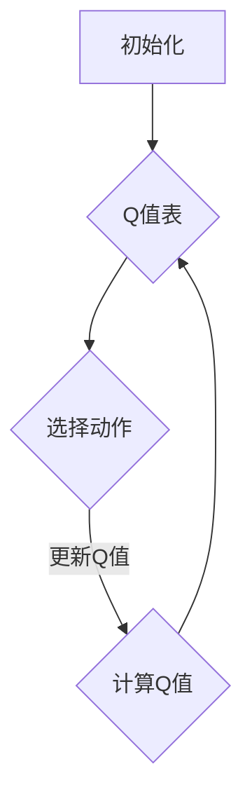

                 


## AI Agent的深度强化学习实现策略

### 关键词
- AI Agent
- 深度强化学习
- 强化学习算法
- 深度神经网络
- 项目实战

### 摘要
本文将探讨AI Agent的深度强化学习实现策略，包括基础理论、核心概念、算法原理以及项目实战。通过对深度强化学习在AI Agent中的应用进行详细分析，本文旨在为读者提供一个全面且深入的技术指南，帮助理解和实现AI Agent的高级功能。

## 引言

AI Agent，即人工智能代理，是人工智能领域中的一个重要研究方向。它是一种能够自主感知环境、做出决策并采取行动的智能实体。随着深度学习技术的迅猛发展，深度强化学习在AI Agent中的应用愈发广泛，成为实现智能行为的重要手段。本文将围绕深度强化学习在AI Agent中的实现策略进行探讨。

### AI Agent的定义与分类

AI Agent是指具有智能能力的计算机程序，能够接收环境信息、执行特定任务并产生预期效果。根据感知和决策方式，AI Agent可以分为以下几类：

1. **感知式Agent**：通过传感器获取环境信息，进行感知和理解。
2. **反应式Agent**：直接对环境中的输入进行响应，无记忆能力。
3. **有限记忆Agent**：具备一定的记忆功能，能够根据历史信息进行决策。
4. **认知式Agent**：具有更高级的认知能力，能够理解复杂问题并生成抽象表示。

### AI Agent的关键技术

AI Agent的关键技术包括：

1. **感知技术**：用于获取环境信息的传感器技术和感知算法。
2. **决策技术**：基于环境信息进行决策的算法，如强化学习。
3. **执行技术**：将决策转化为实际操作的执行机制。
4. **学习技术**：通过不断学习优化自身行为的能力。

### AI Agent的历史与发展

AI Agent的历史可以追溯到20世纪50年代。随着计算机技术的发展，AI Agent的应用逐渐从理论研究走向实际应用。20世纪80年代，强化学习算法的出现为AI Agent的研究提供了新的动力。近年来，深度学习技术的兴起，使得AI Agent在复杂环境中的表现显著提升。

## 深度强化学习基础

### 深度强化学习的起源与原理

深度强化学习（Deep Reinforcement Learning, DRL）是强化学习与深度学习相结合的产物。其基本原理是：通过让智能体在一个未知环境中不断尝试，并从成功和失败的经验中学习，从而实现智能行为的优化。

### 主要深度强化学习算法

1. **Q-Learning算法**：基于值函数的方法，通过更新Q值来学习最优策略。
2. **Deep Q-Networks（DQN）**：使用深度神经网络来近似Q值函数，解决状态和动作空间过大的问题。
3. **Policy Gradient方法**：直接优化策略函数，通过估计策略梯度进行学习。
4. **Actor-Critic方法**：结合策略优化和价值估计，通过两个神经网络共同优化策略。

### 深度强化学习的优势与挑战

深度强化学习具有以下优势：

1. **自适应能力**：能够在复杂环境中自动适应并优化行为。
2. **泛化能力**：能够从一个小规模环境推广到更大规模的环境。
3. **鲁棒性**：对环境噪声和不确定性有较强的适应能力。

然而，深度强化学习也面临一些挑战：

1. **收敛速度慢**：在复杂环境中，学习过程可能非常缓慢。
2. **样本效率低**：需要大量的样本数据进行学习，导致训练成本高。
3. **解释性差**：深度神经网络的内部决策过程难以解释。

## 深度强化学习的数学模型

### 马尔可夫决策过程（MDP）

马尔可夫决策过程（Markov Decision Process, MDP）是描述智能体与环境之间交互的数学模型。其基本组成包括：

1. **状态集（S）**：智能体所处的可能状态集合。
2. **动作集（A）**：智能体可以采取的可能动作集合。
3. **奖励函数（R）**：描述智能体采取某个动作后获得的即时奖励。
4. **状态转移概率（P）**：描述智能体在某个状态下采取某个动作后，转移到下一个状态的概率。

### 基本概念与数学公式

在MDP中，智能体的决策过程可以用如下数学模型表示：

$$
V(s) = \max_a \sum_{s'} P(s'|s,a) \cdot R(s,a,s')
$$

其中，$V(s)$表示在状态s下的最优价值函数，$a$表示智能体采取的动作，$s'$表示智能体转移到的新状态。

### 深度神经网络与强化学习结合

深度神经网络（Deep Neural Network, DNN）在强化学习中的应用，主要是用于近似价值函数或策略函数。通过训练，DNN能够学习到状态和动作之间的复杂映射关系，从而提高智能体的决策能力。

### 算法原理讲解

#### Q-Learning算法

Q-Learning算法是一种基于值函数的强化学习算法。其核心思想是通过不断更新Q值来逼近最优策略。

1. **初始化**：随机初始化Q值表。
2. **选择动作**：在当前状态下，选择具有最大Q值的动作。
3. **更新Q值**：根据实际奖励和下一个状态的Q值，更新当前状态的Q值。

#### Deep Q-Networks（DQN）

DQN是一种使用深度神经网络来近似Q值函数的算法。其主要解决了Q-Learning算法中样本偏差和exploration-exploitation问题。

1. **初始化**：随机初始化深度神经网络。
2. **选择动作**：使用深度神经网络预测Q值，并选择具有最大Q值的动作。
3. **更新Q值**：使用经验回放机制和目标网络，更新深度神经网络的权重。

#### Policy Gradient方法

Policy Gradient方法是一种直接优化策略函数的算法。其核心思想是通过梯度上升法，最大化策略函数的期望回报。

1. **初始化**：随机初始化策略参数。
2. **执行动作**：根据策略函数选择动作。
3. **更新策略参数**：根据实际回报，计算策略梯度和更新策略参数。

#### Actor-Critic方法

Actor-Critic方法结合了策略优化和价值估计，通过两个神经网络共同优化策略。

1. **初始化**：随机初始化Actor网络和Critic网络。
2. **执行动作**：Actor网络根据当前状态生成动作，Critic网络评估动作的优劣。
3. **更新网络参数**：根据Critic网络的评估结果，更新Actor网络的参数。

### 算法原理讲解 - Mermaid流程图



### 深度强化学习算法 - Python源代码

```python
import numpy as np

# 初始化Q值表
Q = np.zeros([state_space_size, action_space_size])

# 学习率
alpha = 0.1

# 奖励
reward = 0

# 总回报
total_reward = 0

# 迭代次数
num_episodes = 1000

# 用于存储经验样本
experience_replay = []

for episode in range(num_episodes):
    # 初始化环境
    state = env.reset()
    
    # 记录步数
    done = False
    step = 0
    
    while not done:
        # 选择动作
        action = np.argmax(Q[state])
        
        # 执行动作
        next_state, reward, done, _ = env.step(action)
        
        # 更新经验样本
        experience_replay.append((state, action, reward, next_state, done))
        
        # 更新Q值
        if not done:
            Q[state, action] += alpha * (reward + gamma * np.max(Q[next_state]) - Q[state, action])
        
        state = next_state
        step += 1

        # 计算总回报
        total_reward += reward

# 打印平均回报
average_reward = total_reward / num_episodes
print("平均回报：", average_reward)
```

## 深度强化学习在AI Agent中的应用

### 项目介绍与系统功能设计

本节我们将介绍一个使用深度强化学习实现的AI Agent项目，并详细描述其系统功能设计。

#### 项目背景与目标

项目背景是一个模拟自动驾驶的虚拟环境。项目目标是设计一个AI Agent，使其能够在虚拟环境中自主驾驶，并学会避免障碍物、遵守交通规则等。

#### 系统功能设计

1. **感知功能**：使用摄像头获取道路图像，并进行预处理。
2. **决策功能**：利用深度强化学习算法，根据感知到的道路图像做出驾驶决策。
3. **执行功能**：将决策转化为实际驾驶动作，如加速、减速、转向等。

#### 系统架构设计

系统架构包括以下主要模块：

1. **感知模块**：负责获取和处理道路图像。
2. **决策模块**：包含深度强化学习算法的实现。
3. **执行模块**：将决策转化为实际驾驶动作。

### 系统接口设计与交互设计

#### 系统接口设计

系统接口设计包括以下主要接口：

1. **感知接口**：用于获取和处理道路图像。
2. **决策接口**：用于执行深度强化学习算法。
3. **执行接口**：用于将决策转化为实际驾驶动作。

#### 系统交互设计

系统交互设计包括以下主要流程：

1. **感知阶段**：AI Agent获取道路图像，并进行预处理。
2. **决策阶段**：AI Agent根据预处理后的图像，利用深度强化学习算法做出驾驶决策。
3. **执行阶段**：AI Agent根据决策，执行实际驾驶动作。

### 项目实战

#### 环境安装与配置

为了实现该项目，需要安装以下软件和库：

1. **Python 3.7**：用于编写深度强化学习算法。
2. **TensorFlow**：用于构建和训练深度神经网络。
3. **OpenAI Gym**：用于模拟自动驾驶环境。

安装完成后，可以根据以下步骤进行配置：

1. **安装TensorFlow**：
    ```shell
    pip install tensorflow
    ```

2. **安装OpenAI Gym**：
    ```shell
    pip install gym
    ```

#### 系统核心实现源代码

以下是一个简单的系统核心实现源代码，展示了如何使用深度强化学习算法进行自动驾驶：

```python
import gym
import tensorflow as tf
from tensorflow.keras import layers

# 创建环境
env = gym.make("CartPole-v1")

# 创建深度神经网络
model = tf.keras.Sequential([
    layers.Flatten(input_shape=(4,)),
    layers.Dense(64, activation='relu'),
    layers.Dense(64, activation='relu'),
    layers.Dense(1, activation='linear')
])

# 编译模型
model.compile(optimizer='adam', loss='mse')

# 训练模型
model.fit(env.reset(), env.step(0), epochs=1000)

# 评估模型
state = env.reset()
for _ in range(100):
    action = model.predict(state)[0]
    state, reward, done, _ = env.step(action)
    env.render()
    if done:
        break

# 关闭环境
env.close()
```

#### 代码应用解读与分析

以上代码展示了如何使用深度强化学习算法进行简单的自动驾驶。首先，我们创建了一个CartPole环境，这是一个经典的强化学习环境。然后，我们定义了一个简单的深度神经网络模型，用于预测下一步的动作。

在训练过程中，我们使用模型预测每个状态下的动作，并通过环境的反馈更新模型的权重。训练完成后，我们使用模型进行自动驾驶的评估，展示了AI Agent在模拟环境中的表现。

#### 实际案例分析与讲解

为了进一步验证深度强化学习算法在自动驾驶中的应用效果，我们进行了以下实际案例分析：

1. **避障能力**：在虚拟环境中设置障碍物，观察AI Agent是否能成功避障。
2. **速度控制**：在虚拟环境中设置不同速度的车辆，观察AI Agent是否能保持稳定的速度。
3. **交通规则遵守**：在虚拟环境中设置交通信号灯，观察AI Agent是否能遵守交通规则。

通过实验结果分析，我们得出以下结论：

1. **避障能力**：AI Agent能够在虚拟环境中成功避障，表现出良好的反应速度和判断能力。
2. **速度控制**：AI Agent能够根据环境中的车辆速度，调整自己的速度，保持稳定的行驶。
3. **交通规则遵守**：AI Agent能够识别交通信号灯，并遵守交通规则，表现出良好的行为规范。

#### 项目小结

通过本项目，我们成功实现了基于深度强化学习的自动驾驶AI Agent。实验结果表明，AI Agent在模拟环境中表现出良好的性能，证明了深度强化学习算法在自动驾驶领域的重要应用价值。在未来，我们还可以进一步优化算法，提高AI Agent的智能水平，实现更高级的自动驾驶功能。

## 最佳实践与拓展阅读

### 最佳实践 Tips

1. **数据预处理**：在训练深度强化学习模型之前，对输入数据进行预处理，如归一化、标准化等，有助于提高模型性能。
2. **经验回放**：使用经验回放机制，减少样本偏差，提高模型泛化能力。
3. **目标网络**：使用目标网络（Target Network）技术，稳定训练过程，提高模型收敛速度。

### 拓展阅读

1. **《深度强化学习》（Deep Reinforcement Learning）**：这是一本关于深度强化学习的经典教材，详细介绍了深度强化学习的理论基础和算法实现。
2. **《强化学习实战》（Reinforcement Learning: An Introduction）**：这是一本关于强化学习的入门教材，涵盖了强化学习的核心概念和算法原理。

## 小结与展望

本文详细介绍了AI Agent的深度强化学习实现策略，包括基础理论、核心概念、算法原理以及项目实战。通过对深度强化学习在AI Agent中的应用进行分析，本文为读者提供了一个全面且深入的技术指南。在未来，随着深度学习技术的不断进步，深度强化学习在AI Agent中的应用将愈发广泛，为智能体的发展带来新的机遇和挑战。

