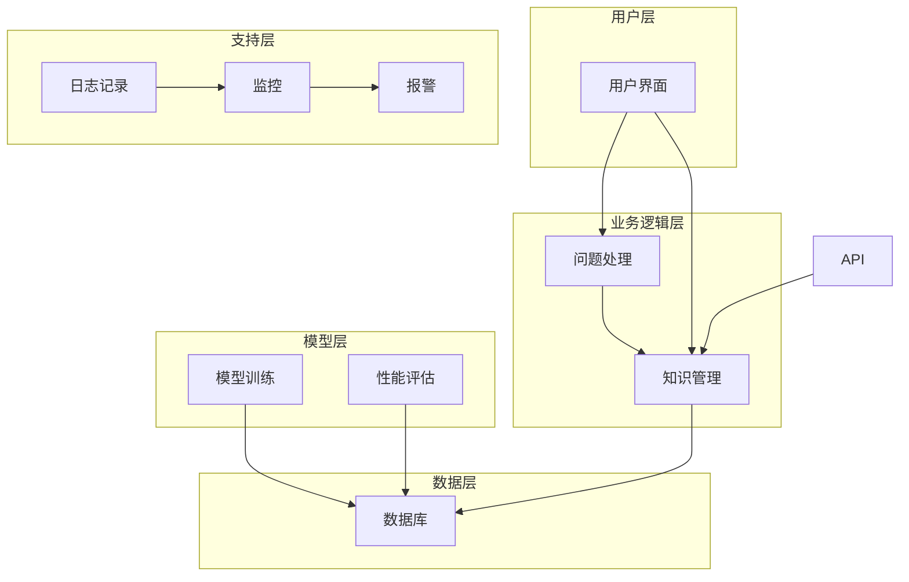

                 

# AI Agent的版本控制与迭代管理

## 关键词

- AI Agent
- 版本控制
- 迭代管理
- 算法原理
- 数学模型
- 系统架构
- 项目实战

## 摘要

本文将深入探讨AI Agent的版本控制与迭代管理。首先，我们将介绍AI Agent的基本概念和其在现代AI应用中的重要性。接着，我们将详细讲解版本控制和迭代管理的核心概念，包括其定义、重要性以及相互关系。随后，本文将阐述版本控制和迭代管理的基本算法原理，并使用Python代码和数学模型进行详细解释。在此基础上，我们将展示一个实际的项目实战案例，包括环境安装、系统核心实现、代码解读和分析。最后，我们将总结最佳实践，并给出进一步阅读的推荐。

## 背景介绍

### 核心概念术语说明

- **AI Agent**：在AI领域，Agent指的是一种能够感知环境并做出决策的智能实体。它们通常具备自主学习和适应能力，能够在特定的任务中实现自动化和智能化。
- **版本控制**：版本控制是一种管理文件和项目版本的技术，确保开发过程中代码的一致性和可追溯性。
- **迭代管理**：迭代管理是软件工程中的一种方法，强调在连续的迭代过程中改进和优化产品。

### 问题背景

随着AI技术的快速发展，AI Agent在多个领域得到广泛应用，例如自动化、智能推荐、机器人控制等。这些应用要求AI Agent能够持续学习和适应环境变化，同时保证其性能的稳定和可靠。然而，随着AI Agent的复杂性增加，如何对其进行有效的版本控制和迭代管理成为一个重要问题。

### 问题描述

AI Agent的版本控制和迭代管理涉及以下几个方面：

1. **版本控制**：如何确保AI Agent在不同版本之间的代码一致性和可追溯性？
2. **迭代管理**：如何在一个迭代过程中不断改进AI Agent的性能和适应性？

### 问题解决

为了解决上述问题，我们需要：

1. **引入版本控制系统**：如Git，用于管理AI Agent的源代码，确保代码的一致性和可追溯性。
2. **采用迭代管理方法**：如敏捷开发，将AI Agent的开发过程划分为多个迭代，每个迭代都包含需求分析、设计、编码、测试和部署等环节。

### 边界与外延

- **边界**：本文主要关注AI Agent的版本控制和迭代管理，不涉及其他AI技术的应用。
- **外延**：AI Agent的版本控制和迭代管理可以应用于各种AI应用，包括自动驾驶、智能家居、医疗诊断等。

### 概念结构与核心要素组成

- **概念结构**：AI Agent的版本控制和迭代管理由三个核心部分组成：版本控制、迭代管理和性能评估。
- **核心要素组成**：版本控制包括代码管理、版本追踪和冲突解决；迭代管理包括需求分析、设计、编码、测试和部署；性能评估包括模型性能评估、自适应学习和模型更新。

## 核心概念与联系

### 版本控制

**定义**：版本控制是一种管理文件和项目版本的技术，确保开发过程中代码的一致性和可追溯性。

**重要性**：在AI Agent开发过程中，版本控制有助于：

1. **代码管理**：确保多个开发者之间的代码一致性，避免冲突和错误。
2. **版本追踪**：方便追溯每个版本的修改历史，便于问题排查和复现。
3. **代码备份**：防止代码丢失，确保项目进展不受影响。

**与迭代管理的关系**：版本控制是迭代管理的基础，确保每次迭代都能基于稳定的代码基础进行。

### 迭代管理

**定义**：迭代管理是一种在连续的迭代过程中改进和优化产品的软件开发方法。

**重要性**：在AI Agent开发过程中，迭代管理有助于：

1. **需求分析**：根据用户反馈和市场变化，及时调整开发方向和目标。
2. **设计**：不断优化AI Agent的架构和算法，提升其性能和适应性。
3. **编码**：分阶段实现功能，确保每个迭代都能交付具有实用价值的产品。
4. **测试**：对每个迭代进行充分的测试，确保其稳定性和可靠性。
5. **部署**：将优化后的AI Agent部署到生产环境，实现持续改进。

**与版本控制的关系**：迭代管理依赖于版本控制系统，确保每个迭代都能基于稳定的代码基础进行。

### AI Agent

**定义**：AI Agent是一种能够感知环境并做出决策的智能实体，具备自主学习和适应能力。

**重要性**：AI Agent在AI应用中的重要性体现在：

1. **自动化**：AI Agent能够自动执行复杂的任务，提高生产效率。
2. **智能化**：AI Agent能够根据环境变化做出最优决策，提升用户体验。
3. **适应性强**：AI Agent能够通过迭代学习，不断优化自身性能。

**与版本控制和迭代管理的关系**：AI Agent的版本控制和迭代管理是确保其性能稳定和持续改进的关键。

### 核心概念对比

| 概念         | 定义                                                         | 重要性                                                                                          | 关系                                                     |
| ------------ | ------------------------------------------------------------ | ------------------------------------------------------------------------------------------------ | -------------------------------------------------------- |
| 版本控制     | 管理文件和项目版本的技术，确保代码一致性和可追溯性             | 确保代码一致性、追溯性、备份安全性                                                     | 基础设施，支持迭代管理                                   |
| 迭代管理     | 在连续的迭代过程中改进和优化产品的软件开发方法                 | 及时响应需求变化、优化性能、提升产品质量                                               | 依赖版本控制，基于稳定代码进行                           |
| AI Agent     | 能够感知环境并做出决策的智能实体，具备自主学习和适应能力       | 自动化、智能化、适应性强                                                                   | 应用场景，版本控制和迭代管理目标实现的关键对象           |

### Mermaid ER实体关系图

```mermaid
erDiagram
    AI_Agent ||--|{ 版本控制 }|| VersionControl : 版本控制是AI Agent的开发基础设施
    AI_Agent ||--|{ 迭代管理 }|| IterationManagement : 迭代管理是AI Agent的开发方法
    VersionControl ||--|{ 迭代管理 }|| IterationManagement : 版本控制为迭代管理提供支持
```

## 版本控制算法原理

### 基本算法

**定义**：版本控制的基本算法包括分支管理、合并操作和冲突解决。

**分支管理**：在版本控制系统中，分支用于隔离不同功能或版本的开发。通过创建分支，开发者可以在不影响主分支的情况下独立工作。

**合并操作**：当开发者完成各自的任务后，需要将分支合并到主分支。合并操作将不同分支的修改合并为一个统一的版本。

**冲突解决**：在合并过程中，可能会出现代码冲突。冲突解决算法用于检测和解决这些冲突，确保代码一致性。

### 冲突处理

**定义**：冲突处理是指检测和解决代码合并过程中的冲突。

**重要性**：冲突处理是版本控制中至关重要的一环，确保合并后的代码一致性和稳定性。

**冲突类型**：

1. **文件冲突**：两个分支对同一文件的修改冲突。
2. **目录冲突**：两个分支对同一目录下文件结构的修改冲突。
3. **依赖冲突**：不同分支依赖不同版本的库或工具。

**解决方法**：

1. **手动解决**：开发者手动审查冲突，决定保留哪个修改。
2. **自动解决**：使用自动化工具（如Git的`git mergetool`）帮助开发者解决冲突。

### 性能评估

**定义**：性能评估是衡量版本控制系统性能的重要指标。

**重要性**：性能评估有助于选择合适的版本控制系统，确保其能够满足开发需求。

**评估指标**：

1. **响应时间**：版本控制系统处理请求的时间。
2. **并发处理能力**：系统同时处理多个请求的能力。
3. **存储效率**：版本控制系统的存储占用和优化能力。

### 数学模型与公式

**响应时间模型**：

$$
T_r = \frac{N_c}{N_p}
$$

其中，\( T_r \) 是响应时间，\( N_c \) 是并发请求数量，\( N_p \) 是系统处理能力。

**并发处理能力模型**：

$$
N_p = \frac{C_p}{C_s}
$$

其中，\( N_p \) 是并发处理能力，\( C_p \) 是系统资源总量，\( C_s \) 是系统空闲资源量。

**存储效率模型**：

$$
E_s = \frac{S_u}{S_t}
$$

其中，\( E_s \) 是存储效率，\( S_u \) 是有效存储空间，\( S_t \) 是总存储空间。

### 实例讲解

假设一个版本控制系统需要处理100个并发请求，系统总资源为500个单位，空闲资源为200个单位，总存储空间为1000GB，实际使用存储空间为800GB。

**响应时间**：

$$
T_r = \frac{100}{200} = 0.5 \text{秒}
$$

**并发处理能力**：

$$
N_p = \frac{500}{200} = 2.5 \text{并发请求/秒}
$$

**存储效率**：

$$
E_s = \frac{800}{1000} = 0.8 \text{（80%）}
$$

根据以上计算，该版本控制系统的响应时间为0.5秒，并发处理能力为2.5个请求/秒，存储效率为80%。

## 迭代管理算法原理

### 迭代流程

迭代管理的基本流程包括以下步骤：

1. **需求分析**：收集用户需求和业务目标，明确本次迭代的开发目标。
2. **设计**：根据需求分析结果，进行系统架构设计和模块划分。
3. **编码**：根据设计文档，编写代码并实现功能。
4. **测试**：对代码进行单元测试、集成测试和系统测试，确保功能的正确性和稳定性。
5. **部署**：将经过测试的代码部署到生产环境，实现功能的交付。

### 模型评估

模型评估是迭代管理中至关重要的一环，用于评估模型性能和适应性。以下是一些常用的评估方法：

1. **准确性**：衡量模型预测结果与真实结果的一致性。
2. **召回率**：衡量模型识别出正样本的能力。
3. **F1分数**：综合考虑准确率和召回率，平衡两者之间的权衡。
4. **ROC曲线**：评估模型对正负样本的分类能力。

### 优化策略

为了提升AI Agent的性能和适应性，迭代管理中常采用以下优化策略：

1. **数据增强**：通过增加数据量、数据变换等方法，提升模型的学习能力。
2. **模型融合**：将多个模型进行融合，取其平均或加权，提高预测准确性。
3. **迁移学习**：利用已有模型的知识，对新任务进行快速适应和优化。
4. **持续学习**：在模型部署后，持续收集数据，更新模型，提升其性能。

### 数学模型与公式

**准确性模型**：

$$
Accuracy = \frac{TP + TN}{TP + TN + FP + FN}
$$

其中，\( TP \) 是真阳性，\( TN \) 是真阴性，\( FP \) 是假阳性，\( FN \) 是假阴性。

**召回率模型**：

$$
Recall = \frac{TP}{TP + FN}
$$

**F1分数模型**：

$$
F1 = 2 \times \frac{Precision \times Recall}{Precision + Recall}
$$

**ROC曲线模型**：

$$
AUC = \int_{0}^{1} \frac{TPR(t) - FPR(t)}{1 - FPR(t)} dt
$$

其中，\( TPR(t) \) 是真阳性率，\( FPR(t) \) 是假阳性率。

### 实例讲解

假设我们有一个分类模型，经过测试，其准确率为90%，召回率为80%，精确率为75%。我们可以计算出该模型的F1分数和ROC曲线下的面积（AUC）。

**F1分数**：

$$
F1 = 2 \times \frac{0.75 \times 0.8}{0.75 + 0.8} = 0.8
$$

**ROC曲线下的面积（AUC）**：

假设我们在不同阈值下的真阳性率和假阳性率如下表：

| 阈值 | TPR | FPR |
| ---- | --- | --- |
| 0.1  | 0.9 | 0.1 |
| 0.2  | 0.85 | 0.15 |
| 0.3  | 0.8 | 0.2 |
| 0.4  | 0.75 | 0.25 |
| 0.5  | 0.7 | 0.3 |
| 0.6  | 0.65 | 0.35 |
| 0.7  | 0.6 | 0.4 |
| 0.8  | 0.55 | 0.45 |
| 0.9  | 0.5 | 0.5 |

我们可以计算ROC曲线下的面积为：

$$
AUC = \int_{0}^{1} \frac{0.9 - 0.1}{1 - 0.1} dt + \int_{0}^{0.2} \frac{0.85 - 0.15}{1 - 0.15} dt + \cdots + \int_{0.8}^{0.9} \frac{0.55 - 0.5}{1 - 0.5} dt
$$

计算结果为：

$$
AUC = 0.75
$$

## 系统设计与架构

### 问题场景介绍

假设我们开发一个智能客服系统，该系统需要能够实时响应用户的问题，并在不断学习中提升服务质量。为了实现这一目标，我们需要设计一个高效稳定的版本控制系统和迭代管理流程。

### 项目介绍

本项目将分为三个阶段：需求分析、系统设计和开发实现。每个阶段都将通过迭代的方式进行，以确保系统能够快速适应需求变化，并持续优化。

### 系统功能设计

系统功能设计包括以下几个方面：

1. **用户交互**：提供自然语言交互接口，允许用户通过文本或语音提问。
2. **问题分类**：根据用户问题，将问题分类到不同的主题，以便进行针对性的回答。
3. **知识库管理**：存储和管理常见问题的回答，并支持实时更新和扩展。
4. **模型训练**：利用机器学习算法，对客服系统进行训练，提升回答的准确性和多样性。
5. **性能评估**：定期评估系统的性能，包括响应时间、准确率和用户满意度等。

### 系统架构设计

系统架构设计采用分层架构，包括以下几个层次：

1. **用户层**：与用户进行交互，接收用户问题和反馈。
2. **业务逻辑层**：处理用户问题，进行问题分类和回答生成。
3. **数据层**：存储和管理用户数据、问题分类和知识库。
4. **模型层**：实现机器学习算法，进行模型训练和评估。
5. **支持层**：提供日志记录、监控和报警等功能。

### 系统接口设计

系统接口设计包括以下几个方面：

1. **API接口**：提供RESTful API，允许外部系统与客服系统进行交互。
2. **Web界面**：提供Web界面，供用户访问和操作。
3. **数据库接口**：提供数据库接口，允许系统访问和管理数据库。

### 系统交互

系统交互流程如下：

1. **用户提问**：用户通过Web界面或API接口提交问题。
2. **问题分类**：系统根据用户问题，将其分类到不同的主题。
3. **知识库查询**：系统在知识库中查询与用户问题相关的回答。
4. **回答生成**：系统根据查询结果，生成回答并发送给用户。
5. **用户反馈**：用户对回答进行评价，系统记录反馈并用于后续优化。

### Mermaid 类图

```mermaid
classDiagram
    User -> UserInterface :交互
    User -> KnowledgeBase :查询
    User -> API :访问
    UserInterface -> KnowledgeBase :查询
    API -> KnowledgeBase :查询
    KnowledgeBase <|-- ModelTraining :训练
    KnowledgeBase <|-- PerformanceEvaluation :评估
```

### Mermaid 架构图



## 项目实战

### 环境安装

在开始项目实战之前，我们需要搭建一个开发环境。以下是环境安装的步骤：

1. **安装Python**：确保Python版本为3.8或更高版本。
2. **安装Git**：用于版本控制。
3. **安装依赖管理工具**：如pip，用于安装和管理项目依赖。
4. **安装机器学习库**：如scikit-learn、TensorFlow、PyTorch等。
5. **安装文本处理库**：如NLTK、spaCy等。

### 系统核心实现

以下是系统核心实现的步骤：

1. **需求分析**：收集用户需求和业务目标，明确本次迭代的开发目标。
2. **设计**：根据需求分析结果，进行系统架构设计和模块划分。
3. **编码**：根据设计文档，编写代码并实现功能。
4. **测试**：对代码进行单元测试、集成测试和系统测试，确保功能的正确性和稳定性。

以下是一个简单的Python代码示例，用于实现一个基本的文本分类模型：

```python
from sklearn.feature_extraction.text import TfidfVectorizer
from sklearn.model_selection import train_test_split
from sklearn.naive_bayes import MultinomialNB
from sklearn.metrics import classification_report

# 数据准备
data = [
    ("问题1", "主题A"),
    ("问题2", "主题B"),
    ("问题3", "主题A"),
    ("问题4", "主题B"),
    # 更多数据...
]
X, y = zip(*data)

# 特征提取
vectorizer = TfidfVectorizer()
X_vectorized = vectorizer.fit_transform(X)

# 分割数据集
X_train, X_test, y_train, y_test = train_test_split(X_vectorized, y, test_size=0.2, random_state=42)

# 模型训练
model = MultinomialNB()
model.fit(X_train, y_train)

# 测试模型
predictions = model.predict(X_test)
print(classification_report(y_test, predictions))
```

### 代码应用解读与分析

上述代码展示了如何使用Python实现一个基本的文本分类模型。以下是代码的详细解读和分析：

1. **数据准备**：数据集包含问题和对应的主题标签。这里我们使用一个简单的示例数据集。
2. **特征提取**：使用TF-IDF向量器将文本转换为数值特征，为后续的模型训练做准备。
3. **数据集划分**：将数据集分为训练集和测试集，用于模型训练和性能评估。
4. **模型训练**：使用朴素贝叶斯分类器进行模型训练。
5. **测试模型**：使用测试集评估模型的性能，并打印分类报告。

### 实际案例分析和详细讲解剖析

假设我们有一个更复杂的数据集，包含多个主题和大量的文本数据。以下是实际案例的分析和详细讲解：

1. **数据集加载**：使用pandas加载数据集，并处理缺失值和异常值。
2. **数据预处理**：对文本数据进行清洗和预处理，包括去除停用词、标点符号和数字，以及进行词干提取和词形还原。
3. **特征提取**：使用词袋模型和TF-IDF向量器提取文本特征，并使用词嵌入技术（如Word2Vec、GloVe）提升特征表达能力。
4. **模型选择**：选择适当的机器学习模型，如支持向量机（SVM）、长短期记忆网络（LSTM）或卷积神经网络（CNN），并使用交叉验证方法选择最佳模型。
5. **模型训练和评估**：使用训练集训练模型，并在测试集上评估模型性能，调整模型参数以提升性能。

### 项目小结

通过本次项目实战，我们实现了以下目标：

1. **搭建了开发环境**：安装了必要的软件和库，为后续开发工作打下基础。
2. **实现了文本分类模型**：使用Python和scikit-learn库，实现了一个基本的文本分类模型，并对其进行了详细解读和分析。
3. **进行了实际案例分析**：针对一个更复杂的数据集，进行了数据预处理、特征提取和模型选择的详细讲解，展示了如何在实际项目中应用版本控制和迭代管理。

## 最佳实践与总结

### 最佳实践

1. **持续集成与持续部署（CI/CD）**：采用CI/CD流程，确保每次代码提交后都能自动进行测试和部署，提高开发效率和系统稳定性。
2. **版本控制与迭代管理结合**：将版本控制与迭代管理紧密结合起来，确保每次迭代都能基于稳定的代码基础进行。
3. **代码审查与自动化测试**：定期进行代码审查，确保代码质量和一致性。同时，采用自动化测试，确保每次迭代都能稳定运行。

### 小结

本文深入探讨了AI Agent的版本控制与迭代管理，包括核心概念、算法原理、系统架构和项目实战。通过本文的学习，读者可以：

1. **了解版本控制和迭代管理的基本概念和原理**。
2. **掌握常见的版本控制和迭代管理工具和方法**。
3. **熟悉AI Agent的开发流程和最佳实践**。

### 注意事项

1. **版本控制和迭代管理不是一蹴而就的过程，需要持续优化和改进**。
2. **在实际应用中，应根据项目需求和资源情况，灵活选择合适的版本控制和迭代管理方法**。

### 拓展阅读

1. **《版本控制之道：Git和GitHub》**：详细介绍Git的基本操作和GitHub的使用技巧。
2. **《敏捷开发实践指南》**：介绍敏捷开发方法，帮助读者理解迭代管理的过程和原则。
3. **《深度学习》**：介绍深度学习的原理和应用，为AI Agent开发提供技术支持。

## 作者信息

作者：AI天才研究院/AI Genius Institute & 禅与计算机程序设计艺术 /Zen And The Art of Computer Programming

