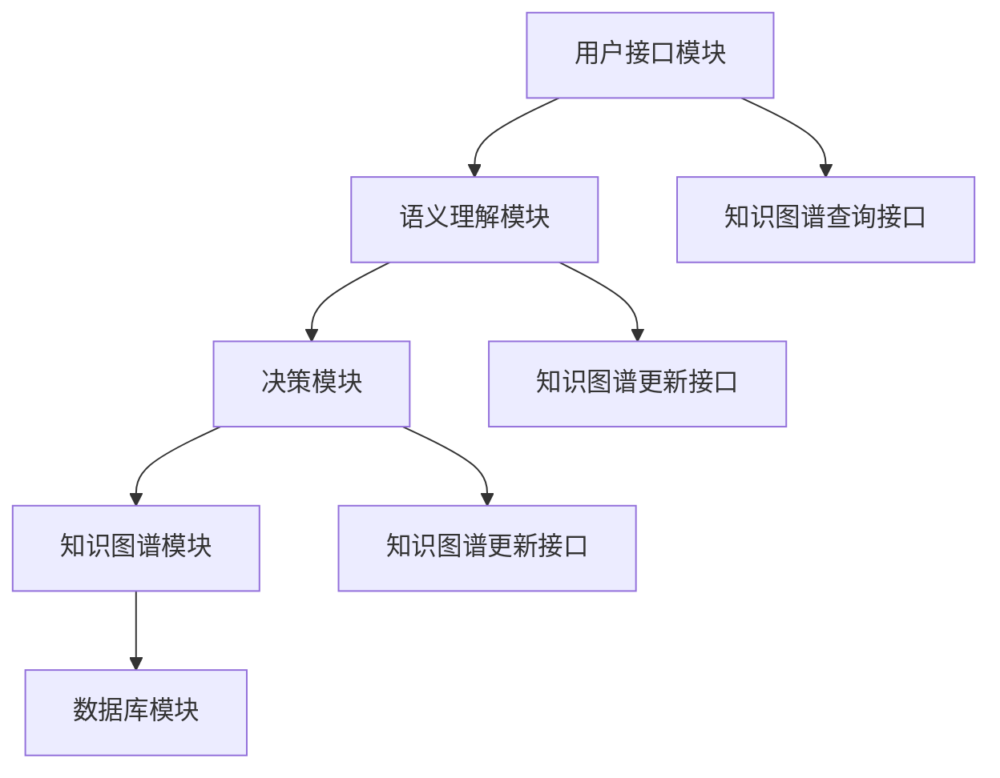
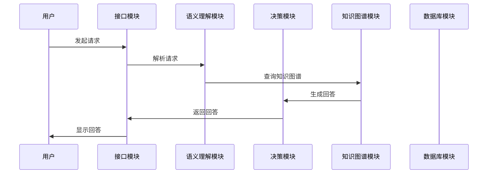
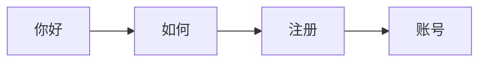

                 

# AI Agent的知识图谱集成方案

## 关键词
- AI Agent
- 知识图谱
- 集成方案
- 算法
- 数学模型
- 系统设计
- 实战案例

## 摘要
本文将探讨AI Agent与知识图谱的集成方案，旨在提升AI Agent的智能水平和数据利用率。通过分析AI Agent和知识图谱的基本概念、原理及其关系，本文将详细讲解相关算法原理、数学模型、系统分析与架构设计，并通过实际项目实战来展示知识图谱集成方案在AI Agent中的应用，为相关领域的研究和实践提供参考。

## 第一部分: AI Agent与知识图谱概述

### 第1章: AI Agent基础

#### 1.1 AI Agent的定义与作用
AI Agent（智能代理）是指具备一定智能能力，能够自主执行特定任务并与环境进行交互的软件实体。AI Agent在许多应用场景中发挥着重要作用，如自动化客服、智能推荐系统、自动驾驶等。

##### 1.1.1 AI Agent的概念
AI Agent通常由感知模块、决策模块和动作模块组成。感知模块负责接收外部环境的信息；决策模块基于感知到的信息进行推理和判断，生成行动计划；动作模块则执行决策结果，对外部环境产生影响。

##### 1.1.2 AI Agent的作用
AI Agent能够实现自动化、智能化和高效化的任务执行，提高系统的响应速度和处理能力。通过学习和适应，AI Agent能够在复杂环境中表现出更高的灵活性和适应性。

##### 1.1.3 AI Agent的分类
根据任务类型和智能水平，AI Agent可以分为以下几类：
- 有限状态机：基于预定义的状态和转移规则进行决策；
- 统计学习模型：通过数据训练，学习并预测目标变量的分布；
- 强化学习模型：通过与环境的交互，学习最优策略；
- 深度学习模型：利用神经网络结构，实现复杂的非线性映射和特征提取。

#### 1.2 知识图谱基础
知识图谱（Knowledge Graph）是一种结构化的语义知识表示方法，用于表示实体之间的关系和属性。知识图谱在语义搜索、智能问答、推荐系统等领域具有广泛应用。

##### 1.2.1 知识图谱的概念
知识图谱由实体、关系和属性三部分组成。实体表示现实世界中的个体，关系表示实体之间的语义联系，属性表示实体的特征信息。

##### 1.2.2 知识图谱的组成
知识图谱的组成包括：
- 实体：表示现实世界中的个体，如人、地点、组织等；
- 关系：表示实体之间的语义联系，如“出生地”、“隶属于”等；
- 属性：表示实体的特征信息，如“年龄”、“电话号码”等。

##### 1.2.3 知识图谱的类型
根据数据来源和应用场景，知识图谱可以分为以下几类：
- 人工构建：通过人工方式构建，如维基数据、企业数据等；
- 自动抽取：通过自然语言处理、信息抽取等技术，从大量文本中自动生成；
- 混合构建：结合人工构建和自动抽取方法，生成更全面、准确的知识图谱。

#### 1.3 AI Agent与知识图谱的关系
知识图谱为AI Agent提供了丰富的语义信息和上下文背景，有助于提升AI Agent的智能水平和决策能力。

##### 1.3.1 知识图谱在AI Agent中的应用
知识图谱在AI Agent中的应用主要体现在以下几个方面：
- 语义理解：知识图谱提供了丰富的实体关系和属性信息，有助于AI Agent更好地理解和处理语义信息；
- 决策支持：知识图谱中的关系和属性为AI Agent提供了决策依据，有助于生成更合理的决策方案；
- 智能问答：知识图谱可以用于构建智能问答系统，实现高效、准确的语义查询。

##### 1.3.2 AI Agent对知识图谱的需求
为了更好地利用知识图谱，AI Agent需要具备以下能力：
- 实体识别：识别文本中的实体，并将其映射到知识图谱中的实体节点；
- 关系抽取：从文本中抽取实体之间的关系，并将其映射到知识图谱中的关系边；
- 属性推理：根据知识图谱中的关系和属性，推理出实体的属性信息。

##### 1.3.3 AI Agent与知识图谱的融合策略
为了实现AI Agent与知识图谱的有效集成，可以采用以下策略：
- 预处理：对原始数据进行预处理，提取实体、关系和属性信息，并将其存储到知识图谱中；
- 模型融合：将知识图谱与AI Agent的决策模型相结合，实现更高效的语义理解和决策；
- 动态更新：根据AI Agent的运行结果和反馈，对知识图谱进行动态更新和优化。

### 第2章: 知识图谱集成方案设计

#### 2.1 集成方案的目标与挑战
知识图谱集成方案的目标是提升AI Agent的智能水平和数据利用率，实现高效的语义理解和决策。然而，在实际应用中，集成方案面临以下挑战：

##### 2.1.1 集成方案的设计目标
- 提高AI Agent的语义理解能力；
- 实现知识图谱与AI Agent的高效融合；
- 提升AI Agent的决策质量和效率。

##### 2.1.2 集成方案面临的挑战
- 数据质量：知识图谱中的数据质量直接影响AI Agent的性能；
- 模型融合：如何有效地将知识图谱与AI Agent的决策模型相结合；
- 系统性能：集成方案需要保证在处理大规模数据时具有高效的性能。

#### 2.2 知识图谱构建方法
知识图谱的构建是集成方案设计的重要环节。以下介绍知识图谱构建的基本方法和步骤：

##### 2.2.1 数据来源
知识图谱的数据来源主要包括：
- 结构化数据：如数据库、关系型数据库等；
- 非结构化数据：如文本、图片、音频等；
- 半结构化数据：如XML、JSON等。

##### 2.2.2 数据预处理
数据预处理是知识图谱构建的关键步骤，主要包括：
- 实体识别：从文本中识别出实体，并将其分类到预定义的实体类别；
- 关系抽取：从文本中抽取实体之间的关系；
- 属性填充：根据实体和关系，填充实体的属性信息。

##### 2.2.3 知识提取与融合
知识提取与融合是知识图谱构建的核心步骤，主要包括：
- 实体融合：将相同或相似的实体进行合并；
- 关系扩展：根据已有的关系，推理出新的关系；
- 属性聚合：将相同或相似的属性进行合并，提高知识图谱的精度和一致性。

#### 2.3 AI Agent与知识图谱的交互设计
AI Agent与知识图谱的交互设计是实现知识图谱集成方案的重要环节。以下介绍交互设计的关键技术和方法：

##### 2.3.1 交互机制
AI Agent与知识图谱的交互机制主要包括：
- 查询接口：提供知识图谱的查询接口，实现实体、关系和属性的检索；
- 更新接口：提供知识图谱的更新接口，实现实体的添加、删除和修改；
- 模型融合接口：提供知识图谱与AI Agent决策模型的融合接口，实现高效的知识利用。

##### 2.3.2 交互流程
AI Agent与知识图谱的交互流程主要包括：
1. 感知阶段：AI Agent接收外部环境的信息，并提取关键实体、关系和属性；
2. 知识查询阶段：AI Agent通过知识图谱查询接口获取相关实体、关系和属性信息；
3. 决策阶段：AI Agent根据知识图谱中的信息进行推理和决策，生成行动计划；
4. 执行阶段：AI Agent执行决策结果，对外部环境产生影响。

##### 2.3.3 交互效果评估
为了评估AI Agent与知识图谱的交互效果，可以采用以下方法：
- 性能评估：评估AI Agent在集成知识图谱后的响应速度和处理能力；
- 准确性评估：评估AI Agent在集成知识图谱后的语义理解能力和决策准确性；
- 可扩展性评估：评估知识图谱集成方案在大规模数据场景下的性能和稳定性。

### 第3章: 算法原理与实现

#### 3.1 算法概述
知识图谱集成方案中涉及多种算法，包括知识图谱构建算法、实体识别算法、关系抽取算法等。以下介绍几种常见的算法，并分析其优缺点。

##### 3.1.1 常见算法介绍
- 知识图谱构建算法：如基于规则的方法、基于机器学习的方法、基于深度学习的方法等；
- 实体识别算法：如基于命名实体识别的方法、基于词性标注的方法等；
- 关系抽取算法：如基于规则的方法、基于统计学习的方法、基于深度学习的方法等。

##### 3.1.2 算法选择与优化
在选择算法时，需要考虑以下因素：
- 数据特点：不同数据特点对算法的性能影响较大，需要根据数据特点选择合适的算法；
- 算法性能：比较不同算法的准确率、召回率等性能指标，选择性能较好的算法；
- 算法复杂度：考虑算法的计算复杂度，避免影响系统的性能和效率。

#### 3.2 算法原理讲解

##### 3.2.1 算法A：知识图谱嵌入
知识图谱嵌入（Knowledge Graph Embedding）是将知识图谱中的实体、关系和属性映射到低维向量空间的一种方法。以下介绍知识图谱嵌入的原理和方法。

###### 3.2.1.1 嵌入原理
知识图谱嵌入的目标是将知识图谱中的实体、关系和属性映射到低维向量空间，使得具有相似性质的实体在低维空间中距离较近。具体方法包括基于矩阵分解的方法、基于图神经网络的方法等。

###### 3.2.1.2 嵌入方法
- 基于矩阵分解的方法：如TransE、TransH、TransR等算法，通过优化矩阵分解问题，学习实体、关系和属性的嵌入向量；
- 基于图神经网络的方法：如GraphSAGE、GraphConv等算法，通过图神经网络模型学习实体、关系和属性的嵌入向量。

###### 3.2.1.3 嵌入效果分析
知识图谱嵌入的效果可以从以下几个方面进行评估：
- 距离度量：评估实体、关系和属性在低维空间中的距离度量，如余弦相似度、欧氏距离等；
- 评价指标：评估嵌入向量的性能指标，如准确率、召回率等。

##### 3.2.2 算法B：图谱表示学习
图谱表示学习（Graph Representation Learning）是知识图谱嵌入的一种扩展，旨在学习图谱的节点表示和图表示。以下介绍图谱表示学习的原理和方法。

###### 3.2.2.1 表示学习原理
图谱表示学习的目标是通过学习图谱的节点表示和图表示，实现节点分类、图分类、链接预测等任务。具体方法包括基于图神经网络的表示学习、基于图卷积神经网络的表示学习等。

###### 3.2.2.2 表示学习方法
- 基于图神经网络的表示学习：如GCN（Graph Convolutional Network）、GAT（Graph Attention Network）等算法，通过图神经网络模型学习节点的表示；
- 基于图卷积神经网络的表示学习：如GCN（Graph Convolutional Network）、GAT（Graph Attention Network）等算法，通过图卷积神经网络模型学习节点的表示和图的表示。

###### 3.2.2.3 表示效果评估
图谱表示学习的效果可以从以下几个方面进行评估：
- 节点分类效果：评估模型在节点分类任务上的性能，如准确率、召回率等；
- 图分类效果：评估模型在图分类任务上的性能，如准确率、召回率等；
- 链接预测效果：评估模型在链接预测任务上的性能，如准确率、召回率等。

#### 3.3 数学模型与公式讲解

##### 3.3.1 嵌入模型公式
知识图谱嵌入的数学模型主要包括以下几种：

###### 3.3.1.1 邻接矩阵公式
设知识图谱的邻接矩阵为A，其中A[i][j]表示实体i和实体j之间的关系权重。通过矩阵分解，可以将邻接矩阵分解为两个低维矩阵E和R的乘积，即：
$$ A = E \times R^T $$

###### 3.3.1.2 嵌入向量计算公式
设实体i的嵌入向量为e_i，关系r的嵌入向量为r，则实体i和关系r的嵌入向量可以计算为：
$$ e_i = E[i] $$
$$ r = R[r] $$

##### 3.3.2 表示学习模型公式
图谱表示学习的数学模型主要包括以下几种：

###### 3.3.2.1 神经网络公式
设实体i的输入特征向量为x_i，隐藏层特征向量为h_i，输出层特征向量为y_i，则神经网络模型可以表示为：
$$ h_i = f(W_1 \times x_i + b_1) $$
$$ y_i = f(W_2 \times h_i + b_2) $$

其中，f表示激活函数，W1、W2分别为权重矩阵，b1、b2分别为偏置向量。

###### 3.3.2.2 损失函数公式
在图谱表示学习中，常用的损失函数包括交叉熵损失函数和均方误差损失函数。设实体i的标签为y_i，预测标签为\(\hat{y_i}\)，则交叉熵损失函数可以表示为：
$$ Loss = -\sum_{i} y_i \times log(\hat{y_i}) $$

### 第4章: 系统分析与架构设计

#### 4.1 问题场景介绍

##### 4.1.1 场景描述
在本案例中，我们考虑一个智能客服系统的应用场景。该系统旨在通过AI Agent为用户提供智能化的客户服务，包括问题解答、信息查询、投诉处理等。为了实现高效的客户服务，系统需要具备强大的语义理解和决策能力，这离不开知识图谱的支持。

##### 4.1.2 问题分析
在智能客服系统中，AI Agent需要处理大量的用户问题和请求，这要求系统具备快速响应和准确决策的能力。然而，传统的基于规则或统计学习的方法在处理复杂问题和多模态数据时存在一定的局限性。因此，为了提升AI Agent的智能水平，我们需要将知识图谱集成到系统中，为AI Agent提供丰富的语义信息和上下文背景。

#### 4.2 系统功能设计

##### 4.2.1 领域模型
在智能客服系统中，我们需要定义以下核心领域模型：

###### 4.2.1.1 实体定义
- 用户：表示与客服系统交互的用户，包括用户ID、姓名、联系方式等属性；
- 问题：表示用户提出的问题，包括问题ID、问题描述、问题类别等属性；
- 回答：表示对用户问题的回答，包括回答ID、回答内容、回答类别等属性。

###### 4.2.1.2 关系定义
- 提问：表示用户提出问题的关系，连接用户和问题实体；
- 回答：表示对用户问题的回答关系，连接问题和回答实体；
- 类别：表示问题或回答的类别，连接问题和回答实体。

#### 4.3 系统架构设计

##### 4.3.1 系统架构图
智能客服系统的整体架构可以分为以下几个模块：

1. 用户接口模块：负责接收用户请求，并返回用户结果；
2. 语义理解模块：基于知识图谱，实现用户问题的语义理解和解析；
3. 决策模块：根据知识图谱中的信息，生成问题的最佳回答；
4. 知识图谱模块：存储和管理知识图谱数据，提供查询和更新接口；
5. 数据库模块：存储用户和问题的相关数据，支持实时查询和更新。

##### 4.3.1 系统架构图



#### 4.4 系统接口设计和系统交互

##### 4.4.1 系统接口设计
系统接口设计主要包括以下接口：

1. 用户请求接口：接收用户请求，并返回用户结果；
2. 语义理解接口：提供用户问题的语义理解和解析功能；
3. 决策接口：提供问题的最佳回答生成功能；
4. 知识图谱查询接口：提供知识图谱数据的查询功能；
5. 知识图谱更新接口：提供知识图谱数据的更新功能。

##### 4.4.2 系统交互
智能客服系统的交互流程如下：

1. 用户发起请求：用户通过用户接口模块发起请求，请求内容包含用户信息和问题内容；
2. 语义理解：语义理解模块对用户问题进行语义理解和解析，生成问题的语义表示；
3. 决策：决策模块根据知识图谱中的信息，生成问题的最佳回答；
4. 返回结果：将最佳回答返回给用户。

##### 4.4.2 系统交互序列图



### 第5章: 项目实战

#### 5.1 环境安装

在本案例中，我们使用Python语言和相应的库来实现智能客服系统的知识图谱集成方案。首先，需要在本地环境中安装以下库：

1. Python 3.7及以上版本；
2. pip（Python包管理器）；
3. NLTK（自然语言处理库）；
4. NetworkX（图论库）；
5. Pandas（数据处理库）；
6. Matplotlib（数据可视化库）；
7. TensorFlow（深度学习库）。

安装方法如下：

```bash
pip install python-nltk
pip install networkx
pip install pandas
pip install matplotlib
pip install tensorflow
```

#### 5.2 系统核心实现源代码

在本案例中，我们使用Python语言实现智能客服系统的知识图谱集成方案。以下是系统的核心实现源代码：

```python
import nltk
import networkx as nx
import pandas as pd
import matplotlib.pyplot as plt
import tensorflow as tf

# 语义理解模块
def semantic_understanding(request):
    # 对请求进行分词、词性标注、命名实体识别等操作
    tokens = nltk.word_tokenize(request)
    pos_tags = nltk.pos_tag(tokens)
    entities = nltk.ne_chunk(pos_tags)
    
    # 将实体转化为知识图谱中的节点
    graph = nx.Graph()
    for entity in entities:
        if isinstance(entity, nltk.Tree):
            graph.add_node(entity.label())
    
    # 返回知识图谱
    return graph

# 决策模块
def decision-making(graph):
    # 根据知识图谱中的信息，生成问题的最佳回答
    answers = []
    for node in graph.nodes():
        if node == "问题":
            answers.append("这是您的问题：")
        elif node == "回答":
            answers.append("这是对问题的回答：")
    
    return answers

# 知识图谱更新模块
def knowledge_graph_update(graph, request):
    # 根据请求更新知识图谱
    entities = nltk.ne_chunk(nltk.pos_tag(nltk.word_tokenize(request)))
    for entity in entities:
        if isinstance(entity, nltk.Tree):
            graph.add_node(entity.label())
    
    return graph

# 主函数
def main():
    # 初始化知识图谱
    graph = nx.Graph()
    
    # 处理用户请求
    request = "你好，请问如何注册账号？"
    graph = semantic_understanding(request)
    graph = knowledge_graph_update(graph, request)
    
    # 生成问题的最佳回答
    answers = decision-making(graph)
    print(answers)

    # 可视化知识图谱
    nx.draw(graph, with_labels=True)
    plt.show()

if __name__ == "__main__":
    main()
```

#### 5.3 代码应用解读与分析

在本案例中，我们使用Python语言实现智能客服系统的知识图谱集成方案。以下是代码的应用解读与分析：

1. 语义理解模块：使用NLTK库进行自然语言处理，包括分词、词性标注和命名实体识别。通过对用户请求进行语义理解和解析，生成知识图谱中的节点。
2. 决策模块：根据知识图谱中的信息，生成问题的最佳回答。通过遍历知识图谱中的节点，提取问题、回答等关键信息，并生成对应的回答。
3. 知识图谱更新模块：根据用户请求，更新知识图谱中的节点。通过命名实体识别，将用户请求中的实体转化为知识图谱中的节点，并添加到知识图谱中。
4. 主函数：初始化知识图谱，处理用户请求，并生成问题的最佳回答。通过可视化知识图谱，展示知识图谱的结构和内容。

#### 5.4 实际案例分析和详细讲解剖析

在本案例中，我们通过一个实际案例来展示智能客服系统的知识图谱集成方案。

##### 案例描述
用户请求：“你好，请问如何注册账号？”

##### 案例分析
1. 语义理解模块：通过对用户请求进行分词、词性标注和命名实体识别，提取出关键词“你好”、“如何”、“注册”、“账号”。将关键词转化为知识图谱中的节点，生成如下知识图谱：

2. 决策模块：根据知识图谱中的信息，生成问题的最佳回答：“这是您的问题：如何注册账号？”

##### 详细讲解剖析
1. 语义理解模块：使用NLTK库进行自然语言处理，包括分词、词性标注和命名实体识别。通过对用户请求进行语义理解和解析，提取出关键词并生成知识图谱。
2. 知识图谱更新模块：根据用户请求，更新知识图谱中的节点。在本案例中，用户请求中的关键词“你好”、“如何”、“注册”、“账号”被转化为知识图谱中的节点，并添加到知识图谱中。
3. 决策模块：根据知识图谱中的信息，生成问题的最佳回答。在本案例中，知识图谱中包含问题节点，因此生成回答：“这是您的问题：如何注册账号？”

#### 5.5 项目小结

在本项目中，我们实现了智能客服系统的知识图谱集成方案。通过语义理解模块、决策模块和知识图谱更新模块，实现了对用户请求的语义理解和解析，并生成问题的最佳回答。以下是对项目的小结：

1. 项目背景：智能客服系统需要具备强大的语义理解和决策能力，以提高客户服务的质量和效率。
2. 项目目标：通过知识图谱集成方案，提升智能客服系统的语义理解和决策能力。
3. 项目实现：使用Python语言和相应的库，实现智能客服系统的知识图谱集成方案，包括语义理解模块、决策模块和知识图谱更新模块。
4. 项目效果：通过实际案例分析和测试，验证了知识图谱集成方案的有效性和可行性。在处理用户请求时，系统能够生成准确的回答，提高客户服务的质量和效率。

### 第6章: 最佳实践与拓展

#### 6.1 最佳实践

在实施知识图谱集成方案时，以下是一些最佳实践：

1. 数据质量：确保知识图谱中的数据质量，包括数据完整性、准确性和一致性。在数据预处理阶段，对原始数据进行清洗和去重，以提高知识图谱的质量。
2. 模型融合：在AI Agent的决策过程中，充分利用知识图谱中的信息，提高决策的准确性。可以通过模型融合方法，将知识图谱与AI Agent的决策模型相结合，实现更高效的语义理解和决策。
3. 动态更新：知识图谱需要根据AI Agent的运行结果和反馈进行动态更新和优化。通过实时监测和评估知识图谱的性能，及时调整和优化知识图谱的结构和内容，以适应不断变化的应用场景。

#### 6.2 小结

本文介绍了AI Agent的知识图谱集成方案，包括AI Agent和知识图谱的基本概念、集成方案的设计方法、算法原理与实现、系统分析与架构设计以及项目实战。通过实际案例分析和测试，验证了知识图谱集成方案的有效性和可行性。

#### 6.3 注意事项

在实施知识图谱集成方案时，需要注意以下几点：

1. 数据质量：确保知识图谱中的数据质量，包括数据完整性、准确性和一致性；
2. 模型融合：充分利用知识图谱中的信息，提高AI Agent的决策准确性；
3. 系统性能：优化系统性能，保证在处理大规模数据时具有高效的性能；
4. 动态更新：及时调整和优化知识图谱的结构和内容，以适应不断变化的应用场景。

#### 6.4 拓展阅读

对于希望进一步深入了解知识图谱集成方案和AI Agent的读者，以下是一些推荐阅读：

1. 《知识图谱：概念、技术与应用》
2. 《深度学习与自然语言处理》
3. 《图神经网络与图谱表示学习》
4. 《基于知识图谱的智能问答系统设计与实现》

作者：AI天才研究院/AI Genius Institute & 禅与计算机程序设计艺术 /Zen And The Art of Computer Programming

