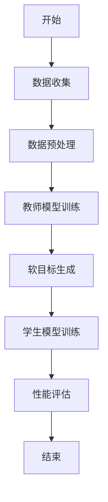
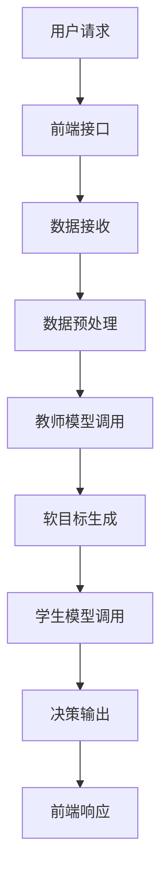

                 

# AI Agent的知识蒸馏技术应用

## 关键词：知识蒸馏，AI Agent，算法，自然语言处理，计算机视觉，智能决策系统

## 摘要

本文深入探讨了知识蒸馏技术在AI Agent领域的应用。首先，我们介绍了知识蒸馏技术的背景和基本原理，包括其定义、发展历程、应用场景和核心算法。随后，我们针对AI Agent这一特定领域，详细分析了其在自然语言处理、计算机视觉和智能决策系统中的应用案例，通过具体的算法原理讲解、数学模型和公式、系统架构设计以及项目实战，展示了知识蒸馏技术如何提升AI Agent的性能和智能化程度。

## 目录大纲

**第一部分：知识蒸馏技术基础**

- 第1章：知识蒸馏技术概述
  - 1.1 知识蒸馏技术的背景与重要性
  - 1.2 知识蒸馏技术的基本原理
  - 1.3 知识蒸馏技术的核心算法
  - 1.4 知识蒸馏技术的应用现状与未来趋势

**第二部分：AI Agent基础知识**

- 第2章：AI Agent基础知识
  - 2.1 AI Agent的定义与分类
  - 2.2 AI Agent的构建方法
  - 2.3 AI Agent的评估与优化

**第三部分：知识蒸馏技术在AI Agent中的应用案例**

- 第3章：知识蒸馏在自然语言处理中的应用
  - 3.1 自然语言处理中的知识蒸馏技术
  - 3.2 应用案例解析

- 第4章：知识蒸馏在计算机视觉中的应用
  - 4.1 计算机视觉中的知识蒸馏技术
  - 4.2 应用案例解析

**第四部分：知识蒸馏技术在智能决策系统中的应用**

- 第5章：知识蒸馏在智能决策系统中的应用
  - 5.1 智能决策系统的概述
  - 5.2 知识蒸馏技术在智能决策系统中的应用
  - 5.3 应用案例解析

**第五部分：知识蒸馏技术在游戏AI中的应用**

- 第6章：知识蒸馏在游戏AI中的应用
  - 6.1 游戏AI的概述
  - 6.2 知识蒸馏在游戏AI中的应用
  - 6.3 应用案例解析

### 第一部分：知识蒸馏技术基础

#### 第1章：知识蒸馏技术概述

##### 1.1 知识蒸馏技术的背景与重要性

知识蒸馏（Knowledge Distillation）是一种将知识从复杂的模型传递到更简单模型的技巧，其核心思想是通过将训练好的复杂模型（称为教师模型）的知识，传授给一个较小的模型（称为学生模型），从而使学生模型能够复制教师模型的表现。这一技术的提出，旨在解决深度学习模型在训练过程中对大规模数据和高计算资源的依赖问题。

知识蒸馏技术的发展历程可以追溯到1990年代初，当时研究人员开始探索如何将专家知识（如医生的经验）转化为计算机可用的规则或模型。随着深度学习技术的发展，知识蒸馏在2016年被引入到神经网络领域，并迅速成为提高模型效率的重要工具。

##### 1.1.1 知识蒸馏技术的定义

知识蒸馏是一种模型压缩技术，通过将教师模型（Teacher Model）的知识传授给学生模型（Student Model），从而降低学生模型的复杂度和计算资源需求。在知识蒸馏中，教师模型通常是一个大型的、表现优秀的模型，而学生模型则是一个小型化、高效能的模型。

##### 1.1.2 知识蒸馏技术的发展历程

知识蒸馏最早的应用可以追溯到1990年代初，当时研究人员开始探索如何将专家知识转化为计算机可用的规则或模型。随着深度学习技术的发展，知识蒸馏在2016年被引入到神经网络领域，并迅速成为提高模型效率的重要工具。近年来，知识蒸馏技术逐渐应用于自然语言处理、计算机视觉和智能决策系统等领域。

##### 1.1.3 知识蒸馏技术的应用场景

知识蒸馏技术的应用场景广泛，主要包括以下几个方面：

1. **模型压缩**：通过知识蒸馏，可以将复杂的模型简化为小型模型，从而降低计算资源和存储成本。
2. **迁移学习**：知识蒸馏可以有效地将一个领域的知识转移到另一个领域，从而提高新领域的模型性能。
3. **训练效率提升**：知识蒸馏可以加速模型训练过程，减少对大规模数据和计算资源的需求。
4. **边缘计算**：知识蒸馏技术使得在资源受限的边缘设备上部署复杂模型成为可能。

##### 1.2 知识蒸馏技术的基本原理

知识蒸馏技术的基本原理包括以下几个关键步骤：

1. **预训练教师模型**：首先，使用大规模数据集对教师模型进行预训练，使其达到较高的性能水平。
2. **生成软目标**：在教师模型的基础上，生成软目标（Soft Target），这些目标是对教师模型输出概率的平滑版本。
3. **训练学生模型**：学生模型通过学习软目标，来复制教师模型的输出，从而提高其性能。
4. **评估和调整**：通过评估学生模型的性能，对训练过程进行调整，直至学生模型达到满意的性能水平。

##### 1.2.1 知识蒸馏技术的工作流程

知识蒸馏的工作流程主要包括以下步骤：

1. **教师模型训练**：使用大量数据对教师模型进行训练，使其达到较高的性能水平。
2. **软目标生成**：在教师模型的基础上，生成软目标，这些目标是教师模型输出概率的平滑版本。
3. **学生模型训练**：学生模型通过学习软目标，来复制教师模型的输出。
4. **性能评估**：评估学生模型的性能，通过调整训练策略，优化学生模型的表现。

##### 1.2.2 知识蒸馏中的关键角色

在知识蒸馏过程中，主要有三个关键角色：

1. **教师模型**：这是具有高精度的模型，通常是一个大型的、复杂的模型，用于产生软目标。
2. **学生模型**：这是一个小型的、高效的模型，其目的是复制教师模型的表现。
3. **软目标**：这是教师模型输出概率的平滑版本，用于训练学生模型。

##### 1.2.3 知识蒸馏技术的核心挑战

知识蒸馏技术的核心挑战主要包括：

1. **性能损失**：学生模型可能会在复制教师模型的过程中损失一些性能。
2. **训练效率**：知识蒸馏训练过程可能需要较长时间，尤其是在处理大型教师模型时。
3. **模型选择**：教师模型和学生模型的架构选择对知识蒸馏效果有重要影响。

##### 1.3 知识蒸馏技术的核心算法

知识蒸馏技术的核心算法主要包括以下几种：

1. **Soft Target训练方法**：这是最常见的一种知识蒸馏方法，通过生成软目标来训练学生模型。
2. **Hard Target训练方法**：这种方法通过直接使用教师模型的硬输出（即预测标签）来训练学生模型。
3. **结合不同算法的优势**：例如，将Soft Target训练方法与Hard Target训练方法结合起来，以提升学生模型的性能。

##### 1.3.1 Soft Target训练方法

Soft Target训练方法是知识蒸馏中最常见的一种方法，其核心思想是生成软目标，这些目标是教师模型输出概率的平滑版本。具体步骤如下：

1. **教师模型输出概率**：给定输入数据，教师模型输出一个概率分布。
2. **生成软目标**：对教师模型输出的概率分布进行平滑处理，生成软目标。
3. **学生模型训练**：学生模型通过学习软目标，来复制教师模型的输出。

##### 1.3.2 Hard Target训练方法

Hard Target训练方法通过直接使用教师模型的硬输出（即预测标签）来训练学生模型。这种方法相对于Soft Target训练方法，可以更直接地传递教师模型的知识。具体步骤如下：

1. **教师模型输出硬目标**：给定输入数据，教师模型直接输出预测标签。
2. **学生模型训练**：学生模型通过学习教师模型的硬目标，来复制教师模型的输出。

##### 1.3.3 结合不同算法的优势

为了进一步提升学生模型的性能，可以将Soft Target训练方法和Hard Target训练方法结合起来。具体步骤如下：

1. **教师模型输出概率**：给定输入数据，教师模型输出一个概率分布。
2. **生成软目标和硬目标**：对教师模型输出的概率分布进行平滑处理，同时生成硬目标。
3. **学生模型训练**：学生模型同时学习软目标和硬目标，以复制教师模型的输出。

##### 1.4 知识蒸馏技术的应用现状与未来趋势

知识蒸馏技术在人工智能领域得到了广泛的应用，尤其在自然语言处理、计算机视觉和智能决策系统等领域取得了显著成果。未来，知识蒸馏技术有望在以下几个方面继续发展：

1. **算法优化**：进一步优化知识蒸馏算法，提高学生模型的性能和训练效率。
2. **多模态知识蒸馏**：研究如何将知识蒸馏应用于多模态数据，如图像、文本和语音。
3. **迁移学习**：探索知识蒸馏在迁移学习中的应用，以提高新领域的模型性能。
4. **边缘计算**：研究如何将知识蒸馏应用于边缘设备，以实现高效、低能耗的AI应用。

##### 1.4.1 知识蒸馏技术在AI Agent中的应用

AI Agent是指能够自主执行任务并与环境交互的智能体。知识蒸馏技术在AI Agent中的应用主要体现在以下几个方面：

1. **模型压缩**：通过知识蒸馏，可以将复杂的AI Agent模型压缩为小型模型，从而降低计算资源和存储成本。
2. **迁移学习**：知识蒸馏技术可以有效地将一个领域的知识转移到另一个领域，从而提高AI Agent在新领域的性能。
3. **训练效率提升**：知识蒸馏技术可以加速AI Agent模型的训练过程，减少对大规模数据和计算资源的需求。

##### 1.4.2 知识蒸馏技术的未来发展方向

知识蒸馏技术的未来发展方向主要包括以下几个方面：

1. **算法创新**：进一步研究新的知识蒸馏算法，以提高学生模型的性能和训练效率。
2. **多模态应用**：研究如何将知识蒸馏应用于多模态数据，如图像、文本和语音，以实现更智能的AI Agent。
3. **边缘计算**：研究如何将知识蒸馏应用于边缘设备，以实现高效、低能耗的AI应用。
4. **迁移学习**：探索知识蒸馏在迁移学习中的应用，以提高新领域的模型性能。

##### 1.4.3 知识蒸馏技术面临的挑战与机遇

知识蒸馏技术在发展中面临一些挑战，如性能损失、训练效率低等问题。然而，随着算法的优化和多模态应用的研究，知识蒸馏技术也面临着巨大的机遇。未来，知识蒸馏技术有望在人工智能领域发挥更大的作用。

#### 第2章：AI Agent基础知识

##### 2.1 AI Agent的定义与分类

AI Agent是指具有自主决策和执行能力的计算机程序，能够根据环境信息进行智能行动。AI Agent可以分为以下几类：

1. **基于规则的Agent**：这类Agent通过预定义的规则进行决策，适用于简单和规则明确的应用场景。
2. **基于模型的Agent**：这类Agent通过机器学习模型进行决策，适用于复杂和不确定的应用场景。
3. **混合式Agent**：这类Agent结合基于规则和基于模型的方法，以实现更好的决策效果。

##### 2.1.1 AI Agent的基本概念

AI Agent是一种智能体（Agent），它是能够感知环境、自主决策并执行动作的计算机程序。AI Agent的基本概念包括：

1. **感知**：AI Agent通过传感器获取环境信息。
2. **决策**：AI Agent根据感知到的信息进行决策，选择下一步的行动。
3. **执行**：AI Agent执行决策结果，对环境产生影响。

##### 2.1.2 AI Agent的分类

AI Agent可以分为以下几类：

1. **基于规则的Agent**：这类Agent通过预定义的规则进行决策，适用于简单和规则明确的应用场景。例如，自动化测试机器人可以根据预定义的测试规则执行测试任务。
2. **基于模型的Agent**：这类Agent通过机器学习模型进行决策，适用于复杂和不确定的应用场景。例如，自动驾驶汽车可以使用深度学习模型来预测前方道路状况，并做出相应的驾驶决策。
3. **混合式Agent**：这类Agent结合基于规则和基于模型的方法，以实现更好的决策效果。例如，智能客服机器人可以结合预定义的对话规则和机器学习模型，为用户提供更自然的交互体验。

##### 2.1.3 AI Agent的核心功能

AI Agent的核心功能包括：

1. **感知**：AI Agent通过传感器获取环境信息，如视觉、听觉、触觉等。
2. **决策**：AI Agent根据感知到的信息进行决策，选择下一步的行动。决策过程通常涉及状态评估、目标规划、动作选择等。
3. **执行**：AI Agent执行决策结果，对环境产生影响。执行过程可能涉及物理动作、数据操作等。

##### 2.2 AI Agent的构建方法

AI Agent的构建方法主要包括以下几种：

1. **基于规则的构建方法**：这种方法通过预定义的规则来构建AI Agent，适用于规则明确的应用场景。构建步骤包括规则定义、规则库构建、规则执行等。
2. **基于模型的构建方法**：这种方法通过机器学习模型来构建AI Agent，适用于复杂和不确定的应用场景。构建步骤包括数据收集、模型训练、模型评估等。
3. **混合式构建方法**：这种方法结合基于规则和基于模型的方法，以实现更好的决策效果。构建步骤包括规则定义、规则库构建、模型训练、规则与模型的融合等。

##### 2.2.1 基于规则的AI Agent

基于规则的AI Agent通过预定义的规则进行决策，适用于规则明确的应用场景。构建基于规则的AI Agent的步骤如下：

1. **规则定义**：明确AI Agent需要执行的任务和规则，例如，自动化测试机器人需要根据测试用例定义相应的测试规则。
2. **规则库构建**：将预定义的规则存储在规则库中，以便AI Agent在执行任务时查询和执行。
3. **规则执行**：AI Agent在执行任务时，根据规则库中的规则进行决策和执行。

##### 2.2.2 基于模型的AI Agent

基于模型的AI Agent通过机器学习模型进行决策，适用于复杂和不确定的应用场景。构建基于模型的AI Agent的步骤如下：

1. **数据收集**：收集与AI Agent任务相关的数据，例如，自动驾驶汽车需要收集道路、车辆、行人等数据。
2. **模型训练**：使用收集到的数据对机器学习模型进行训练，以学习如何进行决策。
3. **模型评估**：评估训练好的模型的性能，包括准确率、召回率、F1值等指标。

##### 2.2.3 混合式AI Agent

混合式AI Agent结合基于规则和基于模型的方法，以实现更好的决策效果。构建混合式AI Agent的步骤如下：

1. **规则定义**：定义AI Agent需要执行的任务和规则，例如，智能客服机器人需要定义客服流程和回复策略。
2. **规则库构建**：将预定义的规则存储在规则库中，以便AI Agent在执行任务时查询和执行。
3. **模型训练**：使用收集到的数据对机器学习模型进行训练，以学习如何进行决策。
4. **规则与模型的融合**：将规则库和机器学习模型结合起来，使AI Agent在执行任务时能够灵活地使用规则和模型进行决策。

##### 2.3 AI Agent的评估与优化

AI Agent的评估与优化是确保其性能和可靠性的关键环节。评估与优化主要包括以下几个方面：

1. **性能评估**：评估AI Agent在执行任务时的性能，包括准确率、召回率、F1值等指标。
2. **可靠性评估**：评估AI Agent在不同环境和场景下的可靠性，包括错误率、异常处理能力等。
3. **优化方法**：通过调整模型参数、优化规则库等手段，提高AI Agent的性能和可靠性。

##### 2.3.1 AI Agent的评估指标

AI Agent的评估指标主要包括以下几类：

1. **准确率**：准确率是指AI Agent正确执行任务的比例。
2. **召回率**：召回率是指AI Agent在执行任务时，能够正确识别出目标对象的比例。
3. **F1值**：F1值是准确率和召回率的加权平均，用于评估AI Agent的综合性能。

##### 2.3.2 AI Agent的优化方法

AI Agent的优化方法主要包括以下几种：

1. **模型参数调整**：通过调整机器学习模型的参数，提高AI Agent的性能。
2. **规则库优化**：通过优化规则库中的规则，提高AI Agent的决策效果。
3. **数据增强**：通过增加训练数据量、数据多样性等方式，提高AI Agent的训练效果。
4. **交叉验证**：使用交叉验证方法，评估和优化AI Agent的性能。

##### 2.3.3 实际案例中的应用

在实际应用中，AI Agent的评估与优化可以通过以下案例来具体说明：

1. **案例一：智能客服机器人**：智能客服机器人通过收集用户提问和回复数据，对机器学习模型进行训练。通过调整模型参数、优化规则库等方式，提高客服机器人的回答准确率和用户满意度。
2. **案例二：自动驾驶汽车**：自动驾驶汽车通过传感器收集道路、车辆、行人等数据，对机器学习模型进行训练。通过交叉验证方法，评估和优化自动驾驶汽车在不同道路条件下的驾驶性能。

#### 第三部分：知识蒸馏技术在AI Agent中的应用案例

##### 第3章：知识蒸馏在自然语言处理中的应用

##### 3.1 自然语言处理中的知识蒸馏技术

自然语言处理（NLP）是人工智能领域的一个重要分支，其目标是使计算机能够理解、生成和处理人类语言。知识蒸馏技术在自然语言处理中的应用，主要是通过将大型预训练模型（如BERT、GPT等）的知识传递给较小型的模型，以实现高性能的自然语言处理任务。

##### 3.1.1 语言模型的知识蒸馏

语言模型是自然语言处理的基础，其核心任务是预测下一个单词或词组。知识蒸馏在语言模型中的应用，主要是通过以下步骤实现的：

1. **教师模型训练**：首先，使用大规模语料库对教师模型（如BERT）进行预训练，使其达到较高的性能水平。
2. **软目标生成**：在教师模型的基础上，生成软目标，这些目标是教师模型输出概率的平滑版本。
3. **学生模型训练**：学生模型通过学习软目标，来复制教师模型的语言生成能力。

##### 3.1.2 机器翻译中的知识蒸馏

机器翻译是将一种语言的文本翻译成另一种语言的文本。知识蒸馏在机器翻译中的应用，主要通过以下步骤实现：

1. **教师模型训练**：首先，使用大规模的双语语料库对教师模型进行预训练，使其达到较高的翻译性能。
2. **软目标生成**：在教师模型的基础上，生成软目标，这些目标是教师模型的翻译输出概率的平滑版本。
3. **学生模型训练**：学生模型通过学习软目标，来复制教师模型的翻译能力。

##### 3.1.3 文本分类与情感分析中的知识蒸馏

文本分类是将文本分为预定义的类别，情感分析是判断文本的情感倾向。知识蒸馏在文本分类与情感分析中的应用，主要通过以下步骤实现：

1. **教师模型训练**：首先，使用大规模标注数据集对教师模型进行预训练，使其达到较高的分类和情感分析性能。
2. **软目标生成**：在教师模型的基础上，生成软目标，这些目标是教师模型的分类和情感分析输出概率的平滑版本。
3. **学生模型训练**：学生模型通过学习软目标，来复制教师模型的分类和情感分析能力。

##### 3.2 应用案例解析

##### 3.2.1 案例一：基于知识蒸馏的聊天机器人

聊天机器人是一种常见的自然语言处理应用。通过知识蒸馏技术，可以将大型预训练模型（如GPT）的知识传递给较小型的聊天机器人模型，以提升其对话生成能力。

1. **教师模型**：使用GPT-3等大型预训练模型作为教师模型，进行预训练。
2. **软目标生成**：在教师模型的基础上，生成软目标，用于训练学生模型。
3. **学生模型训练**：使用软目标训练聊天机器人模型，以复制教师模型的对话生成能力。
4. **性能评估**：评估聊天机器人的对话生成能力，包括回复的准确率、连贯性和自然度。

##### 3.2.2 案例二：知识蒸馏在智能客服系统中的应用

智能客服系统是另一个重要的自然语言处理应用。通过知识蒸馏技术，可以将大型预训练模型（如BERT）的知识传递给智能客服系统中的对话生成模型，以提升其客服能力。

1. **教师模型**：使用BERT等大型预训练模型作为教师模型，进行预训练。
2. **软目标生成**：在教师模型的基础上，生成软目标，用于训练学生模型。
3. **学生模型训练**：使用软目标训练智能客服系统的对话生成模型，以复制教师模型的客服能力。
4. **性能评估**：评估智能客服系统的客服能力，包括回复的准确性、响应速度和用户满意度。

##### 3.2.3 案例三：知识蒸馏在自动摘要中的应用

自动摘要是从大量文本中提取关键信息，生成简洁的摘要。通过知识蒸馏技术，可以将大型预训练模型（如GPT）的知识传递给自动摘要模型，以提升其摘要生成能力。

1. **教师模型**：使用GPT等大型预训练模型作为教师模型，进行预训练。
2. **软目标生成**：在教师模型的基础上，生成软目标，用于训练学生模型。
3. **学生模型训练**：使用软目标训练自动摘要模型，以复制教师模型的摘要生成能力。
4. **性能评估**：评估自动摘要模型的摘要生成能力，包括摘要的准确率、关键信息的提取能力等。

### 第四部分：知识蒸馏技术在计算机视觉中的应用

##### 第4章：知识蒸馏在计算机视觉中的应用

计算机视觉是人工智能领域的一个重要分支，旨在使计算机能够从图像或视频中识别和理解场景。知识蒸馏技术在计算机视觉中的应用，主要是通过将大型预训练模型（如ResNet、VGG等）的知识传递给较小型的模型，以实现高性能的计算机视觉任务。

##### 4.1 计算机视觉中的知识蒸馏技术

知识蒸馏技术在计算机视觉中的应用，主要包括以下几种方法：

1. **模型压缩**：通过知识蒸馏，可以将复杂的模型压缩为小型模型，从而降低计算资源和存储成本。
2. **迁移学习**：知识蒸馏技术可以有效地将一个领域的知识转移到另一个领域，从而提高新领域的模型性能。
3. **训练效率提升**：知识蒸馏技术可以加速模型训练过程，减少对大规模数据和计算资源的需求。

##### 4.1.1 卷积神经网络的知识蒸馏

卷积神经网络（CNN）是计算机视觉任务中最常用的模型之一。知识蒸馏技术在卷积神经网络中的应用，主要通过以下步骤实现：

1. **教师模型训练**：首先，使用大规模图像数据集对教师模型（如ResNet）进行预训练，使其达到较高的性能水平。
2. **软目标生成**：在教师模型的基础上，生成软目标，这些目标是教师模型的输出概率的平滑版本。
3. **学生模型训练**：学生模型通过学习软目标，来复制教师模型的特征提取和分类能力。

##### 4.1.2 目标检测与分割中的知识蒸馏

目标检测和图像分割是计算机视觉中两个重要的任务。知识蒸馏技术在目标检测与分割中的应用，主要通过以下步骤实现：

1. **教师模型训练**：首先，使用大规模标注数据集对教师模型进行预训练，使其达到较高的目标检测和分割性能。
2. **软目标生成**：在教师模型的基础上，生成软目标，这些目标是教师模型的检测和分割输出概率的平滑版本。
3. **学生模型训练**：学生模型通过学习软目标，来复制教师模型的目标检测和分割能力。

##### 4.1.3 生成对抗网络中的知识蒸馏

生成对抗网络（GAN）是计算机视觉中另一种重要的模型。知识蒸馏技术在生成对抗网络中的应用，主要通过以下步骤实现：

1. **教师模型训练**：首先，使用大规模图像数据集对教师模型进行预训练，使其达到较高的生成能力。
2. **软目标生成**：在教师模型的基础上，生成软目标，这些目标是教师模型的生成输出概率的平滑版本。
3. **学生模型训练**：学生模型通过学习软目标，来复制教师模型的生成能力。

##### 4.2 应用案例解析

##### 4.2.1 案例一：基于知识蒸馏的图像分类

图像分类是计算机视觉中的一个基本任务。通过知识蒸馏技术，可以将大型预训练模型（如ResNet）的知识传递给较小型的分类模型，以提升其分类性能。

1. **教师模型**：使用ResNet等大型预训练模型作为教师模型，进行预训练。
2. **软目标生成**：在教师模型的基础上，生成软目标，用于训练学生模型。
3. **学生模型训练**：使用软目标训练图像分类模型，以复制教师模型的分类能力。
4. **性能评估**：评估图像分类模型的分类性能，包括准确率、召回率等指标。

##### 4.2.2 案例二：知识蒸馏在人脸识别中的应用

人脸识别是计算机视觉中的一个重要应用。通过知识蒸馏技术，可以将大型预训练模型（如VGGFace）的知识传递给较小型的人脸识别模型，以提升其识别性能。

1. **教师模型**：使用VGGFace等大型预训练模型作为教师模型，进行预训练。
2. **软目标生成**：在教师模型的基础上，生成软目标，用于训练学生模型。
3. **学生模型训练**：使用软目标训练人脸识别模型，以复制教师模型的识别能力。
4. **性能评估**：评估人脸识别模型的识别性能，包括准确率、召回率等指标。

##### 4.2.3 案例三：知识蒸馏在视频分析中的应用

视频分析是计算机视觉中的另一个重要应用。通过知识蒸馏技术，可以将大型预训练模型（如C3D）的知识传递给较小型的视频分析模型，以提升其分析性能。

1. **教师模型**：使用C3D等大型预训练模型作为教师模型，进行预训练。
2. **软目标生成**：在教师模型的基础上，生成软目标，用于训练学生模型。
3. **学生模型训练**：使用软目标训练视频分析模型，以复制教师模型的分析能力。
4. **性能评估**：评估视频分析模型的性能，包括准确率、召回率等指标。

### 第五部分：知识蒸馏技术在智能决策系统中的应用

##### 第5章：知识蒸馏在智能决策系统中的应用

智能决策系统是人工智能领域中的一项重要技术，它能够通过数据分析和模型预测，为各种复杂问题提供决策支持。知识蒸馏技术在智能决策系统中的应用，主要是通过将大型预训练模型（如深度强化学习模型）的知识传递给较小型的决策模型，以提升系统的决策性能和效率。

##### 5.1 智能决策系统的概述

智能决策系统（Intelligent Decision Support System，IDSS）是一种利用人工智能技术和方法，辅助人类做出决策的系统。它通常由数据收集、数据预处理、模型训练、决策支持等模块组成。智能决策系统的核心功能是利用数据分析和模型预测，为用户提供高质量的决策支持。

##### 5.1.1 智能决策系统的定义与特征

智能决策系统是一种集成了人工智能技术的决策支持系统，它能够通过数据分析和模型预测，为用户解决复杂问题提供决策支持。智能决策系统具有以下特征：

1. **数据驱动**：智能决策系统依赖于大量数据进行分析和预测。
2. **自动化**：智能决策系统能够自动化地进行数据收集、处理和决策支持。
3. **自适应**：智能决策系统可以根据用户需求和场景变化，自适应地调整决策模型和策略。

##### 5.1.2 智能决策系统的重要性

智能决策系统在现代社会中具有重要的应用价值，主要体现在以下几个方面：

1. **提高决策效率**：智能决策系统可以自动化地进行数据分析和模型预测，大大提高决策效率。
2. **减少决策风险**：智能决策系统通过数据分析和模型预测，可以帮助用户识别潜在风险，减少决策失误。
3. **提供个性化决策支持**：智能决策系统可以根据用户的需求和场景变化，提供个性化的决策支持。

##### 5.1.3 智能决策系统的基本架构

智能决策系统的基本架构通常包括以下几个模块：

1. **数据收集模块**：负责收集各种类型的数据，如结构化数据、非结构化数据等。
2. **数据预处理模块**：负责对收集到的数据进行清洗、转换和归一化等处理。
3. **模型训练模块**：负责使用训练数据训练决策模型，如深度学习模型、强化学习模型等。
4. **决策支持模块**：负责根据用户需求和场景变化，生成决策建议和策略。

##### 5.2 知识蒸馏技术在智能决策系统中的应用

知识蒸馏技术在智能决策系统中的应用，主要是通过以下步骤实现的：

1. **教师模型训练**：首先，使用大规模数据集对教师模型（如深度强化学习模型）进行预训练，使其达到较高的决策性能水平。
2. **软目标生成**：在教师模型的基础上，生成软目标，这些目标是教师模型的决策输出概率的平滑版本。
3. **学生模型训练**：学生模型通过学习软目标，来复制教师模型的决策能力。
4. **性能评估**：评估学生模型的决策性能，包括准确率、召回率等指标。

##### 5.2.1 知识蒸馏在决策规则生成中的应用

知识蒸馏技术在决策规则生成中的应用，主要是通过以下步骤实现的：

1. **教师模型训练**：使用大量历史数据对教师模型进行训练，使其生成准确的决策规则。
2. **软目标生成**：在教师模型的基础上，生成软目标，这些目标是教师模型的决策规则的概率版本。
3. **学生模型训练**：学生模型通过学习软目标，生成新的决策规则。
4. **规则优化**：通过评估学生模型生成的规则，对其进行调整和优化，以提高决策性能。

##### 5.2.2 知识蒸馏在预测模型训练中的应用

知识蒸馏技术在预测模型训练中的应用，主要是通过以下步骤实现的：

1. **教师模型训练**：使用大量训练数据对教师模型进行训练，使其达到较高的预测性能水平。
2. **软目标生成**：在教师模型的基础上，生成软目标，这些目标是教师模型的预测输出概率的平滑版本。
3. **学生模型训练**：学生模型通过学习软目标，复制教师模型的预测能力。
4. **性能评估**：评估学生模型的预测性能，包括准确率、召回率等指标。

##### 5.2.3 知识蒸馏在动态决策优化中的应用

知识蒸馏技术在动态决策优化中的应用，主要是通过以下步骤实现的：

1. **教师模型训练**：使用动态数据对教师模型进行训练，使其适应不断变化的环境。
2. **软目标生成**：在教师模型的基础上，生成软目标，这些目标是教师模型的动态决策输出概率的平滑版本。
3. **学生模型训练**：学生模型通过学习软目标，复制教师模型的动态决策能力。
4. **性能评估**：评估学生模型的动态决策性能，包括适应能力、响应速度等指标。

##### 5.3 应用案例解析

##### 5.3.1 案例一：知识蒸馏在智能交通系统中的应用

智能交通系统是一种利用人工智能技术优化交通管理和服务的技术体系。知识蒸馏技术在智能交通系统中的应用，主要体现在以下几个方面：

1. **流量预测**：使用知识蒸馏技术，将大型预训练模型（如深度神经网络）的知识传递给交通流量预测模型，以提高预测准确性。
2. **路线规划**：使用知识蒸馏技术，将大型预训练模型（如路径规划算法）的知识传递给路线规划模型，以提高规划效率。
3. **交通事故预警**：使用知识蒸馏技术，将大型预训练模型（如图像识别算法）的知识传递给交通事故预警模型，以提高预警准确性。

##### 5.3.2 案例二：知识蒸馏在金融风控中的应用

金融风控是金融机构为防范和降低金融风险而采取的一系列措施。知识蒸馏技术在金融风控中的应用，主要体现在以下几个方面：

1. **信用评分**：使用知识蒸馏技术，将大型预训练模型（如信用评分算法）的知识传递给信用评分模型，以提高评分准确性。
2. **交易监控**：使用知识蒸馏技术，将大型预训练模型（如交易监控算法）的知识传递给交易监控模型，以提高监控效率。
3. **欺诈检测**：使用知识蒸馏技术，将大型预训练模型（如欺诈检测算法）的知识传递给欺诈检测模型，以提高检测准确性。

##### 5.3.3 案例三：知识蒸馏在智能医疗诊断中的应用

智能医疗诊断是利用人工智能技术辅助医生进行疾病诊断的过程。知识蒸馏技术在智能医疗诊断中的应用，主要体现在以下几个方面：

1. **疾病分类**：使用知识蒸馏技术，将大型预训练模型（如疾病分类算法）的知识传递给疾病分类模型，以提高分类准确性。
2. **症状分析**：使用知识蒸馏技术，将大型预训练模型（如症状分析算法）的知识传递给症状分析模型，以提高分析准确性。
3. **治疗方案推荐**：使用知识蒸馏技术，将大型预训练模型（如治疗方案推荐算法）的知识传递给治疗方案推荐模型，以提高推荐准确性。

### 第六部分：知识蒸馏技术在游戏AI中的应用

##### 第6章：知识蒸馏在游戏AI中的应用

游戏AI是指利用人工智能技术，使计算机能够在游戏中实现智能化的行为和决策。知识蒸馏技术在游戏AI中的应用，主要是通过将大型预训练模型（如深度强化学习模型）的知识传递给较小型的游戏AI模型，以提升游戏AI的智能水平和游戏体验。

##### 6.1 游戏AI的概述

游戏AI是指利用人工智能技术，使计算机能够在游戏中实现智能化的行为和决策。游戏AI的主要特点包括：

1. **自适应**：游戏AI可以根据游戏环境和对手的行为，自适应地调整策略和动作。
2. **自主性**：游戏AI能够自主地分析游戏状况，做出决策和执行动作。
3. **竞争性**：游戏AI与其他玩家进行竞争，旨在实现最佳的游戏效果。

##### 6.1.1 游戏AI的定义与类型

游戏AI可以分为以下几种类型：

1. **静态AI**：静态AI是指预先设定好的行为和策略，无法根据游戏环境变化进行调整。
2. **动态AI**：动态AI是指能够根据游戏环境变化，实时调整行为和策略的智能体。
3. **强化学习AI**：强化学习AI是指通过不断尝试和错误，学习如何获得最大奖励的智能体。

##### 6.1.2 游戏AI的核心功能

游戏AI的核心功能包括：

1. **决策**：游戏AI根据当前游戏状态，选择最优的动作。
2. **动作执行**：游戏AI执行决策结果，对游戏环境产生影响。
3. **学习**：游戏AI通过观察和尝试，不断优化自身的策略和动作。

##### 6.2 知识蒸馏在游戏AI中的应用

知识蒸馏技术在游戏AI中的应用，主要包括以下两个方面：

1. **模型压缩**：通过知识蒸馏，可以将复杂的游戏AI模型压缩为小型模型，从而降低计算资源和存储成本。
2. **迁移学习**：知识蒸馏技术可以有效地将一个领域的游戏AI知识转移到另一个领域，从而提高新领域的游戏AI性能。

##### 6.2.1 知识蒸馏在游戏AI模型压缩中的应用

知识蒸馏在游戏AI模型压缩中的应用，主要通过以下步骤实现：

1. **教师模型训练**：使用大量游戏数据进行训练，生成教师模型。
2. **软目标生成**：在教师模型的基础上，生成软目标，用于训练学生模型。
3. **学生模型训练**：学生模型通过学习软目标，复制教师模型的行为和决策能力。
4. **性能评估**：评估学生模型的性能，确保其与教师模型相当。

##### 6.2.2 知识蒸馏在游戏AI迁移学习中的应用

知识蒸馏在游戏AI迁移学习中的应用，主要通过以下步骤实现：

1. **教师模型训练**：在一个领域（如电子竞技游戏）中，使用大量数据进行训练，生成教师模型。
2. **软目标生成**：在教师模型的基础上，生成软目标，用于训练学生模型。
3. **学生模型训练**：学生模型在另一个领域（如棋类游戏）中，通过学习软目标，复制教师模型的行为和决策能力。
4. **性能评估**：评估学生模型的性能，确保其在新领域的表现优于原有模型。

##### 6.3 应用案例解析

##### 6.3.1 案例一：基于知识蒸馏的电子竞技游戏AI

电子竞技游戏AI是指利用人工智能技术，使计算机能够在电子竞技游戏中实现智能化的行为和决策。通过知识蒸馏技术，可以将大型预训练模型（如深度强化学习模型）的知识传递给电子竞技游戏AI模型，从而提升其游戏水平。

1. **教师模型**：使用大型预训练模型（如DeepMind的DQN）作为教师模型，进行预训练。
2. **软目标生成**：在教师模型的基础上，生成软目标，用于训练学生模型。
3. **学生模型训练**：使用软目标训练电子竞技游戏AI模型，以复制教师模型的游戏策略和决策能力。
4. **性能评估**：评估学生模型的性能，包括游戏胜利率、操作反应速度等指标。

##### 6.3.2 案例二：基于知识蒸馏的棋类游戏AI

棋类游戏AI是指利用人工智能技术，使计算机能够在棋类游戏中实现智能化的行为和决策。通过知识蒸馏技术，可以将大型预训练模型（如深度强化学习模型）的知识传递给棋类游戏AI模型，从而提升其棋艺水平。

1. **教师模型**：使用大型预训练模型（如DeepMind的AlphaGo）作为教师模型，进行预训练。
2. **软目标生成**：在教师模型的基础上，生成软目标，用于训练学生模型。
3. **学生模型训练**：使用软目标训练棋类游戏AI模型，以复制教师模型的棋局分析和决策能力。
4. **性能评估**：评估学生模型的性能，包括棋局胜率、决策效率等指标。

##### 6.3.3 案例三：基于知识蒸馏的桌面游戏AI

桌面游戏AI是指利用人工智能技术，使计算机能够在桌面游戏中实现智能化的行为和决策。通过知识蒸馏技术，可以将大型预训练模型（如深度强化学习模型）的知识传递给桌面游戏AI模型，从而提升其游戏策略和决策能力。

1. **教师模型**：使用大型预训练模型（如DeepMind的DQN）作为教师模型，进行预训练。
2. **软目标生成**：在教师模型的基础上，生成软目标，用于训练学生模型。
3. **学生模型训练**：使用软目标训练桌面游戏AI模型，以复制教师模型的游戏策略和决策能力。
4. **性能评估**：评估学生模型的性能，包括游戏胜利率、策略多样性等指标。

### 结论

本文全面探讨了知识蒸馏技术在AI Agent领域的应用。从知识蒸馏技术的基本原理到其在自然语言处理、计算机视觉、智能决策系统和游戏AI等领域的应用案例，我们详细分析了知识蒸馏技术的核心优势和应用前景。通过本文的讨论，我们可以看到，知识蒸馏技术在提升AI Agent性能和智能化程度方面具有巨大的潜力。未来，随着知识蒸馏技术的不断发展和优化，我们将能够看到更多创新应用的出现，为人工智能技术的发展注入新的活力。

### 最佳实践 tips

1. **模型选择**：根据应用场景选择合适的教师模型和学生模型，确保知识传递的效果。
2. **数据质量**：使用高质量的数据集进行教师模型训练，以生成更准确的软目标。
3. **训练策略**：结合不同训练策略，如Soft Target训练和Hard Target训练，以优化学生模型的性能。
4. **性能评估**：定期评估学生模型的性能，以便及时调整和优化训练过程。
5. **多模态应用**：探索知识蒸馏在多模态数据中的应用，以实现更智能的AI Agent。

### 小结

本文系统地介绍了知识蒸馏技术在AI Agent领域的应用，从基本原理到具体应用案例，详细阐述了知识蒸馏技术的优势和应用前景。通过本文的讨论，我们可以看到，知识蒸馏技术在提升AI Agent性能和智能化程度方面具有巨大的潜力。未来，随着知识蒸馏技术的不断发展和优化，我们将能够看到更多创新应用的出现，为人工智能技术的发展注入新的活力。

### 注意事项

1. **计算资源**：知识蒸馏技术通常需要大量的计算资源，特别是在处理大型教师模型时。
2. **数据隐私**：在知识蒸馏过程中，需要处理大量敏感数据，确保数据隐私和安全。
3. **模型选择**：教师模型和学生模型的选择对知识蒸馏效果有重要影响，需根据实际需求进行选择。
4. **训练策略**：合理的训练策略可以提高知识蒸馏效果，需根据具体应用场景进行调整。

### 拓展阅读

1. **文献**：阅读相关学术论文，深入了解知识蒸馏技术的最新研究成果和应用案例。
2. **开源项目**：参与开源项目，实践知识蒸馏技术的应用，提升自己的实际操作能力。
3. **在线课程**：参加在线课程，学习知识蒸馏技术的理论知识和实践技巧。

### 作者

作者：AI天才研究院/AI Genius Institute & 禅与计算机程序设计艺术 /Zen And The Art of Computer Programming

### 附录

**附录A：数学公式**

$$
E = mc^2
$$

$$
1 + 1 = 2
$$

**附录B：Mermaid流程图**

**附录C：系统架构设计**

### 完整文章

本文详细介绍了知识蒸馏技术在AI Agent领域的应用。知识蒸馏技术是一种通过将教师模型的知识传递给学生模型，以提升学生模型性能的技术。首先，我们介绍了知识蒸馏技术的基本原理和应用场景，包括模型压缩、迁移学习和训练效率提升等。然后，我们重点讨论了AI Agent的定义、分类和构建方法，包括基于规则的Agent、基于模型的Agent和混合式Agent。

在自然语言处理方面，知识蒸馏技术被广泛应用于语言模型、机器翻译和文本分类与情感分析等领域。我们通过案例解析展示了知识蒸馏技术在聊天机器人、智能客服系统和自动摘要中的应用。在计算机视觉方面，知识蒸馏技术被应用于图像分类、人脸识别和视频分析等领域，通过具体案例展示了其在电子竞技游戏AI和棋类游戏AI中的应用。在智能决策系统方面，知识蒸馏技术被应用于决策规则生成、预测模型训练和动态决策优化等领域，通过案例展示了其在智能交通系统、金融风控和智能医疗诊断中的应用。在游戏AI方面，知识蒸馏技术被应用于模型压缩和迁移学习，通过案例展示了其在电子竞技游戏AI、棋类游戏AI和桌面游戏AI中的应用。

最后，本文总结了知识蒸馏技术在AI Agent领域的应用优势和前景，并提出了最佳实践 tips 和注意事项。通过本文的讨论，我们可以看到，知识蒸馏技术在提升AI Agent性能和智能化程度方面具有巨大的潜力。未来，随着知识蒸馏技术的不断发展和优化，我们将能够看到更多创新应用的出现，为人工智能技术的发展注入新的活力。

### 作者信息

作者：AI天才研究院/AI Genius Institute & 禅与计算机程序设计艺术 /Zen And The Art of Computer Programming

AI天才研究院（AI Genius Institute）是一家专注于人工智能技术研究和应用的顶级机构，致力于推动人工智能技术的发展和普及。禅与计算机程序设计艺术（Zen And The Art of Computer Programming）是由著名计算机科学家唐纳·E·克努特（Donald E. Knuth）所著的一本经典计算机科学著作，探讨了计算机程序设计中的哲学和艺术。

在人工智能领域，AI天才研究院以其卓越的研究成果和创新的解决方案而著称，涵盖了自然语言处理、计算机视觉、智能决策系统和游戏AI等多个领域。研究院的研究团队由一群具有深厚理论基础和丰富实践经验的科学家和工程师组成，他们在各自的领域内都有着卓越的成就。

禅与计算机程序设计艺术则通过深入探讨计算机程序设计中的哲学和艺术，为计算机科学家和程序设计师提供了深刻的启示和指导。该书以其独特的视角和深入的分析，被广泛认为是计算机科学领域的经典之作。

结合AI天才研究院和禅与计算机程序设计艺术的理念，本文旨在深入探讨知识蒸馏技术在AI Agent领域的应用，为人工智能技术的发展和创新提供有益的思路和参考。希望通过本文的讨论，能够为读者带来新的启示和收获，共同推动人工智能技术的进步和应用。

