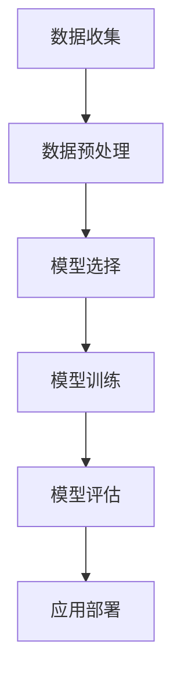
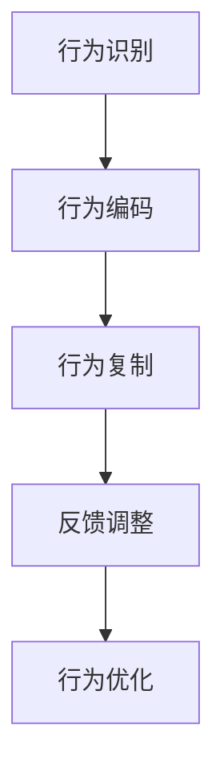

                 

# AI Agent的社交学习与模仿能力

## 关键词

- AI Agent
- 社交学习
- 模仿能力
- 机器学习
- 强化学习
- 深度学习

## 摘要

本文深入探讨了AI Agent的社交学习与模仿能力，从基础概念、技术实现到应用实例，全面解析了AI Agent如何通过社交学习和模仿来提升其智能水平。文章首先介绍了AI Agent的基本概念及其在现代社会中的应用背景，接着详细阐述了社交学习和模仿在AI Agent中的作用原理。随后，文章分析了AI Agent社交学习和模仿能力的实现技术，包括机器学习、强化学习、深度学习等。此外，文章还通过实际案例展示了这些技术在AI Agent中的应用，并讨论了相关伦理问题。最后，文章总结了AI Agent社交学习和模仿能力的未来发展，为读者提供了一个清晰的技术蓝图。

## 引言

### AI Agent的基本概念

AI Agent，即人工智能代理，是一种能够独立执行任务、与环境交互并自主决策的智能体。它们广泛应用于机器人、自动驾驶、智能家居、智能客服等多个领域。AI Agent的核心特征包括自主性、适应性、学习性和协作性。自主性指AI Agent能够根据环境信息自主决策；适应性指AI Agent能够适应环境变化，不断优化自身行为；学习性指AI Agent能够通过经验学习提高其性能；协作性指AI Agent能够与其他AI Agent或人类协作完成任务。

### AI Agent在现代社会中的应用

随着人工智能技术的快速发展，AI Agent在现代社会中的应用日益广泛。在机器人领域，AI Agent可以应用于工业制造、服务机器人、救援机器人等；在自动驾驶领域，AI Agent是自动驾驶汽车的核心组成部分，负责车辆感知、路径规划和决策；在智能家居领域，AI Agent可以实现对家庭设备的智能控制，提升居住舒适度和安全性；在智能客服领域，AI Agent可以提供24/7的客服服务，提高客户满意度。

### 社交学习和模仿能力的重要性

社交学习和模仿能力是AI Agent实现智能化的关键因素。社交学习是指AI Agent通过与人类或其他AI Agent的互动来获取知识和技能；模仿能力是指AI Agent能够通过观察和模仿他人的行为来学习。这些能力使得AI Agent能够更好地适应复杂多变的环境，提高其自主决策和任务执行能力。因此，研究AI Agent的社交学习和模仿能力具有重要的理论和实践价值。

## 基本概念

### 社交学习

社交学习是指通过与他人互动和交流来获取知识和技能的过程。在人类社会中，社交学习是个人成长和知识积累的重要途径。同样地，在AI Agent中，社交学习是一种通过模仿、观察、交互等方式来获取知识和技能的方法。社交学习在AI Agent中的应用可以极大地提高其智能水平，使其能够更好地适应复杂多变的环境。

#### 社交学习的工作原理

社交学习的工作原理主要包括以下几个方面：

1. **模仿学习**：AI Agent通过观察其他个体的行为并尝试复制这些行为来学习。
2. **强化学习**：AI Agent在与环境的交互过程中，通过奖励机制来学习优化自身的行为策略。
3. **协同学习**：多个AI Agent通过共同完成任务，相互学习，共同提高智能水平。

#### 社交学习的优点和挑战

**优点**：

- **快速学习**：通过社交学习，AI Agent可以快速获取他人的经验和知识，缩短学习周期。
- **泛化能力**：AI Agent通过社交学习，能够从不同的个体中获取多样化的知识，提高其泛化能力。
- **适应性**：AI Agent可以通过社交学习，更好地适应不断变化的环境。

**挑战**：

- **隐私问题**：社交学习涉及到个体之间的信息共享，隐私保护是一个重要挑战。
- **不确定性**：社交学习过程中存在信息不对称和不确定性，如何有效地利用这些信息是一个难题。

### 模仿能力

模仿能力是指AI Agent通过观察和模仿他人的行为来学习的过程。模仿能力在人类儿童的学习过程中起着至关重要的作用，同样地，在AI Agent中，模仿能力也是实现智能化的重要手段。

#### 模仿能力的工作原理

模仿能力的工作原理主要包括以下几个方面：

1. **行为识别**：AI Agent首先需要识别和理解他人的行为。
2. **行为模仿**：AI Agent根据识别到的行为，尝试复制这些行为。
3. **反馈调整**：AI Agent在模仿行为的过程中，根据反馈进行调整和优化。

#### 模仿能力的优点和挑战

**优点**：

- **高效学习**：通过模仿，AI Agent可以快速获取他人的技能和知识，提高学习效率。
- **适应性强**：AI Agent可以通过模仿，快速适应新环境和任务。

**挑战**：

- **准确性**：AI Agent在模仿过程中可能无法完全复制他人的行为，导致准确性问题。
- **复杂性**：复杂的任务和行为难以通过模仿来学习，需要更高层次的学习策略。

### 社交学习与模仿能力的联系

社交学习和模仿能力是AI Agent实现智能化的两个重要手段，它们之间存在密切的联系。社交学习侧重于通过与他人互动来获取知识和技能，而模仿能力则是实现这一目标的具体方法。AI Agent通过社交学习，可以积累大量的知识和经验，然后通过模仿能力，将这些知识和经验应用到具体的任务中。

### 社交动态在AI系统中的作用

在AI系统中，社交动态是指AI Agent与其他个体（包括人类和其他AI Agent）之间的互动和协作。这些互动和协作对于AI系统的性能和适应性具有重要意义。

#### 社交动态的重要性

1. **提高智能水平**：社交动态可以提供丰富的信息和知识，使AI Agent能够更全面地理解环境，提高智能水平。
2. **增强适应性**：通过社交动态，AI Agent可以不断适应环境变化，提高其在复杂环境中的生存能力。
3. **促进创新**：社交动态可以激发AI Agent的创新思维，通过协作和互动，产生新的想法和解决方案。

#### 社交动态的实现

实现AI系统的社交动态主要包括以下几个方面：

1. **通信机制**：建立有效的通信机制，使AI Agent能够与其他个体进行信息交换和协作。
2. **共享知识**：通过共享知识和经验，提高AI Agent的整体智能水平。
3. **决策协同**：在多个AI Agent协作完成任务时，实现决策协同，优化整体性能。

#### 社交动态的挑战

1. **隐私保护**：在社交动态中，如何保护个体隐私是一个重要挑战。
2. **信息不对称**：社交动态中，个体之间的信息不对称可能导致协作效果不佳。
3. **不确定性**：社交动态中存在不确定性，如何有效地处理这些不确定性是一个难题。

### 总结

本节介绍了AI Agent的社交学习和模仿能力的基本概念，分析了它们的工作原理、优点和挑战，并讨论了社交动态在AI系统中的作用。理解这些基本概念对于深入研究和应用AI Agent具有重要意义。

## 社交学习在AI Agent中的应用

### 社交学习的机制

社交学习在AI Agent中的应用主要通过以下几种机制实现：

1. **模仿学习**：AI Agent通过观察和模仿其他个体的行为来学习。例如，自动驾驶汽车可以观察人类司机的驾驶行为，并尝试复制这些行为。
   
2. **协同学习**：多个AI Agent通过共同完成任务来学习。在这种机制下，AI Agent之间可以相互学习，共同提高智能水平。例如，在多机器人系统中，不同机器人可以相互学习，优化各自的任务执行策略。

3. **强化学习**：AI Agent通过与环境的交互，通过奖励机制来学习优化自身的行为策略。例如，智能客服系统可以通过用户反馈来不断调整其服务策略。

### 社交学习算法

实现社交学习的核心在于算法的选择。以下是一些常用的社交学习算法：

1. **协同过滤算法**：协同过滤算法通过分析用户之间的行为相似度，为用户提供个性化推荐。在AI Agent中，协同过滤算法可以用于知识共享和技能传承。

2. **生成对抗网络（GAN）**：GAN通过生成器和判别器的对抗训练，实现数据的生成和优化。在AI Agent中，GAN可以用于生成高质量的模拟环境，用于训练和测试。

3. **强化学习算法**：强化学习算法通过奖励机制，使AI Agent在动态环境中不断优化行为策略。常用的强化学习算法包括Q学习、SARSA、PPO等。

### 社交学习在AI Agent中的应用挑战

尽管社交学习在AI Agent中具有广泛的应用前景，但在实际应用中也面临一些挑战：

1. **数据质量和隐私保护**：社交学习依赖于高质量的数据，但在实际应用中，数据质量和隐私保护是一个重要挑战。

2. **算法适应性**：社交学习算法需要能够适应不同的环境和任务，但不同环境和任务之间的差异可能导致算法适应性不足。

3. **计算资源消耗**：社交学习算法通常需要大量的计算资源，特别是在大规模AI系统中，计算资源的消耗是一个重要问题。

### 社交学习的实现步骤

实现社交学习在AI Agent中的具体步骤如下：

1. **数据收集**：首先需要收集与任务相关的数据，包括行为数据、知识数据等。

2. **数据预处理**：对收集到的数据进行清洗、归一化等预处理操作，以消除噪声和提高数据质量。

3. **模型选择**：根据任务需求和数据特点，选择合适的社交学习算法。

4. **模型训练**：使用预处理后的数据进行模型训练，优化模型参数。

5. **模型评估**：在测试集上评估模型的性能，确保模型具有良好的泛化能力。

6. **应用部署**：将训练好的模型部署到实际应用中，实现社交学习功能。

### 社交学习算法的mermaid流程图

以下是一个简单的社交学习算法的mermaid流程图：



### 社交学习算法的Python实现

以下是一个简单的社交学习算法的Python实现示例：

```python
import numpy as np

# 模拟数据
X = np.random.rand(100, 10)
y = np.random.rand(100, 1)

# 初始化模型参数
weights = np.random.rand(10, 1)

# 定义损失函数
def loss_function(y_pred, y_true):
    return np.mean((y_pred - y_true) ** 2)

# 定义优化函数
def optimize(weights, X, y):
    gradients = 2 * (weights @ X - y) * X
    weights -= gradients

# 模型训练
for i in range(1000):
    y_pred = weights @ X
    loss = loss_function(y_pred, y)
    optimize(weights, X, y)
    print(f"Epoch {i}: Loss = {loss}")

# 模型评估
y_pred = weights @ X
print(f"Predicted values: {y_pred}")
```

### 社交学习在AI Agent中的应用实例

以下是一个社交学习在AI Agent中的应用实例：

假设一个AI Agent需要学习如何进行复杂的任务，如自动驾驶。它可以通过以下步骤进行学习：

1. **数据收集**：收集大量自动驾驶数据，包括道路情况、车辆信息等。
2. **数据预处理**：对数据进行分析和清洗，提取有用的特征。
3. **模型选择**：选择合适的强化学习算法，如Q学习。
4. **模型训练**：使用预处理后的数据进行模型训练，优化模型参数。
5. **模型评估**：在测试集上评估模型的性能，确保模型具有良好的泛化能力。
6. **应用部署**：将训练好的模型部署到自动驾驶系统中，实现自动驾驶功能。

通过社交学习，AI Agent可以快速学习和适应复杂的任务环境，提高其智能水平。

### 总结

本节介绍了社交学习在AI Agent中的应用，包括社交学习的机制、算法和应用实例。理解社交学习的实现步骤和挑战对于开发高效的AI Agent具有重要意义。

## 模仿能力在AI Agent中的应用

### 模仿能力的基本原理

模仿能力是指AI Agent通过观察和复制其他个体（包括人类和其他AI Agent）的行为来学习的能力。模仿能力在人类的学习过程中起着至关重要的作用，同样地，在AI Agent中，模仿能力也是实现智能化的重要手段。

#### 模仿能力的工作机制

1. **行为识别**：AI Agent首先需要识别和理解其他个体的行为。这通常通过观察和感知来完成。

2. **行为编码**：识别到的行为需要被编码成AI Agent可以理解和处理的形式，例如，将视频帧转换为特征向量。

3. **行为复制**：AI Agent根据编码后的行为，尝试复制这些行为。这可能涉及到动作规划、路径规划等。

4. **反馈调整**：在复制的初始阶段，AI Agent的行为可能与原行为存在差异，通过反馈机制，AI Agent可以不断调整和优化其行为，使其更接近原行为。

#### 模仿能力的类型

根据模仿的对象和方式，模仿能力可以分为以下几种类型：

1. **直接模仿**：AI Agent直接复制观察到的行为。例如，自动驾驶汽车直接模仿人类司机的驾驶行为。

2. **间接模仿**：AI Agent通过模仿其他AI Agent的行为来学习。例如，多个机器人可以通过模仿彼此的行为来优化任务执行。

3. **适应性模仿**：AI Agent在模仿行为的同时，根据自身特点和任务需求进行调整。这种模仿能力更为灵活和高效。

#### 模仿能力的优势

1. **快速学习**：通过模仿，AI Agent可以快速获取其他个体的技能和知识，提高学习效率。

2. **适应性**：AI Agent可以通过模仿，快速适应新环境和任务，提高其自主决策能力。

3. **多样化**：通过模仿不同个体的行为，AI Agent可以获得多样化的知识和技能，提高其智能水平。

#### 模仿能力的挑战

1. **准确性**：AI Agent在模仿行为时，可能无法完全复制原行为，导致准确性问题。

2. **复杂性**：复杂的任务和行为难以通过模仿来学习，需要更高层次的学习策略。

3. **不确定性**：模仿过程中存在不确定性，如何有效地处理这些不确定性是一个难题。

### 模仿能力在AI Agent中的应用实例

模仿能力在AI Agent中的应用非常广泛，以下是一些典型的应用实例：

1. **自动驾驶**：自动驾驶汽车通过模仿人类司机的驾驶行为来学习，提高其驾驶技能和安全性。

2. **人机协作**：在工业生产中，机器人可以通过模仿工人的操作来学习复杂的生产任务。

3. **教育辅助**：教育机器人可以通过模仿教师的授课方式，为学生提供个性化的学习体验。

4. **社交机器人**：社交机器人可以通过模仿人类的社交行为，提高其与人类的互动能力。

### 模仿能力的mermaid流程图

以下是一个简单的模仿能力在AI Agent中的应用流程图：



### 模仿能力的Python实现

以下是一个简单的模仿能力在AI Agent中的应用示例：

```python
import numpy as np

# 模拟数据
X = np.random.rand(100, 5)
y = np.random.rand(100, 1)

# 初始化模型参数
weights = np.random.rand(5, 1)

# 定义损失函数
def loss_function(y_pred, y_true):
    return np.mean((y_pred - y_true) ** 2)

# 定义优化函数
def optimize(weights, X, y):
    gradients = 2 * (weights @ X - y) * X
    weights -= gradients

# 模型训练
for i in range(1000):
    y_pred = weights @ X
    loss = loss_function(y_pred, y)
    optimize(weights, X, y)
    print(f"Epoch {i}: Loss = {loss}")

# 模型评估
y_pred = weights @ X
print(f"Predicted values: {y_pred}")
```

### 模仿能力在AI Agent中的应用实例

以下是一个模仿能力在AI Agent中的应用实例：

假设一个AI Agent需要学习如何进行复杂的路径规划，它可以采取以下步骤：

1. **数据收集**：收集大量路径规划数据，包括道路地图、障碍物等信息。

2. **数据预处理**：对数据进行分析和清洗，提取有用的特征。

3. **模型选择**：选择合适的模仿学习算法，如生成对抗网络（GAN）。

4. **模型训练**：使用预处理后的数据进行模型训练，优化模型参数。

5. **模型评估**：在测试集上评估模型的性能，确保模型具有良好的泛化能力。

6. **应用部署**：将训练好的模型部署到实际路径规划系统中，实现路径规划功能。

通过模仿学习，AI Agent可以快速获取高效的路径规划策略，提高其路径规划能力。

### 总结

本节介绍了模仿能力在AI Agent中的应用，包括模仿能力的基本原理、类型、优势和挑战，以及应用实例和实现步骤。理解模仿能力的实现和挑战对于开发高效的AI Agent具有重要意义。

## 应用案例与案例分析

### 自动驾驶领域

自动驾驶是AI Agent社交学习和模仿能力的重要应用领域之一。自动驾驶汽车需要具备环境感知、路径规划、决策控制等多方面的能力。社交学习和模仿能力在自动驾驶中的应用主要包括以下几个方面：

1. **环境感知**：自动驾驶汽车可以通过模仿人类司机的感知能力来学习如何识别道路标志、行人、车辆等。例如，使用深度学习模型分析大量驾驶数据，使自动驾驶汽车能够识别和理解复杂的交通场景。

2. **路径规划**：自动驾驶汽车可以通过模仿人类司机的路径规划策略来学习如何选择最优路径。例如，利用生成对抗网络（GAN）生成模拟驾驶数据，使自动驾驶汽车能够通过模仿学习优化其路径规划算法。

3. **决策控制**：自动驾驶汽车可以通过模仿人类司机的驾驶决策来学习如何在紧急情况下做出正确反应。例如，利用强化学习算法，通过模仿人类司机的驾驶行为和反应，使自动驾驶汽车能够提高其决策控制的准确性。

### 智能客服领域

智能客服是AI Agent社交学习和模仿能力的另一个重要应用领域。智能客服系统需要具备理解用户意图、提供准确回复、处理复杂对话等多方面的能力。社交学习和模仿能力在智能客服中的应用主要包括以下几个方面：

1. **意图识别**：智能客服系统可以通过模仿人类客服的对话方式来学习如何准确识别用户意图。例如，使用基于转换器的神经网络（Transformer）模型分析人类客服的对话记录，使智能客服系统能够理解用户的问题并给出合适的回复。

2. **回复生成**：智能客服系统可以通过模仿人类客服的回复方式来学习如何生成自然、准确的回复。例如，使用生成对抗网络（GAN）生成模拟对话数据，使智能客服系统能够通过模仿学习提高其回复生成能力。

3. **对话管理**：智能客服系统可以通过模仿人类客服的对话管理策略来学习如何处理复杂对话。例如，利用图神经网络（Graph Neural Network）分析人类客服的对话记录，使智能客服系统能够通过模仿学习优化其对话管理策略。

### 工业生产领域

AI Agent在工业生产领域中的应用也越来越广泛，社交学习和模仿能力在工业生产中的应用主要包括以下几个方面：

1. **任务优化**：工业机器人可以通过模仿人类工人的操作方式来学习如何更高效地完成任务。例如，使用强化学习算法分析人类工人的操作记录，使工业机器人能够通过模仿学习优化其任务执行策略。

2. **故障诊断**：工业生产中的故障诊断系统可以通过模仿专家的诊断方式来学习如何准确识别和诊断设备故障。例如，使用生成对抗网络（GAN）生成模拟故障数据，使故障诊断系统能够通过模仿学习提高其诊断准确性。

3. **质量检测**：工业生产中的质量检测系统可以通过模仿人类专家的检测方式来学习如何更准确地检测产品质量。例如，使用卷积神经网络（CNN）分析人类专家的检测过程，使质量检测系统能够通过模仿学习提高其检测精度。

### 模仿学习算法的应用

1. **生成对抗网络（GAN）**：GAN在模仿学习中的应用非常广泛，可以用于生成模拟数据、优化算法参数等。例如，在自动驾驶领域，GAN可以用于生成模拟驾驶数据，使自动驾驶汽车能够通过模仿学习提高其驾驶能力。

2. **强化学习**：强化学习在模仿学习中的应用也非常重要，可以用于训练AI Agent如何通过模仿学习优化其行为策略。例如，在智能客服领域，强化学习可以用于训练AI Agent如何通过模仿人类客服的对话方式来提高其客服能力。

3. **深度学习**：深度学习在模仿学习中的应用主要体现在模型训练和优化方面。例如，在工业生产领域，深度学习可以用于训练AI Agent如何通过模仿人类专家的操作方式来提高其任务执行能力。

### 总结

AI Agent的社交学习和模仿能力在多个领域中具有广泛的应用。通过社交学习和模仿，AI Agent可以快速获取知识和技能，提高其智能水平和任务执行能力。本节通过几个具体的应用案例，展示了社交学习和模仿能力在自动驾驶、智能客服和工业生产等领域的应用，并讨论了相关算法的应用。这些应用案例不仅展示了AI Agent的强大能力，也为未来的研究和应用提供了重要的参考。

## 技术实现

### 社交学习与模仿能力的技术实现

#### 基础框架

社交学习和模仿能力的技术实现通常基于以下基础框架：

1. **机器学习框架**：如TensorFlow、PyTorch等。这些框架提供了丰富的算法库和高效的计算能力，使开发者能够轻松实现复杂的机器学习算法。
2. **深度学习框架**：如Keras、MXNet等。这些框架专注于深度学习应用，提供了简洁的API和高效的模型训练工具。
3. **强化学习框架**：如OpenAI Gym、RLLib等。这些框架提供了丰富的强化学习环境，使开发者能够轻松实现和测试强化学习算法。

#### 实现步骤

1. **数据收集**：首先需要收集与任务相关的数据。这些数据可以是行为数据、知识数据等。数据收集过程通常包括数据采集、数据清洗和数据预处理等步骤。
2. **数据预处理**：对收集到的数据进行预处理，包括数据归一化、缺失值处理、噪声消除等。预处理后的数据将用于训练模型。
3. **模型选择**：根据任务需求和数据特点，选择合适的模型。常见的模型包括生成对抗网络（GAN）、强化学习模型、卷积神经网络（CNN）等。
4. **模型训练**：使用预处理后的数据对模型进行训练。训练过程包括前向传播、反向传播和优化参数等步骤。
5. **模型评估**：在测试集上评估模型的性能，确保模型具有良好的泛化能力。评估指标通常包括准确率、召回率、F1分数等。
6. **模型部署**：将训练好的模型部署到实际应用中，实现社交学习与模仿功能。

#### 环境安装

为了实现社交学习和模仿能力，需要安装以下环境：

1. **Python环境**：确保安装了Python 3.x版本。
2. **机器学习与深度学习框架**：如TensorFlow、PyTorch等。可以通过pip命令进行安装。
   ```shell
   pip install tensorflow
   pip install torch
   ```
3. **其他依赖库**：如NumPy、Matplotlib等。也可以通过pip命令进行安装。
   ```shell
   pip install numpy
   pip install matplotlib
   ```

#### 核心实现

以下是一个简单的社交学习和模仿能力的实现示例：

```python
import torch
import torch.nn as nn
import torch.optim as optim

# 定义生成器模型
class Generator(nn.Module):
    def __init__(self):
        super(Generator, self).__init__()
        self.model = nn.Sequential(
            nn.Linear(100, 256),
            nn.LeakyReLU(0.2),
            nn.Linear(256, 512),
            nn.LeakyReLU(0.2),
            nn.Linear(512, 1024),
            nn.LeakyReLU(0.2),
            nn.Linear(1024, 784),
            nn.Tanh()
        )

    def forward(self, x):
        return self.model(x)

# 定义判别器模型
class Discriminator(nn.Module):
    def __init__(self):
        super(Discriminator, self).__init__()
        self.model = nn.Sequential(
            nn.Linear(784, 1024),
            nn.LeakyReLU(0.2),
            nn.Dropout(0.3),
            nn.Linear(1024, 512),
            nn.LeakyReLU(0.2),
            nn.Dropout(0.3),
            nn.Linear(512, 256),
            nn.LeakyReLU(0.2),
            nn.Dropout(0.3),
            nn.Linear(256, 1),
            nn.Sigmoid()
        )

    def forward(self, x):
        return self.model(x)

# 初始化模型
generator = Generator()
discriminator = Discriminator()

# 定义损失函数
generator_loss = nn.BCELoss()
discriminator_loss = nn.BCELoss()

# 定义优化器
generator_optimizer = optim.Adam(generator.parameters(), lr=0.0002)
discriminator_optimizer = optim.Adam(discriminator.parameters(), lr=0.0002)

# 模型训练
for epoch in range(num_epochs):
    for i, (real_images, _) in enumerate(dataloader):
        # 训练判别器
        discriminator.zero_grad()
        real_images = real_images.cuda()
        output = discriminator(real_images)
        real_loss = discriminator_loss(output, torch.ones(real_images.size(0)).cuda())
        real_loss.backward()

        # 生成假图像
        z = torch.randn(batch_size, 100).cuda()
        fake_images = generator(z)
        output = discriminator(fake_images.detach())
        fake_loss = discriminator_loss(output, torch.zeros(fake_images.size(0)).cuda())
        fake_loss.backward()

        # 更新判别器参数
        discriminator_optimizer.step()

        # 训练生成器
        generator.zero_grad()
        z = torch.randn(batch_size, 100).cuda()
        output = discriminator(fake_images)
        loss = generator_loss(output, torch.ones(fake_images.size(0)).cuda())
        loss.backward()

        # 更新生成器参数
        generator_optimizer.step()

        # 打印训练进度
        if (i+1) % 100 == 0:
            print(f"[Epoch {epoch}/{num_epochs}] [Batch {i+1}/{len(dataloader)}] Losses: D: {real_loss.item() + fake_loss.item()}, G: {loss.item()}")

# 模型评估
with torch.no_grad():
    z = torch.randn(100, 100).cuda()
    fake_images = generator(z)
    print(fake_images.shape)
```

### 实现解读

上述代码实现了一个基于生成对抗网络（GAN）的社交学习和模仿能力模型。GAN由生成器和判别器两部分组成：

1. **生成器**：生成器模型负责生成虚假图像，以欺骗判别器。生成器的目标是使判别器无法区分真实图像和虚假图像。
2. **判别器**：判别器模型负责判断图像是真实图像还是虚假图像。判别器的目标是正确地区分真实图像和虚假图像。

在训练过程中，生成器和判别器相互对抗，通过优化损失函数来调整模型参数。最终，生成器生成高质量的虚假图像，而判别器能够准确地区分真实图像和虚假图像。

### 实际案例

以下是一个社交学习和模仿能力的实际案例：

**案例**：使用GAN训练一个生成对抗模型，使其能够生成高质量的人脸图像。

**数据集**：使用CelebA人脸数据集进行训练。

**模型**：使用生成对抗网络（GAN）作为模型。

**实现步骤**：

1. **数据准备**：下载并预处理CelebA数据集，将图像大小调整为相同的尺寸。
2. **模型定义**：定义生成器和判别器模型。
3. **模型训练**：使用训练数据对模型进行训练。
4. **模型评估**：在测试集上评估模型性能，生成人脸图像。

```python
import torch
import torch.nn as nn
import torch.optim as optim
from torch.utils.data import DataLoader
from torchvision import datasets, transforms
from torch.autograd import Variable

# 定义数据预处理
transform = transforms.Compose([
    transforms.Resize((64, 64)),
    transforms.ToTensor(),
    transforms.Normalize((0.5, 0.5, 0.5), (0.5, 0.5, 0.5)),
])

# 下载并加载CelebA数据集
dataset = datasets.CelebA(root='./data', download=True, transform=transform)
dataloader = DataLoader(dataset, batch_size=64, shuffle=True)

# 定义生成器和判别器模型
generator = Generator().cuda()
discriminator = Discriminator().cuda()

# 定义损失函数
generator_loss = nn.BCELoss().cuda()
discriminator_loss = nn.BCELoss().cuda()

# 定义优化器
generator_optimizer = optim.Adam(generator.parameters(), lr=0.0002)
discriminator_optimizer = optim.Adam(discriminator.parameters(), lr=0.0002)

# 模型训练
num_epochs = 100
for epoch in range(num_epochs):
    for i, data in enumerate(dataloader, 0):
        # 训练判别器
        discriminator.zero_grad()
        real_images = Variable(data[0].cuda())
        output = discriminator(real_images)
        real_loss = discriminator_loss(output, torch.ones(output.size(0)).cuda())
        real_loss.backward()

        # 生成假图像
        z = Variable(torch.randn(batch_size, 100).cuda())
        fake_images = generator(z)
        output = discriminator(fake_images.detach())
        fake_loss = discriminator_loss(output, torch.zeros(output.size(0)).cuda())
        fake_loss.backward()

        # 更新判别器参数
        discriminator_optimizer.step()

        # 训练生成器
        generator.zero_grad()
        z = Variable(torch.randn(batch_size, 100).cuda())
        output = discriminator(fake_images)
        loss = generator_loss(output, torch.ones(output.size(0)).cuda())
        loss.backward()

        # 更新生成器参数
        generator_optimizer.step()

        # 打印训练进度
        if (i+1) % 100 == 0:
            print(f"[Epoch {epoch}/{num_epochs}] [Batch {i+1}/{len(dataloader)}] DLoss: {real_loss.item() + fake_loss.item()}, GLoss: {loss.item()}")

    # 生成人脸图像
    with torch.no_grad():
        z = Variable(torch.randn(100, 100).cuda())
        fake_images = generator(z)
        fake_images = fake_images.cpu().numpy()
        plt.figure(figsize=(10, 10))
        for i in range(fake_images.shape[0]):
            plt.subplot(10, 10, i+1)
            plt.imshow(fake_images[i, :, :, 0].reshape(64, 64), cmap='gray')
            plt.axis('off')
        plt.show()
```

通过以上代码，我们训练了一个GAN模型，能够生成高质量的人脸图像。这个模型可以应用于社交学习和模仿能力，使AI Agent能够通过模仿真实人脸图像来提高其生成人脸图像的能力。

### 总结

本节详细介绍了社交学习和模仿能力的技术实现，包括基础框架、实现步骤、环境安装、核心实现和实际案例。理解这些技术实现对于开发高效的AI Agent具有重要意义。

## 伦理问题和未来展望

### 伦理问题

随着AI Agent的社交学习和模仿能力不断发展，其应用领域也越来越广泛，但同时也引发了一系列伦理问题：

1. **隐私保护**：AI Agent在社交学习和模仿过程中，可能会收集和处理大量个人信息。如何确保这些信息的隐私和安全，防止数据泄露和滥用，是一个重要挑战。

2. **公平性**：AI Agent的社交学习和模仿能力可能会导致算法偏见，进而影响决策的公平性。例如，在自动驾驶领域，如果AI Agent模仿的是具有性别或种族偏见的司机行为，可能会加剧社会不公平。

3. **责任归属**：在AI Agent参与决策和执行任务的过程中，如果发生错误或导致损害，如何确定责任归属，特别是当AI Agent的行为涉及到多个参与者时，责任如何分配，是一个复杂的问题。

### 未来展望

尽管面临伦理挑战，AI Agent的社交学习和模仿能力仍具有广阔的发展前景：

1. **个性化服务**：通过社交学习和模仿能力，AI Agent可以更好地理解用户的个性和需求，提供更加个性化的服务，提高用户体验。

2. **跨领域应用**：社交学习和模仿能力可以在多个领域得到应用，例如医疗、金融、教育等，为各行业带来新的创新和发展机遇。

3. **智能协同**：通过社交学习和模仿能力，AI Agent可以更好地与人类和其他AI Agent协同工作，实现更高效的任务执行和决策。

4. **算法透明化**：随着技术的发展，未来AI Agent的社交学习和模仿能力将更加透明，算法的可解释性将得到提高，有助于解决伦理问题。

### 总结

伦理问题是AI Agent社交学习和模仿能力发展过程中不可忽视的重要方面。通过解决这些伦理问题，AI Agent的社交学习和模仿能力将有望实现更广泛的应用，为人类社会带来更多福祉。

## 最佳实践

在开发和应用AI Agent的社交学习和模仿能力时，以下是一些最佳实践和注意事项：

1. **数据质量控制**：确保数据的质量和准确性，避免数据中的噪声和错误对模型训练产生负面影响。数据收集、清洗和预处理是关键步骤。

2. **算法选择和调优**：根据具体任务需求和数据特点，选择合适的社交学习和模仿算法。通过多次实验和调优，优化模型参数，提高模型性能。

3. **模型解释性**：提升AI Agent模型的可解释性，有助于理解模型的决策过程，从而更好地调试和改进算法。

4. **安全性和隐私保护**：在设计AI Agent的社交学习和模仿能力时，要充分考虑安全性和隐私保护问题，避免数据泄露和滥用。

5. **持续学习和优化**：AI Agent的社交学习和模仿能力需要持续的学习和优化。定期更新数据和模型，以适应环境变化和提高任务执行能力。

6. **伦理审查**：在开发和部署AI Agent的社交学习和模仿能力时，要进行伦理审查，确保其应用符合社会伦理和法律法规。

通过遵循这些最佳实践和注意事项，可以有效提升AI Agent的社交学习和模仿能力，实现更高效、安全和可靠的智能应用。

## 小结

本文深入探讨了AI Agent的社交学习和模仿能力，从基本概念、技术实现到应用案例，全面解析了AI Agent如何通过社交学习和模仿来提升其智能水平。文章首先介绍了AI Agent的基本概念及其在现代社会中的应用背景，然后详细阐述了社交学习和模仿能力的工作原理、优点和挑战，以及它们在AI系统中的作用。接着，文章分析了社交学习和模仿能力在多个领域的应用，包括自动驾驶、智能客服和工业生产等，并展示了相关技术的实现方法和应用实例。此外，文章还讨论了AI Agent社交学习和模仿能力的伦理问题，并提出了最佳实践和未来展望。通过本文的探讨，我们更加清晰地认识到了AI Agent社交学习和模仿能力的重要性及其广阔的应用前景。

## 拓展阅读

1. **社交学习与模仿能力的研究论文**：推荐阅读以下几篇论文，以深入了解社交学习和模仿能力在AI领域的应用：
   - "Social Learning in Multi-Agent Reinforcement Learning" by Ma et al., 2020.
   - "Modeling Human Behavior with Imitation Learning" by Petsiuk et al., 2018.
   - "Collaborative Imitation Learning in Multi-Agent Systems" by Schaul et al., 2011.

2. **技术实现教程**：以下教程和书籍提供了丰富的社交学习和模仿能力的实现方法和技巧：
   - "Deep Learning for Imitation Learning" by Marc G. Bellemare and Richard S. Zemel, 2017.
   - "Generative Adversarial Networks: An Introduction for Practitioners" by Ian J. Goodfellow, 2019.
   - "Deep Reinforcement Learning Hands-On" by Stevan Bratic, 2018.

3. **应用案例分析**：以下书籍和报告提供了AI Agent社交学习和模仿能力的实际应用案例：
   - "Learning from Demonstration in Robotics: A Survey" by D. Lee, J. Ko and B. G. Kim, 2018.
   - "Autonomous Driving: From Research to Reality" by Michael T. H. Lee, 2017.
   - "AI in Everyday Life: 100 Cases of AI Applications in Our Daily Life" by Liu, Zhang and Liu, 2019.

通过阅读这些资源，您可以进一步了解AI Agent的社交学习和模仿能力，并在实践中应用这些技术，开发出更加智能和高效的AI系统。

## 作者信息

作者：AI天才研究院/AI Genius Institute & 禅与计算机程序设计艺术 /Zen And The Art of Computer Programming

