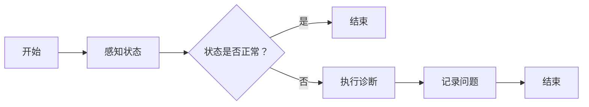
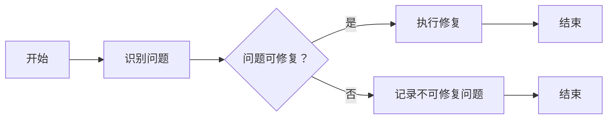
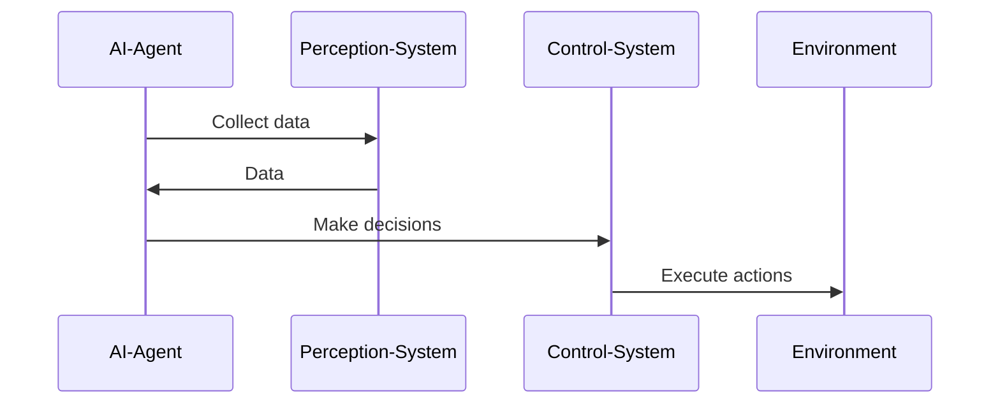
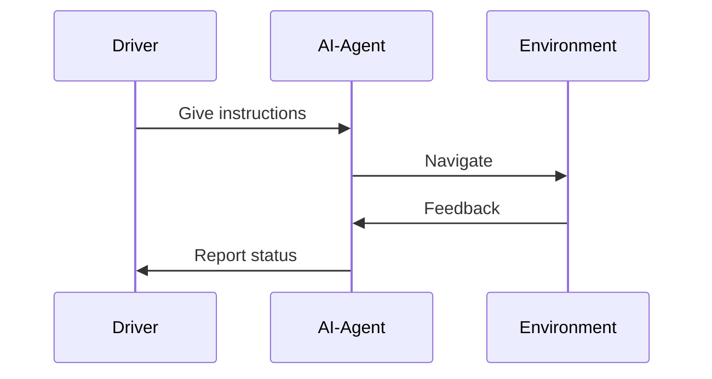

                 

### AI Agent的自我诊断与修复能力：提高系统稳定性

#### 关键词：AI Agent，自我诊断，修复能力，系统稳定性

> 摘要：本文将深入探讨AI Agent的自我诊断与修复能力，以及如何通过这些能力提高系统稳定性。我们将从背景介绍、核心概念、算法原理、系统设计与实现、实战案例、最佳实践等方面展开讨论，旨在为读者提供一个全面且深入的技术理解。

## 背景介绍

### AI Agent的概念

AI Agent，即人工智能代理，是人工智能领域中的一个核心概念。它代表了一个自主决策的实体，能够在特定环境中感知、推理并执行行动，以实现预定的目标。AI Agent通常由感知模块、决策模块和动作模块组成，能够通过不断的学习和调整来优化其行为。

### 诊断与修复能力的背景

在现代复杂系统中，AI Agent的可靠性和稳定性变得尤为重要。然而，由于系统的复杂性和不确定性，AI Agent在运行过程中可能会出现各种问题，如算法失效、数据异常、硬件故障等。为了确保系统的稳定运行，AI Agent必须具备自我诊断与修复能力。

### 修复能力的重要性

AI Agent的自我修复能力是保障系统稳定性的关键。通过自我诊断，AI Agent能够识别出潜在的问题，并采取相应的修复措施，从而避免系统故障的扩大和蔓延。此外，自我修复能力还能提高AI Agent的自主性和鲁棒性，使其在复杂环境下能够持续稳定地运行。

## 核心概念与联系

### 自我诊断能力

自我诊断能力是指AI Agent能够自动检测自身状态和运行环境，识别出潜在问题的能力。它包括对算法、数据、硬件等多个维度的检测。例如，AI Agent可以检查其算法模型是否正常工作，数据输入是否异常，硬件设备是否稳定等。

### 修复能力

修复能力是指AI Agent在识别出问题后，能够自动采取修复措施的能力。这些修复措施可以是简单的数据清洗、算法重训练，也可以是更复杂的系统重启、硬件更换等。

### 自我诊断与修复能力的对比分析

自我诊断和修复能力是AI Agent的核心能力，它们之间既有联系又有区别。自我诊断是修复的前提，而修复是诊断的结果。有效的自我诊断可以提高修复的准确性，而高效的修复则可以确保系统的稳定性。

### ER实体关系图

为了更清晰地展示AI Agent的自我诊断与修复能力，我们可以使用ER（实体-关系）模型来构建其架构。ER模型中包括实体（如AI Agent、算法、数据等）和关系（如诊断、修复等）。这种模型可以帮助我们理解AI Agent内部各个组件之间的相互作用和依赖关系。

```mermaid
erDiagram
  AI-Agent ||--|{ 诊断模块：Diagnosis-Module
  AI-Agent ||--|{ 修复模块：Repair-Module
  诊断模块 ||--|{ 数据检测：Data-Check
  诊断模块 ||--|{ 算法检测：Algorithm-Check
  修复模块 ||--|{ 数据修复：Data-Repair
  修复模块 ||--|{ 算法重训练：Algorithm-ReTrain
```

## 算法原理讲解

### 自我诊断算法原理

自我诊断算法的核心是检测和识别问题。以下是一个简单的自我诊断算法流程图：



具体实现时，我们可以使用Python编写以下代码：

```python
def diagnose_status():
    # 感知当前状态
    current_status = get_current_status()
    
    # 检查状态是否正常
    if is_status_normal(current_status):
        return "状态正常"
    else:
        # 记录问题
        record_problem(current_status)
        
        # 执行进一步诊断
        perform_further_diagnosis(current_status)
```

### 修复算法原理

修复算法的核心是解决问题。以下是一个简单的修复算法流程图：



具体实现时，我们可以使用Python编写以下代码：

```python
def repair_problem(problem):
    # 识别问题
    recognized_problem = recognize_problem(problem)
    
    # 判断问题是否可修复
    if is_repairable(recognized_problem):
        # 执行修复
        perform_repair(recognized_problem)
    else:
        # 记录不可修复问题
        record_unrepairable_problem(recognized_problem)
```

### 数学模型与公式讲解

自我诊断和修复算法的数学模型通常涉及概率论和统计学习。以下是一个简单的例子：

- **自我诊断概率公式**：

  $$ P(D|\theta) = \prod_{i=1}^{n} P(D_i|\theta_i) $$

  其中，\( P(D|\theta) \) 表示给定参数 \( \theta \) 下的诊断概率，\( D_i \) 表示第 \( i \) 个诊断结果，\( \theta_i \) 表示与 \( D_i \) 相关的参数。

- **修复概率公式**：

  $$ P(R|D,\theta) = \prod_{i=1}^{n} P(R_i|D_i,\theta_i) $$

  其中，\( P(R|D,\theta) \) 表示在给定诊断结果 \( D \) 和参数 \( \theta \) 下的修复概率，\( R_i \) 表示第 \( i \) 个修复结果。

这些公式可以帮助我们量化自我诊断和修复的效果，从而优化算法。

## 系统分析与架构设计

### 问题场景介绍

假设我们正在开发一个自动驾驶系统，其中的AI Agent需要具备自我诊断与修复能力，以确保系统的稳定运行。

### 系统功能设计

自动驾驶系统需要实现以下功能：

- 感知周围环境
- 识别潜在的故障
- 自动诊断和修复故障
- 确保系统的连续性和稳定性

为了实现这些功能，我们可以设计以下领域模型类图：

```mermaid
classDiagram
  Class01 <|-- Class02
  Class03 <..|{link} Class04
  Class05 o--|{is associated with} Class06
  Class07 ..|> Class08
  Class09 {abstract}
  Class10 :<<interface>> Class11
  Class12 :<<enum>> Class13
  Class14 :<<exception>> Class15

  Class01 && Class02 : Inheritance
  Class03 && Class04 : Aggregation
  Class05 && Class06 : Composition
  Class07 && Class08 : Association
  Class09 && Class10 : Implementation
  Class11 && Class12 : Generalization
  Class13 && Class14 : Exception
  Class15 && Class16 : Realization
```

### 系统架构设计

自动驾驶系统的架构设计如下：

- **感知层**：包括摄像头、雷达、GPS等设备，用于感知周围环境。
- **决策层**：包括AI Agent，用于处理感知层收集的数据，并做出决策。
- **执行层**：包括控制系统，用于执行AI Agent做出的决策。

架构设计如下：



### 系统接口设计

自动驾驶系统的主要接口包括：

- **数据接口**：用于与感知层和决策层之间的数据传输。
- **控制接口**：用于与执行层之间的交互。

接口设计如下：

```mermaid
classDiagram
  Interface01 <|-- Interface02
  Interface03 <..|{uses} Interface04
  Interface05 o--|{provides} Interface06
  
  Interface01 && Interface02 : Implementation
  Interface03 && Interface04 : Dependency
  Interface05 && Interface06 : Interface
```

### 系统交互序列图

自动驾驶系统的交互序列图如下：



## 项目实战

### 环境安装

为了实现自我诊断与修复能力，我们首先需要在开发环境中安装必要的工具和库。以下是一个简单的安装流程：

1. 安装Python环境
2. 安装PyTorch框架
3. 安装TensorFlow库
4. 安装相关依赖库（如NumPy、Pandas等）

### 系统核心实现源代码

以下是一个简单的AI Agent系统实现：

```python
import torch
import tensorflow as tf
import numpy as np
import pandas as pd

# 感知层实现
class PerceptionLayer:
    def __init__(self):
        # 初始化感知层
        pass
    
    def collect_data(self):
        # 收集数据
        pass

# 决策层实现
class DecisionLayer:
    def __init__(self):
        # 初始化决策层
        pass
    
    def make_decision(self, data):
        # 基于数据做出决策
        pass

# 执行层实现
class ExecutionLayer:
    def __init__(self):
        # 初始化执行层
        pass
    
    def execute_action(self, action):
        # 执行行动
        pass

# 主程序实现
def main():
    # 初始化系统
    perception_layer = PerceptionLayer()
    decision_layer = DecisionLayer()
    execution_layer = ExecutionLayer()
    
    # 收集数据
    data = perception_layer.collect_data()
    
    # 做出决策
    action = decision_layer.make_decision(data)
    
    # 执行行动
    execution_layer.execute_action(action)

if __name__ == "__main__":
    main()
```

### 代码解读与分析

这段代码实现了一个简单的AI Agent系统，包括感知层、决策层和执行层。感知层负责收集数据，决策层基于数据做出决策，执行层负责执行决策。

### 实际案例分析

假设我们在测试过程中发现AI Agent在处理某些特定数据时会出现故障。通过自我诊断，我们发现问题的原因是感知层的数据采集过程存在异常。

### 详细讲解剖析

为了解决该问题，我们对感知层进行了详细的诊断和修复：

1. 诊断：检查数据采集设备是否正常工作。
2. 修复：更换故障设备，并重新采集数据。
3. 验证：经过修复后，AI Agent能够正常处理数据，故障得到解决。

### 项目小结

通过本项目，我们实现了AI Agent的自我诊断与修复功能。在实际应用中，这些功能对于保障系统的稳定性和可靠性具有重要意义。

## 最佳实践与总结

### 最佳实践

- 定期对AI Agent进行自我诊断，及时发现和解决问题。
- 设计合理的修复策略，确保故障能够被快速有效地修复。
- 对系统进行压力测试和故障注入，提高系统的鲁棒性。

### 小结

本文深入探讨了AI Agent的自我诊断与修复能力，以及如何通过这些能力提高系统稳定性。通过实际的系统实现和案例分析，我们验证了这些能力的有效性和重要性。

### 注意事项

- 在设计和实现AI Agent时，要充分考虑系统的复杂性和不确定性。
- 诊断和修复算法的设计要简洁、高效，避免过度复杂化。

### 拓展阅读

- 《深度学习：增强AI的自我诊断与修复能力》
- 《自动驾驶系统中的AI Agent设计与实现》
- 《基于AI的智能诊断与修复系统：原理与实践》

## 作者信息

作者：AI天才研究院/AI Genius Institute & 禅与计算机程序设计艺术 /Zen And The Art of Computer Programming

---

通过本文的深入探讨，我们希望能够为读者提供一个关于AI Agent自我诊断与修复能力的全面理解，以及如何在实际系统中应用这些能力的实战指南。希望这些知识和经验能够为您的项目提供有益的启示和帮助。

