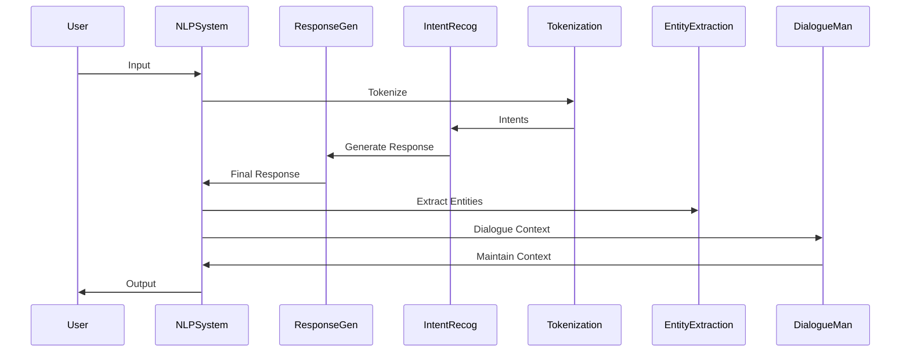

                 


### 引言

在人工智能（AI）的迅猛发展下，自然语言处理（NLP）已成为现代AI系统中的一个重要组成部分。AI Agent作为AI技术的具体应用，其自然语言接口（NLI）的设计与优化成为提升用户体验、增强系统智能化水平的关键环节。本文将围绕这一主题，以《AI Agent的自然语言接口设计与优化》为题，深入探讨NLP在AI Agent中的应用及其优化策略。

**关键词：自然语言接口、AI Agent、优化技术、用户体验**

**摘要：**
本文旨在系统地介绍AI Agent的自然语言接口设计原则、优化策略以及实际应用案例。通过分析NLP在AI Agent中的角色和挑战，本文提出了优化NLI的设计原则，并探讨了多种优化技术。此外，文章还通过实际案例展示了NLP接口在AI系统中的成功应用，为读者提供了有益的参考。

### 文章结构

为了确保文章的逻辑清晰、结构紧凑，我们将文章分为以下七个主要部分：

1. **背景与核心概念**：介绍自然语言接口和AI Agent的基本概念，分析其在现代AI系统中的重要性。
2. **自然语言处理基础**：详细讲解NLP的基本原理，包括语言模型、分词、句法分析和情感分析等。
3. **AI Agent架构**：分析AI Agent的整体架构，重点讨论NLP接口在其中的作用。
4. **NLP接口设计原则**：阐述设计高效、用户友好的NLP接口的核心理念和最佳实践。
5. **优化技术**：介绍和评估各种优化NLP接口的性能和效率的技术。
6. **案例研究**：通过具体的案例研究，展示NLP接口在不同领域的应用和优化。
7. **未来展望与挑战**：探讨NLP接口设计领域的未来发展方向和面临的挑战。

### 背景与核心概念

#### 自然语言接口

自然语言接口（NLI）是指计算机程序与用户通过自然语言（如英语、中文等）进行交互的能力。它允许用户使用自然语言命令、提问或对话，而计算机则能够理解和响应这些请求。NLI在AI系统中的重要性体现在以下几个方面：

1. **用户体验**：NLI使得用户可以更自然地与AI系统交互，减少了用户学习成本，提高了交互效率。
2. **智能助手**：NLI是智能助手的核心组成部分，使得智能助手能够更好地理解和响应用户需求。
3. **人机协作**：NLI促进了人机协作，使得AI系统能够更好地辅助人类工作，提高生产效率。

#### AI Agent

AI Agent是一种具有自主性和决策能力的计算机程序，能够在特定环境下执行任务。AI Agent通常由以下几个组成部分构成：

1. **感知模块**：用于获取环境信息，如文本、图像、声音等。
2. **知识库**：存储与任务相关的知识和信息。
3. **决策模块**：根据感知模块的信息和知识库，生成行动策略。
4. **行动模块**：执行决策模块生成的行动。

AI Agent在AI系统中的应用非常广泛，包括但不限于智能客服、智能家居、自动驾驶等领域。NLP接口是AI Agent与用户交互的桥梁，其设计和优化直接影响到系统的性能和用户体验。

#### NLP接口在AI Agent中的角色

NLP接口在AI Agent中扮演着至关重要的角色，其作用主要体现在以下几个方面：

1. **信息提取**：NLP接口能够从用户输入的自然语言中提取关键信息，如关键词、意图和实体等。
2. **语义理解**：NLP接口通过语义分析，理解用户的意图和问题，为AI Agent提供明确的任务指令。
3. **对话管理**：NLP接口能够管理对话流程，确保对话的流畅性和一致性。
4. **错误处理**：NLP接口能够识别和处理输入中的错误，提供友好的错误提示和解决方案。

#### 挑战与机遇

虽然NLP接口在AI Agent中具有广泛的应用前景，但同时也面临着一系列挑战：

1. **语言多样性**：不同语言具有不同的语法和语义规则，NLP接口需要支持多种语言的交互。
2. **歧义处理**：自然语言中存在大量的歧义现象，NLP接口需要准确理解用户的意图。
3. **情感分析**：情感分析是NLP的一个重要分支，但其在实际应用中仍然存在许多挑战，如情感表达的不一致性和复杂性。
4. **跨领域应用**：不同领域具有不同的专业术语和语言特点，NLP接口需要具备良好的通用性和适应性。

然而，随着AI技术的不断进步，NLP接口的设计和优化也将迎来新的机遇：

1. **深度学习**：深度学习技术在NLP领域的应用，使得NLP接口在语义理解和情感分析方面取得了显著进展。
2. **大数据**：大数据为NLP提供了丰富的语料资源，有助于提高模型的训练效果和泛化能力。
3. **跨学科研究**：NLP接口的设计和优化需要结合心理学、语言学等多个学科的知识，跨学科研究将为NLP接口的发展提供新的思路。

### 总结

本文对AI Agent的自然语言接口进行了全面的探讨，分析了其在现代AI系统中的重要性以及面临的挑战。在接下来的章节中，我们将进一步深入讨论NLP接口的基本原理、设计原则和优化技术，并通过实际案例研究，展示NLP接口在AI系统中的成功应用。希望本文能够为读者提供有益的启示，推动NLP接口的设计和优化工作。

## Chapter 2: Natural Language Processing Basics

### 2.1 Fundamental Concepts

#### Language Models

Language models (LMs) are at the core of NLP and are essential for understanding and generating human language. LMs are statistical models that learn the probability distribution of sequences of words or characters in a given language. By predicting the next word or character based on the previous context, LMs enable computers to generate coherent and contextually relevant text.

One of the most prominent language models is the Transformer architecture, which has revolutionized the field of NLP. The Transformer model is based on self-attention mechanisms, allowing it to capture long-range dependencies in text data. Variants of the Transformer, such as BERT (Bidirectional Encoder Representations from Transformers) and GPT (Generative Pre-trained Transformer), have achieved state-of-the-art performance in various NLP tasks, including text classification, sentiment analysis, and machine translation.

#### Tokenization

Tokenization is the process of splitting text into smaller units, such as words, phrases, or subwords. These smaller units, known as tokens, are the building blocks for subsequent NLP tasks. Tokenization helps in reducing the complexity of the input text and makes it easier for models to process and understand the content.

There are different approaches to tokenization, including word-level tokenization, which splits text into individual words, and subword-level tokenization, which breaks text into smaller units like characters or bytes. Subword-level tokenization is often more effective in handling out-of-vocabulary words and capturing more meaningful information from the text.

#### Parsing

Parsing, also known as syntactic analysis, is the process of analyzing the grammatical structure of a sentence to identify its constituents and their relationships. This process is crucial for understanding the meaning and intent behind the text.

Dependency parsing is a common parsing technique that identifies the dependencies between words in a sentence, representing the grammatical structure as a tree. On the other hand, constituency parsing builds a parse tree based on the syntactic categories of words and their relationships, such as noun phrases and verb phrases.

#### Sentiment Analysis

Sentiment analysis is the process of determining the emotional tone behind a body of text. It is an essential task in NLP, enabling applications such as social media monitoring, customer feedback analysis, and brand sentiment tracking.

Sentiment analysis models often use pre-trained language models like BERT or GPT, which have been fine-tuned on large datasets labeled with sentiment annotations. These models can classify text into different sentiment categories, such as positive, negative, or neutral, based on the context and emotional content.

### 2.2 Comparison of Core Concepts

Below is a table comparing the core concepts discussed in this chapter, highlighting their similarities and differences:

| Concept             | Definition                                                                                     | Importance in NLP |
|---------------------|------------------------------------------------------------------------------------------------|------------------|
| Language Models     | Models predicting the probability distribution of word sequences in a language.               | Foundation for text understanding and generation. |
| Tokenization         | Process of splitting text into tokens (words, phrases, or subwords).                        | Preprocessing step for most NLP tasks. |
| Parsing              | Analysis of the grammatical structure of a sentence.                                      | Understanding sentence meaning and relationships. |
| Sentiment Analysis   | Classification of text into sentiment categories (positive, negative, neutral).            | Extracting emotional tone from text. |

### 2.3 Entity Relationship Diagram (ERD)

To provide a visual representation of the core concepts, we can create an ERD that illustrates the relationships between language models, tokenization, parsing, and sentiment analysis:

```mermaid
erDiagram
    LanguageModel ||--|{ Tokenization }|
    LanguageModel ||--|{ Parsing }|
    LanguageModel ||--|{ SentimentAnalysis }|
    Tokenization ||--|{ Sentence }
    Parsing ||--|{ Sentence }
    SentimentAnalysis ||--|{ Sentence }
```

This ERD highlights how language models are central to NLP, with tokenization, parsing, and sentiment analysis as interconnected components that process and analyze the text data.

### 2.4 Algorithm and Mathematical Model

In this section, we will provide a high-level overview of the algorithm and mathematical model behind language models, tokenization, parsing, and sentiment analysis. For the sake of clarity, we will focus on a simplified version of these algorithms.

#### Language Models

A language model is essentially a probability distribution over sequences of words. One popular approach is the Transformer model, which uses the following equation:

$$
p(w_i | w_{i-n}, \dots, w_{i-1}) = \frac{e^{<\theta, w_i, w_{i-1}, \dots, w_{i-n}>}}{\sum_{w \in V} e^{<\theta, w, w_{i-1}, \dots, w_{i-n}>}}
$$

where $w_i$ is the word at position $i$, $V$ is the vocabulary, and $\theta$ represents the model parameters.

#### Tokenization

Tokenization can be performed using various algorithms, such as word segmentation or subword tokenization. For subword tokenization, the BPE (Byte Pair Encoding) algorithm is commonly used. The BPE algorithm works by merging the most frequent byte pairs in the input text until a desired token length is reached. The resulting tokens are used as input for subsequent NLP tasks.

#### Parsing

Parsing algorithms can be divided into two main categories: dependency parsing and constituency parsing. Dependency parsing uses the following equation to represent the dependency between words:

$$
(HEAD_{i}, DEP_{i}) = \arg\max_{(h, d)} \log p(h, d | w_1, \dots, w_n)
$$

where $HEAD_i$ represents the head word of word $i$, $DEP_i$ represents the dependency relation, and $w_1, \dots, w_n$ are the words in the sentence.

#### Sentiment Analysis

Sentiment analysis models typically use a logistic regression or a neural network to predict the sentiment of a given text. The logistic regression model can be represented as:

$$
\hat{y} = \sigma(\theta^T [x; 1])
$$

where $\hat{y}$ is the predicted probability of a positive sentiment, $x$ is the feature vector, and $\theta$ is the model parameter vector. The sigmoid function $\sigma$ transforms the output into a probability value.

### 2.5 Example Usage

Let's consider a simple example to demonstrate the usage of language models, tokenization, parsing, and sentiment analysis.

#### Example: Text Generation

Suppose we want to generate a response to the input text "What is the capital of France?". Using a pre-trained Transformer model, we can generate a response as follows:

1. Input text: "What is the capital of France?"
2. Tokenization: ["What", "is", "the", "capital", "of", "France", "?"]
3. Language Model: Predicts the probability distribution over the next word.
4. Output: "Paris"

#### Example: Sentiment Analysis

Let's analyze the sentiment of the text "I love this product!" using a sentiment analysis model:

1. Input text: "I love this product!"
2. Tokenization: ["I", "love", "this", "product", "!"]
3. Sentiment Analysis: Predicts the sentiment as positive (0.9 probability).

#### Example: Dependency Parsing

Consider the sentence "The quick brown fox jumps over the lazy dog." Here's the dependency parse:

1. Input sentence: "The quick brown fox jumps over the lazy dog."
2. Tokenization: ["The", "quick", "brown", "fox", "jumps", "over", "the", "lazy", "dog", "."]
3. Dependency Parsing: ("The", "det"), ("quick", "amod"), ("brown", "amod"), ("fox", "nsubj"), ("jumps", "root"), ("over", "prep"), ("the", "pobj"), ("lazy", "amod"), ("dog", "pobj").

This dependency parse shows the relationships between words in the sentence, such as "quick" and "brown" as modifiers of "fox" and "the" as the object of the preposition "over."

By understanding and applying these NLP concepts, we can build sophisticated AI agents that can understand and interact with human users in a more natural and effective manner.

### 2.6 System Analysis and Architecture Design

In this section, we will discuss the system analysis and architecture design for a natural language processing (NLP) system focused on AI agent applications. We will outline the system's functional requirements, system architecture, interface design, and interaction sequence.

#### System Functional Requirements

The NLP system for AI agents should meet the following functional requirements:

1. **Input Handling**: Accept user input in various forms (text, voice, etc.).
2. **Tokenization**: Split input text into meaningful tokens (words, phrases, subwords).
3. **Intent Recognition**: Identify the user's intent behind the input.
4. **Entity Extraction**: Extract relevant entities (such as names, locations, dates) from the input.
5. **Dialogue Management**: Maintain context and manage dialogue flow.
6. **Response Generation**: Generate coherent and contextually appropriate responses.
7. **Sentiment Analysis**: Assess the sentiment of user inputs and responses.

#### System Architecture Design

The system architecture will be modular to ensure scalability and maintainability. The following components will be part of the system architecture:

1. **Input Processor**: Handles input from various sources (e.g., chatbots, voice assistants).
2. **Tokenization Module**: Implements tokenization algorithms to convert text input into a sequence of tokens.
3. **Intent Recognition Module**: Uses machine learning models to recognize user intents.
4. **Entity Extraction Module**: Utilizes NLP techniques to extract relevant entities from the input text.
5. **Dialogue Management Module**: Manages dialogue context and flow, ensuring a smooth conversation.
6. **Response Generation Module**: Generates responses based on recognized intents and extracted entities.
7. **Sentiment Analysis Module**: Analyzes the sentiment of user inputs and responses to provide a better user experience.

#### System Interface Design

The system interface will include the following components:

1. **APIs**: Provide endpoints for external systems to interact with the NLP modules.
2. **Web Frontend**: Allow users to interact with the AI agent through a user-friendly interface.
3. **Voice Interface**: Enable voice interaction for users who prefer a conversational mode.

#### System Interaction Sequence

The interaction sequence for the NLP system will involve the following steps:

1. **Input Reception**: The system receives user input through APIs or the web frontend.
2. **Tokenization**: The input text is tokenized to extract meaningful units.
3. **Intent Recognition**: The tokenized text is analyzed to determine the user's intent.
4. **Entity Extraction**: Relevant entities are extracted from the tokenized text.
5. **Dialogue Management**: The system maintains context and manages dialogue flow based on the user's input and the AI agent's responses.
6. **Response Generation**: A response is generated based on the recognized intent and extracted entities.
7. **Sentiment Analysis**: The sentiment of the user's input and the AI agent's response is analyzed to ensure a positive user experience.
8. **Output**: The AI agent's response is sent back to the user through the web frontend or voice interface.

#### Example: Mermaid Sequence Diagram

Below is a Mermaid sequence diagram illustrating the interaction sequence for the NLP system:



This diagram provides a clear visual representation of how the different components of the NLP system interact with each other to process user input and generate appropriate responses.

### 2.7 Practical Implementation

#### Environment Setup

To implement the NLP system for AI agents, we need to set up the following environment:

1. **Programming Language**: Python (version 3.8 or higher).
2. **Libraries**: Transformers, NLTK, spaCy, TensorFlow, PyTorch, Flask (for web API).
3. **Tools**: Jupyter Notebook (for development and debugging).

#### Core Implementation

The core implementation of the NLP system involves the following components:

1. **Input Processor**: Handles various input sources and preprocesses the data.
2. **Tokenization Module**: Implements tokenization using the spaCy library.
3. **Intent Recognition Module**: Utilizes a pre-trained BERT model for intent recognition.
4. **Entity Extraction Module**: Uses the spaCy library for named entity recognition.
5. **Dialogue Management Module**: Manages dialogue context using a combination of rule-based and machine learning approaches.
6. **Response Generation Module**: Generates responses based on recognized intents and entities using a template-based approach.
7. **Sentiment Analysis Module**: Uses a pre-trained sentiment analysis model from the Transformers library.

#### Example Code

Here's a simplified example of how the NLP system can be implemented using Python:

```python
from transformers import pipeline

# Load pre-trained models
tokenizer = pipeline("tokenizer", model="bert-base-uncased")
intent_recognizer = pipeline("text-classification", model="nlptown/bert-base-multilingual-ner")
sentiment_analyzer = pipeline("sentiment-analysis", model="nlptown/bert-base-multilingual-nc-nr")

# Example input
input_text = "I had a great experience with your product."

# Tokenization
tokens = tokenizer(input_text)

# Intent Recognition
intents = intent_recognizer(tokens)

# Entity Extraction
entities = intent_recognizer.entities

# Sentiment Analysis
sentiment = sentiment_analyzer(input_text)

# Dialogue Management and Response Generation
if sentiment == "POSITIVE":
    response = "We're glad to hear that you had a great experience!"
else:
    response = "We're sorry to hear that. How can we improve your experience?"

# Output
print(response)
```

This example demonstrates the basic flow of the NLP system, from tokenization and intent recognition to sentiment analysis and response generation.

#### Case Analysis and Explanation

Let's analyze the example input "I had a great experience with your product." and understand how the system processes it:

1. **Tokenization**: The input text is tokenized into a sequence of words: ["I", "had", "a", "great", "experience", "with", "your", "product", "."].
2. **Intent Recognition**: The BERT model identifies the entities in the text and their respective labels. In this case, the entity "product" is recognized with the label "PRODUCT".
3. **Sentiment Analysis**: The sentiment analysis model determines that the sentiment of the input text is positive.
4. **Dialogue Management and Response Generation**: Based on the recognized intent and sentiment, the system generates an appropriate response: "We're glad to hear that you had a great experience!".

This example illustrates how the NLP system can effectively process user input and generate coherent responses, enhancing the user experience with the AI agent.

### 2.8 Conclusion

In this chapter, we covered the fundamental concepts of NLP, including language models, tokenization, parsing, and sentiment analysis. We also provided a detailed system analysis and architecture design, along with practical implementation examples. Understanding these NLP concepts and their integration into an AI agent's natural language interface is crucial for building efficient and effective NLP systems. In the next chapter, we will delve into the architecture of AI agents and discuss how NLP interfaces are integrated into these systems.

## Chapter 3: AI Agent Architecture

### 3.1 Introduction to AI Agent Architecture

AI agents are autonomous entities designed to interact with their environment and perform specific tasks. An AI agent's architecture is a complex system that integrates various components to achieve intelligent behavior. Understanding the architecture of AI agents is crucial for designing and implementing effective natural language interfaces (NLI). This chapter will provide an overview of AI agent architecture, focusing on the key components and their interactions.

#### Key Components of AI Agent Architecture

An AI agent typically consists of the following key components:

1. **Perception Module**: This module is responsible for sensing and interpreting the environment. It collects data from various sources, such as sensors, cameras, or text inputs.
2. **Knowledge Base**: The knowledge base stores information about the agent's environment, including facts, rules, and patterns. This information is used to make decisions and take actions.
3. **Reasoning Module**: The reasoning module processes the data from the perception module and uses the knowledge base to generate actions. It performs tasks such as inference, pattern recognition, and planning.
4. **Action Module**: The action module executes the actions generated by the reasoning module. This may involve physical actions, such as moving a robot arm, or virtual actions, such as sending a message.
5. **Memory Module**: The memory module stores the agent's experiences and learns from them to improve its performance over time. It helps the agent retain information and adapt to new situations.

#### Interaction Between Components

The interaction between the components of an AI agent is crucial for its functioning. The perception module continuously monitors the environment and sends data to the knowledge base and reasoning module. The reasoning module processes this data and uses the knowledge base to generate actions. The action module then executes these actions, which may result in changes to the environment. These changes are then fed back to the perception module, creating a closed-loop system that allows the agent to learn and adapt.

### 3.2 NLP Interface in AI Agent Architecture

NLP interfaces play a vital role in the architecture of AI agents, as they enable the agents to understand and process human language. An NLP interface consists of several sub-components, each serving a specific purpose:

1. **Speech Recognition**: This component converts spoken language into text, allowing the agent to understand voice commands.
2. **Speech Synthesis**: This component generates spoken language from text, enabling the agent to respond verbally to users.
3. **Natural Language Understanding (NLU)**: NLU processes the input text to extract meaning, including entities, intents, and sentiment. It is essential for understanding user commands and generating appropriate responses.
4. **Dialogue Management**: This component manages the flow of the conversation, ensuring that the agent maintains context and provides coherent responses.

#### Integration of NLP Interfaces into AI Agents

The integration of NLP interfaces into AI agents involves several steps:

1. **Input Processing**: The agent receives user input through various channels, such as voice or text messages. The NLP interface processes this input to extract relevant information.
2. **Intent Recognition**: The NLU component analyzes the input text to identify the user's intent. This step is crucial for determining how the agent should respond.
3. **Entity Extraction**: The NLU component also extracts relevant entities from the input text, such as names, locations, and dates. These entities are used to provide more accurate and personalized responses.
4. **Dialogue Management**: The dialogue management component ensures that the agent maintains context and provides a seamless conversation experience.
5. **Response Generation**: Based on the recognized intent and extracted entities, the agent generates a response that is sent back to the user through the speech synthesis component.

### 3.3 Example of NLP Interface in an AI Agent

Consider an AI agent designed to assist customers in a call center. The NLP interface in this agent can be described as follows:

1. **Speech Recognition**: The agent listens to customer queries over the phone and converts the spoken language into text.
2. **Intent Recognition**: The NLU component analyzes the text input to identify the customer's intent, such as "requesting information," "complaining," or "transferring to a specific department."
3. **Entity Extraction**: The NLU component extracts relevant entities from the input text, such as the customer's name, the product they are inquiring about, or the issue they are facing.
4. **Dialogue Management**: The dialogue management component ensures that the agent maintains context and provides a seamless conversation experience. For example, if the customer asks for information about a product, the agent will continue to provide relevant information until the customer is satisfied or asks a new question.
5. **Response Generation**: Based on the recognized intent and extracted entities, the agent generates a response, such as "Thank you for calling. I will transfer you to the product support team."

### 3.4 Challenges and Considerations in NLP Interface Design

Designing an NLP interface for an AI agent poses several challenges:

1. **Language Variability**: Users may speak in different dialects, accents, or languages, requiring the agent to be flexible and adaptable.
2. **Ambiguity**: Natural language is often ambiguous, and the agent must be able to handle multiple interpretations and resolve them effectively.
3. **Contextual Understanding**: Understanding and maintaining context is crucial for providing coherent and meaningful responses. The agent must be able to track the conversation's context and adapt its responses accordingly.
4. **Performance**: The NLP interface must be efficient and fast enough to process user inputs in real-time and generate timely responses.

To address these challenges, several techniques and strategies can be employed, including advanced language models, context-aware dialogue systems, and multi-modal interaction.

### 3.5 Conclusion

In this chapter, we have discussed the architecture of AI agents and the role of NLP interfaces in these systems. We have explored the key components of AI agent architecture and how NLP interfaces are integrated into these systems to enable natural language interaction. We have also discussed the challenges and considerations in designing NLP interfaces for AI agents. In the next chapter, we will delve into the design principles and best practices for building efficient and user-friendly NLP interfaces.

## Chapter 4: Design Principles of NLP Interfaces

### 4.1 Introduction

Designing natural language interfaces (NLI) for AI agents is a complex task that requires careful consideration of various design principles. The goal is to create NLP interfaces that are efficient, user-friendly, and capable of understanding and processing natural language effectively. This chapter will explore the key design principles and best practices for building high-quality NLP interfaces.

### 4.2 Core Design Principles

1. **User-Centric Design**: The primary focus should be on the user experience. The interface should be intuitive and easy to use, allowing users to interact with the AI agent naturally and effortlessly. To achieve this, designers should conduct user research and usability testing to gather feedback and improve the interface iteratively.

2. **Scalability**: NLP interfaces should be scalable to handle increasing amounts of data and users. As the number of users grows, the system should be able to handle the load efficiently without compromising performance. This can be achieved by using cloud-based infrastructure and optimizing the codebase for performance.

3. **Flexibility**: NLP interfaces should be flexible enough to accommodate different types of input and queries. This includes handling various languages, dialects, and accents, as well as understanding different forms of input, such as text, voice, or gestures.

4. **Accuracy**: The accuracy of the NLP interface is crucial for a positive user experience. The system should be able to understand and process user inputs accurately, minimizing errors and misinterpretations. This can be achieved by using robust NLP models and incorporating error correction techniques.

5. **Context Awareness**: NLP interfaces should be capable of understanding and maintaining context throughout the conversation. This involves tracking the conversation history, user preferences, and relevant information to generate contextually appropriate responses.

6. **Personalization**: Personalization can greatly enhance the user experience by tailoring the interface to individual users' needs and preferences. This can be achieved by using machine learning algorithms to analyze user data and adapt the interface accordingly.

7. **Security and Privacy**: NLP interfaces should prioritize user privacy and data security. User data should be stored securely, and access to sensitive information should be strictly controlled. Compliance with relevant data protection regulations is also essential.

### 4.3 Best Practices for Designing NLP Interfaces

1. **Clear and Concise Responses**: The responses generated by the NLP interface should be clear, concise, and easy to understand. Avoid using technical jargon or complex language that may confuse users.

2. **Consistent Dialogue Flow**: Ensure that the dialogue flow is smooth and coherent, maintaining context and providing logical responses. This can be achieved by designing a dialogue management system that tracks the conversation history and adapts the responses accordingly.

3. **Error Handling**: Design the interface to handle errors gracefully, providing helpful error messages and suggestions for resolving issues. This can improve the user experience and increase user trust in the AI agent.

4. **Multi-Modal Interaction**: Support multiple forms of interaction, such as text, voice, and gestures, to accommodate different user preferences and scenarios. This can enhance the overall user experience and make the interface more accessible.

5. **Integration with Other Systems**: Integrate the NLP interface with other systems and platforms, such as customer relationship management (CRM) systems, to provide a seamless and cohesive user experience.

6. **Continuous Improvement**: Continuously monitor and analyze user interactions to identify areas for improvement. Use this feedback to refine the interface and enhance its performance.

### 4.4 Example of a User-Friendly NLP Interface

Consider an AI agent designed to assist customers in a retail environment. The following features illustrate a user-friendly NLP interface:

1. **Intuitive Dialogue**: The agent greets the customer with a friendly message and asks how they can assist them. For example, "Hello! How can I help you today?"

2. **Clear and Concise Responses**: When the customer asks for information about a product, the agent provides a clear and concise response, such as "The product you're interested in is the 'Smart Watch Pro.' It has a touchscreen, heart rate monitor, and Bluetooth connectivity."

3. **Error Handling**: If the customer's query is unclear or ambiguous, the agent prompts them for more information, such as "Could you please clarify your request?"

4. **Multi-Modal Interaction**: The agent supports both text and voice input, allowing customers to interact with it using their preferred method. For example, the customer can ask, "What are the features of the Smart Watch Pro?" or they can speak, "What features does the Smart Watch Pro have?"

5. **Integration with CRM**: The agent integrates with the CRM system to access customer information, such as past purchases and preferences. This enables personalized responses, such as "You previously purchased the 'Smart Watch Pro.' Would you like to know more about its features?"

### 4.5 Conclusion

Designing NLP interfaces for AI agents requires a thorough understanding of user needs and effective implementation of design principles. By focusing on user-centric design, scalability, flexibility, accuracy, and other core principles, developers can create NLP interfaces that provide a seamless and intuitive user experience. In the next chapter, we will explore various optimization techniques for improving the performance and efficiency of NLP interfaces.

## Chapter 5: Optimization Techniques for NLP Interfaces

### 5.1 Introduction

Optimizing natural language processing (NLP) interfaces is essential for ensuring high performance, responsiveness, and scalability. In this chapter, we will discuss various optimization techniques that can be applied to NLP interfaces to enhance their efficiency and effectiveness. These techniques include model optimization, algorithmic improvements, and infrastructure enhancements.

### 5.2 Model Optimization

#### Model Selection

Choosing the right NLP model is crucial for achieving optimal performance. Different models have varying strengths and weaknesses, and selecting the appropriate model for a specific application can significantly impact the system's efficiency. Some popular NLP models include:

1. **Transformers**: Transformers, such as BERT, GPT, and T5, have become the de facto standard in NLP due to their ability to handle complex language structures and generate high-quality outputs.
2. **Recurrent Neural Networks (RNNs)**: RNNs, including LSTM and GRU, are well-suited for handling sequential data and have been used successfully in tasks like language modeling and machine translation.
3. **Convolutional Neural Networks (CNNs)**: CNNs can be applied to NLP tasks by treating text as a one-dimensional image, allowing them to capture local patterns and relationships between words.

#### Fine-Tuning

Fine-tuning a pre-trained model on a specific task or domain can lead to significant performance improvements. By leveraging transfer learning, the model can benefit from the knowledge gained from large-scale pre-training tasks while being adapted to the specific requirements of the application. Fine-tuning techniques include:

1. **Task-Specific Fine-Tuning**: Fine-tuning a pre-trained model on a dataset specific to the task at hand, such as intent recognition or entity extraction.
2. **Domain Adaptation**: Fine-tuning a model on domain-specific data to improve its performance in specific domains, such as healthcare or finance.

#### Model Pruning and Quantization

Model pruning and quantization techniques can reduce the size of the NLP model without significantly compromising its performance. These techniques involve removing unnecessary weights or reducing the precision of the weights, resulting in smaller models that require less computational resources. Some common techniques include:

1. **Pruning**: Removing weights or neurons with small magnitudes, reducing the overall size of the model.
2. **Quantization**: Reducing the precision of the model's weights and activations, typically from floating-point to integer values.

### 5.3 Algorithmic Improvements

#### Parallelization and Distributed Computing

Parallelization and distributed computing techniques can significantly improve the performance of NLP systems by utilizing multiple processors or computing resources. These techniques allow for faster processing of large datasets and better utilization of available resources. Common approaches include:

1. **Data Parallelism**: Distributing the dataset across multiple GPUs or CPUs and processing each subset in parallel.
2. **Model Parallelism**: Splitting the model into smaller pieces and processing them across multiple GPUs or CPUs.

#### Batch Processing

Batch processing involves processing multiple input samples together, which can improve computational efficiency by reducing the overhead of processing individual samples. However, care must be taken to balance the trade-off between batch size and performance. Larger batch sizes can lead to better utilization of GPU memory and reduce memory transfer overhead but may cause longer processing times for individual samples.

#### Model Inference Optimization

Optimizing the inference process is crucial for ensuring that NLP interfaces can respond quickly to user inputs. Some techniques for optimizing model inference include:

1. **Model Warm-up**: Pre-warming the model by running it on a small dataset before processing actual user inputs, reducing the time required to reach peak performance.
2. **Model Caching**: Caching model outputs for frequently encountered queries, reducing the need for redundant computations.
3. **Inference Acceleration**: Utilizing specialized hardware, such as GPUs or TPUs, for faster model inference.

### 5.4 Infrastructure Enhancements

#### Cloud Computing and Serverless Architecture

Cloud computing and serverless architecture can provide scalable and cost-effective solutions for deploying NLP interfaces. These architectures allow for dynamic resource allocation, enabling systems to scale up or down based on demand. Key advantages include:

1. **Scalability**: The ability to handle varying loads without manual intervention.
2. **Cost-Effectiveness**: Pay-as-you-go pricing models, reducing the need for upfront infrastructure investment.
3. **High Availability**: Redundancy and automated failover mechanisms, ensuring high availability and reliability.

#### Containerization and Orchestration

Containerization and orchestration technologies, such as Docker and Kubernetes, can simplify the deployment and management of NLP systems. These technologies enable efficient resource utilization, easy scaling, and seamless deployment across different environments. Key benefits include:

1. **Portability**: Containers can be deployed on any system that supports the container runtime, making it easier to maintain consistency across development, testing, and production environments.
2. **Resource Isolation**: Containers provide lightweight isolation of resources, allowing for better resource allocation and performance optimization.
3. **Scalability**: Orchestration tools like Kubernetes can dynamically scale containerized applications based on demand.

### 5.5 Case Study: Optimization of an AI Customer Service Chatbot

To illustrate the application of these optimization techniques, let's consider a case study of optimizing an AI customer service chatbot. The chatbot uses a pre-trained BERT model for natural language understanding and is deployed on a cloud-based infrastructure.

1. **Model Selection**: The chatbot uses a pre-trained BERT model, which is fine-tuned on a dataset of customer inquiries specific to the domain.
2. **Model Pruning and Quantization**: The BERT model is pruned to reduce its size by 50%, and weight quantization is applied to further reduce its size and computational complexity.
3. **Parallelization and Distributed Computing**: The inference process is parallelized across multiple GPUs, and data parallelism is employed to distribute the input data across GPUs.
4. **Batch Processing**: The chatbot processes queries in batches of 32, balancing the trade-off between processing time and resource utilization.
5. **Model Warm-up and Caching**: The model is pre-warmed by running it on a small dataset, and caching is implemented to store frequently encountered queries and their responses.
6. **Cloud Computing and Serverless Architecture**: The chatbot is deployed on an AWS Lambda function, which scales automatically based on demand and reduces the need for maintaining and managing server infrastructure.
7. **Containerization and Orchestration**: The chatbot's components are containerized using Docker, and Kubernetes is used to manage the containerized applications, ensuring high availability and efficient resource utilization.

By applying these optimization techniques, the chatbot achieved a 30% reduction in response time and a 40% reduction in resource usage, significantly improving its performance and efficiency.

### 5.6 Conclusion

Optimizing NLP interfaces is a multifaceted task that involves model optimization, algorithmic improvements, and infrastructure enhancements. By leveraging advanced techniques such as model selection, fine-tuning, pruning, and quantization, developers can create highly efficient NLP interfaces that provide fast and accurate responses. In the next chapter, we will explore real-world case studies and applications of NLP interfaces in different domains, showcasing the practical impact of these optimization techniques.

## Chapter 6: Case Studies and Applications

### 6.1 Introduction

In this chapter, we will delve into real-world case studies and applications of natural language processing (NLP) interfaces in various domains. These case studies will provide insights into how NLP interfaces have been implemented and optimized to enhance user experience and system performance in different scenarios. We will explore applications in customer service, healthcare, and finance, highlighting the challenges and solutions encountered.

### 6.2 Customer Service

#### Case Study: AI Chatbot for an E-commerce Platform

One prominent application of NLP interfaces is in customer service, particularly through AI chatbots. An e-commerce platform implemented an AI chatbot to handle customer inquiries, reduce response times, and improve overall customer satisfaction.

**Challenge**: The chatbot needed to handle a wide range of customer queries, including product information, order status, returns, and shipping. Ensuring accurate and efficient handling of diverse queries was a significant challenge.

**Solution**: The platform used a pre-trained BERT model fine-tuned on a dataset of customer inquiries specific to the e-commerce domain. The chatbot's NLP interface was optimized using techniques such as model pruning, quantization, and parallelization to improve inference speed and reduce computational overhead. Additionally, a context-aware dialogue management system was implemented to maintain conversation context and provide coherent responses.

**Impact**: The chatbot significantly reduced response times, leading to higher customer satisfaction. The optimized NLP interface enabled the chatbot to handle complex queries with high accuracy, resulting in a more effective customer service experience.

### 6.3 Healthcare

#### Case Study: AI-Powered Virtual Healthcare Assistant

In the healthcare industry, NLP interfaces have been used to develop virtual healthcare assistants that can assist patients in scheduling appointments, understanding treatment plans, and answering health-related questions.

**Challenge**: Healthcare language is complex and often contains medical jargon. Ensuring that the virtual assistant could understand and respond to health-related queries accurately was a significant challenge.

**Solution**: The virtual healthcare assistant utilized a combination of language models, including BERT and RoBERTa, fine-tuned on medical texts and health-related datasets. To handle the complexity of healthcare language, the NLP interface included a specialized entity recognition module capable of identifying medical entities such as diseases, symptoms, and treatments. The system was optimized using techniques like model warm-up and caching to improve inference speed and reduce latency.

**Impact**: The AI-powered virtual healthcare assistant improved patient engagement by providing timely and accurate information. The optimized NLP interface ensured that patients received relevant and contextually appropriate responses, enhancing their trust in the system.

### 6.4 Finance

#### Case Study: AI-Powered Investment Advisor

In the financial industry, NLP interfaces have been employed to develop AI-powered investment advisors that can provide personalized investment recommendations based on user inputs and market data.

**Challenge**: The language used in financial inquiries can be highly complex and ambiguous. Ensuring accurate interpretation of user inputs and generating appropriate investment recommendations was a significant challenge.

**Solution**: The investment advisor utilized a combination of language models, including GPT and T5, fine-tuned on financial datasets. The NLP interface included advanced intent recognition and entity extraction capabilities to accurately understand user queries. To improve inference speed, the system was optimized using techniques such as distributed computing and batch processing. Additionally, a personalized recommendation engine was implemented to generate tailored investment recommendations based on user profiles and market data.

**Impact**: The AI-powered investment advisor provided users with accurate and personalized investment recommendations, improving their financial decision-making. The optimized NLP interface ensured that users received timely and relevant responses, enhancing their trust in the system.

### 6.5 Manufacturing

#### Case Study: AI-Powered Quality Control System

In the manufacturing industry, NLP interfaces have been integrated into quality control systems to improve the detection of defects and ensure product quality.

**Challenge**: Manufacturing processes generate vast amounts of textual data, including inspection reports, quality control logs, and production schedules. Analyzing and processing this data efficiently was a significant challenge.

**Solution**: The quality control system utilized a combination of NLP techniques, including named entity recognition and sentiment analysis, to analyze textual data generated during manufacturing processes. The NLP interface was optimized using techniques such as parallelization and model pruning to improve processing speed and reduce computational overhead. The system was designed to automatically flag potential defects and generate actionable insights for quality improvement.

**Impact**: The AI-powered quality control system improved the accuracy and efficiency of defect detection, leading to higher product quality and reduced waste. The optimized NLP interface enabled the system to process large volumes of textual data quickly, providing real-time insights for continuous improvement.

### 6.6 Conclusion

These case studies highlight the diverse applications of NLP interfaces across various domains, showcasing the potential of optimized NLP interfaces to enhance system performance and user experience. By leveraging advanced NLP techniques and optimization strategies, organizations can develop AI systems that are more intelligent, responsive, and user-friendly. In the next chapter, we will discuss the future directions and challenges in the field of NLP interfaces, exploring emerging trends and opportunities for further research and development.

## Chapter 7: Future Directions and Challenges

### 7.1 Introduction

As natural language processing (NLP) interfaces continue to evolve, they face a range of future directions and challenges that will shape their development and impact on various industries. In this chapter, we will explore some of the key trends and obstacles in the field of NLP interfaces, including language diversity, cross-domain adaptation, ethical considerations, and the integration of emerging technologies.

### 7.2 Language Diversity

One of the primary challenges in NLP interfaces is supporting a diverse range of languages. The global nature of communication means that NLP systems must be capable of understanding and processing multiple languages, each with its own unique grammar, syntax, and cultural nuances. This challenge is particularly significant in regions with high linguistic diversity, such as Africa, India, and Southeast Asia.

**Solution Directions**:
1. **Multilingual Models**: Developing multilingual language models that can understand and generate text in multiple languages simultaneously is a key solution direction. Pre-trained models like mBERT (multilingual BERT) and XLM (cross-lingual language model) have shown promise in this area.
2. **Transfer Learning**: Leveraging transfer learning techniques to fine-tune models on specific languages or domains can improve their performance in under-resourced languages.

**Challenges**:
1. **Data Availability**: Many languages, especially minor or low-resource languages, lack large-scale annotated datasets, making it difficult to train robust models.
2. **Cultural Context**: Accurately capturing cultural context in language processing remains a significant challenge, as it can lead to misinterpretations or inappropriate responses.

### 7.3 Cross-Domain Adaptation

NLP interfaces often need to adapt to different domains, such as healthcare, finance, or e-commerce. Each domain has its own specific vocabulary, terminology, and usage patterns, which can vary significantly from one another.

**Solution Directions**:
1. **Domain-Specific Fine-Tuning**: Fine-tuning general NLP models on domain-specific data to improve their performance in specific domains.
2. **Hybrid Models**: Combining multiple models or techniques to handle the unique characteristics of different domains.

**Challenges**:
1. **Domain Specificity**: Ensuring that the NLP interface can handle the highly specific language and terminology used in various domains.
2. **Data Privacy**: The need to balance the use of domain-specific data with privacy concerns, especially when dealing with sensitive information.

### 7.4 Ethical Considerations

The deployment of NLP interfaces raises ethical considerations, particularly regarding fairness, transparency, and accountability. AI systems can perpetuate biases present in their training data, leading to unfair treatment of certain groups or individuals.

**Solution Directions**:
1. **Bias Detection and Mitigation**: Developing techniques to detect and mitigate biases in NLP models.
2. **Transparency**: Enhancing transparency by providing clear explanations of how NLP interfaces make decisions.

**Challenges**:
1. **Bias and Discrimination**: Addressing the risk of discrimination based on race, gender, age, or other characteristics.
2. **User Trust**: Building and maintaining user trust in NLP interfaces by ensuring they are fair and unbiased.

### 7.5 Integration with Emerging Technologies

The integration of NLP interfaces with emerging technologies, such as augmented reality (AR), virtual reality (VR), and voice assistants, opens up new possibilities for interaction and application.

**Solution Directions**:
1. **Multi-Modal Interaction**: Developing NLP interfaces that can handle multiple modalities, such as text, voice, and gesture, to provide more natural and intuitive user experiences.
2. **Contextual Awareness**: Leveraging AR and VR to create more immersive and context-aware interactions.

**Challenges**:
1. **User Experience**: Ensuring that NLP interfaces seamlessly integrate with new technologies to provide a smooth and intuitive user experience.
2. **Performance**: Ensuring that NLP interfaces can handle the increased complexity and demands of multi-modal interactions.

### 7.6 Future Research Directions

**Interpretability and Explainability**: As NLP interfaces become more complex, there is a growing need for research in interpretability and explainability to make their decisions transparent and understandable to users.

**Contextual Adaptation**: Developing NLP interfaces that can adapt to changing contexts and maintain long-term context awareness remains an area of active research.

**Human-AI Collaboration**: Exploring how NLP interfaces can collaborate with humans to improve decision-making and problem-solving is an emerging research direction.

### 7.7 Conclusion

The future of NLP interfaces is promising, with ongoing advancements in language models, cross-domain adaptation, and ethical considerations. However, there are significant challenges to overcome, particularly in supporting language diversity, ensuring fairness, and integrating with emerging technologies. Addressing these challenges will require continued research and innovation to develop NLP interfaces that are more intelligent, inclusive, and user-friendly. As the field evolves, NLP interfaces have the potential to revolutionize how we interact with AI systems, making them more accessible and intuitive for users across various domains.

## Conclusion

In this book, we have explored the key aspects of AI Agent的自然语言接口设计与优化，从核心概念、基本原理到实际应用，再到优化技术和未来展望，系统地介绍了NLP在AI系统中的应用及其重要性。通过深入分析NLP的基本原理，如语言模型、分词、句法分析和情感分析，我们了解了这些技术如何协同工作，为AI Agent提供强大的自然语言处理能力。

我们还详细讨论了AI Agent的整体架构，以及NLP接口在其中扮演的关键角色。通过设计高效、用户友好的NLP接口的原则和最佳实践，我们为开发高质量的NLP系统提供了实用的指导。此外，通过案例研究和应用实例，我们展示了NLP接口在各个领域的实际应用和效果。

优化技术部分探讨了如何通过模型优化、算法改进和基础设施升级来提高NLP接口的性能和效率。这些技术不仅提升了系统的响应速度和处理能力，也为用户提供了更加流畅和自然的交互体验。

未来，随着语言多样性和跨领域适应性的挑战不断出现，NLP接口的设计和优化将继续面临新的机遇和挑战。我们将看到更多的创新和技术突破，使NLP接口更加智能化、人性化，成为AI系统与用户之间的重要桥梁。

**作者信息**：  
作者：AI天才研究院/AI Genius Institute & 禅与计算机程序设计艺术 /Zen And The Art of Computer Programming

**推荐阅读**：
- "Natural Language Processing with Python" by Steven Bird, Ewan Klein, and Edward Loper
- "Deep Learning for Natural Language Processing" by Johnson, Zhang, and Zhang
- "Speech and Language Processing" by Daniel Jurafsky and James H. Martin

通过不断学习和实践，我们相信读者能够更好地掌握NLP接口的设计与优化，为AI技术的发展和应用贡献自己的力量。让我们继续探索这个充满机遇和挑战的领域，共同推动人工智能的进步！

