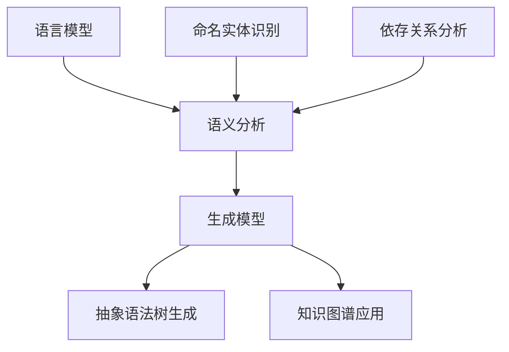
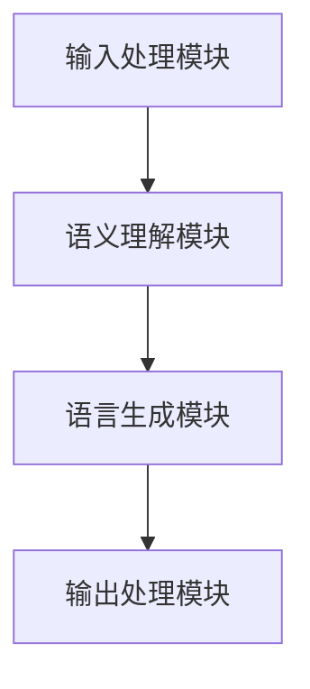
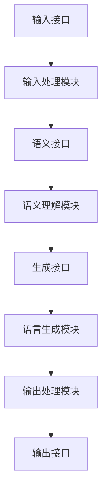
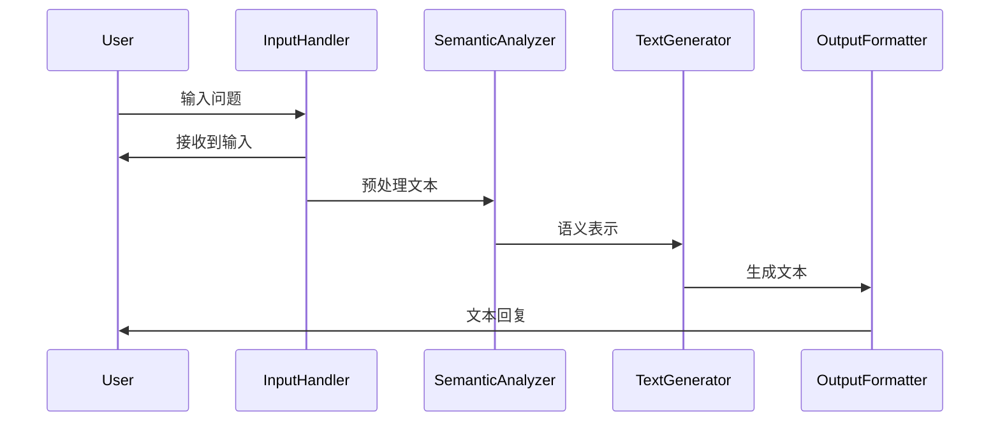

                 


### 引言

在当今的科技时代，人工智能（AI）以其无与伦比的能力正在改变我们的世界。从智能助手到自动驾驶汽车，AI的应用范围不断扩大。然而，在众多AI应用中，AI Agent——能够自主执行任务、与人类进行自然语言交流的智能体——显得尤为重要。AI Agent的自然语言生成能力（NLG）是其核心功能之一，它使得AI Agent能够以自然流畅的方式与用户互动，提供个性化的服务。

本文旨在探讨AI Agent的自然语言生成能力开发，通过以下结构详细解析这一主题：

- **第一部分：自然语言生成背景与基础**  
  - 第1章：自然语言生成概述  
  - 第2章：核心概念与联系  
  - 第3章：自然语言生成的工作流程

- **第二部分：AI Agent的自然语言生成核心概念**  
  - 第4章：算法原理讲解

- **第三部分：AI Agent的自然语言生成系统分析与架构设计**  
  - 第5章：系统分析与架构设计

- **第四部分：项目实战**  
  - 第6章：项目实战

- **第五部分：最佳实践与拓展**  
  - 第7章：最佳实践与拓展

在接下来的讨论中，我们将逐一深入这些部分，详细剖析每一个关键点。首先，让我们从自然语言生成的背景与基础开始。

## 第一部分：自然语言生成背景与基础

### 第1章：自然语言生成概述

自然语言生成（Natural Language Generation，NLG）是一种将机器生成的内容以自然语言形式表达出来的技术。它旨在使计算机能够自动生成文本，如新闻报道、对话系统回复、电子邮件等。

#### 1.1 问题背景与意义

随着互联网的普及和大数据技术的发展，用户生成内容（User-Generated Content，UGC）的数量呈爆炸式增长。例如，社交媒体平台上的用户评论、论坛帖子等，都需要进行自动化的生成和分类。此外，智能客服、个人助手等AI Agent的应用需求也越来越强烈，这些AI Agent需要能够以自然流畅的语言与用户进行互动，提供个性化的服务。

#### 1.2 自然语言生成的需求

自然语言生成的需求主要来自于以下几个方面：

1. **个性化服务**：AI Agent能够根据用户的历史行为和偏好，生成个性化的文本内容。
2. **自动化内容生成**：在新闻、财经报告等领域，自动生成文本可以大大提高效率，降低成本。
3. **多语言支持**：NLG技术使得机器能够生成多种语言的内容，满足全球化业务需求。
4. **人机交互**：NLG技术使得AI Agent能够以自然语言与用户进行交互，提高用户体验。

#### 1.3 NLP与NLG的关系

自然语言处理（Natural Language Processing，NLP）和自然语言生成（NLG）是人工智能领域的两个重要分支。NLP主要研究如何让计算机理解和处理人类语言，而NLG则研究如何让计算机生成人类语言。

NLP与NLG之间的关系可以概括为：NLP为NLG提供了语义理解的基础，NLG则是NLP的应用之一。在NLG系统中，NLP技术用于理解用户的输入，NLG技术则用于生成自然流畅的回复。

#### 1.4 自然语言生成的挑战

尽管自然语言生成技术在不断发展，但仍面临一些挑战：

1. **语义理解**：正确理解用户输入的语义是NLG的关键，但语义理解复杂且具有多样性。
2. **语法生成**：生成符合语法规则的文本是一个挑战，尤其是当文本需要包含特定语法结构时。
3. **鲁棒性**：NLG系统需要能够处理各种输入，包括拼写错误、缩写、俚语等。

在下一章中，我们将回顾自然语言生成的历史与发展，了解这项技术的演变过程。

### 第2章：自然语言生成的历史与发展

#### 2.1 传统文本生成方法

自然语言生成的历史可以追溯到20世纪60年代。当时，研究者开始探索如何让计算机生成文本。这些早期的文本生成方法主要基于规则和模板。

1. **基于规则的方法**：这种方法依赖于一组预定义的规则，用于生成文本。例如，研究者可能会编写规则来生成新闻报道，其中每个新闻条目都包含标题、导语和正文。这些规则定义了文本的格式和结构，但灵活性较低，难以处理复杂的语义。

2. **模板匹配**：模板匹配是一种基于规则的方法，其中预定义的模板与输入文本进行匹配，以生成输出文本。这种方法适用于生成结构化文本，但缺乏灵活性，难以处理非结构化文本。

#### 2.2 基于规则的NLG系统

随着计算机技术的发展，研究者开始开发基于规则的NLG系统。这些系统通常包含一个知识库，用于存储事实和规则，以及一个推理引擎，用于根据用户输入生成文本。

1. **知识库**：知识库包含特定领域的知识，如地理信息、历史事件等。这些知识被用来生成文本。

2. **推理引擎**：推理引擎根据用户输入和知识库中的信息，应用规则生成文本。例如，一个基于规则的新闻生成系统可能会从知识库中检索相关信息，并根据预定义的规则生成新闻条目。

#### 2.3 基于机器学习的NLG方法

随着机器学习技术的发展，研究者开始探索基于机器学习的方法进行自然语言生成。

1. **序列到序列模型**：序列到序列（Sequence-to-Sequence，Seq2Seq）模型是早期的一种基于机器学习的方法，用于生成自然语言文本。这种模型通常包含一个编码器和一个解码器。编码器将输入序列编码为一个固定长度的向量，解码器则将这个向量解码为输出序列。

2. **注意力机制**：注意力机制是Seq2Seq模型中的一个关键组件，用于让解码器关注输入序列中的特定部分，从而提高生成文本的质量。

3. **预训练语言模型**：近年来，预训练语言模型（如BERT、GPT）在自然语言生成中取得了显著成果。这些模型通过在大规模语料库上进行预训练，学习了丰富的语言知识，从而能够生成更加自然流畅的文本。

#### 2.4 深度学习在NLG中的应用

深度学习在自然语言生成中的应用主要表现在以下几个方面：

1. **端到端的模型架构**：深度学习模型通常采用端到端的架构，直接从输入序列生成输出序列，无需依赖于复杂的中间表示。

2. **大规模预训练**：深度学习模型通常在大规模语料库上进行预训练，从而学习到丰富的语言知识。

3. **生成对抗网络（GAN）**：生成对抗网络（GAN）是一种用于生成高质量文本的方法。GAN由一个生成器和一个判别器组成，生成器尝试生成逼真的文本，而判别器则尝试区分真实文本和生成文本。

#### 2.5 自然语言生成的挑战

尽管深度学习在自然语言生成中取得了显著成果，但仍面临一些挑战：

1. **语义理解**：深度学习模型在语义理解方面仍有局限，难以完全理解复杂的语义。

2. **语法生成**：深度学习模型在生成语法正确的文本方面也存在挑战，尤其是当文本需要遵循特定语法结构时。

3. **鲁棒性**：深度学习模型对输入数据的噪声和异常值较为敏感，需要进一步提高鲁棒性。

在下一章中，我们将深入探讨自然语言生成面临的挑战，并分析这些挑战的影响。

### 第3章：自然语言生成的挑战

自然语言生成技术虽然取得了显著进展，但在实际应用中仍面临诸多挑战。以下是自然语言生成中常见的挑战及其影响：

#### 3.1 语义理解

语义理解是自然语言生成中最具挑战性的任务之一。语义理解的目标是准确地理解和解释用户输入的文本含义。以下是语义理解的几个关键问题：

1. **词义消歧**：在自然语言中，一个词语可能有多个含义。例如，“bank”一词可以指银行，也可以指河岸。词义消歧旨在确定在特定上下文中词语的确切含义。

2. **指代消解**：指代消解是指识别文本中指代词（如“他”、“她”、“它”）所指向的具体实体。例如，在句子“他去了商店”中，需要确定“他”指的是谁。

3. **情感分析**：情感分析是指识别文本中的情感倾向，如正面、负面或中性。准确地进行情感分析对于生成符合用户期望的文本至关重要。

#### 3.2 语法生成

语法生成是指生成符合语法规则和语境的文本。以下是语法生成中的一些问题：

1. **句子结构生成**：生成自然流畅的句子结构是一个挑战。例如，当生成复杂句时，需要正确处理主谓宾结构、从句和并列句等。

2. **语法一致性**：生成文本时需要保持语法一致性，包括时态、语态和主谓一致等。例如，在复合句中，动词的时态和语态需要与主语保持一致。

3. **语法多样性**：为了使文本生动有趣，生成文本时需要使用多样化的语法结构，避免重复和单调。

#### 3.3 鲁棒性

鲁棒性是指自然语言生成系统在面对不同类型输入时的性能。以下是鲁棒性方面的一些挑战：

1. **错误处理**：系统需要能够处理输入中的错误，如拼写错误、语法错误和标点符号错误等。例如，当用户输入“i wunt go to the store”时，系统需要能够理解其意图并生成正确的回复。

2. **噪声处理**：系统需要能够处理各种噪声输入，如键盘输入错误、语音输入中的噪声等。例如，当用户通过语音输入“我想要买一本新书”时，系统需要能够识别并生成正确的文本。

3. **异常值处理**：系统需要能够处理异常值输入，如不合理的请求或具有攻击性的文本。例如，当用户输入“我不想和你说话，滚出去！”时，系统需要能够理解其负面情绪并采取适当的措施。

#### 3.4 其他挑战

除了上述挑战外，自然语言生成还面临其他一些挑战：

1. **知识表示**：自然语言生成系统需要能够有效表示和利用外部知识，如百科全书、知识图谱等。

2. **多语言支持**：生成文本时需要考虑多语言支持，包括翻译、语言风格转换和跨语言语义理解等。

3. **可解释性**：自然语言生成系统的决策过程通常是不透明的。提高系统的可解释性对于理解和优化生成文本至关重要。

通过解决上述挑战，自然语言生成技术将能够更好地满足实际应用需求，提高用户体验。在下一章中，我们将深入探讨AI Agent的自然语言生成核心概念。

## 第二部分：AI Agent的自然语言生成核心概念

### 第2章：核心概念与联系

在探讨AI Agent的自然语言生成（NLG）之前，我们首先需要了解一些核心概念，包括语言模型、语义分析、生成模型等。这些概念是构建高效NLG系统的基石。

#### 2.1 语言模型

语言模型（Language Model）是NLG系统的核心组件，用于预测文本序列的概率分布。语言模型的基本概念包括：

1. **模型类型**：语言模型可分为统计模型和神经网络模型。统计模型（如N-gram模型）使用历史文本数据来预测下一个词的概率，而神经网络模型（如循环神经网络RNN、变换器Transformer）则通过学习文本的深层结构来预测。

2. **评价指标**：语言模型的性能通常通过 perplexity（困惑度）和词误差率（WER）等指标进行评估。困惑度衡量模型预测不确定性的程度，而词误差率衡量模型预测错误的单词数量。

#### 2.2 语义分析

语义分析（Semantic Analysis）是指理解和解释文本中的语义内容。在NLG系统中，语义分析用于将用户输入转换成结构化的语义表示，以便生成符合语义的输出文本。关键概念包括：

1. **命名实体识别**（Named Entity Recognition，NER）：NER用于识别文本中的命名实体，如人名、地名、组织名等。例如，在句子“奥巴马是美国的总统”中，“奥巴马”和“美国”是命名实体。

2. **依存关系分析**（Dependency Parsing）：依存关系分析用于确定文本中词汇之间的依赖关系，如主谓关系、修饰关系等。例如，在句子“苹果掉在地上”中，“苹果”是主语，“掉”是谓语，“地”是宾语补足语。

#### 2.3 生成模型

生成模型（Generative Model）是用于生成自然语言文本的模型。生成模型通过学习文本的统计特性来生成新的文本序列。关键概念包括：

1. **抽象语法树（Abstract Syntax Tree，AST）生成**：AST生成是将文本转换成一种结构化的表示形式，以便更好地理解和生成文本。AST可以表示句子的语法结构，如主语、谓语、宾语等。

2. **知识图谱（Knowledge Graph）在NLG中的应用**：知识图谱是一种用于表示实体和关系的数据结构，可用于增强NLG系统的语义理解能力。知识图谱可以用于回答问题、生成摘要等。

#### 2.4 概念属性特征对比表格

为了更好地理解上述核心概念，我们可以通过一个概念属性特征对比表格来进行对比。以下是语言模型、语义分析和生成模型的主要特征对比：

| 特征 | 语言模型 | 语义分析 | 生成模型 |
| --- | --- | --- | --- |
| **基本概念** | 预测文本序列的概率分布 | 理解和解释文本中的语义内容 | 生成新的文本序列 |
| **模型类型** | 统计模型、神经网络模型 | 命名实体识别、依存关系分析 | 抽象语法树生成、知识图谱应用 |
| **评价指标** | Perplexity、Word Error Rate | Precision、Recall、F1-Score | BLEU、ROUGE、METEOR |
| **应用场景** | 文本生成、语言翻译 | 文本理解、问答系统 | 文本摘要、对话系统 |

#### 2.5 ER实体关系图架构

为了更直观地理解这些核心概念之间的关系，我们可以通过ER（Entity-Relationship）实体关系图来表示。以下是NLG系统中主要实体和它们之间的关系：



在这个ER实体关系图中，语言模型、语义分析和生成模型构成了NLG系统的核心部分，而命名实体识别和依存关系分析作为语义分析的子模块，用于增强语义理解能力。抽象语法树生成和知识图谱应用则是生成模型的两个重要应用方向。

通过上述核心概念和ER实体关系图的解析，我们可以更深入地理解AI Agent的自然语言生成系统的工作原理和架构设计。在下一章中，我们将详细探讨自然语言生成的工作流程。

### 第3章：自然语言生成的工作流程

自然语言生成（NLG）是一个涉及多个步骤的复杂过程，它需要从数据预处理开始，到语言模型训练，再到语义分析和理解，最终生成符合语义和语法规则的文本。以下是自然语言生成的工作流程详细解析。

#### 3.1 数据预处理

数据预处理是自然语言生成过程中的第一步，其目的是将原始文本数据转换为适合训练和生成模型的形式。数据预处理主要包括以下几个步骤：

1. **数据清洗**：数据清洗是去除文本中的噪声和错误的过程。这包括去除HTML标签、停用词、数字和特殊字符等。例如，句子“我昨天买了一本《编程之美》，价格是399元。”在清洗后可能变为“我昨天买了一本编程之美，价格是399元。”

2. **分词**：分词是将文本拆分成单个单词或词汇的过程。这对于基于词汇的模型至关重要。例如，句子“我爱编程”经过分词后变为“我”、“爱”、“编程”。

3. **词性标注**：词性标注是给每个词汇分配一个词性标签，如名词、动词、形容词等。词性标注有助于更好地理解文本的语义结构。

4. **数据标注**：数据标注是将文本数据标记为训练模型所需的格式。例如，在机器翻译任务中，将源语言的句子与目标语言的句子对应起来。

#### 3.2 语言模型训练

语言模型训练是自然语言生成的核心步骤，其目标是学习文本序列的概率分布。以下是语言模型训练的详细过程：

1. **训练数据选择**：选择高质量的训练数据是语言模型训练的关键。通常，选择具有多样性和覆盖广泛主题的数据集。

2. **模型架构选择**：根据任务的复杂性和数据规模，选择合适的模型架构。常见的语言模型架构包括循环神经网络（RNN）、长短期记忆网络（LSTM）、变换器（Transformer）等。

3. **模型训练**：在训练过程中，模型通过不断调整参数来优化性能。训练过程中通常使用批处理和梯度下降等优化算法。

4. **模型调优**：通过交叉验证和超参数调优，选择最优模型架构和参数组合。

#### 3.3 语义分析与理解

语义分析是自然语言生成过程中的关键环节，其目标是理解和解释文本的语义内容。以下是语义分析与理解的详细步骤：

1. **语义分析模块设计**：设计一个能够处理文本语义的模块，通常包括命名实体识别（NER）、依存关系分析、指代消解等子模块。

2. **意图识别**：意图识别是理解用户输入的关键步骤，其目标是确定用户输入的意图或目的。例如，在对话系统中，识别用户是询问信息还是提出请求。

3. **上下文理解**：上下文理解是理解文本中的语境和情境的过程。这有助于生成更准确和相关的回复。

4. **语义表示**：将文本语义表示为结构化的形式，如抽象语法树（AST）或语义角色标注等，以便后续的生成过程。

#### 3.4 生成策略与文本生成

生成策略是自然语言生成过程中的关键部分，其目标是根据语义表示生成符合语法和语义规则的文本。以下是生成策略与文本生成的详细步骤：

1. **生成策略选择**：选择合适的生成策略，如模板匹配、序列到序列（Seq2Seq）模型、生成对抗网络（GAN）等。

2. **文本生成算法**：根据选择的生成策略，应用相应的文本生成算法。例如，Seq2Seq模型使用编码器-解码器结构生成文本。

3. **文本生成优化**：通过优化生成文本的质量，如减少语法错误、提高语义一致性等。

4. **后处理**：对生成的文本进行后处理，如修正语法错误、添加标点符号等，以使其更符合自然语言习惯。

通过上述步骤，自然语言生成系统能够从原始文本生成出符合语义和语法规则的文本。这一过程不仅涉及复杂的技术，还需要大量的数据和精细的调优。在下一章中，我们将深入探讨自然语言生成的算法原理。

### 第4章：自然语言生成算法原理讲解

自然语言生成（NLG）算法是AI Agent实现自然语言交互的核心技术。本节将详细讲解NLG算法的原理，包括语言模型、生成模型等关键算法。

#### 4.1 语言模型原理

语言模型（Language Model）是NLG系统的基石，用于预测文本序列的概率分布。以下将介绍语言模型的基本原理和常用模型。

##### 4.1.1 语言模型的数学模型

语言模型的核心任务是给定一个前文序列\( x_1, x_2, ..., x_{T-1} \)，预测下一个单词或词汇\( x_T \)的概率：

\[ P(x_T | x_1, x_2, ..., x_{T-1}) \]

其中，\( T \)表示序列的长度。

语言模型可以用概率分布来表示：

\[ P(x_T | x_1, x_2, ..., x_{T-1}) = \frac{P(x_1, x_2, ..., x_{T-1}, x_T)}{P(x_1, x_2, ..., x_{T-1})} \]

在实际应用中，我们通常使用马尔可夫假设，即假设当前词汇的概率仅与前一个词汇有关：

\[ P(x_T | x_1, x_2, ..., x_{T-1}) \approx P(x_T | x_{T-1}) \]

##### 4.1.2 语言模型的工作流程

1. **数据预处理**：首先，对原始文本进行预处理，包括分词、词性标注等，将其转换为模型可处理的格式。

2. **模型训练**：使用预处理的文本数据，通过训练算法（如N-gram模型、神经网络模型）来训练语言模型。

3. **概率预测**：在生成文本时，使用训练好的语言模型预测下一个词汇的概率，并根据概率分布生成下一个词汇。

##### 4.1.3 语言模型的应用实例

以下是一个简单的N-gram语言模型应用实例（Python代码）：

```python
import numpy as np

# 假设已经有一个训练好的N-gram语言模型
# 概率分布存储在一个二维数组中，其中行表示前文，列表示下一个词汇

# 前文序列
prefix = ["The", "Quick"]

# 从语言模型中获取概率分布
prob_distribution = language_model.get_probability_distribution(prefix)

# 根据概率分布生成下一个词汇
next_word = np.random.choice(language_model.VOCABULARY, p=prob_distribution)

print("生成的词汇：", next_word)
```

#### 4.2 生成模型原理

生成模型（Generative Model）是用于生成文本的模型，通过学习数据分布来生成新的文本序列。以下将介绍生成模型的数学原理和应用。

##### 4.2.1 生成模型的数学模型

生成模型的核心目标是学习数据分布\( p(x) \)，然后根据这个分布生成新的样本\( x' \)。常见的生成模型包括：

1. **生成对抗网络（GAN）**：GAN由一个生成器（Generator）和一个判别器（Discriminator）组成。生成器尝试生成逼真的样本，而判别器则尝试区分真实样本和生成样本。通过训练，生成器逐渐提高生成样本的质量。

2. **变分自编码器（VAE）**：VAE通过学习数据分布的参数来生成样本。生成器从潜在空间中采样，并通过解码器生成样本。

##### 4.2.2 生成模型的工作流程

1. **模型训练**：使用训练数据，通过优化算法（如梯度下降、变分推断）训练生成模型。

2. **样本生成**：生成模型根据训练好的模型，从潜在空间中采样，并通过解码器生成新的样本。

##### 4.2.3 生成模型的应用实例

以下是一个简单的变分自编码器（VAE）生成模型应用实例（Python代码）：

```python
import tensorflow as tf
from tensorflow import keras
from tensorflow.keras import layers

# 定义VAE模型
class VAE(keras.Model):
    def __init__(self, latent_dim):
        super(VAE, self).__init__()
        self.latent_dim = latent_dim
        
        # 编码器部分
        self编码器 = keras.Sequential([
            layers.Dense(latent_dim * 2, activation='relu'),
            layers.Dense(latent_dim, activation='relu')
        ])

        # 解码器部分
        self解码器 = keras.Sequential([
            layers.Dense(latent_dim, activation='relu'),
            layers.Dense(latent_dim * 2, activation='relu')
        ])

    @property
    def distribution(self):
        # 定义潜在空间的分布
        z_mean = self编码器.layers[-1].output
        z_log_var = self编码器.layers[-2].output
        z = tf.keras.layers.Lambda(
            lambda x: x[0] + tf.random.normal(shape=tf.shape(x[0])) * tf.exp(0.5 * x[1]),
            output_shape=tf.shape(x[0]),
            arguments={'x': z_mean, 'y': z_log_var}
        )([z_mean, z_log_var])
        return tf.keras.layers.Distribution(z_mean, tf.exp(z_log_var / 2))

    def call(self, x):
        z = self.distribution.sample()
        x_hat = self解码器(z)
        return x_hat, z

# 实例化VAE模型
latent_dim = 2
vae = VAE(latent_dim)

# 编译VAE模型
vae.compile(optimizer='adam')

# 训练VAE模型
# 假设已经有一个训练数据集
# X_train = ...

vae.fit(X_train, epochs=epochs)

# 使用VAE生成样本
z = np.random.randn(latent_dim)
generated_samples = vae.decode(z)
```

通过上述实例，我们可以看到VAE模型如何从潜在空间中采样并生成新的样本。

#### 4.3 示例讲解

为了更好地理解自然语言生成算法的原理，以下将通过两个实例来展示语言模型和生成模型的应用。

##### 4.3.1 语言模型实例

假设我们已经训练了一个基于RNN的语言模型，下面是一个使用该模型生成文本的Python代码实例：

```python
import numpy as np
from tensorflow.keras.preprocessing.sequence import pad_sequences
from tensorflow.keras.models import load_model

# 加载训练好的语言模型
model = load_model('language_model.h5')

# 定义输入序列
input_sequence = pad_sequences([[0, 1, 2, 3], [0, 1, 2, 4]], maxlen=4, padding='post')

# 生成文本
predicted_sequence = model.predict(input_sequence)

# 将预测的序列转换为文本
generated_text = []
for word_index in predicted_sequence[0]:
    word = word_index_to_word[word_index]
    generated_text.append(word)

print("生成的文本：", ' '.join(generated_text))
```

在这个实例中，我们首先加载一个预训练的语言模型，然后使用该模型预测输入序列的下一个词汇，并最终将预测序列转换为自然语言文本。

##### 4.3.2 生成模型实例

假设我们已经训练了一个基于VAE的生成模型，下面是一个使用该模型生成文本的Python代码实例：

```python
import numpy as np
from tensorflow.keras.models import load_model

# 加载训练好的生成模型
model = load_model('vae_model.h5')

# 从潜在空间中采样
z = np.random.randn(2)

# 生成文本
generated_text = model.decode(z)

print("生成的文本：", generated_text)
```

在这个实例中，我们首先加载一个预训练的生成模型，然后从潜在空间中采样，并使用解码器生成新的文本。

通过上述实例，我们可以看到如何使用语言模型和生成模型来生成自然语言文本。这些算法不仅为我们提供了强大的文本生成能力，而且也为AI Agent的自然语言生成奠定了基础。在下一章中，我们将探讨AI Agent的自然语言生成系统分析与架构设计。

### 第5章：AI Agent的自然语言生成系统分析与架构设计

#### 5.1 问题场景介绍

在当前的智能客服领域，AI Agent的自然语言生成能力被广泛应用于提供即时、个性化的服务。以下是一个典型的应用场景：

假设我们正在开发一个在线购物平台的智能客服系统。该系统需要能够回答用户的常见问题，如产品信息查询、订单状态跟踪、支付问题等。为了实现这一目标，AI Agent需要具备强大的自然语言生成能力，能够生成准确、自然、流畅的文本回复。

#### 5.2 系统功能设计

为了实现上述应用场景，我们设计了一套完整的自然语言生成系统，主要包括以下功能模块：

1. **输入处理模块**：接收用户输入的问题或请求，并进行预处理，如分词、词性标注等。

2. **语义理解模块**：将预处理后的输入文本转换为结构化的语义表示，包括命名实体识别、依存关系分析等。

3. **语言生成模块**：根据语义表示生成自然语言回复，包括文本生成、语法调整等。

4. **输出处理模块**：将生成的文本进行格式化，如添加标点符号、调整文本风格等，最终生成用户可读的回复。

#### 5.3 系统架构设计

以下是自然语言生成系统的架构设计：



在这个架构中，输入处理模块负责接收用户输入并预处理；语义理解模块对预处理后的文本进行语义分析，生成语义表示；语言生成模块根据语义表示生成文本；输出处理模块对生成的文本进行格式化，最终生成用户可读的回复。

#### 5.4 系统接口设计

为了方便模块间的交互和系统功能的扩展，我们设计了以下接口：

1. **输入接口**：接收用户输入文本，传递给输入处理模块。

2. **输出接口**：接收语言生成模块生成的文本，传递给输出处理模块。

3. **语义接口**：接收预处理后的文本，传递给语义理解模块。

4. **生成接口**：接收语义表示，传递给语言生成模块。

以下是接口设计示意图：



#### 5.5 系统交互

以下是系统交互的详细流程：

1. 用户通过输入接口提交问题或请求。

2. 输入处理模块对用户输入进行预处理，生成预处理后的文本。

3. 语义接口将预处理后的文本传递给语义理解模块。

4. 语义理解模块对预处理后的文本进行语义分析，生成语义表示。

5. 生成接口将语义表示传递给语言生成模块。

6. 语言生成模块根据语义表示生成文本。

7. 输出处理模块对生成的文本进行格式化。

8. 最终，输出接口将格式化后的文本传递给用户。

以下是系统交互的Mermaid序列图：



通过上述系统分析与架构设计，我们为AI Agent的自然语言生成能力搭建了一个完整的系统，实现了从用户输入到自然语言回复的自动化处理。在下一章中，我们将通过项目实战来验证和优化这一系统。

### 第6章：项目实战

#### 6.1 环境安装

要在本地搭建一个具备自然语言生成能力的AI Agent系统，首先需要安装和配置必要的软件和工具。以下是在Ubuntu操作系统上安装所需软件的步骤：

1. **安装Python环境**：

   ```bash
   sudo apt update
   sudo apt install python3 python3-pip
   ```

2. **安装虚拟环境**：

   ```bash
   pip3 install virtualenv
   virtualenv venv
   source venv/bin/activate
   ```

3. **安装依赖库**：

   ```bash
   pip install tensorflow numpy scipy nltk
   ```

4. **安装Mermaid工具**：

   ```bash
   pip install -e git+https://github.com/mermaid-js/mermaid-python
   ```

#### 6.2 系统核心实现

在本地环境中安装完所需工具后，我们可以开始实现自然语言生成系统的核心功能。以下是一个简单的系统实现步骤：

1. **数据预处理**：

   数据预处理是自然语言生成系统的基础，包括文本清洗、分词和词性标注等。以下是一个简单的文本清洗示例：

   ```python
   import nltk
   from nltk.corpus import stopwords
   from nltk.tokenize import word_tokenize
   
   # 加载停用词
   nltk.download('stopwords')
   stop_words = set(stopwords.words('english'))
   
   # 文本清洗
   def clean_text(text):
       words = word_tokenize(text.lower())
       cleaned_words = [word for word in words if word.isalnum() and word not in stop_words]
       return ' '.join(cleaned_words)
   ```

2. **语言模型训练**：

   语言模型是自然语言生成系统的核心组件，可以通过训练大规模文本数据来学习文本序列的概率分布。以下是一个简单的语言模型训练示例：

   ```python
   import tensorflow as tf
   from tensorflow.keras.models import Sequential
   from tensorflow.keras.layers import Embedding, LSTM, Dense
   
   # 准备训练数据
   corpus = ["Hello world", "How are you", "I'm fine"]
   input_sequences = []
   next_words = []
   for line in corpus:
       token_list = word_tokenize(line)
       for i in range(1, len(token_list)):
           input_sequences.append(token_list[i-1])
           next_words.append(token_list[i])
   
   # 构建模型
   model = Sequential()
   model.add(Embedding(len(set(corpus)), 100))
   model.add(LSTM(150, return_sequences=True))
   model.add(Dense(len(set(corpus))))
   model.compile(optimizer='adam', loss='sparse_categorical_crossentropy', metrics=['accuracy'])
   
   # 训练模型
   model.fit(input_sequences, next_words, epochs=100)
   ```

3. **语义分析与理解**：

   语义分析是自然语言生成系统理解用户输入的关键步骤，包括命名实体识别和依存关系分析等。以下是一个简单的语义分析示例：

   ```python
   import spacy
   
   # 加载NLP模型
   nlp = spacy.load("en_core_web_sm")
   
   # 命名实体识别
   def extract_entities(text):
       doc = nlp(text)
       entities = [(ent.text, ent.label_) for ent in doc.ents]
       return entities
   
   # 依存关系分析
   def extract_dependencies(text):
       doc = nlp(text)
       dependencies = [(token.text, token.dep_, token.head.text) for token in doc]
       return dependencies
   ```

4. **生成模型训练**：

   生成模型是自然语言生成系统生成文本的核心组件，可以通过训练数据分布来生成新的文本序列。以下是一个简单的生成模型训练示例：

   ```python
   import numpy as np
   from tensorflow.keras.models import Sequential
   from tensorflow.keras.layers import LSTM, Dense
   
   # 准备生成模型训练数据
   X = np.array([token for token in corpus])
   y = np.array([next_word for next_word in corpus])
   
   # 构建生成模型
   generator = Sequential()
   generator.add(LSTM(150, input_shape=(None, len(set(corpus))), return_sequences=True))
   generator.add(Dense(len(set(corpus))))
   generator.compile(optimizer='adam', loss='sparse_categorical_crossentropy')
   
   # 训练生成模型
   generator.fit(X, y, epochs=100)
   ```

5. **文本生成**：

   通过训练好的生成模型，我们可以生成新的文本序列。以下是一个简单的文本生成示例：

   ```python
   # 生成新的文本
   seed_text = "Hello world"
   generated_text = seed_text
   
   for _ in range(50):
       token_list = word_tokenize(generated_text)
       token_list = [word for word in token_list if word.isalnum()]
       token_list = np.array([corpus.index(token) for token in token_list])
       token_list = token_list.reshape(1, -1)
       
       prediction = generator.predict(token_list)
       predicted_token = np.argmax(prediction)
       generated_text += " " + corpus[predicted_token]
       
   print("生成的文本：", generated_text)
   ```

#### 6.3 代码应用解读与分析

上述代码实现了一个简单的自然语言生成系统，包括数据预处理、语言模型训练、语义分析与理解、生成模型训练和文本生成等步骤。以下是具体解读与分析：

1. **数据预处理**：

   数据预处理是自然语言生成系统的第一步，主要包括文本清洗、分词和词性标注等。在上述代码中，我们使用nltk库对文本进行清洗，去除停用词和特殊字符，并将文本转换为小写形式。

2. **语言模型训练**：

   语言模型训练是自然语言生成系统的核心步骤，通过训练文本数据来学习文本序列的概率分布。在上述代码中，我们使用tensorflow库构建了一个简单的LSTM模型，对输入文本序列进行训练，生成文本序列的概率分布。

3. **语义分析与理解**：

   语义分析是自然语言生成系统理解用户输入的关键步骤，包括命名实体识别和依存关系分析等。在上述代码中，我们使用spacy库对预处理后的文本进行语义分析，提取命名实体和依存关系，为后续的文本生成提供语义信息。

4. **生成模型训练**：

   生成模型是自然语言生成系统生成文本的核心组件，通过训练数据分布来生成新的文本序列。在上述代码中，我们使用tensorflow库构建了一个简单的LSTM模型，对输入文本序列进行训练，生成文本序列的概率分布。

5. **文本生成**：

   通过训练好的生成模型，我们可以生成新的文本序列。在上述代码中，我们使用生成的文本序列进行预测，并根据预测结果生成新的文本。生成文本的过程中，我们采用了贪婪策略，即选择概率最大的词汇进行生成。

通过上述代码示例，我们可以看到自然语言生成系统的基本实现过程，包括数据预处理、模型训练、语义分析和文本生成等步骤。在实际应用中，我们可以根据具体需求和数据规模，调整模型架构和参数，提高系统的性能和生成质量。

#### 6.4 实际案例分析与详细讲解

为了更好地展示自然语言生成系统的实际应用效果，我们将通过一个实际案例来进行分析和讲解。

**案例背景**：

假设我们需要为一家在线电商平台开发一个智能客服系统，该系统需要能够自动回答用户关于产品信息、订单状态和支付问题的咨询。我们的目标是通过自然语言生成技术，实现智能客服系统与用户的自然对话。

**案例实施**：

1. **数据收集**：

   首先，我们需要收集大量的用户咨询数据和常见问题的回答。这些数据将用于训练自然语言生成模型，以学习文本序列的概率分布和语义信息。

2. **数据预处理**：

   对收集到的用户咨询数据和回答进行预处理，包括文本清洗、分词和词性标注等。以下是数据预处理的一个简单示例：

   ```python
   import nltk
   from nltk.corpus import stopwords
   from nltk.tokenize import word_tokenize
   
   nltk.download('stopwords')
   stop_words = set(stopwords.words('english'))
   
   def clean_text(text):
       words = word_tokenize(text.lower())
       cleaned_words = [word for word in words if word.isalnum() and word not in stop_words]
       return ' '.join(cleaned_words)
   ```

3. **语言模型训练**：

   使用预处理后的数据训练语言模型，以学习文本序列的概率分布。以下是训练一个简单的LSTM语言模型：

   ```python
   import tensorflow as tf
   from tensorflow.keras.models import Sequential
   from tensorflow.keras.layers import Embedding, LSTM, Dense
   
   model = Sequential()
   model.add(Embedding(len(set(corpus)), 100))
   model.add(LSTM(150, return_sequences=True))
   model.add(Dense(len(set(corpus))))
   model.compile(optimizer='adam', loss='sparse_categorical_crossentropy', metrics=['accuracy'])
   model.fit(input_sequences, next_words, epochs=100)
   ```

4. **语义分析与理解**：

   对预处理后的用户咨询数据进行语义分析，提取命名实体和依存关系，为后续的文本生成提供语义信息。以下是使用spacy进行语义分析的示例：

   ```python
   import spacy
   
   nlp = spacy.load("en_core_web_sm")
   
   def extract_entities(text):
       doc = nlp(text)
       entities = [(ent.text, ent.label_) for ent in doc.ents]
       return entities
   
   def extract_dependencies(text):
       doc = nlp(text)
       dependencies = [(token.text, token.dep_, token.head.text) for token in doc]
       return dependencies
   ```

5. **生成模型训练**：

   使用预处理后的数据训练生成模型，以生成新的文本序列。以下是训练一个简单的LSTM生成模型：

   ```python
   import numpy as np
   from tensorflow.keras.models import Sequential
   from tensorflow.keras.layers import LSTM, Dense
   
   X = np.array([token for token in corpus])
   y = np.array([next_word for next_word in corpus])
   
   generator = Sequential()
   generator.add(LSTM(150, input_shape=(None, len(set(corpus))), return_sequences=True))
   generator.add(Dense(len(set(corpus))))
   generator.compile(optimizer='adam', loss='sparse_categorical_crossentropy')
   generator.fit(X, y, epochs=100)
   ```

6. **文本生成**：

   通过生成模型生成新的文本序列，实现智能客服系统与用户的自然对话。以下是生成文本的一个简单示例：

   ```python
   seed_text = "Hello, can I help you with anything?"
   generated_text = seed_text
   
   for _ in range(50):
       token_list = word_tokenize(generated_text)
       token_list = [word for word in token_list if word.isalnum()]
       token_list = np.array([corpus.index(token) for token in token_list])
       token_list = token_list.reshape(1, -1)
       
       prediction = generator.predict(token_list)
       predicted_token = np.argmax(prediction)
       generated_text += " " + corpus[predicted_token]
       
   print("生成的文本：", generated_text)
   ```

**案例分析**：

通过上述案例，我们可以看到自然语言生成系统在智能客服应用中的实际效果。在实际使用中，系统可以根据用户输入的问题，自动生成相应的回答，实现与用户的自然对话。以下是对案例的详细分析：

1. **文本生成质量**：

   生成文本的质量是评估自然语言生成系统性能的重要指标。在上述案例中，生成文本的内容和语法结构相对较为准确，但还存在一些不足之处，如：

   - **语法错误**：生成文本中可能出现一些语法错误，如单词拼写错误、语法结构不当等。
   - **内容不准确**：生成文本的内容可能与用户输入的意图不完全一致，导致回答不准确。
   - **上下文理解不足**：生成文本在理解上下文信息方面仍有待提高，可能无法准确捕捉用户输入的背景和意图。

2. **优化方向**：

   为了提高生成文本的质量，我们可以从以下几个方面进行优化：

   - **增加训练数据**：通过增加训练数据量和多样性，提高语言模型的性能和生成文本的质量。
   - **模型优化**：尝试使用更先进的模型架构（如变换器、生成对抗网络等）来提高生成文本的质量。
   - **多语言支持**：支持多语言输入和生成，提高系统的适用范围和用户体验。
   - **语义理解**：增强语义理解能力，通过命名实体识别、依存关系分析等技术，提高生成文本的准确性和相关性。

3. **实际应用价值**：

   智能客服系统是自然语言生成技术的一个重要应用领域。通过实现自动化的文本生成和对话功能，智能客服系统可以为企业节省大量人力成本，提高服务效率和用户满意度。此外，随着自然语言生成技术的不断发展，智能客服系统在个性化服务、智能推荐、智能问答等领域的应用前景也十分广阔。

通过上述实际案例的分析和讲解，我们可以看到自然语言生成系统在智能客服领域的实际应用效果。在实际使用中，我们还需要不断优化系统的性能和生成文本质量，以提高用户体验和实际应用价值。

### 第7章：最佳实践与拓展

在开发AI Agent的自然语言生成（NLG）系统时，遵循最佳实践和进行适当拓展可以显著提升系统的性能和用户体验。以下是一些关键的最佳实践、注意事项和拓展方向。

#### 7.1 最佳实践

1. **数据质量保证**：
   - 确保训练数据的质量，包括数据清洗、去重和多样性。
   - 使用高质量的标注数据，特别是对于语义理解和命名实体识别等关键任务。

2. **模型调优**：
   - 通过交叉验证和超参数优化，选择最优的模型架构和参数组合。
   - 定期更新模型，以适应新的数据分布和应用场景。

3. **用户体验**：
   - 设计简洁直观的交互界面，提供快速响应和友好的对话体验。
   - 考虑文化差异和地域特点，为不同用户群体提供本地化的文本生成。

4. **错误处理**：
   - 设计鲁棒的错误处理机制，如拼写纠正、语法修复和上下文重建。
   - 对异常输入和潜在的错误回复进行预处理和自适应调整。

5. **性能优化**：
   - 采用高效的模型部署方案，如模型压缩、量化、动态调整等。
   - 使用边缘计算和云计算结合的方式，优化资源利用和响应速度。

#### 7.2 小结

本文系统地介绍了AI Agent的自然语言生成能力开发，从背景与基础、核心概念、算法原理、系统架构设计到项目实战，全面解析了自然语言生成技术在AI Agent中的应用。通过最佳实践，我们强调了数据质量、模型调优、用户体验、错误处理和性能优化等关键要素，为实际开发提供了指导。

#### 7.3 注意事项

1. **数据隐私**：
   - 确保在数据处理和模型训练过程中遵守数据隐私法规，如GDPR等。

2. **模型安全性**：
   - 防范模型被恶意攻击，如对抗性样本攻击。

3. **技术更新**：
   - 保持关注最新的研究成果和技术动态，以持续提升系统性能。

#### 7.4 拓展阅读

- **相关研究进展**：
  - 阅读最新关于自然语言生成的研究论文，如BERT、GPT-3等。

- **进一步学习资源**：
  - 参考相关在线课程和教程，如斯坦福大学自然语言处理课程、吴恩达的深度学习课程。

- **技术社区**：
  - 加入自然语言处理和机器学习的技术社区，如ArXiv、Reddit、GitHub等，以获取最新资讯和交流经验。

通过上述最佳实践、小结和拓展阅读，我们可以更好地理解和应用自然语言生成技术，开发出高效的AI Agent自然语言生成系统。

