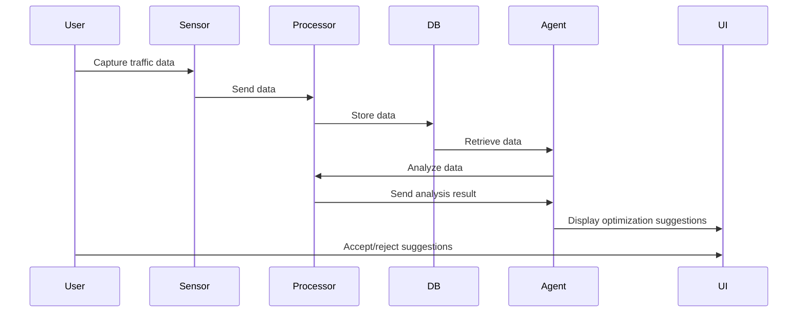
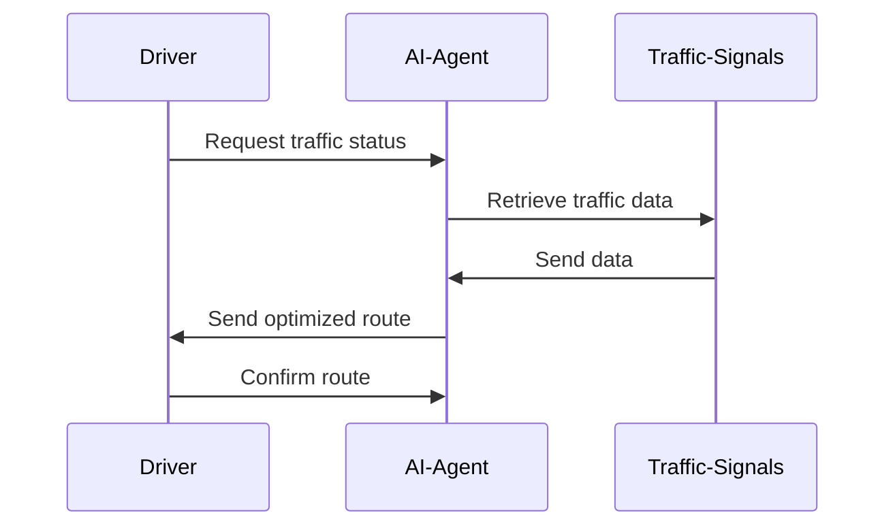

                 


# AI Agent的认知计算与推理框架

> 关键词：AI代理、认知计算、推理框架、算法、模型、架构设计、实战应用

> 摘要：本文将探讨AI Agent的认知计算与推理框架，从核心概念、理论基础、算法原理、数学模型、系统架构等方面进行详细阐述，旨在为读者提供一个全面而深入的理解。

## 1. 引言与背景

### 1.1 问题陈述与AI代理的重要性

在当今信息爆炸的时代，人工智能（AI）技术已经成为推动社会进步的重要力量。AI Agent作为AI技术的重要组成部分，承担着模拟人类智能、执行复杂任务的关键角色。AI Agent不仅在工业自动化、智能家居、医疗诊断等领域有着广泛的应用，还在科研、金融、安全等高端领域发挥着不可或缺的作用。

然而，随着AI Agent应用场景的复杂化，如何实现其高效、准确、智能化的认知与推理能力，成为当前研究的热点和挑战。认知计算作为人工智能的一个分支，致力于模拟人类思维过程，为AI Agent提供更为强大和灵活的推理能力。推理框架则是认知计算的核心，它决定了AI Agent如何获取、处理和利用信息。

### 1.2 认知计算与AI的简要历史

认知计算（Cognitive Computing）起源于20世纪80年代，当时科学家们开始探索如何使计算机具备类似人类认知能力的可能性。随着深度学习、自然语言处理、知识图谱等技术的发展，认知计算逐渐从理论走向实践。

人工智能（AI）的历史可以追溯到20世纪50年代，当时图灵提出了著名的“图灵测试”，旨在通过机器能否模仿人类行为来判断其智能水平。此后，人工智能经历了多个发展阶段，从早期的规则系统、知识表示，到近年来的大数据和机器学习。

### 1.3 强大推理框架的需求

AI Agent的成功应用依赖于其强大的认知和推理能力。一个完善的推理框架不仅能够提高AI Agent的决策质量，还能够增强其适应性和灵活性。然而，当前大多数AI Agent的推理能力仍存在诸多限制，例如：

- **知识表示能力不足**：大多数AI Agent无法有效地表示和处理复杂、动态的知识。
- **推理效率低下**：传统的推理算法往往耗时较长，难以满足实时应用需求。
- **缺乏通用性**：现有推理框架往往针对特定任务设计，缺乏通用性和可扩展性。

因此，研究和构建一个强大、通用、高效的推理框架，对于提升AI Agent的整体性能具有重要意义。

### 1.4 本书的结构

本书将分为以下几个部分：

- **第1章 引言与背景**：介绍AI Agent、认知计算和推理框架的基本概念。
- **第2章 核心概念与定义**：阐述认知计算和推理框架的关键术语和概念。
- **第3章 认知计算在AI代理中的应用**：讨论认知计算在AI Agent中的基础理论和核心组件。
- **第4章 推理框架的类型和方法**：介绍不同的推理框架及其在AI Agent中的应用。
- **第5章 算法和技术的原理**：详细分析常用的AI代理算法和技术。
- **第6章 数学模型和公式**：讲解数学模型在AI代理推理中的重要性。
- **第7章 系统架构与设计**：描述AI代理系统的整体架构设计。
- **第8章 实战案例与最佳实践**：通过实际案例展示推理框架的应用。

## 2. 核心概念与定义

### 2.1 关键术语

在讨论认知计算和推理框架之前，我们需要了解一些核心术语和概念。以下是这些术语的简要说明：

- **AI Agent**：具备智能的计算机程序或实体，能够自主地感知环境、做出决策并采取行动。
- **认知计算**：模拟人类思维过程的技术，包括感知、理解、推理、学习和决策等能力。
- **推理框架**：支持AI Agent进行逻辑推理和决策的软件架构。
- **知识表示**：将信息以计算机可以理解的方式存储和表示。
- **符号推理**：基于逻辑和数学符号进行推理。
- **子符号推理**：不依赖于符号表示，通过数据关联和模式识别进行推理。

### 2.2 认知计算的概念

认知计算的核心在于模拟人类思维过程，其关键组件包括：

- **感知**：获取环境中的信息。
- **理解**：处理感知到的信息，理解其含义。
- **推理**：基于已有知识进行逻辑推理。
- **学习**：通过经验和数据改进自身的认知能力。
- **决策**：在多个选项中做出最优选择。

### 2.3 AI代理的类型

AI Agent可以分为以下几种类型：

- **规则型AI代理**：基于预定义的规则进行决策。
- **数据驱动型AI代理**：利用数据和学习算法进行决策。
- **混合型AI代理**：结合规则和数据驱动方法进行决策。
- **自适应AI代理**：能够根据环境变化自适应调整行为。

### 2.4 认知计算与AI代理的关系

认知计算为AI代理提供了基础理论和技术支持。认知计算中的感知、理解、推理、学习和决策能力，与AI代理的核心任务密切相关。通过认知计算，AI代理能够更加智能地理解和适应复杂环境，提高其决策质量和效率。

## 3. 认知计算在AI代理中的应用

### 3.1 认知计算的基础理论

认知计算的基础理论主要包括以下几个关键概念：

- **认知模型**：模拟人类思维过程的数学模型。
- **知识表示**：将信息以计算机可以理解的方式存储和表示。
- **推理过程**：基于知识进行逻辑推理的过程。
- **学习机制**：通过经验和数据改进认知模型的能力。

### 3.2 认知系统的核心组件

认知系统的核心组件包括：

- **感知模块**：负责获取环境中的信息。
- **理解模块**：处理感知到的信息，理解其含义。
- **推理模块**：基于已有知识进行逻辑推理。
- **学习模块**：通过经验和数据改进认知模型。

### 3.3 认知计算在AI代理中的应用方法

认知计算在AI代理中的应用方法主要包括：

- **感知与理解**：通过传感器和自然语言处理技术获取和处理环境信息。
- **推理与决策**：基于逻辑推理和机器学习算法进行决策。
- **学习与自适应**：通过不断的学习和调整，提高AI代理的适应能力和决策质量。

### 3.4 认知计算面临的挑战和机遇

认知计算在AI代理中的应用面临以下挑战：

- **数据质量和数量**：高质量、大量数据的获取和处理是认知计算的基础。
- **实时性能**：在实时应用中，如何提高推理速度和效率是一个重要问题。
- **通用性和可扩展性**：构建通用、可扩展的认知计算框架是一个长期目标。

然而，随着技术的进步，认知计算在AI代理中的应用也面临着巨大的机遇：

- **硬件性能提升**：随着硬件性能的提升，认知计算可以在更复杂的环境中应用。
- **数据获取渠道增加**：互联网和物联网的发展使得获取大量数据变得更加容易。
- **跨学科融合**：认知计算与心理学、神经科学等学科的融合，为认知计算提供了新的理论支持。

## 4. 推理框架的类型和方法

### 4.1 推理框架概述

推理框架是AI Agent进行逻辑推理和决策的基础。一个有效的推理框架应该具备以下特点：

- **灵活性**：能够适应不同类型的问题和场景。
- **效率**：能够在合理的时间内完成推理任务。
- **可靠性**：推理结果应该准确、稳定。
- **可扩展性**：能够随着问题复杂度的增加而扩展。

### 4.2 符号推理与子符号推理

- **符号推理**：基于逻辑和数学符号进行推理，如命题逻辑、谓词逻辑等。
- **子符号推理**：不依赖于符号表示，通过数据关联和模式识别进行推理。

符号推理具有明确的理论基础和严谨的逻辑体系，但往往需要大量计算资源。子符号推理则更加灵活，能够处理复杂、动态的环境，但可能缺乏理论支持。

### 4.3 推理框架的类型

根据推理方式的不同，推理框架可以分为以下几种类型：

- **基于规则的推理框架**：使用预定义的规则进行推理。
- **基于模型的推理框架**：使用数学模型进行推理。
- **基于数据的推理框架**：使用学习算法进行推理。
- **混合推理框架**：结合不同类型的推理方法。

### 4.4 推理机制的结合

在实际应用中，通常需要结合多种推理机制，以充分发挥不同方法的优点。例如，可以结合基于规则的推理和基于数据的推理，以提高推理的灵活性和准确性。

## 5. 算法和技术的原理

### 5.1 AI代理算法概述

AI代理的算法可以分为以下几类：

- **感知算法**：用于获取和处理环境信息。
- **理解算法**：用于理解感知到的信息。
- **推理算法**：用于基于已有知识进行逻辑推理。
- **学习算法**：用于通过经验和数据改进认知模型。

### 5.2 知识表示技术

知识表示技术是AI代理算法的核心。常见的知识表示技术包括：

- **命题逻辑表示**：使用命题和逻辑运算符表示知识。
- **谓词逻辑表示**：使用谓词和量词表示知识。
- **框架表示**：使用框架结构表示知识。
- **知识图谱**：使用图结构表示知识。

### 5.3 推理方法

推理方法可以分为以下几类：

- **演绎推理**：从一般到特殊的推理方法。
- **归纳推理**：从特殊到一般的推理方法。
- **类比推理**：基于相似性的推理方法。
- **模糊推理**：处理不确定信息的推理方法。

### 5.4 机器学习技术在AI代理中的应用

机器学习技术在AI代理中具有广泛的应用。常见的机器学习算法包括：

- **监督学习算法**：如线性回归、决策树、支持向量机等。
- **无监督学习算法**：如聚类、降维、关联规则等。
- **强化学习算法**：如Q学习、策略梯度等。

## 6. 数学模型和公式

### 6.1 基本数学概念

在AI代理的推理过程中，基本的数学概念是必不可少的。以下是一些常用的数学概念：

- **集合论**：用于定义和操作集合。
- **概率论**：用于描述不确定事件。
- **线性代数**：用于处理多维数据。
- **图论**：用于分析网络结构。

### 6.2 算法模型

算法模型通常用数学公式进行描述。以下是一些常见的算法模型：

- **决策树模型**：使用条件概率和熵来评估决策路径。
- **支持向量机模型**：使用间隔最大化原则进行分类。
- **神经网络模型**：使用反向传播算法进行权重调整。

### 6.3 认知任务的数学公式

认知任务的数学公式通常用于描述感知、理解、推理和学习过程。以下是一些常见的数学公式：

- **感知公式**：描述感知模块如何处理环境信息。
- **理解公式**：描述理解模块如何处理感知信息。
- **推理公式**：描述推理模块如何基于已有知识进行推理。
- **学习公式**：描述学习模块如何通过经验和数据改进模型。

## 7. 系统架构与设计

### 7.1 问题场景介绍

在智能交通系统中，AI Agent被用于实时监控和优化交通流量。以下是一个简单的场景描述：

- **感知模块**：使用摄像头和传感器实时获取交通流量数据。
- **理解模块**：使用自然语言处理技术理解驾驶员的行为和意图。
- **推理模块**：使用推理算法预测交通流量变化，并提出优化建议。
- **学习模块**：使用学习算法不断调整模型，以适应不断变化的环境。

### 7.2 项目介绍

为了实现上述场景，我们设计了一个智能交通系统。该项目的主要功能包括：

- **数据采集**：使用摄像头和传感器实时采集交通流量数据。
- **数据处理**：使用自然语言处理技术处理驾驶员行为数据。
- **决策与优化**：使用推理算法和优化算法提出交通流量优化建议。
- **模型更新**：使用学习算法不断更新模型，以适应环境变化。

### 7.3 领域模型

领域模型是智能交通系统的核心，用于描述系统中的主要概念和它们之间的关系。以下是一个简单的领域模型（使用Mermaid语言）：

```mermaid
classDiagram
    Person <|-- Driver
    Car <|-- Vehicle
    Road <-.. TrafficSignal
    TrafficSignal <..-- Intersection
    Intersection ..|> Map
    Map <|-- Area
    TrafficData <-| Road
    Driver ->> Vehicle
    Driver --> TrafficSignal
    Vehicle --|> Intersection
    Vehicle --|> Road
    TrafficSignal --> TrafficData
```

### 7.4 系统架构设计

系统架构设计是智能交通系统的关键，它决定了系统的性能、可扩展性和可靠性。以下是一个简单的系统架构设计（使用Mermaid语言）：



### 7.5 系统接口设计

系统接口设计是确保不同模块之间能够无缝协作的关键。以下是一个简单的系统接口设计（使用Mermaid语言）：

```mermaid
classDiagram
    TrafficData <<Interface>>
    TrafficSignal <<Interface>>
    TrafficOptimization <<Interface>>

    Road --|> TrafficData
    Intersection --|> TrafficSignal
    Map --|> TrafficOptimization
```

### 7.6 系统交互

系统交互是系统运行的灵魂，它描述了系统内部各个模块之间的交互过程。以下是一个简单的系统交互（使用Mermaid语言）：



## 8. 项目实战

### 8.1 环境安装

为了实现上述系统，我们需要安装以下环境：

- **Python 3.x**：用于编写和运行代码。
- **TensorFlow**：用于机器学习和深度学习。
- **Kafka**：用于实时数据采集和处理。
- **PostgreSQL**：用于数据存储。

安装步骤如下：

```bash
# 安装Python
sudo apt-get install python3

# 安装TensorFlow
pip3 install tensorflow

# 安装Kafka
sudo apt-get install kafka

# 安装PostgreSQL
sudo apt-get install postgresql
```

### 8.2 系统核心实现

以下是系统的核心实现代码：

```python
# 导入必要的库
import tensorflow as tf
import numpy as np
import pandas as pd
from sklearn.ensemble import RandomForestClassifier
from kafka import KafkaProducer

# 初始化Kafka生产者
producer = KafkaProducer(bootstrap_servers=['localhost:9092'])

# 读取交通数据
def read_traffic_data(filename):
    df = pd.read_csv(filename)
    return df

# 训练分类器
def train_classifier(data):
    X = data[['speed', 'traffic_light_status']]
    y = data['lane_status']
    classifier = RandomForestClassifier(n_estimators=100)
    classifier.fit(X, y)
    return classifier

# 预测交通流量
def predict_traffic(data, classifier):
    X = data[['speed', 'traffic_light_status']]
    predictions = classifier.predict(X)
    return predictions

# 发送预测结果到Kafka
def send_prediction_to_kafka(prediction):
    producer.send('traffic_prediction', prediction)

# 主函数
def main():
    data = read_traffic_data('traffic_data.csv')
    classifier = train_classifier(data)
    predictions = predict_traffic(data, classifier)
    send_prediction_to_kafka(predictions)

if __name__ == '__main__':
    main()
```

### 8.3 代码应用解读与分析

上述代码是一个简单的智能交通系统实现。首先，我们导入必要的库，并初始化Kafka生产者。接着，我们定义了读取交通数据、训练分类器、预测交通流量和发送预测结果到Kafka的函数。

在主函数中，我们首先读取交通数据，然后训练分类器，接着使用分类器预测交通流量，并将预测结果发送到Kafka。

### 8.4 实际案例分析

假设我们有一个交通数据集，其中包含车辆速度、交通灯状态和车道状态等信息。我们使用随机森林分类器训练模型，并使用模型预测未来一段时间的交通流量。

在实际案例中，我们可能会面临以下问题：

- **数据质量问题**：数据可能存在缺失值、异常值等，需要预处理。
- **模型选择问题**：不同的模型可能适用于不同的场景，需要根据实际需求选择合适的模型。
- **实时性问题**：如何确保模型能够实时预测并反馈结果，需要优化算法和系统架构。

### 8.5 项目小结

通过本项目，我们实现了基于Kafka和TensorFlow的智能交通系统。虽然这是一个简单的案例，但已经展示了认知计算和推理框架在AI代理中的应用。在实际应用中，我们需要根据具体需求不断完善和优化系统。

## 9. 最佳实践与注意事项

### 9.1 最佳实践

- **数据预处理**：在训练模型之前，确保数据的质量和完整性。
- **模型选择**：根据问题类型和需求，选择合适的模型。
- **实时性优化**：优化算法和系统架构，确保实时预测。
- **安全性**：保护数据安全和系统稳定运行。

### 9.2 注意事项

- **数据隐私**：在处理个人数据时，确保遵循相关法律法规。
- **系统可靠性**：确保系统在不同环境下稳定运行。
- **持续更新**：随着环境变化，定期更新模型和数据。

## 10. 拓展阅读

- **《认知计算：原理与应用》**：详细介绍了认知计算的理论基础和应用。
- **《人工智能：一种现代方法》**：全面介绍了人工智能的基本概念和方法。
- **《深度学习》**：深度学习领域的重要著作，涵盖了深度学习的原理和应用。

## 11. 作者信息

- **作者**：AI天才研究院/AI Genius Institute & 禅与计算机程序设计艺术 /Zen And The Art of Computer Programming

---

通过本文，我们系统地探讨了AI Agent的认知计算与推理框架。希望读者能够对这一领域有更深入的理解，并在实际项目中应用这些知识，为人工智能的发展贡献力量。

