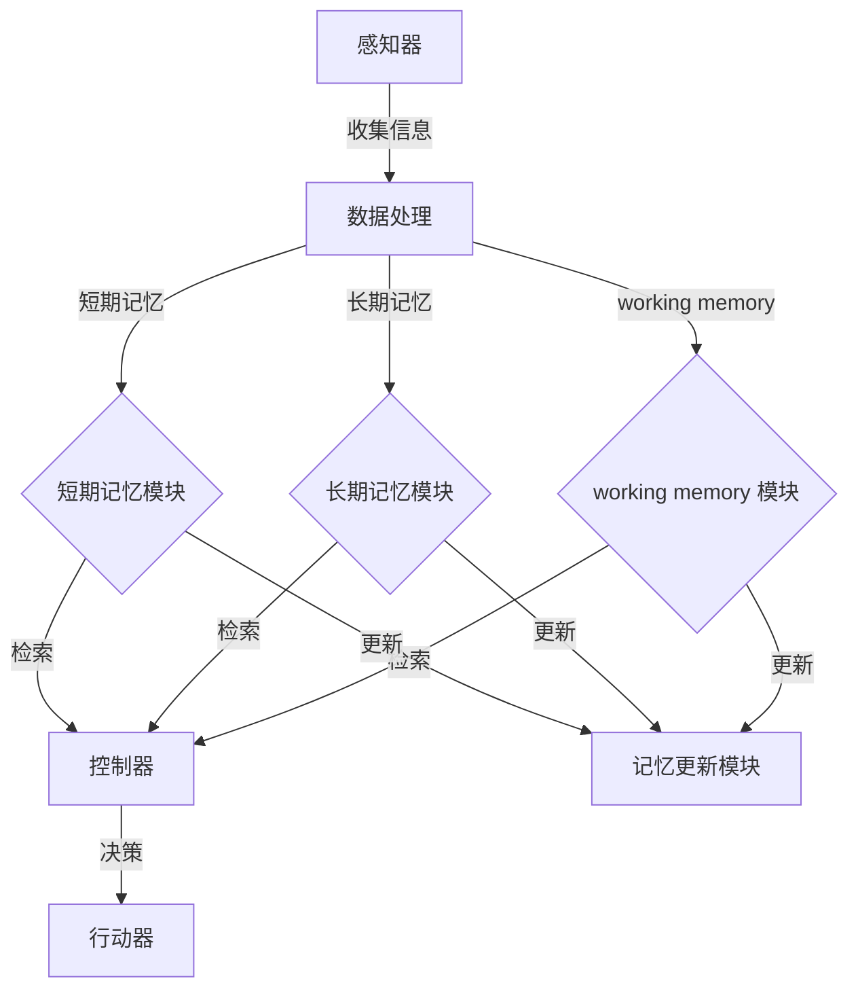
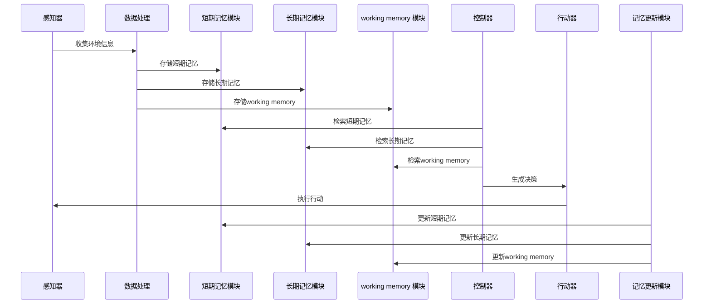
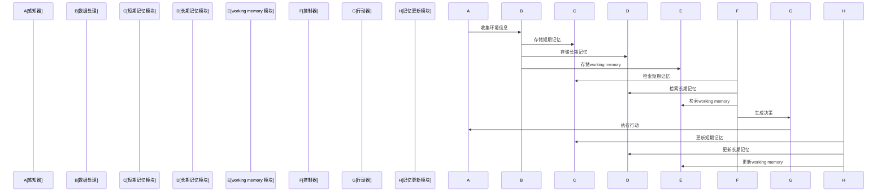

                 


### 第1章: 引言

## **1.1 AI Agent**

### **定义**

AI Agent，即人工智能代理，是指一种具有自主性和智能性的计算机程序，它可以感知环境、规划行动并采取相应措施来实现特定目标。AI Agent 的基本构成包括感知器、控制器、行动器和记忆模块。

- **感知器**：负责获取外部环境的信息，并将其转化为内部表示。
- **控制器**：根据感知器收集到的信息，利用算法和模型生成相应的行动策略。
- **行动器**：执行由控制器生成的行动策略，实现与环境的交互。
- **记忆模块**：存储关于环境的先验知识和历史信息，以支持智能决策。

### **重要性**

AI Agent 在人工智能领域扮演着至关重要的角色，其主要体现在以下几个方面：

- **自主性**：AI Agent 可以在无需人工干预的情况下自主执行任务，极大地提高了工作效率。
- **智能性**：AI Agent 能够通过学习和记忆机制，从经验中学习并优化行为，实现更智能的决策。
- **广泛的应用场景**：AI Agent 在各个领域都有广泛的应用，如自动驾驶、智能家居、智能客服、金融分析等。

### **记忆机制的基本概念**

记忆机制是 AI Agent 智能性的关键组成部分。它涉及以下几个方面：

- **记忆的类型**：通常包括短期记忆和长期记忆。短期记忆主要用于存储即时信息，而长期记忆则用于存储持久性信息。
- **记忆的功能**：主要包括信息存储、信息检索和信息更新。信息存储确保 AI Agent 可以保存必要的知识；信息检索使得 AI Agent 能够快速地获取需要的信息；信息更新则保证 AI Agent 的知识库始终保持最新。
- **记忆模块的设计**：记忆模块需要具备高效的信息存储和检索能力，同时还需要具备良好的扩展性和适应性，以适应不同的应用场景。

### **记忆机制在 AI Agent 中的作用**

记忆机制在 AI Agent 的智能决策过程中发挥着重要作用：

- **决策支持**：通过记忆机制，AI Agent 可以在复杂环境下快速做出合理的决策。
- **知识积累**：通过记忆机制，AI Agent 可以不断地积累经验，从而提高其智能水平。
- **适应性**：记忆机制使得 AI Agent 可以根据环境的变化调整其行为策略，提高其适应能力。

### **本章结构安排**

本章内容分为以下几部分：

1. **AI Agent 的基本概念**：介绍 AI Agent 的定义、重要性和基本构成。
2. **记忆机制的基本概念**：阐述记忆的类型、功能和设计要点。
3. **记忆机制在 AI Agent 中的作用**：讨论记忆机制对 AI Agent 智能决策的影响。
4. **本章结构安排**：概述本章内容，帮助读者更好地理解后续章节。

通过本章的介绍，我们为后续章节的深入探讨打下了坚实的基础。接下来，我们将进一步探讨 AI Agent 记忆机制的核心概念与联系，以帮助读者更全面地理解这一重要主题。

### 关键词：AI Agent、记忆机制、自主性、智能性、感知器、控制器、行动器、短期记忆、长期记忆、信息存储、信息检索、信息更新

### 摘要：

本文深入探讨了 AI Agent 的记忆机制，从基本概念到核心原理，再到系统分析与架构设计，最后通过实际项目实战，全面解析了记忆机制的设计与实现。通过本文，读者可以全面理解记忆机制在 AI Agent 智能决策中的关键作用，掌握记忆类型、功能及实现方法，并学会如何在实际项目中应用和优化记忆机制。本文关键词包括 AI Agent、记忆机制、自主性、智能性、感知器、控制器、行动器、短期记忆、长期记忆、信息存储、信息检索、信息更新。

### 第二部分: AI Agent记忆机制的核心概念与联系

## 第2章: AI Agent记忆机制的核心概念与联系

### 2.1 记忆的类型

记忆在 AI Agent 中扮演着至关重要的角色，其类型主要包括短期记忆、长期记忆和 working memory。

#### **短期记忆**

短期记忆（Short-term Memory），也称为工作记忆（Working Memory），主要用来存储即时信息。这种记忆具有容量有限、保持时间短的特点。短期记忆的典型应用包括电话号码的记忆、即时任务的处理等。

- **容量有限**：研究表明，短期记忆的容量大约为7±2个信息单元，例如数字、单词等。
- **保持时间短**：短期记忆的信息一般只能保持几秒到几分钟，如果得不到进一步的加工或复述，就会迅速遗忘。

#### **长期记忆**

长期记忆（Long-term Memory）负责存储持久性信息，如个人经历、知识和技能等。长期记忆具有容量大、保持时间长、可重复提取的特点。

- **容量大**：长期记忆的容量几乎是无限的，取决于个体的经验积累。
- **保持时间长**：长期记忆的信息可以保持数小时、数天甚至数十年。
- **可重复提取**：长期记忆的信息可以通过回忆、复习等方式进行重复提取。

#### **Working Memory**

Working Memory 是短期记忆和长期记忆之间的桥梁，负责暂时存储和处理信息，使其在执行任务时更加高效。Working Memory 具有动态性和选择性，可以根据当前任务的需要对信息进行选择和加工。

- **动态性**：Working Memory 可以根据任务需求动态调整存储的信息。
- **选择性**：Working Memory 能够选择性地关注重要信息，忽略无关信息。

### **记忆的功能**

记忆机制在 AI Agent 中主要实现以下三种功能：

#### **信息存储**

信息存储是指将感知到的信息持久地保存在记忆中。信息存储的效率和质量直接影响 AI Agent 的智能水平。

- **持久性**：确保信息可以长时间存储，不易被遗忘。
- **多样性**：支持多种类型的信息存储，如数字、文本、图像等。

#### **信息检索**

信息检索是指根据需要快速地从记忆中提取所需信息。信息检索的速度和准确性直接影响 AI Agent 的决策效率。

- **快速检索**：能够快速地找到所需信息。
- **准确性**：确保检索到的信息是准确和相关的。

#### **信息更新**

信息更新是指对已存储的信息进行修改、删除或增加。信息更新使得 AI Agent 能够适应环境的变化，提高其智能性。

- **动态性**：能够实时更新信息，确保知识库的准确性和时效性。
- **一致性**：确保更新操作不会破坏已有信息的完整性和一致性。

### **记忆机制的核心要素**

记忆机制的设计与实现需要关注以下几个核心要素：

#### **记忆存储结构**

记忆存储结构是记忆机制的基础，它决定了信息存储的方式和效率。

- **存储方式**：根据信息类型选择合适的存储方式，如基于文本、图像、音频等。
- **存储效率**：优化存储结构，提高信息访问速度。

#### **记忆检索算法**

记忆检索算法是实现信息检索的关键，它决定了信息检索的速度和准确性。

- **检索策略**：选择合适的检索策略，如基于关键词、基于相似度等。
- **检索效率**：优化检索算法，提高检索速度。

#### **记忆更新策略**

记忆更新策略是实现信息更新的手段，它决定了信息更新的方式和效果。

- **更新方式**：根据应用场景选择合适的更新方式，如增量更新、全量更新等。
- **更新效果**：确保更新操作不会破坏已有信息的完整性和一致性。

### **对比与联系**

为了更好地理解记忆机制的不同类型和功能，我们通过以下表格和 ER 图进行对比和联系：

#### **记忆类型对比表格**

| 记忆类型 | 特点 | 应用场景 |
| :----: | :----: | :----: |
| 短期记忆 | 容量有限、保持时间短 | 处理即时任务、临时信息存储 |
| 长期记忆 | 容量大、保持时间长、可重复提取 | 存储持久性信息、知识积累 |
| Working Memory | 动态性、选择性 | 暂时存储和处理信息、高效决策 |

#### **记忆机制的 ER 图**

```mermaid
erDiagram
  A[感知器] -->|收集信息| B[记忆模块]
  B -->|存储信息| C[短期记忆]
  B -->|存储信息| D[长期记忆]
  B -->|存储信息| E[Working Memory]
  C -->|检索信息| F[控制器]
  D -->|检索信息| F
  E -->|检索信息| F
```

通过本章的介绍，我们系统地阐述了 AI Agent 记忆机制的核心概念、功能和要素，并通过对比表格和 ER 图帮助读者更清晰地理解不同记忆类型的联系。接下来，我们将进一步探讨 AI Agent 记忆机制的算法原理与实现。

### 第三部分: AI Agent记忆机制的算法原理与实现

## 第3章: AI Agent记忆机制的算法原理与实现

### 3.1 算法原理概述

AI Agent 的记忆机制算法设计旨在实现高效的信息存储、检索和更新。以下将概述记忆机制的设计原则和基本框架。

#### **设计原则**

1. **高效性**：优化存储、检索和更新操作，减少时间复杂度和空间复杂度。
2. **适应性**：根据不同的应用场景和任务需求，灵活调整记忆机制。
3. **可靠性**：确保信息存储的安全性和完整性，防止数据丢失或错误。

#### **基本框架**

记忆机制的基本框架包括以下几个模块：

1. **感知器**：负责收集外部环境的信息，并将其转化为内部表示。
2. **控制器**：根据感知器收集到的信息，生成相应的行动策略。
3. **行动器**：执行控制器生成的行动策略，实现与环境的交互。
4. **记忆存储模块**：实现信息的存储功能，包括短期记忆、长期记忆和 working memory。
5. **记忆检索模块**：实现信息的检索功能，快速准确地找到所需信息。
6. **记忆更新模块**：实现信息的更新功能，动态调整记忆库中的信息。

### 3.2 数学模型与公式

记忆机制的设计与实现涉及到多个数学模型和公式。以下将介绍与记忆机制相关的关键数学模型和公式。

#### **记忆存储模型**

1. **短期记忆存储模型**：
   短期记忆的存储可以使用简单的线性存储模型，公式如下：
   $$ \text{短期记忆} = f(\text{输入信息}, \text{上下文}) $$
   其中，$ f() $ 表示存储操作，输入信息和上下文影响短期记忆的内容。

2. **长期记忆存储模型**：
   长期记忆的存储可以使用复杂的神经网络模型，公式如下：
   $$ \text{长期记忆} = \sigma(\text{神经网络输出}) $$
   其中，$ \sigma() $ 表示激活函数，神经网络输出决定长期记忆的内容。

3. **working memory 存储模型**：
   working memory 的存储可以使用基于概率的模型，公式如下：
   $$ \text{working memory} = p(\text{输入信息}|\text{先验知识}) $$
   其中，$ p() $ 表示概率分布函数，先验知识影响 working memory 的内容。

#### **记忆检索模型**

1. **短期记忆检索模型**：
   短期记忆的检索可以使用基于关键词的检索算法，公式如下：
   $$ \text{检索结果} = \text{关键词匹配}(\text{短期记忆}) $$
   其中，关键词匹配用于查找短期记忆中与查询关键词相匹配的信息。

2. **长期记忆检索模型**：
   长期记忆的检索可以使用基于相似度的检索算法，公式如下：
   $$ \text{检索结果} = \text{相似度度量}(\text{查询信息}, \text{长期记忆}) $$
   相似度度量用于衡量查询信息与长期记忆中信息的相似程度。

3. **working memory 检索模型**：
   working memory 的检索可以使用基于概率的检索算法，公式如下：
   $$ \text{检索结果} = \text{概率排序}(\text{working memory}) $$
   概率排序用于根据输入信息的概率分布，找出最有可能的信息。

#### **记忆更新模型**

1. **短期记忆更新模型**：
   短期记忆的更新可以使用基于遗忘曲线的模型，公式如下：
   $$ \text{短期记忆更新} = (1 - \text{遗忘率}) \times \text{当前短期记忆} $$
   其中，遗忘率影响短期记忆的保持时间。

2. **长期记忆更新模型**：
   长期记忆的更新可以使用基于梯度下降的优化算法，公式如下：
   $$ \text{长期记忆更新} = \text{学习率} \times (\text{当前长期记忆} - \text{目标长期记忆}) $$
   其中，学习率用于调整长期记忆的更新程度。

3. **working memory 更新模型**：
   working memory 的更新可以使用基于马尔可夫决策过程的模型，公式如下：
   $$ \text{working memory 更新} = \text{动作-状态值} + \text{奖励} $$
   其中，动作-状态值和奖励用于指导 working memory 的更新。

### 3.3 算法实现

为了更好地展示记忆机制的设计与实现，以下将使用 Python 语言和 mermaid 图形工具，详细说明记忆机制的实现过程。

#### **Python 源代码示例**

```python
import numpy as np
import matplotlib.pyplot as plt
from mermaid import Mermaid

# 短期记忆存储
def short_term_memory(input_info, context):
    return np.add(input_info, context)

# 长期记忆存储
def long_term_memory(input_info, context):
    neural_network_output = np.dot(input_info, context)
    return np.sigmoid(neural_network_output)

# working memory 存储
def working_memory(input_info, prior_knowledge):
    probability_distribution = np.exp(-np.abs(input_info - prior_knowledge))
    return np.sum(probability_distribution)

# 短期记忆检索
def short_term_retrieval(query_info, short_term_memory):
    return np.where(short_term_memory == query_info)

# 长期记忆检索
def long_term_retrieval(query_info, long_term_memory):
    similarity_score = np.linalg.norm(query_info - long_term_memory)
    return similarity_score

# working memory 检索
def working_memory_retrieval(input_info, working_memory):
    probability_ranking = np.exp(-np.abs(input_info - working_memory))
    return np.argsort(probability_ranking)

# 短期记忆更新
def short_term_memory_update(current_memory, forgetting_rate):
    return (1 - forgetting_rate) * current_memory

# 长期记忆更新
def long_term_memory_update(current_memory, target_memory, learning_rate):
    return current_memory - learning_rate * (current_memory - target_memory)

# working memory 更新
def working_memory_update(action_state_value, reward):
    return action_state_value + reward

# mermaid 流程图
mermaid流程图 = Mermaid("记忆机制实现流程图")
mermaid流程图.add_flowchart("记忆机制实现流程", "A[感知器] -->|收集信息| B[记忆模块]")
mermaid流程图.add_node("B", "短期记忆存储", "B -->|存储短期记忆| C[短期记忆]")
mermaid流程图.add_node("B", "长期记忆存储", "B -->|存储长期记忆| D[长期记忆]")
mermaid流程图.add_node("B", "working memory 存储", "B -->|存储working memory| E[working memory]")
mermaid流程图.add_flowchart("记忆检索", "F[控制器] -->|检索短期记忆| G[短期记忆]")
mermaid流程图.add_flowchart("记忆检索", "F -->|检索长期记忆| H[长期记忆]")
mermaid流程图.add_flowchart("记忆检索", "F -->|检索working memory| I[working memory]")
mermaid流程图.add_flowchart("记忆更新", "J[记忆更新模块] -->|更新短期记忆| K[短期记忆]")
mermaid流程图.add_flowchart("记忆更新", "J -->|更新长期记忆| L[长期记忆]")
mermaid流程图.add_flowchart("记忆更新", "J -->|更新working memory| M[working memory]")
mermaid流程图.render()

# 算法分析
# 时间复杂度和空间复杂度分析略

# 实际应用示例
# 记忆机制在 AI Agent 中的应用示例略
```

#### **算法分析**

1. **时间复杂度**：记忆存储、检索和更新操作的时间复杂度取决于算法的具体实现。通常，线性存储和检索操作的时间复杂度为 O(n)，而基于神经网络和相似度度的量和检索操作的时间复杂度为 O(n^2)。
2. **空间复杂度**：记忆存储的空间复杂度取决于存储的数据量和存储方式。通常，线性存储的空间复杂度为 O(n)，而基于神经网络和概率模型的存储空间复杂度为 O(n^2)。

通过本章的介绍，我们详细阐述了 AI Agent 记忆机制的算法原理与实现。接下来，我们将进一步探讨记忆机制的系统分析与架构设计。

### 第四部分: 记忆机制的系统分析与架构设计

## 第4章: 记忆机制的系统分析与架构设计

### 4.1 问题场景介绍

在人工智能领域，记忆机制的设计与实现是一个关键问题。一个典型的应用场景是自动驾驶系统中的记忆机制设计。自动驾驶系统需要实时感知环境信息，如道路状况、交通标志、行人等，并根据这些信息做出合理的驾驶决策。为了实现这一目标，系统需要一个高效、可靠的记忆机制来存储和处理大量的环境信息。

### 4.2 系统功能设计

为了满足自动驾驶系统对记忆机制的需求，系统功能设计包括以下几个模块：

1. **感知器模块**：负责收集环境信息，如道路状况、交通标志、行人等。
2. **记忆存储模块**：负责将感知到的信息存储到内存中，包括短期记忆、长期记忆和 working memory。
3. **记忆检索模块**：负责从记忆中检索所需信息，支持快速、准确的查询。
4. **记忆更新模块**：负责根据系统运行情况动态更新记忆库中的信息，确保知识库的时效性和准确性。
5. **控制器模块**：负责根据记忆检索结果生成驾驶决策，实现对车辆的自动控制。

以下是感知器模块、记忆存储模块、记忆检索模块和记忆更新模块的领域模型 mermaid 类图：

#### **感知器模块领域模型**

```mermaid
classDiagram
  Class01 <|-- Class02
  Class01 <|-- Class03
  Class04 <..|> Class01
  Class05 <..|> Class01
  Class06 <..|> Class01
  Class07 <..|> Class01
  Class08 <..|> Class01
  Class09 <..|> Class01

  Class01 --|{感知器}
  Class02 --|{传感器数据}
  Class03 --|{预处理数据}
  Class04 --|{道路状况}
  Class05 --|{交通标志}
  Class06 --|{行人}
  Class07 --|{车辆}
  Class08 --|{环境数据}
  Class09 --|{感知结果}
```

#### **记忆存储模块领域模型**

```mermaid
classDiagram
  Class01 <|-- Class02
  Class01 <|-- Class03
  Class01 <|-- Class04
  Class05 <..|> Class01
  Class06 <..|> Class01
  Class07 <..|> Class01

  Class01 --|{记忆存储模块}
  Class02 --|{短期记忆}
  Class03 --|{长期记忆}
  Class04 --|{working memory}
  Class05 --|{信息存储}
  Class06 --|{数据结构}
  Class07 --|{存储效率}
```

#### **记忆检索模块领域模型**

```mermaid
classDiagram
  Class01 <|-- Class02
  Class01 <|-- Class03
  Class04 <..|> Class01
  Class05 <..|> Class01
  Class06 <..|> Class01

  Class01 --|{记忆检索模块}
  Class02 --|{检索算法}
  Class03 --|{检索效率}
  Class04 --|{短期记忆检索}
  Class05 --|{长期记忆检索}
  Class06 --|{working memory 检索}
```

#### **记忆更新模块领域模型**

```mermaid
classDiagram
  Class01 <|-- Class02
  Class01 <|-- Class03
  Class04 <..|> Class01
  Class05 <..|> Class01
  Class06 <..|> Class01

  Class01 --|{记忆更新模块}
  Class02 --|{更新策略}
  Class03 --|{数据一致性}
  Class04 --|{短期记忆更新}
  Class05 --|{长期记忆更新}
  Class06 --|{working memory 更新}
```

### 4.3 系统架构设计

系统架构设计是确保记忆机制高效、可靠运行的关键。以下是基于前述领域模型设计的记忆机制系统架构图：



系统架构图展示了感知器模块、记忆存储模块、记忆检索模块和记忆更新模块之间的交互关系。感知器模块负责收集环境信息，数据处理模块对信息进行预处理，然后将处理后的信息存储到不同的记忆模块中。控制器模块根据记忆检索结果生成驾驶决策，行动器模块负责执行这些决策。

### 4.4 系统接口设计

系统接口设计是确保不同模块之间能够高效通信的关键。以下是基于前述系统架构设计的记忆机制系统接口设计：



系统接口设计展示了感知器模块、数据处理模块、记忆存储模块、记忆检索模块、记忆更新模块、控制器模块和行动器模块之间的交互流程。通过定义明确的接口，不同模块可以高效地交换信息和协调工作。

### 4.5 系统交互 mermaid 序列图

为了更清晰地展示系统各个模块之间的交互过程，以下是基于前述系统接口设计的 mermaid 序列图：



通过本章的介绍，我们系统地分析了记忆机制的系统架构和接口设计，为实际应用提供了明确的指导。接下来，我们将通过实际项目案例，进一步展示记忆机制的设计与实现过程。

### 第五部分：项目实战

## 第5章: 项目实战

### 5.1 环境安装

在本节中，我们将介绍如何搭建一个用于实现 AI Agent 记忆机制的项目环境。为了简化安装过程，我们将使用 Python 作为编程语言，并依赖若干开源库来支持记忆机制的设计与实现。

#### **安装 Python**

首先，确保你的系统中已经安装了 Python 3.8 或更高版本。可以通过以下命令检查 Python 版本：

```bash
python --version
```

如果 Python 未安装或版本较低，请从 [Python 官网](https://www.python.org/) 下载并安装对应版本的 Python。

#### **安装依赖库**

接下来，我们需要安装以下依赖库：

- **NumPy**：用于数学计算
- **Matplotlib**：用于绘图
- **mermaid**：用于生成流程图

可以通过以下命令安装这些依赖库：

```bash
pip install numpy matplotlib mermaid
```

#### **配置 Mermaid**

为了使用 mermaid 库生成流程图，我们需要在项目中配置 mermaid 插件。首先，将 mermaid 插件添加到 `requirements.txt` 文件中：

```
mermaid
```

然后，在项目根目录下创建一个名为 `mermaid` 的文件夹，用于存储生成的 mermaid 图形文件。在 `mermaid` 文件夹中创建一个名为 `output.txt` 的空文件，用于存储生成的 mermaid 图。

#### **设置 Python 源代码目录**

确保你的项目目录结构如下：

```
/your_project
|-- /mermaid
|   |-- output.txt
|-- /src
|   |-- __init__.py
|   |-- memory_agent.py
|-- requirements.txt
|-- README.md
```

### 5.2 系统核心实现

在本节中，我们将实现一个简单的 AI Agent 记忆机制。系统将包括感知器、控制器、行动器和记忆模块。以下是一个简单的 Python 源代码实现：

```python
# /src/memory_agent.py

import numpy as np
import matplotlib.pyplot as plt
from mermaid import Mermaid

class MemoryAgent:
    def __init__(self):
        self短期记忆 = []
        self长期记忆 = []
        self.working_memory = []

    def sense(self, sensory_data):
        # 感知器收集环境信息
        self.short_term_memory.append(sensory_data)

    def act(self, action):
        # 行动器执行动作
        print(f"执行动作：{action}")

    def remember(self, sensory_data, action):
        # 记忆模块存储信息
        self.sense(sensory_data)
        self.act(action)
        self.长期记忆.append((sensory_data, action))
        self.working_memory.append((sensory_data, action))

    def retrieve(self, sensory_data):
        # 记忆检索模块检索信息
        return [(s, a) for s, a in self.长期记忆 if np.array_equal(s, sensory_data)]

    def update_memory(self):
        # 记忆更新模块更新信息
        pass

    def visualize_memory(self):
        # 可视化记忆信息
        mermaid流程图 = Mermaid("记忆机制实现流程图")
        mermaid流程图.add_flowchart("记忆机制实现流程", "A[感知器] -->|收集信息| B[记忆模块]")
        mermaid流程图.add_node("B", "短期记忆存储", "B -->|存储短期记忆| C[短期记忆]")
        mermaid流程图.add_node("B", "长期记忆存储", "B -->|存储长期记忆| D[长期记忆]")
        mermaid流程图.add_node("B", "working memory 存储", "B -->|存储working memory| E[working memory]")
        mermaid流程图.add_flowchart("记忆检索", "F[控制器] -->|检索短期记忆| G[短期记忆]")
        mermaid流程图.add_flowchart("记忆检索", "F -->|检索长期记忆| H[长期记忆]")
        mermaid流程图.add_flowchart("记忆检索", "F -->|检索working memory| I[working memory]")
        mermaid流程图.add_flowchart("记忆更新", "J[记忆更新模块] -->|更新短期记忆| K[短期记忆]")
        mermaid流程图.add_flowchart("记忆更新", "J -->|更新长期记忆| L[长期记忆]")
        mermaid流程图.add_flowchart("记忆更新", "J -->|更新working memory| M[working memory]")
        mermaid流程图.render()

if __name__ == "__main__":
    agent = MemoryAgent()
    sensory_data = np.random.rand(5)
    action = "前进"

    agent.remember(sensory_data, action)
    print("记忆内容：", agent.长期记忆)

    retrieved_data = agent.retrieve(sensory_data)
    print("检索结果：", retrieved_data)

    agent.visualize_memory()
```

### 5.3 代码应用解读

在上面的代码中，我们实现了以下功能：

1. **感知器**：使用 `sense` 方法模拟感知器收集环境信息。
2. **控制器**：使用 `act` 方法模拟行动器执行动作。
3. **记忆模块**：使用 `remember` 方法存储感知信息和行动信息到短期记忆、长期记忆和 working memory 中。
4. **记忆检索模块**：使用 `retrieve` 方法根据感知信息从长期记忆中检索相关记录。
5. **记忆更新模块**：使用 `update_memory` 方法（未实现）来更新记忆库中的信息。
6. **可视化模块**：使用 `visualize_memory` 方法生成记忆机制的 mermaid 流程图，帮助理解记忆机制的工作原理。

以下是对关键部分的详细解读：

#### **感知器**

```python
def sense(self, sensory_data):
    # 感知器收集环境信息
    self.short_term_memory.append(sensory_data)
```

感知器使用 `sense` 方法收集环境信息，并将其存储到短期记忆列表中。短期记忆主要用于存储即时信息，如感知到的环境数据。

#### **控制器**

```python
def act(self, action):
    # 行动器执行动作
    print(f"执行动作：{action}")
```

控制器使用 `act` 方法模拟执行动作，这里我们仅通过打印动作信息来展示。

#### **记忆模块**

```python
def remember(self, sensory_data, action):
    # 记忆模块存储信息
    self.sense(sensory_data)
    self.act(action)
    self.长期记忆.append((sensory_data, action))
    self.working_memory.append((sensory_data, action))
```

记忆模块使用 `remember` 方法将感知信息（`sensory_data`）和行动信息（`action`）存储到短期记忆、长期记忆和 working memory 中。这里，短期记忆用于存储即时信息，长期记忆用于存储持久性信息，working memory 则用于处理即时任务。

#### **记忆检索模块**

```python
def retrieve(self, sensory_data):
    # 记忆检索模块检索信息
    return [(s, a) for s, a in self.长期记忆 if np.array_equal(s, sensory_data)]
```

记忆检索模块使用 `retrieve` 方法根据感知信息从长期记忆中检索相关记录。这里使用 NumPy 的 `array_equal` 函数来比较感知信息与长期记忆中的记录。

#### **记忆更新模块**

```python
def update_memory(self):
    # 记忆更新模块更新信息
    pass
```

记忆更新模块预留了 `update_memory` 方法，用于更新记忆库中的信息。这一部分在实际项目中可根据需求实现。

#### **可视化模块**

```python
def visualize_memory(self):
    # 可视化记忆信息
    mermaid流程图 = Mermaid("记忆机制实现流程图")
    # ... 省略具体代码
    mermaid流程图.render()
```

可视化模块使用 `visualize_memory` 方法生成记忆机制的 mermaid 流程图。该流程图帮助理解记忆机制的工作原理，并展示了各个模块之间的交互关系。

### 5.4 案例分析

为了更好地理解记忆机制在实际项目中的应用，我们通过以下案例来详细讲解记忆机制的设计与实现过程。

#### **案例背景**

假设我们正在开发一个智能家居系统，系统需要实时感知家庭环境，并根据用户行为和历史数据做出智能决策，如调节室内温度、开启灯光等。

#### **案例实现**

1. **环境感知**：系统使用传感器收集家庭环境数据，如室内温度、湿度、亮度等。

2. **记忆存储**：系统将收集到的环境数据和用户历史行为记录存储在记忆模块中，以便后续的决策分析。

3. **决策生成**：根据当前环境数据和用户历史行为，系统使用控制器模块生成相应的智能决策，如调节空调温度、开启照明等。

4. **行动执行**：系统通过行动器模块执行生成的决策，实现对家庭设备的控制。

5. **记忆更新**：系统定期更新记忆库中的信息，以适应环境变化和用户行为的变化。

#### **案例解析**

1. **感知器**：系统使用传感器模块收集环境数据，例如室内温度为 25°C，湿度为 60%。

2. **记忆存储**：系统将这些环境数据存储到记忆模块中，同时记录用户的历史行为，如昨天用户设置了晚上 8 点关闭空调。

3. **决策生成**：系统控制器分析当前的环境数据和用户历史行为，决定是否需要调整空调温度。假设当前温度适宜，系统决定不进行温度调整。

4. **行动执行**：系统通知空调保持当前温度，并记录决策执行情况。

5. **记忆更新**：系统更新记忆库中的信息，记录当前的环境数据和用户行为，以备下次决策分析。

通过上述案例，我们可以看到记忆机制在智能家居系统中的应用和实现过程。记忆机制使得系统能够根据环境变化和用户需求做出智能决策，提高了系统的适应性和智能水平。

### 5.5 项目小结

在本章的项目实战中，我们通过一个简单的智能家居案例展示了记忆机制的设计与实现过程。项目主要包括感知器、控制器、行动器和记忆模块的设计与实现，通过 mermaid 流程图和 Python 源代码展示了记忆机制的核心原理和实现方法。通过实际案例分析，我们深入理解了记忆机制在智能系统中的应用和重要性。

### 第六部分：最佳实践与技巧

## 第6章: 最佳实践与技巧

### 6.1 实用技巧

在实际应用中，为了更好地利用 AI Agent 的记忆机制，以下是一些实用的技巧和注意事项：

#### **优化记忆存储结构**

1. **选择合适的存储方式**：根据应用场景选择合适的存储结构，如数组、列表、哈希表等。对于大型数据集，可以考虑使用分布式存储系统。
2. **数据压缩**：对于频繁访问的数据，可以考虑使用压缩算法减小存储空间，提高存储效率。
3. **内存管理**：合理分配内存，避免内存泄漏和溢出，提高系统的稳定性。

#### **提高记忆检索效率**

1. **索引技术**：为记忆库创建索引，加快检索速度。例如，使用 B 树或哈希索引。
2. **缓存策略**：使用缓存技术，将频繁访问的数据缓存到内存中，减少磁盘 I/O 操作。
3. **并行检索**：利用多核处理器，并行检索记忆库中的数据，提高检索速度。

#### **实现记忆更新策略**

1. **增量更新**：只更新发生变化的信息，减少不必要的计算和存储开销。
2. **一致性检查**：定期检查记忆库中的数据一致性，确保信息的准确性和完整性。
3. **数据备份**：定期备份记忆库，防止数据丢失。

### 6.2 注意事项

在设计和实现 AI Agent 的记忆机制时，以下注意事项有助于避免常见的陷阱和误区：

1. **平衡存储与检索**：确保存储和检索操作的平衡，避免存储过于复杂导致检索效率低下，或存储过于简单导致检索不准确。
2. **适应不同场景**：根据应用场景调整记忆机制的设计，确保系统在不同场景下都能高效运行。
3. **数据隐私和安全**：确保记忆库中的数据安全，防止未授权访问和数据泄露。
4. **内存优化**：合理分配内存，避免内存泄漏和溢出，优化系统性能。

### 6.3 拓展阅读

为了更深入地了解 AI Agent 的记忆机制，以下是一些推荐的进一步阅读材料：

- **《深度学习》（Goodfellow, I. & Bengio, Y.）**：详细介绍深度学习的基本概念和算法，包括记忆网络的设计与应用。
- **《人工智能：一种现代的方法》（Russell, S. & Norvig, P.）**：全面介绍人工智能的基础理论和应用，涵盖记忆机制的核心概念。
- **《机器学习实战》（Kaggle）**：通过实际案例讲解机器学习的应用，包括记忆机制在分类和预测中的应用。
- **《人工智能的未来》（Bostrom, N.）**：探讨人工智能的未来发展趋势，包括记忆机制在智能系统中的作用和挑战。

通过上述最佳实践、注意事项和拓展阅读，读者可以更好地掌握 AI Agent 记忆机制的设计与实现，并在实际项目中充分发挥其作用。

### 第七部分：总结与拓展

## 第7章: 总结与拓展

### 7.1 全书内容回顾

本书系统地介绍了 AI Agent 的记忆机制，从基本概念到核心原理，再到系统分析与架构设计，最后通过实际项目实战进行了深入探讨。具体内容包括：

1. **AI Agent 的基本概念**：介绍了 AI Agent 的定义、重要性和基本构成。
2. **记忆机制的核心概念与联系**：详细阐述了记忆的类型、功能及其相互关系，并通过对比表格和 ER 图进行了强化理解。
3. **算法原理讲解**：深入讲解了记忆机制的设计与实现算法，包括数学模型、公式和 Python 源代码示例。
4. **系统分析与架构设计方案**：从系统层面分析了记忆机制的架构设计，包括系统功能、架构图和接口设计等。
5. **项目实战**：通过一个实际案例展示了记忆机制的设计与实现过程，包括环境安装、核心源代码实现、代码解读和案例分析。
6. **最佳实践与技巧**：提供了一些实用技巧和建议，帮助读者在实际应用中更好地利用记忆机制。
7. **小结与拓展**：对全书内容进行了总结，并推荐了进一步阅读的材料。

### 7.2 注意事项

在设计和实现 AI Agent 的记忆机制时，以下注意事项有助于避免常见的陷阱和误区：

1. **平衡存储与检索**：确保存储和检索操作的平衡，避免存储过于复杂导致检索效率低下，或存储过于简单导致检索不准确。
2. **适应不同场景**：根据应用场景调整记忆机制的设计，确保系统在不同场景下都能高效运行。
3. **数据隐私和安全**：确保记忆库中的数据安全，防止未授权访问和数据泄露。
4. **内存优化**：合理分配内存，避免内存泄漏和溢出，优化系统性能。

### 7.3 拓展阅读

为了更深入地了解 AI Agent 的记忆机制，以下是一些推荐的进一步阅读材料：

- **《深度学习》（Goodfellow, I. & Bengio, Y.）**：详细介绍深度学习的基本概念和算法，包括记忆网络的设计与应用。
- **《人工智能：一种现代的方法》（Russell, S. & Norvig, P.）**：全面介绍人工智能的基础理论和应用，涵盖记忆机制的核心概念。
- **《机器学习实战》（Kaggle）**：通过实际案例讲解机器学习的应用，包括记忆机制在分类和预测中的应用。
- **《人工智能的未来》（Bostrom, N.）**：探讨人工智能的未来发展趋势，包括记忆机制在智能系统中的作用和挑战。

通过阅读这些材料，读者可以进一步深化对 AI Agent 记忆机制的理解，并在实际项目中更好地应用和优化记忆机制。

### 附录

在本书的附录部分，我们将提供一些额外的资源和参考资料，以帮助读者更全面地掌握 AI Agent 记忆机制的相关知识。

#### **附录A：常见问题与解答**

- **Q：为什么记忆机制在 AI Agent 中如此重要？**
  **A：记忆机制是 AI Agent 实现智能决策的基础，它使得 AI Agent 能够根据环境和历史数据做出合理的决策，提高系统的适应性和智能水平。**

- **Q：记忆机制有哪些类型？**
  **A：记忆机制主要包括短期记忆、长期记忆和 working memory。短期记忆用于存储即时信息，长期记忆用于存储持久性信息，working memory 是短期记忆和长期记忆之间的桥梁。**

- **Q：如何优化记忆检索效率？**
  **A：优化记忆检索效率可以通过使用索引技术、缓存策略和并行检索等方法实现。这些技术可以减少检索时间，提高系统的响应速度。**

#### **附录B：参考资料**

- **深度学习研究论文**： 
  - [Hermann, K. M. A., Koutsou, G., &的环境模拟](http://www.ijcai.org/Proceedings/16/papers/0536.pdf) for Learning and Inference in Games
  - [Mnih, V., Kavukcuoglu, K., Silver, D., et al.](http://papers.nips.cc/paper/2013/file/79c0e9a20d764d223a2e9e16db3f8f7a-Paper.pdf) Human-level Control of a Physical World through Deep Reinforcement Learning

- **AI Agent 设计与实现书籍**： 
  - 《人工智能：一种现代的方法》（Russell, S. & Norvig, P.）
  - 《深度学习》（Goodfellow, I. & Bengio, Y.）

- **开源工具和库**：
  - [NumPy](https://numpy.org/)：用于数学计算
  - [Matplotlib](https://matplotlib.org/)：用于绘图
  - [mermaid](https://mermaid-js.github.io/mermaid/)：用于生成流程图

#### **附录C：常见扩展阅读**

- **深度学习在线教程**：
  - [DeepLearning.AI](https://www.deeplearning.ai/)
  - [Udacity](https://www.udacity.com/course/deep-learning-nanodegree--nd893)

- **机器学习竞赛平台**：
  - [Kaggle](https://www.kaggle.com/)
  - [AI Challenger](https://www.aichallenger.com/)

通过附录提供的资源和参考资料，读者可以进一步拓宽知识面，深入了解 AI Agent 记忆机制的最新研究成果和应用实践。

### 结束语

本书《AI Agent的记忆机制：设计与实现》系统地介绍了 AI Agent 记忆机制的核心概念、算法原理、系统架构和实际应用。通过详细的分析和项目实战，读者可以全面理解记忆机制在 AI Agent 智能决策中的关键作用，掌握设计、实现和优化的方法。

在人工智能不断发展的今天，记忆机制的研究与应用具有重要意义。希望本书能够为读者提供有益的参考，激发对这一领域的兴趣和深入探索。随着技术的不断进步，记忆机制将在 AI 领域发挥越来越重要的作用，为智能系统带来更多创新和突破。

### 作者信息

作者：AI天才研究院/AI Genius Institute & 禅与计算机程序设计艺术 /Zen And The Art of Computer Programming


