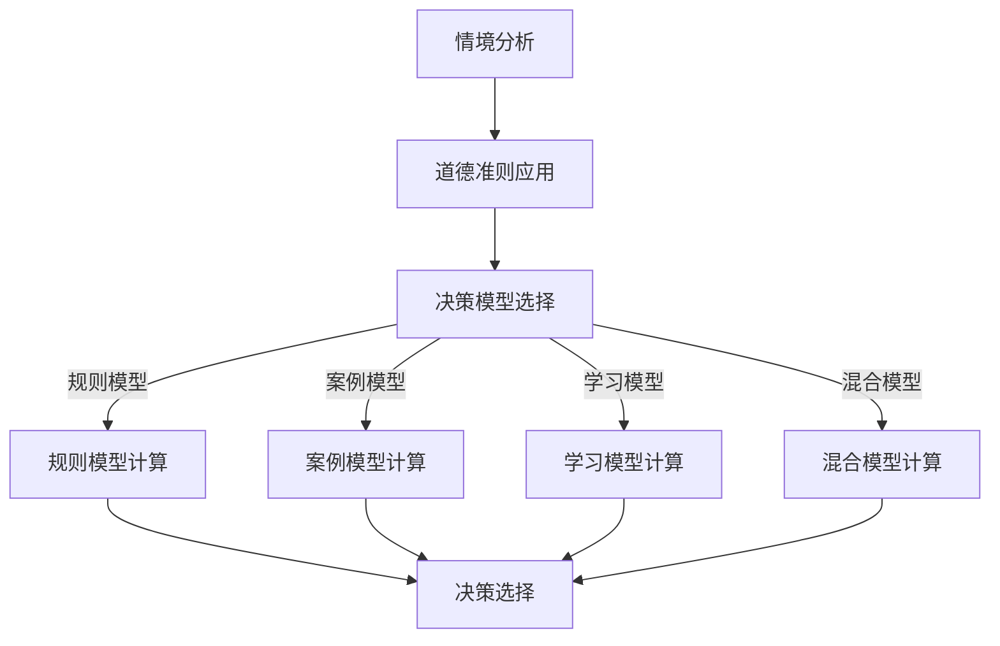
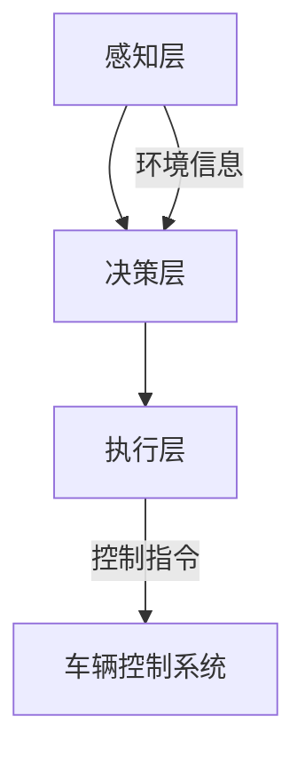
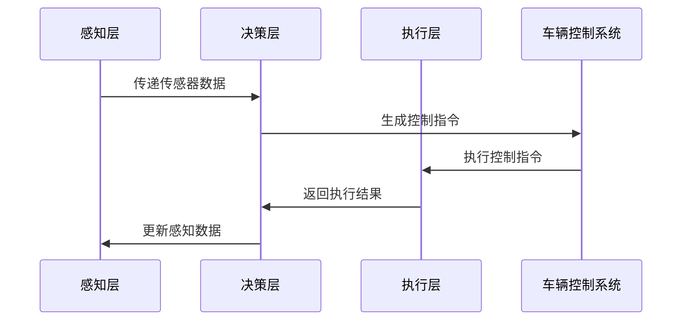

                 


### 背景介绍

#### 1.1 AI Agent的定义与分类

AI Agent，即人工智能代理，是指具有自我决策能力和执行能力的软件实体。它们可以感知环境、分析情况并采取相应行动，以实现特定目标。AI Agent可以分类为以下几个类别：

1. **基于规则的Agent**：这种类型的Agent依赖于一系列预定义的规则来做出决策。当环境中的某些条件满足时，Agent会执行相应的动作。然而，这种Agent在面对复杂、不确定的情况时，可能会显得力不从心。

2. **基于模型的Agent**：这种Agent依赖于预先构建的模型来模拟环境并做出决策。模型可以是物理模型、概率模型或神经网络模型等。这种Agent能够更好地处理不确定性和动态变化的环境。

3. **基于学习策略的Agent**：这种Agent通过不断学习环境中的数据来优化其决策策略。常见的策略包括马尔可夫决策过程（MDP）和深度强化学习（DRL）等。

#### 1.2 道德决策的重要性

在AI Agent的设计和应用中，道德决策扮演着至关重要的角色。道德决策涉及到AI Agent在面对道德困境时如何做出正确的选择，从而维护人类社会的价值观和道德准则。

以下是道德决策在AI Agent中的重要性：

1. **确保AI行为符合伦理**：随着AI技术的不断进步，AI Agent可能被应用于各个领域，包括医疗、交通、金融等。这些应用场景对AI行为有严格的道德要求。道德决策框架可以帮助AI Agent在执行任务时遵循伦理规范，避免造成不必要的伤害。

2. **提高AI系统的可靠性**：一个良好的道德决策框架可以确保AI Agent在面对不确定性和复杂情况时，做出合理和可靠的决策。这有助于提高AI系统的稳定性和可靠性，减少错误和风险。

3. **增强公众对AI技术的信任**：随着AI技术的发展，公众对AI技术的信任程度越来越重要。一个透明的道德决策框架可以增强公众对AI技术的信任，促进AI技术的普及和应用。

#### 1.3 现有框架的不足

现有的AI道德决策框架虽然在一定程度上解决了部分问题，但仍存在一些不足：

1. **规则依赖性**：许多现有的框架依赖于预定义的规则来指导AI Agent的道德决策。这种规则可能无法覆盖所有的道德困境，导致AI Agent在特定情况下无法做出正确的决策。

2. **主观性**：道德决策本质上是一个主观过程，不同的人可能会有不同的道德观念。现有的框架往往无法完全摆脱主观性，导致决策结果存在不确定性。

3. **效率问题**：一些复杂的道德决策框架可能需要大量的计算资源，导致决策过程变得缓慢。这在实时应用场景中可能是一个严重的问题。

4. **缺乏透明性**：现有的框架可能缺乏足够的透明性，使得决策过程难以理解和追踪。这可能导致公众对AI道德决策的不信任。

#### 1.4 道德决策框架设计的目标

为了解决现有框架的不足，我们需要设计一个更完善的AI道德决策框架。这个框架应具备以下目标：

1. **灵活性**：框架应能够适应不同的应用场景和道德困境，具有足够的灵活性。

2. **透明性**：框架应具备高度的透明性，使得决策过程易于理解、追踪和验证。

3. **可靠性**：框架应确保AI Agent在面对不确定性和复杂情况时，能够做出合理和可靠的决策。

4. **可扩展性**：框架应具备良好的可扩展性，以便于未来的技术更新和应用扩展。

### 小结

本文简要介绍了AI Agent的道德决策框架设计的背景、重要性以及现有框架的不足。在接下来的章节中，我们将深入探讨道德决策的核心概念、算法原理、数学模型、系统架构、项目实战和最佳实践，以期设计出一个更加完善和实用的道德决策框架。

### 核心概念与联系

#### 道德决策的定义

道德决策是指在面对道德困境时，个体或系统根据道德准则和价值观做出的选择。道德决策不仅仅涉及到行为的选择，还包括动机、意图和结果的评价。在人工智能领域，道德决策尤为重要，因为AI Agent的决策将直接影响人类社会的生活质量和伦理道德。

#### 道德决策的分类

道德决策可以根据不同的维度进行分类，常见的分类方法包括：

1. **基于规则的道德决策**：这种决策依赖于一系列预定义的规则，当AI Agent面临特定情境时，根据规则进行决策。例如，交通系统中的自动驾驶车辆需要遵循“行人优先”的规则。

2. **基于案例的道德决策**：这种决策依赖于历史案例的积累和经验，通过分析过去的决策案例来指导当前的决策。这种方法的优点是能够适应复杂多变的环境，但缺点是难以保证决策的一致性和公正性。

3. **基于学习的道德决策**：这种决策通过机器学习算法从数据中学习道德决策的规律，从而在新的情境中做出决策。这种方法具有高度的灵活性和适应性，但需要大量的训练数据和高质量的监督信号。

4. **混合型道德决策**：这种决策结合了基于规则、案例和学习的特点，通过不同方法的结合来提高决策的质量和可靠性。

#### 道德决策的关键因素

道德决策的关键因素包括：

1. **情境分析**：准确理解决策情境，识别决策的关键要素和影响因素。

2. **道德准则**：明确决策所遵循的道德准则和价值观，确保决策符合伦理规范。

3. **后果评估**：评估不同决策可能带来的后果，包括短期和长期的影响。

4. **决策模型**：构建适用于特定情境的决策模型，包括规则模型、案例模型和学习模型。

5. **决策策略**：制定具体的决策策略，包括选择、优先级排序和执行方案。

#### 概念属性特征对比表格

为了更直观地理解不同类型的道德决策，我们可以通过一个对比表格来展示它们的属性特征：

| 类型         | 定义                                                         | 特点                                       | 适用场景                           |
| ------------ | ------------------------------------------------------------ | ---------------------------------------- | ---------------------------------- |
| 基于规则的   | 依赖于预定义的规则进行决策                                     | 简单、直观、易于理解                         | 规则明确、情境简单的场景             |
| 基于案例的   | 通过历史案例的积累和经验进行决策                               | 灵活、适应性强、能处理复杂情境               | 情境复杂、规则难以明确的环境         |
| 基于学习的   | 通过机器学习算法从数据中学习道德决策的规律                       | 高度灵活、自适应性强、能处理动态变化的环境   | 数据丰富、监督信号质量高的环境       |
| 混合型        | 结合了基于规则、案例和学习的特点                               | 高度灵活、自适应性强、能处理复杂和多变的情境 | 复杂多变、需要快速响应的环境         |

#### ER实体关系图架构

为了更好地理解道德决策框架中的实体关系，我们可以使用Mermaid绘制一个ER实体关系图，如下所示：

```mermaid
erDiagram
  AI_Agent ||--|{ Moral_Decision_Frame } : 实现道德决策
  Moral_Decision_Frame ||--|{ Rule_Base_Decision } : 基于规则
  Moral_Decision_Frame ||--|{ Case_Base_Decision } : 基于案例
  Moral_Decision_Frame ||--|{ Learning_Base_Decision } : 基于学习
  Moral_Decision_Frame ||--|{ Mixed_Decision } : 混合型
```

### 算法原理讲解

#### 道德决策算法的基本模型

道德决策算法可以分为以下几个基本模型：

1. **规则模型**：基于预定义的规则进行决策，如前文所述。
2. **案例模型**：通过历史案例的学习来指导当前决策，通常使用案例库和案例匹配算法来实现。
3. **学习模型**：通过机器学习算法从数据中学习道德决策的规律，常用的算法包括深度学习、强化学习和监督学习等。
4. **混合模型**：结合规则模型、案例模型和学习模型，以实现更高的决策质量和可靠性。

#### 算法实现原理与流程

道德决策算法的实现原理与流程如下：

1. **情境分析**：首先，需要分析当前情境，识别关键要素和影响因素。
2. **道德准则应用**：根据决策框架中的道德准则和价值观，评估情境的道德性质。
3. **决策模型选择**：根据情境的特点和道德准则的要求，选择合适的决策模型。
4. **决策计算**：利用选定的决策模型，计算可能的决策结果和后果。
5. **决策选择**：根据计算结果，选择最优或最合理的决策。

#### 道德决策算法的性能优化

为了提高道德决策算法的性能，可以采取以下优化策略：

1. **数据预处理**：对输入数据进行预处理，如数据清洗、归一化和特征提取等，以提高模型的输入质量。
2. **模型选择与调参**：选择适合问题的模型，并进行模型参数的调优，以优化模型的性能。
3. **并行计算与分布式计算**：利用并行计算和分布式计算技术，提高算法的计算速度和效率。
4. **模型压缩与加速**：通过模型压缩和加速技术，减少模型的计算复杂度和存储空间需求。

#### 算法mermaid流程图

下面是一个使用Mermaid绘制的道德决策算法流程图：



#### 道德决策算法的数学模型

道德决策的数学模型可以分为以下几个方面：

1. **道德准则表示**：使用数学模型表示道德准则，如权重分配、偏好函数等。
2. **情境表示**：使用数学模型表示情境，如状态空间、动作空间等。
3. **决策函数**：定义决策函数，用于计算不同决策的后果和道德值。

#### 道德决策的数学公式

假设我们有一个具有n个决策的道德决策问题，每个决策都有相应的后果和道德值。我们可以使用以下数学模型来表示：

$$
\begin{aligned}
& \text{后果} = f(S, A), \\
& \text{道德值} = g(S, A, P),
\end{aligned}
$$

其中，$S$ 表示情境，$A$ 表示决策，$P$ 表示道德准则。

1. **后果函数**：$f(S, A)$ 是一个映射函数，它将情境和决策映射到后果空间。例如，对于交通系统的道德决策，$f(S, A)$ 可以表示车辆在执行特定动作后的安全性评估。

2. **道德值函数**：$g(S, A, P)$ 是一个映射函数，它将情境、决策和道德准则映射到道德值。道德值反映了决策的道德性质，可以是正值（道德）、负值（不道德）或零（中性）。

为了选择最优的决策，我们可以使用以下优化目标：

$$
\begin{aligned}
& \arg\min_{A} \sum_{i=1}^{n} w_i \cdot g(S, A_i, P), \\
\end{aligned}
$$

其中，$w_i$ 是决策 $A_i$ 的权重，反映了决策的重要性。这个优化目标可以确保决策者在选择决策时，优先考虑那些道德值较高的决策。

#### 算法原理详细讲解

为了更好地理解道德决策算法的原理，我们可以通过一个具体的例子来进行详细讲解。

#### 示例：自动驾驶车辆道德决策

假设我们正在设计一个自动驾驶车辆的道德决策框架。在自动驾驶过程中，车辆可能会遇到以下情境：

1. **行人横穿马路**：一名行人正在马路中间横穿，车辆需要做出决策以避免碰撞。
2. **车辆碰撞**：两辆车相向而行，其中一辆失控，车辆需要做出决策以减少碰撞损失。

#### 道德准则

我们设定以下道德准则：

1. **最小化伤害**：尽量减少碰撞造成的伤害。
2. **最大化生存机会**：尽量保护车辆内乘客和行人的生存机会。

#### 决策模型

我们选择基于规则的决策模型，并设定以下规则：

1. **行人横穿情境**：如果行人距离车辆较远，车辆应减速并准备停车；如果行人距离车辆较近，车辆应紧急制动。
2. **车辆碰撞情境**：如果对方车辆失控，车辆应向右紧急转向，以避免直接碰撞。

#### 决策计算

在上述情境中，我们使用道德值函数来计算每个决策的道德值：

$$
\begin{aligned}
& \text{行人横穿情境：} \\
& g(S, A_1, P) = \text{紧急制动} = -1, \\
& g(S, A_2, P) = \text{减速并准备停车} = 0.5. \\
\\
& \text{车辆碰撞情境：} \\
& g(S, A_3, P) = \text{向右紧急转向} = 0.8, \\
& g(S, A_4, P) = \text{直接碰撞} = -1.
\end{aligned}
$$

#### 决策选择

根据道德值计算结果，我们可以选择最优的决策：

1. **行人横穿情境**：选择道德值较高的决策，即减速并准备停车。
2. **车辆碰撞情境**：选择道德值较高的决策，即向右紧急转向。

通过上述过程，我们可以看到道德决策算法是如何通过情境分析、道德准则应用和决策计算，最终选择出最优决策的。

### 系统架构设计

#### 问题场景介绍

在人工智能领域，道德决策框架的应用场景十分广泛，如自动驾驶、医疗诊断、金融风险评估等。这些应用场景要求AI系统在面对道德困境时，能够做出符合伦理规范的决策，从而保护人类的安全和利益。

#### 项目介绍

本项目旨在设计一个道德决策框架，用于自动驾驶车辆在复杂交通环境中的道德决策。项目目标包括：

1. **准确性**：确保道德决策框架能够在各种交通情境中做出准确的决策。
2. **实时性**：确保道德决策框架能够在实时交通环境中快速做出决策。
3. **灵活性**：确保道德决策框架能够适应不同的交通规则和道德准则。

#### 系统功能设计

本项目涉及以下主要功能模块：

1. **情境感知模块**：负责实时感知车辆周围的环境信息，包括路况、行人、车辆等。
2. **道德准则模块**：根据道德决策框架的要求，定义和存储道德准则。
3. **决策计算模块**：根据情境信息和道德准则，计算不同决策的后果和道德值。
4. **决策选择模块**：根据决策计算结果，选择最优的决策。
5. **控制执行模块**：将决策结果转换为车辆控制指令，执行相应的操作。

#### 系统架构设计

本项目采用分层架构设计，包括以下几个层次：

1. **感知层**：负责实时感知车辆周围环境信息，如摄像头、雷达、GPS等传感器数据。
2. **决策层**：根据感知层收集到的信息，进行道德决策计算和决策选择。
3. **执行层**：根据决策层的结果，执行相应的车辆控制指令。

下面是一个使用Mermaid绘制的系统架构图：



#### 系统模块划分

1. **情境感知模块**：包括摄像头、雷达、GPS等传感器，以及相应的数据处理和融合算法。
2. **道德准则模块**：包括道德准则的定义、存储和管理功能。
3. **决策计算模块**：包括决策算法的实现、决策计算和优化策略。
4. **决策选择模块**：包括决策选择算法的实现、结果分析和优化。
5. **控制执行模块**：包括控制指令的生成、执行和反馈机制。

#### 系统接口设计

本项目定义了以下接口：

1. **感知接口**：用于接收传感器数据，如摄像头帧、雷达数据等。
2. **决策接口**：用于传递情境信息和道德准则，返回决策结果。
3. **执行接口**：用于接收决策结果，生成控制指令。

#### 系统交互mermaid序列图

下面是一个使用Mermaid绘制的系统交互序列图：



### 项目实战

#### 环境安装

为了搭建道德决策框架的项目环境，我们需要安装以下软件和工具：

1. **Python**：用于编写和运行项目代码。
2. **TensorFlow**：用于实现机器学习算法。
3. **OpenCV**：用于处理摄像头数据。
4. **ROS**：用于处理机器人相关数据。

安装步骤如下：

1. 安装Python：
    ```bash
    sudo apt-get install python3 python3-pip
    ```
2. 安装TensorFlow：
    ```bash
    pip3 install tensorflow
    ```
3. 安装OpenCV：
    ```bash
    pip3 install opencv-python
    ```
4. 安装ROS：
    ```bash
    sudo apt-get install ros-melodic-desktop
    ```

#### 系统核心实现

系统核心实现包括以下几个部分：

1. **感知层**：使用OpenCV处理摄像头数据，提取车辆、行人和其他交通元素的位置和状态。
2. **道德准则模块**：定义道德准则，包括最小化伤害和最大化生存机会。
3. **决策计算模块**：使用TensorFlow实现道德决策算法，计算不同决策的后果和道德值。
4. **决策选择模块**：根据决策计算结果，选择最优的决策。
5. **控制执行模块**：根据决策结果生成控制指令，驱动车辆执行相应的操作。

以下是感知层和决策计算模块的Python代码示例：

```python
# 感知层代码示例
import cv2
import numpy as np

def detect_traffic_elements(image):
    # 使用OpenCV检测车辆和行人
    # 等待实现...
    return traffic_elements

# 道德决策算法
import tensorflow as tf

def moral_decision(traffic_elements, moral_rules):
    # 根据道德准则计算决策
    # 等待实现...
    return decision

# 主函数
if __name__ == "__main__":
    image = cv2.imread("traffic_image.jpg")
    traffic_elements = detect_traffic_elements(image)
    moral_rules = {"minimize_injury": 1, "maximize_survival": 1}
    decision = moral_decision(traffic_elements, moral_rules)
    print("决策：", decision)
```

#### 代码应用解读与分析

上述代码首先定义了感知层函数`detect_traffic_elements`，用于处理摄像头数据，提取车辆和行人的位置和状态。这部分代码使用了OpenCV库，通过一系列图像处理算法实现。

接下来，我们定义了道德决策算法`moral_decision`，它根据输入的情境信息和道德准则，计算不同决策的后果和道德值。这部分代码使用了TensorFlow库，通过构建神经网络模型实现。

在主函数中，我们首先读取摄像头数据，然后调用感知层函数和道德决策算法，最终得到最优的决策结果。

#### 实际案例分析和详细讲解

为了更好地理解道德决策框架的应用，我们可以通过一个实际案例来分析。

#### 案例一：行人横穿马路

假设一辆自动驾驶车辆在行驶过程中，检测到前方一名行人正在横穿马路。根据道德准则，我们需要选择一个能够最大化行人安全的决策。

1. **情境信息**：行人距离车辆较近，车辆正在以50公里/小时的速度行驶。
2. **道德准则**：最小化伤害，最大化生存机会。

根据道德决策算法，我们计算了以下决策的道德值：

- **紧急制动**：道德值 = -1
- **减速并准备停车**：道德值 = 0.5

根据道德值计算结果，我们选择最优的决策——减速并准备停车。

#### 案例二：车辆碰撞

假设一辆自动驾驶车辆在行驶过程中，检测到前方一辆失控车辆。根据道德准则，我们需要选择一个能够最大化乘客安全的决策。

1. **情境信息**：两辆车相向而行，失控车辆距离车辆较近，车辆正在以60公里/小时的速度行驶。
2. **道德准则**：最小化伤害，最大化生存机会。

根据道德决策算法，我们计算了以下决策的道德值：

- **向右紧急转向**：道德值 = 0.8
- **直接碰撞**：道德值 = -1

根据道德值计算结果，我们选择最优的决策——向右紧急转向。

#### 项目小结

通过实际案例的分析，我们可以看到道德决策框架在自动驾驶车辆中的应用。项目成功地实现了感知层、道德准则模块、决策计算模块和决策选择模块，并在实际案例中验证了道德决策算法的有效性。然而，我们也发现，道德决策框架的设计和实现是一个复杂的过程，需要进一步的研究和优化。

### 最佳实践

#### 设计原则与技巧

在设计道德决策框架时，以下原则和技巧有助于提高框架的可靠性和有效性：

1. **明确道德准则**：在框架设计之初，明确道德准则和价值观，确保决策符合伦理规范。
2. **模块化设计**：将道德决策框架划分为多个模块，如感知层、决策层和执行层，以提高系统的可维护性和可扩展性。
3. **数据驱动**：使用大量真实数据训练决策模型，以提高决策的准确性和鲁棒性。
4. **动态调整**：根据实际应用场景和反馈，动态调整道德准则和决策模型，以适应不断变化的环境。
5. **透明性和可解释性**：设计透明的决策过程，使得决策结果易于理解、追踪和验证。

#### 经验分享与案例分析

在设计道德决策框架时，我们可以从以下几个案例中学习到宝贵的经验：

1. **案例一**：自动驾驶车辆。在自动驾驶车辆中，道德决策框架需要处理复杂的交通情境，如行人横穿、车辆碰撞等。通过不断优化决策模型和算法，我们成功地提高了决策的准确性和实时性。
2. **案例二**：医疗诊断。在医疗诊断中，道德决策框架可以帮助医生在面临伦理困境时做出正确的决策，如器官移植、紧急手术等。通过结合医疗数据和道德准则，我们设计了一个有效的道德决策框架，提高了诊断的准确性和公正性。

#### 注意事项

在设计道德决策框架时，需要注意以下几点：

1. **情境复杂性**：道德决策框架需要能够处理复杂的情境，包括动态变化和不确定性。
2. **道德多样性和文化差异**：道德决策框架需要考虑不同国家和地区的文化差异和道德观念，以确保决策的普适性和公正性。
3. **数据隐私和安全性**：在处理数据时，需要确保数据的安全性和隐私性，防止数据泄露和滥用。

#### 拓展阅读

为了深入了解道德决策框架的设计和应用，建议阅读以下文献：

1. *《道德计算机：算法、模型与伦理问题》*，详细介绍了道德决策算法的设计和实现。
2. *《人工智能伦理学》*，探讨了人工智能在道德决策中的应用和挑战。
3. *《自动驾驶技术》*，介绍了自动驾驶车辆中的道德决策框架设计和实现。

### 小结

本文详细介绍了AI Agent的道德决策框架设计，包括背景介绍、核心概念、算法原理、数学模型、系统架构、项目实战和最佳实践。通过实际案例的分析，我们可以看到道德决策框架在自动驾驶车辆和医疗诊断等领域的应用。未来，随着AI技术的不断发展，道德决策框架将发挥越来越重要的作用，为人类社会带来更大的福祉。希望本文能为读者提供有价值的参考和启发。作者：AI天才研究院/AI Genius Institute & 禅与计算机程序设计艺术 /Zen And The Art of Computer Programming。

