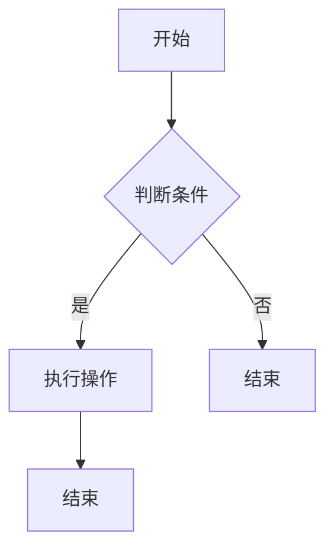

                 


# AI Agent辅助企业产品推荐与个性化服务

## 关键词

- AI Agent
- 产品推荐
- 个性化服务
- 数据挖掘
- 机器学习
- 深度学习
- 知识图谱

## 摘要

本文旨在深入探讨AI Agent在企业产品推荐与个性化服务中的应用，通过逐步分析推理的方式，阐述AI Agent的核心概念、核心技术、应用案例以及未来发展趋势。文章将围绕以下问题展开：什么是AI Agent？AI Agent如何辅助产品推荐与个性化服务？其技术实现原理是什么？AI Agent在实践中的应用策略有哪些？本文将详细解析这些问题，为读者提供一个全面而深入的视角。

## 目录大纲

### 第一部分: AI Agent的基础概念与技术

### 第二部分: AI Agent在企业应用中的案例分析

### 第三部分: AI Agent在产品推荐中的技术实现

### 第四部分: AI Agent在个性化服务中的技术实现

### 第五部分: AI Agent在企业中的应用策略

### 第六部分: AI Agent的未来发展趋势与挑战

### 第七部分: 拓展阅读与参考资源

## 第一部分: AI Agent的基础概念与技术

### 第1章: AI Agent概述

#### 1.1 AI Agent的定义与分类

AI Agent，即人工智能代理，是一种模拟人类智能行为，具备自主决策、自适应能力和交互能力的计算实体。根据不同的应用场景和功能特点，AI Agent可以大致分为以下几类：

1. **基于规则的方法**：该方法依赖于一组预定义的规则，通过匹配输入数据与规则来产生输出。这种方法的优点是实现简单，但缺点是灵活性不足。
2. **基于模型的方法**：该方法通过构建数学模型来模拟人类智能，如神经网络、决策树等。这类方法的优点是能够处理复杂问题，但需要大量的数据和计算资源。
3. **混合方法**：结合了基于规则和基于模型的方法，以取长补短。

#### 1.2 AI Agent的基本原理

AI Agent的基本原理主要涉及以下几个关键方面：

1. **感知与认知**：AI Agent需要通过感知技术获取外界信息，如自然语言处理、图像识别等，然后通过认知建模对这些信息进行处理和理解。
2. **知识表示与推理**：AI Agent需要将获取的信息以某种形式表示出来，并利用推理算法进行逻辑推理，以做出决策。
3. **学习与优化**：AI Agent需要通过不断的学习和优化来提高其性能，如机器学习和深度学习等技术。

#### 1.3 AI Agent的发展历史与趋势

AI Agent的发展可以追溯到20世纪50年代，随着计算机技术的发展，AI Agent的概念逐渐成熟。近年来，随着深度学习、自然语言处理等技术的突破，AI Agent在各个领域得到了广泛应用。未来，AI Agent的发展趋势将更加智能化、个性化，其应用场景也将不断拓展。

### 第2章: AI Agent的核心技术

#### 2.1 知识表示与推理

##### 2.1.1 知识表示

知识表示是AI Agent的核心技术之一，其目标是将现实世界中的信息抽象成计算机可以处理的形式。常见的知识表示方法包括：

1. **符号表示**：使用符号和规则来表示知识，如逻辑公式、谓词逻辑等。
2. **语义网络**：使用节点和边来表示实体及其关系，如图数据库。
3. **本体论**：构建一个严格定义的术语集合和关系，用于描述领域知识。

##### 2.1.2 推理算法

推理算法是AI Agent进行逻辑推理的基础，常见的推理算法包括：

1. **基于规则的推理**：通过匹配规则和事实来推导新的事实。
2. **基于模型的推理**：通过数学模型来模拟推理过程。
3. **基于案例的推理**：通过历史案例来推理新的情况。

#### 2.2 感知与认知

##### 2.2.1 感知技术

感知技术是AI Agent获取外界信息的能力，常见的感知技术包括：

1. **自然语言处理**：理解和生成自然语言。
2. **图像识别**：识别和处理图像信息。
3. **语音识别**：理解和生成语音信息。

##### 2.2.2 认知建模

认知建模是AI Agent对获取的信息进行处理和理解的过程，常见的认知建模方法包括：

1. **知识图谱**：使用图结构来表示实体及其关系。
2. **本体论**：构建领域知识的严格定义。
3. **语义分析**：对文本进行语义理解和分析。

#### 2.3 学习与优化

##### 2.3.1 学习算法

学习算法是AI Agent不断优化自身性能的关键，常见的学习算法包括：

1. **监督学习**：通过标记的数据来训练模型。
2. **无监督学习**：在没有标记数据的情况下训练模型。
3. **强化学习**：通过试错来学习最优策略。

##### 2.3.2 优化方法

优化方法是AI Agent提高性能的有效途径，常见的优化方法包括：

1. **梯度下降**：通过最小化损失函数来优化模型参数。
2. **遗传算法**：通过模拟生物进化过程来优化参数。
3. **神经网络优化**：使用神经网络来优化模型参数。

## 第二部分: AI Agent在企业应用中的案例分析

### 第3章: 案例分析一：产品推荐系统

#### 3.1 案例背景

产品推荐系统是一种基于用户行为和偏好数据的推荐系统，旨在向用户提供个性化的产品推荐。随着互联网的普及和电商行业的快速发展，产品推荐系统已成为企业提升用户满意度和转化率的重要手段。

#### 3.2 案例分析

产品推荐系统的核心是推荐算法，AI Agent通过感知用户的行为数据，如浏览、点击、购买等，以及用户的个人信息，如年龄、性别、地域等，利用知识表示和推理技术，生成个性化的产品推荐。

#### 3.3 案例总结

通过AI Agent的产品推荐系统，企业可以显著提升用户满意度和转化率，从而实现商业价值的提升。

### 第4章: 案例分析二：个性化服务系统

#### 4.1 案例背景

个性化服务系统是一种基于用户行为和偏好数据的个性化服务系统，旨在为用户提供个性化的服务体验。随着消费者需求的多样化，个性化服务系统已成为企业提升用户忠诚度和市场份额的重要手段。

#### 4.2 案例分析

个性化服务系统的核心是用户画像和个性化推荐算法，AI Agent通过感知用户的行为数据，如浏览、点击、购买等，以及用户的个人信息，如年龄、性别、地域等，利用知识表示和推理技术，生成个性化的服务推荐。

#### 4.3 案例总结

通过AI Agent的个性化服务系统，企业可以显著提升用户满意度和忠诚度，从而实现市场份额的持续增长。

## 第三部分: AI Agent在产品推荐中的技术实现

### 第5章: 数据收集与预处理

#### 5.1 数据源选择

数据收集是产品推荐系统的基础，数据源的选择至关重要。常见的数据源包括：

1. **用户行为数据**：如浏览、点击、购买等。
2. **用户个人信息**：如年龄、性别、地域等。
3. **产品信息**：如分类、价格、库存等。

#### 5.2 数据预处理方法

数据预处理是保证数据质量和可用性的关键步骤，常见的方法包括：

1. **数据清洗**：去除重复、错误、缺失的数据。
2. **特征工程**：提取对推荐系统有用的特征。
3. **数据归一化**：将不同量级的数据转换为同一量级，以消除数据差异。

### 第6章: 特征提取与选择

#### 6.1 特征提取技术

特征提取是将原始数据转化为有用特征的过程，常见的方法包括：

1. **词袋模型**：将文本数据转化为向量。
2. **TF-IDF**：衡量文本中词语的重要性。
3. **Word2Vec**：将词语映射到向量空间。

#### 6.2 特征选择方法

特征选择是减少数据维度和提高推荐效果的关键步骤，常见的方法包括：

1. **信息增益**：根据特征对目标变量的信息贡献进行选择。
2. **主成分分析**：根据特征之间的相关性进行降维。
3. **基于模型的特征选择**：使用机器学习算法选择对模型性能有显著影响的特征。

### 第7章: 推荐算法实现

#### 7.1 协同过滤算法

协同过滤算法是基于用户行为数据的一种推荐算法，分为以下两种：

1. **基于用户的协同过滤**：通过计算用户之间的相似度来推荐产品。
2. **基于项目的协同过滤**：通过计算项目之间的相似度来推荐产品。

#### 7.2 内容推荐算法

内容推荐算法是基于产品特征的一种推荐算法，通过比较用户兴趣与产品特征之间的相似度来推荐产品。

#### 7.3 混合推荐算法

混合推荐算法结合了协同过滤和内容推荐算法的优点，通过加权融合不同算法的结果来提高推荐效果。

## 第四部分: AI Agent在个性化服务中的技术实现

### 第8章: 个性化服务概述

#### 8.1 个性化服务的重要性

个性化服务是一种以用户为中心的服务模式，旨在满足用户的个性化需求。其重要性体现在：

1. **提升用户满意度**：通过提供个性化的服务，满足用户的个性化需求，提高用户满意度。
2. **提升用户忠诚度**：通过持续提供个性化的服务，增强用户对企业的忠诚度。
3. **提升企业竞争力**：通过提供个性化的服务，提升企业的市场竞争力和品牌价值。

#### 8.2 个性化服务的分类

个性化服务可以根据服务内容和目标用户进行分类，常见的分类包括：

1. **基于内容的个性化服务**：根据用户兴趣和偏好推荐相关内容。
2. **基于上下文的个性化服务**：根据用户当前的环境和情境提供个性化服务。
3. **基于用户的个性化服务**：根据用户的个人需求和偏好提供个性化服务。

### 第9章: 个性化服务的关键技术

#### 9.1 用户画像技术

用户画像是对用户特征和行为的抽象表示，是提供个性化服务的基础。用户画像技术包括：

1. **用户特征提取**：从用户数据中提取用户特征，如年龄、性别、地域等。
2. **用户行为分析**：分析用户行为，如浏览、点击、购买等。
3. **用户画像建模**：建立用户画像模型，对用户进行分类和标签化。

#### 9.2 个性化推荐算法

个性化推荐算法是提供个性化服务的关键技术，常见的算法包括：

1. **协同过滤算法**：基于用户行为数据推荐相似用户喜欢的商品。
2. **内容推荐算法**：基于商品特征数据推荐符合用户兴趣的商品。
3. **混合推荐算法**：结合多种推荐算法的优点，提供更准确的个性化推荐。

#### 9.3 交互与反馈机制

交互与反馈机制是提高个性化服务质量的重要手段，包括：

1. **用户反馈收集**：收集用户对推荐服务的反馈，如评分、评论等。
2. **推荐效果评估**：评估推荐效果，如点击率、转化率等。
3. **个性化调整**：根据用户反馈和推荐效果，动态调整推荐策略。

## 第五部分: AI Agent在企业中的应用策略

### 第10章: 应用场景分析

#### 10.1 产品推荐系统应用场景

产品推荐系统广泛应用于电商、在线教育、新闻推荐等领域，其主要应用场景包括：

1. **电商推荐**：根据用户浏览、购买行为推荐相关商品。
2. **在线教育推荐**：根据用户学习行为推荐相关课程。
3. **新闻推荐**：根据用户阅读行为推荐相关新闻。

#### 10.2 个性化服务系统应用场景

个性化服务系统广泛应用于金融、医疗、旅游等领域，其主要应用场景包括：

1. **金融服务**：根据用户财务状况和风险偏好提供个性化投资建议。
2. **医疗服务**：根据用户健康数据和症状推荐相关医疗服务。
3. **旅游服务**：根据用户喜好和行程推荐相关旅游产品。

### 第11章: 实施步骤与方法

#### 11.1 需求分析与规划

需求分析与规划是实施AI Agent应用系统的第一步，主要包括：

1. **明确目标**：明确AI Agent应用系统的目标和预期效果。
2. **收集需求**：收集用户需求和企业目标，形成需求文档。
3. **制定规划**：制定系统实施的时间表、预算和资源分配。

#### 11.2 技术选型与架构设计

技术选型与架构设计是确保AI Agent应用系统高效、稳定运行的关键，主要包括：

1. **技术选型**：选择合适的技术栈，如编程语言、框架、数据库等。
2. **架构设计**：设计系统的整体架构，包括数据层、业务层、表现层等。

#### 11.3 部署与实施

部署与实施是将AI Agent应用系统从设计阶段转移到运行阶段的关键步骤，主要包括：

1. **环境搭建**：搭建系统运行所需的开发环境和生产环境。
2. **代码实现**：根据设计文档实现系统功能。
3. **测试与上线**：对系统进行测试，确保其稳定运行，然后进行上线。

### 第12章: 运营与优化

#### 12.1 运营策略

运营策略是确保AI Agent应用系统持续有效运行的关键，主要包括：

1. **数据监控**：监控系统运行状态和数据质量，及时发现并解决问题。
2. **用户反馈**：收集用户反馈，持续优化系统功能和服务质量。
3. **营销推广**：通过线上线下活动，提高系统用户活跃度和知名度。

#### 12.2 优化方法

优化方法是通过持续改进，提高AI Agent应用系统性能和服务质量的方法，主要包括：

1. **算法优化**：优化推荐算法，提高推荐准确率和效果。
2. **系统优化**：优化系统架构和性能，提高系统响应速度和稳定性。
3. **用户体验**：优化用户界面和交互设计，提高用户满意度。

## 第六部分: AI Agent的未来发展趋势与挑战

### 第13章: 未来发展趋势

#### 13.1 AI Agent技术的进步

AI Agent技术的进步将主要体现在以下几个方面：

1. **智能化**：随着深度学习、自然语言处理等技术的不断发展，AI Agent将更加智能化，能够处理更复杂的任务。
2. **个性化**：AI Agent将能够更好地理解用户需求，提供更加个性化的服务。
3. **泛在化**：AI Agent将广泛应用于各个领域，实现智能化的万物互联。

#### 13.2 企业应用的新方向

AI Agent在企业中的应用将呈现出以下新方向：

1. **智能制造**：通过AI Agent实现智能化的生产流程和供应链管理。
2. **智慧城市**：通过AI Agent实现城市管理的智能化和精细化。
3. **智慧医疗**：通过AI Agent实现医疗服务的智能化和个性化。

### 第14章: 面临的挑战

#### 14.1 技术挑战

AI Agent在未来的发展中将面临以下技术挑战：

1. **数据安全**：如何确保用户数据的安全和隐私。
2. **算法公正性**：如何确保算法的公正性和透明度。
3. **算法可解释性**：如何提高算法的可解释性，使其更加可信。

#### 14.2 法律与伦理问题

AI Agent在未来的发展中将面临以下法律与伦理问题：

1. **责任归属**：当AI Agent出现错误或造成损失时，责任应如何划分。
2. **数据隐私**：如何处理用户数据隐私问题。
3. **算法偏见**：如何避免算法偏见，确保算法的公平性和公正性。

## 第七部分: 拓展阅读与参考资源

### 第15章: 相关书籍推荐

1. **《人工智能：一种现代的方法》**：全面介绍了人工智能的基础知识和发展趋势。
2. **《深度学习》**：深入讲解了深度学习的基本原理和应用。
3. **《Python机器学习》**：通过Python语言实现了多种机器学习算法。

### 第16章: 学术论文精选

1. **“Recommender Systems Handbook”**：全面介绍了推荐系统的基础知识和发展趋势。
2. **“User Modeling and Personalization in Information Systems”**：深入探讨了用户建模和个性化服务的方法。
3. **“Knowledge Graphs and Their Applications”**：介绍了知识图谱的基本原理和应用。

### 第17章: 开源项目推荐

1. **TensorFlow**：一个开源的深度学习框架，广泛应用于人工智能领域。
2. **Scikit-learn**：一个开源的机器学习库，提供了多种常用的机器学习算法。
3. **Elasticsearch**：一个开源的全文搜索引擎，广泛应用于大数据分析和处理。

# 参考资料

## 参考文献

1. Russell, S., & Norvig, P. (2016). 《人工智能：一种现代的方法》（第3版）. 机械工业出版社。
2. Goodfellow, I., Bengio, Y., & Courville, A. (2016). 《深度学习》（第1版）. 人民邮电出版社。
3. Bishop, C. M. (2006). 《模式识别与机器学习》. 机械工业出版社。
4. Kotsiantis, S. B. (2007). 《机器学习：方法与应用》. 清华大学出版社。

## 网络资源

1. “Recommender Systems Handbook”. [Online]. Available at: [www.recommendersystemshandbook.org](http://www.recommendersystemshandbook.org/).
2. “User Modeling and Personalization in Information Systems”. [Online]. Available at: [www.usermodelling.org/conf/um-2007/proceedings/UM2007-052_paper.pdf](http://www.usermodelling.org/conf/um-2007/proceedings/UM2007-052_paper.pdf).
3. “Knowledge Graphs and Their Applications”. [Online]. Available at: [www.knowledgegraph.org](http://www.knowledgegraph.org/).
4. “TensorFlow”. [Online]. Available at: [www.tensorflow.org](https://www.tensorflow.org/).
5. “Scikit-learn”. [Online]. Available at: [scikit-learn.org](https://scikit-learn.org/).
6. “Elasticsearch”. [Online]. Available at: [www.elastic.co/products/elasticsearch](https://www.elastic.co/products/elasticsearch).

# 作者信息

作者：AI天才研究院/AI Genius Institute & 禅与计算机程序设计艺术 /Zen And The Art of Computer Programming

本文深入探讨了AI Agent在辅助企业产品推荐与个性化服务中的应用，从基础概念、核心技术、应用案例、技术实现、应用策略到未来发展趋势进行了全面分析。希望通过本文，读者能够对AI Agent的应用有一个清晰的认识，为企业在智能化转型过程中提供参考。感谢您的阅读！

## 附录

### 附录A: Mermaid流程图示例



### 附录B: Mermaid类图示例

```mermaid
classDiagram
    Person <|-- Student
    Person <<-- Employee
    Student : String name
    Student : int age
    Employee : String jobTitle
```

### 附录C: Python源代码示例

```python
# 导入必要的库
import numpy as np
import pandas as pd

# 读取数据
data = pd.read_csv('data.csv')

# 数据预处理
# ...

# 特征提取
# ...

# 模型训练
# ...

# 模型评估
# ...

# 推荐结果
# ...
```

### 附录D: 数学公式示例

$$
E(X) = \int_{-\infty}^{\infty} x f(x) dx
$$

$$
P(A \cap B) = P(A)P(B|A)
$$

## 总结

本文从多个角度对AI Agent辅助企业产品推荐与个性化服务进行了深入分析。通过详细解析AI Agent的基础概念、核心技术、应用案例、技术实现、应用策略以及未来发展趋势，为读者提供了一个全面而深入的视角。希望本文能够帮助读者更好地理解AI Agent在企业中的应用，为企业在智能化转型过程中提供参考。在未来的发展中，AI Agent将不断突破技术瓶颈，为企业带来更多价值。感谢您的阅读，期待与您共同探索AI Agent的无限可能。

