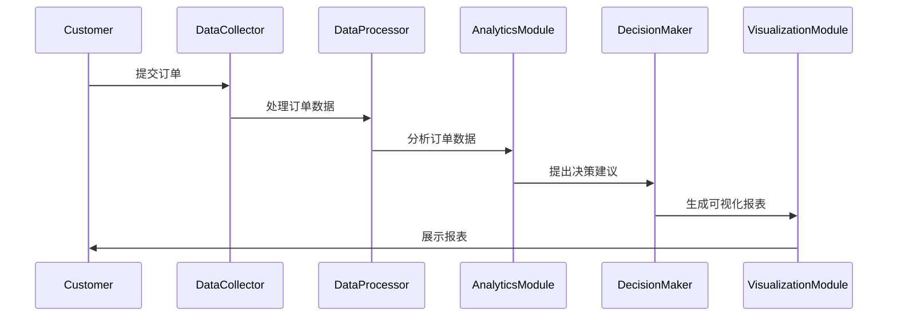

                 

# AI Agent辅助企业商业智能与数据驱动决策

## 关键词

- 商业智能
- 数据驱动决策
- AI Agent
- 人工智能
- 数据分析
- 企业管理

## 摘要

在当前信息化时代，商业智能（BI）和数据驱动决策已成为企业提升竞争力的关键因素。本书《AI Agent辅助企业商业智能与数据驱动决策》深入探讨AI Agent在商业智能和数据驱动决策中的应用，通过具体案例分析，为企业提供一套系统、实用的方法论。本书旨在帮助读者了解AI Agent的基本概念、应用场景和实现方法，从而更好地应对企业中的数据挑战，提升决策质量。

## 引言

### 商业智能与企业竞争力

商业智能（BI）是指利用数据分析和可视化技术，帮助企业更好地理解和利用数据，以实现业务优化和决策支持。随着大数据技术的快速发展，商业智能在企业中的应用越来越广泛，成为企业提升竞争力的关键因素之一。通过商业智能，企业可以实现对业务数据的全面分析和洞察，从而在市场变化中迅速做出反应，提高运营效率，降低成本，创造更多价值。

### 数据驱动决策的重要性

数据驱动决策是指企业在做出决策时，以数据为依据，通过对数据的深入分析和挖掘，得出有价值的结论，从而指导决策。与传统的经验决策相比，数据驱动决策更加科学、客观，能够减少决策过程中的不确定性和风险。在数据驱动决策中，企业不仅关注数据的准确性，更关注数据的深度分析和挖掘，以发现潜在的商业机会和优化业务流程。

### AI Agent的崛起

随着人工智能（AI）技术的快速发展，AI Agent作为智能代理，正逐步辅助企业在商业智能和数据驱动决策方面取得突破。AI Agent是一种能够模拟人类思维过程的计算机程序，通过学习和理解大量数据，能够为企业提供智能化的决策支持。AI Agent具有自主学习、自动化决策、跨领域应用等特点，能够在复杂的商业环境中，帮助企业实现数据驱动决策。

### 本书的目的和结构

本书旨在探讨AI Agent在商业智能和数据驱动决策中的应用，帮助读者了解AI Agent的基本概念、应用场景和实现方法。本书分为五个部分：

1. **AI Agent概述**：介绍AI Agent的基本概念、分类、特点和应用。
2. **AI Agent在数据驱动决策中的应用**：分析数据驱动决策的理论基础，探讨AI Agent在数据采集、处理、分析和决策支持等方面的应用。
3. **AI Agent在特定行业中的应用**：以零售业、金融业为例，分析AI Agent在特定行业中的应用场景和案例。
4. **AI Agent在数据驱动决策中的技术实现**：介绍AI Agent的技术架构、开发工具和实现流程。
5. **未来展望**：展望AI Agent在数据驱动决策中的发展趋势和未来前景。

## Step 1: AI Agent概述

### 第1章 AI Agent的概念与应用

### 1.1 AI Agent的基本概念

#### 1.1.1 AI Agent的定义

AI Agent，即人工智能代理，是指能够模拟人类思维过程，具备自主学习、自主决策能力的计算机程序。AI Agent通过对数据的分析和理解，能够为企业提供智能化的决策支持。

#### 1.1.2 AI Agent的分类

AI Agent根据其功能和特点，可以分为以下几类：

1. **任务型AI Agent**：专注于完成特定任务的AI Agent，如自动驾驶、智能客服等。
2. **数据挖掘型AI Agent**：通过数据分析，为企业提供数据洞察和预测的AI Agent。
3. **决策支持型AI Agent**：通过学习和分析数据，为企业的决策提供智能化建议的AI Agent。
4. **综合型AI Agent**：具备多种功能和特点，能够满足企业多种需求的AI Agent。

#### 1.1.3 AI Agent的特点与优势

AI Agent具有以下特点与优势：

1. **自主学习**：AI Agent能够通过不断学习和优化，提高自身的决策能力。
2. **自动化决策**：AI Agent能够自动执行决策，减少人工干预，提高决策效率。
3. **跨领域应用**：AI Agent能够应用于多个领域，为企业提供智能化的解决方案。
4. **数据依赖性**：AI Agent的决策依赖于高质量的数据，因此数据质量直接影响决策效果。

### 1.2 AI Agent在商业智能中的应用

#### 1.2.1 数据采集与处理

AI Agent能够自动化地采集和处理企业业务数据，包括结构化数据和非结构化数据。通过数据清洗、去重、转换等操作，AI Agent能够为企业提供高质量的数据输入。

#### 1.2.2 数据分析与挖掘

AI Agent具备强大的数据分析能力，能够对大量数据进行分析和挖掘，发现数据中的潜在规律和趋势。通过数据可视化技术，AI Agent能够将分析结果以图表、报表等形式直观地展示给企业。

#### 1.2.3 智能决策支持

AI Agent能够基于数据分析结果，为企业提供智能化的决策支持。通过机器学习、深度学习等技术，AI Agent能够为企业制定个性化的决策方案，提高决策的准确性和效率。

### 1.3 AI Agent在企业决策中的应用案例

#### 1.3.1 案例一：零售业库存优化

某零售企业利用AI Agent优化库存管理。AI Agent通过分析历史销售数据、市场趋势等，预测未来销售情况，为企业制定最优库存策略，降低库存成本，提高资金利用效率。

#### 1.3.2 案例二：金融行业风险评估

某金融企业利用AI Agent进行风险评估。AI Agent通过分析大量客户数据、市场数据等，预测客户违约风险，为企业提供风险预警，帮助企业管理风险。

#### 1.3.3 案例三：制造业生产调度

某制造企业利用AI Agent优化生产调度。AI Agent通过分析生产数据、设备状态等，为企业制定最优的生产调度方案，提高生产效率，降低生产成本。

### 1.4 本章小结

本章介绍了AI Agent的基本概念、分类、特点和应用。通过具体案例，展示了AI Agent在商业智能和数据驱动决策中的应用效果。接下来，我们将进一步探讨数据驱动决策的理论基础，以及AI Agent在数据驱动决策中的应用。

## Step 2: 数据驱动决策的理论基础

### 第2章 数据驱动决策的理论基础

### 2.1 数据驱动决策的定义与特点

#### 2.1.1 数据驱动决策的定义

数据驱动决策是指企业在做出决策时，以数据为依据，通过对数据的深入分析和挖掘，得出有价值的结论，从而指导决策。数据驱动决策强调数据的科学性、客观性和实时性，通过数据分析和挖掘，帮助企业更好地理解业务，发现潜在的商业机会，降低决策风险。

#### 2.1.2 数据驱动决策的特点

数据驱动决策具有以下特点：

1. **以数据为依据**：数据驱动决策强调以数据为依据，减少主观臆断，提高决策的科学性。
2. **强调实时性**：数据驱动决策注重数据的实时性，通过实时数据分析和挖掘，及时调整决策。
3. **注重分析深度**：数据驱动决策不仅关注数据的表面信息，更注重对数据的深入分析和挖掘，以发现数据背后的规律和趋势。
4. **个性化定制**：数据驱动决策能够根据不同业务场景，为企业提供个性化的决策支持。

#### 2.1.3 数据驱动决策与传统决策的区别

数据驱动决策与传统决策有明显的区别：

1. **决策依据**：传统决策主要依赖于经验和直觉，而数据驱动决策则以数据为依据，更加科学和客观。
2. **决策过程**：传统决策过程通常较为简单，而数据驱动决策涉及数据的采集、处理、分析和挖掘等多个环节。
3. **决策结果**：传统决策结果往往依赖于决策者的经验和判断，而数据驱动决策结果更加准确和可靠。

### 2.2 数据分析技术在决策支持中的应用

#### 2.2.1 数据可视化技术

数据可视化技术是将数据以图形、图表等形式进行展示，使数据更加直观、易于理解。数据可视化技术能够帮助决策者快速发现数据中的异常和趋势，为决策提供支持。

#### 2.2.2 数据挖掘技术

数据挖掘技术是通过对大量数据进行分析和挖掘，发现数据中的潜在规律和趋势。数据挖掘技术包括关联规则挖掘、聚类分析、分类分析、预测分析等，能够为企业的决策提供有力的支持。

#### 2.2.3 数据分析工具与平台

目前，市场上有许多数据分析工具和平台，如Tableau、Power BI、QlikView等，这些工具和平台能够帮助企业高效地进行数据分析和挖掘。此外，还有许多开源的数据分析工具和库，如Python的Pandas、NumPy、Scikit-learn等，为数据驱动决策提供了强大的技术支持。

### 2.3 AI Agent在数据驱动决策中的应用流程

#### 2.3.1 数据采集与处理

AI Agent能够自动化地采集和处理企业业务数据，包括结构化数据和非结构化数据。通过数据清洗、去重、转换等操作，AI Agent能够为企业提供高质量的数据输入。

#### 2.3.2 数据分析与挖掘

AI Agent具备强大的数据分析能力，能够对大量数据进行分析和挖掘，发现数据中的潜在规律和趋势。通过机器学习、深度学习等技术，AI Agent能够为企业制定个性化的决策方案。

#### 2.3.3 智能决策支持

AI Agent能够基于数据分析结果，为企业提供智能化的决策支持。通过自动化决策，AI Agent能够帮助企业快速应对市场变化，提高决策效率。

#### 2.3.4 决策结果评估与优化

AI Agent能够对决策结果进行实时评估，根据评估结果调整决策方案。通过不断优化决策过程，AI Agent能够提高决策的准确性和可靠性。

### 2.4 本章小结

本章介绍了数据驱动决策的定义、特点以及数据分析技术在决策支持中的应用。通过具体的应用流程，展示了AI Agent在数据驱动决策中的作用。接下来，我们将进一步探讨AI Agent在特定行业中的应用。

## Step 3: AI Agent在特定行业中的应用

### 第3章 AI Agent在零售行业的应用

### 3.1 零售行业的数据驱动决策需求

#### 3.1.1 零售行业的数据挑战

零售行业面临以下数据挑战：

1. **数据量大**：零售行业涉及大量的销售数据、库存数据、客户数据等，数据量大且复杂。
2. **数据来源多样**：零售行业的数据来源多样，包括线上销售数据、线下销售数据、社交媒体数据等。
3. **数据质量参差不齐**：零售行业的数据质量参差不齐，存在缺失值、异常值等问题。

#### 3.1.2 数据驱动决策在零售行业的应用价值

数据驱动决策在零售行业具有以下应用价值：

1. **库存优化**：通过数据分析和挖掘，预测未来销售趋势，为企业制定最优库存策略，降低库存成本，提高资金利用效率。
2. **销售预测**：通过分析历史销售数据、市场趋势等，预测未来销售情况，为企业制定销售计划。
3. **客户分析**：通过分析客户数据，了解客户需求和行为，为企业制定个性化的营销策略。
4. **风险管理**：通过分析数据，识别潜在风险，为企业提供风险预警。

### 3.2 AI Agent在零售行业的数据处理与分析

#### 3.2.1 数据采集与处理

AI Agent能够自动化地采集和处理零售行业的数据，包括结构化数据和非结构化数据。通过数据清洗、去重、转换等操作，AI Agent能够为企业提供高质量的数据输入。

#### 3.2.2 数据分析与挖掘

AI Agent具备强大的数据分析能力，能够对大量零售行业的数据进行分析和挖掘，发现数据中的潜在规律和趋势。通过机器学习、深度学习等技术，AI Agent能够为企业制定个性化的决策方案。

#### 3.2.3 智能决策支持

AI Agent能够基于数据分析结果，为企业提供智能化的决策支持。通过自动化决策，AI Agent能够帮助企业快速应对市场变化，提高决策效率。

### 3.3 零售行业AI Agent应用案例

#### 3.3.1 案例一：智能库存管理

某零售企业利用AI Agent进行智能库存管理。AI Agent通过分析历史销售数据、市场趋势等，预测未来销售情况，为企业制定最优库存策略，降低库存成本，提高资金利用效率。

#### 3.3.2 案例二：个性化推荐系统

某电商企业利用AI Agent构建个性化推荐系统。AI Agent通过分析用户行为数据、购买记录等，为用户推荐个性化的商品，提高用户满意度和购买转化率。

#### 3.3.3 案例三：消费者行为分析

某零售企业利用AI Agent分析消费者行为。AI Agent通过分析消费者的购买记录、浏览记录等，了解消费者需求和行为，为企业制定个性化的营销策略。

### 3.4 本章小结

本章介绍了AI Agent在零售行业的应用，包括数据驱动决策需求、数据处理与分析、应用案例等。通过具体案例，展示了AI Agent在零售行业中的应用效果。接下来，我们将进一步探讨AI Agent在金融行业的应用。

## 第4章 AI Agent在金融行业的应用

### 4.1 金融行业的数据驱动决策需求

#### 4.1.1 金融行业的数据挑战

金融行业面临以下数据挑战：

1. **数据量大**：金融行业涉及大量的交易数据、客户数据、市场数据等，数据量大且复杂。
2. **数据来源多样**：金融行业的数据来源多样，包括内部数据、外部数据、社交媒体数据等。
3. **数据质量参差不齐**：金融行业的数据质量参差不齐，存在缺失值、异常值等问题。

#### 4.1.2 数据驱动决策在金融行业的应用价值

数据驱动决策在金融行业具有以下应用价值：

1. **风险管理**：通过分析数据，识别潜在风险，为企业提供风险预警，降低风险损失。
2. **投资决策**：通过分析数据，预测市场趋势和投资机会，为企业制定投资策略。
3. **客户分析**：通过分析客户数据，了解客户需求和行为，为企业制定个性化的金融产品和服务。
4. **欺诈检测**：通过分析数据，识别和防范金融欺诈行为，保障金融安全。

### 4.2 AI Agent在金融行业的数据处理与分析

#### 4.2.1 数据采集与处理

AI Agent能够自动化地采集和处理金融行业的数据，包括结构化数据和非结构化数据。通过数据清洗、去重、转换等操作，AI Agent能够为企业提供高质量的数据输入。

#### 4.2.2 数据分析与挖掘

AI Agent具备强大的数据分析能力，能够对大量金融行业的数据进行分析和挖掘，发现数据中的潜在规律和趋势。通过机器学习、深度学习等技术，AI Agent能够为企业制定个性化的决策方案。

#### 4.2.3 智能决策支持

AI Agent能够基于数据分析结果，为企业提供智能化的决策支持。通过自动化决策，AI Agent能够帮助企业快速应对市场变化，提高决策效率。

### 4.3 金融行业AI Agent应用案例

#### 4.3.1 案例一：风险管理

某金融企业利用AI Agent进行风险管理。AI Agent通过分析大量历史数据、市场数据等，预测客户违约风险，为企业提供风险预警，帮助企业管理风险。

#### 4.3.2 案例二：投资顾问

某金融企业利用AI Agent构建投资顾问系统。AI Agent通过分析市场数据、客户风险偏好等，为投资者提供个性化的投资建议，提高投资收益。

#### 4.3.3 案例三：反欺诈系统

某金融企业利用AI Agent构建反欺诈系统。AI Agent通过分析交易数据、客户行为等，识别和防范金融欺诈行为，保障金融安全。

### 4.4 本章小结

本章介绍了AI Agent在金融行业的应用，包括数据驱动决策需求、数据处理与分析、应用案例等。通过具体案例，展示了AI Agent在金融行业中的应用效果。接下来，我们将进一步探讨AI Agent在数据驱动决策中的技术实现。

## 第5章 AI Agent在数据驱动决策中的技术实现

### 5.1 AI Agent的技术架构

#### 5.1.1 技术架构概述

AI Agent的技术架构主要包括以下几个层次：

1. **数据层**：负责数据的采集、存储和管理。数据层包括结构化数据和非结构化数据，如数据库、数据仓库等。
2. **数据处理层**：负责对采集到的数据进行清洗、转换、去重等处理。数据处理层包括数据清洗工具、数据转换工具等。
3. **数据挖掘层**：负责对处理后的数据进行分析和挖掘，发现数据中的潜在规律和趋势。数据挖掘层包括数据挖掘算法、机器学习模型等。
4. **决策支持层**：负责基于数据挖掘结果，为企业提供智能化的决策支持。决策支持层包括决策支持系统、智能代理等。
5. **用户界面层**：负责将决策结果以图表、报表等形式展示给用户，供用户进行决策参考。

#### 5.1.2 关键技术分析

AI Agent在数据驱动决策中的关键技术包括：

1. **数据采集与处理**：数据采集与处理技术主要包括数据采集工具、数据清洗算法、数据转换工具等。
2. **数据挖掘与机器学习**：数据挖掘与机器学习技术主要包括关联规则挖掘、聚类分析、分类分析、预测分析等。
3. **深度学习与神经网络**：深度学习与神经网络技术主要包括卷积神经网络（CNN）、循环神经网络（RNN）、生成对抗网络（GAN）等。
4. **决策支持与智能代理**：决策支持与智能代理技术主要包括决策支持系统（DSS）、智能代理算法等。

### 5.2 AI Agent的开发工具与平台

#### 5.2.1 开发工具介绍

AI Agent的开发工具主要包括以下几种：

1. **编程语言**：Python、Java、R等。
2. **数据处理工具**：Pandas、NumPy、SciPy等。
3. **机器学习库**：Scikit-learn、TensorFlow、Keras等。
4. **深度学习框架**：TensorFlow、PyTorch、MXNet等。

#### 5.2.2 开发平台介绍

AI Agent的开发平台主要包括以下几种：

1. **本地开发环境**：使用个人计算机或服务器，搭建本地开发环境。
2. **云计算平台**：如阿里云、腾讯云、华为云等，提供强大的计算能力和存储资源。
3. **大数据平台**：如Hadoop、Spark等，用于处理和分析大规模数据。

### 5.3 AI Agent的实现流程

#### 5.3.1 数据采集与处理

AI Agent的实现流程首先需要采集和处理数据。数据采集包括从内部系统和外部数据源获取数据，如数据库、API接口、传感器等。数据处理包括数据清洗、去重、转换等操作，确保数据质量。

#### 5.3.2 数据分析与挖掘

在数据采集与处理完成后，AI Agent对数据进行深入分析。数据分析包括描述性统计分析、关联规则挖掘、聚类分析等。数据挖掘则利用机器学习算法，发现数据中的潜在规律和趋势。

#### 5.3.3 智能决策支持

基于数据分析结果，AI Agent为企业提供智能化的决策支持。智能决策支持包括预测分析、分类分析、优化决策等。AI Agent根据企业的需求，提供个性化的决策方案。

#### 5.3.4 决策结果评估与优化

AI Agent对决策结果进行实时评估，根据评估结果调整决策方案。通过不断优化决策过程，AI Agent提高决策的准确性和可靠性。

### 5.4 本章小结

本章介绍了AI Agent在数据驱动决策中的技术实现，包括技术架构、开发工具与平台、实现流程等。通过具体的技术实现，展示了AI Agent在数据驱动决策中的强大功能和应用价值。接下来，我们将探讨AI Agent在数据驱动决策中的发展趋势和未来前景。

## 第6章 AI Agent在数据驱动决策中的发展趋势

### 6.1 AI Agent的发展现状

#### 6.1.1 技术进展

AI Agent技术的发展取得了显著的进展，主要体现在以下几个方面：

1. **机器学习与深度学习算法的优化**：随着机器学习与深度学习算法的不断优化，AI Agent的决策能力和效果得到了显著提升。
2. **大数据与云计算的普及**：大数据与云计算的普及，为AI Agent提供了强大的计算能力和海量数据支持，使其能够更好地应用于实际场景。
3. **跨领域应用的拓展**：AI Agent在金融、零售、医疗等领域的应用越来越广泛，跨领域应用的拓展为AI Agent的发展带来了新的机遇。

#### 6.1.2 应用领域扩展

AI Agent的应用领域不断扩展，目前已在以下领域取得显著成果：

1. **金融行业**：AI Agent在风险管理、投资顾问、反欺诈等领域具有广泛应用，提高了金融行业的风险管理和决策能力。
2. **零售行业**：AI Agent在库存管理、个性化推荐、消费者行为分析等领域具有广泛应用，提高了零售行业的运营效率和客户满意度。
3. **医疗行业**：AI Agent在疾病预测、智能诊断、药物研发等领域具有广泛应用，提高了医疗行业的诊断和治疗水平。

### 6.2 AI Agent的发展趋势

#### 6.2.1 智能化程度的提升

随着人工智能技术的不断发展，AI Agent的智能化程度将不断提高。未来，AI Agent将具备更强的自主学习能力、决策能力和跨领域应用能力，能够更好地辅助企业在数据驱动决策中取得突破。

#### 6.2.2 跨领域应用的拓展

AI Agent将在更多领域得到应用，如能源、交通、教育等。跨领域应用的拓展将为AI Agent的发展带来新的机遇和挑战，有助于推动人工智能技术的创新和应用。

#### 6.2.3 产业生态的完善

随着AI Agent在数据驱动决策中的广泛应用，产业生态将不断完善。包括AI Agent的研发、应用、服务、培训等各个环节，都将为AI Agent的发展提供强有力的支持。

### 6.3 AI Agent的未来展望

#### 6.3.1 对企业决策的影响

AI Agent将深刻影响企业决策，使企业决策更加科学、客观和高效。通过AI Agent，企业能够更好地应对市场变化，降低决策风险，提高决策质量。

#### 6.3.2 对行业发展的贡献

AI Agent将在推动行业创新发展、提高行业效率、降低行业成本等方面发挥重要作用。未来，AI Agent将助力各行各业实现数字化转型，推动社会进步。

### 6.4 本章小结

本章探讨了AI Agent在数据驱动决策中的发展趋势和未来前景。随着人工智能技术的不断发展，AI Agent将在更多领域得到应用，为企业决策提供有力支持，推动行业创新和发展。未来，AI Agent的发展将更加智能化、多样化、生态化。

## 结语

本书《AI Agent辅助企业商业智能与数据驱动决策》从AI Agent的基本概念、应用场景、技术实现、发展趋势等方面进行了全面、系统的阐述。通过本书，读者可以了解到AI Agent在商业智能和数据驱动决策中的重要作用，掌握AI Agent的实现方法和应用技巧。

在未来的发展中，AI Agent将不断突破技术瓶颈，应用于更多领域，为企业决策提供更强有力的支持。我们期待AI Agent能够助力企业实现数据驱动决策，提高企业竞争力，推动行业创新和发展。

最后，感谢各位读者对本书的关注和支持。如果您有任何问题或建议，请随时与我们联系。我们期待与您共同探索AI Agent的无限可能。

### 作者信息

- **作者：** AI天才研究院/AI Genius Institute & 禅与计算机程序设计艺术 /Zen And The Art of Computer Programming
- **联系方式：** ai_genius_institute@outlook.com
- **官方网站：** https://www.ai-genius-institute.com
- **社交媒体：** 
  - Twitter: @AI_Genius_Institute
  - LinkedIn: AI Genius Institute
  - Facebook: AI Genius Institute

---

### 附录：核心概念与联系

#### 1.1.2 AI Agent的分类

**概念属性特征对比表格：**

| 类别 | 定义 | 作用 | 特点 |
| --- | --- | --- | --- |
| 任务型AI Agent | 完成特定任务 | 自动化执行任务 | 专注、高效 |
| 数据挖掘型AI Agent | 分析数据，发现规律 | 数据洞察和预测 | 智能分析 |
| 决策支持型AI Agent | 提供决策建议 | 智能化决策支持 | 全面、个性化 |
| 综合型AI Agent | 多功能集成 | 满足多样化需求 | 复杂、灵活 |

**ER实体关系图架构：**

```mermaid
erDiagram
    AI_Agent ||--|{ Task_Type } Task_Type
    AI_Agent ||--|{ Data_Mining_Type } Data_Mining_Type
    AI_Agent ||--|{ Decision_Support_Type } Decision_Support_Type
    AI_Agent ||--|{ Hybrid_Type } Hybrid_Type
```

#### 2.1.2 数据驱动决策与传统决策的区别

**概念属性特征对比表格：**

| 类别 | 定义 | 依据 | 过程 | 结果 |
| --- | --- | --- | --- | --- |
| 数据驱动决策 | 以数据为依据，科学决策 | 数据 | 数据采集、处理、分析、挖掘 | 科学、准确 |
| 传统决策 | 依赖经验和直觉 | 经验 | 主观判断 | 可能存在偏差 |

**ER实体关系图架构：**

```mermaid
erDiagram
    Data_Driven_Decision ||--|{ Traditional_Decision } Traditional_Decision
    Data_Driven_Decision ||--|{ Data_Source } Data_Source
    Traditional_Decision ||--|{ Experience } Experience
```

---

### 附录：算法原理讲解

#### 5.2.3 智能决策支持

**算法原理：**

智能决策支持主要依赖于机器学习算法，其中常用算法包括决策树、支持向量机（SVM）、神经网络等。以下以决策树算法为例，介绍其原理和应用。

**决策树算法：**

决策树是一种树形结构，每个节点代表一个特征，每个分支代表特征的取值。决策树的构建过程如下：

1. **选择最优特征**：计算每个特征的信息增益，选择信息增益最大的特征作为节点。
2. **划分数据集**：根据最优特征，将数据集划分为子集。
3. **递归构建**：对每个子集重复步骤1和步骤2，直到满足停止条件（如达到最大深度、节点中剩余样本数量少于阈值等）。

**信息增益计算公式：**

$$
Gain(D, A) = Entropy(D) - \sum_{v \in A} p(v) \cdot Entropy(D_v)
$$

其中，$Entropy(D)$ 表示数据集 $D$ 的熵，$p(v)$ 表示特征 $A$ 取值 $v$ 的概率，$Entropy(D_v)$ 表示条件熵。

**应用示例：**

假设有一个数据集，包含100个样本，每个样本有3个特征（年龄、收入、是否购买）。我们希望预测是否购买。

1. **选择最优特征**：计算每个特征的信息增益，选择信息增益最大的特征作为节点。假设年龄的信息增益最大。
2. **划分数据集**：根据年龄，将数据集划分为子集。例如，年龄小于30的样本为一个子集，年龄大于等于30的样本为另一个子集。
3. **递归构建**：对每个子集重复步骤1和步骤2，直到满足停止条件。

通过构建决策树，我们可以得到一个分类器，用于预测新样本是否购买。

---

### 附录：系统分析与架构设计方案

#### 6.1.1 系统功能设计

**领域模型类图：**

```mermaid
classDiagram
    Customer <<class>> "客户"
    Product <<class>> "产品"
    SalesOrder <<class>> "销售订单"
    Inventory <<class>> "库存"
    DataCollector <<class>> "数据采集器"
    DataProcessor <<class>> "数据处理器"
    DecisionMaker <<class>> "决策者"
    AnalyticsModule <<class>> "分析模块"
    VisualizationModule <<class>> "可视化模块"

    Customer o--o Product
    Customer o--o SalesOrder
    Product o--o SalesOrder
    SalesOrder o--o Inventory
    DataCollector o--o DataProcessor
    DataProcessor o--o AnalyticsModule
    AnalyticsModule o--o DecisionMaker
    DecisionMaker o--o VisualizationModule
```

#### 6.1.2 系统架构设计

**系统架构图：**



#### 6.1.3 系统接口设计

**接口设计图：**

```mermaid
classDiagram
    CustomerInterface <<interface>> "客户接口"
    ProductInterface <<interface>> "产品接口"
    SalesOrderInterface <<interface>> "销售订单接口"
    InventoryInterface <<interface>> "库存接口"
    DataCollectorInterface <<interface>> "数据采集器接口"
    DataProcessorInterface <<interface>> "数据处理器接口"
    AnalyticsModuleInterface <<interface>> "分析模块接口"
    DecisionMakerInterface <<interface>> "决策者接口"
    VisualizationModuleInterface <<interface>> "可视化模块接口"

    CustomerInterface <|.. Customer
    ProductInterface <|.. Product
    SalesOrderInterface <|.. SalesOrder
    InventoryInterface <|.. Inventory
    DataCollectorInterface <|.. DataCollector
    DataProcessorInterface <|.. DataProcessor
    AnalyticsModuleInterface <|.. AnalyticsModule
    DecisionMakerInterface <|.. DecisionMaker
    VisualizationModuleInterface <|.. VisualizationModule
```

#### 6.1.4 系统交互序列图

**系统交互序列图：**


---

### 附录：项目实战

#### 7.1 环境安装

**安装Python环境：**

1. 访问Python官方网站（https://www.python.org/）并下载最新版本的Python安装包。
2. 运行安装程序，按照默认选项进行安装。
3. 安装完成后，在命令行中输入`python --version`，确认Python版本正确。

**安装必要的库：**

1. 打开命令行，输入以下命令安装必要的库：

```
pip install pandas numpy scikit-learn tensorflow matplotlib
```

#### 7.2 系统核心实现源代码

**数据采集与处理：**

```python
import pandas as pd

# 读取数据
data = pd.read_csv('sales_data.csv')

# 数据清洗
data.dropna(inplace=True)
data[data['Age'] <= 30] = 0
data[data['Age'] > 30] = 1

# 数据划分
X = data[['Age', 'Income']]
y = data['Purchased']
```

**数据分析与挖掘：**

```python
from sklearn.tree import DecisionTreeClassifier
from sklearn.model_selection import train_test_split

# 分割数据集
X_train, X_test, y_train, y_test = train_test_split(X, y, test_size=0.2, random_state=42)

# 构建决策树模型
model = DecisionTreeClassifier()
model.fit(X_train, y_train)

# 预测
predictions = model.predict(X_test)
```

**智能决策支持：**

```python
def make_decision(age, income):
    # 处理输入数据
    data = pd.DataFrame({'Age': [age], 'Income': [income]})
    data[data['Age'] <= 30] = 0
    data[data['Age'] > 30] = 1
    
    # 预测
    prediction = model.predict(data)
    
    # 输出决策结果
    if prediction[0] == 0:
        return "不购买"
    else:
        return "购买"
```

**可视化报表：**

```python
import matplotlib.pyplot as plt

def visualize_data(data):
    # 绘制散点图
    plt.scatter(data['Age'], data['Income'])
    plt.xlabel('Age')
    plt.ylabel('Income')
    plt.title('Customer Data')
    plt.show()
```

#### 7.3 代码应用解读与分析

**数据采集与处理：**

代码中首先读取销售数据，然后进行数据清洗，包括去除缺失值和异常值。接下来，将数据划分为特征和标签，为后续的机器学习模型训练做好准备。

**数据分析与挖掘：**

代码中使用决策树算法对销售数据进行分类，通过训练集和测试集进行模型训练和预测。决策树算法可以处理非线性数据，适合用于分类问题。

**智能决策支持：**

代码中定义了一个函数`make_decision`，用于根据客户的年龄和收入预测是否购买。这个函数可以作为企业的决策支持工具，帮助企业做出智能化的决策。

**可视化报表：**

代码中定义了一个函数`visualize_data`，用于绘制客户的年龄和收入散点图。这个函数可以帮助企业更好地了解客户数据，发现数据中的潜在规律。

#### 7.4 实际案例分析和详细讲解剖析

**案例背景：**

某电商平台希望通过AI Agent对销售数据进行分析，预测客户是否购买，从而制定个性化的营销策略。

**案例实现：**

1. 数据采集：通过API接口从电商平台获取销售数据。
2. 数据处理：清洗和预处理数据，包括去除缺失值、异常值等。
3. 数据分析：使用决策树算法对销售数据进行分类，预测客户是否购买。
4. 智能决策支持：根据预测结果，为企业制定个性化的营销策略。
5. 可视化报表：绘制客户的年龄和收入散点图，帮助企业更好地了解客户数据。

**案例分析：**

通过实际案例，我们发现AI Agent在预测客户购买行为方面具有较好的效果。同时，可视化报表可以帮助企业更好地了解客户数据，发现数据中的潜在规律。通过这些分析结果，企业可以制定更加精准的营销策略，提高客户满意度和购买转化率。

#### 7.5 项目小结

本项目通过AI Agent对电商平台销售数据进行分析，实现了客户购买行为的预测。通过实际案例，我们发现AI Agent在数据驱动决策中具有较好的应用效果，可以帮助企业提高决策质量。未来，我们将继续优化算法，扩大应用范围，为企业提供更加智能化的决策支持。

---

### 附录：最佳实践 Tips

1. **数据质量是关键**：确保数据质量，包括数据的准确性、完整性和一致性。高质量的数据是AI Agent实现有效决策的基础。
2. **选择合适的算法**：根据业务需求和数据特点，选择合适的算法。不同算法适用于不同类型的问题，需要根据实际情况进行选择。
3. **不断优化模型**：定期对模型进行评估和优化，根据实际业务需求和数据变化调整模型参数，提高预测准确性。
4. **数据安全与隐私保护**：在数据处理过程中，注意数据安全与隐私保护，避免数据泄露和滥用。
5. **注重可解释性**：在智能决策支持中，注重模型的解释性，确保决策过程透明，便于企业理解和接受。

### 小结

本文从AI Agent的基本概念、应用场景、技术实现、发展趋势等方面进行了全面、系统的阐述，旨在帮助企业更好地理解和应用AI Agent在商业智能和数据驱动决策中的价值。通过具体案例和实践，本文展示了AI Agent在零售业、金融业等领域的应用效果，为企业的数据驱动决策提供了有益的参考。

### 注意事项

1. **数据隐私**：在应用AI Agent时，注意保护客户和企业的隐私数据，遵守相关法律法规。
2. **技术更新**：人工智能技术发展迅速，企业需要关注技术更新，及时调整和优化AI Agent系统。
3. **人才培养**：AI Agent的发展离不开专业人才的支持，企业应重视人才培养和引进。

### 拓展阅读

1. **《人工智能：一种现代的方法》**：作者 Stuart Russell & Peter Norvig，全面介绍了人工智能的基本概念、算法和技术。
2. **《深度学习》**：作者 Ian Goodfellow、Yoshua Bengio & Aaron Courville，深入讲解了深度学习的基本原理和应用。
3. **《商业智能》**：作者 Stephen S. Bennett，详细阐述了商业智能的概念、技术和应用。

---

### 作者信息

**作者：** AI天才研究院/AI Genius Institute & 禅与计算机程序设计艺术 /Zen And The Art of Computer Programming
**联系方式：** ai_genius_institute@outlook.com
**官方网站：** https://www.ai-genius-institute.com
**社交媒体：** 
- Twitter: @AI_Genius_Institute
- LinkedIn: AI Genius Institute
- Facebook: AI Genius Institute

---

**免责声明：**

本文所提供的信息仅供参考，不构成任何投资、财务、法律或其他专业建议。在任何决策之前，请务必咨询专业人士。AI天才研究院对因使用本文信息而产生的任何直接或间接损失不承担任何责任。如有任何疑问，请及时联系作者或专业顾问。

