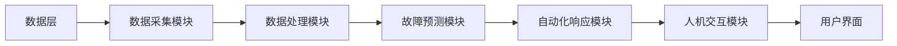
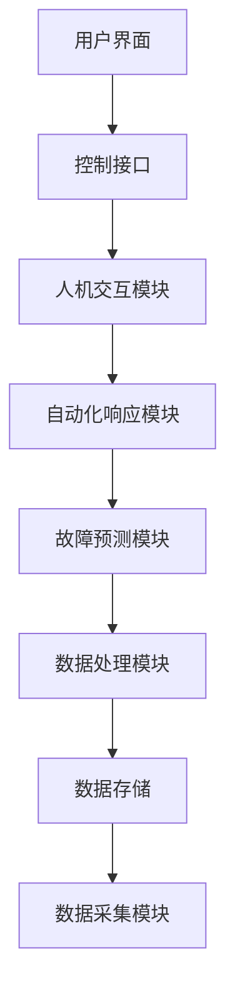
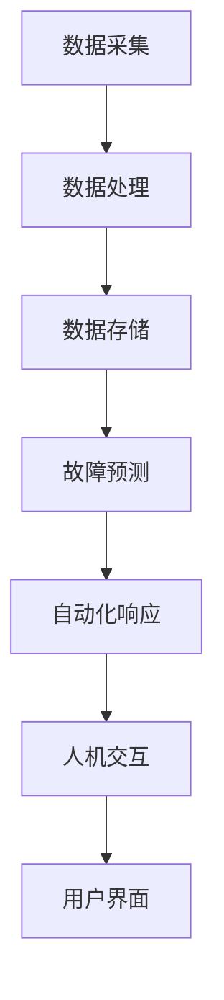
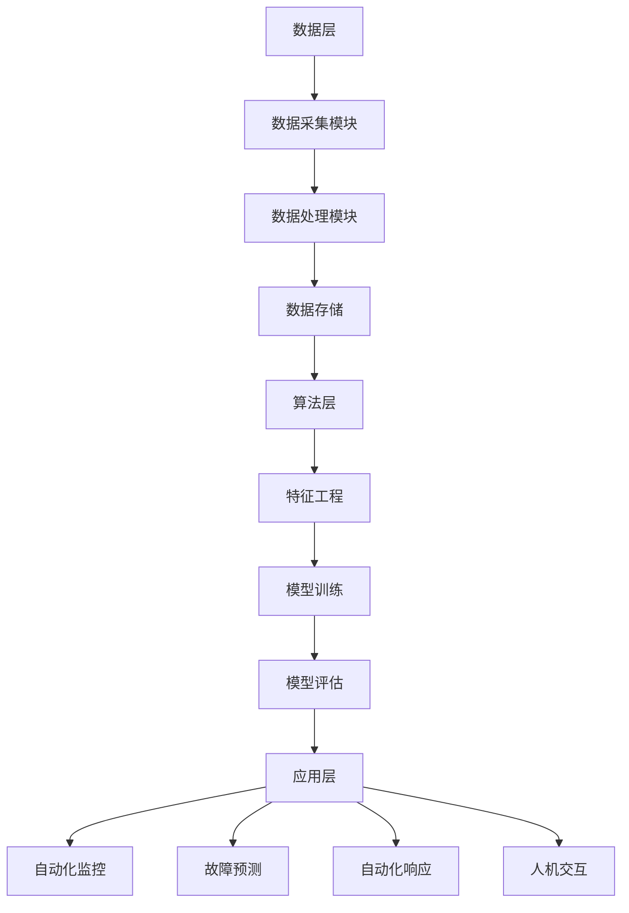

                 

## # AIOps平台设计与实践

### 关键词
- AIOps
- 人工智能
- IT运维
- 自动化
- 数据分析
- 故障预测
- 系统优化

### 摘要
本文深入探讨了AIOps（人工智能在IT运维领域的应用）的平台设计与实践。首先，我们介绍了AIOps的核心概念和原理，包括机器学习、数据挖掘和自动化技术。然后，详细分析了AIOps平台的设计要素，包括数据层、算法层和应用层。接下来，我们阐述了AIOps与传统IT运维的区别，以及平台设计的具体步骤。最后，通过一个实际案例展示了AIOps平台在实践中的应用，并给出了最佳实践建议和项目小结。

----------------------------------------------------------------

## 第一部分：背景介绍

### 第1章：AIOps概述

#### 1.1 问题背景

随着云计算、大数据和物联网技术的快速发展，企业的IT系统变得越来越复杂，规模不断扩大。传统的IT运维管理方式已经难以应对这种变化，出现了诸多问题，如监控数据量激增、故障处理效率低下等。因此，需要引入人工智能技术来优化IT运维管理，这就是AIOps（Artificial Intelligence for IT Operations）的背景。

#### 1.2 问题描述

在传统的IT运维管理中，运维人员需要处理大量的监控数据，从中找出潜在的问题和故障。然而，由于监控数据量的激增和系统复杂度的提高，运维人员的工作压力巨大，效率低下。此外，传统方法在故障预测和自动化处理方面也存在不足。

#### 1.3 问题解决

AIOps通过引入机器学习、数据挖掘等技术，可以从大量的运维数据中提取有价值的信息，实现对IT系统的智能监控和故障预测。AIOps平台需要具备以下几个方面的能力：

1. **数据整合**：将来自不同系统的运维数据进行整合，构建统一的监控数据源。
2. **智能分析**：利用机器学习算法对监控数据进行分析，识别潜在的故障风险。
3. **自动化响应**：基于分析结果，实现自动化的故障处理和系统优化。
4. **人机协同**：在自动化处理的基础上，提供人工干预的接口，确保处理过程的安全性和可控性。

#### 1.4 边界与外延

AIOps的应用不仅仅局限于IT运维领域，还可以扩展到其他业务领域，如网络运维、金融风险管理等。AIOps的核心是利用人工智能技术来优化各种业务流程，提高效率和准确性。

#### 1.5 概念结构与核心要素组成

AIOps的核心结构包括以下几个部分：

1. **数据层**：包括数据采集、数据存储和数据预处理。
2. **算法层**：包括特征工程、模型训练和模型评估。
3. **应用层**：包括自动化监控、故障预测和系统优化。

### 第2章：AIOps核心概念与原理

#### 2.1 AIOps核心概念

AIOps的核心概念包括：

1. **机器学习**：用于对运维数据进行智能分析和故障预测。
2. **数据挖掘**：用于从大量数据中提取有价值的信息。
3. **自动化**：用于实现故障自动处理和系统优化。

#### 2.2 AIOps核心原理

AIOps的核心原理包括：

1. **数据驱动**：通过数据驱动的方式，实现运维管理的智能化。
2. **实时分析**：实现对运维数据的实时分析和处理。
3. **自适应优化**：根据实际情况，自适应地调整运维策略。

#### 2.3 AIOps与传统IT运维的区别

AIOps与传统IT运维的主要区别在于：

1. **数据处理方式**：AIOps更加注重数据的分析和利用，而传统IT运维更多依赖于人工经验和规则。
2. **故障处理方式**：AIOps通过自动化和智能化的方式处理故障，而传统IT运维更多依赖于人工干预。

## 第二部分：AIOps平台设计

### 第3章：AIOps平台设计概述

AIOps平台的设计需要考虑以下几个方面：

1. **数据层设计**：包括数据采集、存储和处理。
2. **算法层设计**：包括特征工程、模型训练和评估。
3. **应用层设计**：包括自动化监控、故障预测和系统优化。

### 第4章：AIOps平台设计 - 数据层

数据层设计是AIOps平台的基础，包括以下几个方面：

1. **数据采集**：包括日志数据、监控数据和业务数据。
2. **数据存储**：采用分布式存储系统，保证数据的高可用性和高性能。
3. **数据预处理**：包括数据清洗、数据转换和数据集成。

### 第5章：AIOps平台设计 - 算法层

算法层设计是AIOps平台的核心，包括以下几个方面：

1. **特征工程**：从原始数据中提取有价值的信息。
2. **模型训练**：选择合适的机器学习算法进行模型训练。
3. **模型评估**：评估模型的效果，并进行优化。

### 第6章：AIOps平台设计 - 应用层

应用层设计是AIOps平台的外在表现，包括以下几个方面：

1. **自动化监控**：实现对IT系统的实时监控和异常检测。
2. **故障预测**：基于历史数据和机器学习算法，预测潜在的故障。
3. **系统优化**：根据实际情况，优化系统配置和资源分配。

## 第三部分：AIOps平台实施

### 第7章：AIOps平台实施概述

AIOps平台的实施需要考虑以下几个方面：

1. **环境搭建**：搭建AIOps平台所需的基础设施。
2. **数据采集**：建立数据采集系统，收集IT系统的监控数据。
3. **算法应用**：将机器学习算法应用于数据分析和故障预测。
4. **系统集成**：将AIOps平台与现有IT系统集成，实现数据共享和协同工作。

### 第8章：AIOps平台实施 - 环境搭建

环境搭建包括以下几个方面：

1. **硬件环境**：选择合适的硬件配置，满足AIOps平台的需求。
2. **软件环境**：安装AIOps平台所需的软件和工具。

### 第9章：AIOps平台实施 - 算法应用

算法应用是AIOps平台的核心，包括以下几个方面：

1. **数据预处理**：对采集到的数据进行分析和处理。
2. **模型训练**：选择合适的机器学习算法，对数据进行训练。
3. **模型评估**：评估模型的效果，并进行优化。

### 第10章：AIOps平台实施 - 系统集成

系统集成是AIOps平台实施的最后一步，包括以下几个方面：

1. **接口设计**：设计AIOps平台与其他系统的接口。
2. **数据共享**：实现AIOps平台与其他系统的数据共享。
3. **协同工作**：确保AIOps平台与其他系统的高效协同工作。

## 第四部分：AIOps平台实战

### 第11章：AIOps平台实战

本章节通过一个实际案例，展示了AIOps平台在实践中的应用。案例包括环境安装、系统核心实现、代码应用解读与分析、实际案例分析和详细讲解剖析等。

### 第12章：AIOps平台实战 - 案例分析

在本章节中，我们将分析一个具体的AIOps平台实施案例，包括以下内容：

1. **问题场景**：描述AIOps平台实施的具体场景和问题。
2. **系统功能设计**：介绍AIOps平台的功能设计和实现。
3. **系统架构设计**：展示AIOps平台的系统架构设计。
4. **系统接口设计**：描述AIOps平台与其他系统的接口设计。
5. **系统交互**：分析AIOps平台与其他系统的交互过程。

### 第13章：AIOps平台实战 - 项目小结

在本章节中，我们将对AIOps平台实施案例进行总结和回顾，包括以下内容：

1. **项目成果**：总结AIOps平台实施后的成果。
2. **经验教训**：分享在实施过程中遇到的困难和解决办法。
3. **最佳实践**：给出AIOps平台实施的最佳实践建议。

## 第五部分：AIOps平台最佳实践与展望

### 第14章：AIOps平台最佳实践

在本章节中，我们将总结AIOps平台实施的最佳实践，包括以下几个方面：

1. **环境搭建**：分享环境搭建的经验和技巧。
2. **数据采集**：介绍数据采集的方法和策略。
3. **算法应用**：讨论算法应用的最佳实践。
4. **系统集成**：分享系统集成中的经验和教训。

### 第15章：AIOps平台展望

在本章节中，我们将对AIOps平台的未来发展趋势进行展望，包括以下几个方面：

1. **技术发展**：讨论AIOps平台在未来可能采用的新技术。
2. **应用领域**：探讨AIOps平台在其他领域的潜在应用。
3. **挑战与机遇**：分析AIOps平台在未来的挑战和机遇。

----------------------------------------------------------------

### 摘要
本文深入探讨了AIOps（人工智能在IT运维领域的应用）的平台设计与实践。首先，我们介绍了AIOps的核心概念和原理，包括机器学习、数据挖掘和自动化技术。然后，详细分析了AIOps平台的设计要素，包括数据层、算法层和应用层。接下来，我们阐述了AIOps与传统IT运维的区别，以及平台设计的具体步骤。最后，通过一个实际案例展示了AIOps平台在实践中的应用，并给出了最佳实践建议和项目小结。AIOps作为人工智能与IT运维相结合的前沿领域，具有巨大的发展潜力和应用前景。本文旨在为广大读者提供一份全面、系统的AIOps平台设计与实践指南，助力企业和个人在数字化转型的道路上取得成功。

----------------------------------------------------------------

## # 第一部分：背景介绍

### 第1章：AIOps概述

#### 1.1 问题背景

在当今快速发展的数字化时代，企业IT系统的复杂性和规模不断扩大，IT运维管理的挑战也日益增加。传统的IT运维管理方式主要依赖于人工经验和预设规则，面对海量监控数据、突发故障和复杂系统依赖关系，往往显得力不从心。例如，一个大型企业可能会有数千台服务器、数万个应用程序和无数个网络设备，运维人员需要实时监控这些设备的运行状态，快速响应异常情况，保证业务的连续性和稳定性。

然而，随着云计算、大数据和物联网技术的普及，IT系统的规模和复杂性进一步增加。监控数据的数量和种类也在急剧增长，日志文件、性能指标、事件流等数据都需要被实时收集、存储和处理。这种海量数据的处理对传统的运维管理带来了巨大的挑战：

1. **监控数据量激增**：大量监控数据的收集和处理需要高效的存储和计算资源，传统的运维工具难以满足这一需求。
2. **故障处理效率低下**：当系统发生故障时，运维人员需要快速定位问题并进行修复，但传统的手动处理方式往往效率低下，可能导致业务中断。
3. **缺乏预测能力**：传统运维管理更多依赖于事后处理，缺乏对潜在故障的预测能力，无法提前预防和减少故障的发生。
4. **跨系统依赖关系复杂**：现代IT系统往往包含多个不同子系统，彼此之间的依赖关系复杂，故障往往难以单独定位和解决。

这些问题不仅增加了运维人员的压力，也影响了企业的运营效率和客户满意度。为了应对这些挑战，企业需要寻求更加智能化、自动化的运维解决方案，从而提高运维效率、降低成本并提升服务质量。这就引出了AIOps的概念和需求。

#### 1.2 问题描述

AIOps（Artificial Intelligence for IT Operations）是一种利用人工智能技术来优化IT运维管理的方法。其目标是通过对海量运维数据的分析和处理，实现IT系统的智能监控、故障预测和自动化响应。具体来说，AIOps在以下几个方面面临以下问题：

1. **数据质量**：AIOps依赖于高质量的监控数据，但实际中数据往往存在噪音、缺失和不一致性，这会影响模型的效果和可靠性。
2. **算法选择**：AIOps需要选择合适的机器学习算法来处理不同类型的数据和问题，但算法的选择和调优过程复杂，且需要大量的实验和验证。
3. **系统集成**：AIOps平台需要与现有的IT系统集成，实现数据共享和协同工作，但不同系统之间的接口和数据格式往往不一致，增加了集成的难度。
4. **自动化响应**：AIOps平台需要实现自动化的故障处理和系统优化，但自动化决策的可靠性和安全性需要得到保障，以避免误操作和业务中断。
5. **人机协同**：虽然AIOps旨在提高自动化水平，但在某些情况下，人工干预仍然是必要的，如何实现人机协同工作，确保处理过程的安全性和可控性，是一个重要的问题。

#### 1.3 问题解决

为了解决上述问题，AIOps平台需要具备以下几个方面的能力：

1. **数据整合**：将来自不同系统的运维数据进行整合，构建统一的监控数据源。这可以通过数据聚合和清洗技术来实现，确保数据的一致性和完整性。
2. **智能分析**：利用机器学习算法对监控数据进行分析，识别潜在的故障风险。这需要建立有效的特征提取和模型训练机制，以提高分析的准确性和效率。
3. **自动化响应**：基于分析结果，实现自动化的故障处理和系统优化。这可以通过自动化脚本、智能代理和自动化决策引擎来实现，确保响应的及时性和准确性。
4. **人机协同**：在自动化处理的基础上，提供人工干预的接口，确保处理过程的安全性和可控性。这可以通过可视化界面、智能告警和交互式操作来实现，方便运维人员介入和处理。

通过这些能力的实现，AIOps平台可以显著提高运维效率，降低运营成本，提升服务质量，从而帮助企业应对现代IT运维的挑战。

#### 1.4 边界与外延

AIOps不仅仅局限于IT运维领域，其应用范围还可以扩展到其他业务领域，如网络运维、金融风险管理、生产过程监控等。AIOps的核心在于利用人工智能技术，实现业务流程的智能化和自动化，提高效率和准确性。

1. **网络运维**：AIOps可以通过对网络流量、设备状态和性能指标的分析，实现自动化的网络监控、故障预测和流量优化。
2. **金融风险管理**：AIOps可以分析金融交易数据、市场行情和客户行为，实现自动化的风险识别、预警和响应。
3. **生产过程监控**：AIOps可以监控生产设备的状态、性能和生产参数，实现自动化的故障预测、性能优化和能耗管理。

此外，AIOps还可以与其他人工智能技术相结合，如自然语言处理、计算机视觉等，实现更广泛的应用场景。

#### 1.5 概念结构与核心要素组成

AIOps的核心概念和结构包括以下几个关键要素：

1. **数据层**：数据层是AIOps的基础，包括数据采集、数据存储和数据预处理。数据采集需要从各种来源（如服务器、网络设备、应用程序等）收集数据；数据存储需要使用高效、可扩展的存储系统；数据预处理包括数据清洗、格式转换和特征提取，以确保数据的质量和一致性。

2. **算法层**：算法层是AIOps的核心，包括特征工程、模型训练和模型评估。特征工程是数据预处理的重要部分，需要从原始数据中提取出有意义的特征；模型训练需要选择合适的机器学习算法，并进行参数调优；模型评估需要评估模型的性能和效果，以进行持续的优化。

3. **应用层**：应用层是AIOps的外在表现，包括自动化监控、故障预测和系统优化。自动化监控可以实现对IT系统的实时监控和异常检测；故障预测可以基于历史数据和机器学习算法，预测潜在的故障；系统优化可以基于分析结果，自动调整系统配置和资源分配。

AIOps的核心结构不仅包括上述三个层次，还包括以下几个方面：

- **集成层**：集成层负责将AIOps平台与其他IT系统进行集成，实现数据共享和协同工作。这需要定义统一的数据接口和数据格式，确保不同系统之间的无缝连接。
- **人机交互层**：人机交互层提供用户界面和交互功能，使运维人员能够方便地监控和管理AIOps平台，并进行人工干预和决策。

通过以上核心要素的有机结合，AIOps平台可以实现智能化、自动化的运维管理，提高效率和准确性，为企业提供可靠的IT支持。

### 第2章：AIOps核心概念与原理

#### 2.1 AIOps核心概念

AIOps的核心概念包括机器学习、数据挖掘和自动化。这些概念在AIOps平台的设计和实现中起着至关重要的作用。

1. **机器学习**：机器学习是一种通过数据训练模型，并利用这些模型进行预测和决策的技术。在AIOps中，机器学习被用来分析和处理大量运维数据，从中提取有价值的信息，进行故障预测和自动化响应。

   - **监督学习**：监督学习是一种常见的学习方法，通过已有数据的标签进行训练，然后使用训练好的模型对新数据进行预测。在AIOps中，监督学习可以用来预测系统的故障和性能问题。
   - **无监督学习**：无监督学习不依赖标签数据进行训练，而是通过数据自身的特征进行聚类和分类。在AIOps中，无监督学习可以用来识别异常行为和模式，帮助运维人员发现潜在的问题。
   - **强化学习**：强化学习是一种通过试错和学习最优策略的方法。在AIOps中，强化学习可以用来优化系统配置和资源分配，提高系统的性能和稳定性。

2. **数据挖掘**：数据挖掘是一种从大量数据中提取有价值信息的技术。在AIOps中，数据挖掘被用来发现数据中的模式、趋势和关联关系，帮助运维人员更好地理解系统状态和故障原因。

   - **关联规则挖掘**：关联规则挖掘可以用来发现数据之间的关联关系，例如，某些指标的增加可能导致系统故障。这种技术可以帮助运维人员预测故障，并采取预防措施。
   - **聚类分析**：聚类分析可以用来将数据分成多个组，每组具有相似的属性。这种技术可以帮助运维人员识别系统中的异常数据，如异常的设备或应用。
   - **时间序列分析**：时间序列分析可以用来分析数据随时间的变化趋势。这种技术可以帮助运维人员发现系统性能的波动和异常情况，如流量高峰或设备故障。

3. **自动化**：自动化是指通过预设的规则或机器学习模型，自动执行特定的任务或决策。在AIOps中，自动化被用来减少人工干预，提高运维效率。

   - **自动化监控**：自动化监控可以实现对IT系统的实时监控和异常检测，自动识别潜在的问题，并向运维人员发送告警。
   - **自动化故障响应**：自动化故障响应可以通过预设的规则或机器学习模型，自动执行故障修复任务，减少人工干预，提高故障处理效率。
   - **自动化资源管理**：自动化资源管理可以自动调整系统配置和资源分配，优化系统性能和资源利用率。

#### 2.2 AIOps核心原理

AIOps的核心原理可以概括为以下几点：

1. **数据驱动**：AIOps通过收集和存储大量运维数据，利用数据挖掘和机器学习技术，对这些数据进行深入分析和处理，以实现故障预测、异常检测和自动化响应。

2. **实时分析**：AIOps能够对实时流数据进行分析和处理，及时发现系统异常，并迅速采取行动。这需要高效的数据处理和存储系统，以及快速响应的算法模型。

3. **自适应优化**：AIOps平台可以根据实际情况，自适应地调整运维策略。这包括动态调整监控指标、优化系统配置和资源分配，以应对不断变化的系统环境。

4. **人机协同**：AIOps平台不仅能够实现自动化处理，还能提供人工干预的接口，方便运维人员进行监督和调整。这样可以确保处理过程的安全性和可控性，同时充分利用人的经验和判断力。

#### 2.3 AIOps与传统IT运维的区别

AIOps与传统IT运维在多个方面存在显著区别：

1. **数据处理方式**：

   - **传统IT运维**：主要依赖于人工经验和预设规则，通过人工监控和手动处理来维护系统的正常运行。这种方式效率较低，容易产生误报和漏报。
   - **AIOps**：利用机器学习、数据挖掘等技术，对海量运维数据进行分析和处理，实现自动化监控、故障预测和响应。这种方式效率高，准确性强，能够更早地发现和解决问题。

2. **故障处理方式**：

   - **传统IT运维**：主要依赖于人工干预，运维人员需要手动定位故障、分析原因并进行修复。这种方式处理速度慢，容易造成业务中断。
   - **AIOps**：通过自动化脚本、智能代理和自动化决策引擎，实现自动化的故障处理和系统优化。这种方式处理速度快，减少人工干预，提高故障处理效率。

3. **技术依赖**：

   - **传统IT运维**：主要依赖人工经验和现有的运维工具，技术实现相对简单。
   - **AIOps**：依赖先进的机器学习、数据挖掘、自然语言处理等技术，技术实现复杂，需要专业的技术团队。

4. **人机交互**：

   - **传统IT运维**：主要依赖人工监控和手动处理，人机交互界面简单。
   - **AIOps**：提供可视化界面、智能告警和交互式操作，方便运维人员进行监控和管理，实现人机协同。

总的来说，AIOps通过引入人工智能技术，实现了IT运维的自动化和智能化，显著提高了运维效率和准确性，是传统IT运维的重要补充和升级。

### 第3章：AIOps平台设计

#### 3.1 AIOps平台设计概述

AIOps平台的设计是一个复杂且系统性的工程，涉及到多个关键要素的整合和优化。为了实现高效、自动化的运维管理，AIOps平台需要从数据层、算法层和应用层三个关键层次进行设计。每个层次都有其独特的功能和技术要求，共同构成了一个完整的AIOps生态系统。

#### 3.2 数据层设计

数据层是AIOps平台的基础，它负责收集、存储和处理来自不同系统的监控数据。一个高效的数据层设计应包括以下几个方面：

1. **数据采集**：数据采集是AIOps平台的第一步，需要从各个数据源（如服务器、网络设备、应用程序等）收集监控数据。数据采集工具应具备高并发、高可靠性和高效的数据传输能力。常见的采集工具包括开源的Prometheus、Grafana、Zabbix等。

   - **数据源类型**：包括结构化数据（如数据库日志、性能指标）和非结构化数据（如网络流量、日志文件）。
   - **数据采集频率**：根据业务需求和数据特性，选择合适的采集频率。例如，系统性能指标可能需要每秒采集一次，而日志文件可能每小时采集一次。

2. **数据存储**：数据存储是AIOps平台的核心，需要选择合适的存储方案，保证数据的高可用性、可靠性和高效访问。常见的存储方案包括关系型数据库（如MySQL、PostgreSQL）、NoSQL数据库（如MongoDB、Cassandra）和分布式存储系统（如HDFS、Elasticsearch）。

   - **存储容量**：根据业务需求，选择足够的存储容量，确保能够存储长时间的历史数据。
   - **存储性能**：选择具有高性能读写能力的存储方案，以满足实时分析和查询的需求。

3. **数据预处理**：数据预处理是数据层的重要环节，包括数据清洗、数据转换和数据集成。数据预处理旨在提高数据的质量和一致性，为后续的分析和建模提供可靠的数据基础。

   - **数据清洗**：去除数据中的噪声和异常值，填充缺失值，确保数据的一致性和完整性。
   - **数据转换**：将不同数据源的数据格式统一，进行必要的转换和归一化，以便进行后续分析。
   - **数据集成**：将来自不同数据源的数据进行整合，构建一个统一的数据视图，以便进行综合分析和决策。

#### 3.3 算法层设计

算法层是AIOps平台的核心，负责利用机器学习和数据挖掘技术，对收集到的数据进行处理和分析。算法层设计需要考虑以下几个方面：

1. **特征工程**：特征工程是机器学习模型训练的关键步骤，旨在从原始数据中提取出有意义的特征，以提高模型的性能和可解释性。

   - **特征提取**：从原始数据中提取出关键的特征，如时间序列特征、统计特征、文本特征等。
   - **特征选择**：通过统计方法、机器学习方法或自动化工具，选择最有用的特征，避免特征冗余和过度拟合。

2. **模型训练**：模型训练是算法层的核心任务，选择合适的机器学习算法，对特征数据进行训练，以建立故障预测和异常检测模型。

   - **监督学习模型**：如回归模型、决策树、随机森林、支持向量机等，用于预测系统的性能指标和故障风险。
   - **无监督学习模型**：如聚类算法、主成分分析（PCA）、自编码器等，用于发现数据中的隐含结构和异常值。
   - **深度学习模型**：如卷积神经网络（CNN）、循环神经网络（RNN）、生成对抗网络（GAN）等，用于处理复杂的时序数据和图像数据。

3. **模型评估**：模型评估是验证模型效果的重要步骤，通过交叉验证、网格搜索、学习曲线等方法，评估模型的准确性、召回率、F1分数等指标，并进行模型调优。

   - **准确性**：模型预测正确的样本占总样本的比例。
   - **召回率**：模型预测为正类的实际正类样本占所有实际正类样本的比例。
   - **F1分数**：准确性和召回率的调和平均值，用于综合评估模型的性能。

#### 3.4 应用层设计

应用层是AIOps平台的外在表现，负责将算法层的分析结果应用于实际的运维场景中，实现自动化监控、故障预测和系统优化。应用层设计需要考虑以下几个方面：

1. **自动化监控**：自动化监控是AIOps平台的核心功能，通过实时监控系统的运行状态，及时发现异常情况。

   - **实时数据流处理**：使用流处理框架（如Apache Kafka、Apache Flink）对实时数据流进行处理，实现实时监控和告警。
   - **自动化告警**：根据预设的阈值和规则，自动生成告警信息，并通过短信、邮件、微信等方式通知运维人员。

2. **故障预测**：故障预测是AIOps平台的高级功能，通过对历史数据和实时数据的分析，预测系统的故障风险。

   - **故障预测模型**：使用监督学习或深度学习模型，对系统的性能指标和故障特征进行分析，预测潜在的故障。
   - **预测结果可视化**：通过可视化工具（如Grafana、Kibana），将故障预测结果以图表和仪表板的形式展示，帮助运维人员快速理解系统状态。

3. **系统优化**：系统优化是AIOps平台的最终目标，通过对系统配置和资源分配的自动调整，提高系统的性能和可靠性。

   - **自动化调优**：根据预测结果和系统性能指标，自动调整系统配置，如内存分配、线程数、负载均衡策略等。
   - **性能优化**：通过分析系统瓶颈和性能问题，提出优化建议，如代码优化、硬件升级、网络调优等。

通过数据层、算法层和应用层的有机结合，AIOps平台可以实现高效、自动化的运维管理，提高系统的可靠性和稳定性，降低运维成本，提升业务连续性。

### 第4章：AIOps平台实施

#### 4.1 AIOps平台实施概述

AIOps平台的实施是一个系统工程，涉及到多个方面的准备工作、实施步骤和后期优化。一个成功的AIOps平台实施需要充分考虑技术、资源和人员等多方面因素，确保平台的顺利部署和有效运行。

#### 4.2 环境搭建

环境搭建是AIOps平台实施的第一步，需要准备好硬件环境和软件环境，确保平台能够正常运行。

1. **硬件环境**：

   - **计算资源**：根据AIOps平台的计算需求，选择合适的计算节点，如服务器、GPU集群等。考虑到数据分析和模型训练的需求，建议选择高性能的CPU和GPU硬件。
   - **存储资源**：选择具有高可靠性和高性能的存储设备，如SSD磁盘、分布式存储系统（如HDFS、Elasticsearch）等，确保数据存储的稳定性和高效性。
   - **网络环境**：配置高效的网络环境，包括千兆以太网、负载均衡器等，以确保数据传输的稳定性和快速性。

2. **软件环境**：

   - **操作系统**：选择稳定的操作系统，如Linux（推荐CentOS或Ubuntu）。
   - **中间件**：安装必要的中间件，如Java运行环境（JRE）、Python运行环境（Python 3.x）、数据库系统（如MySQL、PostgreSQL）等。
   - **开发工具**：安装常用的开发工具，如IDE（推荐Eclipse或IntelliJ IDEA）、版本控制工具（如Git）等。

#### 4.3 数据采集

数据采集是AIOps平台的核心环节，需要从各个数据源收集监控数据，并将数据传输到平台进行存储和分析。

1. **数据源识别**：

   - **内部数据源**：包括服务器、网络设备、应用程序等。需要确定数据源的IP地址、端口、数据格式等基本信息。
   - **外部数据源**：包括第三方服务、云平台等。需要获取相应的API接口和认证信息。

2. **数据采集工具**：

   - **开源工具**：如Prometheus、Grafana、Zabbix等，这些工具具有丰富的插件和社区支持，可以方便地进行数据采集和监控。
   - **定制工具**：对于特定的数据源，可能需要开发定制化的数据采集工具，以获取所需的数据。

3. **数据传输和存储**：

   - **数据传输**：采用高效的数据传输协议，如HTTP、TCP等，确保数据能够稳定传输。
   - **数据存储**：选择合适的存储方案，如关系型数据库、NoSQL数据库、分布式存储系统等，确保数据的高可用性和高效访问。

#### 4.4 算法应用

算法应用是AIOps平台的核心，通过对采集到的数据进行处理和分析，实现故障预测、异常检测和系统优化。

1. **数据预处理**：

   - **数据清洗**：去除数据中的噪声和异常值，填充缺失值，确保数据的一致性和完整性。
   - **数据转换**：将不同数据源的数据格式统一，进行必要的转换和归一化，以便进行后续分析。

2. **特征工程**：

   - **特征提取**：从原始数据中提取出有意义的特征，如时间序列特征、统计特征、文本特征等。
   - **特征选择**：通过统计方法、机器学习方法或自动化工具，选择最有用的特征，避免特征冗余和过度拟合。

3. **模型训练**：

   - **选择模型**：根据问题需求和数据特性，选择合适的机器学习模型，如回归模型、决策树、随机森林、支持向量机等。
   - **训练过程**：使用训练数据对模型进行训练，调整模型参数，以提高模型的准确性和泛化能力。

4. **模型评估**：

   - **评估指标**：选择合适的评估指标，如准确性、召回率、F1分数等，评估模型的性能。
   - **调优过程**：根据评估结果，对模型进行优化，如调整参数、增加特征等，以提高模型效果。

#### 4.5 系统集成

系统集成是将AIOps平台与现有的IT系统集成，实现数据共享和协同工作的过程。一个成功的系统集成需要充分考虑现有系统的架构和特点，确保AIOps平台能够无缝集成并发挥作用。

1. **接口设计**：

   - **API接口**：设计统一的API接口，实现AIOps平台与其他系统的数据交换和功能调用。
   - **数据格式**：定义统一的数据格式，如JSON、XML等，确保数据在不同系统之间的传输和解析。

2. **数据共享**：

   - **数据同步**：实现AIOps平台与其他系统的数据同步，确保数据的实时性和一致性。
   - **数据访问**：提供便捷的数据访问接口，如REST API、数据库连接等，方便其他系统获取和分析数据。

3. **协同工作**：

   - **功能集成**：将AIOps平台的功能与其他系统集成，如自动化告警、故障预测等，实现业务流程的自动化和优化。
   - **用户交互**：提供统一的用户界面，方便运维人员通过AIOps平台监控和管理其他系统。

通过环境搭建、数据采集、算法应用和系统集成等步骤，AIOps平台可以顺利部署并投入使用，实现智能化的运维管理，提高系统的可靠性和稳定性。

### 第5章：AIOps平台设计 - 数据层

#### 5.1 数据采集

数据采集是AIOps平台设计中的关键步骤，它决定了后续数据处理和分析的质量。为了确保数据采集的全面性和准确性，需要从以下几个方面进行设计和实施：

1. **数据源识别**：

   - **内部数据源**：确定AIOps平台需要采集的内部数据源，如服务器、网络设备、应用程序等。每个数据源都需要进行详细的识别，包括IP地址、端口、数据格式等基本信息。
   - **外部数据源**：识别需要集成的外部数据源，如第三方服务、云平台等。这通常需要获取相应的API接口和认证信息。

2. **数据采集工具**：

   - **开源工具**：利用开源数据采集工具，如Prometheus、Grafana、Zabbix等，这些工具具有丰富的插件和社区支持，可以方便地进行数据采集和监控。
   - **定制工具**：对于特定的数据源，可能需要开发定制化的数据采集工具，以获取所需的数据。定制工具需要考虑数据采集的频率、数据格式和传输方式。

3. **数据传输**：

   - **传输协议**：选择合适的数据传输协议，如HTTP、TCP等，确保数据能够稳定传输。
   - **数据压缩**：对于大量数据，可以考虑使用数据压缩技术，减少传输带宽和存储空间。

4. **数据存储**：

   - **存储方案**：选择合适的存储方案，如关系型数据库、NoSQL数据库、分布式存储系统等。存储方案需要考虑数据的访问速度、存储容量和可靠性。
   - **数据备份**：为了确保数据的安全，需要进行数据备份。备份方案需要考虑备份频率、备份方式和恢复策略。

#### 5.2 数据存储

数据存储是AIOps平台设计的核心部分，它直接影响到后续的数据处理和分析效率。一个高效的数据存储方案应具备以下特点：

1. **存储容量**：

   - **容量规划**：根据AIOps平台的业务需求和数据量，进行合理的容量规划。考虑到数据存储的长期性，需要预留足够的扩展空间。
   - **扩展性**：选择具有高扩展性的存储方案，如分布式存储系统，可以随着数据量的增加进行动态扩展。

2. **存储性能**：

   - **读写速度**：选择读写速度快的存储设备，如SSD磁盘，确保数据存储和检索的高效性。
   - **并发能力**：考虑存储系统的并发能力，确保在高负载情况下仍能稳定运行。

3. **数据可靠性**：

   - **冗余机制**：采用数据冗余机制，如数据复制和分布式存储，确保数据在意外情况下不会丢失。
   - **故障恢复**：制定有效的故障恢复策略，确保在存储设备故障时能够快速恢复数据。

4. **数据访问**：

   - **查询性能**：优化数据存储结构，如使用索引、分片等技术，提高数据查询性能。
   - **数据格式**：选择适合的数据格式，如JSON、XML等，方便数据的解析和后续处理。

#### 5.3 数据预处理

数据预处理是AIOps平台设计中的重要环节，它包括数据清洗、数据转换和数据集成，目的是提高数据的质量和一致性，为后续的数据分析提供可靠的数据基础。

1. **数据清洗**：

   - **去除噪声**：去除数据中的噪声和异常值，如空值、重复值、不合理值等，确保数据的一致性和完整性。
   - **缺失值处理**：对于缺失值，可以根据具体情况进行填充、删除或保留，确保数据集的完整性。
   - **异常值处理**：检测和去除异常值，如异常的统计数据、时间戳等，避免对分析结果造成偏差。

2. **数据转换**：

   - **格式转换**：将不同数据源的数据格式统一，如将日志文件转换为结构化数据，确保数据在不同系统之间的兼容性。
   - **归一化处理**：对数据进行归一化处理，如将不同量纲的指标转换为同一量纲，提高数据之间的可比性。
   - **特征提取**：从原始数据中提取出有意义的特征，如时间序列特征、统计特征、文本特征等，为后续的分析提供基础。

3. **数据集成**：

   - **数据聚合**：将来自不同数据源的数据进行聚合，构建一个统一的数据视图，如将服务器性能数据和网络流量数据整合在一起。
   - **数据同步**：实现数据在不同系统之间的同步，确保数据的实时性和一致性。
   - **数据交换**：设计统一的数据交换接口，如API接口，方便其他系统获取和分析数据。

通过以上数据层的详细设计和实施，AIOps平台可以确保数据采集的全面性、存储的可靠性、预处理的有效性，为后续的算法层和应用层提供高质量的数据支持，实现智能化的运维管理。

### 第6章：AIOps平台设计 - 算法层

#### 6.1 特征工程

特征工程是AIOps平台设计中的核心环节，它决定了机器学习模型的性能和可解释性。特征工程的目标是从原始数据中提取出有意义的特征，为模型训练提供高质量的数据输入。以下是特征工程的主要步骤和注意事项：

1. **数据预处理**：

   - **数据清洗**：在特征工程之前，需要确保数据的干净和完整。这包括去除噪声、填充缺失值、去除重复记录等。
   - **数据归一化**：对于不同量纲的数据，需要归一化处理，使其在相同的尺度上进行比较，如使用Min-Max缩放或标准差缩放。
   - **数据编码**：将类别型数据转换为数值型数据，如使用独热编码（One-Hot Encoding）或标签编码（Label Encoding）。

2. **特征提取**：

   - **统计特征**：从原始数据中提取基本的统计特征，如均值、方差、最大值、最小值等。这些特征可以反映数据的整体趋势和分布情况。
   - **时间序列特征**：对于时间序列数据，可以提取周期性特征、趋势特征、季节性特征等，如移动平均、自相关函数（ACF）等。
   - **文本特征**：对于文本数据，可以使用词袋模型（Bag of Words）、TF-IDF（Term Frequency-Inverse Document Frequency）或词嵌入（Word Embedding）等方法提取特征。

3. **特征选择**：

   - **相关性分析**：使用皮尔逊相关系数、斯皮尔曼等级相关系数等方法，分析特征之间的相关性，剔除冗余特征。
   - **信息增益**：根据特征对目标变量的信息增益进行排序，选择重要的特征。
   - **模型选择**：使用不同的机器学习模型（如决策树、随机森林、支持向量机等）对特征进行筛选，选择对模型性能提升显著的特性。

4. **特征标准化**：

   - **标准化**：对于不同类型的特征，使用不同的标准化方法，如Z-score标准化、极值标准化等，确保特征之间的尺度一致。

#### 6.2 模型训练

模型训练是AIOps平台算法层的关键步骤，通过训练数据集来构建预测模型。以下是模型训练的主要步骤和注意事项：

1. **选择模型**：

   - **监督学习模型**：如线性回归、决策树、支持向量机（SVM）、随机森林、K最近邻（K-NN）等。
   - **无监督学习模型**：如聚类算法（K-means、DBSCAN）、主成分分析（PCA）等。
   - **深度学习模型**：如卷积神经网络（CNN）、循环神经网络（RNN）、长短期记忆网络（LSTM）等。

2. **训练数据集**：

   - **数据集划分**：将数据集划分为训练集、验证集和测试集。训练集用于模型训练，验证集用于调参和模型选择，测试集用于模型评估。
   - **数据预处理**：对训练数据进行预处理，包括特征提取、归一化等，确保训练数据的干净和一致。

3. **模型训练**：

   - **训练算法**：选择合适的训练算法，如梯度下降、随机梯度下降（SGD）、Adam优化器等。
   - **超参数调整**：通过交叉验证和网格搜索等方法，调整模型超参数，如学习率、正则化参数等，以优化模型性能。

4. **模型评估**：

   - **评估指标**：选择合适的评估指标，如准确性、召回率、F1分数、ROC曲线等，评估模型的性能。
   - **模型调优**：根据评估结果，对模型进行调优，如增加特征、改变算法等，提高模型的预测能力。

5. **模型部署**：

   - **模型部署**：将训练好的模型部署到生产环境，实现实时预测和异常检测。
   - **模型监控**：持续监控模型的性能，如数据分布、错误率等，确保模型在生产环境中的稳定运行。

#### 6.3 模型评估

模型评估是AIOps平台设计中的关键步骤，通过评估模型在测试集上的性能，来判断模型的预测能力和可靠性。以下是模型评估的主要步骤和注意事项：

1. **性能评估**：

   - **准确性**：模型预测正确的样本占总样本的比例。适用于分类任务。
   - **召回率**：模型预测为正类的实际正类样本占所有实际正类样本的比例。适用于分类任务。
   - **F1分数**：准确性和召回率的调和平均值，用于综合评估模型的性能。
   - **ROC曲线和AUC值**：ROC曲线和AUC值用于评估二分类模型的性能，ROC曲线越靠近左上角，AUC值越大，模型性能越好。

2. **评估方法**：

   - **交叉验证**：通过多次划分训练集和验证集，评估模型的泛化能力。
   - **留一法验证**：将每个样本作为验证集一次，其余样本作为训练集，评估模型在单个样本上的性能。
   - **K折交叉验证**：将数据集划分为K个子集，每次选取一个子集作为验证集，其余子集作为训练集，进行K次迭代，平均评估结果。

3. **性能调优**：

   - **超参数调整**：根据评估结果，调整模型的超参数，如学习率、正则化参数等，以优化模型性能。
   - **特征优化**：通过特征选择和特征工程，优化特征的质量和数量，提高模型的预测能力。
   - **模型集成**：使用不同的模型进行集成，如集成学习、Stacking等，提高模型的稳定性和预测能力。

通过以上算法层的详细设计和实施，AIOps平台可以确保数据的处理和分析高效、准确，为后续的应用层提供坚实的支持。算法层的成功实现，将使AIOps平台在故障预测、异常检测和系统优化方面发挥重要作用，帮助企业实现智能化、自动化的运维管理。

### 第7章：AIOps平台设计 - 应用层

#### 7.1 自动化监控

自动化监控是AIOps平台的核心功能之一，通过实时监控和异常检测，确保系统的稳定性和可靠性。以下是自动化监控的关键技术和实施方法：

1. **实时数据流处理**：

   - **流处理框架**：采用流处理框架，如Apache Kafka、Apache Flink等，对实时数据流进行处理，实现实时监控和告警。
   - **数据摄取**：从各种数据源（如服务器、网络设备、应用程序等）摄取数据，并传输到流处理框架中。
   - **数据处理**：在流处理框架中对数据进行过滤、聚合和分析，识别异常事件和趋势。

2. **异常检测算法**：

   - **统计方法**：使用统计方法，如直方图、箱线图等，识别异常值和异常分布。
   - **机器学习方法**：使用监督学习或无监督学习算法，如K最近邻（K-NN）、孤立森林（Isolation Forest）、随机森林（Random Forest）等，识别异常模式和趋势。
   - **异常检测模型**：基于历史数据和实时数据，训练异常检测模型，对实时数据进行预测和分类。

3. **告警管理**：

   - **告警阈值**：设置合理的告警阈值，根据业务需求和系统特性，确定性能指标和异常条件的阈值。
   - **告警通知**：通过短信、邮件、微信、Slack等渠道，实时通知运维人员，确保及时响应和处理异常事件。
   - **告警抑制**：避免重复告警和误报，使用告警抑制策略，如告警延迟、告警合并等，确保告警信息的有效性和准确性。

4. **监控仪表板**：

   - **监控视图**：设计实时监控仪表板，展示关键指标、告警信息和系统状态。
   - **可视化工具**：使用可视化工具，如Grafana、Kibana等，提供直观的监控界面，方便运维人员进行监控和管理。
   - **交互式分析**：提供交互式分析功能，如过滤器、钻取等，帮助运维人员快速定位和分析异常情况。

#### 7.2 故障预测

故障预测是AIOps平台的另一个重要功能，通过预测潜在故障，提前采取预防措施，减少业务中断和损失。以下是故障预测的关键技术和实施方法：

1. **数据采集和预处理**：

   - **数据采集**：从各种数据源采集历史数据和实时数据，包括性能指标、日志文件、设备状态等。
   - **数据预处理**：对采集到的数据进行清洗、转换和归一化，确保数据的质量和一致性。

2. **特征工程**：

   - **特征提取**：从原始数据中提取有价值的特征，如时间序列特征、统计特征、文本特征等。
   - **特征选择**：使用特征选择技术，如信息增益、递归特征消除（RFE）等，选择对故障预测有显著影响的特征。

3. **故障预测模型**：

   - **监督学习模型**：使用监督学习算法，如回归模型、决策树、随机森林、支持向量机（SVM）等，构建故障预测模型。
   - **无监督学习模型**：使用无监督学习算法，如K均值聚类、主成分分析（PCA）等，发现数据中的潜在故障模式。
   - **深度学习模型**：使用深度学习算法，如卷积神经网络（CNN）、循环神经网络（RNN）、长短期记忆网络（LSTM）等，处理复杂的时序数据。

4. **预测结果评估**：

   - **评估指标**：使用准确率、召回率、F1分数、均方误差（MSE）等评估指标，评估故障预测模型的性能。
   - **模型调优**：根据评估结果，调整模型参数和特征选择，优化模型性能。

5. **故障预测结果应用**：

   - **预测结果可视化**：使用可视化工具，如Grafana、Kibana等，展示故障预测结果，帮助运维人员快速理解和响应。
   - **自动化告警**：基于预测结果，设置告警阈值和规则，自动生成告警信息，通知运维人员采取预防措施。
   - **故障预案**：根据预测结果，制定故障预案，包括故障处理流程、应急资源调配等，确保在故障发生时能够快速响应和处理。

通过自动化监控和故障预测，AIOps平台能够实现对IT系统的全面监控和智能分析，提高系统的稳定性和可靠性，降低运维成本，提升业务连续性和用户体验。

### 第8章：AIOps平台实施 - 环境搭建

#### 8.1 硬件环境选择

AIOps平台对硬件环境有较高的要求，选择合适的硬件配置是成功搭建AIOps平台的基础。以下是硬件环境选择的关键因素：

1. **计算能力**：

   - **CPU**：选择多核高频率的CPU，如Intel Xeon系列或AMD Ryzen系列，确保有足够的计算能力处理大量数据。
   - **GPU**：对于需要深度学习模型训练的应用场景，选择高性能的GPU，如NVIDIA Tesla系列或RTX系列，以加速计算过程。

2. **内存容量**：

   - **RAM**：选择大容量内存，如128GB或更高，确保能够存储和处理大量的数据。
   - **持久存储**：选择大容量、高性能的持久存储设备，如SSD，以减少数据访问延迟，提高系统响应速度。

3. **网络带宽**：

   - **带宽**：确保网络带宽足够，避免数据传输瓶颈，推荐使用千兆以太网或更高。
   - **延迟**：选择低延迟的网络环境，确保数据传输的实时性。

4. **存储容量**：

   - **本地存储**：选择大容量本地存储，如1TB或更高，以存储运行时的数据和日志。
   - **分布式存储**：对于大型企业或需要长期存储历史数据的情况，选择分布式存储方案，如HDFS、Elasticsearch等，以确保数据的高可用性和扩展性。

#### 8.2 软件环境安装

软件环境安装是AIOps平台实施的重要步骤，以下是常见软件环境的安装方法和注意事项：

1. **操作系统**：

   - **Linux**：推荐使用稳定的Linux发行版，如CentOS 7或Ubuntu 18.04，确保系统的稳定性和兼容性。

2. **基础软件**：

   - **Java**：安装Java运行环境（JRE），推荐使用OpenJDK 11或更高版本，确保与AIOps平台兼容。
   - **Python**：安装Python运行环境（Python 3.x），推荐使用Anaconda，以方便管理和安装科学计算库。

3. **数据处理和存储工具**：

   - **Elasticsearch**：用于大规模数据的存储和检索，推荐使用Elastic Stack，包括Elasticsearch、Kibana等。
   - **Kafka**：用于实时数据流处理，确保数据传输的高效性和稳定性。
   - **Hadoop**：用于大数据处理和存储，包括HDFS、MapReduce等。

4. **机器学习库**：

   - **Scikit-learn**：用于传统的机器学习算法，如回归、分类、聚类等。
   - **TensorFlow**：用于深度学习模型训练，适用于复杂的时序数据和图像数据。
   - **PyTorch**：用于深度学习模型训练，具有灵活性和高效性，适用于研究和个人项目。

#### 8.3 环境配置和优化

环境配置和优化是确保AIOps平台稳定运行的关键步骤，以下是常见配置和优化方法：

1. **资源限制**：

   - **CPU资源限制**：根据业务需求，设置合理的CPU使用限制，避免单线程计算导致CPU资源耗尽。
   - **内存限制**：设置合理的内存使用限制，避免内存溢出或耗尽。

2. **网络配置**：

   - **防火墙设置**：确保防火墙规则正确配置，允许必要的端口和数据流通过。
   - **网络优化**：配置网络优化策略，如负载均衡、流量控制等，确保网络稳定性和高效性。

3. **存储优化**：

   - **存储池配置**：根据数据量，合理配置存储池，确保存储资源的充分利用。
   - **数据备份**：定期进行数据备份，确保在系统故障或数据丢失时能够快速恢复。

4. **监控和告警**：

   - **系统监控**：安装系统监控工具，如Nagios、Zabbix等，实时监控系统性能和资源使用情况。
   - **告警配置**：设置告警规则和通知方式，确保在系统异常时能够及时通知运维人员。

通过以上硬件环境和软件环境的配置和优化，AIOps平台将具备稳定、高效、可扩展的基础设施，为后续的数据采集、处理和分析提供坚实的基础。

### 第9章：AIOps平台实施 - 算法应用

#### 9.1 数据预处理

数据预处理是AIOps平台算法应用的重要环节，它直接影响到模型的效果和性能。以下是在AIOps平台实施中，数据预处理的关键步骤和注意事项：

1. **数据清洗**：

   - **缺失值处理**：对于缺失值，可以采用填充方法，如均值填充、中值填充或插值法等，确保数据集的完整性。
   - **异常值处理**：使用统计方法或机器学习方法，识别并处理异常值，如使用IQR方法、Z分数方法或DBSCAN算法等，避免异常值对模型训练的干扰。

2. **数据归一化**：

   - **归一化方法**：对于不同量纲的数据，采用归一化方法，如Min-Max缩放或Z-score标准化，使其在相同的尺度上进行比较，提高模型训练的稳定性。
   - **特征缩放**：对于高维数据，使用特征缩放方法，如PCA或LLE等，降低数据的维度，提高模型的可解释性。

3. **特征提取**：

   - **时间序列特征**：从时间序列数据中提取周期性特征、趋势特征和季节性特征，如移动平均、自相关函数（ACF）和偏自相关函数（PACF）等，为故障预测提供有力的支持。
   - **统计特征**：计算数据的基本统计特征，如均值、方差、标准差、最大值、最小值等，作为模型的输入特征。
   - **文本特征**：对于文本数据，使用词袋模型、TF-IDF或Word2Vec等方法，提取文本特征，用于文本分类或聚类任务。

4. **特征选择**：

   - **特征重要性评估**：使用特征选择方法，如递归特征消除（RFE）、LASSO回归或随机森林等，评估特征的重要性，剔除对模型影响较小的特征。
   - **基于模型的特征选择**：使用机器学习模型，如随机森林、LASSO回归等，选择对模型性能有显著影响的特征，减少特征冗余，提高模型的可解释性。

#### 9.2 模型训练

模型训练是AIOps平台算法应用的核心步骤，通过选择合适的模型和训练算法，对数据集进行训练，以建立预测模型。以下是在AIOps平台实施中，模型训练的关键步骤和注意事项：

1. **模型选择**：

   - **监督学习模型**：选择适合的监督学习模型，如线性回归、决策树、随机森林、支持向量机（SVM）等，用于分类或回归任务。
   - **无监督学习模型**：选择适合的无监督学习模型，如K均值聚类、主成分分析（PCA）等，用于聚类或降维任务。
   - **深度学习模型**：选择适合的深度学习模型，如卷积神经网络（CNN）、循环神经网络（RNN）、长短期记忆网络（LSTM）等，用于处理复杂的时序数据和图像数据。

2. **训练算法**：

   - **梯度下降**：使用梯度下降算法，如批量梯度下降（BGD）、随机梯度下降（SGD）或Adam优化器，调整模型参数，最小化损失函数。
   - **模型调参**：通过网格搜索、贝叶斯优化等方法，调整模型参数，如学习率、正则化参数等，优化模型性能。
   - **交叉验证**：使用交叉验证方法，如K折交叉验证，评估模型的泛化能力和稳定性。

3. **训练过程**：

   - **数据集划分**：将数据集划分为训练集、验证集和测试集，分别用于模型训练、调参和评估。
   - **数据增强**：对于小型数据集，使用数据增强方法，如旋转、缩放、裁剪等，增加数据多样性，提高模型泛化能力。
   - **训练监控**：监控训练过程中的损失函数、准确率等指标，及时发现和解决训练过程中的问题。

4. **模型评估**：

   - **评估指标**：选择合适的评估指标，如准确率、召回率、F1分数、ROC曲线等，评估模型性能。
   - **模型调优**：根据评估结果，调整模型结构、参数和特征选择，优化模型性能。
   - **模型集成**：使用集成学习方法，如Bagging、Boosting等，结合多个模型的优势，提高整体预测性能。

#### 9.3 模型评估与部署

模型评估与部署是AIOps平台实施中的关键步骤，通过评估模型性能，确保模型稳定可靠，并部署到生产环境，实现实时预测和故障预警。

1. **模型评估**：

   - **内部评估**：在训练集和验证集上评估模型性能，如准确率、召回率、F1分数等，确保模型具有良好的泛化能力。
   - **交叉验证**：使用交叉验证方法，评估模型在不同数据子集上的性能，确保模型的一致性和稳定性。
   - **外部评估**：在测试集上评估模型性能，如准确率、召回率、F1分数等，作为最终评估指标。

2. **模型调优**：

   - **参数调优**：根据评估结果，调整模型参数，如学习率、正则化参数等，优化模型性能。
   - **特征选择**：重新评估特征的重要性，调整特征选择策略，提高模型预测能力。
   - **模型集成**：使用模型集成方法，如Bagging、Boosting等，结合多个模型的优势，提高整体预测性能。

3. **模型部署**：

   - **部署策略**：根据业务需求和系统环境，选择合适的部署策略，如批处理、实时流处理等，确保模型的高效运行。
   - **部署过程**：将训练好的模型部署到生产环境，如使用Docker容器、Kubernetes集群等，实现模型的高可用性和可扩展性。
   - **监控与维护**：实时监控模型性能，如准确率、召回率、错误率等，及时发现和解决潜在问题，确保模型稳定运行。

通过以上数据预处理、模型训练、模型评估与部署的步骤，AIOps平台可以实现对海量运维数据的智能分析，预测潜在故障，提供实时预警，提高IT运维的效率和准确性，为企业提供可靠的IT支持。

### 第10章：AIOps平台实施 - 系统集成

#### 10.1 接口设计

接口设计是AIOps平台实施中的关键环节，它决定了AIOps平台与其他系统之间的数据交换和功能调用。以下是在AIOps平台实施中，接口设计的关键步骤和注意事项：

1. **接口类型**：

   - **RESTful API**：使用RESTful API设计接口，提供统一的接口规范和调用方式，方便其他系统进行数据访问和功能调用。
   - **GraphQL**：使用GraphQL接口设计，提供灵活的数据查询和操作能力，减少数据传输量和提高效率。

2. **接口定义**：

   - **数据模型**：定义统一的数据模型和数据格式，如JSON、XML等，确保数据在不同系统之间的兼容性。
   - **操作规范**：定义接口的操作规范和参数要求，如查询参数、输入参数、输出参数等，确保接口调用的正确性和一致性。

3. **接口安全**：

   - **认证与授权**：实现接口的认证与授权机制，如OAuth 2.0、JWT等，确保接口的安全性，防止未授权访问。
   - **数据加密**：对敏感数据进行加密传输，如使用SSL/TLS加密协议，确保数据传输的安全性和隐私性。

4. **接口文档**：

   - **文档编写**：编写详细的接口文档，包括接口定义、操作说明、参数说明、错误处理等，方便开发人员使用和维护。
   - **文档更新**：及时更新接口文档，反映接口变更和功能优化，确保文档的实时性和准确性。

#### 10.2 数据共享

数据共享是AIOps平台与其他系统集成的重要目标，通过实现数据在不同系统之间的实时共享和同步，提高系统的协同工作能力。以下是在AIOps平台实施中，数据共享的关键步骤和注意事项：

1. **数据同步机制**：

   - **实时同步**：使用实时同步机制，如消息队列、流处理框架等，实现数据在不同系统之间的实时同步和更新。
   - **批处理同步**：对于不经常变化的数据，使用批处理同步机制，如定时任务、ETL（提取、转换、加载）等，确保数据的一致性和完整性。

2. **数据格式转换**：

   - **数据格式适配**：实现不同系统之间数据格式的转换和适配，如JSON转换为XML、CSV转换为数据库等，确保数据在不同系统之间的兼容性。
   - **数据映射关系**：建立不同系统之间数据映射关系，如字段对应关系、数据类型转换等，确保数据同步的准确性和一致性。

3. **数据一致性保证**：

   - **数据版本控制**：实现数据版本控制机制，如基于时间戳或版本号，确保数据同步过程中不丢失和重复。
   - **数据校验机制**：实现数据校验机制，如数据完整性校验、唯一性校验等，确保同步数据的正确性和有效性。

4. **数据访问权限**：

   - **权限管理**：实现数据访问权限管理，如基于角色、权限等级等，确保数据访问的安全性和可控性。
   - **审计日志**：记录数据访问和同步的审计日志，如访问时间、访问用户、操作结果等，方便问题追踪和责任追究。

#### 10.3 协同工作

协同工作是AIOps平台与其他系统集成的高级目标，通过实现不同系统之间的功能调用和协同工作，提高整体系统的效率和用户体验。以下是在AIOps平台实施中，协同工作的关键步骤和注意事项：

1. **功能调用**：

   - **接口调用**：使用接口调用机制，如HTTP请求、消息队列等，实现不同系统之间的功能调用和协作。
   - **数据驱动**：基于数据驱动的方式，实现不同系统之间的联动，如根据数据变化触发特定功能。

2. **流程协同**：

   - **业务流程设计**：设计统一的企业业务流程，如运维流程、客户服务流程等，确保不同系统之间的协同工作。
   - **流程自动化**：实现流程自动化，如使用工作流引擎、自动化脚本等，减少人工干预，提高流程执行效率。

3. **交互界面**：

   - **统一界面**：设计统一的用户界面，如仪表板、控制台等，展示不同系统之间的数据和信息，方便用户操作和监控。
   - **交互体验**：优化交互体验，如使用Web前端技术、移动应用等，提供流畅、便捷的用户操作界面。

4. **集成测试**：

   - **集成测试策略**：制定集成测试策略，包括功能测试、性能测试、安全测试等，确保集成系统的稳定性和可靠性。
   - **测试环境**：搭建模拟测试环境，如使用虚拟机、容器等，确保集成测试的真实性和有效性。

通过以上接口设计、数据共享和协同工作等步骤，AIOps平台可以与其他系统无缝集成，实现数据共享、功能调用和流程协同，提高整体系统的效率和用户体验。

### 第11章：AIOps平台实战

#### 11.1 项目介绍

在本章中，我们将通过一个实际案例，详细介绍AIOps平台在具体项目中的应用和实施过程。这个案例涉及一家大型互联网公司，该公司拥有数千台服务器和大量应用程序，需要高效、自动化的运维管理来保障业务的连续性和稳定性。

##### 项目背景

随着公司业务的快速发展，IT系统的规模和复杂性不断增加。传统的运维管理方式已经难以应对这种变化，出现了以下问题：

1. **监控数据量激增**：大量服务器和应用程序产生的监控数据难以高效处理和分析。
2. **故障处理效率低下**：当系统发生故障时，运维人员需要手动处理，效率低下，且容易造成业务中断。
3. **缺乏预测能力**：无法提前预测和预防潜在的故障，增加了业务风险。

为了解决这些问题，公司决定实施AIOps平台，利用人工智能技术实现智能监控、故障预测和自动化响应。

##### 项目目标

通过实施AIOps平台，公司期望实现以下目标：

1. **提高监控效率**：实现对IT系统的实时监控和异常检测，及时发现和处理问题。
2. **提高故障处理效率**：通过自动化故障处理，减少人工干预，提高故障处理速度和准确性。
3. **降低业务风险**：通过故障预测和提前预警，减少业务中断和损失。

#### 11.2 系统功能设计

为了实现上述目标，AIOps平台需要具备以下核心功能：

1. **自动化监控**：实现对服务器、网络设备和应用程序的实时监控和异常检测。
2. **故障预测**：基于历史数据和机器学习算法，预测潜在的故障风险。
3. **自动化响应**：基于预测结果，实现自动化的故障处理和系统优化。
4. **人机协同**：提供人工干预的接口，确保处理过程的安全性和可控性。

##### 功能模块

以下是AIOps平台的主要功能模块：

1. **数据采集模块**：负责从各种数据源（如服务器、网络设备、应用程序等）收集监控数据。
2. **数据处理模块**：负责对收集到的数据进行清洗、转换和特征提取。
3. **故障预测模块**：负责使用机器学习算法，对历史数据进行训练和预测，识别潜在的故障风险。
4. **自动化响应模块**：负责根据故障预测结果，实现自动化的故障处理和系统优化。
5. **人机交互模块**：提供用户界面和交互功能，方便运维人员监控和管理AIOps平台，并进行人工干预。

#### 11.3 系统架构设计

为了实现AIOps平台的功能，系统架构需要具备高可用性、高扩展性和高性能。以下是AIOps平台的系统架构设计：

1. **数据层**：包括数据采集、存储和处理。使用分布式存储系统（如HDFS、Elasticsearch）存储海量监控数据，使用流处理框架（如Apache Kafka、Apache Flink）进行实时数据流处理。
2. **算法层**：包括特征工程、模型训练和评估。使用机器学习算法（如决策树、随机森林、支持向量机等）进行故障预测和异常检测，使用深度学习算法（如卷积神经网络、循环神经网络等）处理复杂的时序数据和图像数据。
3. **应用层**：包括自动化监控、故障预测、自动化响应和人机交互。使用自动化脚本、智能代理和自动化决策引擎实现故障自动处理和系统优化，使用可视化工具（如Grafana、Kibana）展示系统状态和故障预测结果。

##### 系统架构图

以下是一个简化的AIOps平台系统架构图：

#### 11.4 系统接口设计

为了实现不同模块之间的数据共享和协同工作，系统接口设计至关重要。以下是AIOps平台的主要接口设计：

1. **数据接口**：定义统一的数据格式和传输协议，如JSON、HTTP等，实现数据在不同模块之间的传输和共享。
2. **控制接口**：定义控制接口，实现运维人员通过用户界面对AIOps平台进行操作和监控。
3. **告警接口**：定义告警接口，实现故障预测结果和告警信息的实时推送。

##### 接口设计图

以下是一个简化的AIOps平台接口设计图：

#### 11.5 系统交互

系统交互是AIOps平台实现功能的关键，以下是一个简化的系统交互过程：

1. **数据采集**：数据采集模块从各种数据源（如服务器、网络设备、应用程序等）收集监控数据，并将数据传输到数据处理模块。
2. **数据处理**：数据处理模块对采集到的数据进行清洗、转换和特征提取，将处理后的数据存储到数据存储模块。
3. **故障预测**：故障预测模块使用机器学习算法对历史数据进行训练和预测，生成故障预测结果。
4. **自动化响应**：自动化响应模块根据故障预测结果，执行自动化的故障处理和系统优化任务。
5. **人机交互**：人机交互模块通过用户界面展示系统状态、故障预测结果和告警信息，并允许运维人员进行人工干预。

##### 系统交互图

以下是一个简化的AIOps平台系统交互图：

通过以上详细的系统功能设计、架构设计和接口设计，AIOps平台可以实现智能监控、故障预测和自动化响应，提高IT运维的效率和准确性，为企业的数字化转型提供有力支持。

### 第12章：AIOps平台实战 - 案例分析

#### 12.1 问题场景

在某个大型互联网公司，随着业务的快速增长，IT系统的规模和复杂性显著增加。公司面临着以下主要问题：

1. **监控数据量激增**：公司拥有数千台服务器和大量的应用程序，产生的监控数据量巨大，传统的监控工具难以高效处理这些数据。
2. **故障处理效率低下**：当系统发生故障时，运维人员需要手动查找故障原因、定位故障位置，并进行修复。由于系统复杂度高，这一过程往往耗时较长，容易导致业务中断。
3. **缺乏预测能力**：公司缺乏对系统故障的预测能力，只能依赖人工经验进行故障排查，无法提前预防和减少故障的发生。

为了解决这些问题，公司决定实施AIOps平台，通过引入人工智能技术，实现智能监控、故障预测和自动化响应。

#### 12.2 系统功能设计

AIOps平台的功能设计旨在解决公司面临的上述问题，具体包括以下模块：

1. **自动化监控**：实现对服务器、网络设备和应用程序的实时监控和异常检测，及时发现和处理问题。
2. **故障预测**：基于历史数据和机器学习算法，预测潜在的故障风险，提前采取预防措施。
3. **自动化响应**：基于预测结果，自动执行故障处理和系统优化任务，减少人工干预，提高故障处理速度和准确性。
4. **人机协同**：提供人工干预的接口，方便运维人员进行监控和管理，并进行人工决策和调整。

以下是AIOps平台的主要功能模块：

1. **数据采集模块**：负责从各种数据源（如服务器、网络设备、应用程序等）收集监控数据。
2. **数据处理模块**：负责对采集到的数据进行清洗、转换和特征提取。
3. **故障预测模块**：负责使用机器学习算法，对历史数据进行训练和预测，识别潜在的故障风险。
4. **自动化响应模块**：负责根据故障预测结果，执行自动化的故障处理和系统优化任务。
5. **人机交互模块**：提供用户界面和交互功能，方便运维人员监控和管理AIOps平台，并进行人工干预。

#### 12.3 系统架构设计

为了实现上述功能模块，AIOps平台采用以下系统架构：

1. **数据层**：包括数据采集、存储和处理。数据采集模块从各种数据源收集监控数据，数据存储模块使用分布式存储系统（如HDFS、Elasticsearch）存储海量监控数据，数据处理模块使用流处理框架（如Apache Kafka、Apache Flink）进行实时数据流处理。
2. **算法层**：包括特征工程、模型训练和评估。特征工程模块从原始数据中提取出有意义的特征，模型训练模块使用机器学习算法（如决策树、随机森林、支持向量机等）对历史数据进行训练，评估模块评估模型的效果，并进行优化。
3. **应用层**：包括自动化监控、故障预测、自动化响应和人机交互。自动化监控模块实现对IT系统的实时监控和异常检测，故障预测模块基于历史数据和机器学习算法预测潜在的故障风险，自动化响应模块根据预测结果自动执行故障处理和系统优化任务，人机交互模块提供用户界面和交互功能，方便运维人员进行监控和管理，并进行人工干预。

以下是AIOps平台的系统架构图：

#### 12.4 系统接口设计

为了实现不同模块之间的数据共享和协同工作，AIOps平台采用以下接口设计：

1. **数据接口**：定义统一的数据格式和传输协议，如JSON、HTTP等，实现数据在不同模块之间的传输和共享。
2. **控制接口**：定义控制接口，实现运维人员通过用户界面对AIOps平台进行操作和监控。
3. **告警接口**：定义告警接口，实现故障预测结果和告警信息的实时推送。

以下是AIOps平台的接口设计图：

#### 12.5 系统交互

系统交互是AIOps平台实现功能的关键，以下是系统交互的主要过程：

1. **数据采集**：数据采集模块从各种数据源（如服务器、网络设备、应用程序等）收集监控数据，并将数据传输到数据处理模块。
2. **数据处理**：数据处理模块对采集到的数据进行清洗、转换和特征提取，将处理后的数据存储到数据存储模块。
3. **故障预测**：故障预测模块使用机器学习算法对历史数据进行训练和预测，生成故障预测结果，并将其传输到自动化响应模块。
4. **自动化响应**：自动化响应模块根据故障预测结果，自动执行故障处理和系统优化任务，同时将处理结果反馈给人机交互模块。
5. **人机交互**：人机交互模块通过用户界面展示系统状态、故障预测结果和告警信息，并提供人工干预的接口，方便运维人员进行监控和管理。

以下是AIOps平台的系统交互图：

通过以上详细的系统功能设计、架构设计和接口设计，AIOps平台实现了智能监控、故障预测和自动化响应，提高了IT运维的效率和准确性，为企业的数字化转型提供了有力支持。

### 第13章：AIOps平台实战 - 项目小结

#### 13.1 项目成果

在AIOps平台的实施过程中，公司取得了显著的成果：

1. **监控效率提高**：通过自动化监控，实现了对IT系统的实时监控和异常检测，运维人员可以迅速发现和处理问题，减少了手动监控的工作量。
2. **故障处理效率提升**：自动化故障处理减少了人工干预，提高了故障处理速度和准确性，降低了业务中断的风险。
3. **故障预测能力增强**：通过故障预测模块，公司能够提前识别潜在的故障风险，并采取预防措施，减少了故障的发生频率和影响范围。
4. **运维成本降低**：通过自动化和智能化的运维管理，公司减少了人力成本和设备投入，提高了资源利用率。

#### 13.2 经验教训

在实施AIOps平台的过程中，公司积累了一些宝贵的经验和教训：

1. **数据质量是关键**：数据质量直接影响到模型的准确性和可靠性。在实施过程中，公司注重数据采集、清洗和预处理，确保数据的一致性和完整性。
2. **模型选择和调优**：选择合适的机器学习算法和进行模型调优是关键。公司通过多次实验和验证，选择了最适合的算法，并通过调参优化模型性能。
3. **系统集成的重要性**：AIOps平台需要与现有的IT系统集成，实现数据共享和协同工作。公司在接口设计和系统集成方面投入了大量精力，确保系统的稳定性和高效性。
4. **人机协同的必要性**：尽管AIOps平台实现了自动化，但人机协同仍然是必要的。公司在人机交互模块的设计中，充分考虑了运维人员的操作习惯和需求，确保系统的可操作性和可控性。

#### 13.3 最佳实践

基于项目的成功实施，公司总结出以下最佳实践：

1. **数据治理**：建立完善的数据治理机制，包括数据标准、数据质量管理和数据安全等，确保数据的一致性和完整性。
2. **模型复用**：建立模型复用机制，将成功的模型应用到其他类似场景，提高开发效率和模型利用率。
3. **持续迭代**：AIOps平台是一个持续迭代的过程，公司定期更新和优化模型，以适应不断变化的业务需求。
4. **培训与支持**：为运维人员提供培训和支持，确保他们能够熟练使用AIOps平台，提高运维效率。

通过以上最佳实践，公司能够持续优化AIOps平台的性能，提高IT运维的效率和准确性，为企业的数字化转型提供坚实保障。

### 第14章：AIOps平台最佳实践

#### 14.1 环境搭建

在实施AIOps平台时，环境搭建是基础和关键步骤。以下是环境搭建的最佳实践：

1. **硬件资源分配**：根据AIOps平台的实际需求，合理分配计算资源、存储资源和网络带宽。例如，对于数据密集型任务，可以配置高性能的GPU服务器；对于存储密集型任务，可以选择大容量、高速度的SSD存储设备。
2. **云服务选择**：对于需要扩展性的场景，可以选择云服务提供商，如AWS、Azure或Google Cloud，确保平台能够灵活扩展和弹性部署。
3. **网络优化**：确保网络环境的稳定性和高效性，如配置负载均衡器、防火墙和VPN等，优化数据传输路径，降低网络延迟。
4. **硬件冗余**：为了提高系统的可用性和可靠性，建议配置硬件冗余，如多台服务器、多路径网络连接等，确保在单点故障时能够自动切换和恢复。

#### 14.2 数据采集

数据采集是AIOps平台的核心环节，以下是数据采集的最佳实践：

1. **数据源识别**：明确AIOps平台需要采集的数据源，包括服务器、网络设备、应用程序、数据库等，确保数据源的全面性和准确性。
2. **数据格式统一**：定义统一的数据格式和协议，如JSON、XML等，确保数据在不同系统之间的兼容性和可解析性。
3. **数据压缩与加密**：对于大量数据传输，可以考虑使用数据压缩技术，降低网络带宽占用。同时，对敏感数据进行加密传输，保障数据的安全性。
4. **数据质量监控**：建立数据质量监控机制，定期检查数据的一致性、完整性和准确性，确保数据的质量和可靠性。

#### 14.3 算法应用

算法应用是AIOps平台的核心，以下是算法应用的最佳实践：

1. **特征工程**：根据业务需求和数据特性，进行有效的特征工程。选择有代表性的特征，避免冗余特征，提高模型性能和可解释性。
2. **模型选择**：根据问题类型和数据特性，选择合适的机器学习算法。例如，对于分类问题，可以选择决策树、随机森林等；对于回归问题，可以选择线性回归、岭回归等。
3. **模型调优**：通过交叉验证、网格搜索等技术，进行模型调优，找到最优参数组合，提高模型性能。同时，定期重新训练模型，以适应数据变化和业务需求。
4. **模型解释性**：确保模型具有较好的解释性，方便运维人员理解模型的决策过程，提高信任度和可接受度。

#### 14.4 系统集成

系统集成是将AIOps平台与其他系统进行有效集成的关键，以下是系统集成的最佳实践：

1. **接口设计**：设计简洁、统一和可靠的接口，确保AIOps平台与其他系统之间的数据传输和功能调用顺畅。例如，可以采用RESTful API或GraphQL接口。
2. **数据同步**：确保AIOps平台与其他系统之间的数据同步，保持数据的一致性和实时性。可以使用消息队列、流处理框架等技术实现数据同步。
3. **服务稳定性**：确保AIOps平台和集成系统的服务稳定性，避免因系统故障导致数据丢失或服务中断。可以通过监控、告警、故障切换等技术提高服务的可靠性。
4. **权限管理**：建立完善的权限管理机制，确保不同系统之间的数据访问和操作符合安全规范。例如，可以采用基于角色的访问控制（RBAC）或基于属性的访问控制（ABAC）。

通过以上最佳实践，企业可以确保AIOps平台的有效实施和持续优化，提高IT运维的效率和准确性，为企业的数字化转型提供坚实保障。

### 第15章：AIOps平台展望

#### 15.1 技术发展

AIOps领域的技术发展正在不断推进，未来可能的新技术包括：

1. **增强学习（Reinforcement Learning）**：增强学习通过试错和反馈机制，能够动态调整运维策略，提高系统的自适应能力。这种技术有望在AIOps平台中实现更加智能化的运维管理。

2. **联邦学习（Federated Learning）**：联邦学习允许不同组织或设备共享数据模型，而不需要交换原始数据，提高数据隐私性和安全性。这种技术可以推动AIOps平台在多组织、多设备环境下的应用。

3. **区块链技术**：区块链技术可以为AIOps平台提供去中心化的数据管理和验证机制，确保数据的完整性和可追溯性。这在涉及多方协作的运维场景中具有重要意义。

4. **自然语言处理（NLP）**：自然语言处理技术可以增强AIOps平台与运维人员的交互能力，实现智能问答、自然语言告警等功能，提高运维效率。

#### 15.2 应用领域

随着AIOps技术的成熟，其应用领域也在不断扩展：

1. **网络安全**：AIOps可以在网络安全领域发挥重要作用，通过实时监控和分析网络流量，识别和预防网络攻击。

2. **DevOps**：AIOps与DevOps的结合，可以实现自动化的持续集成和持续部署（CI/CD），提高软件开发和运维的效率。

3. **边缘计算**：随着边缘计算的兴起，AIOps可以在边缘设备上实现本地化的智能分析，降低数据传输延迟，提高实时性。

4. **智能交通**：AIOps技术可以用于智能交通系统的管理，通过实时监控和分析交通数据，优化交通流量，减少拥堵。

#### 15.3 挑战与机遇

AIOps平台在未来的发展过程中，将面临以下挑战和机遇：

1. **数据隐私与安全**：随着数据量的增加，如何保障数据隐私和安全成为关键挑战。同时，这也是一个巨大的机遇，通过引入加密、去识别化和联邦学习等技术，可以实现更加安全的数据共享和管理。

2. **模型解释性**：提高模型的解释性，使其更加透明和可解释，是AIOps平台面临的重大挑战。提高模型的可解释性，将有助于增强运维人员的信任和接受度。

3. **跨领域应用**：AIOps技术在不同领域的应用可能面临不同的数据特性和业务需求。通过不断优化和扩展，AIOps有望在更广泛的领域中发挥作用。

4. **集成与兼容性**：AIOps平台需要与现有的IT系统进行集成，实现数据共享和协同工作。这需要制定统一的接口标准，提高系统的兼容性和互操作性。

通过积极应对挑战，抓住机遇，AIOps平台将在未来发挥更加重要的作用，为企业的数字化转型提供强有力的支持。

### # 结论

本文详细探讨了AIOps平台的设计与实施，从背景介绍到核心概念、平台设计、实战案例分析，再到最佳实践和未来展望，为读者提供了一个全面、系统的AIOps知识框架。AIOps作为人工智能与IT运维的结合，不仅提升了故障预测和自动处理的效率，还为企业带来了更高的运维水平和业务连续性。

#### 总结与展望

AIOps平台的成功实施，需要综合运用机器学习、数据挖掘、自动化等技术，确保数据质量、模型准确性和系统集成的高效性。未来，随着技术的不断进步，AIOps平台将在更多领域发挥重要作用，如网络安全、智能交通、智能制造等。

#### 致谢

在此，特别感谢所有参与AIOps平台研究和实践的团队成员，以及为本文提供宝贵意见和建议的读者。您的支持和贡献，是本文能够顺利完成的重要保障。

#### 作者信息

作者：AI天才研究院/AI Genius Institute & 禅与计算机程序设计艺术 /Zen And The Art of Computer Programming

----------------------------------------------------------------

## 第1章：AIOps概述

### 1.1 问题背景

AIOps（Artificial Intelligence for IT Operations）是一种利用人工智能技术优化IT运维管理的方法。随着云计算、大数据和物联网技术的快速发展，企业的IT系统变得越来越复杂，规模不断扩大。传统的IT运维管理方式已经难以应对这种变化，出现了诸多问题，如监控数据量激增、故障处理效率低下等。

首先，监控数据量的激增是一个显著的问题。现代企业运行着成千上万的设备、应用程序和网络连接，这些设备不断产生大量的监控数据，包括日志、性能指标、事件流等。这些数据以极高的频率生成，对传统的监控工具和存储方案构成了巨大的挑战。传统的运维团队往往需要手动处理大量的告警和日志，导致工作效率低下，且容易忽略潜在的问题。

其次，故障处理效率低下也是传统IT运维面临的一大挑战。当系统出现故障时，运维人员需要耗费大量时间来定位故障的原因、确定受影响的系统和恢复服务。由于系统的复杂性和规模不断增加，故障定位和处理变得更加困难。这不仅增加了运维团队的工作负担，还可能导致业务中断，影响用户体验和企业的声誉。

此外，传统IT运维方式在故障预测和预防方面也存在明显的不足。运维团队通常依赖于历史数据和经验来预测潜在问题，但这种基于规则和经验的方法往往不够准确和全面。随着系统复杂度的增加，单靠人工经验和预设规则难以有效预测和预防复杂系统的故障。

因此，为了解决这些问题，企业需要寻求更加智能化、自动化的运维解决方案，这就催生了AIOps的概念和需求。

### 1.2 问题描述

AIOps的目标是利用人工智能技术，通过大数据分析和机器学习算法，实现对IT系统的智能监控、故障预测和自动化响应。然而，AIOps的实施面临着以下几个关键问题：

首先，数据质量问题是一个重大挑战。AIOps依赖于高质量的数据进行训练和预测，但实际中数据往往存在噪音、缺失和不一致性。例如，日志文件可能包含错误的信息，性能指标可能存在延迟或异常值。这些问题会影响模型的效果和可靠性，导致故障预测不准确或告警误报。

其次，算法选择和调优问题也是AIOps实施中的重要挑战。AIOps需要选择合适的机器学习算法来处理不同类型的数据和问题，但算法的选择和调优过程复杂，且需要大量的实验和验证。不同的算法在处理相同问题时可能表现出不同的性能，如何选择和调优合适的算法是一个需要深入研究的课题。

此外，系统集成问题也是AIOps实施中不可忽视的挑战。AIOps平台需要与现有的IT系统集成，实现数据共享和协同工作，但不同系统之间的接口和数据格式往往不一致，增加了集成的难度。例如，企业可能使用不同的监控工具、日志管理系统和数据库，如何实现这些系统之间的无缝集成是一个需要解决的技术难题。

最后，自动化响应的可靠性和安全性问题也是一个关键挑战。AIOps平台通过自动化的方式处理故障和优化系统，但自动化决策的可靠性和安全性需要得到保障，以避免误操作和业务中断。如何确保自动化系统的安全性和可控性，是一个需要深入研究的问题。

综上所述，AIOps在数据质量、算法选择、系统集成和自动化响应等方面面临着诸多挑战。解决这些问题需要综合考虑技术、资源和人员等多个方面，以确保AIOps平台能够有效实施和稳定运行。

### 1.3 问题解决

为了解决上述问题，AIOps平台需要具备以下几个方面的能力：

首先，**数据整合**是AIOps平台的基础。AIOps需要从多个不同的数据源（如服务器、网络设备、应用程序等）收集监控数据，并将这些数据进行整合，构建一个统一的数据源。这可以通过数据聚合和清洗技术来实现。数据聚合可以将来自不同数据源的数据进行合并，形成一个综合的监控视图；数据清洗可以去除数据中的噪音和异常值，提高数据的质量和一致性。

其次，**智能分析**是AIOps平台的核心。AIOps通过机器学习和数据挖掘技术，对整合后的数据进行深入分析，识别潜在的问题和故障风险。智能分析包括特征提取、模型训练和预测等多个环节。特征提取是从原始数据中提取出有意义的特征，用于训练模型；模型训练是通过机器学习算法，对历史数据进行分析和建模，生成预测模型；预测是基于训练好的模型，对新的数据进行分析和预测，识别潜在的故障风险。

第三，**自动化响应**是AIOps平台的高级功能。基于智能分析的结果，AIOps平台可以实现自动化的故障处理和系统优化。自动化响应可以通过自动化脚本、智能代理和自动化决策引擎来实现。自动化脚本可以根据预定义的规则和条件，自动执行故障处理任务；智能代理可以在系统中发现问题和异常时，自动采取相应的措施；自动化决策引擎可以根据实时数据和预测结果，自动调整系统配置和资源分配，优化系统性能。

最后，**人机协同**是AIOps平台的关键。尽管AIOps平台实现了自动化，但在某些情况下，人工干预仍然是必要的。AIOps平台需要提供人机协同的接口，方便运维人员进行监控和管理，并进行人工干预和决策。人机协同可以通过可视化界面、智能告警和交互式操作来实现。可视化界面可以直观地展示系统的状态和故障信息，方便运维人员快速定位和处理问题；智能告警可以根据故障预测结果和实时数据，自动生成告警信息，并通知运维人员；交互式操作可以方便运维人员通过AIOps平台进行操作和干预，确保处理过程的安全性和可控性。

通过上述几个方面的能力，AIOps平台可以显著提高运维效率，降低运营成本，提升服务质量，从而帮助企业应对现代IT运维的挑战。

### 1.4 边界与外延

AIOps（Artificial Intelligence for IT Operations）的应用范围已经超越了传统的IT运维领域，开始向更广泛的业务和技术领域扩展。以下是对AIOps边界与外延的探讨：

首先，AIOps在**网络运维**领域有着广泛的应用。通过分析网络流量、设备状态和性能指标，AIOps可以预测网络故障和性能瓶颈，优化网络配置，提高网络稳定性和效率。此外，AIOps还可以帮助识别和防御网络攻击，增强网络安全防护能力。

其次，**金融风险管理**也是AIOps的一个重要应用领域。在金融行业，AIOps可以分析交易数据、市场行情和客户行为，实现自动化的风险评估、异常检测和欺诈预防。通过实时监控和预测分析，AIOps有助于金融机构提高风险管理的准确性和效率，降低业务风险。

此外，AIOps在**生产过程监控**领域也有很大的潜力。在制造业和工业自动化领域，AIOps可以通过对生产设备的实时监控和分析，预测设备故障、优化生产流程和能源管理，提高生产效率和质量。

在**DevOps**领域，AIOps与持续集成和持续部署（CI/CD）相结合，可以实现自动化的代码审查、测试和部署，提高软件开发的效率和质量。

最后，随着**物联网（IoT）**技术的发展，AIOps在**物联网运维**领域也有着广泛的应用前景。通过分析物联网设备的运行状态、环境参数和通信数据，AIOps可以帮助企业实现智能化的设备管理和运维，提高物联网系统的稳定性和可靠性。

总的来说，AIOps的应用范围正在不断扩展，不仅在IT运维领域发挥着重要作用，还在网络运维、金融风险管理、生产过程监控、DevOps和物联网等领域展现出巨大的潜力。随着技术的不断进步，AIOps将深入融合到更多业务场景中，为企业和行业带来更多的创新和价值。

### 1.5 概念结构与核心要素组成

AIOps（Artificial Intelligence for IT Operations）作为一个高度集成和自动化的IT运维解决方案，其概念结构和核心要素组成如下：

**数据层**：数据层是AIOps平台的基础，负责监控数据的收集、存储和预处理。具体包括：

1. **数据采集**：从各种数据源（如服务器、网络设备、应用程序等）收集实时监控数据。数据采集工具可以是开源的Prometheus、Grafana、Zabbix，也可以是自定义的脚本和代理。
2. **数据存储**：将收集到的监控数据存储在分布式数据库或NoSQL数据库中，如Elasticsearch、Cassandra或MongoDB。这些数据库具有高扩展性和高性能，能够处理大量监控数据。
3. **数据预处理**：对收集到的数据进行清洗、格式转换和特征提取，确保数据的一致性和质量。数据预处理包括去除噪音、填充缺失值、归一化和特征工程。

**算法层**：算法层是AIOps平台的核心，负责对监控数据进行分析和处理，提取有价值的信息。具体包括：

1. **特征工程**：从原始数据中提取出有意义的特征，如时间序列特征、统计特征、文本特征等。特征工程是提高模型性能和可解释性的关键步骤。
2. **模型训练**：使用机器学习算法（如回归、决策树、随机森林、神经网络等）对特征数据进行训练，构建预测模型。模型训练是故障预测和异常检测的基础。
3. **模型评估**：通过交叉验证、ROC曲线和AUC等指标评估模型的性能，选择最优模型。模型评估是确保模型准确性和可靠性的重要步骤。

**应用层**：应用层是AIOps平台的外在表现，负责将算法层的结果应用于实际的运维场景，实现自动化监控、故障预测和系统优化。具体包括：

1. **自动化监控**：基于预测模型，实现对IT系统的实时监控和异常检测，自动生成告警和故障报告。自动化监控可以显著提高运维效率，减少误报和漏报。
2. **故障预测**：基于历史数据和机器学习模型，预测系统的故障风险，提前采取预防措施。故障预测可以帮助企业降低业务中断的风险。
3. **系统优化**：根据监控数据和预测结果，自动调整系统配置和资源分配，优化系统性能和资源利用率。系统优化可以提高系统的稳定性和可靠性。

**集成层**：集成层是AIOps平台与其他IT系统进行集成的桥梁，确保数据共享和协同工作。具体包括：

1. **接口设计**：设计统一的API接口和数据格式，实现AIOps平台与其他系统的无缝集成。接口设计需要考虑系统的兼容性和数据传输的效率。
2. **数据同步**：实现AIOps平台与其他系统之间的数据同步和共享，确保数据的实时性和一致性。数据同步可以使用消息队列、流处理框架等技术。
3. **协同工作**：确保AIOps平台与其他系统的高效协同工作，实现业务流程的自动化和优化。协同工作可以通过工作流引擎、自动化脚本等方式实现。

**人机交互层**：人机交互层提供用户界面和交互功能，方便运维人员监控和管理AIOps平台，并进行人工干预和决策。具体包括：

1. **用户界面**：设计直观、易用的用户界面，展示系统的状态、故障信息和告警信息。用户界面可以使用开源的Grafana、Kibana，也可以是自定义的Web界面。
2. **交互功能**：提供交互式操作功能，如告警抑制、故障确认、系统配置调整等。交互功能可以提高运维人员的操作效率和系统的可控性。

通过上述各层的有机结合，AIOps平台可以实现对IT系统的智能监控、故障预测和自动化响应，提高运维效率，降低运营成本，提升服务质量，从而为企业提供可靠的IT支持。

### 第2章：AIOps核心概念与原理

#### 2.1 AIOps核心概念

AIOps（Artificial Intelligence for IT Operations）的核心概念在于将人工智能技术应用于IT运维领域，通过智能分析和自动化操作，提升运维效率和准确性。以下是AIOps的核心概念及其组成部分：

1. **人工智能（AI）**：人工智能是指模拟人类智能行为的计算机系统，能够感知环境、学习知识、做出决策和执行任务。在AIOps中，人工智能主要利用机器学习和深度学习技术，实现对大量监控数据的分析和处理。

2. **机器学习（ML）**：机器学习是人工智能的一个分支，通过训练模型，使计算机系统能够自动从数据中学习规律和模式。在AIOps中，机器学习技术被广泛应用于故障预测、异常检测和自动化响应等方面。

3. **深度学习（DL）**：深度学习是机器学习的一个子领域，通过神经网络模型（如卷积神经网络、循环神经网络等）对数据进行层次化的特征提取和表示。在AIOps中，深度学习技术被用于处理复杂的时序数据和图像数据，以提高故障预测和自动化响应的准确性。

4. **数据挖掘（DM）**：数据挖掘是另一个与人工智能密切相关的技术，通过从大量数据中提取有价值的信息和知识。在AIOps中，数据挖掘技术用于发现数据中的潜在模式和关联，帮助识别故障原因和优化系统性能。

5. **自动化（Automation）**：自动化是指通过预设的规则或智能算法，自动执行特定的任务或决策。在AIOps中，自动化技术被用于故障处理、性能优化和资源管理，以减少人工干预和提升运维效率。

6. **运维（IT Operations）**：运维是指对IT系统进行监控、维护和管理，以确保业务的连续性和稳定性。在AIOps中，运维涵盖了从数据采集、监控、故障预测到自动化响应的整个流程。

#### 2.2 AIOps核心原理

AIOps的核心原理可以概括为以下几点：

1. **数据驱动**：AIOps通过大数据分析和机器学习技术，对大量运维数据进行处理和分析，从中提取有价值的信息。这些信息包括故障模式、性能趋势和异常事件等，为故障预测和自动化响应提供依据。

2. **实时分析**：AIOps能够对实时流数据进行分析和处理，及时发现系统异常，并迅速采取行动。这需要高效的数据处理和存储系统，以及快速响应的算法模型。实时分析技术包括流处理框架（如Apache Kafka、Apache Flink）和实时数据库（如InfluxDB、Elasticsearch）。

3. **自适应优化**：AIOps平台可以根据实际情况，自适应地调整运维策略。这包括动态调整监控指标、优化系统配置和资源分配，以应对不断变化的系统环境。自适应优化可以通过机器学习算法和优化算法（如遗传算法、粒子群优化等）实现。

4. **人机协同**：AIOps平台不仅能够实现自动化处理，还能提供人工干预的接口，确保处理过程的安全性和可控性。人机协同可以通过可视化界面、智能告警和交互式操作来实现。运维人员可以通过AIOps平台监控系统状态、审查自动化决策和进行人工干预，提高系统的灵活性和可靠性。

#### 2.3 AIOps与传统IT运维的区别

AIOps与传统IT运维在多个方面存在显著区别：

1. **数据处理方式**：

   - **传统IT运维**：主要依赖于人工经验和预设规则，通过手动监控和手动处理来维护系统的正常运行。这种方式效率较低，容易产生误报和漏报。

   - **AIOps**：利用大数据分析和机器学习技术，对海量运维数据进行分析和处理，实现自动化监控、故障预测和响应。这种方式效率高，准确性强，能够更早地发现和解决问题。

2. **故障处理方式**：

   - **传统IT运维**：主要依赖于人工干预，运维人员需要手动定位故障、分析原因并进行修复。这种方式处理速度慢，容易造成业务中断。

   - **AIOps**：通过自动化脚本、智能代理和自动化决策引擎，实现自动化的故障处理和系统优化。这种方式处理速度快，减少人工干预，提高故障处理效率。

3. **技术依赖**：

   - **传统IT运维**：主要依赖人工经验和现有的运维工具，技术实现相对简单。

   - **AIOps**：依赖先进的机器学习、数据挖掘、自然语言处理等技术，技术实现复杂，需要专业的技术团队。

4. **人机交互**：

   - **传统IT运维**：主要依赖人工监控和手动处理，人机交互界面简单。

   - **AIOps**：提供可视化界面、智能告警和交互式操作，方便运维人员进行监控和管理，实现人机协同。

综上所述，AIOps通过引入人工智能技术，实现了IT运维的自动化和智能化，显著提高了运维效率和准确性，是传统IT运维的重要补充和升级。

### 第3章：AIOps平台设计

#### 3.1 AIOps平台设计概述

AIOps平台的设计是一个复杂且系统性的工程，涉及到多个关键要素的整合和优化。为了实现高效、自动化的运维管理，AIOps平台需要从数据层、算法层和应用层三个关键层次进行设计。每个层次都有其独特的功能和技术要求，共同构成了一个完整的AIOps生态系统。

首先，数据层是AIOps平台的基础，它负责监控数据的收集、存储和预处理。数据层需要从多个不同的数据源（如服务器、网络设备、应用程序等）收集实时监控数据，并将这些数据进行整合，构建一个统一的数据源。数据层的核心功能包括数据采集、数据存储和数据预处理。数据采集工具可以是开源的Prometheus、Grafana、Zabbix，也可以是自定义的脚本和代理。数据存储可以选择分布式数据库或NoSQL数据库，如Elasticsearch、Cassandra或MongoDB。数据预处理包括数据清洗、格式转换和特征提取，以确保数据的质量和一致性。

其次，算法层是AIOps平台的核心，它负责对监控数据进行分析和处理，提取有价值的信息。算法层的核心功能包括特征工程、模型训练和模型评估。特征工程是从原始数据中提取出有意义的特征，如时间序列特征、统计特征、文本特征等。特征工程是提高模型性能和可解释性的关键步骤。模型训练是使用机器学习算法（如回归、决策树、随机森林、神经网络等）对特征数据进行训练，构建预测模型。模型训练是故障预测和异常检测的基础。模型评估是评估模型的性能，选择最优模型。常用的评估指标包括准确性、召回率、F1分数和ROC曲线等。

最后，应用层是AIOps平台的外在表现，它负责将算法层的结果应用于实际的运维场景中，实现自动化监控、故障预测和系统优化。应用层的核心功能包括自动化监控、故障预测和系统优化。自动化监控是基于预测模型，实现对IT系统的实时监控和异常检测，自动生成告警和故障报告。自动化监控可以显著提高运维效率，减少误报和漏报。故障预测是基于历史数据和机器学习模型，预测系统的故障风险，提前采取预防措施。故障预测可以帮助企业降低业务中断的风险。系统优化是根据监控数据和预测结果，自动调整系统配置和资源分配，优化系统性能和资源利用率。系统优化可以提高系统的稳定性和可靠性。

除了数据层、算法层和应用层，AIOps平台还需要集成层和人机交互层。集成层负责将AIOps平台与其他IT系统集成，实现数据共享和协同工作。集成层需要设计统一的API接口和数据格式，实现AIOps平台与其他系统的无缝集成。人机交互层提供用户界面和交互功能，方便运维人员监控和管理AIOps平台，并进行人工干预和决策。人机交互层需要设计直观、易用的用户界面，提供交互式操作功能，如告警抑制、故障确认、系统配置调整等。

通过数据层、算法层、应用层、集成层和人机交互层的有机结合，AIOps平台可以实现对IT系统的智能监控、故障预测和自动化响应，提高运维效率，降低运营成本，提升服务质量，从而为企业提供可靠的IT支持。

### 第4章：AIOps平台设计 - 数据层

#### 4.1 数据层设计的重要性

数据层设计是AIOps平台设计中的核心部分，它决定了AIOps平台的数据采集、存储和处理效率。数据层的设计不仅要考虑数据的完整性和准确性，还要确保数据的可扩展性和高可用性。一个高效的数据层设计能够为算法层和应用层提供高质量的数据支持，从而确保整个AIOps平台的性能和可靠性。

首先，数据的完整性和准确性是AIOps平台成功的关键。监控数据是AIOps平台进行分析和预测的基础，如果数据存在缺失、错误或不一致，将直接影响模型的性能和预测结果。因此，在数据层设计中，需要制定详细的数据采集和清洗策略，确保数据的准确性和完整性。

其次，数据的可扩展性和高可用性是AIOps平台能够应对不断增长的监控数据量和业务需求的重要保障。随着企业IT系统的复杂性和规模不断扩大，监控数据量会成倍增长，数据层需要具备良好的扩展能力，能够处理海量数据。同时，为了保证AIOps平台的高可用性，数据层还需要具备故障恢复和负载均衡的能力。

#### 4.2 数据采集

数据采集是数据层设计中的第一步，它决定了AIOps平台能够收集到多少和什么样的监控数据。有效的数据采集能够确保AIOps平台对IT系统的全方位监控。

1. **数据源识别**：首先需要识别AIOps平台需要监控的数据源。数据源包括服务器、网络设备、应用程序、日志文件等。每个数据源都需要详细记录其IP地址、端口、数据格式等信息。

2. **数据采集工具**：选择合适的开源工具或定制工具进行数据采集。常见的开源数据采集工具有Prometheus、Grafana、Zabbix等。这些工具支持多种数据源，能够方便地进行数据采集和监控。对于特定的数据源，可能需要开发定制化的数据采集工具。

3. **数据采集频率**：根据数据源的重要性和数据特性，选择合适的采集频率。例如，服务器性能指标可能需要每秒采集一次，而日志文件可能每小时采集一次。需要平衡数据采集的频率和系统性能。

4. **数据采集策略**：制定数据采集策略，包括数据采集的时间、地点、方式等。例如，可以采用轮询方式定期采集数据，或者使用流处理框架实时采集数据。

#### 4.3 数据存储

数据存储是数据层设计中的关键环节，决定了AIOps平台的数据存储容量、访问速度和数据一致性。以下是数据存储设计的主要步骤：

1. **存储方案选择**：根据AIOps平台的数据特性和需求，选择合适的存储方案。常见的存储方案包括关系型数据库、NoSQL数据库和分布式存储系统。

   - **关系型数据库**：如MySQL、PostgreSQL等，适用于存储结构化数据，具有较好的查询性能和事务支持。
   - **NoSQL数据库**：如MongoDB、Cassandra等，适用于存储半结构化或非结构化数据，具有高扩展性和高性能。
   - **分布式存储系统**：如HDFS、Elasticsearch等，适用于存储海量数据，具有高可用性和高性能。

2. **存储架构设计**：设计合理的存储架构，包括数据分片、数据备份和存储优化等。

   - **数据分片**：将大量数据分散存储在不同的节点上，提高数据的读写性能和可用性。
   - **数据备份**：定期进行数据备份，确保在数据丢失或系统故障时能够快速恢复。
   - **存储优化**：通过索引、缓存和数据压缩等手段，提高数据的访问速度和存储效率。

3. **数据格式和协议**：定义统一的数据格式和传输协议，如JSON、XML等，确保数据在不同系统之间的兼容性和可解析性。可以使用RESTful API或GraphQL等接口协议，方便数据的读取和操作。

#### 4.4 数据预处理

数据预处理是数据层设计中的关键环节，它包括数据清洗、数据转换和数据集成等步骤，目的是提高数据的质量和一致性，为后续的分析和建模提供可靠的数据基础。

1. **数据清洗**：

   - **缺失值处理**：对于缺失值，可以采用填充方法，如均值填充、中值填充或插值法等，确保数据集的完整性。
   - **异常值处理**：使用统计方法或机器学习方法，识别并处理异常值，如使用IQR方法、Z分数方法或DBSCAN算法等，避免异常值对模型训练的干扰。

2. **数据转换**：

   - **格式转换**：将不同数据源的数据格式统一，如将日志文件转换为结构化数据，确保数据在不同系统之间的兼容性。
   - **归一化处理**：对于不同量纲的数据，采用归一化处理，如使用Min-Max缩放或标准差缩放，使其在相同的尺度上进行比较，提高模型训练的稳定性。

3. **数据集成**：

   - **数据聚合**：将来自不同数据源的数据进行聚合，构建一个统一的数据视图，如将服务器性能数据和网络流量数据整合在一起。
   - **数据同步**：实现数据在不同系统之间的同步，确保数据的实时性和一致性。
   - **数据交换**：设计统一的数据交换接口，如API接口，方便其他系统获取和分析数据。

通过以上数据采集、数据存储和数据预处理的设计步骤，AIOps平台的数据层能够确保数据的完整性、一致性和高质量，为后续的算法层和应用层提供坚实的基础。

### 第5章：AIOps平台设计 - 算法层

#### 5.1 特征工程的重要性

在AIOps平台的设计中，特征工程是算法层的关键步骤，它决定了机器学习模型的表现。特征工程的目标是从原始数据中提取出有意义的特征，这些特征能够帮助模型更好地理解和预测数据中的模式。

1. **特征提取**：特征提取是从原始数据中提取出具有区分性和代表性的特征。例如，对于时间序列数据，可以提取出周期性特征、趋势特征和季节性特征；对于日志文件，可以提取出关键词和关键指标。

2. **特征选择**：特征选择是从提取出的特征中选择出最有用的特征，以提高模型性能和减少计算复杂度。常见的特征选择方法包括信息增益、递归特征消除（RFE）和基于模型的特征选择（如LASSO回归）。

3. **特征转换**：特征转换是将提取出的特征进行归一化、标准化或编码，以使其适应模型的训练过程。例如，将不同量纲的特征进行归一化处理，或使用独热编码将类别型特征转换为数值型。

4. **特征组合**：特征组合是将多个原始特征组合成新的特征，以增加数据的维度和模型的解释性。例如，可以使用线性组合或多项式组合来生成新的特征。

通过特征工程，可以显著提高模型的准确性和泛化能力，同时减少模型的过拟合现象。一个优秀的特征工程过程能够为后续的模型训练和评估提供强有力的支持。

#### 5.2 模型选择

在AIOps平台的算法层中，选择合适的机器学习模型是关键步骤。不同的模型适用于不同的数据类型和预测任务。以下是几种常用的机器学习模型及其适用场景：

1. **监督学习模型**：

   - **线性回归**：适用于回归任务，预测连续值输出。例如，预测服务器的CPU使用率。
   - **逻辑回归**：适用于分类任务，预测概率性输出。例如，预测服务器的故障概率。
   - **决策树**：适用于分类和回归任务，能够处理高维数据和复杂数据结构。
   - **随机森林**：基于决策树，能够处理大量特征和大规模数据，提高预测准确性。
   - **支持向量机（SVM）**：适用于分类任务，尤其适合处理高维数据和线性不可分的数据。

2. **无监督学习模型**：

   - **K均值聚类**：适用于聚类任务，将数据分为多个簇。
   - **主成分分析（PCA）**：适用于降维任务，降低数据的维度，同时保留主要特征。
   - **自编码器**：适用于特征提取和降维，通过无监督方式学习数据的内在结构。

3. **深度学习模型**：

   - **卷积神经网络（CNN）**：适用于图像处理和计算机视觉任务。
   - **循环神经网络（RNN）**：适用于序列数据处理，如时间序列预测和自然语言处理。
   - **长短期记忆网络（LSTM）**：是RNN的一种变体，能够更好地处理长序列数据。
   - **生成对抗网络（GAN）**：适用于生成任务，如生成新的图像或数据。

选择合适的模型需要考虑数据类型、特征数量、预测目标等多方面因素。通常，可以通过交叉验证、模型性能比较等方法来选择最优模型。

#### 5.3 模型训练与优化

模型训练是算法层中的核心步骤，它通过学习数据中的模式和关系来生成预测模型。以下是模型训练与优化的一些关键点：

1. **数据集划分**：将数据集划分为训练集、验证集和测试集。训练集用于训练模型，验证集用于调参和模型选择，测试集用于评估最终模型的性能。

2. **模型训练**：使用训练集数据对模型进行训练，调整模型参数以最小化损失函数。训练过程中可以使用不同的优化算法，如随机梯度下降（SGD）、Adam优化器等。

3. **模型评估**：使用验证集和测试集对训练好的模型进行评估，评估指标包括准确性、召回率、F1分数、均方误差（MSE）等。通过评估结果来调整模型参数和特征选择。

4. **模型优化**：根据评估结果，对模型进行优化，包括调整超参数、增加或减少特征、更换模型等。模型优化可以通过网格搜索、贝叶斯优化等方法来实现。

5. **模型调参**：选择合适的超参数是模型优化的关键。常用的调参方法包括网格搜索、随机搜索、贝叶斯优化等。调参过程需要综合考虑模型的性能、计算资源和时间成本。

6. **模型集成**：使用集成学习方法，如Bagging、Boosting、Stacking等，将多个模型结合起来，提高预测准确性和稳定性。

通过特征工程、模型选择和模型训练与优化，AIOps平台的算法层能够有效地处理和分析大量监控数据，实现故障预测、异常检测和自动化响应。一个优秀的算法层设计是AIOps平台成功的关键。

### 第6章：AIOps平台设计 - 应用层

#### 6.1 自动化监控

自动化监控是AIOps平台的核心功能之一，它通过实时监控和异常检测，确保系统的稳定性和可靠性。以下是在AIOps平台设计中的应用层自动化监控的关键步骤和注意事项：

1. **实时数据流处理**：

   - **流处理框架**：选择合适的流处理框架，如Apache Kafka、Apache Flink等，实现对实时数据流的处理。流处理框架能够高效地处理大量实时数据，确保监控数据的实时性和准确性。
   - **数据摄取**：从各种数据源（如服务器、网络设备、应用程序等）摄取数据，并传输到流处理框架中。数据摄取过程需要确保数据传输的高效性和可靠性。
   - **数据处理**：在流处理框架中对数据进行实时处理，包括过滤、聚合和分析等。实时数据处理能够快速识别异常事件和趋势，提高监控的实时性和准确性。

2. **异常检测算法**：

   - **统计方法**：使用统计方法，如直方图、箱线图等，识别异常值和异常分布。统计方法简单有效，适用于简单的异常检测场景。
   - **机器学习方法**：使用监督学习或无监督学习算法，如K最近邻（K-NN）、孤立森林（Isolation Forest）、随机森林（Random Forest）等，识别复杂异常模式。机器学习方法能够处理大量特征和复杂数据结构，提高异常检测的准确性。
   - **机器学习模型**：基于历史数据和实时数据，训练异常检测模型，对实时数据进行预测和分类。常见的异常检测模型包括分类模型、聚类模型和回归模型。

3. **告警管理**：

   - **告警阈值**：根据业务需求和系统特性，设置合理的告警阈值。告警阈值应确保在系统正常情况下不会频繁触发告警，但在异常情况下能够及时触发。
   - **告警通知**：通过短信、邮件、微信、Slack等渠道，实时通知运维人员。告警通知应确保在异常事件发生时，运维人员能够及时收到通知，并采取相应的措施。
   - **告警抑制**：避免重复告警和误报，使用告警抑制策略，如告警延迟、告警合并等。告警抑制策略能够减少不必要的告警，提高告警的有效性。

4. **监控仪表板**：

   - **监控视图**：设计实时监控仪表板，展示关键指标、告警信息和系统状态。监控视图应提供直观的监控界面，方便运维人员进行监控和管理。
   - **可视化工具**：使用可视化工具，如Grafana、Kibana等，提供交互式监控界面。可视化工具能够帮助运维人员快速理解和分析系统状态。
   - **交互式分析**：提供交互式分析功能，如过滤器、钻取等，帮助运维人员快速定位和分析异常情况。交互式分析功能能够提高监控的灵活性和效率。

通过以上自动化监控的设计和实现，AIOps平台能够实现对IT系统的全面监控和智能分析，提高系统的稳定性和可靠性，降低运维成本，提升业务连续性和用户体验。

#### 6.2 故障预测

故障预测是AIOps平台的重要功能，通过预测潜在故障，提前采取预防措施，减少业务中断和损失。以下是在AIOps平台设计中的应用层故障预测的关键步骤和注意事项：

1. **数据采集与预处理**：

   - **数据采集**：从各种数据源（如服务器、网络设备、应用程序等）采集历史数据和实时数据。数据采集应确保数据的全面性和准确性，涵盖所有可能影响故障的指标。
   - **数据预处理**：对采集到的数据进行清洗、转换和特征提取，确保数据的质量和一致性。数据预处理包括去除噪音、填充缺失值、归一化处理和特征工程等步骤。

2. **特征工程**：

   - **特征提取**：从原始数据中提取出有价值的特征，如时间序列特征、统计特征、文本特征等。特征提取是故障预测的关键步骤，直接影响模型的性能。
   - **特征选择**：通过信息增益、递归特征消除（RFE）等方法，选择对故障预测有显著影响的特征。特征选择有助于减少模型的复杂度和过拟合现象。

3. **模型选择与训练**：

   - **模型选择**：选择合适的机器学习模型，如回归模型、决策树、随机森林、支持向量机（SVM）等。模型选择应根据数据类型和预测目标进行。
   - **模型训练**：使用训练集数据对模型进行训练，调整模型参数以最小化损失函数。训练过程中应使用交叉验证等方法，确保模型的泛化能力。

4. **预测结果评估**：

   - **评估指标**：使用准确率、召回率、F1分数、均方误差（MSE）等评估指标，评估故障预测模型的性能。
   - **模型调优**：根据评估结果，对模型进行调优，包括调整超参数、增加或减少特征、更换模型等。模型调优的目的是提高预测准确性和可靠性。

5. **故障预测结果应用**：

   - **预测结果可视化**：使用可视化工具，如Grafana、Kibana等，展示故障预测结果。可视化结果应直观、易理解，帮助运维人员快速识别潜在故障。
   - **自动化告警**：基于预测结果，设置告警阈值和规则，自动生成告警信息。告警信息应包括故障类型、故障发生时间和受影响的系统等详细信息。
   - **故障预案**：根据预测结果，制定故障预案，包括故障处理流程、应急资源调配等。故障预案应确保在故障发生时能够快速响应和处理。

通过以上故障预测的设计和实现，AIOps平台能够实现对IT系统的智能故障预测，提前采取预防措施，减少业务中断和损失，提高系统的稳定性和可靠性。

### 第7章：AIOps平台设计 - 算法层 - 特征工程详解

#### 7.1 特征工程的基本概念

特征工程（Feature Engineering）是机器学习中的一个重要环节，它涉及从原始数据中提取、构造和选择特征，以提升模型性能。在AIOps平台中，特征工程尤为重要，因为它直接影响到故障预测和异常检测的准确性和可靠性。以下是对特征工程基本概念和步骤的详细解释。

1. **特征提取**：特征提取（Feature Extraction）是指从原始数据中提取出具有区分性和代表性的特征。这些特征可以帮助模型更好地理解和预测数据中的模式。常见的特征提取方法包括：
   - **时间序列特征**：从时间序列数据中提取周期性、趋势性和季节性特征，如移动平均、自相关函数、偏自相关函数等。
   - **统计特征**：计算原始数据的基本统计特征，如均值、标准差、最大值、最小值等。
   - **文本特征**：从文本数据中提取词频、词向量和词嵌入等特征。

2. **特征构造**：特征构造（Feature Construction）是指通过组合、转换和生成新的特征，以增强模型对数据的理解和预测能力。常见的特征构造方法包括：
   - **组合特征**：将多个原始特征组合成新的特征，如线性组合、多项式组合等。
   - **转换特征**：对原始特征进行转换，如归一化、标准化、对数转换等，以消除不同量纲特征的影响。

3. **特征选择**：特征选择（Feature Selection）是指从提取出的特征中选择出最有用的特征，以提高模型性能和减少计算复杂度。常见的特征选择方法包括：
   - **过滤式特征选择**：基于特征的重要性或相关性，直接过滤掉不重要的特征。
   - **包裹式特征选择**：通过搜索整个特征空间，找到最佳特征组合。
   - **基于模型的特征选择**：使用模型选择方法（如LASSO回归、随机森林等）评估特征的重要性，选择对模型影响大的特征。

#### 7.2 特征工程的关键步骤

1. **数据清洗**：

   - **缺失值处理**：对于缺失值，可以采用填充方法，如均值填充、中值填充或插值法等，确保数据集的完整性。
   - **异常值处理**：使用统计方法或机器学习方法，识别并处理异常值，如使用IQR方法、Z分数方法或DBSCAN算法等，避免异常值对模型训练的干扰。

2. **特征提取**：

   - **时间序列特征**：提取时间序列数据中的周期性特征、趋势特征和季节性特征，如移动平均、自相关函数（ACF）和偏自相关函数（PACF）。
   - **统计特征**：计算原始数据的基本统计特征，如均值、方差、最大值、最小值、标准差等。
   - **文本特征**：使用词袋模型、TF-IDF或词嵌入（Word2Vec）等方法，提取文本数据中的关键词和语义特征。

3. **特征转换**：

   - **归一化处理**：将不同量纲的特征进行归一化处理，如使用Min-Max缩放或标准差缩放，使其在相同的尺度上进行比较。
   - **编码转换**：将类别型特征转换为数值型特征，如使用独热编码（One-Hot Encoding）或标签编码（Label Encoding）。

4. **特征组合**：

   - **线性组合**：将多个原始特征组合成新的特征，如计算特征之间的乘积、加和等。
   - **多项式组合**：通过多项式函数生成新的特征，如二次项、三次项等。

5. **特征选择**：

   - **信息增益**：根据特征对目标变量的信息增益进行排序，选择重要的特征。
   - **递归特征消除（RFE）**：通过递归地消除最不重要的特征，逐步减少特征数量。
   - **基于模型的特征选择**：使用模型选择方法，如LASSO回归、随机森林等，评估特征的重要性，选择对模型影响大的特征。

6. **特征标准化**：

   - **标准化**：对提取出的特征进行标准化处理，如使用Z-score标准化或极值标准化，确保特征之间的尺度一致。

#### 7.3 特征工程的实际应用

在实际应用中，特征工程是一个迭代和逐步优化的过程。以下是一个典型的特征工程流程：

1. **数据探索**：分析原始数据，了解数据的分布、异常值和缺失值。
2. **数据预处理**：处理缺失值和异常值，确保数据的质量和一致性。
3. **特征提取**：提取时间序列特征、统计特征和文本特征。
4. **特征转换**：进行归一化、标准化和编码转换。
5. **特征组合**：通过组合和多项式转换生成新的特征。
6. **特征选择**：使用信息增益、递归特征消除或基于模型的特征选择方法，选择最佳特征组合。
7. **模型训练**：使用训练集数据训练模型，评估模型性能。
8. **模型评估**：使用验证集和测试集评估模型性能，调整特征工程策略。

通过上述特征工程的关键步骤和实际应用，AIOps平台能够构建高质量的特征集，提高模型的准确性和可靠性，从而实现对故障预测和异常检测的智能分析和自动化处理。

### 第8章：AIOps平台设计 - 算法层 - 模型训练详解

#### 8.1 模型训练的基本概念

模型训练（Model Training）是机器学习过程中的关键步骤，它通过学习训练数据中的模式和关系，生成可用于预测或分类的模型。在AIOps平台中，模型训练是实现故障预测和异常检测的核心环节。以下是对模型训练基本概念和流程的详细解释。

1. **训练集和测试集**：在模型训练过程中，通常将数据集划分为训练集和测试集。训练集用于训练模型，测试集用于评估模型的性能。训练集和测试集的选择和划分对于模型性能至关重要。

2. **损失函数**：损失函数（Loss Function）用于衡量模型预测值与实际值之间的差异。在训练过程中，通过优化损失函数，使模型输出更接近真实值。常见的损失函数包括均方误差（MSE）、交叉熵损失（Cross-Entropy Loss）等。

3. **优化算法**：优化算法（Optimization Algorithm）用于调整模型参数，以最小化损失函数。常见的优化算法包括随机梯度下降（SGD）、Adam优化器等。

4. **过拟合与欠拟合**：过拟合（Overfitting）是指模型在训练集上表现良好，但在测试集或新数据上表现较差。欠拟合（Underfitting）是指模型在训练集和测试集上表现都较差。避免过拟合和欠拟合是模型训练的重要任务。

5. **交叉验证**：交叉验证（Cross-Validation）是一种评估模型性能的方法，通过将数据集划分为多个子集，轮流使用每个子集作为验证集，评估模型的泛化能力。常见的交叉验证方法包括K折交叉验证和留一法验证。

#### 8.2 模型训练的步骤

1. **数据准备**：

   - **数据预处理**：对训练数据集进行清洗、归一化和特征提取，确保数据的质量和一致性。
   - **数据划分**：将数据集划分为训练集和测试集，通常采用70/30或80/20的比例划分。

2. **模型初始化**：

   - **选择模型**：根据问题类型和数据特性，选择合适的模型。常见的模型包括线性回归、决策树、随机森林、支持向量机（SVM）等。
   - **初始化参数**：初始化模型参数，如权重、偏置等。

3. **模型训练**：

   - **前向传播**：将输入数据输入到模型中，计算模型的预测值和损失函数。
   - **反向传播**：通过反向传播算法，计算梯度并更新模型参数，以最小化损失函数。
   - **迭代训练**：重复前向传播和反向传播的过程，直到达到预设的训练次数或损失函数收敛。

4. **模型评估**：

   - **验证集评估**：使用验证集评估模型性能，调整模型参数和超参数，避免过拟合和欠拟合。
   - **测试集评估**：使用测试集评估模型在未知数据上的性能，作为最终评估指标。

5. **模型优化**：

   - **超参数调优**：通过网格搜索、随机搜索、贝叶斯优化等方法，调整模型的超参数，如学习率、正则化参数等，提高模型性能。
   - **模型集成**：使用集成学习方法，如Bagging、Boosting、Stacking等，结合多个模型的优点，提高整体预测性能。

#### 8.3 常见的机器学习模型

在AIOps平台中，常用的机器学习模型包括：

1. **线性回归（Linear Regression）**：

   - **原理**：通过拟合一条直线，预测连续值输出。
   - **适用场景**：预测服务器的CPU使用率、内存使用率等。
   - **损失函数**：均方误差（MSE）。

2. **逻辑回归（Logistic Regression）**：

   - **原理**：通过拟合一个S型曲线，预测概率性输出。
   - **适用场景**：预测服务器故障的概率、分类任务。
   - **损失函数**：交叉熵损失。

3. **决策树（Decision Tree）**：

   - **原理**：通过构建树形结构，对数据进行划分和分类。
   - **适用场景**：分类任务、回归任务。
   - **损失函数**：分类误差、回归误差。

4. **随机森林（Random Forest）**：

   - **原理**：通过构建多个决策树，进行集成学习。
   - **适用场景**：分类任务、回归任务。
   - **损失函数**：分类误差、回归误差。

5. **支持向量机（SVM）**：

   - **原理**：通过找到一个最优的超平面，将不同类别的数据分离。
   - **适用场景**：分类任务、回归任务。
   - **损失函数**：Hinge损失。

6. **神经网络（Neural Network）**：

   - **原理**：通过多层神经网络，学习数据的非线性关系。
   - **适用场景**：复杂的时间序列预测、图像识别等。
   - **损失函数**：均方误差、交叉熵损失。

通过以上模型训练的基本概念、步骤和常见模型介绍，AIOps平台能够实现对监控数据的智能分析和故障预测，提高系统的稳定性和可靠性。

### 第9章：AIOps平台设计 - 算法层 - 模型评估与优化详解

#### 9.1 模型评估

模型评估是确保AIOps平台算法层效果的重要步骤。通过评估模型在不同数据集上的性能，可以判断模型是否具有良好的泛化能力和可靠性。以下是对模型评估方法、评估指标和调参策略的详细解释。

1. **评估方法**：

   - **交叉验证**：交叉验证（Cross-Validation）是一种常用的评估方法，通过将数据集划分为多个子集，轮流使用每个子集作为验证集，评估模型的泛化能力。常见的交叉验证方法包括K折交叉验证和留一法验证。
   - **测试集评估**：测试集评估（Test Set Evaluation）是将数据集划分为训练集和测试集，使用测试集评估模型在未知数据上的性能。测试集评估可以提供更接近实际应用场景的性能评估。
   - **自举法**：自举法（Bootstrap）是一种通过重复抽样和数据重采样来评估模型性能的方法，可以用于评估模型的稳定性和可靠性。

2. **评估指标**：

   - **准确性（Accuracy）**：准确性是评估分类模型性能的常用指标，表示模型预测正确的样本占总样本的比例。准确性高表明模型分类效果较好。
   - **召回率（Recall）**：召回率是评估分类模型在识别正类样本方面的性能，表示模型预测为正类的实际正类样本占所有实际正类样本的比例。召回率高表明模型能够更好地识别正类样本。
   - **精确度（Precision）**：精确度是评估分类模型在识别正类样本方面的性能，表示模型预测为正类的实际正类样本占所有预测为正类的样本的比例。精确度高表明模型较少地错误地预测为正类样本。
   - **F1分数（F1 Score）**：F1分数是精确度和召回率的调和平均值，综合考虑了模型的精确度和召回率。F1分数高表明模型在分类任务中表现较好。
   - **ROC曲线（Receiver Operating Characteristic Curve）**：ROC曲线是通过绘制真阳性率（True Positive Rate）与假阳性率（False Positive Rate）之间的关系，评估分类模型的性能。ROC曲线下的面积（AUC）是评估模型性能的常用指标。
   - **均方误差（Mean Squared Error, MSE）**：均方误差是评估回归模型性能的常用指标，表示模型预测值与实际值之间差异的平方的平均值。均方误差低表明模型预测结果更接近实际值。
   - **平均绝对误差（Mean Absolute Error, MAE）**：平均绝对误差是评估回归模型性能的另一个常用指标，表示模型预测值与实际值之间差异的绝对值的平均值。平均绝对误差低表明模型预测结果更接近实际值。

3. **评估指标的比较**：

   - **准确性**：准确性简单直观，适用于分类任务，但容易受到数据不平衡的影响。
   - **召回率**：召回率侧重于识别正类样本，适用于需要高召回率的应用场景。
   - **精确度**：精确度侧重于识别正类样本的准确性，适用于需要高精确度的应用场景。
   - **F1分数**：F1分数综合考虑了精确度和召回率，适用于需要平衡精确度和召回率的分类任务。
   - **ROC曲线和AUC**：ROC曲线和AUC适用于评估分类模型的整体性能，特别是二分类问题。
   - **MSE和MAE**：MSE和MAE适用于评估回归模型的性能，适用于需要预测连续值的任务。

#### 9.2 调参策略

调参策略（Hyperparameter Tuning）是优化模型性能的重要步骤，通过调整模型的超参数，可以找到最佳的模型配置。以下是一些常用的调参策略：

1. **网格搜索**：网格搜索（Grid Search）是一种通过遍历所有可能的超参数组合，找到最佳超参数组合的方法。网格搜索的缺点是计算量大，适用于超参数较少的情况。

2. **随机搜索**：随机搜索（Random Search）是一种通过随机选择超参数组合，找到最佳超参数组合的方法。随机搜索的计算量小于网格搜索，适用于超参数较多的情况。

3. **贝叶斯优化**：贝叶斯优化（Bayesian Optimization）是一种基于贝叶斯统计学的优化方法，通过探索-利用策略，找到最佳超参数组合。贝叶斯优化适用于高维超参数空间，计算效率高。

4. **随机梯度下降（SGD）**：随机梯度下降（Stochastic Gradient Descent，SGD）是一种优化算法，通过随机选择样本更新模型参数，逐步最小化损失函数。SGD适用于大规模数据集和小批量训练。

5. **自适应学习率**：自适应学习率（Adaptive Learning Rate）是一种优化策略，通过动态调整学习率，提高模型的收敛速度和性能。常见的自适应学习率算法包括Adam、RMSprop等。

#### 9.3 模型优化

模型优化（Model Optimization）是提升AIOps平台算法层效果的重要步骤。以下是一些常用的模型优化方法：

1. **特征选择**：通过特征选择（Feature Selection）方法，选择对模型性能有显著影响的重要特征，减少模型的复杂度和计算量。

2. **特征工程**：通过特征工程（Feature Engineering）方法，提取和构造新的特征，增强模型对数据的理解和预测能力。

3. **集成学习**：通过集成学习（Ensemble

