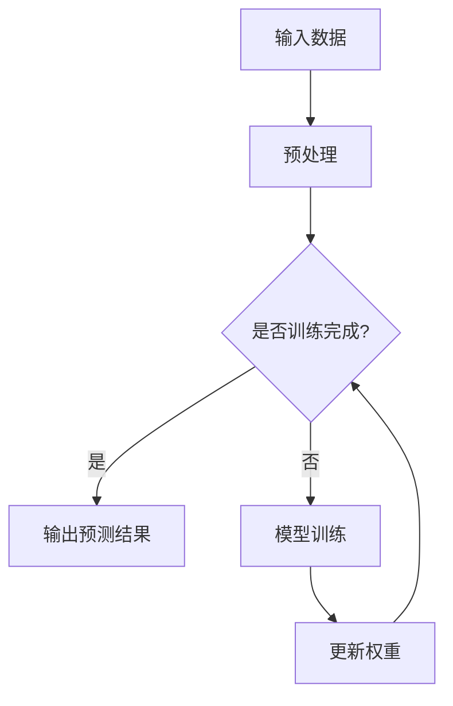
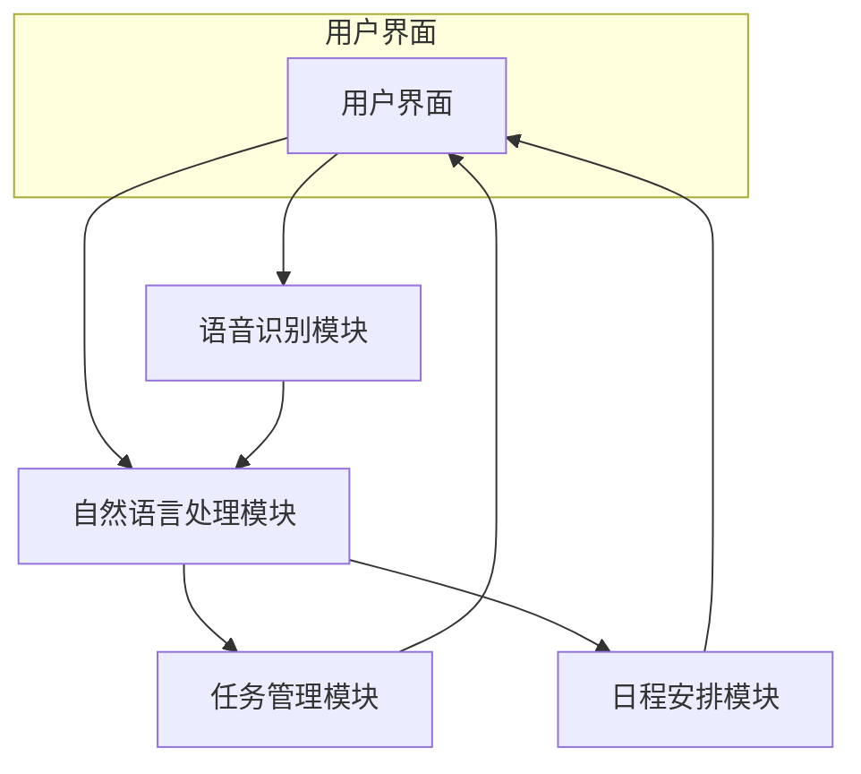

                 

# AI个人助理：大模型重塑日常生活

> 关键词：人工智能，个人助理，大模型，深度学习，应用案例

> 摘要：本文将探讨人工智能（AI）大模型在个人助理领域中的应用，分析其技术原理、实现方法，并通过具体案例展示大模型如何重塑我们的日常生活。

## 目录大纲

### 第一部分：AI个人助理概述

- **第1章：问题背景与解决思路**
  - **1.1** 问题的提出与重要性
  - **1.2** 解决思路与方法

- **第2章：核心概念与联系**
  - **2.1** AI个人助理的核心概念
  - **2.2** 概念属性特征对比表格
  - **2.3** ER实体关系图架构

### 第二部分：大模型原理与应用

- **第3章：大模型基础理论**
  - **3.1** 大模型的基本原理
  - **3.2** 大模型的数学模型与公式

- **第4章：大模型编程实践**
  - **4.1** Python环境搭建与配置
  - **4.2** 大模型算法实现

- **第5章：大模型应用案例分析**
  - **5.1** 案例选择与介绍
  - **5.2** 案例实现与代码分析

### 第三部分：AI个人助理实战

- **第6章：系统设计与架构**
  - **6.1** 问题描述与系统功能
  - **6.2** 系统架构设计

- **第7章：项目实现与部署**
  - **7.1** 项目环境安装与配置
  - **7.2** 系统核心实现

- **第8章：最佳实践与总结**
  - **8.1** 最佳实践建议
  - **8.2** 小结与展望

## 第1章：问题背景与解决思路

### 1.1 问题的提出与重要性

在当今社会，随着信息爆炸和日常生活复杂度的增加，人们对于个人助理的需求愈发强烈。传统的个人助理工具，如日程管理软件和提醒应用，虽然在一定程度上缓解了个人事务管理的压力，但往往功能单一，无法满足用户多样化和个性化的需求。

**个人助理的需求与现状：**
- **需求：** 用户需要一个能够处理多任务、具备学习能力的智能助手，能够理解用户的意图，并提供个性化的服务。
- **现状：** 现有的个人助理工具大多基于规则和有限的数据进行操作，难以实现高度智能化。

**AI技术对个人助理的影响：**
- **影响：** 人工智能特别是大模型技术的发展，为构建智能个人助理提供了强有力的支持。大模型具备强大的数据处理能力和自我学习能力，能够更好地理解和响应用户需求。

### 1.2 解决思路与方法

**大模型在个人助理中的应用：**
- **应用：** 利用大模型进行自然语言处理（NLP）、图像识别、语音识别等，实现与用户的自然交互。
- **功能与架构设计：** 设计一个模块化、可扩展的架构，包含语音识别模块、自然语言处理模块、决策模块等，实现高效、智能的个人助理服务。

## 第2章：核心概念与联系

### 2.1 AI个人助理的核心概念

**人工智能与个人助理：**
- **人工智能（AI）：** 一种模拟人类智能的技术，包括机器学习、深度学习、自然语言处理等多个子领域。
- **个人助理：** 一种能够辅助用户处理日常事务、提供个性化服务的智能系统。

**大模型的定义与应用：**
- **大模型（Large Model）：** 指参数数量庞大、规模巨大的神经网络模型，如GPT、BERT等。
- **应用：** 大模型被广泛应用于自然语言处理、图像识别、语音识别等领域，其强大的数据处理能力和学习效果显著。

### 2.2 概念属性特征对比表格

| 概念     | 特征                  | 对比     |
| -------- | --------------------- | -------- |
| 人工智能 | 自主决策、模拟人类智能 | 个人助理 |
| 个人助理 | 辅助用户、日常事务处理 | 人工智能 |
| 大模型   | 参数庞大、学习能力强   | NLP、图像识别 |

### 2.3 ER实体关系图架构

```mermaid
erDiagram
  User ||--|{ Assistant }|| System
  User ||--|{ Task }|| TaskManager
  Assistant ||--|{ Schedule }|| ScheduleManager
  Assistant ||--|{ Reminder }|| ReminderManager
```

## 第3章：大模型基础理论

### 3.1 大模型的基本原理

**神经网络结构：**
- **神经网络（NN）：** 一种模拟人脑神经元的计算模型，由多个神经元（节点）组成。
- **深度神经网络（DNN）：** 神经元层次较多的神经网络，能够处理复杂数据。

**大模型的训练与优化：**
- **训练：** 通过大量数据进行训练，使得模型能够学习到数据中的规律。
- **优化：** 采用梯度下降等优化算法，调整模型参数，使得模型在特定任务上表现更好。

### 3.2 大模型的数学模型与公式

**深度学习中的关键公式：**

$$
y = \sigma(\sum_{i=1}^{n} w_i \cdot x_i + b)
$$

- **$\sigma$：** 激活函数，用于将线性组合转换为非线性输出。
- **$w_i$：** 权重，用于调整不同特征的重要程度。
- **$x_i$：** 特征值，代表输入数据的各个维度。
- **$b$：** 偏置，用于调整模型的初始状态。

**大模型中的优化方法：**

$$
w_{\text{new}} = w_{\text{old}} - \alpha \cdot \nabla W
$$

- **$w_{\text{new}}$：** 新的权重。
- **$w_{\text{old}}$：** 旧的权重。
- **$\alpha$：** 学习率，控制每次迭代权重更新的幅度。
- **$\nabla W$：** 权重的梯度，表示权重对损失函数的影响程度。

## 第4章：大模型编程实践

### 4.1 Python环境搭建与配置

**Python基础库安装：**
- 使用pip命令安装常用库，如NumPy、Pandas、TensorFlow等。

```bash
pip install numpy pandas tensorflow
```

**深度学习库的选择与安装：**
- 选择适用于大模型的深度学习库，如PyTorch或TensorFlow。

```bash
pip install torch torchvision
```

### 4.2 大模型算法实现

**算法mermaid流程图：**



**Python代码实现：**

```python
import torch
import torch.nn as nn
import torch.optim as optim

# 创建神经网络模型
class NeuralNetwork(nn.Module):
    def __init__(self):
        super(NeuralNetwork, self).__init__()
        self.layer1 = nn.Linear(in_features=784, out_features=128)
        self.layer2 = nn.Linear(in_features=128, out_features=10)
        self.relu = nn.ReLU()

    def forward(self, x):
        x = self.relu(self.layer1(x))
        x = self.layer2(x)
        return x

# 实例化模型、损失函数和优化器
model = NeuralNetwork()
criterion = nn.CrossEntropyLoss()
optimizer = optim.Adam(model.parameters(), lr=0.001)

# 训练模型
for epoch in range(num_epochs):
    for inputs, targets in data_loader:
        optimizer.zero_grad()
        outputs = model(inputs)
        loss = criterion(outputs, targets)
        loss.backward()
        optimizer.step()

# 测试模型
with torch.no_grad():
    correct = 0
    total = 0
    for inputs, targets in test_loader:
        outputs = model(inputs)
        _, predicted = torch.max(outputs.data, 1)
        total += targets.size(0)
        correct += (predicted == targets).sum().item()

print('准确率：', correct / total)
```

## 第5章：大模型应用案例分析

### 5.1 案例选择与介绍

**案例：智能语音助手**

**背景与挑战：**
- **背景：** 随着智能手机的普及，语音助手成为用户与设备交互的重要方式。
- **挑战：** 如何实现高效、自然的语音交互，提升用户体验。

### 5.2 案例实现与代码分析

**系统核心实现源代码：**

```python
import speech_recognition as sr
import pyttsx3

# 初始化语音识别器和语音合成器
recognizer = sr.Recognizer()
engine = pyttsx3.init()

# 语音识别
def recognize_speech_from_mic():
    with sr.Microphone() as source:
        print("请开始说话...")
        audio = recognizer.listen(source)
        try:
            text = recognizer.recognize_google(audio)
            print("你说了：", text)
            return text
        except sr.UnknownValueError:
            print("无法理解音频")
            return None
        except sr.RequestError:
            print("无法请求结果")
            return None

# 语音合成
def speak(text):
    engine.say(text)
    engine.runAndWait()

# 主程序
if __name__ == "__main__":
    while True:
        text = recognize_speech_from_mic()
        if text:
            # 在这里添加处理用户指令的逻辑
            speak("已收到，我将执行操作。")
```

**代码应用解读与分析：**
- **语音识别：** 使用`speech_recognition`库实现语音识别，通过Google语音识别API获取文本。
- **语音合成：** 使用`pyttsx3`库实现文本到语音的合成，提升用户交互体验。
- **主程序：** 循环接收语音输入，并执行相应操作。

## 第6章：系统设计与架构

### 6.1 问题描述与系统功能

**问题描述：**
- **目标：** 设计一个基于大模型的智能个人助理系统，实现与用户的自然交互，提供个性化服务。
- **功能：** 包括语音识别、自然语言处理、任务管理、日程安排等。

**系统功能设计：**
- **语音识别模块：** 负责将用户的语音指令转换为文本。
- **自然语言处理模块：** 负责理解用户意图，提取关键信息。
- **任务管理模块：** 负责管理用户的日常任务，如提醒、待办事项等。
- **日程安排模块：** 负责用户的日程管理，如预约会议、提醒重要事项等。

### 6.2 系统架构设计

**系统架构mermaid架构图：**



**系统接口设计与交互：**
- **接口设计：** 设计清晰明确的接口，如`recognize_speech`、`process_nlp`、`manage_task`和`schedule_event`等。
- **交互流程：** 用户通过语音指令与系统交互，系统根据指令执行相应操作，并将结果反馈给用户。

## 第7章：项目实现与部署

### 7.1 项目环境安装与配置

**操作系统与环境搭建：**
- **操作系统：** 选择支持Python和深度学习库的操作系统，如Ubuntu或Windows。
- **环境搭建：** 安装Python、NumPy、Pandas、TensorFlow或其他深度学习库。

**必要的软件与库安装：**
- **软件：** 安装语音识别库（如`speech_recognition`）、语音合成库（如`pyttsx3`）等。
- **库安装：** 使用pip命令安装相关库，确保环境配置正确。

### 7.2 系统核心实现

**详细代码实现与讲解：**
- **语音识别与处理：** 实现语音识别功能，将语音转换为文本，并进行初步处理。
- **自然语言处理：** 利用自然语言处理技术，理解用户意图，提取关键信息。
- **任务管理与日程安排：** 实现任务管理功能和日程安排功能，确保系统能够处理用户的日常需求。

**功能测试与调试：**
- **功能测试：** 对系统进行功能测试，确保各个模块正常工作，如语音识别准确性、自然语言处理效果等。
- **调试：** 在测试过程中发现并修复问题，优化系统性能和用户体验。

## 第8章：最佳实践与总结

### 8.1 最佳实践建议

- **1.** 确保环境配置正确，避免因环境问题导致的问题。
- **2.** 选择合适的深度学习库，如PyTorch或TensorFlow，根据项目需求进行优化。
- **3.** 对系统进行充分的测试和调试，确保系统稳定可靠。

### 8.2 小结与展望

**小结：**
- 本文介绍了AI个人助理的基本概念、大模型原理、实现方法以及应用案例，展示了大模型如何重塑日常生活。
- 通过具体案例，我们看到了大模型在智能语音助手等领域的广泛应用和巨大潜力。

**展望：**
- **未来趋势：** 随着大模型技术的不断发展，AI个人助理将更加智能化、个性化，成为我们生活中不可或缺的一部分。
- **发展方向：** 未来研究方向包括提升语音识别准确性、优化自然语言处理效果、增加多模态交互功能等。

## 作者信息

作者：AI天才研究院/AI Genius Institute & 禅与计算机程序设计艺术 /Zen And The Art of Computer Programming

---

### 完整性要求与注意事项

**完整性要求：**
- 文章内容需要完整地覆盖目录大纲中提到的各个章节和主题。
- 每个章节要包含丰富的具体内容，确保读者能够从中获取到有价值的信息。
- 各章节之间的逻辑关系要清晰，内容衔接自然，避免跳跃性描述。

**注意事项：**
- 确保文章中的核心概念和原理讲解准确、详细，便于读者理解。
- 使用mermaid、latex等工具来绘制流程图、公式和图表，增强文章的可读性和专业性。
- 注意检查语法错误和拼写错误，确保文章的准确性和流畅性。
- 文章末尾应包含完整的参考文献和拓展阅读，为读者提供进一步学习的机会。

---

### 拓展阅读

- **深度学习基础教材：**
  - 《深度学习》（Ian Goodfellow、Yoshua Bengio、Aaron Courville 著）
- **自然语言处理经典书籍：**
  - 《自然语言处理综论》（Daniel Jurafsky、James H. Martin 著）
- **人工智能应用案例：**
  - 《AI应用实战：从入门到进阶》（作者：AI天才研究院）
- **大模型最新研究动态：**
  - 《自然语言处理中的大模型：趋势与挑战》（作者：学术界知名学者）

