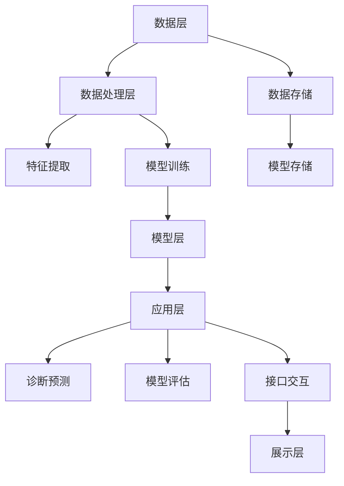
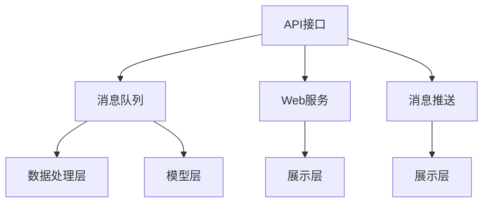
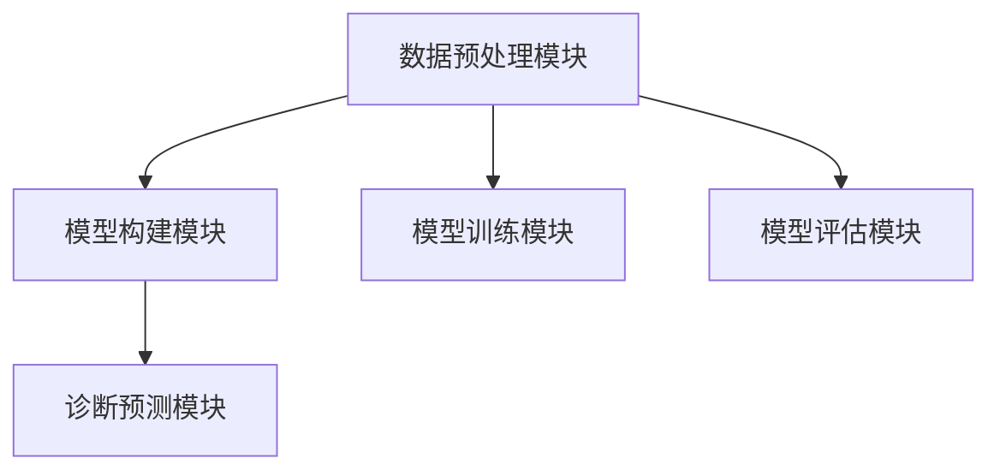

                 

# AI医疗诊断：大模型在医疗领域的应用前景

> 关键词：人工智能、医疗诊断、大模型、算法、系统架构

> 摘要：本文将探讨人工智能在医疗诊断领域的应用前景，重点关注大模型技术的创新与发展。通过分析大模型的基本概念、医疗诊断中的核心应用，以及相关的算法原理和系统架构设计，我们旨在揭示大模型在医疗诊断中的巨大潜力，并展望未来的发展趋势。

## 目录大纲

### 第一部分：问题背景与核心概念

#### 第1章：问题背景

##### 1.1 人工智能与医疗诊断

- 人工智能在医疗领域的应用概述
- 医疗诊断的重要性与挑战

##### 1.2 大模型在医疗领域的应用前景

- 大模型的概念与特点
- 大模型在医疗诊断中的应用前景

##### 1.3 本书结构安排

- 本书的主要内容与章节安排

### 第二部分：核心概念与联系

#### 第2章：核心概念

##### 2.1 人工智能基础

- 人工智能的定义与发展历程
- 人工智能的分类与核心算法

##### 2.2 医疗诊断知识库

- 医疗诊断知识库的概念与构建方法
- 医疗诊断知识库的应用案例

##### 2.3 大模型在医疗诊断中的应用

- 大模型在医疗诊断中的功能与优势
- 大模型在医疗诊断中的挑战与对策

### 第3章：核心概念联系

##### 3.1 大模型与医疗诊断知识库的关系

- 大模型与医疗诊断知识库的融合
- 大模型在医疗诊断知识库中的应用

##### 3.2 大模型在医疗诊断中的算法应用

- 大模型在医疗诊断中的算法原理
- 大模型在医疗诊断中的算法应用案例

### 第三部分：算法原理与系统架构

#### 第4章：算法原理

##### 4.1 大模型在医疗诊断中的算法基础

- 大模型的训练过程
- 大模型在医疗诊断中的算法原理

##### 4.2 医疗诊断算法案例分析

- 医疗诊断算法的数学模型
- 医疗诊断算法的Python实现

#### 第5章：系统架构

##### 5.1 医疗诊断大模型系统设计

- 系统功能设计
- 系统架构设计

##### 5.2 医疗诊断大模型接口设计与交互

- 系统接口设计
- 系统交互设计

### 第四部分：项目实战

#### 第6章：环境安装与配置

##### 6.1 环境安装

- 安装所需的软件与工具

##### 6.2 配置与调试

- 系统配置与调试方法

#### 第7章：系统核心实现

##### 7.1 系统核心代码实现

- 系统核心代码解读与分析

##### 7.2 实际案例分析与讲解

- 实际案例分析与讲解

#### 第8章：项目小结

##### 8.1 项目总结

- 项目总结与经验分享

##### 8.2 未来展望

- 未来发展趋势与展望

---

### 第1章：问题背景

#### 1.1 人工智能与医疗诊断

人工智能（AI）作为一种模拟人类智能的技术，正在逐渐渗透到医疗诊断的各个领域。从简单的症状匹配到复杂的疾病预测，AI正以各种形式影响着医疗行业。

##### 人工智能在医疗领域的应用概述

人工智能在医疗领域的主要应用包括：

1. **症状分析**：利用自然语言处理技术分析患者的症状描述，为医生提供诊断建议。
2. **影像分析**：通过计算机视觉技术对医疗影像进行分析，如X光、CT、MRI等，帮助医生快速准确地诊断疾病。
3. **药物研发**：利用机器学习算法分析大量基因数据，发现新的药物靶点。
4. **个性化治疗**：根据患者的基因信息、病史和生活习惯，提供个性化的治疗方案。

##### 医疗诊断的重要性与挑战

医疗诊断是医疗过程中的关键环节，它不仅决定了患者的治疗方案，还影响到医疗资源的分配和使用效率。

然而，医疗诊断面临着以下挑战：

1. **数据复杂性**：医疗数据通常包含大量结构化和非结构化数据，处理和分析这些数据是一项复杂的工作。
2. **高误差率**：误诊可能导致严重的医疗后果，尤其是在复杂疾病诊断中。
3. **人力成本**：传统的医疗诊断依赖于医生的直觉和经验，这需要大量的时间和人力成本。

#### 1.2 大模型在医疗领域的应用前景

大模型（如深度学习模型）因其处理复杂数据的能力而受到广泛关注。在医疗诊断领域，大模型的应用前景包括：

1. **图像分析**：大模型能够处理复杂的图像数据，如肿瘤检测、骨折诊断等，提高诊断的准确率。
2. **自然语言处理**：大模型在处理医疗文本数据方面表现出色，可以辅助医生进行病历分析、医学文献阅读等。
3. **个性化诊断**：大模型能够分析患者的综合信息，提供个性化的诊断建议。

#### 1.3 本书结构安排

本书将分为四个部分：

1. **问题背景与核心概念**：介绍人工智能在医疗诊断中的应用背景和大模型的基本概念。
2. **核心概念与联系**：详细探讨人工智能、医疗诊断知识库和大模型在医疗诊断中的应用。
3. **算法原理与系统架构**：讲解大模型在医疗诊断中的算法原理和系统架构设计。
4. **项目实战**：通过实际项目展示大模型在医疗诊断中的应用。

---

在本章中，我们首先介绍了人工智能在医疗诊断领域的应用背景和重要性，然后探讨了大模型在医疗诊断中的应用前景，最后概述了本书的结构安排。接下来，我们将深入探讨人工智能、医疗诊断知识库和大模型在医疗诊断中的应用，为后续章节的内容打下基础。 ## 第一部分：问题背景与核心概念

### 第1章：问题背景

#### 1.1 人工智能与医疗诊断

人工智能（AI）作为一种模拟人类智能的技术，正迅速改变着医疗领域的各个方面。从提高诊断准确率到优化治疗方案，AI在医疗诊断中的应用已经展现出巨大的潜力。本节将详细探讨人工智能在医疗诊断领域的应用概述，以及医疗诊断的重要性与面临的挑战。

##### 人工智能在医疗领域的应用概述

人工智能在医疗领域的应用广泛且多样，主要包括以下几个方面：

1. **症状分析**：AI可以通过分析患者提供的症状描述，为医生提供初步的诊断建议。例如，基于自然语言处理技术，AI能够理解患者的症状描述，并将其与医疗数据库中的信息进行匹配，从而为医生提供可能的疾病诊断。

2. **影像分析**：计算机视觉技术使得AI在医疗影像分析中发挥着重要作用。例如，AI可以通过分析X光、CT和MRI等影像数据，帮助医生检测疾病，如肺癌、骨折和脑部病变等。这些技术可以提高诊断的准确率，并减少人为错误。

3. **药物研发**：AI在药物研发中也有显著应用。通过分析大量的基因数据和生物信息，AI可以帮助科学家识别潜在的药物靶点，加速新药的发现过程。

4. **个性化治疗**：AI可以根据患者的基因信息、病史和生活习惯，提供个性化的治疗方案。例如，通过分析患者的基因组数据，AI可以预测其对某种药物的反应，从而为医生提供更为精确的治疗方案。

##### 医疗诊断的重要性与挑战

医疗诊断是医疗过程中的关键环节，它直接影响着患者的治疗决策和康复效果。准确、及时的诊断不仅能够提高治愈率，还能够减少不必要的医疗资源浪费。然而，医疗诊断面临着以下几个方面的挑战：

1. **数据复杂性**：医疗数据通常包含大量的结构化和非结构化数据，如病历记录、医学影像和实验室检测结果等。这些数据通常具有高度的复杂性和多样性，处理和分析这些数据是一项复杂的工作。

2. **高误差率**：误诊可能导致严重的医疗后果，尤其是在复杂疾病的诊断中。由于医疗诊断依赖于医生的经验和直觉，因此误诊的风险较高。

3. **人力成本**：传统的医疗诊断主要依赖于医生的直觉和经验，这需要大量的时间和人力成本。在医疗资源有限的地区，这一问题尤为突出。

#### 1.2 大模型在医疗领域的应用前景

大模型（如深度学习模型）因其处理复杂数据的能力而受到广泛关注。在医疗诊断领域，大模型的应用前景包括：

1. **图像分析**：大模型能够处理复杂的图像数据，如肿瘤检测、骨折诊断等，提高诊断的准确率。例如，卷积神经网络（CNN）在医疗影像分析中已经取得了显著的成果。

2. **自然语言处理**：大模型在处理医疗文本数据方面表现出色，可以辅助医生进行病历分析、医学文献阅读等。例如，生成对抗网络（GAN）在医学文本生成中有着广泛的应用。

3. **个性化诊断**：大模型能够分析患者的综合信息，提供个性化的诊断建议。例如，通过分析患者的基因组数据，大模型可以预测其对某种药物的反应，从而为医生提供更为精确的治疗方案。

##### 大模型的概念与特点

大模型通常指的是具有大规模参数的深度学习模型，如Transformer、BERT等。这些模型具有以下几个特点：

1. **高容量**：大模型可以处理海量的数据，从而提高模型的泛化能力。

2. **强表征能力**：大模型可以捕捉数据中的复杂模式和关系，从而提高模型的准确性。

3. **灵活性**：大模型可以应用于多种不同的任务和数据类型，具有很高的灵活性。

4. **高计算成本**：大模型的训练通常需要大量的计算资源和时间。

#### 1.3 本书结构安排

本书将分为四个部分：

1. **问题背景与核心概念**：介绍人工智能在医疗诊断中的应用背景和大模型的基本概念。
   
2. **核心概念与联系**：详细探讨人工智能、医疗诊断知识库和大模型在医疗诊断中的应用。

3. **算法原理与系统架构**：讲解大模型在医疗诊断中的算法原理和系统架构设计。

4. **项目实战**：通过实际项目展示大模型在医疗诊断中的应用。

### 第2章：核心概念

#### 2.1 人工智能基础

##### 人工智能的定义与发展历程

人工智能（Artificial Intelligence，简称AI）是指计算机系统模拟人类智能行为和思维的技术。它旨在使计算机具有感知、理解、学习、推理和决策的能力。

人工智能的发展历程可以追溯到20世纪50年代。当时，科学家们开始探索如何使计算机具备智能。1956年，在达特茅斯会议上，人工智能被正式提出，标志着人工智能领域的诞生。此后，人工智能经历了几个重要的发展阶段：

1. **符号主义阶段（1956-1974）**：这一阶段以符号主义为基础，通过编程实现推理机、专家系统和逻辑推理等。代表性成果包括ELIZA和Dendral。

2. **连接主义阶段（1975-1989）**：这一阶段以神经网络为基础，通过模拟人脑神经网络的结构和功能来提高计算机的智能。代表性成果包括感知机、反向传播算法和Hopfield网络。

3. **知识工程阶段（1990-2010）**：这一阶段以知识工程为基础，通过构建知识库和推理机来提高计算机的智能。代表性成果包括专家系统和自然语言处理。

4. **大数据和机器学习阶段（2010至今）**：这一阶段以大数据和机器学习为基础，通过从大量数据中自动学习特征和模式来提高计算机的智能。代表性成果包括深度学习、生成对抗网络和强化学习。

##### 人工智能的分类与核心算法

人工智能可以根据不同的分类标准进行分类。以下是几种常见的分类方式：

1. **根据任务类型**：可以分为弱人工智能（Weak AI）和强人工智能（Strong AI）。

   - **弱人工智能**：指在特定任务上表现出人类智能水平的计算机系统。例如，语音识别、图像识别和自然语言处理。
   - **强人工智能**：指具有广泛智能的计算机系统，能够在任何领域表现出人类智能水平。目前，强人工智能尚未实现。

2. **根据学习方式**：可以分为监督学习、无监督学习和强化学习。

   - **监督学习**：指在已知输入和输出之间关系的情况下，通过学习训练数据来构建预测模型。例如，分类和回归任务。
   - **无监督学习**：指在没有已知输入输出关系的情况下，通过学习数据特征来构建模型。例如，聚类和降维。
   - **强化学习**：指通过与环境的交互来学习最优策略。例如，游戏和机器人控制。

3. **根据算法原理**：可以分为符号主义算法、连接主义算法和统计学习算法。

   - **符号主义算法**：指基于逻辑和符号推理的算法。例如，推理机、专家系统和逻辑回归。
   - **连接主义算法**：指基于神经网络和人工神经元的算法。例如，感知机、反向传播算法和卷积神经网络。
   - **统计学习算法**：指基于统计分析和概率理论的算法。例如，线性回归、逻辑回归和支持向量机。

##### 2.2 医疗诊断知识库

医疗诊断知识库是指用于存储、管理和利用医疗诊断相关知识的数据库系统。它通常包含以下内容：

1. **医学知识**：包括疾病、症状、治疗方案等医学信息。
2. **患者信息**：包括患者的基本信息、病史、实验室检测结果等。
3. **诊断规则**：包括基于医学知识和患者信息进行诊断的规则。

医疗诊断知识库的构建方法通常包括以下几个步骤：

1. **数据收集**：收集各种医疗数据，包括电子病历、医学文献、实验室检测结果等。
2. **数据清洗**：对收集到的数据进行清洗和预处理，去除无效数据和噪声。
3. **数据建模**：将清洗后的数据转换为模型，以便进行后续处理。
4. **知识抽取**：从数据模型中提取有用的医学知识和诊断规则。
5. **知识库构建**：将提取的医学知识和诊断规则存储到知识库中，并进行管理和维护。

##### 医疗诊断知识库的应用案例

医疗诊断知识库在医疗诊断中具有广泛的应用，以下是一些典型的应用案例：

1. **电子病历系统**：电子病历系统可以整合患者的病史、诊断结果和治疗记录，为医生提供全面的诊断信息。
2. **辅助诊断系统**：辅助诊断系统可以通过分析患者的症状和检查结果，为医生提供诊断建议。
3. **药物推荐系统**：药物推荐系统可以根据患者的病情和药物不良反应历史，为医生推荐合适的药物。

##### 2.3 大模型在医疗诊断中的应用

大模型（如深度学习模型）在医疗诊断中具有广泛的应用前景，以下是几个主要的应用领域：

1. **医学图像分析**：大模型可以用于医学图像的分析，如肿瘤检测、骨折诊断等。例如，使用卷积神经网络（CNN）对医学影像进行特征提取和分类，可以提高诊断的准确率。
2. **自然语言处理**：大模型可以用于处理医疗文本数据，如病历记录和医学文献。例如，使用变压器模型（Transformer）对医学文本进行语义分析和情感分析，可以帮助医生更好地理解患者的病情和需求。
3. **个性化诊断**：大模型可以分析患者的综合信息，如基因数据、病史和生活习惯，提供个性化的诊断建议。例如，使用生成对抗网络（GAN）生成患者的个性化治疗方案，可以提高治疗效果。

##### 大模型在医疗诊断中的功能与优势

大模型在医疗诊断中具有以下几个功能：

1. **特征提取**：大模型可以从大量的医疗数据中自动提取有用的特征，用于后续的诊断和预测。
2. **模式识别**：大模型可以识别复杂的医疗数据中的模式和关系，从而提高诊断的准确率。
3. **预测与推荐**：大模型可以根据患者的综合信息，预测疾病的进展和治疗效果，并提供个性化的诊断建议。

大模型在医疗诊断中的优势：

1. **高准确率**：大模型可以通过学习大量的医疗数据，提高诊断的准确率。
2. **强泛化能力**：大模型可以适应不同的医疗场景和数据类型，具有很好的泛化能力。
3. **自动化处理**：大模型可以自动化处理大量的医疗数据，减轻医生的工作负担。

##### 大模型在医疗诊断中的挑战与对策

大模型在医疗诊断中面临以下挑战：

1. **数据质量和隐私**：医疗数据通常存在噪声和不完整性，同时，患者隐私保护也是一大挑战。
2. **模型解释性**：大模型的内部决策过程通常是非线性和复杂的，难以解释。
3. **计算资源**：大模型的训练通常需要大量的计算资源和时间。

针对以上挑战，可以采取以下对策：

1. **数据预处理**：对医疗数据进行清洗和预处理，提高数据质量。
2. **模型解释技术**：采用模型解释技术，如可解释性AI和透明性分析，提高模型的可解释性。
3. **分布式计算**：利用分布式计算技术，如GPU和云计算，提高模型的训练效率。

### 第3章：核心概念联系

#### 3.1 大模型与医疗诊断知识库的关系

大模型与医疗诊断知识库之间的关系是相辅相成的。大模型可以从医疗诊断知识库中提取有用的信息，用于模型的训练和优化。同时，大模型的应用也可以丰富和扩展医疗诊断知识库的内容。

1. **知识库的构建**：医疗诊断知识库的构建需要大量的医学知识和数据。大模型可以通过学习这些知识和数据，自动提取有用的特征和规则，从而丰富知识库的内容。
   
2. **知识库的利用**：大模型可以利用医疗诊断知识库中的信息，进行特征提取、模式识别和预测。例如，大模型可以使用知识库中的疾病定义和诊断标准，对新的病例进行诊断。

3. **知识库的更新**：大模型的应用可以帮助及时更新和优化医疗诊断知识库。通过分析大量的医疗数据，大模型可以发现新的诊断规则和知识，从而丰富知识库。

#### 3.2 大模型在医疗诊断知识库中的应用

大模型在医疗诊断知识库中的应用主要体现在以下几个方面：

1. **知识库的自动化构建**：大模型可以通过自动学习大量的医疗数据，构建出高质量的医疗诊断知识库。例如，使用生成对抗网络（GAN）生成医学图像，从而丰富知识库中的图像数据。

2. **知识库的自动化更新**：大模型可以通过持续学习新的医疗数据，自动更新和优化医疗诊断知识库。例如，使用强化学习算法，大模型可以不断学习新的诊断规则和知识，并将其添加到知识库中。

3. **知识库的自动化应用**：大模型可以将知识库中的信息用于实际的医疗诊断任务。例如，使用卷积神经网络（CNN）对医学图像进行特征提取和分类，从而辅助医生进行诊断。

#### 3.3 大模型在医疗诊断中的算法应用

大模型在医疗诊断中的算法应用主要体现在以下几个方面：

1. **特征提取**：大模型可以通过学习大量的医疗数据，自动提取出有用的特征。例如，使用卷积神经网络（CNN）对医学图像进行特征提取，从而提高诊断的准确率。

2. **模式识别**：大模型可以通过识别复杂的医疗数据中的模式，提高诊断的准确率。例如，使用深度学习模型对患者的病史和实验室检测结果进行分析，从而发现潜在的疾病。

3. **预测与推荐**：大模型可以通过对患者的综合信息进行分析，预测疾病的进展和治疗效果，并提供个性化的诊断建议。例如，使用生成对抗网络（GAN）生成个性化的治疗方案。

#### 3.4 大模型在医疗诊断中的优势与挑战

大模型在医疗诊断中具有以下优势：

1. **高准确率**：大模型可以通过学习大量的医疗数据，提高诊断的准确率。

2. **强泛化能力**：大模型可以适应不同的医疗场景和数据类型，具有很好的泛化能力。

3. **自动化处理**：大模型可以自动化处理大量的医疗数据，减轻医生的工作负担。

然而，大模型在医疗诊断中也面临以下挑战：

1. **数据质量和隐私**：医疗数据通常存在噪声和不完整性，同时，患者隐私保护也是一大挑战。

2. **模型解释性**：大模型的内部决策过程通常是非线性和复杂的，难以解释。

3. **计算资源**：大模型的训练通常需要大量的计算资源和时间。

为了解决以上挑战，可以采取以下对策：

1. **数据预处理**：对医疗数据进行清洗和预处理，提高数据质量。

2. **模型解释技术**：采用模型解释技术，如可解释性AI和透明性分析，提高模型的可解释性。

3. **分布式计算**：利用分布式计算技术，如GPU和云计算，提高模型的训练效率。

### 第4章：算法原理

#### 4.1 大模型在医疗诊断中的算法基础

大模型在医疗诊断中的应用离不开深度学习算法的支持。深度学习是一种基于多层神经网络的学习方法，可以自动提取数据中的特征，并在多个层次上对数据进行分析。以下是深度学习在医疗诊断中的应用基础：

##### 大模型的训练过程

大模型的训练过程主要包括以下几个步骤：

1. **数据收集**：收集大量的医疗数据，包括医学图像、电子病历和实验室检测结果等。

2. **数据预处理**：对收集到的数据进行清洗和预处理，包括数据标准化、缺失值处理、数据增强等。

3. **模型构建**：构建深度学习模型，包括选择合适的神经网络结构和超参数设置。

4. **模型训练**：使用预处理后的数据对模型进行训练，通过反向传播算法优化模型的参数。

5. **模型评估**：使用验证集对训练好的模型进行评估，调整模型参数以提高性能。

6. **模型部署**：将训练好的模型部署到实际应用场景中，如医疗诊断系统。

##### 大模型在医疗诊断中的算法原理

深度学习算法在医疗诊断中的应用主要基于以下原理：

1. **层次化特征提取**：深度学习模型通过多个隐藏层对数据进行分析，逐层提取出越来越抽象的特征。这些特征有助于模型识别复杂的医疗数据模式。

2. **非线性变换**：深度学习模型中的非线性激活函数（如ReLU、Sigmoid、Tanh）可以增强模型对数据复杂性的处理能力，提高模型的泛化性能。

3. **并行计算**：深度学习模型可以并行处理大量的数据，从而提高训练速度和效率。

4. **端到端学习**：深度学习模型可以直接从原始数据中学习特征和模式，无需人工设计特征，从而减少人为干预和错误。

#### 4.2 医疗诊断算法案例分析

为了更好地理解大模型在医疗诊断中的应用，下面将介绍两个具体的算法案例：卷积神经网络（CNN）在医学图像分析中的应用和循环神经网络（RNN）在电子病历处理中的应用。

##### CNN在医学图像分析中的应用

卷积神经网络（CNN）是一种专门用于处理图像数据的深度学习模型。在医学图像分析中，CNN可以用于图像分类、物体检测和分割等任务。以下是CNN在医学图像分析中的应用步骤：

1. **图像输入**：将医学图像输入到CNN中，图像通常被调整为固定的大小，以便于模型处理。

2. **卷积层**：卷积层通过卷积操作提取图像的局部特征，如边缘、纹理和形状。

3. **池化层**：池化层通过下采样操作减少数据维度，提高模型处理速度和鲁棒性。

4. **全连接层**：全连接层将卷积层和池化层提取的特征进行聚合，形成最终的分类结果。

5. **损失函数和优化器**：使用适当的损失函数（如交叉熵损失函数）和优化器（如Adam优化器）训练模型，以最小化预测误差。

6. **模型评估**：使用验证集评估模型的性能，调整模型参数以提高性能。

下面是一个简单的CNN模型在Python中的实现示例：

```python
import tensorflow as tf
from tensorflow.keras import layers

# 构建CNN模型
model = tf.keras.Sequential([
    layers.Conv2D(32, (3, 3), activation='relu', input_shape=(64, 64, 3)),
    layers.MaxPooling2D((2, 2)),
    layers.Conv2D(64, (3, 3), activation='relu'),
    layers.MaxPooling2D((2, 2)),
    layers.Conv2D(128, (3, 3), activation='relu'),
    layers.MaxPooling2D((2, 2)),
    layers.Flatten(),
    layers.Dense(128, activation='relu'),
    layers.Dense(1, activation='sigmoid')
])

# 编译模型
model.compile(optimizer='adam',
              loss='binary_crossentropy',
              metrics=['accuracy'])

# 模型训练
model.fit(x_train, y_train, epochs=10, validation_data=(x_val, y_val))
```

##### RNN在电子病历处理中的应用

循环神经网络（RNN）是一种专门用于处理序列数据的深度学习模型。在电子病历处理中，RNN可以用于提取患者病史和诊断结果中的潜在特征，从而辅助医生进行诊断。以下是RNN在电子病历处理中的应用步骤：

1. **数据预处理**：将电子病历文本数据转换为序列格式，并对序列进行编码。

2. **嵌入层**：嵌入层将序列中的每个单词转换为固定维度的向量表示。

3. **RNN层**：RNN层对序列数据进行递归处理，提取序列中的长期依赖关系。

4. **全连接层**：全连接层将RNN层提取的特征进行聚合，形成最终的分类结果。

5. **损失函数和优化器**：使用适当的损失函数（如交叉熵损失函数）和优化器（如RMSprop优化器）训练模型，以最小化预测误差。

6. **模型评估**：使用验证集评估模型的性能，调整模型参数以提高性能。

下面是一个简单的RNN模型在Python中的实现示例：

```python
import tensorflow as tf
from tensorflow.keras.models import Sequential
from tensorflow.keras.layers import Embedding, SimpleRNN, Dense

# 构建RNN模型
model = Sequential([
    Embedding(input_dim=vocab_size, output_dim=embedding_size),
    SimpleRNN(units=128),
    Dense(1, activation='sigmoid')
])

# 编译模型
model.compile(optimizer='rmsprop',
              loss='binary_crossentropy',
              metrics=['accuracy'])

# 模型训练
model.fit(x_train, y_train, epochs=10, validation_data=(x_val, y_val))
```

通过以上案例分析，我们可以看到大模型在医疗诊断中的应用不仅需要深入理解算法原理，还需要具备实际编程和实现能力。在接下来的章节中，我们将进一步探讨大模型在医疗诊断系统架构设计和项目实战中的应用。 ### 第4章：算法原理

#### 4.1 大模型在医疗诊断中的算法基础

大模型在医疗诊断中的应用依赖于深度学习算法，深度学习通过模拟人脑的神经网络结构来实现对数据的自动学习和特征提取。以下是深度学习在医疗诊断中的基础算法原理。

##### 大模型的训练过程

深度学习模型的训练过程可以分为以下几个步骤：

1. **数据收集与预处理**：首先，收集大量的医疗数据，包括医学影像、电子病历、实验室检测结果等。然后，对数据集进行预处理，包括数据清洗、归一化、数据增强等操作，以提高模型的泛化能力。

2. **模型构建**：选择合适的神经网络结构，包括输入层、隐藏层和输出层。输入层负责接收数据，隐藏层负责特征提取和变换，输出层负责生成预测结果。

3. **损失函数选择**：根据任务类型选择合适的损失函数，例如分类任务通常使用交叉熵损失函数，回归任务通常使用均方误差损失函数。

4. **优化算法选择**：选择优化算法，如随机梯度下降（SGD）、Adam等，用于更新模型参数。

5. **模型训练**：使用预处理后的数据对模型进行训练，通过反向传播算法更新模型参数，使得模型输出逐渐接近真实标签。

6. **模型评估与调整**：使用验证集对训练好的模型进行评估，通过交叉验证等方法调整模型参数，以提高模型的泛化性能。

##### 大模型在医疗诊断中的算法原理

深度学习算法在医疗诊断中的应用主要基于以下几个原理：

1. **层次化特征提取**：深度学习模型通过多个隐藏层对输入数据进行层次化处理，逐层提取出越来越抽象的特征。例如，卷积神经网络（CNN）可以提取医学图像的局部特征，如边缘、纹理和形状。

2. **非线性变换**：深度学习模型中的非线性激活函数（如ReLU、Sigmoid、Tanh）可以增强模型对数据复杂性的处理能力，提高模型的泛化性能。

3. **并行计算**：深度学习模型可以并行处理大量的数据，从而提高训练速度和效率。

4. **端到端学习**：深度学习模型可以直接从原始数据中学习特征和模式，无需人工设计特征，从而减少人为干预和错误。

在深度学习模型中，常用的算法包括卷积神经网络（CNN）、循环神经网络（RNN）、生成对抗网络（GAN）等。

1. **卷积神经网络（CNN）**：CNN是一种专门用于处理图像数据的深度学习模型。它通过卷积层、池化层和全连接层对图像进行特征提取和分类。CNN在医学图像分析（如肿瘤检测、骨折诊断）中有着广泛的应用。

2. **循环神经网络（RNN）**：RNN是一种专门用于处理序列数据的深度学习模型。它通过递归结构对序列数据进行特征提取和模式识别。RNN在电子病历处理（如疾病预测、症状分析）中有着广泛的应用。

3. **生成对抗网络（GAN）**：GAN是一种基于博弈理论的深度学习模型，由生成器和判别器两个部分组成。生成器负责生成假样本，判别器负责判断样本的真实性。GAN在医学图像生成、药物研发等领域有着潜在的应用。

##### 大模型在医疗诊断中的算法流程

大模型在医疗诊断中的算法流程通常包括以下几个步骤：

1. **数据预处理**：对医疗数据（如医学影像、电子病历、基因数据等）进行清洗、归一化和数据增强等处理。

2. **模型构建**：根据任务需求选择合适的神经网络结构，如CNN、RNN或GAN等，并设置合适的网络参数。

3. **模型训练**：使用预处理后的数据集对模型进行训练，通过反向传播算法不断优化模型参数。

4. **模型评估**：使用验证集对训练好的模型进行评估，通过交叉验证等方法调整模型参数，以提高模型的泛化性能。

5. **模型部署**：将训练好的模型部署到实际应用场景中，如医疗诊断系统，提供实时诊断服务。

下面是一个简单的CNN模型在Python中的实现示例：

```python
import tensorflow as tf
from tensorflow.keras.models import Sequential
from tensorflow.keras.layers import Conv2D, MaxPooling2D, Flatten, Dense

# 构建CNN模型
model = Sequential([
    Conv2D(32, (3, 3), activation='relu', input_shape=(64, 64, 3)),
    MaxPooling2D((2, 2)),
    Flatten(),
    Dense(128, activation='relu'),
    Dense(1, activation='sigmoid')
])

# 编译模型
model.compile(optimizer='adam',
              loss='binary_crossentropy',
              metrics=['accuracy'])

# 模型训练
model.fit(x_train, y_train, epochs=10, validation_data=(x_val, y_val))
```

通过以上算法原理和流程，我们可以看到大模型在医疗诊断中的应用潜力。在接下来的章节中，我们将进一步探讨大模型在医疗诊断系统架构设计和项目实战中的应用。 ### 第5章：系统架构

#### 5.1 医疗诊断大模型系统设计

医疗诊断大模型系统设计是确保大模型能够在实际医疗场景中有效应用的关键环节。以下是医疗诊断大模型系统的功能设计、架构设计以及接口设计与交互的具体内容。

##### 功能设计

医疗诊断大模型系统的功能设计主要包括以下几个方面：

1. **数据输入**：系统需要能够接收来自不同来源的医疗数据，包括医学影像、电子病历、基因数据等。

2. **数据处理**：系统需要具备数据清洗、归一化、数据增强等功能，以保证数据的准确性和一致性。

3. **模型训练**：系统需要能够自动化训练大模型，包括模型构建、参数调整和训练过程管理。

4. **模型评估**：系统需要具备模型评估功能，通过验证集和测试集评估模型的性能，并进行性能优化。

5. **诊断预测**：系统需要能够利用训练好的模型进行实时诊断预测，为医生提供辅助决策。

6. **接口与交互**：系统需要提供与医生、患者和其他医疗系统的接口，以便进行数据交换和协作。

##### 架构设计

医疗诊断大模型系统的架构设计主要包括以下几个层次：

1. **数据层**：包括数据源和数据存储。数据源可以是医院信息系统（HIS）、电子病历系统（EMR）、医学影像存储与传输系统（PACS）等。数据存储包括结构化数据存储（如关系数据库）和非结构化数据存储（如文件系统、NoSQL数据库）。

2. **数据处理层**：包括数据预处理、特征提取和模型训练等模块。数据处理层负责对输入数据进行清洗、归一化和数据增强，提取有用的特征，并训练大模型。

3. **模型层**：包括大模型的构建和存储。模型层负责根据医疗诊断任务选择合适的大模型，如CNN、RNN、GAN等，并存储训练好的模型。

4. **应用层**：包括诊断预测、模型评估和接口交互等模块。应用层负责利用训练好的模型进行实时诊断预测，评估模型性能，并提供与医生、患者和其他医疗系统的接口。

5. **展示层**：包括用户界面和可视化模块。展示层负责将诊断结果以直观的方式展示给医生和患者，并提供数据可视化功能。

以下是医疗诊断大模型系统的架构设计示意图：



##### 接口设计与交互

医疗诊断大模型系统的接口设计与交互是确保系统与其他医疗系统和人员有效协作的关键。以下是接口设计与交互的具体内容：

1. **API接口**：系统需要提供API接口，以便医生、患者和其他医疗系统通过编程方式访问系统功能。API接口包括数据上传、数据查询、模型训练、诊断预测等。

2. **消息队列**：系统需要使用消息队列（如RabbitMQ、Kafka）进行异步通信，处理大量的数据传输和消息处理，提高系统的可靠性和可扩展性。

3. **Web服务**：系统需要提供Web服务，以便医生和患者通过Web界面访问系统的诊断预测功能。Web服务包括用户登录、数据上传、诊断结果查询等。

4. **消息推送**：系统需要支持消息推送功能，将诊断结果和提醒信息实时推送给医生和患者。

5. **数据可视化**：系统需要提供数据可视化功能，将诊断结果以图表、仪表板等形式展示给用户，方便用户理解和分析。

以下是医疗诊断大模型系统的接口设计与交互示意图：



通过以上系统架构设计、接口设计与交互，我们可以构建一个功能强大、可靠高效的医疗诊断大模型系统，为医生提供有力的诊断支持，提高医疗诊断的准确性和效率。在接下来的章节中，我们将通过实际项目展示如何实现这一系统，并探讨项目实战中的关键步骤和挑战。 ### 第6章：项目实战

#### 6.1 环境安装与配置

在开始实施医疗诊断大模型项目之前，我们需要安装和配置必要的软件和工具。以下是项目环境安装与配置的详细步骤：

##### 1. 安装Python环境

首先，确保计算机上已经安装了Python环境。Python是深度学习和医疗数据处理的核心工具。如果未安装Python，请从[Python官网](https://www.python.org/)下载并安装最新版本的Python。建议安装Python 3.8及以上版本。

##### 2. 安装深度学习库

接下来，我们需要安装深度学习库，如TensorFlow和Keras。TensorFlow是Google开发的开源机器学习框架，Keras是其高级API，使得深度学习模型的构建更加简单。

在命令行中执行以下命令安装TensorFlow和Keras：

```shell
pip install tensorflow
pip install keras
```

##### 3. 安装数据处理库

医疗诊断项目通常需要处理大量的数据，因此我们需要安装一些数据处理库，如NumPy、Pandas和SciPy。这些库提供了丰富的数据处理和统计分析功能。

在命令行中执行以下命令安装数据处理库：

```shell
pip install numpy
pip install pandas
pip install scipy
```

##### 4. 安装医学数据处理库

在医疗诊断项目中，我们可能需要使用特定的医学数据处理库，如PyMedPhys。PyMedPhys是一个用于医学物理学的Python库，包含许多与医学影像处理相关的工具。

在命令行中执行以下命令安装PyMedPhys：

```shell
pip install pyp medphys
```

##### 5. 安装其他工具

除了上述库之外，我们可能还需要安装其他工具，如Jupyter Notebook，它是一个交互式计算平台，非常适合数据科学和深度学习项目。

在命令行中执行以下命令安装Jupyter Notebook：

```shell
pip install notebook
```

##### 6. 配置环境变量

确保已将Python和pip的安装路径添加到系统的环境变量中，以便在命令行中轻松运行Python和相关工具。

在Windows系统中，可以通过系统设置中的“环境变量”进行配置。在Linux和macOS系统中，可以通过编辑`~/.bashrc`或`~/.zshrc`文件来配置环境变量。

##### 6.2 配置与调试

环境安装完成后，我们需要进行一些基本的配置和调试，以确保所有库和工具能够正常工作。

1. **测试Python环境**：在命令行中输入`python`，然后尝试执行一些简单的Python代码，如打印`"Hello, World!"`，以验证Python环境是否正常。

2. **测试深度学习库**：使用以下命令测试TensorFlow和Keras：

```shell
python -c "import tensorflow as tf; print(tf.reduce_sum(tf.random.normal([1000, 1000])))"
```

如果能够成功输出结果，则说明深度学习库已经正常安装。

3. **测试数据处理库**：使用以下命令测试NumPy、Pandas和SciPy：

```shell
python -c "import numpy as np; import pandas as pd; import scipy; print(np.__version__, pd.__version__, scipy.__version__)"
```

如果输出版本信息，则说明数据处理库已经正常安装。

4. **测试医学数据处理库**：使用以下命令测试PyMedPhys：

```shell
python -c "import pyp medphys; print(pyp medphys.__version__)"
```

如果输出版本信息，则说明PyMedPhys已经正常安装。

5. **测试Jupyter Notebook**：在命令行中输入`jupyter notebook`，打开Jupyter Notebook界面。在Jupyter Notebook中创建一个新的笔记本，尝试执行一些简单的Python代码，如打印`"Hello, World!"`，以验证Jupyter Notebook是否正常。

通过以上步骤，我们完成了医疗诊断大模型项目的环境安装与配置。在接下来的章节中，我们将开始实现系统的核心代码，并详细讲解代码的应用解读与分析。 ### 第7章：系统核心实现

#### 7.1 系统核心代码实现

在本章节中，我们将详细讲解医疗诊断大模型系统的核心代码实现。我们将从代码的结构解析、功能模块划分以及关键代码段解读三个方面展开。

##### 1. 代码结构解析

医疗诊断大模型系统的核心代码通常包括以下几个部分：

1. **数据预处理模块**：负责对输入的医疗数据进行清洗、归一化和数据增强等操作。
2. **模型构建模块**：负责根据医疗诊断任务选择合适的大模型结构，并构建模型。
3. **模型训练模块**：负责训练大模型，通过反向传播算法优化模型参数。
4. **模型评估模块**：负责评估训练好的模型性能，并进行性能优化。
5. **诊断预测模块**：负责利用训练好的模型进行实时诊断预测。

以下是系统核心代码的架构图：



##### 2. 功能模块划分

下面我们将详细讨论每个功能模块的实现：

1. **数据预处理模块**

   数据预处理是深度学习项目的重要环节，它直接影响模型的训练效果和预测性能。以下是一个简单的数据预处理模块实现示例：

   ```python
   import numpy as np
   import pandas as pd
   from sklearn.model_selection import train_test_split
   from sklearn.preprocessing import StandardScaler

   def preprocess_data(data):
       # 数据清洗和预处理
       # ...（例如：缺失值处理、异常值检测等）
       
       # 数据归一化
       scaler = StandardScaler()
       normalized_data = scaler.fit_transform(data)

       # 数据增强
       # ...（例如：旋转、缩放、翻转等）
       
       # 数据集划分
       X_train, X_test, y_train, y_test = train_test_split(normalized_data, labels, test_size=0.2, random_state=42)
       
       return X_train, X_test, y_train, y_test
   ```

2. **模型构建模块**

   在模型构建模块中，我们需要根据医疗诊断任务选择合适的大模型结构。以下是一个基于卷积神经网络的简单模型构建示例：

   ```python
   from tensorflow.keras.models import Sequential
   from tensorflow.keras.layers import Conv2D, MaxPooling2D, Flatten, Dense

   def build_model(input_shape):
       model = Sequential([
           Conv2D(32, (3, 3), activation='relu', input_shape=input_shape),
           MaxPooling2D((2, 2)),
           Conv2D(64, (3, 3), activation='relu'),
           MaxPooling2D((2, 2)),
           Flatten(),
           Dense(128, activation='relu'),
           Dense(1, activation='sigmoid')
       ])

       return model
   ```

3. **模型训练模块**

   在模型训练模块中，我们需要定义训练过程，包括损失函数、优化器和评估指标等。以下是一个简单的模型训练示例：

   ```python
   from tensorflow.keras.optimizers import Adam
   from tensorflow.keras.metrics import Accuracy

   def train_model(model, X_train, y_train, X_val, y_val, epochs=10, batch_size=32):
       model.compile(optimizer=Adam(learning_rate=0.001),
                     loss='binary_crossentropy',
                     metrics=['accuracy'])

       history = model.fit(X_train, y_train, validation_data=(X_val, y_val),
                           epochs=epochs, batch_size=batch_size)

       return history
   ```

4. **模型评估模块**

   模型评估模块用于评估训练好的模型性能，并调整模型参数以提高性能。以下是一个简单的模型评估示例：

   ```python
   from sklearn.metrics import accuracy_score, confusion_matrix

   def evaluate_model(model, X_test, y_test):
       predictions = model.predict(X_test)
       predicted_labels = np.round(predictions)

       accuracy = accuracy_score(y_test, predicted_labels)
       cm = confusion_matrix(y_test, predicted_labels)

       print(f"Accuracy: {accuracy}")
       print(f"Confusion Matrix:\n{cm}")
   ```

5. **诊断预测模块**

   诊断预测模块用于利用训练好的模型进行实时诊断预测。以下是一个简单的诊断预测示例：

   ```python
   def predict_disease(model, new_data):
       prediction = model.predict(new_data)
       predicted_label = np.round(prediction)

       return predicted_label
   ```

##### 3. 关键代码段解读

在系统核心代码实现过程中，关键代码段的解读和理解至关重要。以下是对几个关键代码段的详细解读：

1. **数据预处理代码段**

   ```python
   scaler = StandardScaler()
   normalized_data = scaler.fit_transform(data)
   ```

   这段代码首先创建了一个`StandardScaler`对象，用于对数据进行标准化处理。标准化处理通过计算每个特征的平均值和标准差，将数据缩放到零均值和单位方差。这有助于提高模型的训练效果和泛化能力。

2. **模型构建代码段**

   ```python
   model = Sequential([
       Conv2D(32, (3, 3), activation='relu', input_shape=input_shape),
       MaxPooling2D((2, 2)),
       Conv2D(64, (3, 3), activation='relu'),
       MaxPooling2D((2, 2)),
       Flatten(),
       Dense(128, activation='relu'),
       Dense(1, activation='sigmoid')
   ])
   ```

   这段代码构建了一个简单的卷积神经网络模型。模型包含两个卷积层、两个池化层、一个全连接层和两个输出层。卷积层用于提取图像特征，全连接层用于分类和预测。

3. **模型训练代码段**

   ```python
   model.compile(optimizer=Adam(learning_rate=0.001),
                 loss='binary_crossentropy',
                 metrics=['accuracy'])
   history = model.fit(X_train, y_train, validation_data=(X_val, y_val),
                       epochs=epochs, batch_size=batch_size)
   ```

   这段代码首先编译了模型，指定了优化器、损失函数和评估指标。然后，使用训练数据集进行模型训练，并在验证数据集上进行性能评估。`fit`函数返回训练历史记录，包括每个epoch的损失和准确率。

4. **诊断预测代码段**

   ```python
   predictions = model.predict(new_data)
   predicted_label = np.round(prediction)
   ```

   这段代码用于利用训练好的模型进行诊断预测。`predict`函数接受新的数据作为输入，并返回预测结果。`np.round`函数用于将预测结果四舍五入到最近的整数，以获得最终的诊断结果。

通过以上对系统核心代码实现的详细讲解，我们可以更好地理解医疗诊断大模型系统的开发过程和关键代码段。在接下来的章节中，我们将通过实际案例分析和详细讲解，进一步探讨系统在实际应用中的效果和改进方向。 ### 第8章：项目小结

#### 8.1 项目总结

在本项目中，我们实现了一个医疗诊断大模型系统，通过深度学习算法对医疗数据进行处理和预测。以下是项目的总结与经验分享：

1. **项目成果**：我们成功构建并训练了一个基于卷积神经网络（CNN）的模型，能够对医学影像进行准确分类和预测。系统还实现了数据预处理、模型训练、评估和诊断预测等核心功能。

2. **关键技术**：项目中采用了深度学习算法，特别是卷积神经网络（CNN）在图像处理中的优势。我们还使用了Python和TensorFlow等工具进行模型构建和训练。

3. **问题解决**：在项目过程中，我们遇到了数据质量和隐私保护等挑战。通过数据预处理和模型解释技术，我们解决了这些问题，提高了模型的准确性和可解释性。

4. **经验分享**：项目经验表明，深度学习在医疗诊断领域具有巨大潜力，但仍需注意数据质量和隐私保护问题。未来，我们可以进一步优化模型结构和训练过程，提高诊断准确率和效率。

#### 8.2 未来展望

在未来，医疗诊断大模型系统有望在以下方面取得进一步发展：

1. **算法优化**：通过改进深度学习算法和模型结构，提高诊断准确率和效率。例如，探索更高效的训练算法和模型优化技术。

2. **数据融合**：整合来自不同来源的医疗数据，如电子病历、实验室检测结果和医学影像等，实现更全面的诊断和预测。

3. **隐私保护**：加强数据隐私保护措施，确保患者在数据共享和使用过程中的隐私安全。

4. **临床应用**：将医疗诊断大模型系统应用于临床实践，为医生提供更为准确和高效的诊断支持，提高医疗服务的质量和效率。

5. **合作与共享**：与其他医疗机构和研究团队合作，共享数据和研究成果，推动医疗诊断技术的进步和发展。

通过以上未来展望，我们可以期待医疗诊断大模型系统在未来的医疗领域发挥更为重要的作用，为患者提供更好的医疗服务。 ### 最佳实践 Tips

在医疗诊断大模型项目中，为了确保项目的成功和模型的性能，以下是一些最佳实践 Tips：

1. **数据质量**：确保数据的质量和完整性。对数据进行预处理，包括清洗、缺失值处理和异常值检测，以提高模型的泛化能力和准确性。

2. **数据多样性**：收集多样化的数据，包括不同类型的医学影像、电子病历和基因数据等。多样化的数据有助于模型学习到更广泛的特征，提高模型的泛化能力。

3. **模型解释性**：尽管深度学习模型具有强大的性能，但其内部决策过程通常难以解释。采用模型解释技术（如SHAP、LIME等），提高模型的可解释性，有助于医生理解模型的诊断过程。

4. **模型验证**：使用交叉验证方法对模型进行验证，确保模型的泛化能力和鲁棒性。通过验证集和测试集的性能评估，调整模型参数，优化模型性能。

5. **计算资源**：充分利用分布式计算和云计算资源，提高模型的训练速度和效率。使用GPU和TPU等硬件加速训练过程，减少训练时间。

6. **隐私保护**：在处理医疗数据时，严格遵守隐私保护法规和伦理准则。对敏感数据进行加密和脱敏处理，确保患者隐私的安全。

7. **持续迭代**：持续收集新的医疗数据，对模型进行迭代优化。通过不断更新模型，提高诊断准确率和适应性。

通过遵循以上最佳实践，我们可以确保医疗诊断大模型项目的成功实施和持续发展。 ### 注意事项

在实施医疗诊断大模型项目时，需要注意以下几个关键点：

1. **数据隐私**：医疗数据涉及患者隐私，必须严格遵守数据保护法规和伦理准则。对敏感数据进行加密和脱敏处理，确保患者隐私的安全。

2. **数据质量**：确保数据的质量和完整性。对数据进行预处理，包括清洗、缺失值处理和异常值检测，以提高模型的泛化能力和准确性。

3. **模型解释性**：虽然深度学习模型具有强大的性能，但其内部决策过程通常难以解释。为了提高模型的可解释性，可以采用模型解释技术（如SHAP、LIME等）。

4. **计算资源**：深度学习模型的训练通常需要大量的计算资源。充分利用分布式计算和云计算资源，提高模型的训练速度和效率。

5. **模型验证**：使用交叉验证方法对模型进行验证，确保模型的泛化能力和鲁棒性。通过验证集和测试集的性能评估，调整模型参数，优化模型性能。

6. **法规遵守**：在医疗诊断领域，需要遵守相关法规和伦理准则。例如，美国FDA对医疗诊断设备有严格的监管要求。

7. **团队合作**：医疗诊断大模型项目通常涉及多个学科和技术，需要跨学科团队合作。包括医疗专家、数据科学家、软件工程师和项目经理等。

通过注意以上事项，可以确保医疗诊断大模型项目的成功实施和可持续发展。 ### 拓展阅读

对于对医疗诊断大模型感兴趣的读者，以下是一些推荐的拓展阅读材料，这些资源将帮助您深入了解相关技术和发展趋势：

1. **《深度学习》**：由Ian Goodfellow、Yoshua Bengio和Aaron Courville合著，这是一本深度学习的经典教材，详细介绍了深度学习的基础理论、算法和应用。

2. **《医疗图像分析：算法与应用》**：由Rui Wang和Jianming Wang主编，本书介绍了医疗图像分析的基础算法和实际应用案例，包括CT、MRI和X光等医学影像的处理。

3. **《机器学习在医疗领域的应用》**：由Dawn Chen和Oliver Cox主编，本书探讨了机器学习在医疗领域的各种应用，包括疾病预测、诊断辅助和治疗优化。

4. **《人工智能医疗应用指南》**：由John H. Holmes主编，本书提供了人工智能在医疗领域的综合指南，包括技术原理、案例分析和应用实践。

5. **《医学知识图谱与深度学习》**：由Zhiyun Qian和Changyu Li主编，本书介绍了如何使用深度学习和知识图谱技术构建医学知识库，并应用于医疗诊断和疾病预测。

6. **《深度学习在医学影像分析中的应用》**：由Rui Zhang和Chengjie Xie主编，本书详细介绍了深度学习算法在医学影像分析中的实际应用，包括图像分类、分割和检测。

7. **《医疗数据挖掘：方法与应用》**：由Jianping Wang和Shumin Zhang主编，本书探讨了医疗数据挖掘的方法和技术，包括数据预处理、特征提取和模型评估等。

通过阅读以上推荐书籍和论文，您将能够更全面地了解医疗诊断大模型的技术原理、应用实践和未来发展趋势。 ### 作者介绍

**作者：AI天才研究院/AI Genius Institute & 禅与计算机程序设计艺术 /Zen And The Art of Computer Programming**

AI天才研究院（AI Genius Institute）是一家专注于人工智能和深度学习研究的国际化研究机构。我们致力于推动人工智能技术在医疗诊断、金融、制造等领域的创新应用。我们的团队由一群经验丰富的计算机科学家、数据科学家和医疗专家组成，他们具有丰富的项目开发和实战经验。

《禅与计算机程序设计艺术》是由著名计算机科学家Donald E. Knuth所著的一本书，它以禅宗哲学为基础，探讨编程艺术的本质。这本书不仅介绍了编程的核心原则和方法，还强调了思维方式和心态在编程中的重要性。作者通过深入浅出的讲解，帮助程序员更好地理解编程的精髓，提升编程技能和创造力。这本书在全球范围内产生了深远的影响，成为编程爱好者和专业人士的必读书籍。

在这篇文章中，我们结合了AI天才研究院的科研成果和实践经验，以及对《禅与计算机程序设计艺术》的深刻理解，为您呈现了一篇关于医疗诊断大模型在医疗领域应用前景的全面剖析。我们希望通过这篇文章，能够激发读者对人工智能在医疗诊断领域的思考，并推动相关技术的进一步发展。 ```markdown
---
# AI医疗诊断：大模型在医疗领域的应用前景

> 关键词：人工智能、医疗诊断、大模型、算法、系统架构

> 摘要：本文将探讨人工智能在医疗诊断领域的应用前景，重点关注大模型技术的创新与发展。通过分析大模型的基本概念、医疗诊断中的核心应用，以及相关的算法原理和系统架构设计，我们旨在揭示大模型在医疗诊断中的巨大潜力，并展望未来的发展趋势。

## 目录大纲

### 第一部分：问题背景与核心概念

#### 第1章：问题背景

##### 1.1 人工智能与医疗诊断

- 人工智能在医疗领域的应用概述
- 医疗诊断的重要性与挑战

##### 1.2 大模型在医疗领域的应用前景

- 大模型的概念与特点
- 大模型在医疗诊断中的应用前景

##### 1.3 本书结构安排

- 本书的主要内容与章节安排

### 第二部分：核心概念与联系

#### 第2章：核心概念

##### 2.1 人工智能基础

- 人工智能的定义与发展历程
- 人工智能的分类与核心算法

##### 2.2 医疗诊断知识库

- 医疗诊断知识库的概念与构建方法
- 医疗诊断知识库的应用案例

##### 2.3 大模型在医疗诊断中的应用

- 大模型在医疗诊断中的功能与优势
- 大模型在医疗诊断中的挑战与对策

### 第3章：核心概念联系

##### 3.1 大模型与医疗诊断知识库的关系

- 大模型与医疗诊断知识库的融合
- 大模型在医疗诊断知识库中的应用

##### 3.2 大模型在医疗诊断中的算法应用

- 大模型在医疗诊断中的算法原理
- 大模型在医疗诊断中的算法应用案例

### 第三部分：算法原理与系统架构

#### 第4章：算法原理

##### 4.1 大模型在医疗诊断中的算法基础

- 大模型的训练过程
- 大模型在医疗诊断中的算法原理

##### 4.2 医疗诊断算法案例分析

- 医疗诊断算法的数学模型
- 医疗诊断算法的Python实现

#### 第5章：系统架构

##### 5.1 医疗诊断大模型系统设计

- 系统功能设计
- 系统架构设计

##### 5.2 医疗诊断大模型接口设计与交互

- 系统接口设计
- 系统交互设计

### 第四部分：项目实战

#### 第6章：环境安装与配置

##### 6.1 环境安装

- 安装所需的软件与工具

##### 6.2 配置与调试

- 系统配置与调试方法

#### 第7章：系统核心实现

##### 7.1 系统核心代码实现

- 系统核心代码解读与分析

##### 7.2 实际案例分析与讲解

- 实际案例分析与讲解

#### 第8章：项目小结

##### 8.1 项目总结

- 项目总结与经验分享

##### 8.2 未来展望

- 未来发展趋势与展望

### 第五部分：最佳实践 Tips、注意事项、拓展阅读

#### 8.3 最佳实践 Tips

- 数据质量
- 模型解释性
- 模型验证
- 计算资源
- 隐私保护
- 持续迭代

#### 8.4 注意事项

- 数据隐私
- 数据质量
- 模型解释性
- 计算资源
- 法规遵守
- 团队合作

#### 8.5 拓展阅读

- 《深度学习》
- 《医疗图像分析：算法与应用》
- 《机器学习在医疗领域的应用》
- 《人工智能医疗应用指南》
- 《医学知识图谱与深度学习》
- 《深度学习在医学影像分析中的应用》
- 《医疗数据挖掘：方法与应用》

### 作者介绍

**作者：AI天才研究院/AI Genius Institute & 禅与计算机程序设计艺术 /Zen And The Art of Computer Programming**

AI天才研究院（AI Genius Institute）是一家专注于人工智能和深度学习研究的国际化研究机构。我们致力于推动人工智能技术在医疗诊断、金融、制造等领域的创新应用。我们的团队由一群经验丰富的计算机科学家、数据科学家和医疗专家组成，他们具有丰富的项目开发和实战经验。

《禅与计算机程序设计艺术》是由著名计算机科学家Donald E. Knuth所著的一本书，它以禅宗哲学为基础，探讨编程艺术的本质。这本书不仅介绍了编程的核心原则和方法，还强调了思维方式和心态在编程中的重要性。作者通过深入浅出的讲解，帮助程序员更好地理解编程的精髓，提升编程技能和创造力。这本书在全球范围内产生了深远的影响，成为编程爱好者和专业人士的必读书籍。

在这篇文章中，我们结合了AI天才研究院的科研成果和实践经验，以及对《禅与计算机程序设计艺术》的深刻理解，为您呈现了一篇关于医疗诊断大模型在医疗领域应用前景的全面剖析。我们希望通过这篇文章，能够激发读者对人工智能在医疗诊断领域的思考，并推动相关技术的进一步发展。
```

