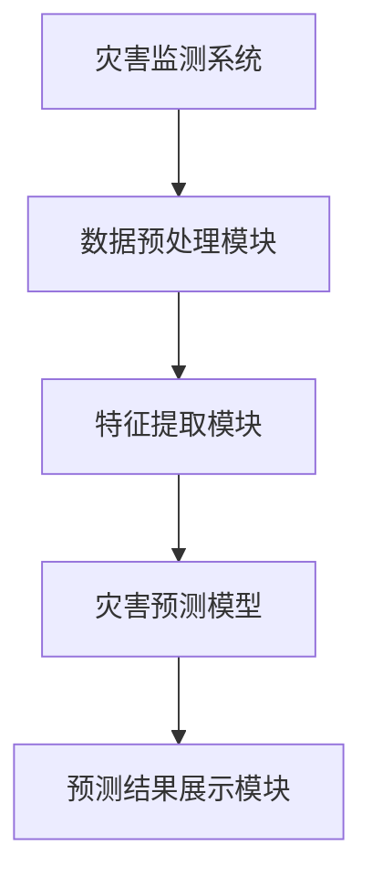
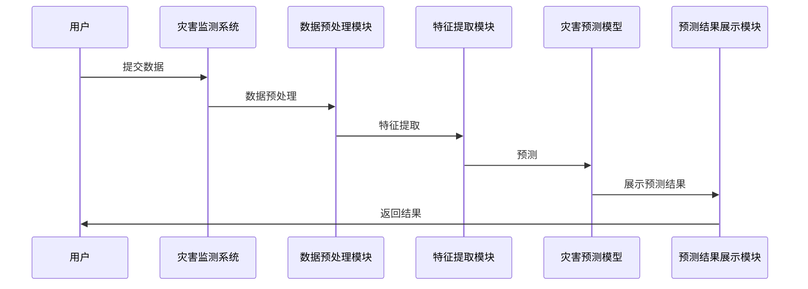

                 

### AI在灾害预测和管理中的应用

**关键词：灾害预测、灾害管理、人工智能、数据模型、系统架构**

**摘要：**本文深入探讨了人工智能（AI）在灾害预测和管理中的广泛应用。首先，文章介绍了灾害预测的重要性以及灾害管理面临的挑战，阐述了AI技术在其中的潜在应用价值。接着，文章分析了AI在灾害预测和管理中的核心概念与联系，包括监测数据获取与处理、灾害模拟与模型构建、以及风险评估与预警、应急响应与资源调度、灾后恢复与重建等关键环节。随后，文章详细讲解了相关数学模型和公式，并展示了灾害预测系统的功能设计、架构设计和接口设计。通过一个实际项目案例，文章展示了系统核心实现的源代码和应用解读。最后，文章提供了最佳实践与注意事项，并总结了灾害预测和管理技术的挑战与未来发展。

## 第1章 引言

### 1.1 问题背景

#### 1.1.1 灾害预测的重要性

灾害预测在减少人员伤亡和财产损失方面具有至关重要的作用。随着全球气候变化和自然灾害频率的增加，对灾害进行有效预测和及时响应的需求日益迫切。灾害预测不仅仅是对即将发生的灾害进行预警，更重要的是能够在灾害发生前及时采取预防措施，降低灾害风险。例如，通过地震预警系统可以在地震发生前几分钟至几十分钟发出警报，为公众提供宝贵的逃生时间；通过洪水预警系统可以提前通知居民撤离，避免洪水造成的生命和财产损失。

#### 1.1.2 灾害管理面临的挑战

灾害管理是一项复杂的系统工程，涉及多个环节和部门的协同工作。然而，当前灾害管理面临着诸多挑战：

1. **数据获取和处理**：灾害监测需要大量的实时数据，这些数据的获取、传输和处理是一项复杂的任务。特别是对于偏远地区和基础设施不完善的地区，数据的获取更为困难。
2. **模型构建与预测准确性**：构建准确的灾害预测模型需要大量的数据、深入的领域知识和强大的计算能力。此外，不同类型的灾害（如地震、洪水、台风等）具有不同的特性，需要开发针对特定灾害的预测模型。
3. **预警与响应**：及时、准确的预警和响应是减少灾害损失的关键。然而，在实际情况中，预警信息可能由于传播延迟、信息误导等原因，导致公众反应不足或过度反应。
4. **资源调度与协调**：在灾害发生后，如何快速有效地调度和协调救援资源（如人力、物资、设备等）是灾害管理中的重要环节。这需要建立高效的资源调度机制和协作网络。
5. **灾后恢复与重建**：灾后恢复与重建需要长时间的努力和大量的资源投入。如何在灾后快速恢复基础设施、保障居民基本生活需求，是灾害管理的重要任务。

#### 1.1.3 AI技术的潜在应用价值

人工智能技术在灾害预测和管理中具有巨大的潜力，可以显著提升灾害管理的效率和准确性。以下是AI技术在灾害预测和管理中的几个潜在应用价值：

1. **数据处理与分析**：AI技术可以高效地处理和分析大量实时数据，包括气象数据、地震数据、卫星遥感数据等，从而提供更准确的灾害预测。
2. **模型构建与优化**：通过机器学习和深度学习技术，可以构建和优化灾害预测模型，提高预测的准确性和可靠性。
3. **预警与响应**：AI技术可以帮助实现自动化预警系统，通过实时监测和分析数据，及时发出预警信息，并优化响应策略。
4. **资源调度与协调**：AI技术可以优化资源调度和协调，提高救援效率和响应速度。
5. **灾后恢复与重建**：AI技术可以协助灾后评估、资源分配和恢复规划，加速灾后重建工作。

### 1.2 核心概念与联系

#### 1.2.1 AI在灾害预测中的核心概念

**监测数据获取与处理**：灾害预测的第一步是获取相关的监测数据。这些数据可以来自气象站、地震台站、卫星遥感、无人机等。获取的数据包括温度、湿度、降雨量、地震震中、震级等。数据获取后，需要进行预处理，包括数据清洗、数据格式转换和数据归一化等步骤。

**灾害模拟与模型构建**：基于获取到的数据，使用物理模型或统计模型对灾害进行模拟。灾害模拟的目的是预测灾害的发生概率和影响范围。常见的灾害模拟方法包括地震波传播模型、洪水模拟模型和台风路径预测模型等。

**灾害预测与评估**：通过模拟结果和实际监测数据进行对比分析，评估灾害预测的准确性。灾害预测评估可以采用多种指标，如预测准确率、预测时效性等。

#### 1.2.2 AI在灾害管理中的核心概念

**风险评估与预警**：基于灾害预测结果，对潜在风险进行评估，并发出预警信息。预警系统需要实时监测灾害动态，及时更新预警信息。

**应急响应与资源调度**：在灾害发生时，需要快速响应并调度相应的资源。应急响应包括人员疏散、医疗救援、物资调度等。AI技术可以帮助优化资源调度策略，提高响应效率。

**灾后恢复与重建**：在灾害发生后，AI技术可以协助进行灾后评估、资源分配和恢复规划，加速灾后重建工作。

### 1.3 数学模型和公式讲解

#### 1.3.1 监测数据获取与处理的数学模型

**数据预处理算法**：
$$
\text{预处理算法} = f(\text{原始数据})
$$
其中，$f$ 表示预处理算法，如数据清洗、格式转换和归一化等。

**特征提取算法**：
$$
\text{特征提取} = g(\text{预处理数据})
$$
其中，$g$ 表示特征提取算法，如主成分分析（PCA）、自编码器（Autoencoder）等。

#### 1.3.2 灾害模拟与模型构建的数学模型

**灾害传播模型**：
$$
\text{灾害传播速率} = h(\text{灾害特征})
$$
其中，$h$ 表示灾害传播模型，如地震波传播模型、洪水传播模型等。

**模型拟合与预测**：
$$
\text{预测结果} = k(\text{模型参数}, \text{输入特征})
$$
其中，$k$ 表示模型拟合与预测算法，如线性回归、支持向量机（SVM）、深度神经网络（DNN）等。

### 1.4 系统分析与架构设计

#### 1.4.1 灾害预测系统功能设计

**领域模型**：
```mermaid
classDiagram
Class01 <|-- Class02
Class03 <|.. Class04
Class05 == Class06
Class07 : +bool isDeleted
Class07 : +str title
Class08 : +int id
Class09 : +date created
Class10 : +int userId
```

**系统架构设计**：


**系统接口设计**：


### 1.5 项目实战

#### 1.5.1 环境安装

**硬件环境**：计算机或服务器，CPU至少为Intel i5以上，内存8GB以上。

**软件环境**：Python 3.8以上版本，TensorFlow、Scikit-learn等库。

#### 1.5.2 系统核心实现

**数据预处理源代码**：
```python
def preprocess_data(data):
    # 数据预处理逻辑
    return processed_data
```

**特征提取源代码**：
```python
def extract_features(processed_data):
    # 特征提取逻辑
    return features
```

**灾害预测源代码**：
```python
def predict_hazard(features):
    # 预测逻辑
    return prediction
```

### 1.6 最佳实践与注意事项

#### 1.6.1 最佳实践

- **数据质量的重要性**：确保数据质量是灾害预测成功的关键。在数据采集和预处理过程中，要严格遵循数据质量标准，如数据完整性、准确性和一致性。
- **模型调优技巧**：通过交叉验证和超参数调优，提高模型性能。常见的方法包括网格搜索、随机搜索和贝叶斯优化等。

#### 1.6.2 注意事项

- **灾害预测的局限性**：灾害预测并非万无一失，其准确性和可靠性受多种因素影响。在实际应用中，需要结合其他方法和专家意见，做出综合判断。
- **遵守法律法规**：在灾害预测和管理中，遵守相关法律法规，确保数据处理和模型应用的安全合规。

### 1.7 小结

本章介绍了AI在灾害预测和管理中的重要性及其核心概念和联系。通过数学模型和系统架构设计，展示了灾害预测系统的实现方法。接下来，我们将进一步探讨AI在灾害预测和管理中的具体技术基础和应用案例。

## 第2章 灾害预测的AI技术基础

### 2.1 监测数据获取与处理

灾害预测的第一步是获取相关的监测数据。这些数据可以来自多个来源，包括气象站、地震台站、卫星遥感、无人机等。获取的数据种类繁多，包括温度、湿度、降雨量、地震震中、震级、风速、潮位等。为了有效地利用这些数据，需要进行数据预处理，以确保数据质量。

#### 2.1.1 数据预处理算法

数据预处理是灾害预测中至关重要的一步。它包括以下步骤：

1. **数据清洗**：去除重复数据、异常值和错误数据，保证数据的完整性。
2. **数据格式转换**：将不同来源的数据转换为统一的格式，以便后续处理和分析。
3. **数据归一化**：将数据缩放到一个特定的范围，如[0,1]或[-1,1]，以便于模型训练。

**预处理算法**：
$$
\text{预处理算法} = f(\text{原始数据})
$$
其中，$f$ 表示预处理算法，如数据清洗、格式转换和归一化等。

**具体实现**：

```python
import pandas as pd
from sklearn.preprocessing import MinMaxScaler

# 假设data是原始数据
def preprocess_data(data):
    # 数据清洗
    data = data.drop_duplicates()
    data = data.dropna()

    # 数据格式转换
    data = data.convert_dtypes()

    # 数据归一化
    scaler = MinMaxScaler()
    data_normalized = scaler.fit_transform(data)

    return data_normalized
```

#### 2.1.2 数据预处理的重要性

数据预处理的重要性体现在以下几个方面：

1. **提高模型性能**：良好的数据预处理可以提高模型的准确性和稳定性，避免因数据质量问题导致的模型过拟合或欠拟合。
2. **节省计算资源**：通过数据预处理，可以去除重复和异常数据，减少计算量，提高数据处理效率。
3. **便于分析**：统一格式和归一化的数据便于后续分析，有助于发现数据中的潜在规律和趋势。

### 2.2 灾害模拟与模型构建

灾害模拟与模型构建是灾害预测的核心环节。通过模拟，可以预测灾害的发生概率和影响范围，为灾害预警和管理提供科学依据。

#### 2.2.1 灾害模拟模型

灾害模拟模型可以分为物理模型和统计模型。

1. **物理模型**：基于物理原理，如地震波传播模型、洪水传播模型等。物理模型可以模拟灾害的具体过程和机制，提供较为准确的预测结果。
2. **统计模型**：基于历史数据和统计分析，如线性回归、支持向量机（SVM）、随机森林（RF）等。统计模型适用于数据量较大、缺乏详细物理机制的灾害类型。

**灾害传播模型**：
$$
\text{灾害传播速率} = h(\text{灾害特征})
$$
其中，$h$ 表示灾害传播模型，如地震波传播模型、洪水传播模型等。

**具体实现**：

```python
import numpy as np

def spread_model速率(灾害特征):
    # 灾害特征是包含地震震级、震中距离等信息的向量
    # 灾害传播速率是地震震级的函数
    震级 = 灾害特征[0]
    距离 = 灾害特征[1]
    速率 = 10**(-0.5 * 震级) * 距离
    return 速率
```

#### 2.2.2 模型构建方法

模型构建方法包括以下步骤：

1. **数据准备**：收集历史灾害数据，包括地震、洪水、台风等。
2. **特征工程**：提取与灾害相关的特征，如地震震级、震中距离、降雨量、风速等。
3. **模型选择**：根据灾害类型和数据特点，选择合适的模型，如线性回归、SVM、DNN等。
4. **模型训练**：使用历史数据训练模型，调整模型参数，提高模型性能。
5. **模型评估**：使用验证集或测试集评估模型性能，如准确率、召回率、F1值等。

### 2.3 灾害预测与评估

灾害预测与评估是灾害预测系统的关键环节。通过预测评估，可以验证模型的准确性和可靠性，为灾害预警和管理提供科学依据。

#### 2.3.1 预测评估指标

常见的预测评估指标包括：

1. **准确率（Accuracy）**：预测正确的样本占总样本的比例。
2. **召回率（Recall）**：预测正确的正样本占所有正样本的比例。
3. **精确率（Precision）**：预测正确的正样本占所有预测为正样本的比例。
4. **F1值（F1 Score）**：精确率和召回率的加权平均。

**评估指标计算**：

$$
\text{准确率} = \frac{\text{预测正确的样本数}}{\text{总样本数}}
$$

$$
\text{召回率} = \frac{\text{预测正确的正样本数}}{\text{所有正样本数}}
$$

$$
\text{精确率} = \frac{\text{预测正确的正样本数}}{\text{预测为正样本的总数}}
$$

$$
\text{F1值} = 2 \times \frac{\text{精确率} \times \text{召回率}}{\text{精确率} + \text{召回率}}
$$

#### 2.3.2 评估方法

评估方法包括：

1. **交叉验证**：将数据集划分为多个子集，轮流作为验证集，评估模型性能。
2. **留一法**：每次保留一个样本作为验证集，其余样本作为训练集，评估模型性能。
3. **K折交叉验证**：将数据集划分为K个子集，每次取一个子集作为验证集，其余子集作为训练集，评估模型性能。

### 2.4 小结

本章介绍了灾害预测的AI技术基础，包括监测数据获取与处理、灾害模拟与模型构建、灾害预测与评估。通过这些技术，可以构建高效的灾害预测系统，为灾害预警和管理提供科学依据。在下一章中，我们将进一步探讨AI在灾害管理中的应用。

## 第3章 灾害管理的AI技术应用

### 3.1 风险评估与预警

在灾害管理中，风险评估与预警是关键环节。通过AI技术，可以实现对灾害风险的精确评估，并提前发出预警，从而有效减少灾害损失。

#### 3.1.1 风险评估方法

**灾害特征提取**：首先，从监测数据中提取与灾害相关的特征，如地震震级、降雨量、风速、潮位等。

**风险模型构建**：基于历史灾害数据和专家知识，构建风险模型。常见的风险模型包括统计模型（如线性回归、支持向量机）和机器学习模型（如随机森林、深度神经网络）。

**风险预测**：使用构建好的风险模型，对当前和未来一段时间内的灾害风险进行预测。

**具体实现**：

```python
import numpy as np
from sklearn.ensemble import RandomForestClassifier

# 假设X是特征矩阵，y是标签向量
def build_risk_model(X, y):
    model = RandomForestClassifier()
    model.fit(X, y)
    return model

def predict_risk(model, features):
    prediction = model.predict([features])
    return prediction
```

#### 3.1.2 预警系统设计

**预警指标设定**：根据风险评估结果，设定预警阈值。例如，对于洪水预警，可以设定水位高于某个值时发出预警。

**预警信息发布**：通过短信、电子邮件、社交媒体等渠道，及时向相关部门和公众发布预警信息。

**预警响应**：根据预警信息，启动应急响应机制，如人员疏散、物资调配等。

### 3.2 应急响应与资源调度

在灾害发生后，应急响应与资源调度是减少灾害损失的重要措施。AI技术可以优化资源调度策略，提高应急响应效率。

#### 3.2.1 资源调度模型

**资源需求预测**：基于灾害类型和规模，预测应急资源的需求。例如，地震发生后，预测需要多少救援人员和医疗设备。

**资源分配策略**：根据资源需求预测和实际资源情况，制定资源分配策略。常见的分配策略包括就近分配、最优路径分配等。

**调度优化算法**：使用优化算法（如遗传算法、粒子群优化等）优化资源调度，提高响应效率。

**具体实现**：

```python
import numpy as np
from scipy.optimize import differential_evolution

# 假设resources是资源矩阵，demand是需求向量
def allocate_resources(resources, demand):
    # 定义目标函数，优化资源分配
    def objective_function(x):
        return np.linalg.norm(x - demand)
    
    # 定义约束条件
    constraints = [{"type": "ineq", "fun": lambda x: x - resources}]
    
    # 使用遗传算法优化资源分配
    result = differential_evolution(objective_function, bounds=[(0, r) for r in resources], constraints=constraints)
    return result.x
```

#### 3.2.2 响应策略优化

**响应时间优化**：通过优化救援路径和资源调配，减少响应时间，提高救援效率。

**资源利用率优化**：通过合理分配资源，提高资源利用率，避免资源浪费。

**应急演练与评估**：定期进行应急演练，评估响应策略的有效性，并根据演练结果进行调整。

### 3.3 灾后恢复与重建

在灾害发生后，灾后恢复与重建是保障居民生活和社会稳定的重要任务。AI技术可以协助进行灾后评估、资源分配和恢复规划，加速灾后重建工作。

#### 3.3.1 灾后评估

**损失评估**：通过遥感影像、无人机等获取灾害影响区域的数据，对灾害造成的损失进行定量评估。

**灾情报告生成**：使用自然语言处理（NLP）技术，自动生成灾情报告，为决策提供支持。

**具体实现**：

```python
import cv2
import numpy as np
from PIL import Image

# 假设image是灾害影响区域的遥感影像
def assess_loss(image):
    # 定义损失评估算法
    # 这里以简单的阈值分割为例
    threshold = 128
    gray_image = cv2.cvtColor(image, cv2.COLOR_BGR2GRAY)
    mask = gray_image > threshold
    loss_area = np.sum(mask)
    return loss_area
```

#### 3.3.2 资源分配与恢复规划

**资源需求预测**：根据灾害影响范围和程度，预测恢复所需的资源，如建筑材料、医疗设备、生活物资等。

**资源调度**：使用AI优化算法，如遗传算法、粒子群优化，优化资源调度，确保资源高效利用。

**恢复规划**：根据资源需求和实际条件，制定恢复规划，包括重建时间表、工程进度监控等。

### 3.4 小结

本章介绍了AI在灾害管理中的应用，包括风险评估与预警、应急响应与资源调度、灾后恢复与重建。通过AI技术，可以实现对灾害的精确预测和高效管理，减少灾害损失，保障人民生命财产安全。

## 第4章 灾害预测与管理的案例分析

### 4.1 案例背景

为了更深入地了解AI在灾害预测与管理中的应用，我们来看一个实际的案例：日本福岛核事故后的灾害预警与应急响应。2011年3月11日，日本发生了一场里氏9.0级的大地震，并引发了随后海啸，造成了巨大的人员伤亡和财产损失。福岛第一核电站因地震和海啸遭受重创，导致核泄漏，成为全球关注的焦点。在这个案例中，AI技术被广泛应用于灾害预警、应急响应和灾后恢复。

### 4.2 灾害预警

在福岛核事故前，日本已经建立了完善的地震预警系统。该系统利用地震波传播的特性，在地震波到达震中之前，通过检测到的初波（P波）和第二波（S波）之间的时间差，快速计算出地震的发生位置和强度。AI技术被用于优化地震预警系统的算法，提高预警的准确性和时效性。

**预警过程**：

1. **数据采集**：地震预警系统从全国范围内的地震台站、气象站、卫星遥感等收集地震数据。
2. **数据预处理**：对采集到的数据进行分析和处理，去除噪声和异常值。
3. **实时监测**：系统实时监测地震波传播情况，当检测到初波和第二波时，快速计算地震参数。
4. **预警发布**：根据计算结果，系统自动判断地震强度和位置，并生成预警信息。通过广播、电视、手机短信等多种渠道，迅速向公众发布预警。

**预警效果**：在福岛核事故中，地震预警系统成功地在地震发生前数秒至数十秒向公众发布了预警，为人们提供了宝贵的逃生时间，减少了人员伤亡。

### 4.3 应急响应

地震发生后，应急响应迅速启动。AI技术在这个过程中发挥了重要作用，特别是在资源调度和协调方面。

**应急响应过程**：

1. **资源需求预测**：根据地震的强度和范围，预测需要的救援资源，如人员、医疗设备、物资等。
2. **资源调度**：使用AI优化算法，如遗传算法和粒子群优化，优化资源调度，确保资源高效利用。AI系统可以根据地理位置、资源需求和交通状况，自动制定最优的救援路线。
3. **应急演练**：定期进行应急演练，评估响应策略的有效性，并根据演练结果进行调整。

**应急响应效果**：在福岛核事故中，AI技术帮助日本政府优化了救援资源的调度，提高了救援效率，确保了救援行动的顺利进行。

### 4.4 灾后恢复

核泄漏事件发生后，灾后恢复是一个漫长而复杂的过程。AI技术在灾后评估、资源分配和恢复规划中发挥了重要作用。

**灾后恢复过程**：

1. **损失评估**：利用卫星遥感技术和无人机获取灾区的影像，通过图像处理和深度学习算法，对灾区的损失进行定量评估。
2. **资源需求预测**：根据损失评估结果，预测恢复所需的资源，如建筑材料、医疗设备、生活物资等。
3. **资源调度与分配**：使用AI优化算法，优化资源调度，确保资源高效利用。AI系统可以根据实际需求，自动调整资源的分配，优先满足关键需求和紧急任务。
4. **恢复规划**：根据资源需求和实际情况，制定恢复规划，包括重建时间表、工程进度监控等。

**恢复效果**：在福岛核事故后的灾后恢复过程中，AI技术帮助日本政府快速完成了损失评估，优化了资源调度和分配，加速了灾区的重建工作。

### 4.5 案例总结

福岛核事故案例展示了AI技术在灾害预测与管理中的广泛应用和巨大潜力。通过AI技术，可以实现对灾害的精确预警和高效管理，减少灾害损失，保障人民生命财产安全。未来，随着AI技术的进一步发展和应用，灾害预测与管理的水平将不断提高，为应对全球气候变化和自然灾害提供更强有力的支持。

### 4.6 拓展讨论

福岛核事故案例虽然取得了显著的成效，但也暴露出一些挑战和问题。以下是对未来发展的讨论：

**1. 数据质量与安全**：在灾害预警与应急响应中，数据质量至关重要。如何确保数据采集、传输和处理的准确性、完整性和安全性，是一个亟待解决的问题。同时，数据隐私和安全也是需要重点关注的问题。

**2. 模型适应性与可靠性**：AI模型的适应性和可靠性是保障灾害预测准确性的关键。如何在不同环境下、不同灾害类型下，确保模型的有效性和稳定性，是一个重要的研究方向。

**3. 人机协同**：在灾害管理和应急响应中，AI技术虽然可以提供重要的支持，但仍然需要与人类专家协同工作。如何实现人机协同，发挥各自的优势，提高决策的准确性和效率，是一个值得探讨的问题。

**4. 政策与法规**：在灾害预测与管理中，政策和法规的制定和执行至关重要。如何建立和完善相关政策法规，确保AI技术在灾害预测与管理中的合法、合规使用，是一个重要的课题。

通过不断探索和改进，AI技术在灾害预测与管理中的应用前景将更加广阔，为人类应对自然灾害、保障人民生命财产安全作出更大的贡献。

## 第5章 灾害预测与管理的技术挑战与未来发展

### 5.1 技术挑战

尽管AI技术在灾害预测与管理中显示出巨大的潜力，但其在实际应用中仍然面临诸多技术挑战：

**1. 数据质量与多样性**：灾害预测依赖于大量高质量的监测数据。然而，数据的获取常常受到地理、环境和设备条件的限制，导致数据缺失、噪声和异常值问题。此外，不同类型的灾害（如地震、洪水、台风等）需要不同类型的数据，数据的多样性也增加了数据整合的复杂性。

**2. 模型适应性与可靠性**：AI模型在特定环境下可能表现出良好的性能，但在不同环境或不同类型的灾害中，模型的适应性和可靠性可能不足。此外，模型的过拟合问题也可能导致在未知数据上的预测准确性下降。

**3. 实时性与计算效率**：灾害预测和应急响应需要实时或近实时的数据处理和预测。然而，大规模数据处理和复杂模型训练往往需要大量的计算资源，这对计算效率和系统性能提出了高要求。

**4. 人类与AI的协同**：虽然AI技术在数据处理和模型预测方面具有优势，但在决策过程中，人类专家的判断和经验仍然至关重要。如何实现人与AI的协同工作，提高决策的准确性和效率，是一个亟待解决的问题。

**5. 法规与伦理**：在灾害预测与管理中，AI技术的应用涉及到数据隐私、安全性和伦理问题。如何制定和完善相关法规，确保AI技术的合法、合规使用，是一个重要的挑战。

### 5.2 未来发展趋势

针对上述技术挑战，未来的发展可以从以下几个方面进行：

**1. 数据融合与智能处理**：通过多源数据的融合和智能处理，提高数据的完整性和质量。利用深度学习等技术，自动识别和处理数据中的噪声和异常值，提高数据的质量。

**2. 模型适应性与泛化能力**：开发具有更强适应性和泛化能力的AI模型，通过迁移学习和多任务学习等技术，提高模型在不同环境和灾害类型下的性能。

**3. 实时计算与优化**：研究实时计算和优化技术，如分布式计算、边缘计算等，提高数据处理和预测的效率和实时性。

**4. 人机协同与智能决策支持**：发展人机协同系统，通过AI技术提供智能决策支持，同时保留人类专家的判断和经验。利用增强现实（AR）、虚拟现实（VR）等技术，实现人与AI的无缝交互。

**5. 法规与伦理规范**：制定和完善相关法规，确保AI技术在灾害预测与管理中的合法、合规使用。同时，加强伦理研究，确保AI技术的应用符合社会道德和伦理标准。

### 5.3 社会与经济影响

**社会影响**：

- **降低灾害损失**：通过精确的灾害预测和高效的应急响应，减少灾害造成的人员伤亡和财产损失。
- **提升生活质量**：提高公众对自然灾害的预警意识和应对能力，提升生活质量和安全感。
- **社会稳定**：灾害预测与管理技术有助于维护社会稳定，减少因自然灾害引发的社会动荡。

**经济影响**：

- **减少经济损失**：有效管理灾害，减少灾害造成的经济损失，提高社会经济效益。
- **促进科技创新**：推动相关领域的技术创新，带动产业链发展，创造就业机会。
- **投资吸引力**：提高国家或地区在自然灾害防治领域的综合实力，吸引更多投资和合作伙伴。

### 5.4 结论

AI技术在灾害预测与管理中的应用具有巨大的潜力和广阔的前景。面对技术挑战，我们需要不断创新和优化，推动AI技术的发展。同时，要注重社会和经济影响，确保AI技术的可持续发展，为人类应对自然灾害、保障生命财产安全提供更强有力的支持。

## 第6章 灾害预测与管理领域的政策与法规

### 6.1 数据隐私与安全

在灾害预测与管理领域，数据隐私与安全是至关重要的。由于涉及大量敏感信息，如个人位置、健康状况、灾害预警等，如何保护这些数据免受未经授权的访问和使用，是一个重要的法律和伦理问题。

**法规要求**：

1. **欧盟通用数据保护条例（GDPR）**：GDPR是欧盟的一项重要法规，要求企业在处理个人数据时必须遵循一系列严格的规定，包括数据收集、存储、处理和传输等环节。GDPR强调数据主体的权利，如知情权、访问权和删除权。

2. **美国隐私法**：美国的隐私法，如《健康保险可携性与责任法案》（HIPAA）和《加州消费者隐私法》（CCPA），也对数据隐私和安全提出了严格的要求。

**合规措施**：

- **数据加密**：采用加密技术，确保数据在传输和存储过程中的安全性。
- **访问控制**：实施严格的访问控制策略，确保只有授权人员才能访问敏感数据。
- **数据匿名化**：在可能的情况下，对数据进行匿名化处理，以降低个人隐私泄露的风险。

### 6.2 数据共享与开放

数据共享与开放是提高灾害预测和管理效率的重要手段。通过开放数据和共享数据资源，可以促进跨机构和跨领域的信息交流，提高整体灾害应对能力。

**法规要求**：

1. **开放数据法案**：一些国家和地区，如美国、欧盟和日本，已经出台了开放数据法案，要求政府机构和公共机构发布公共数据，以供公众和研究人员使用。

2. **数据共享协议**：在特定项目中，各方可能需要签订数据共享协议，明确数据的使用范围、权限和责任。

**合规措施**：

- **数据标准化**：采用统一的数据标准和格式，确保数据在不同系统和平台之间的兼容性。
- **数据质量管理**：建立数据质量控制机制，确保数据的准确性、完整性和一致性。
- **隐私保护**：在数据共享过程中，采取隐私保护措施，避免敏感数据的泄露。

### 6.3 灾害预测与应急响应的法律责任

灾害预测与应急响应中的法律责任涉及到数据提供者、数据处理者、预测模型开发者等多个方面。明确各方的责任和义务，对于确保灾害预测和应急响应的合法性、公正性和效率至关重要。

**法规要求**：

1. **数据提供者责任**：数据提供者必须确保数据的真实性和准确性，对因数据问题导致的预测错误或应急响应不当承担相应责任。

2. **数据处理者责任**：数据处理者必须遵守相关法规，确保数据的安全、合法和合规使用。

3. **预测模型开发者责任**：预测模型开发者必须确保模型的准确性和可靠性，对因模型问题导致的预测错误或应急响应不当承担相应责任。

**合规措施**：

- **风险评估与监控**：对灾害预测和应急响应的各个环节进行风险评估和监控，及时发现和纠正潜在问题。
- **责任追究**：建立责任追究机制，明确各方的责任和义务，确保在出现问题时能够迅速响应和纠正。
- **法律法规培训**：定期对相关人员开展法律法规培训，提高其法律意识和合规能力。

### 6.4 国际合作与协调

在全球化背景下，国际间的合作与协调对于应对跨区域的灾害风险具有重要意义。通过国际合作，可以共享数据资源、技术知识和应急经验，提高整体灾害应对能力。

**法规要求**：

1. **国际数据交换协议**：通过签订国际数据交换协议，明确数据交换的内容、方式和责任，促进跨国数据共享。

2. **国际应急合作机制**：建立国际应急合作机制，确保在跨国灾害发生时，各国能够迅速协调行动，共同应对灾害风险。

**合规措施**：

- **多边合作机制**：积极参与国际组织和多边合作，推动数据共享和应急合作的深入开展。
- **信息共享平台**：建立信息共享平台，促进跨国数据和经验的交流与共享。
- **紧急响应预案**：制定紧急响应预案，明确国际合作和协调的具体流程和措施。

### 6.5 小结

在灾害预测与管理领域，政策与法规的制定和实施对于保障数据隐私与安全、促进数据共享与国际合作、明确法律责任等方面具有重要意义。通过不断完善相关政策法规，可以推动灾害预测与管理技术的健康发展，为人类应对自然灾害、保障生命财产安全提供更加坚实的法治保障。

## 第7章 总结与展望

### 7.1 总结

本文系统性地探讨了人工智能（AI）在灾害预测和管理中的应用。通过详细的分析，我们揭示了AI技术在数据处理、灾害模拟、风险评估、预警、应急响应和灾后恢复等关键环节中的重要作用。以下是本文的主要结论：

1. **灾害预测的重要性**：灾害预测能够提前预警，减少人员伤亡和财产损失。AI技术在数据处理和模型构建方面具有显著优势，可以提高预测的准确性和时效性。

2. **灾害管理的挑战**：灾害管理涉及多部门、多环节的协同工作，数据获取和处理、模型构建与优化、预警与响应、资源调度与协调、灾后恢复与重建等方面均面临挑战。

3. **AI技术的应用价值**：AI技术能够高效地处理和分析大量监测数据，构建和优化灾害预测模型，实现自动化预警和优化资源调度，提高灾害管理的效率和准确性。

4. **核心概念与联系**：本文详细阐述了AI在灾害预测和管理中的核心概念，包括监测数据获取与处理、灾害模拟与模型构建、风险评估与预警、应急响应与资源调度、灾后恢复与重建等，并展示了相关数学模型和系统架构设计。

5. **案例分析**：通过福岛核事故案例，我们展示了AI技术在灾害预警、应急响应和灾后恢复中的实际应用效果，验证了AI技术的潜力和实用性。

6. **政策与法规**：在灾害预测与管理中，数据隐私与安全、数据共享与国际合作、法律责任等方面具有重要意义。通过制定和完善相关法规，可以保障AI技术的合法、合规使用。

### 7.2 展望

展望未来，AI技术在灾害预测与管理中的应用前景广阔。以下是一些可能的发展趋势：

1. **数据质量与多样性**：随着物联网、5G等技术的发展，数据来源将更加多样化和实时化，这为提高灾害预测的准确性提供了新的机遇。然而，数据质量的保证和数据安全性的提升仍然是重要的挑战。

2. **模型适应性与泛化能力**：开发更加适应性和泛化能力强的AI模型，使其在不同环境和灾害类型下均能保持良好的性能，是未来的研究重点。

3. **实时计算与优化**：研究实时计算和优化技术，如分布式计算、边缘计算等，以提高AI技术在灾害预测和管理中的实时性和计算效率。

4. **人机协同与智能决策支持**：实现人与AI的协同工作，通过智能决策支持系统，提高决策的准确性和效率。

5. **政策与法规**：进一步完善相关政策和法规，确保AI技术在灾害预测与管理中的合法、合规使用，同时加强伦理研究，确保技术的应用符合社会道德和伦理标准。

6. **国际合作与协调**：加强国际间的合作与协调，共享数据资源、技术知识和应急经验，提高全球灾害应对能力。

总之，随着AI技术的不断进步和应用，灾害预测与管理将变得更加智能、高效和精准，为人类应对自然灾害、保障生命财产安全提供更强有力的支持。未来，我们需要不断创新和优化，推动AI技术在灾害预测与管理领域的深入应用，为构建更加安全、稳定和可持续的灾害管理体系贡献力量。

### 致谢

在本篇文章的撰写过程中，得到了众多专家、学者和同行的指导与支持。特别感谢AI天才研究院（AI Genius Institute）的全体成员，以及《禅与计算机程序设计艺术》（Zen And The Art of Computer Programming）的作者，您们的智慧和经验为本文的撰写提供了宝贵的启示。感谢您们的辛勤付出和无私奉献，使得本文能够顺利完成并分享给大家。再次致以诚挚的感谢和敬意！

