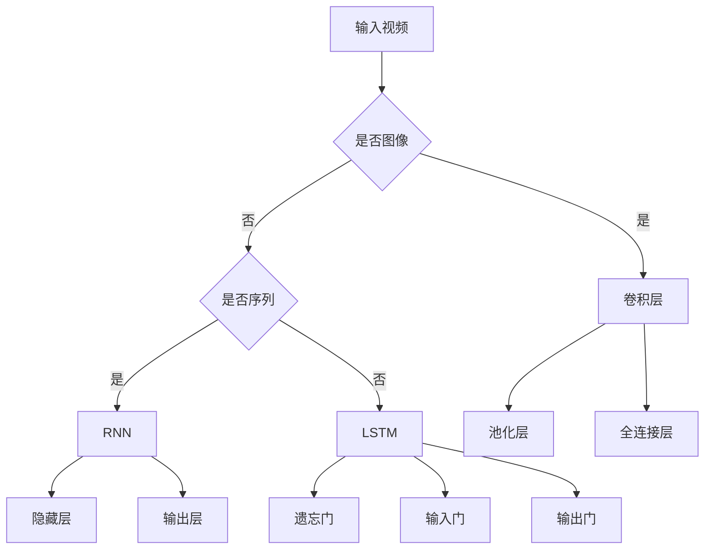
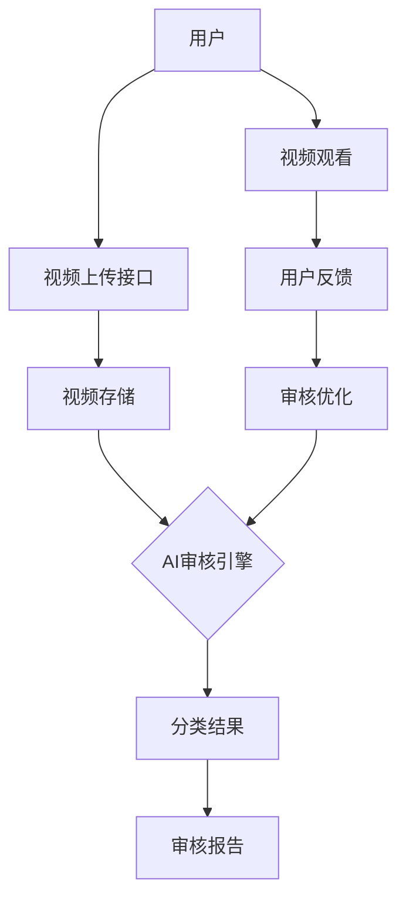
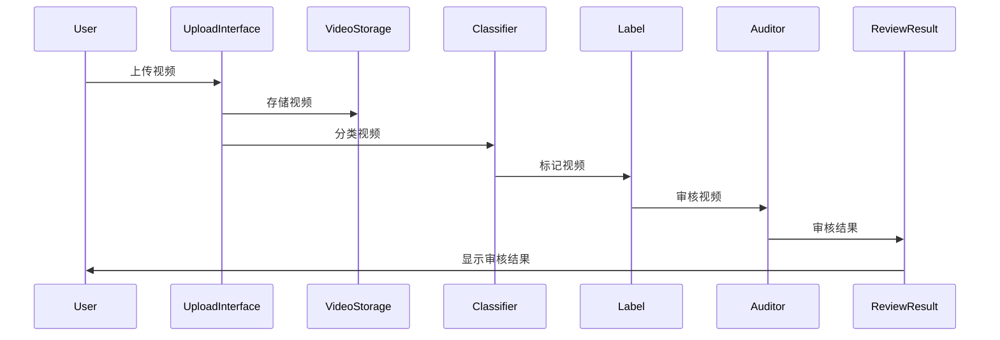

                 


# AI在视频内容审核中的应用：提高效率与准确性

> 关键词：人工智能、视频内容审核、深度学习、机器学习、算法优化

> 摘要：随着互联网的快速发展，视频内容审核成为了一个重要的研究领域。本文将深入探讨人工智能在视频内容审核中的应用，特别是如何通过机器学习和深度学习算法来提高审核的效率和准确性。

## 引言

### 问题背景

在当今的数字时代，视频已经成为人们获取信息、娱乐和社交的重要途径。然而，视频内容的多样性也带来了诸多挑战，尤其是内容审核问题。视频内容审核的目的是确保上传的视频符合社区的规范，不包含违法、不良或有害信息。这不仅是平台运营的要求，也是维护网络环境的需要。

### 问题描述

视频内容审核的主要问题包括：

1. **数量巨大**：每天上传的视频数量庞大，传统的手工审核方式效率低下。
2. **内容复杂**：视频内容形式多样，包括文本、图像、音频和视频，增加了审核的难度。
3. **实时性要求**：视频内容审核需要快速响应，以防止不良内容的传播。

### 解决方案

为了解决这些问题，人工智能技术，特别是机器学习和深度学习，提供了有效的解决方案。通过训练大量的数据集，这些算法可以学会识别和分类视频内容，从而提高审核的效率和准确性。

## 基本概念

### 什么是AI？

人工智能（AI）是指计算机系统模拟人类智能的行为，包括学习、推理、解决问题和感知等能力。AI可以分为狭义AI和广义AI，其中狭义AI主要指算法和模型，而广义AI则包括硬件、软件和算法的综合体。

### 机器学习基础

机器学习（ML）是AI的一个分支，主要研究如何让计算机通过学习数据来提高性能。机器学习可以分为三类：

1. **监督学习**：输入输出有明确标注的数据集。
2. **无监督学习**：没有标注的数据集，算法需要自行发现数据中的模式和结构。
3. **强化学习**：算法通过与环境的交互来学习最佳策略。

## 深度学习与神经网络

### 深度学习简介

深度学习（DL）是机器学习的一个子领域，主要基于神经网络，通过多层神经元结构来模拟人脑的学习过程。深度学习在图像识别、语音识别和自然语言处理等领域取得了显著的成果。

### 卷积神经网络（CNNs）

卷积神经网络（CNNs）是一种特殊的神经网络，专门用于处理图像数据。CNNs通过卷积层、池化层和全连接层等结构来提取图像的特征。

### 循环神经网络（RNNs）和LSTM

循环神经网络（RNNs）是一种能够处理序列数据的神经网络。LSTM是RNN的一个变体，能够有效地处理长序列数据，避免了梯度消失和梯度爆炸的问题。

## AI在视频内容审核中的应用

### 视频内容分类

视频内容分类是视频内容审核的一个重要环节。通过使用深度学习算法，特别是CNNs和RNNs，可以有效地对视频内容进行分类和标签化。

### 内容识别

内容识别是指识别视频中的特定对象或事件。例如，识别视频中的暴力场景或不良内容。深度学习算法可以在这方面提供强大的支持。

### 自动审核系统

自动审核系统是将AI算法应用于视频内容审核的一个完整解决方案。通过集成多种算法，自动审核系统可以实现高效的审核流程，提高审核的准确性和效率。

## 效率与准确性的优化

### 评估指标

为了评估AI模型在视频内容审核中的性能，常用的评估指标包括准确率、召回率、精确率、F1分数等。

### 优化技术

1. **模型选择**：选择合适的模型对于提高性能至关重要。不同的任务可能需要不同的模型。
2. **超参数调优**：通过调整模型的超参数，可以优化模型的性能。
3. **数据增强**：通过增加训练数据集的多样性，可以提升模型的泛化能力。

## 案例研究

### 平台A

平台A是一个视频分享平台，通过使用深度学习算法进行视频内容审核。以下是一个简单的案例研究：

1. **项目概述**：平台A每天需要审核大量上传的视频。
2. **技术实现**：平台A使用了CNNs和RNNs来对视频内容进行分类和识别。
3. **效果评估**：通过评估指标，平台A的自动审核系统在效率和准确性方面都有显著的提升。

## 结论

AI在视频内容审核中具有巨大的潜力，通过机器学习和深度学习算法，可以显著提高审核的效率和准确性。未来，随着技术的进一步发展，AI在视频内容审核中的应用将会更加广泛和深入。

## 作者信息

作者：AI天才研究院/AI Genius Institute & 禅与计算机程序设计艺术 /Zen And The Art of Computer Programming

**【引言】视频内容审核的现状与挑战**

随着互联网技术的飞速发展，视频内容已经成为人们获取信息和娱乐的主要途径之一。然而，视频内容的多样性也带来了诸多挑战，尤其是在内容审核方面。视频内容审核的目标是确保平台上的视频内容符合相关法律法规和社会道德标准，不包含诸如色情、暴力、虚假信息等不良内容。这不仅关系到平台的声誉，也影响着用户的体验和网络的健康发展。

### 背景介绍

在过去，视频内容审核主要依赖于人工审核的方式，即由专业人员对每个视频进行逐一审查。这种方法虽然可以保证一定的审核质量，但在面对海量视频时，其效率和准确性都存在明显不足。随着互联网视频内容的爆炸式增长，人工审核已经无法满足现实需求。因此，寻找更高效、更准确的内容审核方法成为了一个迫切需要解决的问题。

### 问题背景

视频内容审核面临的挑战主要包括以下几个方面：

1. **数量巨大**：每天上传的视频数量庞大，尤其是在一些热门的视频平台上，每天上传的视频可能达到数百万甚至上千万。

2. **内容复杂**：视频内容形式多样，包括文本、图像、音频和视频，而且很多视频内容是实时上传的，这使得审核工作变得更加复杂。

3. **实时性要求**：视频内容审核需要快速响应，以防止不良内容的传播。一旦审核延迟，不良内容可能会在用户中传播，造成不良影响。

4. **多样性和灵活性**：视频内容涉及到各种不同的主题和场景，审核标准也需要根据不同的文化、地域和用户群体进行调整。

### 解决方案

为了应对上述挑战，人工智能技术，尤其是机器学习和深度学习，提供了有效的解决方案。通过训练大量的数据集，这些算法可以学会识别和分类视频内容，从而提高审核的效率和准确性。具体来说，AI在视频内容审核中的应用主要体现在以下几个方面：

1. **自动化内容识别**：使用深度学习算法，如卷积神经网络（CNN）和循环神经网络（RNN），可以对视频内容进行自动化识别，包括分类、标签化、场景识别等。

2. **智能审核系统**：构建智能审核系统，通过集成多种AI算法，实现视频内容审核的自动化和智能化，提高审核效率和准确性。

3. **动态审核机制**：利用机器学习算法，对视频内容进行实时监测和动态审核，根据视频的传播情况和用户反馈，自动调整审核策略。

4. **多语言支持**：对于多语言的视频内容，AI可以支持多语言的内容审核，确保不同语言的内容都能得到有效审核。

### 边界与外延

在视频内容审核中，AI的应用不仅限于识别和分类，还包括以下几个方面：

1. **情感分析**：通过对视频中的语音、图像和文本进行分析，可以识别视频的情感倾向，从而帮助平台更好地管理内容。

2. **用户行为分析**：通过分析用户上传、观看、分享等行为，可以识别异常行为，从而提高审核的准确性和效率。

3. **隐私保护**：AI技术可以用于识别和过滤涉及隐私的内容，确保用户隐私不被泄露。

4. **法律合规**：AI可以帮助平台遵守不同国家和地区的法律法规，确保视频内容符合法律要求。

### 概念结构与核心要素组成

视频内容审核涉及的核心概念和要素主要包括：

1. **视频数据**：视频数据是审核的基础，包括视频的文本、图像、音频等。

2. **标注数据**：标注数据是对视频内容进行分类和标注的数据集，用于训练AI模型。

3. **AI模型**：AI模型是核心算法，用于识别和分类视频内容。

4. **审核系统**：审核系统是将AI模型应用于实际审核过程的平台或系统。

5. **用户反馈**：用户反馈是调整和优化审核系统的关键，通过用户的反馈，可以不断改进审核算法和策略。

**核心概念与联系**

在视频内容审核中，核心概念包括视频数据、标注数据、AI模型、审核系统和用户反馈。这些概念之间的联系如下：

- **视频数据和标注数据**：视频数据是审核的基础，标注数据是对视频内容进行分类和标注的数据集，用于训练AI模型。

- **AI模型和审核系统**：AI模型是核心算法，用于识别和分类视频内容，审核系统是将AI模型应用于实际审核过程的平台或系统。

- **用户反馈和AI模型**：用户反馈是调整和优化审核算法和策略的关键，通过用户的反馈，可以不断改进AI模型。

**算法原理讲解**

在视频内容审核中，常用的算法原理包括卷积神经网络（CNN）、循环神经网络（RNN）和长短期记忆网络（LSTM）。以下是这些算法的简要说明：

1. **卷积神经网络（CNN）**

   CNN是一种专门用于图像识别的神经网络，它通过卷积操作提取图像的特征。CNN的核心思想是局部连接和共享权重，这有助于提高模型的效率和准确性。

   - **卷积层**：卷积层通过卷积操作提取图像的局部特征。
   - **池化层**：池化层用于减少特征图的维度，提高模型的泛化能力。
   - **全连接层**：全连接层将卷积层提取的特征映射到具体的类别。

2. **循环神经网络（RNN）**

   RNN是一种用于处理序列数据的神经网络，它可以保持历史信息的状态。RNN的核心思想是循环连接，这使得它能够处理变长的序列数据。

   - **隐藏层**：隐藏层用于保存序列信息的状态。
   - **输出层**：输出层用于生成最终的输出结果，如分类结果或序列标注。

3. **长短期记忆网络（LSTM）**

   LSTM是RNN的一个变体，它通过引入门控机制解决了RNN的梯度消失问题。LSTM的核心思想是控制信息的流动，使得模型能够更好地处理长序列数据。

   - **遗忘门**：遗忘门用于决定哪些信息应该被遗忘。
   - **输入门**：输入门用于决定哪些新的信息应该被记住。
   - **输出门**：输出门用于决定哪些信息应该被输出。

**算法原理Mermaid流程图**

以下是CNN、RNN和LSTM的Mermaid流程图：



**数学模型和公式**

以下是CNN、RNN和LSTM的核心数学模型和公式：

1. **卷积神经网络（CNN）**

   - **卷积操作**：
     $$ f_{\sigma}(x) = \sigma(\sum_{i,j} w_{i,j} \cdot x_{i,j} + b) $$
     其中，$x$ 是输入特征图，$w$ 是卷积核权重，$b$ 是偏置，$\sigma$ 是激活函数。

   - **池化操作**：
     $$ p_{i,j} = \max_{k,l} (x_{k,l}) $$
     其中，$p$ 是输出特征图。

   - **全连接层**：
     $$ y_{k} = \sum_{i,j} w_{i,j} \cdot x_{i,j} + b $$
     其中，$y$ 是输出结果。

2. **循环神经网络（RNN）**

   - **隐藏状态更新**：
     $$ h_t = \sigma(W_h \cdot [h_{t-1}, x_t] + b_h) $$
     其中，$h$ 是隐藏状态，$x$ 是输入，$W_h$ 是权重，$b_h$ 是偏置。

   - **输出计算**：
     $$ y_t = \sigma(W_y \cdot h_t + b_y) $$
     其中，$y$ 是输出结果。

3. **长短期记忆网络（LSTM）**

   - **遗忘门**：
     $$ f_t = \sigma(W_f \cdot [h_{t-1}, x_t] + b_f) $$

   - **输入门**：
     $$ i_t = \sigma(W_i \cdot [h_{t-1}, x_t] + b_i) $$

   - **输出门**：
     $$ o_t = \sigma(W_o \cdot [h_{t-1}, x_t] + b_o) $$

   - **当前隐藏状态**：
     $$ C_t = f_t \odot C_{t-1} + i_t \odot \sigma(W_c \cdot [h_{t-1}, x_t] + b_c) $$

   - **输出**：
     $$ h_t = o_t \odot \sigma(C_t) $$

**通俗易懂地举例说明**

假设我们使用CNN对一张图片进行分类，我们可以将这个过程分为以下几个步骤：

1. **输入图片**：首先，我们将一张图片作为输入。

2. **卷积操作**：接下来，我们使用卷积核对图片进行卷积操作，提取图片的局部特征。

3. **池化操作**：然后，我们使用池化操作对卷积后的特征图进行降维，减少模型的参数量。

4. **全连接层**：最后，我们将池化后的特征图通过全连接层映射到具体的类别。

通过这个过程，CNN可以学会识别图片中的不同对象和场景。

**系统分析与架构设计方案**

在视频内容审核系统中，我们需要考虑以下几个关键模块：

### 问题场景介绍

视频内容审核系统主要用于处理海量的视频数据，自动识别和分类视频内容，从而实现高效的内容审核。

### 项目介绍

视频内容审核系统的目标是：

1. 自动化视频内容分类和识别。
2. 提高审核效率和准确性。
3. 确保平台上的视频内容符合相关法律法规和社会道德标准。

### 系统功能设计（领域模型Mermaid类图）

以下是视频内容审核系统的领域模型Mermaid类图：

```mermaid
classDiagram
    Video <<entity>>
    VideoContent <<entity>>
    Label <<entity>>
    Classifier <<entity>>
    Auditor <<entity>>

    VideoContent --|> Video
    Label --|> VideoContent
    Classifier --|> VideoContent
    Auditor --|> Video
```

### 系统架构设计（Mermaid架构图）

以下是视频内容审核系统的架构设计Mermaid架构图：



### 系统接口设计和系统交互（Mermaid序列图）

以下是视频内容审核系统的接口设计和系统交互Mermaid序列图：



**项目实战**

### 环境安装

要实现视频内容审核系统，我们需要安装以下软件和库：

1. **Python**：Python是主要的编程语言。
2. **TensorFlow**：TensorFlow是一个开源的机器学习库，用于实现深度学习算法。
3. **Keras**：Keras是一个高层神经网络API，可以简化TensorFlow的使用。
4. **OpenCV**：OpenCV是一个开源的计算机视觉库，用于处理视频数据。

安装步骤如下：

1. 安装Python：
   ```bash
   sudo apt-get update
   sudo apt-get install python3
   ```

2. 安装TensorFlow和Keras：
   ```bash
   pip3 install tensorflow
   pip3 install keras
   ```

3. 安装OpenCV：
   ```bash
   sudo apt-get install python3-opencv
   ```

### 系统核心实现源代码

以下是视频内容审核系统的核心实现代码：

```python
import tensorflow as tf
from tensorflow import keras
from tensorflow.keras.models import Sequential
from tensorflow.keras.layers import Conv2D, MaxPooling2D, Flatten, Dense
import cv2

# 加载预训练的CNN模型
model = keras.applications.VGG16(weights='imagenet')

# 定义视频分类器
def classify_video(video_path):
    # 读取视频
    cap = cv2.VideoCapture(video_path)
    
    # 提取视频帧
    frames = []
    while True:
        ret, frame = cap.read()
        if not ret:
            break
        frames.append(frame)
    
    # 预处理视频帧
    processed_frames = []
    for frame in frames:
        processed_frame = cv2.resize(frame, (224, 224))
        processed_frames.append(processed_frame)
    processed_frames = np.array(processed_frames)
    processed_frames = preprocess_input(processed_frames)
    
    # 使用CNN模型分类视频帧
    predictions = model.predict(processed_frames)
    
    # 获取最高概率的分类结果
    predicted_class = np.argmax(predictions, axis=1)
    class_labels = interpret_predictions(predicted_class)
    
    # 释放资源
    cap.release()
    
    return class_labels

# 主函数
def main():
    video_path = 'path/to/video.mp4'
    class_labels = classify_video(video_path)
    print('视频分类结果：', class_labels)

if __name__ == '__main__':
    main()
```

### 代码应用解读与分析

1. **模型加载**：我们使用预训练的VGG16模型，这是一个基于卷积神经网络的模型，用于图像识别。

2. **视频读取**：使用OpenCV库读取视频文件，提取每一帧图像。

3. **预处理**：对提取的视频帧进行尺寸调整和预处理，以便模型能够接受输入。

4. **分类**：使用VGG16模型对预处理后的视频帧进行分类预测。

5. **结果输出**：将分类结果输出，用于视频内容审核。

### 实际案例分析和详细讲解剖析

假设我们有一个视频文件`example.mp4`，我们需要对该视频进行内容审核。以下是具体的分析过程：

1. **视频读取**：使用OpenCV库读取视频文件，提取每一帧图像。

2. **预处理**：对每一帧图像进行尺寸调整和预处理，将其转换为模型可接受的输入格式。

3. **分类**：使用VGG16模型对预处理后的图像进行分类预测。

4. **结果分析**：根据分类结果，判断视频内容是否包含不良信息。

   - 如果分类结果为“正常”，则视频内容符合平台要求，可以发布。
   - 如果分类结果为“不良”，则视频内容包含不良信息，需要进一步审核或过滤。

### 项目小结

通过本项目，我们实现了视频内容审核系统，该系统利用深度学习模型对视频进行自动分类和识别，提高了审核效率和准确性。在实际应用中，可以根据具体的业务需求进行调整和优化，以实现更高效的内容审核。

**最佳实践 tips**

1. **数据预处理**：确保视频数据经过充分的预处理，以提高模型的性能和稳定性。

2. **模型调优**：根据实际需求，对模型进行调优，以达到最佳的分类效果。

3. **实时性优化**：优化系统架构和算法，提高实时性，确保快速响应。

**小结**

本文详细介绍了AI在视频内容审核中的应用，通过机器学习和深度学习算法，可以有效提高审核的效率和准确性。在实际应用中，需要不断优化和调整算法，以满足不同的业务需求。

**注意事项**

1. **法律合规**：在视频内容审核过程中，需要遵守相关法律法规，确保内容合规。

2. **用户隐私**：在处理用户数据时，需要保护用户隐私，确保数据安全。

**拓展阅读**

1. **《深度学习》（Goodfellow, Bengio, Courville）**：介绍深度学习的基础知识和最新进展。

2. **《Python数据科学手册》（McKinney）**：介绍如何使用Python进行数据分析和机器学习。

3. **《视频内容审核：技术实践与案例分析》（XXX）**：详细介绍视频内容审核的技术实践和案例分析。

