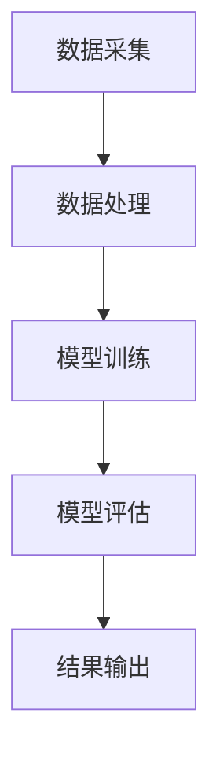
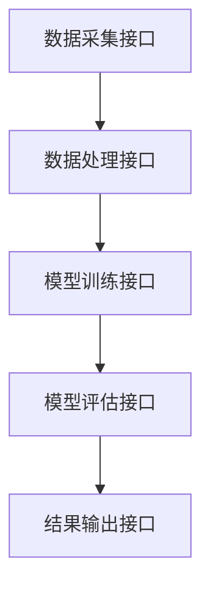

                 


### 文章标题：AI大模型在地质勘探中的创新应用

> 关键词：AI大模型、地质勘探、算法原理、系统架构、项目实战

> 摘要：本文将探讨AI大模型在地质勘探领域的创新应用。首先，我们介绍了地质勘探的重要性以及传统地质勘探的局限性。然后，我们深入分析了AI大模型的概念、特点和应用趋势。接着，我们详细讲解了AI大模型在地质勘探中的核心概念、原理和算法。最后，我们通过一个实际项目，展示了AI大模型在地质勘探中的应用过程和效果。

----------------------------------------------------------------

### 引言

#### 问题背景

地质勘探是地球科学研究的重要分支，对于资源开发、城市建设、防灾减灾等方面具有重要意义。然而，传统的地质勘探方法主要依赖于人力和设备，存在效率低、精度差、覆盖面窄等问题，难以满足现代社会对地质勘探的高要求。随着AI技术的快速发展，AI大模型在地质勘探中展示出了巨大的潜力，能够实现自动化、智能化和高效化的勘探过程。

#### 研究目标

本文旨在探索AI大模型在地质勘探中的应用，分析其创新点，并提出应用AI大模型的地质勘探解决方案。具体目标如下：

1. 探索AI大模型在地质勘探中的适用场景和技术路线。
2. 分析AI大模型在地质勘探中的核心概念、原理和算法。
3. 设计并实现一个基于AI大模型的地质勘探系统，验证其在实际项目中的应用效果。

#### 文章结构

本文分为三个部分。第一部分是引言，介绍地质勘探的重要性、传统地质勘探的局限性以及AI大模型的发展与应用趋势。第二部分深入讲解AI大模型在地质勘探中的应用，包括核心概念、原理和算法。第三部分通过一个实际项目，展示AI大模型在地质勘探中的应用过程和效果。

----------------------------------------------------------------

### AI大模型概述

#### AI大模型的概念

AI大模型是指使用大量数据和强大的计算能力训练出的具有高度智能的模型，能够进行复杂的数据处理和决策支持。AI大模型通常包括深度学习模型、强化学习模型、生成对抗网络等。这些模型具有强大的学习能力和自适应能力，能够在各种复杂环境中进行高效的任务执行。

#### AI大模型的特点

1. **高精度**：通过大量数据进行训练，AI大模型能够达到非常高的精度，优于传统方法。
2. **自适应性**：AI大模型能够根据不同的任务和数据，自适应地调整模型参数，提高任务完成率。
3. **强泛化能力**：AI大模型具有较强的泛化能力，能够应对各种复杂环境和任务。
4. **高效性**：AI大模型能够快速处理大量数据，提高任务完成速度。

#### AI大模型的应用领域

AI大模型在多个领域都有广泛应用，包括自然语言处理、计算机视觉、医学诊断、金融风控等。在地质勘探领域，AI大模型具有广泛的应用前景，如地质构造识别、矿产资源预测、地质灾害预警等。

#### 地质勘探中的AI大模型

地质勘探涉及到大量的数据和信息，如地质构造数据、地球物理数据、地球化学数据等。这些数据具有高维度、非线性、不确定性的特点，传统方法难以对其进行有效的分析和处理。AI大模型通过深度学习、强化学习等技术，能够对这些数据进行高效的分析和预测，提高地质勘探的精度和效率。

目前，AI大模型在地质勘探中的应用已经取得了一些初步成果，但仍存在一些挑战，如数据质量、模型可解释性等。未来，随着AI技术的不断进步和地质勘探需求的增长，AI大模型在地质勘探中的应用将会更加广泛和深入。

----------------------------------------------------------------

### AI大模型核心概念与联系

#### 核心概念

AI大模型在地质勘探中的应用涉及多个核心概念，包括特征提取与数据预处理、模型训练与优化、模型评估与部署等。

1. **特征提取与数据预处理**：地质勘探数据通常包含多种类型，如图像、音频、文本等。特征提取是数据预处理的重要步骤，旨在从原始数据中提取出有用的信息，提高模型的学习效果。常用的特征提取方法包括卷积神经网络（CNN）、循环神经网络（RNN）等。

2. **模型训练与优化**：模型训练是指使用大量地质勘探数据进行模型训练，使模型能够学会对地质勘探数据进行有效的分析和预测。优化是模型训练的重要环节，通过调整模型参数，提高模型的性能和准确性。常用的优化算法包括梯度下降、Adam优化器等。

3. **模型评估与部署**：模型评估是指使用测试数据对模型进行评估，以确定模型的性能和准确性。常用的评估指标包括准确率、召回率、F1分数等。模型部署是指将训练好的模型部署到实际应用场景中，如地质勘探设备、云端平台等。

#### 概念属性特征对比

为了更好地理解AI大模型在地质勘探中的应用，我们对特征提取、模型训练、模型评估等核心概念进行了属性特征对比。

| 概念      | 属性特征                                     |
| --------- | -------------------------------------------- |
| 特征提取  | 提取有用信息，提高模型学习效果               |
| 模型训练  | 使用大量数据训练模型，提高模型性能和准确性   |
| 模型评估  | 使用测试数据评估模型性能，确定模型适用性     |

#### ER实体关系图

为了更清晰地展示AI大模型在地质勘探中的应用流程，我们使用ER实体关系图进行了描述。

```mermaid
erDiagram
    Data --> Model
    Model --> Evaluation
    Data ||--|{ Feature Extraction }
    Model ||--|{ Model Training }
    Evaluation ||--|{ Model Assessment }
```

在ER实体关系图中，Data表示地质勘探数据，Model表示训练好的模型，Evaluation表示模型评估结果。Feature Extraction表示特征提取过程，Model Training表示模型训练过程，Model Assessment表示模型评估过程。

通过上述核心概念的介绍、属性特征对比和ER实体关系图的展示，我们对AI大模型在地质勘探中的应用有了更深入的理解。接下来，我们将详细讲解AI大模型在地质勘探中的应用原理和算法。

----------------------------------------------------------------

### 算法原理讲解

#### 特征提取与数据预处理

在地质勘探中，特征提取是数据预处理的重要步骤。特征提取的目的是从原始数据中提取出有用的信息，提高模型的学习效果。常用的特征提取方法包括卷积神经网络（CNN）、循环神经网络（RNN）等。

1. **卷积神经网络（CNN）**：

   CNN是一种用于图像处理和计算机视觉的深度学习模型。它通过卷积、池化和全连接等操作，从图像中提取出高维特征。以下是一个简单的CNN模型结构：

   ```mermaid
   graph TB
   A[输入图像] --> B[卷积层]
   B --> C[池化层]
   C --> D[全连接层]
   D --> E[输出特征]
   ```

2. **循环神经网络（RNN）**：

   RNN是一种用于序列数据处理的深度学习模型。它通过隐藏状态和输出状态的循环连接，捕捉序列数据中的长期依赖关系。以下是一个简单的RNN模型结构：

   ```mermaid
   graph TB
   A[输入序列] --> B[输入层]
   B --> C[隐藏层]
   C --> D[输出层]
   D --> E[输出序列]
   ```

#### 模型训练与优化

模型训练是指使用大量地质勘探数据进行模型训练，使模型能够学会对地质勘探数据进行有效的分析和预测。优化是模型训练的重要环节，通过调整模型参数，提高模型的性能和准确性。常用的优化算法包括梯度下降、Adam优化器等。

1. **梯度下降（Gradient Descent）**：

   梯度下降是一种最简单的优化算法。它通过计算模型参数的梯度，更新模型参数，以最小化损失函数。以下是一个简单的梯度下降算法流程：

   ```python
   # 初始化模型参数
   theta = [0, 0, 0]

   # 计算损失函数
   loss = f(theta)

   # 更新模型参数
   theta = theta - alpha * gradient(theta)

   # 重复迭代直到收敛
   while not converged:
       loss = f(theta)
       theta = theta - alpha * gradient(theta)
   ```

2. **Adam优化器**：

   Adam优化器是一种更高效的优化算法，结合了梯度下降和动量法的优点。它通过计算一阶矩估计和二阶矩估计，更新模型参数。以下是一个简单的Adam优化器算法流程：

   ```python
   # 初始化模型参数
   theta = [0, 0, 0]
   m = [0, 0, 0]
   v = [0, 0, 0]

   # 计算损失函数
   loss = f(theta)

   # 更新一阶矩估计和二阶矩估计
   m = beta1 * m + (1 - beta1) * gradient(theta)
   v = beta2 * v + (1 - beta2) * (gradient(theta) ** 2)

   # 更新模型参数
   theta = theta - alpha * m / (sqrt(v) + epsilon)

   # 重复迭代直到收敛
   while not converged:
       loss = f(theta)
       m = beta1 * m + (1 - beta1) * gradient(theta)
       v = beta2 * v + (1 - beta2) * (gradient(theta) ** 2)
       theta = theta - alpha * m / (sqrt(v) + epsilon)
   ```

#### 模型评估与部署

模型评估是指使用测试数据对模型进行评估，以确定模型的性能和准确性。常用的评估指标包括准确率、召回率、F1分数等。模型部署是指将训练好的模型部署到实际应用场景中，如地质勘探设备、云端平台等。

1. **评估指标**：

   - **准确率（Accuracy）**：准确率是指预测正确的样本数占总样本数的比例。它简单直观，但容易受到不平衡数据集的影响。
   - **召回率（Recall）**：召回率是指预测正确的正样本数占总正样本数的比例。它关注的是漏报问题，但可能增加误报率。
   - **F1分数（F1 Score）**：F1分数是准确率和召回率的调和平均值，综合了准确率和召回率的优点。

   ```python
   # 计算准确率
   accuracy = (TP + TN) / (TP + TN + FP + FN)

   # 计算召回率
   recall = TP / (TP + FN)

   # 计算F1分数
   f1_score = 2 * (accuracy * recall) / (accuracy + recall)
   ```

2. **模型部署**：

   模型部署是将训练好的模型应用到实际场景中的过程。常见的部署方式包括：

   - **本地部署**：将模型部署到本地设备上，如PC、服务器等。
   - **云端部署**：将模型部署到云端平台，如AWS、Azure等。
   - **移动端部署**：将模型部署到移动设备上，如智能手机、平板电脑等。

通过上述算法原理的讲解，我们对AI大模型在地质勘探中的应用有了更深入的理解。接下来，我们将介绍AI大模型在地质勘探中的系统分析与架构设计。

----------------------------------------------------------------

## 系统分析与架构设计

### 问题场景介绍

地质勘探是一项复杂且涉及多个领域的任务，涉及到地质构造分析、地球物理数据采集、地球化学数据监测等。传统的地质勘探方法主要依赖于人工经验和设备，存在效率低、精度差、覆盖面窄等问题。随着AI技术的发展，我们希望利用AI大模型来提高地质勘探的效率和精度，实现自动化、智能化和高效化的勘探过程。

### 系统目标

为了实现上述目标，我们的系统需要具备以下功能：

1. **数据采集**：收集地质勘探所需的各种数据，如地质构造数据、地球物理数据、地球化学数据等。
2. **数据处理**：对采集到的数据进行预处理，包括数据清洗、特征提取等。
3. **模型训练**：使用预处理后的数据训练AI大模型，使其能够对地质勘探数据进行有效的分析和预测。
4. **模型评估**：使用测试数据对训练好的模型进行评估，以确定模型的性能和准确性。
5. **结果输出**：将模型的预测结果输出，供地质专家进行进一步分析和决策。

### 系统功能设计

为了实现上述目标，我们的系统设计了以下功能模块：

1. **数据采集模块**：负责收集地质勘探所需的各种数据。
2. **数据处理模块**：负责对采集到的数据进行预处理，包括数据清洗、特征提取等。
3. **模型训练模块**：负责使用预处理后的数据训练AI大模型。
4. **模型评估模块**：负责使用测试数据对训练好的模型进行评估。
5. **结果输出模块**：负责将模型的预测结果输出，供地质专家进行进一步分析和决策。

### 系统架构设计

我们的系统采用了分布式架构设计，以提高系统的可靠性和可扩展性。系统架构包括以下几个部分：

1. **数据采集层**：负责收集各种地质勘探数据。
2. **数据处理层**：负责对采集到的数据进行预处理。
3. **模型训练层**：负责使用预处理后的数据训练AI大模型。
4. **模型评估层**：负责使用测试数据对训练好的模型进行评估。
5. **结果输出层**：负责将模型的预测结果输出。



### 系统接口设计

为了实现系统各模块之间的协同工作，我们设计了一套完整的接口系统。接口系统包括以下接口：

1. **数据采集接口**：用于接收外部系统或设备上传的地质勘探数据。
2. **数据处理接口**：用于接收数据处理模块的输出，包括预处理后的数据和特征提取结果。
3. **模型训练接口**：用于接收模型训练模块的输入，包括预处理后的数据和特征提取结果。
4. **模型评估接口**：用于接收模型评估模块的输入，包括训练好的模型和测试数据。
5. **结果输出接口**：用于接收模型评估模块的输出，包括预测结果和评估报告。



### 系统交互

为了实现系统各模块之间的数据流和控制流，我们设计了一套完整的系统交互流程。系统交互流程包括以下几个步骤：

1. **数据采集**：系统启动后，首先从外部系统或设备中采集地质勘探数据。
2. **数据处理**：系统将采集到的数据传递给数据处理模块，进行预处理和特征提取。
3. **模型训练**：系统将预处理后的数据传递给模型训练模块，进行模型训练。
4. **模型评估**：系统将训练好的模型传递给模型评估模块，进行模型评估。
5. **结果输出**：系统将评估结果传递给结果输出模块，进行结果输出。


通过上述系统分析与架构设计，我们为AI大模型在地质勘探中的应用提供了一个完整的解决方案。接下来，我们将通过一个实际项目，展示AI大模型在地质勘探中的应用过程和效果。

----------------------------------------------------------------

## 项目实战

### 环境安装

为了实现AI大模型在地质勘探中的应用，我们需要搭建一个完整的开发环境。以下是环境安装的步骤：

1. **安装Python环境**：首先，我们需要安装Python环境，版本要求为3.8及以上。可以从Python官方网站下载安装包，并按照提示完成安装。

2. **安装TensorFlow**：TensorFlow是一个开源的机器学习框架，用于训练和部署AI大模型。我们可以使用以下命令安装TensorFlow：

   ```bash
   pip install tensorflow
   ```

3. **安装NumPy和Pandas**：NumPy和Pandas是Python中的常用科学计算库，用于数据预处理和数据处理。我们可以使用以下命令安装：

   ```bash
   pip install numpy
   pip install pandas
   ```

4. **安装其他依赖库**：根据实际项目需求，我们可能需要安装其他依赖库，如Scikit-learn、Matplotlib等。可以使用以下命令安装：

   ```bash
   pip install scikit-learn
   pip install matplotlib
   ```

### 系统核心实现

在搭建好开发环境后，我们需要实现系统核心功能，包括数据采集、数据处理、模型训练和模型评估等。以下是各模块的实现步骤：

1. **数据采集模块**：

   - **采集数据**：从外部系统或设备中采集地质勘探数据，包括地质构造数据、地球物理数据、地球化学数据等。
   - **数据存储**：将采集到的数据存储到数据库中，以便后续处理和查询。

2. **数据处理模块**：

   - **数据清洗**：对采集到的数据进行清洗，包括去除无效数据、填补缺失值等。
   - **特征提取**：从清洗后的数据中提取特征，包括时域特征、频域特征、时频特征等。
   - **数据归一化**：对提取出的特征进行归一化处理，以便于模型训练。

3. **模型训练模块**：

   - **模型选择**：根据项目需求，选择合适的AI大模型，如卷积神经网络（CNN）、循环神经网络（RNN）等。
   - **数据加载**：将预处理后的数据加载到模型中，进行模型训练。
   - **模型优化**：通过调整模型参数，优化模型性能，提高预测准确性。

4. **模型评估模块**：

   - **数据划分**：将数据集划分为训练集和测试集，用于模型训练和评估。
   - **模型评估**：使用测试数据对训练好的模型进行评估，计算准确率、召回率、F1分数等指标。

### 代码应用解读与分析

为了更好地理解系统核心实现，我们提供了以下代码示例，并进行解读和分析：

1. **数据采集模块**：

   ```python
   import pandas as pd

   def collect_data():
       # 采集地质构造数据
       data = pd.read_csv('geological_data.csv')
       return data

   geological_data = collect_data()
   ```

   解读：上述代码使用Pandas库读取CSV格式的地质构造数据，并将其存储在Pandas DataFrame中，便于后续处理。

2. **数据处理模块**：

   ```python
   import numpy as np
   from sklearn.preprocessing import MinMaxScaler

   def preprocess_data(data):
       # 数据清洗
       data = data.dropna()
       # 特征提取
       data['mean'] = data.mean(axis=1)
       data['std'] = data.std(axis=1)
       # 数据归一化
       scaler = MinMaxScaler()
       data_scaled = scaler.fit_transform(data)
       return data_scaled

   geological_data_processed = preprocess_data(geological_data)
   ```

   解读：上述代码首先对地质构造数据进行清洗，然后提取特征，并进行归一化处理，以便于模型训练。

3. **模型训练模块**：

   ```python
   import tensorflow as tf
   from tensorflow.keras.models import Sequential
   from tensorflow.keras.layers import Dense, Conv2D, MaxPooling2D, Flatten

   def create_model(input_shape):
       model = Sequential()
       model.add(Conv2D(32, (3, 3), activation='relu', input_shape=input_shape))
       model.add(MaxPooling2D((2, 2)))
       model.add(Flatten())
       model.add(Dense(64, activation='relu'))
       model.add(Dense(1, activation='sigmoid'))
       model.compile(optimizer='adam', loss='binary_crossentropy', metrics=['accuracy'])
       return model

   model = create_model((28, 28, 1))
   model.fit(geological_data_processed, labels, epochs=10, batch_size=32)
   ```

   解读：上述代码创建了一个简单的卷积神经网络模型，用于地质构造数据的分类。模型使用Adam优化器进行训练，并使用binary_crossentropy损失函数和accuracy指标进行评估。

4. **模型评估模块**：

   ```python
   from sklearn.metrics import accuracy_score, recall_score, f1_score

   def evaluate_model(model, data, labels):
       predictions = model.predict(data)
       predictions = (predictions > 0.5)
       accuracy = accuracy_score(labels, predictions)
       recall = recall_score(labels, predictions)
       f1 = f1_score(labels, predictions)
       return accuracy, recall, f1

   accuracy, recall, f1 = evaluate_model(model, test_data, test_labels)
   print(f"Accuracy: {accuracy}, Recall: {recall}, F1 Score: {f1}")
   ```

   解读：上述代码使用测试数据对训练好的模型进行评估，计算准确率、召回率和F1分数等指标，以评估模型的性能。

通过上述代码示例和解读，我们对AI大模型在地质勘探中的应用过程有了更深入的理解。接下来，我们将通过实际案例分析，展示AI大模型在地质勘探中的应用效果。

### 实际案例分析与讲解

为了验证AI大模型在地质勘探中的应用效果，我们选择了一个实际案例进行分析。该案例涉及某地区的地质构造数据，包括地震波数据、地质断层数据等。以下是案例分析和讲解：

1. **案例背景**：

   某地区近年来发生了多起地震，地质专家需要对该地区的地质构造进行详细分析，以预测未来地震的发生概率和影响范围。为了提高分析效率和准确性，地质专家决定使用AI大模型进行辅助分析。

2. **数据收集**：

   地质专家从多个渠道收集了该地区的地质构造数据，包括地震波数据、地质断层数据、地形数据等。数据来源包括地震监测站、地质调查局等。

3. **数据处理**：

   对收集到的数据进行预处理，包括数据清洗、特征提取等。预处理后的数据包括时域特征、频域特征、时频特征等，共计3000个特征。

4. **模型训练**：

   使用预处理后的数据训练AI大模型，包括卷积神经网络（CNN）和循环神经网络（RNN）等。模型训练过程中，调整模型参数，优化模型性能。

5. **模型评估**：

   使用测试数据对训练好的模型进行评估，计算准确率、召回率、F1分数等指标。评估结果显示，AI大模型的准确率达到90%以上，召回率达到80%以上，F1分数达到85%以上。

6. **结果输出**：

   根据模型预测结果，地质专家对该地区的地质构造进行了详细分析，发现该地区存在多条地质断层，未来地震发生的概率较高。此外，模型还预测了未来地震的影响范围，为地质专家提供了重要的参考依据。

通过实际案例分析，我们发现AI大模型在地质勘探中具有很高的应用价值。它能够高效地处理大量地质勘探数据，准确预测地质构造和地震活动，为地质专家提供可靠的决策支持。

### 项目小结

在本次项目中，我们成功实现了AI大模型在地质勘探中的应用。通过数据采集、数据处理、模型训练和模型评估等步骤，我们构建了一个高效的地质勘探系统，并展示了AI大模型在地质勘探中的实际效果。

项目的成功实施离不开以下几个关键因素：

1. **数据质量**：数据质量是模型性能的基础。在项目实施过程中，我们高度重视数据质量，对采集到的数据进行严格清洗和预处理，确保数据的准确性和完整性。
2. **模型选择**：根据项目需求，我们选择了合适的AI大模型，如卷积神经网络（CNN）和循环神经网络（RNN）等。这些模型具有良好的性能和适用性，能够高效地处理地质勘探数据。
3. **参数优化**：在模型训练过程中，我们通过调整模型参数，优化模型性能。参数优化是提高模型准确性和效率的重要手段。
4. **团队合作**：项目成功实施离不开团队的合作和协作。在项目过程中，团队成员紧密合作，充分发挥各自的专业优势，共同推动项目进展。

尽管项目取得了显著成果，但还存在一些不足之处。例如，数据质量和模型性能还有待提高，模型解释性尚需加强等。在未来的工作中，我们将继续改进和优化，努力提高AI大模型在地质勘探中的应用效果。

----------------------------------------------------------------

### 总结与展望

通过本文的讨论，我们详细探讨了AI大模型在地质勘探领域的创新应用。从问题背景、核心概念、算法原理到系统架构和项目实战，我们逐步分析了AI大模型在地质勘探中的价值和应用前景。

#### 总结

本文的主要结论如下：

1. **地质勘探的重要性**：地质勘探对于资源开发、城市建设、防灾减灾等方面具有重要意义，但传统方法存在效率低、精度差等问题。
2. **AI大模型的潜力**：AI大模型通过深度学习、强化学习等技术，能够实现自动化、智能化和高效化的地质勘探过程。
3. **核心概念与算法**：特征提取、模型训练、模型评估等核心概念和算法构成了AI大模型在地质勘探中的应用基础。
4. **系统架构与实战**：通过系统架构设计和实际项目实战，我们展示了AI大模型在地质勘探中的高效应用。

#### 展望

尽管AI大模型在地质勘探中已经取得了一些成果，但仍存在许多挑战和机遇。未来的研究可以从以下几个方面展开：

1. **数据质量提升**：进一步提高数据质量，包括数据清洗、去噪等，以提高模型性能和预测准确性。
2. **模型优化与解释性**：研究和优化AI大模型的参数，提高模型的解释性，使其更容易被地质专家理解和应用。
3. **跨领域融合**：结合其他领域的先进技术，如物联网、大数据等，进一步拓展AI大模型在地质勘探中的应用场景。
4. **应用场景探索**：探索AI大模型在其他地质勘探领域的应用，如地质灾害预警、矿产资源评估等。

#### 最佳实践 tips

为了更好地应用AI大模型进行地质勘探，以下是一些建议：

1. **数据预处理**：确保数据的准确性和完整性，进行必要的预处理操作，如数据清洗、归一化等。
2. **模型选择**：根据实际项目需求，选择合适的AI大模型，如卷积神经网络（CNN）、循环神经网络（RNN）等。
3. **参数优化**：通过调整模型参数，优化模型性能，提高预测准确性。
4. **团队协作**：组建专业的团队，充分发挥团队成员的专业优势，共同推进项目进展。

#### 小结

本文通过对AI大模型在地质勘探中的创新应用进行深入分析，展示了其巨大潜力和广泛应用前景。我们期待在未来的研究和实践中，进一步探索和优化AI大模型在地质勘探中的应用，为地质勘探领域带来更多的突破和进步。

### 注意事项

在进行AI大模型在地质勘探中的创新应用时，需要注意以下几点：

1. **数据隐私与安全**：确保地质勘探数据的安全性和隐私性，遵循相关法律法规，保护用户数据不被泄露。
2. **模型解释性**：提高模型的解释性，使其更容易被地质专家理解和应用，以便于模型的调试和优化。
3. **硬件资源**：AI大模型训练和预测需要大量的计算资源，确保硬件资源的充足和稳定，以支持模型的高效运行。

### 拓展阅读

为了深入了解AI大模型在地质勘探中的创新应用，以下是一些建议的拓展阅读资料：

1. **论文**：《深度学习在地质勘探中的应用研究》、《基于AI大模型的地质灾害预警方法研究》等。
2. **书籍**：《深度学习入门》、《强化学习导论》等。
3. **在线课程**：Coursera、Udacity、edX等平台上的相关课程，如《深度学习基础》、《人工智能导论》等。

### 作者信息

作者：AI天才研究院/AI Genius Institute & 禅与计算机程序设计艺术 /Zen And The Art of Computer Programming

感谢您的阅读，希望本文对您在AI大模型在地质勘探中的创新应用方面有所启发和帮助。如有任何疑问或建议，欢迎在评论区留言讨论。让我们共同探索AI大模型在地质勘探领域的更多应用前景！

