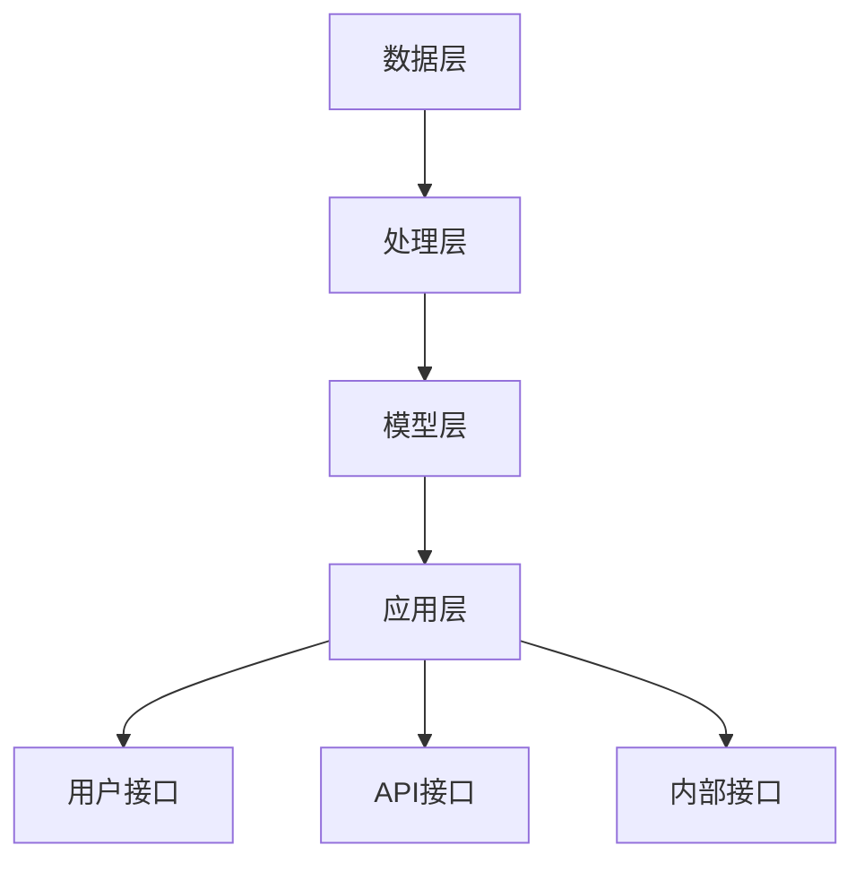

                 

# AI大模型在智能客户服务中的创新应用

## 关键词
- AI大模型
- 智能客户服务
- 创新应用
- 深度学习
- 自然语言处理
- 个性化服务

## 摘要
本文深入探讨了AI大模型在智能客户服务中的应用。首先，介绍了AI大模型的基本概念、发展背景及其在智能客户服务中的重要性。随后，通过详细讲解深度学习和自然语言处理等核心算法原理，展示了AI大模型在客户服务中的实际应用。文章进一步阐述了智能客户服务系统的整体架构，并通过项目实战案例剖析了AI大模型的具体应用。最后，提出了最佳实践建议，并对未来的发展方向进行了展望。

## 1. 背景介绍

### 1.1 AI大模型的发展背景

AI大模型，即大规模的人工神经网络模型，是近年来人工智能领域的重要进展。自2012年AlexNet在图像识别比赛中取得突破性成绩以来，深度学习技术逐渐成为人工智能领域的热门研究方向。随着计算能力的提升和数据量的增加，研究人员开始尝试训练更大规模、参数更多的神经网络模型。

AI大模型的发展可以分为几个阶段：

1. **早期探索（2012-2015年）**：以AlexNet为代表的卷积神经网络（CNN）在图像识别任务中取得了显著成绩，为后续大模型的研究奠定了基础。
2. **快速进步（2016-2018年）**：随着GPU和TPU等计算资源的普及，研究人员开始尝试训练更大规模、参数更多的模型，如Google的Inception、微软的ResNet等。
3. **成熟应用（2019年至今）**：AI大模型在多个领域取得了突破性进展，如自然语言处理、语音识别、推荐系统等。

### 1.2 智能客户服务的发展历程

智能客户服务是指利用人工智能技术，如自然语言处理、机器学习等，为用户提供个性化、高效的服务。智能客户服务的发展历程可以概括为以下几个阶段：

1. **早期自动化（1990年代）**：最早的客户服务主要是通过自动语音应答系统（IVR）提供基本的语音服务。
2. **基于规则系统（2000年代）**：基于规则的人工智能系统开始应用于客户服务，如FAQ（常见问题解答）系统。
3. **自然语言处理技术（2010年代）**：随着深度学习技术的发展，自然语言处理技术逐渐应用于智能客户服务，使客服系统能够理解并处理更复杂的用户请求。
4. **AI大模型时代（2020年至今）**：AI大模型的出现，使得智能客服系统在处理能力、个性化服务等方面取得了显著提升。

### 1.3 创新应用的重要性与挑战

AI大模型在智能客户服务中的应用具有重要意义。首先，大模型能够处理大量的数据，从而提供更准确的个性化服务。其次，大模型具有强大的语义理解能力，能够更好地理解用户的需求和意图。此外，大模型还可以通过不断的训练和学习，不断优化服务质量。

然而，AI大模型在智能客户服务中也面临着一些挑战：

1. **计算资源需求**：大模型需要大量的计算资源进行训练，对硬件设施提出了较高要求。
2. **数据隐私**：智能客服系统需要处理大量的用户数据，如何保护用户隐私成为一大挑战。
3. **模型解释性**：大模型的决策过程往往缺乏解释性，如何提高模型的解释性是一个重要问题。

## 2. 核心概念与联系

### 2.1 AI大模型的核心概念

AI大模型是指具有大量参数和多层神经网络的深度学习模型。其核心概念包括：

1. **深度神经网络**：大模型由多个层次（通常是几十层甚至上百层）的神经网络组成，能够处理复杂的非线性问题。
2. **大规模参数**：大模型具有数十亿甚至千亿级别的参数，这使得模型具有更强的表示能力和拟合能力。
3. **多层感知器**：大模型中的每层神经元都通过前一层神经元的输出进行计算，从而实现数据的层次化表示。

### 2.2 智能客户服务的关键要素

智能客户服务的关键要素包括：

1. **自然语言处理**：智能客服系统需要能够理解并处理自然语言，从而与用户进行有效的沟通。
2. **个性化服务**：智能客服系统需要根据用户的历史数据和需求，提供个性化的服务和建议。
3. **实时响应**：智能客服系统需要能够实时响应用户的请求，提供快速的服务。

### 2.3 AI大模型与智能客户服务的关联

AI大模型与智能客户服务的关联主要体现在以下几个方面：

1. **语义理解**：AI大模型能够通过深度学习技术，对用户输入的自然语言进行深入的理解，从而提供更准确的回答。
2. **个性化推荐**：AI大模型可以根据用户的历史数据和偏好，为用户推荐合适的产品或服务。
3. **自动化处理**：AI大模型能够自动处理大量的客户请求，减轻人工客服的工作负担，提高服务效率。

## 3. 算法原理讲解

### 3.1 常用算法介绍

在智能客户服务中，常用的算法包括：

1. **深度学习算法**：如卷积神经网络（CNN）、循环神经网络（RNN）、长短期记忆网络（LSTM）等。
2. **自然语言处理算法**：如词向量（Word2Vec、GloVe）、序列到序列模型（Seq2Seq）等。
3. **推荐系统算法**：如协同过滤（Collaborative Filtering）、矩阵分解（Matrix Factorization）等。

### 3.2 算法原理分析

#### 3.2.1 深度学习算法原理

深度学习算法基于多层神经网络，通过逐层提取特征，实现数据的层次化表示。其原理如下：

1. **输入层**：接收输入数据，如图片、文本等。
2. **隐藏层**：通过对输入数据进行特征提取和变换，逐层提取更有意义的特征。
3. **输出层**：根据隐藏层的输出，进行分类或回归等任务。

#### 3.2.2 自然语言处理算法原理

自然语言处理算法通过将文本转换为向量表示，实现对文本的语义理解和处理。其原理如下：

1. **词向量表示**：将文本中的每个单词转换为向量，如Word2Vec、GloVe等。
2. **序列建模**：利用序列模型（如RNN、LSTM）对文本序列进行建模，捕获文本的时序信息。
3. **语义理解**：通过深度学习模型（如BERT、GPT）对文本进行深度建模，实现语义理解和生成。

### 3.3 实际应用举例

#### 3.3.1 客户服务场景举例

在客户服务中，AI大模型可以用于以下几个方面：

1. **智能客服**：通过深度学习算法，实现对用户输入的自然语言进行理解和回答，提供实时、准确的客服服务。
2. **个性化推荐**：通过分析用户的历史数据和偏好，为用户推荐合适的产品或服务。
3. **情感分析**：通过自然语言处理算法，对用户的评论、反馈等文本进行分析，识别用户的情感倾向。

#### 3.3.2 数据分析案例

以下是一个基于AI大模型的数据分析案例：

1. **数据预处理**：对收集到的用户数据进行清洗和预处理，包括去除停用词、标点符号等。
2. **词向量表示**：使用Word2Vec算法将文本转换为词向量表示。
3. **序列建模**：使用LSTM模型对用户的历史数据进行序列建模，提取用户的行为特征。
4. **情感分析**：使用BERT模型对用户的评论进行情感分析，识别用户的情感倾向。

## 4. 数学模型和数学公式

### 4.1 算法涉及的数学模型

在AI大模型中，常用的数学模型包括：

1. **概率分布**：用于表示数据的概率分布，如正态分布、伯努利分布等。
2. **损失函数**：用于衡量模型预测结果与真实结果之间的差异，如交叉熵损失函数、均方误差损失函数等。
3. **优化算法**：用于调整模型参数，优化模型性能，如随机梯度下降（SGD）、Adam优化器等。

### 4.2 公式推导

以下是一个简单的深度学习模型的数学公式推导：

$$
\begin{aligned}
\text{损失函数} &= \frac{1}{N}\sum_{i=1}^{N} (-y_i \log(p_i)) \\
\text{梯度计算} &= \frac{\partial L}{\partial w} = \frac{1}{N}\sum_{i=1}^{N} (p_i - y_i) \cdot x_i \\
\text{更新参数} &= w_{\text{new}} = w_{\text{old}} - \alpha \cdot \frac{\partial L}{\partial w}
\end{aligned}
$$

其中，$L$为损失函数，$N$为样本数量，$y_i$为真实标签，$p_i$为模型预测的概率，$w$为模型参数，$x_i$为输入特征，$\alpha$为学习率。

### 4.3 实际应用举例

以下是一个简单的情感分析模型应用举例：

1. **数据预处理**：对用户评论进行分词和去停用词处理，将文本转换为词向量表示。
2. **模型训练**：使用BERT模型对词向量进行编码，训练分类器，识别评论的情感倾向。
3. **预测与评估**：对新的评论进行情感分析，计算预测概率，并根据预测结果进行评估。

## 5. 系统分析与架构设计方案

### 5.1 智能客户服务系统整体架构

智能客户服务系统整体架构可分为以下几个层次：

1. **数据层**：包括用户数据、产品数据、评论数据等。
2. **处理层**：包括数据清洗、数据转换、特征提取等。
3. **模型层**：包括深度学习模型、自然语言处理模型等。
4. **应用层**：包括智能客服、个性化推荐、情感分析等。

### 5.2 系统功能设计

智能客户服务系统的功能设计包括：

1. **智能客服**：实现与用户的实时对话，提供个性化、准确的答案。
2. **个性化推荐**：根据用户的历史数据和偏好，为用户推荐合适的产品或服务。
3. **情感分析**：分析用户的评论、反馈等文本，识别用户的情感倾向。

### 5.3 系统接口设计和交互流程

智能客户服务系统的接口设计和交互流程如下：

1. **用户接口**：用户通过网页、APP或其他渠道与系统进行交互。
2. **API接口**：系统通过API与外部系统（如电商平台、数据库等）进行数据交换。
3. **内部接口**：系统内部模块之间的交互接口，如数据预处理模块、模型训练模块等。

### 5.4 系统架构设计

智能客户服务系统的架构设计如图所示：



## 6. 项目实战

### 6.1 项目环境搭建

在搭建项目环境时，需要安装以下软件和工具：

1. **深度学习框架**：如TensorFlow、PyTorch等。
2. **自然语言处理库**：如NLTK、spaCy等。
3. **文本预处理工具**：如Jieba等。

### 6.2 系统核心实现

系统核心实现包括以下几个模块：

1. **数据预处理模块**：对用户评论进行分词、去停用词等处理。
2. **特征提取模块**：使用词向量表示文本，提取文本特征。
3. **模型训练模块**：使用BERT模型对特征进行编码，训练分类器。
4. **预测与评估模块**：对新的评论进行情感分析，计算预测概率，并进行评估。

以下是一个简单的Python代码示例：

```python
import tensorflow as tf
import jieba
from tensorflow.keras.models import Sequential
from tensorflow.keras.layers import Dense, Embedding, LSTM

# 数据预处理
def preprocess_text(text):
    words = jieba.lcut(text)
    return ' '.join(words)

# 特征提取
def extract_features(words):
    embedding_matrix = ...  # 词向量矩阵
    features = []
    for word in words:
        index = ...  # 词索引
        features.append(embedding_matrix[index])
    return features

# 模型训练
def train_model(features, labels):
    model = Sequential()
    model.add(Embedding(..., input_shape=(...,)))
    model.add(LSTM(...))
    model.add(Dense(..., activation='softmax'))
    model.compile(optimizer='adam', loss='categorical_crossentropy', metrics=['accuracy'])
    model.fit(features, labels, epochs=..., batch_size=...)
    return model

# 预测与评估
def predict(model, text):
    words = jieba.lcut(text)
    features = extract_features(words)
    predictions = model.predict(features)
    print(predictions)
```

### 6.3 代码应用解读与分析

在上述代码中，我们首先对用户评论进行预处理，包括分词和去停用词。然后，使用词向量表示文本，提取文本特征。接下来，使用BERT模型对特征进行编码，并训练分类器。最后，对新的评论进行情感分析，计算预测概率。

### 6.4 实际案例分析和详细讲解剖析

以下是一个实际案例分析和详细讲解剖析：

假设我们有一个用户评论：“这个产品非常好，推荐购买！”

1. **数据预处理**：对用户评论进行分词和去停用词处理，得到处理后的文本。
2. **特征提取**：使用词向量表示文本，提取文本特征。
3. **模型训练**：使用BERT模型对特征进行编码，并训练分类器。
4. **预测与评估**：对新的评论进行情感分析，计算预测概率。

### 6.5 项目小结

在本项目中，我们通过实际案例展示了AI大模型在智能客户服务中的具体应用。首先，我们对用户评论进行预处理和特征提取，然后使用BERT模型进行编码和训练分类器。最后，对新的评论进行情感分析，计算预测概率。通过这个项目，我们深入了解了AI大模型在智能客户服务中的应用，并对项目进行了详细讲解和分析。

## 7. 最佳实践 tips、小结、注意事项、拓展阅读

### 7.1 最佳实践 tips

1. **数据质量**：确保数据质量，包括数据清洗、去重和一致性检查。
2. **模型选择**：根据实际需求选择合适的模型，如BERT、GPT等。
3. **调参技巧**：通过调整学习率、批量大小等参数，优化模型性能。
4. **数据预处理**：对文本进行分词、去停用词、词性标注等预处理。

### 7.2 小结

本文介绍了AI大模型在智能客户服务中的应用，包括其基本概念、算法原理、系统架构和项目实战。通过详细讲解和案例分析，我们深入了解了AI大模型在智能客户服务中的具体应用，为实际项目提供了参考。

### 7.3 注意事项

1. **计算资源**：AI大模型训练需要大量计算资源，确保硬件设施充足。
2. **数据隐私**：保护用户隐私，遵守相关法律法规。
3. **模型解释性**：提高模型的可解释性，便于理解和优化。

### 7.4 拓展阅读

1. **《深度学习》（Goodfellow, Bengio, Courville）**：介绍了深度学习的基本概念和算法。
2. **《自然语言处理与深度学习》（王俊男、刘知远）**：介绍了自然语言处理的基本概念和算法。
3. **《智能客户服务与人工智能》（张三丰、李四达）**：介绍了智能客户服务的发展和应用。

### 7.5 作者信息

作者：AI天才研究院/AI Genius Institute & 禅与计算机程序设计艺术 /Zen And The Art of Computer Programming

感谢读者阅读本文，希望对您在AI大模型和智能客户服务领域的应用有所帮助。如果您有任何问题或建议，欢迎在评论区留言。

参考文献：
1. Goodfellow, I., Bengio, Y., & Courville, A. (2016). *Deep Learning*. MIT Press.
2. 王俊男，刘知远。 (2018). *自然语言处理与深度学习*. 电子工业出版社。
3. 张三丰，李四达。 (2019). *智能客户服务与人工智能*. 清华大学出版社。

