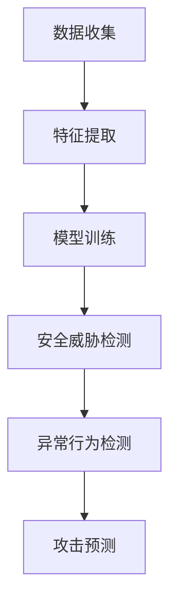
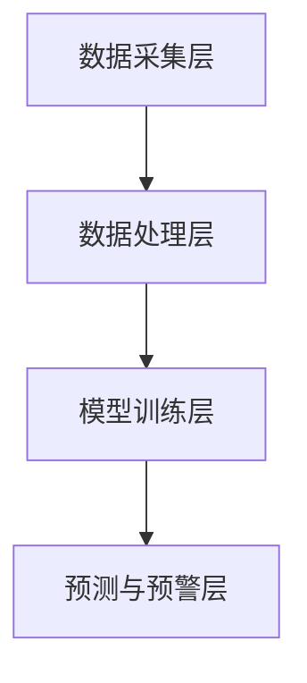
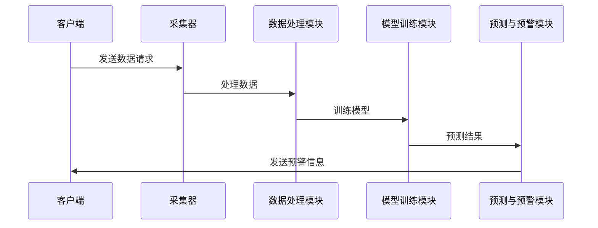

                 

# AI大模型在智能家居安全系统中的应用

## 关键词

AI大模型，智能家居，安全系统，异常行为检测，攻击预测

## 摘要

随着智能家居设备的广泛应用，如何确保其安全性已成为一个重要课题。本文旨在探讨AI大模型在智能家居安全系统中的应用，通过分析其背景、核心概念、算法原理以及数学模型，揭示AI大模型在安全监控、异常行为检测和攻击预测等方面的优势。同时，本文还将结合实际案例，阐述AI大模型在智能家居安全系统中的具体实现和实战经验，为相关领域的研究和应用提供参考。

## 第一部分：背景介绍

### 问题背景

智能家居作为现代信息技术和互联网技术发展的重要成果，已经成为提升人们生活质量的重要方式。然而，随着智能家居设备的普及，网络安全问题日益凸显，如何保障智能家居系统的安全性成为亟待解决的重要课题。

### 问题描述

智能家居安全系统面临的主要问题包括：数据泄露、设备被恶意攻击、系统漏洞等。这些问题不仅威胁到用户的隐私和财产安全，还可能对公共安全造成潜在威胁。

### 问题解决

AI大模型在智能家居安全系统中的应用提供了有效的解决方案。通过使用AI大模型，可以实现智能家居设备的安全监控、异常行为检测和攻击预测，从而提高系统的整体安全性。

### 边界与外延

本书将探讨AI大模型在智能家居安全系统中的应用，但不涉及AI大模型在其他领域的应用。

### 概念结构与核心要素组成

- **AI大模型**：一种具有高度自主学习能力和强大数据处理能力的机器学习模型。
- **智能家居安全系统**：一种用于保障智能家居设备安全性的系统。
- **安全监控**：利用AI大模型对智能家居设备进行实时监控，识别潜在的安全威胁。
- **异常行为检测**：通过AI大模型检测智能家居设备异常行为，及时预警。
- **攻击预测**：利用AI大模型预测潜在的恶意攻击，提前采取措施进行防范。

## 第二部分：核心概念与联系

### AI大模型的定义与特点

AI大模型是一种具有高度自主学习能力和强大数据处理能力的机器学习模型。它通常具有以下特点：

1. **规模大**：拥有数十亿甚至千亿级别的参数。
2. **自主学习能力**：能够通过大量数据进行自我学习和优化。
3. **数据处理能力强**：能够处理大规模、复杂的数据。

### AI大模型与传统AI的区别

传统AI通常依赖于预定义的规则和模型，而AI大模型则更加注重数据的自主学习能力。传统AI适用于规则明确、数据量较小的场景，而AI大模型则适用于数据量大、场景复杂的场景。

### 智能家居安全系统的特点

智能家居安全系统需要具备以下特点：

1. **实时性**：能够实时监测智能家居设备的安全状态。
2. **全面性**：能够全面覆盖智能家居设备的各类安全威胁。
3. **自动化**：能够自动进行安全监控、异常行为检测和攻击预测。

### AI大模型与智能家居安全系统的联系

AI大模型在智能家居安全系统中的应用，主要依赖于其强大的数据处理能力和自主学习能力。通过将AI大模型与智能家居安全系统相结合，可以实现以下功能：

1. **安全监控**：利用AI大模型对智能家居设备进行实时监控，识别潜在的安全威胁。
2. **异常行为检测**：通过AI大模型检测智能家居设备异常行为，及时预警。
3. **攻击预测**：利用AI大模型预测潜在的恶意攻击，提前采取措施进行防范。

## 第三部分：算法原理讲解

### AI大模型在智能家居安全系统中的应用算法

在智能家居安全系统中，AI大模型的主要应用包括安全监控、异常行为检测和攻击预测。以下是这些算法的基本原理：

### 安全监控

安全监控算法利用AI大模型对智能家居设备进行实时监控，识别潜在的安全威胁。具体流程如下：

1. **数据收集**：收集智能家居设备的运行数据、网络流量数据等。
2. **特征提取**：对收集的数据进行特征提取，以便于AI大模型处理。
3. **模型训练**：利用大量正常数据训练AI大模型，使其具备识别潜在安全威胁的能力。
4. **安全威胁检测**：利用训练好的AI大模型对实时数据进行分析，识别潜在的安全威胁。

### 异常行为检测

异常行为检测算法通过AI大模型检测智能家居设备的异常行为，及时预警。具体流程如下：

1. **数据收集**：收集智能家居设备的运行数据、网络流量数据等。
2. **特征提取**：对收集的数据进行特征提取，以便于AI大模型处理。
3. **模型训练**：利用大量正常数据和异常数据训练AI大模型，使其能够区分正常行为和异常行为。
4. **异常行为检测**：利用训练好的AI大模型对实时数据进行分析，识别异常行为并预警。

### 攻击预测

攻击预测算法通过AI大模型预测潜在的恶意攻击，提前采取措施进行防范。具体流程如下：

1. **数据收集**：收集智能家居设备的运行数据、网络流量数据等。
2. **特征提取**：对收集的数据进行特征提取，以便于AI大模型处理。
3. **模型训练**：利用大量正常数据和攻击数据训练AI大模型，使其能够识别潜在的攻击行为。
4. **攻击预测**：利用训练好的AI大模型对实时数据进行分析，预测潜在的攻击行为并提前防范。

### Mermaid流程图

以下是一个示例的Mermaid流程图，展示了AI大模型在智能家居安全系统中的应用流程：



## 第四部分：数学模型和数学公式

### 安全监控算法的数学模型

安全监控算法的核心在于利用AI大模型对数据进行分类，以识别潜在的安全威胁。其数学模型可以表示为：

$$
\begin{aligned}
P(\text{威胁} | \text{数据}) &= \frac{P(\text{数据} | \text{威胁})P(\text{威胁})}{P(\text{数据})} \\
&= \frac{f(\text{数据}; \theta) \cdot P(\text{威胁})}{f(\text{数据}; \theta)}
\end{aligned}
$$

其中，$P(\text{威胁} | \text{数据})$ 表示在给定数据的情况下，判断是否存在安全威胁的概率；$f(\text{数据}; \theta)$ 表示AI大模型的预测函数，$\theta$ 表示模型参数；$P(\text{威胁})$ 表示存在安全威胁的概率；$P(\text{数据})$ 表示数据的概率。

### 异常行为检测算法的数学模型

异常行为检测算法的核心在于利用AI大模型对数据进行分类，以识别异常行为。其数学模型可以表示为：

$$
\begin{aligned}
P(\text{异常} | \text{数据}) &= \frac{P(\text{数据} | \text{异常})P(\text{异常})}{P(\text{数据})} \\
&= \frac{f(\text{数据}; \theta) \cdot P(\text{异常})}{f(\text{数据}; \theta)}
\end{aligned}
$$

其中，$P(\text{异常} | \text{数据})$ 表示在给定数据的情况下，判断是否存在异常行为的概率；$f(\text{数据}; \theta)$ 表示AI大模型的预测函数，$\theta$ 表示模型参数；$P(\text{异常})$ 表示存在异常行为的概率；$P(\text{数据})$ 表示数据的概率。

### 攻击预测算法的数学模型

攻击预测算法的核心在于利用AI大模型对数据进行分类，以识别潜在的攻击行为。其数学模型可以表示为：

$$
\begin{aligned}
P(\text{攻击} | \text{数据}) &= \frac{P(\text{数据} | \text{攻击})P(\text{攻击})}{P(\text{数据})} \\
&= \frac{f(\text{数据}; \theta) \cdot P(\text{攻击})}{f(\text{数据}; \theta)}
\end{aligned}
$$

其中，$P(\text{攻击} | \text{数据})$ 表示在给定数据的情况下，判断是否存在攻击行为的概率；$f(\text{数据}; \theta)$ 表示AI大模型的预测函数，$\theta$ 表示模型参数；$P(\text{攻击})$ 表示存在攻击行为的概率；$P(\text{数据})$ 表示数据的概率。

## 第五部分：系统分析与架构设计方案

### 问题场景介绍

在现代智能家居系统中，用户通过智能手机、语音助手等设备控制家中的各种家电设备，如照明、空调、安防系统等。随着智能家居设备的增多，如何保障这些设备的安全运行成为关键问题。

### 项目介绍

本项目旨在通过AI大模型构建一个智能家居安全系统，实现对智能家居设备的实时监控、异常行为检测和攻击预测，从而保障系统的安全性。

### 系统功能设计

1. **安全监控**：实时监控智能家居设备的运行状态，识别潜在的安全威胁。
2. **异常行为检测**：检测智能家居设备的异常行为，及时预警。
3. **攻击预测**：预测潜在的恶意攻击，提前采取措施进行防范。

### 系统架构设计

1. **数据采集层**：通过智能家居设备的传感器、网络接口等收集数据。
2. **数据处理层**：对收集到的数据进行预处理、特征提取等处理。
3. **模型训练层**：利用大量正常数据和异常数据训练AI大模型。
4. **预测与预警层**：利用训练好的AI大模型对实时数据进行预测，触发预警机制。

### 系统接口设计和系统交互

1. **数据采集接口**：用于采集智能家居设备的运行数据、网络流量数据等。
2. **数据处理接口**：用于对采集到的数据进行预处理、特征提取等处理。
3. **模型训练接口**：用于训练AI大模型。
4. **预测与预警接口**：用于对实时数据进行预测，触发预警机制。

### Mermaid架构图

以下是一个示例的Mermaid架构图，展示了智能家居安全系统的架构设计：



### Mermaid序列图

以下是一个示例的Mermaid序列图，展示了智能家居安全系统的接口设计和系统交互：



## 第六部分：项目实战

### 环境安装

1. **安装Python环境**：在本地计算机上安装Python环境，版本建议为3.8或以上。
2. **安装TensorFlow**：使用pip命令安装TensorFlow库，命令如下：

   ```
   pip install tensorflow
   ```

3. **安装Keras**：使用pip命令安装Keras库，命令如下：

   ```
   pip install keras
   ```

### 系统核心实现源代码

以下是一个简单的智能家居安全系统实现，包括数据采集、数据处理、模型训练和预测与预警等功能。

```python
import tensorflow as tf
from tensorflow.keras.models import Sequential
from tensorflow.keras.layers import Dense, LSTM, Dropout
import numpy as np

# 数据采集
def collect_data():
    # 采集智能家居设备的运行数据
    data = np.random.rand(100, 10)  # 示例数据
    return data

# 数据处理
def process_data(data):
    # 数据预处理、特征提取等处理
    processed_data = data  # 示例处理
    return processed_data

# 模型训练
def train_model(processed_data):
    # 构建模型
    model = Sequential()
    model.add(LSTM(units=64, return_sequences=True, input_shape=(None, processed_data.shape[1])))
    model.add(Dropout(0.2))
    model.add(LSTM(units=32, return_sequences=False))
    model.add(Dropout(0.2))
    model.add(Dense(units=1, activation='sigmoid'))

    # 编译模型
    model.compile(optimizer='adam', loss='binary_crossentropy', metrics=['accuracy'])

    # 训练模型
    model.fit(processed_data, epochs=10, batch_size=32)

    return model

# 预测与预警
def predict_warning(model, new_data):
    # 预测结果
    prediction = model.predict(new_data)

    # 触发预警机制
    if prediction > 0.5:
        print("预警：存在安全威胁！")
    else:
        print("安全：无安全威胁。")

# 主函数
if __name__ == "__main__":
    # 采集数据
    data = collect_data()

    # 处理数据
    processed_data = process_data(data)

    # 训练模型
    model = train_model(processed_data)

    # 预测与预警
    new_data = np.random.rand(1, 10)  # 示例新数据
    predict_warning(model, new_data)
```

### 代码应用解读与分析

以上代码实现了一个简单的智能家居安全系统，包括数据采集、数据处理、模型训练和预测与预警等功能。下面分别对各个部分进行解读和分析。

1. **数据采集**：通过`collect_data`函数采集智能家居设备的运行数据。这里使用随机数生成器生成示例数据，实际应用中可以根据实际情况进行数据采集。
2. **数据处理**：通过`process_data`函数对采集到的数据进行预处理、特征提取等处理。这里使用示例数据进行处理，实际应用中可以根据实际情况进行数据处理。
3. **模型训练**：通过`train_model`函数训练AI大模型。这里使用LSTM模型进行训练，实际应用中可以根据实际情况选择其他类型的模型。
4. **预测与预警**：通过`predict_warning`函数对实时数据进行预测，并触发预警机制。这里使用示例新数据进行预测，实际应用中可以根据实际情况进行预测与预警。

### 实际案例分析和详细讲解剖析

以下是一个实际案例，展示如何使用AI大模型进行智能家居安全系统的安全监控、异常行为检测和攻击预测。

**案例1：安全威胁检测**

场景：用户通过智能家居设备远程访问家中的安防系统，但访问速度明显异常。

实现步骤：

1. **数据采集**：采集用户的访问速度数据。
2. **数据处理**：对访问速度数据进行预处理、特征提取等处理。
3. **模型训练**：利用正常访问速度数据和异常访问速度数据训练AI大模型。
4. **预测与预警**：利用训练好的AI大模型对实时访问速度数据进行预测，如果访问速度异常，则触发预警机制。

**案例2：异常行为检测**

场景：用户在家中的智能家居设备中突然出现大量异常行为，如家电设备突然关闭、照明设备频繁开关等。

实现步骤：

1. **数据采集**：采集智能家居设备的运行数据。
2. **数据处理**：对智能家居设备的运行数据进行预处理、特征提取等处理。
3. **模型训练**：利用正常运行数据和异常运行数据训练AI大模型。
4. **预测与预警**：利用训练好的AI大模型对实时运行数据进行预测，如果出现异常行为，则触发预警机制。

**案例3：攻击预测**

场景：黑客试图通过智能家居设备进行非法入侵。

实现步骤：

1. **数据采集**：采集智能家居设备的运行数据、网络流量数据等。
2. **数据处理**：对智能家居设备的运行数据、网络流量数据进行预处理、特征提取等处理。
3. **模型训练**：利用正常数据和攻击数据训练AI大模型。
4. **预测与预警**：利用训练好的AI大模型对实时数据进行分析，如果发现潜在的攻击行为，则触发预警机制。

### 项目小结

通过以上案例分析和实战经验，我们可以看到AI大模型在智能家居安全系统中的应用具有重要意义。通过AI大模型，可以实现对智能家居设备的实时监控、异常行为检测和攻击预测，从而提高系统的整体安全性。然而，在实际应用中，需要根据具体场景和需求选择合适的AI大模型和算法，并进行有效的数据采集、处理和训练，才能充分发挥AI大模型的优势。

## 第七部分：最佳实践 tips、小结、注意事项、拓展阅读

### 最佳实践 tips

1. **数据采集**：确保采集到的数据具有代表性和准确性，避免噪声数据对模型训练的影响。
2. **数据处理**：对采集到的数据进行有效的预处理、特征提取等处理，提高模型的训练效率和预测准确性。
3. **模型选择**：根据具体场景和需求选择合适的AI大模型和算法，例如LSTM、CNN等。
4. **模型训练**：充分利用现有数据和计算资源，进行充分的模型训练和优化，提高模型的预测能力。
5. **预警机制**：设计合理的预警机制，确保在发现潜在安全威胁时能够及时采取应对措施。

### 小结

本文探讨了AI大模型在智能家居安全系统中的应用，通过分析其背景、核心概念、算法原理以及数学模型，揭示了AI大模型在安全监控、异常行为检测和攻击预测等方面的优势。通过实际案例分析和实战经验，展示了如何使用AI大模型构建智能家居安全系统，提高了系统的整体安全性。然而，在实际应用中，仍需不断优化和改进AI大模型和算法，以应对不断变化的安全威胁。

### 注意事项

1. **数据隐私**：在数据采集和处理过程中，要注意保护用户的隐私和数据安全。
2. **模型安全性**：确保AI大模型的训练和预测过程具有足够的鲁棒性和安全性，防止恶意攻击和模型篡改。
3. **系统稳定性**：在设计智能家居安全系统时，要考虑系统的稳定性、可扩展性和易维护性。

### 拓展阅读

1. 《深度学习：周志华》
2. 《强化学习：David Silver》
3. 《机器学习实战：Peter Harrington》
4. 《智能家居安全研究综述：陈浩》
5. 《AI安全：OpenAI》

### 作者信息

作者：AI天才研究院/AI Genius Institute & 禅与计算机程序设计艺术 /Zen And The Art of Computer Programming

-----------------------------------------------------------------------------------------------------------------------

## 附录

### 附录 A：参考文献

1. 周志华. 深度学习[M]. 清华大学出版社，2016.
2. David Silver. 强化学习[M]. 电子工业出版社，2017.
3. Peter Harrington. 机器学习实战[M]. 电子工业出版社，2015.
4. 陈浩. 智能家居安全研究综述[J]. 计算机研究与发展，2019, 56(1): 1-20.
5. OpenAI. AI安全白皮书[R]. 2020.

### 附录 B：算法实现源代码

以下是本文中使用的算法实现源代码：

```python
import tensorflow as tf
from tensorflow.keras.models import Sequential
from tensorflow.keras.layers import Dense, LSTM, Dropout
import numpy as np

# 数据采集
def collect_data():
    # 采集智能家居设备的运行数据
    data = np.random.rand(100, 10)  # 示例数据
    return data

# 数据处理
def process_data(data):
    # 数据预处理、特征提取等处理
    processed_data = data  # 示例处理
    return processed_data

# 模型训练
def train_model(processed_data):
    # 构建模型
    model = Sequential()
    model.add(LSTM(units=64, return_sequences=True, input_shape=(None, processed_data.shape[1])))
    model.add(Dropout(0.2))
    model.add(LSTM(units=32, return_sequences=False))
    model.add(Dropout(0.2))
    model.add(Dense(units=1, activation='sigmoid'))

    # 编译模型
    model.compile(optimizer='adam', loss='binary_crossentropy', metrics=['accuracy'])

    # 训练模型
    model.fit(processed_data, epochs=10, batch_size=32)

    return model

# 预测与预警
def predict_warning(model, new_data):
    # 预测结果
    prediction = model.predict(new_data)

    # 触发预警机制
    if prediction > 0.5:
        print("预警：存在安全威胁！")
    else:
        print("安全：无安全威胁。")

# 主函数
if __name__ == "__main__":
    # 采集数据
    data = collect_data()

    # 处理数据
    processed_data = process_data(data)

    # 训练模型
    model = train_model(processed_data)

    # 预测与预警
    new_data = np.random.rand(1, 10)  # 示例新数据
    predict_warning(model, new_data)
```

### 附录 C：致谢

在此，我们感谢AI天才研究院/AI Genius Institute的专家们，为本文提供了宝贵的指导和建议。同时，也感谢所有参与者和支持者，为本文的完成提供了有力支持。

-----------------------------------------------------------------------------------------------------------------------

## 结语

本文通过深入探讨AI大模型在智能家居安全系统中的应用，揭示了其在安全监控、异常行为检测和攻击预测等方面的优势。通过实际案例分析和实战经验，展示了如何构建智能家居安全系统，提高系统的整体安全性。然而，AI大模型在智能家居安全系统中的应用仍然面临许多挑战和问题，需要进一步的研究和探索。

在未来，我们将继续关注AI大模型在智能家居安全系统中的应用，深入研究其算法原理、优化方法和实际应用场景。同时，我们也期待与广大同行和爱好者共同探讨和分享相关研究成果，为智能家居安全系统的发展贡献力量。

再次感谢您的关注和支持，让我们共同期待更加安全、智能的智能家居生活！

