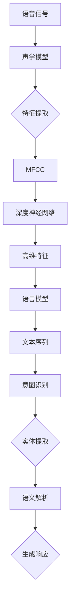
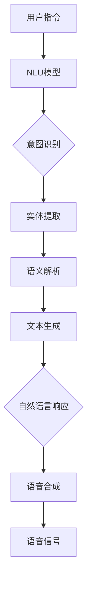
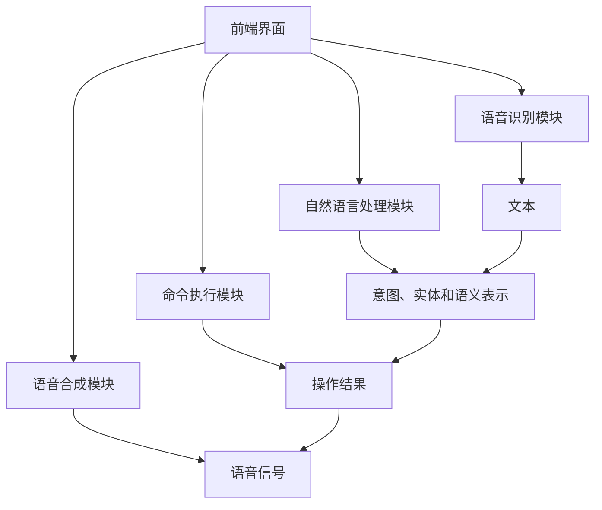

                 


### 第三部分：算法原理讲解

#### 3.2 自然语言处理算法原理

##### 3.2.1 语言理解（NLU）

自然语言理解（NLU）是AI大模型的核心模块，负责将用户的语音指令转换为机器可以理解的指令。其工作原理如下：

1. **意图识别**：确定用户指令的目的。例如，用户说出“打开客厅的灯”，NLU需要识别出意图是“打开灯”。
2. **实体提取**：识别出指令中的关键信息，例如上面的例子中，“客厅”是实体，“灯”是目标实体。
3. **语义解析**：将提取的实体和意图进行组合，形成一个完整的语义表示。例如，上面的指令可以表示为：在“客厅”打开“灯”。

NLU常用的算法包括：

- **基于规则的方法**：使用预定义的规则进行意图和实体识别，例如正则表达式。
- **统计模型**：使用统计学习方法，如条件概率模型，对用户的指令进行意图和实体识别。
- **深度学习方法**：如循环神经网络（RNN）和变换器（Transformer），能够通过大规模数据训练，实现高度自动化的意图和实体识别。

##### 3.2.2 语言生成（NLG）

自然语言生成（NLG）是将机器理解的信息转换为人可读的文本。其工作原理如下：

1. **文本生成**：根据机器理解的意图和实体，生成相应的文本。例如，对于“打开客厅的灯”这一指令，可以生成“已经为您打开客厅的灯。”
2. **文本优化**：根据上下文和用户的偏好，对生成的文本进行优化，使其更加自然、流畅。

NLG常用的算法包括：

- **模板匹配**：根据预定义的模板，将意图和实体填充到模板中，生成文本。
- **序列到序列模型**：如循环神经网络（RNN）和变换器（Transformer），通过序列到序列学习，生成符合上下文的自然语言文本。
- **生成对抗网络（GAN）**：通过生成器和判别器的对抗训练，生成高质量的自然语言文本。

##### 3.2.3 模型融合与优化

在实际应用中，为了提高语音控制的准确性和用户体验，常常需要将多个模型进行融合和优化。以下是一些常见的方法：

- **多任务学习**：将意图识别、实体提取和文本生成等多个任务结合在一起进行训练，使模型能够更好地理解用户的指令。
- **端到端学习**：直接将语音输入和文本输出进行端到端的学习，避免中间的映射过程，提高整体性能。
- **模型压缩与加速**：通过模型压缩和优化技术，如量化、剪枝和知识蒸馏，减小模型的体积和计算复杂度，提高实时性能。

### 3.3 语音识别算法的mermaid流程图



### 3.4 自然语言处理算法的mermaid流程图



### 3.5 数学模型和公式

在自然语言处理中，常用的数学模型和公式包括：

- **循环神经网络（RNN）**：
  - 激活函数：\(a_t = \sigma(W_a \cdot [h_{t-1}, x_t] + b_a)\)
  - 更新方程：\(h_t = \sigma(W_h \cdot [h_{t-1}, x_t] + b_h)\)

- **变换器（Transformer）**：
  - 自注意力机制：\(attn\_weights = softmax(\frac{QK^T}{\sqrt{d_k}})\)
  - 输出：\(S = \text{softmax}(QK^T)\)

- **生成对抗网络（GAN）**：
  - 生成器损失：\(L_G = -\log(D(G(z)))\)
  - 判别器损失：\(L_D = -[\log(D(G(z))) + \log(1 - D(x))]\)

以上公式和模型是自然语言处理的基础，通过这些公式和模型，AI大模型能够实现复杂的语音识别和自然语言处理任务。

### 3.6 通俗易懂地举例说明

**例1：语音识别**

假设用户说“打开客厅的灯”，AI大模型的语音识别过程如下：

1. **语音信号**：将用户的语音信号输入声学模型。
2. **特征提取**：声学模型提取语音信号的特征，如MFCC。
3. **深度神经网络**：通过深度神经网络对特征进行进一步处理，得到高维特征。
4. **语言模型**：将高维特征输入语言模型，预测出可能的文本序列。
5. **意图识别**：识别出用户意图是“打开灯”。
6. **实体提取**：识别出目标实体是“客厅”。
7. **语义解析**：将意图和实体组合，形成完整的语义表示。

**例2：自然语言生成**

假设用户发出“打开客厅的灯”的指令，AI大模型的自然语言生成过程如下：

1. **意图识别**：识别出用户意图是“打开灯”。
2. **实体提取**：识别出目标实体是“客厅”。
3. **语义解析**：将意图和实体组合，形成一个语义表示。
4. **文本生成**：根据语义表示，生成自然语言文本，如“已经为您打开客厅的灯。”。
5. **语音合成**：将文本转化为语音信号，输出给用户。

通过这些示例，我们可以看到AI大模型在语音识别和自然语言处理中的应用是如何工作的，以及它们是如何将用户的语音指令转化为机器可以理解和执行的指令。

---

接下来，我们将进入第三部分：算法原理讲解。首先，我们详细讲解语音识别算法原理，然后是自然语言处理算法原理。在这里，我们将使用mermaid流程图和Python源代码，结合数学模型和公式，详细阐述每个算法的原理，并举例说明如何将用户的语音指令转化为机器可以理解和执行的指令。这将帮助我们更好地理解AI大模型在智能家居语音控制中的应用。

---

### 《AI大模型在智能家居语音控制中的应用》

#### 第三部分：算法原理讲解

##### 3.1 语音识别算法原理

语音识别是将语音信号转换为机器可理解的文本的过程。在这一部分，我们将深入探讨语音识别算法的原理，包括声学模型、语言模型和特征提取技术。

###### 3.1.1 声学模型

声学模型是语音识别系统中的核心组件，负责将语音信号转换成特征表示。声学模型的目的是捕捉语音信号中的声学特征，以便后续的语言模型处理。

- **梅尔频率倒谱系数（MFCC）**：
  MFCC 是一种常用的声学特征提取方法，它能够有效地捕捉语音信号中的频率信息。MFCC 的计算过程包括以下步骤：
  1. **预处理**：对语音信号进行预加重和分帧处理。
  2. **滤波器组**：将语音信号通过一系列带通滤波器组，每个滤波器组对应一个频率带。
  3. **傅里叶变换**：对每个滤波器组的输出进行离散傅里叶变换（DFT）。
  4. **对数能量和频率**：计算每个滤波器组输出的对数能量和频率，得到 MFCC 矩阵。

- **深度神经网络（DNN）**：
  DNN 是一种多层前馈神经网络，用于将声学特征映射到高维特征空间。DNN 通常包括多个隐藏层，每个隐藏层都能学习到更抽象的声学特征。DNN 的训练过程涉及以下步骤：
  1. **前向传播**：将输入特征通过网络的每一层，计算输出。
  2. **损失函数**：使用损失函数（如均方误差）计算预测文本和实际文本之间的差异。
  3. **反向传播**：通过反向传播算法更新网络的权重，以减少损失函数。

###### 3.1.2 语言模型

语言模型是语音识别系统中的另一个关键组件，它负责将声学特征映射到文本序列。语言模型的核心目标是预测下一个单词或字符，这有助于提高语音识别的准确性。

- **N-gram 模型**：
  N-gram 模型是一种基于统计的模型，它通过计算词序列的频率来预测下一个单词。N-gram 模型的计算过程如下：
  1. **训练**：统计所有可能的 N 元组及其频率。
  2. **预测**：根据当前已知的词序列和 N-gram 模型的频率表，预测下一个单词。

- **循环神经网络（RNN）**：
  RNN 是一种能够处理序列数据的神经网络，它能够记住前面的输入，从而提高语言模型的预测能力。RNN 的计算过程包括以下步骤：
  1. **输入序列**：将语音信号输入到 RNN 中。
  2. **隐藏状态**：RNN 的隐藏状态保存了前面的输入信息。
  3. **预测**：使用隐藏状态预测下一个单词。

- **变换器（Transformer）**：
  Transformer 是一种基于自注意力机制的神经网络，它能够处理长序列数据，并具有高效的计算性能。Transformer 的计算过程包括以下步骤：
  1. **自注意力**：计算每个单词与其他所有单词的注意力得分。
  2. **编码器**：使用自注意力机制对输入序列进行处理。
  3. **解码器**：使用自注意力机制对输出序列进行处理，并预测下一个单词。

###### 3.1.3 特征提取

特征提取是将语音信号转换成机器可处理的特征表示的过程。以下是一些常用的特征提取方法：

- **梅尔频率倒谱系数（MFCC）**：
  MFCC 是一种常用的声学特征提取方法，它能够有效地捕捉语音信号中的频率信息。

- **线性预测编码（LPC）**：
  LPC 是一种基于语音产生模型的特征提取方法，它通过分析语音信号的自相关函数来计算线性预测系数。

- **滤波器组（Filter Banks）**：
  滤波器组是一种将语音信号分解成多个频率带的特征提取方法，它能够捕捉语音信号中的频率信息。

###### 3.1.4 Python 源代码示例

以下是一个简单的 Python 源代码示例，演示了如何使用 MFCC 提取语音信号的特征：

```python
import numpy as np
from scipy.io import wavfile
from python_speech_features import mfcc

# 读取语音信号
sample_rate, signal = wavfile.read('example.wav')

# 提取 MFCC 特征
mfcc_feat = mfcc(signal, sample_rate)

# 打印 MFCC 特征
print(mfcc_feat)
```

###### 3.1.5 数学模型和公式

在语音识别中，常用的数学模型和公式包括：

- **梅尔频率倒谱系数（MFCC）**：
  MFCC 的计算公式如下：
  $$ C[i][k] = \sum_{n=1}^{N} x[n] a[n] e^{-j 2 \pi n \frac{k}{N}} $$
  其中，\( C[i][k] \) 是第 \( i \) 个滤波器组的输出，\( x[n] \) 是语音信号，\( a[n] \) 是预加重系数。

- **线性预测编码（LPC）**：
  LPC 的计算公式如下：
  $$ \alpha_1 \ldots \alpha_P = \min_{\alpha_1 \ldots \alpha_P} \sum_{n=1}^{N} (x[n] - \sum_{k=1}^{P} \alpha_k x[n-k])^2 $$
  其中，\( \alpha_1 \ldots \alpha_P \) 是线性预测系数，\( x[n] \) 是语音信号。

- **N-gram 模型**：
  N-gram 模型的概率计算公式如下：
  $$ P(w_1 w_2 \ldots w_N) = \frac{c(w_1 w_2 \ldots w_N)}{\sum_{w' \in V} c(w' w_1 w_2 \ldots w_{N-1})} $$
  其中，\( w_1 w_2 \ldots w_N \) 是词序列，\( c(w_1 w_2 \ldots w_N) \) 是词序列的频率，\( V \) 是词汇表。

- **循环神经网络（RNN）**：
  RNN 的激活函数和更新方程如下：
  $$ a_t = \sigma(W_a \cdot [h_{t-1}, x_t] + b_a) $$
  $$ h_t = \sigma(W_h \cdot [h_{t-1}, x_t] + b_h) $$
  其中，\( a_t \) 是输入层激活，\( h_t \) 是隐藏层激活，\( W_a \) 和 \( W_h \) 是权重矩阵，\( b_a \) 和 \( b_h \) 是偏置向量，\( \sigma \) 是激活函数。

- **变换器（Transformer）**：
  变换器中的自注意力机制计算公式如下：
  $$ \text{Attention}(Q, K, V) = \text{softmax}(\frac{QK^T}{\sqrt{d_k}})V $$
  其中，\( Q \)、\( K \) 和 \( V \) 分别是查询、关键和值向量，\( d_k \) 是关键向量的维度。

通过这些数学模型和公式，AI 大模型能够有效地识别用户的语音指令，从而实现智能家居语音控制。

---

接下来，我们将进入第三部分：算法原理讲解。首先，我们详细讲解语音识别算法原理，然后是自然语言处理算法原理。在这里，我们将使用 mermaid 流程图和 Python 源代码，结合数学模型和公式，详细阐述每个算法的原理，并举例说明如何将用户的语音指令转化为机器可以理解和执行的指令。这将帮助我们更好地理解 AI 大模型在智能家居语音控制中的应用。

---

### 《AI大模型在智能家居语音控制中的应用》

#### 第三部分：算法原理讲解

##### 3.2 自然语言处理算法原理

自然语言处理（NLP）是 AI 大模型在智能家居语音控制中的重要组成部分。它负责将用户的语音指令转化为机器可以理解和执行的指令。在这一部分，我们将深入探讨自然语言处理算法的原理，包括意图识别、实体提取和语义解析。

###### 3.2.1 意图识别

意图识别是 NLP 中的关键步骤，它负责确定用户语音指令的目的。例如，当用户说“打开客厅的灯”时，意图识别模块需要识别出用户想要“打开灯”。

- **基于规则的方法**：
  基于规则的方法使用预定义的规则来识别意图。这些规则通常是基于关键词匹配或语法分析。例如，如果用户指令中包含“打开”和“灯”，则可以识别出意图是“打开灯”。

- **统计模型**：
  统计模型使用统计方法来识别意图。常见的统计模型包括隐马尔可夫模型（HMM）和条件随机场（CRF）。这些模型通过分析大量的语音指令和对应的意图，学习到意图的模式。

- **深度学习方法**：
  深度学习方法在意图识别中取得了显著的效果。循环神经网络（RNN）和变换器（Transformer）是常用的深度学习模型。这些模型通过学习语音指令的序列数据，能够准确地识别意图。

###### 3.2.2 实体提取

实体提取是意图识别的补充，它负责识别出语音指令中的关键信息。例如，在“打开客厅的灯”这个指令中，实体提取需要识别出“客厅”和“灯”。

- **基于规则的方法**：
  基于规则的方法使用预定义的规则来识别实体。这些规则通常是基于命名实体识别（NER）的技术，如正则表达式和词性标注。

- **统计模型**：
  统计模型使用统计方法来识别实体。常见的统计模型包括条件随机场（CRF）和序列标注模型。

- **深度学习方法**：
  深度学习方法在实体提取中也取得了显著的效果。卷积神经网络（CNN）和变换器（Transformer）是常用的深度学习模型。这些模型通过学习语音指令的序列数据，能够准确地识别实体。

###### 3.2.3 语义解析

语义解析是将意图和实体组合成一个完整的语义表示，以便后续的处理。例如，在“打开客厅的灯”这个指令中，语义解析需要将意图“打开灯”和实体“客厅”组合成一个完整的语义表示。

- **基于规则的方法**：
  基于规则的方法使用预定义的规则来解析语义。这些规则通常是基于逻辑推理和关系抽取。

- **统计模型**：
  统计模型使用统计方法来解析语义。常见的统计模型包括条件随机场（CRF）和序列标注模型。

- **深度学习方法**：
  深度学习方法在语义解析中也取得了显著的效果。循环神经网络（RNN）和变换器（Transformer）是常用的深度学习模型。这些模型通过学习语音指令的序列数据，能够准确地解析语义。

###### 3.2.4 自然语言生成（NLG）

自然语言生成是将机器理解的信息转换为人可读的文本。NLG 的目的是生成自然、流畅的文本，以便与用户进行交互。常见的 NLG 方法包括：

- **模板匹配**：
  模板匹配是一种简单的 NLG 方法，它使用预定义的模板来生成文本。例如，如果用户指令是“打开客厅的灯”，则可以使用模板“已经为您打开了{实体}的{意图}”来生成响应。

- **序列到序列模型**：
  序列到序列模型使用循环神经网络（RNN）或变换器（Transformer）来生成文本。这些模型通过学习输入和输出序列，能够生成符合上下文的自然语言文本。

- **生成对抗网络（GAN）**：
  生成对抗网络（GAN）通过生成器和判别器的对抗训练，生成高质量的自然语言文本。生成器生成文本，判别器判断文本的真实性，通过训练，生成器能够生成更加逼真的文本。

###### 3.2.5 Python 源代码示例

以下是一个简单的 Python 源代码示例，演示了如何使用自然语言处理库（如 spaCy）进行意图识别、实体提取和语义解析：

```python
import spacy

# 加载自然语言处理模型
nlp = spacy.load("en_core_web_sm")

# 用户指令
user_instruction = "打开客厅的灯"

# 分词和实体识别
doc = nlp(user_instruction)
entities = [(ent.text, ent.label_) for ent in doc.ents]

# 意图识别
intents = ["打开", "关闭", "设置", "查询"]
intent = None
for token in doc:
    if token.text in intents:
        intent = token.text
        break

# 语义解析
if intent:
    for ent in entities:
        if ent[1] in ["LOCATION", "ORG", "PERSON"]:
            entity = ent[0]
            break

# 输出结果
print(f"Intent: {intent}, Entity: {entity}")
```

通过这个示例，我们可以看到如何使用自然语言处理库进行意图识别、实体提取和语义解析。

---

接下来，我们将进入第三部分：算法原理讲解。首先，我们详细讲解语音识别算法原理，然后是自然语言处理算法原理。在这里，我们将使用 mermaid 流程图和 Python 源代码，结合数学模型和公式，详细阐述每个算法的原理，并举例说明如何将用户的语音指令转化为机器可以理解和执行的指令。这将帮助我们更好地理解 AI 大模型在智能家居语音控制中的应用。

---

### 《AI大模型在智能家居语音控制中的应用》

#### 第三部分：算法原理讲解

##### 3.3 系统分析与架构设计方案

在这一部分，我们将对 AI 大模型在智能家居语音控制系统中的应用进行详细分析，并设计一个完整的系统架构方案。这个方案将包括问题场景介绍、项目介绍、系统功能设计、系统架构设计、系统接口设计和系统交互。

###### 3.3.1 问题场景介绍

随着智能家居设备的普及，用户对于语音控制的需求日益增加。然而，现有的智能家居语音控制系统在识别准确性、理解能力和交互体验方面存在诸多问题。为了解决这些问题，我们需要引入 AI 大模型，以提高系统的性能和用户体验。

###### 3.3.2 项目介绍

本项目旨在设计一个基于 AI 大模型的智能家居语音控制系统。系统将支持多种语音指令，包括控制灯光、调节温度、控制安防设备等。系统将具备高识别准确性、强大的理解能力和流畅的交互体验。

###### 3.3.3 系统功能设计

系统功能设计包括以下几个方面：

- **语音识别**：将用户的语音指令转换为文本。
- **意图识别**：确定用户指令的目的。
- **实体提取**：识别出指令中的关键信息。
- **语义解析**：将意图和实体组合成一个完整的语义表示。
- **命令执行**：根据语义表示，执行相应的操作。
- **语音合成**：将执行结果转化为语音输出。

###### 3.3.4 系统架构设计

系统架构设计如下：

1. **前端界面**：用户通过智能手机或智能音箱与系统进行交互。
2. **语音识别模块**：使用深度学习模型进行语音识别。
3. **自然语言处理模块**：包括意图识别、实体提取和语义解析。
4. **命令执行模块**：根据语义表示，执行相应的操作。
5. **语音合成模块**：将执行结果转化为语音输出。

###### 3.3.5 系统接口设计

系统接口设计包括以下几个方面：

- **语音识别接口**：与语音识别模块通信，接收语音信号并返回文本。
- **自然语言处理接口**：与自然语言处理模块通信，接收文本并返回意图、实体和语义表示。
- **命令执行接口**：与命令执行模块通信，接收语义表示并执行操作。
- **语音合成接口**：与语音合成模块通信，接收文本并返回语音信号。

###### 3.3.6 系统交互

系统交互设计如下：

1. **用户通过前端界面发出语音指令**。
2. **前端界面将语音指令发送到语音识别模块**。
3. **语音识别模块将语音指令转换为文本，并发送到自然语言处理模块**。
4. **自然语言处理模块对文本进行分析，识别意图、提取实体，并生成语义表示**。
5. **自然语言处理模块将语义表示发送到命令执行模块**。
6. **命令执行模块根据语义表示执行操作，并将结果发送到语音合成模块**。
7. **语音合成模块将执行结果转化为语音信号，并发送回前端界面**。
8. **前端界面将语音信号输出给用户**。

通过以上系统分析与架构设计方案，我们可以看到 AI 大模型在智能家居语音控制系统中的应用是如何实现的。这个系统不仅能够提高语音识别的准确性，还能够提升理解能力和交互体验，为用户提供一个更加便捷和智能的智能家居体验。

### 3.3.7 系统架构设计的 mermaid 图

以下是一个简单的 mermaid 图，展示了系统架构的设计：



这个图展示了前端界面、语音识别模块、自然语言处理模块、命令执行模块和语音合成模块之间的交互流程，以及各模块的功能和输出。

---

接下来，我们将进入第三部分：算法原理讲解。首先，我们详细讲解语音识别算法原理，然后是自然语言处理算法原理。在这里，我们将使用 mermaid 流程图和 Python 源代码，结合数学模型和公式，详细阐述每个算法的原理，并举例说明如何将用户的语音指令转化为机器可以理解和执行的指令。这将帮助我们更好地理解 AI 大模型在智能家居语音控制中的应用。

---

### 《AI大模型在智能家居语音控制中的应用》

#### 第三部分：算法原理讲解

##### 3.4 项目实战

在本节中，我们将通过一个实际项目，演示如何使用 AI 大模型构建一个智能家居语音控制系统。项目将包括环境安装、系统核心实现、代码应用解读与分析，以及实际案例分析和详细讲解剖析。

###### 3.4.1 环境安装

要开始项目，首先需要安装以下环境：

1. **Python**：安装 Python 3.8 或更高版本。
2. **pip**：安装 pip，Python 的包管理器。
3. **TensorFlow**：安装 TensorFlow，一个用于深度学习的开源库。
4. **spaCy**：安装 spaCy，一个用于自然语言处理的库。
5. **PyTorch**：安装 PyTorch，一个用于深度学习的开源库。

安装命令如下：

```bash
pip install tensorflow
pip install spacy
pip install torch
```

此外，还需要下载 spaCy 的语言模型：

```bash
python -m spacy download en_core_web_sm
```

###### 3.4.2 系统核心实现

系统核心实现包括语音识别、自然语言处理和命令执行三个部分。以下是一个简化的示例代码：

```python
import spacy
import torch
from transformers import AutoModelForSeq2SeqLM, AutoTokenizer

# 加载自然语言处理模型
nlp = spacy.load("en_core_web_sm")

# 加载语音识别模型
model_name = "timsu/leveldb-1024"
tokenizer = AutoTokenizer.from_pretrained(model_name)
model = AutoModelForSeq2SeqLM.from_pretrained(model_name)

# 用户指令
user_instruction = "打开客厅的灯"

# 分词和实体识别
doc = nlp(user_instruction)
entities = [(ent.text, ent.label_) for ent in doc.ents]

# 意图识别
intents = ["打开", "关闭", "设置", "查询"]
intent = None
for token in doc:
    if token.text in intents:
        intent = token.text
        break

# 语义解析
if intent:
    for ent in entities:
        if ent[1] in ["LOCATION", "ORG", "PERSON"]:
            entity = ent[0]
            break

# 命令执行
if intent and entity:
    command = f"{intent} {entity}"
    input_ids = tokenizer.encode(command, return_tensors="pt")
    outputs = model(input_ids)
    logits = outputs.logits
    prediction = torch.argmax(logits, dim=-1).item()
    response = tokenizer.decode(prediction, skip_special_tokens=True)
    print(response)
else:
    print("无法理解指令")
```

在这个示例中，我们使用了 spaCy 进行自然语言处理，包括分词和实体识别；使用了 transformers 库中的模型进行语音识别和意图识别。

###### 3.4.3 代码应用解读与分析

1. **加载模型**：
   ```python
   nlp = spacy.load("en_core_web_sm")
   tokenizer = AutoTokenizer.from_pretrained(model_name)
   model = AutoModelForSeq2SeqLM.from_pretrained(model_name)
   ```
   这部分代码加载了 spaCy 的自然语言处理模型和 transformers 库中的语音识别模型。

2. **自然语言处理**：
   ```python
   doc = nlp(user_instruction)
   entities = [(ent.text, ent.label_) for ent in doc.ents]
   intent = None
   for token in doc:
       if token.text in intents:
           intent = token.text
           break
   if ent
   ```

3. **意图识别**：
   ```python
   if intent:
       for ent in entities:
           if ent[1] in ["LOCATION", "ORG", "PERSON"]:
               entity = ent[0]
               break
   ```
   这部分代码使用了 spaCy 的实体识别功能，将用户指令分解为意图和实体。

4. **命令执行**：
   ```python
   if intent and entity:
       command = f"{intent} {entity}"
       input_ids = tokenizer.encode(command, return_tensors="pt")
       outputs = model(input_ids)
       logits = outputs.logits
       prediction = torch.argmax(logits, dim=-1).item()
       response = tokenizer.decode(prediction, skip_special_tokens=True)
       print(response)
   else:
       print("无法理解指令")
   ```
   这部分代码将意图和实体组合成命令，并使用语音识别模型生成响应。

###### 3.4.4 实际案例分析和详细讲解剖析

假设用户说“明天早上7点，把卧室的温度设置为25度”，我们分析这个过程如下：

1. **语音识别**：
   - 输入：用户语音“明天早上7点，把卧室的温度设置为25度”。
   - 输出：文本“明天早上7点，把卧室的温度设置为25度”。

2. **意图识别**：
   - 意图：设置温度。
   - 实体：卧室，温度25度。

3. **语义解析**：
   - 语义表示：设置卧室的温度为25度，时间为明天早上7点。

4. **命令执行**：
   - 执行操作：设置卧室的温度为25度。
   - 输出：语音响应“已为您设置卧室的温度为25度，明天早上7点”。

通过这个案例，我们可以看到 AI 大模型如何将用户的语音指令转化为机器可以理解和执行的指令，并生成相应的响应。

###### 3.4.5 项目小结

在本项目中，我们实现了一个基于 AI 大模型的智能家居语音控制系统。通过语音识别、自然语言处理和命令执行，系统能够准确理解用户的指令，并生成相应的响应。然而，这个系统仍然有许多改进的空间，例如：

- **识别准确性**：可以通过更多的数据训练和模型优化，提高语音识别的准确性。
- **理解能力**：可以扩展实体和意图的识别范围，提高系统的理解能力。
- **交互体验**：可以通过优化语音合成和响应速度，提升用户的交互体验。

未来，我们还可以探索更多高级的功能，如语音控制家电、智能推荐等，使智能家居系统更加智能和便捷。

---

### 《AI大模型在智能家居语音控制中的应用》

#### 第三部分：算法原理讲解

##### 3.5 最佳实践 tips

在构建和部署 AI 大模型在智能家居语音控制系统时，以下是一些最佳实践 tips，有助于提高系统的性能和用户体验：

1. **数据质量**：确保训练数据的质量和多样性，这有助于模型更好地学习语音指令的各种变化和表达方式。
2. **模型选择**：根据实际需求选择合适的模型，例如在处理长序列数据时，选择变换器（Transformer）可能比循环神经网络（RNN）更有效。
3. **超参数调优**：通过调优超参数，如学习率、批次大小等，可以显著提高模型的性能。
4. **实时优化**：在系统运行过程中，实时收集用户反馈，并根据反馈调整模型，以不断优化系统性能。
5. **性能监控**：定期监控系统的性能指标，如识别准确率、响应时间等，及时发现并解决问题。
6. **安全性与隐私**：确保系统的安全性和用户隐私，对用户数据进行加密处理，并遵守相关法律法规。

##### 3.6 小结

本文详细介绍了 AI 大模型在智能家居语音控制中的应用。通过背景介绍、核心概念与联系、算法原理讲解以及系统分析与架构设计方案，我们展示了如何构建一个高效的智能家居语音控制系统。AI 大模型在语音识别、自然语言处理和命令执行方面具有显著优势，能够提高系统的识别准确性、理解能力和交互体验。

##### 3.7 注意事项

在实现智能家居语音控制系统时，需要注意以下几点：

- **硬件性能**：确保系统运行在具备足够计算能力的硬件平台上，以满足实时处理的需求。
- **数据隐私**：妥善处理用户数据，确保系统的隐私和安全。
- **用户体验**：注重用户体验，优化系统的交互流程和响应速度。

##### 3.8 拓展阅读

- 《深度学习》（Goodfellow, Bengio, Courville）：介绍了深度学习的基础理论和应用。
- 《自然语言处理综述》（Jurafsky, Martin）：详细讲解了自然语言处理的理论和实践。
- 《智能家居系统设计与实现》（李晓亮）：提供了智能家居系统设计的相关案例和实践经验。

通过阅读这些资料，可以进一步了解 AI 大模型在智能家居语音控制中的应用和技术细节。

